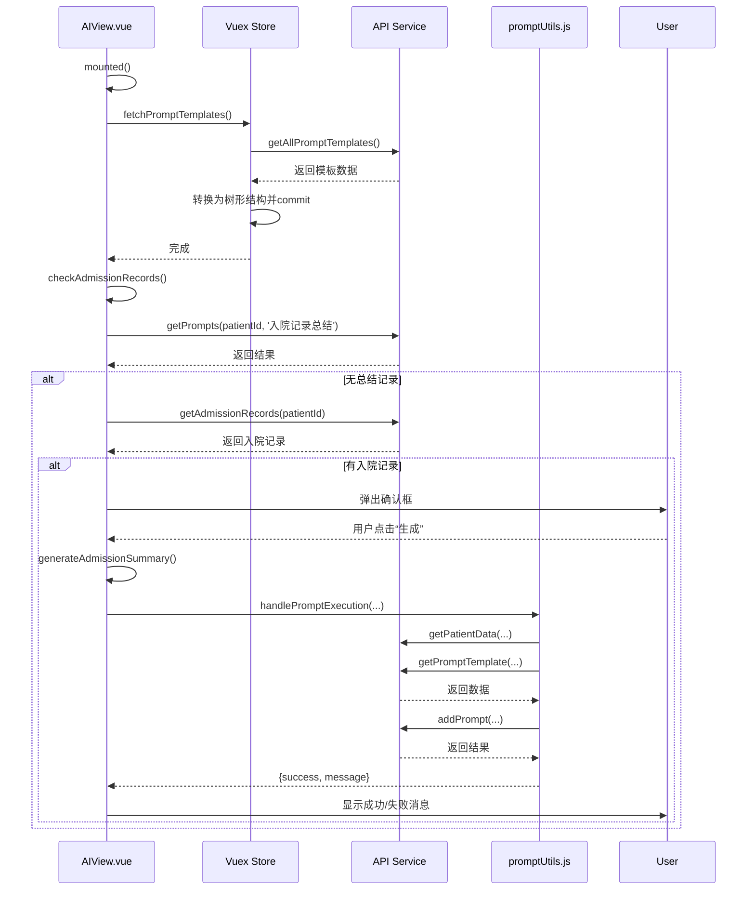

# AI主视图 (AIView.vue)

<cite>
**本文档引用的文件**   
- [AIView.vue](file://src/views/AIView.vue#L1-L174)
- [PromptList.vue](file://src/components/ai/PromptList.vue#L1-L279)
- [AITabs.vue](file://src/components/ai/AITabs.vue#L1-L44)
- [PromptTemplates.vue](file://src/components/ai/PromptTemplates.vue#L1-L109)
- [ai.js (store)](file://src/store/modules/ai.js#L1-L143)
- [ai.js (api)](file://src/api/ai.js#L1-L399)
- [promptUtils.js](file://src/utils/promptUtils.js#L1-L192)
- [AIResults.vue](file://src/components/ai/AIResults.vue#L1-L100)
</cite>

## 目录
1. [简介](#简介)
2. [项目结构](#项目结构)
3. [核心组件](#核心组件)
4. [架构概览](#架构概览)
5. [详细组件分析](#详细组件分析)
6. [依赖分析](#依赖分析)
7. [性能考量](#性能考量)
8. [故障排除指南](#故障排除指南)
9. [结论](#结论)

## 简介
本文档深入解析了医疗AI助手项目中的核心视图组件`AIView.vue`。该组件作为AI功能的主入口，负责协调多个子组件（如`PromptList`、`AITabs`等）的布局与状态管理。文档详细阐述了其生命周期钩子中对患者数据的加载逻辑、与Vuex store的交互方式，以及如何响应用户选择患者并触发AI分析流程。通过代码示例，展示了路由参数的处理、事件总线或状态共享机制的使用，并解释了其在整体MVVM架构中的定位。同时，提供了模板结构解析与关键方法调用链路分析。

## 项目结构
`AIView.vue`位于项目的`src/views`目录下，是应用的一个顶级视图组件。它依赖于`src/components/ai`目录下的多个子组件来构建其用户界面，并通过`src/store/modules/ai.js`进行全局状态管理。其数据流依赖于`src/api/ai.js`中定义的API接口与后端服务通信。工具函数`src/utils/promptUtils.js`则封装了核心的业务逻辑，如执行Prompt模板。

```mermaid
graph TB
subgraph "视图层"
AIView[AIView.vue]
end
subgraph "组件层"
PromptList[PromptList.vue]
AITabs[AITabs.vue]
PromptTemplates[PromptTemplates.vue]
AIResults[AIResults.vue]
end
subgraph "状态管理层"
Store[ai.js (store)]
end
subgraph "服务层"
API[ai.js (api)]
Utils[promptUtils.js]
end
AIView --> PromptList
AIView --> AITabs
AIView --> PromptTemplates
AITabs --> AIResults
AIView --> Store
Store --> API
PromptTemplates --> Utils
AIView --> Utils
```

**Diagram sources**
- [AIView.vue](file://src/views/AIView.vue#L1-L174)
- [PromptList.vue](file://src/components/ai/PromptList.vue#L1-L279)
- [AITabs.vue](file://src/components/ai/AITabs.vue#L1-L44)
- [PromptTemplates.vue](file://src/components/ai/PromptTemplates.vue#L1-L109)
- [ai.js (store)](file://src/store/modules/ai.js#L1-L143)
- [ai.js (api)](file://src/api/ai.js#L1-L399)
- [promptUtils.js](file://src/utils/promptUtils.js#L1-L192)

**Section sources**
- [AIView.vue](file://src/views/AIView.vue#L1-L174)
- [project_structure](file://#L1-L100)

## 核心组件
`AIView.vue`的核心职责是作为AI功能的容器，协调`PromptList`、`AITabs`和`PromptTemplates`三个主要子组件。`PromptList`显示已执行和待执行的Prompt列表，`AITabs`根据当前选中的Prompt展示AI结果或对话，`PromptTemplates`则提供一个可点击的模板树，用于发起新的AI分析任务。该组件通过Vuex store（`ai.js`）作为单一数据源，管理`currentPrompt`和`promptTemplates`等关键状态，确保了各子组件间的状态同步。

**Section sources**
- [AIView.vue](file://src/views/AIView.vue#L1-L174)
- [PromptList.vue](file://src/components/ai/PromptList.vue#L1-L279)
- [AITabs.vue](file://src/components/ai/AITabs.vue#L1-L44)
- [PromptTemplates.vue](file://src/components/ai/PromptTemplates.vue#L1-L109)

## 架构概览
`AIView.vue`遵循典型的MVVM（Model-View-ViewModel）架构模式。`View`由`AIView.vue`及其子组件的模板构成。`ViewModel`是`AIView.vue`组件实例本身，它通过`computed`属性从Vuex store中获取数据（如`currentPatientId`、`promptTemplates`），并通过`methods`处理用户交互。`Model`则由Vuex store（`ai.js`）管理，它封装了应用的状态（如`currentPrompt`）和与后端API的交互逻辑（如`fetchPromptTemplates` action）。这种架构实现了视图与数据的解耦。

```mermaid
graph LR
User[用户] --> View[视图层<br/>AIView.vue + 子组件]
View --> ViewModel[视图模型层<br/>AIView.vue methods/computed]
ViewModel --> Model[模型层<br/>Vuex Store (ai.js)]
Model --> API[API服务<br/>ai.js]
API --> Backend[(后端服务)]
Backend --> API
API --> Model
Model --> ViewModel
ViewModel --> View
```

**Diagram sources**
- [AIView.vue](file://src/views/AIView.vue#L1-L174)
- [ai.js (store)](file://src/store/modules/ai.js#L1-L143)
- [ai.js (api)](file://src/api/ai.js#L1-L399)

## 详细组件分析

### AIView.vue 分析
`AIView.vue`是整个AI功能的主视图，采用`flex`布局将界面划分为三个垂直区域：左侧的`PromptList`、中间的`AITabs`和右侧的`PromptTemplates`。

#### 模板结构解析
其模板结构清晰地定义了三个子组件的引用和数据绑定：
- `PromptList`通过`:patientId="currentPatientId"`接收当前患者ID，并通过`@prompt-selected="handlePromptSelected"`监听用户选择Prompt的事件。
- `AITabs`通过`:currentPrompt="currentPrompt"`接收当前选中的Prompt对象，以决定显示哪个标签页的内容。
- `PromptTemplates`通过`:templates="promptTemplates"`接收从Vuex store获取的模板数据。

#### 生命周期与数据加载
`mounted`生命周期钩子是数据初始化的关键：
1.  **加载模板**：调用`this.fetchPromptTemplates()` action，该action会从`/ai/activePromptTemplates`接口获取所有激活的Prompt模板，并将其转换为树形结构存储在Vuex store中。
2.  **检查入院记录**：调用`this.checkAdmissionRecords()`方法。该方法首先检查是否存在“入院记录总结”，如果不存在但有入院记录，则会弹出一个确认框，提示用户是否立即生成。如果用户确认，则调用`generateAdmissionSummary()`方法。
3.  **恢复状态**：检查Vuex store中是否已有`currentPrompt`，如果有，则将其赋值给本地`data`中的`currentPrompt`，以恢复上一次的视图状态。



**Diagram sources**
- [AIView.vue](file://src/views/AIView.vue#L1-L174)
- [ai.js (store)](file://src/store/modules/ai.js#L1-L143)
- [ai.js (api)](file://src/api/ai.js#L1-L399)
- [promptUtils.js](file://src/utils/promptUtils.js#L1-L192)

**Section sources**
- [AIView.vue](file://src/views/AIView.vue#L1-L174)

### PromptList.vue 分析
`PromptList.vue`组件负责展示与当前患者相关的所有Prompt记录，分为“已执行”和“未执行”两个列表。

#### 数据流与状态管理
该组件通过`props`接收`patientId`，并利用`watch`监听其变化。一旦`patientId`更新，便会触发`loadPromptDetails`方法，调用`getPatientPromptDetails` API获取该患者的所有Prompt详情。获取的数据被处理并分类存入`localPrompts`和`localPendingPrompts`两个本地数据数组中。

#### 事件处理与状态同步
当用户点击某个Prompt时，`selectPrompt`方法被调用。该方法会：
1.  调用`getPatientPromptDetail` API获取该Prompt的完整详细信息。
2.  构建一个包含完整内容的`displayPrompt`对象。
3.  通过`this.SET_CURRENT_PROMPT(displayPrompt)` mutation将该对象提交到Vuex store，更新全局的`currentPrompt`状态。
4.  通过`this.$emit('prompt-selected', displayPrompt)`向父组件`AIView.vue`发出事件，通知其Prompt已被选中。

这种设计确保了状态的单一来源（Vuex store），同时允许父组件响应状态变化。

**Section sources**
- [PromptList.vue](file://src/components/ai/PromptList.vue#L1-L279)
- [ai.js (store)](file://src/store/modules/ai.js#L1-L143)
- [ai.js (api)](file://src/api/ai.js#L1-L399)

### AITabs.vue 分析
`AITabs.vue`是一个简单的标签页容器，它根据从父组件`AIView.vue`接收到的`currentPrompt` prop来决定显示哪个内容。

#### 组件构成
它使用Element Plus的`el-tabs`组件创建了两个标签页：
- **AI结果**：包含`AIResults.vue`组件，用于展示AI生成的最终分析结果。
- **AI对话**：包含`AIResponse.vue`组件，可能用于展示与AI的交互过程或原始响应。

当`currentPrompt`发生变化时，这两个子组件会接收到新的`prompt` prop，从而重新渲染其内容。

**Section sources**
- [AITabs.vue](file://src/components/ai/AITabs.vue#L1-L44)

### PromptTemplates.vue 分析
`PromptTemplates.vue`组件提供了一个可交互的模板树，允许用户选择并执行特定的AI分析模板。

#### 交互流程
当用户点击一个模板节点时，`handleNodeClick`方法被触发。该方法会弹出一个确认框，询问用户是否要执行该模板。如果用户确认，它会：
1.  从`localStorage`中获取当前用户信息。
2.  调用`handlePromptExecution`工具函数，传入`currentPatientId`、模板类型、模板名称以及执行参数。
3.  根据`handlePromptExecution`返回的`success`状态，通过`ElMessage`显示成功或失败的消息。

**Section sources**
- [PromptTemplates.vue](file://src/components/ai/PromptTemplates.vue#L1-L109)
- [promptUtils.js](file://src/utils/promptUtils.js#L1-L192)

## 依赖分析
`AIView.vue`的依赖关系清晰地展示了其在应用中的核心地位。

```mermaid
graph TD
AIView[AIView.vue] --> PromptList[PromptList.vue]
AIView --> AITabs[AITabs.vue]
AIView --> PromptTemplates[PromptTemplates.vue]
AIView --> Store[ai.js (store)]
PromptList --> Store
PromptTemplates --> Utils[promptUtils.js]
AIView --> Utils
Store --> API[ai.js (api)]
Utils --> API
AITabs --> AIResults[AIResults.vue]
```

**Diagram sources**
- [AIView.vue](file://src/views/AIView.vue#L1-L174)
- [PromptList.vue](file://src/components/ai/PromptList.vue#L1-L279)
- [AITabs.vue](file://src/components/ai/AITabs.vue#L1-L44)
- [PromptTemplates.vue](file://src/components/ai/PromptTemplates.vue#L1-L109)
- [ai.js (store)](file://src/store/modules/ai.js#L1-L143)
- [ai.js (api)](file://src/api/ai.js#L1-L399)
- [promptUtils.js](file://src/utils/promptUtils.js#L1-L192)

**Section sources**
- [AIView.vue](file://src/views/AIView.vue#L1-L174)
- [project_structure](file://#L1-L100)

## 性能考量
1.  **API调用优化**：`promptUtils.js`中的`handlePromptExecution`函数使用`Promise.all`并行调用`getPatientData`和`getPromptTemplate`，减少了总的等待时间。
2.  **数据缓存**：Vuex store充当了客户端缓存，避免了对相同数据的重复API调用。例如，`promptTemplates`在`mounted`时加载一次，后续使用直接从store获取。
3.  **懒加载**：`PromptList.vue`在`created`钩子中只恢复选择状态，而在`watch`中才加载数据，避免了不必要的初始请求。

## 故障排除指南
- **问题：点击Prompt无反应或未显示内容**
  - **检查**：确保`PromptList.vue`的`patientId` prop已正确传递，且`getPatientPromptDetails` API返回了有效数据。
  - **检查**：在`selectPrompt`方法中，确认`getPatientPromptDetail` API调用成功，且返回的数据结构符合预期。
- **问题：无法生成新的AI分析**
  - **检查**：在`PromptTemplates.vue`中，确认`currentPatientId`不为空。
  - **检查**：在`handlePromptExecution`函数中，确认`localStorage`中的`userInfo`存在且`userid`有效。
  - **检查**：查看浏览器开发者工具的网络面板，确认`addPrompt` API调用是否成功，以及返回的错误信息。

**Section sources**
- [PromptList.vue](file://src/components/ai/PromptList.vue#L1-L279)
- [promptUtils.js](file://src/utils/promptUtils.js#L1-L192)
- [ai.js (api)](file://src/api/ai.js#L1-L399)

## 结论
`AIView.vue`作为一个功能完备的主视图组件，成功地将多个子组件和状态管理模块整合在一起，为用户提供了一个流畅的AI辅助分析体验。其设计遵循了清晰的MVVM架构，通过Vuex实现了状态的集中管理和组件间的解耦。关键的业务逻辑（如执行Prompt）被封装在工具函数中，提高了代码的复用性和可维护性。整体来看，该组件结构合理，职责明确，是整个医疗AI助手前端应用的核心枢纽。