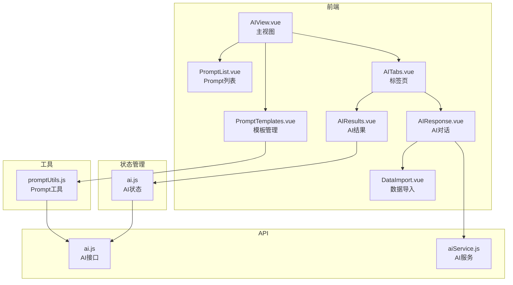
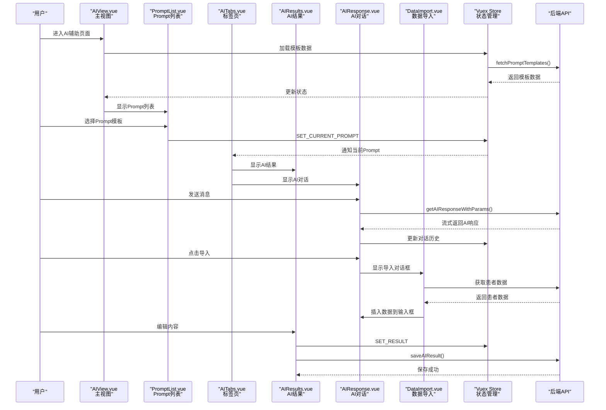
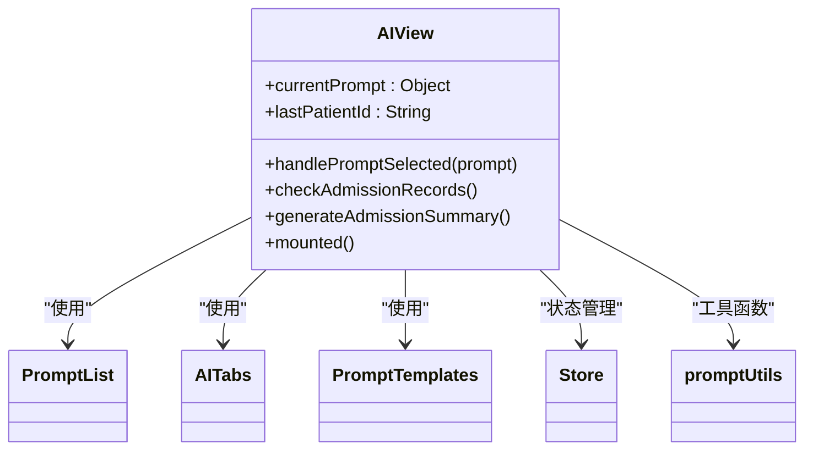
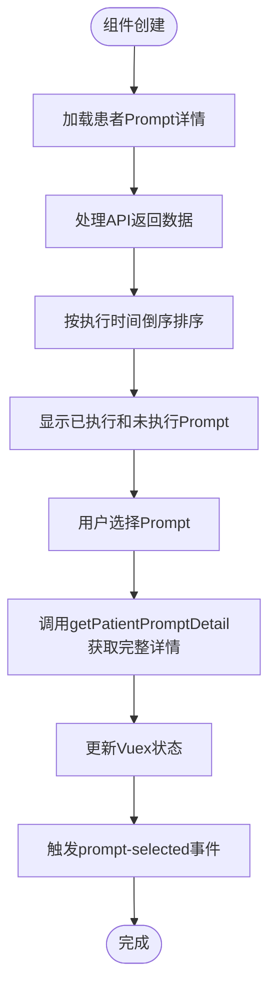
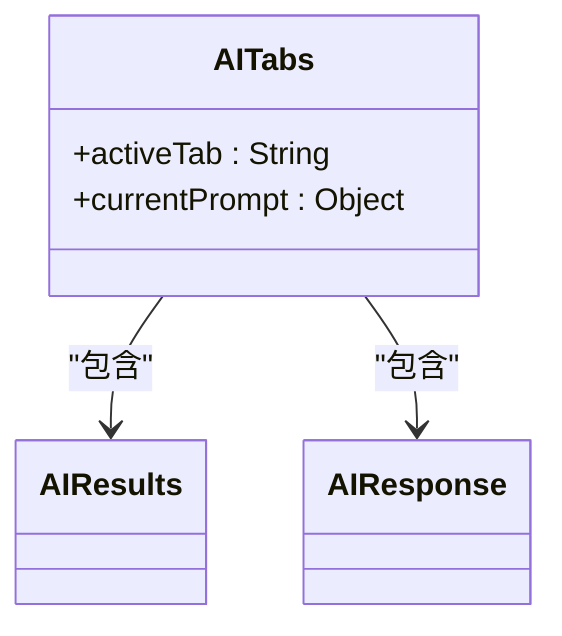
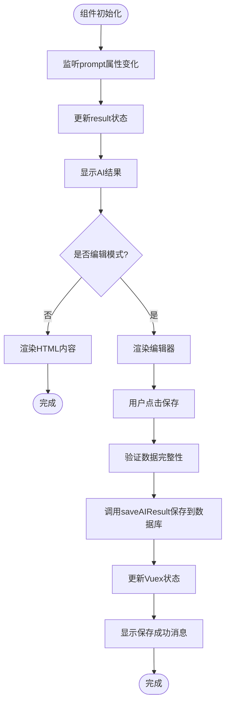
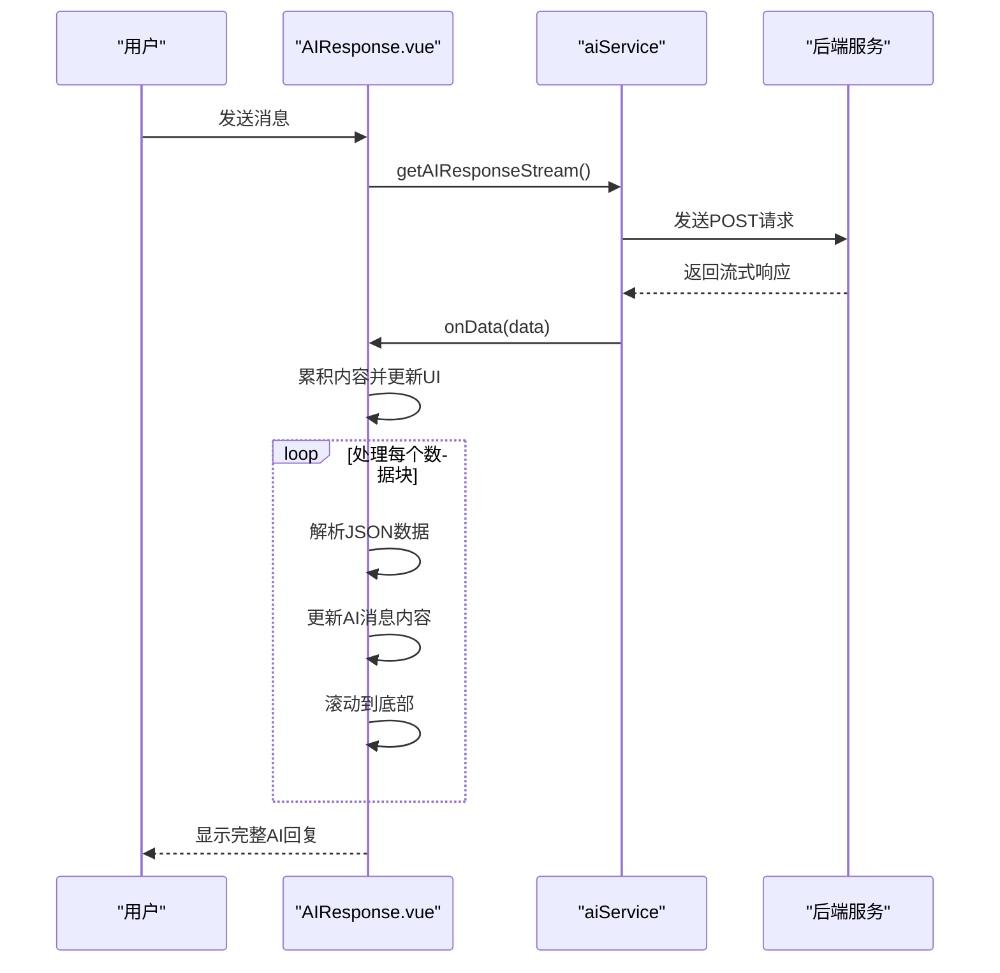
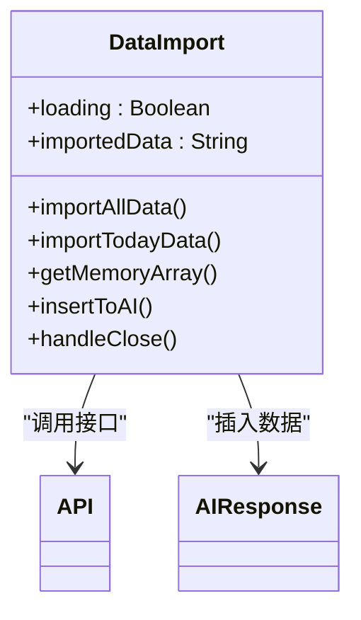
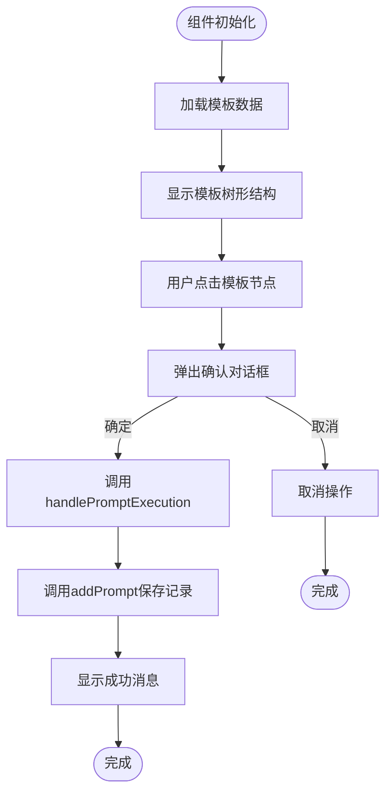
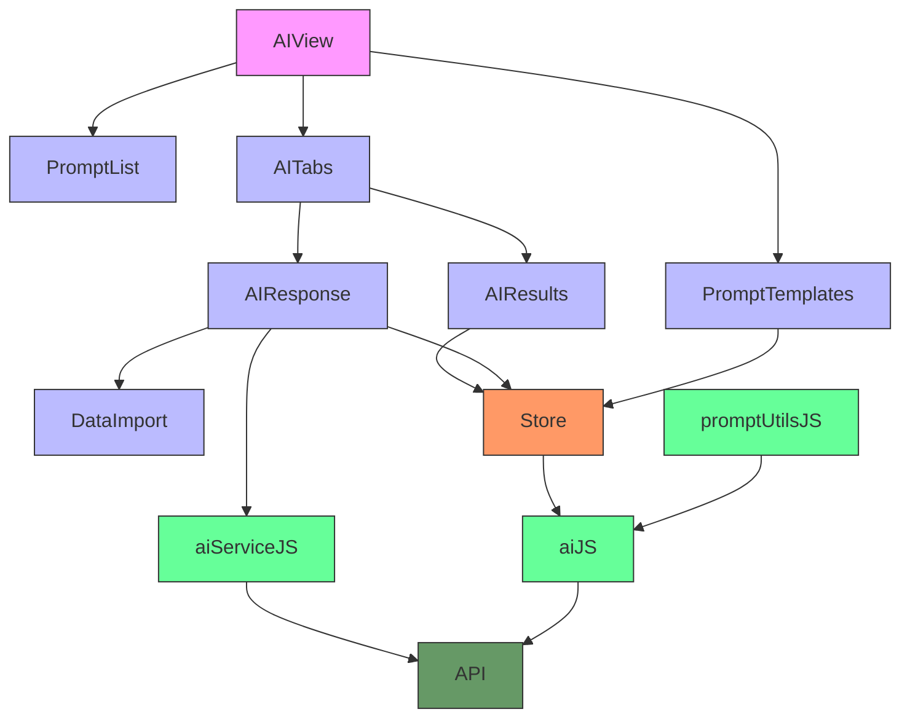

# AI功能组件

<cite>
**本文档引用的文件**   
- [AIView.vue](file://src/views/AIView.vue)
- [PromptList.vue](file://src/components/ai/PromptList.vue)
- [AITabs.vue](file://src/components/ai/AITabs.vue)
- [AIResults.vue](file://src/components/ai/AIResults.vue)
- [AIResponse.vue](file://src/components/ai/AIResponse.vue)
- [DataImport.vue](file://src/components/ai/DataImport.vue)
- [PromptTemplates.vue](file://src/components/ai/PromptTemplates.vue)
- [promptUtils.js](file://src/utils/promptUtils.js)
- [ai.js](file://src/api/ai.js)
- [aiService.js](file://src/api/aiService.js)
- [ai.js](file://src/store/modules/ai.js)
</cite>

## 目录
1. [项目结构](#项目结构)
2. [核心组件](#核心组件)
3. [架构概述](#架构概述)
4. [详细组件分析](#详细组件分析)
5. [依赖关系分析](#依赖关系分析)

## 项目结构

**图示来源**
- [AIView.vue](file://src/views/AIView.vue)
- [PromptList.vue](file://src/components/ai/PromptList.vue)
- [AITabs.vue](file://src/components/ai/AITabs.vue)
- [AIResults.vue](file://src/components/ai/AIResults.vue)
- [AIResponse.vue](file://src/components/ai/AIResponse.vue)
- [DataImport.vue](file://src/components/ai/DataImport.vue)
- [PromptTemplates.vue](file://src/components/ai/PromptTemplates.vue)
- [promptUtils.js](file://src/utils/promptUtils.js)
- [ai.js](file://src/api/ai.js)
- [aiService.js](file://src/api/aiService.js)
- [ai.js](file://src/store/modules/ai.js)

## 核心组件

AI功能组件模块采用模块化设计，以`AIView.vue`作为主视图入口，通过组件化方式组织各个功能模块。系统主要由五个核心组件构成：`PromptList.vue`负责展示可执行的AI任务模板，`AITabs.vue`实现多标签页切换的交互设计，`AIResults.vue`负责渲染Markdown格式的AI输出并支持编辑保存，`AIResponse.vue`实现与大语言模型的流式对话响应，`DataImport.vue`则将患者数据注入对话上下文。这些组件通过Vuex进行状态管理，并通过事件机制进行通信，形成了一个完整的AI辅助诊疗系统。

**组件来源**
- [AIView.vue](file://src/views/AIView.vue)
- [PromptList.vue](file://src/components/ai/PromptList.vue)
- [AITabs.vue](file://src/components/ai/AITabs.vue)
- [AIResults.vue](file://src/components/ai/AIResults.vue)
- [AIResponse.vue](file://src/components/ai/AIResponse.vue)
- [DataImport.vue](file://src/components/ai/DataImport.vue)

## 架构概述

**图示来源**
- [AIView.vue](file://src/views/AIView.vue#L1-L174)
- [PromptList.vue](file://src/components/ai/PromptList.vue#L1-L279)
- [AITabs.vue](file://src/components/ai/AITabs.vue#L1-L44)
- [AIResults.vue](file://src/components/ai/AIResults.vue#L1-L291)
- [AIResponse.vue](file://src/components/ai/AIResponse.vue#L1-L496)
- [DataImport.vue](file://src/components/ai/DataImport.vue#L1-L182)
- [ai.js](file://src/api/ai.js#L1-L399)
- [aiService.js](file://src/api/aiService.js#L1-L158)
- [ai.js](file://src/store/modules/ai.js#L1-L143)

## 详细组件分析

### AIView.vue 主视图分析

`AIView.vue`作为AI功能的主视图，采用左右布局结构，左侧为`PromptList`组件，右侧为`AITabs`组件，底部为`PromptTemplates`组件。该组件通过Vuex的`mapGetters`获取患者ID和Prompt模板数据，并在`mounted`生命周期钩子中加载模板数据和检查入院记录。

**图示来源**
- [AIView.vue](file://src/views/AIView.vue#L1-L174)

**组件来源**
- [AIView.vue](file://src/views/AIView.vue#L1-L174)

### PromptList.vue 组件分析

`PromptList.vue`组件负责展示已执行和未执行的Prompt列表，通过`patientId`属性接收患者ID，并在`watch`中监听其变化以重新加载数据。组件通过`getPatientPromptDetails` API获取患者Prompt详情，并根据`statusName`将数据分为已执行和未执行两类。

**图示来源**
- [PromptList.vue](file://src/components/ai/PromptList.vue#L1-L279)

**组件来源**
- [PromptList.vue](file://src/components/ai/PromptList.vue#L1-L279)

### AITabs.vue 组件分析

`AITabs.vue`组件实现多标签页切换功能，包含"AI结果"和"AI对话"两个标签页。组件通过`el-tabs`组件实现标签页切换，`activeTab`数据属性记录当前激活的标签页。

**图示来源**
- [AITabs.vue](file://src/components/ai/AITabs.vue#L1-L44)

**组件来源**
- [AITabs.vue](file://src/components/ai/AITabs.vue#L1-L44)

### AIResults.vue 组件分析

`AIResults.vue`组件负责渲染Markdown格式的AI输出并支持编辑保存。组件使用`md-editor-v3`库渲染Markdown内容，并提供编辑、保存、取消等操作按钮。当用户点击"编辑内容"按钮时，组件切换到编辑模式，使用`MdEditor`组件进行内容编辑。

**图示来源**
- [AIResults.vue](file://src/components/ai/AIResults.vue#L1-L291)

**组件来源**
- [AIResults.vue](file://src/components/ai/AIResults.vue#L1-L291)

### AIResponse.vue 组件分析

`AIResponse.vue`组件实现与大语言模型的流式对话响应。组件通过`getAIResponseWithParams`函数调用AI服务，并使用`onData`回调函数处理流式响应数据。组件支持消息展开/收起、滚动到顶部/底部等功能，并提供导入患者数据、保存对话记录等操作。

**图示来源**
- [AIResponse.vue](file://src/components/ai/AIResponse.vue#L1-L496)
- [aiService.js](file://src/api/aiService.js#L1-L158)

**组件来源**
- [AIResponse.vue](file://src/components/ai/AIResponse.vue#L1-L496)

### DataImport.vue 组件分析

`DataImport.vue`组件负责将患者数据注入对话上下文。组件提供"获取所有资料"、"获取当日资料"、"获取内存资料"等按钮，用户点击后调用相应API获取数据，并通过"插入"按钮将数据插入到AI对话输入框中。

**图示来源**
- [DataImport.vue](file://src/components/ai/DataImport.vue#L1-L182)

**组件来源**
- [DataImport.vue](file://src/components/ai/DataImport.vue#L1-L182)

### PromptTemplates.vue 组件分析

`PromptTemplates.vue`组件管理自定义Prompt模板，使用`el-tree`组件展示模板树形结构。组件通过`handleNodeClick`方法处理节点点击事件，当用户点击模板节点时，弹出确认对话框，确认后调用`handlePromptExecution`函数执行模板。

**图示来源**
- [PromptTemplates.vue](file://src/components/ai/PromptTemplates.vue#L1-L109)

**组件来源**
- [PromptTemplates.vue](file://src/components/ai/PromptTemplates.vue#L1-L109)

## 依赖关系分析

**图示来源**
- [AIView.vue](file://src/views/AIView.vue)
- [PromptList.vue](file://src/components/ai/PromptList.vue)
- [AITabs.vue](file://src/components/ai/AITabs.vue)
- [AIResults.vue](file://src/components/ai/AIResults.vue)
- [AIResponse.vue](file://src/components/ai/AIResponse.vue)
- [DataImport.vue](file://src/components/ai/DataImport.vue)
- [PromptTemplates.vue](file://src/components/ai/PromptTemplates.vue)
- [ai.js](file://src/api/ai.js)
- [aiService.js](file://src/api/aiService.js)
- [promptUtils.js](file://src/utils/promptUtils.js)
- [ai.js](file://src/store/modules/ai.js)