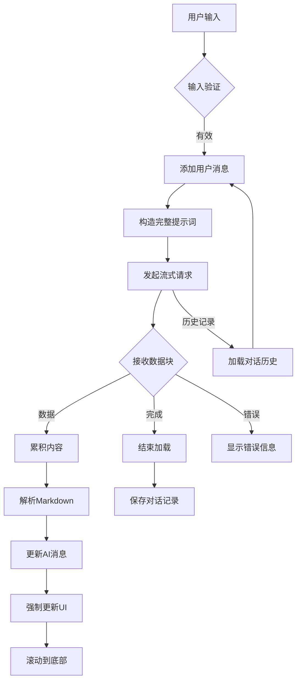

# AI流式对话响应 (AIResponse.vue)

<cite>
**本文档引用文件**   
- [AIResponse.vue](file://src/components/ai/AIResponse.vue)
- [aiService.js](file://src/api/aiService.js)
- [ai.js](file://src/store/modules/ai.js)
</cite>

## 目录
1. [简介](#简介)
2. [核心功能实现](#核心功能实现)
3. [消息历史记录与本地存储](#消息历史记录与本地存储)
4. [请求构造与上下文注入](#请求构造与上下文注入)
5. [错误处理与重连机制](#错误处理与重连机制)
6. [关键交互实现](#关键交互实现)
7. [架构概览](#架构概览)

## 简介
`AIResponse.vue` 组件是医疗AI助手系统中的核心对话界面组件，负责实现与大语言模型的实时流式交互。该组件不仅提供用户友好的对话界面，还实现了完整的流式响应处理、消息持久化、上下文管理及错误恢复机制。通过集成SSE（Server-Sent Events）技术，组件能够逐字接收AI回复并实时渲染，为用户提供接近即时的交互体验。

## 核心功能实现

`AIResponse.vue` 组件通过 `sendMessage` 方法实现与大语言模型的流式对话功能。当用户点击“发送”按钮时，组件首先验证输入内容，然后将用户消息添加到对话历史中，并创建一个AI消息占位符。接着，组件调用 `getAIResponseWithParams` 函数发起流式请求。

流式响应通过 `onData` 回调函数处理，该函数接收从服务器逐块传来的数据。组件使用 `accumulatedContent` 变量累积接收到的内容，并通过 `parseMarkdown` 方法将Markdown格式的AI回复转换为HTML，实现富文本渲染。每次接收到新数据时，组件会强制更新UI并自动滚动到底部，确保用户始终看到最新的回复内容。

**组件来源**
- [AIResponse.vue](file://src/components/ai/AIResponse.vue#L150-L194)

## 消息历史记录与本地存储

组件通过 `conversation` 数组管理对话历史记录，每条消息包含角色（`user` 或 `AI`）、内容、时间戳和会话标识等属性。为确保数据安全，组件定义了 `safeConversation` 计算属性，始终返回一个有效数组，防止因 `null` 或 `undefined` 导致的运行时错误。

对话历史支持本地持久化存储。组件在 `mounted` 钩子中调用 `fetchConversationHistory` 方法，从服务器获取当前患者的对话历史，并将其加载到 `conversation` 数组中。历史记录被标记为 `isCurrentSession: false`，与本次会话产生的消息区分开来。

对话记录保存功能通过 `saveConversation` 方法实现。该方法仅保存本次会话产生的消息（存储在 `currentSessionMessages` 数组中），并使用 `Set` 数据结构对消息进行去重，避免保存重复记录。保存成功后，`currentSessionMessages` 数组被清空，为下一次会话做准备。

**组件来源**
- [AIResponse.vue](file://src/components/ai/AIResponse.vue#L307-L349)

## 请求构造与上下文注入

组件通过格式化历史对话来实现上下文注入。在发送请求前，`sendMessage` 方法将 `conversation` 数组中的所有消息（包括用户和AI的消息）按 `角色: 内容` 的格式拼接成一个字符串，并与当前用户输入组合成完整的提示词（prompt）。这种设计确保了大语言模型能够基于完整的对话历史生成连贯的回复。

请求通过 `getAIResponseWithParams` 函数发送，该函数封装了 `AIService` 类的 `getAIResponseStream` 方法。请求参数包括模型名称（`deepseek-chat`）、温度参数（`0.7`）和构造好的完整提示词。`AIService` 使用 `fetch` API 发起POST请求，设置 `Accept: application/x-ndjson` 头以接收流式响应。

**组件来源**
- [AIResponse.vue](file://src/components/ai/AIResponse.vue#L150-L194)
- [aiService.js](file://src/api/aiService.js#L2-L112)

## 错误处理与重连机制

组件实现了多层次的错误处理机制。在网络请求层面，`AIService` 的 `getAIResponseStream` 方法捕获HTTP错误和解析错误，并通过 `onData` 回调传递错误信息。在组件层面，`sendMessage` 方法使用 `try-catch` 块捕获异常，并使用 `ElMessage` 组件向用户显示错误提示。

当AI服务调用失败时，组件会将错误信息作为AI消息的内容显示在对话界面中，保持用户界面的一致性。虽然当前实现中未包含自动重连逻辑，但错误处理机制为实现重连提供了基础。例如，可以在捕获到网络错误后，延迟一段时间后自动重试请求。

**组件来源**
- [AIResponse.vue](file://src/components/ai/AIResponse.vue#L225-L272)
- [aiService.js](file://src/api/aiService.js#L85-L130)

## 关键交互实现

### 流式文本拼接
流式文本拼接由 `onData` 回调函数实现。该函数接收从服务器传来的数据块，检查数据格式（支持直接内容和OpenAI格式的delta），并将内容累积到 `accumulatedContent` 变量中。每次更新后，调用 `parseMarkdown` 方法将累积的Markdown文本转换为HTML，并更新AI消息的内容。

### 滚动到底部
自动滚动功能通过 `scrollToBottom` 方法实现。该方法使用 `this.$nextTick` 确保在DOM更新完成后执行，获取对话显示区域的引用（`this.$refs.display`），并将其 `scrollTop` 属性设置为 `scrollHeight`，实现滚动到底部的效果。该方法在接收到新数据和页面加载完成后被调用。

### 加载动画
加载状态通过 `loading` 数据属性和 `v-loading` 指令实现。当发送请求时，`loading` 被设置为 `true`，在输入框上显示加载动画。同时，组件使用 `ElMessage` 创建一个持续显示的加载提示，直到请求完成或失败后关闭。

**组件来源**
- [AIResponse.vue](file://src/components/ai/AIResponse.vue#L225-L272)

## 架构概览

**图表来源**
- [AIResponse.vue](file://src/components/ai/AIResponse.vue)
- [aiService.js](file://src/api/aiService.js)