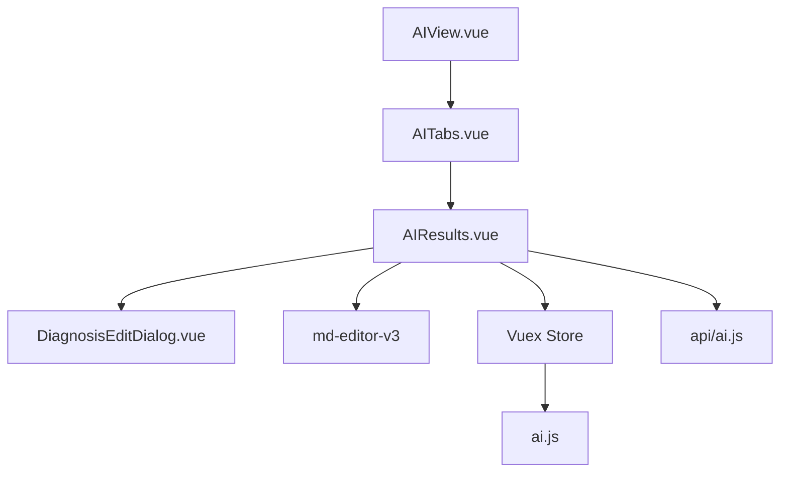
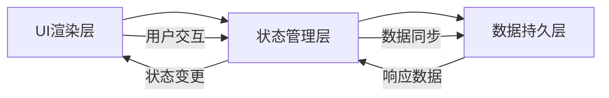
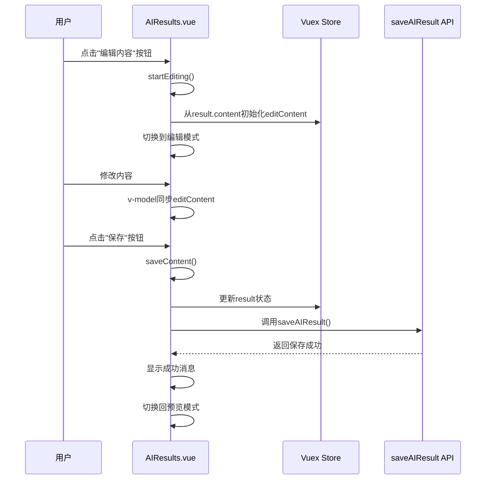
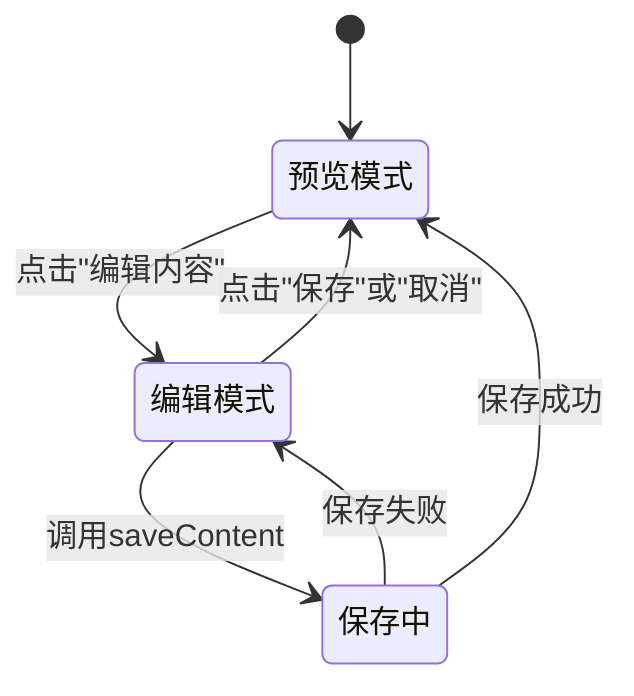
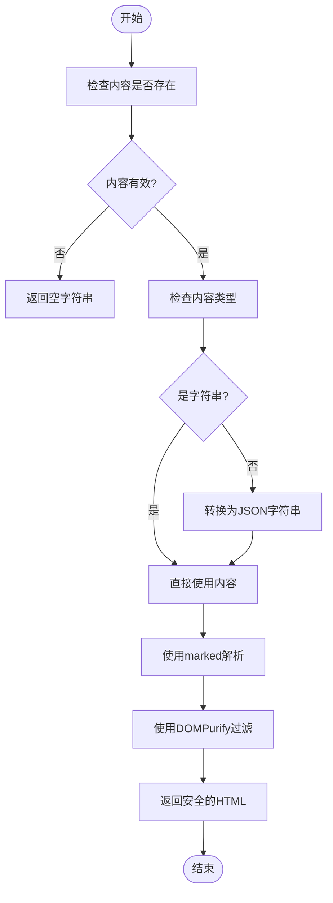
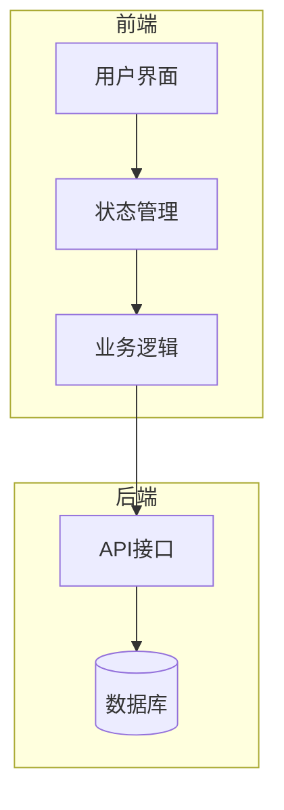
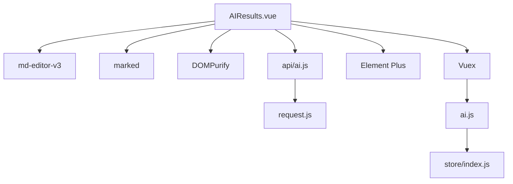

# AI结果展示与编辑 (AIResults.vue)

<cite>
**本文档引用的文件**   
- [AIResults.vue](file://src/components/ai/AIResults.vue)
- [ai.js](file://src/store/modules/ai.js)
- [ai.js](file://src/api/ai.js)
- [AITabs.vue](file://src/components/ai/AITabs.vue)
- [DiagnosisEditDialog.vue](file://src/components/patient/DiagnosisEditDialog.vue)
</cite>

## 目录
1. [简介](#简介)
2. [项目结构](#项目结构)
3. [核心组件](#核心组件)
4. [架构概述](#架构概述)
5. [详细组件分析](#详细组件分析)
6. [依赖分析](#依赖分析)
7. [性能考虑](#性能考虑)
8. [故障排除指南](#故障排除指南)
9. [结论](#结论)

## 简介
AIResults.vue 组件是医疗AI助手系统中的核心功能模块，负责展示和编辑由大语言模型生成的AI分析结果。该组件实现了Markdown格式内容的富文本渲染与编辑功能，支持医生对AI输出进行修改、保存，并提供了诊断添加、内容对比等辅助功能。组件通过Vuex状态管理实现响应式数据更新，确保用户界面与应用状态保持同步。

## 项目结构
AIResults.vue 组件位于src/components/ai/目录下，是AI功能模块的重要组成部分。该组件与AIView.vue、AITabs.vue等组件协同工作，构成了完整的AI辅助分析界面。组件依赖于md-editor-v3库实现Markdown编辑功能，通过Vuex与后端API进行数据交互。

**图示来源**
- [AIView.vue](file://src/views/AIView.vue)
- [AITabs.vue](file://src/components/ai/AITabs.vue)
- [AIResults.vue](file://src/components/ai/AIResults.vue)
- [DiagnosisEditDialog.vue](file://src/components/patient/DiagnosisEditDialog.vue)
- [ai.js](file://src/store/modules/ai.js)
- [ai.js](file://src/api/ai.js)

**本节来源**
- [AIResults.vue](file://src/components/ai/AIResults.vue)
- [AITabs.vue](file://src/components/ai/AITabs.vue)

## 核心组件
AIResults.vue 组件实现了AI生成结果的展示与编辑功能。组件通过v-model绑定editContent实现双向数据绑定，利用md-editor-v3提供富文本编辑体验。在预览模式下，使用marked库将Markdown内容解析为HTML，并通过DOMPurify进行安全过滤，防止XSS攻击。组件通过Vuex的mapState和mapMutations方法与全局状态进行交互，确保数据的一致性和响应性。

**本节来源**
- [AIResults.vue](file://src/components/ai/AIResults.vue)
- [ai.js](file://src/store/modules/ai.js)

## 架构概述
AIResults.vue 组件采用Vue 3的组合式API架构，通过计算属性和方法与Vuex状态管理器进行交互。组件的架构分为三个主要部分：UI渲染层、状态管理层和数据持久层。UI渲染层负责展示内容和处理用户交互；状态管理层通过Vuex管理应用状态；数据持久层通过API调用将修改后的内容保存到后端。

**图示来源**
- [AIResults.vue](file://src/components/ai/AIResults.vue)
- [ai.js](file://src/store/modules/ai.js)
- [ai.js](file://src/api/ai.js)

## 详细组件分析

### AIResults.vue 组件分析
AIResults.vue 组件实现了AI生成结果的完整生命周期管理，从内容展示到编辑保存的全过程。

#### 组件交互流程

**图示来源**
- [AIResults.vue](file://src/components/ai/AIResults.vue#L200-L238)
- [ai.js](file://src/store/modules/ai.js)
- [ai.js](file://src/api/ai.js#L149-L163)

#### 编辑状态管理
组件通过isEditing数据属性管理编辑状态，实现预览模式与编辑模式的切换。当用户点击"编辑内容"按钮时，触发startEditing方法，将result.content的值复制到editContent中，并将isEditing设置为true，从而切换到md-editor编辑器。保存时，将editContent的值写回result对象，并通过SET_RESULT mutation更新Vuex状态。

**图示来源**
- [AIResults.vue](file://src/components/ai/AIResults.vue#L200-L238)
- [ai.js](file://src/store/modules/ai.js)

#### 内容解析与安全
组件使用marked库将Markdown内容解析为HTML，并通过DOMPurify进行安全过滤，防止XSS攻击。parseMarkdown方法首先检查输入内容的类型，如果是对象则转换为字符串，确保marked库接收正确的参数类型。

**图示来源**
- [AIResults.vue](file://src/components/ai/AIResults.vue#L200-L238)
- [package.json](file://package.json)

**本节来源**
- [AIResults.vue](file://src/components/ai/AIResults.vue)
- [ai.js](file://src/store/modules/ai.js)
- [ai.js](file://src/api/ai.js)

### 概念概述
AIResults.vue 组件的设计体现了现代前端应用的最佳实践，包括响应式编程、状态管理和组件化开发。组件通过清晰的职责划分和良好的封装，实现了复杂功能的简洁表达。

## 依赖分析
AIResults.vue 组件依赖于多个外部库和内部模块，形成了完整的功能链。

**图示来源**
- [AIResults.vue](file://src/components/ai/AIResults.vue)
- [package.json](file://package.json)
- [ai.js](file://src/api/ai.js)
- [ai.js](file://src/store/modules/ai.js)
- [index.js](file://src/store/index.js)

**本节来源**
- [AIResults.vue](file://src/components/ai/AIResults.vue)
- [package.json](file://package.json)
- [ai.js](file://src/api/ai.js)
- [ai.js](file://src/store/modules/ai.js)

## 性能考虑
AIResults.vue 组件在设计时考虑了性能优化，特别是在内容渲染和状态更新方面。通过使用v-if和v-else实现编辑模式和预览模式的条件渲染，避免了不必要的DOM操作。parseMarkdown方法的输入类型检查确保了marked库的稳定运行，防止了因类型错误导致的性能问题。

## 故障排除指南
当AIResults.vue组件出现问题时，可以按照以下步骤进行排查：

1. **检查Vuex状态**：确认ai模块的result状态是否正确加载
2. **验证API调用**：检查saveAIResult API是否正常响应
3. **审查Markdown内容**：确保AI生成的内容符合Markdown语法规范
4. **调试编辑状态**：检查isEditing状态的切换逻辑是否正常

**本节来源**
- [AIResults.vue](file://src/components/ai/AIResults.vue)
- [ai.js](file://src/api/ai.js)

## 结论
AIResults.vue 组件成功实现了AI生成结果的展示与编辑功能，为医生提供了便捷的AI辅助工具。组件通过合理的架构设计和状态管理，确保了数据的一致性和用户体验的流畅性。未来可以考虑增加版本对比、协作编辑等高级功能，进一步提升系统的实用价值。