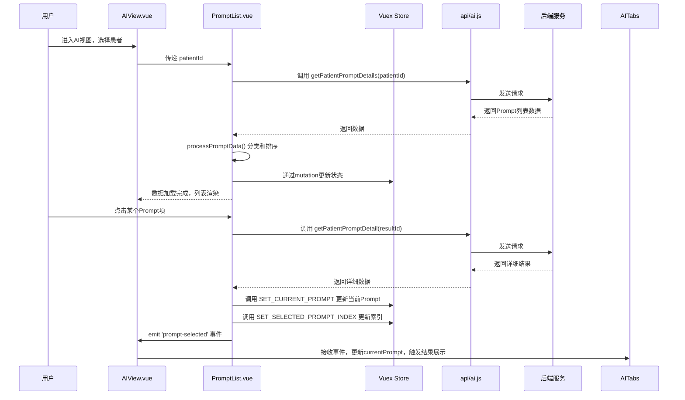

# Prompt模板列表 (PromptList.vue)

<cite>
**本文档引用的文件**
- [PromptList.vue](file://src/components/ai/PromptList.vue)
- [promptUtils.js](file://src/utils/promptUtils.js)
- [AIView.vue](file://src/views/AIView.vue)
- [ai.js](file://src/store/modules/ai.js)
- [ai.js](file://src/api/ai.js)
</cite>

## 目录
1. [简介](#简介)
2. [项目结构](#项目结构)
3. [核心组件](#核心组件)
4. [架构概述](#架构概述)
5. [详细组件分析](#详细组件分析)
6. [依赖分析](#依赖分析)
7. [性能考虑](#性能考虑)
8. [故障排除指南](#故障排除指南)
9. [结论](#结论)

## 简介
`PromptList.vue` 是医疗AI助手系统中的核心组件之一，负责展示与管理针对特定患者的AI任务模板执行列表。该组件从Vuex状态管理中获取数据，通过API调用加载患者相关的Prompt执行记录，并将它们分为“已执行”和“未执行”两类进行展示。用户可以通过点击列表项触发详细内容的加载，从而在主界面中查看AI分析结果。该组件与 `AIView.vue` 和 `promptUtils.js` 紧密协作，实现了从模板选择到AI分析执行的完整工作流。

## 项目结构
`PromptList.vue` 组件位于项目的 `src/components/ai/` 目录下，是AI功能模块的一部分。它作为独立的UI组件被 `AIView.vue` 视图所引用，通过props接收患者ID，并通过事件与父组件通信。其数据来源于Vuex store中的`ai`模块，并通过`api/ai.js`中定义的API函数与后端服务交互。该组件的样式使用scoped CSS，确保了样式的局部化，避免了全局污染。

**Section sources**
- [PromptList.vue](file://src/components/ai/PromptList.vue)
- [AIView.vue](file://src/views/AIView.vue)
- [ai.js](file://src/store/modules/ai.js)

## 核心组件
`PromptList.vue` 的核心功能是作为AI任务的导航和状态展示中心。它通过监听`patientId`的变化，自动加载对应患者的所有Prompt记录。组件内部维护了两个本地数组 `localPrompts` 和 `localPendingPrompts`，分别用于存储已执行和待处理的Prompt项。这些数据来源于对 `getPatientPromptDetails` API的调用，并根据`statusName`字段进行分类。组件还实现了选择状态的持久化，通过Vuex的`selectedPromptIndex`来恢复用户上次的选择。

**Section sources**
- [PromptList.vue](file://src/components/ai/PromptList.vue#L39-L99)
- [ai.js](file://src/store/modules/ai.js#L1-L143)

## 架构概述
`PromptList.vue` 组件在整体架构中扮演着连接用户界面与后端数据的关键角色。它从 `AIView.vue` 接收患者上下文，通过Vuex与全局状态同步，并利用API模块与后端进行数据交换。其数据流是单向的：后端API -> Vuex Store -> PromptList.vue -> 用户交互 -> 触发事件 -> AIView.vue -> 更新主视图。

```mermaid
graph TD
A[AIView.vue] --> |提供 patientId| B(PromptList.vue)
A --> |接收 prompt-selected 事件| B
B --> |读取| C[Vuex Store (ai module)]
B --> |调用| D[api/ai.js]
D --> |getPatientPromptDetails| E[后端服务]
D --> |getPatientPromptDetail| E
E --> |返回数据| D
D --> |更新| C
C --> |驱动| B
B --> |emit| A
```

**Diagram sources**
- [PromptList.vue](file://src/components/ai/PromptList.vue)
- [AIView.vue](file://src/views/AIView.vue)
- [ai.js](file://src/store/modules/ai.js)
- [ai.js](file://src/api/ai.js)

## 详细组件分析

### PromptList.vue 组件分析
`PromptList.vue` 是一个功能完整的Vue单文件组件，其主要职责是渲染和管理Prompt列表。

#### 模板与UI展示逻辑
组件的模板使用了两个`<table>`元素，分别展示“已执行Prompt”和“未执行Prompt”。每个表格都包含一个表头和一个动态生成的表体。表体通过 `v-for` 指令遍历 `localPrompts` 和 `localPendingPrompts` 数组来渲染每一行。每行都有一个点击事件 `@click="selectPrompt(prompt)"`，用于处理用户的选择。

条件渲染和空状态处理是该组件UI逻辑的重要部分。当任一列表为空时，会使用 `v-if` 显示一个友好的提示信息（如“暂无已执行Prompt”），而不是显示一个空表格。这提升了用户体验。此外，通过 `v-loading="loading"` 指令，组件在数据加载时会显示“Prompt列表正在加载”的提示，让用户明确感知到当前状态。

禁用状态控制主要体现在视觉上。通过CSS的`:hover`伪类，当用户鼠标悬停在列表项上时，背景色会发生变化，提供视觉反馈。选中状态通过 `:class="{ selected: currentPrompt && currentPrompt.id === prompt.id }"` 动态绑定实现，选中的项会有一个高亮的背景色。

```mermaid
flowchart TD
Start([组件创建/患者ID变更]) --> LoadData["调用 loadPromptDetails(patientId)"]
LoadData --> ShowLoading["设置 loading = true"]
ShowLoading --> CallAPI["调用 getPatientPromptDetails API"]
CallAPI --> ProcessData["调用 processPromptData 处理返回数据"]
ProcessData --> Classify["根据 statusName 分类到 localPrompts 或 localPendingPrompts"]
Classify --> Sort["对 localPrompts 按时间倒序排序"]
Sort --> Restore["调用 restoreSelection 恢复选择状态"]
Restore --> HideLoading["设置 loading = false"]
HideLoading --> End([数据加载完成，等待用户交互])
UserClick["用户点击列表项"] --> SelectPrompt["调用 selectPrompt(prompt)"]
SelectPrompt --> ShowLoading2["设置 loading = true"]
ShowLoading2 --> CallDetailAPI["调用 getPatientPromptDetail API"]
CallDetailAPI --> BuildDisplay["构建 displayPrompt 对象"]
BuildDisplay --> UpdateStore["调用 SET_CURRENT_PROMPT 更新Vuex"]
UpdateStore --> UpdateIndex["调用 SET_SELECTED_PROMPT_INDEX 更新索引"]
UpdateIndex --> EmitEvent["触发 prompt-selected 事件"]
EmitEvent --> HideLoading2["设置 loading = false"]
HideLoading2 --> End2([主视图更新]
```

**Diagram sources**
- [PromptList.vue](file://src/components/ai/PromptList.vue#L146-L226)

**Section sources**
- [PromptList.vue](file://src/components/ai/PromptList.vue#L0-L354)

### 模板项数据结构定义
`PromptList.vue` 组件中渲染的每个模板项（`prompt`）都具有一个特定的数据结构。这个结构是在 `processPromptData` 方法中由API返回的原始数据构建的。

- `id`: 唯一标识符，来源于API返回的 `resultId`。
- `title`: 显示的标题，来源于API返回的 `promptTemplateName`。
- `date`: 格式化后的日期字符串，来源于 `executionTime` 或 `createdAt`。
- `originalContent`: 保存了API返回的完整原始数据对象，用于后续可能的处理。
- `modifiedContent`: 在新接口中不返回此内容，因此被设置为 `null`。
- `statusName`: 状态名称，用于在 `processPromptData` 中进行分类。

这个轻量级的数据结构被用于列表的渲染，而当用户点击某一项时，组件会通过 `getPatientPromptDetail` API获取包含完整内容（如 `originalResultContent` 和 `modifiedResultContent`）的详细信息。

**Section sources**
- [PromptList.vue](file://src/components/ai/PromptList.vue#L182-L186)

### 与AIView.vue的通信机制
`PromptList.vue` 与 `AIView.vue` 之间的通信是通过Vue的标准事件系统实现的。

1.  **数据传递 (父 -> 子)**: `AIView.vue` 通过 `:patientId="currentPatientId"` 将当前患者的ID作为prop传递给 `PromptList.vue`。`PromptList.vue` 通过监听 `patientId` 的变化来触发数据加载。
2.  **事件通知 (子 -> 父)**: 当用户在 `PromptList.vue` 中点击一个Prompt项时，它会执行 `selectPrompt` 方法。在成功获取详细信息后，该方法会通过 `this.$emit('prompt-selected', displayPrompt)` 触发一个名为 `prompt-selected` 的自定义事件，并将包含详细信息的 `displayPrompt` 对象作为参数传递出去。
3.  **父组件响应**: `AIView.vue` 在其模板中监听这个事件 `@prompt-selected="handlePromptSelected"`。当事件被触发时，`AIView.vue` 的 `handlePromptSelected` 方法会被调用，从而更新自身的 `currentPrompt` 状态，并可能触发其他视图的更新。

这种父子组件通信模式清晰、解耦，是Vue应用中的最佳实践。

**Section sources**
- [PromptList.vue](file://src/components/ai/PromptList.vue#L39-L99)
- [AIView.vue](file://src/views/AIView.vue#L1-L174)

### 点击事件与handlePromptExecution函数
需要澄清的是，`PromptList.vue` 组件本身**并不直接调用** `promptUtils.js` 中的 `handlePromptExecution` 函数。`PromptList.vue` 的职责是**展示已有的Prompt记录**和**加载已执行的详细结果**。

`handlePromptExecution` 函数的调用通常发生在其他地方，例如在 `AIView.vue` 中的 `generateAdmissionSummary` 方法里，或者在 `PromptTemplates.vue` 组件中当用户选择一个新模板时。`PromptList.vue` 的点击事件 (`selectPrompt`) 是用于**查看**一个已经存在的、可能已经执行过的Prompt的详细输出结果，而不是用于**触发**一个新的AI分析任务。

`handlePromptExecution` 函数的执行流程如下：
1.  验证 `patientId` 和 `promptName` 等必要参数。
2.  如果 `promptType` 未提供，则通过 `getAllPromptTemplates` 查询获取。
3.  并行调用 `getPatientData` 和 `getPromptTemplate` 获取患者数据和模板内容。
4.  合并数据并调用 `addPrompt` API来创建一个新的Prompt执行请求。
5.  返回执行结果。



**Diagram sources**
- [PromptList.vue](file://src/components/ai/PromptList.vue)
- [AIView.vue](file://src/views/AIView.vue)
- [ai.js](file://src/api/ai.js)
- [promptUtils.js](file://src/utils/promptUtils.js)

## 依赖分析
`PromptList.vue` 组件的依赖关系清晰，主要依赖于以下几个方面：

- **Vuex Store**: 通过 `mapGetters` 和 `mapState` 读取 `currentPrompt` 和 `selectedPromptIndex`，通过 `mapMutations` 提交 `SET_CURRENT_PROMPT` 和 `SET_SELECTED_PROMPT_INDEX`。
- **API 模块**: 依赖 `@/api/ai` 中的 `getPatientPromptDetails` 和 `getPatientPromptDetail` 函数来获取数据。
- **Element UI**: 使用了 `v-loading` 指令和 `el-tooltip` 组件来实现加载状态和提示功能。
- **父组件 (AIView.vue)**: 依赖其提供 `patientId` 并监听其发出的事件。

这些依赖关系确保了组件的高内聚和低耦合。

**Diagram sources**
- [PromptList.vue](file://src/components/ai/PromptList.vue#L39-L99)
- [ai.js](file://src/store/modules/ai.js#L1-L143)
- [ai.js](file://src/api/ai.js#L1-L488)

**Section sources**
- [PromptList.vue](file://src/components/ai/PromptList.vue)
- [ai.js](file://src/store/modules/ai.js)
- [ai.js](file://src/api/ai.js)

## 性能考虑
`PromptList.vue` 组件在性能方面有以下考虑：

1.  **数据加载**: 使用 `v-loading` 提供了良好的加载反馈，避免了界面卡顿的错觉。
2.  **API调用**: `loadPromptDetails` 方法在 `patientId` 变化时被调用，且使用了 `immediate: true`，确保了组件创建时能立即加载数据。`selectPrompt` 方法仅在用户点击时才加载详细内容，实现了按需加载，避免了不必要的网络请求。
3.  **计算属性**: `allPrompts` 计算属性会缓存结果，只有在其依赖项变化时才会重新计算。
4.  **错误处理**: 所有异步操作都包裹在 `try...catch` 块中，确保了错误不会导致应用崩溃，并在控制台输出了错误信息。

## 故障排除指南
在使用 `PromptList.vue` 组件时，可能会遇到以下问题：

- **列表为空**: 检查 `patientId` 是否正确传递，确认后端 `getPatientPromptDetails` API 是否返回了数据。
- **点击无反应**: 检查 `selectPrompt` 方法是否被正确调用，确认 `getPatientPromptDetail` API 是否能成功返回数据。
- **显示JSON原始数据**: 这通常是 `restoreSelection` 方法未能正确获取详细信息导致的。确保 `getPatientPromptDetail` API 正常工作。
- **加载状态不消失**: 检查 `try...catch...finally` 块，确保 `finally` 中的 `this.loading = false` 一定会执行，即使发生错误。

**Section sources**
- [PromptList.vue](file://src/components/ai/PromptList.vue#L146-L226)
- [docs/更新日志2025-9-6.md](file://docs/更新日志2025-9-6.md#L17-L26)

## 结论
`PromptList.vue` 组件是医疗AI助手系统中一个设计良好、功能明确的UI组件。它有效地管理了AI任务的历史记录，提供了直观的用户界面和流畅的交互体验。通过与Vuex、API模块和父组件的紧密协作，它实现了数据的获取、状态的管理以及与其他组件的通信。其代码结构清晰，注释完善，遵循了Vue的最佳实践，是一个可维护性高的组件实例。