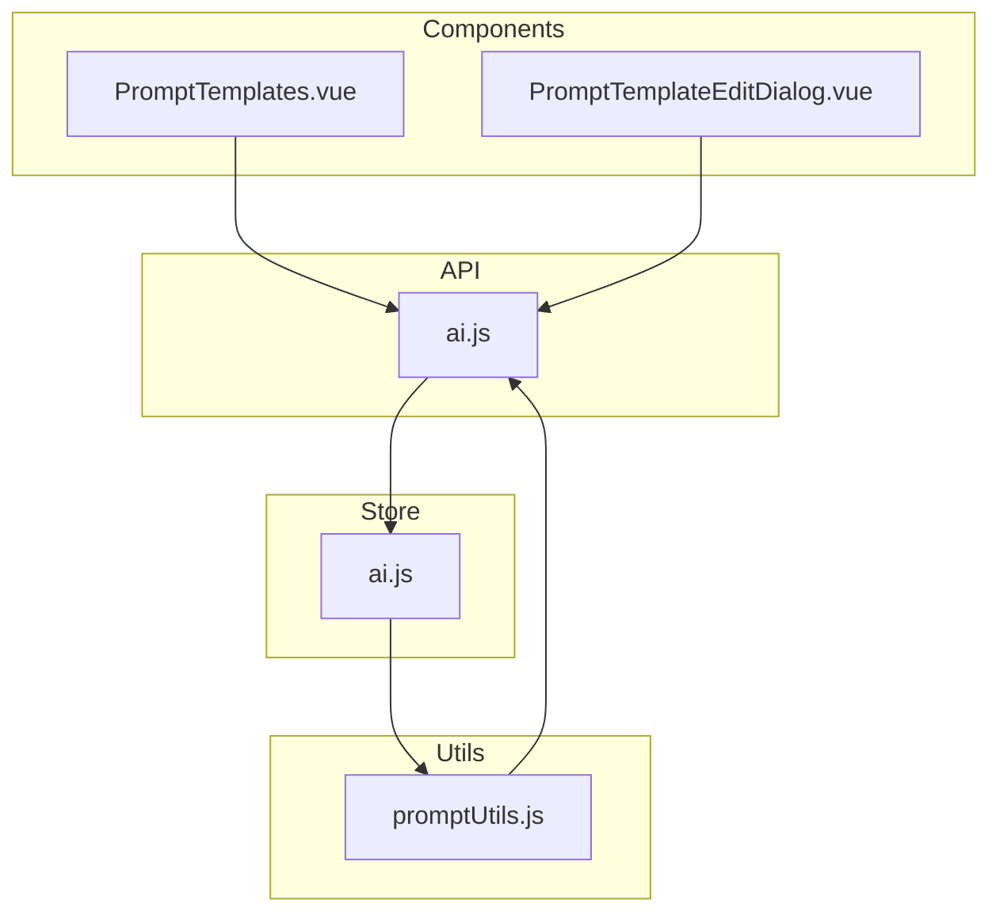
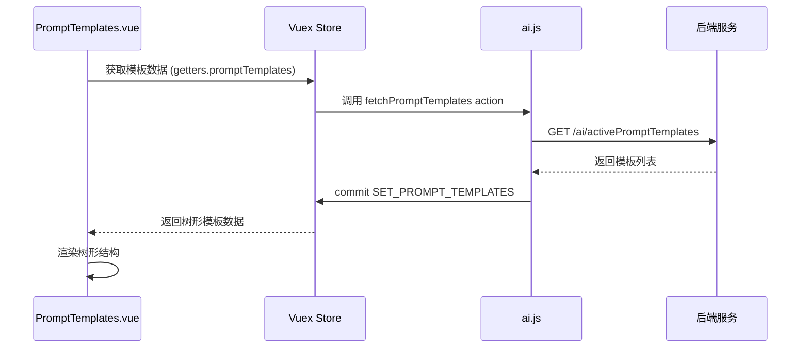
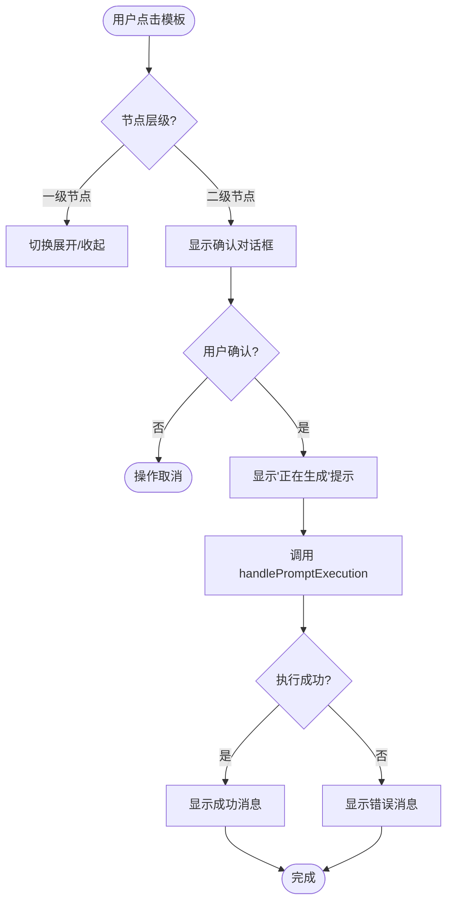
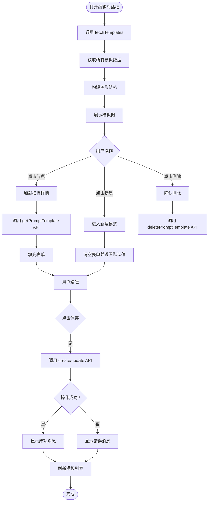
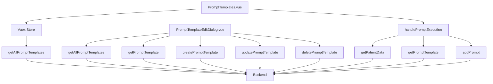

# Prompt模板管理 (PromptTemplates.vue)

<cite>
**Referenced Files in This Document**   
- [PromptTemplates.vue](file://src/components/ai/PromptTemplates.vue)
- [PromptTemplateEditDialog.vue](file://src/components/ai/PromptTemplateEditDialog.vue)
- [ai.js](file://src/api/ai.js)
- [ai.js](file://src/store/modules/ai.js)
- [promptUtils.js](file://src/utils/promptUtils.js)
</cite>

## 目录
1. [简介](#简介)
2. [项目结构](#项目结构)
3. [核心组件](#核心组件)
4. [架构概述](#架构概述)
5. [详细组件分析](#详细组件分析)
6. [依赖分析](#依赖分析)
7. [性能考虑](#性能考虑)
8. [故障排除指南](#故障排除指南)
9. [结论](#结论)

## 简介
本文件系统性地文档化了医疗AI助手系统中的Prompt模板管理功能。该功能主要由`PromptTemplates.vue`和`PromptTemplateEditDialog.vue`两个核心组件构成，实现了对AI提示词模板的增删改查操作。系统通过调用后端API获取模板列表，在树形结构中展示模板，并支持用户调用模板进行分析。模板中的占位符（如{{patientName}}）在执行时会被实际的患者数据替换，实现个性化的AI分析。本系统还集成了权限校验、数据缓存等特性，确保了功能的完整性和安全性。

## 项目结构
系统中的Prompt模板管理功能主要分布在`src/components/ai/`目录下，相关API定义在`src/api/ai.js`中，状态管理逻辑位于`src/store/modules/ai.js`，而核心的执行逻辑则封装在`src/utils/promptUtils.js`工具函数中。这种分层架构将界面展示、业务逻辑、数据访问和状态管理清晰地分离，提高了代码的可维护性和可扩展性。

**Diagram sources**
- [PromptTemplates.vue](file://src/components/ai/PromptTemplates.vue)
- [PromptTemplateEditDialog.vue](file://src/components/ai/PromptTemplateEditDialog.vue)
- [ai.js](file://src/api/ai.js)
- [ai.js](file://src/store/modules/ai.js)
- [promptUtils.js](file://src/utils/promptUtils.js)

**Section sources**
- [PromptTemplates.vue](file://src/components/ai/PromptTemplates.vue)
- [PromptTemplateEditDialog.vue](file://src/components/ai/PromptTemplateEditDialog.vue)
- [ai.js](file://src/api/ai.js)
- [ai.js](file://src/store/modules/ai.js)
- [promptUtils.js](file://src/utils/promptUtils.js)

## 核心组件
核心组件包括`PromptTemplates.vue`和`PromptTemplateEditDialog.vue`。前者负责展示模板列表并提供调用功能，后者则提供了一个完整的对话框界面用于模板的创建、编辑和删除。`PromptTemplates.vue`通过Vuex从store中获取模板数据，以树形结构展示，一级节点为模板类型，二级节点为具体的模板名称。`PromptTemplateEditDialog.vue`则通过API直接获取所有模板数据，构建树形结构用于选择和编辑。

**Section sources**
- [PromptTemplates.vue](file://src/components/ai/PromptTemplates.vue#L1-L143)
- [PromptTemplateEditDialog.vue](file://src/components/ai/PromptTemplateEditDialog.vue#L1-L518)

## 架构概述
系统采用典型的Vue.js单页应用架构，结合Vuex进行状态管理。当用户访问模板管理界面时，`PromptTemplates.vue`组件会从Vuex store中获取已缓存的模板数据进行展示。模板数据的获取和更新由store中的`fetchPromptTemplates` action统一管理，该action调用`getAllPromptTemplates` API从后端获取所有激活的模板列表，并将其转换为树形结构存储在state中。当用户需要编辑模板时，会打开`PromptTemplateEditDialog.vue`对话框，该组件可以直接调用API获取最新数据，确保编辑时的数据是最新的。

**Diagram sources**
- [PromptTemplates.vue](file://src/components/ai/PromptTemplates.vue#L1-L143)
- [ai.js](file://src/store/modules/ai.js#L85-L126)
- [ai.js](file://src/api/ai.js#L29-L39)

## 详细组件分析

### PromptTemplates.vue 分析
`PromptTemplates.vue`组件是模板管理的主界面，它使用Element Plus的`el-tree`组件以树形结构展示模板。组件通过`mapGetters`从Vuex store中获取`promptTemplates`数据，并将其绑定到树形组件的`data`属性上。树形结构的一级节点代表模板类型（如"诊断分析"、"病情小结"），二级节点代表具体的模板名称。当用户点击一个模板节点时，会弹出确认对话框，用户确认后，组件会调用`handlePromptExecution`工具函数来执行该模板。

#### 组件交互流程

**Diagram sources**
- [PromptTemplates.vue](file://src/components/ai/PromptTemplates.vue#L1-L143)

**Section sources**
- [PromptTemplates.vue](file://src/components/ai/PromptTemplates.vue#L1-L143)

### PromptTemplateEditDialog.vue 分析
`PromptTemplateEditDialog.vue`组件提供了一个功能完整的模板编辑对话框。它在创建时会监听`storage`事件，以便在用户信息变化时更新界面。组件通过`fetchTemplates`方法从后端获取所有模板数据，并将其转换为树形结构用于左侧的模板选择树。右侧的表单区域分为多个标签页，分别用于编辑模板的其他设置、模板内容和科室特殊情况。组件支持新建、编辑和删除模板，所有操作都会通过相应的API调用后端，并在成功后刷新模板列表。

#### 模板编辑操作流程

**Diagram sources**
- [PromptTemplateEditDialog.vue](file://src/components/ai/PromptTemplateEditDialog.vue#L1-L518)

**Section sources**
- [PromptTemplateEditDialog.vue](file://src/components/ai/PromptTemplateEditDialog.vue#L1-L518)

## 依赖分析
模板管理功能依赖于多个模块和API。`PromptTemplates.vue`依赖于Vuex store中的`promptTemplates` getter来获取数据，而store又依赖于`getAllPromptTemplates` API。`PromptTemplateEditDialog.vue`则直接依赖于`ai.js`中的多个API，包括`getAllPromptTemplates`、`getPromptTemplate`、`createPromptTemplate`、`updatePromptTemplate`和`deletePromptTemplate`。此外，两个组件都依赖于Element Plus的UI组件库来构建界面。

**Diagram sources**
- [PromptTemplates.vue](file://src/components/ai/PromptTemplates.vue#L1-L143)
- [PromptTemplateEditDialog.vue](file://src/components/ai/PromptTemplateEditDialog.vue#L1-L518)
- [ai.js](file://src/api/ai.js)
- [promptUtils.js](file://src/utils/promptUtils.js)

**Section sources**
- [PromptTemplates.vue](file://src/components/ai/PromptTemplates.vue#L1-L143)
- [PromptTemplateEditDialog.vue](file://src/components/ai/PromptTemplateEditDialog.vue#L1-L518)
- [ai.js](file://src/api/ai.js)
- [promptUtils.js](file://src/utils/promptUtils.js)

## 性能考虑
系统在性能方面做了多项优化。首先，模板列表数据通过Vuex store进行全局缓存，避免了在不同组件间重复请求相同的数据。其次，`handlePromptExecution`函数使用`Promise.all`并行调用`getPatientData`和`getPromptTemplate`两个API，减少了总的等待时间。此外，树形结构的构建在store的action中完成，避免了在每个组件中重复进行数据转换，提高了渲染效率。对于大型模板内容的加载，系统采用了按需加载的策略，只有在用户选择编辑某个模板时才会调用`getPromptTemplate`获取完整内容。

## 故障排除指南
当模板管理功能出现问题时，可以按照以下步骤进行排查：
1. **检查网络请求**：打开浏览器开发者工具，查看`/ai/activePromptTemplates`等API请求是否成功，状态码是否为200。
2. **检查数据格式**：确认后端返回的模板数据格式是否符合预期，特别是`promptType`、`promptName`和`promptID`字段是否存在且不为空。
3. **检查权限**：确认当前用户是否有权限访问模板管理功能，用户信息是否正确存储在`localStorage`中。
4. **检查模板内容**：如果模板执行失败，检查模板内容是否为空或包含非法字符。
5. **检查依赖**：确认`promptUtils.js`中的`handlePromptExecution`函数是否正确调用了所有依赖的API。

**Section sources**
- [ai.js](file://src/api/ai.js)
- [promptUtils.js](file://src/utils/promptUtils.js)

## 结论
`PromptTemplates.vue`组件及其相关模块构成了一个功能完整、结构清晰的模板管理系统。系统通过合理的分层架构和状态管理，实现了模板的高效展示和操作。树形结构的设计使得大量模板能够被有序组织，提升了用户体验。通过`handlePromptExecution`工具函数，系统将复杂的执行逻辑封装起来，保证了代码的复用性和可维护性。整体设计充分考虑了性能和用户体验，为医疗AI助手提供了强大的模板支持能力。