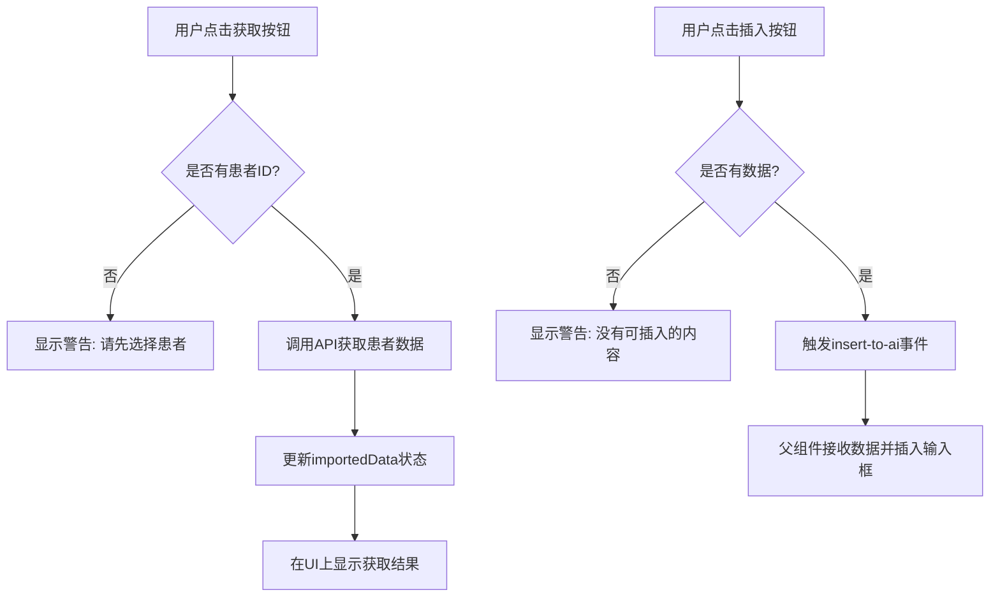
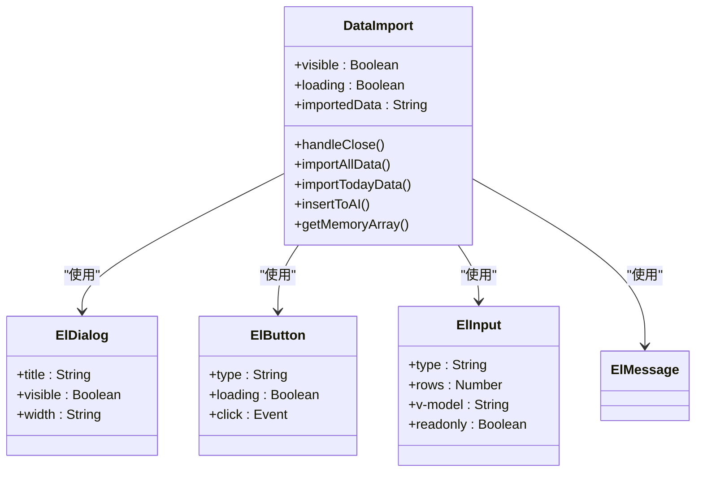
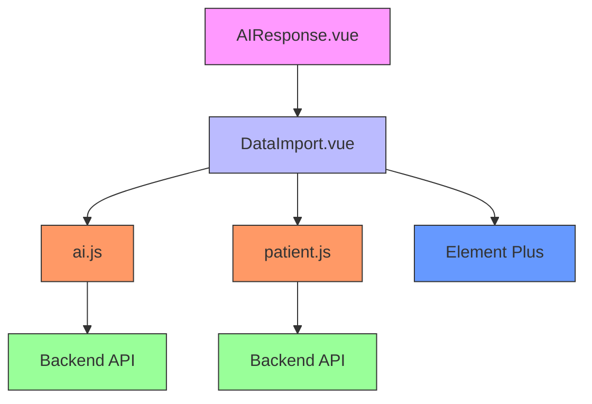

# 患者数据导入 (DataImport.vue)

<cite>
**Referenced Files in This Document **   
- [DataImport.vue](file://src/components/ai/DataImport.vue)
- [patient.js](file://src/api/patient.js)
- [ai.js](file://src/api/ai.js)
- [patient.js](file://src/store/modules/patient.js)
- [AIResponse.vue](file://src/components/ai/AIResponse.vue)
</cite>

## 目录
1. [简介](#简介)
2. [核心功能与数据流](#核心功能与数据流)
3. [数据获取来源](#数据获取来源)
4. [数据格式化策略](#数据格式化策略)
5. [UI设计逻辑与交互流程](#ui设计逻辑与交互流程)
6. [权限控制与状态管理](#权限控制与状态管理)
7. [组件依赖关系](#组件依赖关系)

## 简介

`DataImport.vue` 是医疗AI助手系统中的一个关键组件，负责将当前患者的结构化临床数据（如诊断、检验、检查等）注入到AI对话上下文中。该组件通过调用后端API获取患者数据，并将其格式化为适合大语言模型（LLM）理解的文本格式。用户可以通过点击按钮手动将这些数据插入到AI对话的输入框中，从而让LLM能够基于真实的临床数据进行推理和分析。

该组件的设计遵循了模块化和可复用的原则，作为对话界面的一部分，它与AI响应组件（AIResponse.vue）紧密协作，实现了从数据获取到上下文注入的完整工作流。

**Section sources**
- [DataImport.vue](file://src/components/ai/DataImport.vue#L1-L182)

## 核心功能与数据流

`DataImport.vue` 组件的核心功能是实现患者数据到AI对话上下文的无缝注入。其数据流遵循“获取-显示-注入”的三步模式。

首先，用户通过点击“获取所有资料”或“获取当日资料”按钮触发数据获取流程。组件通过调用 `getPatientData` 或 `getPatientComprehensiveInfo` API 方法，从服务器获取当前患者的结构化数据。获取的数据随后被存储在组件的 `importedData` 状态中，并在UI上以只读文本区域的形式展示给用户。

最后，当用户确认数据无误后，点击“插入”按钮，组件会通过 `insert-to-ai` 事件将 `importedData` 中的内容发送给父组件（通常是AIResponse.vue），从而完成数据注入过程。



**Diagram sources **
- [DataImport.vue](file://src/components/ai/DataImport.vue#L1-L182)

**Section sources**
- [DataImport.vue](file://src/components/ai/DataImport.vue#L1-L182)

## 数据获取来源

`DataImport.vue` 组件的数据来源主要分为两个层面：直接API调用和Vuex状态管理。

在直接API调用方面，组件通过 `@/api/ai.js` 模块中的 `getPatientData` 和 `getPatientComprehensiveInfo` 两个函数来获取患者数据。`getPatientData` 函数用于获取与特定Prompt模板相关的完整患者数据，而 `getPatientComprehensiveInfo` 则用于获取患者当日的综合信息。这两个函数都通过HTTP GET请求与后端 `/ai/patient-data` 和 `/ai/patient-comprehensive-info` 接口通信，获取格式化的患者数据字符串。

在状态管理层面，组件通过Vuex的 `mapGetters` 辅助函数，从 `patient` 模块中获取 `currentPatientId`。这个计算属性是数据获取的前提条件，确保了只有在选中了有效患者的情况下才会发起数据请求。`currentPatientId` 的值来源于 `store/modules/patient.js`，该模块负责管理患者相关的全局状态，包括当前患者信息、诊断、医嘱等。

```mermaid
graph TB
subgraph "DataImport.vue"
A[DataImport组件]
end
subgraph "API Layer"
B[getPatientData]
C[getPatientComprehensiveInfo]
end
subgraph "State Management"
D[patientStore]
E[currentPatientId]
end
subgraph "Backend"
F[/ai/patient-data]
G[/ai/patient-comprehensive-info]
end
A --> B
A --> C
A --> E
B --> F
C --> G
D --> E
```

**Diagram sources **
- [DataImport.vue](file://src/components/ai/DataImport.vue#L1-L182)
- [ai.js](file://src/api/ai.js#L291-L306)
- [ai.js](file://src/api/ai.js#L393-L406)
- [patient.js](file://src/store/modules/patient.js#L1-L408)

**Section sources**
- [DataImport.vue](file://src/components/ai/DataImport.vue#L1-L182)
- [ai.js](file://src/api/ai.js#L291-L406)
- [patient.js](file://src/store/modules/patient.js#L1-L408)

## 数据格式化策略

`DataImport.vue` 组件本身不直接负责数据的格式化，而是依赖后端API返回已经格式化好的数据。这种设计将复杂的格式化逻辑从前端解耦，确保了数据的一致性和可维护性。

当调用 `getPatientData` 或 `getPatientComprehensiveInfo` API 时，后端服务会从数据库中查询患者的各项临床数据（如诊断、检验、检查、医嘱等），并根据预定义的模板或规则将这些结构化数据转换为一段连贯的、适合LLM理解的自然语言文本。例如，患者的诊断信息可能会被格式化为“主要诊断：急性心肌梗死；次要诊断：高血压病3级”这样的文本。

前端组件接收到这个格式化的字符串后，直接将其存储在 `importedData` 数据属性中，并通过 `v-model` 绑定到 `<el-input type="textarea">` 组件上进行展示。这种方式确保了数据在展示和注入过程中的完整性，避免了在前端进行二次处理可能引入的错误。

**Section sources**
- [DataImport.vue](file://src/components/ai/DataImport.vue#L1-L182)
- [ai.js](file://src/api/ai.js#L291-L406)

## UI设计逻辑与交互流程

`DataImport.vue` 的UI设计遵循了清晰、直观的原则，采用对话框（el-dialog）的形式呈现，确保用户在进行数据导入操作时能够专注于此任务。

组件的UI主要由两部分组成：操作按钮组和结果展示区。按钮组包含四个功能按钮：“获取所有资料”、“获取当日资料”、“获取内存资料”和“插入”。前两个按钮用于触发不同范围的数据获取，第三个按钮用于从Vuex store中获取内存中的医嘱数据，最后一个按钮则用于将已获取的数据注入到AI对话中。

交互流程设计上，组件充分考虑了用户体验。例如，在数据获取过程中，按钮会显示加载状态（`loading`），防止用户重复点击。同时，通过 `ElMessage` 组件提供成功或失败的反馈信息，让用户清楚地了解操作结果。对话框的关闭逻辑也经过精心设计，通过 `@update:visible` 事件与父组件进行双向绑定，确保状态同步。



**Diagram sources **
- [DataImport.vue](file://src/components/ai/DataImport.vue#L1-L182)

**Section sources**
- [DataImport.vue](file://src/components/ai/DataImport.vue#L1-L182)

## 权限控制与状态管理

`DataImport.vue` 组件在权限控制和状态管理方面采取了谨慎的设计。最核心的权限控制体现在数据获取的前置检查上。在 `importAllData` 和 `importTodayData` 方法中，组件首先检查 `currentPatientId` 是否存在。如果用户尚未选择患者，系统会通过 `ElMessage.warning` 显示“请先选择患者”的警告信息，并中断后续的数据获取流程。这有效地防止了无效的API调用和潜在的错误。

在状态管理方面，组件利用了Vue的响应式系统和Vuex的全局状态。`importedData` 作为组件的本地状态，用于存储和展示获取到的数据。而 `currentPatientId` 则通过Vuex的 `mapGetters` 从全局状态中获取，确保了患者上下文的一致性。此外，组件还通过自定义事件（`emits`）与父组件进行通信，如 `update:visible` 用于同步对话框的显示状态，`insert-to-ai` 用于传递需要注入的数据，实现了清晰的父子组件职责划分。

**Section sources**
- [DataImport.vue](file://src/components/ai/DataImport.vue#L1-L182)
- [patient.js](file://src/store/modules/patient.js#L1-L408)

## 组件依赖关系

`DataImport.vue` 组件与系统中的多个模块存在紧密的依赖关系，形成了一个完整的数据协作网络。

在API依赖上，它直接依赖于 `@/api/ai.js` 中的 `getPatientData` 和 `getPatientComprehensiveInfo` 函数。在状态管理上，它依赖于 `@/store/modules/patient.js` 中的 `currentPatientId` getter。在UI层面，它使用了Element Plus的 `el-dialog`、`el-button`、`el-input` 等组件。在事件通信上，它被 `AIResponse.vue` 组件作为子组件引用，并通过自定义事件与之交互。

这种依赖关系清晰地体现了组件在系统架构中的位置：它是一个连接数据源（API/Store）和用户界面（AI对话）的桥梁，负责将静态的临床数据转化为动态的AI对话上下文。



**Diagram sources **
- [DataImport.vue](file://src/components/ai/DataImport.vue#L1-L182)
- [AIResponse.vue](file://src/components/ai/AIResponse.vue#L1-L521)
- [ai.js](file://src/api/ai.js#L1-L488)
- [patient.js](file://src/store/modules/patient.js#L1-L408)

**Section sources**
- [DataImport.vue](file://src/components/ai/DataImport.vue#L1-L182)
- [AIResponse.vue](file://src/components/ai/AIResponse.vue#L1-L521)
- [ai.js](file://src/api/ai.js#L1-L488)
- [patient.js](file://src/store/modules/patient.js#L1-L408)