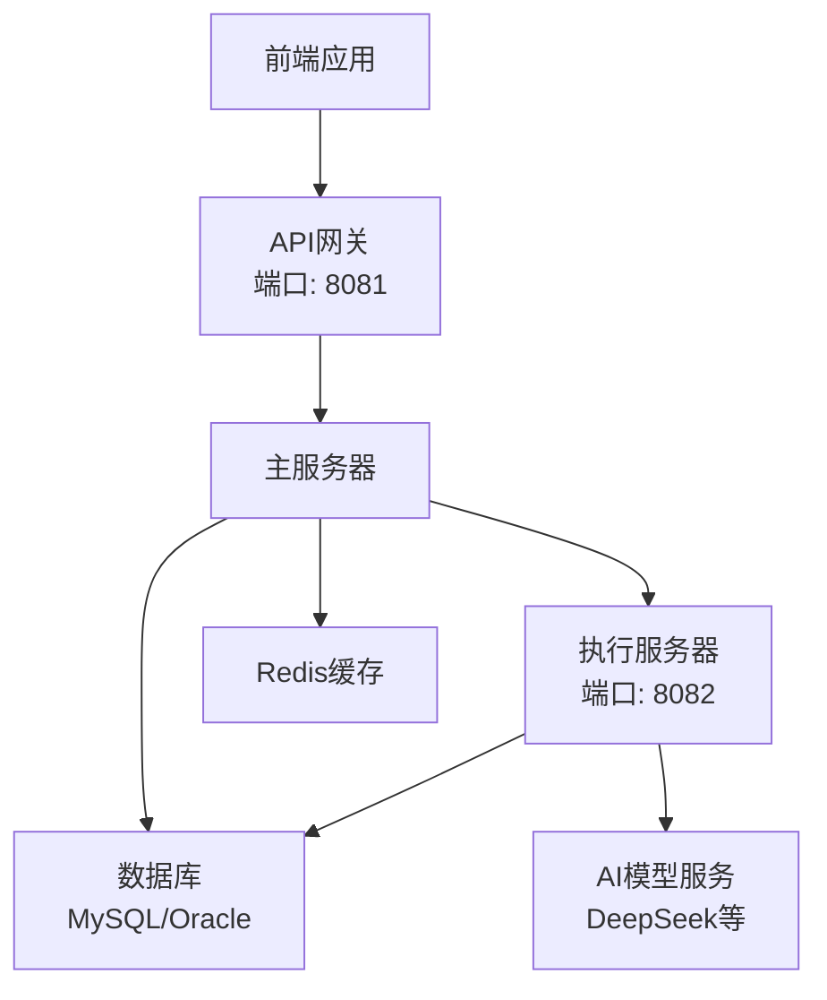
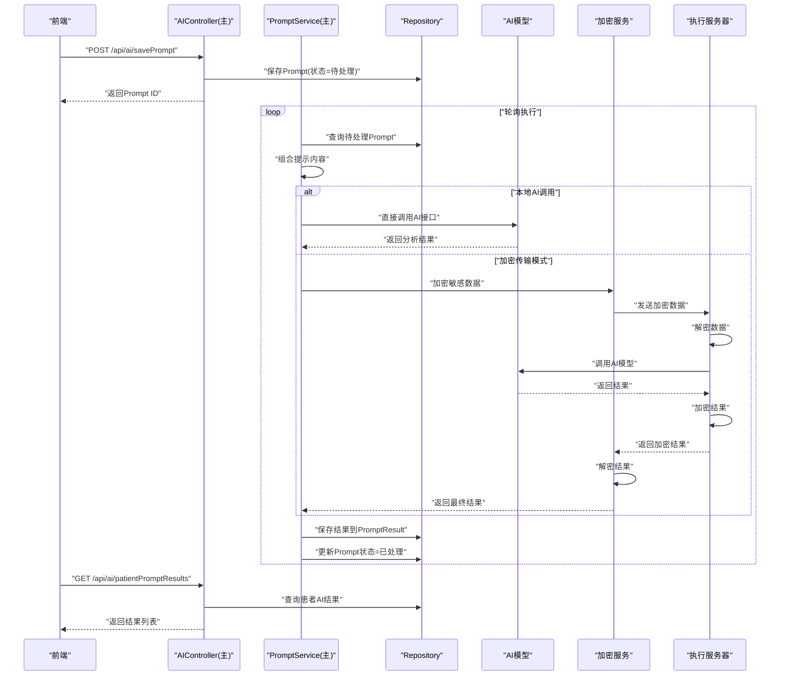
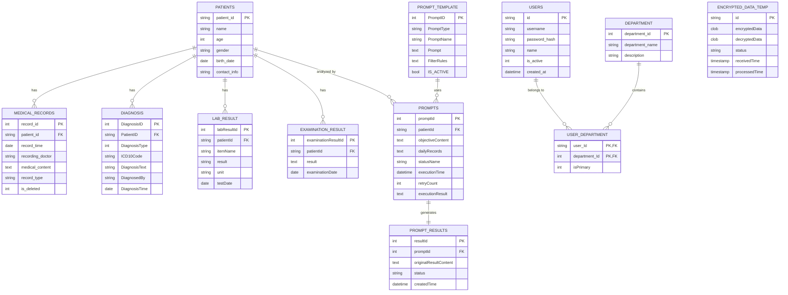
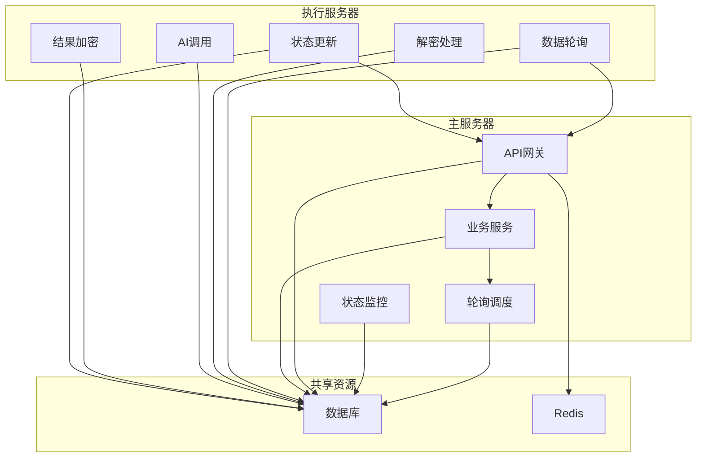

# API参考

<cite>
**本文引用的文件**
- [API文档](file://med_ai_assistant_1.0_bs_backend/doc/其他/API_DOCUMENTATION.md)
- [部署总览](file://med_ai_assistant_1.0_bs_backend/deploy/README.md)
- [主服务器(Linux+Oracle)部署](file://med_ai_assistant_1.0_bs_backend/deploy/main-linux-oracle/README.md)
- [执行服务器(Win)部署](file://med_ai_assistant_1.0_bs_backend/deploy/execution-windows/README.md)
- [系统架构与流程图](file://med_ai_assistant_1.0_bs_backend/doc/其他/ARCHITECTURE_DIAGRAMS.md)
- [主服务器与执行服务器交互机制分析](file://med_ai_assistant_1.0_bs_backend/doc/其他/主服务器与执行服务器交互机制分析.md)
- [执行服务器LLM调用优化接口文档](file://med_ai_assistant_1.0_bs_backend/doc/其他/执行服务器LLM调用优化接口文档.md)
- [执行服务器性能优化方案](file://med_ai_assistant_1.0_bs_backend/doc/其他/执行服务器性能优化方案.md)
- [告警规则接口文档](file://med_ai_assistant_1.0_bs_backend/doc/其他/API_ALERT_RULES.md)
- [常用操作与测试脚本指引](file://项目相关/常用.txt)
- [BuildDownloadController](file://med_ai_assistant_1.0_bs_backend/src/main/java/com/example/medaiassistant/controller/BuildDownloadController.java)
- [UpdateView.vue](file://med_ai_assistant_1.0_bs_vue/src/views/UpdateView.vue)
- [auto-deploy-frontend.sh](file://med_ai_assistant_1.0_bs_vue/deploy/auto-deploy-frontend.sh)
- [restore-frontend.sh](file://med_ai_assistant_1.0_bs_vue/deploy/restore-frontend.sh)
- [deploy-from-package.sh](file://med_ai_assistant_1.0_bs_vue/deploy/deploy-from-package.sh)
- [auto-deploy-backend.sh](file://med_ai_assistant_1.0_bs_backend/deploy/main-linux-oracle/auto-deploy-backend.sh)
- [restore-backend.sh](file://med_ai_assistant_1.0_bs_backend/deploy/main-linux-oracle/restore-backend.sh)
- [主服务器从执行服务器下载构建产物实现方案](file://med_ai_assistant_1.0_bs_backend/doc/布署/自动化部署/主服务器从执行服务器下载构建产物实现方案.md)
- [更新小结](file://更新小结.md)
- [后端自动部署API接口文档](file://med_ai_assistant_1.0_bs_backend/doc/接口/后端自动部署API接口文档.md)
- [前端自动部署接口](file://med_ai_assistant_1.0_bs_backend/doc/接口/前端自动部署接口.md)
</cite>

## 目录
1. [简介](#简介)
2. [项目结构](#项目结构)
3. [核心组件](#核心组件)
4. [架构总览](#架构总览)
5. [详细组件分析](#详细组件分析)
6. [依赖分析](#依赖分析)
7. [性能考虑](#性能考虑)
8. [故障排查指南](#故障排查指南)
9. [结论](#结论)
10. [附录](#附录)

## 简介
本文件为MedAiAssistant 1.0 BS的完整API参考，覆盖主服务器与执行服务器的公共接口，包括健康检查、任务调度、患者数据操作、AI诊断调用、告警规则、用户与权限等。文档提供端点定义、请求参数、响应格式、错误码、认证机制、错误处理策略、性能优化建议以及版本与迁移说明，帮助开发者与运维人员快速理解与集成系统。

## 项目结构
系统采用主服务器-执行服务器分离架构，主服务器负责API网关、业务逻辑与用户交互；执行服务器负责AI模型调用、数据处理与耗时任务。两者通过共享数据库与HTTP通信协同工作。

**图表来源**
- [部署总览:42-57](file://med_ai_assistant_1.0_bs_backend/deploy/README.md#L42-L57)
- [系统架构与流程图:5-60](file://med_ai_assistant_1.0_bs_backend/doc/其他/ARCHITECTURE_DIAGRAMS.md#L5-L60)

**章节来源**
- [部署总览:1-250](file://med_ai_assistant_1.0_bs_backend/deploy/README.md#L1-L250)
- [主服务器(Linux+Oracle)部署:1-396](file://med_ai_assistant_1.0_bs_backend/deploy/main-linux-oracle/README.md#L1-L396)
- [执行服务器(Win)部署:1-469](file://med_ai_assistant_1.0_bs_backend/deploy/execution-windows/README.md#L1-L469)
- [系统架构与流程图:1-391](file://med_ai_assistant_1.0_bs_backend/doc/其他/ARCHITECTURE_DIAGRAMS.md#L1-L391)

## 核心组件
- 主服务器（端口8081）：API网关、业务服务、轮询调度、状态监控、结果处理。
- 执行服务器（端口8082）：数据轮询、解密处理、AI调用、结果加密、状态更新。
- 共享数据库：存储业务数据与临时加密数据表。
- Redis：缓存与会话状态。
- 外部AI模型服务：DeepSeek等。

**章节来源**
- [主服务器(Linux+Oracle)部署:21-27](file://med_ai_assistant_1.0_bs_backend/deploy/main-linux-oracle/README.md#L21-L27)
- [执行服务器(Win)部署:22-29](file://med_ai_assistant_1.0_bs_backend/deploy/execution-windows/README.md#L22-L29)
- [系统架构与流程图:22-41](file://med_ai_assistant_1.0_bs_backend/doc/其他/ARCHITECTURE_DIAGRAMS.md#L22-L41)

## 架构总览
主服务器与执行服务器通过共享数据库与HTTP通信协作，实现Prompt提交、数据加密传输、AI分析、结果回传与状态管理。

**图表来源**
- [系统架构与流程图:185-232](file://med_ai_assistant_1.0_bs_backend/doc/其他/ARCHITECTURE_DIAGRAMS.md#L185-L232)
- [主服务器与执行服务器交互机制分析:5-51](file://med_ai_assistant_1.0_bs_backend/doc/其他/主服务器与执行服务器交互机制分析.md#L5-L51)

**章节来源**
- [系统架构与流程图:183-232](file://med_ai_assistant_1.0_bs_backend/doc/其他/ARCHITECTURE_DIAGRAMS.md#L183-L232)
- [主服务器与执行服务器交互机制分析:53-51](file://med_ai_assistant_1.0_bs_backend/doc/其他/主服务器与执行服务器交互机制分析.md#L53-L51)

## 详细组件分析

### 健康检查与服务状态
- 主服务器健康检查
  - 方法：GET
  - 路径：/api/health
  - 响应：包含服务状态、时间戳、版本等
- AI服务健康检查
  - 方法：GET
  - 路径：/api/health/ai-status
  - 响应：包含总体健康状态、模型列表及其健康状态
- 执行服务器健康检查
  - 方法：GET
  - 路径：/api/execute/health
  - 响应：执行服务器运行状态
- 执行服务器服务状态
  - 方法：GET
  - 路径：/api/execute/service-status
  - 响应：轮询服务状态

**章节来源**
- [API文档:433-464](file://med_ai_assistant_1.0_bs_backend/doc/其他/API_DOCUMENTATION.md#L433-L464)
- [部署总览:135-155](file://med_ai_assistant_1.0_bs_backend/deploy/README.md#L135-L155)
- [执行服务器(Win)部署:159-200](file://med_ai_assistant_1.0_bs_backend/deploy/execution-windows/README.md#L159-L200)

### 患者数据与病历管理
- 病历记录
  - 查询：GET /api/medicalrecords/emr-by-patient?patientId={id}
  - 格式化输出：GET /api/medicalrecords/formatted?patientId={id}
  - 新增：POST /api/medicalrecords/save
  - 修改：PUT /api/medicalrecords/{id}
  - 删除：DELETE /api/medicalrecords/{id}
  - 软删除：PUT /api/medicalrecords/{recordId}/soft-delete
- 化验结果
  - 查询：GET /api/lab-results/by-patient/{patientId}
  - 按分析状态：GET /api/lab-results/by-patient-and-analyzed/{patientId}/{isAnalyzed}
  - 格式化输出：GET /api/lab-results/formatted-by-patient/{patientId}
- 检查结果
  - 查询：GET /api/examination-results/by-patient/{patientId}
  - 格式化输出：GET /api/examination-results/formatted/by-patient/{patientId}
- 诊断管理
  - 查询：GET /api/patients/{patientId}/diagnoses
  - 新增：POST /api/patients/{patientId}/diagnoses
  - 软删除：DELETE /api/patients/diagnoses/{diagnosisId}
  - 组合诊断字符串：GET /api/diagnosis/combined/{patientId}
  - 替换诊断：POST /api/diagnosis/replace
- 长期/临时医嘱
  - 格式化长期医嘱：GET /api/patients/{patientId}/formatted-orders
  - 格式化临时医嘱：GET /api/patients/{patientId}/formatted-temporary-orders
  - 临时医嘱：GET /api/patients/{patientId}/temporary-orders
  - 长期医嘱：GET /api/patients/{patientId}/long-term-orders
- 手术信息
  - 查询：GET /api/surgeries
  - 按患者：GET /api/surgeries/by-patient/{patientId}
- 手术字典
  - 查询：GET /api/surgery-dictionary/content?dictName={name}&department={dept}&groupName={group}
  - 新增：POST /api/surgery-dictionary/add
  - 更新：PUT /api/surgery-dictionary/update/{dictId} 或 PUT /api/surgery-dictionary/update?dictId={id}
  - 删除：DELETE /api/surgery-dictionary/delete/{dictId}

**章节来源**
- [API文档:3-782](file://med_ai_assistant_1.0_bs_backend/doc/其他/API_DOCUMENTATION.md#L3-L782)

### AI分析与对话
- 获取患者综合信息
  - 方法：GET
  - 路径：/api/ai/patient-comprehensive-info?patientId={id}
- 获取患者数据（按Prompt模板所需数据类型）
  - 方法：GET
  - 路径：/api/ai/patient-data?patientId={id}&promptType={type}&promptName={name}
- AI响应（非流式）
  - 方法：POST
  - 路径：/api/ai/response
  - 请求体：包含模型、消息、参数（temperature、max_tokens、top_p等）
  - 响应：推理过程与最终内容
- 流式AI响应
  - 方法：POST
  - 路径：/api/ai/stream-response-post
  - Content-Type：application/json
  - 响应：SSE流式数据，包含心跳与完成事件
- 保存对话历史
  - 方法：POST
  - 路径：/api/ai/response/conversation
  - 请求体：会话ID、用户ID、患者ID、消息类型、内容、模型名
- 保存AI结果
  - 方法：POST
  - 路径：/api/ai/saveResult
  - 请求体：修改后内容、原始内容、PromptID、修改人、是否已读
- Prompt模板管理
  - 获取模板内容：GET /api/ai/prompt?promptType={type}&promptName={name}
  - 获取完整模板：GET /api/ai/promptTemplate?promptType={type}&promptName={name}
  - 获取模板列表：GET /api/ai/promptTemplates
  - 获取激活模板：GET /api/ai/activePromptTemplates
  - 更新激活状态：PUT /api/ai/updatePromptActiveStatus
- Prompt结果管理
  - 列表：GET /api/ai/patientPromptResults?patientId={id}
  - 详情：GET /api/ai/patientPromptDetails?patientId={id}
  - 最近病情小结：GET /api/medicalrecords/latest-summary?patientId={id}

**章节来源**
- [API文档:192-589](file://med_ai_assistant_1.0_bs_backend/doc/其他/API_DOCUMENTATION.md#L192-L589)

### 用户与权限
- 获取用户信息：GET /api/users/{id}
- 获取用户科室：GET /api/users/{id}/departments
- 用户登录：POST /api/users/login
  - 请求体：用户ID、密码
  - 响应：布尔值表示登录是否成功

**章节来源**
- [API文档:784-810](file://med_ai_assistant_1.0_bs_backend/doc/其他/API_DOCUMENTATION.md#L784-L810)

### 告警规则
- 获取激活的告警规则内容：GET /api/alert-rules/active-rule-content?rule_name={name}
  - 返回：告警内容与所需操作（JSON）

**章节来源**
- [告警规则接口文档:1-59](file://med_ai_assistant_1.0_bs_backend/doc/其他/API_ALERT_RULES.md#L1-L59)

### 部署相关API（新增/更新）
**更新** 新增后端自动部署API接口（POST /api/deploy/auto-deploy-backend）、增强前端自动部署功能、完善版本号管理API、更新CI/CD相关接口文档

- 后端自动部署接口
  - 方法：POST
  - 路径：/api/deploy/auto-deploy-backend
  - 请求体：无
  - 响应：包含部署状态、消息、输出日志等信息
  - 超时时间：600秒
  - 用途：执行后端自动部署脚本，自动完成版本检查、下载、备份、解压、部署等操作
  - 特性：版本号+文件大小双校验防重复部署、自动备份与回滚、错误处理和日志记录
  - 防重复部署机制：版本号比对 + 文件大小校验 + 双校验通过则跳过部署
  - 错误恢复：部署失败时自动从备份恢复
- 自动部署前端
  - 方法：POST
  - 路径：/api/deploy/auto-deploy-frontend
  - 请求体：无
  - 响应：包含部署状态、消息、输出日志等信息
  - 超时时间：600秒
  - 用途：执行自动部署脚本，自动完成版本检查、下载、备份、解压、部署等操作
- 手动部署前端
  - 方法：POST
  - 路径：/api/deploy/deploy-frontend
  - 请求体：包含version（必需）、expectedSize（可选）
  - 响应：包含部署状态、版本号、文件路径、文件大小、输出日志等信息
  - 用途：验证文件后手动执行部署脚本
- 查询执行服务器最新版本
  - 方法：GET
  - 路径：/api/deploy/latest
  - 响应：包含后端和前端的最新版本号和文件大小
- 下载构建产物
  - 方法：POST
  - 路径：/api/deploy/download
  - 请求体：包含backendVersion、frontendVersion、backendDownloadDir（可选）、frontendDownloadDir（可选）
  - 响应：包含每个文件的下载状态、路径、大小等信息
- 查询下载状态
  - 方法：GET
  - 路径：/api/deploy/status
  - 参数：backendVersion（可选）、frontendVersion（可选）
  - 响应：包含文件是否存在、路径、大小等状态信息

**章节来源**
- [BuildDownloadController:423-493](file://med_ai_assistant_1.0_bs_backend/src/main/java/com/example/medaiassistant/controller/BuildDownloadController.java#L423-L493)
- [BuildDownloadController:289-403](file://med_ai_assistant_1.0_bs_backend/src/main/java/com/example/medaiassistant/controller/BuildDownloadController.java#L289-L403)
- [BuildDownloadController:129-155](file://med_ai_assistant_1.0_bs_backend/src/main/java/com/example/medaiassistant/controller/BuildDownloadController.java#L129-L155)
- [BuildDownloadController:184-230](file://med_ai_assistant_1.0_bs_backend/src/main/java/com/example/medaiassistant/controller/BuildDownloadController.java#L184-L230)
- [BuildDownloadController:245-267](file://med_ai_assistant_1.0_bs_backend/src/main/java/com/example/medaiassistant/controller/BuildDownloadController.java#L245-L267)
- [auto-deploy-backend.sh:1-478](file://med_ai_assistant_1.0_bs_backend/deploy/main-linux-oracle/auto-deploy-backend.sh#L1-L478)
- [restore-backend.sh:1-237](file://med_ai_assistant_1.0_bs_backend/deploy/main-linux-oracle/restore-backend.sh#L1-L237)
- [主服务器从执行服务器下载构建产物实现方案:44-141](file://med_ai_assistant_1.0_bs_backend/doc/布署/自动化部署/主服务器从执行服务器下载构建产物实现方案.md#L44-L141)
- [后端自动部署API接口文档:1-213](file://med_ai_assistant_1.0_bs_backend/doc/接口/后端自动部署API接口文档.md#L1-L213)
- [前端自动部署接口:1-114](file://med_ai_assistant_1.0_bs_backend/doc/接口/前端自动部署接口.md#L1-L114)

### 执行服务器专用接口
- 加密数据提交：POST /api/execute/encrypted-prompt
- 启动轮询服务：POST /api/execute/start-service
- 停止轮询服务：POST /api/execute/stop-service
- 轮询状态：GET /api/execute/service-status
- 健康检查：GET /api/execute/health
- 轮询统计：GET /api/execute/polling-stats

**章节来源**
- [主服务器与执行服务器交互机制分析:277-300](file://med_ai_assistant_1.0_bs_backend/doc/其他/主服务器与执行服务器交互机制分析.md#L277-L300)

### 数据模型关系

**图表来源**
- [系统架构与流程图:62-181](file://med_ai_assistant_1.0_bs_backend/doc/other/ARCHITECTURE_DIAGRAMS.md#L62-L181)

## 依赖分析
- 主服务器依赖
  - 数据库：MySQL/Oracle（通过配置切换）
  - Redis：缓存与会话
  - 执行服务器：通过HTTP通信进行任务分发与结果回传
- 执行服务器依赖
  - 数据库：Oracle（远程连接）
  - 外部AI模型：DeepSeek等
  - 主服务器：回调与状态查询

**图表来源**
- [主服务器与执行服务器交互机制分析:9-51](file://med_ai_assistant_1.0_bs_backend/doc/其他/主服务器与执行服务器交互机制分析.md#L9-L51)
- [系统架构与流程图:5-60](file://med_ai_assistant_1.0_bs_backend/doc/其他/ARCHITECTURE_DIAGRAMS.md#L5-L60)

**章节来源**
- [主服务器与执行服务器交互机制分析:253-300](file://med_ai_assistant_1.0_bs_backend/doc/其他/主服务器与执行服务器交互机制分析.md#L253-L300)
- [系统架构与流程图:5-60](file://med_ai_assistant_1.0_bs_backend/doc/其他/ARCHITECTURE_DIAGRAMS.md#L5-L60)

## 性能考虑
- 轮询与批处理
  - 主服务器轮询间隔可配置，默认30秒；执行服务器每次最多处理10条记录。
  - 事务隔离级别为READ_COMMITTED，避免脏读。
- 连接池与超时
  - HTTP客户端连接池：最大连接200，每路由50；连接超时30秒，读取超时5分钟。
  - AI模型调用超时：读取超时延长至600秒（执行服务器优化后可达600秒）。
- 缓存与幂等
  - 统一缓存管理：操作前后清理缓存，使用JPQL直接更新避免实体缓存问题。
  - 幂等性：基于REQUEST_ID唯一约束，防止重复提交。
- 并发与限流
  - 线程池：提示生成3-5线程，手术分析3-5线程，通用执行器10-20线程。
  - 限流与队列：请求限流与队列管理，避免过载。
- 监控与告警
  - 轮询失败率>5%、平均响应时间>30秒、数据库连接失败、执行服务器不可达等阈值告警。

**章节来源**
- [主服务器与执行服务器交互机制分析:386-454](file://med_ai_assistant_1.0_bs_backend/doc/其他/主服务器与执行服务器交互机制分析.md#L386-L454)
- [执行服务器LLM调用优化接口文档:120-182](file://med_ai_assistant_1.0_bs_backend/doc/其他/执行服务器LLM调用优化接口文档.md#L120-L182)
- [执行服务器性能优化方案:28-133](file://med_ai_assistant_1.0_bs_backend/doc/其他/执行服务器性能优化方案.md#L28-L133)

## 故障排查指南
- 健康检查失败
  - 检查端口占用与防火墙；确认SELinux状态（CentOS）。
- 连接执行服务器失败
  - 测试网络连通性（ping/telnet）；核对环境变量EXECUTION_SERVER_*配置。
- Oracle数据库连接失败
  - 检查端口连通性与服务名；查看ORA错误日志。
- AI模型调用失败
  - 校验API密钥与网络连通性；适当增加超时时间。
- 内存不足
  - 调整JVM参数与Docker资源限制；监控容器资源使用。
- 轮询服务未启动
  - 检查POLLING_ENABLED配置；手动启动轮询服务或调用API。
- **部署相关问题**
  - 自动部署脚本执行失败：检查脚本路径、权限、网络连接
  - 文件下载失败：检查下载目录权限、磁盘空间、网络连通性
  - 部署脚本超时：检查服务器性能、磁盘IO、网络延迟
  - 后端部署失败：检查Docker镜像、配置文件、端口占用
  - 版本号不一致：检查主服务器和执行服务器的版本同步

**章节来源**
- [主服务器(Linux+Oracle)部署:282-346](file://med_ai_assistant_1.0_bs_backend/deploy/main-linux-oracle/README.md#L282-L346)
- [执行服务器(Win)部署:282-373](file://med_ai_assistant_1.0_bs_backend/deploy/execution-windows/README.md#L282-L373)

## 结论
本文档系统梳理了MedAiAssistant 1.0 BS的API接口与架构要点，明确了主服务器与执行服务器的职责边界、数据与状态流转、性能优化策略与故障排查方法。建议在生产环境中启用HTTPS、严格配置密钥与网络访问、建立完善的监控与告警体系，并遵循测试金字塔进行持续验证与优化。

## 附录

### API使用示例（节选）
- 获取患者综合信息
  - GET /api/ai/patient-comprehensive-info?patientId=510321196404309254_1
- 获取格式化病历记录
  - GET /api/medicalrecords/formatted?patientId=510321196404309254_1
- AI响应（非流式）
  - POST /api/ai/response
  - 请求体：包含model、messages、参数（temperature、max_tokens、top_p等）
- 流式AI响应
  - POST /api/ai/stream-response-post
  - Content-Type: application/json
- 保存对话历史
  - POST /api/ai/response/conversation
  - 请求体：sessionId、userId、patientId、messageType、content、modelName
- 保存AI结果
  - POST /api/ai/saveResult
  - 请求体：content、originalContent、promptId、lastModifiedBy、isRead
- **部署相关API使用示例**
  - 后端自动部署：POST /api/deploy/auto-deploy-backend
  - 自动部署前端：POST /api/deploy/auto-deploy-frontend
  - 手动部署前端：POST /api/deploy/deploy-frontend
  - 查询最新版本：GET /api/deploy/latest
  - 下载构建产物：POST /api/deploy/download
  - 查询下载状态：GET /api/deploy/status

**章节来源**
- [API文档:192-589](file://med_ai_assistant_1.0_bs_backend/doc/其他/API_DOCUMENTATION.md#L192-L589)

### 错误码与处理策略
- 通用错误码
  - 200：请求成功
  - 400：请求参数错误
  - 404：资源不存在
  - 500：服务器内部错误
- 错误处理策略
  - 参数校验与默认值处理
  - 完善的重试机制（指数退避）
  - 超时控制与稳定性保障
  - 错误日志记录与监控告警
- **部署相关错误处理**
  - 自动部署超时：600秒超时，脚本执行失败返回错误码
  - 文件下载失败：检查网络连接、磁盘空间、权限
  - 部署脚本执行失败：检查脚本完整性、依赖环境、权限
  - 后端部署失败：检查Docker镜像、配置文件、端口占用
  - 版本号不一致：检查主服务器和执行服务器的版本同步

**章节来源**
- [API文档:400-432](file://med_ai_assistant_1.0_bs_backend/doc/其他/API_DOCUMENTATION.md#L400-L432)
- [告警规则接口文档:41-47](file://med_ai_assistant_1.0_bs_backend/doc/其他/API_ALERT_RULES.md#L41-L47)

### 认证机制说明
- 用户登录
  - POST /api/users/login
  - 请求体：用户ID、密码
  - 响应：布尔值表示登录是否成功
- 执行服务器通信
  - 通过主服务器进行加密传输与状态管理，确保数据安全
- **部署相关认证**
  - 部署API通常需要管理员权限
  - 建议在生产环境启用HTTPS和API密钥认证

**章节来源**
- [API文档:798-810](file://med_ai_assistant_1.0_bs_backend/doc/其他/API_DOCUMENTATION.md#L798-L810)
- [主服务器与执行服务器交互机制分析:302-342](file://med_ai_assistant_1.0_bs_backend/doc/其他/主服务器与执行服务器交互机制分析.md#L302-L342)

### 版本管理与迁移
- 版本信息
  - 服务状态检查响应包含版本号（例如1.0.0）
  - 前端版本：0.4.067（最新）
  - 后端版本：0.4.067（最新）
- 迁移建议
  - 保持API兼容性，逐步迁移
  - 建立灰度发布与回滚方案
  - 持续性能监控与回归测试
- **部署相关版本管理**
  - 支持自动版本检查和回滚
  - 版本号+文件大小双校验防重复部署
  - 支持自定义下载目录
  - 防重复部署机制：版本号比对 + 文件大小校验

**章节来源**
- [API文档:452-464](file://med_ai_assistant_1.0_bs_backend/doc/其他/API_DOCUMENTATION.md#L452-L464)
- [执行服务器性能优化方案:197-240](file://med_ai_assistant_1.0_bs_backend/doc/其他/执行服务器性能优化方案.md#L197-L240)
- [更新小结:1-53](file://更新小结.md#L1-L53)

### 部署脚本与恢复机制
**更新** 系统包含完整的前端部署脚本和恢复机制，新增后端自动部署功能

- 后端自动部署脚本（auto-deploy-backend.sh）
  - 自动获取最新版本
  - 检查当前部署版本，实现防重复部署
  - 下载最新后端构建包（Docker镜像tar包）
  - 清理上一次备份并备份当前部署
  - 准备部署目录并复制新镜像
  - 执行deploy.sh进行部署
  - 支持自动备份与回滚
  - 600秒超时控制
  - 防重复部署机制：版本号比对 + 文件大小校验
- 后端手动恢复脚本（restore-backend.sh）
  - 查找所有备份
  - 交互式选择备份版本
  - 执行手动恢复
  - 支持安全备份
  - 自动加载Docker镜像
- 自动部署脚本（auto-deploy-frontend.sh）
  - 自动获取最新版本
  - 检查当前部署版本
  - 下载最新前端构建包
  - 备份当前部署
  - 解压并部署新版本
  - 执行部署脚本
  - 支持强制重新部署
  - 600秒超时控制
- 手动恢复脚本（restore-frontend.sh）
  - 查找所有备份
  - 交互式选择备份版本
  - 执行手动恢复
  - 支持安全备份
- 手动部署脚本（deploy-from-package.sh）
  - 解压ZIP包
  - 加载Docker镜像
  - 执行部署脚本

**章节来源**
- [auto-deploy-backend.sh:1-478](file://med_ai_assistant_1.0_bs_backend/deploy/main-linux-oracle/auto-deploy-backend.sh#L1-L478)
- [restore-backend.sh:1-237](file://med_ai_assistant_1.0_bs_backend/deploy/main-linux-oracle/restore-backend.sh#L1-L237)
- [auto-deploy-frontend.sh:1-280](file://med_ai_assistant_1.0_bs_vue/deploy/auto-deploy-frontend.sh#L1-L280)
- [restore-frontend.sh:1-155](file://med_ai_assistant_1.0_bs_vue/deploy/restore-frontend.sh#L1-L155)
- [deploy-from-package.sh:1-34](file://med_ai_assistant_1.0_bs_vue/deploy/deploy-from-package.sh#L1-L34)

### 前端更新界面功能
**新增** UpdateView.vue提供完整的系统更新功能

- 查询最新版本：调用执行服务器API获取版本信息
- 自动部署前端：执行自动部署脚本，显示实时日志输出
- 自动部署后端：执行后端自动部署脚本，显示实时日志输出
- 版本信息展示：显示后端和前端版本号及文件大小
- 部署状态反馈：成功/失败状态提示和详细日志输出
- 文件大小格式化：人性化显示文件大小（Bytes/KB/MB/GB）
- 接口路径修复：避免与基础URL中的/api重复，使用`/deploy/auto-deploy-frontend`和`/deploy/auto-deploy-backend`

**章节来源**
- [UpdateView.vue:1-493](file://med_ai_assistant_1.0_bs_vue/src/views/UpdateView.vue#L1-L493)