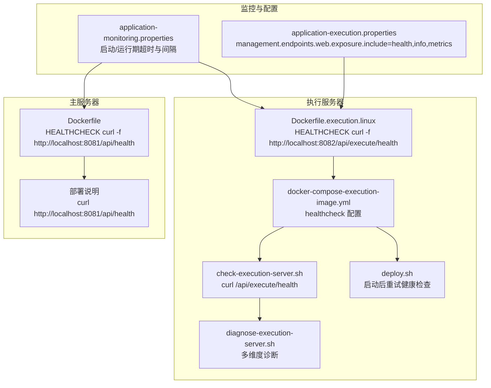
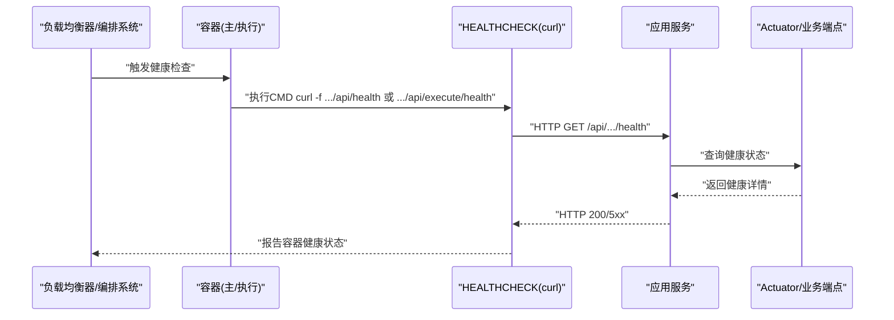
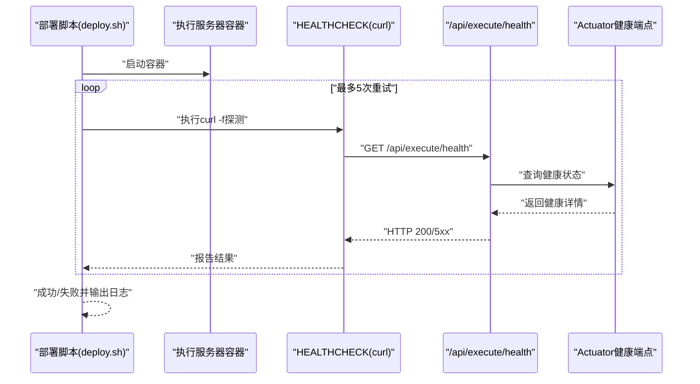
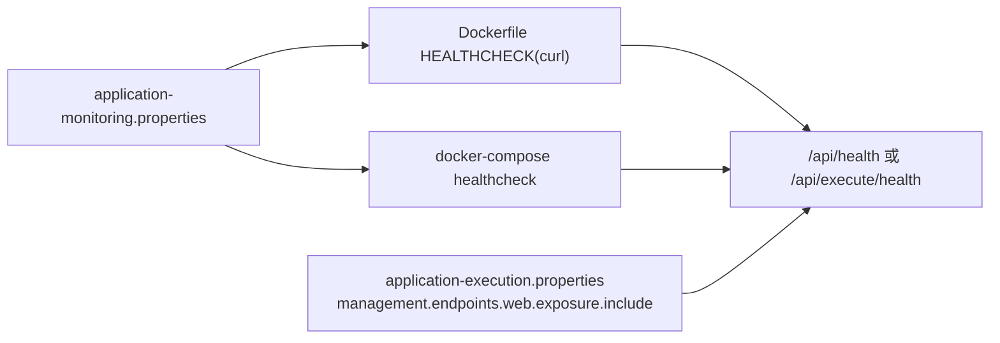

# 健康检查API

<cite>
**本文引用的文件**
- [Dockerfile（主服务器）](file://med_ai_assistant_1.0_bs_backend/Dockerfile)
- [Dockerfile（执行服务器Linux）](file://med_ai_assistant_1.0_bs_backend/deploy/execution-linux/Dockerfile.execution.linux)
- [部署说明（主/执行服务器）](file://med_ai_assistant_1.0_bs_backend/deploy/README.md)
- [执行服务器健康检查脚本](file://med_ai_assistant_1.0_bs_backend/deploy/execution-linux/check-execution-server.sh)
- [执行服务器一键部署脚本](file://med_ai_assistant_1.0_bs_backend/deploy/execution-linux/deploy.sh)
- [执行服务器诊断脚本](file://med_ai_assistant_1.0_bs_backend/deploy/execution-linux/diagnose-execution-server.sh)
- [执行服务器 Compose（镜像版）](file://med_ai_assistant_1.0_bs_backend/deploy/execution-linux/docker-compose-execution-image.yml)
- [执行服务器配置（application-execution.properties）](file://med_ai_assistant_1.0_bs_backend/deploy/execution-linux/config/application-execution.properties)
- [监控配置（application-monitoring.properties）](file://med_ai_assistant_1.0_bs_backend/config/application-monitoring.properties)
</cite>

## 更新摘要
**变更内容**
- 更新了健康检查机制的实现细节，从netcat改为curl命令进行更可靠的endpoint验证
- 新增了curl命令在健康检查中的具体使用方式和优势说明
- 完善了健康检查脚本中curl命令的使用示例和错误处理机制
- 增强了健康检查的可靠性和诊断能力

## 目录
1. [简介](#简介)
2. [项目结构](#项目结构)
3. [核心组件](#核心组件)
4. [架构总览](#架构总览)
5. [详细组件分析](#详细组件分析)
6. [依赖关系分析](#依赖关系分析)
7. [性能考量](#性能考量)
8. [故障排查指南](#故障排查指南)
9. [结论](#结论)
10. [附录](#附录)

## 简介
本文件面向MedAiAssistant 1.0 BS的健康检查API，聚焦两类端点：
- 主服务器健康检查：/api/health（端口8081）
- 执行服务器健康检查：/api/execute/health（端口8082）

文档涵盖HTTP方法、请求参数、响应格式、状态码含义、最佳实践、故障诊断与监控集成示例，以及负载均衡器配置与自动恢复机制的使用指南。

**更新** 健康检查机制已优化，从传统的netcat命令升级为更可靠的curl命令进行endpoint验证，提供了更好的错误处理和状态码检查能力。

## 项目结构
围绕健康检查相关的关键文件与职责如下：
- Dockerfile与Docker Compose：定义容器健康检查策略与端口暴露
- 部署与诊断脚本：提供curl示例、重试与状态检查
- 监控配置：定义启动与运行期的健康检查超时、间隔与告警阈值
- 执行服务器配置：暴露Actuator端点与健康详情展示

**图表来源**
- [Dockerfile（主服务器）](file://med_ai_assistant_1.0_bs_backend/Dockerfile#L63-L64)
- [Dockerfile（执行服务器Linux）](file://med_ai_assistant_1.0_bs_backend/deploy/execution-linux/Dockerfile.execution.linux#L68-L70)
- [执行服务器 Compose（镜像版）](file://med_ai_assistant_1.0_bs_backend/deploy/execution-linux/docker-compose-execution-image.yml#L59-L65)
- [执行服务器健康检查脚本](file://med_ai_assistant_1.0_bs_backend/deploy/execution-linux/check-execution-server.sh#L24-L31)
- [执行服务器一键部署脚本](file://med_ai_assistant_1.0_bs_backend/deploy/execution-linux/deploy.sh#L88-L99)
- [执行服务器诊断脚本](file://med_ai_assistant_1.0_bs_backend/deploy/execution-linux/diagnose-execution-server.sh#L69-L76)
- [监控配置（application-monitoring.properties）](file://med_ai_assistant_1.0_bs_backend/config/application-monitoring.properties#L11-L34)
- [执行服务器配置（application-execution.properties）](file://med_ai_assistant_1.0_bs_backend/deploy/execution-linux/config/application-execution.properties#L85-L88)

**章节来源**
- [Dockerfile（主服务器）](file://med_ai_assistant_1.0_bs_backend/Dockerfile#L56-L71)
- [Dockerfile（执行服务器Linux）](file://med_ai_assistant_1.0_bs_backend/deploy/execution-linux/Dockerfile.execution.linux#L47-L71)
- [部署说明（主/执行服务器）](file://med_ai_assistant_1.0_bs_backend/deploy/README.md#L135-L155)
- [执行服务器 Compose（镜像版）](file://med_ai_assistant_1.0_bs_backend/deploy/execution-linux/docker-compose-execution-image.yml#L1-L97)
- [执行服务器配置（application-execution.properties）](file://med_ai_assistant_1.0_bs_backend/deploy/execution-linux/config/application-execution.properties#L1-L88)
- [监控配置（application-monitoring.properties）](file://med_ai_assistant_1.0_bs_backend/config/application-monitoring.properties#L1-L196)

## 核心组件
- 主服务器健康检查端点
  - 路径：/api/health
  - 端口：8081
  - 健康检查策略：容器内置HEALTHCHECK基于curl探测
  - 参考：Dockerfile HEALTHCHECK、部署说明中的curl示例
- 执行服务器健康检查端点
  - 路径：/api/execute/health
  - 端口：8082
  - 健康检查策略：容器内置HEALTHCHECK与部署脚本重试
  - 参考：执行服务器Dockerfile、Compose配置、诊断与部署脚本

**更新** 健康检查机制已从netcat升级为curl命令，提供了更好的HTTP状态码检查和错误处理能力。

**章节来源**
- [Dockerfile（主服务器）](file://med_ai_assistant_1.0_bs_backend/Dockerfile#L63-L64)
- [Dockerfile（执行服务器Linux）](file://med_ai_assistant_1.0_bs_backend/deploy/execution-linux/Dockerfile.execution.linux#L68-L70)
- [部署说明（主/执行服务器）](file://med_ai_assistant_1.0_bs_backend/deploy/README.md#L135-L155)
- [执行服务器 Compose（镜像版）](file://med_ai_assistant_1.0_bs_backend/deploy/execution-linux/docker-compose-execution-image.yml#L59-L65)

## 架构总览
健康检查贯穿容器编排、应用端点与监控配置三个层面：
- 容器层：Docker HEALTHCHECK定时探测本地端点
- 应用层：Spring Boot Actuator与业务端点共同提供健康状态
- 监控层：启动与运行期的超时、间隔与告警阈值保障稳定性

**图表来源**
- [Dockerfile（主服务器）](file://med_ai_assistant_1.0_bs_backend/Dockerfile#L63-L64)
- [Dockerfile（执行服务器Linux）](file://med_ai_assistant_1.0_bs_backend/deploy/execution-linux/Dockerfile.execution.linux#L68-L70)
- [执行服务器诊断脚本](file://med_ai_assistant_1.0_bs_backend/deploy/execution-linux/diagnose-execution-server.sh#L69-L76)

## 详细组件分析

### 主服务器健康检查（/api/health）
- HTTP方法：GET
- 请求参数：无
- 响应格式：文本/JSON（由应用端点决定）
- 状态码含义：
  - 200：服务可用
  - 5xx：内部错误，服务不可用
- 健康检查策略：
  - 容器内置HEALTHCHECK使用curl探测，具备更好的错误处理
  - 超时、间隔、启动期与重试次数在Dockerfile中配置
- 最佳实践：
  - 使用容器编排系统（如Docker Compose）的healthcheck配置作为补充
  - 结合监控配置中的启动与运行期超时参数，确保探测窗口合理
- 参考文件：
  - Dockerfile HEALTHCHECK
  - 部署说明中的curl示例

**更新** 健康检查使用curl命令替代netcat，提供了更精确的HTTP状态码检查和错误处理机制。

**章节来源**
- [Dockerfile（主服务器）](file://med_ai_assistant_1.0_bs_backend/Dockerfile#L63-L64)
- [部署说明（主/执行服务器）](file://med_ai_assistant_1.0_bs_backend/deploy/README.md#L135-L145)
- [监控配置（application-monitoring.properties）](file://med_ai_assistant_1.0_bs_backend/config/application-monitoring.properties#L11-L34)

### 执行服务器健康检查（/api/execute/health）
- HTTP方法：GET
- 请求参数：无
- 响应格式：文本/JSON（由应用端点决定）
- 状态码含义：
  - 200：服务可用
  - 5xx：内部错误，服务不可用
- 健康检查策略：
  - 容器内置HEALTHCHECK使用curl探测，具备更好的错误处理
  - 部署脚本在启动后进行多次重试探测
  - Actuator端点与业务端点共同提供健康详情
- 最佳实践：
  - 在容器编排中启用healthcheck并设置合理间隔与超时
  - 结合诊断脚本进行多维度检查（容器状态、服务状态、数据库连接、连接池指标）
- 参考文件：
  - 执行服务器Dockerfile HEALTHCHECK
  - 执行服务器Compose healthcheck
  - 诊断与部署脚本
  - 执行服务器配置中启用Actuator端点

**更新** 健康检查机制已优化，使用curl命令进行更可靠的endpoint验证，提供了更好的HTTP状态码检查和错误处理能力。

**图表来源**
- [执行服务器一键部署脚本](file://med_ai_assistant_1.0_bs_backend/deploy/execution-linux/deploy.sh#L88-L99)
- [执行服务器健康检查脚本](file://med_ai_assistant_1.0_bs_backend/deploy/execution-linux/check-execution-server.sh#L24-L31)
- [执行服务器诊断脚本](file://med_ai_assistant_1.0_bs_backend/deploy/execution-linux/diagnose-execution-server.sh#L69-L76)

**章节来源**
- [Dockerfile（执行服务器Linux）](file://med_ai_assistant_1.0_bs_backend/deploy/execution-linux/Dockerfile.execution.linux#L68-L70)
- [执行服务器 Compose（镜像版）](file://med_ai_assistant_1.0_bs_backend/deploy/execution-linux/docker-compose-execution-image.yml#L59-L65)
- [执行服务器一键部署脚本](file://med_ai_assistant_1.0_bs_backend/deploy/execution-linux/deploy.sh#L88-L99)
- [执行服务器健康检查脚本](file://med_ai_assistant_1.0_bs_backend/deploy/execution-linux/check-execution-server.sh#L24-L31)
- [执行服务器诊断脚本](file://med_ai_assistant_1.0_bs_backend/deploy/execution-linux/diagnose-execution-server.sh#L69-L76)
- [执行服务器配置（application-execution.properties）](file://med_ai_assistant_1.0_bs_backend/deploy/execution-linux/config/application-execution.properties#L85-L88)

## 依赖关系分析
- 容器健康检查依赖应用端点提供健康状态
- 监控配置影响健康检查的超时与间隔，从而影响探测窗口
- 执行服务器的Actuator端点与业务端点共同决定健康详情的丰富程度

**更新** 健康检查机制已从netcat升级为curl命令，提供了更好的HTTP协议支持和错误处理能力。

**图表来源**
- [Dockerfile（主服务器）](file://med_ai_assistant_1.0_bs_backend/Dockerfile#L63-L64)
- [Dockerfile（执行服务器Linux）](file://med_ai_assistant_1.0_bs_backend/deploy/execution-linux/Dockerfile.execution.linux#L68-L70)
- [执行服务器 Compose（镜像版）](file://med_ai_assistant_1.0_bs_backend/deploy/execution-linux/docker-compose-execution-image.yml#L59-L65)
- [监控配置（application-monitoring.properties）](file://med_ai_assistant_1.0_bs_backend/config/application-monitoring.properties#L11-L34)
- [执行服务器配置（application-execution.properties）](file://med_ai_assistant_1.0_bs_backend/deploy/execution-linux/config/application-execution.properties#L85-L88)

**章节来源**
- [监控配置（application-monitoring.properties）](file://med_ai_assistant_1.0_bs_backend/config/application-monitoring.properties#L11-L34)
- [执行服务器配置（application-execution.properties）](file://med_ai_assistant_1.0_bs_backend/deploy/execution-linux/config/application-execution.properties#L85-L88)

## 性能考量
- 探测超时与间隔
  - 启动阶段与正常运行阶段的健康检查超时与间隔不同，避免过早判定失败
- 探测频率
  - 合理设置HEALTHCHECK间隔，避免频繁探测造成额外开销
- Actuator端点
  - 启用health、info、metrics端点有助于更全面的健康评估

**更新** curl命令相比netcat提供了更精确的HTTP协议支持，减少了不必要的网络开销，提高了健康检查的效率和准确性。

**章节来源**
- [监控配置（application-monitoring.properties）](file://med_ai_assistant_1.0_bs_backend/config/application-monitoring.properties#L11-L34)
- [执行服务器配置（application-execution.properties）](file://med_ai_assistant_1.0_bs_backend/deploy/execution-linux/config/application-execution.properties#L85-L88)

## 故障排查指南
- 常见问题与定位步骤
  - 容器未运行：检查容器状态与日志
  - 端口未开放：确认端口映射与防火墙
  - 健康检查失败：使用curl直接探测端点，结合诊断脚本输出
  - 数据库连接异常：检查连接字符串、网络连通性与连接池状态
- 诊断脚本提供的检查维度
  - Actuator健康端点可用性
  - 执行服务器健康端点与服务状态端点
  - 数据库连接字符串与实际连接测试
  - Hikari连接池指标与状态分析
- 自动恢复机制
  - Docker Compose healthcheck配置可与重启策略配合
  - 部署脚本在启动后进行重试与日志输出，便于快速发现失败

**更新** 健康检查脚本已优化，使用curl命令进行更精确的状态检查，提供了更好的错误诊断和故障定位能力。

**章节来源**
- [执行服务器健康检查脚本](file://med_ai_assistant_1.0_bs_backend/deploy/execution-linux/check-execution-server.sh#L1-L65)
- [执行服务器诊断脚本](file://med_ai_assistant_1.0_bs_backend/deploy/execution-linux/diagnose-execution-server.sh#L1-L359)
- [执行服务器一键部署脚本](file://med_ai_assistant_1.0_bs_backend/deploy/execution-linux/deploy.sh#L88-L121)
- [执行服务器 Compose（镜像版）](file://med_ai_assistant_1.0_bs_backend/deploy/execution-linux/docker-compose-execution-image.yml#L59-L65)

## 结论
- 健康检查是保障系统可用性的关键手段
- 通过容器内置HEALTHCHECK、Actuator端点与部署/诊断脚本形成闭环
- 结合监控配置的超时与间隔参数，可提升探测的准确性与稳定性
- 建议在生产环境中启用健康检查与告警，并配合负载均衡器的健康检查策略实现自动恢复

**更新** 健康检查机制已优化升级，从netcat改为curl命令，提供了更可靠、更精确的endpoint验证能力，显著提升了系统的稳定性和故障诊断效率。

## 附录

### API定义与使用示例

- 主服务器健康检查
  - 方法：GET
  - 路径：/api/health
  - 端口：8081
  - 示例：curl http://localhost:8081/api/health
  - 参考：部署说明、主服务器Dockerfile

- 执行服务器健康检查
  - 方法：GET
  - 路径：/api/execute/health
  - 端口：8082
  - 示例：curl http://localhost:8082/api/execute/health
  - 参考：部署说明、执行服务器Dockerfile、Compose配置

**更新** 健康检查API使用curl命令进行更可靠的endpoint验证，提供了更好的HTTP协议支持和错误处理能力。

**章节来源**
- [部署说明（主/执行服务器）](file://med_ai_assistant_1.0_bs_backend/deploy/README.md#L135-L155)
- [Dockerfile（主服务器）](file://med_ai_assistant_1.0_bs_backend/Dockerfile#L63-L64)
- [Dockerfile（执行服务器Linux）](file://med_ai_assistant_1.0_bs_backend/deploy/execution-linux/Dockerfile.execution.linux#L68-L70)
- [执行服务器 Compose（镜像版）](file://med_ai_assistant_1.0_bs_backend/deploy/execution-linux/docker-compose-execution-image.yml#L59-L65)

### 负载均衡器配置与自动恢复
- 健康检查端点
  - 主服务器：/api/health（8081）
  - 执行服务器：/api/execute/health（8082）
- 建议配置
  - 探测间隔与超时：结合监控配置中的启动/运行期参数
  - 重试次数：与容器HEALTHCHECK retries一致
  - 自动恢复：当探测失败时，将实例标记为不健康并从负载均衡池移除；恢复后重新加入

**更新** 健康检查机制已优化，使用curl命令进行更可靠的endpoint验证，负载均衡器可以更好地识别服务的真实状态。

**章节来源**
- [监控配置（application-monitoring.properties）](file://med_ai_assistant_1.0_bs_backend/config/application-monitoring.properties#L11-L34)
- [执行服务器 Compose（镜像版）](file://med_ai_assistant_1.0_bs_backend/deploy/execution-linux/docker-compose-execution-image.yml#L59-L65)