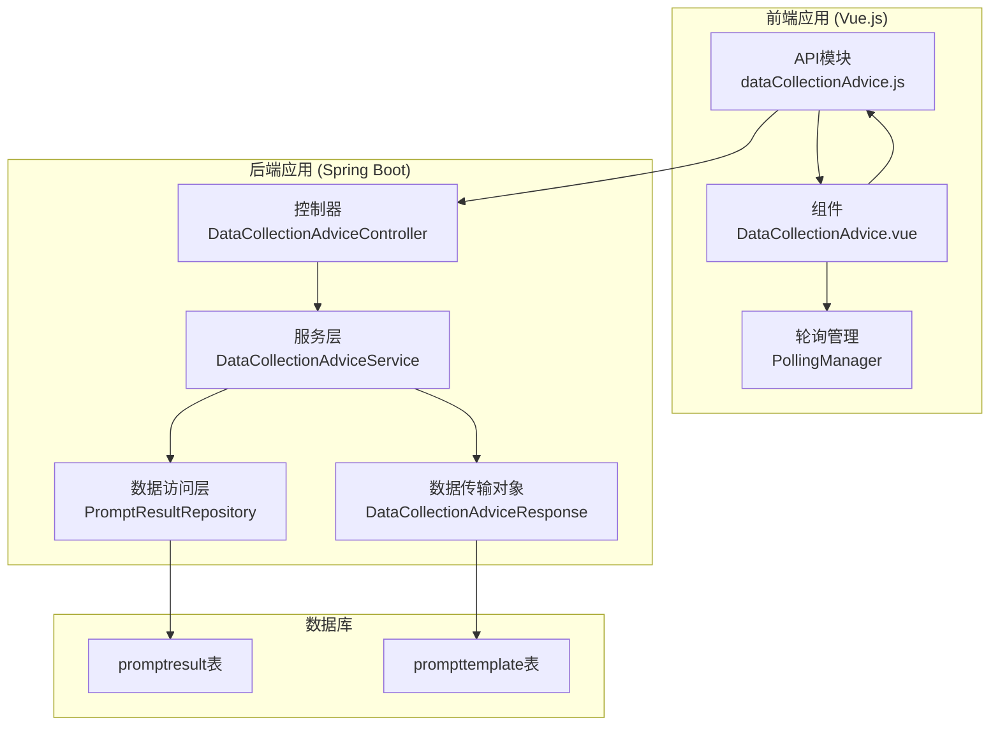
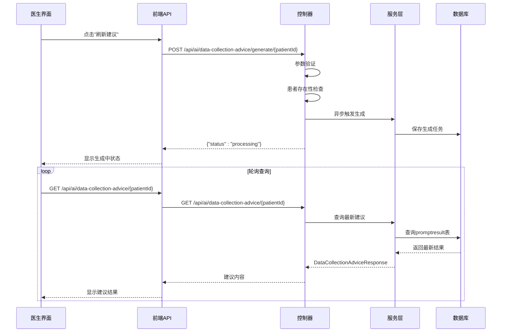
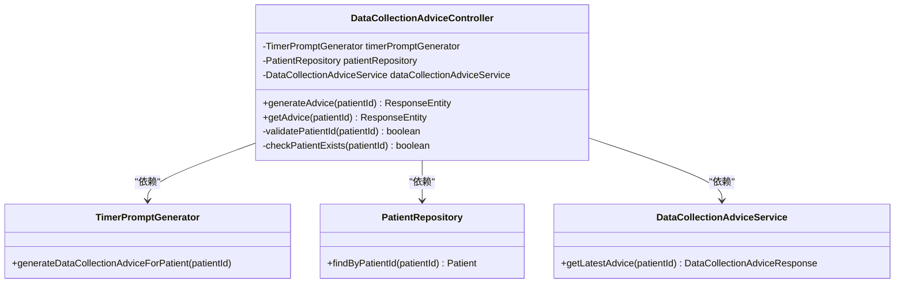
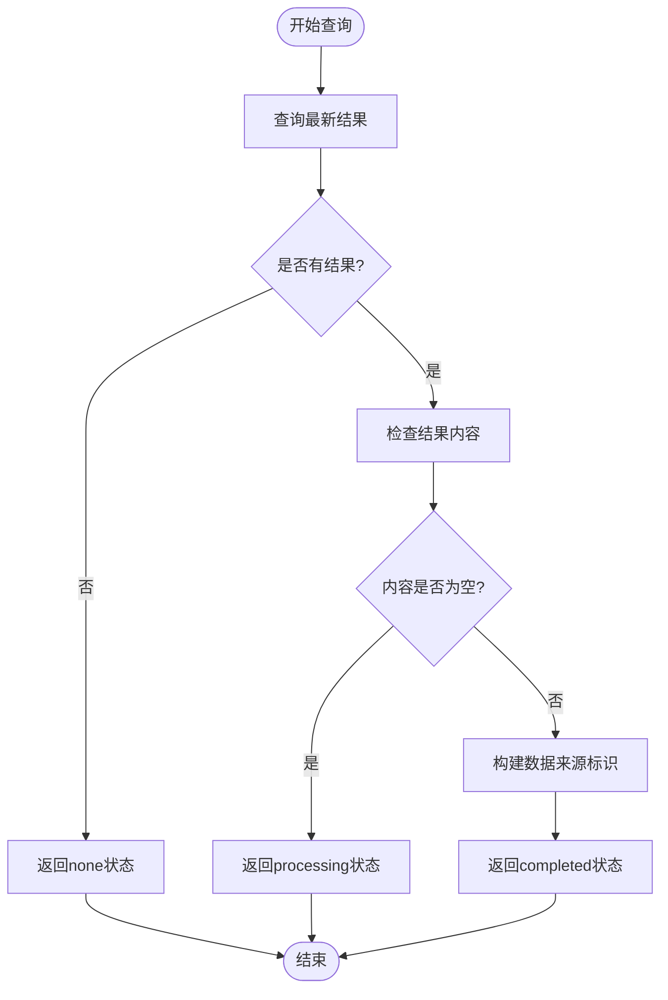
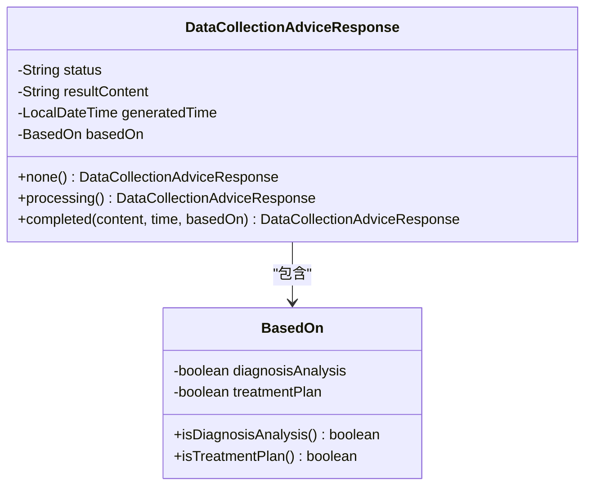
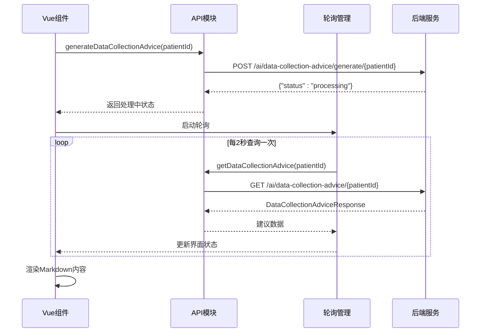
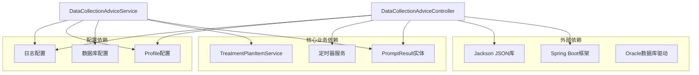

# 数据收集建议API

<cite>
**本文档引用的文件**
- [DataCollectionAdviceController.java](file://med_ai_assistant_1.0_bs_backend/src/main/java/com/example/medaiassistant/controller/DataCollectionAdviceController.java)
- [DataCollectionAdviceService.java](file://med_ai_assistant_1.0_bs_backend/src/main/java/com/example/medaiassistant/service/DataCollectionAdviceService.java)
- [DataCollectionAdviceResponse.java](file://med_ai_assistant_1.0_bs_backend/src/main/java/com/example/medaiassistant/dto/DataCollectionAdviceResponse.java)
- [dataCollectionAdvice.js](file://med_ai_assistant_1.0_bs_vue/src/api/dataCollectionAdvice.js)
- [DataCollectionAdvice.vue](file://med_ai_assistant_1.0_bs_vue/src/components/patient/DataCollectionAdvice.vue)
- [insert-data-collection-advice-prompt-template.sql](file://med_ai_assistant_1.0_bs_backend/sql-scripts/insert-data-collection-advice-prompt-template.sql)
- [pom.xml](file://med_ai_assistant_1.0_bs_backend/pom.xml)
</cite>

## 目录
1. [简介](#简介)
2. [项目结构](#项目结构)
3. [核心组件](#核心组件)
4. [架构概览](#架构概览)
5. [详细组件分析](#详细组件分析)
6. [依赖关系分析](#依赖关系分析)
7. [性能考虑](#性能考虑)
8. [故障排除指南](#故障排除指南)
9. [结论](#结论)

## 简介

数据收集建议API是MedAiAssistant系统中的一个重要功能模块，旨在为医生提供智能化的资料收集建议。该API能够根据患者的诊断分析结果和诊疗计划表，自动生成结构化的进一步问诊、查体和辅助检查建议，帮助医生完善病历资料，减少漏诊和误诊的风险。

该功能采用异步处理机制，通过定时器服务自动生成建议，同时提供手动触发功能，确保医生可以根据需要随时获取最新的建议内容。

## 项目结构

MedAiAssistant项目采用前后端分离的架构设计，数据收集建议API位于后端Spring Boot应用中，前端Vue.js应用通过HTTP接口与后端进行通信。

**图表来源**
- [DataCollectionAdviceController.java:15-120](file://med_ai_assistant_1.0_bs_backend/src/main/java/com/example/medaiassistant/controller/DataCollectionAdviceController.java#L15-L120)
- [dataCollectionAdvice.js:1-55](file://med_ai_assistant_1.0_bs_vue/src/api/dataCollectionAdvice.js#L1-L55)

**章节来源**
- [DataCollectionAdviceController.java:1-120](file://med_ai_assistant_1.0_bs_backend/src/main/java/com/example/medaiassistant/controller/DataCollectionAdviceController.java#L1-L120)
- [dataCollectionAdvice.js:1-55](file://med_ai_assistant_1.0_bs_vue/src/api/dataCollectionAdvice.js#L1-L55)

## 核心组件

数据收集建议API由四个核心组件构成：

### 1. 控制器层 (Controller Layer)
- **DataCollectionAdviceController**: 提供RESTful API端点，处理HTTP请求和响应
- 支持手动触发生成和结果查询两种操作模式

### 2. 服务层 (Service Layer)
- **DataCollectionAdviceService**: 核心业务逻辑处理，负责查询和组装建议结果
- 集成诊断分析和诊疗计划数据源

### 3. 数据传输对象 (DTO)
- **DataCollectionAdviceResponse**: 封装API响应数据，包含状态、内容、时间和数据来源标识

### 4. 前端API模块
- **dataCollectionAdvice.js**: Vue.js应用中的API调用模块
- 提供手动触发和查询建议的前端接口

**章节来源**
- [DataCollectionAdviceController.java:41-58](file://med_ai_assistant_1.0_bs_backend/src/main/java/com/example/medaiassistant/controller/DataCollectionAdviceController.java#L41-L58)
- [DataCollectionAdviceService.java:34-41](file://med_ai_assistant_1.0_bs_backend/src/main/java/com/example/medaiassistant/service/DataCollectionAdviceService.java#L34-L41)
- [DataCollectionAdviceResponse.java:16-39](file://med_ai_assistant_1.0_bs_backend/src/main/java/com/example/medaiassistant/dto/DataCollectionAdviceResponse.java#L16-L39)

## 架构概览

数据收集建议API采用分层架构设计，实现了清晰的关注点分离：

**图表来源**
- [DataCollectionAdviceController.java:80-120](file://med_ai_assistant_1.0_bs_backend/src/main/java/com/example/medaiassistant/controller/DataCollectionAdviceController.java#L80-L120)
- [DataCollectionAdviceService.java:57-80](file://med_ai_assistant_1.0_bs_backend/src/main/java/com/example/medaiassistant/service/DataCollectionAdviceService.java#L57-L80)

**章节来源**
- [DataCollectionAdviceController.java:80-120](file://med_ai_assistant_1.0_bs_backend/src/main/java/com/example/medaiassistant/controller/DataCollectionAdviceController.java#L80-L120)
- [DataCollectionAdviceService.java:57-80](file://med_ai_assistant_1.0_bs_backend/src/main/java/com/example/medaiassistant/service/DataCollectionAdviceService.java#L57-L80)

## 详细组件分析

### 控制器组件分析

DataCollectionAdviceController是API的入口点，负责处理HTTP请求和响应。

**图表来源**
- [DataCollectionAdviceController.java:41-58](file://med_ai_assistant_1.0_bs_backend/src/main/java/com/example/medaiassistant/controller/DataCollectionAdviceController.java#L41-L58)

#### 手动触发生成流程

当医生点击"刷新建议"按钮时，系统执行以下流程：

1. **参数验证**: 检查patientId是否为空
2. **患者存在性检查**: 验证患者ID的有效性
3. **异步生成触发**: 调用TimerPromptGenerator生成建议
4. **状态返回**: 立即返回processing状态

#### 结果查询流程

查询最新建议时，系统执行以下步骤：

1. **服务调用**: 调用DataCollectionAdviceService.getLatestAdvice()
2. **数据库查询**: 从promptresult表查询最新结果
3. **状态判断**: 根据结果内容判断状态
4. **数据组装**: 组装DataCollectionAdviceResponse响应

**章节来源**
- [DataCollectionAdviceController.java:80-120](file://med_ai_assistant_1.0_bs_backend/src/main/java/com/example/medaiassistant/controller/DataCollectionAdviceController.java#L80-L120)

### 服务层组件分析

DataCollectionAdviceService是核心业务逻辑的实现者，负责复杂的查询和状态判断逻辑。

**图表来源**
- [DataCollectionAdviceService.java:57-80](file://med_ai_assistant_1.0_bs_backend/src/main/java/com/example/medaiassistant/service/DataCollectionAdviceService.java#L57-L80)

#### 数据来源标识机制

服务层通过以下方式确定建议的数据来源：

1. **诊断分析检查**: 查询是否存在诊断分析结果
2. **诊疗计划检查**: 通过TreatmentPlanItemService检查是否存在诊疗计划
3. **基于标识**: 将检查结果封装为BasedOn对象

#### 状态判断逻辑

服务层根据以下规则判断返回状态：

- **none**: 无任何历史结果
- **processing**: 存在结果但内容为空（生成中）
- **completed**: 存在有效结果，包含完整建议内容

**章节来源**
- [DataCollectionAdviceService.java:57-128](file://med_ai_assistant_1.0_bs_backend/src/main/java/com/example/medaiassistant/service/DataCollectionAdviceService.java#L57-L128)

### 数据传输对象分析

DataCollectionAdviceResponse是API响应的标准格式，确保前后端数据交换的一致性。

**图表来源**
- [DataCollectionAdviceResponse.java:16-97](file://med_ai_assistant_1.0_bs_backend/src/main/java/com/example/medaiassistant/dto/DataCollectionAdviceResponse.java#L16-L97)

#### 响应状态定义

API支持三种响应状态：

1. **none**: 患者没有任何历史建议记录
2. **processing**: 建议正在生成中，resultContent为null
3. **completed**: 建议已生成完成，包含完整内容

#### 时间格式处理

generatedTime字段使用ISO 8601格式，确保全球统一的时间表示。

**章节来源**
- [DataCollectionAdviceResponse.java:16-97](file://med_ai_assistant_1.0_bs_backend/src/main/java/com/example/medaiassistant/dto/DataCollectionAdviceResponse.java#L16-L97)

### 前端集成分析

前端通过专门的API模块与后端进行交互，提供用户友好的界面体验。

**图表来源**
- [dataCollectionAdvice.js:27-54](file://med_ai_assistant_1.0_bs_vue/src/api/dataCollectionAdvice.js#L27-L54)
- [DataCollectionAdvice.vue:32-78](file://med_ai_assistant_1.0_bs_vue/src/components/patient/DataCollectionAdvice.vue#L32-L78)

#### 前端状态管理

前端组件实现了智能的状态管理：

1. **生成中状态**: 显示加载动画和提示信息
2. **无数据状态**: 提供生成按钮，引导用户创建建议
3. **完成状态**: 渲染Markdown格式的建议内容

#### 轮询机制

前端使用PollingManager实现智能轮询：

- **轮询间隔**: 2秒查询一次
- **条件退出**: 当收到completed状态时停止轮询
- **错误处理**: 网络异常时提供重试机制

**章节来源**
- [dataCollectionAdvice.js:1-55](file://med_ai_assistant_1.0_bs_vue/src/api/dataCollectionAdvice.js#L1-L55)
- [DataCollectionAdvice.vue:32-78](file://med_ai_assistant_1.0_bs_vue/src/components/patient/DataCollectionAdvice.vue#L32-L78)

## 依赖关系分析

数据收集建议API的依赖关系体现了清晰的分层架构设计：

**图表来源**
- [pom.xml:53-214](file://med_ai_assistant_1.0_bs_backend/pom.xml#L53-L214)

### 关键依赖特性

1. **Profile隔离**: 控制器和服务都标记为`!execution`，确保执行服务器不包含此功能
2. **异步处理**: 依赖TimerPromptGenerator实现异步生成
3. **数据持久化**: 通过PromptResultRepository访问数据库
4. **JSON序列化**: 使用Jackson处理时间格式化

**章节来源**
- [pom.xml:33-52](file://med_ai_assistant_1.0_bs_backend/pom.xml#L33-L52)
- [DataCollectionAdviceController.java:29-29](file://med_ai_assistant_1.0_bs_backend/src/main/java/com/example/medaiassistant/controller/DataCollectionAdviceController.java#L29-L29)

## 性能考虑

数据收集建议API在设计时充分考虑了性能优化：

### 响应时间优化

- **POST请求**: 在Mock环境下应小于50ms完成
- **轮询间隔**: 2秒间隔平衡实时性和服务器负载
- **缓存策略**: 基于数据库查询结果的合理缓存

### 数据库性能

- **索引优化**: promptresult表按patientId和createdAt建立索引
- **查询优化**: 使用LIMIT 1获取最新记录，避免全表扫描
- **连接池**: 合理配置数据库连接池大小

### 内存使用优化

- **流式处理**: 对于大量数据采用流式处理方式
- **对象复用**: DTO对象的合理创建和销毁
- **垃圾回收**: 避免内存泄漏的编程实践

## 故障排除指南

### 常见问题及解决方案

#### 1. 患者ID无效
**症状**: 返回400错误，包含"patientId不能为空"信息
**解决**: 确保传递有效的患者ID参数

#### 2. 患者不存在
**症状**: 返回404 Not Found
**解决**: 验证患者ID在系统中存在

#### 3. 建议生成超时
**症状**: 长时间处于processing状态
**解决**: 检查AI服务可用性和网络连接

#### 4. 前端轮询异常
**症状**: 页面无法自动更新状态
**解决**: 检查浏览器控制台错误和网络请求

### 调试建议

1. **后端日志**: 检查DataCollectionAdviceService的日志输出
2. **数据库查询**: 验证promptresult表中是否有相关记录
3. **网络监控**: 使用浏览器开发者工具监控API请求
4. **性能分析**: 使用性能分析工具检查响应时间

**章节来源**
- [DataCollectionAdviceController.java:82-93](file://med_ai_assistant_1.0_bs_backend/src/main/java/com/example/medaiassistant/controller/DataCollectionAdviceController.java#L82-L93)
- [DataCollectionAdviceService.java:91-116](file://med_ai_assistant_1.0_bs_backend/src/main/java/com/example/medaiassistant/service/DataCollectionAdviceService.java#L91-L116)

## 结论

数据收集建议API是MedAiAssistant系统中的重要智能化功能，通过以下特点实现了高效的数据收集建议：

### 核心优势

1. **异步处理**: 手动触发和定时生成相结合，提升用户体验
2. **智能状态管理**: 三种状态准确反映建议生成进度
3. **数据源整合**: 整合诊断分析和诊疗计划数据源
4. **前后端协作**: 前端轮询机制确保实时状态更新

### 技术特色

1. **分层架构**: 清晰的职责分离便于维护和扩展
2. **Profile隔离**: 环境特定的功能配置
3. **性能优化**: 响应时间控制和资源使用优化
4. **错误处理**: 完善的异常处理和故障恢复机制

### 应用价值

该API为临床医生提供了智能化的决策支持，通过结构化的建议帮助医生：
- 完善病历资料收集
- 减少漏诊和误诊风险
- 提高诊断准确性
- 优化治疗方案制定

未来可以考虑的功能扩展包括：多模态数据融合、个性化建议推荐、建议效果追踪等功能，进一步提升系统的智能化水平。