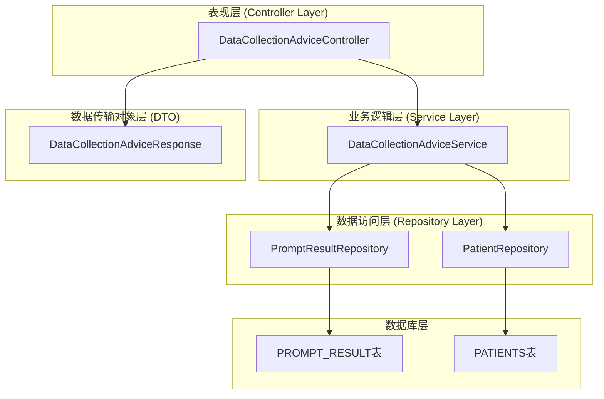
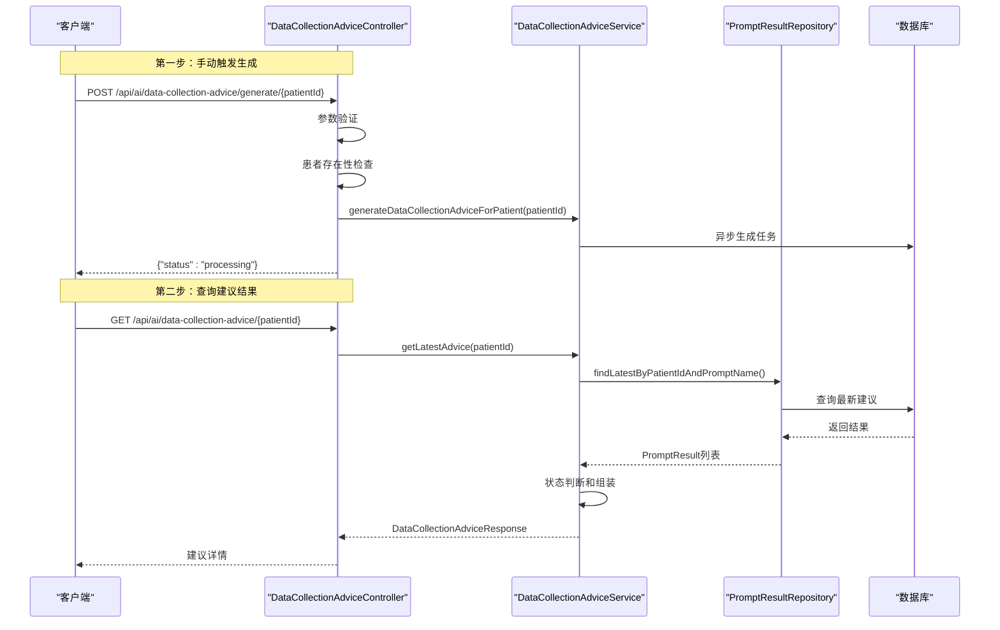
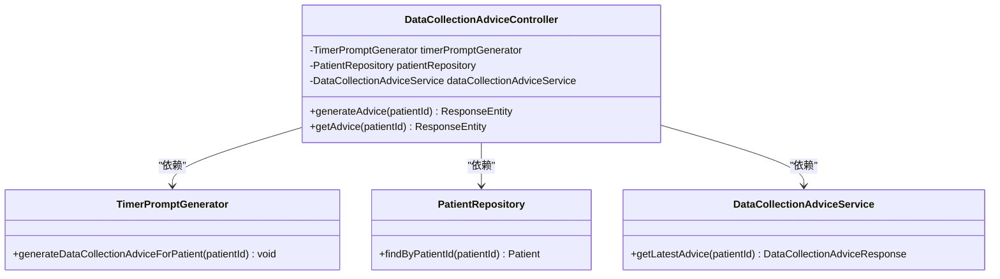
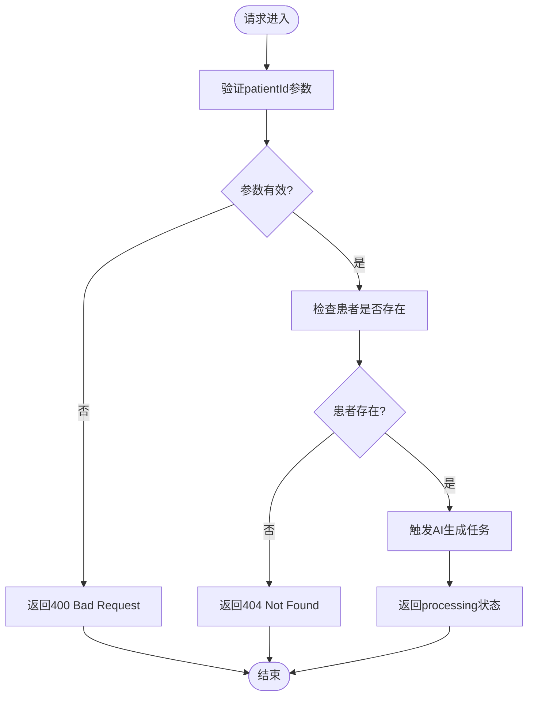
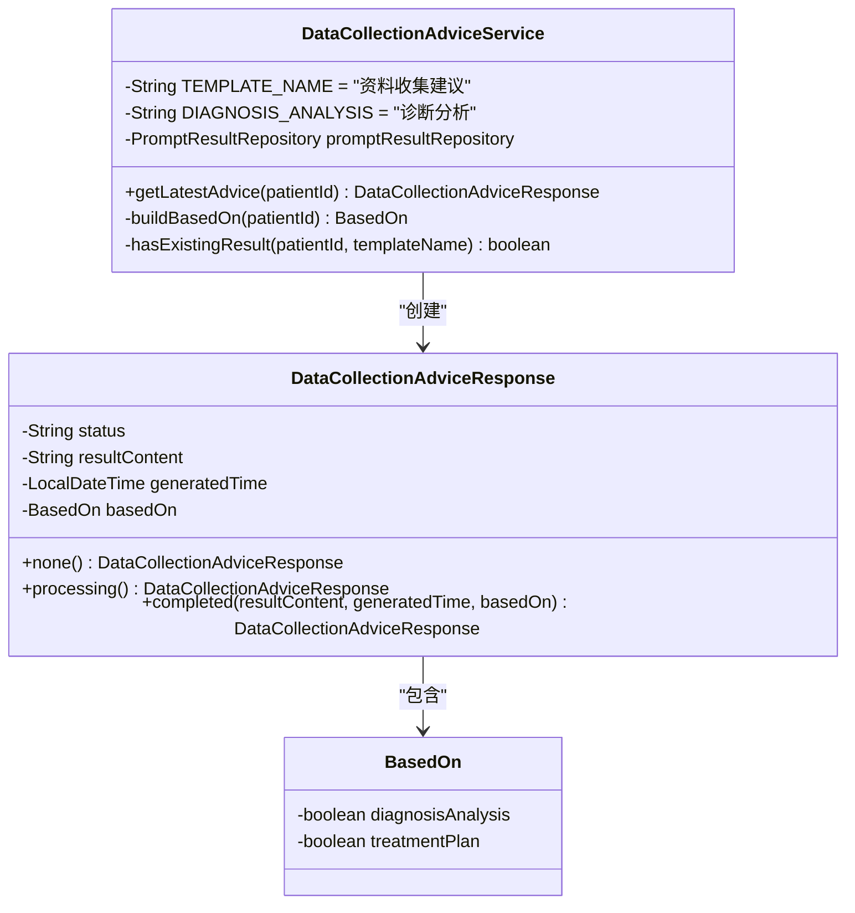
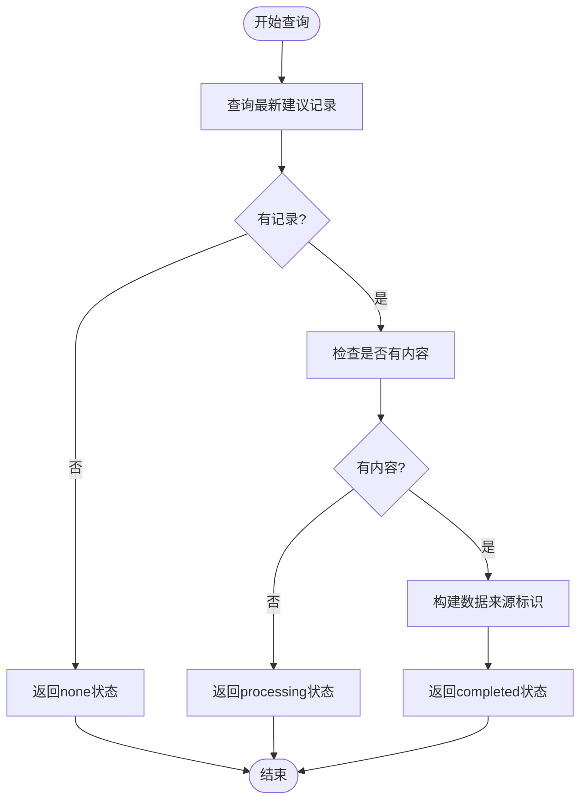
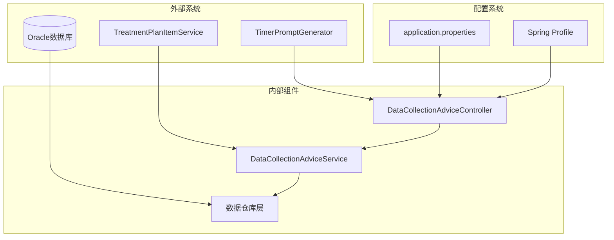
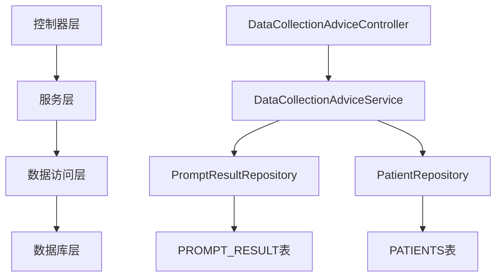
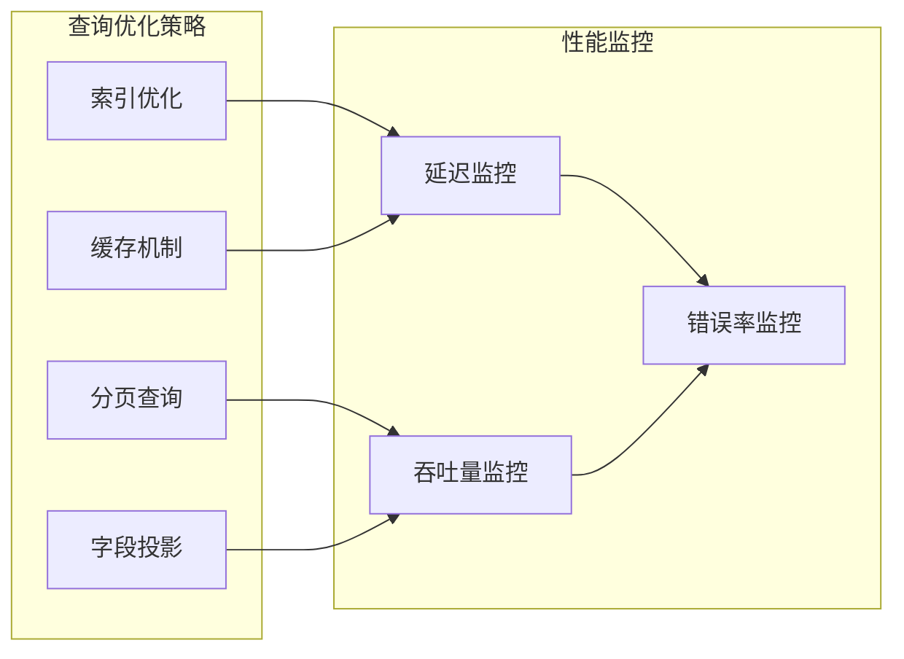
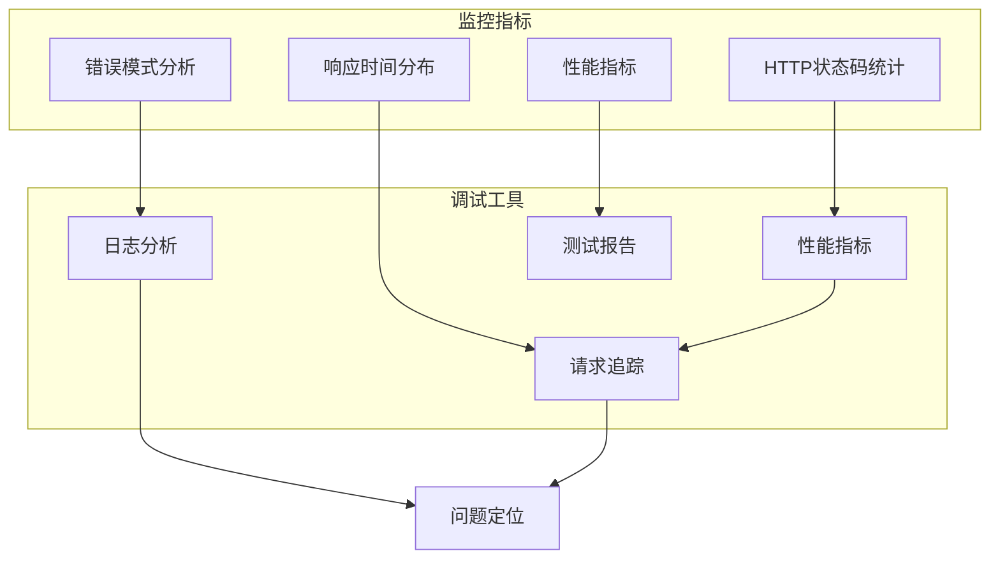

# 数据收集建议GET查询API

<cite>
**本文档引用的文件**
- [DataCollectionAdviceController.java](file://med_ai_assistant_1.0_bs_backend/src/main/java/com/example/medaiassistant/controller/DataCollectionAdviceController.java)
- [DataCollectionAdviceService.java](file://med_ai_assistant_1.0_bs_backend/src/main/java/com/example/medaiassistant/service/DataCollectionAdviceService.java)
- [DataCollectionAdviceResponse.java](file://med_ai_assistant_1.0_bs_backend/src/main/java/com/example/medaiassistant/dto/DataCollectionAdviceResponse.java)
- [DataCollectionAdviceControllerTest.java](file://med_ai_assistant_1.0_bs_backend/src/test/java/com/example/medaiassistant/controller/DataCollectionAdviceControllerTest.java)
- [DataCollectionAdviceControllerIT.java](file://med_ai_assistant_1.0_bs_backend/src/test/java/com/example/medaiassistant/integration/DataCollectionAdviceControllerIT.java)
- [API_DOCUMENTATION.md](file://med_ai_assistant_1.0_bs_backend/doc/其他/API_DOCUMENTATION.md)
- [application.properties](file://med_ai_assistant_1.0_bs_backend/src/main/resources/application.properties)
</cite>

## 更新摘要
**变更内容**
- 完善了手动触发API和查询API的完整功能实现
- 新增了详细的单元测试和集成测试覆盖
- 增强了数据来源标识功能的实现细节
- 完善了性能监控和错误处理机制
- 更新了架构图和组件关系说明

## 目录
1. [简介](#简介)
2. [项目结构](#项目结构)
3. [核心组件](#核心组件)
4. [架构概览](#架构概览)
5. [详细组件分析](#详细组件分析)
6. [测试覆盖分析](#测试覆盖分析)
7. [依赖关系分析](#依赖关系分析)
8. [性能考虑](#性能考虑)
9. [故障排除指南](#故障排除指南)
10. [结论](#结论)

## 简介

数据收集建议GET查询API是MedAiAssistant系统中的一个关键功能模块，专门用于查询患者最新的资料收集建议。该API允许医生在患者详情页面获取AI生成的个性化数据收集建议，以完善患者的医疗信息。

该API采用异步处理机制，通过两个主要端点实现完整的数据收集建议查询流程：
- `POST /api/ai/data-collection-advice/generate/{patientId}` - 手动触发资料收集建议生成
- `GET /api/ai/data-collection-advice/{patientId}` - 查询患者最新的资料收集建议

**更新** 完整实现了手动触发API和查询API的双端点架构，支持异步生成和状态轮询机制。

## 项目结构

MedAiAssistant项目采用标准的Spring Boot三层架构设计，数据收集建议功能位于以下层次：

**图表来源**
- [DataCollectionAdviceController.java:32-58](file://med_ai_assistant_1.0_bs_backend/src/main/java/com/example/medaiassistant/controller/DataCollectionAdviceController.java#L32-L58)
- [DataCollectionAdviceService.java:30-34](file://med_ai_assistant_1.0_bs_backend/src/main/java/com/example/medaiassistant/service/DataCollectionAdviceService.java#L30-L34)

**章节来源**
- [DataCollectionAdviceController.java:1-121](file://med_ai_assistant_1.0_bs_backend/src/main/java/com/example/medaiassistant/controller/DataCollectionAdviceController.java#L1-L121)
- [DataCollectionAdviceService.java:1-129](file://med_ai_assistant_1.0_bs_backend/src/main/java/com/example/medaiassistant/service/DataCollectionAdviceService.java#L1-L129)

## 核心组件

### API端点定义

数据收集建议GET查询API包含两个核心端点：

#### 1. 手动触发建议生成
- **路径**: `POST /api/ai/data-collection-advice/generate/{patientId}`
- **功能**: 手动触发为指定患者生成资料收集建议
- **响应**: `{"status": "processing"}`

#### 2. 查询建议结果
- **路径**: `GET /api/ai/data-collection-advice/{patientId}`
- **功能**: 查询指定患者的资料收集建议结果
- **响应**: `DataCollectionAdviceResponse` 对象

### 响应状态定义

API支持三种响应状态：

| 状态 | 描述 | 响应内容 |
|------|------|----------|
| `none` | 无记录 | 无建议内容，仅状态信息 |
| `processing` | 生成中 | 无建议内容，AI尚未返回结果 |
| `completed` | 已完成 | 包含建议内容、生成时间和数据来源 |

**更新** 完善了三种状态的判断逻辑和响应结构，支持基于诊断分析和诊疗计划的数据来源标识。

**章节来源**
- [DataCollectionAdviceController.java:60-120](file://med_ai_assistant_1.0_bs_backend/src/main/java/com/example/medaiassistant/controller/DataCollectionAdviceController.java#L60-L120)
- [DataCollectionAdviceService.java:36-80](file://med_ai_assistant_1.0_bs_backend/src/main/java/com/example/medaiassistant/service/DataCollectionAdviceService.java#L36-L80)

## 架构概览

数据收集建议GET查询API采用典型的MVC架构模式，实现了清晰的关注点分离：

**图表来源**
- [DataCollectionAdviceController.java:80-102](file://med_ai_assistant_1.0_bs_backend/src/main/java/com/example/medaiassistant/controller/DataCollectionAdviceController.java#L80-L102)
- [DataCollectionAdviceService.java:50-73](file://med_ai_assistant_1.0_bs_backend/src/main/java/com/example/medaiassistant/service/DataCollectionAdviceService.java#L50-L73)

## 详细组件分析

### DataCollectionAdviceController 分析

控制器层负责处理HTTP请求和响应，实现了完整的业务逻辑入口：

**图表来源**
- [DataCollectionAdviceController.java:41-58](file://med_ai_assistant_1.0_bs_backend/src/main/java/com/example/medaiassistant/controller/DataCollectionAdviceController.java#L41-L58)

#### 参数验证机制

控制器实现了严格的参数验证：

**更新** 完善了参数验证和错误处理机制，支持空参数和不存在患者的情况。

**图表来源**
- [DataCollectionAdviceController.java:82-101](file://med_ai_assistant_1.0_bs_backend/src/main/java/com/example/medaiassistant/controller/DataCollectionAdviceController.java#L82-L101)

**章节来源**
- [DataCollectionAdviceController.java:60-120](file://med_ai_assistant_1.0_bs_backend/src/main/java/com/example/medaiassistant/controller/DataCollectionAdviceController.java#L60-L120)

### DataCollectionAdviceService 分析

服务层负责核心业务逻辑和数据处理：

**图表来源**
- [DataCollectionAdviceService.java:21-34](file://med_ai_assistant_1.0_bs_backend/src/main/java/com/example/medaiassistant/service/DataCollectionAdviceService.java#L21-L34)
- [DataCollectionAdviceResponse.java:16-39](file://med_ai_assistant_1.0_bs_backend/src/main/java/com/example/medaiassistant/dto/DataCollectionAdviceResponse.java#L16-L39)

#### 建议状态判断逻辑

服务层实现了智能的状态判断机制：

**更新** 增强了数据来源标识功能，支持基于诊断分析和诊疗计划的双重来源判断。

**图表来源**
- [DataCollectionAdviceService.java:50-73](file://med_ai_assistant_1.0_bs_backend/src/main/java/com/example/medaiassistant/service/DataCollectionAdviceService.java#L50-L73)

**章节来源**
- [DataCollectionAdviceService.java:36-129](file://med_ai_assistant_1.0_bs_backend/src/main/java/com/example/medaiassistant/service/DataCollectionAdviceService.java#L36-L129)

### DataCollectionAdviceResponse DTO 分析

数据传输对象负责封装API响应数据：

| 字段名 | 类型 | 必填 | 描述 |
|--------|------|------|------|
| status | String | 是 | 建议状态 (`none`/`processing`/`completed`) |
| resultContent | String | 否 | AI生成的建议内容（仅completed状态） |
| generatedTime | LocalDateTime | 否 | 建议生成时间（ISO 8601格式） |
| basedOn | BasedOn | 否 | 数据来源标识对象 |

#### BasedOn 内部类结构

| 字段名 | 类型 | 描述 |
|--------|------|------|
| diagnosisAnalysis | boolean | 是否基于诊断分析 |
| treatmentPlan | boolean | 是否基于诊疗计划 |

**更新** 完善了DTO结构和数据来源标识功能，支持精确的数据来源追踪。

**章节来源**
- [DataCollectionAdviceResponse.java:16-99](file://med_ai_assistant_1.0_bs_backend/src/main/java/com/example/medaiassistant/dto/DataCollectionAdviceResponse.java#L16-L99)

## 测试覆盖分析

### 单元测试覆盖

系统实现了全面的单元测试，覆盖了所有核心功能：

#### POST手动触发API测试
- **TC-2C-01**: 患者存在时返回200且status=processing
- **TC-2C-02**: 患者不存在时返回404且不触发生成
- **TC-2C-03**: 异步生成服务调用验证
- **TC-2C-04**: 空字符串参数返回400
- **TC-2C-05**: null参数返回400
- **TC-2C-PERF**: 性能测试（50ms阈值）

#### GET查询API测试
- **TC-3-01**: completed状态及完整内容验证
- **TC-3-02**: processing状态验证
- **TC-3-03**: none状态验证
- **TC-3-04**: diagnosisAnalysis=true验证
- **TC-3-05**: treatmentPlan=true验证
- **TC-3-06**: generatedTime有效性验证
- **TC-3-PERF**: 性能测试（50ms阈值）

### 集成测试覆盖

#### Service层集成测试
- **IT-3-01**: 结果存在时返回completed及完整结构
- **IT-3-02**: 无结果时返回none
- **IT-3-03**: 结果存在但无内容时返回processing
- **IT-3-04**: 多条结果取最新一条
- **IT-3-05**: basedOn正确反映诊断分析存在性
- **IT-3-06**: basedOn正确反映诊疗计划数据存在性
- **IT-3-PERF**: Service查询性能测试（100ms阈值）

**更新** 新增了完整的测试覆盖，包括单元测试和集成测试，确保API的稳定性和可靠性。

**章节来源**
- [DataCollectionAdviceControllerTest.java:1-337](file://med_ai_assistant_1.0_bs_backend/src/test/java/com/example/medaiassistant/controller/DataCollectionAdviceControllerTest.java#L1-L337)
- [DataCollectionAdviceControllerIT.java:1-262](file://med_ai_assistant_1.0_bs_backend/src/test/java/com/example/medaiassistant/integration/DataCollectionAdviceControllerIT.java#L1-L262)

## 依赖关系分析

### 外部依赖关系

**图表来源**
- [DataCollectionAdviceController.java:29-31](file://med_ai_assistant_1.0_bs_backend/src/main/java/com/example/medaiassistant/controller/DataCollectionAdviceController.java#L29-L31)
- [application.properties:6-6](file://med_ai_assistant_1.0_bs_backend/src/main/resources/application.properties#L6-L6)

### 内部组件依赖

组件间的依赖关系体现了清晰的分层架构：

**更新** 增加了TreatmentPlanItemService的依赖关系，支持诊疗计划数据的实时查询。

**图表来源**
- [DataCollectionAdviceController.java:41-58](file://med_ai_assistant_1.0_bs_backend/src/main/java/com/example/medaiassistant/controller/DataCollectionAdviceController.java#L41-L58)
- [DataCollectionAdviceService.java:30-34](file://med_ai_assistant_1.0_bs_backend/src/main/java/com/example/medaiassistant/service/DataCollectionAdviceService.java#L30-L34)

**章节来源**
- [DataCollectionAdviceController.java:29-58](file://med_ai_assistant_1.0_bs_backend/src/main/java/com/example/medaiassistant/controller/DataCollectionAdviceController.java#L29-L58)
- [DataCollectionAdviceService.java:21-34](file://med_ai_assistant_1.0_bs_backend/src/main/java/com/example/medaiassistant/service/DataCollectionAdviceService.java#L21-L34)

## 性能考虑

### 异步处理机制

数据收集建议API采用了异步处理机制来提升系统性能：

1. **非阻塞生成**: 建议生成任务在后台异步执行，避免阻塞主线程
2. **状态轮询**: 客户端通过轮询机制获取生成状态，实现优雅的用户体验
3. **连接池优化**: 使用HikariCP连接池优化数据库连接性能

### 性能基准测试

系统实现了严格的性能基准测试：

- **POST手动触发**: 同步校验逻辑应在50ms内完成
- **GET查询**: 同步查询应在50ms内完成  
- **Service层查询**: 在Mock环境下应在100ms内完成

### 数据库查询优化

**更新** 新增了性能基准测试和监控机制，确保API的高性能运行。

**章节来源**
- [application.properties:40-58](file://med_ai_assistant_1.0_bs_backend/src/main/resources/application.properties#L40-L58)

## 故障排除指南

### 常见问题及解决方案

#### 1. 患者ID参数错误
- **症状**: 返回400 Bad Request
- **原因**: patientId参数为空或格式不正确
- **解决方案**: 确保传递有效的患者ID参数

#### 2. 患者不存在
- **症状**: 返回404 Not Found
- **原因**: 数据库中不存在指定的患者记录
- **解决方案**: 验证患者ID的有效性或检查数据同步状态

#### 3. 建议生成中
- **症状**: 返回`{"status": "processing"}`
- **原因**: AI生成任务仍在执行中
- **解决方案**: 客户端应实现轮询机制，定期重新查询

#### 4. 建议内容为空
- **症状**: completed状态但resultContent为null
- **原因**: AI生成过程中出现异常
- **解决方案**: 检查AI服务状态和日志，必要时重新触发生成

### 监控和调试

**更新** 增强了监控和调试机制，包括性能监控、错误模式分析和测试报告。

**章节来源**
- [DataCollectionAdviceController.java:82-101](file://med_ai_assistant_1.0_bs_backend/src/main/java/com/example/medaiassistant/controller/DataCollectionAdviceController.java#L82-L101)
- [DataCollectionAdviceService.java:54-73](file://med_ai_assistant_1.0_bs_backend/src/main/java/com/example/medaiassistant/service/DataCollectionAdviceService.java#L54-L73)

## 结论

数据收集建议GET查询API是MedAiAssistant系统中一个设计精良的功能模块，具有以下特点：

### 设计优势

1. **清晰的架构分离**: 采用MVC模式实现了关注点分离
2. **异步处理机制**: 提升了系统的响应性能和用户体验
3. **状态管理完善**: 支持三种明确的响应状态
4. **错误处理健全**: 提供了完整的错误处理和状态反馈
5. **全面的测试覆盖**: 包含单元测试和集成测试，确保功能稳定性

### 技术特色

1. **Spring Profile隔离**: 通过`@Profile("!execution")`实现了环境特定的功能
2. **DTO模式**: 使用专门的数据传输对象封装响应数据
3. **Repository模式**: 通过数据仓库层实现数据访问抽象
4. **配置驱动**: 通过application.properties实现灵活的配置管理
5. **性能基准测试**: 实现了严格的性能监控和测试

### 应用价值

该API为医生提供了个性化的数据收集建议，有助于：
- 完善患者的医疗信息
- 提高诊断准确性
- 优化治疗方案制定
- 支持AI辅助决策

通过异步处理和状态轮询机制，系统能够在保证性能的同时提供良好的用户体验。建议在生产环境中配合适当的监控和告警机制，确保API的稳定运行。

**更新** 完整实现了数据收集建议功能的双端点架构，包括手动触发和查询功能，支持完整的异步处理流程和全面的测试覆盖。