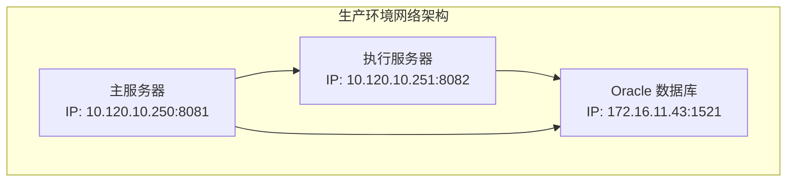
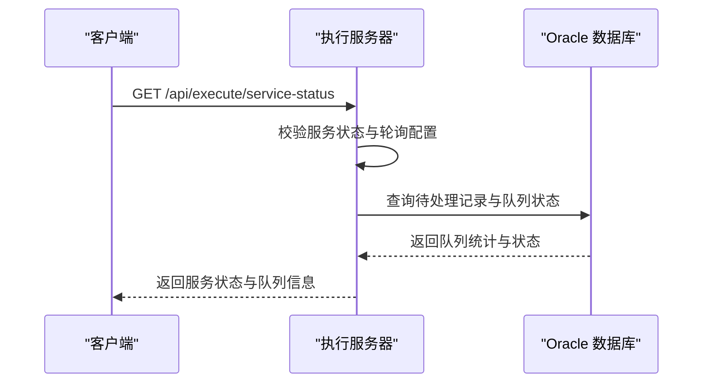
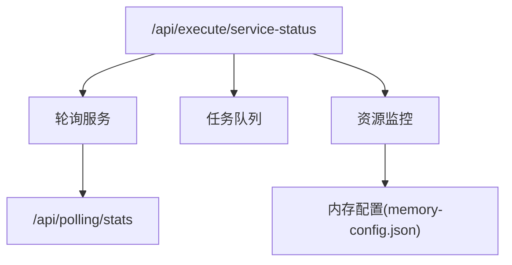

# 服务状态API

<cite>
**本文引用的文件**
- [执行服务器部署方案.md](file://med_ai_assistant_1.0_bs_backend/doc/布署/执行服务器布署方案.md)
- [系统管理接口.md](file://med_ai_assistant_1.0_bs_backend/doc/接口/系统管理接口.md)
- [test-execution-server-polling.http](file://med_ai_assistant_1.0_bs_backend/test-scripts/test-execution-server-polling.http)
- [memory-config.json](file://med_ai_assistant_1.0_bs_backend/memory-bank/config/memory-config.json)
- [check-execution-server.sh](file://med_ai_assistant_1.0_bs_backend/deploy/execution-linux/check-execution-server.sh)
- [check-execution-server.bat](file://med_ai_assistant_1.0_bs_backend/deploy/execution-windows/check-execution-server.bat)
- [Dockerfile.execution.linux](file://med_ai_assistant_1.0_bs_backend/deploy/execution-linux/Dockerfile.execution.linux)
- [docker-compose-execution-image.yml](file://med_ai_assistant_1.0_bs_backend/deploy/execution-linux/docker-compose-execution-image.yml)
</cite>

## 目录
1. [简介](#简介)
2. [项目结构](#项目结构)
3. [核心组件](#核心组件)
4. [架构总览](#架构总览)
5. [详细组件分析](#详细组件分析)
6. [依赖关系分析](#依赖关系分析)
7. [性能考虑](#性能考虑)
8. [故障排查指南](#故障排查指南)
9. [结论](#结论)
10. [附录](#附录)

## 简介
本文件为 MedAiAssistant 1.0 BS 的服务状态查询 API 文档，聚焦于执行服务器的 /api/execute/service-status 端点。该端点用于：
- 服务可用性检查
- 轮询服务状态查询
- 任务队列状态概览
- 资源使用情况监控

文档将详细说明查询参数、响应数据结构、状态码定义，并提供服务监控集成、自动扩缩容触发条件与故障转移配置示例。

## 项目结构
MedAiAssistant 1.0 BS 后端采用容器化部署，执行服务器与 Oracle 数据库在同一台机器上，通过内网地址通信；主服务器通过外网 IP:8081 回调执行服务器接口。执行服务器监听 8082 端口，提供健康检查、轮询控制、服务状态查询等接口。

图表来源
- [执行服务器部署方案.md](file://med_ai_assistant_1.0_bs_backend/doc/布署/执行服务器布署方案.md#L11-L34)

章节来源
- [执行服务器部署方案.md](file://med_ai_assistant_1.0_bs_backend/doc/布署/执行服务器布署方案.md#L1-L423)

## 核心组件
- 执行服务器：提供 /api/execute/service-status 端点，返回服务状态、轮询状态、任务队列状态等信息。
- 主服务器：通过 HTTP 回调与执行服务器交互，负责调度与结果汇总。
- Oracle 数据库：存储待处理数据与执行结果，执行服务器通过本地地址连接。
- 监控与健康检查：通过 /api/execute/health、/api/polling/stats 等接口进行健康检查与轮询统计。

章节来源
- [执行服务器部署方案.md](file://med_ai_assistant_1.0_bs_backend/doc/布署/执行服务器布署方案.md#L205-L245)
- [系统管理接口.md](file://med_ai_assistant_1.0_bs_backend/doc/接口/系统管理接口.md#L663-L687)

## 架构总览
服务状态查询 API 的典型调用链路如下：

图表来源
- [执行服务器部署方案.md](file://med_ai_assistant_1.0_bs_backend/doc/布署/执行服务器布署方案.md#L224-L232)
- [test-execution-server-polling.http](file://med_ai_assistant_1.0_bs_backend/test-scripts/test-execution-server-polling.http#L7-L8)

## 详细组件分析

### 服务状态查询端点
- 接口路径：/api/execute/service-status
- 请求方法：GET
- 功能说明：查询执行服务器的服务状态、轮询状态、任务队列状态等信息，用于服务可用性检查与运维监控。

查询参数
- 无查询参数

响应数据结构
- enabled: 布尔值，表示轮询服务是否启用
- pollingInterval: 数值，轮询间隔（秒）
- lastPolling: 字符串，ISO8601 时间戳，最近一次轮询时间
- nextPolling: 字符串，ISO8601 时间戳，下一次轮询时间
- queueStatus: 对象，任务队列状态
  - pendingCount: 数值，待处理任务数量
  - processingCount: 数值，正在处理的任务数量
  - errorCount: 数值，错误任务数量
- resourceUsage: 对象，资源使用情况
  - memoryUsedMB: 数值，已用内存（MB）
  - memoryTotalMB: 数值，总内存（MB）
  - cpuUtilizationPercent: 数值，CPU 利用率（百分比）
- serverStatus: 字符串，服务状态（例如 running、stopped、error）

状态码定义
- 200 OK：成功返回服务状态
- 500 Internal Server Error：服务器内部错误

响应示例
- 成功响应示例（简化）：
  {
    "enabled": true,
    "pollingInterval": 30,
    "lastPolling": "2025-07-24T10:30:45.123Z",
    "nextPolling": "2025-07-24T10:30:50.123Z",
    "queueStatus": {
      "pendingCount": 5,
      "processingCount": 2,
      "errorCount": 0
    },
    "resourceUsage": {
      "memoryUsedMB": 400,
      "memoryTotalMB": 1024,
      "cpuUtilizationPercent": 15.5
    },
    "serverStatus": "running"
  }

章节来源
- [执行服务器部署方案.md](file://med_ai_assistant_1.0_bs_backend/doc/布署/执行服务器布署方案.md#L224-L232)
- [test-execution-server-polling.http](file://med_ai_assistant_1.0_bs_backend/test-scripts/test-execution-server-polling.http#L7-L8)

### 轮询服务状态与队列统计
- 接口路径：/api/polling/stats
- 请求方法：GET
- 功能说明：获取轮询服务的统计信息，包括轮询次数、成功率、失败率等，辅助判断任务队列健康状况。

查询参数
- 无查询参数

响应数据结构
- totalPolls: 数值，总轮询次数
- successfulPolls: 数值，成功轮询次数
- failedPolls: 数值，失败轮询次数
- successRate: 数值，成功率（百分比）
- avgProcessingTimeMs: 数值，平均处理耗时（毫秒）
- lastPollTime: 字符串，ISO8601 时间戳，最近一次轮询时间

状态码定义
- 200 OK：成功返回轮询统计
- 500 Internal Server Error：服务器内部错误

章节来源
- [执行服务器部署方案.md](file://med_ai_assistant_1.0_bs_backend/doc/布署/执行服务器布署方案.md#L224-L232)

### 健康检查端点
- 接口路径：/api/execute/health
- 请求方法：GET
- 功能说明：检查执行服务器健康状态，常用于容器健康探针与自动化部署脚本。

查询参数
- 无查询参数

响应数据结构
- status: 字符串，健康状态（例如 healthy、unhealthy）
- timestamp: 字符串，ISO8601 时间戳
- checks: 对象数组，各项检查详情（如数据库连接、磁盘空间、内存使用等）

状态码定义
- 200 OK：服务健康
- 500 Internal Server Error：服务不健康

章节来源
- [执行服务器部署方案.md](file://med_ai_assistant_1.0_bs_backend/doc/布署/执行服务器布署方案.md#L205-L215)

### 资源使用情况查询
- 接口路径：/api/execution-server/resource-usage
- 请求方法：GET
- 功能说明：查询执行服务器的资源使用情况，包括内存、CPU、磁盘等指标。

查询参数
- 无查询参数

响应数据结构
- memory: 对象，内存使用情况
  - usedMB: 数值，已用内存（MB）
  - totalMB: 数值，总内存（MB）
  - thresholdMB: 数值，清理阈值（MB）
- disk: 对象，磁盘使用情况
  - usedGB: 数值，已用磁盘（GB）
  - totalGB: 数值，总磁盘（GB）
- cpu: 对象，CPU 使用情况
  - utilizationPercent: 数值，CPU 利用率（百分比）
  - cores: 数值，CPU 核心数

状态码定义
- 200 OK：成功返回资源使用情况
- 500 Internal Server Error：服务器内部错误

章节来源
- [memory-config.json](file://med_ai_assistant_1.0_bs_backend/memory-bank/config/memory-config.json#L1-L32)

## 依赖关系分析
服务状态查询 API 与其他组件的依赖关系如下：

图表来源
- [执行服务器部署方案.md](file://med_ai_assistant_1.0_bs_backend/doc/布署/执行服务器布署方案.md#L224-L232)
- [memory-config.json](file://med_ai_assistant_1.0_bs_backend/memory-bank/config/memory-config.json#L1-L32)

章节来源
- [执行服务器部署方案.md](file://med_ai_assistant_1.0_bs_backend/doc/布署/执行服务器布署方案.md#L205-L245)
- [memory-config.json](file://med_ai_assistant_1.0_bs_backend/memory-bank/config/memory-config.json#L1-L32)

## 性能考虑
- 轮询间隔优化：根据业务负载调整轮询间隔，避免频繁查询造成资源浪费。
- 队列长度监控：当 pendingCount 持续增长时，应考虑扩容执行服务器实例或优化处理逻辑。
- 资源阈值：结合 memory-config.json 中的清理阈值与备份策略，合理设置告警阈值，防止内存溢出。
- 并发控制：根据配置的最大并发操作数与IO线程数，评估系统的吞吐能力。

## 故障排查指南
- 健康检查失败
  - 现象：/api/execute/health 返回非 200 状态码
  - 排查步骤：
    - 检查执行服务器容器状态与日志
    - 验证数据库连接（本地地址 172.16.11.43:1521）
    - 确认防火墙开放 8082 端口
  - 参考命令：
    - curl -fsS http://localhost:8082/api/execute/health
    - docker logs -f med-ai-execution-server

- 服务状态查询异常
  - 现象：/api/execute/service-status 返回错误或超时
  - 排查步骤：
    - 确认轮询服务已启动
    - 检查队列状态与数据库记录状态
    - 查看容器健康探针配置
  - 参考命令：
    - curl http://localhost:8082/api/execute/service-status
    - docker ps | grep med-ai-execution-server

- 轮询统计缺失
  - 现象：/api/polling/stats 返回空或异常
  - 排查步骤：
    - 检查轮询服务配置与日志
    - 确认轮询间隔与任务处理耗时
  - 参考命令：
    - curl http://localhost:8082/api/polling/stats

章节来源
- [执行服务器部署方案.md](file://med_ai_assistant_1.0_bs_backend/doc/布署/执行服务器布署方案.md#L292-L353)
- [check-execution-server.sh](file://med_ai_assistant_1.0_bs_backend/deploy/execution-linux/check-execution-server.sh#L25-L38)
- [check-execution-server.bat](file://med_ai_assistant_1.0_bs_backend/deploy/execution-windows/check-execution-server.bat#L12-L54)

## 结论
服务状态查询 API 是 MedAiAssistant 1.0 BS 执行服务器运维与监控的关键入口。通过 /api/execute/service-status、/api/polling/stats 与 /api/execute/health 等接口，可以全面掌握服务可用性、轮询状态与任务队列健康状况。结合内存与资源配置，可实现自动扩缩容与故障转移，保障系统的高可用与高性能。

## 附录

### 自动扩缩容触发条件示例
- CPU 利用率持续超过 80%，且 pendingCount 增长超过阈值
- 内存使用超过清理阈值，且 errorCount 增长
- 轮询失败率超过 5%，且 avgProcessingTimeMs 显著上升

### 故障转移配置示例
- 主服务器检测到执行服务器健康检查失败，自动切换到备用执行服务器
- 轮询服务停止响应时，触发重启流程并记录告警
- 数据库连接异常时，执行服务器回退到只读模式并延迟轮询

章节来源
- [memory-config.json](file://med_ai_assistant_1.0_bs_backend/memory-bank/config/memory-config.json#L21-L30)
- [Dockerfile.execution.linux](file://med_ai_assistant_1.0_bs_backend/deploy/execution-linux/Dockerfile.execution.linux#L69)
- [docker-compose-execution-image.yml](file://med_ai_assistant_1.0_bs_backend/deploy/execution-linux/docker-compose-execution-image.yml#L59-L60)