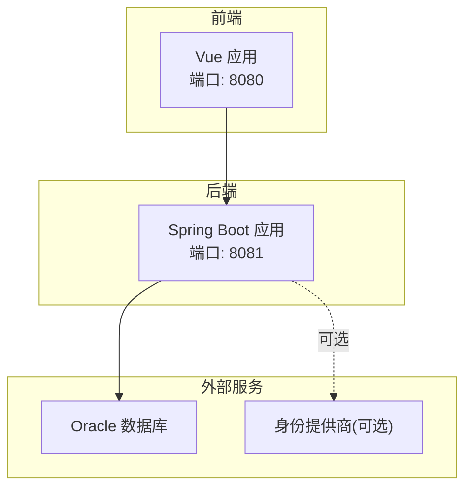
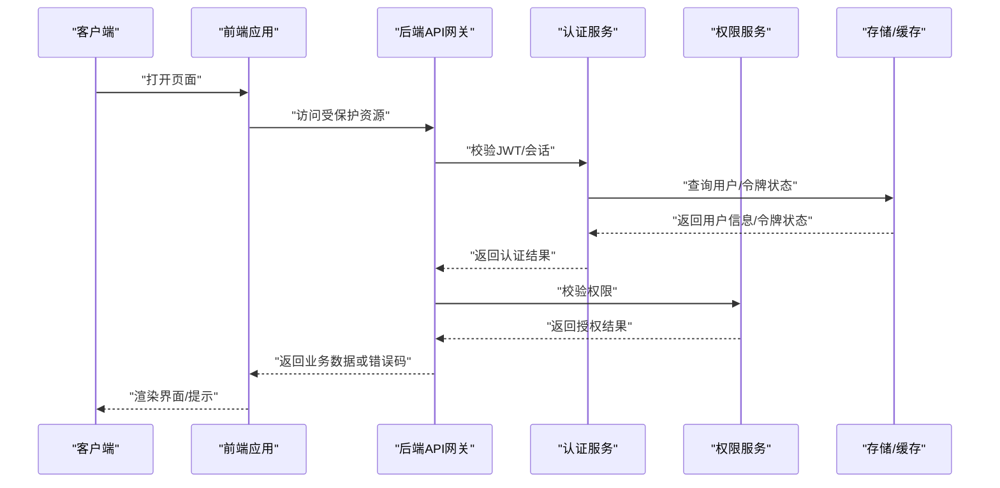
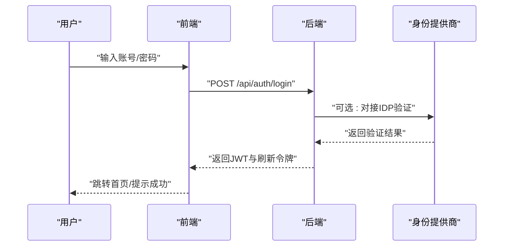
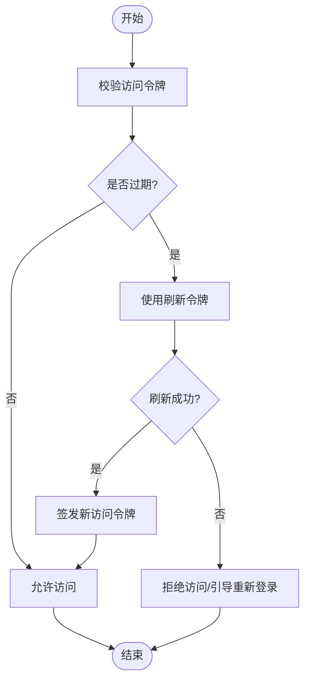
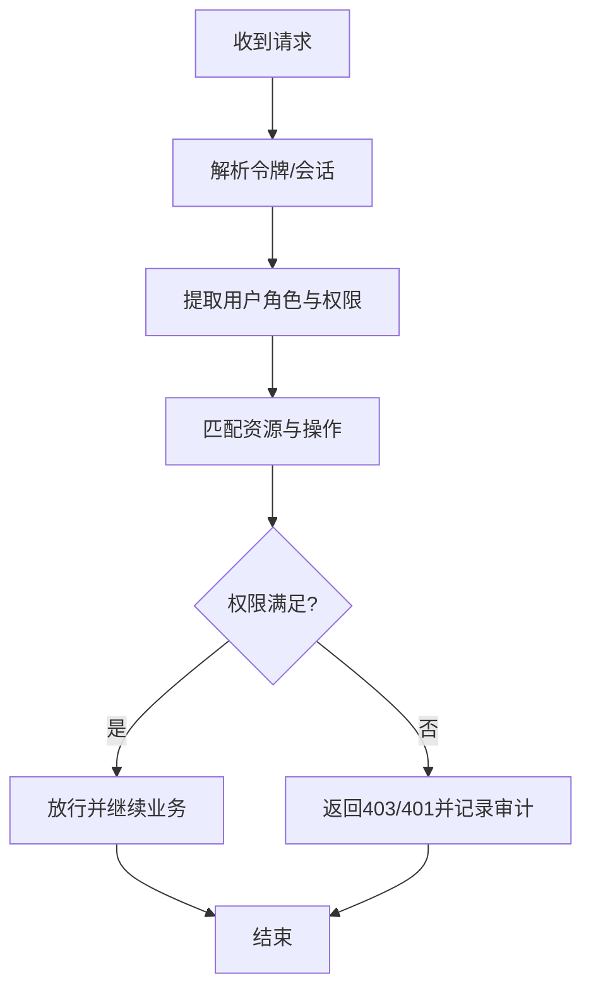
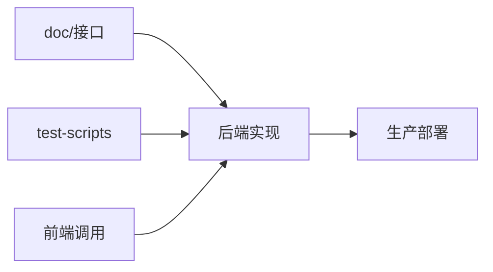
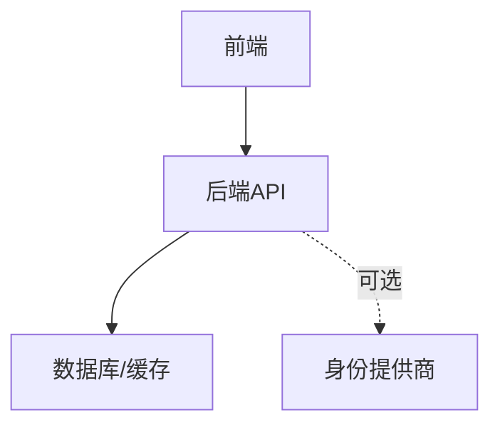

# 认证授权API

<cite>
**本文引用的文件**
- [常用.txt](file://项目相关/常用.txt)
- [神级Prompt.txt](file://项目相关/神级Prompt.txt)
- [mvn.bat](file://mvn.bat)
- [npm.bat](file://npm.bat)
</cite>

## 目录
1. [简介](#简介)
2. [项目结构](#项目结构)
3. [核心组件](#核心组件)
4. [架构总览](#架构总览)
5. [详细组件分析](#详细组件分析)
6. [依赖关系分析](#依赖关系分析)
7. [性能考虑](#性能考虑)
8. [故障排查指南](#故障排查指南)
9. [结论](#结论)
10. [附录](#附录)

## 简介
本文件面向 MedAiAssistant 1.0 BS 的认证授权能力，聚焦于用户身份验证、权限控制与安全令牌管理相关的 API 能力说明。结合仓库中的运维与开发指引，系统化阐述 JWT 令牌生成与刷新机制、权限校验流程与会话管理策略，并提供认证集成示例、安全最佳实践以及常见认证问题的排查思路。

## 项目结构
MedAiAssistant 1.0 BS 由前后端分离架构组成，后端采用 Spring Boot 技术栈，前端基于 Vue。认证授权相关的关键线索主要体现在：
- 后端启动与调试命令（Spring Boot）
- 前端开发与打包命令（Vue）
- 接口文档与测试脚本约定（HTTP 测试脚本）

章节来源
- file://项目相关/常用.txt#L66-L91
- file://mvn.bat#L1-L4
- file://npm.bat#L1-L20

## 核心组件
围绕认证授权的核心组件包括：
- 认证入口与登录流程
- JWT 令牌签发与刷新
- 权限校验与资源访问控制
- 会话生命周期与安全上下文维护
- 前后端集成与测试脚本规范

章节来源
- file://项目相关/常用.txt#L14-L23
- file://项目相关/常用.txt#L30-L33

## 架构总览
认证授权的整体交互流程如下：

该流程体现了“鉴权前置、权限后置”的设计思想，确保在进入业务处理之前完成身份与权限校验。

## 详细组件分析

### 组件一：用户登录与令牌发放
- 功能要点
  - 前端发起登录请求，携带账号与凭证
  - 后端进行身份验证（本地或对接身份提供商）
  - 成功后签发 JWT 令牌与刷新令牌
  - 将令牌安全地存储于前端（建议 HttpOnly Cookie 或安全存储）
- 关键行为
  - 登录成功后返回令牌与用户基本信息
  - 设置令牌有效期与刷新窗口
  - 记录登录态与审计日志
- 集成示例
  - 前端调用登录接口后，将令牌保存至安全存储，并在后续请求头中携带
  - 后端在拦截器中解析并校验令牌，注入安全上下文

章节来源
- file://项目相关/常用.txt#L14-L23
- file://项目相关/常用.txt#L60-L65

### 组件二：JWT 令牌生成与刷新机制
- 令牌生成
  - 使用强随机密钥生成签名，设置签发时间与过期时间
  - 包含必要声明（如用户标识、角色、机构等）
- 刷新机制
  - 在令牌即将过期时，使用刷新令牌换取新的访问令牌
  - 刷新令牌单独存储与校验，降低泄露风险
- 会话管理
  - 支持服务端会话存储或无状态令牌模式
  - 提供登出清理与黑名单机制（可选）

### 组件三：权限验证与资源控制
- 角色与权限模型
  - 基于角色的访问控制（RBAC），支持多租户/多院区
  - 资源级权限与操作级权限分离
- 校验流程
  - 在业务方法或拦截器中进行权限校验
  - 结合用户角色、资源归属与操作类型综合判断
- 失败处理
  - 返回标准化错误码与提示信息
  - 记录越权行为以便审计

### 组件四：前后端集成与测试规范
- 接口文档与测试脚本
  - 统一在 doc/接口 下维护接口文档
  - HTTP 测试脚本位于 test-scripts，按模块组织
- 前端调用规范
  - 避免重复 api 字段，确保路径正确
  - 统一 Element UI 组件风格
- 后端开发规范
  - 使用 JSDoc 注释完善接口说明
  - 遵循测试金字塔：单元测试、集成测试、E2E 测试

章节来源
- file://项目相关/常用.txt#L35-L41
- file://项目相关/常用.txt#L52-L55
- file://项目相关/常用.txt#L60-L65

## 依赖关系分析
- 组件耦合
  - 前端与后端通过 RESTful API 通信，依赖统一的认证与权限协议
  - 后端与数据库/缓存存在直接依赖，用于存储用户、令牌与权限元数据
- 外部依赖
  - 可选对接身份提供商（IDP），用于统一认证
  - Oracle 数据库存储业务与认证相关数据
- 循环依赖
  - 建议通过分层与接口抽象避免循环依赖

章节来源
- file://项目相关/常用.txt#L66-L91
- file://mvn.bat#L1-L4

## 性能考虑
- 令牌大小与网络开销
  - 控制 JWT 声明字段数量，避免冗余信息
- 缓存与热点
  - 将用户权限与令牌状态缓存于内存或分布式缓存
- 并发与锁
  - 刷新令牌并发场景下的幂等与一致性保障
- 日志与监控
  - 认证与权限校验关键路径埋点，便于性能分析与告警

## 故障排查指南
- 常见问题与定位
  - 401 未认证：检查请求头是否携带令牌、令牌格式与签名是否有效
  - 403 权限不足：核对用户角色与资源权限映射
  - 令牌过期：确认刷新流程是否正确执行
  - CORS 与跨域：检查前端与后端的跨域配置
- 排查步骤
  - 查看后端日志与审计记录
  - 使用 HTTP 测试脚本复现问题
  - 校验环境变量与配置文件（如数据库连接、密钥）
- 工具与命令
  - 后端启动与调试：使用 Maven 命令启动 Spring Boot 应用
  - 前端开发与打包：使用 npm 命令进行开发与构建
  - 实时查看日志：通过 Docker Compose 日志命令观察运行状态

章节来源
- file://项目相关/常用.txt#L76-L78
- file://项目相关/常用.txt#L85-L91
- file://mvn.bat#L1-L4
- file://npm.bat#L1-L20

## 结论
MedAiAssistant 1.0 BS 的认证授权体系以“令牌驱动 + 权限控制”为核心，结合前后端协同与测试规范，形成可演进的安全方案。建议在生产环境中强化令牌安全存储、权限最小化与审计留痕，并持续优化性能与可观测性。

## 附录
- 安全最佳实践
  - 强密码与多因子认证（MFA）
  - HTTPS 传输与安全响应头
  - 最小权限与职责分离
  - 定期轮换密钥与令牌刷新策略
- 常用命令速查
  - 后端：启动、安装、日志查看
  - 前端：开发、打包、部署

章节来源
- file://项目相关/常用.txt#L66-L91
- file://mvn.bat#L1-L4
- file://npm.bat#L1-L20