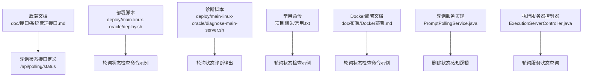
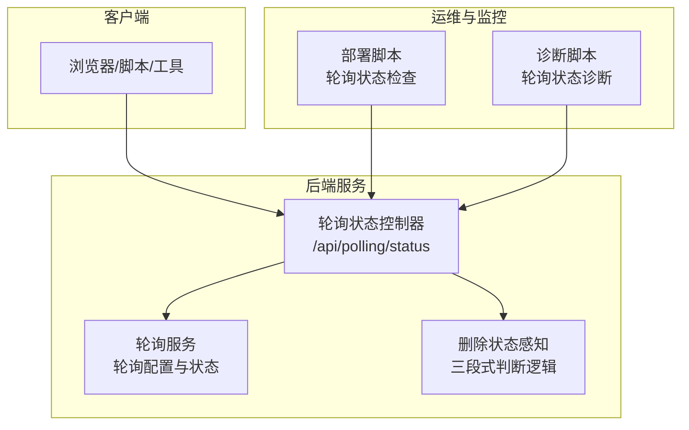
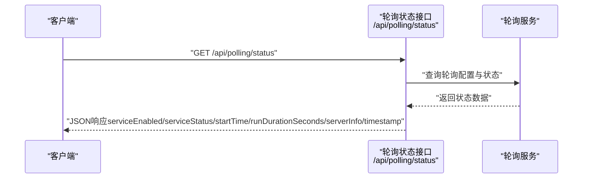
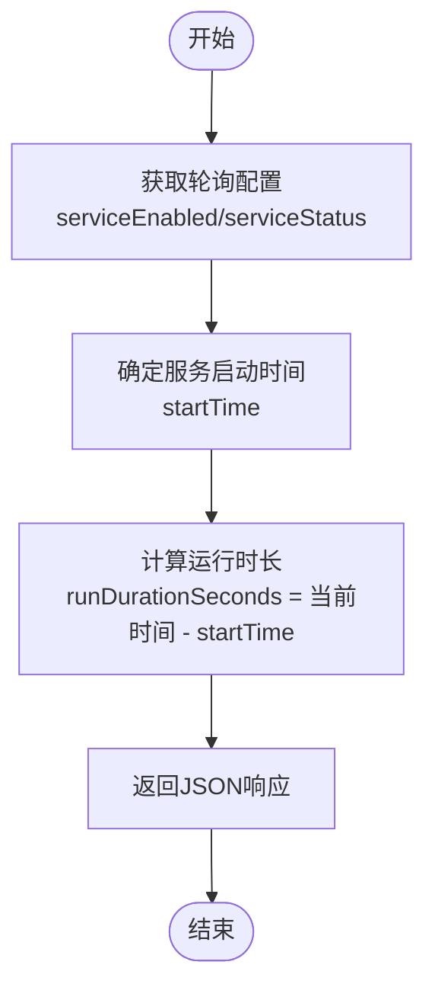
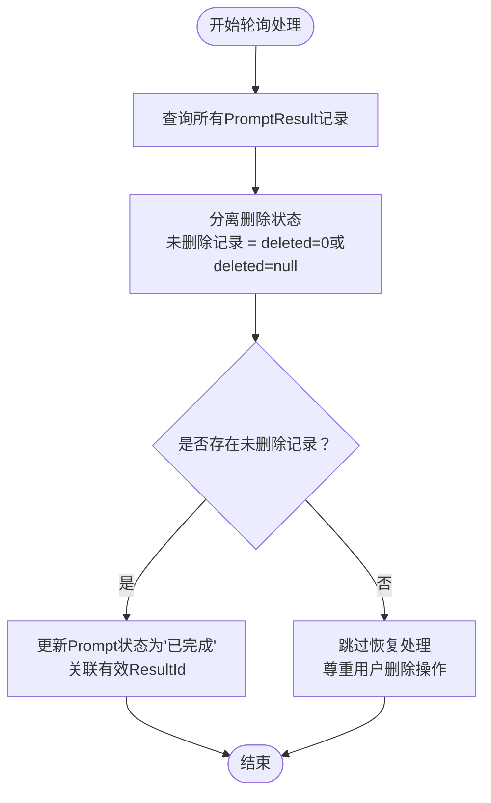
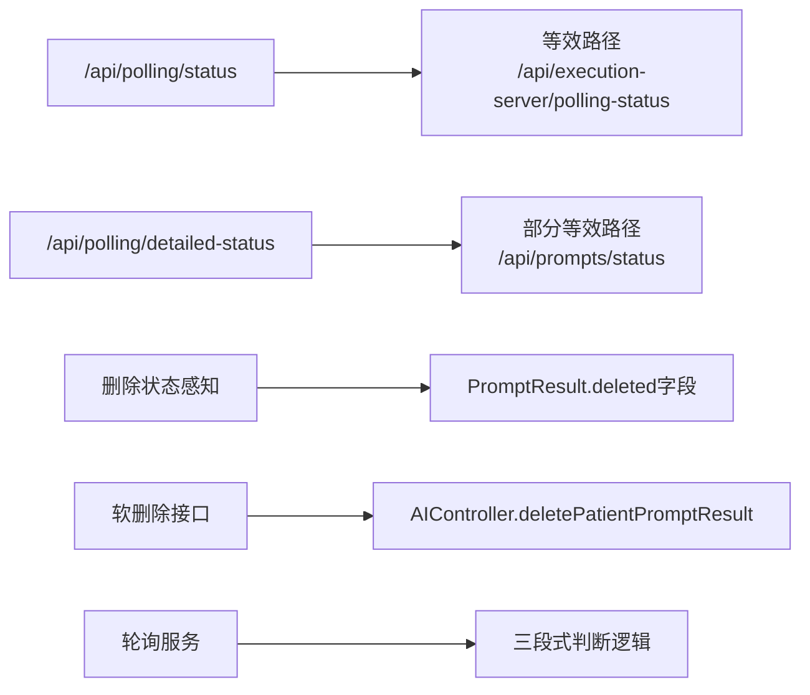

# 轮询状态API

<cite>
**本文引用的文件**
- [系统管理接口.md](file://med_ai_assistant_1.0_bs_backend/doc/接口/系统管理接口.md)
- [轮询与提交服务架构设计.md](file://med_ai_assistant_1.0_bs_backend/doc/系统结构/轮询与提交服务/轮询与提交服务架构设计.md)
- [PromptPollingService.java](file://med_ai_assistant_1.0_bs_backend/src/main/java/com/example/medaiassistant/service/PromptPollingService.java)
- [ExecutionServerController.java](file://med_ai_assistant_1.0_bs_backend/src/main/java/com/example/medaiassistant/controller/ExecutionServerController.java)
- [AIController.java](file://med_ai_assistant_1.0_bs_backend/src/main/java/com/example/medaiassistant/controller/AIController.java)
- [PromptResult.java](file://med_ai_assistant_1.0_bs_backend/src/main/java/com/example/medaiassistant/model/PromptResult.java)
- [2026-02-15.md](file://med_ai_assistant_1.0_bs_backend/doc/更新日志/2026-02-15.md)
- [常用.txt](file://项目相关/常用.txt)
- [Docker部署.md](file://med_ai_assistant_1.0_bs_backend/doc/布署/Docker部署.md)
- [接口文档索引.md](file://med_ai_assistant_1.0_bs_backend/doc/接口/接口文档索引.md)
- [2026-03-01.md](file://med_ai_assistant_1.0_bs_backend/doc/更新日志/2026-03-01.md)
- [check-execution-server.bat](file://med_ai_assistant_1.0_bs_backend/deploy/execution-windows/check-execution-server.bat)
- [deploy.sh](file://med_ai_assistant_1.0_bs_backend/deploy/main-linux-oracle/deploy.sh)
- [diagnose-main-server.sh](file://med_ai_assistant_1.0_bs_backend/deploy/main-linux-oracle/diagnose-main-server.sh)
</cite>

## 更新摘要
**所做更改**
- 新增删除状态感知能力章节，详细说明三段式判断逻辑
- 更新轮询服务查询逻辑重构相关内容
- 增加用户删除行为处理机制说明
- 完善轮询状态API的业务逻辑描述

## 目录
1. [简介](#简介)
2. [项目结构](#项目结构)
3. [核心组件](#核心组件)
4. [架构总览](#架构总览)
5. [详细组件分析](#详细组件分析)
6. [删除状态感知能力](#删除状态感知能力)
7. [依赖关系分析](#依赖关系分析)
8. [性能考虑](#性能考虑)
9. [故障排查指南](#故障排查指南)
10. [结论](#结论)
11. [附录](#附录)

## 简介
本文件面向MedAiAssistant 1.0 BS的轮询状态查询API，聚焦于轮询状态检查端点"/api/polling/status"。该接口用于获取轮询服务的运行状态，包括是否启用、轮询间隔、最近一次轮询时间与下一次轮询时间等信息。文档将详细说明：
- 接口定义与请求/响应规范
- 状态码含义与超时处理机制
- 轮询间隔设置与状态计算逻辑
- 客户端轮询实现示例、重试策略与断线重连方案
- 与系统其他组件的集成关系与依赖
- **新增**：删除状态感知能力与三段式判断逻辑

## 项目结构
围绕轮询状态API的相关文件主要分布在后端文档与部署脚本中，具体如下：
- 文档层：接口文档与部署文档
- 部署层：Windows/Linux部署脚本与诊断脚本
- 命令示例：常用命令与轮询状态检查示例
- **新增**：轮询服务实现与删除状态处理逻辑

**图表来源**
- [系统管理接口.md:660-727](file://med_ai_assistant_1.0_bs_backend/doc/接口/系统管理接口.md#L660-L727)
- [deploy.sh:119-119](file://med_ai_assistant_1.0_bs_backend/deploy/main-linux-oracle/deploy.sh#L119-L119)
- [diagnose-main-server.sh:105-105](file://med_ai_assistant_1.0_bs_backend/deploy/main-linux-oracle/diagnose-main-server.sh#L105-L105)
- [常用.txt:78-78](file://项目相关/常用.txt#L78-L78)
- [Docker部署.md:79-79](file://med_ai_assistant_1.0_bs_backend/doc/布署/Docker部署.md#L79-L79)
- [PromptPollingService.java:1194-1204](file://med_ai_assistant_1.0_bs_backend/src/main/java/com/example/medaiassistant/service/PromptPollingService.java#L1194-L1204)

**章节来源**
- [系统管理接口.md:660-727](file://med_ai_assistant_1.0_bs_backend/doc/接口/系统管理接口.md#L660-L727)
- [deploy.sh:119-119](file://med_ai_assistant_1.0_bs_backend/deploy/main-linux-oracle/deploy.sh#L119-L119)
- [diagnose-main-server.sh:105-105](file://med_ai_assistant_1.0_bs_backend/deploy/main-linux-oracle/diagnose-main-server.sh#L105-L105)
- [常用.txt:78-78](file://项目相关/常用.txt#L78-L78)
- [Docker部署.md:79-79](file://med_ai_assistant_1.0_bs_backend/doc/布署/Docker部署.md#L79-L79)

## 核心组件
- 接口定义与职责
  - 接口路径：/api/polling/status
  - 方法：GET
  - 功能：获取轮询服务的运行状态（是否启用、轮询间隔、最近一次轮询时间、下一次轮询时间）
- 响应格式与字段
  - serviceEnabled：布尔值，表示轮询服务是否启用
  - serviceStatus：字符串，轮询服务当前状态
  - startTime：字符串，ISO 8601时间戳，服务启动时间
  - runDurationSeconds：整数，服务运行时长（秒）
  - serverInfo：对象，包含服务器信息（名称、端口、模式、轮询间隔、批处理大小）
  - timestamp：长整型，查询时间戳
- 相关文件
  - 系统管理接口文档：包含接口路径、功能说明、请求参数、响应格式、逻辑与示例
  - 接口索引：列出轮询相关接口路径
  - 更新日志：记录接口演进与等效路径对照
  - **新增**：轮询服务实现类，包含删除状态感知逻辑

**章节来源**
- [系统管理接口.md:660-727](file://med_ai_assistant_1.0_bs_backend/doc/接口/系统管理接口.md#L660-L727)
- [接口文档索引.md:72-73](file://med_ai_assistant_1.0_bs_backend/doc/接口/接口文档索引.md#L72-L73)
- [2026-03-01.md:46-47](file://med_ai_assistant_1.0_bs_backend/doc/更新日志/2026-03-01.md#L46-L47)
- [ExecutionServerController.java:2139-2187](file://med_ai_assistant_1.0_bs_backend/src/main/java/com/example/medaiassistant/controller/ExecutionServerController.java#L2139-L2187)

## 架构总览
轮询状态API属于后端系统管理接口的一部分，通常由控制器负责接收HTTP请求，调用服务层获取轮询配置与状态信息，最终返回JSON响应。部署脚本与诊断脚本展示了该接口在实际运维中的使用方式。

**图表来源**
- [系统管理接口.md:660-727](file://med_ai_assistant_1.0_bs_backend/doc/接口/系统管理接口.md#L660-L727)
- [deploy.sh:119-119](file://med_ai_assistant_1.0_bs_backend/deploy/main-linux-oracle/deploy.sh#L119-L119)
- [diagnose-main-server.sh:105-105](file://med_ai_assistant_1.0_bs_backend/deploy/main-linux-oracle/diagnose-main-server.sh#L105-L105)
- [PromptPollingService.java:1194-1204](file://med_ai_assistant_1.0_bs_backend/src/main/java/com/example/medaiassistant/service/PromptPollingService.java#L1194-L1204)

## 详细组件分析

### 接口定义与行为
- 接口路径：/api/polling/status
- 方法：GET
- 请求参数：无
- 响应格式：JSON对象，包含serviceEnabled、serviceStatus、startTime、runDurationSeconds、serverInfo、timestamp等字段
- 业务逻辑：
  1) 查询轮询服务配置状态
  2) 返回服务信息
  3) **新增**：包含删除状态感知能力

**图表来源**
- [系统管理接口.md:660-727](file://med_ai_assistant_1.0_bs_backend/doc/接口/系统管理接口.md#L660-L727)
- [ExecutionServerController.java:2139-2187](file://med_ai_assistant_1.0_bs_backend/src/main/java/com/example/medaiassistant/controller/ExecutionServerController.java#L2139-L2187)

**章节来源**
- [系统管理接口.md:660-727](file://med_ai_assistant_1.0_bs_backend/doc/接口/系统管理接口.md#L660-L727)
- [ExecutionServerController.java:2139-2187](file://med_ai_assistant_1.0_bs_backend/src/main/java/com/example/medaiassistant/controller/ExecutionServerController.java#L2139-L2187)

### 响应字段说明
- serviceEnabled：布尔值，表示轮询服务是否启用
- serviceStatus：字符串，轮询服务当前状态
- startTime：字符串，ISO 8601时间戳，服务启动时间
- runDurationSeconds：整数，服务运行时长（秒）
- serverInfo：对象，包含服务器信息（serverName、port、mode、pollingInterval、batchSize）
- timestamp：长整型，查询时间戳

**章节来源**
- [系统管理接口.md:660-727](file://med_ai_assistant_1.0_bs_backend/doc/接口/系统管理接口.md#L660-L727)
- [ExecutionServerController.java:2145-2171](file://med_ai_assistant_1.0_bs_backend/src/main/java/com/example/medaiassistant/controller/ExecutionServerController.java#L2145-L2171)

### 状态码与超时处理
- 状态码
  - 200 OK：请求成功，返回轮询状态
  - 500 Internal Server Error：服务内部错误
- 超时处理
  - 客户端应在请求中设置合理的超时时间，避免长时间阻塞
  - 若网络异常或服务不可达，建议采用指数退避重试策略

**章节来源**
- [系统管理接口.md:660-727](file://med_ai_assistant_1.0_bs_backend/doc/接口/系统管理接口.md#L660-L727)

### 轮询间隔设置与状态计算
- 轮询间隔设置
  - pollingInterval字段表示轮询周期（秒），用于客户端决定下一次轮询的时间点
- 状态计算逻辑
  - startTime与runDurationSeconds基于当前时间与服务启动时间计算得出
  - runDurationSeconds = 当前时间 - startTime

**图表来源**
- [系统管理接口.md:660-727](file://med_ai_assistant_1.0_bs_backend/doc/接口/系统管理接口.md#L660-L727)
- [ExecutionServerController.java:2149-2162](file://med_ai_assistant_1.0_bs_backend/src/main/java/com/example/medaiassistant/controller/ExecutionServerController.java#L2149-L2162)

**章节来源**
- [系统管理接口.md:660-727](file://med_ai_assistant_1.0_bs_backend/doc/接口/系统管理接口.md#L660-L727)
- [ExecutionServerController.java:2149-2162](file://med_ai_assistant_1.0_bs_backend/src/main/java/com/example/medaiassistant/controller/ExecutionServerController.java#L2149-L2162)

### 客户端轮询实现示例与最佳实践
- 实现要点
  - 使用GET方法访问"/api/polling/status"
  - 解析响应中的serviceEnabled、serviceStatus、startTime、runDurationSeconds、serverInfo、timestamp字段
  - 根据runDurationSeconds设置定时器，按需发起下一次轮询
- 重试策略
  - 建议采用指数退避（如1s、2s、4s、8s…上限至30s）
  - 最大重试次数建议为5-10次，避免无限重试导致资源浪费
- 断线重连
  - 当连接失败或超时时，记录失败原因与时间
  - 在网络恢复后自动恢复轮询，必要时回溯startTime以确保不遗漏
- 取消与停止
  - 当任务完成或用户取消时，及时停止轮询定时器，释放资源

**章节来源**
- [系统管理接口.md:660-727](file://med_ai_assistant_1.0_bs_backend/doc/接口/系统管理接口.md#L660-L727)

### 与系统其他组件的关系
- 与执行服务器状态检查的关系
  - 部署脚本中存在对执行服务器轮询状态的检查命令，表明轮询状态API是系统可观测性的重要组成部分
- 与诊断脚本的配合
  - 诊断脚本会调用轮询状态接口以辅助问题定位与排障
- **新增**：与删除状态感知的集成
  - 轮询服务能够感知用户对AI结果的删除行为
  - 通过三段式判断逻辑处理用户删除后的状态恢复

**章节来源**
- [check-execution-server.bat:49-54](file://med_ai_assistant_1.0_bs_backend/deploy/execution-windows/check-execution-server.bat#L49-L54)
- [diagnose-main-server.sh:105-105](file://med_ai_assistant_1.0_bs_backend/deploy/main-linux-oracle/diagnose-main-server.sh#L105-L105)

## 删除状态感知能力

### 三段式判断逻辑
轮询服务新增了对用户删除行为的感知能力，采用三段式判断逻辑来处理用户删除AI结果后的状态恢复：

1. **查询所有相关记录**
   - 获取指定Prompt下的所有PromptResult记录（包括已删除和未删除）
   - 统计总记录数和删除状态分布

2. **分离删除状态**
   - 从全部记录中分离出未删除记录（deleted=0或deleted=null）
   - 检查是否存在未删除的有效记录

3. **执行相应处理**
   - **存在未删除记录**：正常更新Prompt状态为"已完成"
   - **不存在未删除记录**：说明用户已主动删除所有结果，跳过恢复处理

**图表来源**
- [PromptPollingService.java:1194-1204](file://med_ai_assistant_1.0_bs_backend/src/main/java/com/example/medaiassistant/service/PromptPollingService.java#L1194-L1204)

### 删除状态处理机制
- **软删除实现**：通过在PromptResult表中添加deleted字段实现软删除
- **删除状态标识**：deleted=1表示已删除，deleted=0或null表示未删除
- **查询过滤**：大部分查询自动过滤deleted=0的记录，确保不会返回已删除数据
- **特殊处理**：在轮询状态恢复时，需要查询所有记录以判断用户删除状态

### 用户删除行为的影响
- **用户主动删除**：当用户删除AI结果后，轮询服务会检测到所有相关记录都被删除
- **状态保持**：轮询服务尊重用户的删除选择，不会自动恢复已删除的结果
- **数据一致性**：通过三段式判断确保数据状态的一致性和准确性

**章节来源**
- [PromptPollingService.java:1194-1204](file://med_ai_assistant_1.0_bs_backend/src/main/java/com/example/medaiassistant/service/PromptPollingService.java#L1194-L1204)
- [AIController.java:345-400](file://med_ai_assistant_1.0_bs_backend/src/main/java/com/example/medaiassistant/controller/AIController.java#L345-L400)
- [PromptResult.java:53-54](file://med_ai_assistant_1.0_bs_backend/src/main/java/com/example/medaiassistant/model/PromptResult.java#L53-L54)
- [2026-02-15.md:64-166](file://med_ai_assistant_1.0_bs_backend/doc/更新日志/2026-02-15.md#L64-L166)

## 依赖关系分析
- 接口路径对照与等效性
  - /api/polling/status 与 /api/execution-server/polling-status 等效
  - /api/polling/detailed-status 与 /api/prompts/status 部分等效
- 文档索引与版本演进
  - 接口索引文档列出了轮询相关接口路径
  - 更新日志记录了接口演进与等效路径对照，便于迁移与兼容
- **新增**：删除状态感知功能的依赖关系
  - 依赖PromptResult实体的deleted字段
  - 依赖AIController的软删除接口
  - 与轮询服务的状态恢复逻辑紧密集成

**图表来源**
- [接口文档索引.md:72-73](file://med_ai_assistant_1.0_bs_backend/doc/接口/接口文档索引.md#L72-L73)
- [2026-03-01.md:46-47](file://med_ai_assistant_1.0_bs_backend/doc/更新日志/2026-03-01.md#L46-L47)
- [PromptPollingService.java:1194-1204](file://med_ai_assistant_1.0_bs_backend/src/main/java/com/example/medaiassistant/service/PromptPollingService.java#L1194-L1204)
- [AIController.java:345-400](file://med_ai_assistant_1.0_bs_backend/src/main/java/com/example/medaiassistant/controller/AIController.java#L345-L400)

**章节来源**
- [接口文档索引.md:72-73](file://med_ai_assistant_1.0_bs_backend/doc/接口/接口文档索引.md#L72-L73)
- [2026-03-01.md:46-47](file://med_ai_assistant_1.0_bs_backend/doc/更新日志/2026-03-01.md#L46-L47)

## 性能考虑
- 轮询频率与负载
  - 合理设置pollingInterval，避免过于频繁的轮询造成不必要的负载
- 超时与并发
  - 客户端应设置合理的超时时间，防止阻塞影响用户体验
- 缓存与去抖
  - 对于短时间内的重复查询，可在客户端做简单缓存或去抖处理
- **新增**：删除状态感知的性能优化
  - 三段式判断逻辑仅在需要时执行，避免对正常查询性能的影响
  - 删除状态检查采用高效的过滤和统计操作

## 故障排查指南
- 常见问题
  - 无法访问接口：检查服务端口与网络连通性
  - 响应为空或异常：确认轮询服务已启动且配置正确
  - **新增**：删除状态异常：检查PromptResult表的deleted字段是否正确设置
- 运维命令与脚本
  - 使用curl命令检查轮询状态
  - 部署脚本与诊断脚本提供了轮询状态检查与诊断输出示例
- 日志与监控
  - 结合诊断脚本输出与日志，定位轮询状态异常的原因
  - **新增**：监控删除状态感知功能的执行情况

**章节来源**
- [常用.txt:78-78](file://项目相关/常用.txt#L78-L78)
- [Docker部署.md:79-79](file://med_ai_assistant_1.0_bs_backend/doc/布署/Docker部署.md#L79-L79)
- [deploy.sh:119-119](file://med_ai_assistant_1.0_bs_backend/deploy/main-linux-oracle/deploy.sh#L119-L119)
- [diagnose-main-server.sh:105-105](file://med_ai_assistant_1.0_bs_backend/deploy/main-linux-oracle/diagnose-main-server.sh#L105-L105)

## 结论
轮询状态API"/api/polling/status"为系统可观测性提供了简洁而关键的能力，客户端可通过该接口了解轮询服务的启用状态与时间安排，从而制定合理的轮询策略与重试机制。结合部署与诊断脚本，可有效支撑系统的稳定运行与快速排障。

**新增**的删除状态感知能力进一步增强了系统的用户友好性，通过三段式判断逻辑，轮询服务能够智能地感知并尊重用户的删除行为，在保证数据一致性的同时，为用户提供更好的操作体验。

## 附录
- 相关文件清单
  - 系统管理接口文档：包含接口路径、功能说明、请求参数、响应格式、逻辑与示例
  - 接口索引文档：列出轮询相关接口路径
  - 更新日志：记录接口演进与等效路径对照
  - 部署与诊断脚本：提供轮询状态检查与诊断输出示例
  - 常用命令与Docker部署文档：提供轮询状态检查命令示例
  - **新增**：轮询服务实现类：包含删除状态感知逻辑
  - **新增**：软删除控制器：实现AI结果的软删除功能
  - **新增**：实体模型：包含deleted字段的PromptResult实体

**章节来源**
- [系统管理接口.md:660-727](file://med_ai_assistant_1.0_bs_backend/doc/接口/系统管理接口.md#L660-L727)
- [接口文档索引.md:72-73](file://med_ai_assistant_1.0_bs_backend/doc/接口/接口文档索引.md#L72-L73)
- [2026-03-01.md:46-47](file://med_ai_assistant_1.0_bs_backend/doc/更新日志/2026-03-01.md#L46-L47)
- [2025-11-27-更新日志.md:89-113](file://med_ai_assistant_1.0_bs_backend/doc/更新日志/2025-11-27-更新日志.md#L89-L113)
- [check-execution-server.bat:49-54](file://med_ai_assistant_1.0_bs_backend/deploy/execution-windows/check-execution-server.bat#L49-L54)
- [deploy.sh:119-119](file://med_ai_assistant_1.0_bs_backend/deploy/main-linux-oracle/deploy.sh#L119-L119)
- [diagnose-main-server.sh:105-105](file://med_ai_assistant_1.0_bs_backend/deploy/main-linux-oracle/diagnose-main-server.sh#L105-L105)
- [常用.txt:78-78](file://项目相关/常用.txt#L78-L78)
- [Docker部署.md:79-79](file://med_ai_assistant_1.0_bs_backend/doc/布署/Docker部署.md#L79-L79)
- [PromptPollingService.java:1194-1204](file://med_ai_assistant_1.0_bs_backend/src/main/java/com/example/medaiassistant/service/PromptPollingService.java#L1194-L1204)
- [AIController.java:345-400](file://med_ai_assistant_1.0_bs_backend/src/main/java/com/example/medaiassistant/controller/AIController.java#L345-L400)
- [PromptResult.java:53-54](file://med_ai_assistant_1.0_bs_backend/src/main/java/com/example/medaiassistant/model/PromptResult.java#L53-L54)
- [2026-02-15.md:64-166](file://med_ai_assistant_1.0_bs_backend/doc/更新日志/2026-02-15.md#L64-L166)