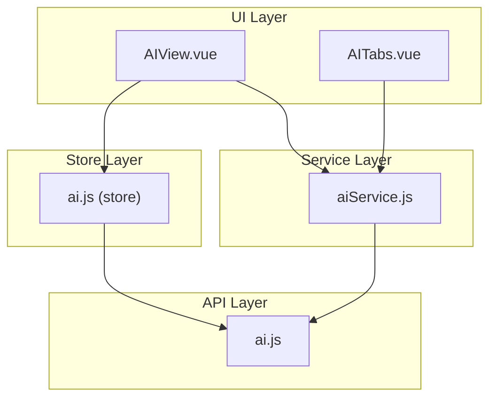
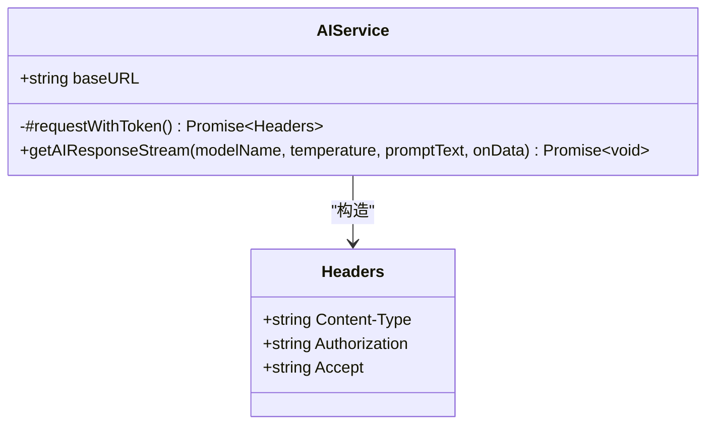
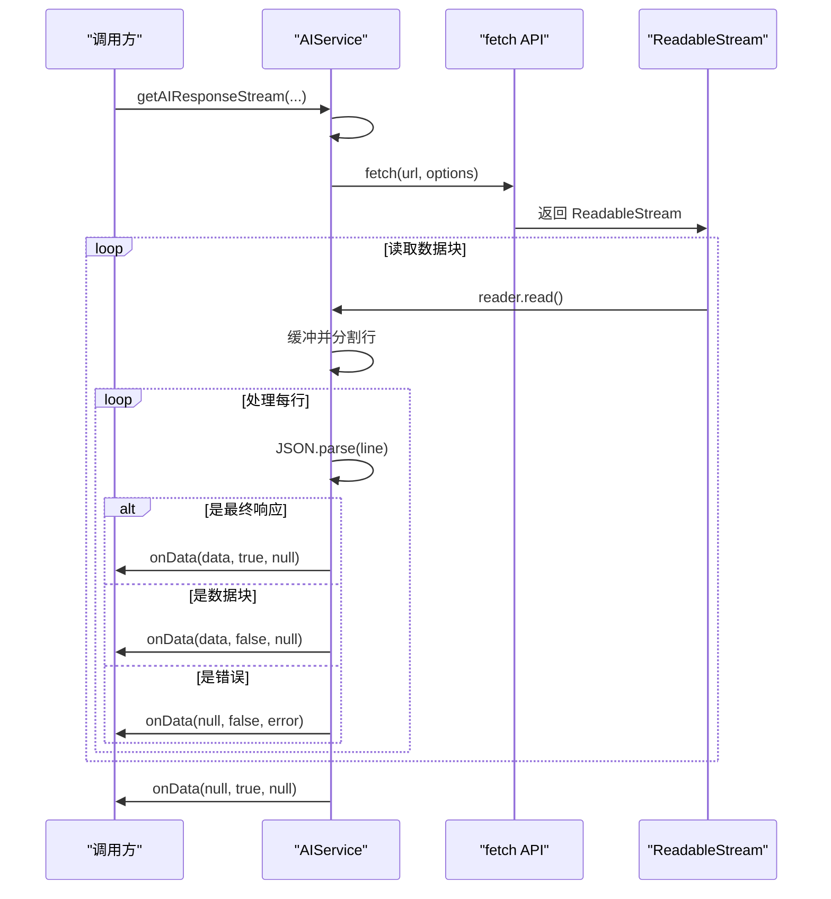
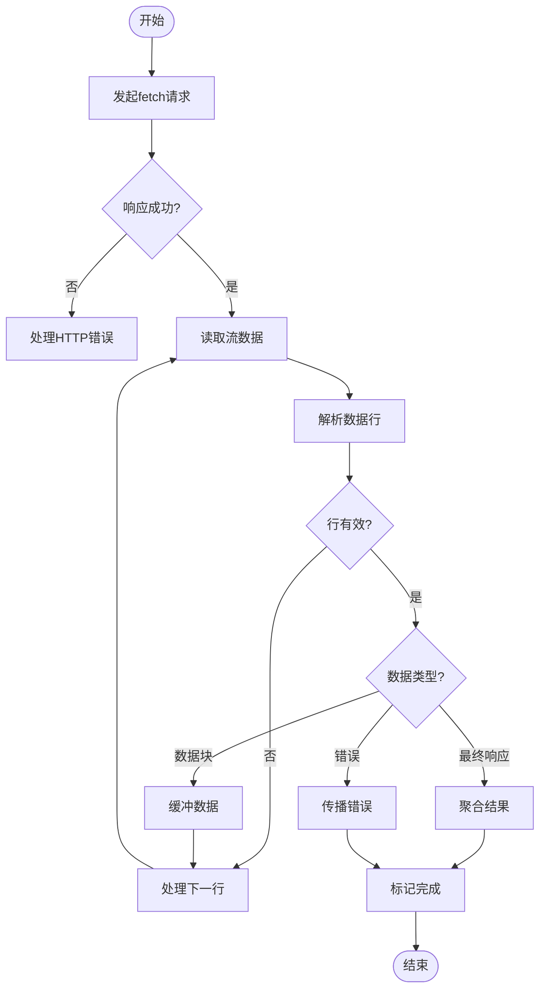
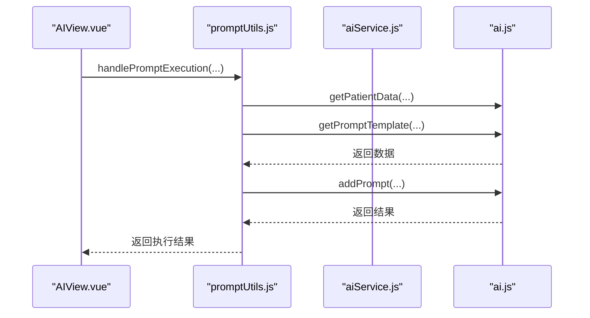
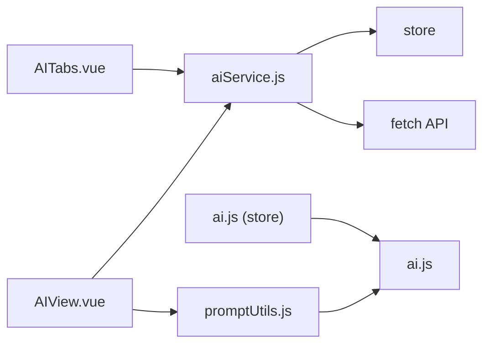

# AI服务封装层

<cite>
**Referenced Files in This Document**   
- [aiService.js](file://src/api/aiService.js)
- [ai.js](file://src/api/ai.js)
- [AIView.vue](file://src/views/AIView.vue)
- [promptUtils.js](file://src/utils/promptUtils.js)
- [AITabs.vue](file://src/components/ai/AITabs.vue)
- [ai.js](file://src/store/modules/ai.js)
</cite>

## 目录
1. [简介](#简介)
2. [项目结构](#项目结构)
3. [核心组件](#核心组件)
4. [架构概述](#架构概述)
5. [详细组件分析](#详细组件分析)
6. [依赖分析](#依赖分析)
7. [性能考虑](#性能考虑)
8. [故障排除指南](#故障排除指南)
9. [结论](#结论)

## 简介

`aiService.js` 文件作为医疗AI助手系统中的高级服务封装层，旨在为上层应用提供简洁、业务导向的AI功能调用接口。该服务层通过封装底层 `ai.js` API 的复杂性，实现了UI组件与具体API细节的解耦，提升了代码的复用性和可维护性。本文档详细说明了 `aiService.js` 如何对底层API进行二次封装，处理异步流程、错误传播和结果聚合，并举例说明其在 `AIView.vue` 和 `promptUtils.js` 中的应用。

## 项目结构

本项目采用典型的Vue.js单页应用结构，主要功能模块集中在 `src` 目录下。AI相关功能被组织在 `src/api` 目录中，其中 `ai.js` 负责提供基础的API调用，而 `aiService.js` 则在此基础上构建了更高层次的服务封装。UI组件位于 `src/components/ai` 目录，视图层位于 `src/views` 目录，状态管理通过 `src/store/modules/ai.js` 实现。

**Section sources**
- [aiService.js](file://src/api/aiService.js)
- [ai.js](file://src/api/ai.js)

## 核心组件

`aiService.js` 的核心是 `AIService` 类，它通过 `getAIResponseStream` 方法实现了对AI回复的流式获取。该方法封装了HTTP请求的构建、认证令牌的添加、响应流的解析等复杂逻辑，向上层提供了简洁的回调接口。同时，文件还导出了 `getAIResponseWithParams` 函数，作为兼容旧接口的适配层，进一步简化了调用方式。

**Section sources**
- [aiService.js](file://src/api/aiService.js#L2-L157)

## 架构概述

**Diagram sources**
- [AIView.vue](file://src/views/AIView.vue)
- [AITabs.vue](file://src/components/ai/AITabs.vue)
- [aiService.js](file://src/api/aiService.js)
- [ai.js](file://src/api/ai.js)
- [ai.js](file://src/store/modules/ai.js)

## 详细组件分析

### AIService 类分析

`AIService` 类是整个服务封装层的核心，它通过私有方法 `#requestWithToken` 处理认证逻辑，确保每次请求都携带有效的用户令牌。主方法 `getAIResponseStream` 实现了完整的流式响应处理流程，包括连接建立、数据分块读取、JSON解析和错误处理。

#### 类图

**Diagram sources**
- [aiService.js](file://src/api/aiService.js#L2-L112)

### 异步流程处理

`aiService.js` 通过 `getAIResponseStream` 方法处理异步流式响应，采用 `fetch` API 的 `ReadableStream` 接口逐块读取数据。该方法内部实现了完整的流控制逻辑，包括缓冲区管理、行分割、JSON解析和 `[DONE]` 标记的识别，确保数据能够正确、完整地传递给回调函数。

**Diagram sources**
- [aiService.js](file://src/api/aiService.js#L25-L111)

### 错误传播与结果聚合

服务层实现了完善的错误处理机制，捕获网络错误、HTTP状态错误和JSON解析错误，并通过回调函数的 `error` 参数向上传播。对于流式响应，服务层还负责聚合最终结果，在收到 `[DONE]` 标记后，将之前累积的数据块组合成完整响应。

**Diagram sources**
- [aiService.js](file://src/api/aiService.js#L25-L111)

### 与上层组件的集成

`aiService.js` 被多个上层组件直接或间接使用。`AIView.vue` 通过 `promptUtils.js` 间接调用服务层，而 `AITabs.vue` 则可能直接使用服务层获取AI响应。

#### AIView.vue 中的调用流程

**Diagram sources**
- [AIView.vue](file://src/views/AIView.vue#L0-L173)
- [promptUtils.js](file://src/utils/promptUtils.js#L0-L191)

## 依赖分析

**Diagram sources**
- [aiService.js](file://src/api/aiService.js)
- [AIView.vue](file://src/views/AIView.vue)
- [promptUtils.js](file://src/utils/promptUtils.js)
- [AITabs.vue](file://src/components/ai/AITabs.vue)
- [ai.js](file://src/store/modules/ai.js)

**Section sources**
- [aiService.js](file://src/api/aiService.js)
- [AIView.vue](file://src/views/AIView.vue)
- [promptUtils.js](file://src/utils/promptUtils.js)
- [AITabs.vue](file://src/components/ai/AITabs.vue)
- [ai.js](file://src/store/modules/ai.js)

## 性能考虑

`aiService.js` 通过流式处理避免了大响应体的内存堆积，提高了内存使用效率。同时，通过封装认证逻辑和错误处理，减少了重复代码，提升了执行效率。建议在高并发场景下，对 `fetch` 请求进行节流控制，避免对后端服务造成过大压力。

## 故障排除指南

当 `aiService.js` 调用失败时，应首先检查网络连接和认证令牌的有效性。若收到HTTP错误，需根据状态码判断问题类型（如401表示认证失败，500表示服务器内部错误）。对于流式响应解析错误，应检查后端返回的数据格式是否符合预期。

**Section sources**
- [aiService.js](file://src/api/aiService.js#L25-L111)

## 结论

`aiService.js` 成功实现了对底层 `ai.js` API 的高级封装，提供了简洁、可靠的AI服务调用接口。通过流式处理、错误传播和结果聚合，该服务层有效解耦了UI组件与具体API细节，提升了代码的复用性和可维护性。其设计模式可作为其他服务封装的参考范例。