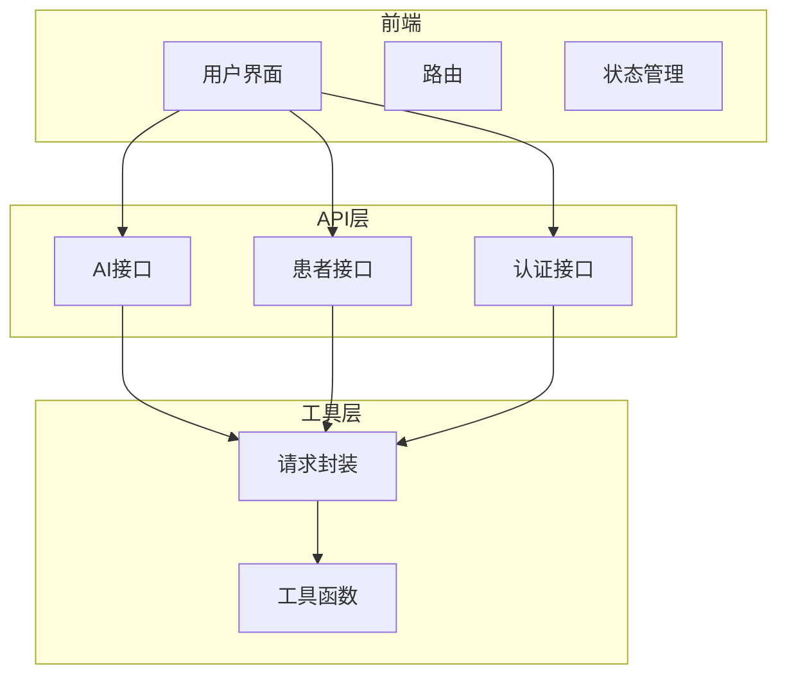
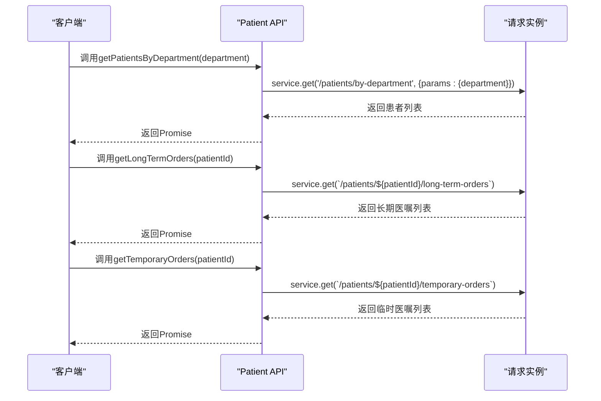
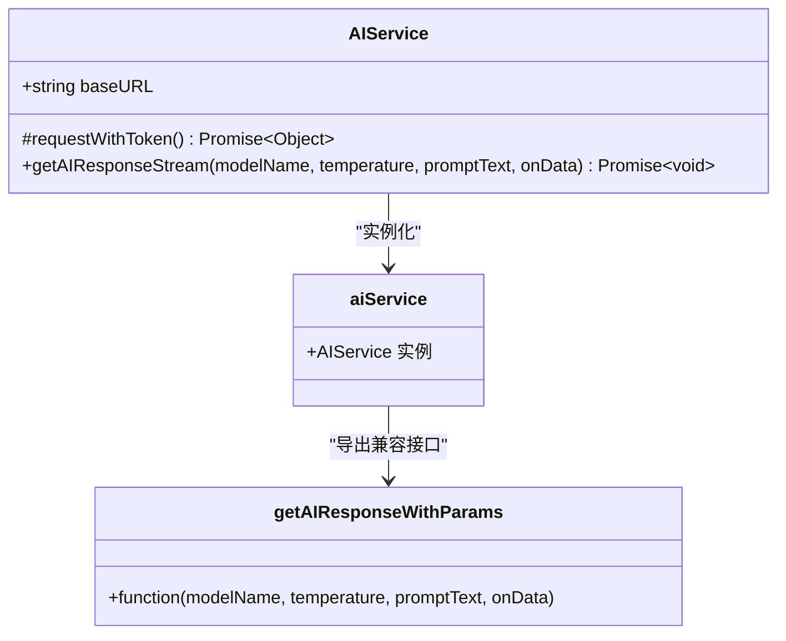
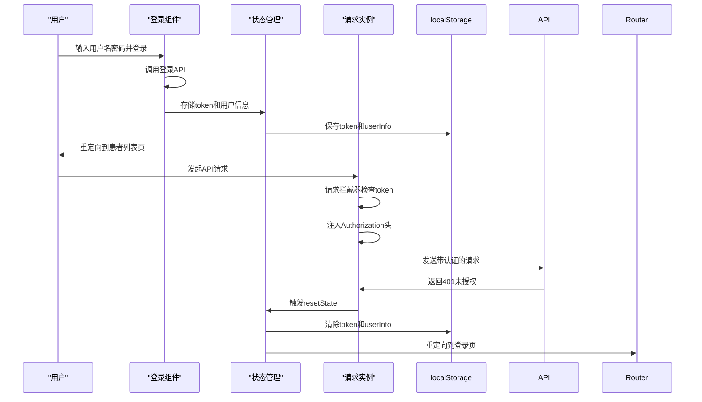

# API集成层

<cite>
**本文档引用的文件**   
- [ai.js](file://src/api/ai.js)
- [aiService.js](file://src/api/aiService.js)
- [request.js](file://src/api/request.js)
- [patient.js](file://src/api/patient.js)
- [Login.vue](file://src/views/Login.vue)
- [README.md](file://README.md)
</cite>

## 目录
1. [项目结构](#项目结构)
2. [RESTful API接口文档](#restful-api接口文档)
3. [患者相关API调用](#患者相关api调用)
4. [请求实例封装](#请求实例封装)
5. [高层服务封装](#高层服务封装)
6. [认证机制](#认证机制)
7. [常见错误码](#常见错误码)

## 项目结构

本项目采用基于Vue.js的前端架构，主要功能模块包括患者信息管理、AI辅助诊断、医疗数据管理和系统管理。项目结构清晰，遵循功能模块化设计。



**图示来源**
- [README.md](file://README.md#L1-L204)

## RESTful API接口文档

### getPatientData 接口
- **HTTP方法**: GET
- **URL路径**: `/ai/patient-data`
- **请求参数**:
  - `patientId` (string, 必填): 患者ID
  - `promptType` (string, 必填): Prompt类型
  - `promptName` (string, 必填): Prompt名称
- **响应结构**: 格式化后的患者医疗数据字符串，包含根据requiredDataTypes获取的各类医疗数据和附加的Prompt模板内容

**接口来源**
- [ai.js](file://src/api/ai.js#L218-L258)

### getPromptTemplate 接口
- **HTTP方法**: GET
- **URL路径**: `/ai/promptTemplate`
- **请求参数**:
  - `promptType` (string, 必填): Prompt类型
  - `promptName` (string, 必填): Prompt名称
- **响应结构**: 包含模板ID、类型、名称、内容、过滤规则、特殊内容、所需数据类型等信息的完整Prompt模板对象

**接口来源**
- [ai.js](file://src/api/ai.js#L256-L307)

### addPrompt 接口
- **HTTP方法**: POST
- **URL路径**: `/ai/savePrompt`
- **请求参数**:
  - `userId` (number, 必填): 用户ID
  - `patientId` (string, 必填): 患者ID
  - `promptTemplateName` (string, 必填): Prompt模板名称
  - `objectiveContent` (string, 必填): 目标内容
  - `promptTemplateContent` (string, 必填): Prompt模板内容
  - `priority` (number, 可选): 优先级，默认3
  - `generatedBy` (string, 可选): 生成来源，默认'user'
  - `sortNumber` (number, 可选): 排序号，默认0
  - `retryCount` (number, 可选): 重试次数，默认0
  - `statusName` (string, 可选): 状态名称，默认'CREATED'
  - `submissionTime` (string, 可选): 提交时间，默认当前时间
- **响应结构**: 
  - `id` (string): 创建记录的ID
  - `status` (string): 创建状态
  - `timestamp` (string): 创建时间戳

**接口来源**
- [ai.js](file://src/api/ai.js#L256-L307)

### getAIResponse 接口
- **HTTP方法**: POST
- **URL路径**: `/ai/response`
- **请求参数**:
  - `model` (string, 必填): 模型名称
  - `parameters` (object, 必填): 参数对象
- **响应结构**: AI回复的JSON数据
- **超时设置**: 300000毫秒（5分钟）

**接口来源**
- [ai.js](file://src/api/ai.js#L45-L96)

### saveAIResult 接口
- **HTTP方法**: POST
- **URL路径**: `/ai/saveResult`
- **请求参数**:
  - `id` (string, 必填): 结果ID
  - `content` (string, 必填): 修改后的内容
  - `originalContent` (string, 必填): 原始内容
  - `promptId` (string, 必填): 关联的Prompt ID
  - `title` (string, 可选): 结果标题
  - `timestamp` (string, 可选): 时间戳
  - `patientId` (string, 可选): 关联的患者ID
  - `lastModifiedBy` (string, 可选): 最后修改人ID
  - `isRead` (number, 可选): 是否已读标记（0/1）
- **响应结构**:
  - `id` (string): 保存后的结果ID
  - `status` (string): 结果状态
  - `timestamp` (string): 创建时间

**接口来源**
- [ai.js](file://src/api/ai.js#L93-L134)

## 患者相关API调用

患者相关API提供了一系列用于获取患者医疗数据的接口，这些接口在`patient.js`文件中定义。



**接口来源**
- [patient.js](file://src/api/patient.js#L1-L50)

## 请求实例封装

`request.js`文件封装了axios实例，统一处理请求拦截、响应拦截、错误处理与认证令牌注入。

```javascript
// 请求拦截器
request.interceptors.request.use(
  config => {
    // 注入认证令牌
    const token = store.state.user.token;
    if (token) {
      config.headers['Authorization'] = `Bearer ${token}`;
    }
    return config;
  },
  error => {
    return Promise.reject(error);
  }
);

// 响应拦截器
request.interceptors.response.use(
  response => {
    return response.data;
  },
  error => {
    // 统一错误处理
    if (error.response?.status === 401) {
      // 认证失败，清除本地状态并重定向到登录页
      localStorage.removeItem('token');
      localStorage.removeItem('userInfo');
      store.dispatch('resetState');
      router.push('/login');
    }
    return Promise.reject(error);
  }
);
```

**封装来源**
- [request.js](file://src/api/request.js)

## 高层服务封装

`aiService.js`文件提供了高层服务封装，特别是针对AI流式响应的处理。



**服务来源**
- [aiService.js](file://src/api/aiService.js)

## 认证机制

系统采用基于JWT的认证机制，认证令牌在用户登录后获取并存储在localStorage中。



**认证来源**
- [Login.vue](file://src/views/Login.vue#L141-L196)

## 常见错误码

| 错误码 | 含义 | 处理建议 |
|-------|------|---------|
| 400 | 参数验证失败 | 检查请求参数是否符合要求 |
| 401 | 未授权 | 用户需要重新登录 |
| 404 | 资源不存在 | 检查请求的资源ID是否正确 |
| 500 | 服务器内部错误 | 联系系统管理员 |

**错误处理来源**
- [ai.js](file://src/api/ai.js#L93-L134)
- [aiService.js](file://src/api/aiService.js#L44-L86)