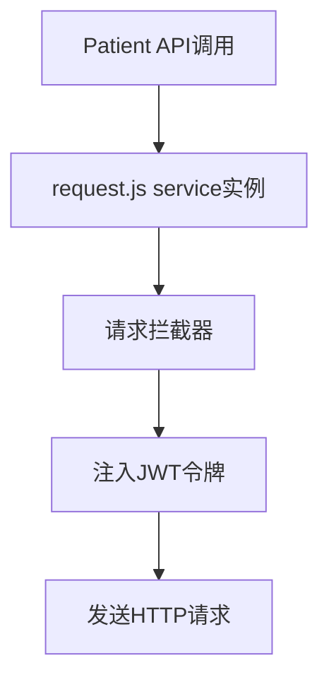

# 患者数据API

<cite>
**Referenced Files in This Document**   
- [patient.js](file://src/api/patient.js)
- [request.js](file://src/api/request.js)
- [system.js](file://memory-bank/constants/system.js)
</cite>

## 目录
1. [简介](#简介)
2. [核心API接口](#核心api接口)
3. [数据查询与过滤](#数据查询与过滤)
4. [请求/响应示例](#请求响应示例)
5. [API依赖与配置](#api依赖与配置)
6. [错误处理](#错误处理)
7. [结论](#结论)

## 简介

患者数据API是医疗AI助手系统的核心服务之一，为前端应用提供对患者信息、病历记录、医嘱、检查化验结果等关键医疗数据的访问能力。该API通过标准化的RESTful接口，实现了对患者全生命周期数据的高效查询与管理，支持临床决策、病历书写和医疗质量管理等多种应用场景。

**Section sources**
- [patient.js](file://src/api/patient.js#L1-L50)

## 核心API接口

本节详细描述`patient.js`文件中导出的核心患者服务函数，涵盖其用途、HTTP方法、端点URL、输入参数和输出数据结构。

### 患者列表查询

`searchPatients`函数用于执行多条件组合查询，获取符合条件的患者列表。

- **用途**: 根据姓名、科室、专业组、入院/出院日期等条件筛选患者。
- **HTTP方法**: `GET`
- **端点URL**: `/patients/search`
- **输入参数**: 一个包含查询条件的对象，支持`name`（姓名）、`department`（科室）、`specialtyGroup`（专业组）、`admissionStart`/`admissionEnd`（入院日期范围）、`dischargeStart`/`dischargeEnd`（出院日期范围）、`page`（页码）和`size`（每页条数）等字段。
- **输出数据结构**: 返回一个包含患者列表的Promise对象。

**Section sources**
- [patient.js](file://src/api/patient.js#L63-L67)

### 患者详情获取

`getMedicalRecords`函数用于获取特定患者的病历记录。

- **用途**: 获取指定患者ID的所有病历记录。
- **HTTP方法**: `GET`
- **端点URL**: `/medicalrecords`
- **输入参数**: `patientId`（患者ID），作为查询参数传递。
- **输出数据结构**: 返回一个包含病历记录列表的Promise对象。

**Section sources**
- [patient.js](file://src/api/patient.js#L83-L87)

### 患者信息更新

`updateMedicalRecord`函数用于更新患者的医疗记录。

- **用途**: 修改指定的病历记录内容。
- **HTTP方法**: `PUT`
- **端点URL**: `/medicalrecords/{recordId}`，其中`{recordId}`为要更新的记录ID。
- **输入参数**: 
  - `params`: 包含`recordId`（记录ID）和`patientId`（患者ID）的对象。
  - `data`: 包含要更新的医疗记录数据的对象。
- **输出数据结构**: 返回一个表示更新操作结果的Promise对象。

**Section sources**
- [patient.js](file://src/api/patient.js#L94-L100)

## 数据查询与过滤

患者数据查询功能支持灵活的过滤和分页机制，以满足不同场景下的数据检索需求。

### 过滤参数

系统支持多种过滤参数，允许用户精确地定位目标患者：
- **姓名 (`name`)**: 通过患者姓名进行模糊或精确匹配。
- **住院号**: 可通过其他接口或参数进行精确查询。
- **科室 (`department`)**: 按照患者所在科室进行筛选，例如“心血管内科”、“骨科”等。
- **专业组 (`specialtyGroup`)**: 按照更细分的专业组进行筛选。
- **时间范围**: 支持按入院日期 (`admissionStart`, `admissionEnd`) 和出院日期 (`dischargeStart`, `dischargeEnd`) 进行范围查询。

### 分页机制

所有列表查询接口均采用标准的分页机制，以提高性能和用户体验：
- **`page` 参数**: 指定请求的页码，通常从0开始计数。
- **`size` 参数**: 指定每页返回的记录数量，用于控制响应数据的大小。

例如，`getDischargedPatientsIn7Days`函数明确接收`page`和`size`作为参数，实现对7天内出院患者的分页查询。

**Section sources**
- [patient.js](file://src/api/patient.js#L63-L67)
- [patient.js](file://src/api/patient.js#L257-L262)

## 请求/响应示例

### 获取特定患者基本信息与病历数据

**请求示例**:
```javascript
// 获取ID为'P123456'的患者的所有病历记录
getMedicalRecords('P123456')
  .then(response => {
    console.log('病历数据:', response.data);
  })
  .catch(error => {
    console.error('获取病历失败:', error);
  });
```

**成功响应示例**:
```json
{
  "status": 200,
  "data": [
    {
      "record_id": 1001,
      "patientId": "P123456",
      "record_type": "入院记录",
      "content": "患者因胸痛入院...",
      "created_at": "2025-08-20T10:00:00Z"
    },
    {
      "record_id": 1002,
      "patientId": "P123456",
      "record_type": "首次病程记录",
      "content": "患者诊断为急性心肌梗死...",
      "created_at": "2025-08-20T11:30:00Z"
    }
  ]
}
```

**Section sources**
- [patient.js](file://src/api/patient.js#L83-L87)

## API依赖与配置

患者数据API的功能实现依赖于`request.js`文件中定义的统一请求配置。

### 依赖关系

`patient.js`通过`import service from './request'`引入了`service`实例，所有API调用均基于此实例发起。

### 统一配置

`request.js`为所有API请求提供了以下统一配置：
- **超时设置**: 所有请求的超时时间设置为30秒，确保在复杂查询或网络延迟时有足够的时间完成。
- **错误重试策略**: 虽然代码中未直接体现，但`axios`实例的配置为实现重试逻辑提供了基础。
- **JWT令牌自动注入**: 通过请求拦截器，系统会自动从Vuex store中获取用户的JWT令牌，并将其注入到每个请求的`Authorization`头中，实现了无感认证。



**Diagram sources**
- [patient.js](file://src/api/patient.js#L1)
- [request.js](file://src/api/request.js#L4-L7)
- [request.js](file://src/api/request.js#L50-L58)

**Section sources**
- [request.js](file://src/api/request.js#L4-L7)
- [request.js](file://src/api/request.js#L50-L58)

## 错误处理

API在调用过程中可能返回多种错误，客户端需要进行相应的处理。

### 常见调用错误

- **患者ID不存在 (404 Not Found)**: 当请求的`patientId`在系统中找不到对应的患者时，后端服务会返回404状态码。例如，调用`getMedicalRecords('INVALID_ID')`可能会触发此错误。
- **查询参数格式错误 (400 Bad Request)**: 当请求中包含的参数格式不正确或缺少必要参数时，会返回400状态码。例如，传递一个非日期格式的字符串作为`admissionStart`参数。

### 错误代码常量

系统在`memory-bank/constants/system.js`中定义了标准的错误代码常量，如`NOT_FOUND`和`VALIDATION_ERROR`，用于规范化错误处理逻辑。

**Section sources**
- [patient.js](file://src/api/patient.js#L83-L87)
- [system.js](file://memory-bank/constants/system.js#L231-L281)

## 结论

患者数据API为医疗AI助手提供了强大而灵活的数据访问能力。通过`patient.js`中定义的一系列函数，系统能够高效地查询、检索和更新患者的核心医疗信息。该API的设计遵循RESTful原则，接口清晰，参数明确，并通过`request.js`实现了统一的请求配置和安全认证。开发者在使用这些API时，应充分理解其过滤、分页机制，并妥善处理404、400等常见错误，以构建稳定可靠的前端应用。