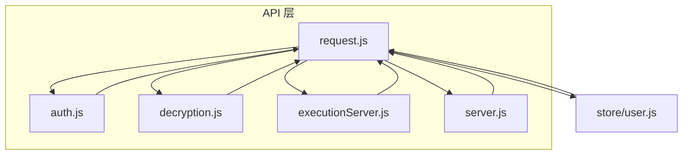
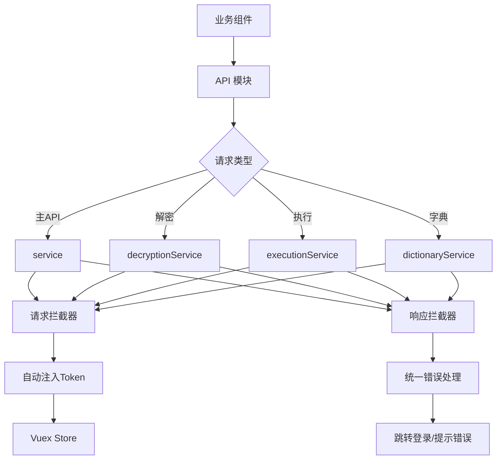
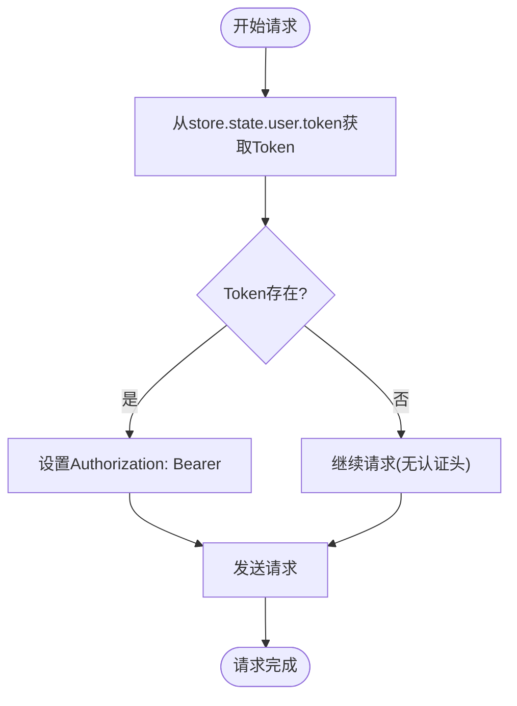
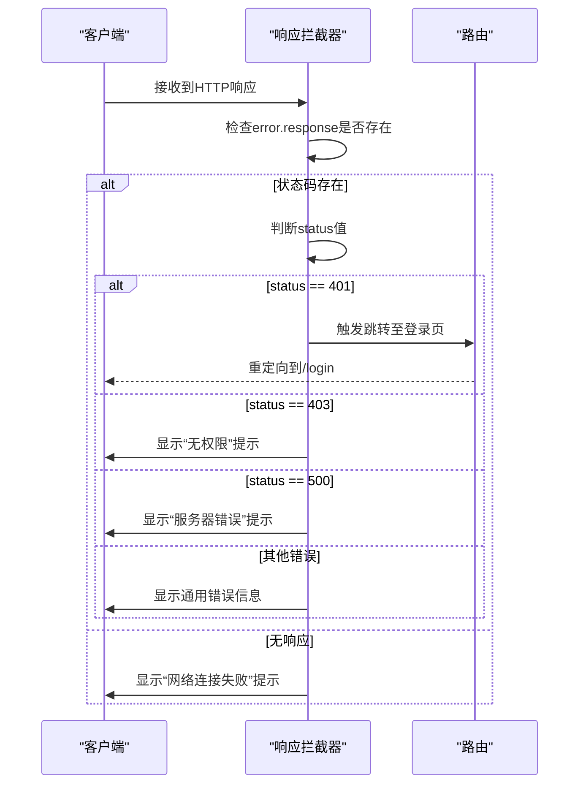
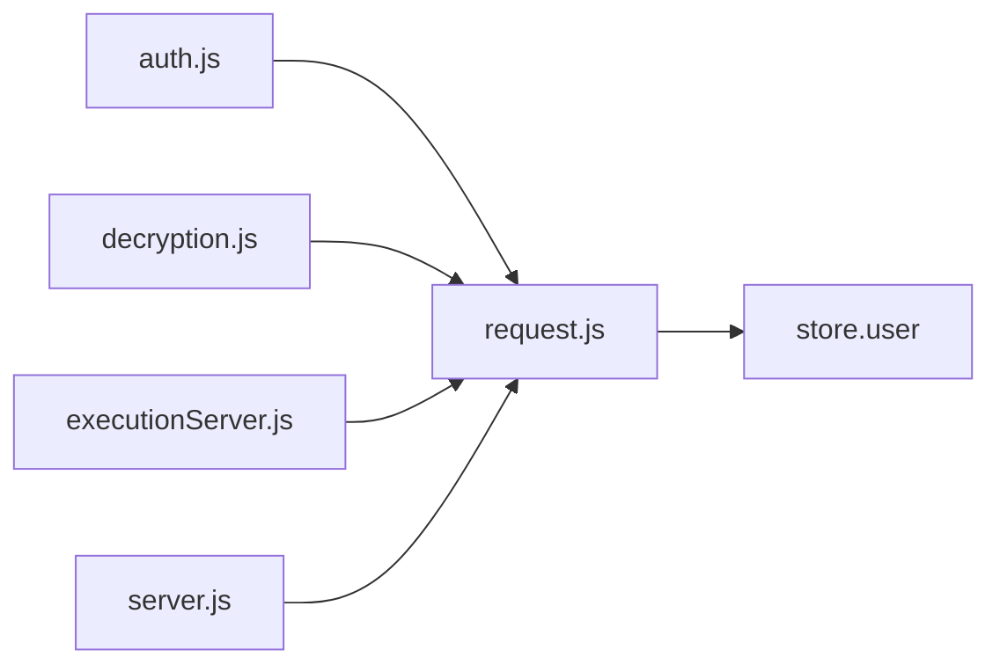

# 请求配置与拦截器

<cite>
**本文档引用的文件**
- [request.js](file://src/api/request.js)
- [user.js](file://src/store/modules/user.js)
- [auth.js](file://src/api/auth.js)
- [Login.vue](file://src/views/Login.vue)
</cite>

## 目录
1. [简介](#简介)
2. [项目结构](#项目结构)
3. [核心组件](#核心组件)
4. [架构概述](#架构概述)
5. [详细组件分析](#详细组件分析)
6. [依赖分析](#依赖分析)
7. [性能考虑](#性能考虑)
8. [故障排除指南](#故障排除指南)
9. [结论](#结论)

## 简介
`request.js` 是医疗AI助手前端项目中的核心网络请求模块，基于 Axios 封装了多个自定义实例，用于与主API、解密服务器、执行服务器和字典服务进行通信。该模块统一处理认证、超时、错误响应等逻辑，为上层业务提供稳定、安全的HTTP请求能力。

## 项目结构
`request.js` 位于 `src/api/` 目录下，是整个项目API请求的底层支撑。它通过创建多个 Axios 实例来区分不同目标服务的请求配置，并利用 Vuex 状态管理实现 token 的自动注入与权限控制。



**图示来源**
- [request.js](file://src/api/request.js#L1-L102)
- [user.js](file://src/store/modules/user.js#L1-L20)

**本节来源**
- [request.js](file://src/api/request.js#L1-L102)
- [src/api](file://src/api)

## 核心组件
`request.js` 的核心功能包括：
- 创建多个 Axios 实例以适配不同后端服务
- 配置统一的基础URL、超时时间、请求头
- 实现请求拦截器自动注入用户 token
- 实现响应拦截器统一处理认证失败、权限不足、服务器错误等异常情况
- 支持解密、执行、字典等专用服务的独立配置

**本节来源**
- [request.js](file://src/api/request.js#L1-L102)

## 架构概述
`request.js` 采用多实例模式，分别创建 `service`（主API）、`decryptionService`（解密服务）、`executionService`（执行服务）和 `dictionaryService`（字典服务）四个独立的 Axios 实例。每个实例拥有独立的 baseURL 和配置，避免请求冲突。



**图示来源**
- [request.js](file://src/api/request.js#L1-L102)

**本节来源**
- [request.js](file://src/api/request.js#L1-L102)

## 详细组件分析

### 请求拦截器分析
请求拦截器在每次请求发出前执行，主要功能是从 Vuex Store 中读取当前用户的 token，并将其注入到 `Authorization` 请求头中，格式为 `Bearer <token>`。



**图示来源**
- [request.js](file://src/api/request.js#L48-L58)
- [user.js](file://src/store/modules/user.js#L1-L20)

### 响应拦截器分析
响应拦截器负责统一处理服务器返回的响应，特别是对 4xx/5xx 错误状态码进行集中处理。当检测到 401（未授权）状态码时，表示 token 已过期或无效，系统应引导用户重新登录。



**图示来源**
- [request.js](file://src/api/request.js#L84-L98)
- [Login.vue](file://src/views/Login.vue#L141-L196)

**本节来源**
- [request.js](file://src/api/request.js#L84-L98)
- [Login.vue](file://src/views/Login.vue#L141-L196)

### 错误处理机制分析
错误处理机制覆盖了网络异常、超时、服务器错误等多种场景。通过响应拦截器捕获所有请求错误，并根据错误类型进行分类处理：

- **网络异常**：`error.request` 存在但无响应，提示“无法连接服务器”
- **超时**：由 Axios 自动触发，统一归类为请求失败
- **4xx 客户端错误**：如 401（认证失效）、403（权限不足）
- **5xx 服务端错误**：如 500（内部错误）

系统通过 `switch` 语句对不同状态码进行差异化处理，确保用户体验一致性。

**本节来源**
- [request.js](file://src/api/request.js#L84-L98)

### 自定义请求配置扩展
`request.js` 提供了良好的扩展性，允许在调用时传入自定义配置，例如设置特殊 headers 或取消请求。开发者可通过覆盖 `config` 对象实现灵活控制。

```javascript
// 示例：发送带自定义头的请求
service.get('/data', {
  headers: {
    'X-Custom-Header': 'value'
  }
})
```

此外，通过导出多个服务实例（如 `decryptionService`），支持针对特定服务的独立配置与调用。

**本节来源**
- [request.js](file://src/api/request.js#L1-L102)

## 依赖分析
`request.js` 依赖于 Vuex 状态管理模块获取用户 token，同时被多个 API 模块（如 `auth.js`、`decryption.js`）所引用，形成清晰的依赖链。



**图示来源**
- [request.js](file://src/api/request.js#L2)
- [auth.js](file://src/api/auth.js#L1)
- [decryption.js](file://src/api/decryption.js#L1)
- [executionServer.js](file://src/api/executionServer.js#L1)
- [server.js](file://src/api/server.js#L1)

**本节来源**
- [request.js](file://src/api/request.js#L1-L102)
- [auth.js](file://src/api/auth.js#L1-L83)
- [decryption.js](file://src/api/decryption.js#L1-L171)
- [executionServer.js](file://src/api/executionServer.js#L1-L152)
- [server.js](file://src/api/server.js#L1-L14)

## 性能考虑
- 所有请求实例均设置 30 秒超时，防止长时间挂起影响用户体验
- 使用拦截器统一处理认证逻辑，避免重复代码
- 多实例设计减少配置冲突风险，提升请求稳定性
- 响应拦截器避免直接抛出原始错误，提升错误处理效率

## 故障排除指南
常见问题及解决方案：

| 问题现象 | 可能原因 | 解决方案 |
|--------|--------|--------|
| 请求无响应 | token 未正确注入 | 检查 Vuex 中 `user.token` 是否存在 |
| 401 错误频繁 | token 过期策略不合理 | 检查后端 token 有效期与刷新机制 |
| 解密服务超时 | 网络延迟或服务负载高 | 优化网络环境或增加超时时间 |
| 字典请求失败 | baseURL 配置错误 | 检查 `VUE_APP_API_BASE_URL` 环境变量 |

**本节来源**
- [request.js](file://src/api/request.js#L1-L102)
- [auth.js](file://src/api/auth.js#L1-L83)

## 结论
`request.js` 是医疗AI助手项目中关键的网络通信层，通过 Axios 多实例封装实现了对不同后端服务的安全、高效访问。其请求/响应拦截器机制有效统一了认证与错误处理逻辑，提升了代码可维护性与用户体验。未来可进一步增强 token 自动刷新、请求缓存等功能。