# 数据库操作

<cite>
**本文档引用的文件**
- [DRG数据导入SQL Developer操作指南.md](file://med_ai_assistant_1.0_bs_backend/doc/数据库操作/DRG数据导入SQL Developer操作指南.md)
- [DRG分析结果表创建脚本.sql](file://med_ai_assistant_1.0_bs_backend/sql-scripts/create-drg-analysis-results-table.sql)
- [DRG分析输入快照表.sql](file://med_ai_assistant_1.0_bs_backend/sql-scripts/drg_analysis_input_snapshot.sql)
- [DRG分析输入快照存储过程.sql](file://med_ai_assistant_1.0_bs_backend/sql-scripts/gen_drg_input_snapshot_procedure.sql)
- [Oracle IDENTITY策略支持脚本.sql](file://med_ai_assistant_1.0_bs_backend/sql-scripts/create-identity-sequences.sql)
- [添加DRG编码列脚本.sql](file://med_ai_assistant_1.0_bs_backend/sql-scripts/add-drg-code-column.sql)
- [添加保险支付标准字段脚本.sql](file://med_ai_assistant_1.0_bs_backend/sql-scripts/add-insurance-payment-standard-column.sql)
- [同步日志表脚本.sql](file://med_ai_assistant_1.0_bs_backend/sql-scripts/create-sync-log-table.sql)
- [状态转换历史表脚本.sql](file://med_ai_assistant_1.0_bs_backend/sql-scripts/create-status-transition-history-table.sql)
- [ENCRYPTED_DATA_TEMP唯一约束脚本.sql](file://med_ai_assistant_1.0_bs_backend/sql-scripts/add-request-id-unique-constraint.sql)
- [数据库初始化脚本.sql](file://med_ai_assistant_1.0_bs_backend/init.sql)
</cite>

## 目录
1. [简介](#简介)
2. [项目结构](#项目结构)
3. [核心组件](#核心组件)
4. [架构概览](#架构概览)
5. [详细组件分析](#详细组件分析)
6. [依赖关系分析](#依赖关系分析)
7. [性能考虑](#性能考虑)
8. [故障排除指南](#故障排除指南)
9. [结论](#结论)

## 简介

本文档全面介绍了MedAiAssistant项目的数据库操作体系，涵盖了Oracle和MySQL双数据库支持、DRG数据分析、数据同步、状态管理等核心数据库功能。项目采用分层架构设计，通过存储过程、序列、触发器等数据库特性实现高性能的数据处理和状态管理。

## 项目结构

项目采用模块化组织方式，数据库相关文件主要分布在以下目录：

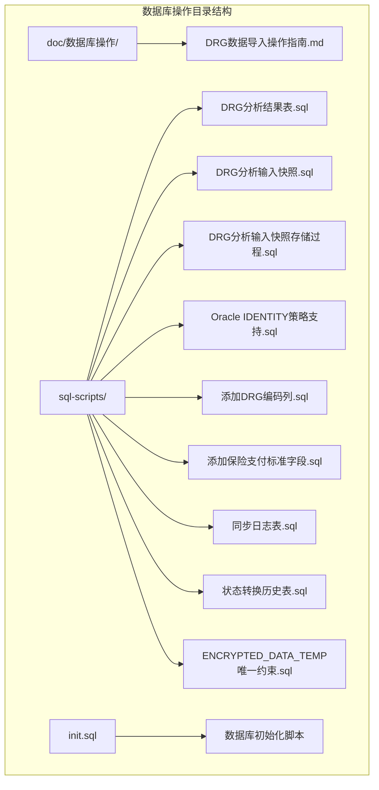

**图表来源**
- [DRG数据导入SQL Developer操作指南.md:1-246](file://med_ai_assistant_1.0_bs_backend/doc/数据库操作/DRG数据导入SQL Developer操作指南.md#L1-L246)
- [DRG分析结果表创建脚本.sql:1-188](file://med_ai_assistant_1.0_bs_backend/sql-scripts/create-drg-analysis-results-table.sql#L1-L188)

**章节来源**
- [DRG数据导入SQL Developer操作指南.md:1-246](file://med_ai_assistant_1.0_bs_backend/doc/数据库操作/DRG数据导入SQL Developer操作指南.md#L1-L246)
- [Oracle IDENTITY策略支持脚本.sql:1-741](file://med_ai_assistant_1.0_bs_backend/sql-scripts/create-identity-sequences.sql#L1-L741)

## 核心组件

### DRG分析系统

DRG分析系统是项目的核心数据库组件，包含完整的分析流程和数据管理机制：

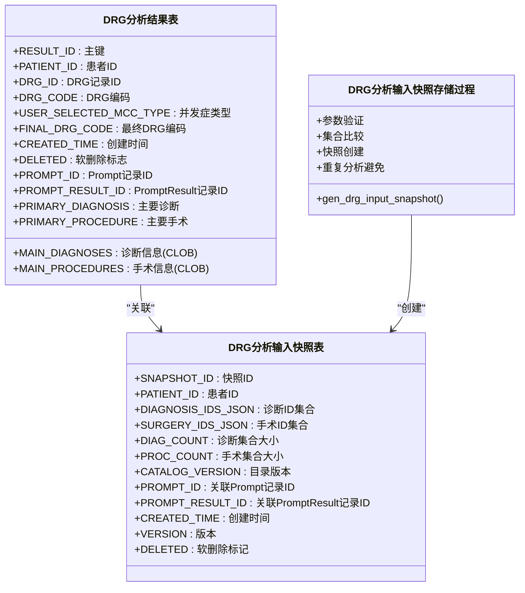

**图表来源**
- [DRG分析结果表创建脚本.sql:4-76](file://med_ai_assistant_1.0_bs_backend/sql-scripts/create-drg-analysis-results-table.sql#L4-L76)
- [DRG分析输入快照表.sql:14-27](file://med_ai_assistant_1.0_bs_backend/sql-scripts/drg_analysis_input_snapshot.sql#L14-L27)
- [DRG分析输入快照存储过程.sql:18-117](file://med_ai_assistant_1.0_bs_backend/sql-scripts/gen_drg_input_snapshot_procedure.sql#L18-L117)

### 数据同步管理系统

系统提供完整的数据同步和状态管理功能：

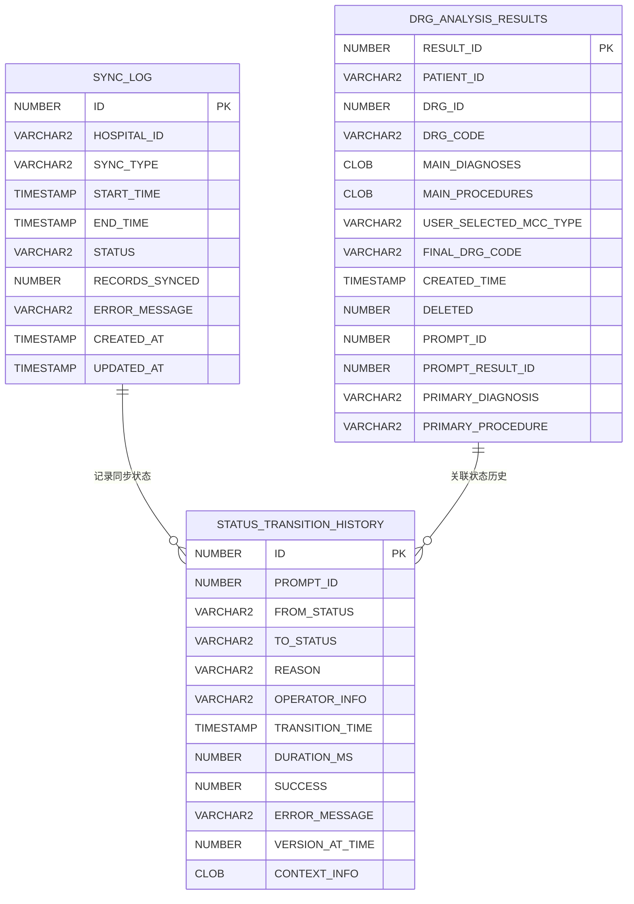

**图表来源**
- [同步日志表脚本.sql:13-24](file://med_ai_assistant_1.0_bs_backend/sql-scripts/create-sync-log-table.sql#L13-L24)
- [状态转换历史表脚本.sql:13-26](file://med_ai_assistant_1.0_bs_backend/sql-scripts/create-status-transition-history-table.sql#L13-L26)

**章节来源**
- [DRG分析结果表创建脚本.sql:1-188](file://med_ai_assistant_1.0_bs_backend/sql-scripts/create-drg-analysis-results-table.sql#L1-L188)
- [DRG分析输入快照表.sql:1-58](file://med_ai_assistant_1.0_bs_backend/sql-scripts/drg_analysis_input_snapshot.sql#L1-L58)
- [DRG分析输入快照存储过程.sql:1-119](file://med_ai_assistant_1.0_bs_backend/sql-scripts/gen_drg_input_snapshot_procedure.sql#L1-L119)

## 架构概览

系统采用分层架构设计，数据库层提供核心数据存储和处理能力：

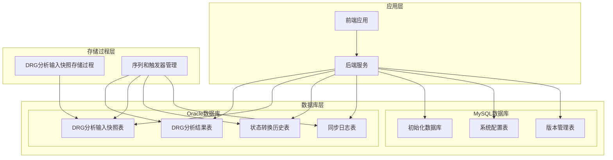

**图表来源**
- [Oracle IDENTITY策略支持脚本.sql:1-741](file://med_ai_assistant_1.0_bs_backend/sql-scripts/create-identity-sequences.sql#L1-L741)
- [数据库初始化脚本.sql:1-119](file://med_ai_assistant_1.0_bs_backend/init.sql#L1-L119)

## 详细组件分析

### DRG数据导入系统

DRG数据导入系统提供了完整的数据处理和验证机制：

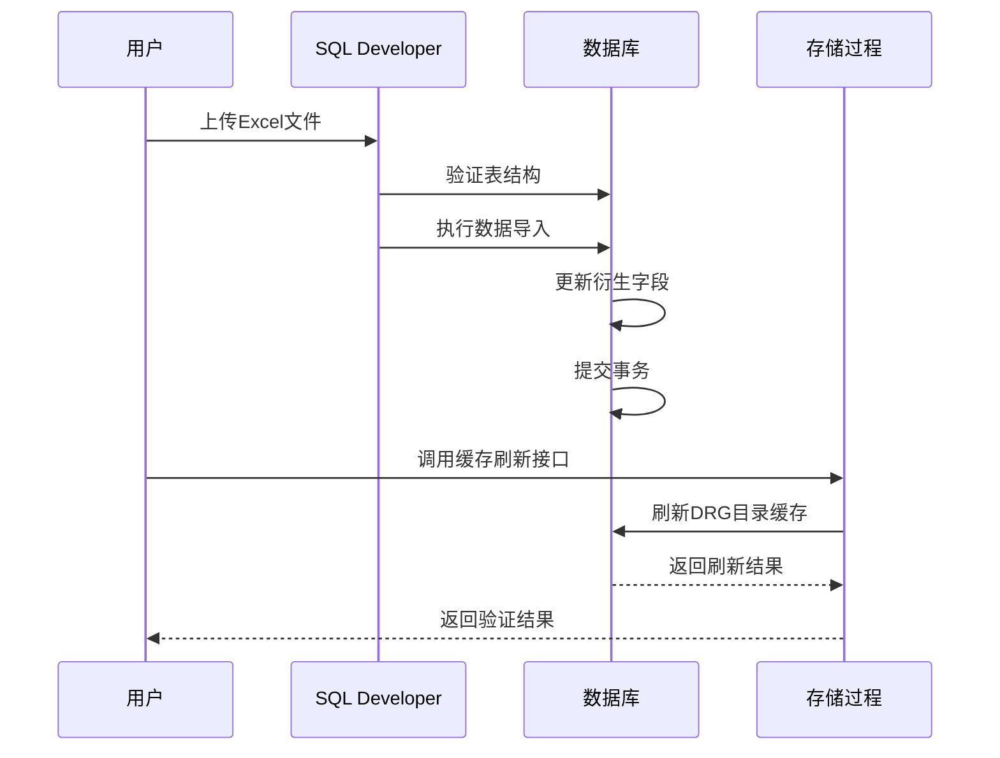

**图表来源**
- [DRG数据导入SQL Developer操作指南.md:71-166](file://med_ai_assistant_1.0_bs_backend/doc/数据库操作/DRG数据导入SQL Developer操作指南.md#L71-L166)

#### 数据导入流程

系统支持多种数据导入模式，包括直接XLSX导入和CSV转换导入：

| 导入模式 | 适用场景 | 优点 | 注意事项 |
|---------|---------|------|---------|
| 直接XLSX导入 | 大多数情况 | 保持数据完整性，支持复杂格式 | 需要SQL Developer支持 |
| CSV转换导入 | 特殊情况 | 兼容性好 | 需要注意换行符处理 |
| 手工SQL导入 | 大数据量 | 性能最优 | 需要SQL技能 |

**章节来源**
- [DRG数据导入SQL Developer操作指南.md:1-246](file://med_ai_assistant_1.0_bs_backend/doc/数据库操作/DRG数据导入SQL Developer操作指南.md#L1-L246)

### Oracle IDENTITY策略支持

系统通过序列和触发器实现Oracle数据库的IDENTITY策略支持：

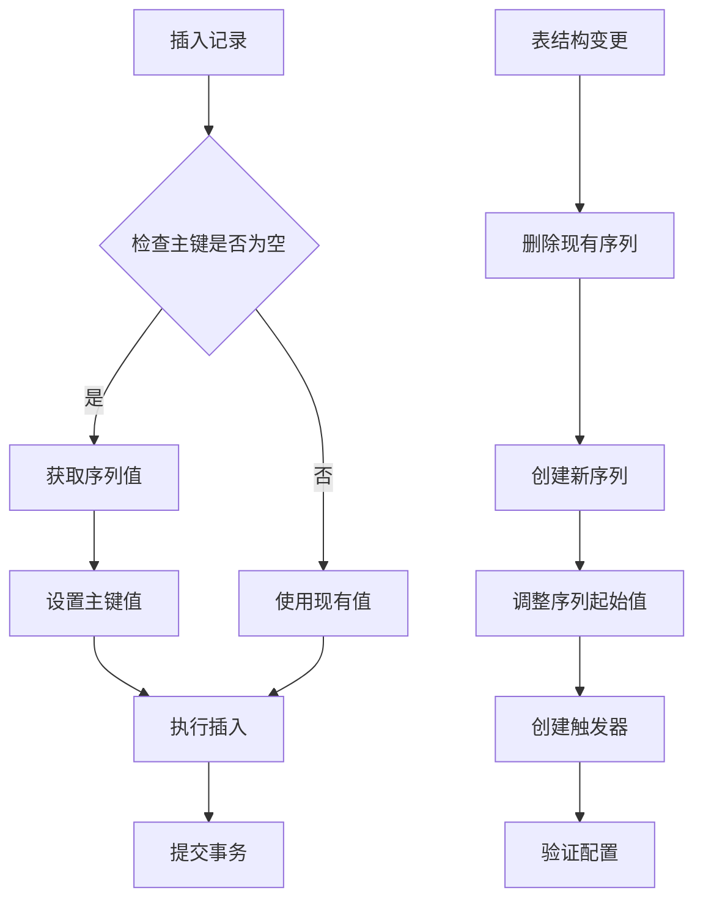

**图表来源**
- [Oracle IDENTITY策略支持脚本.sql:16-53](file://med_ai_assistant_1.0_bs_backend/sql-scripts/create-identity-sequences.sql#L16-L53)

#### 序列管理策略

系统为每个使用IDENTITY的表维护独立的序列管理：

| 表名称 | 序列名称 | 触发器名称 | 起始值 | 缓存大小 |
|--------|----------|------------|--------|----------|
| MEDICAL_RECORDS | MEDICAL_RECORDS_SEQ | TRG_MEDICAL_RECORDS_ID | 1 | 20 |
| TODO_ITEM | TODO_ITEM_SEQ | TRG_TODO_ITEM_ID | 1 | 20 |
| LAB_RESULT | LAB_RESULT_SEQ | TRG_LAB_RESULT_ID | 1 | 20 |
| EMR_CONTENT | EMR_CONTENT_SEQ | TRG_EMR_CONTENT_ID | 1 | 20 |
| PROMPTRESULT | PROMPTRESULT_SEQ | TRG_PROMPTRESULT_ID | 1 | 20 |

**章节来源**
- [Oracle IDENTITY策略支持脚本.sql:1-741](file://med_ai_assistant_1.0_bs_backend/sql-scripts/create-identity-sequences.sql#L1-L741)

### 数据同步和状态管理

系统提供完整的数据同步和状态管理功能：

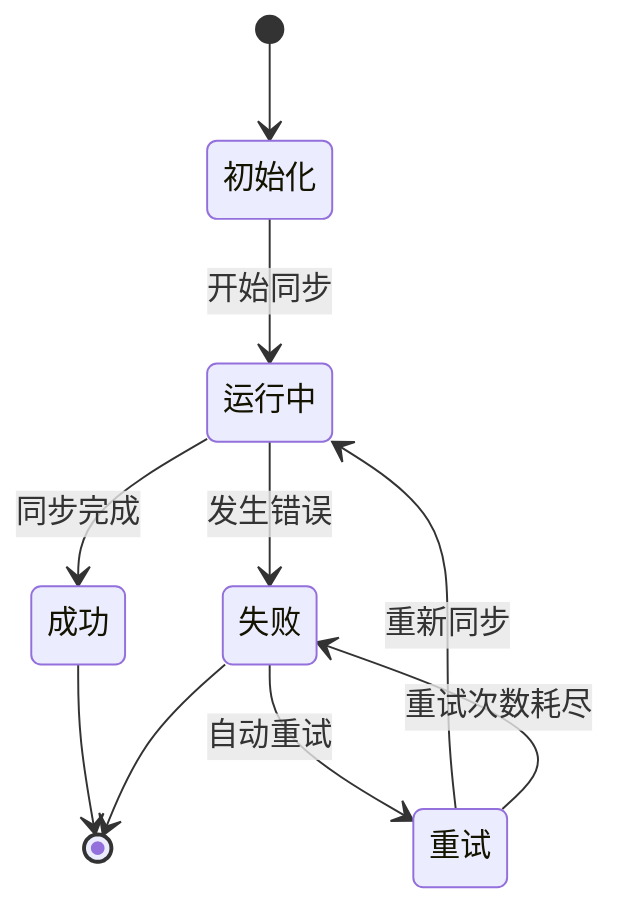

**图表来源**
- [同步日志表脚本.sql:13-24](file://med_ai_assistant_1.0_bs_backend/sql-scripts/create-sync-log-table.sql#L13-L24)

#### 同步状态跟踪

系统通过状态转换历史记录完整的状态变更过程：

| 状态类型 | 描述 | 持续时间 | 错误处理 |
|----------|------|----------|----------|
| RUNNING | 同步进行中 | 动态计算 | 记录错误信息 |
| SUCCESS | 同步成功 | 实际耗时 | 无错误信息 |
| FAILED | 同步失败 | 实际耗时 | 详细错误描述 |
| RETRYING | 重试中 | 动态计算 | 记录重试原因 |

**章节来源**
- [状态转换历史表脚本.sql:1-50](file://med_ai_assistant_1.0_bs_backend/sql-scripts/create-status-transition-history-table.sql#L1-L50)

## 依赖关系分析

系统数据库组件之间的依赖关系如下：

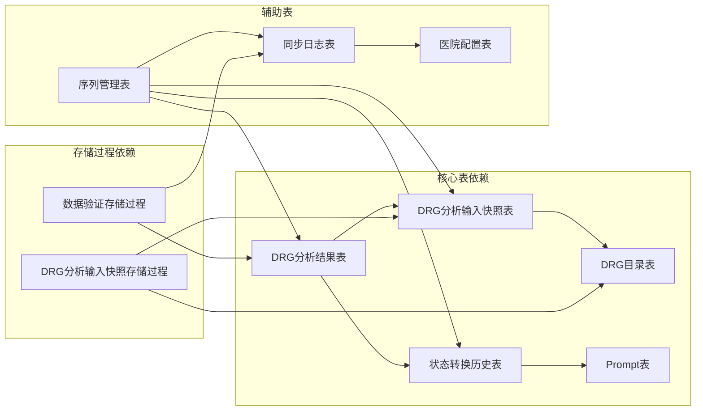

**图表来源**
- [DRG分析结果表创建脚本.sql:4-76](file://med_ai_assistant_1.0_bs_backend/sql-scripts/create-drg-analysis-results-table.sql#L4-L76)
- [DRG分析输入快照表.sql:14-27](file://med_ai_assistant_1.0_bs_backend/sql-scripts/drg_analysis_input_snapshot.sql#L14-L27)

### 数据完整性约束

系统通过多种机制确保数据完整性：

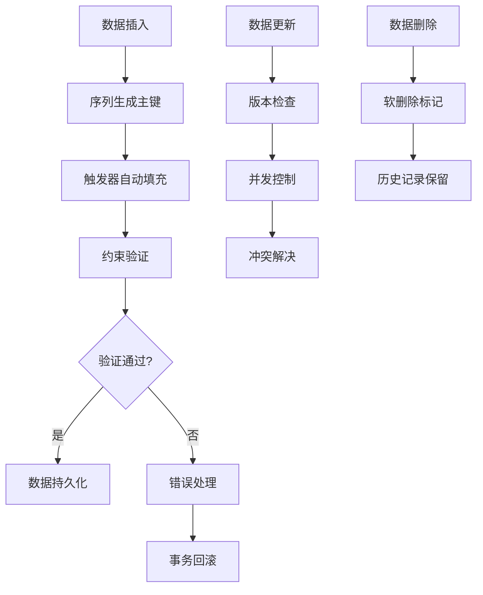

**图表来源**
- [Oracle IDENTITY策略支持脚本.sql:45-52](file://med_ai_assistant_1.0_bs_backend/sql-scripts/create-identity-sequences.sql#L45-L52)

**章节来源**
- [ENCRYPTED_DATA_TEMP唯一约束脚本.sql:1-80](file://med_ai_assistant_1.0_bs_backend/sql-scripts/add-request-id-unique-constraint.sql#L1-L80)

## 性能考虑

### 索引优化策略

系统采用多层次索引策略优化查询性能：

| 表名称 | 索引类型 | 列组合 | 性能收益 |
|--------|----------|--------|----------|
| DRG_ANALYSIS_RESULTS | 主键索引 | RESULT_ID | 快速主键查找 |
| DRG_ANALYSIS_RESULTS | 复合索引 | PATIENT_ID, CREATED_TIME | 历史记录查询 |
| DRG_ANALYSIS_RESULTS | 复合索引 | DRG_ID, FINAL_DRG_CODE | 分析结果检索 |
| SYNC_LOG | 复合索引 | HOSPITAL_ID, STATUS | 同步状态查询 |
| STATUS_TRANSITION_HISTORY | 复合索引 | PROMPT_ID, TRANSITION_TIME | 状态历史查询 |

### 存储过程优化

DRG分析输入快照存储过程采用智能缓存机制避免重复计算：

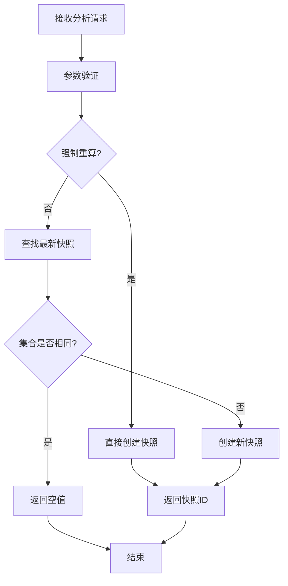

**图表来源**
- [DRG分析输入快照存储过程.sql:38-92](file://med_ai_assistant_1.0_bs_backend/sql-scripts/gen_drg_input_snapshot_procedure.sql#L38-L92)

## 故障排除指南

### 常见数据库问题及解决方案

| 问题类型 | 错误代码 | 症状描述 | 解决方案 |
|----------|----------|----------|----------|
| 主键约束错误 | ORA-01400 | 无法将NULL插入主键列 | 执行IDENTITY策略支持脚本 |
| 唯一约束冲突 | ORA-00001 | 重复值违反唯一约束 | 清理重复数据后添加约束 |
| CLOB字段过大 | ORA-12899 | 值超出VARCHAR2长度限制 | 修改字段类型为CLOB |
| 序列缓存不足 | ORA-08004 | 序列缓存耗尽 | 调整序列缓存大小 |
| 触发器失效 | PL/SQL-00936 | 触发器语法错误 | 重新创建触发器 |

### 数据库连接问题

系统提供完整的连接池管理和监控功能：

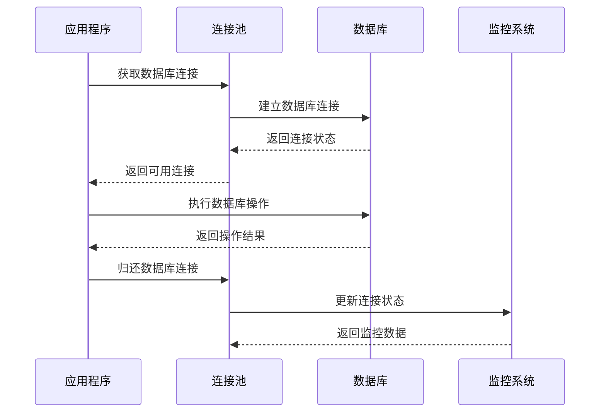

**图表来源**
- [数据库初始化脚本.sql:28-32](file://med_ai_assistant_1.0_bs_backend/init.sql#L28-L32)

**章节来源**
- [Oracle IDENTITY策略主键NULL插入错误修复.md:135-182](file://med_ai_assistant_1.0_bs_backend/doc/问题修复/Oracle数据库IDENTITY策略主键NULL插入错误修复.md#L135-L182)

## 结论

MedAiAssistant项目的数据库操作体系展现了高度的专业性和完整性。通过精心设计的表结构、存储过程和索引策略，系统实现了高效的数据处理能力和强大的状态管理功能。

### 主要优势

1. **双数据库支持**：同时支持Oracle和MySQL数据库，提供灵活的部署选项
2. **智能缓存机制**：通过DRG分析输入快照避免重复计算，提升系统性能
3. **完整的状态管理**：提供详细的状态转换历史和同步日志记录
4. **数据完整性保障**：通过约束、触发器和存储过程确保数据一致性
5. **性能优化策略**：多层次索引和序列管理优化查询性能

### 技术特色

- **模块化设计**：各个数据库组件职责明确，便于维护和扩展
- **自动化程度高**：通过序列和触发器实现自动化的主键生成和数据填充
- **监控完善**：提供完整的数据库健康状态监控和性能指标
- **故障恢复**：具备完善的错误处理和恢复机制

该数据库操作体系为整个MedAiAssistant系统的稳定运行奠定了坚实的基础，为后续的功能扩展和性能优化提供了良好的架构支撑。