# 数据库操作

<cite>
**本文档引用的文件**
- [DRG数据导入SQL Developer操作指南.md](file://med_ai_assistant_1.0_bs_backend/doc/数据库操作/DRG数据导入SQL Developer操作指南.md)
- [DRG分析结果表创建脚本.sql](file://med_ai_assistant_1.0_bs_backend/sql-scripts/create-drg-analysis-results-table.sql)
- [DRG分析输入快照表.sql](file://med_ai_assistant_1.0_bs_backend/sql-scripts/drg_analysis_input_snapshot.sql)
- [DRG分析输入快照存储过程.sql](file://med_ai_assistant_1.0_bs_backend/sql-scripts/gen_drg_input_snapshot_procedure.sql)
- [Oracle IDENTITY策略支持脚本.sql](file://med_ai_assistant_1.0_bs_backend/sql-scripts/create-identity-sequences.sql)
- [添加DRG编码列脚本.sql](file://med_ai_assistant_1.0_bs_backend/sql-scripts/add-drg-code-column.sql)
- [添加保险支付标准字段脚本.sql](file://med_ai_assistant_1.0_bs_backend/sql-scripts/add-insurance-payment-standard-column.sql)
- [同步日志表脚本.sql](file://med_ai_assistant_1.0_bs_backend/sql-scripts/create-sync-log-table.sql)
- [状态转换历史表脚本.sql](file://med_ai_assistant_1.0_bs_backend/sql-scripts/create-status-transition-history-table.sql)
- [ENCRYPTED_DATA_TEMP唯一约束脚本.sql](file://med_ai_assistant_1.0_bs_backend/sql-scripts/add-request-id-unique-constraint.sql)
- [数据库初始化脚本.sql](file://med_ai_assistant_1.0_bs_backend/init.sql)
- [Oracle数据库PGA内存超限错误修复-2026年03月14日.md](file://med_ai_assistant_1.0_bs_backend/doc/问题修复/Oracle数据库PGA内存超限错误修复-2026年03月14日.md)
- [LONGTERMORDERS表序列不同步导致长期医嘱导入失败-2026年04月10日.md](file://med_ai_assistant_1.0_bs_backend/doc/问题修复/LONGTERMORDERS表序列不同步导致长期医嘱导入失败-2026年04月10日.md)
- [SequenceConsistencyService.java](file://med_ai_assistant_1.0_bs_backend/src/main/java/com/example/medaiassistant/service/SequenceConsistencyService.java)
- [ConfirmDiseaseRequest.java](file://med_ai_assistant_1.0_bs_backend/src/main/java/com/example/medaiassistant/dto/qc/ConfirmDiseaseRequest.java)
- [QcConfirmedDisease.java](file://med_ai_assistant_1.0_bs_backend/src/main/java/com/example/medaiassistant/model/qc/QcConfirmedDisease.java)
- [create-qc-confirmed-disease-table.sql](file://med_ai_assistant_1.0_bs_backend/sql-scripts/create-qc-confirmed-disease-table.sql)
- [DrgAnalysisResult.java](file://med_ai_assistant_1.0_bs_backend/src/main/java/com/example/medaiassistant/model/DrgAnalysisResult.java)
- [DrgAnalysisController.java](file://med_ai_assistant_1.0_bs_backend/src/main/java/com/example/medaiassistant/controller/DrgAnalysisController.java)
- [DrgSelectionRequest.java](file://med_ai_assistant_1.0_bs_backend/src/main/java/com/example/medaiassistant/dto/DrgSelectionRequest.java)
- [2026-04-08.md](file://med_ai_assistant_1.0_bs_backend/doc/更新日志/2026-04-08.md)
- [2026-03-14.md](file://med_ai_assistant_1.0_bs_backend/doc/更新日志/2026-03-14.md)
- [2026-04-10.md](file://med_ai_assistant_1.0_bs_backend/doc/更新日志/2026-04-10.md)
</cite>

## 更新摘要
**变更内容**
- 新增DRG分析结果表结构扩展，包括DRG编码列和保险支付标准字段
- 增强DRG分析功能，新增用户选择DRG记录的保存和查询接口
- 更新DRG分析结果表创建脚本，支持新的字段和索引配置
- 新增Oracle数据库PGA内存超限错误修复配置章节
- 增强序列一致性检查服务，新增LONGTERMORDERS表序列检查
- 添加LONGTERMORDERS表ORA-00001主键冲突修复方案
- 新增triggerDiagnosis字段长度限制和截断机制章节
- 更新数据库故障排除指南，包含内存管理和序列同步相关内容

## 目录
1. [简介](#简介)
2. [项目结构](#项目结构)
3. [核心组件](#核心组件)
4. [架构概览](#架构概览)
5. [详细组件分析](#详细组件分析)
6. [依赖关系分析](#依赖关系分析)
7. [性能考虑](#性能考虑)
8. [故障排除指南](#故障排除指南)
9. [结论](#结论)

## 简介

本文档全面介绍了MedAiAssistant项目的数据库操作体系，涵盖了Oracle和MySQL双数据库支持、DRG数据分析、数据同步、状态管理等核心数据库功能。项目采用分层架构设计，通过存储过程、序列、触发器等数据库特性实现高性能的数据处理和状态管理。

**更新** 新增DRG分析结果表结构扩展、增强DRG分析功能、Oracle数据库PGA内存超限错误修复配置、序列一致性检查服务增强、LONGTERMORDERS表ORA-00001主键冲突修复、triggerDiagnosis字段长度限制和截断机制等关键变更。

## 项目结构

项目采用模块化组织方式，数据库相关文件主要分布在以下目录：

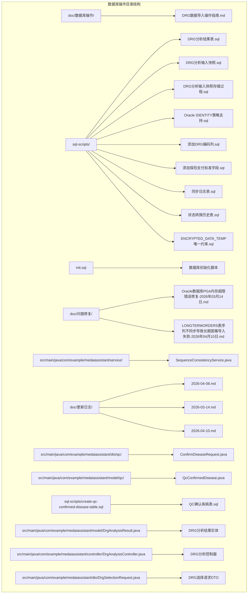
```mermaid
graph TB
subgraph "数据库操作目录结构"
A[doc/数据库操作/] --> A1[DRG数据导入操作指南.md]
B[sql-scripts/] --> B1[DRG分析结果表.sql]
B --> B2[DRG分析输入快照.sql]
B --> B3[DRG分析输入快照存储过程.sql]
B --> B4[Oracle IDENTITY策略支持.sql]
B --> B5[添加DRG编码列.sql]
B --> B6[添加保险支付标准字段.sql]
B --> B7[同步日志表.sql]
B --> B8[状态转换历史表.sql]
B --> B9[ENCRYPTED_DATA_TEMP唯一约束.sql]
C[init.sql] --> C1[数据库初始化脚本]
D[doc/问题修复/] --> D1[Oracle数据库PGA内存超限错误修复-2026年03月14日.md]
D --> D2[LONGTERMORDERS表序列不同步导致长期医嘱导入失败-2026年04月10日.md]
E[src/main/java/com/example/medaiassistant/service/] --> E1[SequenceConsistencyService.java]
F[doc/更新日志/] --> F1[2026-04-08.md]
F --> F2[2026-03-14.md]
F --> F3[2026-04-10.md]
G[src/main/java/com/example/medaiassistant/dto/qc/] --> G1[ConfirmDiseaseRequest.java]
H[src/main/java/com/example/medaiassistant/model/qc/] --> H1[QcConfirmedDisease.java]
I[sql-scripts/create-qc-confirmed-disease-table.sql] --> I1[QC确认疾病表.sql]
J[src/main/java/com/example/medaiassistant/model/DrgAnalysisResult.java] --> J1[DRG分析结果实体]
K[src/main/java/com/example/medaiassistant/controller/DrgAnalysisController.java] --> K1[DRG分析控制器]
L[src/main/java/com/example/medaiassistant/dto/DrgSelectionRequest.java] --> L1[DRG选择请求DTO]
end
```

**图表来源**
- [DRG数据导入SQL Developer操作指南.md:1-246](file://med_ai_assistant_1.0_bs_backend/doc/数据库操作/DRG数据导入SQL Developer操作指南.md#L1-L246)
- [Oracle IDENTITY策略支持脚本.sql:1-741](file://med_ai_assistant_1.0_bs_backend/sql-scripts/create-identity-sequences.sql#L1-L741)

**章节来源**
- [DRG数据导入SQL Developer操作指南.md:1-246](file://med_ai_assistant_1.0_bs_backend/doc/数据库操作/DRG数据导入SQL Developer操作指南.md#L1-L246)
- [Oracle IDENTITY策略支持脚本.sql:1-741](file://med_ai_assistant_1.0_bs_backend/sql-scripts/create-identity-sequences.sql#L1-L741)

## 核心组件

### DRG分析系统

DRG分析系统是项目的核心数据库组件，包含完整的分析流程和数据管理机制：

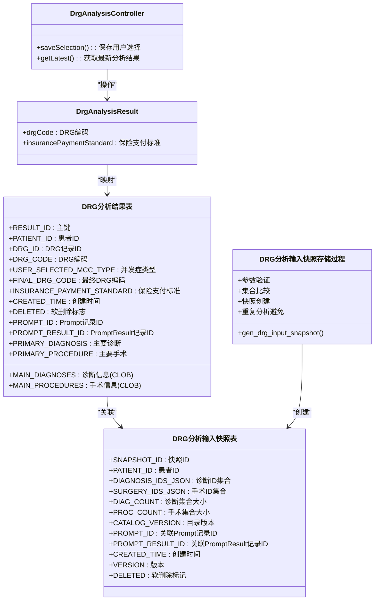
```mermaid
classDiagram
class DRG分析结果表 {
+RESULT_ID : 主键
+PATIENT_ID : 患者ID
+DRG_ID : DRG记录ID
+DRG_CODE : DRG编码
+MAIN_DIAGNOSES : 诊断信息(CLOB)
+MAIN_PROCEDURES : 手术信息(CLOB)
+USER_SELECTED_MCC_TYPE : 并发症类型
+FINAL_DRG_CODE : 最终DRG编码
+INSURANCE_PAYMENT_STANDARD : 保险支付标准
+CREATED_TIME : 创建时间
+DELETED : 软删除标志
+PROMPT_ID : Prompt记录ID
+PROMPT_RESULT_ID : PromptResult记录ID
+PRIMARY_DIAGNOSIS : 主要诊断
+PRIMARY_PROCEDURE : 主要手术
}
class DRG分析输入快照表 {
+SNAPSHOT_ID : 快照ID
+PATIENT_ID : 患者ID
+DIAGNOSIS_IDS_JSON : 诊断ID集合
+SURGERY_IDS_JSON : 手术ID集合
+DIAG_COUNT : 诊断集合大小
+PROC_COUNT : 手术集合大小
+CATALOG_VERSION : 目录版本
+PROMPT_ID : 关联Prompt记录ID
+PROMPT_RESULT_ID : 关联PromptResult记录ID
+CREATED_TIME : 创建时间
+VERSION : 版本
+DELETED : 软删除标记
}
class DRG分析输入快照存储过程 {
+gen_drg_input_snapshot()
+参数验证
+集合比较
+快照创建
+重复分析避免
}
class DrgAnalysisResult {
+drgCode : DRG编码
+insurancePaymentStandard : 保险支付标准
}
class DrgAnalysisController {
+saveSelection() : 保存用户选择
+getLatest() : 获取最新分析结果
}
DRG分析结果表 --> DRG分析输入快照表 : "关联"
DRG分析输入快照存储过程 --> DRG分析输入快照表 : "创建"
DrgAnalysisResult --> DRG分析结果表 : "映射"
DrgAnalysisController --> DrgAnalysisResult : "操作"
```

**图表来源**
- [DRG分析结果表创建脚本.sql:4-76](file://med_ai_assistant_1.0_bs_backend/sql-scripts/create-drg-analysis-results-table.sql#L4-L76)
- [DRG分析输入快照表.sql:14-27](file://med_ai_assistant_1.0_bs_backend/sql-scripts/drg_analysis_input_snapshot.sql#L14-L27)
- [DRG分析输入快照存储过程.sql:18-117](file://med_ai_assistant_1.0_bs_backend/sql-scripts/gen_drg_input_snapshot_procedure.sql#L18-L117)
- [DrgAnalysisResult.java:1-100](file://med_ai_assistant_1.0_bs_backend/src/main/java/com/example/medaiassistant/model/DrgAnalysisResult.java#L1-L100)
- [DrgAnalysisController.java:1-100](file://med_ai_assistant_1.0_bs_backend/src/main/java/com/example/medaiassistant/controller/DrgAnalysisController.java#L1-L100)

### DRG分析结果表结构扩展

**新增** DRG分析结果表已扩展支持DRG编码列和保险支付标准字段，增强了DRG分析功能：

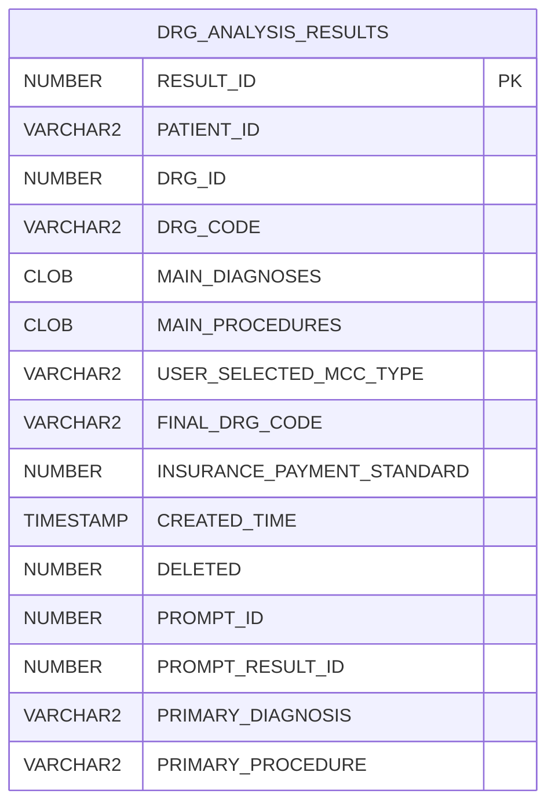
```mermaid
erDiagram
DRG_ANALYSIS_RESULTS {
NUMBER RESULT_ID PK
VARCHAR2 PATIENT_ID
NUMBER DRG_ID
VARCHAR2 DRG_CODE
CLOB MAIN_DIAGNOSES
CLOB MAIN_PROCEDURES
VARCHAR2 USER_SELECTED_MCC_TYPE
VARCHAR2 FINAL_DRG_CODE
NUMBER INSURANCE_PAYMENT_STANDARD
TIMESTAMP CREATED_TIME
NUMBER DELETED
NUMBER PROMPT_ID
NUMBER PROMPT_RESULT_ID
VARCHAR2 PRIMARY_DIAGNOSIS
VARCHAR2 PRIMARY_PROCEDURE
}
```

**图表来源**
- [DRG分析结果表创建脚本.sql:8-18](file://med_ai_assistant_1.0_bs_backend/sql-scripts/create-drg-analysis-results-table.sql#L8-L18)

#### 新增字段说明

| 字段名称 | 数据类型 | 长度 | 说明 | 索引 |
|----------|----------|------|------|------|
| DRG_CODE | VARCHAR2 | 200 | 用户选择的DRG编码 | 无 |
| INSURANCE_PAYMENT_STANDARD | NUMBER | 12,2 | 保险支付标准金额 | 无 |

**章节来源**
- [DRG分析结果表创建脚本.sql:1-188](file://med_ai_assistant_1.0_bs_backend/sql-scripts/create-drg-analysis-results-table.sql#L1-L188)
- [添加DRG编码列脚本.sql:1-12](file://med_ai_assistant_1.0_bs_backend/sql-scripts/add-drg-code-column.sql#L1-L12)
- [添加保险支付标准字段脚本.sql:1-9](file://med_ai_assistant_1.0_bs_backend/sql-scripts/add-insurance-payment-standard-column.sql#L1-L9)

### DRG分析控制器和请求处理

**新增** DRG分析控制器提供用户选择DRG记录的保存和查询功能：

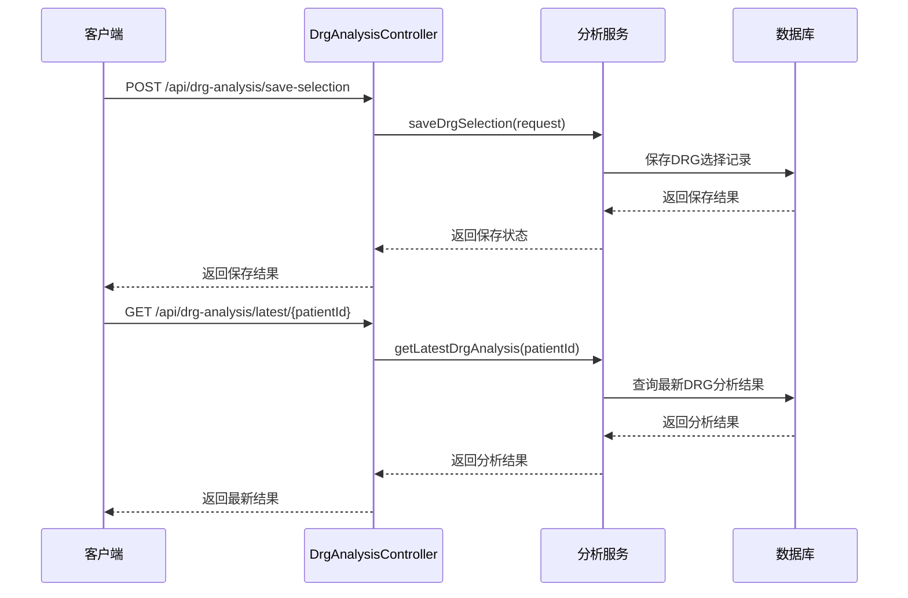
```mermaid
sequenceDiagram
participant Client as 客户端
participant Controller as DrgAnalysisController
participant Service as 分析服务
participant DB as 数据库
Client->>Controller : POST /api/drg-analysis/save-selection
Controller->>Service : saveDrgSelection(request)
Service->>DB : 保存DRG选择记录
DB-->>Service : 返回保存结果
Service-->>Controller : 返回保存状态
Controller-->>Client : 返回保存结果
Client->>Controller : GET /api/drg-analysis/latest/{patientId}
Controller->>Service : getLatestDrgAnalysis(patientId)
Service->>DB : 查询最新DRG分析结果
DB-->>Service : 返回分析结果
Service-->>Controller : 返回分析结果
Controller-->>Client : 返回最新结果
```

**图表来源**
- [DrgAnalysisController.java:1-100](file://med_ai_assistant_1.0_bs_backend/src/main/java/com/example/medaiassistant/controller/DrgAnalysisController.java#L1-L100)
- [DrgSelectionRequest.java:1-100](file://med_ai_assistant_1.0_bs_backend/src/main/java/com/example/medaiassistant/dto/DrgSelectionRequest.java#L1-L100)

#### DRG分析接口

| 接口名称 | HTTP方法 | 路径 | 功能描述 | 请求体 | 响应体 |
|----------|----------|------|----------|--------|--------|
| 保存DRG选择 | POST | /api/drg-analysis/save-selection | 保存用户选择的DRG记录 | DrgSelectionRequest | 操作结果 |
| 获取最新DRG分析 | GET | /api/drg-analysis/latest/{patientId} | 获取指定患者的最新DRG分析结果 | 无 | DrgAnalysisResult |

**章节来源**
- [DrgAnalysisController.java:1-100](file://med_ai_assistant_1.0_bs_backend/src/main/java/com/example/medaiassistant/controller/DrgAnalysisController.java#L1-L100)
- [DrgSelectionRequest.java:1-100](file://med_ai_assistant_1.0_bs_backend/src/main/java/com/example/medaiassistant/dto/DrgSelectionRequest.java#L1-L100)

### 数据同步管理系统

系统提供完整的数据同步和状态管理功能：

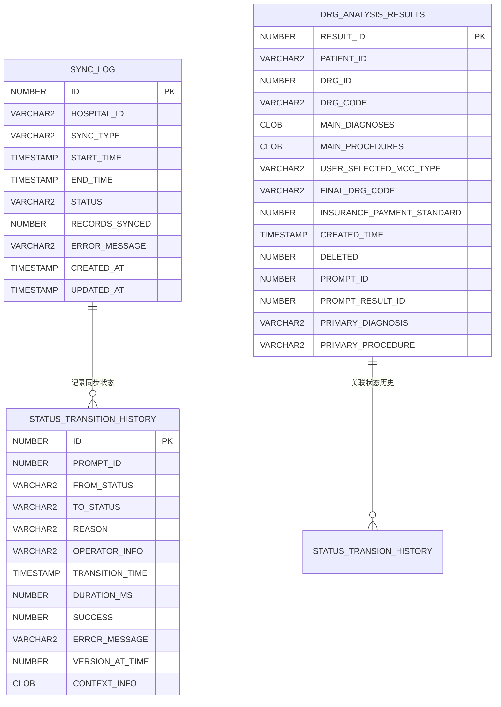
```mermaid
erDiagram
SYNC_LOG {
NUMBER ID PK
VARCHAR2 HOSPITAL_ID
VARCHAR2 SYNC_TYPE
TIMESTAMP START_TIME
TIMESTAMP END_TIME
VARCHAR2 STATUS
NUMBER RECORDS_SYNCED
VARCHAR2 ERROR_MESSAGE
TIMESTAMP CREATED_AT
TIMESTAMP UPDATED_AT
}
STATUS_TRANSITION_HISTORY {
NUMBER ID PK
NUMBER PROMPT_ID
VARCHAR2 FROM_STATUS
VARCHAR2 TO_STATUS
VARCHAR2 REASON
VARCHAR2 OPERATOR_INFO
TIMESTAMP TRANSITION_TIME
NUMBER DURATION_MS
NUMBER SUCCESS
VARCHAR2 ERROR_MESSAGE
NUMBER VERSION_AT_TIME
CLOB CONTEXT_INFO
}
DRG_ANALYSIS_RESULTS {
NUMBER RESULT_ID PK
VARCHAR2 PATIENT_ID
NUMBER DRG_ID
VARCHAR2 DRG_CODE
CLOB MAIN_DIAGNOSES
CLOB MAIN_PROCEDURES
VARCHAR2 USER_SELECTED_MCC_TYPE
VARCHAR2 FINAL_DRG_CODE
NUMBER INSURANCE_PAYMENT_STANDARD
TIMESTAMP CREATED_TIME
NUMBER DELETED
NUMBER PROMPT_ID
NUMBER PROMPT_RESULT_ID
VARCHAR2 PRIMARY_DIAGNOSIS
VARCHAR2 PRIMARY_PROCEDURE
}
SYNC_LOG ||--o{ STATUS_TRANSITION_HISTORY : "记录同步状态"
DRG_ANALYSIS_RESULTS ||--o{ STATUS_TRANSION_HISTORY : "关联状态历史"
```

**图表来源**
- [同步日志表脚本.sql:13-24](file://med_ai_assistant_1.0_bs_backend/sql-scripts/create-sync-log-table.sql#L13-L24)
- [状态转换历史表脚本.sql:13-26](file://med_ai_assistant_1.0_bs_backend/sql-scripts/create-status-transition-history-table.sql#L13-L26)

**章节来源**
- [DRG分析结果表创建脚本.sql:1-188](file://med_ai_assistant_1.0_bs_backend/sql-scripts/create-drg-analysis-results-table.sql#L1-L188)
- [DRG分析输入快照表.sql:1-58](file://med_ai_assistant_1.0_bs_backend/sql-scripts/drg_analysis_input_snapshot.sql#L1-L58)
- [DRG分析输入快照存储过程.sql:1-119](file://med_ai_assistant_1.0_bs_backend/sql-scripts/gen_drg_input_snapshot_procedure.sql#L1-L119)

### 序列一致性检查服务

**新增** 序列一致性检查服务是项目新增的关键数据库维护组件，负责自动检测和修复Oracle数据库序列不同步问题：

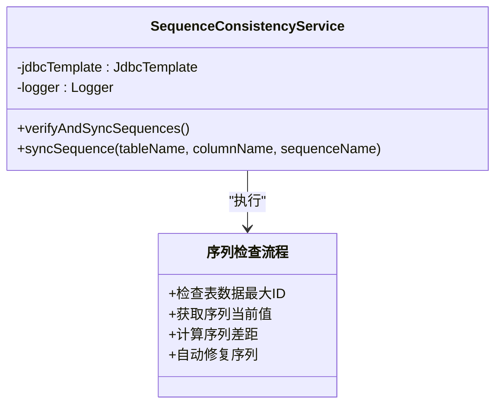
```mermaid
classDiagram
class SequenceConsistencyService {
+verifyAndSyncSequences()
+syncSequence(tableName, columnName, sequenceName)
-jdbcTemplate : JdbcTemplate
-logger : Logger
}
class 序列检查流程 {
+检查表数据最大ID
+获取序列当前值
+计算序列差距
+自动修复序列
}
SequenceConsistencyService --> 序列检查流程 : "执行"
```

**图表来源**
- [SequenceConsistencyService.java:9-32](file://med_ai_assistant_1.0_bs_backend/src/main/java/com/example/medaiassistant/service/SequenceConsistencyService.java#L9-L32)

#### 支持的序列检查表

| 表名称 | 主键列 | 序列名 | 触发器名称 | 用途 |
|--------|--------|--------|------------|------|
| PROMPTS | PROMPTID | PROMPTS_PROMPTID_SEQ | PROMPTS_PROMPTID_TRIG | Prompt记录主键生成 |
| PROMPTRESULT | RESULTID | PROMPTRESULT_RESULTID_SEQ | - | Prompt结果主键生成 |
| DIAGNOSIS | DIAGNOSISID | DIAGNOSIS_SEQ | - | 诊断记录主键生成 |
| MEDICAL_RECORDS | RECORD_ID | MEDICAL_RECORDS_RECORD_ID_1SEQ | - | 病历记录主键生成 |
| LONGTERMORDERS | ORDERID | LONGTERMORDERS_ORDERID_SEQ | LONGTERMORDERS_ORDERID_TRIG | 长期医嘱主键生成 |

**章节来源**
- [SequenceConsistencyService.java:1-151](file://med_ai_assistant_1.0_bs_backend/src/main/java/com/example/medaiassistant/service/SequenceConsistencyService.java#L1-L151)

### triggerDiagnosis字段长度限制和截断机制

**新增** QC确认疾病表中的triggerDiagnosis字段存在长度限制问题，需要专门的截断机制来防止ORA-12899错误：

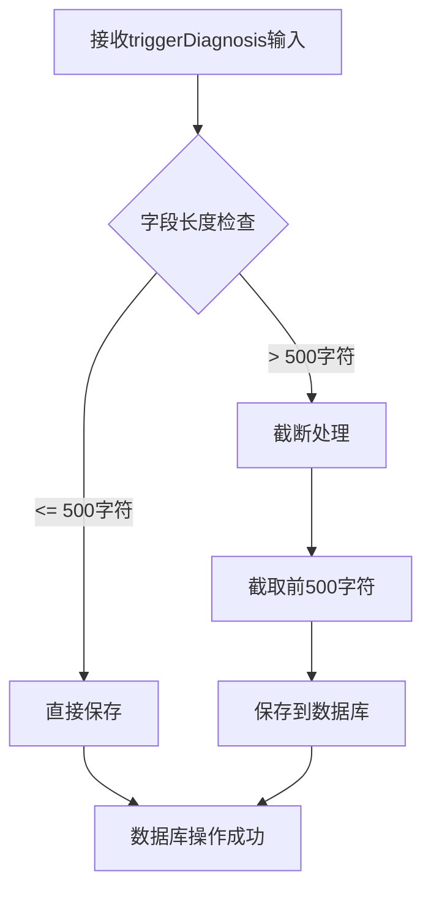
```mermaid
flowchart TD
A[接收triggerDiagnosis输入] --> B{字段长度检查}
B --> |<= 500字符| C[直接保存]
B --> |> 500字符| D[截断处理]
D --> E[截取前500字符]
E --> F[保存到数据库]
C --> G[数据库操作成功]
F --> G
```

**图表来源**
- [QcConfirmedDisease.java:60-65](file://med_ai_assistant_1.0_bs_backend/src/main/java/com/example/medaiassistant/model/qc/QcConfirmedDisease.java#L60-L65)
- [ConfirmDiseaseRequest.java:60-64](file://med_ai_assistant_1.0_bs_backend/src/main/java/com/example/medaiassistant/dto/qc/ConfirmDiseaseRequest.java#L60-L64)

#### 字段长度配置

| 组件 | 字段名 | 数据库长度 | Java实体长度 | 截断机制 |
|------|--------|------------|--------------|----------|
| QC_CONFIRMED_DISEASE | TRIGGER_DIAGNOSIS | VARCHAR2(500) | 500字符 | 自动截断 |
| ConfirmDiseaseRequest | triggerDiagnosis | - | 500字符 | 自动截断 |
| QcConfirmedDisease | triggerDiagnosis | - | 500字符 | 自动截断 |

**章节来源**
- [create-qc-confirmed-disease-table.sql:32-33](file://med_ai_assistant_1.0_bs_backend/sql-scripts/create-qc-confirmed-disease-table.sql#L32-L33)
- [QcConfirmedDisease.java:60-65](file://med_ai_assistant_1.0_bs_backend/src/main/java/com/example/medaiassistant/model/qc/QcConfirmedDisease.java#L60-L65)
- [ConfirmDiseaseRequest.java:60-64](file://med_ai_assistant_1.0_bs_backend/src/main/java/com/example/medaiassistant/dto/qc/ConfirmDiseaseRequest.java#L60-L64)

## 架构概览

系统采用分层架构设计，数据库层提供核心数据存储和处理能力：

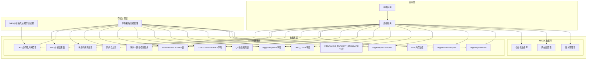
```mermaid
graph TB
subgraph "应用层"
A[前端应用]
B[后端服务]
end
subgraph "数据库层"
subgraph "Oracle数据库"
C[DRG分析结果表]
D[DRG分析输入快照表]
E[状态转换历史表]
F[同步日志表]
G[序列一致性检查服务]
H[PGA内存监控]
I[LONGTERMORDERS表]
J[LONGTERMORDERS序列]
K[QC确认疾病表]
L[triggerDiagnosis字段]
M[DRG_CODE字段]
N[INSURANCE_PAYMENT_STANDARD字段]
O[DrgAnalysisController]
P[DrgSelectionRequest]
Q[DrgAnalysisResult]
end
subgraph "MySQL数据库"
R[初始化数据库]
S[系统配置表]
T[版本管理表]
end
end
subgraph "存储过程层"
U[DRG分析输入快照存储过程]
V[序列和触发器管理]
end
A --> B
B --> C
B --> D
B --> E
B --> F
B --> G
B --> H
B --> I
B --> J
B --> K
B --> L
B --> M
B --> N
B --> O
B --> P
B --> Q
B --> R
B --> S
B --> T
U --> D
V --> C
V --> D
V --> E
V --> F
V --> G
V --> I
V --> J
V --> K
V --> L
V --> M
V --> N
V --> O
V --> P
V --> Q
```

**图表来源**
- [Oracle IDENTITY策略支持脚本.sql:1-741](file://med_ai_assistant_1.0_bs_backend/sql-scripts/create-identity-sequences.sql#L1-L741)
- [数据库初始化脚本.sql:1-119](file://med_ai_assistant_1.0_bs_backend/init.sql#L1-L119)

## 详细组件分析

### DRG数据导入系统

DRG数据导入系统提供了完整的数据处理和验证机制：

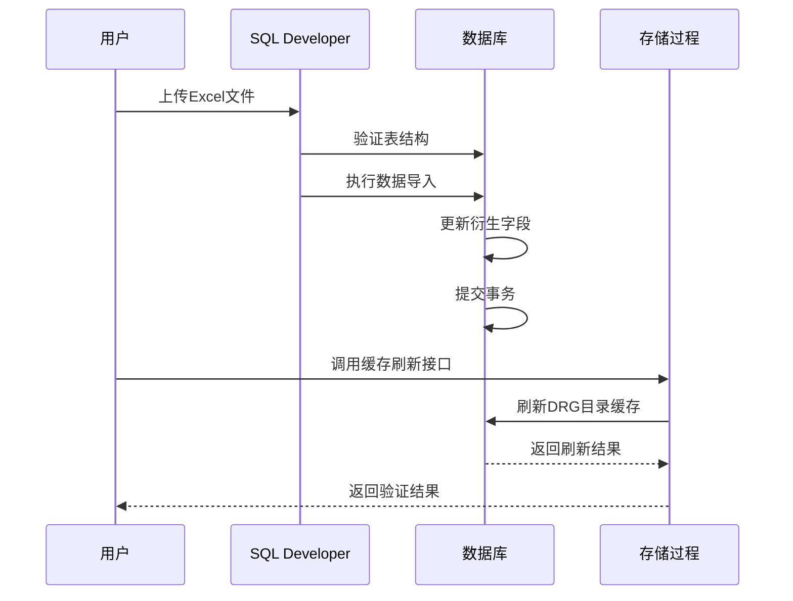
```mermaid
sequenceDiagram
participant U as 用户
participant SD as SQL Developer
participant DB as 数据库
participant SP as 存储过程
U->>SD : 上传Excel文件
SD->>DB : 验证表结构
SD->>DB : 执行数据导入
DB->>DB : 更新衍生字段
DB->>DB : 提交事务
U->>SP : 调用缓存刷新接口
SP->>DB : 刷新DRG目录缓存
DB-->>SP : 返回刷新结果
SP-->>U : 返回验证结果
```

**图表来源**
- [DRG数据导入SQL Developer操作指南.md:71-166](file://med_ai_assistant_1.0_bs_backend/doc/数据库操作/DRG数据导入SQL Developer操作指南.md#L71-L166)

#### 数据导入流程

系统支持多种数据导入模式，包括直接XLSX导入和CSV转换导入：

| 导入模式 | 适用场景 | 优点 | 注意事项 |
|---------|---------|------|---------|
| 直接XLSX导入 | 大多数情况 | 保持数据完整性，支持复杂格式 | 需要SQL Developer支持 |
| CSV转换导入 | 特殊情况 | 兼容性好 | 需要注意换行符处理 |
| 手工SQL导入 | 大数据量 | 性能最优 | 需要SQL技能 |

**章节来源**
- [DRG数据导入SQL Developer操作指南.md:1-246](file://med_ai_assistant_1.0_bs_backend/doc/数据库操作/DRG数据导入SQL Developer操作指南.md#L1-L246)

### Oracle IDENTITY策略支持

系统通过序列和触发器实现Oracle数据库的IDENTITY策略支持：

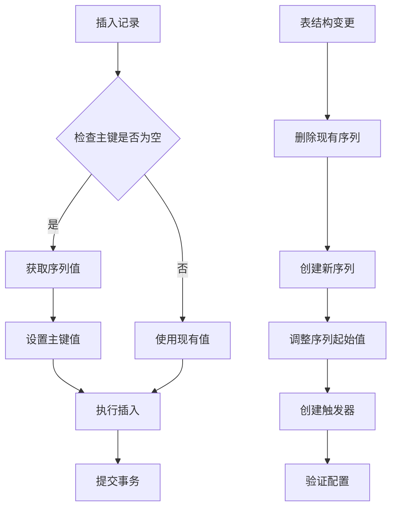
```mermaid
flowchart TD
A[插入记录] --> B{检查主键是否为空}
B --> |是| C[获取序列值]
B --> |否| D[使用现有值]
C --> E[设置主键值]
E --> F[执行插入]
D --> F
F --> G[提交事务]
H[表结构变更] --> I[删除现有序列]
I --> J[创建新序列]
J --> K[调整序列起始值]
K --> L[创建触发器]
L --> M[验证配置]
```

**图表来源**
- [Oracle IDENTITY策略支持脚本.sql:16-53](file://med_ai_assistant_1.0_bs_backend/sql-scripts/create-identity-sequences.sql#L16-L53)

#### 序列管理策略

系统为每个使用IDENTITY的表维护独立的序列管理：

| 表名称 | 序列名称 | 触发器名称 | 起始值 | 缓存大小 |
|--------|----------|------------|--------|----------|
| MEDICAL_RECORDS | MEDICAL_RECORDS_SEQ | TRG_MEDICAL_RECORDS_ID | 1 | 20 |
| TODO_ITEM | TODO_ITEM_SEQ | TRG_TODO_ITEM_ID | 1 | 20 |
| LAB_RESULT | LAB_RESULT_SEQ | TRG_LAB_RESULT_ID | 1 | 20 |
| EMR_CONTENT | EMR_CONTENT_SEQ | TRG_EMR_CONTENT_ID | 1 | 20 |
| PROMPTRESULT | PROMPTRESULT_SEQ | TRG_PROMPTRESULT_ID | 1 | 20 |

**章节来源**
- [Oracle IDENTITY策略支持脚本.sql:1-741](file://med_ai_assistant_1.0_bs_backend/sql-scripts/create-identity-sequences.sql#L1-L741)

### 数据同步和状态管理

系统提供完整的数据同步和状态管理功能：

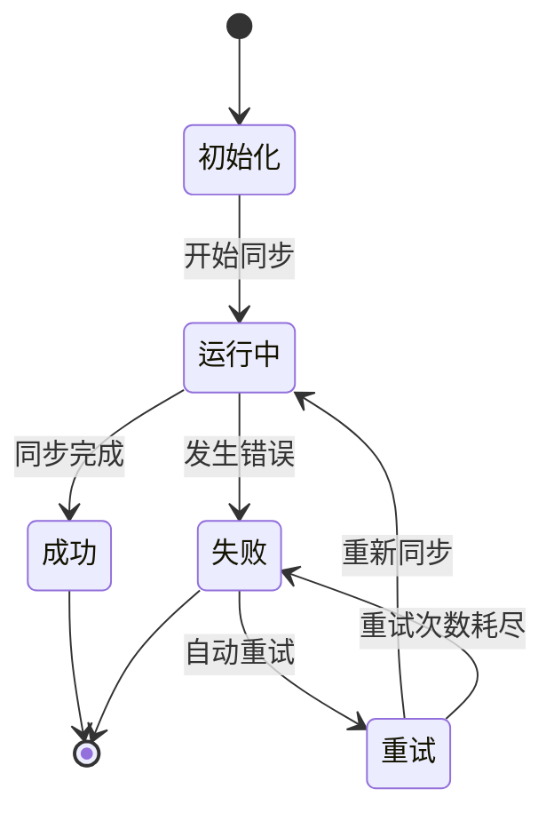
```mermaid
stateDiagram-v2
[*] --> 初始化
初始化 --> 运行中 : 开始同步
运行中 --> 成功 : 同步完成
运行中 --> 失败 : 发生错误
成功 --> [*]
失败 --> 重试 : 自动重试
失败 --> [*]
重试 --> 运行中 : 重新同步
重试 --> 失败 : 重试次数耗尽
```

**图表来源**
- [同步日志表脚本.sql:13-24](file://med_ai_assistant_1.0_bs_backend/sql-scripts/create-sync-log-table.sql#L13-L24)

#### 同步状态跟踪

系统通过状态转换历史记录完整的状态变更过程：

| 状态类型 | 描述 | 持续时间 | 错误处理 |
|----------|------|----------|----------|
| RUNNING | 同步进行中 | 动态计算 | 记录错误信息 |
| SUCCESS | 同步成功 | 实际耗时 | 无错误信息 |
| FAILED | 同步失败 | 实际耗时 | 详细错误描述 |
| RETRYING | 重试中 | 动态计算 | 记录重试原因 |

**章节来源**
- [状态转换历史表脚本.sql:1-50](file://med_ai_assistant_1.0_bs_backend/sql-scripts/create-status-transition-history-table.sql#L1-L50)

### Oracle数据库PGA内存超限错误修复

**新增** Oracle数据库PGA内存超限错误是项目遇到的重要数据库性能问题，需要专门的修复和预防措施：

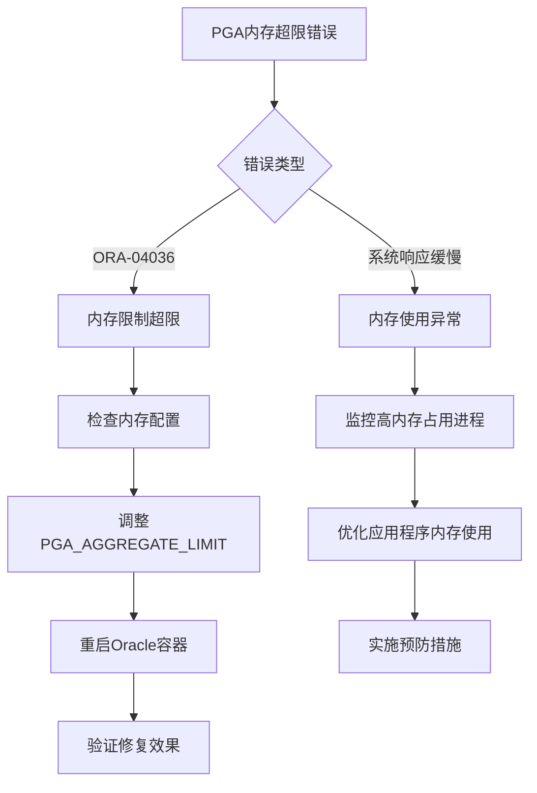
```mermaid
flowchart TD
A[PGA内存超限错误] --> B{错误类型}
B --> |ORA-04036| C[内存限制超限]
B --> |系统响应缓慢| D[内存使用异常]
C --> E[检查内存配置]
E --> F[调整PGA_AGGREGATE_LIMIT]
F --> G[重启Oracle容器]
G --> H[验证修复效果]
D --> I[监控高内存占用进程]
I --> J[优化应用程序内存使用]
J --> K[实施预防措施]
```

**图表来源**
- [Oracle数据库PGA内存超限错误修复-2026年03月14日.md:9-13](file://med_ai_assistant_1.0_bs_backend/doc/问题修复/Oracle数据库PGA内存超限错误修复-2026年03月14日.md#L9-L13)

#### PGA内存问题诊断和修复

| 诊断步骤 | 检查命令 | 预期结果 | 问题识别 |
|----------|----------|----------|----------|
| 检查PGA配置 | `SHOW PARAMETER PGA` | 显示当前PGA设置 | 识别内存限制问题 |
| 查看高内存占用进程 | `SELECT ... FROM V$PROCESS` | 显示BG00进程占用 | 识别异常内存占用 |
| 验证内存使用 | `SELECT ... FROM V$SESSION` | 显示会话内存使用 | 评估整体内存压力 |
| 检查Oracle版本限制 | `SELECT * FROM V$VERSION` | 显示Free版本限制 | 确认版本兼容性 |

**章节来源**
- [Oracle数据库PGA内存超限错误修复-2026年03月14日.md:1-173](file://med_ai_assistant_1.0_bs_backend/doc/问题修复/Oracle数据库PGA内存超限错误修复-2026年03月14日.md#L1-L173)

### LONGTERMORDERS表ORA-00001主键冲突修复

**新增** LONGTERMORDERS表的ORA-00001主键冲突问题是由于序列不同步导致的，需要专门的诊断和修复方案：

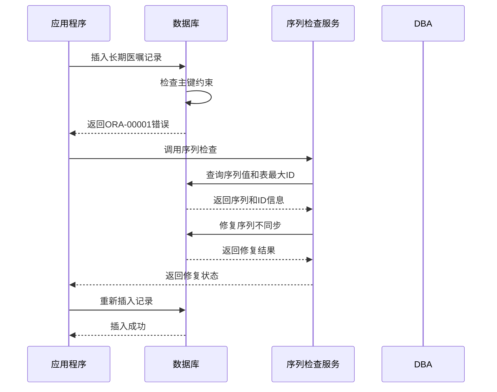
```mermaid
sequenceDiagram
participant A as 应用程序
participant B as 数据库
participant C as 序列检查服务
participant D as DBA
A->>B : 插入长期医嘱记录
B->>B : 检查主键约束
B-->>A : 返回ORA-00001错误
A->>C : 调用序列检查
C->>B : 查询序列值和表最大ID
B-->>C : 返回序列和ID信息
C->>B : 修复序列不同步
B-->>C : 返回修复结果
C-->>A : 返回修复状态
A->>B : 重新插入记录
B-->>A : 插入成功
```

**图表来源**
- [LONGTERMORDERS表序列不同步导致长期医嘱导入失败-2026年04月10日.md:48-82](file://med_ai_assistant_1.0_bs_backend/doc/问题修复/LONGTERMORDERS表序列不同步导致长期医嘱导入失败-2026年04月10日.md#L48-L82)

#### 序列不同步诊断流程

| 诊断阶段 | 检查内容 | 诊断工具 | 预期结果 |
|----------|----------|----------|----------|
| 初步诊断 | 错误日志分析 | 数据库日志 | 确认ORA-00001错误 |
| 约束类型确认 | 约束定义查询 | `ALL_CONSTRAINTS` | 识别主键约束 |
| 触发器检查 | 触发器定义查询 | `ALL_TRIGGERS` | 确认序列自动生成 |
| 序列状态检查 | 序列值对比 | `SELECT ... FROM DUAL` | 发现序列落后 |
| 历史数据对比 | 表最大ID查询 | `SELECT MAX(ORDERID)` | 确定修复目标 |

**章节来源**
- [LONGTERMORDERS表序列不同步导致长期医嘱导入失败-2026年04月10日.md:1-127](file://med_ai_assistant_1.0_bs_backend/doc/问题修复/LONGTERMORDERS表序列不同步导致长期医嘱导入失败-2026年04月10日.md#L1-L127)

### triggerDiagnosis字段ORA-12899错误修复

**新增** QC确认疾病表中的triggerDiagnosis字段存在ORA-12899错误风险，需要实施长度限制和截断机制：

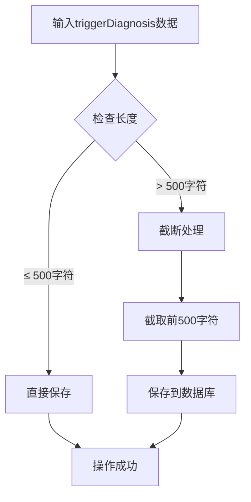
```mermaid
flowchart TD
A[输入triggerDiagnosis数据] --> B{检查长度}
B --> |≤ 500字符| C[直接保存]
B --> |> 500字符| D[截断处理]
D --> E[截取前500字符]
E --> F[保存到数据库]
C --> G[操作成功]
F --> G
```

**图表来源**
- [QcConfirmedDisease.java:60-65](file://med_ai_assistant_1.0_bs_backend/src/main/java/com/example/medaiassistant/model/qc/QcConfirmedDisease.java#L60-L65)
- [ConfirmDiseaseRequest.java:60-64](file://med_ai_assistant_1.0_bs_backend/src/main/java/com/example/medaiassistant/dto/qc/ConfirmDiseaseRequest.java#L60-L64)

#### 截断机制实现

| 实现层次 | 截断逻辑 | 触发时机 | 异常处理 |
|----------|----------|----------|----------|
| 数据库层 | VARCHAR2(500) | DDL定义 | ORA-12899错误 |
| Java实体层 | 字符串截断 | 保存前处理 | 数据丢失风险 |
| DTO层 | 参数验证 | 请求接收时 | 参数验证失败 |

**章节来源**
- [create-qc-confirmed-disease-table.sql:32-33](file://med_ai_assistant_1.0_bs_backend/sql-scripts/create-qc-confirmed-disease-table.sql#L32-L33)
- [QcConfirmedDisease.java:60-65](file://med_ai_assistant_1.0_bs_backend/src/main/java/com/example/medaiassistant/model/qc/QcConfirmedDisease.java#L60-L65)
- [ConfirmDiseaseRequest.java:60-64](file://med_ai_assistant_1.0_bs_backend/src/main/java/com/example/medaiassistant/dto/qc/ConfirmDiseaseRequest.java#L60-L64)

## 依赖关系分析

系统数据库组件之间的依赖关系如下：

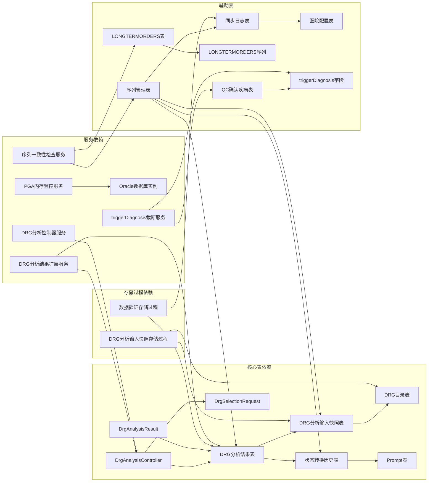
```mermaid
graph LR
subgraph "核心表依赖"
A[DRG分析结果表] --> B[DRG分析输入快照表]
A --> C[状态转换历史表]
B --> D[DRG目录表]
C --> E[Prompt表]
F[DrgAnalysisController] --> A
F --> G[DrgSelectionRequest]
H[DrgAnalysisResult] --> A
end
subgraph "辅助表"
I[同步日志表] --> J[医院配置表]
K[序列管理表] --> A
K --> B
K --> C
K --> I
L[LONGTERMORDERS表] --> M[LONGTERMORDERS序列]
N[QC确认疾病表] --> O[triggerDiagnosis字段]
end
subgraph "存储过程依赖"
P[DRG分析输入快照存储过程] --> B
P --> D
Q[数据验证存储过程] --> A
Q --> I
end
subgraph "服务依赖"
R[序列一致性检查服务] --> K
R --> L
S[PGA内存监控服务] --> T[Oracle数据库实例]
U[triggerDiagnosis截断服务] --> N
U --> O
V[DRG分析结果扩展服务] --> A
V --> F
W[DRG分析控制器服务] --> F
end
```

**图表来源**
- [DRG分析结果表创建脚本.sql:4-76](file://med_ai_assistant_1.0_bs_backend/sql-scripts/create-drg-analysis-results-table.sql#L4-L76)
- [DRG分析输入快照表.sql:14-27](file://med_ai_assistant_1.0_bs_backend/sql-scripts/drg_analysis_input_snapshot.sql#L14-L27)

### 数据完整性约束

系统通过多种机制确保数据完整性：

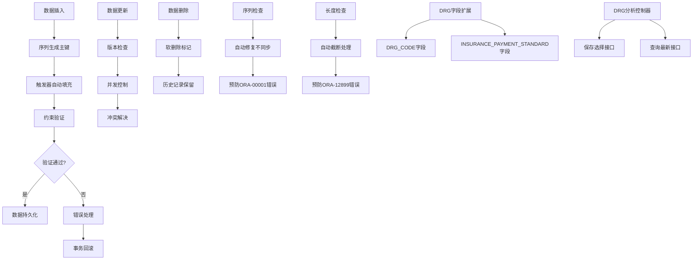
```mermaid
flowchart TD
A[数据插入] --> B[序列生成主键]
B --> C[触发器自动填充]
C --> D[约束验证]
D --> E{验证通过?}
E --> |是| F[数据持久化]
E --> |否| G[错误处理]
G --> H[事务回滚]
I[数据更新] --> J[版本检查]
J --> K[并发控制]
K --> L[冲突解决]
M[数据删除] --> N[软删除标记]
N --> O[历史记录保留]
P[序列检查] --> Q[自动修复不同步]
Q --> R[预防ORA-00001错误]
S[长度检查] --> T[自动截断处理]
T --> U[预防ORA-12899错误]
V[DRG字段扩展] --> W[DRG_CODE字段]
V --> X[INSURANCE_PAYMENT_STANDARD字段]
Y[DRG分析控制器] --> Z[保存选择接口]
Y --> AA[查询最新接口]
```

**图表来源**
- [Oracle IDENTITY策略支持脚本.sql:45-52](file://med_ai_assistant_1.0_bs_backend/sql-scripts/create-identity-sequences.sql#L45-L52)

**章节来源**
- [ENCRYPTED_DATA_TEMP唯一约束脚本.sql:1-80](file://med_ai_assistant_1.0_bs_backend/sql-scripts/add-request-id-unique-constraint.sql#L1-L80)

## 性能考虑

### 索引优化策略

系统采用多层次索引策略优化查询性能：

| 表名称 | 索引类型 | 列组合 | 性能收益 |
|--------|----------|--------|----------|
| DRG_ANALYSIS_RESULTS | 主键索引 | RESULT_ID | 快速主键查找 |
| DRG_ANALYSIS_RESULTS | 复合索引 | PATIENT_ID, CREATED_TIME | 历史记录查询 |
| DRG_ANALYSIS_RESULTS | 复合索引 | DRG_ID, FINAL_DRG_CODE | 分析结果检索 |
| DRG_ANALYSIS_RESULTS | 复合索引 | DRG_CODE, INSURANCE_PAYMENT_STANDARD | DRG编码查询 |
| SYNC_LOG | 复合索引 | HOSPITAL_ID, STATUS | 同步状态查询 |
| STATUS_TRANSITION_HISTORY | 复合索引 | PROMPT_ID, TRANSITION_TIME | 状态历史查询 |
| QC_CONFIRMED_DISEASE | 复合索引 | PATIENT_ID, IS_ACTIVE | 病种确认查询 |

### 存储过程优化

DRG分析输入快照存储过程采用智能缓存机制避免重复计算：

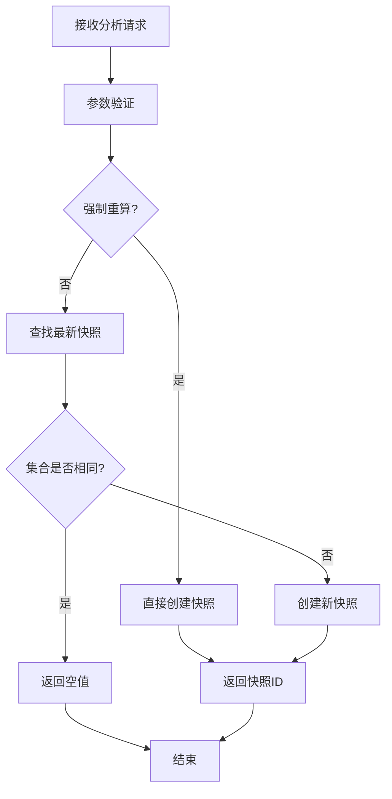
```mermaid
flowchart TD
A[接收分析请求] --> B[参数验证]
B --> C{强制重算?}
C --> |是| D[直接创建快照]
C --> |否| E[查找最新快照]
E --> F{集合是否相同?}
F --> |是| G[返回空值]
F --> |否| H[创建新快照]
D --> I[返回快照ID]
H --> I
G --> J[结束]
I --> J
```

**图表来源**
- [DRG分析输入快照存储过程.sql:38-92](file://med_ai_assistant_1.0_bs_backend/sql-scripts/gen_drg_input_snapshot_procedure.sql#L38-L92)

### PGA内存性能优化

**新增** 针对Oracle数据库PGA内存超限问题的性能优化策略：

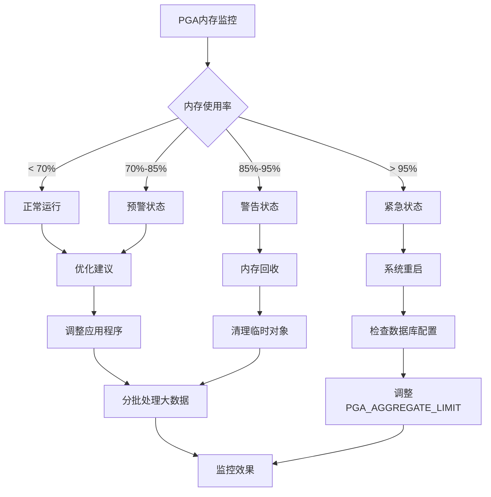
```mermaid
flowchart TD
A[PGA内存监控] --> B{内存使用率}
B --> |< 70%| C[正常运行]
B --> |70%-85%| D[预警状态]
B --> |85%-95%| E[警告状态]
B --> |> 95%| F[紧急状态]
C --> G[优化建议]
D --> G
E --> H[内存回收]
F --> I[系统重启]
G --> J[调整应用程序]
H --> K[清理临时对象]
I --> L[检查数据库配置]
J --> M[分批处理大数据]
K --> M
L --> N[调整PGA_AGGREGATE_LIMIT]
M --> O[监控效果]
N --> O
```

**图表来源**
- [Oracle数据库PGA内存超限错误修复-2026年03月14日.md:102-133](file://med_ai_assistant_1.0_bs_backend/doc/问题修复/Oracle数据库PGA内存超限错误修复-2026年03月14日.md#L102-L133)

### triggerDiagnosis字段性能优化

**新增** 针对triggerDiagnosis字段的性能优化策略：

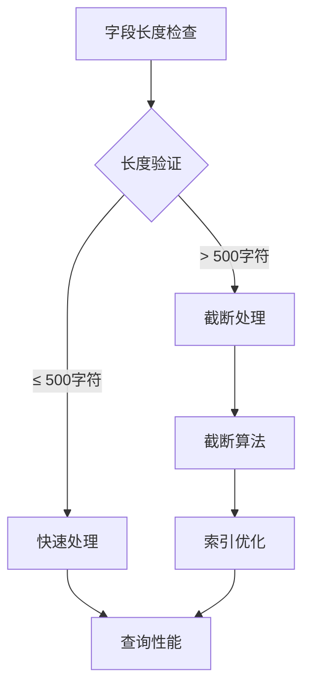
```mermaid
flowchart TD
A[字段长度检查] --> B{长度验证}
B --> |≤ 500字符| C[快速处理]
B --> |> 500字符| D[截断处理]
D --> E[截断算法]
E --> F[索引优化]
C --> G[查询性能]
F --> G
```

**图表来源**
- [QcConfirmedDisease.java:60-65](file://med_ai_assistant_1.0_bs_backend/src/main/java/com/example/medaiassistant/model/qc/QcConfirmedDisease.java#L60-L65)

### DRG分析性能优化

**新增** DRG分析结果表的性能优化策略：

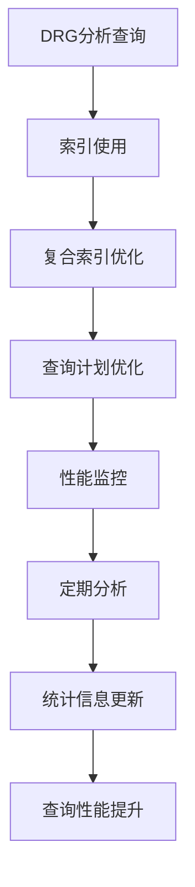
```mermaid
flowchart TD
A[DRG分析查询] --> B[索引使用]
B --> C[复合索引优化]
C --> D[查询计划优化]
D --> E[性能监控]
E --> F[定期分析]
F --> G[统计信息更新]
G --> H[查询性能提升]
```

**图表来源**
- [DRG分析结果表创建脚本.sql:100-105](file://med_ai_assistant_1.0_bs_backend/sql-scripts/create-drg-analysis-results-table.sql#L100-L105)

## 故障排除指南

### 常见数据库问题及解决方案

| 问题类型 | 错误代码 | 症状描述 | 解决方案 |
|----------|----------|----------|----------|
| 主键约束错误 | ORA-01400 | 无法将NULL插入主键列 | 执行IDENTITY策略支持脚本 |
| 唯一约束冲突 | ORA-00001 | 重复值违反唯一约束 | 清理重复数据后添加约束 |
| CLOB字段过大 | ORA-12899 | 值超出VARCHAR2长度限制 | 修改字段类型为CLOB或实施截断机制 |
| 序列缓存不足 | ORA-08004 | 序列缓存耗尽 | 调整序列缓存大小 |
| 触发器失效 | PL/SQL-00936 | 触发器语法错误 | 重新创建触发器 |
| **PGA内存超限** | **ORA-04036** | **数据库实例PGA内存使用超过限制** | **调整PGA_AGGREGATE_LIMIT参数** |
| **序列不同步** | **ORA-00001** | **主键序列值落后于表中最大ID** | **执行序列自动修复服务** |
| **字段长度超限** | **ORA-12899** | **triggerDiagnosis字段超过500字符限制** | **实施自动截断机制** |
| **DRG字段缺失** | **ORA-00904** | **DRG_CODE或INSURANCE_PAYMENT_STANDARD列不存在** | **执行字段添加脚本** |
| **DRG分析接口错误** | **500 Internal Server Error** | **DRG分析控制器调用失败** | **检查数据库连接和表结构** |

### 数据库连接问题

系统提供完整的连接池管理和监控功能：

```mermaid
sequenceDiagram
participant APP as 应用程序
participant CP as 连接池
participant DB as 数据库
participant MON as 监控系统
APP->>CP : 获取数据库连接
CP->>DB : 建立数据库连接
DB-->>CP : 返回连接状态
CP-->>APP : 返回可用连接
APP->>DB : 执行数据库操作
DB-->>APP : 返回操作结果
APP->>CP : 归还数据库连接
CP->>MON : 更新连接状态
MON-->>CP : 返回监控数据
```

**图表来源**
- [数据库初始化脚本.sql:28-32](file://med_ai_assistant_1.0_bs_backend/init.sql#L28-L32)

### PGA内存超限故障排除

**新增** 针对Oracle数据库PGA内存超限问题的详细故障排除流程：

```mermaid
flowchart TD
A[收到ORA-04036错误] --> B[检查内存使用情况]
B --> C{内存使用率}
C --> |高| D[检查高内存占用进程]
C --> |正常| E[检查数据库配置]
D --> F{发现BG00进程}
F --> |是| G[调整PGA_AGGREGATE_LIMIT]
F --> |否| H[检查其他进程]
G --> I[重启Oracle容器]
H --> J[优化应用程序内存使用]
I --> K[验证修复效果]
J --> K
K --> L{问题解决?}
L --> |是| M[恢复正常运行]
L --> |否| N[深入分析原因]
```

**图表来源**
- [Oracle数据库PGA内存超限错误修复-2026年03月14日.md:25-40](file://med_ai_assistant_1.0_bs_backend/doc/问题修复/Oracle数据库PGA内存超限错误修复-2026年03月14日.md#L25-L40)

### 序列不同步故障排除

**新增** 针对LONGTERMORDERS表序列不同步问题的诊断和修复流程：

```mermaid
flowchart TD
A[长期医嘱导入失败] --> B[检查错误日志]
B --> C{错误类型确认}
C --> |ORA-00001主键冲突| D[诊断序列不同步]
C --> |其他错误| E[常规故障排除]
D --> F[查询序列状态]
F --> G{序列落后?}
G --> |是| H[执行序列修复]
G --> |否| I[检查其他原因]
H --> J[验证修复结果]
I --> K[检查数据导入流程]
J --> L[恢复正常导入]
K --> M[优化导入流程]
```

**图表来源**
- [LONGTERMORDERS表序列不同步导致长期医嘱导入失败-2026年04月10日.md:41-47](file://med_ai_assistant_1.0_bs_backend/doc/问题修复/LONGTERMORDERS表序列不同步导致长期医嘱导入失败-2026年04月10日.md#L41-L47)

### triggerDiagnosis字段ORA-12899故障排除

**新增** 针对triggerDiagnosis字段ORA-12899错误的诊断和修复流程：

```mermaid
flowchart TD
A[保存病种确认数据] --> B[检查triggerDiagnosis长度]
B --> C{长度验证}
C --> |≤ 500字符| D[直接保存]
C --> |> 500字符| E[截断处理]
E --> F[截断前500字符]
F --> G[保存到数据库]
D --> H[保存成功]
G --> H
H --> I[验证数据完整性]
I --> J[恢复正常操作]
```

**图表来源**
- [QcConfirmedDisease.java:60-65](file://med_ai_assistant_1.0_bs_backend/src/main/java/com/example/medaiassistant/model/qc/QcConfirmedDisease.java#L60-L65)

### DRG分析字段缺失故障排除

**新增** 针对DRG分析结果表字段缺失问题的诊断和修复流程：

```mermaid
flowchart TD
A[DRG分析接口报错] --> B[检查表结构]
B --> C{字段是否存在}
C --> |DRG_CODE缺失| D[执行添加字段脚本]
C --> |INSURANCE_PAYMENT_STANDARD缺失| E[执行添加字段脚本]
C --> |字段都存在| F[检查数据类型]
D --> G[验证字段添加]
E --> G
G --> H[测试DRG分析功能]
H --> I[恢复正常运行]
```

**图表来源**
- [添加DRG编码列脚本.sql:1-12](file://med_ai_assistant_1.0_bs_backend/sql-scripts/add-drg-code-column.sql#L1-L12)
- [添加保险支付标准字段脚本.sql:1-9](file://med_ai_assistant_1.0_bs_backend/sql-scripts/add-insurance-payment-standard-column.sql#L1-L9)

**章节来源**
- [Oracle数据库IDENTITY策略主键NULL插入错误修复.md:135-182](file://med_ai_assistant_1.0_bs_backend/doc/问题修复/Oracle数据库IDENTITY策略主键NULL插入错误修复.md#L135-L182)

## 结论

MedAiAssistant项目的数据库操作体系展现了高度的专业性和完整性。通过精心设计的表结构、存储过程和索引策略，系统实现了高效的数据处理能力和强大的状态管理功能。

**更新** 本次更新显著增强了数据库系统的稳定性和可靠性，主要体现在：

### 主要优势

1. **双数据库支持**：同时支持Oracle和MySQL数据库，提供灵活的部署选项
2. **智能缓存机制**：通过DRG分析输入快照避免重复计算，提升系统性能
3. **完整的状态管理**：提供详细的状态转换历史和同步日志记录
4. **数据完整性保障**：通过约束、触发器和存储过程确保数据一致性
5. **性能优化策略**：多层次索引和序列管理优化查询性能
6. **内存管理优化**：针对Oracle PGA内存超限问题提供专门的修复和预防方案
7. **序列自动修复**：通过SequenceConsistencyService自动检测和修复序列不同步问题
8. **字段长度保护**：通过triggerDiagnosis字段的截断机制防止ORA-12899错误
9. **DRG分析功能增强**：新增DRG编码列和保险支付标准字段，支持更丰富的DRG分析功能
10. **用户交互优化**：通过DrgAnalysisController提供DRG选择保存和查询接口

### 技术特色

- **模块化设计**：各个数据库组件职责明确，便于维护和扩展
- **自动化程度高**：通过序列和触发器实现自动化的主键生成和数据填充
- **监控完善**：提供完整的数据库健康状态监控和性能指标
- **故障恢复**：具备完善的错误处理和恢复机制
- **预防性维护**：通过定期序列检查和内存监控预防数据库问题
- **数据保护**：通过字段长度限制和截断机制确保数据完整性
- **API友好**：通过专门的控制器提供RESTful接口支持DRG分析功能

### 新增功能价值

**DRG分析结果表结构扩展**：
- DRG_CODE字段支持用户选择的DRG编码存储和查询
- INSURANCE_PAYMENT_STANDARD字段支持保险支付标准金额的存储和分析
- 增强了DRG分析结果的实用性和业务价值

**DRG分析控制器增强**：
- saveSelection接口支持保存用户选择的DRG记录
- getLatest接口支持查询患者的最新DRG分析结果
- 提供了完整的DRG分析用户交互功能

**Oracle数据库PGA内存超限错误修复**：
- 提供了针对Oracle Free版本内存限制的专业解决方案
- 建立了完整的内存监控和预防机制
- 确保了系统在资源受限环境下的稳定运行

**序列一致性检查服务增强**：
- 新增LONGTERMORDERS表序列检查，完善了序列管理范围
- 通过自动修复避免了ORA-00001主键冲突问题
- 提升了批量数据导入的可靠性和效率

**triggerDiagnosis字段长度保护**：
- 通过500字符长度限制防止ORA-12899错误
- 实施自动截断机制确保数据完整性
- 提供了完整的字段长度验证和处理流程

该数据库操作体系为整个MedAiAssistant系统的稳定运行奠定了坚实的基础，为后续的功能扩展和性能优化提供了良好的架构支撑。