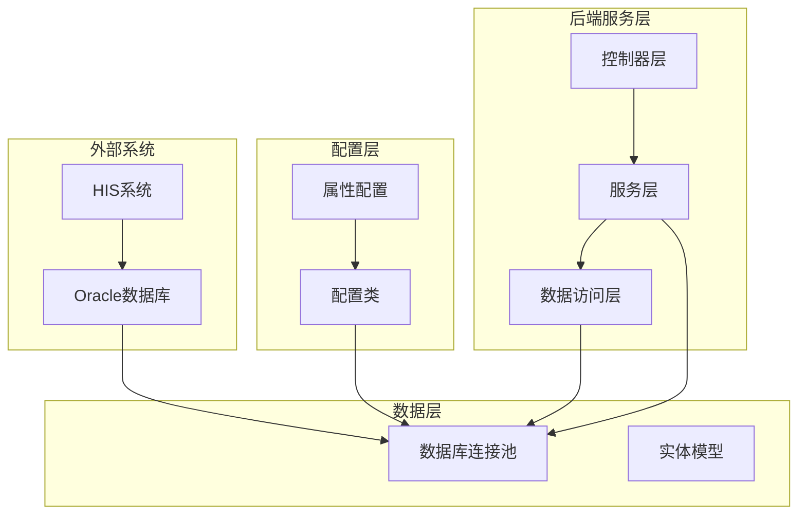
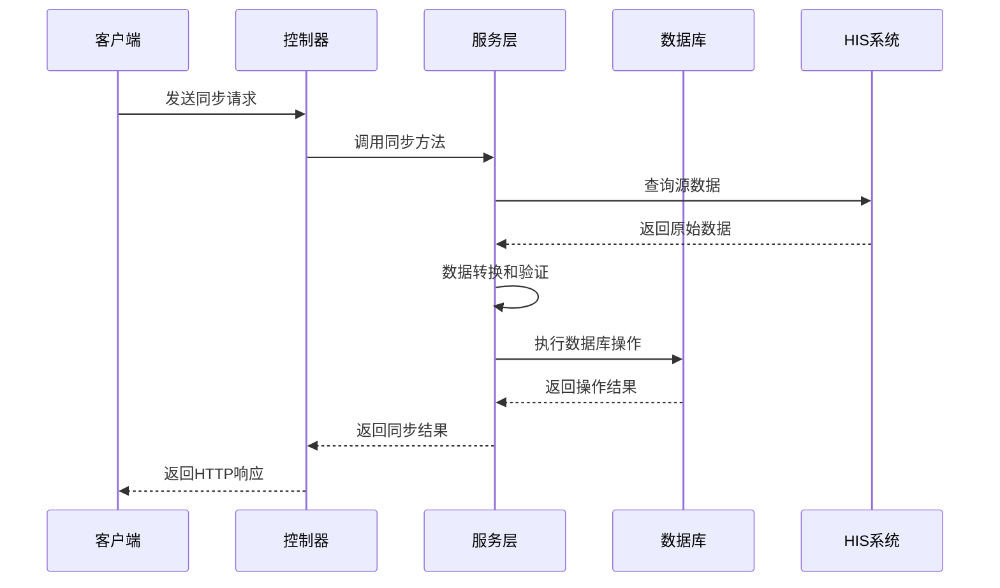
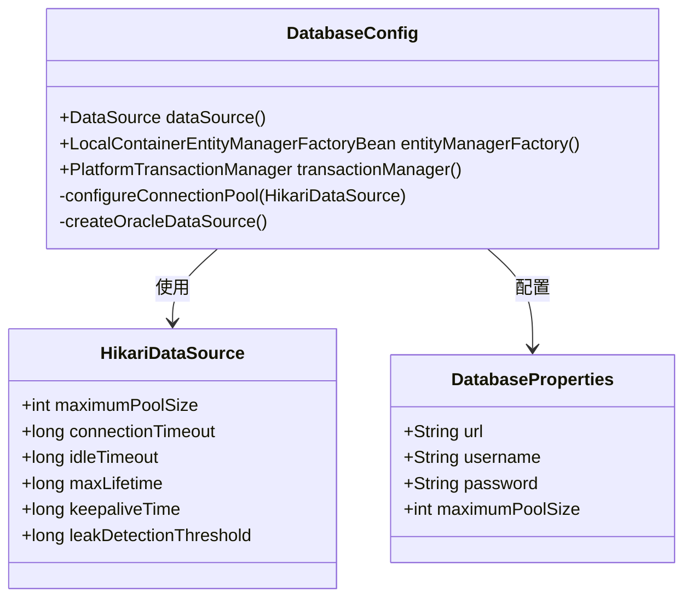
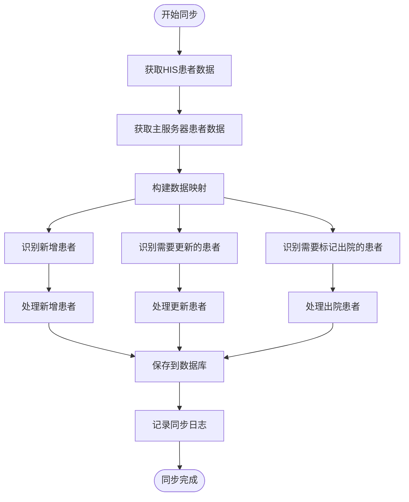
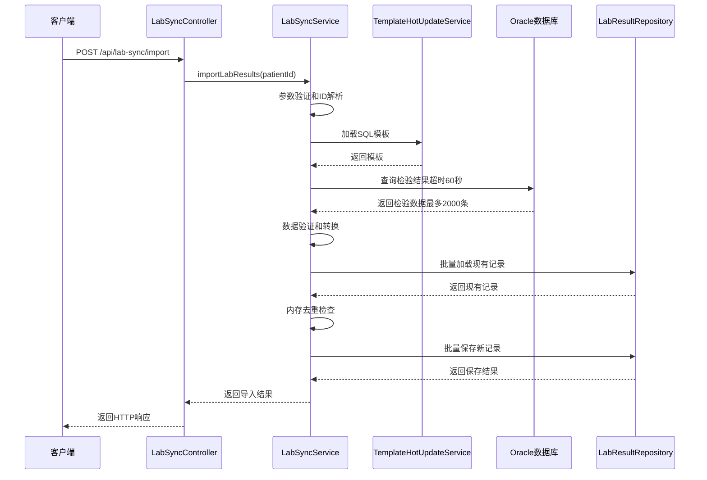
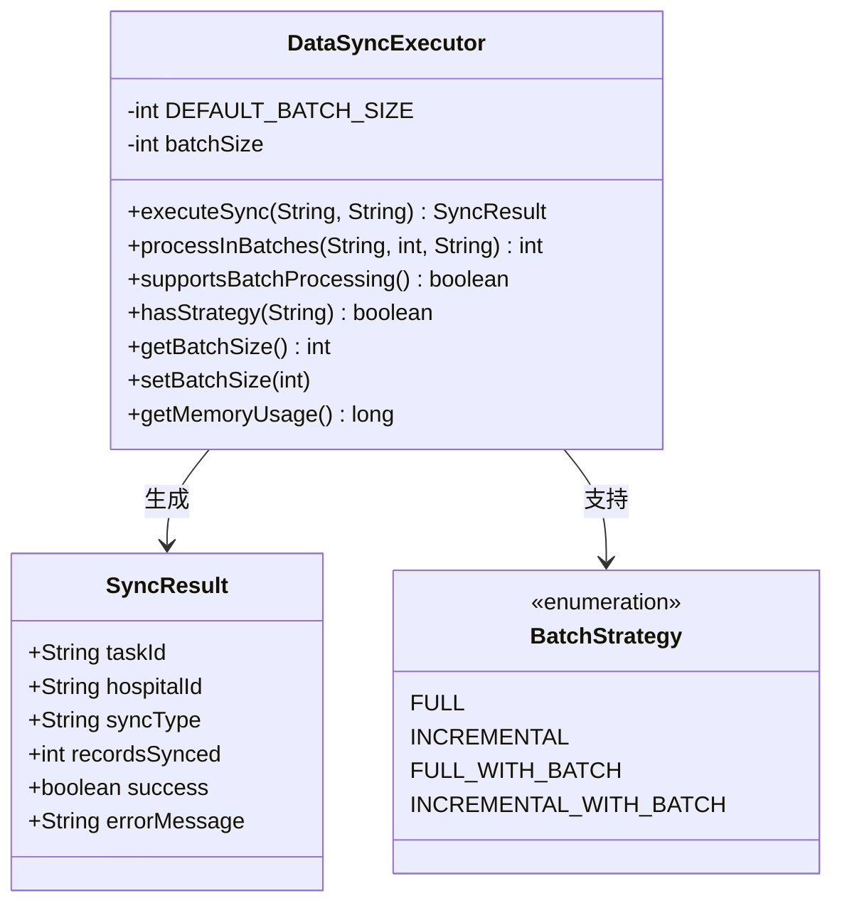
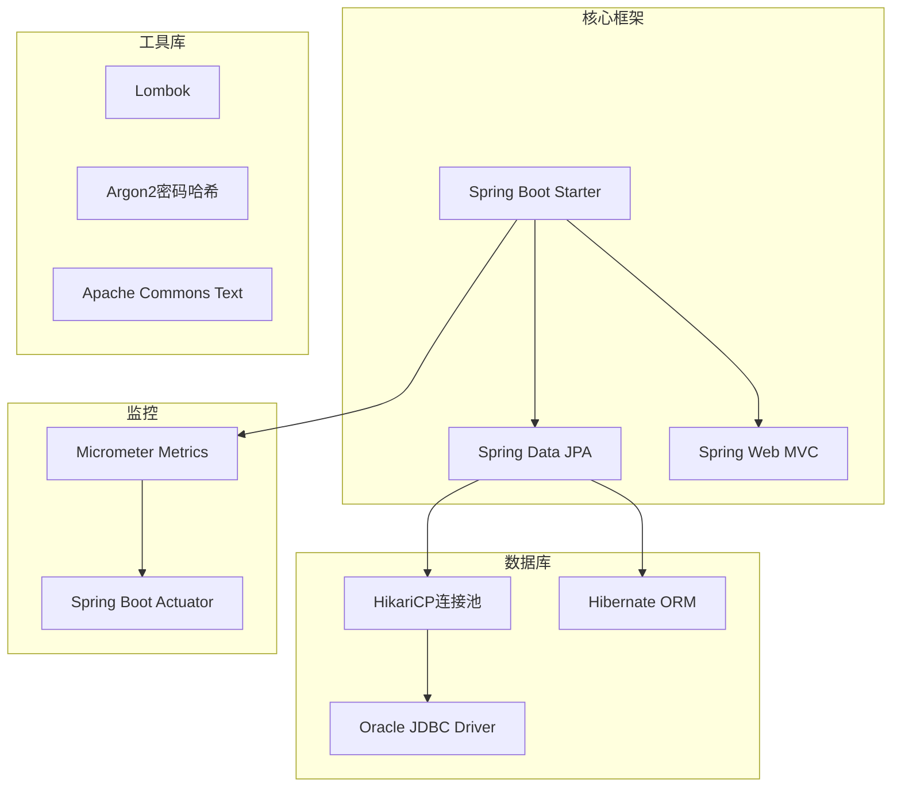
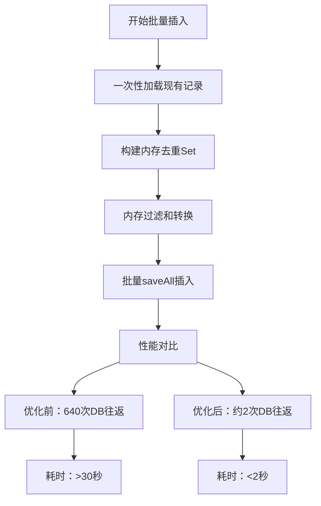

# 数据库同步程序

<cite>
**本文档引用的文件**
- [pom.xml](file://med_ai_assistant_1.0_bs_backend/pom.xml)
- [application.properties](file://med_ai_assistant_1.0_bs_backend/src/main/resources/application.properties)
- [DatabaseConfig.java](file://med_ai_assistant_1.0_bs_backend/src/main/java/com/example/medaiassistant/config/DatabaseConfig.java)
- [DataSyncExecutor.java](file://med_ai_assistant_1.0_bs_backend/src/main/java/com/example/medaiassistant/hospital/service/DataSyncExecutor.java)
- [LabSyncService.java](file://med_ai_assistant_1.0_bs_backend/src/main/java/com/example/medaiassistant/hospital/service/LabSyncService.java)
- [PatientSyncService.java](file://med_ai_assistant_1.0_bs_backend/src/main/java/com/example/medaiassistant/hospital/service/PatientSyncService.java)
- [EmrSyncConfig.java](file://med_ai_assistant_1.0_bs_backend/src/main/java/com/example/medaiassistant/hospital/config/EmrSyncConfig.java)
- [PatientSyncController.java](file://med_ai_assistant_1.0_bs_backend/src/main/java/com/example/medaiassistant/controller/PatientSyncController.java)
- [LabSyncController.java](file://med_ai_assistant_1.0_bs_backend/src/main/java/com/example/medaiassistant/controller/LabSyncController.java)
- [SyncLogService.java](file://med_ai_assistant_1.0_bs_backend/src/main/java/com/example/medaiassistant/hospital/service/SyncLogService.java)
- [patient-sync-query.json](file://med_ai_assistant_1.0_bs_backend/sql/hospital-Local/patient-sync-query.json)
- [lab-results-query.json](file://med_ai_assistant_1.0_bs_backend/sql/hospital-Local/lab-results-query.json)
- [test-lab-sync-api.http](file://med_ai_assistant_1.0_bs_backend/test-scripts/test-lab-sync-api.http)
</cite>

## 更新摘要
**所做更改**
- 更新实验室结果同步性能优化部分，反映版本0.9.014中的改进
- 新增手动同步机制改进和超时处理优化的详细说明
- 增强批量处理优化和内存去重机制的技术细节
- 补充乐观锁异常修复和SQL模板兼容性改进的内容

## 目录
1. [项目概述](#项目概述)
2. [项目结构](#项目结构)
3. [核心组件](#核心组件)
4. [架构概览](#架构概览)
5. [详细组件分析](#详细组件分析)
6. [依赖关系分析](#依赖关系分析)
7. [性能考虑](#性能考虑)
8. [故障排除指南](#故障排除指南)
9. [结论](#结论)

## 项目概述

数据库同步程序是一个基于Spring Boot的企业级医疗信息系统，专门设计用于在主服务器和医院信息系统（HIS）之间进行数据同步。该系统支持多种医疗数据类型的同步，包括患者信息、检验结果、病历内容等，并提供了完整的监控、日志记录和错误处理机制。

系统采用微服务架构，支持Oracle数据库连接池优化、异步处理、批量数据处理和多线程并发执行。通过REST API接口提供数据同步服务，支持单个同步、批量同步和定时同步等多种模式。

**更新** 本次更新重点关注实验室结果同步的性能优化，包括手动同步机制改进、超时处理优化以及批量处理性能提升。

## 项目结构

**图表来源**
- [DatabaseConfig.java:1-269](file://med_ai_assistant_1.0_bs_backend/src/main/java/com/example/medaiassistant/config/DatabaseConfig.java#L1-L269)
- [application.properties:1-312](file://med_ai_assistant_1.0_bs_backend/src/main/resources/application.properties#L1-L312)

**章节来源**
- [pom.xml:1-309](file://med_ai_assistant_1.0_bs_backend/pom.xml#L1-L309)
- [application.properties:1-312](file://med_ai_assistant_1.0_bs_backend/src/main/resources/application.properties#L1-L312)

## 核心组件

### 数据库配置组件

系统使用HikariCP连接池管理数据库连接，支持Oracle数据库的高性能连接管理。配置包括连接池大小、超时设置、连接保活和泄漏检测等功能。

### 同步服务组件

- **患者同步服务**：实现三向对比算法，支持新增、更新和标记出院操作
- **检验结果同步服务**：从LIS系统获取检验结果并同步到主数据库，包含批量优化和内存去重机制
- **数据同步执行器**：提供分批处理和并发执行能力

### 控制器组件

提供REST API接口，支持同步状态查询、批量同步和健康检查等功能。

**章节来源**
- [DatabaseConfig.java:1-269](file://med_ai_assistant_1.0_bs_backend/src/main/java/com/example/medaiassistant/config/DatabaseConfig.java#L1-L269)
- [DataSyncExecutor.java:1-197](file://med_ai_assistant_1.0_bs_backend/src/main/java/com/example/medaiassistant/hospital/service/DataSyncExecutor.java#L1-L197)

## 架构概览

**图表来源**
- [PatientSyncController.java:1-703](file://med_ai_assistant_1.0_bs_backend/src/main/java/com/example/medaiassistant/controller/PatientSyncController.java#L1-L703)
- [LabSyncController.java:1-349](file://med_ai_assistant_1.0_bs_backend/src/main/java/com/example/medaiassistant/controller/LabSyncController.java#L1-L349)

## 详细组件分析

### 数据库配置分析

系统采用HikariCP连接池，提供高性能的数据库连接管理：

**图表来源**
- [DatabaseConfig.java:1-269](file://med_ai_assistant_1.0_bs_backend/src/main/java/com/example/medaiassistant/config/DatabaseConfig.java#L1-L269)

### 患者同步服务分析

患者同步服务实现了复杂的三向对比算法：

**图表来源**
- [PatientSyncService.java:1-640](file://med_ai_assistant_1.0_bs_backend/src/main/java/com/example/medaiassistant/hospital/service/PatientSyncService.java#L1-L640)

### 检验结果同步服务分析

检验结果同步服务提供了完整的LIS数据同步流程，经过版本0.9.014的性能优化：

**图表来源**
- [LabSyncService.java:1-695](file://med_ai_assistant_1.0_bs_backend/src/main/java/com/example/medaiassistant/hospital/service/LabSyncService.java#L1-L695)
- [LabSyncController.java:1-349](file://med_ai_assistant_1.0_bs_backend/src/main/java/com/example/medaiassistant/controller/LabSyncController.java#L1-L349)

### 数据同步执行器分析

数据同步执行器提供了灵活的分批处理能力：

**图表来源**
- [DataSyncExecutor.java:1-197](file://med_ai_assistant_1.0_bs_backend/src/main/java/com/example/medaiassistant/hospital/service/DataSyncExecutor.java#L1-L197)

**章节来源**
- [PatientSyncService.java:1-640](file://med_ai_assistant_1.0_bs_backend/src/main/java/com/example/medaiassistant/hospital/service/PatientSyncService.java#L1-L640)
- [LabSyncService.java:1-695](file://med_ai_assistant_1.0_bs_backend/src/main/java/com/example/medaiassistant/hospital/service/LabSyncService.java#L1-L695)
- [DataSyncExecutor.java:1-197](file://med_ai_assistant_1.0_bs_backend/src/main/java/com/example/medaiassistant/hospital/service/DataSyncExecutor.java#L1-L197)

## 依赖关系分析

系统使用Maven进行依赖管理，主要依赖包括：

**图表来源**
- [pom.xml:53-214](file://med_ai_assistant_1.0_bs_backend/pom.xml#L53-L214)

**章节来源**
- [pom.xml:1-309](file://med_ai_assistant_1.0_bs_backend/pom.xml#L1-L309)

## 性能考虑

### 连接池优化

系统采用HikariCP连接池，配置了多项优化参数：

- **最大连接池大小**：15个连接，支持高并发场景
- **连接超时时间**：10秒，平衡响应速度和资源占用
- **空闲连接超时**：4分钟，防止连接被数据库提前关闭
- **连接最大生命周期**：30分钟，避免连接泄漏
- **连接保活时间**：2分钟，定期心跳维持连接活跃

### 批量处理优化

**更新** 版本0.9.014引入了显著的批量处理性能优化：

- **默认批次大小**：1000条记录
- **分批处理算法**：动态计算批次大小，避免内存溢出
- **并发处理**：支持多线程并行处理不同批次
- **内存去重优化**：从原来的640次DB往返优化为约2次DB往返

### 检验结果同步性能优化

**更新** 实验室结果同步经过重大性能优化：

**优化要点**：
- **批量加载**：一次性查询患者所有现有检验结果，减少数据库往返
- **内存去重**：使用Set结构进行O(1)时间复杂度的去重检查
- **批量保存**：使用saveAll()方法进行批量数据库操作
- **超时设置**：Oracle查询超时时间设置为60秒
- **行数限制**：Java层面限制最大返回2000条记录

### 缓存机制

- **模板热更新服务**：支持SQL模板的动态加载和更新
- **连接池监控**：实时监控连接池状态和性能指标

**章节来源**
- [LabSyncService.java:276-364](file://med_ai_assistant_1.0_bs_backend/src/main/java/com/example/medaiassistant/hospital/service/LabSyncService.java#L276-L364)

## 故障排除指南

### 常见问题及解决方案

1. **数据库连接失败**
   - 检查Oracle数据库连接参数配置
   - 验证网络连接和防火墙设置
   - 查看连接池初始化日志

2. **同步性能问题**
   - 调整批次大小参数
   - 检查数据库索引和查询优化
   - 监控连接池使用情况

3. **数据重复问题**
   - 验证重复记录检查逻辑
   - 检查数据库唯一约束
   - 查看同步日志中的重复记录

4. **实验室结果同步超时**
   - 检查Oracle数据库响应时间
   - 验证SQL模板查询性能
   - 确认网络连接稳定性

### 监控和诊断

系统提供了完整的监控和诊断功能：

- **健康检查端点**：监控服务运行状态
- **性能指标收集**：收集数据库连接和同步性能数据
- **日志记录**：详细的同步过程日志
- **错误处理**：完善的异常捕获和处理机制

**章节来源**
- [SyncLogService.java:1-288](file://med_ai_assistant_1.0_bs_backend/src/main/java/com/example/medaiassistant/hospital/service/SyncLogService.java#L1-L288)

## 结论

数据库同步程序是一个功能完整、性能优异的医疗数据同步系统。通过采用现代化的技术架构和最佳实践，系统能够高效地处理大量医疗数据的同步需求。

**更新** 版本0.9.014中的性能优化显著提升了实验室结果同步的效率：

- **性能提升**：批量处理从640次DB往返优化为约2次，耗时从>30秒降至<2秒
- **内存优化**：采用内存去重机制，减少数据库查询压力
- **超时处理**：Oracle查询超时时间设置为60秒，避免长时间阻塞
- **手动同步改进**：优化了手动触发同步的响应时间和资源使用

主要特点包括：

- **高性能**：基于HikariCP连接池和优化的数据库访问模式
- **可靠性**：完善的错误处理、重试机制和监控告警
- **可扩展性**：模块化的架构设计，支持功能扩展和性能优化
- **易维护性**：清晰的代码结构和完整的文档支持

该系统为医疗机构提供了可靠的医疗数据同步解决方案，能够满足不同规模医院的数据同步需求。