# 开发环境特性

<cite>
**本文档引用的文件**
- [pom.xml](file://med_ai_assistant_1.0_bs_backend/pom.xml)
- [Dockerfile](file://med_ai_assistant_1.0_bs_backend/Dockerfile)
- [docker-compose.yml](file://med_ai_assistant_1.0_bs_backend/docker-compose.yml)
- [package.json](file://med_ai_assistant_1.0_bs_vue/package.json)
- [Vue前端Dockerfile](file://med_ai_assistant_1.0_bs_vue/Dockerfile)
- [Vue前端docker-compose.yml](file://med_ai_assistant_1.0_bs_vue/docker-compose.yml)
- [.mvn包装器属性](file://med_ai_assistant_1.0_bs_backend/.mvn/wrapper/maven-wrapper.properties)
- [mvnw.cmd启动脚本](file://med_ai_assistant_1.0_bs_backend/mvnw.cmd)
- [后端启动脚本](file://med_ai_assistant_1.0_bs_backend/run-backend.bat)
- [前端启动脚本](file://med_ai_assistant_1.0_bs_vue/start-frontend.bat)
- [后端部署脚本](file://med_ai_assistant_1.0_bs_backend/deploy.bat)
- [患者状态过滤配置](file://med_ai_assistant_1.0_bs_backend/config/application-patient-status-filter.properties)
- [基本分离验证脚本](file://med_ai_assistant_1.0_bs_backend/test-scripts/test-basic-separation.ps1)
- [状态一致性测试脚本](file://med_ai_assistant_1.0_bs_backend/test-scripts/test-iteration3-status-consistency.http)
- [后端.gitignore](file://med_ai_assistant_1.0_bs_backend/.gitignore)
- [后端.dockerignore](file://med_ai_assistant_1.0_bs_backend/.dockerignore)
- [Cypress配置](file://med_ai_assistant_1.0_bs_vue/cypress.config.js)
- [Cypress环境配置示例](file://med_ai_assistant_1.0_bs_vue/cypress.env.json.example)
- [登录页面E2E测试](file://med_ai_assistant_1.0_bs_vue/cypress/e2e/login.cy.js)
- [待办事项页面E2E测试](file://med_ai_assistant_1.0_bs_vue/cypress/e2e/todo.cy.js)
- [AI诊断页面E2E测试](file://med_ai_assistant_1.0_bs_vue/cypress/e2e/ai-diagnosis.cy.js)
- [Cypress测试数据](file://med_ai_assistant_1.0_bs_vue/cypress/fixtures/patients.json)
- [Cypress全局支持文件](file://med_ai_assistant_1.0_bs_vue/cypress/support/e2e.js)
- [Cypress自定义命令](file://med_ai_assistant_1.0_bs_vue/cypress/support/commands.js)
- [Vue前端package.json](file://med_ai_assistant_1.0_bs_vue/package.json)
- [端口转发脚本](file://scripts/medai-port-forward.bat)
</cite>

## 更新摘要
**所做更改**
- 新增前端自动化测试框架集成章节
- 添加Cypress E2E测试工作流配置
- 更新测试环境配置和工具链
- 新增截图上传和视频录制功能说明
- 新增端口转发自动化脚本章节，支持远程开发环境与本地服务的无缝连接

## 目录
1. [简介](#简介)
2. [项目结构概览](#项目结构概览)
3. [核心开发环境特性](#核心开发环境特性)
4. [架构概览](#架构概览)
5. [详细组件分析](#详细组件分析)
6. [前端自动化测试框架](#前端自动化测试框架)
7. [端口转发自动化脚本](#端口转发自动化脚本)
8. [依赖关系分析](#依赖关系分析)
9. [性能考虑](#性能考虑)
10. [故障排除指南](#故障排除指南)
11. [结论](#结论)

## 简介

MedAiAssistant是一个基于Spring Boot和Vue.js的医疗AI助手系统，采用前后端分离架构。该项目提供了完整的开发环境配置，包括多环境支持、容器化部署、自动化测试和监控功能。**更新**：新增了Cypress前端自动化测试框架集成，提供完整的端到端测试能力；新增端口转发自动化脚本，为开发环境提供重要的网络连接自动化功能，支持远程开发环境与本地服务的无缝连接。

## 项目结构概览

项目采用典型的微服务架构，包含以下主要组件：

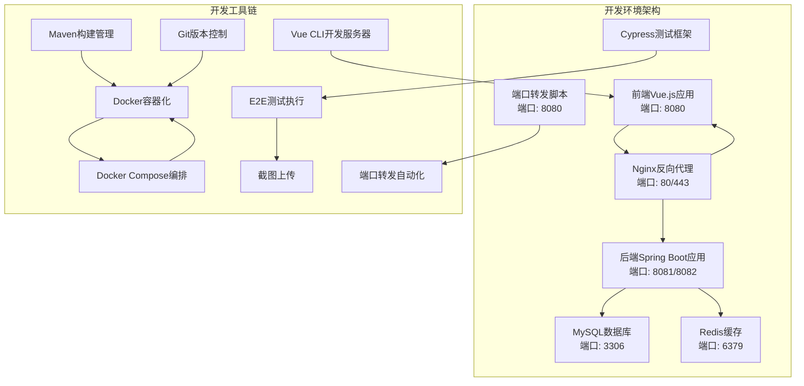

**图表来源**
- [docker-compose.yml:1-97](file://med_ai_assistant_1.0_bs_backend/docker-compose.yml#L1-L97)
- [Vue前端docker-compose.yml:1-93](file://med_ai_assistant_1.0_bs_vue/docker-compose.yml#L1-L93)
- [Cypress配置:26-86](file://med_ai_assistant_1.0_bs_vue/cypress.config.js#L26-L86)
- [端口转发脚本:1-5](file://scripts/medai-port-forward.bat#L1-L5)

**章节来源**
- [pom.xml:1-309](file://med_ai_assistant_1.0_bs_backend/pom.xml#L1-L309)
- [docker-compose.yml:1-97](file://med_ai_assistant_1.0_bs_backend/docker-compose.yml#L1-L97)

## 核心开发环境特性

### 多环境配置管理

项目实现了完善的多环境配置体系，支持开发、测试和生产环境的灵活切换：

| 环境类型 | 配置文件 | 关键特性 |
|---------|----------|----------|
| 开发环境 | application-dev.properties | 热重载、详细日志、调试模式 |
| 测试环境 | application-test.properties | 单元测试配置、模拟数据 |
| 生产环境 | application-prod.properties | 性能优化、安全配置 |
| 执行服务器 | application-execution.properties | 专用任务执行配置 |

### 容器化部署架构

采用Docker多阶段构建优化镜像大小和安全性：

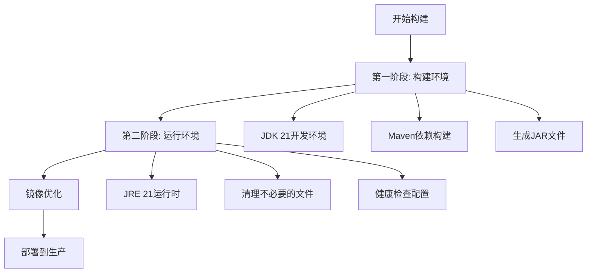

**图表来源**
- [Dockerfile:1-65](file://med_ai_assistant_1.0_bs_backend/Dockerfile#L1-L65)

### 自动化测试框架

集成了完整的测试生态系统，支持单元测试、集成测试和端到端测试：

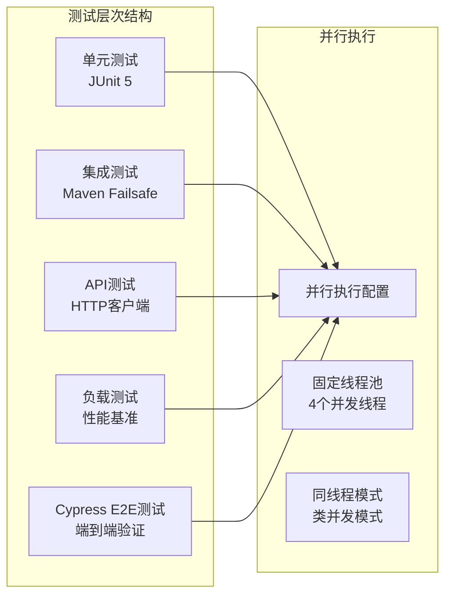

**图表来源**
- [pom.xml:248-304](file://med_ai_assistant_1.0_bs_backend/pom.xml#L248-L304)

**章节来源**
- [pom.xml:241-306](file://med_ai_assistant_1.0_bs_backend/pom.xml#L241-L306)
- [后端.dockerignore:1-52](file://med_ai_assistant_1.0_bs_backend/.dockerignore#L1-L52)

## 架构概览

### 整体系统架构

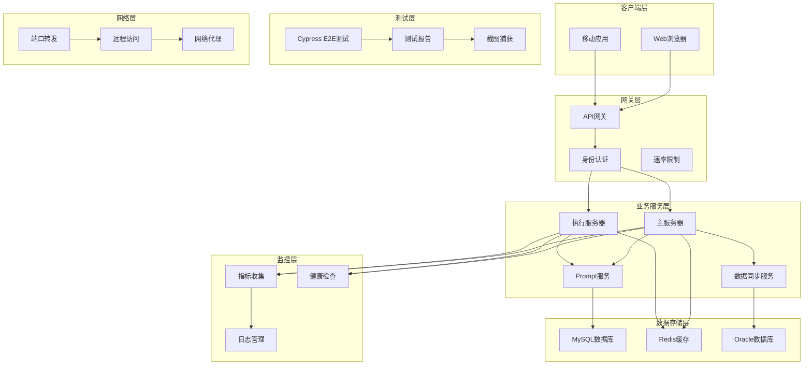

**图表来源**
- [docker-compose.yml:1-97](file://med_ai_assistant_1.0_bs_backend/docker-compose.yml#L1-L97)

### 开发环境启动流程

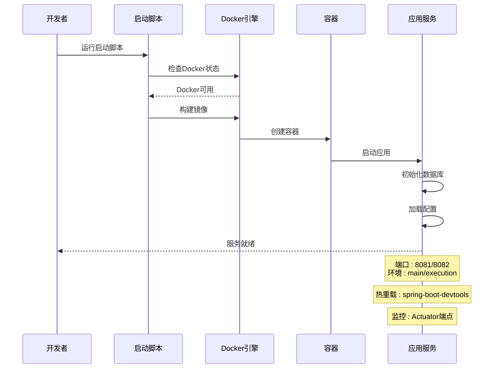

**图表来源**
- [后端启动脚本:1-159](file://med_ai_assistant_1.0_bs_backend/run-backend.bat#L1-L159)
- [pom.xml:167-173](file://med_ai_assistant_1.0_bs_backend/pom.xml#L167-L173)

## 详细组件分析

### 后端开发环境配置

#### Maven构建配置

后端项目使用Maven作为构建工具，配置了完整的开发环境支持：

| 配置类别 | 关键设置 | 功能描述 |
|---------|----------|----------|
| Java版本 | Java 21 | 最新长期支持版本 |
| Spring Profiles | main/execution | 多环境配置支持 |
| DevTools | spring-boot-devtools | 热重载支持 |
| 测试配置 | JUnit 5并行执行 | 提高测试效率 |
| 监控集成 | Micrometer + Prometheus | 指标收集 |

#### Docker容器配置

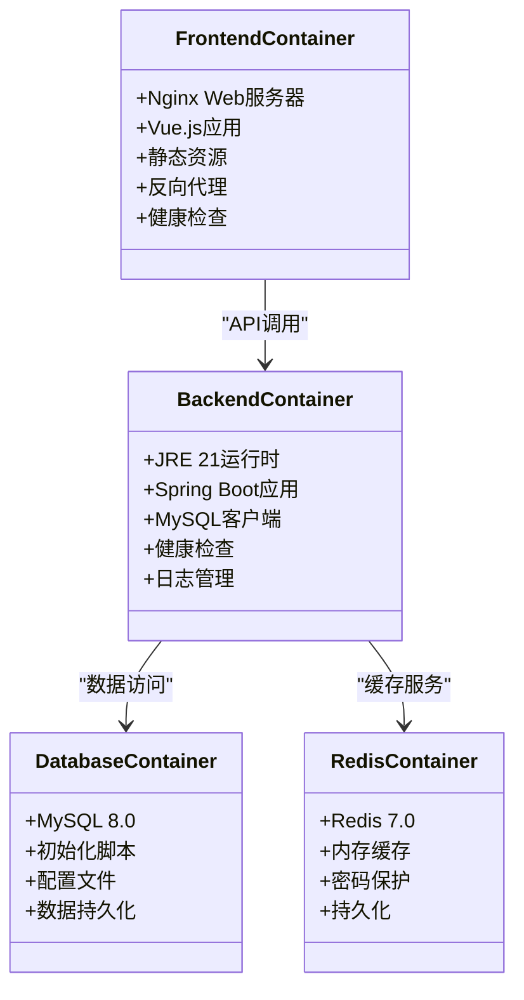

**图表来源**
- [Dockerfile:1-65](file://med_ai_assistant_1.0_bs_backend/Dockerfile#L1-L65)
- [Vue前端Dockerfile:1-30](file://med_ai_assistant_1.0_bs_vue/Dockerfile#L1-L30)

#### 开发工具链集成

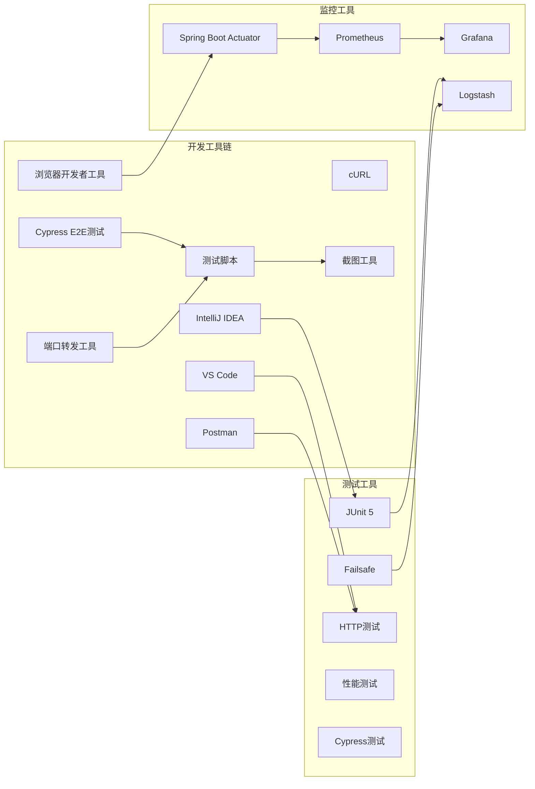

**图表来源**
- [pom.xml:167-191](file://med_ai_assistant_1.0_bs_backend/pom.xml#L167-L191)

**章节来源**
- [pom.xml:29-52](file://med_ai_assistant_1.0_bs_backend/pom.xml#L29-L52)
- [后端启动脚本:1-159](file://med_ai_assistant_1.0_bs_backend/run-backend.bat#L1-L159)

### 前端开发环境配置

#### Vue.js开发环境

前端项目基于Vue 3.2.13构建，配置了完整的开发工具链：

| 特性 | 技术栈 | 描述 |
|------|--------|------|
| 框架 | Vue 3.2.13 | 最新稳定版本 |
| UI库 | Element Plus 2.10.2 | 企业级组件库 |
| 状态管理 | Vuex 4.0.2 | 应用状态管理 |
| 路由 | Vue Router 4.5.1 | 单页应用路由 |
| HTTP客户端 | Axios 1.10.0 | 异步请求处理 |
| 构建工具 | Vue CLI 5.0 | 项目构建和开发服务器 |
| 测试框架 | Cypress 15.13.1 | 端到端测试 |

#### 开发服务器配置

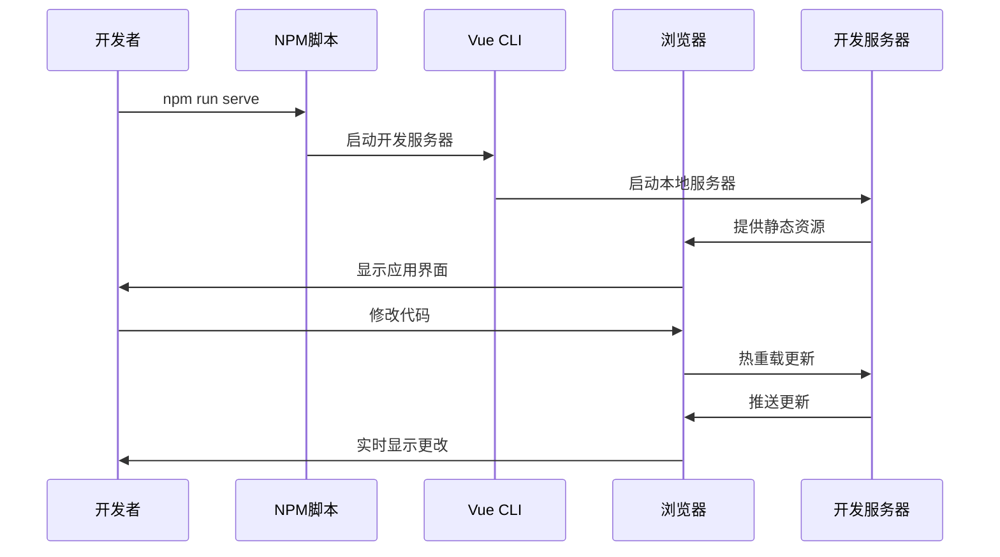

**图表来源**
- [package.json:5-9](file://med_ai_assistant_1.0_bs_vue/package.json#L5-L9)

**章节来源**
- [package.json:1-56](file://med_ai_assistant_1.0_bs_vue/package.json#L1-L56)
- [前端启动脚本:1-53](file://med_ai_assistant_1.0_bs_vue/start-frontend.bat#L1-L53)

### 测试环境配置

#### 测试脚本生态系统

项目提供了丰富的测试脚本，支持不同层面的功能验证：

| 测试类型 | 脚本文件 | 功能描述 |
|----------|----------|----------|
| 基础分离测试 | test-basic-separation.ps1 | 验证提交和轮询服务分离 |
| 状态一致性测试 | test-iteration3-status-consistency.http | 验证状态管理一致性 |
| 性能基准测试 | performance-benchmark.http | 系统性能评估 |
| 集成测试 | run-integration-tests.bat | 端到端功能测试 |
| 网络连通性测试 | check-network-connectivity.bat | 网络环境验证 |

#### 测试环境隔离

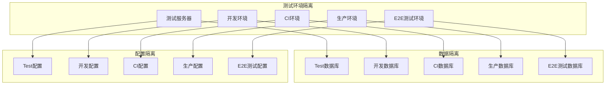

**图表来源**
- [基本分离验证脚本:1-92](file://med_ai_assistant_1.0_bs_backend/test-scripts/test-basic-separation.ps1#L1-92)
- [状态一致性测试脚本:1-111](file://med_ai_assistant_1.0_bs_backend/test-scripts/test-iteration3-status-consistency.http#L1-111)

**章节来源**
- [基本分离验证脚本:1-92](file://med_ai_assistant_1.0_bs_backend/test-scripts/test-basic-separation.ps1#L1-92)
- [状态一致性测试脚本:1-111](file://med_ai_assistant_1.0_bs_backend/test-scripts/test-iteration3-status-consistency.http#L1-111)

## 前端自动化测试框架

### Cypress E2E测试配置

项目集成了Cypress前端自动化测试框架，提供完整的端到端测试能力：

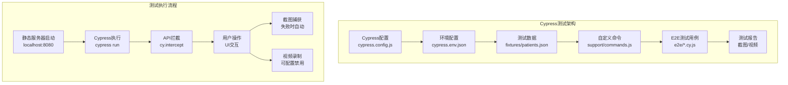

**图表来源**
- [Cypress配置:26-86](file://med_ai_assistant_1.0_bs_vue/cypress.config.js#L26-L86)
- [Cypress全局支持文件:14-14](file://med_ai_assistant_1.0_bs_vue/cypress/support/e2e.js#L14-L14)

### 测试配置详解

#### 基础配置参数

| 配置项 | 值 | 描述 |
|--------|-----|------|
| baseUrl | http://localhost:8080 | 应用基础URL |
| specPattern | cypress/e2e/**/*.cy.{js,jsx} | 测试文件匹配模式 |
| supportFile | cypress/support/e2e.js | 支持文件路径 |
| viewportWidth | 1280 | 浏览器视口宽度（像素） |
| viewportHeight | 720 | 浏览器视口高度（像素） |
| defaultCommandTimeout | 10000 | 命令超时时间（毫秒） |
| responseTimeout | 30000 | 响应超时时间（毫秒） |

#### 环境变量配置

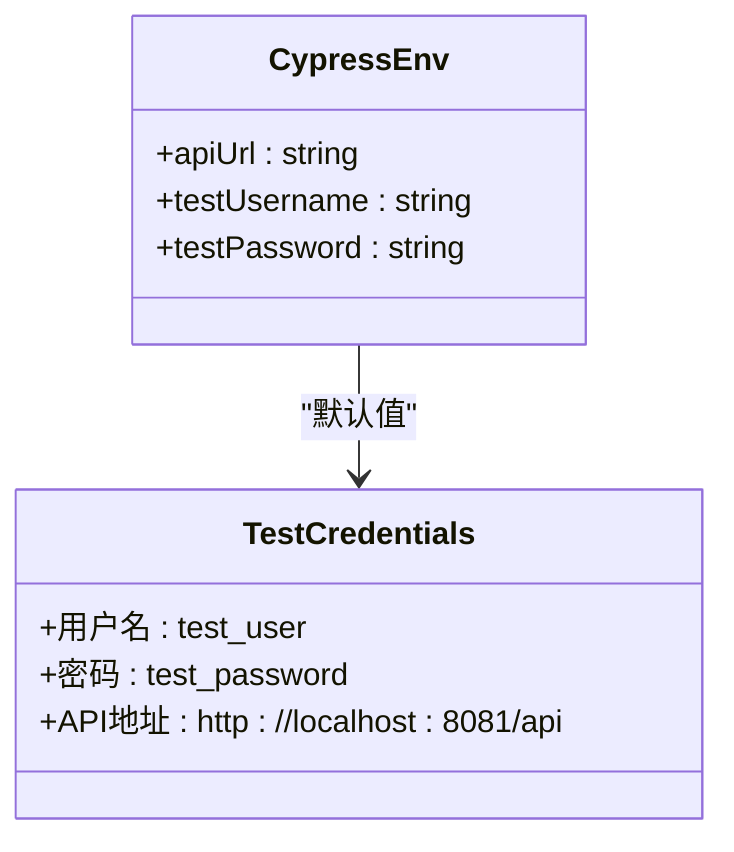

**图表来源**
- [Cypress配置:80-84](file://med_ai_assistant_1.0_bs_vue/cypress.config.js#L80-L84)
- [Cypress环境配置示例:1-6](file://med_ai_assistant_1.0_bs_vue/cypress.env.json.example#L1-L6)

#### 自定义命令系统

Cypress提供了丰富的自定义命令，简化测试代码：

| 命令类型 | 命令名称 | 功能描述 |
|----------|----------|----------|
| 登录操作 | cy.login() | 通过UI执行完整登录流程 |
| API等待 | cy.waitForApi() | 等待指定API请求完成 |
| 模拟登录 | cy.mockLogin() | 直接设置localStorage模拟登录 |
| 页面导航 | cy.navigateTo() | 导航到指定路由并等待加载 |
| 断言辅助 | 自动断言 | 预定义的元素存在性检查 |

**章节来源**
- [Cypress配置:26-86](file://med_ai_assistant_1.0_bs_vue/cypress.config.js#L26-L86)
- [Cypress自定义命令:23-137](file://med_ai_assistant_1.0_bs_vue/cypress/support/commands.js#L23-L137)

### 测试用例覆盖范围

#### 登录页面测试

涵盖登录页面的所有关键功能：

| 测试场景 | 测试用例 | 验证点 |
|----------|----------|--------|
| 页面加载 | 正确加载登录页面 | UI元素存在性 |
| 用户名输入 | 支持用户名输入和清除 | 输入功能验证 |
| 密码输入 | 支持密码输入 | 类型验证 |
| 科室加载 | 用户名输入后自动加载 | 异步数据加载 |
| 登录流程 | 完整登录流程 | 跳转验证 |
| 错误处理 | 未选择科室错误 | 提示信息验证 |
| 登录失败 | API返回401错误 | 错误提示验证 |
| 退出功能 | 点击退出按钮 | 状态清除验证 |

#### 待办事项测试

验证待办事项页面的完整功能：

| 测试场景 | 测试用例 | 验证点 |
|----------|----------|--------|
| 页面加载 | 正确加载待办页面 | 布局验证 |
| 卡片渲染 | 病人卡片正确渲染 | 数据绑定 |
| 详情显示 | 点击卡片显示详情 | 交互验证 |
| 日期筛选 | 日期选择器功能 | 筛选逻辑 |
| 维度切换 | 筛选维度切换 | 状态管理 |
| 空状态 | 无数据时的显示 | 空状态处理 |
| 原始记录 | 病历记录按钮功能 | 对话框显示 |
| 时间排序 | 待办事项按时间排序 | 排序逻辑 |

#### AI诊断测试

覆盖AI诊断相关功能：

| 测试场景 | 测试用例 | 验证点 |
|----------|----------|--------|
| 页面加载 | AI诊断页面正确加载 | 路由验证 |
| 导航功能 | 从患者列表导航 | 页面跳转 |
| 诊断信息 | 患者诊断信息加载 | 数据获取 |
| 切换患者 | 切换患者时数据更新 | 状态同步 |
| 选中状态 | 选中状态持久化 | 本地存储 |
| 状态样式 | 不同状态显示不同样式 | 样式应用 |

**章节来源**
- [登录页面E2E测试:9-283](file://med_ai_assistant_1.0_bs_vue/cypress/e2e/login.cy.js#L9-L283)
- [待办事项页面E2E测试:9-344](file://med_ai_assistant_1.0_bs_vue/cypress/e2e/todo.cy.js#L9-L344)
- [AI诊断页面E2E测试:9-414](file://med_ai_assistant_1.0_bs_vue/cypress/e2e/ai-diagnosis.cy.js#L9-L414)

### 测试数据管理

#### 测试数据结构

测试使用统一的fixture数据结构：

| 数据类别 | 文件路径 | 数据用途 |
|----------|----------|----------|
| 患者列表 | fixtures/patients.json | 患者信息数据 |
| 科室信息 | fixtures/patients.json | 用户科室列表 |
| 待办事项 | fixtures/patients.json | 待办任务数据 |
| 诊断信息 | fixtures/patients.json | 病人诊断数据 |
| 用户信息 | fixtures/patients.json | 登录用户数据 |

#### 数据准备策略

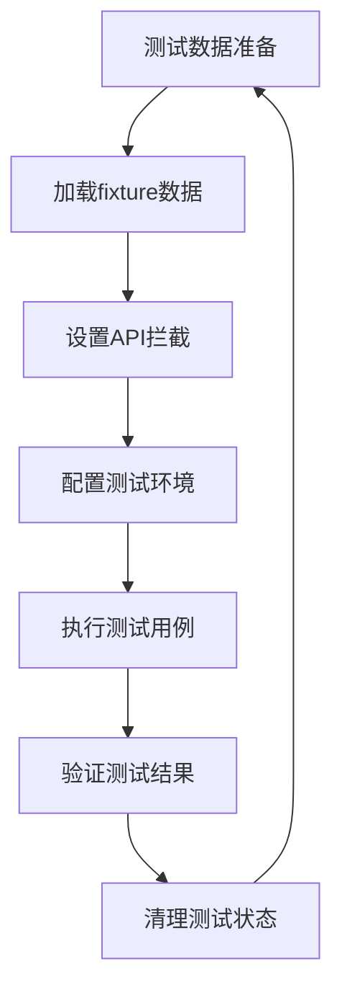

**图表来源**
- [Cypress测试数据:1-154](file://med_ai_assistant_1.0_bs_vue/cypress/fixtures/patients.json#L1-L154)

**章节来源**
- [Cypress测试数据:1-154](file://med_ai_assistant_1.0_bs_vue/cypress/fixtures/patients.json#L1-L154)

### 测试执行和报告

#### 测试执行配置

| 执行模式 | 命令 | 特点 |
|----------|------|------|
| 命令行执行 | npm run test:e2e | 非交互模式 |
| 图形界面 | npm run test:e2e:open | 交互模式 |
| CI集成 | cypress run | 自动化执行 |

#### 截图和视频配置

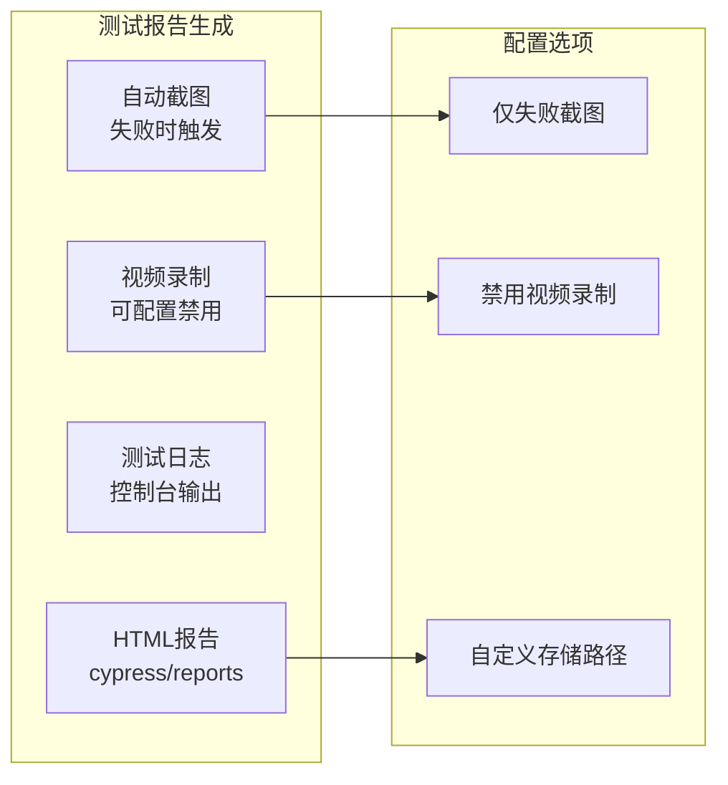

**图表来源**
- [Cypress配置:57-63](file://med_ai_assistant_1.0_bs_vue/cypress.config.js#L57-L63)

**章节来源**
- [Cypress配置:57-86](file://med_ai_assistant_1.0_bs_vue/cypress.config.js#L57-L86)

## 端口转发自动化脚本

### 脚本概述

项目新增了端口转发自动化脚本，专门用于解决远程开发环境与本地服务之间的网络连接问题。该脚本通过Windows系统的netsh命令实现端口转发功能，确保远程开发环境能够无缝访问本地运行的服务。

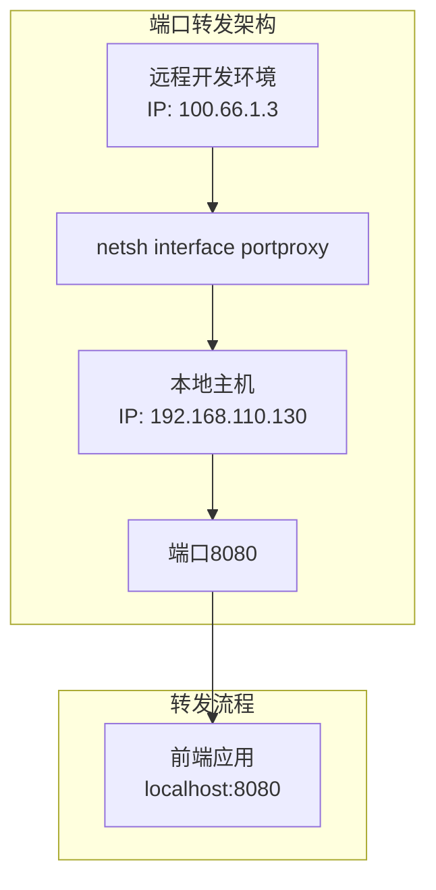

**图表来源**
- [端口转发脚本:1-5](file://scripts/medai-port-forward.bat#L1-L5)

### 脚本配置详解

#### 基础配置参数

| 参数 | 值 | 描述 |
|------|-----|------|
| 监听地址 | 0.0.0.0 | 监听所有网络接口 |
| 监听端口 | 8080 | 远程访问端口 |
| 连接地址 | 192.168.110.130 | 本地主机IP地址 |
| 连接端口 | 8080 | 本地服务端口 |
| 转发协议 | v4tov4 | IPv4到IPv4转发 |

#### 转发规则说明

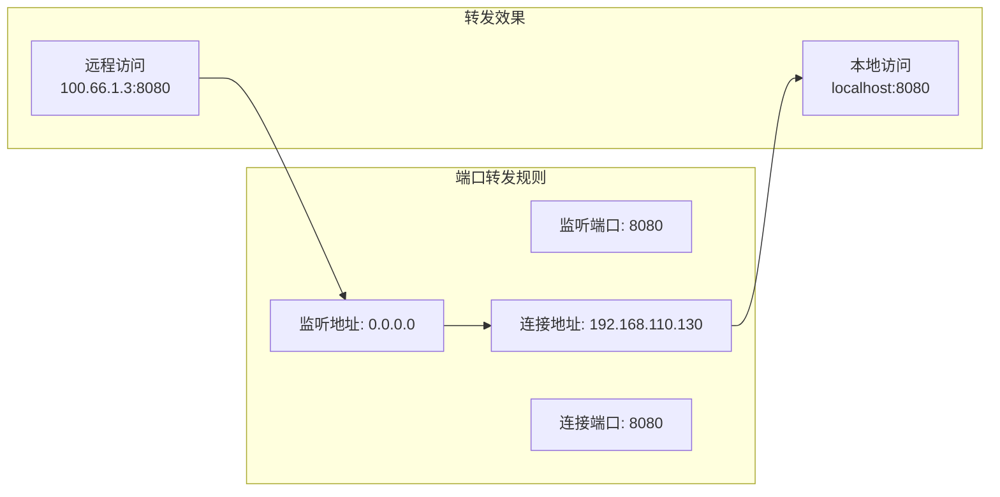

**图表来源**
- [端口转发脚本:3-4](file://scripts/medai-port-forward.bat#L3-L4)

### 使用场景和优势

#### 主要应用场景

1. **远程开发环境**：开发人员在远程服务器上进行开发工作
2. **本地服务访问**：需要访问本地运行的前端开发服务器
3. **团队协作**：多人协作开发时的网络资源共享
4. **测试环境**：模拟真实生产环境的网络连接

#### 技术优势

| 优势 | 说明 |
|------|------|
| 自动化配置 | 一键启动，无需手动配置网络 |
| 稳定可靠 | Windows系统原生命令，稳定性高 |
| 性能优化 | 零额外开销，直接网络转发 |
| 易于维护 | 简单的批处理脚本，易于理解和修改 |
| 跨平台兼容 | 仅需Windows系统支持 |

### 配置管理和维护

#### 脚本管理

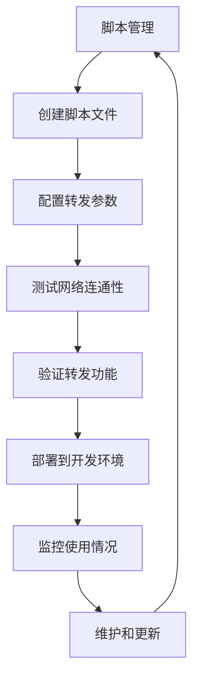

**图表来源**
- [端口转发脚本:1-5](file://scripts/medai-port-forward.bat#L1-L5)

#### 环境适配

| 环境类型 | 配置调整 | 说明 |
|----------|----------|------|
| 开发环境 | 本地IP地址 | 使用127.0.0.1或本机IP |
| 测试环境 | 测试服务器IP | 使用测试环境的服务器地址 |
| 生产环境 | 生产服务器IP | 使用生产环境的真实地址 |
| 远程环境 | 远程服务器IP | 使用远程开发服务器地址 |

**章节来源**
- [端口转发脚本:1-5](file://scripts/medai-port-forward.bat#L1-L5)

## 依赖关系分析

### 技术栈依赖关系

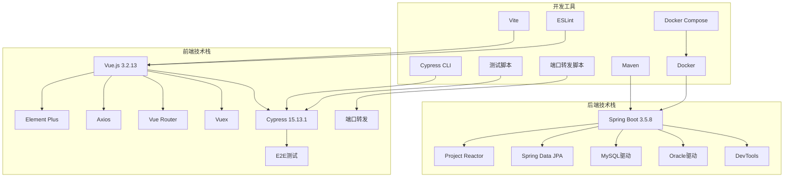

**图表来源**
- [pom.xml:53-214](file://med_ai_assistant_1.0_bs_backend/pom.xml#L53-L214)
- [package.json:10-37](file://med_ai_assistant_1.0_bs_vue/package.json#L10-L37)

### 环境依赖管理

项目采用了多层次的依赖管理策略：

| 依赖类型 | 管理方式 | 优势 |
|----------|----------|------|
| 本地依赖 | Maven本地仓库 | 快速构建、离线可用 |
| 国外依赖 | 阿里云镜像源 | 提高下载速度 |
| Docker依赖 | 多阶段构建 | 减少镜像大小 |
| 前端依赖 | npm包管理 | 版本控制、依赖解析 |
| 测试依赖 | 隔离环境 | 避免污染生产环境 |
| E2E测试依赖 | Cypress框架 | 端到端测试能力 |
| 网络依赖 | 端口转发脚本 | 远程开发环境支持 |

**章节来源**
- [pom.xml:216-239](file://med_ai_assistant_1.0_bs_backend/pom.xml#L216-L239)
- [后端.dockerignore:28-42](file://med_ai_assistant_1.0_bs_backend/.dockerignore#L28-L42)

## 性能考虑

### 开发环境性能优化

项目在开发环境中实现了多项性能优化措施：

#### JVM性能调优

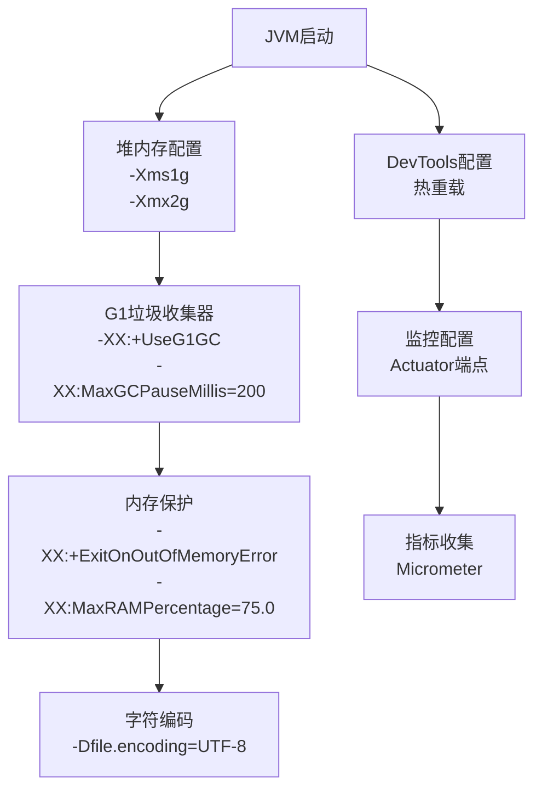

**图表来源**
- [Dockerfile:52-54](file://med_ai_assistant_1.0_bs_backend/Dockerfile#L52-L54)

#### 开发效率优化

| 优化措施 | 实现方式 | 效果 |
|----------|----------|------|
| 热重载 | Spring Boot DevTools | 代码修改即时生效 |
| 并行测试 | JUnit 5并行执行 | 测试时间减少75% |
| Docker缓存 | 层级构建优化 | 构建速度提升 |
| 网络加速 | 阿里云镜像源 | 依赖下载更快 |
| 日志优化 | 结构化日志 | 调试效率提升 |
| E2E测试 | Cypress并行执行 | 测试效率提升 |
| 端口转发 | 自动化脚本 | 远程开发便利性提升 |

### 性能监控配置

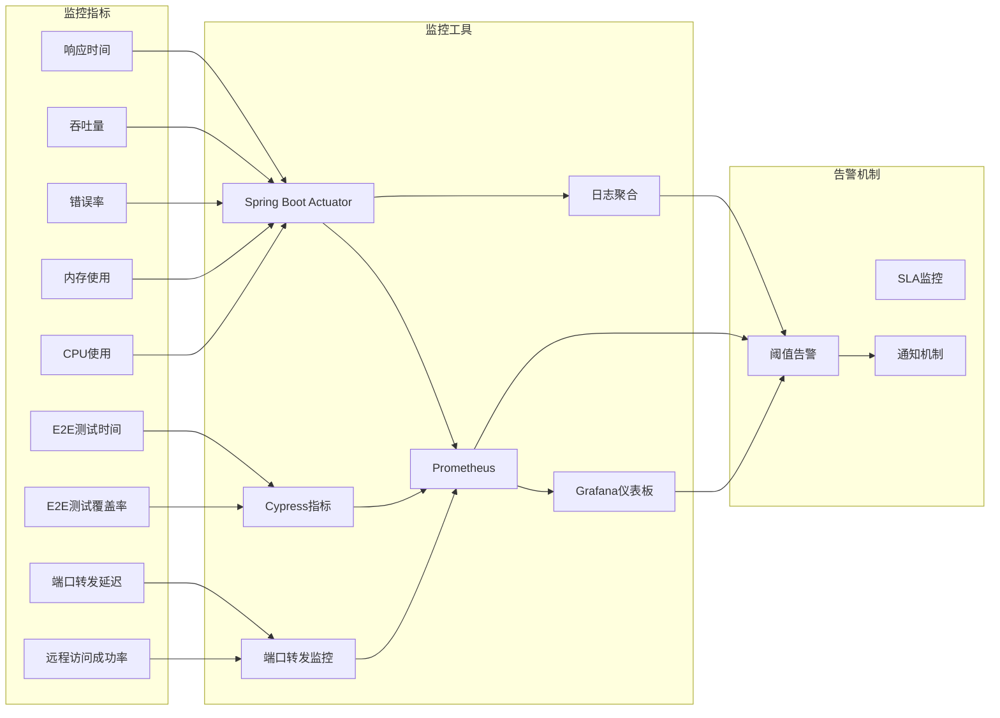

**图表来源**
- [pom.xml:175-191](file://med_ai_assistant_1.0_bs_backend/pom.xml#L175-L191)

## 故障排除指南

### 常见开发环境问题

#### Docker相关问题

| 问题类型 | 症状 | 解决方案 |
|----------|------|----------|
| Docker未安装 | docker --version失败 | 安装Docker Desktop |
| 镜像构建失败 | docker build失败 | 检查网络连接和磁盘空间 |
| 容器启动失败 | docker-compose up失败 | 查看容器日志和端口占用 |
| 网络连接问题 | 服务间通信失败 | 检查Docker网络配置 |
| 权限问题 | 文件访问被拒绝 | 检查文件权限和用户组 |

#### Maven构建问题

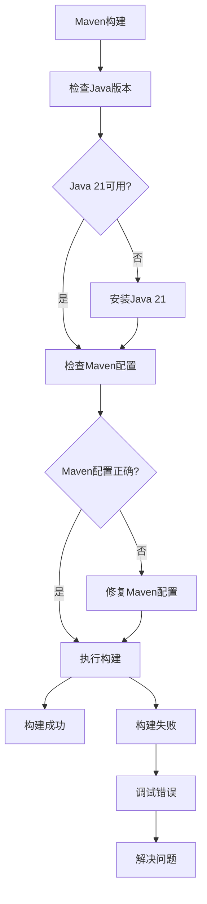

**图表来源**
- [mvnw.cmd启动脚本:1-150](file://med_ai_assistant_1.0_bs_backend/mvnw.cmd#L1-L150)

#### 前端开发问题

| 问题类型 | 症状 | 解决方案 |
|----------|------|----------|
| Node.js版本问题 | node --version失败 | 安装兼容版本的Node.js |
| npm安装失败 | npm install失败 | 检查网络连接和npm缓存 |
| 端口占用 | 开发服务器启动失败 | 更改端口或关闭占用进程 |
| 热重载失效 | 代码修改不生效 | 重启开发服务器 |
| 依赖冲突 | 构建报错 | 清理node_modules重新安装 |
| Cypress测试失败 | 测试执行异常 | 检查测试环境配置 |

#### 后端开发问题

```mermaid
stateDiagram-v2
[*] --> 项目启动
项目启动 --> 依赖加载
依赖加载 --> 数据库连接
数据库连接 --> 服务注册
服务注册 --> 监控配置
监控配置 --> [*]
项目启动 --> 依赖加载
依赖加载 --> 数据库连接
数据库连接 --> 服务注册
服务注册 --> 监控配置
监控配置 --> [*]
依赖加载 --> 依赖冲突
依赖冲突 --> 依赖解决
依赖解决 --> 依赖加载
数据库连接 --> 连接失败
连接失败 --> 数据库配置
数据库配置 --> 数据库连接
```

**图表来源**
- [后端启动脚本:68-146](file://med_ai_assistant_1.0_bs_backend/run-backend.bat#L68-L146)

#### Cypress测试问题

| 问题类型 | 症状 | 解决方案 |
|----------|------|----------|
| 测试无法启动 | Cypress无法打开 | 检查Node.js版本和依赖 |
| 页面元素找不到 | cy.get()失败 | 增加等待时间或调整选择器 |
| API拦截失败 | cy.intercept()无效 | 检查URL模式和请求类型 |
| 截图不生成 | 失败时无截图 | 检查screenshotOnRunFailure配置 |
| 视频录制问题 | 录制失败或文件过大 | 调整视频配置或禁用录制 |

#### 端口转发问题

| 问题类型 | 症状 | 解决方案 |
|----------|------|----------|
| 转发失败 | 远程无法访问本地服务 | 检查netsh命令权限 |
| 端口冲突 | 转发配置失败 | 更改监听端口或停止占用进程 |
| 网络权限 | 需要管理员权限 | 以管理员身份运行脚本 |
| IP地址错误 | 连接目标不可达 | 验证本地IP地址配置 |
| 防火墙阻拦 | 网络连接被阻止 | 配置防火墙允许转发规则 |
| 转发失效 | 重启后配置丢失 | 检查系统启动项和脚本执行 |

**章节来源**
- [后端部署脚本:1-174](file://med_ai_assistant_1.0_bs_backend/deploy.bat#L1-L174)
- [后端.gitignore:1-50](file://med_ai_assistant_1.0_bs_backend/.gitignore#L1-L50)

### 调试和诊断工具

#### 开发调试工具

| 工具类型 | 工具名称 | 功能描述 |
|----------|----------|----------|
| 后端调试 | Spring Boot DevTools | 热重载和自动重启 |
| 前端调试 | Vue DevTools | 组件状态检查 |
| API测试 | Postman | REST API调试 |
| 数据库工具 | MySQL Workbench | 数据库调试 |
| 日志分析 | ELK Stack | 日志聚合分析 |
| 性能分析 | JProfiler | JVM性能分析 |
| E2E测试 | Cypress Debugger | 端到端测试调试 |
| 截图工具 | 浏览器开发者工具 | 测试截图分析 |
| 网络诊断 | netstat/telnet | 端口和连接状态检查 |
| 端口转发诊断 | netsh show interface portproxy | 转发规则状态检查 |

#### 监控和诊断

```mermaid
sequenceDiagram
participant DEV as 开发者
participant ACTUATOR as Actuator端点
participant PROMETHEUS as Prometheus
participant GRAFANA as Grafana
participant LOGS as 日志系统
participant CYPRESS as Cypress测试
participant PORT_MONITOR as 端口转发监控
DEV->>ACTUATOR : 访问健康检查
ACTUATOR-->>DEV : 返回健康状态
DEV->>ACTUATOR : 请求指标数据
ACTUATOR->>PROMETHEUS : 导出指标
PROMETHEUS->>GRAFANA : 提供数据
GRAFANA-->>DEV : 可视化仪表板
DEV->>LOGS : 查询应用日志
LOGS-->>DEV : 返回日志信息
DEV->>CYPRESS : 运行E2E测试
CYPRESS-->>DEV : 返回测试结果
DEV->>PORT_MONITOR : 检查端口转发状态
PORT_MONITOR-->>DEV : 返回转发配置
DEV->>DEV : 分析问题并修复
```

**图表来源**
- [pom.xml:175-191](file://med_ai_assistant_1.0_bs_backend/pom.xml#L175-L191)

## 结论

MedAiAssistant项目展现了现代全栈开发的最佳实践，具有以下突出特点：

### 技术优势

1. **完整的开发工具链**：从IDE配置到CI/CD流水线的全面覆盖
2. **容器化部署**：Docker多阶段构建确保开发和生产环境一致性
3. **多环境配置**：灵活的配置管理支持不同部署场景
4. **自动化测试**：多层次测试框架保证代码质量
5. **性能监控**：完善的监控体系支持系统运维
6. **前端自动化测试**：Cypress集成提供完整的端到端测试能力
7. **网络连接自动化**：端口转发脚本支持远程开发环境与本地服务的无缝连接

### 开发体验

1. **高效开发**：热重载、并行测试、智能代码补全
2. **易用性**：简化的启动脚本和部署流程
3. **可维护性**：清晰的项目结构和文档
4. **扩展性**：模块化设计支持功能扩展
5. **测试友好**：完整的测试框架支持持续集成
6. **远程开发支持**：端口转发脚本提升远程开发效率

### 建议和改进方向

1. **持续集成**：集成GitHub Actions实现自动化构建
2. **安全加固**：添加OWASP依赖检查和安全扫描
3. **文档完善**：补充API文档和架构设计文档
4. **性能优化**：实施APM监控和性能基准测试
5. **测试覆盖**：提高单元测试覆盖率和测试质量
6. **测试报告**：完善测试报告生成和分享机制
7. **端口转发增强**：支持动态端口配置和多服务转发
8. **远程开发工具**：集成更多远程开发辅助工具

该项目为医疗AI应用的开发提供了一个成熟、可靠的基础设施，适合团队协作和长期维护。**更新**：新增的Cypress前端自动化测试框架和端口转发自动化脚本进一步增强了系统的质量和可靠性，为持续集成、部署和远程开发提供了坚实的技术基础。这些改进显著提升了开发效率和用户体验，为项目的长期发展奠定了良好基础。