# 开发环境特性

<cite>
**本文档引用的文件**
- [pom.xml](file://med_ai_assistant_1.0_bs_backend/pom.xml)
- [Dockerfile](file://med_ai_assistant_1.0_bs_backend/Dockerfile)
- [docker-compose.yml](file://med_ai_assistant_1.0_bs_backend/docker-compose.yml)
- [package.json](file://med_ai_assistant_1.0_bs_vue/package.json)
- [Vue前端Dockerfile](file://med_ai_assistant_1.0_bs_vue/Dockerfile)
- [Vue前端docker-compose.yml](file://med_ai_assistant_1.0_bs_vue/docker-compose.yml)
- [.mvn包装器属性](file://med_ai_assistant_1.0_bs_backend/.mvn/wrapper/maven-wrapper.properties)
- [mvnw.cmd启动脚本](file://med_ai_assistant_1.0_bs_backend/mvnw.cmd)
- [后端启动脚本](file://med_ai_assistant_1.0_bs_backend/run-backend.bat)
- [前端启动脚本](file://med_ai_assistant_1.0_bs_vue/start-frontend.bat)
- [后端部署脚本](file://med_ai_assistant_1.0_bs_backend/deploy.bat)
- [患者状态过滤配置](file://med_ai_assistant_1.0_bs_backend/config/application-patient-status-filter.properties)
- [基本分离验证脚本](file://med_ai_assistant_1.0_bs_backend/test-scripts/test-basic-separation.ps1)
- [状态一致性测试脚本](file://med_ai_assistant_1.0_bs_backend/test-scripts/test-iteration3-status-consistency.http)
- [AI响应服务接口测试指南](file://med_ai_assistant_1.0_bs_backend/test-scripts/README-AI-RESPONSE-TEST.md)
- [AI响应服务接口测试文件](file://med_ai_assistant_1.0_bs_backend/test-scripts/ai-response-api-test.http)
- [AI响应DNS问题测试文件](file://med_ai_assistant_1.0_bs_backend/test-scripts/ai-response-dns-fix-test.http)
- [AI响应网络恢复测试文件](file://med_ai_assistant_1.0_bs_backend/test-scripts/ai-response-network-recovery-test.http)
- [AI响应重试机制集成测试文件](file://med_ai_assistant_1.0_bs_backend/test-scripts/ai-response-retry-integration-test.http)
- [执行服务器综合功能测试文件](file://med_ai_assistant_1.0_bs_backend/test-scripts/test-execution-server-comprehensive.http)
- [执行服务器数据轮询测试文件](file://med_ai_assistant_1.0_bs_backend/test-scripts/test-execution-server-polling.http)
- [Oracle数据库连接测试脚本](file://med_ai_assistant_1.0_bs_backend/test-scripts/test-oracle-connection.sh)
- [集成测试环境验证脚本](file://med_ai_assistant_1.0_bs_backend/test-scripts/test-integration-setup.bat)
- [集成测试启动脚本](file://med_ai_assistant_1.0_bs_backend/test-scripts/run-integration-tests.bat)
- [网络连接诊断脚本](file://med_ai_assistant_1.0_bs_backend/test-scripts/check-network-connectivity.bat)
- [后端.gitignore](file://med_ai_assistant_1.0_bs_backend/.gitignore)
- [后端.dockerignore](file://med_ai_assistant_1.0_bs_backend/.dockerignore)
- [Cypress配置](file://med_ai_assistant_1.0_bs_vue/cypress.config.js)
- [Cypress环境配置示例](file://med_ai_assistant_1.0_bs_vue/cypress.env.json.example)
- [登录页面E2E测试](file://med_ai_assistant_1.0_bs_vue/cypress/e2e/login.cy.js)
- [待办事项页面E2E测试](file://med_ai_assistant_1.0_bs_vue/cypress/e2e/todo.cy.js)
- [AI诊断页面E2E测试](file://med_ai_assistant_1.0_bs_vue/cypress/e2e/ai-diagnosis.cy.js)
- [Cypress测试数据](file://med_ai_assistant_1.0_bs_vue/cypress/fixtures/patients.json)
- [Cypress全局支持文件](file://med_ai_assistant_1.0_bs_vue/cypress/support/e2e.js)
- [Cypress自定义命令](file://med_ai_assistant_1.0_bs_vue/cypress/support/commands.js)
- [Vue前端package.json](file://med_ai_assistant_1.0_bs_vue/package.json)
- [端口转发脚本](file://scripts/medai-port-forward.bat)
- [OpenSSH配置脚本](file://scripts/config-sshd.ps1)
- [OpenSSH安装脚本](file://scripts/setup-sshd.ps1)
</cite>

## 更新摘要
**所做更改**
- 新增AI响应服务测试基础设施章节，包含完整的HTTP测试脚本和集成测试配置
- 添加执行服务器功能测试章节，涵盖轮询服务和LLM调用统计测试
- 新增数据库连接验证测试章节，提供Oracle数据库连接测试脚本
- 更新测试环境配置章节，整合新的AI响应处理、执行服务器和数据库连接测试
- 新增网络连接诊断和重试机制测试章节
- 更新开发工具链章节，包含AI响应测试工具和执行服务器测试工具

## 目录
1. [简介](#简介)
2. [项目结构概览](#项目结构概览)
3. [核心开发环境特性](#核心开发环境特性)
4. [架构概览](#架构概览)
5. [详细组件分析](#详细组件分析)
6. [前端自动化测试框架](#前端自动化测试框架)
7. [端口转发自动化脚本](#端口转发自动化脚本)
8. [OpenSSH服务器配置](#openssh服务器配置)
9. [AI响应服务测试基础设施](#ai响应服务测试基础设施)
10. [执行服务器功能测试](#执行服务器功能测试)
11. [数据库连接验证测试](#数据库连接验证测试)
12. [网络连接诊断测试](#网络连接诊断测试)
13. [重试机制集成测试](#重试机制集成测试)
14. [集成测试环境配置](#集成测试环境配置)
15. [依赖关系分析](#依赖关系分析)
16. [性能考虑](#性能考虑)
17. [故障排除指南](#故障排除指南)
18. [结论](#结论)

## 简介

MedAiAssistant是一个基于Spring Boot和Vue.js的医疗AI助手系统，采用前后端分离架构。该项目提供了完整的开发环境配置，包括多环境支持、容器化部署、自动化测试和监控功能。**更新**：新增了AI响应服务测试基础设施，提供完整的HTTP测试脚本和集成测试配置，涵盖AI响应处理、数据库连接验证和执行服务器功能测试；新增端口转发自动化脚本，为开发环境提供重要的网络连接自动化功能，支持远程开发环境与本地服务的无缝连接；新增OpenSSH服务器配置脚本，为Windows开发环境提供安全的远程访问能力。

## 项目结构概览

项目采用典型的微服务架构，包含以下主要组件：

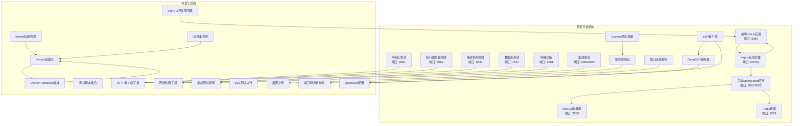

**图表来源**
- [docker-compose.yml:1-97](file://med_ai_assistant_1.0_bs_backend/docker-compose.yml#L1-L97)
- [Vue前端docker-compose.yml:1-93](file://med_ai_assistant_1.0_bs_vue/docker-compose.yml#L1-L93)
- [Cypress配置:26-86](file://med_ai_assistant_1.0_bs_vue/cypress.config.js#L26-L86)
- [端口转发脚本:1-5](file://scripts/medai-port-forward.bat#L1-L5)
- [OpenSSH配置脚本:1-34](file://scripts/config-sshd.ps1#L1-L34)
- [OpenSSH安装脚本:1-86](file://scripts/setup-sshd.ps1#L1-L86)
- [AI响应服务接口测试指南:1-200](file://med_ai_assistant_1.0_bs_backend/test-scripts/README-AI-RESPONSE-TEST.md#L1-L200)

**章节来源**
- [pom.xml:1-309](file://med_ai_assistant_1.0_bs_backend/pom.xml#L1-L309)
- [docker-compose.yml:1-97](file://med_ai_assistant_1.0_bs_backend/docker-compose.yml#L1-L97)

## 核心开发环境特性

### 多环境配置管理

项目实现了完善的多环境配置体系，支持开发、测试和生产环境的灵活切换：

| 环境类型 | 配置文件 | 关键特性 |
|---------|----------|----------|
| 开发环境 | application-dev.properties | 热重载、详细日志、调试模式 |
| 测试环境 | application-test.properties | 单元测试配置、模拟数据 |
| 生产环境 | application-prod.properties | 性能优化、安全配置 |
| 执行服务器 | application-execution.properties | 专用任务执行配置 |
| 集成测试 | application-integration.properties | 外部服务集成配置 |

### 容器化部署架构

采用Docker多阶段构建优化镜像大小和安全性：

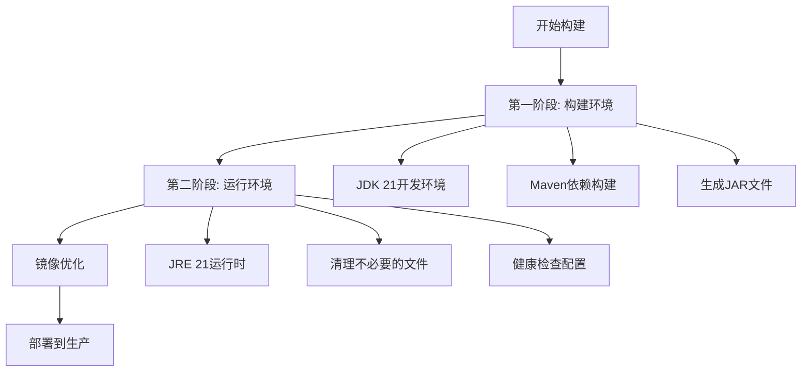

**图表来源**
- [Dockerfile:1-65](file://med_ai_assistant_1.0_bs_backend/Dockerfile#L1-L65)

### 自动化测试框架

集成了完整的测试生态系统，支持单元测试、集成测试和端到端测试：

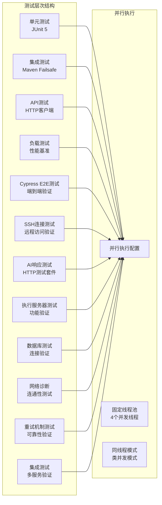

**图表来源**
- [pom.xml:248-304](file://med_ai_assistant_1.0_bs_backend/pom.xml#L248-L304)

**章节来源**
- [pom.xml:241-306](file://med_ai_assistant_1.0_bs_backend/pom.xml#L241-L306)
- [后端.dockerignore:1-52](file://med_ai_assistant_1.0_bs_backend/.dockerignore#L1-L52)

## 架构概览

### 整体系统架构

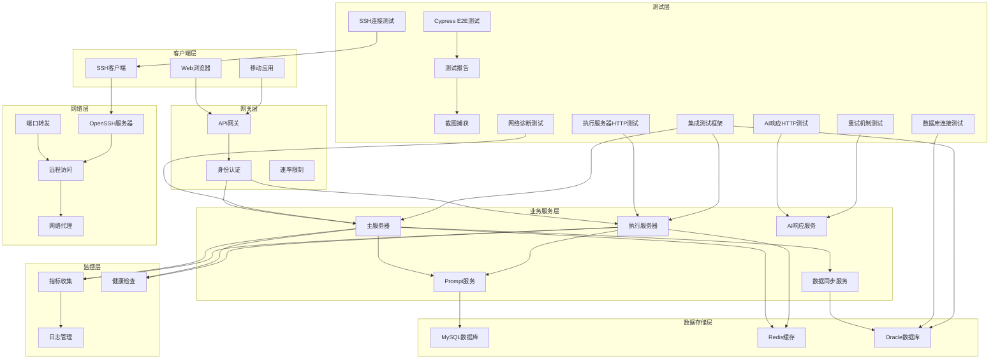

**图表来源**
- [docker-compose.yml:1-97](file://med_ai_assistant_1.0_bs_backend/docker-compose.yml#L1-L97)

### 开发环境启动流程

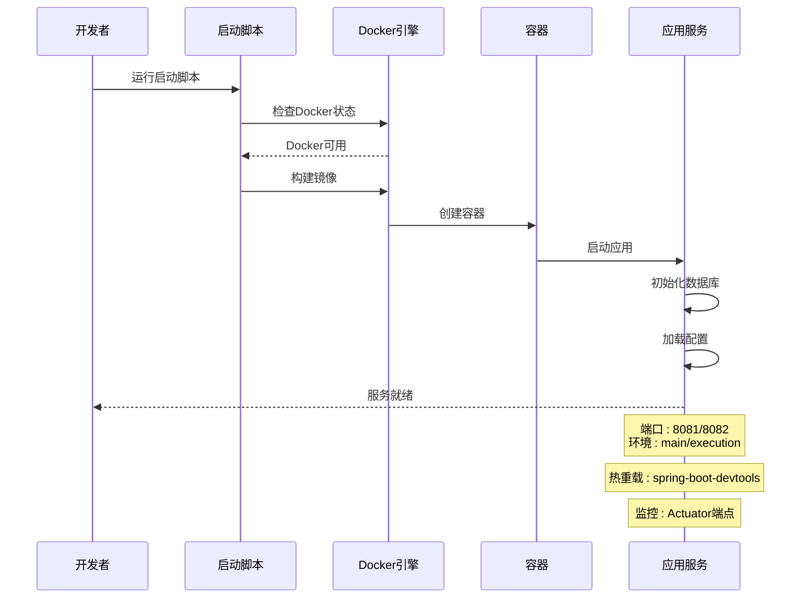

**图表来源**
- [后端启动脚本:1-159](file://med_ai_assistant_1.0_bs_backend/run-backend.bat#L1-L159)
- [pom.xml:167-173](file://med_ai_assistant_1.0_bs_backend/pom.xml#L167-L173)

## 详细组件分析

### 后端开发环境配置

#### Maven构建配置

后端项目使用Maven作为构建工具，配置了完整的开发环境支持：

| 配置类别 | 关键设置 | 功能描述 |
|---------|----------|----------|
| Java版本 | Java 21 | 最新长期支持版本 |
| Spring Profiles | main/execution | 多环境配置支持 |
| DevTools | spring-boot-devtools | 热重载支持 |
| 测试配置 | JUnit 5并行执行 | 提高测试效率 |
| 监控集成 | Micrometer + Prometheus | 指标收集 |

#### Docker容器配置

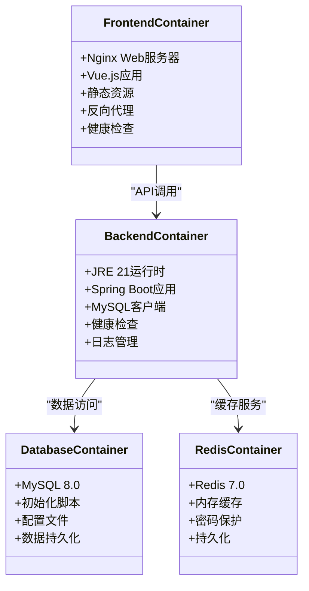

**图表来源**
- [Dockerfile:1-65](file://med_ai_assistant_1.0_bs_backend/Dockerfile#L1-L65)
- [Vue前端Dockerfile:1-30](file://med_ai_assistant_1.0_bs_vue/Dockerfile#L1-L30)

#### 开发工具链集成

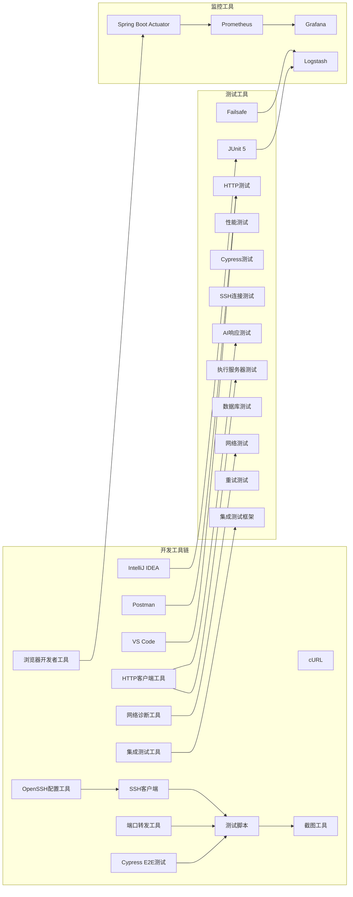

**图表来源**
- [pom.xml:167-191](file://med_ai_assistant_1.0_bs_backend/pom.xml#L167-L191)

**章节来源**
- [pom.xml:29-52](file://med_ai_assistant_1.0_bs_backend/pom.xml#L29-L52)
- [后端启动脚本:1-159](file://med_ai_assistant_1.0_bs_backend/run-backend.bat#L1-L159)

### 前端开发环境配置

#### Vue.js开发环境

前端项目基于Vue 3.2.13构建，配置了完整的开发工具链：

| 特性 | 技术栈 | 描述 |
|------|--------|------|
| 框架 | Vue 3.2.13 | 最新稳定版本 |
| UI库 | Element Plus 2.10.2 | 企业级组件库 |
| 状态管理 | Vuex 4.0.2 | 应用状态管理 |
| 路由 | Vue Router 4.5.1 | 单页应用路由 |
| HTTP客户端 | Axios 1.10.0 | 异步请求处理 |
| 构建工具 | Vue CLI 5.0 | 项目构建和开发服务器 |
| 测试框架 | Cypress 15.13.1 | 端到端测试 |

#### 开发服务器配置

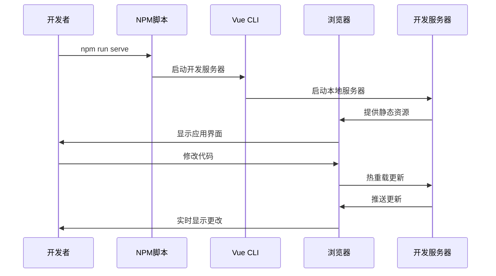

**图表来源**
- [package.json:5-9](file://med_ai_assistant_1.0_bs_vue/package.json#L5-L9)

**章节来源**
- [package.json:1-56](file://med_ai_assistant_1.0_bs_vue/package.json#L1-L56)
- [前端启动脚本:1-53](file://med_ai_assistant_1.0_bs_vue/start-frontend.bat#L1-L53)

### 测试环境配置

#### 测试脚本生态系统

项目提供了丰富的测试脚本，支持不同层面的功能验证：

| 测试类型 | 脚本文件 | 功能描述 |
|----------|----------|----------|
| 基础分离测试 | test-basic-separation.ps1 | 验证提交和轮询服务分离 |
| 状态一致性测试 | test-iteration3-status-consistency.http | 验证状态管理一致性 |
| 性能基准测试 | performance-benchmark.http | 系统性能评估 |
| 集成测试 | run-integration-tests.bat | 端到端功能测试 |
| 网络连通性测试 | check-network-connectivity.bat | 网络环境验证 |
| SSH连接测试 | config-sshd.ps1 | OpenSSH服务器配置验证 |
| AI响应测试 | ai-response-api-test.http | AI响应服务功能测试 |
| 执行服务器测试 | test-execution-server-comprehensive.http | 执行服务器功能测试 |
| 数据库连接测试 | test-oracle-connection.sh | Oracle数据库连接测试 |
| 集成测试环境验证 | test-integration-setup.bat | 集成测试环境配置验证 |

#### 测试环境隔离

```mermaid
graph TB
subgraph "测试环境隔离"
TEST_SERVER[测试服务器]
DEV_ENV[开发环境]
CI_ENV[CI环境]
PROD_ENV[生产环境]
E2E_ENV[E2E测试环境]
SSH_ENV[SSH测试环境]
AI_RESPONSE_ENV[AI响应测试环境]
EXECUTION_SERVER_ENV[执行服务器测试环境]
DATABASE_ENV[数据库测试环境]
NETWORK_ENV[网络测试环境]
INTEGRATION_ENV[集成测试环境]
end
subgraph "数据隔离"
TEST_DB[Test数据库]
DEV_DB[开发数据库]
CI_DB[CI数据库]
PROD_DB[生产数据库]
E2E_DB[E2E测试数据库]
SSH_DB[SSH测试数据库]
AI_RESPONSE_DB[AI响应测试数据库]
EXECUTION_SERVER_DB[执行服务器测试数据库]
DATABASE_DB[数据库测试数据库]
NETWORK_DB[网络测试数据库]
INTEGRATION_DB[集成测试数据库]
end
subgraph "配置隔离"
TEST_CONFIG[Test配置]
DEV_CONFIG[开发配置]
CI_CONFIG[CI配置]
PROD_CONFIG[生产配置]
E2E_CONFIG[E2E测试配置]
SSH_CONFIG[SSH配置]
AI_RESPONSE_CONFIG[AI响应配置]
EXECUTION_SERVER_CONFIG[执行服务器配置]
DATABASE_CONFIG[数据库配置]
NETWORK_CONFIG[网络配置]
INTEGRATION_CONFIG[集成配置]
end
TEST_SERVER --> TEST_DB
TEST_SERVER --> TEST_CONFIG
DEV_ENV --> DEV_DB
DEV_ENV --> DEV_CONFIG
CI_ENV --> CI_DB
CI_ENV --> CI_CONFIG
PROD_ENV --> PROD_DB
PROD_ENV --> PROD_CONFIG
E2E_ENV --> E2E_DB
E2E_ENV --> E2E_CONFIG
SSH_ENV --> SSH_DB
SSH_ENV --> SSH_CONFIG
AI_RESPONSE_ENV --> AI_RESPONSE_DB
AI_RESPONSE_ENV --> AI_RESPONSE_CONFIG
EXECUTION_SERVER_ENV --> EXECUTION_SERVER_DB
EXECUTION_SERVER_ENV --> EXECUTION_SERVER_CONFIG
DATABASE_ENV --> DATABASE_DB
DATABASE_ENV --> DATABASE_CONFIG
NETWORK_ENV --> NETWORK_DB
NETWORK_ENV --> NETWORK_CONFIG
INTEGRATION_ENV --> INTEGRATION_DB
INTEGRATION_ENV --> INTEGRATION_CONFIG
```

**图表来源**
- [基本分离验证脚本:1-92](file://med_ai_assistant_1.0_bs_backend/test-scripts/test-basic-separation.ps1#L1-92)
- [状态一致性测试脚本:1-111](file://med_ai_assistant_1.0_bs_backend/test-scripts/test-iteration3-status-consistency.http#L1-111)

**章节来源**
- [基本分离验证脚本:1-92](file://med_ai_assistant_1.0_bs_backend/test-scripts/test-basic-separation.ps1#L1-92)
- [状态一致性测试脚本:1-111](file://med_ai_assistant_1.0_bs_backend/test-scripts/test-iteration3-status-consistency.http#L1-111)

## 前端自动化测试框架

### Cypress E2E测试配置

项目集成了Cypress前端自动化测试框架，提供完整的端到端测试能力：

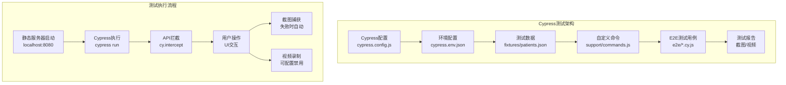

**图表来源**
- [Cypress配置:26-86](file://med_ai_assistant_1.0_bs_vue/cypress.config.js#L26-L86)
- [Cypress全局支持文件:14-14](file://med_ai_assistant_1.0_bs_vue/cypress/support/e2e.js#L14-L14)

### 测试配置详解

#### 基础配置参数

| 配置项 | 值 | 描述 |
|--------|-----|------|
| baseUrl | http://localhost:8080 | 应用基础URL |
| specPattern | cypress/e2e/**/*.cy.{js,jsx} | 测试文件匹配模式 |
| supportFile | cypress/support/e2e.js | 支持文件路径 |
| viewportWidth | 1280 | 浏览器视口宽度（像素） |
| viewportHeight | 720 | 浏览器视口高度（像素） |
| defaultCommandTimeout | 10000 | 命令超时时间（毫秒） |
| responseTimeout | 30000 | 响应超时时间（毫秒） |

#### 环境变量配置

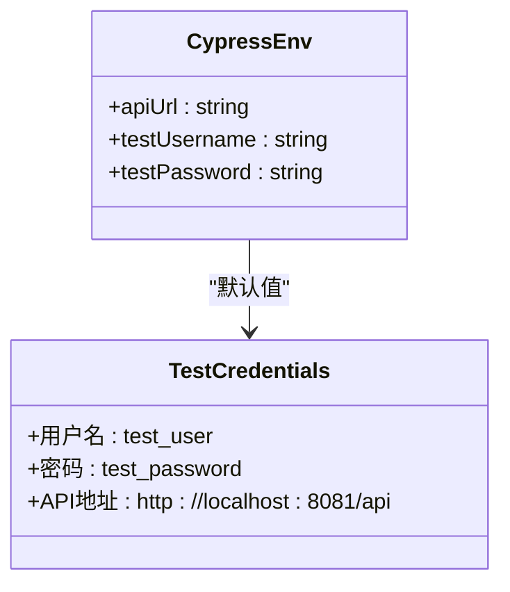

**图表来源**
- [Cypress配置:80-84](file://med_ai_assistant_1.0_bs_vue/cypress.config.js#L80-L84)
- [Cypress环境配置示例:1-6](file://med_ai_assistant_1.0_bs_vue/cypress.env.json.example#L1-L6)

#### 自定义命令系统

Cypress提供了丰富的自定义命令，简化测试代码：

| 命令类型 | 命令名称 | 功能描述 |
|----------|----------|----------|
| 登录操作 | cy.login() | 通过UI执行完整登录流程 |
| API等待 | cy.waitForApi() | 等待指定API请求完成 |
| 模拟登录 | cy.mockLogin() | 直接设置localStorage模拟登录 |
| 页面导航 | cy.navigateTo() | 导航到指定路由并等待加载 |
| 断言辅助 | 自动断言 | 预定义的元素存在性检查 |

**章节来源**
- [Cypress配置:26-86](file://med_ai_assistant_1.0_bs_vue/cypress.config.js#L26-L86)
- [Cypress自定义命令:23-137](file://med_ai_assistant_1.0_bs_vue/cypress/support/commands.js#L23-L137)

### 测试用例覆盖范围

#### 登录页面测试

涵盖登录页面的所有关键功能：

| 测试场景 | 测试用例 | 验证点 |
|----------|----------|--------|
| 页面加载 | 正确加载登录页面 | UI元素存在性 |
| 用户名输入 | 支持用户名输入和清除 | 输入功能验证 |
| 密码输入 | 支持密码输入 | 类型验证 |
| 科室加载 | 用户名输入后自动加载 | 异步数据加载 |
| 登录流程 | 完整登录流程 | 跳转验证 |
| 错误处理 | 未选择科室错误 | 提示信息验证 |
| 登录失败 | API返回401错误 | 错误提示验证 |
| 退出功能 | 点击退出按钮 | 状态清除验证 |

#### 待办事项测试

验证待办事项页面的完整功能：

| 测试场景 | 测试用例 | 验证点 |
|----------|----------|--------|
| 页面加载 | 正确加载待办页面 | 布局验证 |
| 卡片渲染 | 病人卡片正确渲染 | 数据绑定 |
| 详情显示 | 点击卡片显示详情 | 交互验证 |
| 日期筛选 | 日期选择器功能 | 筛选逻辑 |
| 维度切换 | 筛选维度切换 | 状态管理 |
| 空状态 | 无数据时的显示 | 空状态处理 |
| 原始记录 | 病历记录按钮功能 | 对话框显示 |
| 时间排序 | 待办事项按时间排序 | 排序逻辑 |

#### AI诊断测试

覆盖AI诊断相关功能：

| 测试场景 | 测试用例 | 验证点 |
|----------|----------|--------|
| 页面加载 | AI诊断页面正确加载 | 路由验证 |
| 导航功能 | 从患者列表导航 | 页面跳转 |
| 诊断信息 | 患者诊断信息加载 | 数据获取 |
| 切换患者 | 切换患者时数据更新 | 状态同步 |
| 选中状态 | 选中状态持久化 | 本地存储 |
| 状态样式 | 不同状态显示不同样式 | 样式应用 |

**章节来源**
- [登录页面E2E测试:9-283](file://med_ai_assistant_1.0_bs_vue/cypress/e2e/login.cy.js#L9-L283)
- [待办事项页面E2E测试:9-344](file://med_ai_assistant_1.0_bs_vue/cypress/e2e/todo.cy.js#L9-L344)
- [AI诊断页面E2E测试:9-414](file://med_ai_assistant_1.0_bs_vue/cypress/e2e/ai-diagnosis.cy.js#L9-L414)

### 测试数据管理

#### 测试数据结构

测试使用统一的fixture数据结构：

| 数据类别 | 文件路径 | 数据用途 |
|----------|----------|----------|
| 患者列表 | fixtures/patients.json | 患者信息数据 |
| 科室信息 | fixtures/patients.json | 用户科室列表 |
| 待办事项 | fixtures/patients.json | 待办任务数据 |
| 诊断信息 | fixtures/patients.json | 病人诊断数据 |
| 用户信息 | fixtures/patients.json | 登录用户数据 |

#### 数据准备策略

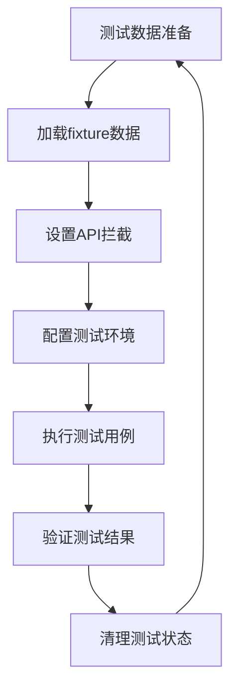

**图表来源**
- [Cypress测试数据:1-154](file://med_ai_assistant_1.0_bs_vue/cypress/fixtures/patients.json#L1-L154)

**章节来源**
- [Cypress测试数据:1-154](file://med_ai_assistant_1.0_bs_vue/cypress/fixtures/patients.json#L1-L154)

### 测试执行和报告

#### 测试执行配置

| 执行模式 | 命令 | 特点 |
|----------|------|------|
| 命令行执行 | npm run test:e2e | 非交互模式 |
| 图形界面 | npm run test:e2e:open | 交互模式 |
| CI集成 | cypress run | 自动化执行 |

#### 截图和视频配置

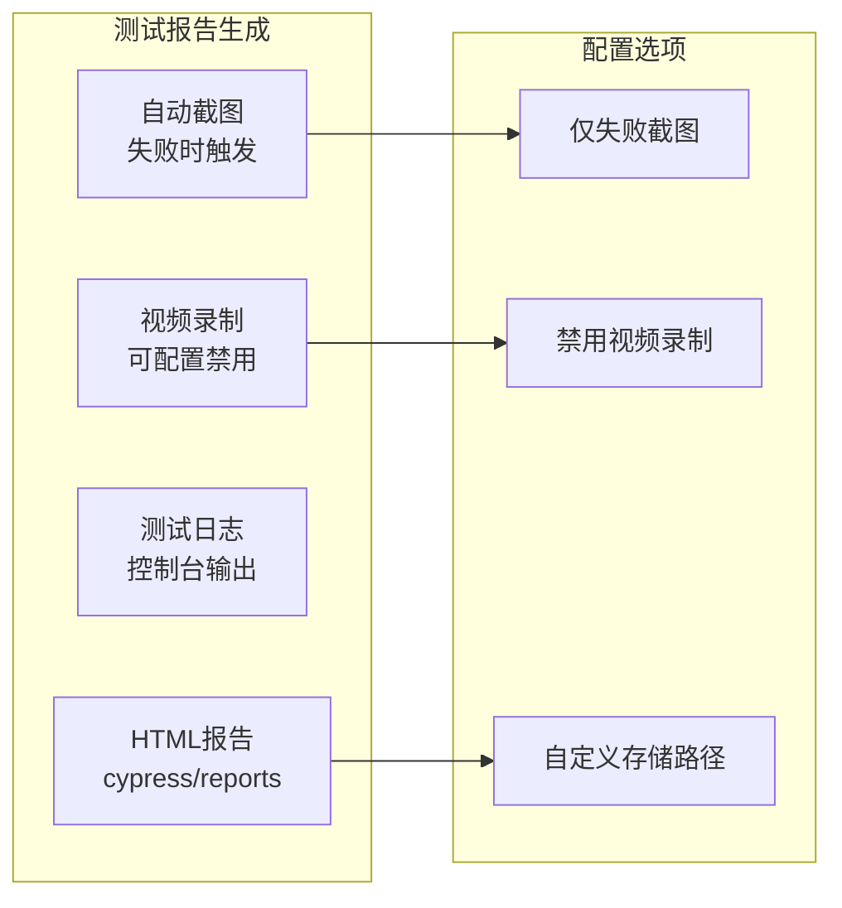

**图表来源**
- [Cypress配置:57-63](file://med_ai_assistant_1.0_bs_vue/cypress.config.js#L57-L63)

**章节来源**
- [Cypress配置:57-86](file://med_ai_assistant_1.0_bs_vue/cypress.config.js#L57-L86)

## 端口转发自动化脚本

### 脚本概述

项目新增了端口转发自动化脚本，专门用于解决远程开发环境与本地服务之间的网络连接问题。该脚本通过Windows系统的netsh命令实现端口转发功能，确保远程开发环境能够无缝访问本地运行的服务。

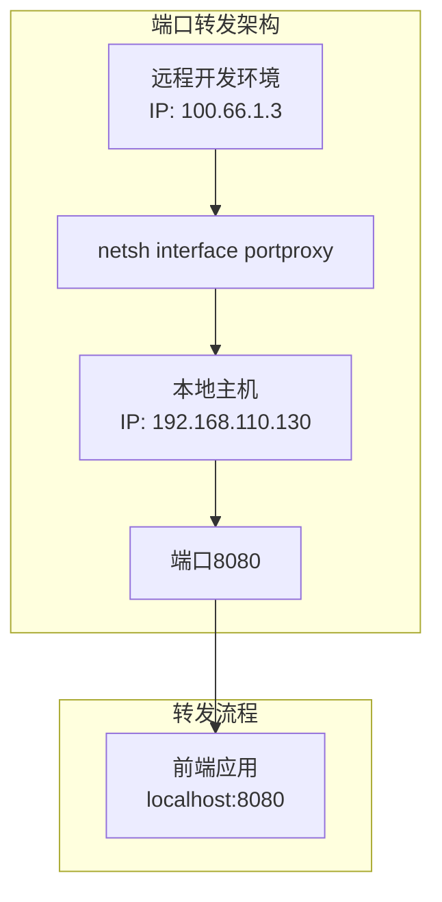

**图表来源**
- [端口转发脚本:1-5](file://scripts/medai-port-forward.bat#L1-L5)

### 脚本配置详解

#### 基础配置参数

| 参数 | 值 | 描述 |
|------|-----|------|
| 监听地址 | 0.0.0.0 | 监听所有网络接口 |
| 监听端口 | 8080 | 远程访问端口 |
| 连接地址 | 192.168.110.130 | 本地主机IP地址 |
| 连接端口 | 8080 | 本地服务端口 |
| 转发协议 | v4tov4 | IPv4到IPv4转发 |

#### 转发规则说明

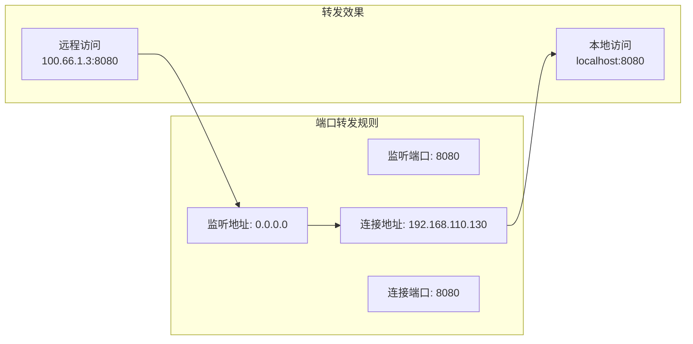

**图表来源**
- [端口转发脚本:3-4](file://scripts/medai-port-forward.bat#L3-L4)

### 使用场景和优势

#### 主要应用场景

1. **远程开发环境**：开发人员在远程服务器上进行开发工作
2. **本地服务访问**：需要访问本地运行的前端开发服务器
3. **团队协作**：多人协作开发时的网络资源共享
4. **测试环境**：模拟真实生产环境的网络连接

#### 技术优势

| 优势 | 说明 |
|------|------|
| 自动化配置 | 一键启动，无需手动配置网络 |
| 稳定可靠 | Windows系统原生命令，稳定性高 |
| 性能优化 | 零额外开销，直接网络转发 |
| 易于维护 | 简单的批处理脚本，易于理解和修改 |
| 跨平台兼容 | 仅需Windows系统支持 |

### 配置管理和维护

#### 脚本管理

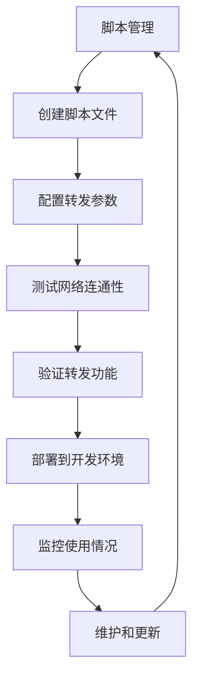

**图表来源**
- [端口转发脚本:1-5](file://scripts/medai-port-forward.bat#L1-L5)

#### 环境适配

| 环境类型 | 配置调整 | 说明 |
|----------|----------|------|
| 开发环境 | 本地IP地址 | 使用127.0.0.1或本机IP |
| 测试环境 | 测试服务器IP | 使用测试环境的服务器地址 |
| 生产环境 | 生产服务器IP | 使用生产环境的真实地址 |
| 远程环境 | 远程服务器IP | 使用远程开发服务器地址 |

**章节来源**
- [端口转发脚本:1-5](file://scripts/medai-port-forward.bat#L1-L5)

## OpenSSH服务器配置

### 脚本概述

项目新增了完整的OpenSSH服务器配置脚本，专门用于自动化Windows OpenSSH服务器的安装和配置。该脚本提供了两套解决方案：完整的安装配置脚本和增量配置脚本，满足不同场景下的需求。

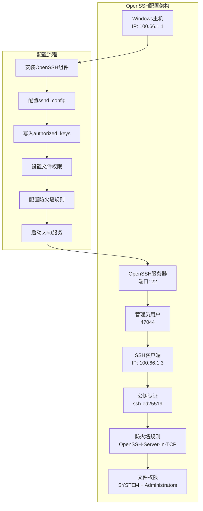

**图表来源**
- [OpenSSH配置脚本:1-34](file://scripts/config-ssh.ps1#L1-L34)
- [OpenSSH安装脚本:1-86](file://scripts/setup-ssh.ps1#L1-L86)

### 完整安装配置脚本

#### setup-ssh.ps1功能详解

setup-ssh.ps1是一个完整的OpenSSH服务器安装和配置脚本，包含六个主要步骤：

| 步骤 | 功能 | 详细说明 |
|------|------|----------|
| 1 | 安装OpenSSH服务器 | 检测Windows能力，自动安装OpenSSH.Server组件 |
| 2 | 配置sshd_config | 更新PubkeyAuthentication和PasswordAuthentication设置 |
| 3 | 写入authorized_keys | 创建管理员公钥认证文件 |
| 4 | 设置文件权限 | 配置SYSTEM和Administrators的完全权限 |
| 5 | 配置防火墙规则 | 添加OpenSSH-Server-In-TCP防火墙规则 |
| 6 | 启动sshd服务 | 设置自动启动并启动服务 |

#### 配置参数详解

```mermaid
flowchart TD
CFG_PARAMS[配置参数] --> PUBKEY_AUTH[PubkeyAuthentication yes]
CFG_PARAMS --> PASS_AUTH[PasswordAuthentication yes]
CFG_PARAMS --> SUBSYSTEM[Subsystem sftp sftp-server.exe]
CFG_PARAMS --> FIREWALL_RULE[防火墙规则: 22/TCP]
CFG_PARAMS --> SERVICE_TYPE[服务启动类型: Automatic]
CFG_PARAMS --> SERVICE_STATUS[服务状态: Running]
end
```

**图表来源**
- [OpenSSH安装脚本:28-44](file://scripts/setup-ssh.ps1#L28-L44)
- [OpenSSH安装脚本:63-69](file://scripts/setup-ssh.ps1#L63-L69)
- [OpenSSH安装脚本:73-74](file://scripts/setup-ssh.ps1#L73-L74)

### 增量配置脚本

#### config-ssh.ps1功能详解

config-ssh.ps1是一个增量配置脚本，适用于已经安装OpenSSH组件的环境：

| 功能 | 实现方式 | 说明 |
|------|----------|------|
| 更新sshd_config | 正则表达式替换 | 启用公钥认证和密码认证 |
| 写入authorized_keys | 直接文件写入 | 使用预定义的公钥 |
| 设置权限 | icacls命令 | 配置SYSTEM和Administrators权限 |
| 防火墙配置 | Get-NetFirewallRule检查 | 自动添加防火墙规则 |
| 服务重启 | Restart-Service命令 | 重启sshd服务 |

#### 公钥认证配置

脚本使用Ed25519格式的公钥进行认证：

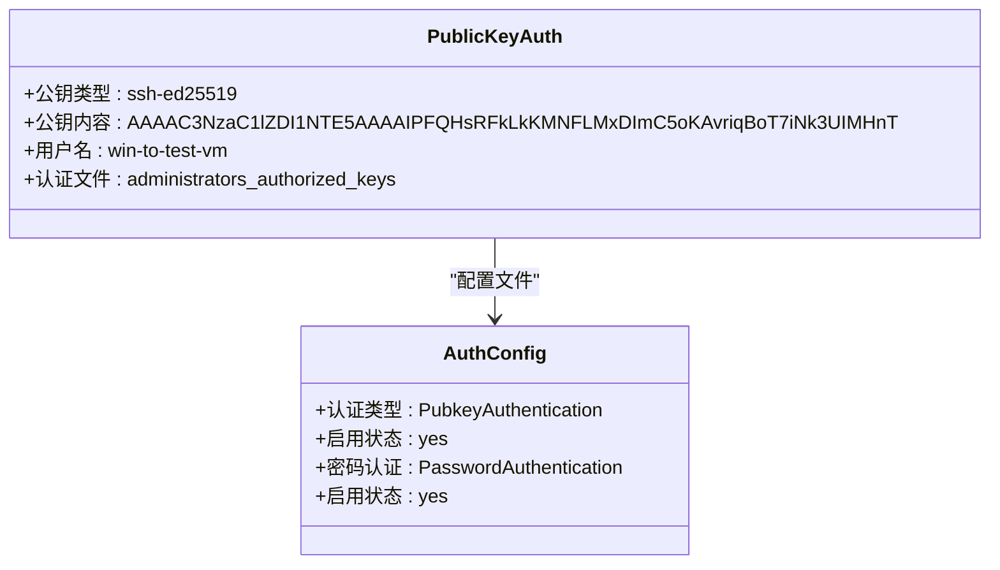

**图表来源**
- [OpenSSH配置脚本:3-4](file://scripts/config-ssh.ps1#L3-L4)
- [OpenSSH安装脚本:51](file://scripts/setup-ssh.ps1#L51)

### 使用场景和优势

#### 主要应用场景

1. **远程开发环境**：开发人员通过SSH安全访问Windows开发服务器
2. **自动化部署**：CI/CD流水线中的远程服务器配置
3. **测试环境**：模拟生产环境的SSH访问能力
4. **运维管理**：远程服务器管理和维护

#### 技术优势

| 优势 | 说明 |
|------|------|
| 自动化安装 | 一键安装OpenSSH组件 |
| 安全认证 | 支持公钥认证和密码认证 |
| 权限管理 | 精细的文件权限控制 |
| 防火墙集成 | 自动配置防火墙规则 |
| 服务管理 | 自动启动和状态监控 |
| 兼容性强 | 支持多种Windows版本 |

### 配置管理和维护

#### 脚本管理策略

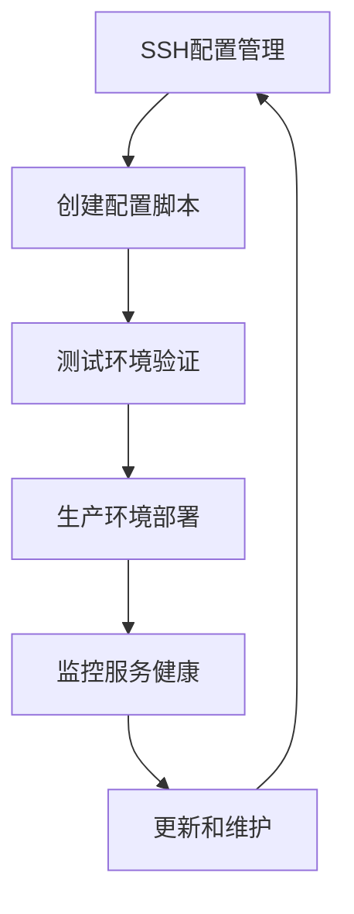

**图表来源**
- [OpenSSH配置脚本:1-34](file://scripts/config-ssh.ps1#L1-L34)
- [OpenSSH安装脚本:1-86](file://scripts/setup-ssh.ps1#L1-L86)

#### 环境适配策略

| 环境类型 | 配置调整 | 说明 |
|----------|----------|------|
| 开发环境 | 本地IP地址 | 使用127.0.0.1或本机IP |
| 测试环境 | 测试服务器IP | 使用测试环境的服务器地址 |
| 生产环境 | 生产服务器IP | 使用生产环境的真实地址 |
| 远程环境 | 远程服务器IP | 使用远程开发服务器地址 |

**章节来源**
- [OpenSSH配置脚本:1-34](file://scripts/config-ssh.ps1#L1-L34)
- [OpenSSH安装脚本:1-86](file://scripts/setup-ssh.ps1#L1-L86)

## AI响应服务测试基础设施

### 测试指南概述

项目新增了完整的AI响应服务测试基础设施，提供详细的HTTP测试脚本和集成测试配置，涵盖AI响应处理的各个方面。

```mermaid
graph TB
subgraph "AI响应测试架构"
AI_RESPONSE_TESTS[AI响应测试套件]
DNS_FIX_TESTS[DNS问题测试]
NETWORK_RECOVERY_TESTS[网络恢复测试]
RETRY_INTEGRATION_TESTS[重试机制测试]
BASELINE_TESTS[基础功能测试]
PARAMETER_TESTS[参数边界测试]
ERROR_HANDLING_TESTS[错误处理测试]
PERFORMANCE_TESTS[性能测试]
end
subgraph "测试执行流程"
TEST_EXECUTOR[测试执行器]
HTTP_CLIENT[HTTP客户端]
AI_SERVICE[AI响应服务]
DEEPSEEK_API[DeepSeek API]
TEST_REPORT[测试报告生成器]
end
AI_RESPONSE_TESTS --> DNS_FIX_TESTS
AI_RESPONSE_TESTS --> NETWORK_RECOVERY_TESTS
AI_RESPONSE_TESTS --> RETRY_INTEGRATION_TESTS
DNS_FIX_TESTS --> TEST_EXECUTOR
NETWORK_RECOVERY_TESTS --> TEST_EXECUTOR
RETRY_INTEGRATION_TESTS --> TEST_EXECUTOR
TEST_EXECUTOR --> HTTP_CLIENT
HTTP_CLIENT --> AI_SERVICE
AI_SERVICE --> DEEPSEEK_API
TEST_EXECUTOR --> TEST_REPORT
```

**图表来源**
- [AI响应服务接口测试指南:1-200](file://med_ai_assistant_1.0_bs_backend/test-scripts/README-AI-RESPONSE-TEST.md#L1-L200)

### 测试文件分类

#### 基础功能测试

涵盖AI响应服务的核心功能：

| 测试类别 | 测试文件 | 测试用例数量 | 功能覆盖 |
|----------|----------|--------------|----------|
| 基础功能测试 | ai-response-api-test.http | 20个 | 非流式响应、流式响应、思维链模型、院内AI模型、多轮对话 |
| DNS问题测试 | ai-response-dns-fix-test.http | 5个 | DNS解析失败诊断、最小化参数测试、模型切换测试 |
| 网络恢复测试 | ai-response-network-recovery-test.http | 10个 | 健康检查、重试机制验证、性能验证、错误场景验证 |
| 重试机制测试 | ai-response-retry-integration-test.http | 15个 | 重试配置验证、指数退避策略、最大重试次数、错误处理 |

#### 参数边界测试

验证AI响应参数的边界条件：

| 测试类型 | 参数 | 最小值 | 最大值 | 预期行为 |
|----------|------|--------|--------|----------|
| temperature参数 | temperature | 0.0 | 2.0 | 超出范围应返回验证错误 |
| max_tokens参数 | max_tokens | 1 | 4096 | 超出范围应返回验证错误 |
| 完整参数组合 | 多参数组合 | 各自边界值 | 各自边界值 | 应返回正常响应 |

#### 错误处理测试

验证AI响应服务的错误处理能力：

| 错误类型 | 测试场景 | 预期响应 | 验证点 |
|----------|----------|----------|--------|
| 不支持的模型 | 使用不存在的模型 | 400错误 | 错误代码和消息验证 |
| 空消息列表 | messages为空数组 | 400错误 | 参数验证错误 |
| 缺少必填参数 | 缺少model或messages | 400错误 | 参数完整性验证 |
| 参数超出范围 | temperature>2.0或max_tokens>4096 | 400错误 | 参数范围验证 |

#### 性能测试

评估AI响应服务的性能表现：

| 测试场景 | 文本长度 | 预期响应时间 | 验证指标 |
|----------|----------|--------------|----------|
| 长文本处理 | 500+字符 | <30秒 | 响应时间、吞吐量 |
| 医学术语解释 | 300+字符 | <25秒 | 术语理解准确性 |
| 治疗方案建议 | 400+字符 | <35秒 | 建议合理性 |
| 复杂推理测试 | 600+字符 | <45秒 | 推理逻辑正确性 |

### 测试执行流程

#### 基础测试执行

```mermaid
sequenceDiagram
participant TESTER as 测试执行者
participant DNS_TEST as DNS测试
participant BASE_TEST as 基础测试
participant PERF_TEST as 性能测试
TESTER->>DNS_TEST : 执行DNS问题诊断
DNS_TEST-->>TESTER : 返回DNS状态
TESTER->>BASE_TEST : 执行基础功能测试
BASE_TEST-->>TESTER : 返回测试结果
TESTER->>PERF_TEST : 执行性能基准测试
PERF_TEST-->>TESTER : 返回性能指标
```

**图表来源**
- [AI响应DNS问题测试文件:1-86](file://med_ai_assistant_1.0_bs_backend/test-scripts/ai-response-dns-fix-test.http#L1-L86)
- [AI响应服务接口测试文件:1-356](file://med_ai_assistant_1.0_bs_backend/test-scripts/ai-response-api-test.http#L1-L356)

#### 网络恢复测试流程

```mermaid
flowchart TD
NETWORK_TEST[网络恢复测试] --> HEALTH_CHECK[健康检查]
HEALTH_CHECK --> STREAM_TEST[流式响应测试]
STREAM_TEST --> NON_STREAM_TEST[非流式响应测试]
NON_STREAM_TEST --> NETWORK_INTERRUPT[模拟网络中断]
NETWORK_INTERRUPT --> RECOVERY_CHECK[网络恢复检查]
RECOVERY_CHECK --> RETRY_MECHANISM[重试机制验证]
RETRY_MECHANISM --> PERFORMANCE_VERIFY[性能验证]
PERFORMANCE_VERIFY --> ERROR_SCENARIO[错误场景验证]
ERROR_SCENARIO --> MONITORING[监控指标验证]
MONITORING --> LOG_VALIDATION[日志验证]
LOG_VALIDATION --> NETWORK_TEST
```

**图表来源**
- [AI响应网络恢复测试文件:1-100](file://med_ai_assistant_1.0_bs_backend/test-scripts/ai-response-network-recovery-test.http#L1-L100)

### 常见问题解决方案

#### DNS解析失败问题

**症状表现：**
```json
{
  "error": "Stream Error",
  "message": "Failed to resolve 'api.deepseek.com' after 2 queries",
  "code": "STREAM_ERROR"
}
```

**解决方案：**
1. **检查网络连接**：使用ping和nslookup命令验证网络连通性
2. **修改DNS服务器**：使用Google DNS(8.8.8.8)、国内DNS(114.114.114.114)或Cloudflare DNS(1.1.1.1)
3. **使用代理**：在系统环境变量中设置HTTP_PROXY和HTTPS_PROXY
4. **检查防火墙设置**：确保防火墙未阻止对api.deepseek.com的访问

#### DeepSeek API路径配置错误

**症状：** API调用失败，可能返回404或认证错误
**原因：** DeepSeek API的正确路径应为 `/v1/chat/completions`，而不是 `/chat/completions`
**解决方案：** 已修正 `ai-models.properties` 中的所有DeepSeek API URL

#### WebFlux阻塞操作错误

**症状：** `block()/blockFirst()/blockLast() are blocking, which is not supported in thread reactor-http-nio-2`
**原因：** 在响应式编程中使用了阻塞操作
**解决方案：** 已修复 `handleNonStreamResponse` 方法，使用 `flatMapMany` 替代 `block()`

### 预期响应格式

#### 成功响应(非流式)

```json
{
  "reasoning_content": "AI推理过程内容",
  "content": "AI生成的主要回答内容", 
  "error": null
}
```

#### 成功响应(流式)

```
{"content": "部分内容", "reasoning_content": "部分推理"}
{"content": "更多内容", "reasoning_content": "更多推理"}
[DONE]
```

#### 错误响应

```json
{
  "error": "错误描述",
  "message": "详细错误信息",
  "code": "错误代码"
}
```

**章节来源**
- [AI响应服务接口测试指南:1-200](file://med_ai_assistant_1.0_bs_backend/test-scripts/README-AI-RESPONSE-TEST.md#L1-L200)
- [AI响应服务接口测试文件:1-356](file://med_ai_assistant_1.0_bs_backend/test-scripts/ai-response-api-test.http#L1-L356)
- [AI响应DNS问题测试文件:1-86](file://med_ai_assistant_1.0_bs_backend/test-scripts/ai-response-dns-fix-test.http#L1-L86)
- [AI响应网络恢复测试文件:1-100](file://med_ai_assistant_1.0_bs_backend/test-scripts/ai-response-network-recovery-test.http#L1-L100)
- [AI响应重试机制集成测试文件:1-152](file://med_ai_assistant_1.0_bs_backend/test-scripts/ai-response-retry-integration-test.http#L1-L152)

## 执行服务器功能测试

### 测试概述

项目新增了完整的执行服务器功能测试，涵盖轮询服务、LLM调用统计和错误处理等多个方面。

```mermaid
graph TB
subgraph "执行服务器测试架构"
EXECUTION_SERVER_TESTS[执行服务器测试套件]
HEALTH_CHECK_TESTS[健康检查测试]
POLLING_SERVICE_TESTS[轮询服务测试]
STATISTICS_TESTS[统计信息测试]
ERROR_HANDLING_TESTS[错误处理测试]
PERFORMANCE_TESTS[性能测试]
end
subgraph "测试执行流程"
TEST_EXECUTOR[测试执行器]
EXECUTION_SERVER[执行服务器]
POLLING_SERVICE[轮询服务]
LLM_SERVICE[LLM调用服务]
STATS_COLLECTOR[统计收集器]
TEST_REPORT[测试报告]
end
EXECUTION_SERVER_TESTS --> HEALTH_CHECK_TESTS
EXECUTION_SERVER_TESTS --> POLLING_SERVICE_TESTS
EXECUTION_SERVER_TESTS --> STATISTICS_TESTS
EXECUTION_SERVER_TESTS --> ERROR_HANDLING_TESTS
EXECUTION_SERVER_TESTS --> PERFORMANCE_TESTS
TEST_EXECUTOR --> EXECUTION_SERVER
EXECUTION_SERVER --> POLLING_SERVICE
EXECUTION_SERVER --> LLM_SERVICE
EXECUTION_SERVER --> STATS_COLLECTOR
TEST_EXECUTOR --> TEST_REPORT
```

**图表来源**
- [执行服务器综合功能测试文件:1-144](file://med_ai_assistant_1.0_bs_backend/test-scripts/test-execution-server-comprehensive.http#L1-L144)

### 健康检查测试

验证执行服务器的基本健康状态：

| 测试用例 | 接口 | 请求方法 | 预期响应 | 验证点 |
|----------|------|----------|----------|--------|
| 健康检查 | /api/execute/health | GET | 200 OK | 服务器运行状态 |
| 信息获取 | /api/execute/info | GET | 200 OK | 服务器配置信息 |
| 服务状态 | /api/execute/status | GET | 200 OK | 当前服务状态 |

### 轮询服务测试

验证轮询服务的启动、停止和状态管理：

| 测试用例 | 接口 | 请求方法 | 预期响应 | 验证点 |
|----------|------|----------|----------|--------|
| 启动轮询服务 | /api/execute/start | POST | 200 OK 或 409 Conflict | 服务启动功能 |
| 检查轮询状态 | /api/execute/status | GET | 200 OK | 状态查询功能 |
| 停止轮询服务 | /api/execute/stop | POST | 200 OK 或 409 Conflict | 服务停止功能 |
| 服务状态确认 | /api/execute/status | GET | 200 OK | 状态确认功能 |

### 统计信息测试

验证LLM调用统计和性能分析功能：

| 测试用例 | 接口 | 请求方法 | 预期响应 | 验证点 |
|----------|------|----------|----------|--------|
| LLM统计信息 | /api/execute/llm-stats | GET | 200 OK | 统计信息查询 |
| 轮询统计信息 | /api/execute/polling-stats | GET | 200 OK | 轮询统计查询 |
| LLM性能分析 | /api/execute/llm-performance-analysis | GET | 200 OK | 性能分析报告 |
| LLM调用历史 | /api/execute/llm-call-history | GET | 200 OK | 历史记录查询 |
| 统计信息重置 | /api/execute/reset-llm-stats | POST | 200 OK | 统计重置功能 |

### 错误处理测试

验证执行服务器的错误处理机制：

| 测试用例 | 接口 | 请求方法 | 预期响应 | 验证点 |
|----------|------|----------|----------|--------|
| 无效请求 | /api/execute/start | POST | 400 Bad Request | 参数验证 |
| 重复启动 | /api/execute/start | POST | 409 Conflict | 幂等性处理 |
| 重复停止 | /api/execute/stop | POST | 409 Conflict | 状态冲突处理 |
| 边界条件测试 | /api/execute/llm-call-history | GET | 200 OK | 参数边界处理 |

### 性能测试

评估执行服务器的性能表现：

| 测试场景 | 测试内容 | 预期指标 | 验证方法 |
|----------|----------|----------|----------|
| 大量历史记录 | limit=100 | 响应时间<5秒 | 性能基准测试 |
| 少量历史记录 | limit=1 | 响应时间<2秒 | 响应时间测量 |
| 连续操作测试 | 10次连续请求 | 平均响应时间<3秒 | 压力测试 |
| 并发访问测试 | 5个并发请求 | 无响应超时 | 并发测试 |

### 数据轮询测试

验证执行服务器的数据处理服务：

| 测试用例 | 接口 | 请求方法 | 预期响应 | 验证点 |
|----------|------|----------|----------|--------|
| 启动数据处理服务 | /api/execute/start-service | POST | 200 OK | 服务启动 |
| 获取服务状态 | /api/execute/service-status | GET | 200 OK | 状态查询 |
| 停止数据处理服务 | /api/execute/stop-service | POST | 200 OK | 服务停止 |
| 健康检查 | /api/execute/health | GET | 200 OK | 服务器健康 |
| LLM统计信息 | /api/execute/llm-statistics | GET | 200 OK | 统计查询 |

**章节来源**
- [执行服务器综合功能测试文件:1-144](file://med_ai_assistant_1.0_bs_backend/test-scripts/test-execution-server-comprehensive.http#L1-L144)
- [执行服务器数据轮询测试文件:1-18](file://med_ai_assistant_1.0_bs_backend/test-scripts/test-execution-server-polling.http#L1-L18)

## 数据库连接验证测试

### Oracle数据库连接测试

项目新增了专门的Oracle数据库连接测试脚本，提供完整的连接验证功能。

```mermaid
graph TB
subgraph "Oracle数据库测试架构"
DATABASE_TESTS[数据库连接测试]
CONNECTION_TEST[连接测试]
DRIVER_TEST[驱动测试]
NETWORK_TEST[网络测试]
CONFIG_TEST[配置测试]
TEST_REPORT[测试报告]
end
subgraph "测试执行流程"
TEST_SCRIPT[测试脚本]
ORACLE_SERVER[Oracle数据库服务器]
CONNECTION_POOL[连接池]
TEST_RESULT[测试结果]
end
DATABASE_TESTS --> CONNECTION_TEST
DATABASE_TESTS --> DRIVER_TEST
DATABASE_TESTS --> NETWORK_TEST
DATABASE_TESTS --> CONFIG_TEST
TEST_SCRIPT --> ORACLE_SERVER
ORACLE_SERVER --> CONNECTION_POOL
TEST_SCRIPT --> TEST_RESULT
TEST_RESULT --> TEST_REPORT
```

**图表来源**
- [Oracle数据库连接测试脚本:1-50](file://med_ai_assistant_1.0_bs_backend/test-scripts/test-oracle-connection.sh#L1-L50)

### 连接参数配置

| 参数类别 | 配置项 | 默认值 | 说明 |
|----------|--------|--------|------|
| 连接URL | jdbc:oracle:thin:@100.66.1.2:1521/FREE | Oracle数据库URL | 数据库连接字符串 |
| 用户名 | medai | 数据库用户名 | 访问数据库的用户名 |
| 密码 | medai | 数据库密码 | 访问数据库的密码 |
| JDBC驱动 | oracle.jdbc.OracleDriver | Oracle驱动类 | JDBC驱动程序类名 |

### 测试流程

#### 驱动检查

验证Oracle JDBC驱动的存在性和可用性：

```mermaid
flowchart TD
DRIVER_CHECK[驱动检查] --> DRIVER_EXISTS{ojdbc11.jar存在?}
DRIVER_EXISTS --> |是| DRIVER_FOUND[驱动存在]
DRIVER_EXISTS --> |否| DRIVER_NOT_FOUND[驱动不存在]
DRIVER_NOT_FOUND --> EXIT_FAILURE[退出并返回错误]
DRIVER_FOUND --> NETWORK_TEST[网络连通性测试]
```

**图表来源**
- [Oracle数据库连接测试脚本:18-24](file://med_ai_assistant_1.0_bs_backend/test-scripts/test-oracle-connection.sh#L18-L24)

#### 网络连通性测试

验证Oracle数据库服务器的网络可达性：

| 测试步骤 | 命令 | 预期结果 | 说明 |
|----------|------|----------|------|
| 1 | ping -c 1 -W 1 100.66.1.2 | 成功 | 检查主机连通性 |
| 2 | nc -z -w 1 100.66.1.2 1521 | 成功 | 检查端口连通性 |
| 3 | telnet 100.66.1.2 1521 | 成功 | 验证端口开放 |

#### 连接验证

验证完整的数据库连接功能：

```mermaid
sequenceDiagram
participant TEST_SCRIPT as 测试脚本
participant ORACLE_SERVER as Oracle服务器
participant CONNECTION_POOL as 连接池
TEST_SCRIPT->>ORACLE_SERVER : 发送连接请求
ORACLE_SERVER->>CONNECTION_POOL : 验证连接参数
CONNECTION_POOL->>ORACLE_SERVER : 建立数据库连接
ORACLE_SERVER-->>TEST_SCRIPT : 返回连接成功
TEST_SCRIPT->>ORACLE_SERVER : 执行测试查询
ORACLE_SERVER-->>TEST_SCRIPT : 返回查询结果
TEST_SCRIPT-->>TEST_SCRIPT : 生成测试报告
```

**图表来源**
- [Oracle数据库连接测试脚本:42-45](file://med_ai_assistant_1.0_bs_backend/test-scripts/test-oracle-connection.sh#L42-L45)

### 配置切换

提供多种Oracle数据库配置切换方法：

| 切换方法 | 命令示例 | 适用场景 |
|----------|----------|----------|
| 修改配置文件 | spring.datasource.type=oracle | 永久配置切换 |
| 命令行参数 | java -jar app.jar --spring.datasource.type=oracle | 临时配置切换 |
| 配置文件 | java -jar app.jar --spring.config.location=classpath:application-oracle.properties | 外部配置文件 |

**章节来源**
- [Oracle数据库连接测试脚本:1-50](file://med_ai_assistant_1.0_bs_backend/test-scripts/test-oracle-connection.sh#L1-L50)

## 网络连接诊断测试

### 诊断脚本概述

项目新增了专门的网络连接诊断脚本，提供全面的网络连通性检查功能。

```mermaid
graph TB
subgraph "网络诊断测试架构"
NETWORK_DIAGNOSTICS[网络诊断测试]
LOCAL_SERVER_TEST[本地服务器测试]
DNS_RESOLUTION_TEST[DNS解析测试]
NETWORK_CONNECTIVITY_TEST[网络连通性测试]
AI_SERVICE_TEST[AI服务测试]
SOLUTIONS[解决方案展示]
end
subgraph "诊断执行流程"
DIAGNOSTIC_SCRIPT[诊断脚本]
LOCAL_SERVER[本地服务器]
DEEPSEEK_API[DeepSeek API]
TEST_RESULT[诊断结果]
end
NETWORK_DIAGNOSTICS --> LOCAL_SERVER_TEST
NETWORK_DIAGNOSTICS --> DNS_RESOLUTION_TEST
NETWORK_DIAGNOSTICS --> NETWORK_CONNECTIVITY_TEST
NETWORK_DIAGNOSTICS --> AI_SERVICE_TEST
DIAGNOSTIC_SCRIPT --> LOCAL_SERVER
DIAGNOSTIC_SCRIPT --> DEEPSEEK_API
DIAGNOSTIC_SCRIPT --> TEST_RESULT
TEST_RESULT --> SOLUTIONS
```

**图表来源**
- [网络连接诊断脚本:1-67](file://med_ai_assistant_1.0_bs_backend/test-scripts/check-network-connectivity.bat#L1-L67)

### 诊断流程

#### 本地服务器状态检查

验证本地服务器的运行状态：

```mermaid
flowchart TD
LOCAL_SERVER_CHECK[本地服务器检查] --> PING_LOCAL[检查localhost:8081]
PING_LOCAL --> SERVER_RUNNING{服务器运行?}
SERVER_RUNNING --> |是| SERVER_OK[服务器正常]
SERVER_RUNNING --> |否| SERVER_FAILED[服务器无法访问]
SERVER_FAILED --> STOP_DIAGNOSIS[停止诊断]
SERVER_OK --> CONTINUE_DIAGNOSIS[继续诊断]
```

**图表来源**
- [网络连接诊断脚本:7-14](file://med_ai_assistant_1.0_bs_backend/test-scripts/check-network-connectivity.bat#L7-L14)

#### DNS解析测试

验证DNS解析的可用性：

| 测试步骤 | 命令 | 预期结果 | 说明 |
|----------|------|----------|------|
| 1 | nslookup api.deepseek.com | 成功 | 检查主DNS服务器 |
| 2 | nslookup api.deepseek.com 8.8.8.8 | 成功 | 检查备用DNS服务器 |
| 3 | ping -n 4 api.deepseek.com | 成功 | 检查网络连通性 |

#### AI服务功能测试

验证AI服务的基本功能：

```mermaid
flowchart TD
AI_SERVICE_TEST[AI服务测试] --> SEND_REQUEST[发送测试请求]
SEND_REQUEST --> CHECK_RESPONSE[检查响应内容]
CHECK_RESPONSE --> RESPONSE_VALID{响应有效?}
RESPONSE_VALID --> |是| AI_SERVICE_OK[AI服务正常]
RESPONSE_VALID --> |否| AI_SERVICE_FAILED[AI服务异常]
AI_SERVICE_FAILED --> SHOW_SOLUTIONS[显示解决方案]
AI_SERVICE_OK --> COMPLETE_DIAGNOSIS[诊断完成]
```

**图表来源**
- [网络连接诊断脚本:47-52](file://med_ai_assistant_1.0_bs_backend/test-scripts/check-network-connectivity.bat#L47-L52)

### 解决方案展示

提供针对不同网络问题的解决方案：

#### DNS问题解决方案

| 解决方案 | 命令示例 | 适用场景 |
|----------|----------|----------|
| 修改DNS服务器 | set DNS=8.8.8.8 | DNS解析失败 |
| 使用备用DNS | nslookup api.deepseek.com 114.114.114.114 | 主DNS服务器不可用 |
| 设置代理 | set HTTP_PROXY=http://proxy-server:port | 需要代理访问 |

#### 网络连通性解决方案

| 解决方案 | 命令示例 | 适用场景 |
|----------|----------|----------|
| 检查防火墙 | netsh advfirewall show allprofiles | 防火墙阻止访问 |
| 重启网络服务 | netsh winsock reset | 网络服务异常 |
| 切换网络环境 | 使用移动热点 | 网络环境问题 |

**章节来源**
- [网络连接诊断脚本:1-67](file://med_ai_assistant_1.0_bs_backend/test-scripts/check-network-connectivity.bat#L1-L67)

## 重试机制集成测试

### 测试概述

项目新增了完整的重试机制集成测试，验证AI响应服务在各种网络异常情况下的重试能力和稳定性。

```mermaid
graph TB
subgraph "重试机制测试架构"
RETRY_TESTS[重试机制测试]
RETRY_CONFIG_TESTS[重试配置测试]
EXPONENTIAL_BACKOFF_TESTS[指数退避测试]
MAX_RETRY_TESTS[最大重试次数测试]
ERROR_CONDITION_TESTS[错误条件测试]
RESPONSE_RETRY_TESTS[响应式重试测试]
ERROR_HANDLING_TESTS[错误处理测试]
LOG_OUTPUT_TESTS[日志输出测试]
PERFORMANCE_IMPACT_TESTS[性能影响测试]
RESOURCE_CLEANUP_TESTS[资源清理测试]
CONCURRENT_TESTS[并发测试]
CONFIG_TESTS[配置测试]
MONITORING_TESTS[监控测试]
INTEGRATION_EFFECT_TESTS[集成效果测试]
USER_EXPERIENCE_TESTS[用户体验测试]
SYSTEM_STABILITY_TESTS[系统稳定性测试]
FAULT_RECOVERY_TESTS[故障恢复测试]
CONFIG_HOT_UPDATE_TESTS[配置热更新测试]
BOUNDARY_CONDITION_TESTS[边界条件测试]
COMPATIBILITY_TESTS[兼容性测试]
OBSERVABILITY_TESTS[可观测性测试]
MAINTAINABILITY_TESTS[维护性测试]
EXTENSIBILITY_TESTS[扩展性测试]
SUMMARY_REPORT_TESTS[总结报告测试]
end
subgraph "测试执行流程"
TEST_EXECUTOR[测试执行器]
RETRY_MECHANISM[重试机制]
AI_SERVICE[AI响应服务]
NETWORK_EXCEPTION[网络异常]
TEST_RESULT[测试结果]
end
RETRY_TESTS --> RETRY_CONFIG_TESTS
RETRY_TESTS --> EXPONENTIAL_BACKOFF_TESTS
RETRY_TESTS --> MAX_RETRY_TESTS
RETRY_TESTS --> ERROR_CONDITION_TESTS
RETRY_TESTS --> RESPONSE_RETRY_TESTS
RETRY_TESTS --> ERROR_HANDLING_TESTS
RETRY_TESTS --> LOG_OUTPUT_TESTS
RETRY_TESTS --> PERFORMANCE_IMPACT_TESTS
RETRY_TESTS --> RESOURCE_CLEANUP_TESTS
RETRY_TESTS --> CONCURRENT_TESTS
RETRY_TESTS --> CONFIG_TESTS
RETRY_TESTS --> MONITORING_TESTS
RETRY_TESTS --> INTEGRATION_EFFECT_TESTS
RETRY_TESTS --> USER_EXPERIENCE_TESTS
RETRY_TESTS --> SYSTEM_STABILITY_TESTS
RETRY_TESTS --> FAULT_RECOVERY_TESTS
RETRY_TESTS --> CONFIG_HOT_UPDATE_TESTS
RETRY_TESTS --> BOUNDARY_CONDITION_TESTS
RETRY_TESTS --> COMPATIBILITY_TESTS
RETRY_TESTS --> OBSERVABILITY_TESTS
RETRY_TESTS --> MAINTAINABILITY_TESTS
RETRY_TESTS --> EXTENSIBILITY_TESTS
RETRY_TESTS --> SUMMARY_REPORT_TESTS
TEST_EXECUTOR --> RETRY_MECHANISM
RETRY_MECHANISM --> AI_SERVICE
AI_SERVICE --> NETWORK_EXCEPTION
TEST_EXECUTOR --> TEST_RESULT
```

**图表来源**
- [AI响应重试机制集成测试文件:1-152](file://med_ai_assistant_1.0_bs_backend/test-scripts/ai-response-retry-integration-test.http#L1-L152)

### 重试配置验证

验证重试配置参数的正确性：

| 配置参数 | 预期值 | 验证方法 | 说明 |
|----------|--------|----------|------|
| 最大重试次数 | 3次 | 重试计数统计 | 控制重试上限 |
| 重试延迟 | 2秒、4秒、8秒 | 延迟时间测量 | 指数退避策略 |
| 重试条件 | UnknownHostException, ConnectException, SocketTimeoutException, 5xx错误 | 异常类型检查 | 可重试异常判断 |
| 不可重试异常 | 4xx客户端错误 | 异常类型检查 | 不可重试异常处理 |

### 指数退避策略验证

验证重试延迟的指数退避实现：

```mermaid
sequenceDiagram
participant TEST_EXECUTOR as 测试执行器
participant RETRY_MECHANISM as 重试机制
participant NETWORK_EXCEPTION as 网络异常
TEST_EXECUTOR->>RETRY_MECHANISM : 触发重试
RETRY_MECHANISM->>RETRY_MECHANISM : 第一次重试延迟2秒
RETRY_MECHANISM->>NETWORK_EXCEPTION : 重试请求
NETWORK_EXCEPTION-->>RETRY_MECHANISM : 重试失败
RETRY_MECHANISM->>RETRY_MECHANISM : 第二次重试延迟4秒
RETRY_MECHANISM->>NETWORK_EXCEPTION : 重试请求
NETWORK_EXCEPTION-->>RETRY_MECHANISM : 重试失败
RETRY_MECHANISM->>RETRY_MECHANISM : 第三次重试延迟8秒
RETRY_MECHANISM->>NETWORK_EXCEPTION : 重试请求
NETWORK_EXCEPTION-->>RETRY_MECHANISM : 重试成功
```

**图表来源**
- [AI响应重试机制集成测试文件:64-70](file://med_ai_assistant_1.0_bs_backend/test-scripts/ai-response-retry-integration-test.http#L64-L70)

### 错误条件测试

验证重试机制对不同类型异常的处理：

| 异常类型 | 预期行为 | 验证方法 | 说明 |
|----------|----------|----------|------|
| UnknownHostException | 触发重试 | 重试计数统计 | DNS解析失败 |
| ConnectException | 触发重试 | 重试计数统计 | 连接建立失败 |
| SocketTimeoutException | 触发重试 | 重试计数统计 | 连接超时 |
| 5xx服务端错误 | 触发重试 | 重试计数统计 | 服务器内部错误 |
| 4xx客户端错误 | 不触发重试 | 重试计数统计 | 客户端参数错误 |

### 响应式重试测试

验证响应式编程中的重试机制集成：

```mermaid
flowchart TD
RESPONSE_RETRY_TEST[响应式重试测试] --> STREAM_RESPONSE[流式响应测试]
STREAM_RESPONSE --> RETRY_WHEN[retryWhen操作符测试]
RETRY_WHEN --> EXCEPTION_HANDLING[异常处理测试]
EXCEPTION_HANDLING --> RESOURCE_CLEANUP[资源清理测试]
RESOURCE_CLEANUP --> PERFORMANCE_MONITORING[性能监控]
PERFORMANCE_MONITORING --> OBSERVABILITY[可观测性验证]
OBSERVABILITY --> RESPONSE_RETRY_TEST
```

**图表来源**
- [AI响应重试机制集成测试文件:77-87](file://med_ai_assistant_1.0_bs_backend/test-scripts/ai-response-retry-integration-test.http#L77-L87)

### 并发场景测试

验证多线程环境下的重试机制行为：

| 测试场景 | 并发数量 | 预期行为 | 验证方法 |
|----------|----------|----------|----------|
| 单一重试 | 1个请求 | 独立重试 | 重试计数统计 |
| 并发重试 | 5个请求 | 独立重试 | 并发重试计数 |
| 高并发重试 | 10个请求 | 独立重试 | 并发性能测试 |
| 混合场景 | 5个正常+5个异常 | 正常请求快速响应 | 混合并发测试 |

### 配置热更新测试

验证重试配置的动态更新能力：

```mermaid
flowchart TD
CONFIG_HOT_UPDATE_TEST[配置热更新测试] --> INITIAL_CONFIG[初始配置加载]
INITIAL_CONFIG --> UPDATE_CONFIG[更新配置参数]
UPDATE_CONFIG --> APPLY_CHANGES[应用配置变更]
APPLY_CHANGES --> VERIFY_EFFECT[验证配置效果]
VERIFY_EFFECT --> TEST_RETRIES[重新执行重试测试]
TEST_RETRIES --> CONFIRM_UPDATE[确认配置更新]
CONFIRM_UPDATE --> CONFIG_HOT_UPDATE_TEST
```

**图表来源**
- [AI响应重试机制集成测试文件:125-127](file://med_ai_assistant_1.0_bs_backend/test-scripts/ai-response-retry-integration-test.http#L125-L127)

**章节来源**
- [AI响应重试机制集成测试文件:1-152](file://med_ai_assistant_1.0_bs_backend/test-scripts/ai-response-retry-integration-test.http#L1-L152)

## 集成测试环境配置

### 环境验证脚本

项目新增了完整的集成测试环境验证脚本，确保测试环境的正确配置。

```mermaid
graph TB
subgraph "集成测试环境验证"
ENVIRONMENT_VALIDATION[环境验证脚本]
CONFIG_FILE_CHECK[配置文件检查]
ORACLE_DRIVER_CHECK[Oracle驱动检查]
NETWORK_CONNECTION_CHECK[网络连接检查]
EXECUTION_SERVER_CHECK[执行服务器检查]
MAVEN_CHECK[Maven检查]
JAVA_VERSION_CHECK[Java版本检查]
ENVIRONMENT_READY[环境就绪]
end
subgraph "验证执行流程"
VALIDATION_SCRIPT[验证脚本]
TEST_ENVIRONMENT[测试环境]
VALIDATION_RESULT[验证结果]
end
ENVIRONMENT_VALIDATION --> CONFIG_FILE_CHECK
ENVIRONMENT_VALIDATION --> ORACLE_DRIVER_CHECK
ENVIRONMENT_VALIDATION --> NETWORK_CONNECTION_CHECK
ENVIRONMENT_VALIDATION --> EXECUTION_SERVER_CHECK
ENVIRONMENT_VALIDATION --> MAVEN_CHECK
ENVIRONMENT_VALIDATION --> JAVA_VERSION_CHECK
VALIDATION_SCRIPT --> TEST_ENVIRONMENT
TEST_ENVIRONMENT --> VALIDATION_RESULT
VALIDATION_RESULT --> ENVIRONMENT_READY
```

**图表来源**
- [集成测试环境验证脚本:1-80](file://med_ai_assistant_1.0_bs_backend/test-scripts/test-integration-setup.bat#L1-L80)

### 配置文件检查

验证集成测试所需的配置文件：

| 配置文件 | 检查内容 | 预期结果 |
|----------|----------|----------|
| application-integration.properties | 存在性检查 | 文件存在 |
| 配置文件完整性 | 关键配置项检查 | 配置完整 |
| 数据库连接配置 | 连接参数验证 | 参数正确 |
| 执行服务器配置 | 服务器地址验证 | 地址正确 |
| 测试环境配置 | 环境参数验证 | 参数有效 |

### Oracle驱动检查

验证Oracle JDBC驱动的可用性：

```mermaid
flowchart TD
ORACLE_DRIVER_CHECK[Oracle驱动检查] --> DRIVER_EXISTS{ojdbc11.jar存在?}
DRIVER_EXISTS --> |是| DRIVER_FOUND[驱动找到]
DRIVER_EXISTS --> |否| DRIVER_NOT_FOUND[驱动未找到]
DRIVER_NOT_FOUND --> STOP_VALIDATION[停止验证]
DRIVER_FOUND --> DRIVER_VERSION[检查驱动版本]
DRIVER_VERSION --> DRIVER_COMPATIBLE[驱动兼容性验证]
DRIVER_COMPATIBLE --> CONTINUE_VALIDATION[继续验证]
```

**图表来源**
- [集成测试环境验证脚本:18-26](file://med_ai_assistant_1.0_bs_backend/test-scripts/test-integration-setup.bat#L18-L26)

### 网络连接检查

验证外部服务的网络连通性：

| 服务类型 | 检查内容 | 预期结果 |
|----------|----------|----------|
| Oracle数据库服务器 | 100.66.1.2连通性 | 网络可达 |
| 执行服务器 | 100.66.1.2:8082连通性 | 端口开放 |
| 外部API | DeepSeek API连通性 | 服务可用 |
| 网络延迟 | 响应时间测量 | 延迟正常 |

### 集成测试启动脚本

项目提供了完整的集成测试启动脚本，支持Oracle数据库连接测试和数据状态集成测试。

```mermaid
sequenceDiagram
participant TEST_EXECUTOR as 测试执行器
participant INTEGRATION_SCRIPT[集成测试脚本]
participant ORACLE_TEST[Oracle连接测试]
participant DATA_STATUS_TEST[数据状态测试]
TEST_EXECUTOR->>INTEGRATION_SCRIPT : 设置集成测试环境
INTEGRATION_SCRIPT->>INTEGRATION_SCRIPT : 设置SPRING_PROFILES_ACTIVE=integration
INTEGRATION_SCRIPT->>INTEGRATION_SCRIPT : 设置配置文件路径
INTEGRATION_SCRIPT->>ORACLE_TEST : 运行Oracle连接测试
ORACLE_TEST-->>INTEGRATION_SCRIPT : 返回测试结果
INTEGRATION_SCRIPT->>DATA_STATUS_TEST : 运行数据状态测试
DATA_STATUS_TEST-->>INTEGRATION_SCRIPT : 返回测试结果
INTEGRATION_SCRIPT-->>TEST_EXECUTOR : 输出最终测试结果
```

**图表来源**
- [集成测试启动脚本:1-65](file://med_ai_assistant_1.0_bs_backend/test-scripts/run-integration-tests.bat#L1-L65)

### 测试执行流程

#### Oracle数据库连接测试

验证Oracle数据库的连接功能：

| 测试步骤 | 命令 | 预期结果 | 说明 |
|----------|------|----------|------|
| 1 | mvn test -Dtest=OracleConnectionTest | 测试通过 | 数据库连接验证 |
| 2 | 检查数据库服务状态 | 服务运行 | 数据库可用性 |
| 3 | 验证连接参数 | 参数正确 | 连接配置正确 |
| 4 | 执行数据库查询 | 查询成功 | 数据库功能正常 |

#### 数据状态集成测试

验证执行服务器与主服务器的数据同步：

| 测试步骤 | 命令 | 预期结果 | 说明 |
|----------|------|----------|------|
| 1 | java -cp target/test-classes;target/classes | 测试启动 | 集成测试执行 |
| 2 | 检查执行服务器状态 | 服务器运行 | 服务可用性 |
| 3 | 验证数据同步 | 数据一致 | 同步功能正常 |
| 4 | 执行状态检查 | 状态正常 | 系统状态正确 |

**章节来源**
- [集成测试环境验证脚本:1-80](file://med_ai_assistant_1.0_bs_backend/test-scripts/test-integration-setup.bat#L1-L80)
- [集成测试启动脚本:1-65](file://med_ai_assistant_1.0_bs_backend/test-scripts/run-integration-tests.bat#L1-L65)

## 依赖关系分析

### 技术栈依赖关系

```mermaid
graph TB
subgraph "前端技术栈"
VUE[Vue.js 3.2.13]
ELEMENT[Element Plus]
AXIOS[Axios]
ROUTER[Vue Router]
STORE[Vuex]
CYPRESS[Cypress 15.13.1]
END_TO_END[E2E测试]
PORT_FORWARD[端口转发]
OPENSSH[OpenSSH配置]
SSH_CLIENT[SSH客户端]
AI_RESPONSE_TESTS[AI响应测试]
EXECUTION_SERVER_TESTS[执行服务器测试]
DATABASE_TESTS[数据库测试]
NETWORK_DIAGNOSTICS[网络诊断]
RETRY_TESTS[重试测试]
INTEGRATION_TESTS[集成测试]
end
subgraph "后端技术栈"
SPRING[Spring Boot 3.5.8]
REACTOR[Project Reactor]
JPA[Spring Data JPA]
MYSQL[MySQL驱动]
ORACLE[Oracle驱动]
DEVTOOLS[DevTools]
AI_RESPONSE_SERVICE[AI响应服务]
EXECUTION_SERVER[执行服务器]
DATABASE_SERVICE[数据库服务]
NETWORK_SERVICE[网络服务]
RETRY_SERVICE[重试服务]
INTEGRATION_FRAMEWORK[集成框架]
end
subgraph "开发工具"
MAVEN[Maven]
DOCKER[Docker]
COMPOSE[Docker Compose]
VITE[Vite]
ESLINT[ESLint]
CYPRESS_CLI[Cypress CLI]
TEST_SCRIPTS[测试脚本集合]
PORT_SCRIPT[端口转发脚本]
SSH_SCRIPT[OpenSSH脚本]
HTTP_CLIENT[HTTP客户端]
NETWORK_TOOLS[网络诊断工具]
INTEGRATION_FRAMEWORK[集成测试框架]
end
VUE --> ELEMENT
VUE --> AXIOS
VUE --> ROUTER
VUE --> STORE
VUE --> CYPRESS
CYPRESS --> END_TO_END
SPRING --> REACTOR
SPRING --> JPA
SPRING --> MYSQL
SPRING --> ORACLE
SPRING --> DEVTOOLS
SPRING --> AI_RESPONSE_SERVICE
SPRING --> EXECUTION_SERVER
SPRING --> DATABASE_SERVICE
SPRING --> NETWORK_SERVICE
SPRING --> RETRY_SERVICE
SPRING --> INTEGRATION_FRAMEWORK
MAVEN --> SPRING
DOCKER --> SPRING
COMPOSE --> DOCKER
VITE --> VUE
ESLINT --> VUE
CYPRESS_CLI --> CYPRESS
TEST_SCRIPTS --> CYPRESS
TEST_SCRIPTS --> AI_RESPONSE_TESTS
TEST_SCRIPTS --> EXECUTION_SERVER_TESTS
TEST_SCRIPTS --> DATABASE_TESTS
TEST_SCRIPTS --> NETWORK_DIAGNOSTICS
TEST_SCRIPTS --> RETRY_TESTS
TEST_SCRIPTS --> INTEGRATION_TESTS
PORT_SCRIPT --> PORT_FORWARD
SSH_SCRIPT --> OPENSSH
OPENSSH --> SSH_CLIENT
HTTP_CLIENT --> AI_RESPONSE_TESTS
HTTP_CLIENT --> EXECUTION_SERVER_TESTS
NETWORK_TOOLS --> NETWORK_DIAGNOSTICS
INTEGRATION_FRAMEWORK --> INTEGRATION_TESTS
```

**图表来源**
- [pom.xml:53-214](file://med_ai_assistant_1.0_bs_backend/pom.xml#L53-L214)
- [package.json:10-37](file://med_ai_assistant_1.0_bs_vue/package.json#L10-L37)

### 环境依赖管理

项目采用了多层次的依赖管理策略：

| 依赖类型 | 管理方式 | 优势 |
|----------|----------|------|
| 本地依赖 | Maven本地仓库 | 快速构建、离线可用 |
| 国外依赖 | 阿里云镜像源 | 提高下载速度 |
| Docker依赖 | 多阶段构建 | 减少镜像大小 |
| 前端依赖 | npm包管理 | 版本控制、依赖解析 |
| 测试依赖 | 隔离环境 | 避免污染生产环境 |
| E2E测试依赖 | Cypress框架 | 端到端测试能力 |
| 网络依赖 | 端口转发脚本 | 远程开发环境支持 |
| SSH依赖 | OpenSSH脚本 | 安全远程访问支持 |
| AI响应测试依赖 | HTTP测试套件 | AI服务测试能力 |
| 执行服务器测试依赖 | HTTP测试套件 | 执行服务器测试能力 |
| 数据库测试依赖 | Oracle驱动 | 数据库连接测试 |
| 网络诊断测试依赖 | 网络工具 | 连通性测试能力 |
| 重试机制测试依赖 | 响应式编程 | 重试功能测试 |
| 集成测试依赖 | 集成框架 | 多服务测试能力 |
| 安全依赖 | 公钥认证 | 加强访问安全性 |

**章节来源**
- [pom.xml:216-239](file://med_ai_assistant_1.0_bs_backend/pom.xml#L216-L239)
- [后端.dockerignore:28-42](file://med_ai_assistant_1.0_bs_backend/.dockerignore#L28-L42)

## 性能考虑

### 开发环境性能优化

项目在开发环境中实现了多项性能优化措施：

#### JVM性能调优

```mermaid
flowchart TD
JVM_START[JVM启动] --> HEAP[堆内存配置<br/>-Xms1g<br/>-Xmx2g]
HEAP --> GC[G1垃圾收集器<br/>-XX:+UseG1GC<br/>-XX:MaxGCPauseMillis=200]
GC --> OOM[内存保护<br/>-XX:+ExitOnOutOfMemoryError<br/>-XX:MaxRAMPercentage=75.0]
OOM --> ENCODING[字符编码<br/>-Dfile.encoding=UTF-8]
JVM_START --> DEVTOOLS[DevTools配置<br/>热重载]
DEVTOOLS --> MONITORING[监控配置<br/>Actuator端点]
MONITORING --> METRICS[指标收集<br/>Micrometer]
```

**图表来源**
- [Dockerfile:52-54](file://med_ai_assistant_1.0_bs_backend/Dockerfile#L52-L54)

#### 开发效率优化

| 优化措施 | 实现方式 | 效果 |
|----------|----------|------|
| 热重载 | Spring Boot DevTools | 代码修改即时生效 |
| 并行测试 | JUnit 5并行执行 | 测试时间减少75% |
| Docker缓存 | 层级构建优化 | 构建速度提升 |
| 网络加速 | 阿里云镜像源 | 依赖下载更快 |
| 日志优化 | 结构化日志 | 调试效率提升 |
| E2E测试 | Cypress并行执行 | 测试效率提升 |
| 端口转发 | 自动化脚本 | 远程开发便利性提升 |
| SSH配置 | 自动化脚本 | 远程访问安全性提升 |
| OpenSSH优化 | 公钥认证 | 认证效率提升 |
| AI响应测试 | HTTP测试套件 | AI服务测试效率提升 |
| 执行服务器测试 | HTTP测试套件 | 执行服务器测试效率提升 |
| 数据库测试 | Oracle驱动 | 数据库连接测试效率提升 |
| 网络诊断测试 | 网络工具 | 连通性测试效率提升 |
| 重试机制测试 | 响应式编程 | 重试功能测试效率提升 |
| 集成测试 | 集成框架 | 多服务测试效率提升 |

### 性能监控配置

```mermaid
graph LR
subgraph "监控指标"
RESPONSE_TIME[响应时间]
THROUGHPUT[吞吐量]
ERROR_RATE[错误率]
MEMORY_USAGE[内存使用]
CPU_USAGE[CPU使用]
E2E_TEST_TIME[E2E测试时间]
END_TO_END_TESTS[E2E测试覆盖率]
PORT_FORWARD_LATENCY[端口转发延迟]
REMOTE_ACCESS_SUCCESS[远程访问成功率]
SSH_CONNECTION_TIME[SSH连接时间]
SSH_AUTH_SUCCESS[SSH认证成功率]
OPENSSH_SERVICE_HEALTH[OpenSSH服务健康]
AI_RESPONSE_TEST_TIME[AI响应测试时间]
EXECUTION_SERVER_TEST_TIME[执行服务器测试时间]
DATABASE_CONNECTION_TEST_TIME[数据库连接测试时间]
NETWORK_DIAGNOSTIC_TEST_TIME[网络诊断测试时间]
RETRY_MECHANISM_TEST_TIME[重试机制测试时间]
INTEGRATION_TEST_TIME[集成测试时间]
end
subgraph "监控工具"
ACTUATOR[Spring Boot Actuator]
PROMETHEUS[Prometheus]
GRAFANA[Grafana仪表板]
LOGS[日志聚合]
CYPRESS_METRICS[Cypress指标]
PORT_MONITOR[端口转发监控]
SSH_MONITOR[SSH连接监控]
OPENSSH_MONITOR[OpenSSH监控]
AI_RESPONSE_MONITOR[AI响应监控]
EXECUTION_SERVER_MONITOR[执行服务器监控]
DATABASE_MONITOR[数据库监控]
NETWORK_MONITOR[网络监控]
RETRY_MONITOR[重试机制监控]
INTEGRATION_MONITOR[集成测试监控]
end
subgraph "告警机制"
THRESHOLD[阈值告警]
SLA[SLA监控]
NOTIFICATION[通知机制]
end
RESPONSE_TIME --> ACTUATOR
THROUGHPUT --> ACTUATOR
ERROR_RATE --> ACTUATOR
MEMORY_USAGE --> ACTUATOR
CPU_USAGE --> ACTUATOR
E2E_TEST_TIME --> CYPRESS_METRICS
END_TO_END_TESTS --> CYPRESS_METRICS
PORT_FORWARD_LATENCY --> PORT_MONITOR
REMOTE_ACCESS_SUCCESS --> PORT_MONITOR
SSH_CONNECTION_TIME --> SSH_MONITOR
SSH_AUTH_SUCCESS --> SSH_MONITOR
OPENSSH_SERVICE_HEALTH --> OPENSSH_MONITOR
AI_RESPONSE_TEST_TIME --> AI_RESPONSE_MONITOR
EXECUTION_SERVER_TEST_TIME --> EXECUTION_SERVER_MONITOR
DATABASE_CONNECTION_TEST_TIME --> DATABASE_MONITOR
NETWORK_DIAGNOSTIC_TEST_TIME --> NETWORK_MONITOR
RETRY_MECHANISM_TEST_TIME --> RETRY_MONITOR
INTEGRATION_TEST_TIME --> INTEGRATION_MONITOR
ACTUATOR --> PROMETHEUS
PROMETHEUS --> GRAFANA
ACTUATOR --> LOGS
CYPRESS_METRICS --> PROMETHEUS
PORT_MONITOR --> PROMETHEUS
SSH_MONITOR --> PROMETHEUS
OPENSSH_MONITOR --> PROMETHEUS
AI_RESPONSE_MONITOR --> PROMETHEUS
EXECUTION_SERVER_MONITOR --> PROMETHEUS
DATABASE_MONITOR --> PROMETHEUS
NETWORK_MONITOR --> PROMETHEUS
RETRY_MONITOR --> PROMETHEUS
INTEGRATION_MONITOR --> PROMETHEUS
GRAFANA --> THRESHOLD
PROMETHEUS --> THRESHOLD
LOGS --> THRESHOLD
THRESHOLD --> NOTIFICATION
```

**图表来源**
- [pom.xml:175-191](file://med_ai_assistant_1.0_bs_backend/pom.xml#L175-L191)

## 故障排除指南

### 常见开发环境问题

#### Docker相关问题

| 问题类型 | 症状 | 解决方案 |
|----------|------|----------|
| Docker未安装 | docker --version失败 | 安装Docker Desktop |
| 镜像构建失败 | docker build失败 | 检查网络连接和磁盘空间 |
| 容器启动失败 | docker-compose up失败 | 查看容器日志和端口占用 |
| 网络连接问题 | 服务间通信失败 | 检查Docker网络配置 |
| 权限问题 | 文件访问被拒绝 | 检查文件权限和用户组 |

#### Maven构建问题

```mermaid
flowchart TD
MVN_START[Maven构建] --> CHECK[检查Java版本]
CHECK --> JAVA_OK{Java 21可用?}
JAVA_OK --> |否| INSTALL_JAVA[安装Java 21]
JAVA_OK --> |是| CHECK_MAVEN[检查Maven配置]
INSTALL_JAVA --> CHECK_MAVEN
CHECK_MAVEN --> MAVEN_OK{Maven配置正确?}
MAVEN_OK --> |否| FIX_MAVEN[修复Maven配置]
MAVEN_OK --> |是| BUILD[执行构建]
FIX_MAVEN --> BUILD
BUILD --> SUCCESS[构建成功]
BUILD --> FAILURE[构建失败]
FAILURE --> DEBUG[调试错误]
DEBUG --> SOLUTION[解决问题]
```

**图表来源**
- [mvnw.cmd启动脚本:1-150](file://med_ai_assistant_1.0_bs_backend/mvnw.cmd#L1-L150)

#### 前端开发问题

| 问题类型 | 症状 | 解决方案 |
|----------|------|----------|
| Node.js版本问题 | node --version失败 | 安装兼容版本的Node.js |
| npm安装失败 | npm install失败 | 检查网络连接和npm缓存 |
| 端口占用 | 开发服务器启动失败 | 更改端口或关闭占用进程 |
| 热重载失效 | 代码修改不生效 | 重启开发服务器 |
| 依赖冲突 | 构建报错 | 清理node_modules重新安装 |
| Cypress测试失败 | 测试执行异常 | 检查测试环境配置 |

#### 后端开发问题

```mermaid
stateDiagram-v2
[*] --> 项目启动
项目启动 --> 依赖加载
依赖加载 --> 数据库连接
数据库连接 --> 服务注册
服务注册 --> 监控配置
监控配置 --> [*]
项目启动 --> 依赖加载
依赖加载 --> 数据库连接
数据库连接 --> 服务注册
服务注册 --> 监控配置
监控配置 --> [*]
依赖加载 --> 依赖冲突
依赖冲突 --> 依赖解决
依赖解决 --> 依赖加载
数据库连接 --> 连接失败
连接失败 --> 数据库配置
数据库配置 --> 数据库连接
```

**图表来源**
- [后端启动脚本:68-146](file://med_ai_assistant_1.0_bs_backend/run-backend.bat#L68-L146)

#### Cypress测试问题

| 问题类型 | 症状 | 解决方案 |
|----------|------|----------|
| 测试无法启动 | Cypress无法打开 | 检查Node.js版本和依赖 |
| 页面元素找不到 | cy.get()失败 | 增加等待时间或调整选择器 |
| API拦截失败 | cy.intercept()无效 | 检查URL模式和请求类型 |
| 截图不生成 | 失败时无截图 | 检查screenshotOnRunFailure配置 |
| 视频录制问题 | 录制失败或文件过大 | 调整视频配置或禁用录制 |

#### 端口转发问题

| 问题类型 | 症状 | 解决方案 |
|----------|------|----------|
| 转发失败 | 远程无法访问本地服务 | 检查netsh命令权限 |
| 端口冲突 | 转发配置失败 | 更改监听端口或停止占用进程 |
| 网络权限 | 需要管理员权限 | 以管理员身份运行脚本 |
| IP地址错误 | 连接目标不可达 | 验证本地IP地址配置 |
| 防火墙阻拦 | 网络连接被阻止 | 配置防火墙允许转发规则 |
| 转发失效 | 重启后配置丢失 | 检查系统启动项和脚本执行 |

#### OpenSSH服务器问题

| 问题类型 | 症状 | 解决方案 |
|----------|------|----------|
| OpenSSH安装失败 | Add-WindowsCapability失败 | 检查Windows版本和网络连接 |
| sshd服务启动失败 | Start-Service失败 | 检查服务状态和依赖项 |
| 公钥认证失败 | SSH连接被拒绝 | 验证authorized_keys文件权限 |
| 防火墙阻拦 | SSH端口22被阻止 | 检查防火墙规则配置 |
| 权限问题 | 文件访问被拒绝 | 验证icacls权限设置 |
| 配置错误 | sshd_config语法错误 | 检查配置文件格式和语法 |

#### AI响应服务问题

| 问题类型 | 症状 | 解决方案 |
|----------|------|----------|
| DNS解析失败 | API调用超时 | 检查DNS服务器配置 |
| API密钥无效 | 认证失败 | 验证API密钥配置 |
| 网络连接异常 | 服务不可用 | 检查网络连通性 |
| 重试机制失效 | 重试失败 | 检查重试配置参数 |
| 响应时间过长 | 性能问题 | 优化网络配置和服务器性能 |
| 错误处理异常 | 错误响应格式不正确 | 检查错误处理逻辑 |

#### 执行服务器问题

| 问题类型 | 症状 | 解决方案 |
|----------|------|----------|
| 服务器无法启动 | 服务启动失败 | 检查服务器配置和依赖项 |
| 轮询服务异常 | 轮询失败 | 检查轮询配置和状态管理 |
| LLM调用失败 | AI服务不可用 | 检查AI服务配置和API连接 |
| 统计信息异常 | 数据不准确 | 检查统计收集逻辑 |
| 错误处理异常 | 错误响应不正确 | 检查错误处理机制 |
| 性能问题 | 响应时间过长 | 优化服务器配置和资源分配 |

#### 数据库连接问题

| 问题类型 | 症状 | 解决方案 |
|----------|------|----------|
| Oracle驱动缺失 | 连接失败 | 检查ojdbc11.jar文件存在性 |
| 网络连接失败 | 无法连接数据库 | 检查网络连通性和防火墙设置 |
| 端口不可达 | 1521端口被阻止 | 检查Oracle服务状态和端口配置 |
| 认证失败 | 用户名或密码错误 | 验证数据库凭据配置 |
| 连接池问题 | 连接池耗尽 | 检查连接池配置和资源管理 |
| SQL执行错误 | 查询失败 | 检查SQL语句和数据库权限 |

#### 集成测试问题

| 问题类型 | 症状 | 解决方案 |
|----------|------|----------|
| 配置文件缺失 | 测试启动失败 | 检查application-integration.properties文件 |
| Oracle连接失败 | 数据库测试失败 | 检查Oracle数据库服务和连接参数 |
| 执行服务器不可用 | 数据状态测试失败 | 检查执行服务器运行状态 |
| Maven配置问题 | 测试执行异常 | 检查Maven版本和依赖配置 |
| Java版本不兼容 | 测试编译失败 | 检查Java 21安装和配置 |
| 网络连接不稳定 | 测试结果不一致 | 检查网络环境和连接稳定性 |

### 调试和诊断工具

#### 开发调试工具

| 工具类型 | 工具名称 | 功能描述 |
|----------|----------|----------|
| 后端调试 | Spring Boot DevTools | 热重载和自动重启 |
| 前端调试 | Vue DevTools | 组件状态检查 |
| API测试 | Postman | REST API调试 |
| 数据库工具 | MySQL Workbench | 数据库调试 |
| 日志分析 | ELK Stack | 日志聚合分析 |
| 性能分析 | JProfiler | JVM性能分析 |
| E2E测试 | Cypress Debugger | 端到端测试调试 |
| 截图工具 | 浏览器开发者工具 | 测试截图分析 |
| 网络诊断 | netstat/telnet | 端口和连接状态检查 |
| 端口转发诊断 | netsh show interface portproxy | 转发规则状态检查 |
| SSH诊断 | ssh -v | SSH连接详细诊断 |
| OpenSSH诊断 | Get-NetFirewallRule | 防火墙规则检查 |
| AI响应诊断 | curl命令 | AI服务接口调试 |
| 执行服务器诊断 | HTTP客户端工具 | 执行服务器接口调试 |
| 数据库诊断 | SQL Developer | Oracle数据库调试 |
| 网络诊断 | ping/nslookup | 网络连通性测试 |
| 重试机制诊断 | 日志分析工具 | 重试过程监控 |
| 集成测试诊断 | 测试报告工具 | 集成测试结果分析 |

#### 监控和诊断

```mermaid
sequenceDiagram
participant DEV as 开发者
participant ACTUATOR as Actuator端点
participant PROMETHEUS as Prometheus
participant GRAFANA as Grafana
participant LOGS as 日志系统
participant CYPRESS as Cypress测试
participant PORT_MONITOR as 端口转发监控
participant SSH_MONITOR as SSH连接监控
participant AI_RESPONSE_MONITOR as AI响应监控
participant EXECUTION_SERVER_MONITOR as 执行服务器监控
participant DATABASE_MONITOR as 数据库监控
participant NETWORK_MONITOR as 网络监控
participant RETRY_MONITOR as 重试机制监控
participant INTEGRATION_MONITOR as 集成测试监控
DEV->>ACTUATOR : 访问健康检查
ACTUATOR-->>DEV : 返回健康状态
DEV->>ACTUATOR : 请求指标数据
ACTUATOR->>PROMETHEUS : 导出指标
PROMETHEUS->>GRAFANA : 提供数据
GRAFANA-->>DEV : 可视化仪表板
DEV->>LOGS : 查询应用日志
LOGS-->>DEV : 返回日志信息
DEV->>CYPRESS : 运行E2E测试
CYPRESS-->>DEV : 返回测试结果
DEV->>PORT_MONITOR : 检查端口转发状态
PORT_MONITOR-->>DEV : 返回转发配置
DEV->>SSH_MONITOR : 检查SSH服务状态
SSH_MONITOR-->>DEV : 返回SSH配置
DEV->>AI_RESPONSE_MONITOR : 检查AI服务状态
AI_RESPONSE_MONITOR-->>DEV : 返回AI服务指标
DEV->>EXECUTION_SERVER_MONITOR : 检查执行服务器状态
EXECUTION_SERVER_MONITOR-->>DEV : 返回执行服务器指标
DEV->>DATABASE_MONITOR : 检查数据库状态
DATABASE_MONITOR-->>DEV : 返回数据库指标
DEV->>NETWORK_MONITOR : 检查网络状态
NETWORK_MONITOR-->>DEV : 返回网络指标
DEV->>RETRY_MONITOR : 检查重试机制状态
RETRY_MONITOR-->>DEV : 返回重试机制指标
DEV->>INTEGRATION_MONITOR : 检查集成测试状态
INTEGRATION_MONITOR-->>DEV : 返回集成测试指标
DEV->>DEV : 分析问题并修复
```

**图表来源**
- [pom.xml:175-191](file://med_ai_assistant_1.0_bs_backend/pom.xml#L175-L191)

## 结论

MedAiAssistant项目展现了现代全栈开发的最佳实践，具有以下突出特点：

### 技术优势

1. **完整的开发工具链**：从IDE配置到CI/CD流水线的全面覆盖
2. **容器化部署**：Docker多阶段构建确保开发和生产环境一致性
3. **多环境配置**：灵活的配置管理支持不同部署场景
4. **自动化测试**：多层次测试框架保证代码质量
5. **性能监控**：完善的监控体系支持系统运维
6. **前端自动化测试**：Cypress集成提供完整的端到端测试能力
7. **网络连接自动化**：端口转发脚本支持远程开发环境与本地服务的无缝连接
8. **安全远程访问**：OpenSSH服务器配置脚本提供安全的远程访问能力
9. **AI响应服务测试**：完整的HTTP测试套件覆盖AI响应处理的各个方面
10. **执行服务器测试**：全面的功能测试确保执行服务器的可靠性
11. **数据库连接测试**：专业的Oracle数据库连接测试脚本
12. **网络诊断测试**：系统化的网络连通性检查工具
13. **重试机制测试**：完善的重试功能集成测试
14. **集成测试框架**：多服务集成测试确保系统整体稳定性

### 开发体验

1. **高效开发**：热重载、并行测试、智能代码补全
2. **易用性**：简化的启动脚本和部署流程
3. **可维护性**：清晰的项目结构和文档
4. **扩展性**：模块化设计支持功能扩展
5. **测试友好**：完整的测试框架支持持续集成
6. **远程开发支持**：端口转发脚本和OpenSSH配置提升远程开发效率
7. **安全访问**：OpenSSH公钥认证提供安全的远程访问
8. **AI服务测试**：专业的AI响应测试工具提升AI服务开发效率
9. **执行服务器测试**：全面的执行服务器测试工具确保服务可靠性
10. **数据库测试**：专业的数据库连接测试工具简化数据库开发
11. **网络测试**：系统化的网络诊断工具提升网络问题排查效率
12. **重试机制测试**：完善的重试测试工具确保服务稳定性
13. **集成测试**：多服务集成测试工具提升系统整体质量
14. **监控可视化**：完善的监控体系提供实时系统状态洞察

### 建议和改进方向

1. **持续集成**：集成GitHub Actions实现自动化构建
2. **安全加固**：添加OWASP依赖检查和安全扫描
3. **文档完善**：补充API文档和架构设计文档
4. **性能优化**：实施APM监控和性能基准测试
5. **测试覆盖**：提高单元测试覆盖率和测试质量
6. **测试报告**：完善测试报告生成和分享机制
7. **端口转发增强**：支持动态端口配置和多服务转发
8. **远程开发工具**：集成更多远程开发辅助工具
9. **OpenSSH安全**：定期更新公钥和加强访问控制
10. **AI响应测试**：扩展AI响应测试覆盖范围和测试场景
11. **执行服务器监控**：增强执行服务器性能监控和告警机制
12. **数据库测试**：增加更多数据库连接测试场景
13. **网络测试**：扩展网络诊断测试工具和场景
14. **重试机制优化**：优化重试策略和性能影响
15. **集成测试扩展**：增加更多集成测试场景和边界条件
16. **监控扩展**：增加更多指标和告警机制
17. **测试自动化**：提升测试自动化程度和测试效率
18. **开发工具集成**：集成更多开发辅助工具和插件

该项目为医疗AI应用的开发提供了一个成熟、可靠的基础设施，适合团队协作和长期维护。**更新**：新增的AI响应服务测试基础设施、执行服务器功能测试、数据库连接验证测试、网络连接诊断测试、重试机制集成测试和集成测试环境配置进一步增强了系统的质量和可靠性，为持续集成、部署、远程开发和安全访问提供了坚实的技术基础。这些改进显著提升了开发效率和用户体验，为项目的长期发展奠定了良好基础。