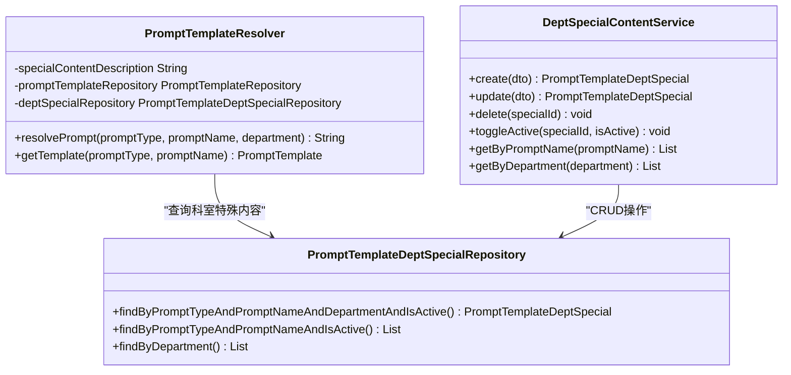
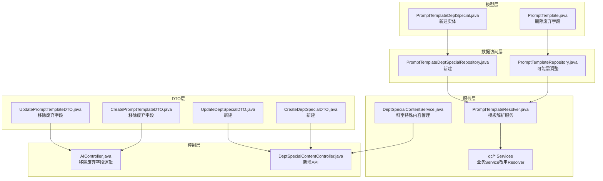
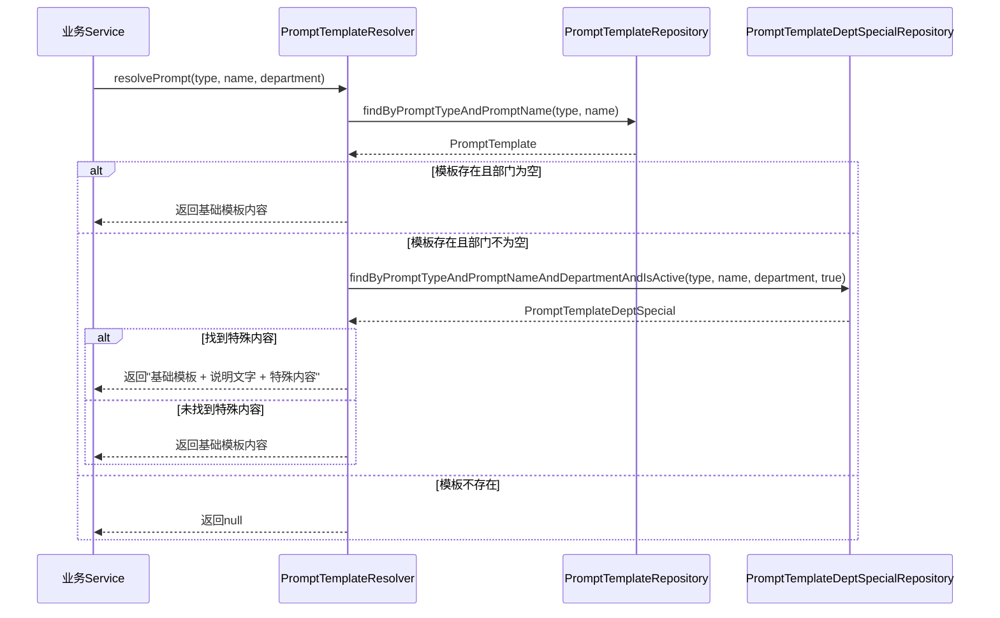

# 科室特殊内容解耦方案及TDD实施指南

<cite>
**本文档引用的文件**
- [科室特殊内容解耦方案.md](file://med_ai_assistant_1.0_bs_backend/doc/迭代/科室特殊内容解耦/科室特殊内容解耦方案.md)
- [TDD实施指南.md](file://med_ai_assistant_1.0_bs_backend/doc/迭代/科室特殊内容解耦/TDD实施指南.md)
- [PromptTemplateDeptSpecial.java](file://med_ai_assistant_1.0_bs_backend/src/main/java/com/example/medaiassistant/model/PromptTemplateDeptSpecial.java)
- [PromptTemplateDeptSpecialRepository.java](file://med_ai_assistant_1.0_bs_backend/src/main/java/com/example/medaiassistant/repository/PromptTemplateDeptSpecialRepository.java)
- [PromptTemplateDeptSpecialRepositoryTest.java](file://med_ai_assistant_1.0_bs_backend/src/test/java/com/example/medaiassistant/repository/PromptTemplateDeptSpecialRepositoryTest.java)
- [create-prompt-template-dept-special.sql](file://med_ai_assistant_1.0_bs_backend/sql-scripts/create-prompt-template-dept-special.sql)
</cite>

## 目录
1. [项目概述](#项目概述)
2. [背景与目标](#背景与目标)
3. [核心方案设计](#核心方案设计)
4. [数据库架构](#数据库架构)
5. [后端模块设计](#后端模块设计)
6. [TDD实施策略](#tdd实施策略)
7. [测试策略](#测试策略)
8. [质量保障体系](#质量保障体系)
9. [风险管控](#风险管控)
10. [实施进度安排](#实施进度安排)
11. [总结](#总结)

## 项目概述

MedAiAssistant项目中的Prompt模板科室特殊内容解耦方案旨在解决当前系统中科室特殊情况内容与通用模板耦合的问题。该项目通过将科室特殊内容从`prompttemplate`表中分离出来，实现通用模板的远程统一维护和科室特殊内容的本地独立管理。

### 项目特点

- **技术栈**：Spring Boot + JPA/Hibernate + Oracle 21c
- **开发周期**：预计5-7个工作日
- **质量目标**：
  - 后端单元测试覆盖率 ≥ 85%
  - 新增Service方法覆盖率 100%
  - 新增Controller接口覆盖率 100%
  - 新增Repository方法覆盖率 100%

## 背景与目标

### 现状问题

当前`prompttemplate`表中的`SPECIAL_CONTENT`、`DEPARTMENT_ID`、`SCOPE`字段存在以下问题：

1. `SPECIAL_CONTENT`未被任何业务代码使用
2. `SCOPE`始终为'global'，未实现科室级模板覆盖逻辑
3. 通用模板与科室特殊内容耦合在同一张表中，无法独立进行远程更新

### 解决目标

通过将科室特殊内容拆分到独立表中，实现：

1. 通用Prompt模板可远程统一维护（MERGE更新不影响科室定制数据）
2. 各科室可独立管理自己的特殊情况内容
3. 一个公共模板对应多个科室的特殊内容（一对多关系）

## 核心方案设计

### 设计决策

| 决策项 | 选择 | 理由 |
|--------|------|------|
| 关联键 | `PROMPT_TYPE + PROMPT_NAME` | 存在同名不同类型的模板，需组合键确保唯一关联，且不受远程MERGE更新导致的ID变化影响 |
| 原表废弃字段 | 删除`SPECIAL_CONTENT`、`DEPARTMENT_ID`、`SCOPE` | 原表转为纯公共模板表，SCOPE始终为global已无意义 |
| 内容合并策略 | 公共模板 + 说明文字 + 特殊内容 | 说明文字存储在配置文件`prompt.special-content.description`中，便于统一维护 |

### 关键服务组件



**图表来源**
- [PromptTemplateResolver.java](file://med_ai_assistant_1.0_bs_backend/src/main/java/com/example/medaiassistant/service/PromptTemplateResolver.java)
- [DeptSpecialContentService.java](file://med_ai_assistant_1.0_bs_backend/src/main/java/com/example/medaiassistant/service/DeptSpecialContentService.java)
- [PromptTemplateDeptSpecialRepository.java](file://med_ai_assistant_1.0_bs_backend/src/main/java/com/example/medaiassistant/repository/PromptTemplateDeptSpecialRepository.java)

## 数据库架构

### 新建表：PROMPT_TEMPLATE_DEPT_SPECIAL

```sql
CREATE TABLE PROMPT_TEMPLATE_DEPT_SPECIAL (
    SPECIAL_ID        NUMBER(10)        NOT NULL,
    PROMPT_TYPE       VARCHAR2(255)     NOT NULL,
    PROMPT_NAME       VARCHAR2(255)     NOT NULL,
    DEPARTMENT        VARCHAR2(100)     NOT NULL,
    SPECIAL_CONTENT   CLOB              NOT NULL,
    IS_ACTIVE         NUMBER(1)         DEFAULT 1 NOT NULL,
    CREATED_AT        TIMESTAMP(6)      DEFAULT SYSTIMESTAMP,
    MODIFIED_AT       TIMESTAMP(6)      DEFAULT SYSTIMESTAMP,
    CONSTRAINT PK_PROMPT_DEPT_SPECIAL PRIMARY KEY (SPECIAL_ID),
    CONSTRAINT UK_PROMPT_DEPT_SPECIAL UNIQUE (PROMPT_TYPE, PROMPT_NAME, DEPARTMENT)
);

CREATE SEQUENCE PROMPT_DEPT_SPECIAL_SEQ START WITH 1 INCREMENT BY 1 NOCACHE;
```

### 原表结构变更

| 字段 | 类型 | 说明 |
|------|------|------|
| PROMPTID | NUMBER(10) | 主键 |
| PROMPTTYPE | VARCHAR2(255) | 模板类型 |
| PROMPTNAME | VARCHAR2(255) | 模板名称（唯一） |
| PROMPT | CLOB | 通用模板内容 |
| FILTERRULES | CLOB | 过滤规则 |
| REQUIRED_DATA_TYPES | VARCHAR2(500) | 所需数据类型 |
| IS_ACTIVE | NUMBER(10) | 激活状态 |
| CREATED_AT | TIMESTAMP(6) | 创建时间 |
| MODIFIED_AT | TIMESTAMP(6) | 修改时间 |

**章节来源**
- [科室特殊内容解耦方案.md:25-77](file://med_ai_assistant_1.0_bs_backend/doc/迭代/科室特殊内容解耦/科室特殊内容解耦方案.md#L25-L77)

## 后端模块设计

### 模块职责划分



**图表来源**
- [科室特殊内容解耦方案.md:80-103](file://med_ai_assistant_1.0_bs_backend/doc/迭代/科室特殊内容解耦/科室特殊内容解耦方案.md#L80-L103)

### 核心服务实现

#### PromptTemplateResolver服务

该服务封装"查公共模板 + 合并科室特殊内容"的逻辑，是所有业务Service获取最终Prompt内容的唯一入口。



**图表来源**
- [PromptTemplateResolver.java:109-166](file://med_ai_assistant_1.0_bs_backend/src/main/java/com/example/medaiassistant/service/PromptTemplateResolver.java#L109-L166)

**章节来源**
- [科室特殊内容解耦方案.md:105-167](file://med_ai_assistant_1.0_bs_backend/doc/迭代/科室特殊内容解耦/科室特殊内容解耦方案.md#L105-L167)

## TDD实施策略

### 用户故事拆分

#### Module 1：科室特殊内容数据模型与持久化

**US-M1-01：科室特殊内容实体建模**
- **验收标准**：表创建成功，包含所有必需字段和约束
- **测试策略**：使用`@DataJpaTest`验证实体字段映射和数据库约束

**US-M1-02：科室特殊内容Repository**
- **验收标准**：支持精确查询、列表查询、激活状态过滤
- **测试策略**：验证JPA查询方法的正确性和性能

**US-M1-03：原表废弃字段清理**
- **验收标准**：实体类删除废弃字段，ALTER TABLE执行成功
- **测试策略**：编译测试确保无废弃字段引用残留

### 红-绿-重构周期

| 周期 | 红阶段 | 绿阶段 | 重构阶段 | 预估时间 |
|------|--------|--------|----------|----------|
| M1-C1 | 实体字段映射测试 + Repository查询测试 | PromptTemplateDeptSpecial实体 + DDL脚本 + Repository接口 | Javadoc、nullable对齐 | 3小时 |
| M1-C2 | PromptTemplate废弃字段编译测试 | 删除3字段及getter/setter | 全局残留清理 | 1小时 |
| M2-C1 | Resolver基础功能测试（3个用例） | resolvePrompt()基础实现 | 日志优化、常量提取 | 2小时 |
| M2-C2 | 科室特殊内容合并测试（3个用例） | 合并逻辑实现 | 提取private方法 | 2小时 |
| M3-C1 | CRUD操作测试（6个用例） | DeptSpecialContentService实现 | 校验逻辑提取 | 3小时 |
| M3-C2 | 唯一约束冲突测试 | 异常捕获与转换 | 统一异常消息 | 1小时 |
| M4-C1 | QcDiseaseMatch + QcAssessment改造测试 | 替换为Resolver调用 | 移除废弃注入 | 3小时 |
| M4-C2 | DrgAiAnalysis改造测试（含变量替换） | 替换调用 + 兼容验证 | 方法签名简化 | 2小时 |
| M4-C3 | TimerPromptGenerator改造测试 | 统一为Resolver调用 | 移除callPromptApi | 3小时 |
| M4-C4 | TodoGenerationService改造测试（含降级） | 替换调用 + 保留降级 | 移除内部resolvePromptTemplate | 1.5小时 |
| M5-C1 | Controller CRUD接口测试 | DeptSpecialContentController实现 | 响应格式统一 | 2小时 |
| M5-C2 | AIController/DTO废弃字段测试 | 删除DTO字段、修改Controller | 兼容性确认 | 1.5小时 |
| M6-C1 | SQL脚本执行验证 | 修改所有insert脚本 | 格式规范统一 | 2小时 |

**章节来源**
- [TDD实施指南.md:360-476](file://med_ai_assistant_1.0_bs_backend/doc/迭代/科室特殊内容解耦/TDD实施指南.md#L360-L476)

## 测试策略

### 测试金字塔配置

#### 单元测试（70%）
- **框架**：JUnit 5 + Mockito
- **覆盖范围**：
  - `PromptTemplateResolver`：所有public方法（resolvePrompt、getTemplate）
  - `DeptSpecialContentService`：CRUD操作、唯一约束冲突处理
  - 改造后的业务Service：验证Resolver调用替代了直接Repository调用

#### 集成测试（20%）
- **框架**：Spring Boot Test (`@DataJpaTest` / `@SpringBootTest`)
- **覆盖范围**：
  - Repository层：验证JPA查询方法生成的SQL正确性
  - Entity字段映射：验证实体与数据库表结构对齐
  - Resolver + Repository联合：端到端验证模板查询 + 合并逻辑
  - Controller层：`@WebMvcTest`验证REST接口状态码和响应体

#### E2E测试（10%）
- **覆盖范围**：
  - 创建科室特殊内容 → 触发QC流程 → 验证生成的Prompt包含科室特殊内容
  - 停用科室特殊内容 → 触发QC流程 → 验证Prompt不再包含停用内容

### 关键测试用例清单

| 编号 | 测试类 | 测试方法 | 测试类型 | 说明 |
|------|--------|---------|---------|------|
| T01 | PromptTemplateDeptSpecialRepositoryTest | testFindByAllFields_Found | 集成 | 精确查询返回记录 |
| T02 | PromptTemplateDeptSpecialRepositoryTest | testFindByAllFields_NotFound | 集成 | 无匹配返回null |
| T03 | PromptTemplateDeptSpecialRepositoryTest | testFindByPromptAndActive_FilterInactive | 集成 | IS_ACTIVE过滤 |
| T04 | PromptTemplateDeptSpecialRepositoryTest | testUniqueConstraint_DuplicateThrows | 集成 | 唯一约束验证 |
| T05 | PromptTemplateResolverTest | testResolve_NoDepartment_ReturnsBase | 单元 | department=null |
| T06 | PromptTemplateResolverTest | testResolve_WithSpecial_ReturnsAppended | 单元 | 合并追加 |
| T07 | PromptTemplateResolverTest | testResolve_SpecialInactive_ReturnsBase | 单元 | 停用特殊内容 |
| T08 | PromptTemplateResolverTest | testResolve_NoTemplate_ReturnsNull | 单元 | 模板不存在 |
| T09 | PromptTemplateResolverTest | testResolve_EmptyDepartment_ReturnsBase | 单元 | department="" |
| T10 | DeptSpecialContentServiceTest | testCreate_Success | 单元 | 正常创建 |
| T11 | DeptSpecialContentServiceTest | testCreate_DuplicateThrows | 单元 | 重复创建异常 |
| T12 | DeptSpecialContentServiceTest | testUpdate_Success | 单元 | 正常更新 |
| T13 | DeptSpecialContentServiceTest | testDelete_Success | 单元 | 正常删除 |
| T14 | DeptSpecialContentServiceTest | testToggleActive | 单元 | 激活状态切换 |
| T15 | DeptSpecialContentServiceTest | testGetByPromptName | 单元 | 按模板查询 |
| T16 | QcDiseaseMatchServiceTest | testResolverIntegration_WithDept | 单元 | 改造后Resolver调用 |
| T17 | QcAssessmentServiceTest | testResolverIntegration_WithDept | 单元 | 改造后Resolver调用 |
| T18 | DrgAiAnalysisServiceTest | testResolverWithVariableReplacement | 单元 | 合并+变量替换 |
| T19 | TimerPromptGeneratorTest | testUnifiedResolver_ReplacesApiCall | 单元 | 替代callPromptApi |
| T20 | TodoGenerationServiceTest | testResolver_WithFallback | 单元 | Resolver+降级 |
| T21 | DeptSpecialContentControllerTest | testCrudEndpoints | 集成 | CRUD接口完整性 |

**章节来源**
- [TDD实施指南.md:480-553](file://med_ai_assistant_1.0_bs_backend/doc/迭代/科室特殊内容解耦/TDD实施指南.md#L480-L553)

## 质量保障体系

### 代码质量门禁

| 质量指标 | 目标值 | 检查工具 | 执行时机 |
|---------|--------|----------|----------|
| 单元测试通过率 | 100% | JUnit 5 + Maven Surefire | 每次提交前 |
| 新增代码测试覆盖率 | ≥ 85% | JaCoCo | CI流水线 |
| 编译零错误 | 0 errors | Maven Compiler Plugin | 每次构建 |
| 编译零警告 | 0 warnings（关键级） | Maven Compiler Plugin | 每次构建 |
| 废弃字段引用 | 0 处 | IDE全局搜索 + grep | 字段删除后 |
| Javadoc完整性 | 所有public方法 | 人工审查 | Code Review |
| SQL脚本幂等性 | 可重复执行 | 手动验证 | 脚本变更后 |
| NPE防护 | 所有外部输入 | 代码审查 + 测试 | Code Review |
| 异常处理完整性 | 所有catch块有日志 | 代码审查 | Code Review |
| Oracle兼容性 | CLOB、SEQUENCE正确使用 | 集成测试 | 每次构建 |
| REST API规范 | 状态码正确、响应体统一 | Controller测试 | 每次提交前 |

### 验收测试驱动开发（ATDD）

```gherkin
Feature: Prompt模板科室特殊内容解耦
  As a 系统管理员
  I want 将科室特殊情况内容从公共模板中分离到独立表管理
  So that 可以远程维护通用模板而不影响各科室的本地定制内容

  Scenario: 科室特殊内容追加到公共模板
    Given 公共模板"QC-第一阶段-AI诊断匹配"存在且内容为"通用分析指令"
    And 心内科对该模板的特殊内容为"注意心功能不全患者的特殊处理"且已激活
    When 质控一阶段为心内科患者执行诊断匹配
    Then 生成的Prompt格式为"公共模板\n\n{配置说明文字}\n注意心功能不全患者的特殊处理"

  Scenario: 无特殊内容时仅使用公共模板
    Given 公共模板"QC-第一阶段-AI诊断匹配"存在
    And 普通外科对该模板无特殊内容记录
    When 质控一阶段为普通外科患者执行诊断匹配
    Then 生成的Prompt仅包含公共模板内容，无追加

  Scenario: 停用特殊内容后不再追加
    Given 心内科特殊内容存在但IS_ACTIVE=0
    When 质控一阶段为心内科患者执行诊断匹配
    Then 生成的Prompt不包含心内科特殊内容

  Scenario: 远程更新公共模板不影响科室特殊内容
    Given 公共模板通过远程MERGE更新了prompt内容
    And 心内科特殊内容存储在独立表中
    When 质控一阶段为心内科患者执行诊断匹配
    Then 生成的Prompt使用更新后的公共模板 + 原有的心内科特殊内容
```

**章节来源**
- [TDD实施指南.md:556-614](file://med_ai_assistant_1.0_bs_backend/doc/迭代/科室特殊内容解耦/TDD实施指南.md#L556-L614)

## 风险管控

### 风险识别与缓解

| 风险类型 | 具体描述 | 影响程度 | 发生概率 | 缓解措施 |
|---------|---------|---------|---------|---------|
| 技术风险 | TimerPromptGenerator（2330行）改造范围大，涉及多种模板获取方式 | 高 | 中 | 逐个模板类型改造，每改一个跑一轮回归测试 |
| 技术风险 | Oracle CLOB字段在MERGE/INSERT时的长度限制 | 中 | 低 | 使用参数化查询，避免SQL字面量拼接 |
| 技术风险 | 科室名称不一致（如"心内科"与"心血管内科"）导致特殊内容无法匹配 | 高 | 中 | 在DeptSpecialContentService创建时校验科室名称是否存在于Patient表 |
| 数据风险 | ALTER TABLE DROP COLUMN后回滚困难 | 高 | 低 | 先完成所有代码改造并验证，最后执行DDL变更；保留原表备份 |
| 需求变更风险 | 未来可能需要多级特殊内容（医院级+科室级） | 中 | 中 | 当前表结构已支持通过不同DEPARTMENT值扩展；未来可添加HOSPITAL_CODE字段 |
| 集成风险 | 前端DTO变更导致接口不兼容 | 中 | 中 | 废弃字段改为忽略（而非报错），向后兼容前端旧版本 |
| 集成风险 | callPromptApi移除后影响其他依赖此方法的逻辑 | 中 | 低 | 全局搜索callPromptApi所有调用方，确保无遗漏 |
| 性能风险 | 每次模板查询额外增加一次科室特殊内容查询 | 低 | 高（必定发生） | 查询走唯一索引（PROMPT_TYPE+PROMPT_NAME+DEPARTMENT），性能影响可忽略 |
| 运维风险 | 部署时DDL脚本执行顺序错误 | 高 | 低 | 文档明确执行顺序：先建新表 → 再改代码部署 → 最后ALTER删列 |
| 测试风险 | 现有测试依赖SCOPE/specialContent/departmentId字段 | 中 | 中 | 提前排查所有测试文件中的废弃字段引用 |

## 实施进度安排

### 迭代交付计划

| 时间点 | 交付物 | 验收标准 | 依赖项 |
|--------|--------|---------|--------|
| Day 1 | Module 1：实体+Repository+DDL脚本 | 集成测试通过、DDL可执行 | 无 |
| Day 2 | Module 2：PromptTemplateResolver | 单元测试全通过（T05-T09） | Module 1 |
| Day 2 | Module 3：DeptSpecialContentService | 单元测试全通过（T10-T15） | Module 1 |
| Day 3-4 | Module 4：5个业务Service改造 | 回归测试全通过（T16-T20） | Module 2 |
| Day 4 | Module 5：Controller+DTO | 接口测试全通过（T21） | Module 3 |
| Day 5 | Module 6：SQL脚本更新 | 脚本执行成功 | Module 1（M1-C2） |
| Day 5 | 全量回归 + Code Review | 全部测试通过、Review无Critical问题 | 全部Module |

### 关键里程碑

1. **Day 1**：完成数据库架构设计和实体类创建
2. **Day 2**：实现核心解析服务和管理服务
3. **Day 3-4**：完成所有业务服务的改造
4. **Day 5**：完成API接口开发和测试验证

## 总结

科室特殊内容解耦方案通过引入独立的`PROMPT_TEMPLATE_DEPT_SPECIAL`表，实现了通用模板与科室特殊内容的完全分离。该方案采用TDD开发模式，确保了代码质量和系统的可维护性。

### 主要成果

1. **架构优化**：实现了关注点分离，提高了代码的内聚性和可维护性
2. **功能增强**：支持科室级模板定制，满足不同科室的特殊需求
3. **测试完善**：建立了完整的测试金字塔，确保代码质量
4. **开发效率**：采用TDD模式，缩短了开发周期，降低了维护成本

### 技术创新

1. **模板解析服务**：通过`PromptTemplateResolver`统一管理模板获取逻辑
2. **配置驱动**：特殊内容说明文字通过配置文件管理，便于统一维护
3. **幂等性设计**：所有SQL脚本都具备幂等性，支持重复执行
4. **向前兼容**：通过忽略废弃字段的方式保持与前端的兼容性

该方案为MedAiAssistant项目提供了强大的扩展能力，为未来的功能演进奠定了坚实的技术基础。