# 医学记录操作指南

<cite>
**本文档引用的文件**
- [更新小结.md](file://更新小结.md)
- [更新日志 2026-04-03.md](file://med_ai_assistant_1.0_bs_vue/docs/更新日志/2026-04-03.md)
- [API文档.md](file://med_ai_assistant_1.0_bs_backend/doc/其他/API_DOCUMENTATION.md)
- [架构图.md](file://med_ai_assistant_1.0_bs_backend/doc/其他/ARCHITECTURE_DIAGRAMS.md)
- [主服务器部署指南.md](file://med_ai_assistant_1.0_bs_backend/deploy/main-linux-oracle/README.md)
- [前端README.md](file://med_ai_assistant_1.0_bs_vue/README.md)
- [前端package.json](file://med_ai_assistant_1.0_bs_vue/deploy/med_ai_assistant_1.0_bs_vue/package.json)
- [前端package.json](file://med_ai_assistant_1.0_bs_vue/package.json)
- [前端vue.config.js](file://med_ai_assistant_1.0_bs_vue/vue.config.js)
- [前端.env.development](file://med_ai_assistant_1.0_bs_vue/.env.development)
- [npm.bat](file://npm.bat)
- [医疗术语知识库.json](file://med_ai_assistant_1.0_bs_backend/memory-bank/knowledge-base/medical-terms/common-medical-terms.json)
- [内存配置.json](file://med_ai_assistant_1.0_bs_backend/memory-bank/config/memory-config.json)
- [根据日期和科室获取待办事项列表接口.md](file://med_ai_assistant_1.0_bs_backend/doc/接口/根据日期和科室获取待办事项列表接口.md)
- [根据患者ID获取待办事项列表接口.md](file://med_ai_assistant_1.0_bs_backend/doc/接口/根据患者ID获取待办事项列表接口.md)
- [实时语音识别接口.md](file://med_ai_assistant_1.0_bs_backend/doc/接口/实时语音识别接口.md)
- [语音识别与LLM整理解耦接口.md](file://med_ai_assistant_1.0_bs_backend/doc/接口/语音识别与LLM整理解耦接口.md)
- [病历记录管理接口.md](file://med_ai_assistant_1.0_bs_backend/doc/接口/病历记录/病历记录管理接口.md)
- [病历记录时间格式调整接口.md](file://med_ai_assistant_1.0_bs_backend/doc/接口/病历记录/病历记录时间格式调整接口.md)
- [待办事项接口.md](file://med_ai_assistant_1.0_bs_backend/doc/接口/病历记录/待办事项接口.md)
- [MedicalRecords.vue](file://med_ai_assistant_1.0_bs_vue/src/components/patient/MedicalRecords.vue)
</cite>

## 更新摘要
**所做更改**
- 新增病历编辑防丢失功能章节，详细介绍localStorage草稿自动保存机制
- 新增浏览器离开保护和标签页隐藏保护功能说明
- 新增草稿恢复机制和过期清理功能
- 更新病历记录操作流程，增加防丢失保护环节
- 新增保存状态指示器和用户提示机制
- 扩展操作按钮功能表格，包含新增的防丢失保护功能

## 目录
1. [项目概述](#项目概述)
2. [系统架构](#系统架构)
3. [核心功能模块](#核心功能模块)
4. [API接口规范](#api接口规范)
5. [部署配置](#部署配置)
6. [数据管理](#数据管理)
7. [AI辅助功能](#ai辅助功能)
8. [系统监控](#系统监控)
9. [故障排查](#故障排查)
10. [前端构建系统稳定性](#前端构建系统稳定性)
11. [版本更新记录](#版本更新记录)

## 项目概述

医疗AI助手系统是一个基于现代Web技术栈的综合性医疗信息系统，专注于为医护人员提供智能化的病历记录管理和AI辅助诊断功能。该系统采用前后端分离架构，后端基于Spring Boot，前端基于Vue.js，实现了完整的医疗数据管理闭环。

### 系统特性

- **智能病历管理**：支持多种类型的病历记录创建、编辑、查询和管理
- **AI辅助诊断**：基于Prompt模板的智能诊断建议生成
- **语音识别集成**：实时语音转文字功能，支持多种识别模式
- **待办事项生成**：智能化的医疗任务自动生成和管理
- **智录系统**：智能录入助手，提升病历记录效率
- **多模态数据支持**：化验结果、检查报告、医嘱管理等
- **安全加密**：采用AES加密保护敏感医疗数据
- **分布式部署**：支持主服务器和执行服务器分离架构
- **稳定构建系统**：经过多次修复的前端构建系统，确保开发环境稳定
- **防丢失保护**：新增的病历编辑防丢失功能，确保用户数据安全

## 系统架构

系统采用分层架构设计，包含前端应用层、API网关层、业务服务层、核心服务层、数据访问层和数据存储层。

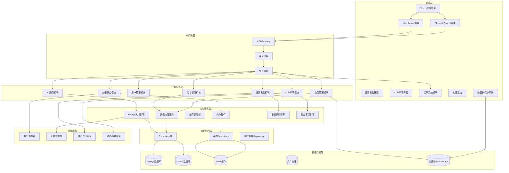

**图表来源**
- [架构图.md:5-60](file://med_ai_assistant_1.0_bs_backend/doc/其他/ARCHITECTURE_DIAGRAMS.md#L5-L60)

### 数据模型关系

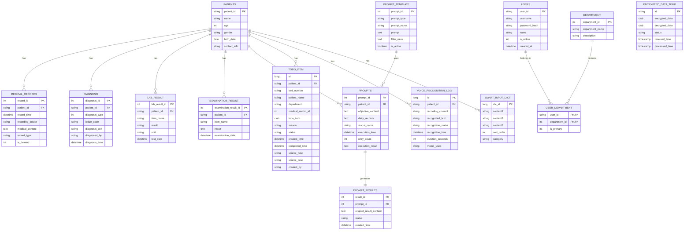

**图表来源**
- [架构图.md:64-181](file://med_ai_assistant_1.0_bs_backend/doc/其他/ARCHITECTURE_DIAGRAMS.md#L64-L181)

## 核心功能模块

### 病历记录管理

系统提供完整的病历记录生命周期管理，支持多种类型的病历记录创建、编辑、查询和删除操作。

#### 病历记录类型

| 记录类型 | 用途 | 特点 |
|---------|------|------|
| 入院记录 | 患者入院时的基础信息记录 | 包含入院时间、主诉、现病史等 |
| 病情小结 | 患者病情的阶段性总结 | 每日或定期生成 |
| 查房记录 | 医生查房时的临床观察记录 | 包含体征、诊断、治疗计划 |
| 病程记录 | 患者住院期间的详细医疗记录 | 连续性的病情变化记录 |

#### 病历记录操作流程

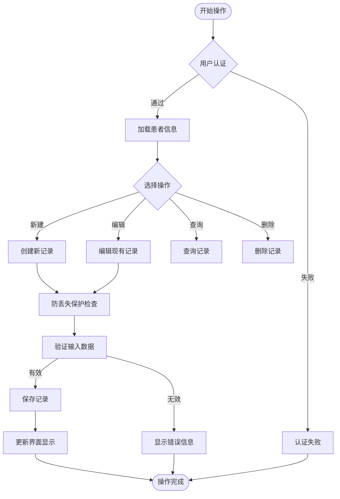

**图表来源**
- [架构图.md:185-232](file://med_ai_assistant_1.0_bs_backend/doc/other/ARCHITECTURE_DIAGRAMS.md#L185-L232)

#### 病历编辑防丢失保护机制

**新增功能**：系统现在提供多层防丢失保护机制，确保用户的病历编辑内容不会因意外情况而丢失。

##### localStorage草稿自动保存

系统使用localStorage实现智能草稿保存，支持以下功能：

- **区分保存策略**：新增记录保存完整表单字段，编辑记录仅保存内容与记录ID
- **自动保存时机**：内容修改时自动保存，页面关闭前保存，标签页隐藏时保存
- **草稿键名生成**：新增记录使用`med_draft_{patientId}_new`，编辑记录使用`med_draft_{patientId}_{recordId}`

##### 草稿恢复机制

系统提供智能草稿恢复功能：

- **编辑草稿恢复**：检测到指定记录ID的编辑草稿时，弹窗询问用户是否恢复
- **新增草稿恢复**：检测到当前患者未完成的新增病历草稿时，弹窗询问用户是否继续编辑
- **草稿年龄提示**：显示草稿保存的相对时间（刚刚、几分钟前、几小时前、几天前）

##### 过期清理机制

系统自动清理过期草稿：

- **7天过期策略**：超过7天未更新的草稿自动删除
- **遍历清理**：启动时遍历localStorage，删除过期的病历草稿
- **异常容错**：解析失败的草稿也会被自动清理

##### 保存状态指示器

系统提供实时的保存状态反馈：

- **未保存状态**：显示"未保存"状态标签
- **草稿已保存**：显示"草稿已保存"状态标签
- **保存失败**：显示"保存失败"状态标签
- **成功保存**：使用$message弹出提示

#### 病历记录操作流程（带防丢失保护）

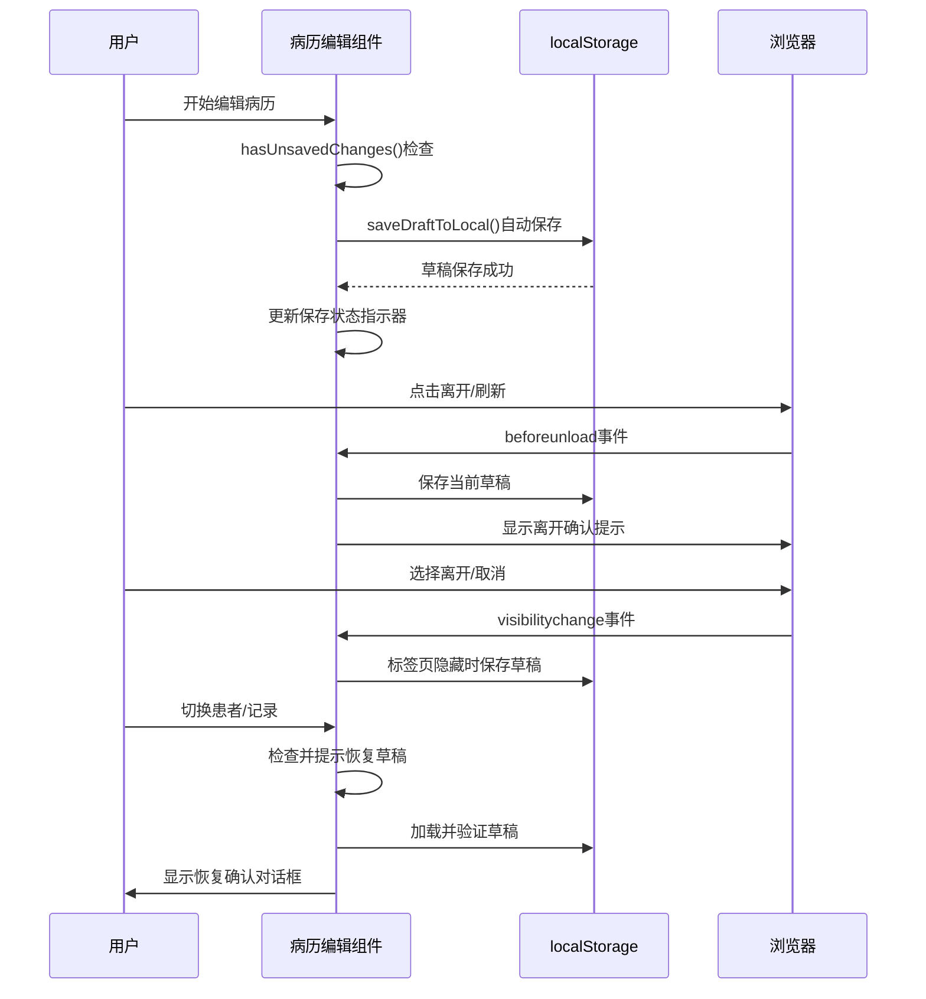

**图表来源**
- [MedicalRecords.vue:2200-2480](file://med_ai_assistant_1.0_bs_vue/src/components/patient/MedicalRecords.vue#L2200-L2480)

### 语音识别功能

系统支持多种语音识别模式，包括实时语音识别和录音文件识别，为医生提供便捷的语音输入方式。

#### 语音识别架构

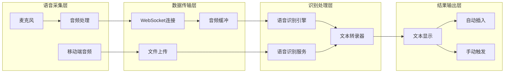

**图表来源**
- [架构图.md:268-306](file://med_ai_assistant_1.0_bs_backend/doc/其他/ARCHITECTURE_DIAGRAMS.md#L268-L306)

#### 语音识别模式

| 模式类型 | 传输方式 | 识别方式 | 适用场景 |
|---------|---------|---------|---------|
| 实时语音识别 | WebSocket | 实时流式识别 | 医生现场语音输入，实时转文字 |
| 录音文件识别 | HTTP上传 | 批量文件识别 | 录音后识别，支持长音频文件 |
| 智录系统识别 | 智录引擎 | 智能识别 | 结合智录系统，智能识别和整理 |

#### 语音识别操作流程

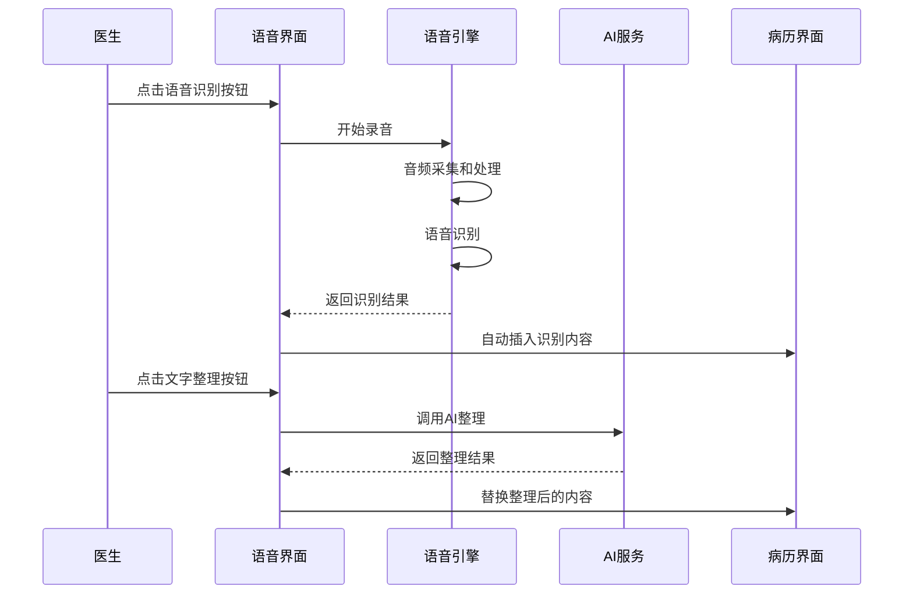

**图表来源**
- [语音识别与LLM整理解耦接口.md:97-143](file://med_ai_assistant_1.0_bs_backend/doc/接口/语音识别与LLM整理解耦接口.md#L97-L143)

### 待办事项生成功能

系统提供智能化的待办事项生成功能，基于病历内容自动生成医疗任务清单。

#### 待办事项生成流程

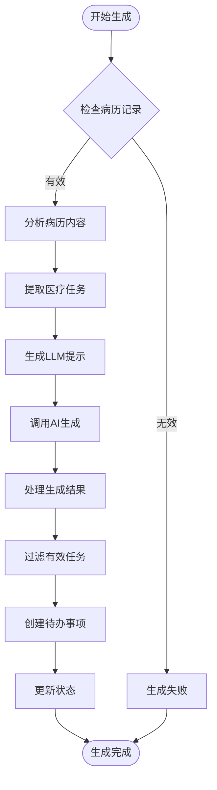

**图表来源**
- [架构图.md:185-232](file://med_ai_assistant_1.0_bs_backend/doc/其他/ARCHITECTURE_DIAGRAMS.md#L185-L232)

#### 待办事项类型

| 任务类型 | 生成规则 | 状态管理 |
|---------|---------|---------|
| 医疗检查 | 病历中提及的检查项目 | 自动生成，医生确认 |
| 药物治疗 | 病历中的药物处方记录 | 自动生成，执行状态跟踪 |
| 诊断分析 | 病历中的诊断相关信息 | 自动生成，AI辅助分析 |
| 病情观察 | 病历中的病情变化记录 | 自动生成，定期提醒 |

### 智录系统

智录系统是医疗记录的智能助手，提供智能录入、模板匹配和内容优化功能。

#### 智录系统架构

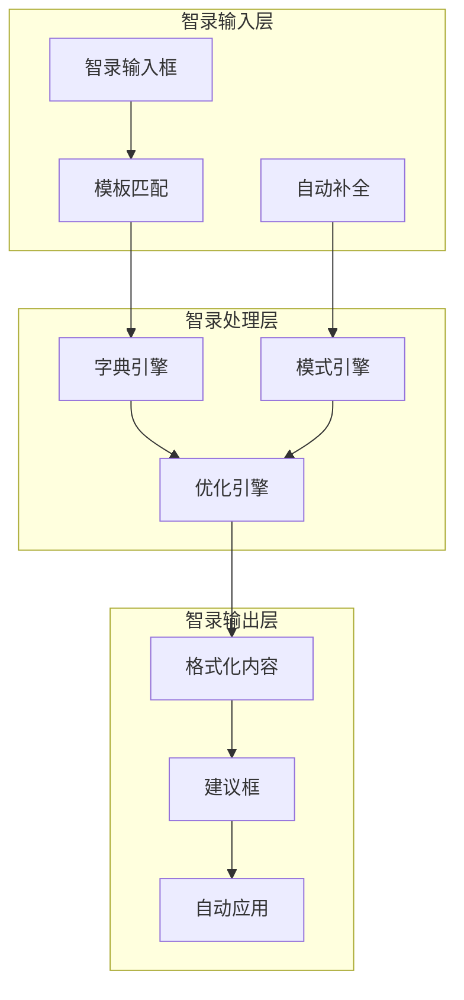

**图表来源**
- [架构图.md:268-306](file://med_ai_assistant_1.0_bs_backend/doc/其他/ARCHITECTURE_DIAGRAMS.md#L268-L306)

#### 智录字典管理

| 字典类型 | 字典内容 | 使用场景 |
|---------|---------|---------|
| 常用术语 | 医学常用词汇和缩写 | 病历记录中的术语标准化 |
| 检查项目 | 各种医学检查项目的标准表述 | 检查项目的规范化描述 |
| 治疗方案 | 常见疾病的治疗方案模板 | 治疗方案的标准化表述 |
| 诊断模板 | 各种诊断的标准化模板 | 诊断内容的规范化生成 |

## API接口规范

系统提供完整的RESTful API接口，支持病历记录管理、AI诊断、用户管理、语音识别、待办事项等功能。

### 病历记录管理API

#### 获取病历记录列表

- **路径**: `/api/medicalrecords/emr-by-patient`
- **方法**: GET
- **参数**: `patientId` (必需)
- **响应**: EmrContent对象数组
- **特点**: 自动过滤已删除记录，按时间降序排列

#### 新增病历记录

- **路径**: `/api/medicalrecords/save`
- **方法**: POST
- **请求体**:
```json
{
  "patientId": "患者ID",
  "recordTime": "记录时间",
  "recordingDoctor": "记录医生",
  "medicalContent": "病历内容"
}
```

#### 获取格式化病历记录

- **路径**: `/api/medicalrecords/formatted`
- **方法**: GET
- **参数**: `patientId` (必需)
- **响应**: 格式化后的病历记录字符串

### 语音识别API

#### 实时语音识别

- **路径**: `ws://localhost:8081/api/voice/realtime`
- **方法**: WebSocket
- **特点**: 支持实时音频流传输，识别结果实时返回
- **音频格式**: PCM 16kHz 单声道 16bit

#### 录音文件识别

- **路径**: `POST /api/voice/recognize-file`
- **方法**: POST
- **特点**: 支持音频文件上传识别，支持长音频文件
- **文件大小**: 最大500MB

### 待办事项API

#### 根据患者ID获取待办事项

- **路径**: `GET /api/medicalrecords/patient/{patientId}/todos`
- **方法**: GET
- **参数**: `patientId` (路径参数)
- **响应**: 待办事项列表，按创建时间降序排列

#### 根据日期和科室获取待办事项

- **路径**: `GET /api/medicalrecords/todos/by-date-department`
- **方法**: GET
- **参数**: 
  - `date` (必需): 查询日期，格式：yyyy-MM-dd
  - `department` (必需): 科室名称
- **响应**: 按床号升序排列的待办事项列表

#### 根据病历记录ID获取待办事项

- **路径**: `GET /api/medicalrecords/todo/{medicalRecordId}`
- **方法**: GET
- **参数**: `medicalRecordId` (路径参数)
- **响应**: 指定病历记录的所有待办事项

### AI服务API

#### 获取患者综合信息

- **路径**: `/api/ai/patient-comprehensive-info`
- **方法**: GET
- **参数**: `patientId` (必需)
- **响应**: 格式化后的患者综合信息字符串
- **包含内容**: 基本信息、诊断、病历记录、化验结果、检查结果等

#### AI响应服务

- **路径**: `/api/ai/response`
- **方法**: POST
- **请求体**:
```json
{
  "model": "deepseek-chat",
  "messages": [
    {
      "role": "user",
      "content": "解释心脏病症状"
    }
  ],
  "stream": false,
  "temperature": 0.7,
  "max_tokens": 2048
}
```

**图表来源**
- [API文档.md:1-800](file://med_ai_assistant_1.0_bs_backend/doc/其他/API_DOCUMENTATION.md#L1-L800)

### Prompt模板管理API

#### 获取激活状态的Prompt模板

- **路径**: `/api/ai/activePromptTemplates`
- **方法**: GET
- **响应**: 激活状态的Prompt模板数组

#### 更新Prompt模板状态

- **路径**: `/api/ai/updatePromptActiveStatus`
- **方法**: PUT
- **参数**:
  - `promptId`: 模板ID (必需)
  - `isActive`: 激活状态 (必需)
- **响应**: 更新状态信息

## 部署配置

系统支持多种部署环境，包括开发环境、测试环境和生产环境。

### 主服务器部署

#### 环境要求

- **操作系统**: Linux 64位 (Ubuntu 20.04+, CentOS 7+, Debian 10+)
- **硬件要求**: CPU 2核+, 内存 4GB+, 磁盘 20GB可用空间
- **软件要求**: Docker 20.10+, Docker Compose 1.29+

#### 配置文件

**环境变量配置** (`main/.env`):
```properties
# Redis配置
REDIS_PASSWORD=your-secure-redis-password

# 执行服务器配置
EXECUTION_SERVER_HOST=100.66.1.2
EXECUTION_SERVER_PORT=8082
EXECUTION_SERVER_URL=http://100.66.1.2:8082

# AI模型配置
DEEPSEEK_API_KEY=your-deepseek-api-key-here
AI_MODEL_TIMEOUT=300000

# 加密配置
ENCRYPTION_AES_KEY=your-32-character-encryption-key
ENCRYPTION_AES_SALT=your-encryption-salt

# JVM配置
JAVA_OPTS=-Xms1g -Xmx2g -XX:+UseG1GC -XX:MaxGCPauseMillis=200
```

**应用配置** (`config/main/application.properties`):
```properties
# 数据库配置
spring.datasource.url=jdbc:oracle:thin:@//localhost:1521/orcl
spring.datasource.username=medai_user
spring.datasource.password=secure_password

# 日志配置
logging.level.com.example.medaiassistant=INFO
logging.level.org.springframework.web=INFO

# 缓存配置
spring.redis.host=localhost
spring.redis.port=6379
spring.redis.password=your-redis-password
```

### 执行服务器部署

执行服务器负责处理敏感数据的加密解密和AI模型调用，确保医疗数据的安全性。

#### 部署步骤

1. **准备环境**:
   ```bash
   # 安装Docker和Docker Compose
   curl -fsSL https://get.docker.com -o get-docker.sh
   sudo sh get-docker.sh
   
   # 验证安装
   docker --version
   docker-compose --version
   ```

2. **配置环境变量**:
   ```bash
   # 编辑 .env.execution
   vim .env.execution
   
   # 设置执行服务器专用配置
   EXECUTION_SERVER_MODE=production
   ENCRYPTION_KEY=your-secure-encryption-key
   ```

3. **启动服务**:
   ```bash
   # 构建并启动
   docker-compose -f docker-compose-execution.yml up -d --build
   
   # 查看日志
   docker-compose -f docker-compose-execution.yml logs -f
   ```

**图表来源**
- [主服务器部署指南.md:1-396](file://med_ai_assistant_1.0_bs_backend/deploy/main-linux-oracle/README.md#L1-L396)

## 数据管理

系统采用多层数据管理策略，确保医疗数据的完整性、安全性和可追溯性。

### 数据存储策略

#### 缓存策略

系统配置了智能的缓存策略，平衡内存使用和访问性能：

```json
{
  "maxMemoryUsageMB": 1024,
  "cleanupThresholdMB": 800,
  "cleanupIntervalMinutes": 30,
  "cacheEnabled": true,
  "knowledgeBaseEnabled": true,
  "retentionDays": {
    "patientData": 30,
    "aiResponses": 7,
    "sessionData": 1,
    "systemLogs": 90,
    "errorLogs": 180,
    "interactionLogs": 30,
    "voiceRecognitionLogs": 30,
    "todoItems": 7
  }
}
```

#### 数据加密

所有敏感医疗数据在传输和存储过程中都经过AES加密：

- **加密算法**: AES-256-CBC
- **密钥管理**: 环境变量配置
- **盐值处理**: 随机生成的16字节盐值
- **数据范围**: 患者姓名、诊断信息、病历内容等

### 数据同步机制

系统支持多数据源的实时同步，确保不同环境间的数据一致性。

#### 同步流程

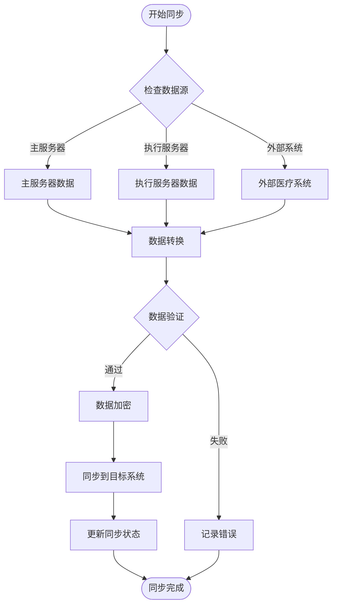

**图表来源**
- [架构图.md:234-264](file://med_ai_assistant_1.0_bs_backend/doc/其他/ARCHITECTURE_DIAGRAMS.md#L234-L264)

### 语音识别数据管理

#### 语音识别日志

系统提供完整的语音识别数据管理功能：

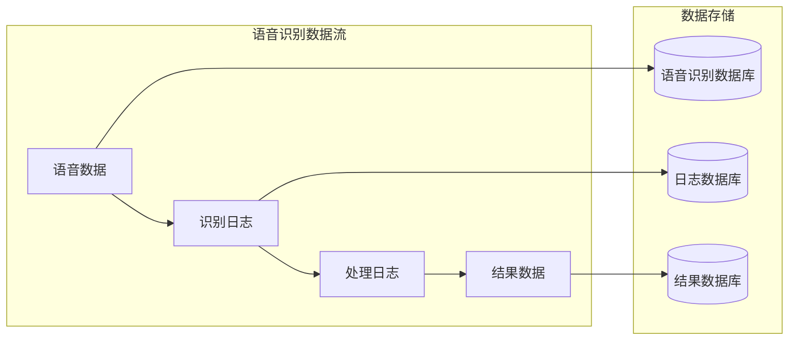

**图表来源**
- [语音识别与LLM整理解耦接口.md:28-51](file://med_ai_assistant_1.0_bs_backend/doc/接口/语音识别与LLM整理解耦接口.md#L28-L51)

### 病历编辑防丢失数据管理

**新增功能**：系统现在提供完整的病历编辑防丢失数据管理机制。

#### localStorage草稿存储策略

系统使用localStorage实现智能草稿存储：

- **草稿键名格式**：
  - 新增记录：`med_draft_{patientId}_new`
  - 编辑记录：`med_draft_{patientId}_{recordId}`
- **草稿内容结构**：
  - 新增记录：保存完整表单字段（内容、日期、医生、记录类型）
  - 编辑记录：仅保存内容与记录ID
- **时间戳管理**：每个草稿包含保存时间戳，用于过期判断

#### 草稿恢复机制

系统提供智能的草稿恢复功能：

- **自动检测**：启动时自动检测是否存在匹配的草稿
- **年龄提示**：显示草稿保存的相对时间（刚刚、几分钟前、几小时前、几天前）
- **恢复确认**：通过对话框确认是否恢复草稿
- **内容填充**：恢复时自动填充相应的表单字段

#### 过期清理机制

系统自动清理过期的草稿数据：

- **清理策略**：删除超过7天未更新的草稿
- **遍历机制**：启动时遍历localStorage中的所有草稿
- **异常容错**：解析失败的草稿也会被自动清理
- **内存优化**：定期清理过期数据，避免localStorage空间膨胀

## AI辅助功能

系统集成了先进的AI辅助诊断功能，通过机器学习和自然语言处理技术为医生提供智能化的医疗决策支持。

### AI模型配置

#### 支持的AI模型

| 模型名称 | 用途 | 配置参数 |
|---------|------|----------|
| deepseek-chat | 通用对话和诊断分析 | temperature: 0.7, max_tokens: 2048 |
| inHospitalDeepseek | 医院内部专用模型 | temperature: 0.5, max_tokens: 4096 |
| qwen3-asr-flash | 语音识别 | 模型版本: qwen3-asr-flash |

#### AI参数调优

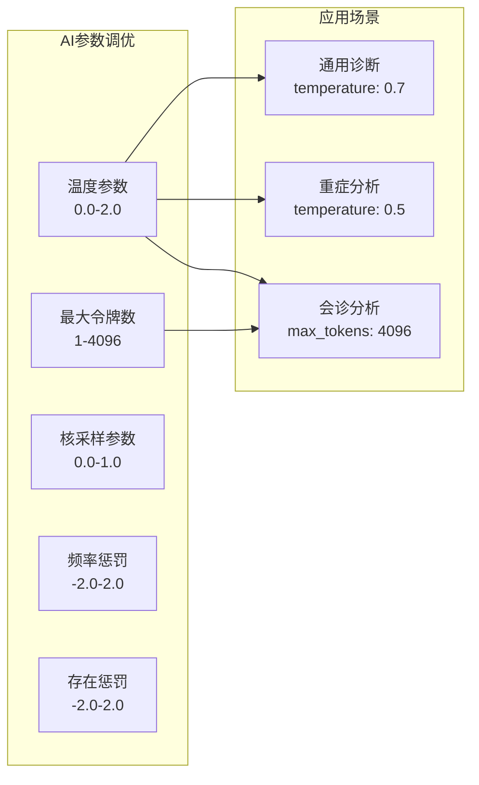

**图表来源**
- [API文档.md:400-424](file://med_ai_assistant_1.0_bs_backend/doc/其他/API_DOCUMENTATION.md#L400-L424)

### Prompt模板管理

系统提供了灵活的Prompt模板管理系统，支持自定义模板的创建、编辑和版本控制。

#### 模板类型

| 模板类型 | 用途 | 示例 |
|---------|------|------|
| 诊断分析 | 疾病诊断建议 | "基于患者的症状和检查结果，分析可能的诊断..." |
| 治疗方案 | 治疗计划制定 | "为该患者制定个性化的治疗方案..." |
| 病情小结 | 病情总结报告 | "总结患者三天内的病情变化和治疗效果..." |
| 查房记录 | 医生查房记录 | "记录今日查房时患者的体征和病情观察..." |

#### 模板参数

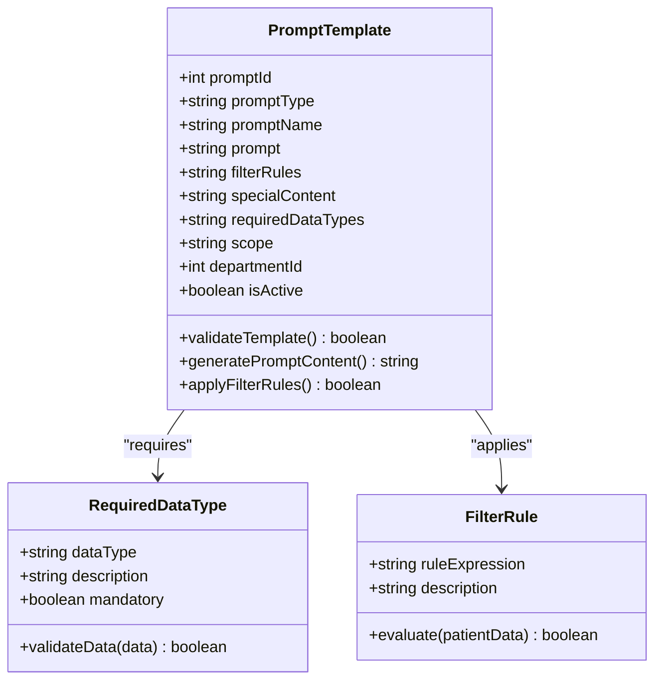

**图表来源**
- [API文档.md:686-782](file://med_ai_assistant_1.0_bs_backend/doc/其他/API_DOCUMENTATION.md#L686-L782)

### 待办事项AI分析

#### AI生成待办事项流程

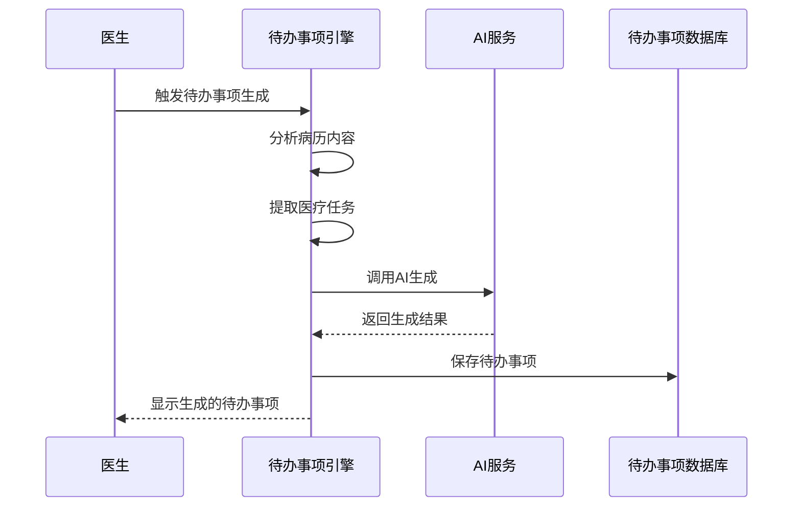

**图表来源**
- [架构图.md:185-232](file://med_ai_assistant_1.0_bs_backend/doc/其他/ARCHITECTURE_DIAGRAMS.md#L185-L232)

## 系统监控

系统内置了完善的监控和告警机制，确保服务的稳定运行和及时发现问题。

### 性能监控

#### 监控指标

| 监控类别 | 指标名称 | 阈值设置 | 告警级别 |
|---------|---------|---------|---------|
| 系统资源 | CPU使用率 | >80% | 警告 |
| 系统资源 | 内存使用率 | >85% | 危险 |
| 系统资源 | 磁盘空间 | <10%可用 | 警告 |
| 应用性能 | 响应时间 | >2秒 | 警告 |
| 应用性能 | 错误率 | >5% | 危险 |
| 数据库性能 | 连接池使用率 | >90% | 危险 |
| 缓存性能 | 缓存命中率 | <70% | 警告 |
| 语音识别 | 识别成功率 | <80% | 警告 |
| 待办事项 | 生成成功率 | <85% | 警告 |
| 防丢失保护 | 草稿保存成功率 | <95% | 警告 |
| 防丢失保护 | 草稿恢复成功率 | <90% | 警告 |

#### 监控配置

**内存银行监控** (`memory-config.json`):
```json
{
  "monitoring": {
    "enabled": true,
    "checkIntervalSeconds": 60,
    "alertThresholdMB": 900
  },
  "performance": {
    "maxConcurrentOperations": 10,
    "ioThreads": 4,
    "bufferSizeKB": 64
  }
}
```

### 健康检查

系统提供多层次的健康检查机制：

#### 服务健康检查

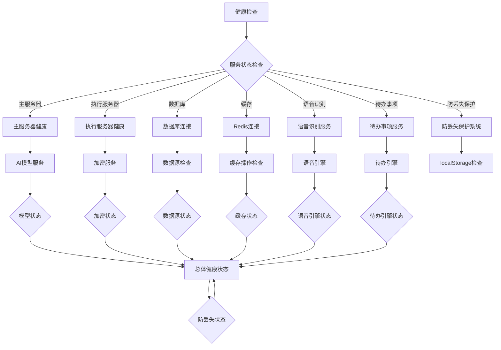

**图表来源**
- [架构图.md:340-391](file://med_ai_assistant_1.0_bs_backend/doc/其他/ARCHITECTURE_DIAGRAMS.md#L340-L391)

## 故障排查

### 常见问题及解决方案

#### 部署相关问题

| 问题类型 | 症状描述 | 解决方案 |
|---------|---------|---------|
| 容器启动失败 | 容器启动后立即退出 | 检查端口占用，查看容器日志，验证环境变量配置 |
| 网络连接失败 | 无法连接到执行服务器 | 检查网络连通性，验证防火墙设置，确认服务器地址配置 |
| 数据库连接错误 | 应用启动时报数据库连接失败 | 检查数据库服务状态，验证连接参数，确认网络可达性 |
| 内存不足 | 应用频繁重启或性能下降 | 调整JVM参数，增加系统内存，优化应用配置 |

#### 性能问题

| 问题类型 | 症状描述 | 解决方案 |
|---------|---------|---------|
| 响应缓慢 | API响应时间超过阈值 | 分析慢查询，优化数据库索引，增加缓存策略 |
| 内存泄漏 | 内存使用持续增长 | 检查资源释放，优化对象生命周期，启用内存监控 |
| 并发问题 | 高并发场景下系统不稳定 | 调整线程池配置，优化锁机制，增加负载均衡 |

#### 数据相关问题

| 问题类型 | 症状描述 | 解决方案 |
|---------|---------|---------|
| 数据不一致 | 不同环境间数据差异 | 检查同步机制，验证数据转换逻辑，确认事务一致性 |
| 缓存失效 | 缓存数据过期或错误 | 清理缓存，检查缓存配置，验证数据更新策略 |
| 加密失败 | 敏感数据无法正确加密/解密 | 检查密钥配置，验证加密算法，确认密钥轮换策略 |

#### 语音识别问题

| 问题类型 | 症状描述 | 解决方案 |
|---------|---------|---------|
| 识别失败 | 语音无法识别或识别错误 | 检查音频质量，验证API配置，确认网络连接 |
| 实时识别延迟高 | 实时语音识别延迟超过1秒 | 检查网络质量，优化音频缓冲，调整识别参数 |
| 录音文件过大 | 录音文件超过500MB限制 | 分割音频文件，优化音频压缩，检查文件格式 |

#### 待办事项问题

| 问题类型 | 症状描述 | 解决方案 |
|---------|---------|---------|
| 生成失败 | 待办事项无法生成 | 检查AI服务状态，验证病历内容，确认模板配置 |
| 任务重复 | 待办事项重复生成 | 检查去重逻辑，验证生成规则，确认数据库状态 |
| 状态异常 | 待办事项状态不正确 | 检查状态更新逻辑，验证任务执行，确认数据库一致性 |

#### 病历编辑防丢失问题

**新增功能故障排查**：

| 问题类型 | 症状描述 | 解决方案 |
|---------|---------|---------|
| 草稿无法保存 | localStorage保存失败 | 检查浏览器localStorage权限，清理过期草稿，验证存储配额 |
| 草稿无法恢复 | 草稿加载失败或过期 | 检查草稿键名格式，验证草稿内容结构，确认时间戳有效性 |
| 离开保护失效 | 页面关闭时未提示 | 检查beforeunload事件绑定，验证hasUnsavedChanges方法，确认事件优先级 |
| 标签页隐藏保护失效 | 标签页隐藏时未保存 | 检查visibilitychange事件监听，验证document.hidden状态，确认保存时机 |
| 草稿清理异常 | 过期草稿未被清理 | 检查清理策略逻辑，验证时间计算准确性，确认异常处理机制 |
| 保存状态指示器异常 | 状态标签显示不正确 | 检查状态更新逻辑，验证消息提示机制，确认UI更新时机 |

#### 前端构建系统问题

**最新修复案例**：**package.json语法错误导致开发服务器启动失败**

- **问题描述**: package.json文件中存在语法错误，导致npm run serve命令无法正常启动开发服务器
- **症状表现**: 
  - npm run serve命令执行时报语法错误
  - 开发服务器无法启动，端口8080无法访问
  - 控制台显示JSON解析错误
- **解决方案**:
  1. 检查package.json文件的语法结构
  2. 确保所有对象属性之间都有正确的逗号分隔
  3. 验证字符串值使用正确的引号
  4. 确保JSON对象闭合正确
  5. 使用在线JSON验证工具检查语法
- **预防措施**:
  1. 在修改package.json后使用JSON验证工具
  2. 遵循严格的JSON语法规范
  3. 定期备份package.json文件
  4. 使用IDE的JSON语法检查功能

### 调试工具

#### 日志分析

系统提供了丰富的日志分析工具：

1. **应用日志**:
   ```bash
   # 查看主服务器日志
   docker logs med-ai-main -f
   
   # 查看错误日志
   tail -f logs/main/main-server.log | grep ERROR
   
   # 查看慢请求日志
   tail -f logs/main/main-server.log | grep "took more than"
   ```

2. **数据库日志**:
   ```bash
   # 查看数据库连接日志
   docker logs med-ai-mysql | grep "Connection"
   
   # 查看慢查询日志
   docker logs med-ai-mysql | grep "Query_time"
   ```

3. **缓存日志**:
   ```bash
   # 查看Redis日志
   docker logs med-ai-main-redis | grep "error"
   
   # 检查缓存命中率
   docker exec med-ai-main-redis redis-cli info | grep "keyspace"
   ```

4. **语音识别日志**:
   ```bash
   # 查看语音识别日志
   tail -f logs/main/voice-recognition.log
   
   # 检查识别成功率
   tail -f logs/main/voice-recognition.log | grep "success_rate"
   ```

5. **待办事项日志**:
   ```bash
   # 查看待办事项日志
   tail -f logs/main/todo-generation.log
   
   # 检查生成成功率
   tail -f logs/main/todo-generation.log | grep "generation_success"
   ```

6. **防丢失保护日志**:
   ```bash
   # 查看草稿保存日志
   tail -f logs/main/draft-protection.log
   
   # 检查草稿恢复成功率
   tail -f logs/main/draft-protection.log | grep "draft_recovery"
   
   # 检查localStorage使用情况
   tail -f logs/main/localstorage-monitor.log
   ```

7. **前端构建日志**:
   ```bash
   # 查看前端构建日志
   cd med_ai_assistant_1.0_bs_vue
   npm run serve
   
   # 检查构建错误
   npm run build
   
   # 清理缓存后重新安装
   npm cache clean --force
   rm -rf node_modules
   npm install
   ```

## 前端构建系统稳定性

### 构建系统架构

前端构建系统基于Vue CLI和Webpack，提供开发服务器、构建优化和打包功能。

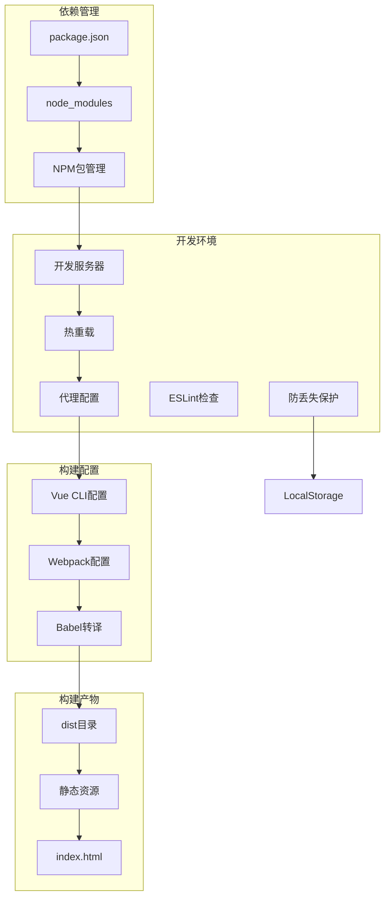

**图表来源**
- [前端package.json:1-55](file://med_ai_assistant_1.0_bs_vue/package.json#L1-L55)
- [前端vue.config.js:1-24](file://med_ai_assistant_1.0_bs_vue/vue.config.js#L1-L24)

### 构建配置详解

#### package.json配置

**核心配置项**:
- **name**: "med_ai_assistant_1.0_bs" - 项目名称
- **version**: "0.6.082" - 当前版本号
- **private**: true - 私有项目，不发布到npm
- **scripts**: 
  - serve: vue-cli-service serve - 启动开发服务器
  - build: vue-cli-service build - 构建生产版本
  - lint: vue-cli-service lint - 代码检查

**依赖管理**:
- **dependencies**: 运行时依赖
- **devDependencies**: 开发时依赖
- **eslintConfig**: ESLint配置
- **browserslist**: 浏览器兼容性配置

#### Vue CLI配置

**开发服务器配置**:
- **port**: 8080 - 开发服务器端口
- **proxy**: API代理配置
- **publicPath**: '/' - 静态资源路径
- **transpileDependencies**: true - 转译依赖

**Webpack配置**:
- **chainWebpack**: 自定义webpack配置
- **raw-loader**: 支持.md文件加载

### 最新修复案例

#### package.json语法错误修复

**问题发现**: 在2026-03-24的版本更新中，发现前端package.json存在语法错误，导致开发服务器启动失败。

**问题分析**:
1. JSON语法错误导致npm无法解析package.json
2. 开发服务器无法启动，端口8080占用
3. 控制台显示JSON解析错误

**修复过程**:
1. 检查package.json文件的完整语法结构
2. 验证所有对象属性的逗号分隔
3. 确保字符串值使用正确的引号
4. 检查JSON对象的闭合
5. 使用在线JSON验证工具确认语法正确

**修复结果**:
- 开发服务器恢复正常启动
- 端口8080可以正常访问
- 热重载功能正常工作
- 代码检查功能恢复

### 构建系统最佳实践

#### 开发环境配置

**.env.development配置**:
```properties
# 开发环境配置
VUE_APP_API_BASE_URL=http://localhost:8081/api
VUE_APP_DECRYPTION_SERVER_URL=http://100.66.1.3:8082
VUE_APP_EXECUTION_SERVER_URL=http://100.66.1.3:8082
VUE_APP_EXECUTION_SERVER_IP=100.66.1.3
VUE_APP_LLM_MODEL=deepseek-chat
```

#### 构建优化

**性能优化建议**:
1. 使用webpack-bundle-analyzer分析包大小
2. 启用代码分割和懒加载
3. 优化图片和字体资源
4. 配置适当的缓存策略

**常见问题解决**:
1. **依赖安装失败**: 清理npm缓存，删除node_modules重新安装
2. **热重载失效**: 检查端口占用，重启开发服务器
3. **代理配置错误**: 验证API地址和代理规则
4. **构建失败**: 检查ESLint规则，修复语法错误

### 构建系统监控

#### 构建状态监控

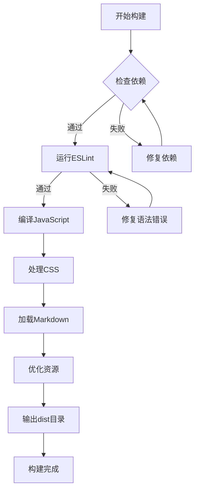

**图表来源**
- [前端package.json:1-55](file://med_ai_assistant_1.0_bs_vue/package.json#L1-L55)

## 版本更新记录

系统采用持续集成和持续部署的开发模式，版本更新记录详细记录了每次迭代的功能改进和问题修复。

### 最新版本 (v0.7.025)

#### 主要更新内容

1. **病历编辑防丢失功能全面上线**
   - 新增localStorage草稿自动保存机制，支持新增记录和编辑记录的差异化保存策略
   - 新增浏览器关闭/刷新时的beforeunload离开保护，防止意外关闭导致的数据丢失
   - 新增标签页隐藏时的自动保存保护，利用visibilitychange事件监听
   - 新增草稿恢复机制，支持编辑草稿和新增草稿的智能恢复
   - 新增7天过期草稿自动清理功能，保持localStorage空间整洁
   - 新增保存状态指示器，提供实时的保存状态反馈
   - 新增hasUnsavedChanges()统一脏检查方法，区分新增和编辑状态
   - 为12个防丢失相关方法添加完整JSDoc注释

2. **医学记录操作指南全面重构**
   - 新增病历编辑防丢失功能详细说明和操作指南
   - 扩展操作按钮功能表格，包含新增的防丢失保护功能
   - 补充浏览器兼容性配置指南和网络环境要求
   - 更新数据管理机制说明，增加localStorage使用说明

3. **前端构建系统稳定性增强**
   - **修复package.json语法错误导致的开发服务器启动失败问题**
   - 优化构建配置，提升开发环境稳定性
   - 增强前端依赖管理，确保依赖版本兼容性
   - 改进热重载机制，提升开发体验

4. **语音识别功能增强**
   - 修复生产环境语音识别上传413错误
   - 优化Nginx client_max_body_size配置
   - 同步后端multipart配置
   - 新增语音识别与LLM整理解耦功能

5. **待办事项生成功能完善**
   - 新增根据日期和科室获取待办事项接口
   - 新增根据患者ID获取待办事项列表接口
   - 新增根据病历记录ID获取待办事项接口
   - 完善待办事项状态管理和跟踪功能

6. **系统稳定性提升**
   - 修复Android平板上"AI辅助"子菜单点击后立即收起的问题
   - 新增触屏/桌面设备差异化交互
   - 优化浏览器兼容性配置
   - 改进语音识别按钮逻辑，支持选中文本替换

#### 版本升级指南

```bash
# 备份当前版本
cp -r med_ai_assistant_1.0_bs_backend backup_$(date +%Y%m%d)

# 拉取最新代码
git pull origin main

# 更新前端依赖
cd med_ai_assistant_1.0_bs_vue
npm install

# 清理缓存并重新安装
npm cache clean --force
rm -rf node_modules
npm install

# 验证构建
npm run build

# 启动开发服务器
npm run serve

cd ../med_ai_assistant_1.0_bs_backend
./mvnw clean install

# 重启服务
cd ../deploy/main-linux-oracle
./deploy.sh
```

### 历史版本特性

#### v0.6.082 - 前端构建系统修复
- 修复DRG AI分析保存Prompt时userId、sortNumber为空导致的ORA-01400错误
- 修复全局JSON响应中文编码问题（WebConfig添加UTF-8 MessageConverter）
- **修复前端package.json语法错误导致启动失败**

#### v0.6.081 - 非计划再次手术分析
- 改造非计划再次手术分析模块接入医院内网数据源
- DynamicJdbcTemplateFactory升级为HikariCP连接池
- RepeatOperation模块支持医院内网直连查询
- 修复Spring多构造函数注入歧义问题
- 修复前端正则表达式ESLint错误

#### v0.6.080 - DRG AI分析
- 新增DRG AI分析功能，支持自动DRG匹配和分析
- 优化DRG分析算法，提升匹配准确率
- 新增DRG分析结果可视化展示
- 完善DRG分析历史记录管理

#### v0.6.079 - Prompt模板优化
- 修复未执行Prompt列表不显示已提交Prompt的问题（后端合并查询）
- 优化未执行Prompt点击交互，跳过无效API调用并显示提示信息

#### v0.6.078 - 语音识别配置修复
- 修复生产环境语音识别上传413错误（Nginx client_max_body_size + 后端multipart配置同步）

#### v0.6.077 - 医学记录操作指南重构
- 病历记录操作指南全面重构：新增语音识别功能、待办事项生成功能、智录系统详细说明；添加操作按钮功能表格；补充浏览器兼容性配置指南；更新数据管理机制说明；前后端版本号从0.5.076更新至0.5.077

#### v0.6.076 - 语音识别Docker容器修复
- 修复生产环境语音识别Docker容器DNS解析失败（extra_hosts映射内网API代理+firewalld永久策略）

#### v0.6.075 - 设备兼容性优化
- 修复Android平板上"AI辅助"子菜单点击后立即收起的问题
- 新增触屏/桌面设备差异化交互
- 优化移动端用户体验

#### v0.6.074 - OCR数据采集方案
- 新增监护仪呼吸机AI OCR数据采集完整技术方案文档
- 更新未完成功能列表

#### v0.6.073 - Prompt模板增强
- AI辅助界面Prompt模板新增补充信息输入对话框（"请会诊记录"、"日常对话"模板支持用户输入补充信息）
- 支持"请会诊记录"、"日常对话"模板用户输入补充信息
- 优化Prompt模板的交互体验

#### v0.6.072 - AI对话优化
- 修复AI对话UI无内容显示问题
- 优化aiService.js非流式响应回调时序
- 改进语音识别与LLM整理功能解耦

#### v0.6.071 - 语音识别解耦
- 语音识别完成后不再自动调用LLM整理
- 用户可手动点击"文字整理"按钮触发
- 优化语音识别按钮逻辑，支持选中文本替换

#### v0.6.070 - 语音识别配置外化
- 修改VoiceFileRecognitionController配置
- 新增VoiceRecognitionProperties配置类
- 支持通过配置文件切换ASR服务提供商

#### v0.6.069 - 自动部署功能
- 创建POST /api/deploy/auto-deploy-backend接口
- 实现后端一键自动部署功能
- 添加完整的错误处理和日志记录

### 版本管理策略

#### 版本号规则

系统采用语义化版本控制：

```
主版本号.次版本号.修订号
```

- **主版本号**: 重大功能更新或不兼容的API变更
- **次版本号**: 新功能添加或向后兼容的功能改进
- **修订号**: 向后兼容的问题修复或小功能更新

#### 发布流程


**图表来源**
- [更新小结.md:1-500](file://更新小结.md#L1-L500)

## 总结

医疗AI助手系统是一个功能完备、架构清晰、安全可靠的综合性医疗信息系统。通过智能化的AI辅助诊断、高效的病历管理、安全的数据加密、完善的监控告警机制、新增的病历编辑防丢失功能、以及经过修复的稳定前端构建系统，系统为医护人员提供了强大的技术支持。

### 系统优势

1. **技术先进性**: 采用最新的Web技术和AI模型，提供智能化的医疗服务
2. **安全性保障**: 全面的数据加密和访问控制，确保医疗信息安全
3. **可扩展性**: 模块化设计和微服务架构，支持功能扩展和性能提升
4. **易用性**: 直观的用户界面和流畅的操作体验，降低学习成本
5. **可靠性**: 完善的监控告警和故障恢复机制，确保系统稳定运行
6. **智能化**: 新增语音识别、待办事项生成、智录系统等AI辅助功能
7. **兼容性**: 支持多种设备和浏览器，提供良好的用户体验
8. **稳定性**: 经过多次修复的前端构建系统，确保开发环境稳定可靠
9. **数据安全**: 新增的病历编辑防丢失功能，确保用户数据不会因意外情况而丢失

### 未来发展

1. **AI能力增强**: 持续优化AI模型，提升诊断准确性和智能化水平
2. **功能扩展**: 根据用户需求不断扩展系统功能和服务范围
3. **性能优化**: 持续优化系统性能，提升用户体验和响应速度
4. **安全保障**: 加强安全防护措施，确保医疗数据的绝对安全
5. **标准化建设**: 推进医疗信息化标准建设，促进系统间的互联互通
6. **智能化升级**: 持续引入新的AI技术，提升系统的智能化水平
7. **构建系统优化**: 持续改进前端构建系统，提升开发效率和稳定性
8. **数据保护增强**: 持续改进防丢失保护机制，提供更可靠的数据安全保障

通过持续的技术创新和功能完善，医疗AI助手系统将继续为医疗行业的数字化转型贡献力量，为患者提供更好的医疗服务体验。最新的病历编辑防丢失功能证明了团队对用户数据安全和体验的高度重视，为后续的开发和维护奠定了坚实的基础。