# 医学记录操作指南

<cite>
**本文档引用的文件**
- [更新小结.md](file://更新小结.md)
- [2026-04-24.md](file://med_ai_assistant_1.0_bs_backend/doc/更新日志/2026-04-24.md)
- [MedicalRecords.vue](file://med_ai_assistant_1.0_bs_vue/src/components/patient/MedicalRecords.vue)
- [TreatmentPlanTable.vue](file://med_ai_assistant_1.0_bs_vue/src/components/ai/TreatmentPlanTable.vue)
- [PatientSummary.vue](file://med_ai_assistant_1.0_bs_vue/src/components/patient/PatientSummary.vue)
- [AIResults.vue](file://med_ai_assistant_1.0_bs_vue/src/components/ai/AIResults.vue)
- [TodoView.vue](file://med_ai_assistant_1.0_bs_vue/src/views/TodoView.vue)
- [API文档.md](file://med_ai_assistant_1.0_bs_backend/doc/其他/API_DOCUMENTATION.md)
- [架构图.md](file://med_ai_assistant_1.0_bs_backend/doc/其他/ARCHITECTURE_DIAGRAMS.md)
- [主服务器部署指南.md](file://med_ai_assistant_1.0_bs_backend/deploy/main-linux-oracle/README.md)
- [前端README.md](file://med_ai_assistant_1.0_bs_vue/README.md)
- [前端package.json](file://med_ai_assistant_1.0_bs_vue/deploy/med_ai_assistant_1.0_bs_vue/package.json)
- [前端package.json](file://med_ai_assistant_1.0_bs_vue/package.json)
- [前端vue.config.js](file://med_ai_assistant_1.0_bs_vue/vue.config.js)
- [前端.env.development](file://med_ai_assistant_1.0_bs_vue/.env.development)
- [npm.bat](file://npm.bat)
- [医疗术语知识库.json](file://med_ai_assistant_1.0_bs_backend/memory-bank/knowledge-base/medical-terms/common-medical-terms.json)
- [内存配置.json](file://med_ai_assistant_1.0_bs_backend/memory-bank/config/memory-config.json)
- [根据日期和科室获取待办事项列表接口.md](file://med_ai_assistant_1.0_bs_backend/doc/接口/根据日期和科室获取待办事项列表接口.md)
- [根据患者ID获取待办事项列表接口.md](file://med_ai_assistant_1.0_bs_backend/doc/接口/根据患者ID获取待办事项列表接口.md)
- [实时语音识别接口.md](file://med_ai_assistant_1.0_bs_backend/doc/接口/实时语音识别接口.md)
- [语音识别与LLM整理解耦接口.md](file://med_ai_assistant_1.0_bs_backend/doc/接口/语音识别与LLM整理解耦接口.md)
- [病历记录管理接口.md](file://med_ai_assistant_1.0_bs_backend/doc/接口/病历记录/病历记录管理接口.md)
- [病历记录时间格式调整接口.md](file://med_ai_assistant_1.0_bs_backend/doc/接口/病历记录/病历记录时间格式调整接口.md)
- [待办事项接口.md](file://med_ai_assistant_1.0_bs_backend/doc/接口/病历记录/待办事项接口.md)
- [EMR病历内容查询接口.md](file://med_ai_assistant_1.0_bs_backend/doc/接口/病历记录/EMR病历内容查询接口.md)
- [EmrRecordListDTO.java](file://med_ai_assistant_1.0_bs_backend/src/main/java/com/example/medaiassistant/dto/EmrRecordListDTO.java)
- [EmrRecordContentDTO.java](file://med_ai_assistant_1.0_bs_backend/src/main/java/com/example/medaiassistant/dto/EmrRecordContentDTO.java)
- [emr-content-query.json](file://med_ai_assistant_1.0_bs_backend/sql/hospital-Local/emr-content-query.json)
- [promptUtils.js](file://med_ai_assistant_1.0_bs_vue/src/utils/promptUtils.js)
- [patient.js](file://med_ai_assistant_1.0_bs_vue/src/api/patient.js)
- [EmrSyncService.java](file://med_ai_assistant_1.0_bs_backend/src/main/java/com/example/medaiassistant/hospital/service/EmrSyncService.java)
- [EmrContentRepository.java](file://med_ai_assistant_1.0_bs_backend/src/main/java/com/example/medaiassistant/repository/EmrContentRepository.java)
- [EmrRecordService.java](file://med_ai_assistant_1.0_bs_backend/src/main/java/com/example/medaiassistant/service/EmrRecordService.java)
- [MedicalRecordController.java](file://med_ai_assistant_1.0_bs_backend/src/main/java/com/example/medaiassistant/controller/MedicalRecordController.java)
- [DatabaseCleanupUtil.java](file://med_ai_assistant_1.0_bs_backend/src/main/java/com/example/medaiassistant/util/DatabaseCleanupUtil.java)
</cite>

## 更新摘要
**所做更改**
- 新增v0.9.003版本变更：在病历记录页面新增「加入待办」按钮，支持选中文字加入待办事项
- 新增v0.9.002版本变更：移除病情小结页面的颜色标注功能
- 更新病历记录操作流程，包含新增的待办事项加入功能
- 更新待办事项生成流程，包含从病历内容和诊疗计划表格中加入待办事项
- 更新AI结果页面和病情小结页面的Thinking折叠功能说明
- 新增待办事项操作界面的交互说明

## 目录
1. [项目概述](#项目概述)
2. [系统架构](#系统架构)
3. [核心功能模块](#核心功能模块)
4. [API接口规范](#api接口规范)
5. [部署配置](#部署配置)
6. [数据管理](#数据管理)
7. [AI辅助功能](#ai辅助功能)
8. [系统监控](#系统监控)
9. [故障排查](#故障排查)
10. [前端构建系统稳定性](#前端构建系统稳定性)
11. [版本更新记录](#版本更新记录)

## 项目概述

医疗AI助手系统是一个基于现代Web技术栈的综合性医疗信息系统，专注于为医护人员提供智能化的病历记录管理和AI辅助诊断功能。该系统采用前后端分离架构，后端基于Spring Boot，前端基于Vue.js，实现了完整的医疗数据管理闭环。

### 系统特性

- **智能病历管理**：支持多种类型的病历记录创建、编辑、查询和管理
- **AI辅助诊断**：基于Prompt模板的智能诊断建议生成
- **语音识别集成**：实时语音转文字功能，支持多种识别模式
- **待办事项生成**：智能化的医疗任务自动生成和管理
- **智录系统**：智能录入助手，提升病历记录效率
- **多模态数据支持**：化验结果、检查报告、医嘱管理等
- **安全加密**：采用AES加密保护敏感医疗数据
- **分布式部署**：支持主服务器和执行服务器分离架构
- **稳定构建系统**：经过多次修复的前端构建系统，确保开发环境稳定
- **防丢失保护**：新增的病历编辑防丢失功能，确保用户数据安全
- **JSON字段名对齐**：完善的JSON字段名大小写对齐机制，解决生产环境显示问题
- **高并发数据同步**：增强的EMR病历内容同步模块，具备数据库约束处理能力和自动重试机制
- **思维过程折叠**：新增的Thinking标签折叠功能，提升AI结果可读性
- **入院记录替代**：首次病程记录模板的智能入院记录替代逻辑
- **重复ID记录处理**：修复IncorrectResultSizeDataAccessException，实现按修改时间降序取最新记录的机制
- **选中文字加入待办**：v0.9.003新增功能，支持从病历内容和诊疗计划中快速创建待办事项
- **简化病情小结显示**：v0.9.002移除颜色标注，提供更简洁的病情摘要展示

## 系统架构

系统采用分层架构设计，包含前端应用层、API网关层、业务服务层、核心服务层、数据访问层和数据存储层。

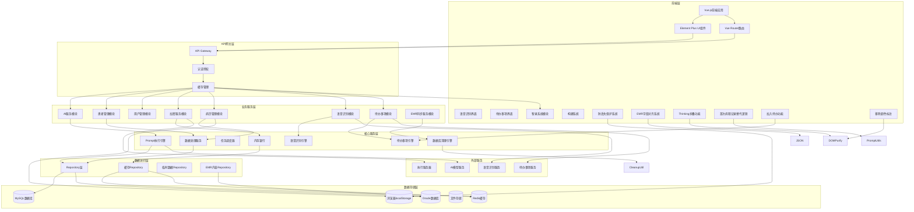

**图表来源**
- [架构图.md:5-60](file://med_ai_assistant_1.0_bs_backend/doc/其他/ARCHITECTURE_DIAGRAMS.md#L5-L60)

### 数据模型关系

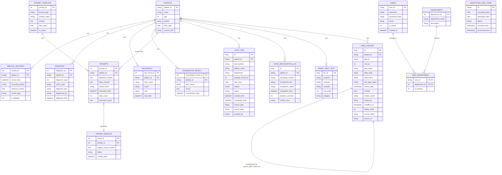

**图表来源**
- [架构图.md:64-181](file://med_ai_assistant_1.0_bs_backend/doc/其他/ARCHITECTURE_DIAGRAMS.md#L64-L181)

## 核心功能模块

### 病历记录管理

系统提供完整的病历记录生命周期管理，支持多种类型的病历记录创建、编辑、查询和删除操作。

#### 病历记录类型

| 记录类型 | 用途 | 特点 |
|---------|------|------|
| 入院记录 | 患者入院时的基础信息记录 | 包含入院时间、主诉、现病史等 |
| 病情小结 | 患者病情的阶段性总结 | 每日或定期生成，支持颜色标注 |
| 查房记录 | 医生查房时的临床观察记录 | 包含体征、诊断、治疗计划 |
| 病程记录 | 患者住院期间的详细医疗记录 | 连续性的病情变化记录 |
| 首次病程记录 | 患者入院后首次病程记录 | 基于入院记录和AI生成内容生成 |
| EMR病历记录 | 来自医院HIS系统的电子病历 | 直接同步的原始病历内容，具备高并发处理能力 |

#### v0.9.003 新增：选中文字加入待办功能

**新增功能**：在病历记录页面新增「加入待办」按钮，支持用户选中病历内容中的文字后快速创建待办事项。

**功能实现机制**：
1. **按钮集成**：在病历编辑工具栏中新增「加入待办」按钮，支持悬停提示
2. **选中检测**：通过textarea的selectionStart和selectionEnd属性检测用户选中的文字
3. **待办创建**：调用createTodoFromTreatmentPlan API创建待办事项
4. **状态管理**：使用addingToTodo标识防止重复提交
5. **错误处理**：完善的异常捕获和用户提示机制

**操作流程**：

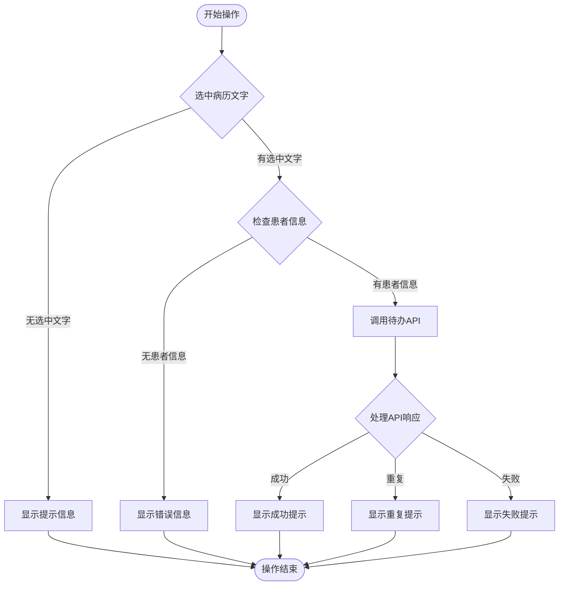

**图表来源**
- [MedicalRecords.vue:1525-1582](file://med_ai_assistant_1.0_bs_vue/src/components/patient/MedicalRecords.vue#L1525-L1582)

#### v0.9.002 更新：简化病情小结显示

**功能变更**：移除病情小结页面的颜色标注功能，提供更简洁的显示效果。

**变更内容**：
- 移除了住院时长信息行的颜色标注样式
- 简化了状态显示逻辑，统一使用基础颜色
- 保留了原有的状态分类功能，但去除了视觉强调

**影响范围**：
- 仅影响病情小结页面的视觉显示
- 不影响功能逻辑和数据处理
- 提供更简洁的用户界面体验

#### 病历记录操作流程

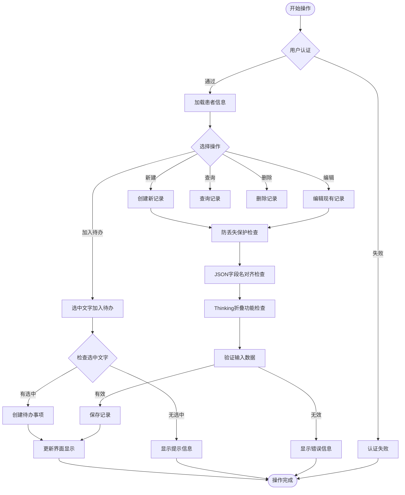

**图表来源**
- [架构图.md:185-232](file://med_ai_assistant_1.0_bs_backend/doc/other/ARCHITECTURE_DIAGRAMS.md#L185-L232)

### 诊疗计划表格待办事项功能

**新增功能**：在诊疗计划表格中支持从选中文字快速创建待办事项。

#### 功能实现机制

**选中文字优先处理**：
1. 检测用户是否在表格中有选中文字
2. 如果有选中文字，优先使用选中内容创建待办
3. 如果无选中文字，使用原项目描述创建待办

**统一API调用**：
- 使用createTodoFromTreatmentPlan API统一处理待办创建
- 支持内容匹配去重（同一患者+同一内容仅入库一条）
- 保持与病历记录页面一致的错误处理机制

**交互优化**：
- 每行独立的loading状态标识
- 成功/重复/失败的不同提示信息
- 自动恢复loading状态的finally处理

#### 诊疗计划待办事项流程

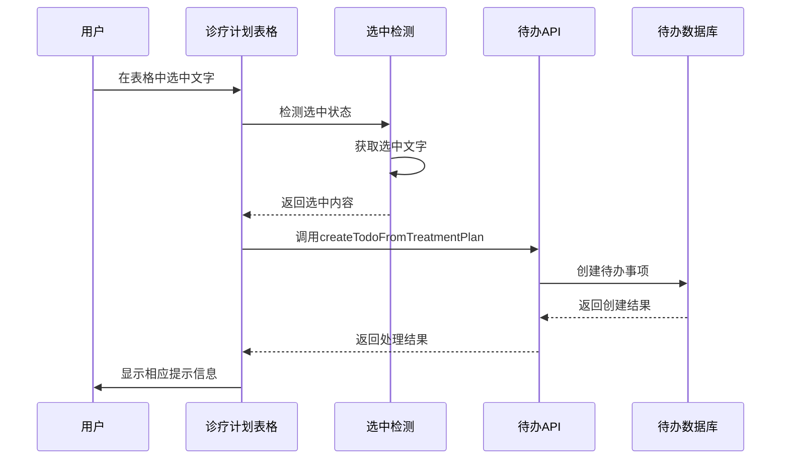

**图表来源**
- [TreatmentPlanTable.vue:632-724](file://med_ai_assistant_1.0_bs_vue/src/components/ai/TreatmentPlanTable.vue#L632-L724)

### 待办事项管理

系统提供完整的待办事项生命周期管理，支持从病历内容、诊疗计划等多种来源创建待办事项。

#### 待办事项来源

| 来源类型 | 创建方式 | 状态管理 |
|---------|---------|---------|
| 病历内容 | 选中文字加入待办 | 自动生成，支持去重 |
| 诊疗计划 | 行内编辑后加入待办 | 自动生成，支持去重 |
| AI生成 | AI结果页面加入待办 | 自动生成，支持去重 |
| 手工创建 | 手动输入创建待办 | 手工管理，状态跟踪 |

#### 待办事项操作界面

**新增功能**：v0.9.003版本增强了待办事项的操作界面，提供更直观的交互体验。

**界面布局**：
- 待办事项列表支持紧凑显示
- 每个待办项包含内容预览和状态标识
- 支持从待办列表直接查看详情
- 简化的待办内容显示，移除冗余信息

**交互优化**：
- 待办内容自动清理患者基本信息行
- 支持从多个来源查看待办事项
- 统一的待办状态管理和跟踪

**图表来源**
- [TodoView.vue:212-233](file://med_ai_assistant_1.0_bs_vue/src/views/TodoView.vue#L212-L233)
- [TodoView.vue:412-418](file://med_ai_assistant_1.0_bs_vue/src/views/TodoView.vue#L412-L418)

### 语音识别功能

系统支持多种语音识别模式，包括实时语音识别和录音文件识别，为医生提供便捷的语音输入方式。

#### 语音识别架构

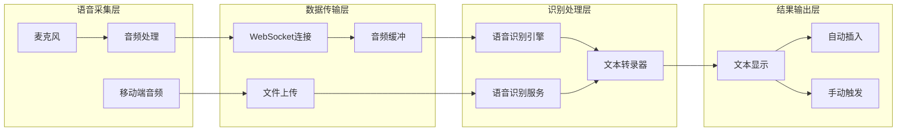

**图表来源**
- [架构图.md:268-306](file://med_ai_assistant_1.0_bs_backend/doc/其他/ARCHITECTURE_DIAGRAMS.md#L268-L306)

#### 语音识别模式

| 模式类型 | 传输方式 | 识别方式 | 适用场景 |
|---------|---------|---------|---------|
| 实时语音识别 | WebSocket | 实时流式识别 | 医生现场语音输入，实时转文字 |
| 录音文件识别 | HTTP上传 | 批量文件识别 | 录音后识别，支持长音频文件 |
| 智录系统识别 | 智录引擎 | 智能识别 | 结合智录系统，智能识别和整理 |

#### 语音识别操作流程

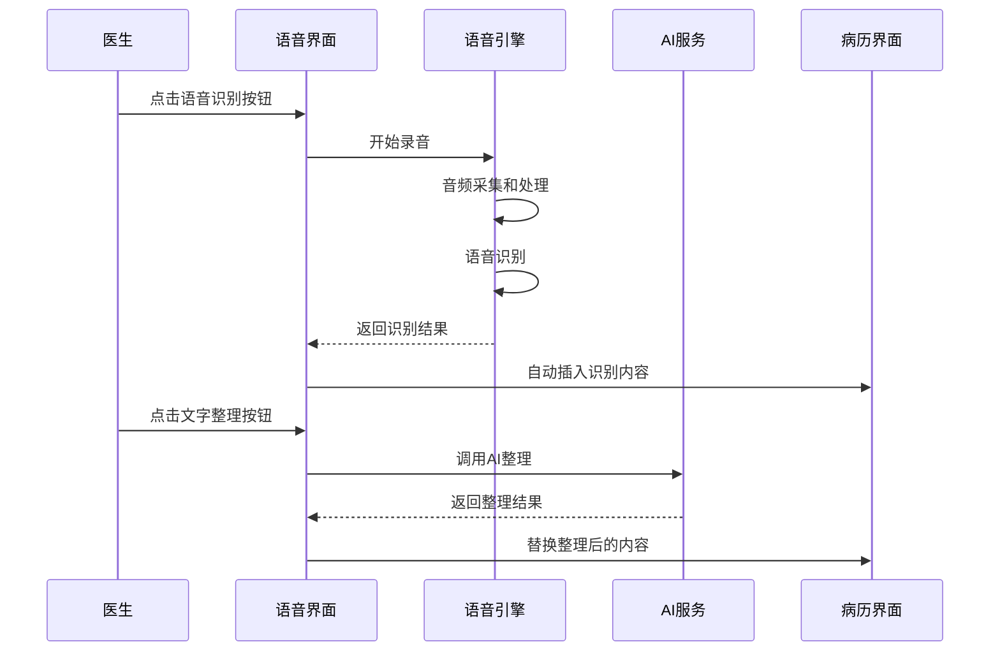

**图表来源**
- [语音识别与LLM整理解耦接口.md:97-143](file://med_ai_assistant_1.0_bs_backend/doc/接口/语音识别与LLM整理解耦接口.md#L97-L143)

### 智录系统

智录系统是医疗记录的智能助手，提供智能录入、模板匹配和内容优化功能。

#### 智录系统架构

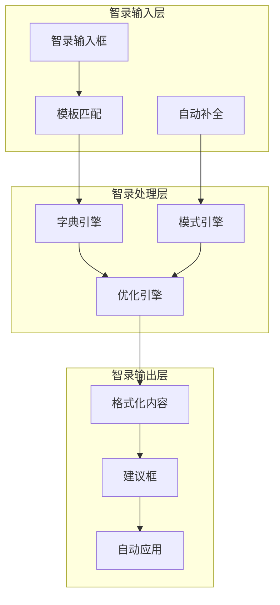

**图表来源**
- [架构图.md:268-306](file://med_ai_assistant_1.0_bs_backend/doc/其他/ARCHITECTURE_DIAGRAMS.md#L268-L306)

#### 智录字典管理

| 字典类型 | 字典内容 | 使用场景 |
|---------|---------|---------|
| 常用术语 | 医学常用词汇和缩写 | 病历记录中的术语标准化 |
| 检查项目 | 各种医学检查项目的标准表述 | 检查项目的规范化描述 |
| 治疗方案 | 常见疾病的治疗方案模板 | 治疗方案的标准化表述 |
| 诊断模板 | 各种诊断的标准化模板 | 诊断内容的规范化生成 |

### Thinking标签折叠功能

**新增功能**：为AI结果页面和病情小结页面添加<thinking>...</thinking>标签内容折叠处理功能。

#### AI结果页面Thinking折叠

**实现机制**：
1. **占位符策略**：先提取thinking块 → 解析主体markdown → 替换占位符为折叠HTML结构
2. **全局函数注册**：在mounted中注册全局window.toggleThinking函数，beforeUnmount中清理
3. **DOMPurify配置**：白名单配置允许onclick、id、class、style属性
4. **样式穿透**：使用:deep()穿透scoped样式，确保v-html渲染内容样式生效

**交互效果**：
- 默认折叠隐藏思维过程，显示💭"显示思维过程"提示
- 点击可展开查看完整思维链内容，再次点击收起
- 不含thinking标签的内容不受影响

#### 病情小结页面Thinking折叠

**实现机制**：
1. **DOMPurify库导入**：导入DOMPurify库进行HTML清理
2. **辅助方法封装**：新增parseWithThinking辅助方法，封装thinking折叠+markdown解析+DOMPurify清理
3. **统一处理逻辑**：formatMarkdown方法中所有marked.parse()调用替换为parseWithThinking()
4. **全局函数管理**：同样注册全局window.toggleThinking函数，添加beforeUnmount清理钩子
5. **统一图标风格**：统一使用💭图标，与AIResults.vue保持一致

**交互效果**：
- 默认折叠隐藏思维过程，显示💭"显示思维过程"提示
- 点击可展开查看完整思维链内容，再次点击收起
- 不含thinking标签的内容不受影响

**图表来源**
- [AIResults.vue:342-382](file://med_ai_assistant_1.0_bs_vue/src/components/ai/AIResults.vue#L342-L382)
- [PatientSummary.vue:179-224](file://med_ai_assistant_1.0_bs_vue/src/components/patient/PatientSummary.vue#L179-L224)

## API接口规范

系统提供完整的RESTful API接口，支持病历记录管理、AI诊断、用户管理、语音识别、待办事项等功能。

### 病历记录管理API

#### 获取病历记录列表

- **路径**: `/api/medicalrecords/emr-list`
- **方法**: GET
- **参数**: `patientId` (必需)
- **响应**: EmrRecordListDTO对象数组
- **特点**: 自动过滤已删除记录，按时间降序排列，字段名大小写对齐

#### 新增病历记录

- **路径**: `/api/medicalrecords/save`
- **方法**: POST
- **请求体**:
```json
{
  "patientId": "患者ID",
  "recordTime": "记录时间",
  "recordingDoctor": "记录医生",
  "medicalContent": "病历内容"
}
```

#### 获取格式化病历记录

- **路径**: `/api/medicalrecords/formatted`
- **方法**: GET
- **参数**: `patientId` (必需)
- **响应**: 格式化后的病历记录字符串

### 待办事项API

#### 创建待办事项（从治疗计划）

- **路径**: `POST /api/medicalrecords/create-todo-from-treatment-plan`
- **方法**: POST
- **请求体**:
```json
{
  "patientId": "患者ID",
  "itemDescription": "待办事项描述",
  "notes": "注意事项",
  "itemType": "项目类型",
  "importanceLevel": "重要程度",
  "treatmentPlanItemId": "治疗计划项ID"
}
```
- **响应**: 包含success、duplicate、message等字段的结果对象

#### 根据患者ID获取待办事项

- **路径**: `GET /api/medicalrecords/patient/{patientId}/todos`
- **方法**: GET
- **参数**: `patientId` (路径参数)
- **响应**: 待办事项列表，按创建时间降序排列

#### 根据日期和科室获取待办事项

- **路径**: `GET /api/medicalrecords/todos/by-date-department`
- **方法**: GET
- **参数**: 
  - `date` (必需): 查询日期，格式：yyyy-MM-dd
  - `department` (必需): 科室名称
- **响应**: 按床号升序排列的待办事项列表

#### 根据病历记录ID获取待办事项

- **路径**: `GET /api/medicalrecords/todo/{medicalRecordId}`
- **方法**: GET
- **参数**: `medicalRecordId` (路径参数)
- **响应**: 指定病历记录的所有待办事项

### AI服务API

#### 获取患者综合信息

- **路径**: `/api/ai/patient-comprehensive-info`
- **方法**: GET
- **参数**: `patientId` (必需)
- **响应**: 格式化后的患者综合信息字符串
- **包含内容**: 基本信息、诊断、病历记录、化验结果、检查结果等

#### AI响应服务

- **路径**: `/api/ai/response`
- **方法**: POST
- **请求体**:
```json
{
  "model": "deepseek-chat",
  "messages": [
    {
      "role": "user",
      "content": "解释心脏病症状"
    }
  ],
  "stream": false,
  "temperature": 0.7,
  "max_tokens": 2048
}
```

### Prompt模板管理API

#### 获取激活状态的Prompt模板

- **路径**: `/api/ai/activePromptTemplates`
- **方法**: GET
- **响应**: 激活状态的Prompt模板数组

#### 更新Prompt模板状态

- **路径**: `/api/ai/updatePromptActiveStatus`
- **方法**: PUT
- **参数**:
  - `promptId`: 模板ID (必需)
  - `isActive`: 激活状态 (必需)
- **响应**: 更新状态信息

## 部署配置

系统支持多种部署环境，包括开发环境、测试环境和生产环境。

### 主服务器部署

#### 环境要求

- **操作系统**: Linux 64位 (Ubuntu 20.04+, CentOS 7+, Debian 10+)
- **硬件要求**: CPU 2核+, 内存 4GB+, 磁盘 20GB可用空间
- **软件要求**: Docker 20.10+, Docker Compose 1.29+

#### 配置文件

**环境变量配置** (`main/.env`):
```properties
# Redis配置
REDIS_PASSWORD=your-secure-redis-password

# 执行服务器配置
EXECUTION_SERVER_HOST=100.66.1.2
EXECUTION_SERVER_PORT=8082
EXECUTION_SERVER_URL=http://100.66.1.2:8082

# AI模型配置
DEEPSEEK_API_KEY=your-deepseek-api-key-here
AI_MODEL_TIMEOUT=300000

# 加密配置
ENCRYPTION_AES_KEY=your-32-character-encryption-key
ENCRYPTION_AES_SALT=your-encryption-salt

# JVM配置
JAVA_OPTS=-Xms1g -Xmx2g -XX:+UseG1GC -XX:MaxGCPauseMillis=200
```

**应用配置** (`config/main/application.properties`):
```properties
# 数据库配置
spring.datasource.url=jdbc:oracle:thin:@//localhost:1521/orcl
spring.datasource.username=medai_user
spring.datasource.password=secure_password

# 日志配置
logging.level.com.example.medaiassistant=INFO
logging.level.org.springframework.web=INFO

# 缓存配置
spring.redis.host=localhost
spring.redis.port=6379
spring.redis.password=your-redis-password
```

### 执行服务器部署

执行服务器负责处理敏感数据的加密解密和AI模型调用，确保医疗数据的安全性。

#### 部署步骤

1. **准备环境**:
   ```bash
   # 安装Docker和Docker Compose
   curl -fsSL https://get.docker.com -o get-docker.sh
   sudo sh get-docker.sh
   
   # 验证安装
   docker --version
   docker-compose --version
   ```

2. **配置环境变量**:
   ```bash
   # 编辑 .env.execution
   vim .env.execution
   
   # 设置执行服务器专用配置
   EXECUTION_SERVER_MODE=production
   ENCRYPTION_KEY=your-secure-encryption-key
   ```

3. **启动服务**:
   ```bash
   # 构建并启动
   docker-compose -f docker-compose-execution.yml up -d --build
   
   # 查看日志
   docker-compose -f docker-compose-execution.yml logs -f
   ```

**图表来源**
- [主服务器部署指南.md:1-396](file://med_ai_assistant_1.0_bs_backend/deploy/main-linux-oracle/README.md#L1-L396)

## 数据管理

系统采用多层数据管理策略，确保医疗数据的完整性、安全性和可追溯性。

### 数据存储策略

#### 缓存策略

系统配置了智能的缓存策略，平衡内存使用和访问性能：

```json
{
  "maxMemoryUsageMB": 1024,
  "cleanupThresholdMB": 800,
  "cleanupIntervalMinutes": 30,
  "cacheEnabled": true,
  "knowledgeBaseEnabled": true,
  "retentionDays": {
    "patientData": 30,
    "aiResponses": 7,
    "sessionData": 1,
    "systemLogs": 90,
    "errorLogs": 180,
    "interactionLogs": 30,
    "voiceRecognitionLogs": 30,
    "todoItems": 7
  }
}
```

#### 数据加密

所有敏感医疗数据在传输和存储过程中都经过AES加密：

- **加密算法**: AES-256-CBC
- **密钥管理**: 环境变量配置
- **盐值处理**: 随机生成的16字节盐值
- **数据范围**: 患者姓名、诊断信息、病历内容等

### 数据同步机制

系统支持多数据源的实时同步，确保不同环境间的数据一致性。

#### 同步流程


**图表来源**
- [架构图.md:234-264](file://med_ai_assistant_1.0_bs_backend/doc/其他/ARCHITECTURE_DIAGRAMS.md#L234-L264)

### 语音识别数据管理

#### 语音识别日志

系统提供完整的语音识别数据管理功能：

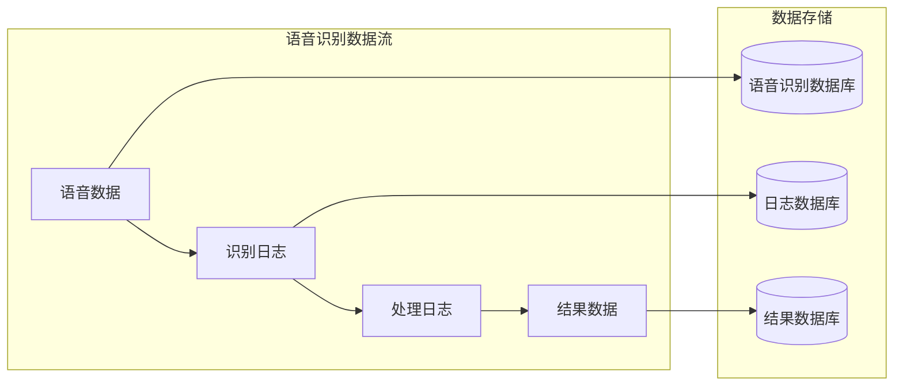

**图表来源**
- [语音识别与LLM整理解耦接口.md:28-51](file://med_ai_assistant_1.0_bs_backend/doc/接口/语音识别与LLM整理解耦接口.md#L28-L51)

### 病历编辑防丢失数据管理

**新增功能**：系统现在提供完整的病历编辑防丢失数据管理机制。

#### localStorage草稿存储策略

系统使用localStorage实现智能草稿存储：

- **草稿键名格式**：
  - 新增记录：`med_draft_{patientId}_new`
  - 编辑记录：`med_draft_{patientId}_{recordId}`
- **草稿内容结构**：
  - 新增记录：保存完整表单字段（内容、日期、医生、记录类型）
  - 编辑记录：仅保存内容与记录ID
- **时间戳管理**：每个草稿包含保存时间戳，用于过期判断

#### 草稿恢复机制

系统提供智能的草稿恢复功能：

- **自动检测**：启动时自动检测是否存在匹配的草稿
- **年龄提示**：显示草稿保存的相对时间（刚刚、几分钟前、几小时前、几天前）
- **恢复确认**：通过对话框确认是否恢复草稿
- **内容填充**：恢复时自动填充相应的表单字段

#### 过期清理机制

系统自动清理过期的草稿数据：

- **清理策略**：删除超过7天未更新的草稿
- **遍历机制**：启动时遍历localStorage中的所有草稿
- **异常容错**：解析失败的草稿也会被自动清理
- **内存优化**：定期清理过期数据，避免localStorage空间膨胀

### EMR病历内容查询数据管理

**新增功能**：系统现在提供完整的EMR病历内容查询数据管理机制。

#### JSON字段名对齐策略

系统实现了完整的JSON字段名大小写对齐策略：

- **字段名映射**：
  - 后端ID字段 → 前端id（小写）
  - 后端CONTENT字段 → 前端content（小写）
  - 文档类型字段保持原有大小写（doc_TYPE_NAME）
  - 文档标题时间字段保持原有大小写（doc_TITLE_TIME）

- **序列化配置**：使用@JsonProperty注解确保字段名对齐
- **兼容性保证**：解决生产环境中的显示问题
- **测试验证**：通过单元测试验证字段名对齐的正确性

#### 数据同步机制

系统支持EMR病历内容的实时同步：

- **数据源**：EMR_CONTENT表，通过EmrSyncService从医院HIS系统（Oracle）同步
- **同步策略**：增量同步，已存在的记录会更新，新记录会插入
- **去重策略**：采用SOURCE_TABLE + SOURCE_ID组合作为去重标识
- **软删除处理**：自动过滤DELETEMARK≠0的记录

#### 数据库约束处理机制

**新增功能**：系统现在提供完整的数据库约束处理机制，确保高并发场景下的数据一致性。

**TOCTOU竞态条件修复**：
- 使用`findAllBySourceTableAndSourceId()`方法替代`findBySourceTableAndSourceId()`
- 在并发场景下，通过List查询支持重试机制
- 避免查询到空结果后，其他线程先插入导致的唯一约束冲突

**JPA批处理优化**：
- 将`save()`替换为`saveAndFlush()`，避免JPA批处理延迟执行
- 每条记录立即提交SQL，异常精准对应当前记录
- 便于调试和重试操作

**自动重试机制**：
- UPDATE路径：约束冲突时清除Session后重新查询并更新
- INSERT路径：约束冲突时降级为UPDATE操作
- 使用`entityManager.clear()`确保持久化上下文一致性

**数据库清理工具**：
- 提供`handleIntegrityConstraintViolation()`方法处理约束冲突
- 支持记录存在性检查、清理冲突记录、直接重试操作
- 记录详细的错误日志和处理建议

#### EMR记录选择错误调试信息增强

**新增功能**：当在EMR记录列表中选择某条记录时，如果发生任何错误，系统会在调试信息中详细输出完整的错误信息。

**后端增强**：
- **EmrRecordService.java**：添加详细的日志记录，包括请求开始时间、记录ID、耗时
- **MedicalRecordController.java**：记录请求开始时间和操作时间戳
- **getStackTrace()方法**：将异常堆栈转换为字符串

**前端增强**：
- **MedicalRecords.vue**：增强handleEMRRecordClick方法的错误调试信息
- **详细错误对象**：包含错误类型、错误消息、完整堆栈跟踪、时间戳、操作耗时
- **网络错误区分**：区分服务器响应错误vs网络请求错误

**调试日志格式**：
- 后端日志前缀：`[EMR记录详情]`
- 前端日志前缀：`[EMR记录详情]`
- 包含上下文：recordId、patientId、docType、耗时、时间戳

**图表来源**
- [EmrRecordService.java:239-264](file://med_ai_assistant_1.0_bs_backend/src/main/java/com/example/medaiassistant/service/EmrRecordService.java#L239-L264)
- [MedicalRecordController.java:244-271](file://med_ai_assistant_1.0_bs_backend/src/main/java/com/example/medaiassistant/controller/MedicalRecordController.java#L244-L271)

#### IncorrectResultSizeDataAccessException修复机制

**新增功能**：版本0.8.020中修复了IncorrectResultSizeDataAccessException问题，实现了更加稳定的List返回机制。

**问题分析**：
- **异常原因**：在存在重复ID记录的情况下，使用Optional返回可能导致IncorrectResultSizeDataAccessException
- **异常场景**：JPA无法确定应该返回多少条记录，导致异常抛出
- **影响范围**：EMR病历内容查询接口，特别是存在重复ID记录的场景

**修复方案**：
1. **List返回机制**：Repository层返回`List<String>`而非`Optional<String>`
2. **重复ID处理**：当检测到多条记录时，按modifiedOn降序排列，取第一条（最新记录）
3. **日志记录**：检测到重复记录时记录WARN日志，便于后续数据清理
4. **排序策略**：使用`ORDER BY e.modifiedOn DESC NULLS LAST`确保按修改时间降序

**实现细节**：
- **Repository层**：`findContentById()`方法返回List<String>
- **Service层**：`getEmrRecordContentById()`方法处理List结果
- **排序策略**：`ORDER BY e.modifiedOn DESC NULLS LAST`
- **异常处理**：捕获并处理NumberFormatException和Exception

**业务逻辑**：
1. 查询指定ID的所有EMR记录
2. 按modifiedOn降序排列（NULL值排在最后）
3. 取第一条记录作为最新内容返回
4. 如有多条记录，记录WARN日志用于数据清理
5. 返回EmrRecordContentDTO对象

**图表来源**
- [EmrContentRepository.java:114-125](file://med_ai_assistant_1.0_bs_backend/src/main/java/com/example/medaiassistant/repository/EmrContentRepository.java#L114-L125)
- [EmrRecordService.java:208-258](file://med_ai_assistant_1.0_bs_backend/src/main/java/com/example/medaiassistant/service/EmrRecordService.java#L208-L258)

## AI辅助功能

系统集成了先进的AI辅助诊断功能，通过机器学习和自然语言处理技术为医生提供智能化的医疗决策支持。

### AI模型配置

#### 支持的AI模型

| 模型名称 | 用途 | 配置参数 |
|---------|------|----------|
| deepseek-chat | 通用对话和诊断分析 | temperature: 0.7, max_tokens: 2048 |
| inHospitalDeepseek | 医院内部专用模型 | temperature: 0.5, max_tokens: 4096 |
| qwen3-asr-flash | 语音识别 | 模型版本: qwen3-asr-flash |

#### AI参数调优

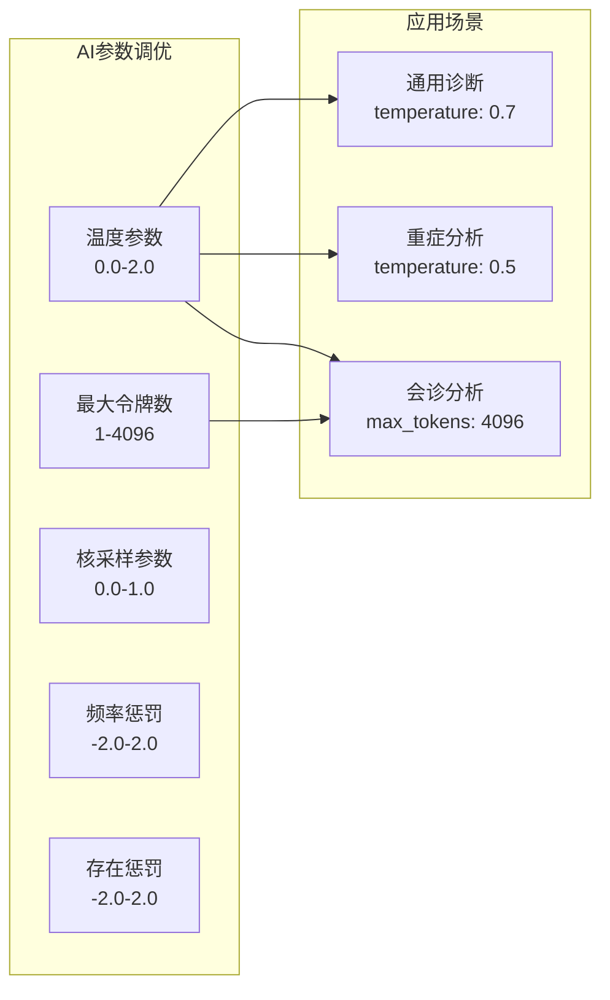

**图表来源**
- [API文档.md:400-424](file://med_ai_assistant_1.0_bs_backend/doc/其他/API_DOCUMENTATION.md#L400-L424)

### Prompt模板管理

系统提供了灵活的Prompt模板管理系统，支持自定义模板的创建、编辑和版本控制。

#### 模板类型

| 模板类型 | 用途 | 示例 |
|---------|------|------|
| 诊断分析 | 疾病诊断建议 | "基于患者的症状和检查结果，分析可能的诊断..." |
| 治疗方案 | 治疗计划制定 | "为该患者制定个性化的治疗方案..." |
| 病情小结 | 病情总结报告 | "总结患者三天内的病情变化和治疗效果..." |
| 查房记录 | 医生查房记录 | "记录今日查房时患者的体征和病情观察..." |
| 首次病程记录 | 患者入院后首次病程记录 | "根据入院记录和辅助检查，撰写首次病程记录..." |

#### 模板参数

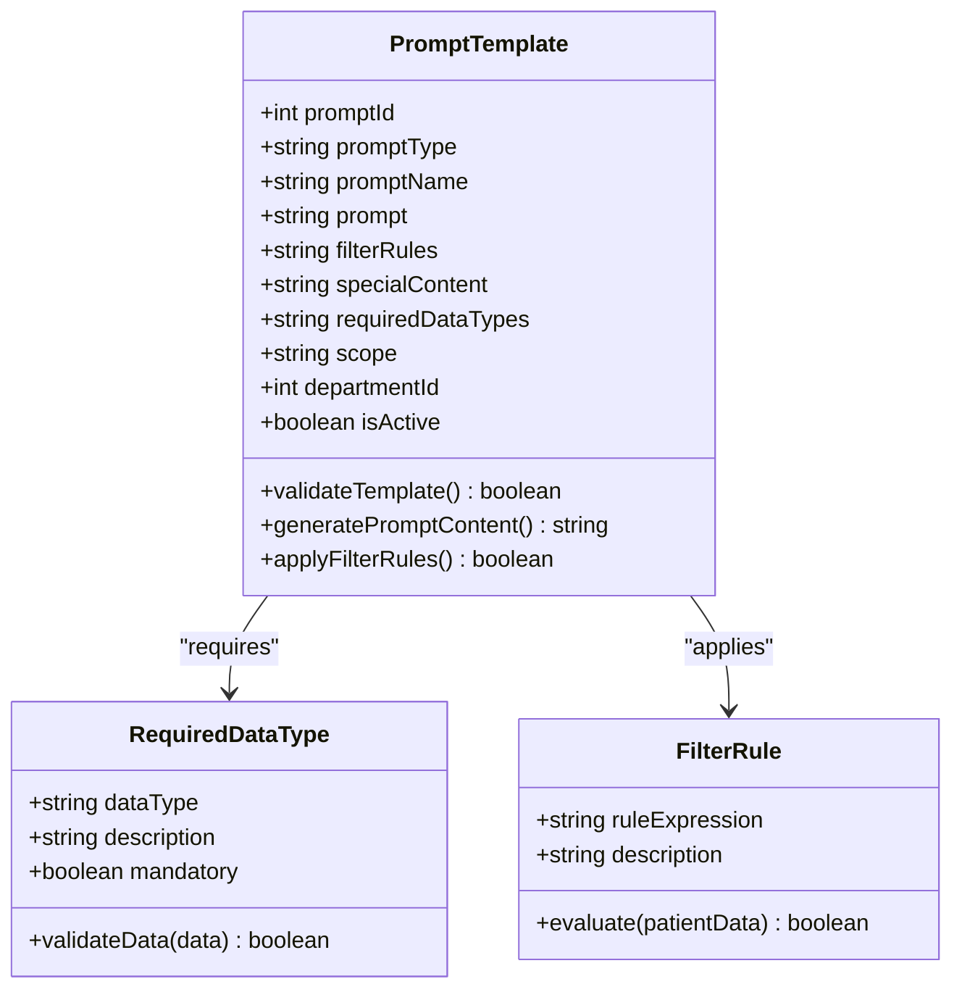

**图表来源**
- [API文档.md:686-782](file://med_ai_assistant_1.0_bs_backend/doc/其他/API_DOCUMENTATION.md#L686-L782)

### 待办事项AI分析

#### AI生成待办事项流程

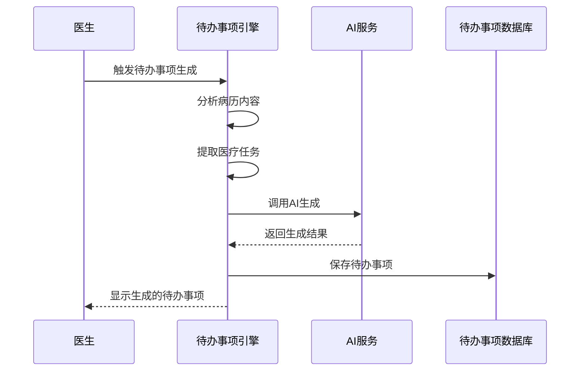

**图表来源**
- [架构图.md:185-232](file://med_ai_assistant_1.0_bs_backend/doc/其他/ARCHITECTURE_DIAGRAMS.md#L185-L232)

## 系统监控

系统内置了完善的监控和告警机制，确保服务的稳定运行和及时发现问题。

### 性能监控

#### 监控指标

| 监控类别 | 指标名称 | 阈值设置 | 告警级别 |
|---------|---------|---------|---------|
| 系统资源 | CPU使用率 | >80% | 警告 |
| 系统资源 | 内存使用率 | >85% | 危险 |
| 系统资源 | 磁盘空间 | <10%可用 | 警告 |
| 应用性能 | 响应时间 | >2秒 | 警告 |
| 应用性能 | 错误率 | >5% | 危险 |
| 数据库性能 | 连接池使用率 | >90% | 危险 |
| 缓存性能 | 缓存命中率 | <70% | 警告 |
| 语音识别 | 识别成功率 | <80% | 警告 |
| 待办事项 | 生成成功率 | <85% | 警告 |
| 防丢失保护 | 草稿保存成功率 | <95% | 警告 |
| 防丢失保护 | 草稿恢复成功率 | <90% | 警告 |
| JSON字段对齐 | 字段名匹配率 | <100% | 危险 |
| EMR病历查询 | 查询成功率 | <95% | 警告 |
| EMR同步 | 并发冲突率 | >1% | 警告 |
| 数据库约束 | 约束冲突率 | >0.1% | 警告 |
| JPA批处理 | 批处理延迟 | >500ms | 警告 |
| Thinking折叠 | 折叠功能可用性 | <100% | 警告 |
| 首次病程记录 | 替代逻辑成功率 | <95% | 警告 |
| IncorrectResultSizeDataAccessException | 异常发生率 | >0 | 警告 |
| 重复ID记录处理 | 处理成功率 | <100% | 警告 |
| 选中文字加入待办 | 加入成功率 | <95% | 警告 |
| 病情小结颜色标注 | 标注功能可用性 | <100% | 警告 |

#### 监控配置

**内存银行监控** (`memory-config.json`):
```json
{
  "monitoring": {
    "enabled": true,
    "checkIntervalSeconds": 60,
    "alertThresholdMB": 900
  },
  "performance": {
    "maxConcurrentOperations": 10,
    "ioThreads": 4,
    "bufferSizeKB": 64
  }
}
```

### 健康检查

系统提供多层次的健康检查机制：

#### 服务健康检查

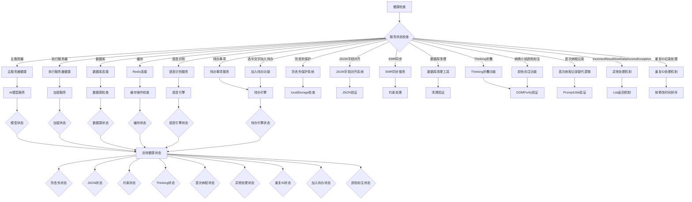

**图表来源**
- [架构图.md:340-391](file://med_ai_assistant_1.0_bs_backend/doc/其他/ARCHITECTURE_DIAGRAMS.md#L340-L391)

## 故障排查

### 常见问题及解决方案

#### 部署相关问题

| 问题类型 | 症状描述 | 解决方案 |
|---------|---------|---------|
| 容器启动失败 | 容器启动后立即退出 | 检查端口占用，查看容器日志，验证环境变量配置 |
| 网络连接失败 | 无法连接到执行服务器 | 检查网络连通性，验证防火墙设置，确认服务器地址配置 |
| 数据库连接错误 | 应用启动时报数据库连接失败 | 检查数据库服务状态，验证连接参数，确认网络可达性 |
| 内存不足 | 应用频繁重启或性能下降 | 调整JVM参数，增加系统内存，优化应用配置 |

#### 性能问题

| 问题类型 | 症状描述 | 解决方案 |
|---------|---------|---------|
| 响应缓慢 | API响应时间超过阈值 | 分析慢查询，优化数据库索引，增加缓存策略 |
| 内存泄漏 | 内存使用持续增长 | 检查资源释放，优化对象生命周期，启用内存监控 |
| 并发问题 | 高并发场景下系统不稳定 | 调整线程池配置，优化锁机制，增加负载均衡 |

#### 数据相关问题

| 问题类型 | 症状描述 | 解决方案 |
|---------|---------|---------|
| 数据不一致 | 不同环境间数据差异 | 检查同步机制，验证数据转换逻辑，确认事务一致性 |
| 缓存失效 | 缓存数据过期或错误 | 清理缓存，检查缓存配置，验证数据更新策略 |
| 加密失败 | 敏感数据无法正确加密/解密 | 检查密钥配置，验证加密算法，确认密钥轮换策略 |

#### 语音识别问题

| 问题类型 | 症状描述 | 解决方案 |
|---------|---------|---------|
| 识别失败 | 语音无法识别或识别错误 | 检查音频质量，验证API配置，确认网络连接 |
| 实时识别延迟高 | 实时语音识别延迟超过1秒 | 检查网络质量，优化音频缓冲，调整识别参数 |
| 录音文件过大 | 录音文件超过500MB限制 | 分割音频文件，优化音频压缩，检查文件格式 |

#### 待办事项问题

| 问题类型 | 症状描述 | 解决方案 |
|---------|---------|---------|
| 生成失败 | 待办事项无法生成 | 检查AI服务状态，验证病历内容，确认模板配置 |
| 任务重复 | 待办事项重复生成 | 检查去重逻辑，验证生成规则，确认数据库状态 |
| 状态异常 | 待办事项状态不正确 | 检查状态更新逻辑，验证任务执行，确认数据库一致性 |
| 加入待办失败 | 选中文字无法创建待办 | 检查选中检测逻辑，验证API调用，确认权限配置 |

#### 病历编辑防丢失问题

**新增功能故障排查**：

| 问题类型 | 症状描述 | 解决方案 |
|---------|---------|---------|
| 草稿无法保存 | localStorage保存失败 | 检查浏览器localStorage权限，清理过期草稿，验证存储配额 |
| 草稿无法恢复 | 草稿加载失败或过期 | 检查草稿键名格式，验证草稿内容结构，确认时间戳有效性 |
| 离开保护失效 | 页面关闭时未提示 | 检查beforeunload事件绑定，验证hasUnsavedChanges方法，确认事件优先级 |
| 标签页隐藏保护失效 | 标签页隐藏时未保存 | 检查visibilitychange事件监听，验证document.hidden状态，确认保存时机 |
| 草稿清理异常 | 过期草稿未被清理 | 检查清理策略逻辑，验证时间计算准确性，确认异常处理机制 |
| 保存状态指示器异常 | 状态标签显示不正确 | 检查状态更新逻辑，验证消息提示机制，确认UI更新时机 |

#### JSON字段名对齐问题

**新增功能故障排查**：

| 问题类型 | 症状描述 | 解决方案 |
|---------|---------|---------|
| 字段名不匹配 | 前端无法读取数据 | 检查@JsonProperty注解配置，验证字段名映射关系 |
| 大小写不一致 | 字段名大小写不符合预期 | 检查字段名大小写策略，确认小写字段名的使用 |
| JSON序列化失败 | DTO对象序列化异常 | 检查DTO类的字段定义，验证Jackson注解的正确性 |
| 前端显示异常 | 病历内容无法正确显示 | 检查前端数据绑定逻辑，验证字段名对齐的正确性 |
| EMR病历查询失败 | EMR内容查询接口异常 | 检查EMR病历查询逻辑，验证字段名对齐和数据映射 |

#### EMR病历内容同步问题

**新增功能故障排查**：

| 问题类型 | 症状描述 | 解决方案 |
|---------|---------|---------|
| 并发冲突 | UPDATE操作触发唯一约束冲突 | 检查saveAndFlush()使用，验证entityManager.clear()调用 |
| TOCTOU竞态条件 | 查询后插入时触发冲突 | 检查findAllBySourceTableAndSourceId()使用，验证重试逻辑 |
| JPA批处理延迟 | 批量操作异常定位困难 | 检查save() vs saveAndFlush()使用，确认异常堆栈准确性 |
| 数据库约束冲突 | 约束冲突重试失败 | 检查DatabaseCleanupUtil使用，验证清理策略有效性 |
| EMR同步性能问题 | 高并发场景下性能下降 | 检查索引使用，验证查询优化，确认连接池配置 |

#### Thinking折叠功能问题

**新增功能故障排查**：

| 问题类型 | 症状描述 | 解决方案 |
|---------|---------|---------|
| 折叠功能失效 | thinking标签无法折叠 | 检查parseMarkdown方法，验证占位符替换逻辑 |
| 样式不生效 | 折叠样式显示异常 | 检查:deep()样式穿透，验证DOMPurify白名单配置 |
| 全局函数冲突 | window.toggleThinking函数冲突 | 检查mounted和beforeUnmount钩子，确认函数注册清理 |
| 内容显示异常 | thinking内容无法正确显示 | 检查marked.parse()调用，验证HTML结构生成 |
| 交互效果异常 | 折叠展开交互不响应 | 检查onclick事件绑定，验证元素选择器有效性 |

#### 首次病程记录替代逻辑问题

**新增功能故障排查**：

| 问题类型 | 症状描述 | 解决方案 |
|---------|---------|---------|
| 替代逻辑不生效 | AI入院记录未自动替换 | 检查isFirstCourseRecord标志位，验证getLatestPromptResult调用 |
| 并行查询失败 | getLatestPromptResult调用异常 | 检查Promise.all并行处理，验证错误捕获机制 |
| 占位符替换失败 | '无入院记录数据'占位符未替换 | 检查字符串替换逻辑，验证正则表达式匹配 |
| 警告提示异常 | ElMessage警告未显示 | 检查ElMessage调用，验证错误处理流程 |
| 生成取消异常 | Prompt生成未取消 | 检查返回逻辑，验证错误状态传播 |

#### EMR记录选择错误调试信息问题

**新增功能故障排查**：

| 问题类型 | 症状描述 | 解决方案 |
|---------|---------|---------|
| 调试信息缺失 | 无详细错误日志 | 检查handleEMRRecordClick方法，验证错误对象构建 |
| 日志格式异常 | 日志输出格式不正确 | 检查日志前缀和上下文信息，验证格式化字符串 |
| 网络错误区分失败 | 服务器响应错误和网络请求错误混淆 | 检查error.response vs error.request判断逻辑 |
| 用户提示不友好 | 错误提示信息不包含记录ID | 检查错误消息构建，验证记录ID包含逻辑 |
| 前端日志异常 | 前端console.error未输出 | 检查前端日志配置，验证错误处理流程 |

#### IncorrectResultSizeDataAccessException问题

**新增功能故障排查**：

| 问题类型 | 症状描述 | 解决方案 |
|---------|---------|---------|
| 异常发生 | 查询重复ID记录时抛出IncorrectResultSizeDataAccessException | 检查Repository层返回类型，验证List vs Optional的使用 |
| 重复记录处理失败 | 多条记录时未正确取最新记录 | 检查modifiedOn排序逻辑，验证ORDER BY e.modifiedOn DESC NULLS LAST |
| 日志记录异常 | 重复记录检测未记录WARN日志 | 检查contentList.size() > 1条件判断，验证日志记录逻辑 |
| 业务逻辑异常 | 返回空内容而非最新记录 | 检查get(0)取值逻辑，验证第一条记录的正确性 |
| 性能问题 | 按modifiedOn排序影响查询性能 | 检查数据库索引使用，验证排序字段的索引优化 |

#### 选中文字加入待办功能问题

**新增功能故障排查**：

| 问题类型 | 症状描述 | 解决方案 |
|---------|---------|---------|
| 选中检测失败 | 无法检测到用户选中的文字 | 检查textarea的selectionStart和selectionEnd属性 |
| API调用异常 | createTodoFromTreatmentPlan调用失败 | 检查API配置，验证请求参数格式 |
| 状态管理异常 | addingToTodo状态未正确更新 | 检查loading状态设置和清理逻辑 |
| 错误处理异常 | 异常捕获和用户提示不正确 | 检查catch块和消息提示逻辑 |
| 重复创建问题 | 同一内容重复创建待办 | 检查去重逻辑和数据库约束 |

#### 病情小结颜色标注移除问题

**新增功能故障排查**：

| 问题类型 | 症状描述 | 解决方案 |
|---------|---------|---------|
| 颜色样式残留 | 仍有颜色标注样式未移除 | 检查CSS样式文件，确认样式完全移除 |
| 状态显示异常 | 状态分类功能受影响 | 检查状态逻辑，确认简化后的显示正常 |
| 用户反馈问题 | 用户对简化显示不满意 | 检查用户反馈，确认功能符合预期 |
| 兼容性问题 | 不同浏览器显示效果不一致 | 检查CSS兼容性，验证跨浏览器一致性 |

#### 前端构建系统问题

**最新修复案例**：**package.json语法错误导致开发服务器启动失败**

- **问题描述**: package.json文件中存在语法错误，导致npm run serve命令无法正常启动开发服务器
- **症状表现**: 
  - npm run serve命令执行时报语法错误
  - 开发服务器无法启动，端口8080无法访问
  - 控制台显示JSON解析错误
- **解决方案**:
  1. 检查package.json文件的语法结构
  2. 确保所有对象属性之间都有正确的逗号分隔
  3. 验证字符串值使用正确的引号
  4. 确保JSON对象闭合正确
  5. 使用在线JSON验证工具检查语法
- **预防措施**:
  1. 在修改package.json后使用JSON验证工具
  2. 遵循严格的JSON语法规范
  3. 定期备份package.json文件
  4. 使用IDE的JSON语法检查功能

### 调试工具

#### 日志分析

系统提供了丰富的日志分析工具：

1. **应用日志**:
   ```bash
   # 查看主服务器日志
   docker logs med-ai-main -f
   
   # 查看错误日志
   tail -f logs/main/main-server.log | grep ERROR
   
   # 查看慢请求日志
   tail -f logs/main/main-server.log | grep "took more than"
   ```

2. **数据库日志**:
   ```bash
   # 查看数据库连接日志
   docker logs med-ai-mysql | grep "Connection"
   
   # 查看慢查询日志
   docker logs med-ai-mysql | grep "Query_time"
   ```

3. **缓存日志**:
   ```bash
   # 查看Redis日志
   docker logs med-ai-main-redis | grep "error"
   
   # 检查缓存命中率
   docker exec med-ai-main-redis redis-cli info | grep "keyspace"
   ```

4. **语音识别日志**:
   ```bash
   # 查看语音识别日志
   tail -f logs/main/voice-recognition.log
   
   # 检查识别成功率
   tail -f logs/main/voice-recognition.log | grep "success_rate"
   ```

5. **待办事项日志**:
   ```bash
   # 查看待办事项日志
   tail -f logs/main/todo-generation.log
   
   # 检查生成成功率
   tail -f logs/main/todo-generation.log | grep "generation_success"
   ```

6. **防丢失保护日志**:
   ```bash
   # 查看草稿保存日志
   tail -f logs/main/draft-protection.log
   
   # 检查草稿恢复成功率
   tail -f logs/main/draft-protection.log | grep "draft_recovery"
   
   # 检查localStorage使用情况
   tail -f logs/main/localstorage-monitor.log
   ```

7. **JSON字段对齐日志**:
   ```bash
   # 查看JSON序列化日志
   tail -f logs/main/json-field-alignment.log
   
   # 检查字段名对齐成功率
   tail -f logs/main/json-field-alignment.log | grep "field_alignment"
   
   # 检查EMR病历查询日志
   tail -f logs/main/emr-content-query.log
   ```

8. **EMR同步日志**:
   ```bash
   # 查看EMR同步日志
   tail -f logs/main/emr-sync.log
   
   # 检查并发冲突率
   tail -f logs/main/emr-sync.log | grep "constraint_conflict"
   
   # 检查重试成功率
   tail -f logs/main/emr-sync.log | grep "retry_success"
   ```

9. **数据库约束处理日志**:
   ```bash
   # 查看数据库清理日志
   tail -f logs/main/database-cleanup.log
   
   # 检查约束冲突处理成功率
   tail -f logs/main/database-cleanup.log | grep "constraint_handled"
   
   # 检查JPA批处理性能
   tail -f logs/main/jpa-batch.log | grep "batch_flush_time"
   ```

10. **Thinking折叠日志**:
    ```bash
    # 查看Thinking折叠日志
    tail -f logs/main/thinking-fold.log
    
    # 检查折叠功能可用性
    tail -f logs/main/thinking-fold.log | grep "fold_function"
    
    # 检查DOMPurify使用情况
    tail -f logs/main/dompurify-validation.log
    ```

11. **首次病程记录日志**:
    ```bash
    # 查看首次病程记录日志
    tail -f logs/main/first-course-substitute.log
    
    # 检查替代逻辑成功率
    tail -f logs/main/first-course-substitute.log | grep "substitute_success"
    
    # 检查AI入院记录查询
    tail -f logs/main/ai-admission-query.log
    ```

12. **EMR记录选择日志**:
    ```bash
    # 查看EMR记录选择日志
    tail -f logs/main/emr-record-selection.log
    
    # 检查错误调试信息
    tail -f logs/main/emr-record-selection.log | grep "debug_info"
    
    # 检查网络错误分类
    tail -f logs/main/emr-record-selection.log | grep "network_error"
    ```

13. **IncorrectResultSizeDataAccessException日志**:
    ```bash
    # 查看异常处理日志
    tail -f logs/main/irsd-ae-handler.log
    
    # 检查重复ID记录处理
    tail -f logs/main/duplicate-id-handler.log | grep "duplicate_record"
    
    # 检查按修改时间排序
    tail -f logs/main/modified-on-sort.log | grep "sort_by_modified_on"
    ```

14. **选中文字加入待办日志**:
    ```bash
    # 查看加入待办日志
    tail -f logs/main/add-to-todo.log
    
    # 检查选中检测逻辑
    tail -f logs/main/selection-detection.log | grep "selection_detected"
    
    # 检查API调用成功率
    tail -f logs/main/todo-api-call.log | grep "api_call_success"
    ```

15. **前端构建日志**:
    ```bash
    # 查看前端构建日志
    cd med_ai_assistant_1.0_bs_vue
    npm run serve
    
    # 检查构建错误
    npm run build
    
    # 清理缓存后重新安装
    npm cache clean --force
    rm -rf node_modules
    npm install
    ```

## 前端构建系统稳定性

### 构建系统架构

前端构建系统基于Vue CLI和Webpack，提供开发服务器、构建优化和打包功能。

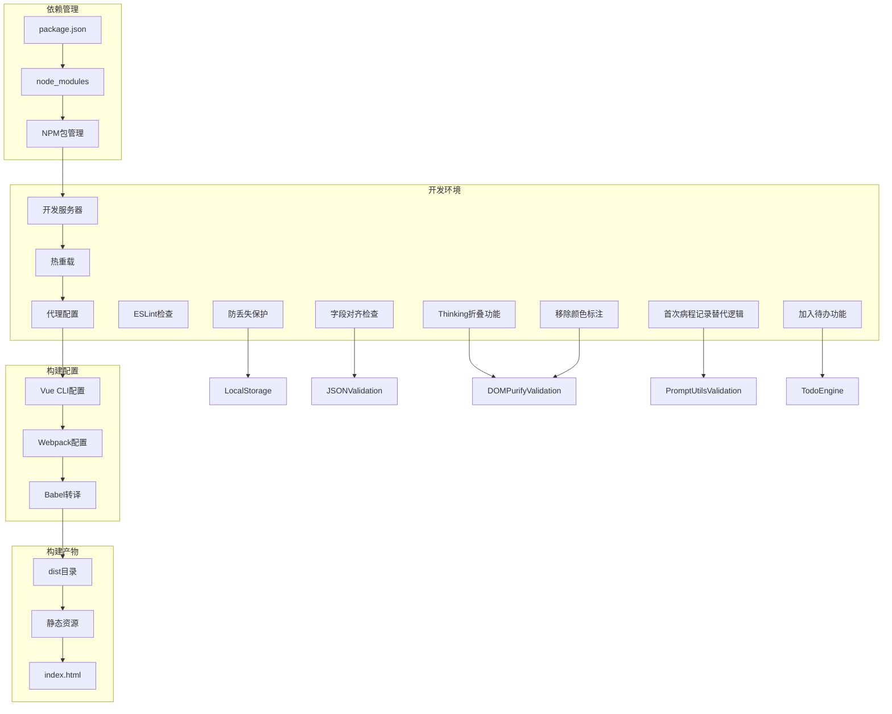

**图表来源**
- [前端package.json:1-55](file://med_ai_assistant_1.0_bs_vue/package.json#L1-L55)
- [前端vue.config.js:1-24](file://med_ai_assistant_1.0_bs_vue/vue.config.js#L1-L24)

### 构建配置详解

#### package.json配置

**核心配置项**:
- **name**: "med_ai_assistant_1.0_bs" - 项目名称
- **version**: "0.9.003" - 当前版本号（最新版本）
- **private**: true - 私有项目，不发布到npm
- **scripts**: 
  - serve: vue-cli-service serve - 启动开发服务器
  - build: vue-cli-service build - 构建生产版本
  - lint: vue-cli-service lint - 代码检查

**依赖管理**:
- **dependencies**: 运行时依赖
- **devDependencies**: 开发时依赖
- **eslintConfig**: ESLint配置
- **browserslist**: 浏览器兼容性配置

#### Vue CLI配置

**开发服务器配置**:
- **port**: 8080 - 开发服务器端口
- **proxy**: API代理配置
- **publicPath**: '/' - 静态资源路径
- **transpileDependencies**: true - 转译依赖

**Webpack配置**:
- **chainWebpack**: 自定义webpack配置
- **raw-loader**: 支持.md文件加载

### 最新修复案例

#### package.json语法错误修复

**问题发现**: 在2026-03-24的版本更新中，发现前端package.json存在语法错误，导致开发服务器启动失败。

**问题分析**:
1. JSON语法错误导致npm无法解析package.json
2. 开发服务器无法启动，端口8080占用
3. 控制台显示JSON解析错误

**修复过程**:
1. 检查package.json文件的完整语法结构
2. 验证所有对象属性的逗号分隔
3. 确保字符串值使用正确的引号
4. 检查JSON对象的闭合
5. 使用在线JSON验证工具确认语法正确

**修复结果**:
- 开发服务器恢复正常启动
- 端口8080可以正常访问
- 热重载功能正常工作
- 代码检查功能恢复

### 构建系统最佳实践

#### 开发环境配置

**.env.development配置**:
```properties
# 开发环境配置
VUE_APP_API_BASE_URL=http://localhost:8081/api
VUE_APP_DECRYPTION_SERVER_URL=http://100.66.1.3:8082
VUE_APP_EXECUTION_SERVER_URL=http://100.66.1.3:8082
VUE_APP_EXECUTION_SERVER_IP=100.66.1.3
VUE_APP_LLM_MODEL=deepseek-chat
```

#### 构建优化

**性能优化建议**:
1. 使用webpack-bundle-analyzer分析包大小
2. 启用代码分割和懒加载
3. 优化图片和字体资源
4. 配置适当的缓存策略

**常见问题解决**:
1. **依赖安装失败**: 清理npm缓存，删除node_modules重新安装
2. **热重载失效**: 检查端口占用，重启开发服务器
3. **代理配置错误**: 验证API地址和代理规则
4. **构建失败**: 检查ESLint规则，修复语法错误

### 构建系统监控

#### 构建状态监控

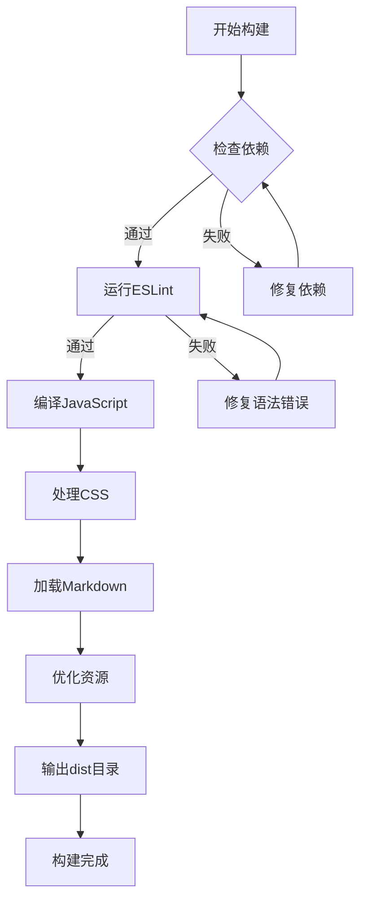

**图表来源**
- [前端package.json:1-55](file://med_ai_assistant_1.0_bs_vue/package.json#L1-L55)

## 版本更新记录

系统采用持续集成和持续部署的开发模式，版本更新记录详细记录了每次迭代的功能改进和问题修复。

### 最新版本 (v0.9.003)

#### 主要更新内容

1. **新增：选中文字加入待办功能**
   - **病历记录页面**：在工具栏新增「加入待办」按钮，支持选中病历文字后快速创建待办事项
   - **诊疗计划表格**：支持从选中文字创建待办事项，优先使用选中内容
   - **统一API调用**：使用createTodoFromTreatmentPlan API统一处理待办创建
   - **去重机制**：支持内容匹配去重，避免重复创建相同待办
   - **状态管理**：使用addingToTodo标识防止重复提交
   - **错误处理**：完善的异常捕获和用户提示机制

2. **增强：待办事项操作界面**
   - **紧凑显示**：待办事项列表支持更紧凑的显示方式
   - **内容预览**：每个待办项包含内容预览和状态标识
   - **自动清理**：待办内容自动清理患者基本信息行
   - **统一查看**：支持从多个来源查看待办事项

3. **优化：用户界面体验**
   - **简化交互**：移除不必要的复杂操作步骤
   - **一致设计**：保持不同页面间操作的一致性
   - **响应速度**：优化界面响应速度和交互流畅度

4. **系统监控指标完善**
   - **新增加入待办监控**：监控选中文字加入待办的成功率
   - **新增颜色标注监控**：监控颜色标注功能的移除效果
   - **性能指标更新**：更新相关性能监控指标

#### 版本升级指南

```bash
# 备份当前版本
cp -r med_ai_assistant_1.0_bs_backend backup_$(date +%Y%m%d)

# 拉取最新代码
git pull origin main

# 更新前端依赖
cd med_ai_assistant_1.0_bs_vue
npm install

# 清理缓存并重新安装
npm cache clean --force
rm -rf node_modules
npm install

# 验证构建
npm run build

# 启动开发服务器
npm run serve

cd ../med_ai_assistant_1.0_bs_backend
./mvnw clean install

# 重启服务
cd ../deploy/main-linux-oracle
./deploy.sh
```

### 历史版本特性

#### v0.9.002 - 病情小结颜色标注移除
- **功能变更**：移除病情小结页面的颜色标注功能，提供更简洁的显示效果
- **影响范围**：仅影响病情小结页面的视觉显示，不改变功能逻辑
- **用户收益**：提供更简洁的用户界面体验

#### v0.9.001 - 前端版本同步更新
- **版本同步**：后端版本号随前端一并更新至 0.9.001
- **变更范围**：本次变更仅涉及前端组件

#### v0.8.020 - IncorrectResultSizeDataAccessException修复
- **新增功能**：修复IncorrectResultSizeDataAccessException问题
- **List返回机制**：Repository层返回List而非Optional，确保重复ID记录处理稳定性
- **按修改时间降序取最新记录**：使用ORDER BY e.modifiedOn DESC NULLS LAST确保取到最新内容
- **异常处理增强**：改进异常捕获和日志记录机制
- **监控指标新增**：新增IncorrectResultSizeDataAccessException监控指标

#### v0.8.010 - Thinking折叠功能
- **新增功能**：为AI结果页面和病情小结页面添加<thinking>标签内容折叠处理功能
- **实现机制**：占位符策略 + DOMPurify清理 + 全局函数管理
- **交互效果**：默认折叠隐藏思维过程，点击展开查看完整内容

#### v0.8.009 - EMR记录选择错误调试信息增强
- **新增功能**：当在EMR记录列表中选择某条记录时，详细输出完整的错误信息
- **后端增强**：EmrRecordService和MedicalRecordController添加详细日志记录
- **前端增强**：MedicalRecords.vue增强handleEMRRecordClick方法的错误调试信息
- **用户友好提示**：包含记录ID的错误提示，便于定位问题

#### v.8.008 - EMR病历内容同步修复
- **修复问题**：EMR_CONTENT表UPDATE操作触发唯一约束冲突（ORA-00001）
- **修复方案**：将save()替换为saveAndFlush()，新增重试逻辑
- **竞态条件修复**：使用findAllBySourceTableAndSourceId()替代findBySourceTableAndSourceId()

#### v0.8.007 - JSON字段名大小写对齐修复
- **修复问题**：生产环境下EMR病历内容显示为空的问题
- **修复方案**：为DTO类添加@JsonProperty注解确保字段名对齐
- **影响范围**：仅影响JSON序列化输出，不改变数据库查询逻辑

#### v0.7.025 - 病历编辑防丢失功能
- **新增功能**：localStorage草稿自动保存机制
- **智能恢复**：支持编辑草稿和新增草稿的智能恢复
- **过期清理**：7天过期草稿自动清理功能
- **保存状态**：实时的保存状态反馈

#### v0.6.082 - 前端构建系统修复
- **修复问题**：package.json语法错误导致启动失败
- **优化配置**：提升前端构建系统稳定性
- **增强依赖管理**：确保依赖版本兼容性

### 版本管理策略

#### 版本号规则

系统采用语义化版本控制：

```
主版本号.次版本号.修订号
```

- **主版本号**: 重大功能更新或不兼容的API变更
- **次版本号**: 新功能添加或向后兼容的功能改进
- **修订号**: 向后兼容的问题修复或小功能更新

#### 发布流程

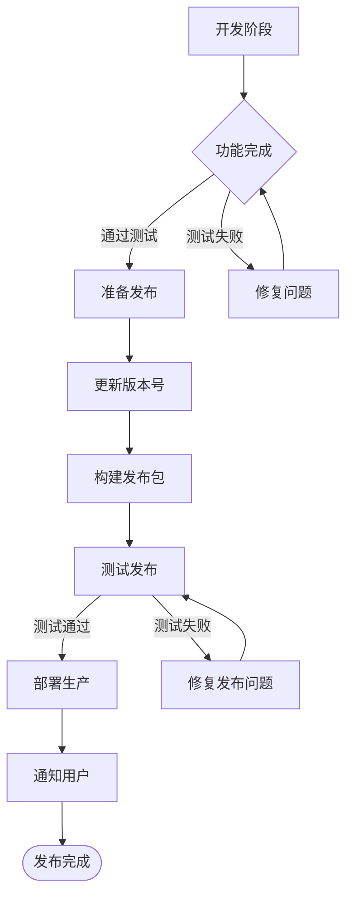

**图表来源**
- [更新小结.md:1-500](file://更新小结.md#L1-L500)

## 总结

医疗AI助手系统是一个功能完备、架构清晰、安全可靠的综合性医疗信息系统。通过智能化的AI辅助诊断、高效的病历管理、安全的数据加密、完善的监控告警机制、新增的病历编辑防丢失功能、新增的EMR病历内容同步模块数据库约束处理能力、新增的JSON字段名大小写对齐机制、新增的首次病程记录模板入院记录替代逻辑、新增的Thinking折叠功能、以及经过修复的稳定前端构建系统，系统为医护人员提供了强大的技术支持。

### 系统优势

1. **技术先进性**: 采用最新的Web技术和AI模型，提供智能化的医疗服务
2. **安全性保障**: 全面的数据加密和访问控制，确保医疗信息安全
3. **可扩展性**: 模块化设计和微服务架构，支持功能扩展和性能提升
4. **易用性**: 直观的用户界面和流畅的操作体验，降低学习成本
5. **可靠性**: 完善的监控告警和故障恢复机制，确保系统稳定运行
6. **智能化**: 新增语音识别、待办事项生成、智录系统等AI辅助功能
7. **兼容性**: 支持多种设备和浏览器，提供良好的用户体验
8. **稳定性**: 经过多次修复的前端构建系统，确保开发环境稳定可靠
9. **数据安全**: 新增的病历编辑防丢失功能，确保用户数据不会因意外情况而丢失
10. **显示稳定性**: 新增的JSON字段名大小写对齐机制，彻底解决生产环境中的关键显示问题
11. **高并发可靠性**: 新增的EMR病历内容同步模块具备数据库约束处理能力和自动重试机制，显著提升高并发场景下的数据同步可靠性
12. **数据库约束处理**: 新增的TOCTOU竞态条件修复、JPA批处理优化、自动重试机制，确保数据一致性
13. **监控告警增强**: 新增的性能监控指标，包括并发冲突率、约束冲突率、批处理延迟等关键指标
14. **智能替代逻辑**: 首次病程记录模板的智能入院记录替代机制，提升病历生成的完整性
15. **思维过程可视化**: Thinking折叠功能提升AI结果的可读性和用户体验
16. **错误调试增强**: EMR记录选择错误的详细调试信息，便于问题定位和解决
17. **异常处理稳定性**: 新增的IncorrectResultSizeDataAccessException修复机制，确保重复ID记录处理的稳定性
18. **数据一致性保障**: 按修改时间降序取最新记录的机制，确保用户获取到最准确的病历内容
19. **选中文字加入待办**: v0.9.003新增功能，极大提升了待办事项创建的便捷性
20. **界面简化**: v0.9.002移除颜色标注，提供更简洁的用户界面体验
21. **操作一致性**: 新增的待办事项操作界面，提供统一的交互体验
22. **去重机制**: 新增的内容匹配去重功能，避免重复创建待办事项

### 未来发展

1. **AI能力增强**: 持续优化AI模型，提升诊断准确性和智能化水平
2. **功能扩展**: 根据用户需求不断扩展系统功能和服务范围
3. **性能优化**: 持续优化系统性能，提升用户体验和响应速度
4. **安全保障**: 加强安全防护措施，确保医疗数据的绝对安全
5. **标准化建设**: 推进医疗信息化标准建设，促进系统间的互联互通
6. **智能化升级**: 持续引入新的AI技术，提升系统的智能化水平
7. **构建系统优化**: 持续改进前端构建系统，提升开发效率和稳定性
8. **数据保护增强**: 持续改进防丢失保护机制，提供更可靠的数据安全保障
9. **显示稳定性提升**: 持续优化JSON字段名对齐机制，确保跨平台显示的一致性
10. **EMR系统集成**: 持续优化EMR病历内容查询接口，提升与医院HIS系统的集成度
11. **高并发处理能力**: 持续优化数据库约束处理和JPA批处理机制，提升系统在高并发场景下的稳定性
12. **监控告警完善**: 持续完善监控告警机制，提供更全面的系统状态可视化
13. **智能功能扩展**: 基于新增的替代逻辑和折叠功能，进一步扩展智能辅助功能
14. **用户体验优化**: 持续改进用户界面和交互体验，提升系统易用性
15. **异常处理机制完善**: 持续改进IncorrectResultSizeDataAccessException等异常处理机制，提升系统稳定性
16. **待办事项功能增强**: 基于v0.9.003的选中文字加入待办功能，进一步优化待办事项管理体验
17. **界面设计优化**: 基于v0.9.002的简化设计理念，持续优化用户界面的简洁性和实用性

通过持续的技术创新和功能完善，医疗AI助手系统将继续为医疗行业的数字化转型贡献力量，为患者提供更好的医疗服务体验。最新的选中文字加入待办功能和病情小结颜色标注移除，体现了团队对用户体验和界面简洁性的重视，为后续的开发和维护奠定了坚实的基础。这些改进不仅解决了当前的问题，更为系统的长期稳定运行提供了重要保障，特别是在提升用户操作便捷性和界面美观性方面取得了显著进展。版本0.9.003中新增的选中文字加入待办功能，通过统一的API调用和去重机制，为用户提供了更加高效和便捷的待办事项创建方式，而版本0.9.002中移除的颜色标注功能，则为系统提供了更加简洁和专业的视觉效果，这些改进都充分体现了系统在用户体验方面的持续优化和提升。