# 患者数据管理

<cite>
**本文档引用的文件**
- [MedAiAssistantBackendApplication.java](file://med_ai_assistant_1.0_bs_backend/src/main/java/com/example/medaiassistant/MedAiAssistantBackendApplication.java)
- [PatientController.java](file://med_ai_assistant_1.0_bs_backend/src/main/java/com/example/medaiassistant/controller/PatientController.java)
- [LabResultController.java](file://med_ai_assistant_1.0_bs_backend/src/main/java/com/example/medaiassistant/controller/LabResultController.java)
- [AIController.java](file://med_ai_assistant_1.0_bs_backend/src/main/java/com/example/medaiassistant/controller/AIController.java)
- [LongTermOrderRepository.java](file://med_ai_assistant_1.0_bs_backend/src/main/java/com/example/medaiassistant/repository/LongTermOrderRepository.java)
- [LabResult.java](file://med_ai_assistant_1.0_bs_backend/src/main/java/com/example/medaiassistant/model/LabResult.java)
- [LongTermOrder.java](file://med_ai_assistant_1.0_bs_backend/src/main/java/com/example/medaiassistant/model/LongTermOrder.java)
- [OrderFormatService.java](file://med_ai_assistant_1.0_bs_backend/src/main/java/com/example/medaiassistant/service/OrderFormatService.java)
- [OrderTimelineDTO.java](file://med_ai_assistant_1.0_bs_backend/src/main/java/com/example/medaiassistant/dto/OrderTimelineDTO.java)
- [PatientRepository.java](file://med_ai_assistant_1.0_bs_backend/src/main/java/com/example/medaiassistant/repository/PatientRepository.java)
- [application.properties](file://med_ai_assistant_1.0_bs_backend/src/main/resources/application.properties)
- [application-patient-status-filter.properties](file://med_ai_assistant_1.0_bs_backend/config/application-patient-status-filter.properties)
- [SchedulingProperties.java](file://med_ai_assistant_1.0_bs_backend/src/main/java/com/example/medaiassistant/config/SchedulingProperties.java)
- [PatientFilterStrategy.java](file://med_ai_assistant_1.0_bs_backend/src/main/java/com/example/medaiassistant/service/filter/PatientFilterStrategy.java)
- [NoFilterStrategy.java](file://med_ai_assistant_1.0_bs_backend/src/main/java/com/example/medaiassistant/service/filter/NoFilterStrategy.java)
- [DepartmentOnlyFilterStrategy.java](file://med_ai_assistant_1.0_bs_backend/src/main/java/com/example/medaiassistant/service/filter/DepartmentOnlyFilterStrategy.java)
- [PatientFilterStrategyFactory.java](file://med_ai_assistant_1.0_bs_backend/src/main/java/com/example/medaiassistant/service/filter/PatientFilterStrategyFactory.java)
- [DataSyncExecutor.java](file://med_ai_assistant_1.0_bs_backend/src/main/java/com/example/medaiassistant/hospital/service/DataSyncExecutor.java)
- [SyncLogRepositoryTest.java](file://med_ai_assistant_1.0_bs_backend/src/test/java/com/example/medaiassistant/hospital/repository/SyncLogRepositoryTest.java)
- [MccScreeningServiceExclusionTest.java](file://med_ai_assistant_1.0_bs_backend/src/test/java/com/example/medaiassistant/service/MccScreeningServiceExclusionTest.java)
- [patient-query.json](file://med_ai_assistant_1.0_bs_backend/sql/hospital-Local/patient-query.json)
- [patient-sync-query.json](file://med_ai_assistant_1.0_bs_backend/sql/hospital-Local/patient-sync-query.json)
- [lab-results-query.json](file://med_ai_assistant_1.0_bs_backend/sql/hospital-Local/lab-results-query.json)
- [LIS检验结果SQL字段别名映射规范.md](file://med_ai_assistant_1.0_bs_backend/doc/迭代/医院数据同步/LIS检验结果SQL字段别名映射规范.md)
- [患者数据接口.md](file://med_ai_assistant_1.0_bs_backend/doc/接口/患者管理/患者数据接口.md)
- [患者数据保存API接口文档.md](file://med_ai_assistant_1.0_bs_backend/doc/接口/患者管理/患者数据保存API接口文档.md)
- [患者诊断与手术查询接口.md](file://med_ai_assistant_1.0_bs_backend/doc/接口/患者管理/患者诊断与手术查询接口.md)
- [PatientSearchView.vue](file://med_ai_assistant_1.0_bs_vue/src/views/PatientSearchView.vue)
- [PatientProfileView.vue](file://med_ai_assistant_1.0_bs_vue/src/views/PatientProfileView.vue)
</cite>

## 更新摘要
**所做更改**
- 新增了完整的患者过滤策略系统，支持无过滤、仅科室过滤和科室+床位过滤三种模式
- 增强了实验室检验结果排序机制，实现两级排序：时间降序+异常状态排序
- 完善了数据同步机制，支持增量和全量同步策略，具备批次处理能力
- 优化了医嘱查询排序，按开立时间升序排列，提供更清晰的用药历史
- 增强了配置验证机制，确保过滤配置的正确性和安全性

## 目录
1. [简介](#简介)
2. [项目结构](#项目结构)
3. [核心组件](#核心组件)
4. [架构概览](#架构概览)
5. [详细组件分析](#详细组件分析)
6. [依赖关系分析](#依赖关系分析)
7. [性能考量](#性能考量)
8. [故障排除指南](#故障排除指南)
9. [结论](#结论)

## 简介

MedAiAssistant患者数据管理系统是一个基于Spring Boot的企业级医疗信息系统，专注于为医疗机构提供全面的患者数据管理解决方案。该系统集成了先进的AI技术，能够自动化处理患者的诊断、治疗、监测等各个环节的数据，为医生提供智能化的决策支持。

系统采用微服务架构设计，支持多医院、多科室的复杂医疗环境，具备高度的可扩展性和稳定性。通过统一的API接口，系统能够与各种医疗设备和信息系统无缝集成，实现患者数据的实时同步和智能分析。

**更新** 系统最近进行了重大改进，包括全新的患者过滤策略系统、增强的检验结果排序机制、完善的数据同步功能，以及优化的医嘱管理体验。

## 项目结构

系统采用标准的Spring Boot项目结构，主要分为以下几个层次：

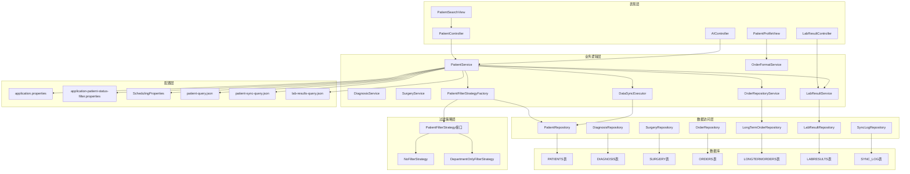

**图表来源**
- [MedAiAssistantBackendApplication.java:26-37](file://med_ai_assistant_1.0_bs_backend/src/main/java/com/example/medaiassistant/MedAiAssistantBackendApplication.java#L26-L37)
- [PatientController.java:46-78](file://med_ai_assistant_1.0_bs_backend/src/main/java/com/example/medaiassistant/controller/PatientController.java#L46-L78)
- [LabResultController.java:15-209](file://med_ai_assistant_1.0_bs_backend/src/main/java/com/example/medaiassistant/controller/LabResultController.java#L15-L209)
- [PatientSearchView.vue:1-211](file://med_ai_assistant_1.0_bs_vue/src/views/PatientSearchView.vue#L1-L211)
- [PatientProfileView.vue:1-1279](file://med_ai_assistant_1.0_bs_vue/src/views/PatientProfileView.vue#L1-L1279)

**章节来源**
- [MedAiAssistantBackendApplication.java:1-50](file://med_ai_assistant_1.0_bs_backend/src/main/java/com/example/medaiassistant/MedAiAssistantBackendApplication.java#L1-L50)
- [application.properties:1-310](file://med_ai_assistant_1.0_bs_backend/src/main/resources/application.properties#L1-L310)

## 核心组件

### 患者控制器 (PatientController)

患者控制器是系统的核心组件，负责处理所有与患者相关的HTTP请求。该控制器实现了RESTful API设计原则，提供了完整的CRUD操作和复杂的业务逻辑处理。

**更新** 新增了对入院和出院日期过滤的支持，以及更灵活的查询参数处理。

主要功能包括：
- 患者基本信息查询和管理
- 诊断信息的添加、修改和删除
- 医嘱信息的查询和格式化
- 患者状态的智能更新
- 科室患者列表的获取
- 出院患者数据的查询
- **新增** 增强的日期范围查询功能

### 实验室检验结果控制器 (LabResultController)

**更新** 实验室检验结果控制器提供了完整的检验结果管理功能，实现了创新的两级排序机制：

#### 核心功能
- 按患者ID查询所有检验结果
- 按分析状态筛选检验结果
- 格式化检验结果输出
- 检验结果调试和诊断工具

#### 排序机制
- **第一级排序**：按报告时间降序排列（最新的在前）
- **第二级排序**：时间相同时按异常状态排序
  - H（偏高）→ 权重 0
  - L（偏低）→ 权重 1  
  - N（正常）→ 权重 2
  - 其它/空 → 权重 3

#### 异常标志处理
- 支持大小写不敏感的异常标志比较
- 提供异常值高亮显示功能
- 支持中文异常状态标识

### AI控制器 (AIController)

**更新** AI控制器中的化验结果格式化功能也采用了统一的排序逻辑：

#### 排序规则
- **第一级排序**：按 `labReportTime` 升序排序（最旧在前，用于文本展示）
- **第二级排序**：时间相同时按 `abnormalIndicator` 排序（H → L → N → 其它）

### 长期医嘱数据访问接口 (LongTermOrderRepository)

**更新** 新增了按开立时间升序排列的查询方法：

#### 排序功能
- `findByPatientIdAndRepeatIndicatorOrderByOrderDateAsc()`：按开立时间升序排列
- 支持长期医嘱（repeatIndicator=1）和临时医嘱（repeatIndicator=0）
- 使用Spring Data JPA命名约定自动生成SQL排序

#### 医嘱同步功能
- 支持从HIS系统同步医嘱数据
- 基于业务键的重复检测机制
- upsert策略实现

### 患者过滤策略系统

**新增** 系统引入了完整的患者过滤策略架构，支持多种过滤模式：

#### 过滤策略接口
- `PatientFilterStrategy`：定义了过滤策略的通用接口
- `NoFilterStrategy`：无过滤策略，处理所有在院患者
- `DepartmentOnlyFilterStrategy`：仅科室过滤策略

#### 过滤策略工厂
- `PatientFilterStrategyFactory`：负责根据配置选择合适的过滤策略
- 支持策略的动态选择和管理

#### 配置系统
- `SchedulingProperties.TimerConfig`：定时任务配置
- 支持三种过滤模式：无过滤、仅科室过滤、科室+床位过滤
- 动态配置验证和错误处理

### 数据同步执行器

**新增** `DataSyncExecutor`类提供了完整的数据同步功能：

#### 同步策略
- 全量同步（FULL）
- 增量同步（INCREMENTAL）
- 增量同步带批次（INCREMENTAL_WITH_BATCH）
- 全量同步带批次（FULL_WITH_BATCH）
- 支持分批处理机制
- 可配置的批次大小

#### 错误处理
- 完善的异常捕获和处理
- 同步结果追踪
- 内存使用监控

### 应用配置 (application.properties)

系统配置文件采用了集中式配置管理，支持多环境部署。配置文件涵盖了数据库连接、缓存设置、定时任务、监控指标等多个方面。

**更新** 新增了数据同步和过滤相关的配置项，以及检验结果查询的SQL模板配置。

**章节来源**
- [PatientController.java:1-469](file://med_ai_assistant_1.0_bs_backend/src/main/java/com/example/medaiassistant/controller/PatientController.java#L1-L469)
- [LabResultController.java:1-209](file://med_ai_assistant_1.0_bs_backend/src/main/java/com/example/medaiassistant/controller/LabResultController.java#L1-L209)
- [AIController.java:2528-2561](file://med_ai_assistant_1.0_bs_backend/src/main/java/com/example/medaiassistant/controller/AIController.java#L2528-L2561)
- [LongTermOrderRepository.java:1-189](file://med_ai_assistant_1.0_bs_backend/src/main/java/com/example/medaiassistant/repository/LongTermOrderRepository.java#L1-L189)
- [PatientRepository.java:1-412](file://med_ai_assistant_1.0_bs_backend/src/main/java/com/example/medaiassistant/repository/PatientRepository.java#L1-L412)
- [application.properties:1-310](file://med_ai_assistant_1.0_bs_backend/src/main/resources/application.properties#L1-L310)
- [SchedulingProperties.java:305-407](file://med_ai_assistant_1.0_bs_backend/src/main/java/com/example/medaiassistant/config/SchedulingProperties.java#L305-L407)
- [DataSyncExecutor.java:1-197](file://med_ai_assistant_1.0_bs_backend/src/main/java/com/example/medaiassistant/hospital/service/DataSyncExecutor.java#L1-L197)

## 架构概览

系统采用分层架构设计，确保了良好的可维护性和可扩展性：

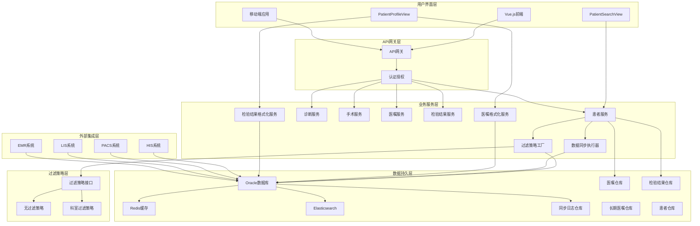

**图表来源**
- [application.properties:94](file://med_ai_assistant_1.0_bs_backend/src/main/resources/application.properties#L94)
- [MedAiAssistantBackendApplication.java:26-37](file://med_ai_assistant_1.0_bs_backend/src/main/java/com/example/medaiassistant/MedAiAssistantBackendApplication.java#L26-L37)
- [PatientSearchView.vue:1-211](file://med_ai_assistant_1.0_bs_vue/src/views/PatientSearchView.vue#L1-L211)
- [PatientProfileView.vue:1-1279](file://med_ai_assistant_1.0_bs_vue/src/views/PatientProfileView.vue#L1-L1279)

系统架构的关键特点：
- **微服务化**：各个业务模块相对独立，便于维护和扩展
- **异步处理**：大量使用异步任务处理，提高系统响应速度
- **缓存策略**：多层次缓存机制，优化数据访问性能
- **监控集成**：内置完整的监控和告警机制
- **过滤策略**：灵活的患者数据过滤机制
- **数据同步**：支持增量和全量数据同步
- **医嘱管理**：完整的长期/临时医嘱管理
- **检验结果**：可视化检验结果展示
- **配置验证**：完善的配置验证和错误处理

## 详细组件分析

### 患者数据保存API

患者数据保存API是系统中最核心的功能之一，支持患者信息的创建、更新和批量操作。

#### API流程图

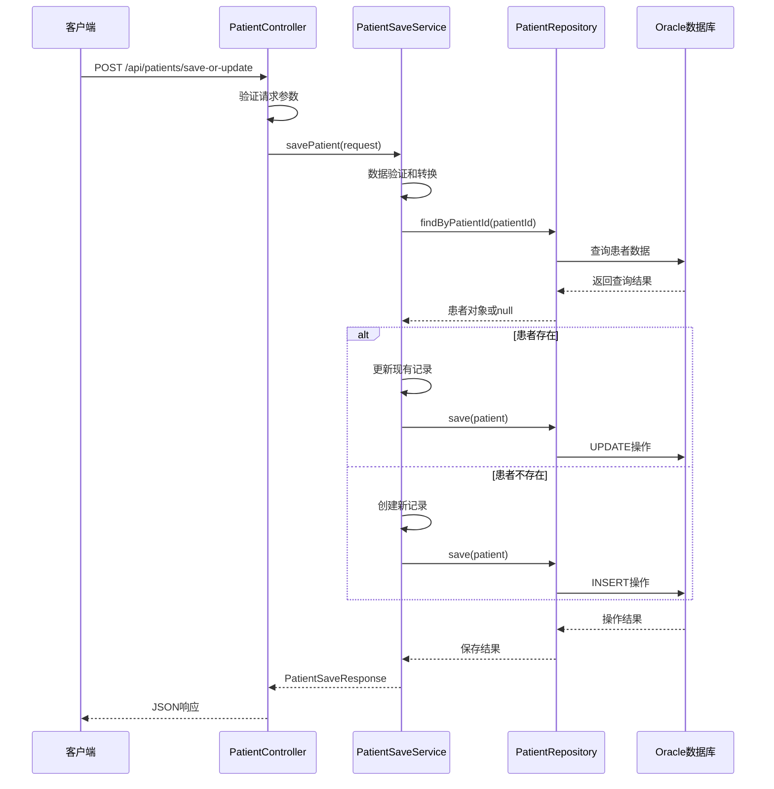

**图表来源**
- [PatientController.java:453-466](file://med_ai_assistant_1.0_bs_backend/src/main/java/com/example/medaiassistant/controller/PatientController.java#L453-L466)
- [患者数据保存API接口文档.md:90-110](file://med_ai_assistant_1.0_bs_backend/doc/接口/患者管理/患者数据保存API接口文档.md#L90-L110)

#### 数据验证流程

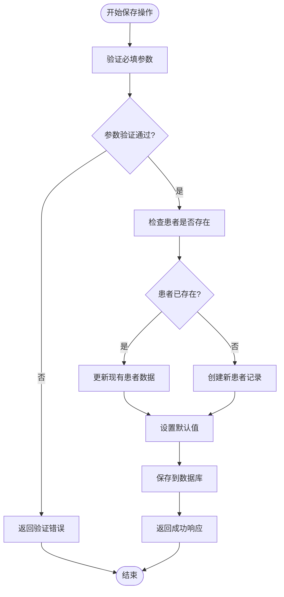

**图表来源**
- [患者数据保存API接口文档.md:97-105](file://med_ai_assistant_1.0_bs_backend/doc/接口/患者管理/患者数据保存API接口文档.md#L97-L105)

### 患者状态管理

系统实现了智能的患者状态管理机制，能够根据不同的医疗场景自动更新患者状态。

#### 状态更新算法

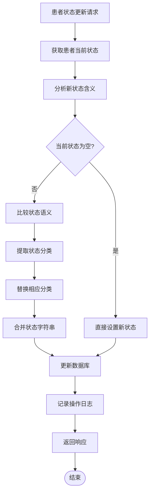

**图表来源**
- [PatientController.java:290-325](file://med_ai_assistant_1.0_bs_backend/src/main/java/com/example/medaiassistant/controller/PatientController.java#L290-L325)

### 患者过滤策略系统

**新增** 系统引入了完整的患者过滤策略架构，支持灵活的患者数据访问控制。

#### 过滤策略模式

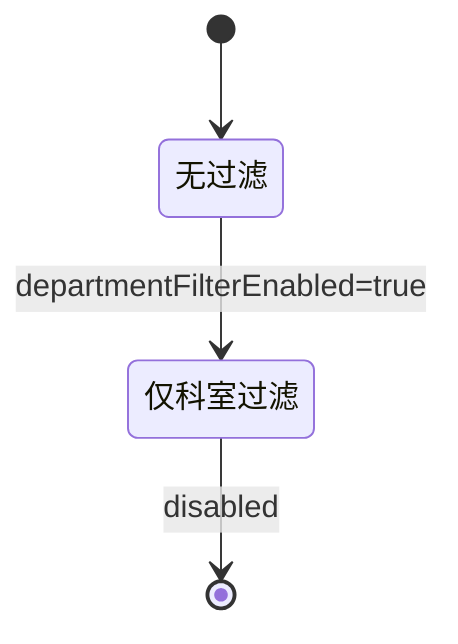

#### 过滤策略接口设计

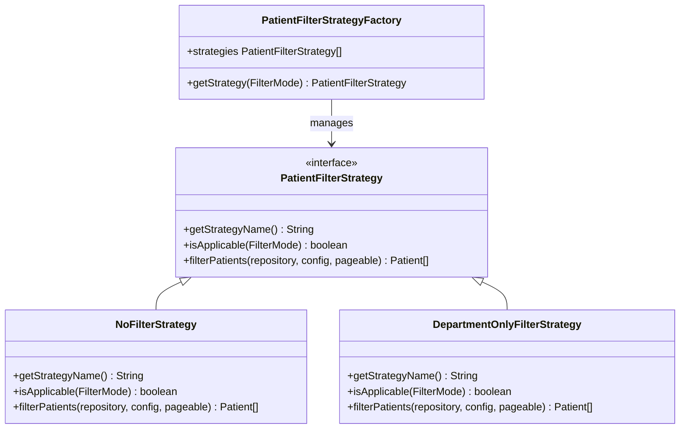

**图表来源**
- [PatientFilterStrategy.java:1-39](file://med_ai_assistant_1.0_bs_backend/src/main/java/com/example/medaiassistant/service/filter/PatientFilterStrategy.java#L1-L39)
- [NoFilterStrategy.java:1-34](file://med_ai_assistant_1.0_bs_backend/src/main/java/com/example/medaiassistant/service/filter/NoFilterStrategy.java#L1-L34)
- [DepartmentOnlyFilterStrategy.java:1-35](file://med_ai_assistant_1.0_bs_backend/src/main/java/com/example/medaiassistant/service/filter/DepartmentOnlyFilterStrategy.java#L1-L35)
- [PatientFilterStrategyFactory.java:1-37](file://med_ai_assistant_1.0_bs_backend/src/main/java/com/example/medaiassistant/service/filter/PatientFilterStrategyFactory.java#L1-L37)

#### 过滤配置选项

| 配置项 | 默认值 | 说明 |
|--------|--------|------|
| scheduling.timer.department-filter-enabled | false | 是否启用科室过滤 |
| scheduling.timer.bed-filter-enabled | false | 是否启用床号过滤 |
| scheduling.timer.target-departments | - | 目标科室列表 |
| scheduling.timer.department-bed-numbers | - | 科室床号映射 |

#### 配置验证机制

**更新** 新增了严格的配置验证机制：

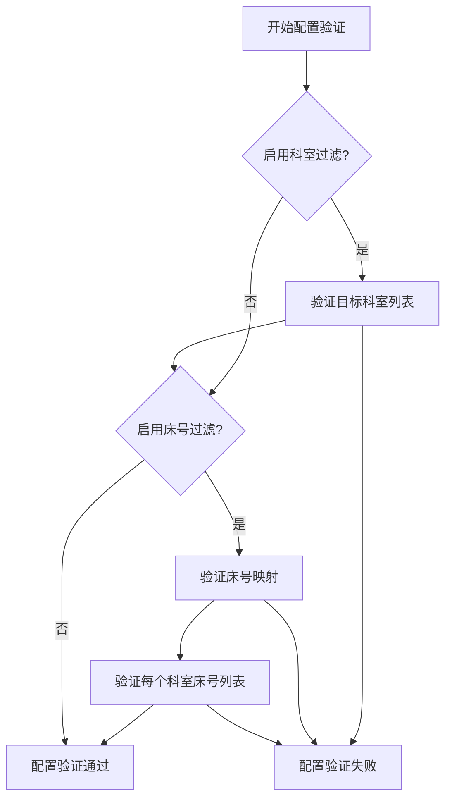

**章节来源**
- [PatientController.java:80-150](file://med_ai_assistant_1.0_bs_backend/src/main/java/com/example/medaiassistant/controller/PatientController.java#L80-L150)
- [application-patient-status-filter.properties:1-49](file://med_ai_assistant_1.0_bs_backend/config/application-patient-status-filter.properties#L1-L49)
- [SchedulingProperties.java:392-407](file://med_ai_assistant_1.0_bs_backend/src/main/java/com/example/medaiassistant/config/SchedulingProperties.java#L392-L407)
- [SchedulingProperties.java:469-489](file://med_ai_assistant_1.0_bs_backend/src/main/java/com/example/medaiassistant/config/SchedulingProperties.java#L469-L489)

### 数据同步机制

**新增** 系统提供了完整的数据同步功能，支持多种同步策略和批次处理。

#### 同步策略流程

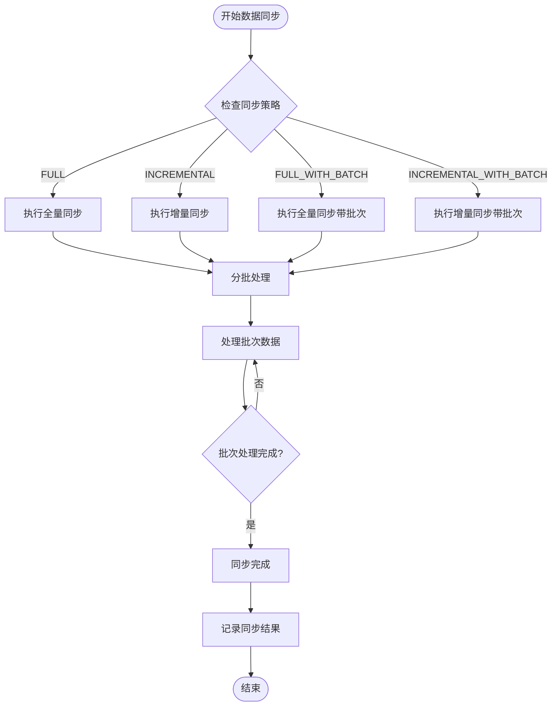

#### 同步配置

| 配置项 | 默认值 | 说明 |
|--------|--------|------|
| nightly.sync.enabled | true | 是否启用夜间同步 |
| nightly.sync.on-startup | true | 是否启动时自动执行 |
| nightly.sync.cron | 0 0 1 * * ? | 定时Cron表达式 |
| data.sync.batch.size | 1000 | 默认批次大小 |

#### 内存使用优化

**更新** 新增了内存使用监控和优化机制：

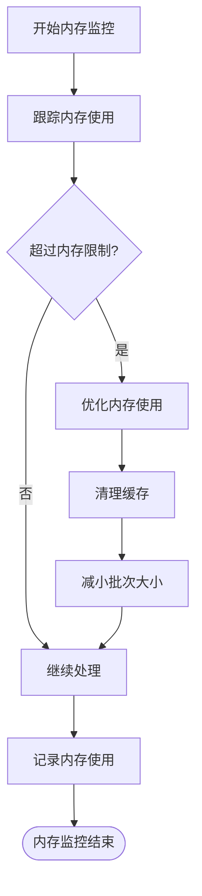

**章节来源**
- [DataSyncExecutor.java:36-88](file://med_ai_assistant_1.0_bs_backend/src/main/java/com/example/medaiassistant/hospital/service/DataSyncExecutor.java#L36-L88)
- [SyncLogRepositoryTest.java:75-202](file://med_ai_assistant_1.0_bs_backend/src/test/java/com/example/medaiassistant/hospital/repository/SyncLogRepositoryTest.java#L75-L202)

### 测试数据排除机制

**新增** 系统改进了测试数据排除机制，支持多种分隔符和更灵活的排除规则。

#### 排除规则测试

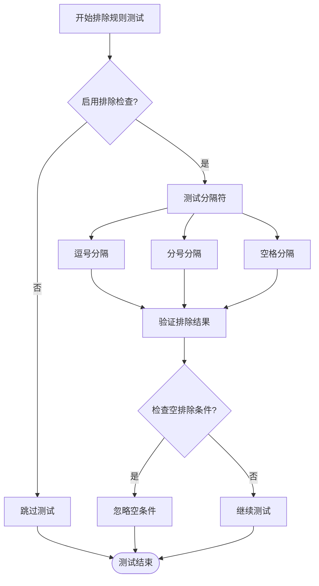

**章节来源**
- [MccScreeningServiceExclusionTest.java:75-101](file://med_ai_assistant_1.0_bs_backend/src/test/java/com/example/medaiassistant/service/MccScreeningServiceExclusionTest.java#L75-L101)

### 医嘱用药模块

**新增** 系统新增了完整的医嘱用药模块，支持长期和临时医嘱的管理和展示：

#### 医嘱数据模型

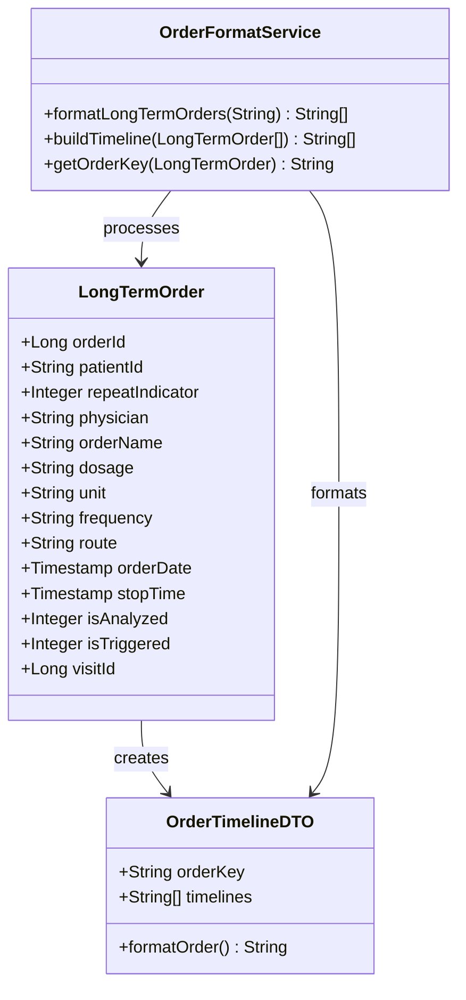

**图表来源**
- [LongTermOrder.java:1-366](file://med_ai_assistant_1.0_bs_backend/src/main/java/com/example/medaiassistant/model/LongTermOrder.java#L1-L366)
- [OrderTimelineDTO.java:1-28](file://med_ai_assistant_1.0_bs_backend/src/main/java/com/example/medaiassistant/dto/OrderTimelineDTO.java#L1-L28)
- [OrderFormatService.java:33-108](file://med_ai_assistant_1.0_bs_backend/src/main/java/com/example/medaiassistant/service/OrderFormatService.java#L33-L108)

#### 医嘱排序机制

**更新** 医嘱查询现已支持按开立时间升序排列：

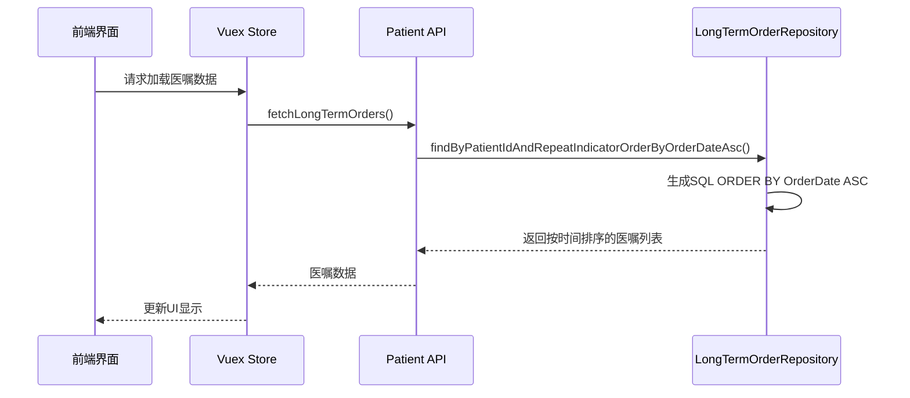

**图表来源**
- [LongTermOrderRepository.java:129-141](file://med_ai_assistant_1.0_bs_backend/src/main/java/com/example/medaiassistant/repository/LongTermOrderRepository.java#L129-L141)
- [PatientProfileView.vue:955-972](file://med_ai_assistant_1.0_bs_vue/src/views/PatientProfileView.vue#L955-L972)

#### 医嘱界面展示

**更新** 患者画像界面新增了完整的医嘱展示功能：

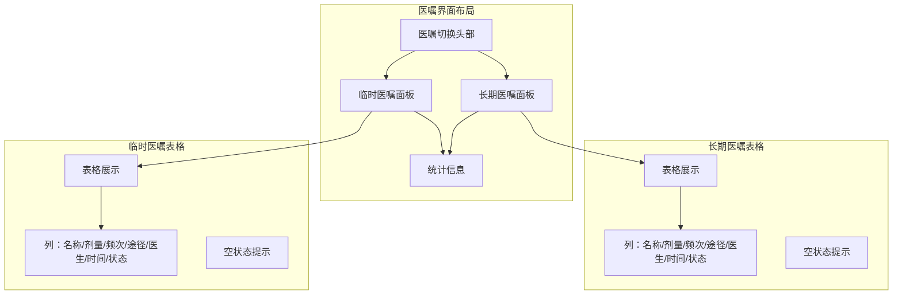

**图表来源**
- [PatientProfileView.vue:161-236](file://med_ai_assistant_1.0_bs_vue/src/views/PatientProfileView.vue#L161-L236)

### 实验室检验结果可视化

**新增** 系统提供了完整的实验室检验结果可视化功能：

#### 检验结果数据模型

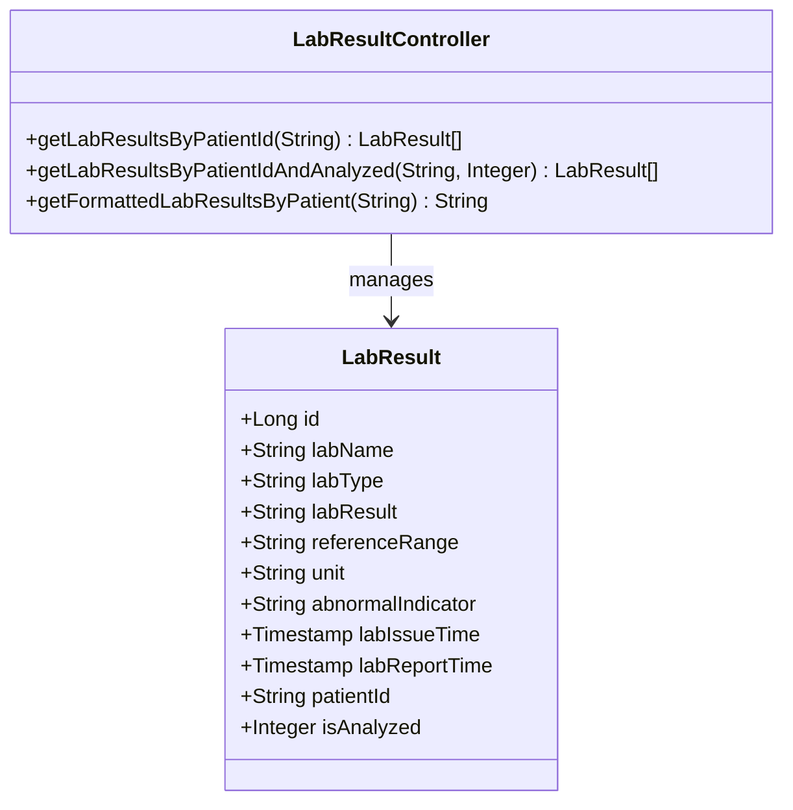

**图表来源**
- [LabResult.java:23-198](file://med_ai_assistant_1.0_bs_backend/src/main/java/com/example/medaiassistant/model/LabResult.java#L23-L198)
- [LabResultController.java:19-209](file://med_ai_assistant_1.0_bs_backend/src/main/java/com/example/medaiassistant/controller/LabResultController.java#L19-L209)

#### 检验结果排序和过滤

**更新** 检验结果现已支持完整的两级排序和过滤功能：

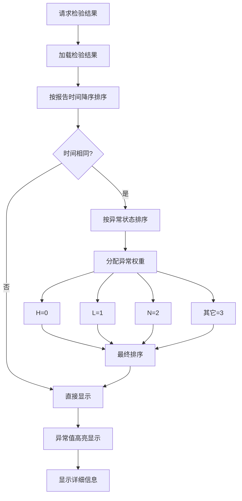

#### 检验结果界面展示

**更新** 患者画像界面新增了完整的检验结果展示功能：

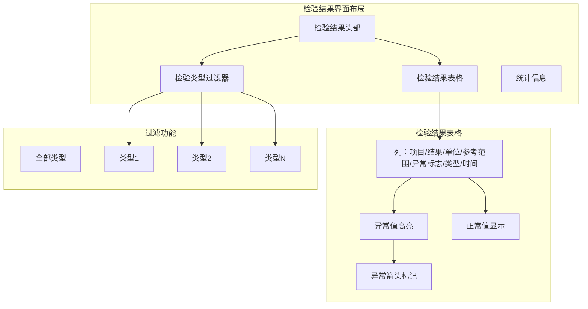

**图表来源**
- [PatientProfileView.vue:240-311](file://med_ai_assistant_1.0_bs_vue/src/views/PatientProfileView.vue#L240-L311)

#### 检验结果排序算法

**更新** 检验结果排序现已支持两级排序：

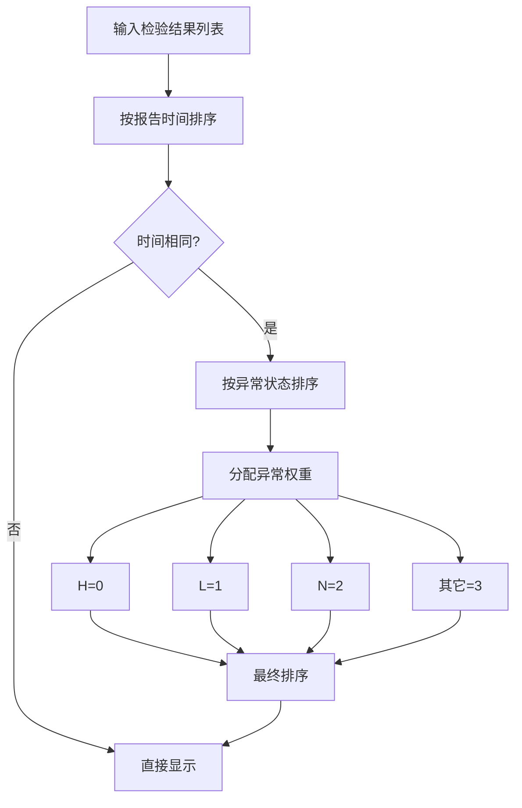

**图表来源**
- [LabResultController.java:39-51](file://med_ai_assistant_1.0_bs_backend/src/main/java/com/example/medaiassistant/controller/LabResultController.java#L39-L51)
- [LabResultController.java:192-207](file://med_ai_assistant_1.0_bs_backend/src/main/java/com/example/medaiassistant/controller/LabResultController.java#L192-L207)

### 患者画像功能增强

**更新** 系统增强了患者画像功能，整合了多维度医疗数据：

#### 时间线事件聚合

**更新** 患者画像现已支持多类型事件的时间线展示：

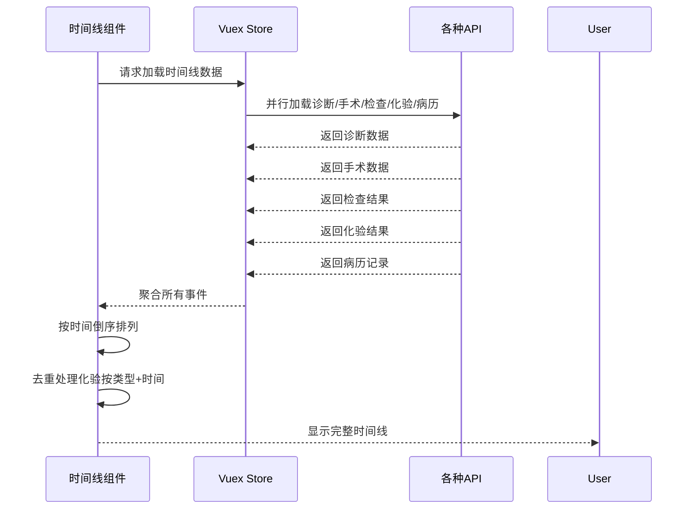

**图表来源**
- [PatientProfileView.vue:441-555](file://med_ai_assistant_1.0_bs_vue/src/views/PatientProfileView.vue#L441-L555)

#### 数据源整合

**更新** 患者画像现已整合多个数据源：

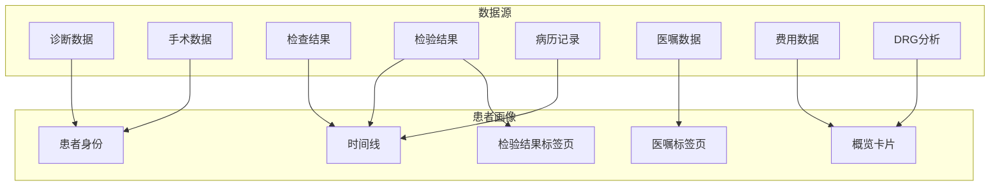

**章节来源**
- [PatientProfileView.vue:1-1279](file://med_ai_assistant_1.0_bs_vue/src/views/PatientProfileView.vue#L1-L1279)

## 依赖关系分析

系统采用模块化设计，各组件之间的依赖关系清晰明确：

```mermaid
graph LR
subgraph "核心模块"
A[MedAiAssistantBackendApplication]
B[PatientController]
C[LabResultController]
D[LongTermOrderRepository]
E[LabResult]
F[LongTermOrder]
PSV[PatientSearchView]
PPV[PatientProfileView]
end
subgraph "服务模块"
G[PatientSaveService]
H[PatientStatusUpdateService]
I[OrderFormatService]
J[LabResultService]
K[PatientFilterStrategyFactory]
L[DataSyncExecutor]
M[OrderRepositoryService]
N[LabResultRepositoryService]
end
subgraph "过滤策略模块"
O[PatientFilterStrategy接口]
P[NoFilterStrategy]
Q[DepartmentOnlyFilterStrategy]
R[SchedulingProperties]
end
subgraph "配置模块"
S[application.properties]
T[application-patient-status-filter.properties]
U[patient-query.json]
V[patient-sync-query.json]
W[lab-results-query.json]
X[LIS检验结果SQL字段别名映射规范.md]
end
subgraph "外部依赖"
Y[Oracle数据库]
Z[Spring Boot]
AA[Spring Data JPA]
BB[Spring MVC]
CC[Vue.js]
DD[Element Plus]
EE[axios]
FF[Vuex]
GG[Promise.all并行加载]
end
A --> B
A --> C
A --> D
A --> E
A --> F
A --> PSV
A --> PPV
B --> G
B --> H
B --> I
B --> J
B --> K
B --> L
B --> M
B --> N
C --> J
C --> N
D --> F
E --> N
G --> D
H --> D
I --> F
J --> E
K --> O
K --> P
K --> Q
L --> D
M --> D
N --> E
D --> Y
E --> Y
F --> Y
B --> S
C --> S
G --> T
H --> R
I --> U
J --> V
K --> W
L --> X
A --> Z
A --> AA
A --> BB
PSV --> CC
PPV --> CC
PPV --> DD
PPV --> EE
PPV --> FF
PPV --> GG
```

**图表来源**
- [MedAiAssistantBackendApplication.java:26-37](file://med_ai_assistant_1.0_bs_backend/src/main/java/com/example/medaiassistant/MedAiAssistantBackendApplication.java#L26-L37)
- [PatientController.java:46-78](file://med_ai_assistant_1.0_bs_backend/src/main/java/com/example/medaiassistant/controller/PatientController.java#L46-L78)
- [LabResultController.java:15-209](file://med_ai_assistant_1.0_bs_backend/src/main/java/com/example/medaiassistant/controller/LabResultController.java#L15-L209)
- [PatientSearchView.vue:1-211](file://med_ai_assistant_1.0_bs_vue/src/views/PatientSearchView.vue#L1-L211)
- [PatientProfileView.vue:1-1279](file://med_ai_assistant_1.0_bs_vue/src/views/PatientProfileView.vue#L1-L1279)

**章节来源**
- [MedAiAssistantBackendApplication.java:1-50](file://med_ai_assistant_1.0_bs_backend/src/main/java/com/example/medaiassistant/MedAiAssistantBackendApplication.java#L1-L50)
- [PatientRepository.java:1-412](file://med_ai_assistant_1.0_bs_backend/src/main/java/com/example/medaiassistant/repository/PatientRepository.java#L1-L412)

## 性能考量

系统在设计时充分考虑了性能优化，采用了多种策略来提升系统的响应速度和吞吐量：

### 数据库优化策略

1. **连接池配置**：使用HikariCP连接池，最大连接数15，连接超时时间10秒
2. **查询优化**：针对高频查询建立了专门的索引策略
3. **分页处理**：所有大数据量查询都支持分页，避免内存溢出
4. **缓存机制**：实现了多层次缓存，减少数据库访问压力
5. **排序优化**：在数据库层面实现排序，避免Java内存排序

### 异步处理机制

系统大量采用异步处理模式，特别是在数据同步和批量操作场景中：

- **定时任务**：使用Spring @Scheduled注解管理定时任务
- **线程池配置**：为不同类型的任务配置专门的线程池
- **队列管理**：使用阻塞队列管理任务排队

### 并行数据加载

**更新** 患者画像界面采用了并行数据加载机制：

```mermaid
sequenceDiagram
participant View as 患者画像视图
participant Store as Vuex Store
participant API1 as 诊断API
participant API2 as 手术API
participant API3 as 检查API
participant API4 as 化验API
participant API5 as 病历API
View->>Store : 请求加载时间线数据
Store->>API1 : 并行加载诊断数据
Store->>API2 : 并行加载手术数据
Store->>API3 : 并行加载检查结果
Store->>API4 : 并行加载化验结果
Store->>API5 : 并行加载病历记录
API1-->>Store : 返回诊断数据
API2-->>Store : 返回手术数据
API3-->>Store : 返回检查结果
API4-->>Store : 返回化验结果
API5-->>Store : 返回病历记录
Store-->>View : 聚合所有数据
View-->>User : 显示完整界面
```

**图表来源**
- [PatientProfileView.vue:888-953](file://med_ai_assistant_1.0_bs_vue/src/views/PatientProfileView.vue#L888-L953)

### 监控和告警

系统内置了完整的监控体系：

- **性能指标**：实时监控系统性能指标
- **业务指标**：跟踪关键业务指标
- **告警机制**：异常情况自动告警
- **日志管理**：结构化日志记录

**更新** 新增了过滤策略性能监控，以及检验结果排序的性能优化。

## 故障排除指南

### 常见问题及解决方案

#### 数据库连接问题

**问题现象**：系统启动时报数据库连接失败

**可能原因**：
1. Oracle数据库服务未启动
2. 数据库连接参数配置错误
3. 网络连接不稳定

**解决方案**：
1. 检查Oracle数据库服务状态
2. 验证application.properties中的数据库配置
3. 测试网络连通性

#### 患者数据保存失败

**问题现象**：调用/save-or-update接口返回错误

**可能原因**：
1. 必填字段验证失败
2. 数据库约束冲突
3. 事务处理异常

**解决方案**：
1. 检查请求参数是否完整
2. 验证数据库字段长度和类型
3. 查看事务日志

#### 医嘱排序异常

**问题现象**：医嘱未按开立时间正确排序

**可能原因**：
1. 数据库排序字段缺失
2. 查询方法未使用排序接口
3. Java层面排序逻辑错误

**解决方案**：
1. 检查LongTermOrderRepository中的排序方法
2. 验证数据库ORDER BY OrderDate ASC配置
3. 确认查询接口使用正确的排序方法

#### 检验结果显示异常

**问题现象**：检验结果未按预期排序或过滤

**可能原因**：
1. 排序算法逻辑错误
2. 异常标志处理不当
3. 前端过滤逻辑问题

**解决方案**：
1. 检查LabResultController中的排序逻辑
2. 验证异常标志的权重分配
3. 确认前端过滤器的实现

#### 过滤配置错误

**问题现象**：过滤功能异常或数据不准确

**可能原因**：
1. 过滤配置参数错误
2. 配置验证失败
3. 过滤策略选择不当

**解决方案**：
1. 检查application-patient-status-filter.properties配置
2. 验证SchedulingProperties配置
3. 确认过滤模式设置

#### 数据同步失败

**问题现象**：数据同步任务执行失败

**可能原因**：
1. 同步策略配置错误
2. 批次大小设置不当
3. 数据库连接问题

**解决方案**：
1. 检查DataSyncExecutor配置
2. 验证批次大小设置
3. 查看同步日志

#### 医嘱格式化错误

**问题现象**：医嘱格式化输出异常

**可能原因**：
1. OrderFormatService逻辑错误
2. OrderTimelineDTO格式化问题
3. 数据模型字段映射错误

**解决方案**：
1. 检查OrderFormatService中的格式化逻辑
2. 验证OrderTimelineDTO的格式化方法
3. 确认LongTermOrder模型字段映射

#### 过滤策略工厂异常

**问题现象**：过滤策略工厂无法获取合适的过滤策略

**可能原因**：
1. 策略注册失败
2. 过滤模式不匹配
3. 策略实例化错误

**解决方案**：
1. 检查PatientFilterStrategyFactory的构造函数
2. 验证策略实例的isApplicable方法
3. 确认FilterMode枚举值的正确性

#### 内存使用异常

**问题现象**：系统内存使用过高

**可能原因**：
1. 数据同步批次过大
2. 缓存未及时清理
3. 内存泄漏

**解决方案**：
1. 检查DataSyncExecutor的内存使用监控
2. 调整批次大小配置
3. 实施内存清理策略

**章节来源**
- [application.properties:36-58](file://med_ai_assistant_1.0_bs_backend/src/main/resources/application.properties#L36-L58)
- [application-patient-status-filter.properties:26-49](file://med_ai_assistant_1.0_bs_backend/config/application-patient-status-filter.properties#L26-L49)
- [SchedulingProperties.java:392-407](file://med_ai_assistant_1.0_bs_backend/src/main/java/com/example/medaiassistant/config/SchedulingProperties.java#L392-L407)
- [LongTermOrderRepository.java:129-141](file://med_ai_assistant_1.0_bs_backend/src/main/java/com/example/medaiassistant/repository/LongTermOrderRepository.java#L129-L141)
- [LabResultController.java:39-51](file://med_ai_assistant_1.0_bs_backend/src/main/java/com/example/medaiassistant/controller/LabResultController.java#L39-L51)

## 结论

MedAiAssistant患者数据管理系统是一个功能完善、架构合理、性能优异的医疗信息系统。系统通过模块化设计和微服务架构，实现了高度的可扩展性和可维护性。

**更新** 系统最近的重大改进包括：

### 主要优势

1. **功能完整性**：涵盖了患者管理的各个方面，从基本信息到诊断治疗
2. **架构先进**：采用现代化的技术栈和设计模式
3. **性能优化**：通过多种策略确保系统的高性能运行
4. **可扩展性**：模块化设计便于功能扩展和定制
5. **可靠性**：完善的监控和故障处理机制
6. **过滤灵活性**：支持多种过滤策略，适应不同场景需求
7. **数据同步能力**：支持增量和全量数据同步，提高数据处理效率
8. **测试数据管理**：改进的测试数据排除机制，确保数据质量
9. **医嘱管理增强**：完整的长期/临时医嘱管理，支持时间线展示
10. **检验结果可视化**：直观的检验结果展示，支持异常值高亮和类型过滤
11. **患者画像整合**：多维度医疗数据整合，提供完整的患者视图
12. **并行数据加载**：优化的前端数据加载机制，提升用户体验
13. **配置验证机制**：完善的配置验证和错误处理
14. **内存优化**：智能的内存使用监控和优化

### 新增功能亮点

#### 患者过滤策略系统
- **三种过滤模式**：无过滤、仅科室过滤、科室+床位过滤
- **动态策略选择**：基于配置自动选择合适的过滤策略
- **严格配置验证**：确保过滤配置的正确性和安全性
- **灵活的配置管理**：支持多环境配置和动态调整

#### 增强的检验结果排序
- **两级排序机制**：时间降序+异常状态排序
- **异常值高亮**：偏高、偏低结果自动高亮显示
- **统一排序逻辑**：前后端采用相同的排序算法
- **大小写不敏感**：支持多种异常标志格式

#### 完善的数据同步机制
- **多种同步策略**：全量、增量、带批次的同步方式
- **内存使用优化**：智能的内存监控和优化
- **批次处理能力**：支持可配置的批次大小
- **错误处理机制**：完善的异常捕获和处理

#### 医嘱管理增强
- **时间线排序**：按开立时间升序排列，提供清晰的用药历史
- **状态管理**：完整显示医嘱执行状态和停止时间
- **格式化展示**：提供简洁明了的医嘱信息展示

#### 检验结果可视化
- **异常值高亮**：偏高、偏低结果自动高亮显示
- **类型过滤**：支持按检验类型进行数据过滤
- **详细信息**：提供完整的检验结果详情展示

### 发展方向

未来系统可以在以下方面进一步改进：
- 增强AI辅助诊断功能
- 优化移动端用户体验
- 加强数据安全和隐私保护
- 扩展更多医疗设备的集成
- 进一步优化过滤策略性能
- 增强数据同步的实时性
- 添加更多可视化图表和报表功能
- 集成更多第三方医疗系统接口

该系统为现代医疗机构提供了强有力的技术支撑，有助于提高医疗服务质量和效率，特别是在患者数据管理和医疗决策支持方面展现了显著的价值。