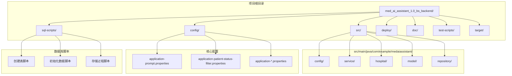
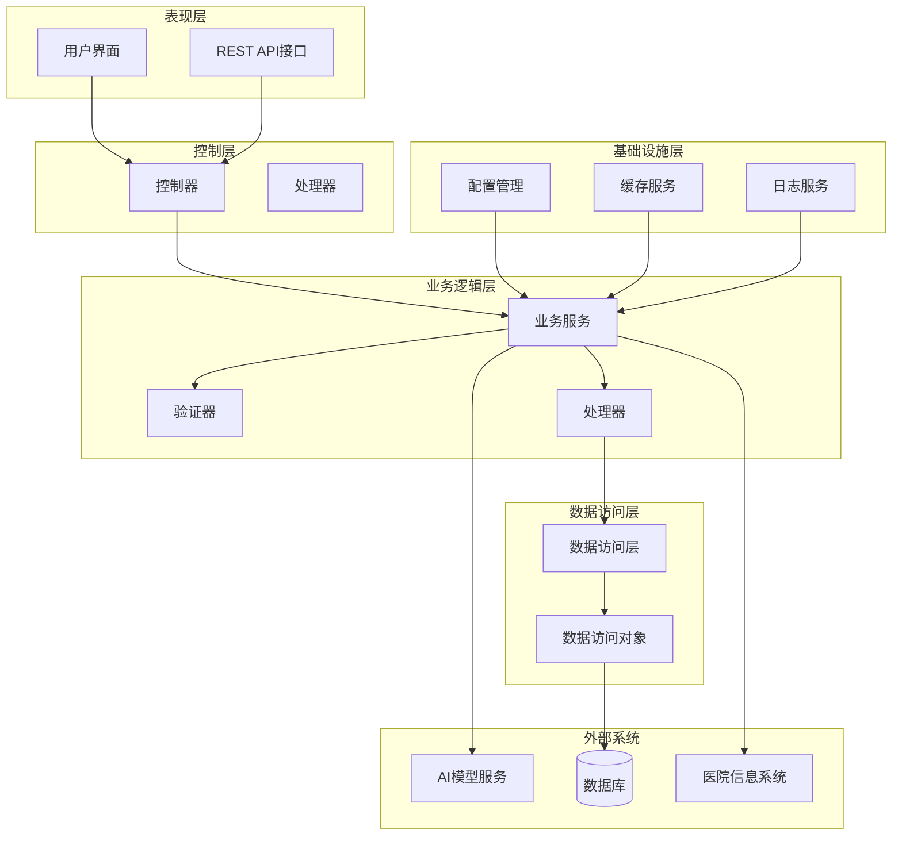
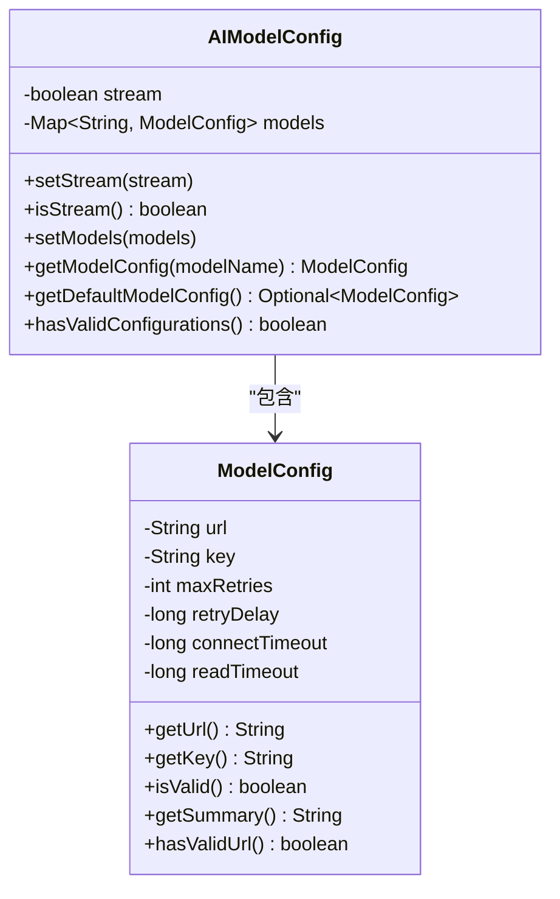
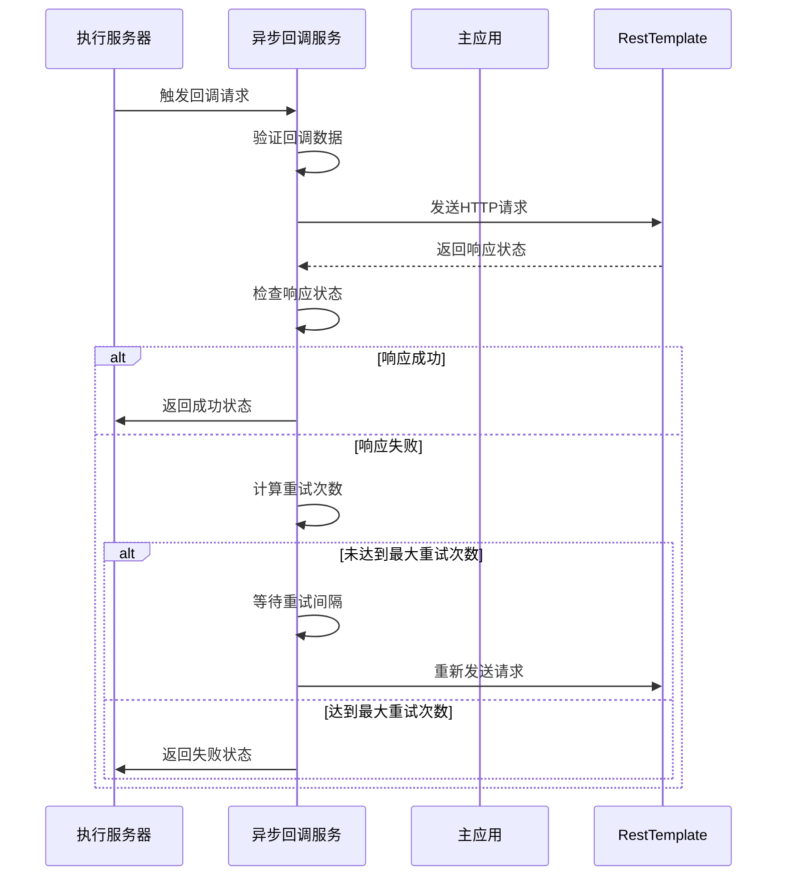
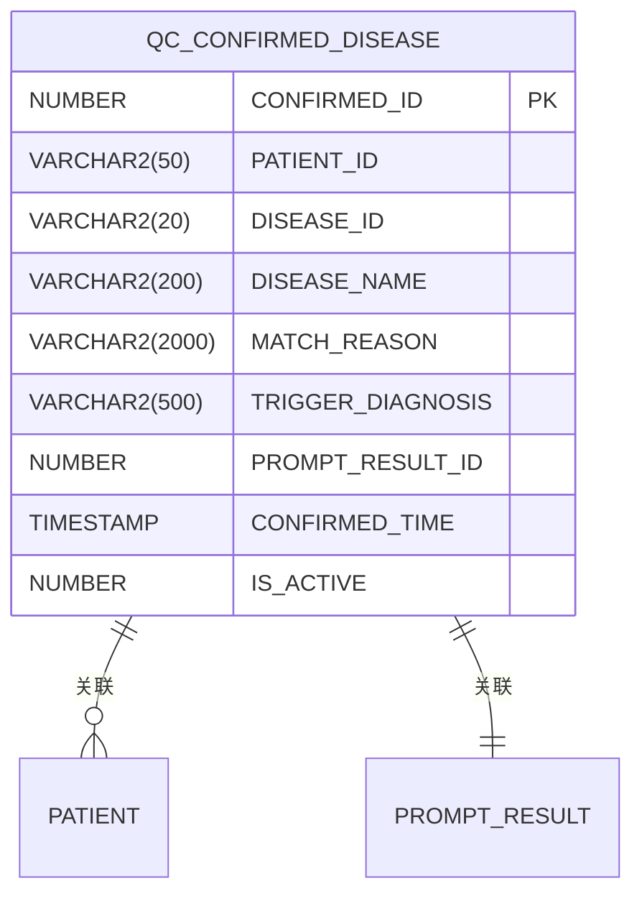
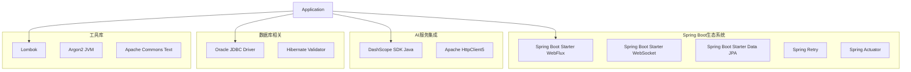

# QC病种匹配系统

<cite>
**本文档引用的文件**
- [MedAiAssistantBackendApplication.java](file://med_ai_assistant_1.0_bs_backend/src/main/java/com/example/medaiassistant/MedAiAssistantBackendApplication.java)
- [AIModelConfig.java](file://med_ai_assistant_1.0_bs_backend/src/main/java/com/example/medaiassistant/config/AIModelConfig.java)
- [AsyncCallbackService.java](file://med_ai_assistant_1.0_bs_backend/src/main/java/com/example/medaiassistant/service/AsyncCallbackService.java)
- [application-prompt.properties](file://med_ai_assistant_1.0_bs_backend/config/application-prompt.properties)
- [application-patient-status-filter.properties](file://med_ai_assistant_1.0_bs_backend/config/application-patient-status-filter.properties)
- [create-qc-confirmed-disease-table.sql](file://med_ai_assistant_1.0_bs_backend/sql-scripts/create-qc-confirmed-disease-table.sql)
- [pom.xml](file://med_ai_assistant_1.0_bs_backend/pom.xml)
</cite>

## 目录
1. [简介](#简介)
2. [项目结构](#项目结构)
3. [核心组件](#核心组件)
4. [架构概览](#架构概览)
5. [详细组件分析](#详细组件分析)
6. [依赖关系分析](#依赖关系分析)
7. [性能考虑](#性能考虑)
8. [故障排除指南](#故障排除指南)
9. [结论](#结论)

## 简介

QC病种匹配系统是一个基于Spring Boot构建的医疗AI辅助诊断系统，专门用于帮助医生进行疾病诊断和治疗方案制定。该系统通过集成多种AI模型，实现对患者病历数据的智能分析和病种匹配，为临床决策提供支持。

系统采用微服务架构设计，包含主应用服务和执行服务器两个核心组件，通过异步回调机制实现服务间通信。系统支持多模型配置、批量处理、重试机制和监控告警等功能，能够满足医院复杂的临床应用场景需求。

## 项目结构

该项目采用标准的Maven项目结构，主要包含以下核心目录：

**图表来源**
- [pom.xml:1-309](file://med_ai_assistant_1.0_bs_backend/pom.xml#L1-L309)

**章节来源**
- [pom.xml:1-309](file://med_ai_assistant_1.0_bs_backend/pom.xml#L1-L309)

## 核心组件

### 应用程序入口

系统的核心入口是`MedAiAssistantBackendApplication`类，它负责启动整个Spring Boot应用程序并配置基本的运行环境。

### AI模型配置管理

AIModelConfig类提供了统一的AI模型配置管理功能，支持多模型配置、配置验证和动态切换。该组件是整个系统的核心配置中心。

### 异步回调服务

AsyncCallbackService实现了主应用和执行服务器之间的异步通信机制，支持重试机制和状态管理，确保服务间的可靠通信。

**章节来源**
- [MedAiAssistantBackendApplication.java:1-50](file://med_ai_assistant_1.0_bs_backend/src/main/java/com/example/medaiassistant/MedAiAssistantBackendApplication.java#L1-L50)
- [AIModelConfig.java:1-399](file://med_ai_assistant_1.0_bs_backend/src/main/java/com/example/medaiassistant/config/AIModelConfig.java#L1-L399)
- [AsyncCallbackService.java:1-252](file://med_ai_assistant_1.0_bs_backend/src/main/java/com/example/medaiassistant/service/AsyncCallbackService.java#L1-L252)

## 架构概览

系统采用分层架构设计，包含以下主要层次：

**图表来源**
- [MedAiAssistantBackendApplication.java:26-37](file://med_ai_assistant_1.0_bs_backend/src/main/java/com/example/medaiassistant/MedAiAssistantBackendApplication.java#L26-L37)
- [AIModelConfig.java:29-318](file://med_ai_assistant_1.0_bs_backend/src/main/java/com/example/medaiassistant/config/AIModelConfig.java#L29-L318)

## 详细组件分析

### AI模型配置组件

AIModelConfig组件是系统的核心配置管理模块，具有以下特点：

#### 配置结构设计

**图表来源**
- [AIModelConfig.java:30-398](file://med_ai_assistant_1.0_bs_backend/src/main/java/com/example/medaiassistant/config/AIModelConfig.java#L30-L398)

#### 配置验证机制

系统实现了多层次的配置验证机制，确保AI模型配置的有效性和完整性：

1. **基础配置验证**：检查URL格式、密钥存在性等基本要求
2. **超时配置验证**：验证连接超时和读取超时的合理性
3. **重试机制验证**：确保重试次数和延迟时间的配置有效

**章节来源**
- [AIModelConfig.java:225-264](file://med_ai_assistant_1.0_bs_backend/src/main/java/com/example/medaiassistant/config/AIModelConfig.java#L225-L264)
- [AIModelConfig.java:294-310](file://med_ai_assistant_1.0_bs_backend/src/main/java/com/example/medaiassistant/config/AIModelConfig.java#L294-L310)

### 异步回调服务组件

AsyncCallbackService实现了主应用和执行服务器之间的异步通信机制：

#### 回调流程设计

**图表来源**
- [AsyncCallbackService.java:68-167](file://med_ai_assistant_1.0_bs_backend/src/main/java/com/example/medaiassistant/service/AsyncCallbackService.java#L68-L167)

#### 重试机制设计

系统实现了智能的重试机制，包括：

1. **指数退避重试**：每次重试间隔按固定倍数增加
2. **最大重试限制**：防止无限重试导致资源浪费
3. **多目标重试**：支持向多个主应用服务器发送回调

**章节来源**
- [AsyncCallbackService.java:98-167](file://med_ai_assistant_1.0_bs_backend/src/main/java/com/example/medaiassistant/service/AsyncCallbackService.java#L98-L167)

### 数据库设计

系统使用Oracle数据库存储核心业务数据，特别是QC病种确认记录：

#### QC病种确认表结构

**图表来源**
- [create-qc-confirmed-disease-table.sql:27-37](file://med_ai_assistant_1.0_bs_backend/sql-scripts/create-qc-confirmed-disease-table.sql#L27-L37)

#### 索引设计策略

系统为提高查询性能，在关键字段上建立了相应的索引：

1. **患者ID索引**：支持按患者快速查询
2. **激活状态索引**：支持状态过滤查询

**章节来源**
- [create-qc-confirmed-disease-table.sql:45-57](file://med_ai_assistant_1.0_bs_backend/sql-scripts/create-qc-confirmed-disease-table.sql#L45-L57)

## 依赖关系分析

系统采用Maven进行依赖管理，主要依赖包括：

### 核心框架依赖

**图表来源**
- [pom.xml:53-214](file://med_ai_assistant_1.0_bs_backend/pom.xml#L53-L214)

### 配置管理

系统通过多个配置文件实现灵活的配置管理：

#### 提交服务配置

| 配置项 | 默认值 | 说明 |
|--------|--------|------|
| prompt.submission.enabled | true | 是否启用提交服务 |
| prompt.submission.page-size | 20 | 提交批次大小 |
| prompt.submission.max-threads | 5 | 最大线程数 |
| prompt.submission.max-retries | 3 | 最大重试次数 |

#### 轮询服务配置

| 配置项 | 默认值 | 说明 |
|--------|--------|------|
| prompt.polling.enabled | true | 是否启用轮询服务 |
| prompt.polling.page-size | 50 | 轮询分页大小 |
| prompt.polling.batch-size | 100 | 轮询批次大小 |
| prompt.polling.timeout | 30000 | 轮询超时时间 |

**章节来源**
- [application-prompt.properties:1-32](file://med_ai_assistant_1.0_bs_backend/config/application-prompt.properties#L1-L32)

## 性能考虑

### 并发处理优化

系统采用了多种并发处理优化策略：

1. **线程池配置**：合理设置最大线程数和队列长度
2. **异步处理**：使用`@Async`注解实现异步回调处理
3. **连接池管理**：优化数据库连接池配置

### 缓存策略

系统实现了多层次的缓存策略：

1. **配置缓存**：缓存AI模型配置信息
2. **结果缓存**：缓存常用的查询结果
3. **会话缓存**：缓存用户会话信息

### 监控指标

系统集成了完整的监控指标体系：

1. **业务指标**：处理吞吐量、成功率等
2. **性能指标**：响应时间、资源使用率等
3. **健康指标**：服务可用性、错误率等

## 故障排除指南

### 常见问题诊断

#### AI模型配置问题

**症状**：AI模型无法正常工作
**排查步骤**：
1. 检查AI模型配置文件是否正确加载
2. 验证API密钥的有效性
3. 确认网络连接是否正常

#### 回调服务异常

**症状**：异步回调失败
**排查步骤**：
1. 检查回调URL配置是否正确
2. 验证目标服务器是否可达
3. 查看重试机制是否正常工作

#### 数据库连接问题

**症状**：数据库操作失败
**排查步骤**：
1. 检查数据库连接配置
2. 验证数据库服务状态
3. 查看连接池使用情况

**章节来源**
- [AsyncCallbackService.java:144-166](file://med_ai_assistant_1.0_bs_backend/src/main/java/com/example/medaiassistant/service/AsyncCallbackService.java#L144-L166)

### 日志分析

系统提供了详细的日志记录机制，便于问题诊断：

1. **配置日志**：记录配置加载和验证过程
2. **业务日志**：记录核心业务处理流程
3. **错误日志**：记录异常和错误信息

## 结论

QC病种匹配系统是一个功能完善、架构合理的医疗AI辅助诊断平台。系统通过模块化的组件设计、完善的配置管理和可靠的异步通信机制，为医院提供了高效的病种匹配和诊断支持。

系统的主要优势包括：

1. **高可用性**：通过重试机制和监控告警确保系统稳定运行
2. **可扩展性**：模块化设计支持功能扩展和性能优化
3. **易维护性**：清晰的代码结构和完善的文档支持
4. **安全性**：多层验证和加密机制保障数据安全

未来可以进一步优化的方向包括：

1. **性能优化**：针对大数据量场景的性能调优
2. **功能扩展**：支持更多类型的AI模型和服务
3. **用户体验**：改善用户界面和交互体验
4. **集成能力**：增强与其他医疗系统的集成能力