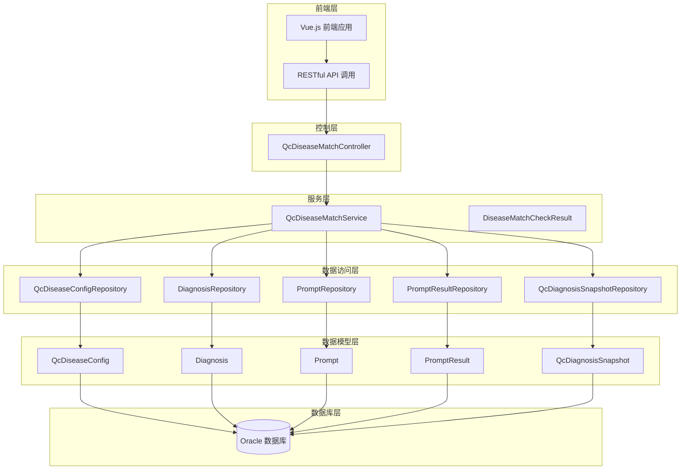
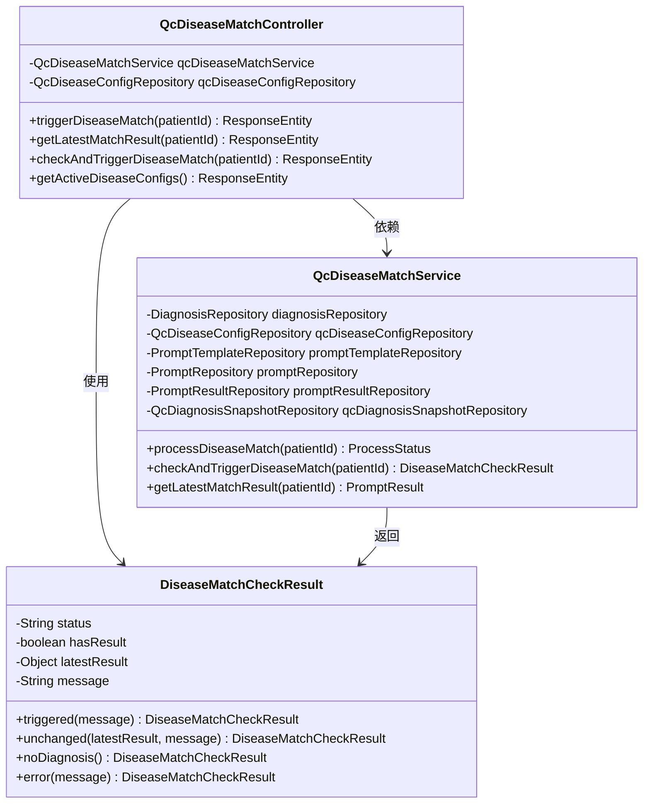
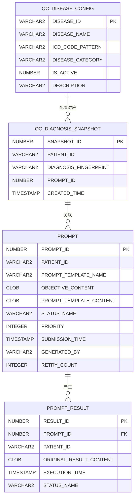
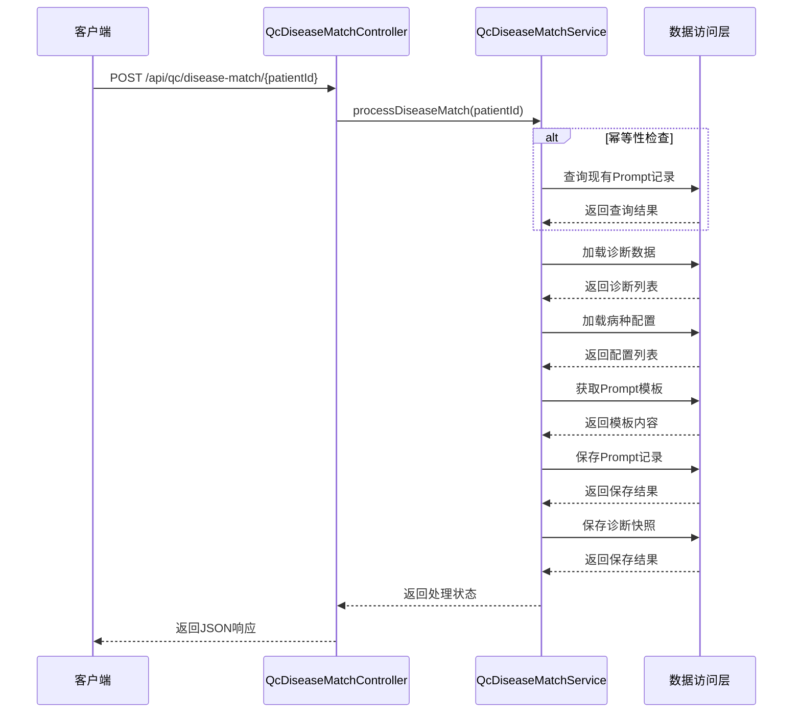
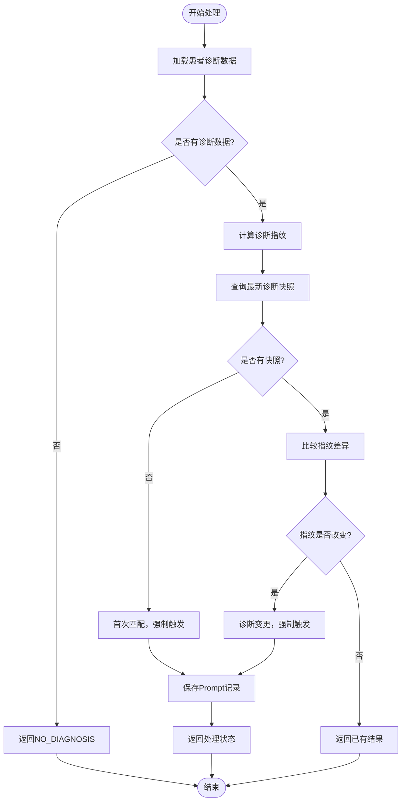
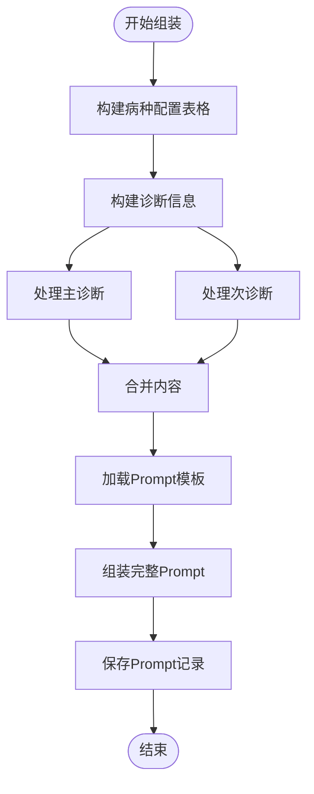
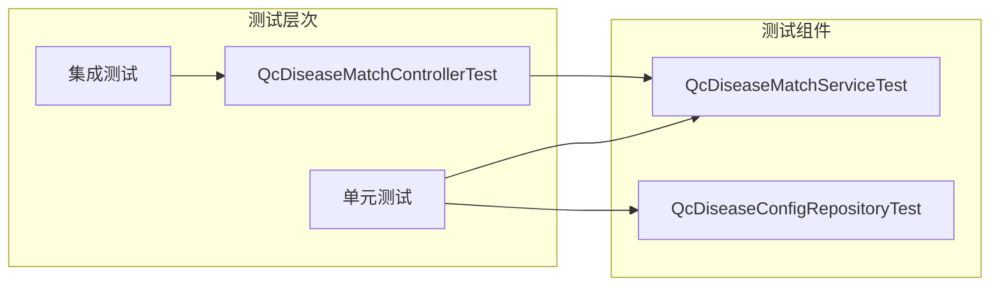

# QC病种匹配系统

<cite>
**本文档引用的文件**
- [pom.xml](file://med_ai_assistant_1.0_bs_backend/pom.xml)
- [QcDiseaseMatchController.java](file://med_ai_assistant_1.0_bs_backend/src/main/java/com/example/medaiassistant/controller/QcDiseaseMatchController.java)
- [QcDiseaseMatchService.java](file://med_ai_assistant_1.0_bs_backend/src/main/java/com/example/medaiassistant/service/qc/QcDiseaseMatchService.java)
- [QcDiseaseConfig.java](file://med_ai_assistant_1.0_bs_backend/src/main/java/com/example/medaiassistant/model/qc/QcDiseaseConfig.java)
- [DiseaseMatchCheckResult.java](file://med_ai_assistant_1.0_bs_backend/src/main/java/com/example/medaiassistant/dto/qc/DiseaseMatchCheckResult.java)
- [质控病种匹配接口.md](file://med_ai_assistant_1.0_bs_backend/doc/接口/质控病种匹配接口.md)
- [create-qc-disease-config-table.sql](file://med_ai_assistant_1.0_bs_backend/sql-scripts/create-qc-disease-config-table.sql)
- [QcDiseaseMatchControllerTest.java](file://med_ai_assistant_1.0_bs_backend/src/test/java/com/example/medaiassistant/qc/controller/QcDiseaseMatchControllerTest.java)
</cite>

## 目录
1. [项目概述](#项目概述)
2. [系统架构](#系统架构)
3. [核心组件分析](#核心组件分析)
4. [数据模型设计](#数据模型设计)
5. [接口设计](#接口设计)
6. [处理流程](#处理流程)
7. [性能考虑](#性能考虑)
8. [测试策略](#测试策略)
9. [部署配置](#部署配置)
10. [总结](#总结)

## 项目概述

QC病种匹配系统是MedAI助手医疗人工智能平台中的核心质量控制模块，专门负责基于患者诊断信息进行病种匹配分析。该系统采用Spring Boot微服务架构，通过AI大模型实现精准的病种识别和匹配，为医疗机构提供标准化的质控指导。

系统主要功能包括：
- **智能病种匹配**：基于患者诊断信息自动识别匹配相应病种
- **诊断变更检测**：实时监测患者诊断变化并自动触发重新匹配
- **配置化管理**：支持灵活的病种配置和规则管理
- **结果持久化**：完整的匹配过程和结果记录

## 系统架构

**图表来源**
- [QcDiseaseMatchController.java:1-222](file://med_ai_assistant_1.0_bs_backend/src/main/java/com/example/medaiassistant/controller/QcDiseaseMatchController.java#L1-L222)
- [QcDiseaseMatchService.java:1-473](file://med_ai_assistant_1.0_bs_backend/src/main/java/com/example/medaiassistant/service/qc/QcDiseaseMatchService.java#L1-L473)

## 核心组件分析

### 控制器层

QcDiseaseMatchController作为系统的入口控制器，提供了四个核心REST API端点：

**图表来源**
- [QcDiseaseMatchController.java:18-222](file://med_ai_assistant_1.0_bs_backend/src/main/java/com/example/medaiassistant/controller/QcDiseaseMatchController.java#L18-L222)
- [QcDiseaseMatchService.java:25-473](file://med_ai_assistant_1.0_bs_backend/src/main/java/com/example/medaiassistant/service/qc/QcDiseaseMatchService.java#L25-L473)
- [DiseaseMatchCheckResult.java:1-190](file://med_ai_assistant_1.0_bs_backend/src/main/java/com/example/medaiassistant/dto/qc/DiseaseMatchCheckResult.java#L1-L190)

### 服务层核心逻辑

服务层实现了复杂的业务逻辑，主要包括：

1. **幂等性检查**：防止重复生成相同的匹配任务
2. **诊断数据处理**：区分主诊断和次诊断，过滤无效数据
3. **病种配置管理**：加载系统启用的病种配置
4. **Prompt模板组装**：构建结构化的AI提示文本
5. **诊断快照管理**：跟踪诊断变化历史

**章节来源**
- [QcDiseaseMatchService.java:129-312](file://med_ai_assistant_1.0_bs_backend/src/main/java/com/example/medaiassistant/service/qc/QcDiseaseMatchService.java#L129-L312)

## 数据模型设计

### 病种配置模型

QcDiseaseConfig是系统的核心数据模型，用于存储病种配置信息：

**图表来源**
- [QcDiseaseConfig.java:19-203](file://med_ai_assistant_1.0_bs_backend/src/main/java/com/example/medaiassistant/model/qc/QcDiseaseConfig.java#L19-L203)
- [create-qc-disease-config-table.sql:1-30](file://med_ai_assistant_1.0_bs_backend/sql-scripts/create-qc-disease-config-table.sql#L1-L30)

### 关键字段说明

| 字段名 | 类型 | 描述 | 约束 |
|--------|------|------|------|
| DISEASE_ID | VARCHAR2(50) | 疾病配置ID，主键 | 非空，手动分配 |
| DISEASE_NAME | VARCHAR2(200) | 疾病名称 | 非空 |
| ICD_CODE_PATTERN | VARCHAR2(500) | ICD编码匹配模式 | 非空 |
| DISEASE_CATEGORY | VARCHAR2(100) | 疾病分类 | 可空 |
| IS_ACTIVE | NUMBER(1) | 启用状态 | 非空，1=启用，0=禁用 |
| DESCRIPTION | VARCHAR2(1000) | 配置描述 | 可空 |

**章节来源**
- [QcDiseaseConfig.java:25-67](file://med_ai_assistant_1.0_bs_backend/src/main/java/com/example/medaiassistant/model/qc/QcDiseaseConfig.java#L25-L67)

## 接口设计

系统提供四个核心REST API接口：

### 1. 触发病种匹配接口

**POST /api/qc/disease-match/{patientId}**

功能：为指定患者触发第一阶段AI诊断匹配

**图表来源**
- [QcDiseaseMatchController.java:80-119](file://med_ai_assistant_1.0_bs_backend/src/main/java/com/example/medaiassistant/controller/QcDiseaseMatchController.java#L80-L119)
- [QcDiseaseMatchService.java:152-234](file://med_ai_assistant_1.0_bs_backend/src/main/java/com/example/medaiassistant/service/qc/QcDiseaseMatchService.java#L152-L234)

### 2. 获取最新匹配结果接口

**GET /api/qc/disease-match/{patientId}/latest**

功能：获取患者最新的第一阶段匹配结果

### 3. 诊断变更检测接口

**POST /api/qc/disease-match/{patientId}/check-and-trigger**

功能：检查诊断变更并按需触发匹配

### 4. 获取病种配置接口

**GET /api/qc/disease-configs**

功能：获取所有启用的病种配置列表

**章节来源**
- [质控病种匹配接口.md:1-171](file://med_ai_assistant_1.0_bs_backend/doc/接口/质控病种匹配接口.md#L1-L171)

## 处理流程

### 诊断变更检测流程

系统实现了智能的诊断变更检测机制：

**图表来源**
- [QcDiseaseMatchService.java:253-312](file://med_ai_assistant_1.0_bs_backend/src/main/java/com/example/medaiassistant/service/qc/QcDiseaseMatchService.java#L253-L312)

### Prompt组装流程

系统将结构化数据组装为AI可理解的提示文本：

**图表来源**
- [QcDiseaseMatchService.java:406-461](file://med_ai_assistant_1.0_bs_backend/src/main/java/com/example/medaiassistant/service/qc/QcDiseaseMatchService.java#L406-L461)

## 性能考虑

### 数据库优化

1. **索引设计**：为QC_DISEASE_CONFIG表建立了DISEASE_CATEGORY和IS_ACTIVE索引
2. **查询优化**：使用专用的Repository方法进行高效查询
3. **缓存策略**：通过诊断指纹快速判断是否需要重新匹配

### 并发处理

系统采用以下并发处理策略：
- **幂等性保护**：防止重复处理相同诊断
- **异步处理**：Prompt创建后由执行服务器异步调用AI接口
- **事务管理**：确保数据一致性和完整性

### 监控指标

系统集成了Micrometer和Prometheus监控：
- 应用健康状态监控
- 数据库连接池监控
- API响应时间统计
- 错误率和异常监控

**章节来源**
- [pom.xml:175-191](file://med_ai_assistant_1.0_bs_backend/pom.xml#L175-L191)

## 测试策略

### 单元测试

系统提供了完整的测试覆盖：

**图表来源**
- [QcDiseaseMatchControllerTest.java:31-69](file://med_ai_assistant_1.0_bs_backend/src/test/java/com/example/medaiassistant/qc/controller/QcDiseaseMatchControllerTest.java#L31-L69)

### 测试覆盖范围

- **控制器层**：端点功能验证
- **服务层**：业务逻辑正确性
- **数据访问层**：数据库操作验证
- **集成测试**：端到端流程测试

## 部署配置

### 环境配置

系统支持多环境部署：
- **Main Profile**：主服务配置
- **Execution Profile**：执行服务器配置

### 数据库配置

系统使用Oracle数据库：
- **JDBC驱动**：ojdbc11 21.5.0.0
- **连接池**：HikariCP
- **ORM框架**：Hibernate JPA

### 监控配置

- **Actuator**：Spring Boot监控端点
- **Prometheus**：指标收集
- **日志管理**：SLF4J + Logback

**章节来源**
- [pom.xml:33-52](file://med_ai_assistant_1.0_bs_backend/pom.xml#L33-L52)
- [pom.xml:98-124](file://med_ai_assistant_1.0_bs_backend/pom.xml#L98-L124)

## 总结

QC病种匹配系统是一个高度模块化的微服务架构，具有以下特点：

### 技术优势
- **模块化设计**：清晰的分层架构，职责分离明确
- **智能化处理**：基于诊断变更的智能触发机制
- **可扩展性**：支持灵活的病种配置和规则管理
- **可靠性**：完善的错误处理和监控机制

### 业务价值
- **提高效率**：自动化病种匹配减少人工工作量
- **保证质量**：标准化的质控流程确保医疗质量
- **降低成本**：减少医疗差错和重复检查
- **提升体验**：为医护人员提供智能化辅助工具

### 发展前景
系统具备良好的扩展性，可以进一步集成更多AI能力，支持更复杂的医疗场景分析，为智慧医疗建设提供有力支撑。