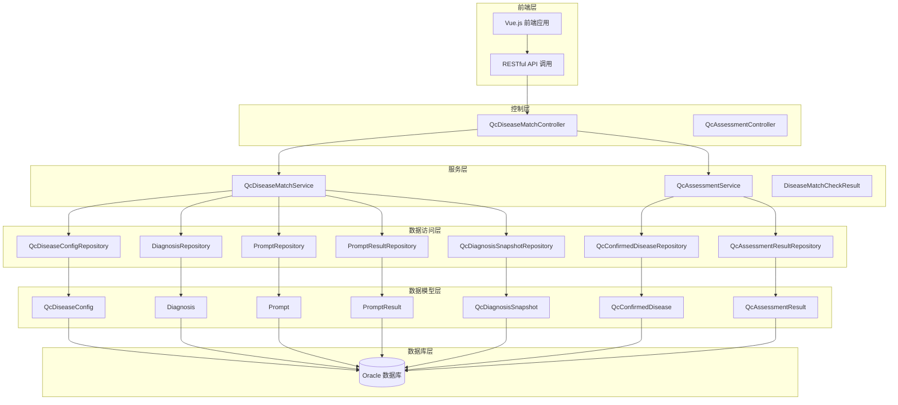
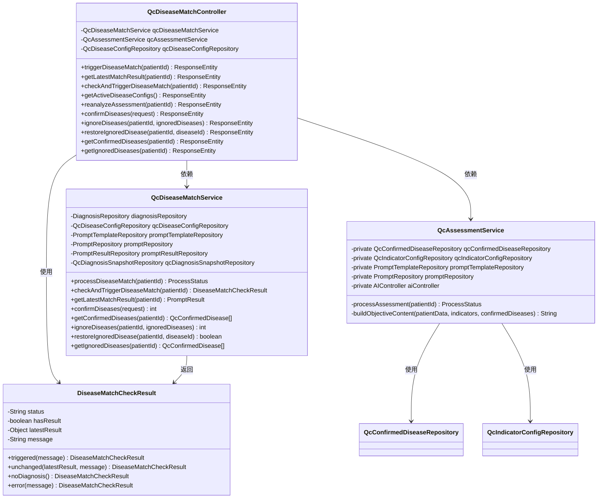
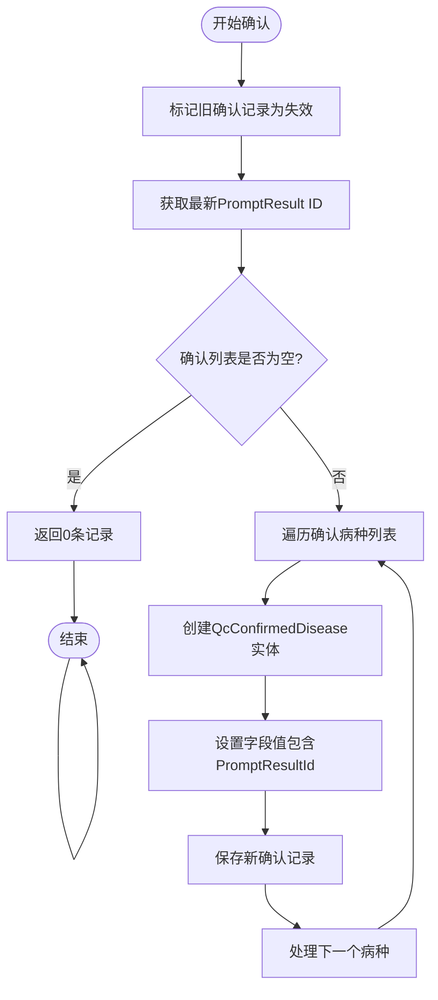
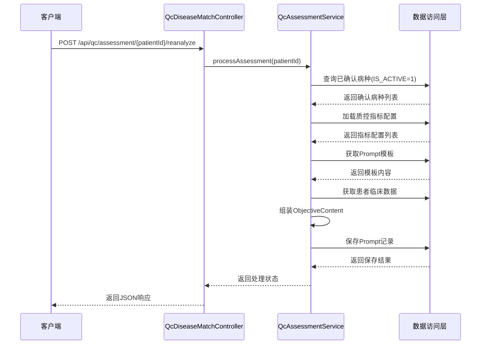
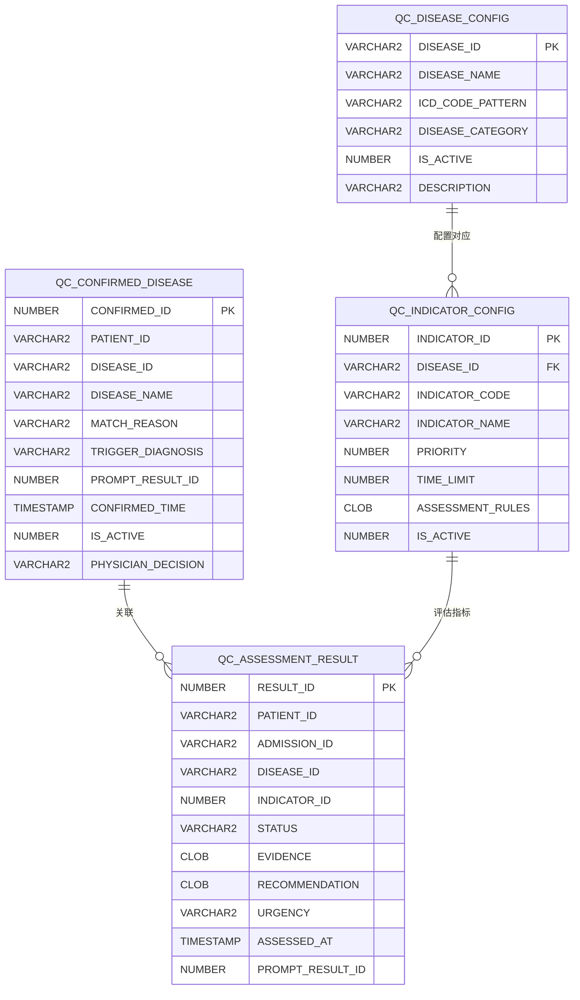
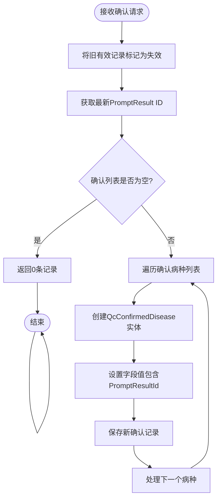
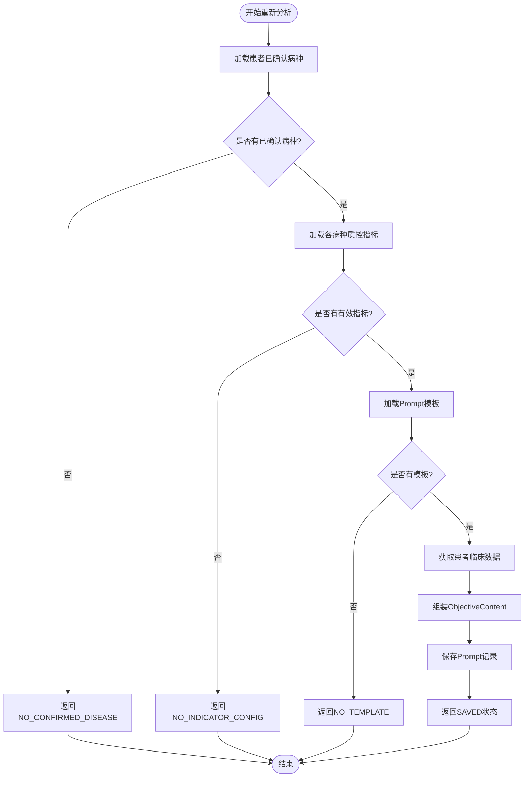
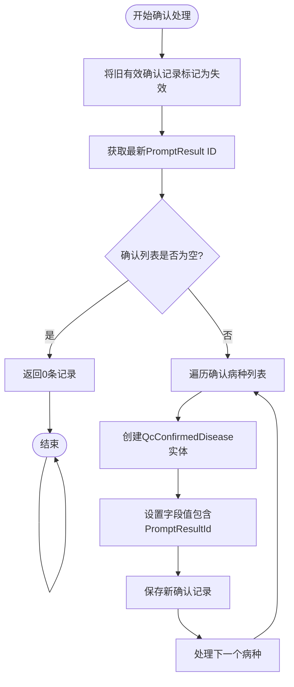
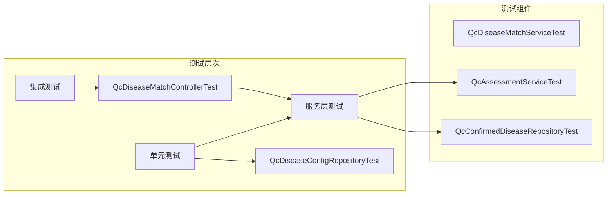

# QC病种匹配系统

<cite>
**本文档引用的文件**
- [pom.xml](file://med_ai_assistant_1.0_bs_backend/pom.xml)
- [QcDiseaseMatchController.java](file://med_ai_assistant_1.0_bs_backend/src/main/java/com/example/medaiassistant/controller/QcDiseaseMatchController.java)
- [QcDiseaseMatchService.java](file://med_ai_assistant_1.0_bs_backend/src/main/java/com/example/medaiassistant/service/qc/QcDiseaseMatchService.java)
- [QcAssessmentService.java](file://med_ai_assistant_1.0_bs_backend/src/main/java/com/example/medaiassistant/service/qc/QcAssessmentService.java)
- [QcDiseaseConfig.java](file://med_ai_assistant_1.0_bs_backend/src/main/java/com/example/medaiassistant/model/qc/QcDiseaseConfig.java)
- [QcConfirmedDisease.java](file://med_ai_assistant_1.0_bs_backend/src/main/java/com/example/medaiassistant/model/qc/QcConfirmedDisease.java)
- [QcAssessmentResult.java](file://med_ai_assistant_1.0_bs_backend/src/main/java/com/example/medaiassistant/model/qc/QcAssessmentResult.java)
- [AssessmentStatus.java](file://med_ai_assistant_1.0_bs_backend/src/main/java/com/example/medaiassistant/model/qc/enums/AssessmentStatus.java)
- [DiseaseMatchCheckResult.java](file://med_ai_assistant_1.0_bs_backend/src/main/java/com/example/medaiassistant/dto/qc/DiseaseMatchCheckResult.java)
- [ConfirmDiseaseRequest.java](file://med_ai_assistant_1.0_bs_backend/src/main/java/com/example/medaiassistant/dto/qc/ConfirmDiseaseRequest.java)
- [质控病种匹配接口.md](file://med_ai_assistant_1.0_bs_backend/doc/接口/质控病种匹配接口.md)
- [create-qc-disease-config-table.sql](file://med_ai_assistant_1.0_bs_backend/sql-scripts/create-qc-disease-config-table.sql)
- [create-qc-confirmed-disease-table.sql](file://med_ai_assistant_1.0_bs_backend/sql-scripts/create-qc-confirmed-disease-table.sql)
- [create-qc-assessment-result-table.sql](file://med_ai_assistant_1.0_bs_backend/sql-scripts/create-qc-assessment-result-table.sql)
- [alter-qc-confirmed-disease-add-decision.sql](file://med_ai_assistant_1.0_bs_backend/sql-scripts/alter-qc-confirmed-disease-add-decision.sql)
- [QcDiseaseMatchControllerTest.java](file://med_ai_assistant_1.0_bs_backend/src/test/java/com/example/medaiassistant/qc/controller/QcDiseaseMatchControllerTest.java)
</cite>

## 更新摘要
**变更内容**
- 新增质控评估重新分析功能，支持第三阶段AI质控评估的重新触发
- 新增病种确认持久化功能，支持医师确认病种的完整生命周期管理
- 新增质控评估结果数据模型，支持详细的评估状态和证据记录
- 扩展接口文档，包含重新分析和病种确认相关API
- 更新数据库表结构，新增QC_CONFIRMED_DISEASE和QC_ASSESSMENT_RESULT表

## 目录
1. [项目概述](#项目概述)
2. [系统架构](#系统架构)
3. [核心组件分析](#核心组件分析)
4. [数据模型设计](#数据模型设计)
5. [接口设计](#接口设计)
6. [处理流程](#处理流程)
7. [性能考虑](#性能考虑)
8. [测试策略](#测试策略)
9. [部署配置](#部署配置)
10. [总结](#总结)

## 项目概述

QC病种匹配系统是MedAI助手医疗人工智能平台中的核心质量控制模块，专门负责基于患者诊断信息进行病种匹配分析。该系统采用Spring Boot微服务架构，通过AI大模型实现精准的病种识别和匹配，为医疗机构提供标准化的质控指导。

**更新** 系统现已支持完整的质控评估生命周期管理，包括第一阶段诊断匹配、第二阶段病种确认，以及第三阶段质控评估重新分析功能。

系统主要功能包括：
- **智能病种匹配**：基于患者诊断信息自动识别匹配相应病种
- **诊断变更检测**：实时监测患者诊断变化并自动触发重新匹配
- **配置化管理**：支持灵活的病种配置和规则管理
- **结果持久化**：完整的匹配过程和结果记录
- **质控评估重新分析**：支持基于已确认病种的质控评估重新触发
- **病种确认管理**：完整的医师确认病种生命周期管理

## 系统架构

**图表来源**
- [QcDiseaseMatchController.java:1-259](file://med_ai_assistant_1.0_bs_backend/src/main/java/com/example/medaiassistant/controller/QcDiseaseMatchController.java#L1-L259)
- [QcAssessmentService.java:1-296](file://med_ai_assistant_1.0_bs_backend/src/main/java/com/example/medaiassistant/service/qc/QcAssessmentService.java#L1-L296)

## 核心组件分析

### 控制器层

**更新** 新增质控评估控制器，提供完整的质控评估重新分析功能。

QcDiseaseMatchController作为系统的入口控制器，现在提供五个核心REST API端点：

**图表来源**
- [QcDiseaseMatchController.java:65-259](file://med_ai_assistant_1.0_bs_backend/src/main/java/com/example/medaiassistant/controller/QcDiseaseMatchController.java#L65-L259)
- [QcAssessmentService.java:20-296](file://med_ai_assistant_1.0_bs_backend/src/main/java/com/example/medaiassistant/service/qc/QcAssessmentService.java#L20-L296)
- [QcDiseaseMatchService.java:480-624](file://med_ai_assistant_1.0_bs_backend/src/main/java/com/example/medaiassistant/service/qc/QcDiseaseMatchService.java#L480-L624)

### 服务层核心逻辑

**更新** 新增质控评估服务，实现第三阶段质控评估的完整处理流程。

服务层现在包含三个核心服务：

1. **QcDiseaseMatchService**：处理第一阶段的病种匹配
2. **QcAssessmentService**：处理第三阶段的质控评估重新分析
3. **QcDiseaseMatchService**：扩展病种确认功能

#### 病种确认持久化方法

**新增** 病种确认持久化方法实现了完整的医师确认病种生命周期管理：

**图表来源**
- [QcDiseaseMatchService.java:498-536](file://med_ai_assistant_1.0_bs_backend/src/main/java/com/example/medaiassistant/service/qc/QcDiseaseMatchService.java#L498-L536)

#### 质控评估重新分析流程

**新增** 质控评估服务实现了第三阶段的完整评估流程：

**图表来源**
- [QcAssessmentService.java:137-200](file://med_ai_assistant_1.0_bs_backend/src/main/java/com/example/medaiassistant/service/qc/QcAssessmentService.java#L137-L200)

**章节来源**
- [QcDiseaseMatchService.java:498-624](file://med_ai_assistant_1.0_bs_backend/src/main/java/com/example/medaiassistant/service/qc/QcDiseaseMatchService.java#L498-L624)
- [QcAssessmentService.java:128-200](file://med_ai_assistant_1.0_bs_backend/src/main/java/com/example/medaiassistant/service/qc/QcAssessmentService.java#L128-L200)

## 数据模型设计

### 病种确认持久化模型

**新增** QcConfirmedDisease是病种确认持久化的核心数据模型：

**图表来源**
- [QcConfirmedDisease.java:18-110](file://med_ai_assistant_1.0_bs_backend/src/main/java/com/example/medaiassistant/model/qc/QcConfirmedDisease.java#L18-L110)
- [QcAssessmentResult.java:37-78](file://med_ai_assistant_1.0_bs_backend/src/main/java/com/example/medaiassistant/model/qc/QcAssessmentResult.java#L37-L78)

### 关键字段说明

**更新** 新增病种确认持久化模型的关键字段：

| 字段名 | 类型 | 描述 | 约束 |
|--------|------|------|------|
| CONFIRMED_ID | NUMBER | 确认记录ID，主键 | 非空，序列自增 |
| PATIENT_ID | VARCHAR2(50) | 患者ID | 非空 |
| DISEASE_ID | VARCHAR2(20) | 病种ID | 非空 |
| DISEASE_NAME | VARCHAR2(200) | 病种名称 | 可空 |
| MATCH_REASON | VARCHAR2(2000) | AI匹配依据说明 | 可空 |
| TRIGGER_DIAGNOSIS | VARCHAR2(500) | 触发本次匹配的诊断 | 可空 |
| PROMPT_RESULT_ID | NUMBER | 关联的PromptResult ID | 可空 |
| CONFIRMED_TIME | TIMESTAMP | 确认时间 | 默认当前时间 |
| IS_ACTIVE | NUMBER(1) | 是否有效 | 默认1=有效，0=失效 |
| PHYSICIAN_DECISION | VARCHAR2(20) | 医师决策类型 | 默认CONFIRMED |

**章节来源**
- [QcConfirmedDisease.java:22-95](file://med_ai_assistant_1.0_bs_backend/src/main/java/com/example/medaiassistant/model/qc/QcConfirmedDisease.java#L22-L95)

### 质控评估结果模型

**新增** QcAssessmentResult用于存储详细的质控评估结果：

| 字段名 | 类型 | 描述 | 约束 |
|--------|------|------|------|
| RESULT_ID | NUMBER | 评估结果ID，主键 | 非空，自增 |
| PATIENT_ID | VARCHAR2(100) | 患者ID | 非空 |
| ADMISSION_ID | VARCHAR2(100) | 住院ID | 非空 |
| DISEASE_ID | VARCHAR2(50) | 疾病ID | 非空 |
| INDICATOR_ID | NUMBER | 指标ID | 非空 |
| STATUS | VARCHAR2(50) | 评估状态 | 非空，枚举值 |
| EVIDENCE | CLOB | 评估证据 | 可空 |
| RECOMMENDATION | CLOB | 改进建议 | 可空 |
| URGENCY | VARCHAR2(20) | 紧急程度 | 可空 |
| ASSESSED_AT | TIMESTAMP | 评估时间 | 默认当前时间 |
| PROMPT_RESULT_ID | NUMBER | 关联的Prompt结果ID | 可空 |

**章节来源**
- [QcAssessmentResult.java:37-78](file://med_ai_assistant_1.0_bs_backend/src/main/java/com/example/medaiassistant/model/qc/QcAssessmentResult.java#L37-L78)

## 接口设计

### 重新分析质控评估接口

**新增** POST /api/qc/assessment/{patientId}/reanalyze

功能：触发指定患者的第三阶段AI质控评估重新分析

**图表来源**
- [QcDiseaseMatchController.java:78-127](file://med_ai_assistant_1.0_bs_backend/src/main/java/com/example/medaiassistant/controller/QcDiseaseMatchController.java#L78-L127)
- [QcAssessmentService.java:137-200](file://med_ai_assistant_1.0_bs_backend/src/main/java/com/example/medaiassistant/service/qc/QcAssessmentService.java#L137-L200)

### 病种确认接口

**新增** POST /api/qc/disease-confirm

功能：保存医师确认的病种列表

**图表来源**
- [QcDiseaseMatchService.java:498-536](file://med_ai_assistant_1.0_bs_backend/src/main/java/com/example/medaiassistant/service/qc/QcDiseaseMatchService.java#L498-L536)

### 病种忽略和恢复接口

**新增** 支持病种忽略和恢复功能：

- POST /api/qc/disease-ignore - 忽略指定病种
- POST /api/qc/disease-restore - 恢复被忽略的病种
- GET /api/qc/disease-ignored - 获取已忽略病种列表

**章节来源**
- [质控病种匹配接口.md:321-388](file://med_ai_assistant_1.0_bs_backend/doc/接口/质控病种匹配接口.md#L321-L388)
- [QcDiseaseMatchController.java:294-324](file://med_ai_assistant_1.0_bs_backend/src/main/java/com/example/medaiassistant/controller/QcDiseaseMatchController.java#L294-L324)

## 处理流程

### 质控评估重新分析流程

**新增** 质控评估重新分析的完整流程：

**图表来源**
- [QcAssessmentService.java:137-200](file://med_ai_assistant_1.0_bs_backend/src/main/java/com/example/medaiassistant/service/qc/QcAssessmentService.java#L137-L200)

### 病种确认处理流程

**更新** 病种确认处理流程包含完整的生命周期管理：

**图表来源**
- [QcDiseaseMatchService.java:498-536](file://med_ai_assistant_1.0_bs_backend/src/main/java/com/example/medaiassistant/service/qc/QcDiseaseMatchService.java#L498-L536)

## 性能考虑

### 数据库优化

**更新** 新增数据库优化策略：

1. **索引设计**：为QC_CONFIRMED_DISEASE表建立了PATIENT_ID和IS_ACTIVE组合索引
2. **序列管理**：使用Oracle序列确保CONFIRMED_ID的唯一性和性能
3. **查询优化**：通过专用的Repository方法进行高效查询
4. **缓存策略**：通过诊断指纹快速判断是否需要重新匹配

### 并发处理

**更新** 新增并发处理策略：

系统采用以下并发处理策略：
- **幂等性保护**：防止重复处理相同诊断
- **事务管理**：确保病种确认的原子性操作
- **异步处理**：Prompt创建后由执行服务器异步调用AI接口
- **乐观锁**：通过IS_ACTIVE字段实现软删除和版本控制

### 监控指标

系统集成了Micrometer和Prometheus监控：
- 应用健康状态监控
- 数据库连接池监控
- API响应时间统计
- 错误率和异常监控
- 质控评估任务队列监控

**章节来源**
- [pom.xml:175-191](file://med_ai_assistant_1.0_bs_backend/pom.xml#L175-L191)

## 测试策略

### 单元测试

**更新** 新增测试覆盖范围：

系统提供了完整的测试覆盖：

**图表来源**
- [QcDiseaseMatchControllerTest.java:31-69](file://med_ai_assistant_1.0_bs_backend/src/test/java/com/example/medaiassistant/qc/controller/QcDiseaseMatchControllerTest.java#L31-L69)

### 测试覆盖范围

**更新** 新增测试覆盖范围：

- **控制器层**：端点功能验证，包括重新分析和病种确认接口
- **服务层**：业务逻辑正确性，包括质控评估和病种确认服务
- **数据访问层**：数据库操作验证，包括新增的Repository测试
- **集成测试**：端到端流程测试，包括完整的质控评估流程

## 部署配置

### 环境配置

**更新** 新增环境配置：

系统支持多环境部署：
- **Main Profile**：主服务配置
- **Execution Profile**：执行服务器配置

### 数据库配置

**更新** 新增数据库配置：

系统使用Oracle数据库：
- **JDBC驱动**：ojdbc11 21.5.0.0
- **连接池**：HikariCP
- **ORM框架**：Hibernate JPA
- **新增表结构**：QC_CONFIRMED_DISEASE和QC_ASSESSMENT_RESULT表

### 监控配置

**更新** 新增监控配置：

- **Actuator**：Spring Boot监控端点
- **Prometheus**：指标收集
- **日志管理**：SLF4J + Logback
- **新增指标**：质控评估任务状态监控

**章节来源**
- [pom.xml:33-52](file://med_ai_assistant_1.0_bs_backend/pom.xml#L33-L52)
- [pom.xml:98-124](file://med_ai_assistant_1.0_bs_backend/pom.xml#L98-L124)

## 总结

QC病种匹配系统是一个高度模块化的微服务架构，经过更新后具备了完整的质控评估生命周期管理能力，具有以下特点：

### 技术优势
- **模块化设计**：清晰的分层架构，职责分离明确
- **智能化处理**：基于诊断变更的智能触发机制
- **可扩展性**：支持灵活的病种配置和规则管理
- **可靠性**：完善的错误处理和监控机制
- **完整性**：支持从诊断匹配到质控评估的完整流程
- **持久化能力**：完整的病种确认和评估结果持久化

### 业务价值
- **提高效率**：自动化病种匹配和质控评估减少人工工作量
- **保证质量**：标准化的质控流程确保医疗质量
- **降低成本**：减少医疗差错和重复检查
- **提升体验**：为医护人员提供智能化辅助工具
- **支持决策**：提供详细的质控评估证据和建议

### 发展前景
系统具备良好的扩展性，可以进一步集成更多AI能力，支持更复杂的医疗场景分析，为智慧医疗建设提供有力支撑。新增的质控评估重新分析功能和病种确认持久化功能为系统的智能化水平提供了重要支撑。