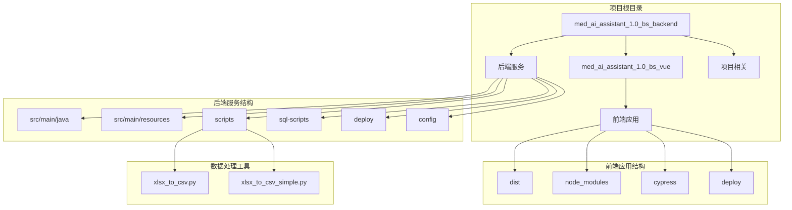
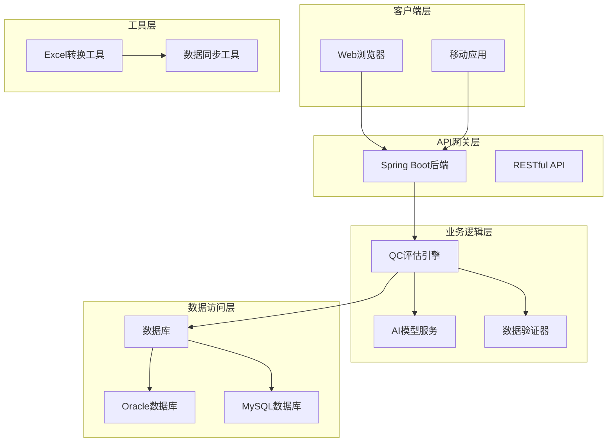
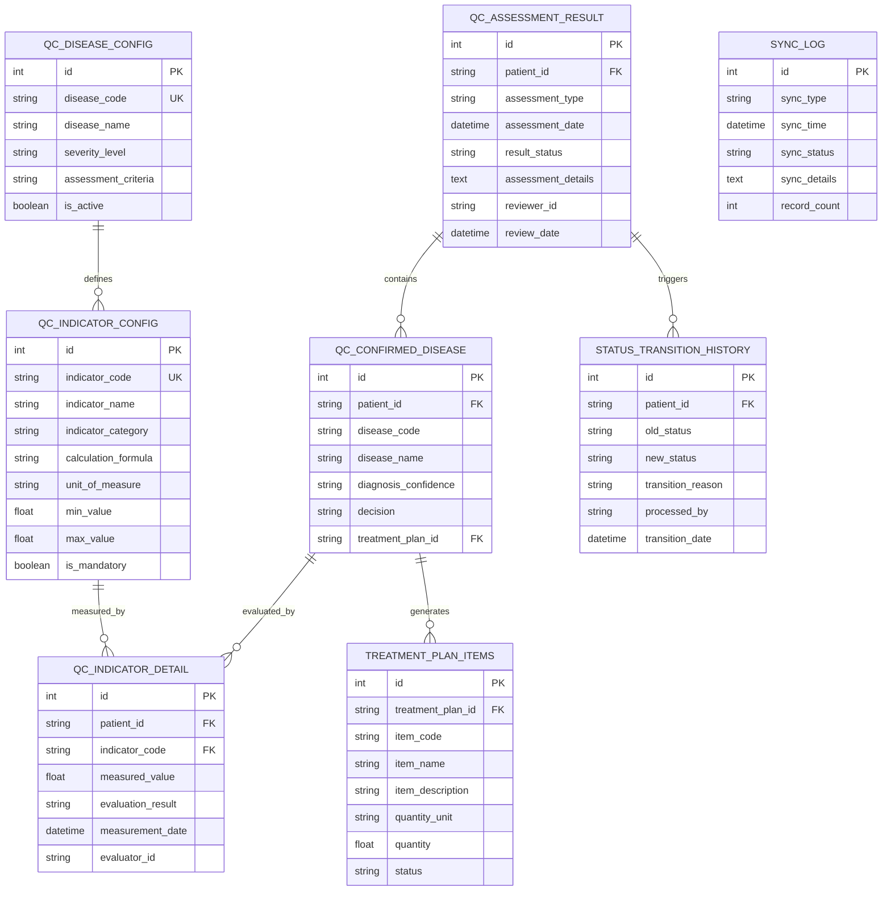
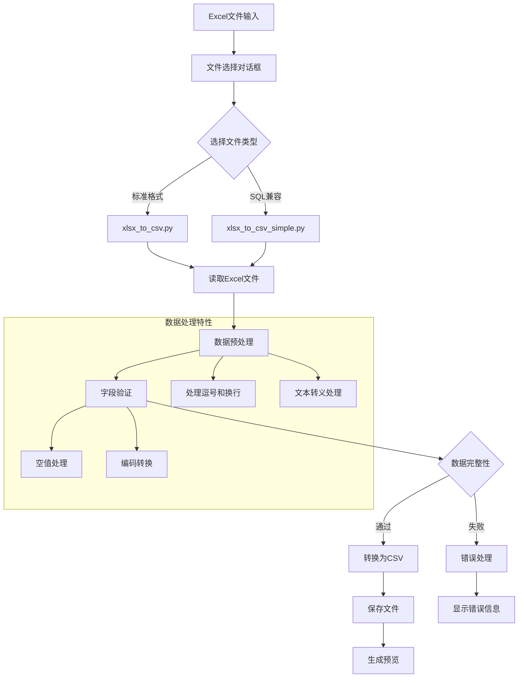
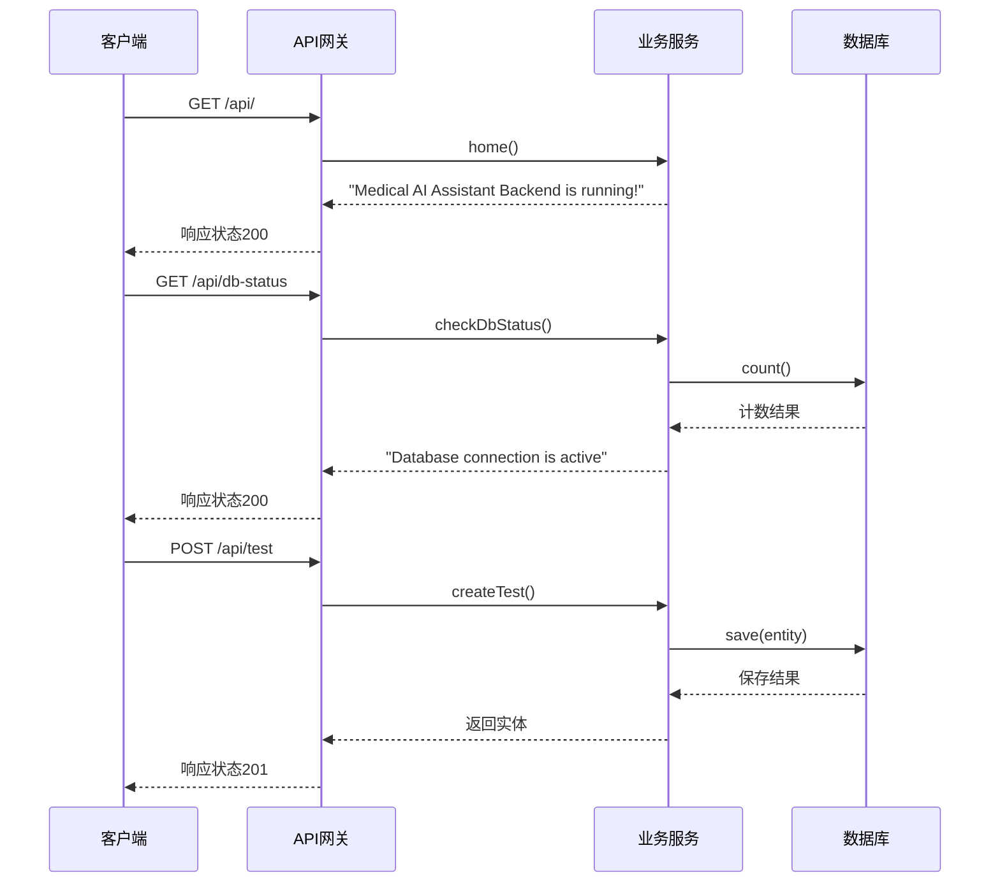
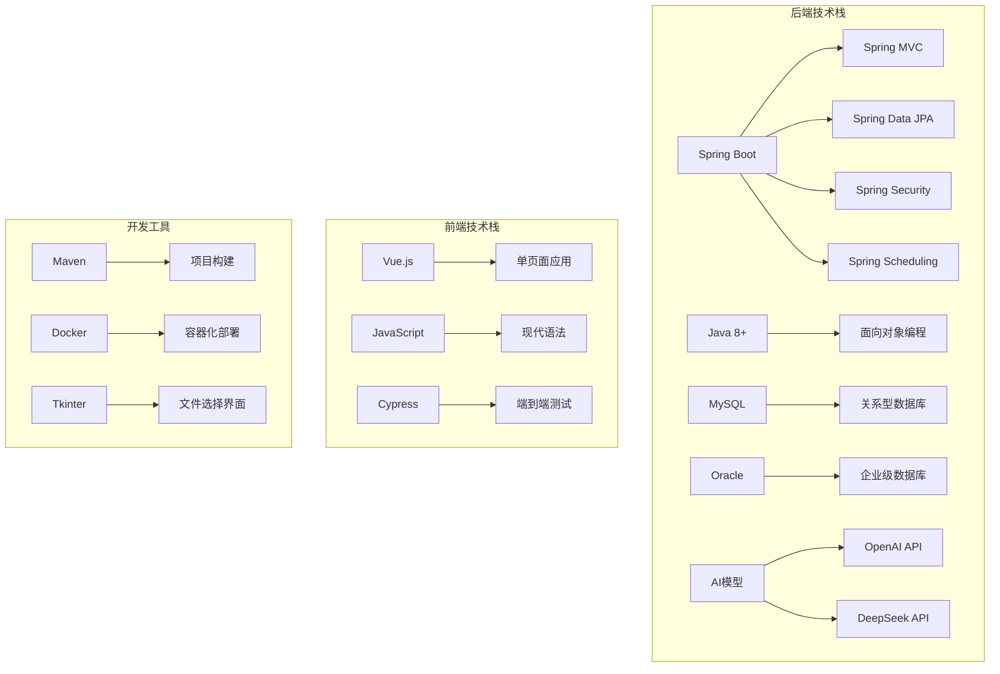

# QC评估引擎

<cite>
**本文档中引用的文件**
- [MedAiAssistantBackendApplication.java](file://med_ai_assistant_1.0_bs_backend/src/main/java/com/example/medaiassistant/MedAiAssistantBackendApplication.java)
- [HomeController.java](file://med_ai_assistant_1.0_bs_backend/src/main/java/com/example/medaiassistant/HomeController.java)
- [xlsx_to_csv.py](file://med_ai_assistant_1.0_bs_backend/scripts/xlsx_to_csv.py)
- [xlsx_to_csv_simple.py](file://med_ai_assistant_1.0_bs_backend/scripts/xlsx_to_csv_simple.py)
- [pom.xml](file://med_ai_assistant_1.0_bs_backend/pom.xml)
- [application.properties](file://med_ai_assistant_1.0_bs_backend/src/main/resources/application.properties)
- [ai-models.properties](file://med_ai_assistant_1.0_bs_backend/src/main/resources/ai-models.properties)
- [docker-compose.yml](file://med_ai_assistant_1.0_bs_backend/docker-compose.yml)
- [init.sql](file://med_ai_assistant_1.0_bs_backend/init.sql)
- [create-qc-assessment-result-table.sql](file://med_ai_assistant_1.0_bs_backend/sql-scripts/create-qc-assessment-result-table.sql)
- [create-qc-confirmed-disease-table.sql](file://med_ai_assistant_1.0_bs_backend/sql-scripts/create-qc-confirmed-disease-table.sql)
- [create-qc-disease-config-table.sql](file://med_ai_assistant_1.0_bs_backend/sql-scripts/create-qc-disease-config-table.sql)
- [create-qc-indicator-config-table.sql](file://med_ai_assistant_1.0_bs_backend/sql-scripts/create-qc-indicator-config-table.sql)
- [create-qc-indicator-detail-table.sql](file://med_ai_assistant_1.0_bs_backend/sql-scripts/create-qc-indicator-detail-table.sql)
- [create-treatment-plan-items-table.sql](file://med_ai_assistant_1.0_bs_backend/sql-scripts/create-treatment-plan-items-table.sql)
- [create-status-transition-history-table.sql](file://med_ai_assistant_1.0_bs_backend/sql-scripts/create-status-transition-history-table.sql)
- [create-sync-log-table.sql](file://med_ai_assistant_1.0_bs_backend/sql-scripts/create-sync-log-table.sql)
- [create-drg-analysis-results-table.sql](file://med_ai_assistant_1.0_bs_backend/sql-scripts/create-drg-analysis-results-table.sql)
- [create-identity-sequences.sql](file://med_ai_assistant_1.0_bs_backend/sql-scripts/create-identity-sequences.sql)
- [add-drg-code-column.sql](file://med_ai_assistant_1.0_bs_backend/sql-scripts/add-drg-code-column.sql)
- [add-insurance-payment-standard-column.sql](file://med_ai_assistant_1.0_bs_backend/sql-scripts/add-insurance-payment-standard-column.sql)
- [add-request-id-unique-constraint.sql](file://med_ai_assistant_1.0_bs_backend/sql-scripts/add-request-id-unique-constraint.sql)
- [add-surgery-columns.sql](file://med_ai_assistant_1.0_bs_backend/sql-scripts/add-surgery-columns.sql)
- [alter-qc-confirmed-disease-add-decision.sql](file://med_ai_assistant_1.0_bs_backend/sql-scripts/alter-qc-confirmed-disease-add-decision.sql)
- [alter-treatment-plan-items-add-patient-id.sql](file://med_ai_assistant_1.0_bs_backend/sql-scripts/alter-treatment-plan-items-add-patient-id.sql)
- [drg_analysis_input_snapshot.sql](file://med_ai_assistant_1.0_bs_backend/sql-scripts/drg_analysis_input_snapshot.sql)
- [README.md](file://med_ai_assistant_1.0_bs_backend/deploy/README.md)
</cite>

## 目录
1. [简介](#简介)
2. [项目结构](#项目结构)
3. [核心组件](#核心组件)
4. [架构概览](#架构概览)
5. [详细组件分析](#详细组件分析)
6. [依赖分析](#依赖分析)
7. [性能考虑](#性能考虑)
8. [故障排除指南](#故障排除指南)
9. [结论](#结论)

## 简介

QC评估引擎是一个基于Spring Boot框架开发的医疗质量控制评估系统，专门用于对DRG（Diagnosis Related Groups）病例进行质量评估和审核。该系统集成了AI模型支持，提供完整的医疗数据处理、质量评估、结果管理和监控功能。

系统采用微服务架构设计，包含后端服务、前端界面和数据处理工具三个主要部分。后端服务基于Spring Boot提供RESTful API接口，前端使用Vue.js构建用户界面，数据处理工具负责Excel到CSV格式转换等数据预处理任务。

## 项目结构

**图表来源**
- [MedAiAssistantBackendApplication.java:1-50](file://med_ai_assistant_1.0_bs_backend/src/main/java/com/example/medaiassistant/MedAiAssistantBackendApplication.java#L1-L50)
- [pom.xml](file://med_ai_assistant_1.0_bs_backend/pom.xml)

**章节来源**
- [MedAiAssistantBackendApplication.java:1-50](file://med_ai_assistant_1.0_bs_backend/src/main/java/com/example/medaiassistant/MedAiAssistantBackendApplication.java#L1-L50)
- [pom.xml](file://med_ai_assistant_1.0_bs_backend/pom.xml)

## 核心组件

### 后端应用主类

后端应用的入口点，配置了Spring Boot应用程序的基本设置，包括组件扫描、JPA仓库配置和定时任务功能。

### 主控制器

提供基础的API接口，包括健康检查、数据库状态检测和用户管理功能。

### 数据处理工具

包含两个Excel到CSV转换工具，支持不同的数据处理需求和兼容性要求。

**章节来源**
- [MedAiAssistantBackendApplication.java:10-47](file://med_ai_assistant_1.0_bs_backend/src/main/java/com/example/medaiassistant/MedAiAssistantBackendApplication.java#L10-L47)
- [HomeController.java:1-51](file://med_ai_assistant_1.0_bs_backend/src/main/java/com/example/medaiassistant/HomeController.java#L1-L51)

## 架构概览

**图表来源**
- [MedAiAssistantBackendApplication.java:26-47](file://med_ai_assistant_1.0_bs_backend/src/main/java/com/example/medaiassistant/MedAiAssistantBackendApplication.java#L26-L47)
- [pom.xml](file://med_ai_assistant_1.0_bs_backend/pom.xml)

## 详细组件分析

### 数据库架构设计

系统采用多表结构设计，支持完整的QC评估流程：

**图表来源**
- [create-qc-assessment-result-table.sql](file://med_ai_assistant_1.0_bs_backend/sql-scripts/create-qc-assessment-result-table.sql)
- [create-qc-confirmed-disease-table.sql](file://med_ai_assistant_1.0_bs_backend/sql-scripts/create-qc-confirmed-disease-table.sql)
- [create-qc-disease-config-table.sql](file://med_ai_assistant_1.0_bs_backend/sql-scripts/create-qc-disease-config-table.sql)
- [create-qc-indicator-config-table.sql](file://med_ai_assistant_1.0_bs_backend/sql-scripts/create-qc-indicator-config-table.sql)
- [create-qc-indicator-detail-table.sql](file://med_ai_assistant_1.0_bs_backend/sql-scripts/create-qc-indicator-detail-table.sql)
- [create-treatment-plan-items-table.sql](file://med_ai_assistant_1.0_bs_backend/sql-scripts/create-treatment-plan-items-table.sql)
- [create-status-transition-history-table.sql](file://med_ai_assistant_1.0_bs_backend/sql-scripts/create-status-transition-history-table.sql)
- [create-sync-log-table.sql](file://med_ai_assistant_1.0_bs_backend/sql-scripts/create-sync-log-table.sql)

### 数据处理流程

**图表来源**
- [xlsx_to_csv.py:37-91](file://med_ai_assistant_1.0_bs_backend/scripts/xlsx_to_csv.py#L37-L91)
- [xlsx_to_csv_simple.py:64-133](file://med_ai_assistant_1.0_bs_backend/scripts/xlsx_to_csv_simple.py#L64-L133)

**章节来源**
- [xlsx_to_csv.py:1-116](file://med_ai_assistant_1.0_bs_backend/scripts/xlsx_to_csv.py#L1-L116)
- [xlsx_to_csv_simple.py:1-203](file://med_ai_assistant_1.0_bs_backend/scripts/xlsx_to_csv_simple.py#L1-L203)

### API接口设计

系统提供RESTful API接口，支持基本的CRUD操作和健康检查功能：

**图表来源**
- [HomeController.java:21-49](file://med_ai_assistant_1.0_bs_backend/src/main/java/com/example/medaiassistant/HomeController.java#L21-L49)

**章节来源**
- [HomeController.java:1-51](file://med_ai_assistant_1.0_bs_backend/src/main/java/com/example/medaiassistant/HomeController.java#L1-L51)

## 依赖分析

### 技术栈依赖

**图表来源**
- [pom.xml](file://med_ai_assistant_1.0_bs_backend/pom.xml)

### 数据库依赖关系

系统支持多种数据库配置，包括MySQL和Oracle数据库，以及不同环境下的配置文件。

**章节来源**
- [pom.xml](file://med_ai_assistant_1.0_bs_backend/pom.xml)

## 性能考虑

### 数据库优化策略

1. **索引优化**：为常用查询字段建立适当的索引
2. **连接池配置**：合理配置数据库连接池大小
3. **查询优化**：避免N+1查询问题，使用批量操作
4. **缓存策略**：实现适当的缓存机制减少数据库压力

### AI模型性能优化

1. **模型选择**：根据需求选择合适的AI模型
2. **批处理**：支持批量数据处理提高效率
3. **异步处理**：长耗时任务使用异步处理
4. **资源管理**：合理管理AI模型资源使用

## 故障排除指南

### 常见问题及解决方案

1. **数据库连接问题**
   - 检查数据库配置文件
   - 验证网络连接
   - 确认数据库服务状态

2. **Excel文件处理失败**
   - 检查文件格式兼容性
   - 验证文件权限
   - 确认文件完整性

3. **API接口异常**
   - 检查请求参数格式
   - 验证认证信息
   - 查看服务器日志

### 监控和调试

系统提供了完善的监控和调试功能，包括：
- 数据库连接状态监控
- API调用统计
- 错误日志记录
- 性能指标收集

**章节来源**
- [HomeController.java:36-44](file://med_ai_assistant_1.0_bs_backend/src/main/java/com/example/medaiassistant/HomeController.java#L36-L44)

## 结论

QC评估引擎是一个功能完整、架构清晰的医疗质量控制评估系统。系统采用现代化的技术栈，提供了完整的数据处理、质量评估和结果管理功能。通过模块化的架构设计，系统具有良好的可扩展性和维护性。

系统的数据库设计充分考虑了医疗数据的特点，支持复杂的关联查询和数据分析。AI模型集成使得系统具备了智能化的质量评估能力。同时，完善的监控和故障排除机制确保了系统的稳定运行。

未来可以进一步优化的方向包括：
- 增强AI模型的准确性
- 优化大数据量处理性能
- 扩展更多的数据源支持
- 提升用户体验和界面友好性