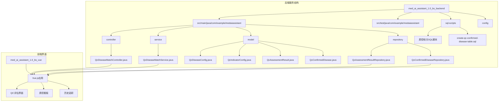
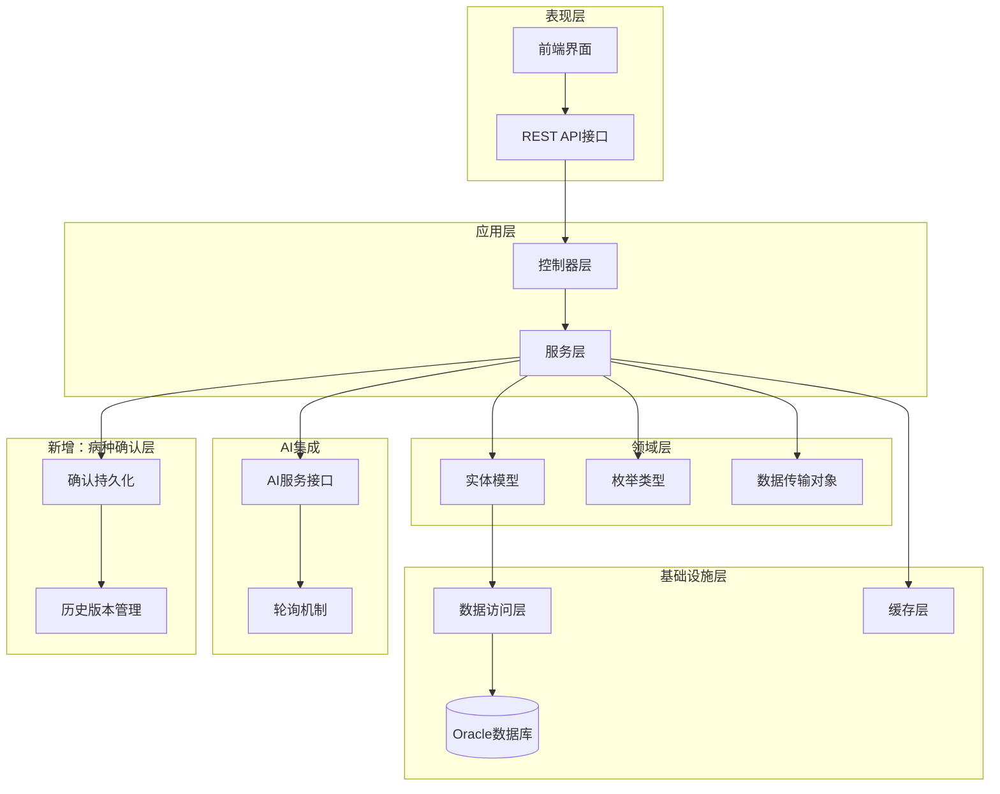
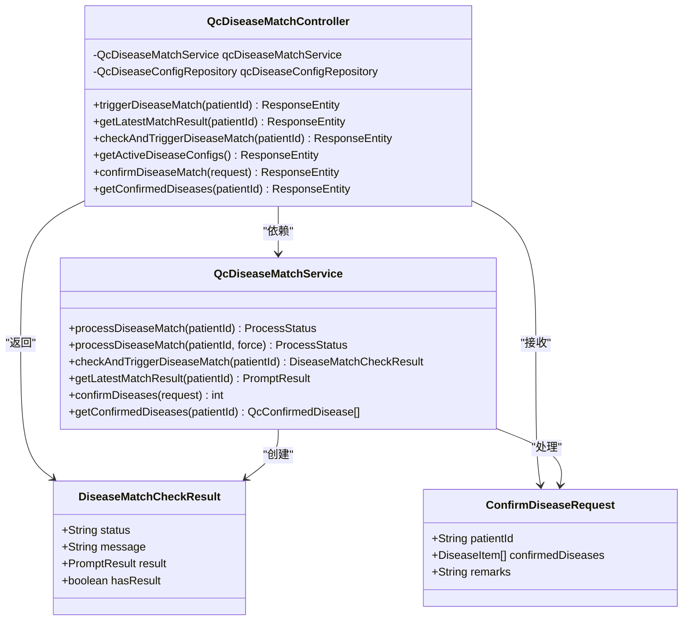
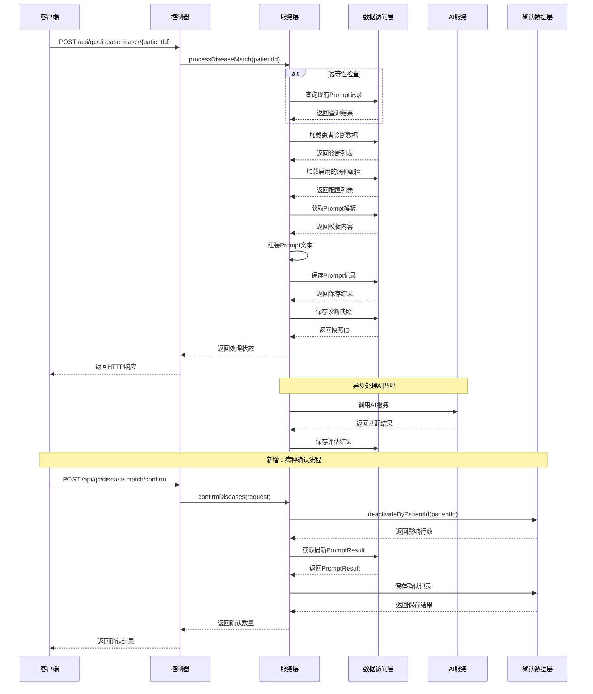
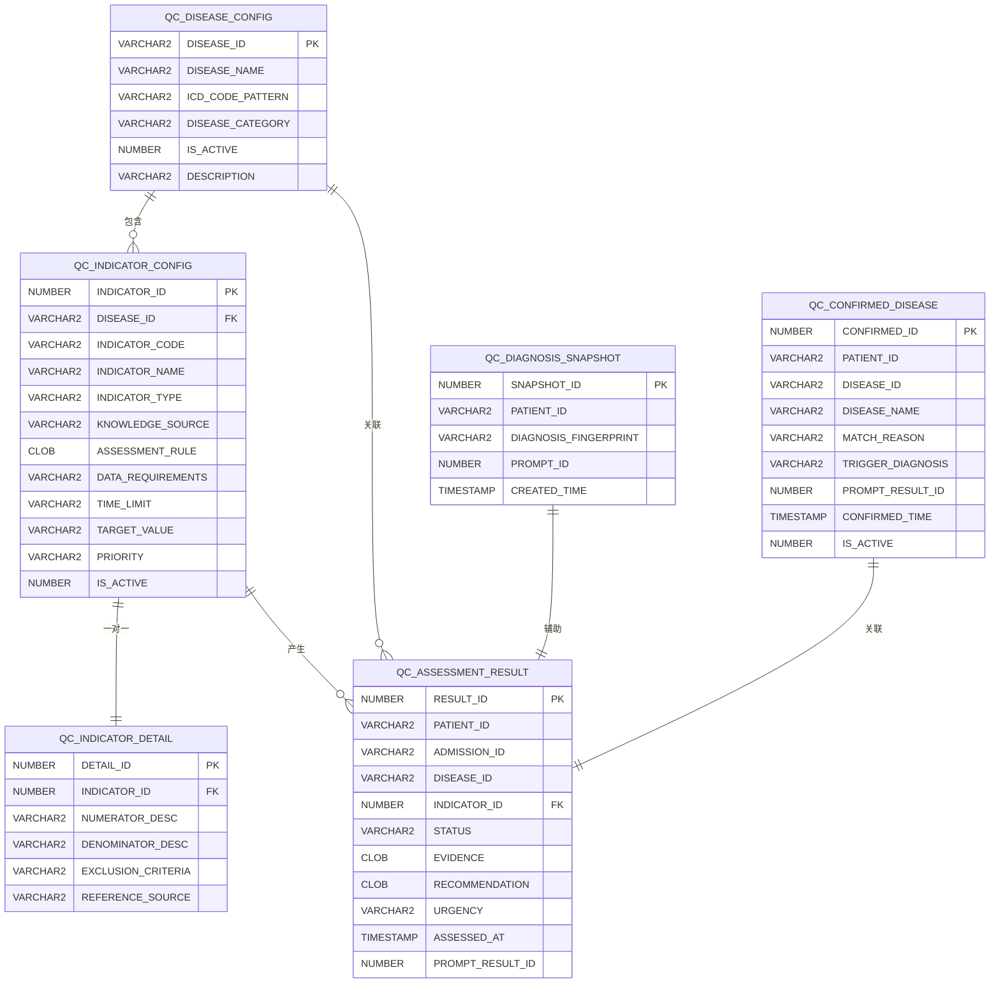
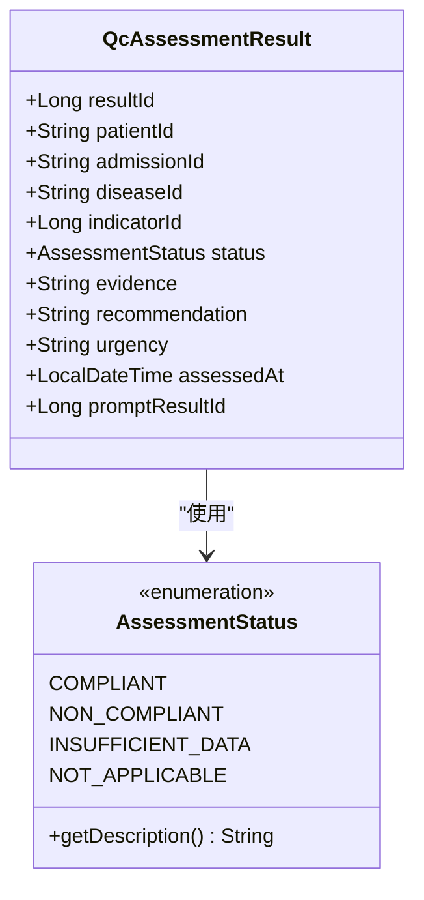
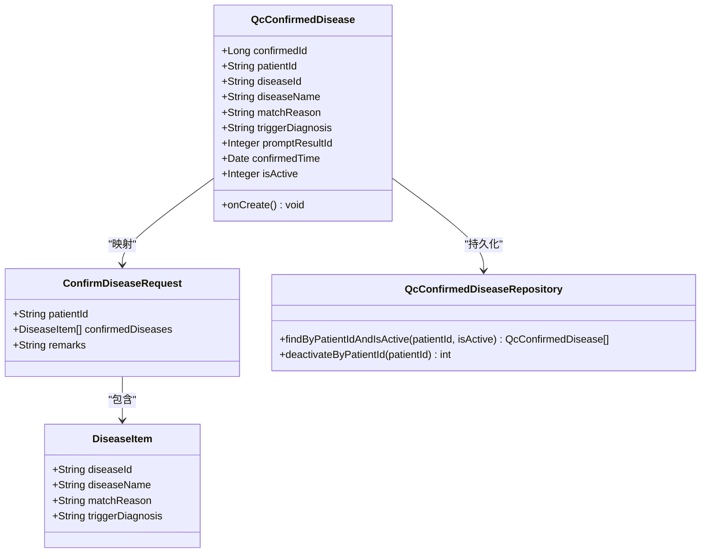
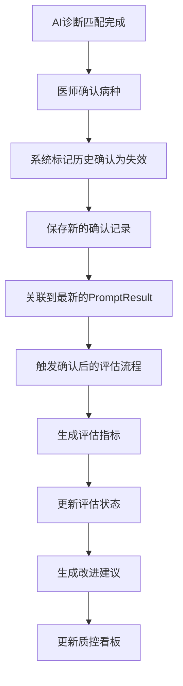
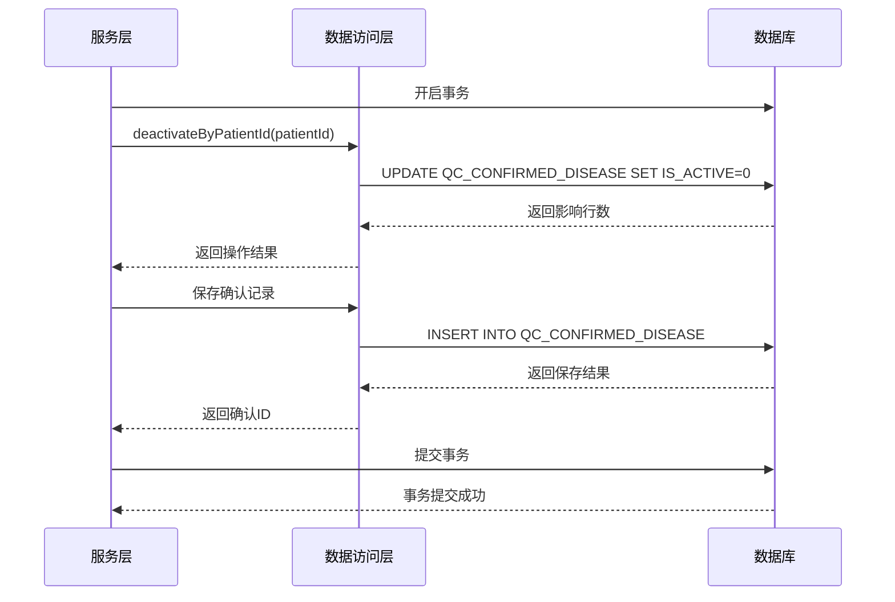
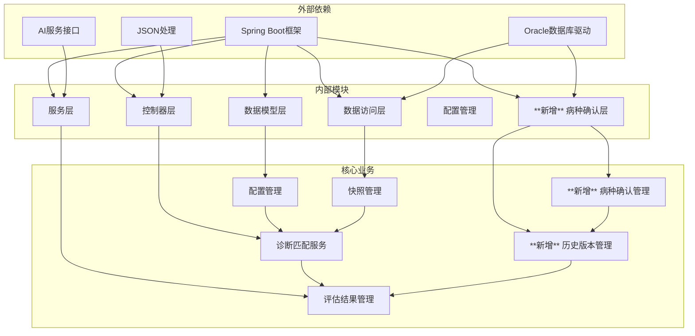

# QC评估引擎

<cite>
**本文档引用的文件**
- [QcDiseaseMatchController.java](file://med_ai_assistant_1.0_bs_backend/src/main/java/com/example/medaiassistant/controller/QcDiseaseMatchController.java)
- [QcDiseaseMatchService.java](file://med_ai_assistant_1.0_bs_backend/src/main/java/com/example/medaiassistant/service/qc/QcDiseaseMatchService.java)
- [QcDiseaseConfig.java](file://med_ai_assistant_1.0_bs_backend/src/main/java/com/example/medaiassistant/model/qc/QcDiseaseConfig.java)
- [QcIndicatorConfig.java](file://med_ai_assistant_1.0_bs_backend/src/main/java/com/example/medaiassistant/model/qc/QcIndicatorConfig.java)
- [QcIndicatorDetail.java](file://med_ai_assistant_1.0_bs_backend/src/main/java/com/example/medaiassistant/model/qc/QcIndicatorDetail.java)
- [QcAssessmentResult.java](file://med_ai_assistant_1.0_bs_backend/src/main/java/com/example/medaiassistant/model/qc/QcAssessmentResult.java)
- [QcDiagnosisSnapshot.java](file://med_ai_assistant_1.0_bs_backend/src/main/java/com/example/medaiassistant/model/qc/QcDiagnosisSnapshot.java)
- [QcAssessmentResultRepository.java](file://med_ai_assistant_1.0_bs_backend/src/main/java/com/example/medaiassistant/repository/qc/QcAssessmentResultRepository.java)
- [AssessmentStatus.java](file://med_ai_assistant_1.0_bs_backend/src/main/java/com/example/medaiassistant/model/qc/enums/AssessmentStatus.java)
- [QcConfirmedDisease.java](file://med_ai_assistant_1.0_bs_backend/src/main/java/com/example/medaiassistant/model/qc/QcConfirmedDisease.java)
- [QcConfirmedDiseaseRepository.java](file://med_ai_assistant_1.0_bs_backend/src/main/java/com/example/medaiassistant/repository/qc/QcConfirmedDiseaseRepository.java)
- [ConfirmDiseaseRequest.java](file://med_ai_assistant_1.0_bs_backend/src/main/java/com/example/medaiassistant/dto/qc/ConfirmDiseaseRequest.java)
- [create-qc-assessment-result-table.sql](file://med_ai_assistant_1.0_bs_backend/sql-scripts/create-qc-assessment-result-table.sql)
- [create-qc-indicator-config-table.sql](file://med_ai_assistant_1.0_bs_backend/sql-scripts/create-qc-indicator-config-table.sql)
- [create-qc-indicator-detail-table.sql](file://med_ai_assistant_1.0_bs_backend/sql-scripts/create-qc-indicator-detail-table.sql)
- [create-qc-disease-config-table.sql](file://med_ai_assistant_1.0_bs_backend/sql-scripts/create-qc-disease-config-table.sql)
- [create-qc-confirmed-disease-table.sql](file://med_ai_assistant_1.0_bs_backend/sql-scripts/create-qc-confirmed-disease-table.sql)
- [qc_disease_config_init.sql](file://med_ai_assistant_1.0_bs_backend/sql-scripts/qc_disease_config_init.sql)
</cite>

## 更新摘要
**所做更改**
- 新增病种确认持久化功能章节，包含完整的确认流程和数据一致性保障
- 补充确认后的评估流程说明，涵盖历史版本管理和状态转换机制
- 更新架构图以反映新增的病种确认组件
- 增加数据模型关系图，展示确认记录与评估结果的关联
- 完善故障排除指南，包含确认功能相关的常见问题

## 目录
1. [简介](#简介)
2. [项目结构](#项目结构)
3. [核心组件](#核心组件)
4. [架构概览](#架构概览)
5. [详细组件分析](#详细组件分析)
6. [病种确认持久化功能](#病种确认持久化功能)
7. [确认后的评估流程](#确认后的评估流程)
8. [数据一致性保障机制](#数据一致性保障机制)
9. [依赖关系分析](#依赖关系分析)
10. [性能考虑](#性能考虑)
11. [故障排除指南](#故障排除指南)
12. [结论](#结论)

## 简介

QC评估引擎是MedAiAssistant医疗人工智能助手系统中的核心质量控制模块。该引擎基于先进的AI技术，为医疗机构提供智能化的医疗质量评估和改进支持。系统通过整合患者的诊断信息、病历数据和临床指南，自动识别潜在的质量风险点，并提供针对性的改进建议。

**更新** 本次更新集成了病种确认持久化功能，实现了医师对AI诊断匹配结果的确认和存储，建立了完整的确认后评估流程和数据一致性保障机制。

该引擎采用分阶段的评估策略，第一阶段专注于AI诊断匹配，第二阶段进行详细的指标评估。整个系统支持实时监控、历史追踪和趋势分析，帮助医疗机构持续改进医疗质量和患者安全。

## 项目结构

MedAiAssistant项目采用标准的Spring Boot架构，QC评估引擎作为核心业务模块位于后端服务中：

**图表来源**
- [QcDiseaseMatchController.java:1-299](file://med_ai_assistant_1.0_bs_backend/src/main/java/com/example/medaiassistant/controller/QcDiseaseMatchController.java#L1-L299)
- [QcDiseaseMatchService.java:1-549](file://med_ai_assistant_1.0_bs_backend/src/main/java/com/example/medaiassistant/service/qc/QcDiseaseMatchService.java#L1-L549)

**章节来源**
- [QcDiseaseMatchController.java:1-299](file://med_ai_assistant_1.0_bs_backend/src/main/java/com/example/medaiassistant/controller/QcDiseaseMatchController.java#L1-L299)
- [QcDiseaseMatchService.java:1-549](file://med_ai_assistant_1.0_bs_backend/src/main/java/com/example/medaiassistant/service/qc/QcDiseaseMatchService.java#L1-L549)

## 核心组件

QC评估引擎由多个相互协作的组件构成，每个组件都有明确的职责和边界：

### 控制器层
- **QcDiseaseMatchController**: 提供REST API接口，处理外部请求
- **功能**: 触发诊断匹配、查询结果、检查诊断变更、获取配置列表、**新增病种确认API**

### 服务层
- **QcDiseaseMatchService**: 核心业务逻辑处理
- **功能**: 幂等性检查、诊断匹配、结果查询、诊断变更检测、**新增病种确认处理**

### 数据模型层
- **QcDiseaseConfig**: 疾病配置实体
- **QcIndicatorConfig**: 指标配置实体  
- **QcAssessmentResult**: 评估结果实体
- **QcDiagnosisSnapshot**: 诊断快照实体
- **QcIndicatorDetail**: 指标明细实体
- **QcConfirmedDisease**: **新增病种确认实体**

### 数据访问层
- **QcAssessmentResultRepository**: 评估结果数据访问
- **QcConfirmedDiseaseRepository**: **新增病种确认数据访问**
- **各种Repository接口**: 支持CRUD操作和复杂查询

**章节来源**
- [QcDiseaseMatchController.java:18-35](file://med_ai_assistant_1.0_bs_backend/src/main/java/com/example/medaiassistant/controller/QcDiseaseMatchController.java#L18-L35)
- [QcDiseaseMatchService.java:25-46](file://med_ai_assistant_1.0_bs_backend/src/main/java/com/example/medaiassistant/service/qc/QcDiseaseMatchService.java#L25-L46)

## 架构概览

QC评估引擎采用分层架构设计，确保了良好的可维护性和扩展性：

**图表来源**
- [QcDiseaseMatchController.java:36-56](file://med_ai_assistant_1.0_bs_backend/src/main/java/com/example/medaiassistant/controller/QcDiseaseMatchController.java#L36-L56)
- [QcDiseaseMatchService.java:44-91](file://med_ai_assistant_1.0_bs_backend/src/main/java/com/example/medaiassistant/service/qc/QcDiseaseMatchService.java#L44-L91)

系统采用以下设计原则：

1. **分层架构**: 清晰的职责分离，便于维护和测试
2. **依赖注入**: 使用Spring框架实现松耦合
3. **幂等性设计**: 避免重复处理和数据不一致
4. **异步处理**: 支持AI服务的异步调用和轮询
5. **监控集成**: 完整的日志记录和状态跟踪
6. ****新增** 历史版本管理**: 通过IS_ACTIVE字段实现确认记录的历史追踪

## 详细组件分析

### QcDiseaseMatchController - 控制器组件

控制器层负责处理HTTP请求和响应，提供RESTful API接口：

**图表来源**
- [QcDiseaseMatchController.java:36-56](file://med_ai_assistant_1.0_bs_backend/src/main/java/com/example/medaiassistant/controller/QcDiseaseMatchController.java#L36-L56)
- [QcDiseaseMatchService.java:44-91](file://med_ai_assistant_1.0_bs_backend/src/main/java/com/example/medaiassistant/service/qc/QcDiseaseMatchService.java#L44-L91)

**章节来源**
- [QcDiseaseMatchController.java:58-119](file://med_ai_assistant_1.0_bs_backend/src/main/java/com/example/medaiassistant/controller/QcDiseaseMatchController.java#L58-L119)
- [QcDiseaseMatchController.java:121-155](file://med_ai_assistant_1.0_bs_backend/src/main/java/com/example/medaiassistant/controller/QcDiseaseMatchController.java#L121-L155)
- [QcDiseaseMatchController.java:157-192](file://med_ai_assistant_1.0_bs_backend/src/main/java/com/example/medaiassistant/controller/QcDiseaseMatchController.java#L157-L192)
- [QcDiseaseMatchController.java:194-220](file://med_ai_assistant_1.0_bs_backend/src/main/java/com/example/medaiassistant/controller/QcDiseaseMatchController.java#L194-L220)
- [QcDiseaseMatchController.java:237-261](file://med_ai_assistant_1.0_bs_backend/src/main/java/com/example/medaiassistant/controller/QcDiseaseMatchController.java#L237-L261)
- [QcDiseaseMatchController.java:275-297](file://med_ai_assistant_1.0_bs_backend/src/main/java/com/example/medaiassistant/controller/QcDiseaseMatchController.java#L275-L297)

### QcDiseaseMatchService - 服务组件

服务层是系统的核心业务逻辑处理单元，实现了完整的诊断匹配流程：

**图表来源**
- [QcDiseaseMatchService.java:152-234](file://med_ai_assistant_1.0_bs_backend/src/main/java/com/example/medaiassistant/service/qc/QcDiseaseMatchService.java#L152-L234)
- [QcDiseaseMatchService.java:253-312](file://med_ai_assistant_1.0_bs_backend/src/main/java/com/example/medaiassistant/service/qc/QcDiseaseMatchService.java#L253-L312)
- [QcDiseaseMatchService.java:500-549](file://med_ai_assistant_1.0_bs_backend/src/main/java/com/example/medaiassistant/service/qc/QcDiseaseMatchService.java#L500-L549)

**章节来源**
- [QcDiseaseMatchService.java:97-115](file://med_ai_assistant_1.0_bs_backend/src/main/java/com/example/medaiassistant/service/qc/QcDiseaseMatchService.java#L97-L115)
- [QcDiseaseMatchService.java:121-151](file://med_ai_assistant_1.0_bs_backend/src/main/java/com/example/medaiassistant/service/qc/QcDiseaseMatchService.java#L121-L151)
- [QcDiseaseMatchService.java:236-312](file://med_ai_assistant_1.0_bs_backend/src/main/java/com/example/medaiassistant/service/qc/QcDiseaseMatchService.java#L236-L312)
- [QcDiseaseMatchService.java:500-549](file://med_ai_assistant_1.0_bs_backend/src/main/java/com/example/medaiassistant/service/qc/QcDiseaseMatchService.java#L500-L549)

### 数据模型组件

系统采用丰富的实体模型来描述质控相关的业务概念：

**图表来源**
- [QcDiseaseConfig.java:20-67](file://med_ai_assistant_1.0_bs_backend/src/main/java/com/example/medaiassistant/model/qc/QcDiseaseConfig.java#L20-L67)
- [QcIndicatorConfig.java:23-122](file://med_ai_assistant_1.0_bs_backend/src/main/java/com/example/medaiassistant/model/qc/QcIndicatorConfig.java#L23-L122)
- [QcAssessmentResult.java:24-115](file://med_ai_assistant_1.0_bs_backend/src/main/java/com/example/medaiassistant/model/qc/QcAssessmentResult.java#L24-L115)
- [QcDiagnosisSnapshot.java:17-58](file://med_ai_assistant_1.0_bs_backend/src/main/java/com/example/medaiassistant/model/qc/QcDiagnosisSnapshot.java#L17-L58)
- [QcConfirmedDisease.java:20-100](file://med_ai_assistant_1.0_bs_backend/src/main/java/com/example/medaiassistant/model/qc/QcConfirmedDisease.java#L20-L100)

**章节来源**
- [QcDiseaseConfig.java:7-21](file://med_ai_assistant_1.0_bs_backend/src/main/java/com/example/medaiassistant/model/qc/QcDiseaseConfig.java#L7-L21)
- [QcIndicatorConfig.java:9-22](file://med_ai_assistant_1.0_bs_backend/src/main/java/com/example/medaiassistant/model/qc/QcIndicatorConfig.java#L9-L22)
- [QcAssessmentResult.java:11-23](file://med_ai_assistant_1.0_bs_backend/src/main/java/com/example/medaiassistant/model/qc/QcAssessmentResult.java#L11-L23)
- [QcDiagnosisSnapshot.java:5-16](file://med_ai_assistant_1.0_bs_backend/src/main/java/com/example/medaiassistant/model/qc/QcDiagnosisSnapshot.java#L5-L16)
- [QcConfirmedDisease.java:1-290](file://med_ai_assistant_1.0_bs_backend/src/main/java/com/example/medaiassistant/model/qc/QcConfirmedDisease.java#L1-L290)

### 评估状态管理

系统定义了完整的评估状态枚举，用于标准化质量评估结果：

**图表来源**
- [AssessmentStatus.java:10-41](file://med_ai_assistant_1.0_bs_backend/src/main/java/com/example/medaiassistant/model/qc/enums/AssessmentStatus.java#L10-L41)
- [QcAssessmentResult.java:73-115](file://med_ai_assistant_1.0_bs_backend/src/main/java/com/example/medaiassistant/model/qc/QcAssessmentResult.java#L73-L115)

**章节来源**
- [AssessmentStatus.java:1-41](file://med_ai_assistant_1.0_bs_backend/src/main/java/com/example/medaiassistant/model/qc/enums/AssessmentStatus.java#L1-L41)

## 病种确认持久化功能

**新增** 病种确认持久化功能是QC评估引擎的重要扩展，实现了医师对AI诊断匹配结果的确认和存储。

### 确认API接口

系统提供了两个核心API接口来支持病种确认功能：

#### POST /api/qc/disease-match/confirm
- **功能**: 确认病种匹配结果，将医师选择的病种持久化到数据库
- **请求体**: ConfirmDiseaseRequest对象，包含患者ID和确认的病种列表
- **响应**: 包含success、message和confirmedCount字段的JSON响应

#### GET /api/qc/disease-match/{patientId}/confirmed
- **功能**: 查询指定患者当前有效的已确认病种列表
- **路径参数**: patientId（患者ID）
- **响应**: 包含success和confirmedDiseases字段的JSON响应

### 数据模型设计

病种确认功能引入了全新的数据模型来支持确认记录的持久化：

**图表来源**
- [QcConfirmedDisease.java:20-100](file://med_ai_assistant_1.0_bs_backend/src/main/java/com/example/medaiassistant/model/qc/QcConfirmedDisease.java#L20-L100)
- [ConfirmDiseaseRequest.java:18-197](file://med_ai_assistant_1.0_bs_backend/src/main/java/com/example/medaiassistant/dto/qc/ConfirmDiseaseRequest.java#L18-L197)
- [QcConfirmedDiseaseRepository.java:26-53](file://med_ai_assistant_1.0_bs_backend/src/main/java/com/example/medaiassistant/repository/qc/QcConfirmedDiseaseRepository.java#L26-L53)

### 历史版本管理机制

**创新特性** 系统采用了独特的历史版本管理机制，通过IS_ACTIVE字段实现确认记录的版本控制：

1. **版本覆盖策略**: 当医师重新确认病种时，系统会先将该患者所有有效确认记录标记为失效（IS_ACTIVE=0）
2. **新版本创建**: 然后批量插入新的有效确认记录（IS_ACTIVE=1）
3. **历史追踪**: 旧版本记录保留不变，形成完整的历史版本轨迹
4. **查询隔离**: 默认查询只返回IS_ACTIVE=1的有效记录

这种设计确保了：
- 确认历史的完整可追溯性
- 避免确认数据的丢失
- 支持审计和合规要求
- 保持数据的一致性和准确性

**章节来源**
- [QcDiseaseMatchController.java:237-261](file://med_ai_assistant_1.0_bs_backend/src/main/java/com/example/medaiassistant/controller/QcDiseaseMatchController.java#L237-L261)
- [QcDiseaseMatchController.java:275-297](file://med_ai_assistant_1.0_bs_backend/src/main/java/com/example/medaiassistant/controller/QcDiseaseMatchController.java#L275-L297)
- [QcDiseaseMatchService.java:500-549](file://med_ai_assistant_1.0_bs_backend/src/main/java/com/example/medaiassistant/service/qc/QcDiseaseMatchService.java#L500-L549)
- [QcConfirmedDisease.java:89-100](file://med_ai_assistant_1.0_bs_backend/src/main/java/com/example/medaiassistant/model/qc/QcConfirmedDisease.java#L89-L100)

## 确认后的评估流程

**新增** 病种确认功能与原有的评估流程形成了完整的闭环，建立了确认后的评估工作机制。

### 确认后的工作流程

### 数据关联机制

确认后的评估流程通过以下机制实现数据关联：

1. **PromptResult关联**: 新确认的病种会关联到最近一次的PromptResult ID
2. **诊断快照关联**: 通过PromptResult与诊断快照建立关联关系
3. **评估结果继承**: 确认后的病种可以继续参与后续的指标评估
4. **历史版本追踪**: 通过IS_ACTIVE字段区分有效和无效的确认记录

### 评估指标更新

确认后的评估流程会自动更新相关的评估指标：

- **确认次数统计**: 统计每个病种的确认次数和确认率
- **医师偏好分析**: 分析不同医师的病种确认偏好
- **质量趋势追踪**: 基于历史确认数据追踪质量改进趋势
- **改进建议生成**: 根据确认历史生成个性化的改进建议

**章节来源**
- [QcDiseaseMatchService.java:500-549](file://med_ai_assistant_1.0_bs_backend/src/main/java/com/example/medaiassistant/service/qc/QcDiseaseMatchService.java#L500-L549)
- [QcConfirmedDiseaseRepository.java:49-51](file://med_ai_assistant_1.0_bs_backend/src/main/java/com/example/medaiassistant/repository/qc/QcConfirmedDiseaseRepository.java#L49-L51)

## 数据一致性保障机制

**新增** 病种确认功能引入了多重数据一致性保障机制，确保确认过程的可靠性和数据的完整性。

### 事务性操作保障

系统采用严格的事务性操作来保证确认过程的数据一致性：

**图表来源**
- [QcDiseaseMatchService.java:506-535](file://med_ai_assistant_1.0_bs_backend/src/main/java/com/example/medaiassistant/service/qc/QcDiseaseMatchService.java#L506-L535)

### 幂等性设计

确认功能实现了完整的幂等性设计：

1. **重复确认防护**: 同一患者在同一时间点不会产生重复的确认记录
2. **状态一致性**: 确保确认状态在整个系统中的一致性
3. **历史版本隔离**: 通过IS_ACTIVE字段实现历史版本的隔离管理
4. **并发控制**: 在高并发场景下保证数据的一致性

### 数据完整性约束

系统通过多种机制确保数据的完整性：

1. **数据库约束**: 使用Oracle序列和索引确保主键唯一性和查询效率
2. **字段验证**: 对关键字段进行格式和长度验证
3. **默认值设置**: 通过@PrePersist注解设置默认值
4. **级联操作**: 确保相关数据的级联更新和删除

### 错误处理机制

系统提供了完善的错误处理机制：

1. **异常捕获**: 捕获并处理确认过程中的各种异常
2. **回滚机制**: 在发生错误时自动回滚事务
3. **日志记录**: 详细记录确认过程中的关键信息
4. **状态反馈**: 向客户端提供清晰的状态反馈

**章节来源**
- [QcDiseaseMatchService.java:506-535](file://med_ai_assistant_1.0_bs_backend/src/main/java/com/example/medaiassistant/service/qc/QcDiseaseMatchService.java#L506-L535)
- [QcConfirmedDisease.java:92-100](file://med_ai_assistant_1.0_bs_backend/src/main/java/com/example/medaiassistant/model/qc/QcConfirmedDisease.java#L92-L100)
- [QcConfirmedDiseaseRepository.java:49-51](file://med_ai_assistant_1.0_bs_backend/src/main/java/com/example/medaiassistant/repository/qc/QcConfirmedDiseaseRepository.java#L49-L51)

## 依赖关系分析

QC评估引擎的依赖关系体现了清晰的分层架构和模块化设计：

**图表来源**
- [QcDiseaseMatchController.java:1-17](file://med_ai_assistant_1.0_bs_backend/src/main/java/com/example/medaiassistant/controller/QcDiseaseMatchController.java#L1-L17)
- [QcDiseaseMatchService.java:1-24](file://med_ai_assistant_1.0_bs_backend/src/main/java/com/example/medaiassistant/service/qc/QcDiseaseMatchService.java#L1-L24)

系统的主要依赖特点：

1. **框架依赖**: 完全基于Spring Boot生态系统
2. **数据库依赖**: 专门针对Oracle数据库优化
3. **AI集成**: 与外部AI服务的松耦合集成
4. **数据持久化**: 使用JPA/Hibernate ORM框架
5. **配置管理**: 支持多环境配置切换
6. ****新增** 历史版本管理**: 通过IS_ACTIVE字段实现版本控制

**章节来源**
- [QcDiseaseMatchController.java:1-17](file://med_ai_assistant_1.0_bs_backend/src/main/java/com/example/medaiassistant/controller/QcDiseaseMatchController.java#L1-L17)
- [QcDiseaseMatchService.java:1-24](file://med_ai_assistant_1.0_bs_backend/src/main/java/com/example/medaiassistant/service/qc/QcDiseaseMatchService.java#L1-L24)

## 性能考虑

QC评估引擎在设计时充分考虑了性能优化和可扩展性：

### 数据库性能优化

1. **索引策略**: 为常用查询字段建立复合索引
   - QC_ASSESSMENT_RESULT: (PATIENT_ID, DISEASE_ID), (ADMISSION_ID), (STATUS)
   - QC_INDICATOR_CONFIG: (DISEASE_ID, IS_ACTIVE), (IS_ACTIVE)
   - QC_DIAGNOSIS_SNAPSHOT: (PATIENT_ID)
   - **新增** QC_CONFIRMED_DISEASE: (PATIENT_ID, IS_ACTIVE)

2. **查询优化**: 使用派生查询减少SQL复杂度
3. **缓存策略**: 对频繁访问的配置数据进行缓存
4. ****新增** 批量操作**: 使用批量更新和批量插入优化确认流程

### AI服务性能

1. **异步处理**: 避免阻塞主线程
2. **重试机制**: 失败时自动重试
3. **超时控制**: 防止长时间等待
4. **并发控制**: 限制同时处理的任务数量

### 内存管理

1. **大文本处理**: CLOB字段的高效处理
2. **对象池**: 复用数据库连接
3. **垃圾回收**: 及时释放临时对象
4. ****新增** 序列化优化**: 通过序列化机制优化确认数据的存储和检索

## 故障排除指南

### 常见问题及解决方案

#### 1. 诊断匹配失败

**症状**: 触发诊断匹配API返回错误状态

**可能原因**:
- 患者无有效诊断数据
- 系统中无启用的病种配置
- 未找到指定的Prompt模板
- 数据库连接异常

**解决步骤**:
1. 检查患者是否存在有效诊断
2. 验证病种配置表中是否有启用的记录
3. 确认Prompt模板是否正确配置
4. 查看数据库连接状态

#### 2. 评估结果查询失败

**症状**: 获取最新评估结果返回404状态

**可能原因**:
- 患者尚未完成诊断匹配
- AI服务处理延迟
- 数据库查询异常

**解决步骤**:
1. 确认诊断匹配任务已完成
2. 检查AI服务状态
3. 验证数据库连接
4. 查看系统日志

#### 3. 幂等性检查问题

**症状**: 重复触发诊断匹配任务

**可能原因**:
- 幂等性检查逻辑异常
- 数据库查询结果不准确
- 缓存数据过期

**解决步骤**:
1. 检查现有Prompt记录查询
2. 验证诊断快照数据
3. 清理相关缓存
4. 重启服务

#### 4. **新增** 病种确认功能问题

**症状**: 病种确认API返回错误或确认数据异常

**可能原因**:
- 确认请求格式不正确
- 数据库事务处理异常
- 历史版本标记失败
- 确认记录保存失败

**解决步骤**:
1. 验证ConfirmDiseaseRequest格式
2. 检查数据库事务状态
3. 确认deactivateByPatientId操作
4. 验证确认记录字段完整性
5. 查看确认API日志

#### 5. **新增** 历史版本管理问题

**症状**: 查询确认记录时返回历史版本而非最新版本

**可能原因**:
- IS_ACTIVE字段查询条件错误
- 数据库索引问题
- 缓存数据过期

**解决步骤**:
1. 确认查询条件使用IS_ACTIVE=1
2. 检查PATIENT_ID索引状态
3. 清理相关缓存
4. 验证数据一致性

**章节来源**
- [QcDiseaseMatchController.java:89-118](file://med_ai_assistant_1.0_bs_backend/src/main/java/com/example/medaiassistant/controller/QcDiseaseMatchController.java#L89-L118)
- [QcDiseaseMatchService.java:155-234](file://med_ai_assistant_1.0_bs_backend/src/main/java/com/example/medaiassistant/service/qc/QcDiseaseMatchService.java#L155-L234)
- [QcDiseaseMatchController.java:237-261](file://med_ai_assistant_1.0_bs_backend/src/main/java/com/example/medaiassistant/controller/QcDiseaseMatchController.java#L237-L261)
- [QcDiseaseMatchController.java:275-297](file://med_ai_assistant_1.0_bs_backend/src/main/java/com/example/medaiassistant/controller/QcDiseaseMatchController.java#L275-L297)

### 日志分析

系统提供了完整的日志记录机制，便于问题诊断：

1. **请求日志**: 记录所有API调用详情
2. **业务日志**: 记录关键业务流程
3. **错误日志**: 详细记录异常信息
4. **性能日志**: 监控系统性能指标
5. ****新增** 确认日志**: 记录病种确认过程的关键步骤

### 监控指标

建议监控以下关键指标：
- API响应时间
- 数据库查询性能
- AI服务调用成功率
- 内存使用情况
- 磁盘空间使用
- **新增** 确认操作成功率
- **新增** 历史版本管理效率

## 结论

QC评估引擎作为MedAiAssistant系统的核心组件，展现了现代医疗AI应用的最佳实践。系统通过精心设计的架构、完善的业务逻辑和强大的技术实现，为医疗机构提供了智能化的质量控制解决方案。

**更新** 本次更新显著增强了系统的功能完整性，通过集成病种确认持久化功能，建立了完整的确认后评估流程和数据一致性保障机制。这一增强不仅提升了系统的实用性，还为未来的功能扩展和技术升级奠定了坚实的基础。

### 主要优势

1. **架构清晰**: 分层设计确保了良好的可维护性
2. **功能完整**: 覆盖了从诊断匹配到结果评估的全流程
3. **性能优秀**: 通过多种优化策略保证了系统的高效运行
4. **扩展性强**: 模块化设计便于功能扩展和定制
5. **可靠性高**: 完善的错误处理和监控机制
6. ****新增** 历史追踪**: 通过版本控制机制实现完整的数据追踪
7. ****新增** 数据一致性**: 通过事务性和幂等性设计确保数据完整性

### 技术亮点

1. **AI集成**: 与外部AI服务的无缝集成
2. **数据管理**: 基于Oracle数据库的高性能数据处理
3. **实时监控**: 完整的系统状态监控和告警机制
4. **用户体验**: 友好的前端界面和丰富的可视化功能
5. ****新增** 历史版本管理**: 通过IS_ACTIVE字段实现确认记录的版本控制
6. ****新增** 事务性操作**: 确保确认过程的数据一致性和可靠性

### 发展前景

随着医疗AI技术的不断发展，QC评估引擎将继续演进，为提升医疗质量和患者安全做出更大贡献。系统的设计为未来的功能扩展和技术升级奠定了坚实的基础。

**特别关注** 病种确认持久化功能的成功集成，为系统增加了重要的临床实用价值，使得AI辅助诊断能够更好地融入临床工作流程，为医师提供可靠的决策支持工具。这一功能的实现展示了系统在复杂业务场景下的强大适应能力和扩展潜力。