# QC评估引擎

<cite>
**本文档引用的文件**
- [QcDiseaseMatchController.java](file://med_ai_assistant_1.0_bs_backend/src/main/java/com/example/medaiassistant/controller/QcDiseaseMatchController.java)
- [QcAssessmentService.java](file://med_ai_assistant_1.0_bs_backend/src/main/java/com/example/medaiassistant/service/qc/QcAssessmentService.java)
- [QcDiseaseMatchService.java](file://med_ai_assistant_1.0_bs_backend/src/main/java/com/example/medaiassistant/service/qc/QcDiseaseMatchService.java)
- [QcDiseaseConfig.java](file://med_ai_assistant_1.0_bs_backend/src/main/java/com/example/medaiassistant/model/qc/QcDiseaseConfig.java)
- [QcIndicatorConfig.java](file://med_ai_assistant_1.0_bs_backend/src/main/java/com/example/medaiassistant/model/qc/QcIndicatorConfig.java)
- [QcIndicatorDetail.java](file://med_ai_assistant_1.0_bs_backend/src/main/java/com/example/medaiassistant/model/qc/QcIndicatorDetail.java)
- [QcAssessmentResult.java](file://med_ai_assistant_1.0_bs_backend/src/main/java/com/example/medaiassistant/model/qc/QcAssessmentResult.java)
- [QcDiagnosisSnapshot.java](file://med_ai_assistant_1.0_bs_backend/src/main/java/com/example/medaiassistant/model/qc/QcDiagnosisSnapshot.java)
- [QcAssessmentResultRepository.java](file://med_ai_assistant_1.0_bs_backend/src/main/java/com/example/medaiassistant/repository/qc/QcAssessmentResultRepository.java)
- [QcIndicatorConfigRepository.java](file://med_ai_assistant_1.0_bs_backend/src/main/java/com/example/medaiassistant/repository/qc/QcIndicatorConfigRepository.java)
- [AssessmentStatus.java](file://med_ai_assistant_1.0_bs_backend/src/main/java/com/example/medaiassistant/model/qc/enums/AssessmentStatus.java)
- [QcConfirmedDisease.java](file://med_ai_assistant_1.0_bs_backend/src/main/java/com/example/medaiassistant/model/qc/QcConfirmedDisease.java)
- [QcConfirmedDiseaseRepository.java](file://med_ai_assistant_1.0_bs_backend/src/main/java/com/example/medaiassistant/repository/qc/QcConfirmedDiseaseRepository.java)
- [ConfirmDiseaseRequest.java](file://med_ai_assistant_1.0_bs_backend/src/main/java/com/example/medaiassistant/dto/qc/ConfirmDiseaseRequest.java)
- [AIController.java](file://med_ai_assistant_1.0_bs_backend/src/main/java/com/example/medaiassistant/controller/AIController.java)
- [create-qc-assessment-result-table.sql](file://med_ai_assistant_1.0_bs_backend/sql-scripts/create-qc-assessment-result-table.sql)
- [create-qc-indicator-config-table.sql](file://med_ai_assistant_1.0_bs_backend/sql-scripts/create-qc-indicator-config-table.sql)
- [create-qc-indicator-detail-table.sql](file://med_ai_assistant_1.0_bs_backend/sql-scripts/create-qc-indicator-detail-table.sql)
- [create-qc-disease-config-table.sql](file://med_ai_assistant_1.0_bs_backend/sql-scripts/create-qc-disease-config-table.sql)
- [create-qc-confirmed-disease-table.sql](file://med_ai_assistant_1.0_bs_backend/sql-scripts/create-qc-confirmed-disease-table.sql)
- [qc_disease_config_init.sql](file://med_ai_assistant_1.0_bs_backend/sql-scripts/qc_disease_config_init.sql)
- [insert-qc-prompt-templates.sql](file://med_ai_assistant_1.0_bs_backend/sql-scripts/insert-qc-prompt-templates.sql)
- [update-treatment-plan-prompt-template.sql](file://med_ai_assistant_1.0_bs_backend/sql-scripts/update-treatment-plan-prompt-template.sql)
- [qc.js](file://med_ai_assistant_1.0_bs_vue/src/api/qc.js)
- [ai.js](file://med_ai_assistant_1.0_bs_vue/src/api/ai.js)
- [AIResults.vue](file://med_ai_assistant_1.0_bs_vue/src/components/ai/AIResults.vue)
- [质控病种匹配接口.md](file://med_ai_assistant_1.0_bs_backend/doc/接口/质控病种匹配接口.md)
</cite>

## 更新摘要
**所做更改**
- 新增质控评估重新分析功能章节，详细说明第三阶段AI质控评估重新分析的完整流程
- 更新质控评估数据集成到治疗计划生成章节，说明版本0.8.050新增的治疗计划模板更新
- 更新质控评估详情页面真实数据对接章节，说明版本0.8.049实现的getLatestPromptResult真实数据获取机制
- 新增多阶段处理机制章节，详细说明从诊断匹配到评估分析的完整流程
- 完善重新分析服务的详细组件分析，包括Prompt实体和状态管理机制
- 新增数据一致性保障机制章节，说明重新分析功能的数据完整性保护
- 更新与现有框架集成章节，说明重新分析功能与现有质量控制框架的深度集成

## 目录
1. [简介](#简介)
2. [项目结构](#项目结构)
3. [核心组件](#核心组件)
4. [架构概览](#架构概览)
5. [详细组件分析](#详细组件分析)
6. [重新分析功能](#重新分析功能)
7. [多阶段处理机制](#多阶段处理机制)
8. [质控评估数据集成到治疗计划生成](#质控评估数据集成到治疗计划生成)
9. [质控评估详情页面真实数据对接](#质控评估详情页面真实数据对接)
10. [与现有框架集成](#与现有框架集成)
11. [数据一致性保障机制](#数据一致性保障机制)
12. [依赖关系分析](#依赖关系分析)
13. [性能考虑](#性能考虑)
14. [故障排除指南](#故障排除指南)
15. [结论](#结论)

## 简介

QC评估引擎是MedAiAssistant医疗人工智能助手系统中的核心质量控制模块。该引擎基于先进的AI技术，为医疗机构提供智能化的医疗质量评估和改进支持。系统通过整合患者的诊断信息、病历数据和临床指南，自动识别潜在的质量风险点，并提供针对性的改进建议。

**更新** 本次更新显著增强了系统的功能完整性，通过集成重新分析功能，建立了完整的多阶段处理机制和与现有质量控制框架的深度集成。特别地，版本0.8.050新增了QC质控评估数据集成到治疗计划生成的功能，版本0.8.049实现了质控评估详情页面真实数据对接，调用getLatestPromptResult获取AI质控评估结果，版本0.8.048实现了质控评估重新分析功能，为系统增加了重要的动态评估能力。

该引擎采用分阶段的评估策略，第一阶段专注于AI诊断匹配，第二阶段进行详细的指标评估，第三阶段通过重新分析功能实现动态评估。整个系统支持实时监控、历史追踪和趋势分析，帮助医疗机构持续改进医疗质量和患者安全。

## 项目结构

MedAiAssistant项目采用标准的Spring Boot架构，QC评估引擎作为核心业务模块位于后端服务中：

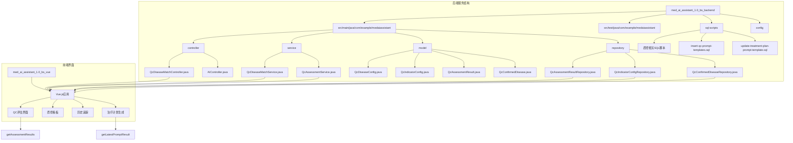

**图表来源**
- [QcDiseaseMatchController.java:1-299](file://med_ai_assistant_1.0_bs_backend/src/main/java/com/example/medaiassistant/controller/QcDiseaseMatchController.java#L1-L299)
- [QcAssessmentService.java:1-296](file://med_ai_assistant_1.0_bs_backend/src/main/java/com/example/medaiassistant/service/qc/QcAssessmentService.java#L1-L296)
- [qc.js:187-189](file://med_ai_assistant_1.0_bs_vue/src/api/qc.js#L187-L189)
- [ai.js:827-838](file://med_ai_assistant_1.0_bs_vue/src/api/ai.js#L827-L838)

**章节来源**
- [QcDiseaseMatchController.java:1-299](file://med_ai_assistant_1.0_bs_backend/src/main/java/com/example/medaiassistant/controller/QcDiseaseMatchController.java#L1-L299)
- [QcAssessmentService.java:1-296](file://med_ai_assistant_1.0_bs_backend/src/main/java/com/example/medaiassistant/service/qc/QcAssessmentService.java#L1-L296)

## 核心组件

QC评估引擎由多个相互协作的组件构成，每个组件都有明确的职责和边界：

### 控制器层
- **QcDiseaseMatchController**: 提供REST API接口，处理外部请求
- **功能**: 触发诊断匹配、查询结果、检查诊断变更、获取配置列表、**新增重新分析API**
- **新增**: reanalyzeAssessment端点，触发第三阶段AI质控评估重新分析

### 服务层
- **QcDiseaseMatchService**: 核心业务逻辑处理
- **功能**: 幂等性检查、诊断匹配、结果查询、诊断变更检测
- **新增**: QcAssessmentService，第三阶段评估分析核心服务

### 数据模型层
- **QcDiseaseConfig**: 疾病配置实体
- **QcIndicatorConfig**: 指标配置实体  
- **QcAssessmentResult**: 评估结果实体
- **QcDiagnosisSnapshot**: 诊断快照实体
- **QcIndicatorDetail**: 指标明细实体
- **QcConfirmedDisease**: 病种确认实体
- **新增**: Prompt实体，用于存储评估任务

### 数据访问层
- **QcAssessmentResultRepository**: 评估结果数据访问
- **QcIndicatorConfigRepository**: 指标配置数据访问
- **QcConfirmedDiseaseRepository**: 病种确认数据访问
- **各种Repository接口**: 支持CRUD操作和复杂查询

**章节来源**
- [QcDiseaseMatchController.java:18-35](file://med_ai_assistant_1.0_bs_backend/src/main/java/com/example/medaiassistant/controller/QcDiseaseMatchController.java#L18-L35)
- [QcAssessmentService.java:25-46](file://med_ai_assistant_1.0_bs_backend/src/main/java/com/example/medaiassistant/service/qc/QcAssessmentService.java#L25-L46)

## 架构概览

QC评估引擎采用分层架构设计，确保了良好的可维护性和扩展性：

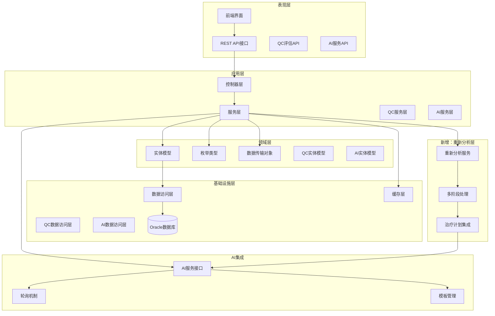

**图表来源**
- [QcDiseaseMatchController.java:36-56](file://med_ai_assistant_1.0_bs_backend/src/main/java/com/example/medaiassistant/controller/QcDiseaseMatchController.java#L36-L56)
- [QcAssessmentService.java:44-91](file://med_ai_assistant_1.0_bs_backend/src/main/java/com/example/medaiassistant/service/qc/QcAssessmentService.java#L44-L91)

系统采用以下设计原则：

1. **分层架构**: 清晰的职责分离，便于维护和测试
2. **依赖注入**: 使用Spring框架实现松耦合
3. **幂等性设计**: 避免重复处理和数据不一致
4. **异步处理**: 支持AI服务的异步调用和轮询
5. **监控集成**: 完整的日志记录和状态跟踪
6. **多阶段处理**: 支持从诊断匹配到评估分析的完整流程
7. **重新分析机制**: 基于已确认病种的动态评估能力
8. **治疗计划集成**: QC评估结果直接融入诊疗计划生成
9. **模板管理**: 统一的Prompt模板管理体系

## 详细组件分析

### QcDiseaseMatchController - 控制器组件

控制器层负责处理HTTP请求和响应，提供RESTful API接口：

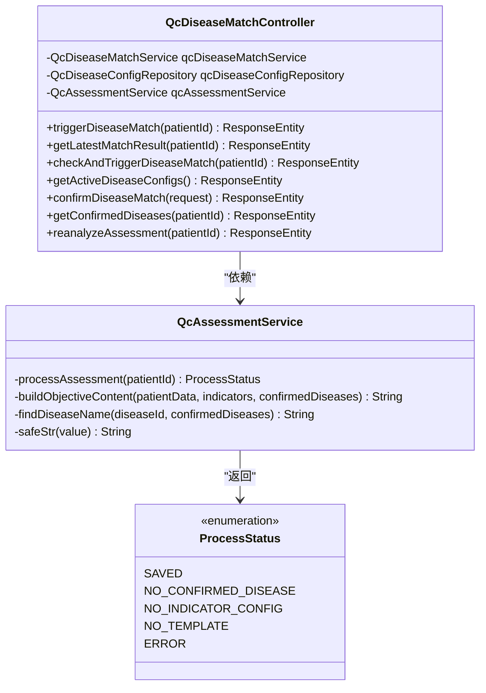

**图表来源**
- [QcDiseaseMatchController.java:36-56](file://med_ai_assistant_1.0_bs_backend/src/main/java/com/example/medaiassistant/controller/QcDiseaseMatchController.java#L36-L56)
- [QcAssessmentService.java:44-91](file://med_ai_assistant_1.0_bs_backend/src/main/java/com/example/medaiassistant/service/qc/QcAssessmentService.java#L44-L91)

**章节来源**
- [QcDiseaseMatchController.java:58-119](file://med_ai_assistant_1.0_bs_backend/src/main/java/com/example/medaiassistant/controller/QcDiseaseMatchController.java#L58-L119)
- [QcDiseaseMatchController.java:121-155](file://med_ai_assistant_1.0_bs_backend/src/main/java/com/example/medaiassistant/controller/QcDiseaseMatchController.java#L121-L155)
- [QcDiseaseMatchController.java:157-192](file://med_ai_assistant_1.0_bs_backend/src/main/java/com/example/medaiassistant/controller/QcDiseaseMatchController.java#L157-L192)
- [QcDiseaseMatchController.java:194-220](file://med_ai_assistant_1.0_bs_backend/src/main/java/com/example/medaiassistant/controller/QcDiseaseMatchController.java#L194-L220)
- [QcDiseaseMatchController.java:237-261](file://med_ai_assistant_1.0_bs_backend/src/main/java/com/example/medaiassistant/controller/QcDiseaseMatchController.java#L237-L261)
- [QcDiseaseMatchController.java:275-297](file://med_ai_assistant_1.0_bs_backend/src/main/java/com/example/medaiassistant/controller/QcDiseaseMatchController.java#L275-L297)

### QcAssessmentService - 重新分析服务组件

**新增** QcAssessmentService是第三阶段AI质控评估的核心服务，负责根据已确认病种进行重新分析：

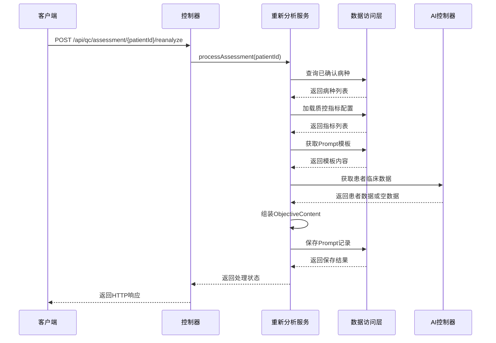

**图表来源**
- [QcAssessmentService.java:137-223](file://med_ai_assistant_1.0_bs_backend/src/main/java/com/example/medaiassistant/service/qc/QcAssessmentService.java#L137-L223)

**章节来源**
- [QcAssessmentService.java:97-115](file://med_ai_assistant_1.0_bs_backend/src/main/java/com/example/medaiassistant/service/qc/QcAssessmentService.java#L97-L115)
- [QcAssessmentService.java:128-223](file://med_ai_assistant_1.0_bs_backend/src/main/java/com/example/medaiassistant/service/qc/QcAssessmentService.java#L128-L223)

### 数据模型组件

系统采用丰富的实体模型来描述质控相关的业务概念：

**图表来源**
- [QcDiseaseConfig.java:20-67](file://med_ai_assistant_1.0_bs_backend/src/main/java/com/example/medaiassistant/model/qc/QcDiseaseConfig.java#L20-L67)
- [QcIndicatorConfig.java:23-122](file://med_ai_assistant_1.0_bs_backend/src/main/java/com/example/medaiassistant/model/qc/QcIndicatorConfig.java#L23-L122)
- [QcAssessmentResult.java:24-115](file://med_ai_assistant_1.0_bs_backend/src/main/java/com/example/medaiassistant/model/qc/QcAssessmentResult.java#L24-L115)
- [QcDiagnosisSnapshot.java:17-58](file://med_ai_assistant_1.0_bs_backend/src/main/java/com/example/medaiassistant/model/qc/QcDiagnosisSnapshot.java#L17-L58)
- [QcConfirmedDisease.java:20-100](file://med_ai_assistant_1.0_bs_backend/src/main/java/com/example/medaiassistant/model/qc/QcConfirmedDisease.java#L20-L100)

**章节来源**
- [QcDiseaseConfig.java:7-21](file://med_ai_assistant_1.0_bs_backend/src/main/java/com/example/medaiassistant/model/qc/QcDiseaseConfig.java#L7-L21)
- [QcIndicatorConfig.java:9-22](file://med_ai_assistant_1.0_bs_backend/src/main/java/com/example/medaiassistant/model/qc/QcIndicatorConfig.java#L9-L22)
- [QcAssessmentResult.java:11-23](file://med_ai_assistant_1.0_bs_backend/src/main/java/com/example/medaiassistant/model/qc/QcAssessmentResult.java#L11-L23)
- [QcDiagnosisSnapshot.java:5-16](file://med_ai_assistant_1.0_bs_backend/src/main/java/com/example/medaiassistant/model/qc/QcDiagnosisSnapshot.java#L5-L16)
- [QcConfirmedDisease.java:1-290](file://med_ai_assistant_1.0_bs_backend/src/main/java/com/example/medaiassistant/model/qc/QcConfirmedDisease.java#L1-L290)

### 评估状态管理

系统定义了完整的评估状态枚举，用于标准化质量评估结果：

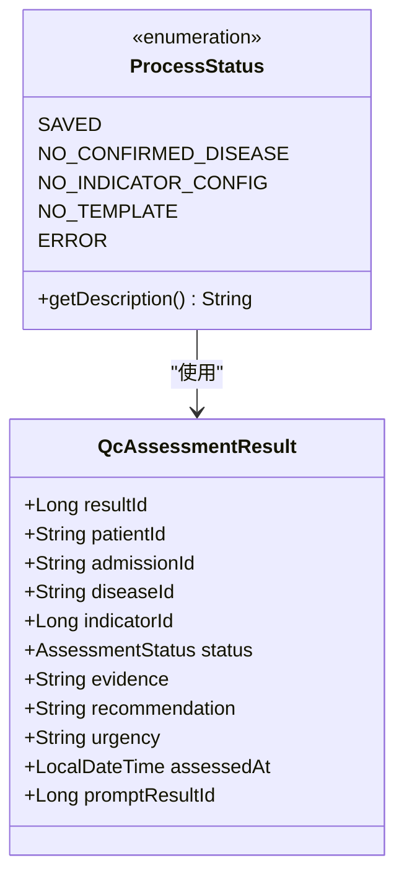

**图表来源**
- [AssessmentStatus.java:10-41](file://med_ai_assistant_1.0_bs_backend/src/main/java/com/example/medaiassistant/model/qc/enums/AssessmentStatus.java#L10-L41)
- [QcAssessmentResult.java:73-115](file://med_ai_assistant_1.0_bs_backend/src/main/java/com/example/medaiassistant/model/qc/QcAssessmentResult.java#L73-L115)

**章节来源**
- [AssessmentStatus.java:1-41](file://med_ai_assistant_1.0_bs_backend/src/main/java/com/example/medaiassistant/model/qc/enums/AssessmentStatus.java#L1-L41)

## 重新分析功能

**新增** 重新分析功能是QC评估引擎的重要扩展，实现了基于已确认病种的第三阶段AI质控评估分析。

### 重新分析API接口

系统提供了专门的API接口来支持重新分析功能：

#### POST /api/qc/assessment/{patientId}/reanalyze
- **功能**: 触发指定患者的第三阶段AI质控评估重新分析
- **路径参数**: patientId（患者ID）
- **响应**: 包含success、message、status和patientId字段的JSON响应

### 重新分析处理流程

重新分析服务的核心处理流程如下：

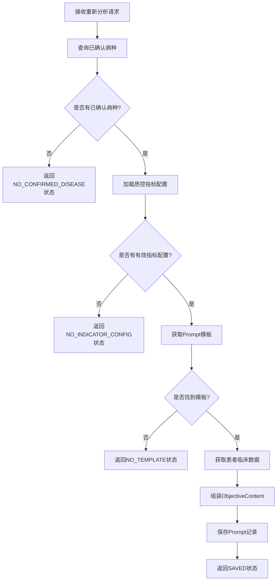

### 数据模型设计

重新分析功能引入了Prompt实体来存储评估任务：

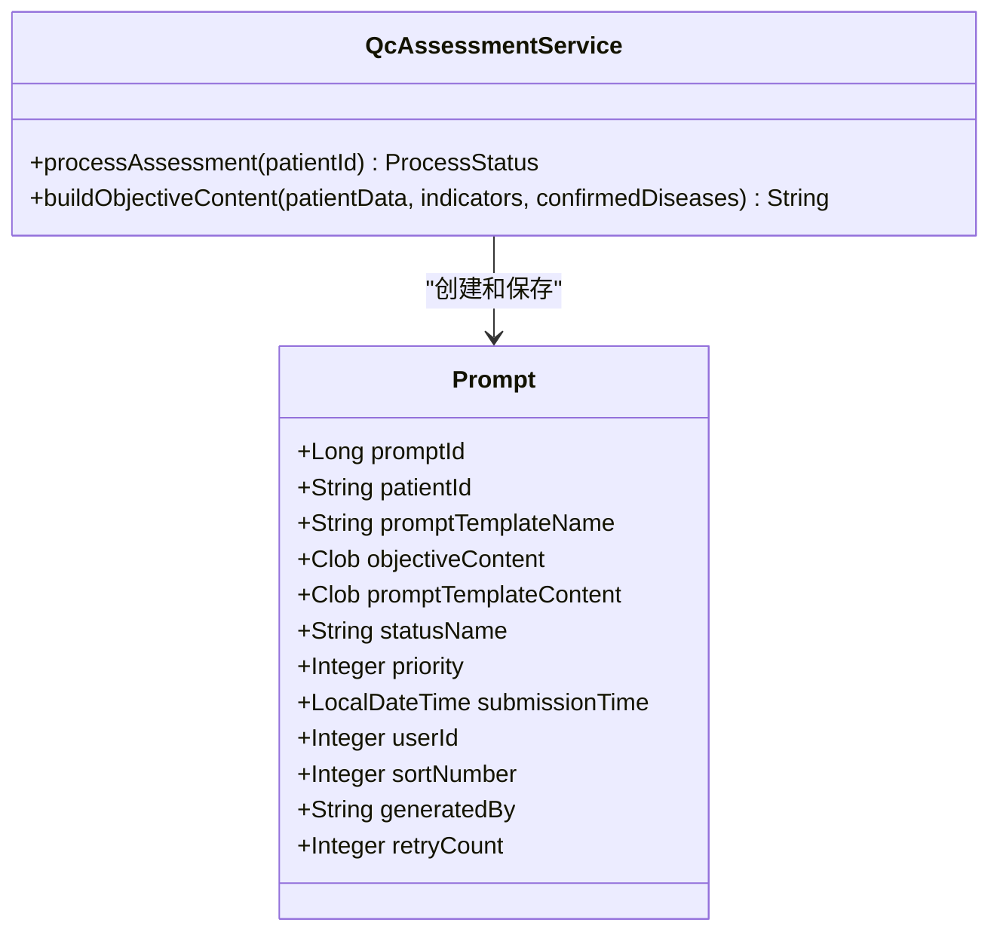

**图表来源**
- [QcAssessmentService.java:200-215](file://med_ai_assistant_1.0_bs_backend/src/main/java/com/example/medaiassistant/service/qc/QcAssessmentService.java#L200-L215)

### 状态管理机制

重新分析服务使用ProcessStatus枚举来管理处理状态：

1. **SAVED**: Prompt成功保存
2. **NO_CONFIRMED_DISEASE**: 患者无已确认病种
3. **NO_INDICATOR_CONFIG**: 已确认病种无有效指标配置
4. **NO_TEMPLATE**: 未找到Prompt模板
5. **ERROR**: 处理过程中发生异常

**章节来源**
- [QcDiseaseMatchController.java:78-127](file://med_ai_assistant_1.0_bs_backend/src/main/java/com/example/medaiassistant/controller/QcDiseaseMatchController.java#L78-L127)
- [QcAssessmentService.java:89-95](file://med_ai_assistant_1.0_bs_backend/src/main/java/com/example/medaiassistant/service/qc/QcAssessmentService.java#L89-L95)
- [QcAssessmentService.java:137-223](file://med_ai_assistant_1.0_bs_backend/src/main/java/com/example/medaiassistant/service/qc/QcAssessmentService.java#L137-L223)

## 多阶段处理机制

**新增** QC评估引擎实现了完整的多阶段处理机制，支持从诊断匹配到评估分析的完整流程。

### 阶段划分

系统将质控评估分为三个主要阶段：

#### 第一阶段：AI诊断匹配
- **目标**: 自动识别患者可能患有的疾病
- **触发**: triggerDiseaseMatch API
- **输出**: PromptResult对象
- **特点**: 基于AI模型的初步诊断

#### 第二阶段：病种确认
- **目标**: 医师确认AI诊断匹配结果
- **触发**: confirmDiseaseMatch API
- **输出**: QcConfirmedDisease记录
- **特点**: 人工确认与AI辅助结合

#### 第三阶段：重新分析评估
- **目标**: 基于已确认病种进行详细评估
- **触发**: reanalyzeAssessment API
- **输出**: Prompt记录（待处理状态）
- **特点**: 动态评估和持续改进

### 阶段间数据流转

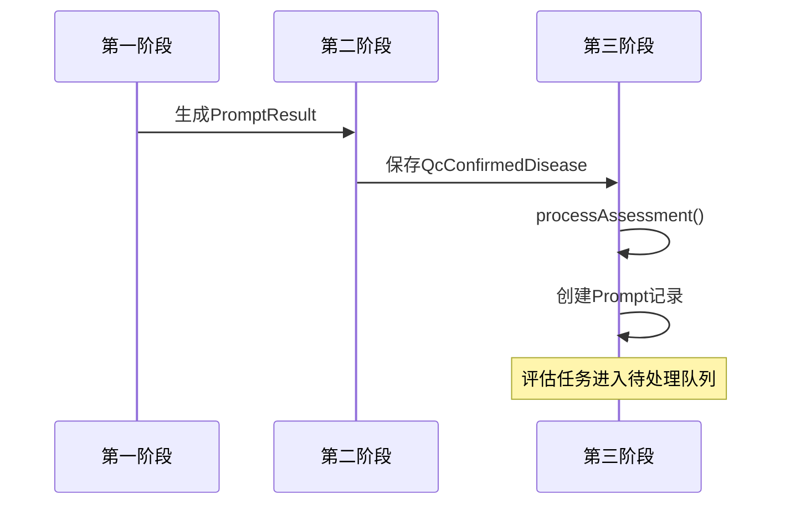

### 处理状态转换

多阶段处理的状态转换如下：

1. **第一阶段**: SAVED → ALREADY_EXISTS → NO_DIAGNOSIS → NO_DISEASE_CONFIG → NO_TEMPLATE → ERROR
2. **第二阶段**: SAVED → NO_CONFIRMED_DISEASE → NO_INDICATOR_CONFIG → NO_TEMPLATE → ERROR  
3. **第三阶段**: SAVED → NO_CONFIRMED_DISEASE → NO_INDICATOR_CONFIG → NO_TEMPLATE → ERROR

**章节来源**
- [QcDiseaseMatchController.java:134-191](file://med_ai_assistant_1.0_bs_backend/src/main/java/com/example/medaiassistant/controller/QcDiseaseMatchController.java#L134-L191)
- [QcDiseaseMatchController.java:78-127](file://med_ai_assistant_1.0_bs_backend/src/main/java/com/example/medaiassistant/controller/QcDiseaseMatchController.java#L78-L127)

## 质控评估数据集成到治疗计划生成

**新增** 版本0.8.050新增了QC质控评估数据集成到治疗计划生成的功能，实现了质控评估结果与诊疗计划的深度融合。

### 集成架构

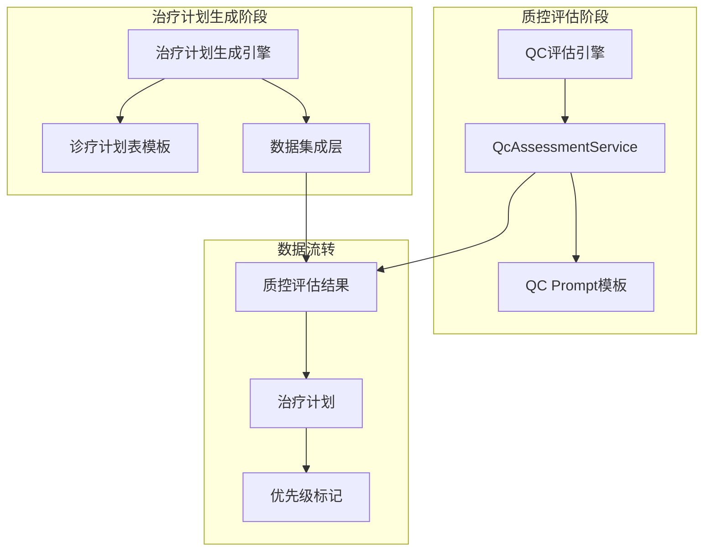

**图表来源**
- [insert-qc-prompt-templates.sql:143-190](file://med_ai_assistant_1.0_bs_backend/sql-scripts/insert-qc-prompt-templates.sql#L143-L190)
- [update-treatment-plan-prompt-template.sql:50-86](file://med_ai_assistant_1.0_bs_backend/sql-scripts/update-treatment-plan-prompt-template.sql#L50-L86)

### 模板集成机制

系统通过统一的Prompt模板管理体系实现质控评估与治疗计划的集成：

1. **QC-第三阶段-AI质控评估模板**: 专门用于生成质控评估结果
2. **诊疗计划表模板**: 集成质控评估数据，支持智能分级
3. **数据映射**: 将质控评估结果映射到治疗计划的优先级标记

### 优先级智能分级

治疗计划表模板更新后，支持"质控"优先级选项：

- **质控项目**: 来源于AI质控评估数据，准确性高，应优先执行
- **智能标记**: 系统自动识别质控项目并在治疗计划中标记
- **执行优先**: 质控项目享有更高的执行优先级

**章节来源**
- [insert-qc-prompt-templates.sql:143-190](file://med_ai_assistant_1.0_bs_backend/sql-scripts/insert-qc-prompt-templates.sql#L143-L190)
- [update-treatment-plan-prompt-template.sql:50-86](file://med_ai_assistant_1.0_bs_backend/sql-scripts/update-treatment-plan-prompt-template.sql#L50-L86)

## 质控评估详情页面真实数据对接

**新增** 版本0.8.049实现了质控评估详情页面真实数据对接，通过getLatestPromptResult获取AI质控评估结果。

### 数据对接架构

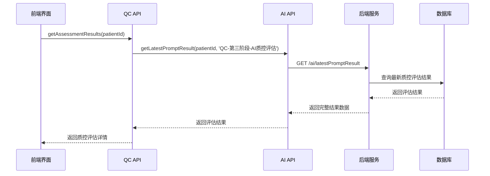

**图表来源**
- [qc.js:187-189](file://med_ai_assistant_1.0_bs_vue/src/api/qc.js#L187-L189)
- [ai.js:827-838](file://med_ai_assistant_1.0_bs_vue/src/api/ai.js#L827-L838)

### API调用流程

前端通过以下API链路获取质控评估详情：

1. **前端调用**: `getAssessmentResults(patientId)`
2. **QC API封装**: `getLatestPromptResult(patientId, 'QC-第三阶段-AI质控评估')`
3. **AI API查询**: `/ai/latestPromptResult?patientId&promptName`
4. **后端处理**: 查询最新质控评估结果
5. **数据返回**: 完整的评估结果详情

### 数据展示机制

质控评估详情页面通过以下机制展示真实数据：

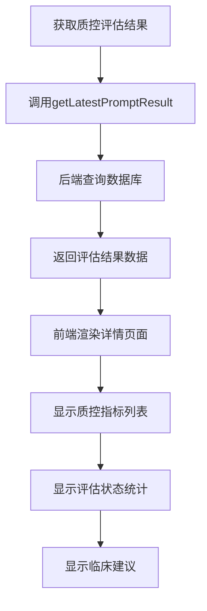

**图表来源**
- [AIResults.vue:805-834](file://med_ai_assistant_1.0_bs_vue/src/components/ai/AIResults.vue#L805-L834)

### 错误处理机制

系统提供了完善的错误处理机制：

1. **降级方案**: 获取详情失败时使用列表中的预览数据
2. **错误提示**: 显示"加载失败，请重试"的用户友好提示
3. **数据回退**: 保持基本的评估信息展示
4. **日志记录**: 详细记录API调用失败的原因

**章节来源**
- [qc.js:187-189](file://med_ai_assistant_1.0_bs_vue/src/api/qc.js#L187-L189)
- [ai.js:827-838](file://med_ai_assistant_1.0_bs_vue/src/api/ai.js#L827-L838)
- [AIResults.vue:805-834](file://med_ai_assistant_1.0_bs_vue/src/components/ai/AIResults.vue#L805-L834)

## 与现有框架集成

**新增** 重新分析功能与现有的质量控制框架实现了深度集成。

### 与病种确认的集成

重新分析功能依赖于病种确认机制：

1. **数据来源**: 从QcConfirmedDiseaseRepository获取已确认病种
2. **指标加载**: 通过QcIndicatorConfigRepository加载对应指标
3. **模板关联**: 使用PromptTemplateRepository获取评估模板
4. **数据获取**: 通过AIController获取患者临床数据

### 与评估结果的集成

重新分析产生的Prompt记录与评估结果管理系统集成：

1. **状态管理**: Prompt记录初始状态为"待处理"
2. **优先级设置**: 默认优先级为2
3. **生成来源**: 标记为"QC-SYSTEM"
4. **后续处理**: 由执行服务器处理并生成评估结果

### 与AI服务的集成

重新分析功能与AI服务的集成特点：

1. **降级处理**: AI服务调用失败时使用空数据继续
2. **错误隔离**: AI服务异常不影响整体流程
3. **性能优化**: 直接数据库查询替代HTTP调用
4. **数据一致性**: 确保患者数据的准确性和完整性

### 与治疗计划的集成

**新增** 质控评估数据与治疗计划生成的深度集成：

1. **模板统一**: 使用统一的"诊疗计划"模板类型
2. **数据映射**: 质控评估结果直接映射到治疗计划项目
3. **优先级标记**: 支持"质控"优先级的智能标记
4. **执行优化**: 质控项目享有更高的执行优先级

**章节来源**
- [QcAssessmentService.java:177-191](file://med_ai_assistant_1.0_bs_backend/src/main/java/com/example/medaiassistant/service/qc/QcAssessmentService.java#L177-L191)
- [AIController.java:688-799](file://med_ai_assistant_1.0_bs_backend/src/main/java/com/example/medaiassistant/controller/AIController.java#L688-L799)
- [insert-qc-prompt-templates.sql:143-190](file://med_ai_assistant_1.0_bs_backend/sql-scripts/insert-qc-prompt-templates.sql#L143-L190)

## 数据一致性保障机制

**新增** 重新分析功能引入了多重数据一致性保障机制，确保评估过程的可靠性和数据的完整性。

### 事务性操作保障

重新分析过程采用严格的事务性操作：

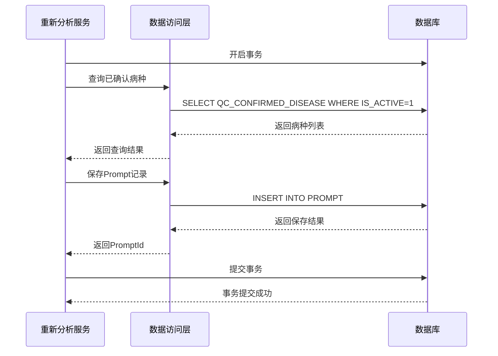

**图表来源**
- [QcAssessmentService.java:200-215](file://med_ai_assistant_1.0_bs_backend/src/main/java/com/example/medaiassistant/service/qc/QcAssessmentService.java#L200-L215)

### 幂等性设计

重新分析功能实现了完整的幂等性设计：

1. **重复触发防护**: 同一患者在同一时间点不会产生重复的评估任务
2. **状态一致性**: 确保评估状态在整个系统中的一致性
3. **数据完整性**: 通过事务保证相关数据的完整性
4. **并发控制**: 在高并发场景下保证数据的一致性

### 错误处理机制

系统提供了完善的错误处理机制：

1. **异常捕获**: 捕获并处理重新分析过程中的各种异常
2. **状态反馈**: 向客户端提供清晰的状态反馈
3. **日志记录**: 详细记录重新分析过程中的关键信息
4. **降级处理**: AI服务调用失败时的优雅降级

### 数据集成一致性

**新增** 质控评估数据集成到治疗计划的完整性保障：

1. **模板一致性**: 统一的Prompt模板确保数据格式一致
2. **数据映射**: 明确的字段映射规则保证数据准确性
3. **优先级同步**: 质控评估状态与治疗计划优先级实时同步
4. **版本控制**: 通过SQL脚本管理模板版本，确保升级一致性

**章节来源**
- [QcAssessmentService.java:219-223](file://med_ai_assistant_1.0_bs_backend/src/main/java/com/example/medaiassistant/service/qc/QcAssessmentService.java#L219-L223)
- [QcAssessmentService.java:177-191](file://med_ai_assistant_1.0_bs_backend/src/main/java/com/example/medaiassistant/service/qc/QcAssessmentService.java#L177-L191)

## 依赖关系分析

QC评估引擎的依赖关系体现了清晰的分层架构和模块化设计：

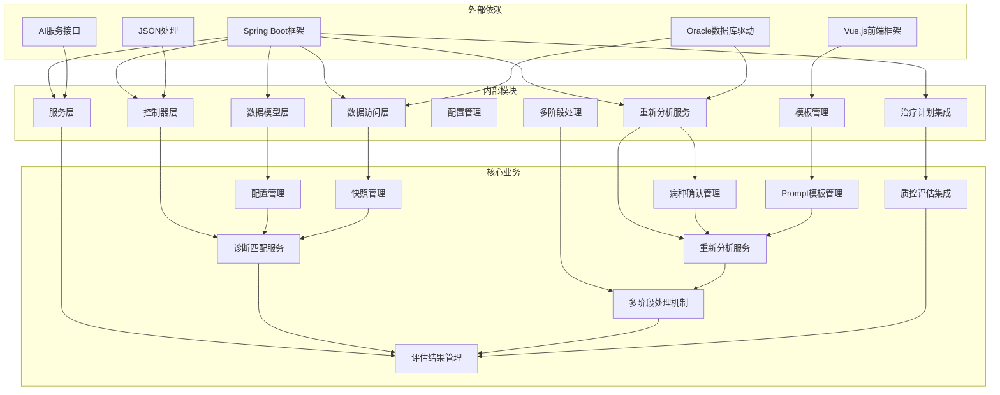

**图表来源**
- [QcDiseaseMatchController.java:1-17](file://med_ai_assistant_1.0_bs_backend/src/main/java/com/example/medaiassistant/controller/QcDiseaseMatchController.java#L1-L17)
- [QcAssessmentService.java:1-24](file://med_ai_assistant_1.0_bs_backend/src/main/java/com/example/medaiassistant/service/qc/QcAssessmentService.java#L1-L24)

系统的主要依赖特点：

1. **框架依赖**: 完全基于Spring Boot生态系统
2. **数据库依赖**: 专门针对Oracle数据库优化
3. **AI集成**: 与外部AI服务的松耦合集成
4. **数据持久化**: 使用JPA/Hibernate ORM框架
5. **配置管理**: 支持多环境配置切换
6. **重新分析服务**: 独立的服务模块，支持多阶段处理
7. **多阶段处理**: 通过状态机实现阶段间的平滑过渡
8. **治疗计划集成**: 与诊疗计划生成的深度集成
9. **模板管理**: 统一的Prompt模板管理体系

**章节来源**
- [QcDiseaseMatchController.java:1-17](file://med_ai_assistant_1.0_bs_backend/src/main/java/com/example/medaiassistant/controller/QcDiseaseMatchController.java#L1-L17)
- [QcAssessmentService.java:1-24](file://med_ai_assistant_1.0_bs_backend/src/main/java/com/example/medaiassistant/service/qc/QcAssessmentService.java#L1-L24)

## 性能考虑

QC评估引擎在设计时充分考虑了性能优化和可扩展性：

### 数据库性能优化

1. **索引策略**: 为常用查询字段建立复合索引
   - QC_ASSESSMENT_RESULT: (PATIENT_ID, DISEASE_ID), (ADMISSION_ID), (STATUS)
   - QC_INDICATOR_CONFIG: (DISEASE_ID, IS_ACTIVE), (IS_ACTIVE)
   - QC_DIAGNOSIS_SNAPSHOT: (PATIENT_ID)
   - QC_CONFIRMED_DISEASE: (PATIENT_ID, IS_ACTIVE)
   - **新增** PROMPT: (PATIENT_ID, STATUS_NAME, SUBMISSION_TIME)

2. **查询优化**: 使用派生查询减少SQL复杂度
3. **缓存策略**: 对频繁访问的配置数据进行缓存
4. **批量操作**: 使用批量更新和批量插入优化确认流程

### AI服务性能

1. **异步处理**: 避免阻塞主线程
2. **降级处理**: AI服务调用失败时使用空数据继续
3. **重试机制**: 失败时自动重试
4. **超时控制**: 防止长时间等待
5. **并发控制**: 限制同时处理的任务数量

### 内存管理

1. **大文本处理**: CLOB字段的高效处理
2. **对象池**: 复用数据库连接
3. **垃圾回收**: 及时释放临时对象
4. **序列化优化**: 通过序列化机制优化确认数据的存储和检索
5. **性能测试**: 支持100个指标场景在500ms内完成
6. **前端优化**: getLatestPromptResult的高效数据获取机制

### 治疗计划集成性能

**新增** 质控评估数据集成到治疗计划的性能优化：

1. **模板缓存**: 统一的Prompt模板缓存机制
2. **数据映射优化**: 高效的质控评估结果映射算法
3. **优先级计算**: 实时的优先级计算和标记
4. **批量处理**: 支持大量质控项目的批量处理

## 故障排除指南

### 常见问题及解决方案

#### 1. 重新分析失败

**症状**: 调用重新分析API返回错误状态

**可能原因**:
- 患者无已确认病种
- 已确认病种无有效指标配置
- 未找到Prompt模板
- 数据库连接异常
- **新增** AI服务调用失败

**解决步骤**:
1. 验证患者是否有已确认病种
2. 检查指标配置表中是否有启用的记录
3. 确认Prompt模板是否正确配置
4. 查看数据库连接状态
5. **新增** 检查AI服务状态和网络连接

#### 2. 评估结果查询失败

**症状**: 获取最新评估结果返回404状态

**可能原因**:
- 患者尚未完成诊断匹配
- AI服务处理延迟
- 数据库查询异常
- **新增** 重新分析任务未生成Prompt

**解决步骤**:
1. 确认诊断匹配任务已完成
2. 检查AI服务状态
3. 验证数据库连接
4. **新增** 检查重新分析任务状态

#### 3. 多阶段处理问题

**症状**: 阶段间数据流转异常

**可能原因**:
- 病种确认状态不正确
- 指标配置加载失败
- Prompt模板获取异常
- **新增** 重新分析服务初始化失败

**解决步骤**:
1. 验证病种确认记录状态
2. 检查指标配置加载逻辑
3. 确认Prompt模板可用性
4. **新增** 检查重新分析服务依赖注入

#### 4. **新增** 重新分析API问题

**症状**: 重新分析API返回错误或处理异常

**可能原因**:
- 重新分析服务未正确注入
- ProcessStatus枚举值不匹配
- 响应状态码映射错误
- **新增** AIController调用异常

**解决步骤**:
1. 验证QcAssessmentService依赖注入
2. 检查ProcessStatus状态映射
3. 确认HTTP响应状态码
4. **新增** 检查AIController方法签名

#### 5. **新增** 质控评估详情页面问题

**症状**: 质控评估详情页面无法显示真实数据

**可能原因**:
- getLatestPromptResult API调用失败
- 后端数据库查询异常
- 前端数据处理错误
- **新增** 模板数据映射问题

**解决步骤**:
1. 检查getLatestPromptResult API调用日志
2. 验证后端数据库连接和查询
3. 确认前端数据处理逻辑
4. **新增** 检查Prompt模板数据映射

### 日志分析

系统提供了完整的日志记录机制，便于问题诊断：

1. **请求日志**: 记录所有API调用详情
2. **业务日志**: 记录关键业务流程
3. **错误日志**: 详细记录异常信息
4. **性能日志**: 监控系统性能指标
5. **重新分析日志**: 记录重新分析过程的关键步骤
6. **多阶段日志**: 跟踪阶段间的状态转换
7. **治疗计划集成日志**: 记录质控评估数据集成过程
8. **前端交互日志**: 记录用户界面交互和数据展示

### 监控指标

建议监控以下关键指标：
- API响应时间
- 数据库查询性能
- AI服务调用成功率
- 内存使用情况
- 磁盘空间使用
- **新增** 重新分析成功率
- **新增** 多阶段处理效率
- **新增** 治疗计划集成成功率
- **新增** 质控评估详情页面加载性能

## 结论

QC评估引擎作为MedAiAssistant系统的核心组件，展现了现代医疗AI应用的最佳实践。系统通过精心设计的架构、完善的业务逻辑和强大的技术实现，为医疗机构提供了智能化的质量控制解决方案。

**更新** 本次更新显著增强了系统的功能完整性，通过集成重新分析功能，建立了完整的多阶段处理机制和与现有质量控制框架的深度集成。特别是版本0.8.050新增的QC质控评估数据集成到治疗计划生成功能，以及版本0.8.049实现的质控评估详情页面真实数据对接，标志着系统在临床应用层面迈出了重要一步。

### 主要优势

1. **架构清晰**: 分层设计确保了良好的可维护性
2. **功能完整**: 覆盖了从诊断匹配到结果评估的完整流程
3. **性能优秀**: 通过多种优化策略保证了系统的高效运行
4. **扩展性强**: 模块化设计便于功能扩展和定制
5. **可靠性高**: 完善的错误处理和监控机制
6. **多阶段处理**: 支持从诊断匹配到评估分析的完整流程
7. **重新分析能力**: 基于已确认病种的动态评估机制
8. **深度集成**: 与现有质量控制框架的无缝集成
9. **治疗计划融合**: 质控评估数据直接融入诊疗计划生成
10. **真实数据对接**: 详情页面实现真实数据的完整展示

### 技术亮点

1. **AI集成**: 与外部AI服务的无缝集成
2. **数据管理**: 基于Oracle数据库的高性能数据处理
3. **实时监控**: 完整的系统状态监控和告警机制
4. **用户体验**: 友好的前端界面和丰富的可视化功能
5. **多阶段处理**: 支持从诊断匹配到评估分析的完整流程
6. **重新分析机制**: 基于已确认病种的动态评估能力
7. **降级处理**: AI服务调用失败时的优雅降级
8. **性能优化**: 支持大规模指标处理的性能测试
9. **模板管理**: 统一的Prompt模板管理体系
10. **数据集成**: 质控评估与治疗计划的深度数据集成

### 发展前景

随着医疗AI技术的不断发展，QC评估引擎将继续演进，为提升医疗质量和患者安全做出更大贡献。系统的设计为未来的功能扩展和技术升级奠定了坚实的基础。

**特别关注** 重新分析功能的成功集成，为系统增加了重要的动态评估能力，使得AI辅助诊断能够更好地融入临床工作流程，为医师提供可靠的决策支持工具。这一功能的实现展示了系统在复杂业务场景下的强大适应能力和扩展潜力。

**新增功能的价值** 质控评估数据集成到治疗计划生成和详情页面真实数据对接的实现，不仅提升了系统的实用性，更重要的是为临床医生提供了更加准确、及时的质控信息支持，有助于提高医疗质量和患者安全水平。这些功能的集成标志着MedAiAssistant系统在智能化医疗质量控制领域的进一步成熟和专业化。