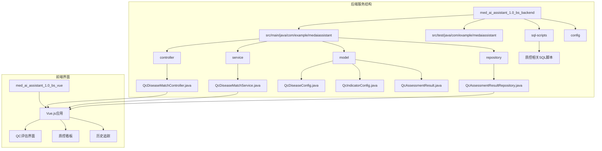
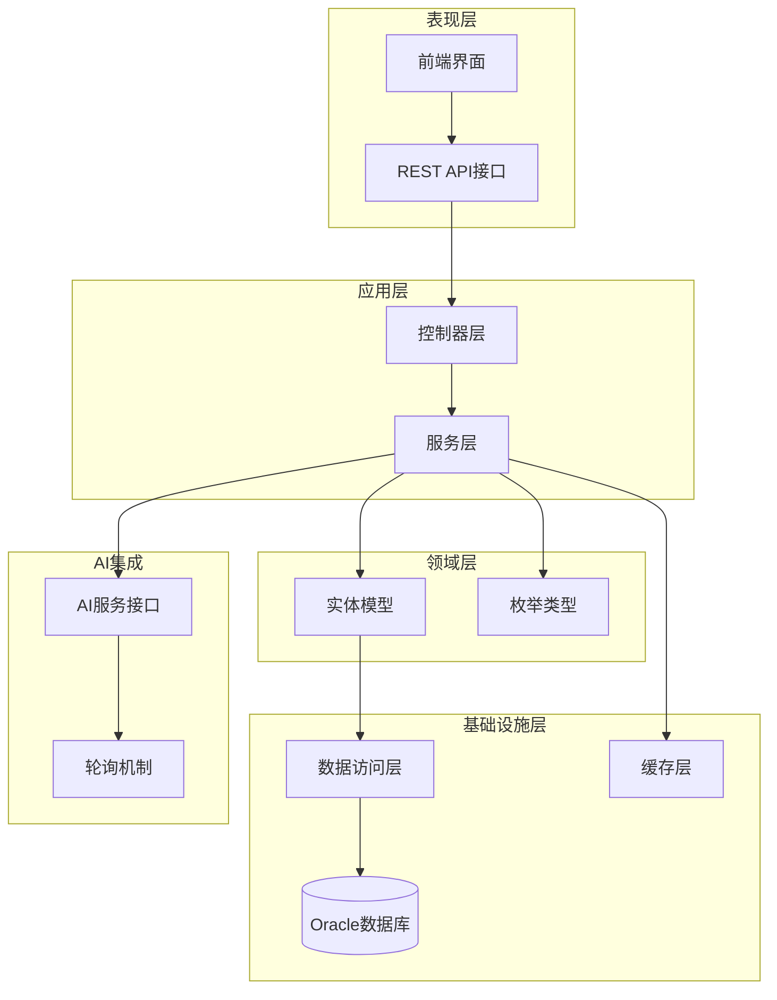
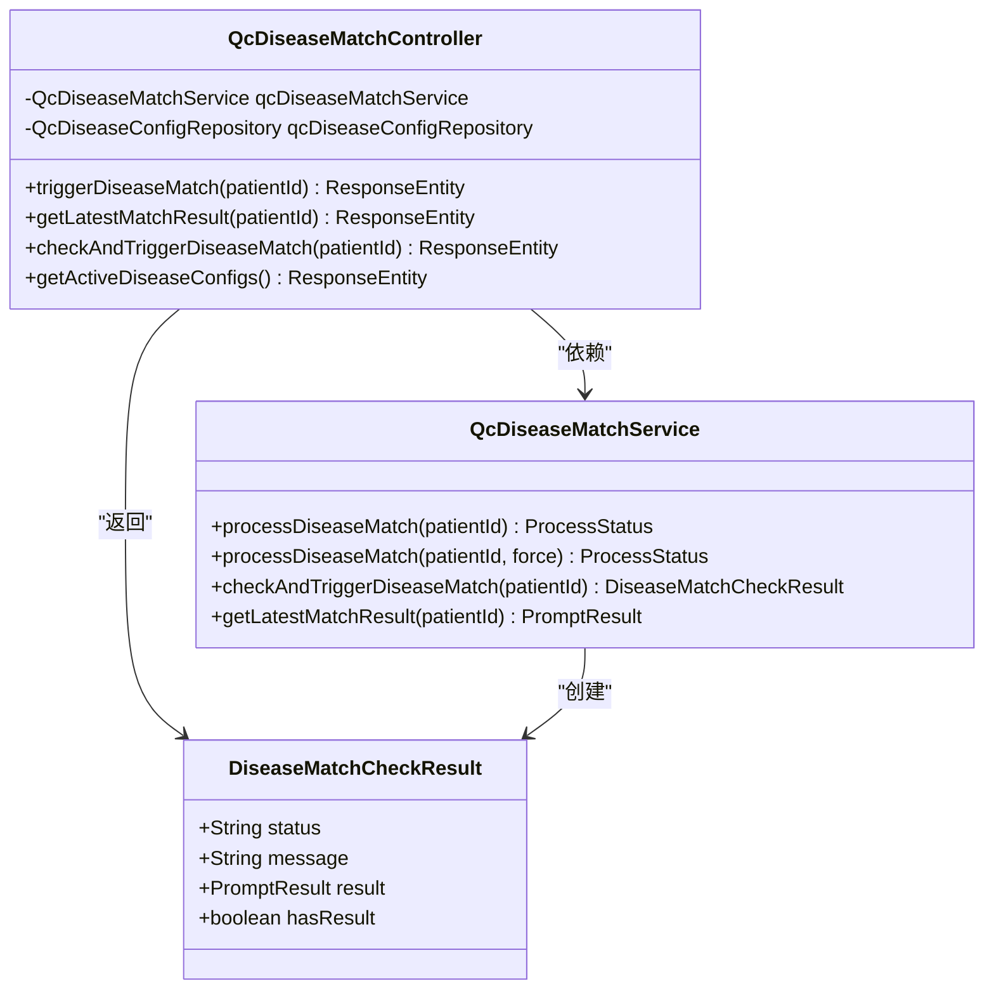
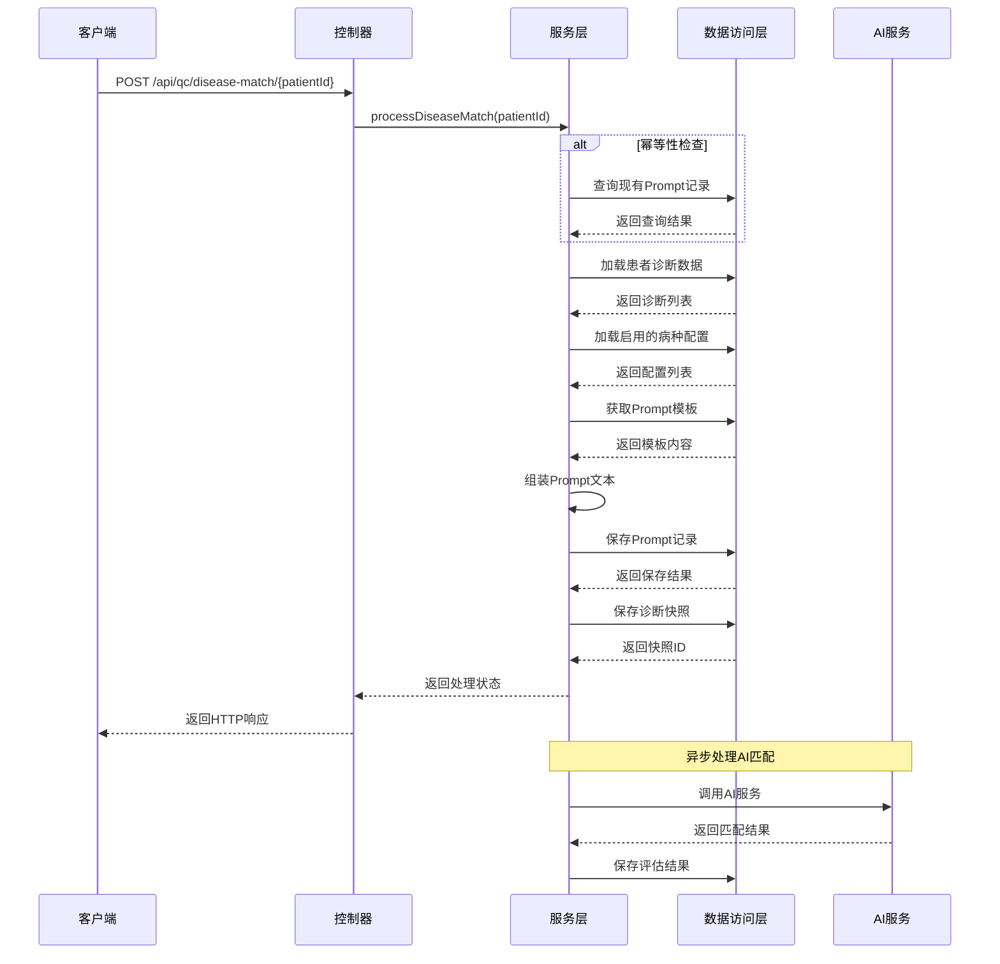
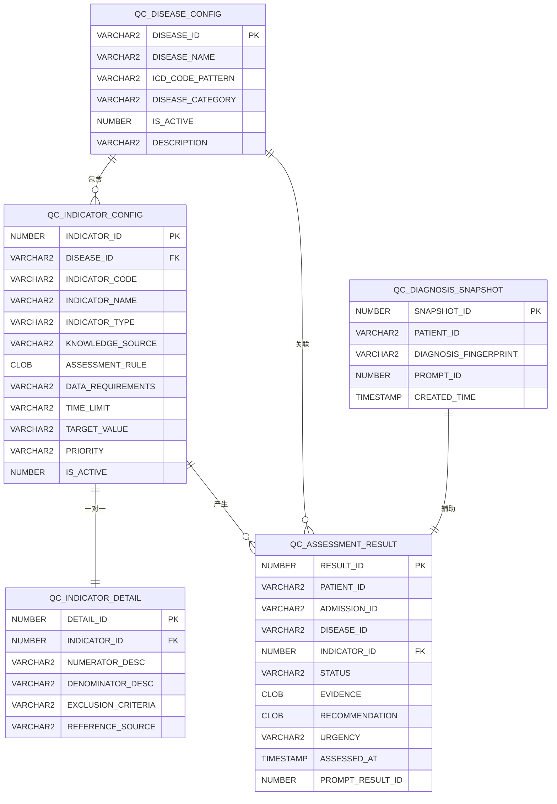
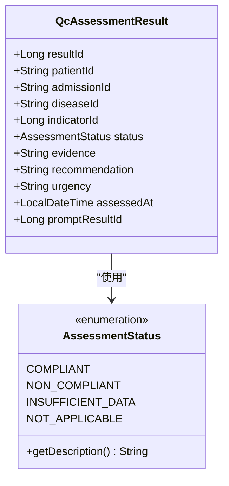
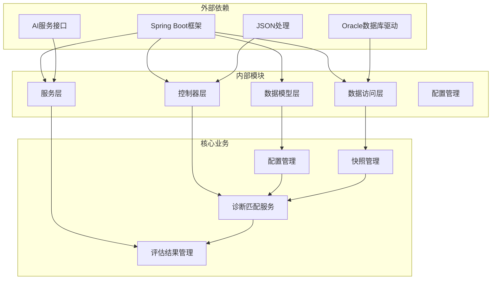

# QC评估引擎

<cite>
**本文档引用的文件**
- [QcDiseaseMatchController.java](file://med_ai_assistant_1.0_bs_backend/src/main/java/com/example/medaiassistant/controller/QcDiseaseMatchController.java)
- [QcDiseaseMatchService.java](file://med_ai_assistant_1.0_bs_backend/src/main/java/com/example/medaiassistant/service/qc/QcDiseaseMatchService.java)
- [QcDiseaseConfig.java](file://med_ai_assistant_1.0_bs_backend/src/main/java/com/example/medaiassistant/model/qc/QcDiseaseConfig.java)
- [QcIndicatorConfig.java](file://med_ai_assistant_1.0_bs_backend/src/main/java/com/example/medaiassistant/model/qc/QcIndicatorConfig.java)
- [QcIndicatorDetail.java](file://med_ai_assistant_1.0_bs_backend/src/main/java/com/example/medaiassistant/model/qc/QcIndicatorDetail.java)
- [QcAssessmentResult.java](file://med_ai_assistant_1.0_bs_backend/src/main/java/com/example/medaiassistant/model/qc/QcAssessmentResult.java)
- [QcDiagnosisSnapshot.java](file://med_ai_assistant_1.0_bs_backend/src/main/java/com/example/medaiassistant/model/qc/QcDiagnosisSnapshot.java)
- [QcAssessmentResultRepository.java](file://med_ai_assistant_1.0_bs_backend/src/main/java/com/example/medaiassistant/repository/qc/QcAssessmentResultRepository.java)
- [AssessmentStatus.java](file://med_ai_assistant_1.0_bs_backend/src/main/java/com/example/medaiassistant/model/qc/enums/AssessmentStatus.java)
- [create-qc-assessment-result-table.sql](file://med_ai_assistant_1.0_bs_backend/sql-scripts/create-qc-assessment-result-table.sql)
- [create-qc-indicator-config-table.sql](file://med_ai_assistant_1.0_bs_backend/sql-scripts/create-qc-indicator-config-table.sql)
- [create-qc-indicator-detail-table.sql](file://med_ai_assistant_1.0_bs_backend/sql-scripts/create-qc-indicator-detail-table.sql)
- [create-qc-disease-config-table.sql](file://med_ai_assistant_1.0_bs_backend/sql-scripts/create-qc-disease-config-table.sql)
- [qc_disease_config_init.sql](file://med_ai_assistant_1.0_bs_backend/sql-scripts/qc_disease_config_init.sql)
</cite>

## 目录
1. [简介](#简介)
2. [项目结构](#项目结构)
3. [核心组件](#核心组件)
4. [架构概览](#架构概览)
5. [详细组件分析](#详细组件分析)
6. [依赖关系分析](#依赖关系分析)
7. [性能考虑](#性能考虑)
8. [故障排除指南](#故障排除指南)
9. [结论](#结论)

## 简介

QC评估引擎是MedAiAssistant医疗人工智能助手系统中的核心质量控制模块。该引擎基于先进的AI技术，为医疗机构提供智能化的医疗质量评估和改进支持。系统通过整合患者的诊断信息、病历数据和临床指南，自动识别潜在的质量风险点，并提供针对性的改进建议。

该引擎采用分阶段的评估策略，第一阶段专注于AI诊断匹配，第二阶段进行详细的指标评估。整个系统支持实时监控、历史追踪和趋势分析，帮助医疗机构持续改进医疗质量和患者安全。

## 项目结构

MedAiAssistant项目采用标准的Spring Boot架构，QC评估引擎作为核心业务模块位于后端服务中：

**图表来源**
- [QcDiseaseMatchController.java:1-222](file://med_ai_assistant_1.0_bs_backend/src/main/java/com/example/medaiassistant/controller/QcDiseaseMatchController.java#L1-L222)
- [QcDiseaseMatchService.java:1-473](file://med_ai_assistant_1.0_bs_backend/src/main/java/com/example/medaiassistant/service/qc/QcDiseaseMatchService.java#L1-L473)

**章节来源**
- [QcDiseaseMatchController.java:1-222](file://med_ai_assistant_1.0_bs_backend/src/main/java/com/example/medaiassistant/controller/QcDiseaseMatchController.java#L1-L222)
- [QcDiseaseMatchService.java:1-473](file://med_ai_assistant_1.0_bs_backend/src/main/java/com/example/medaiassistant/service/qc/QcDiseaseMatchService.java#L1-L473)

## 核心组件

QC评估引擎由多个相互协作的组件构成，每个组件都有明确的职责和边界：

### 控制器层
- **QcDiseaseMatchController**: 提供REST API接口，处理外部请求
- **功能**: 触发诊断匹配、查询结果、检查诊断变更、获取配置列表

### 服务层
- **QcDiseaseMatchService**: 核心业务逻辑处理
- **功能**: 幂等性检查、诊断匹配、结果查询、诊断变更检测

### 数据模型层
- **QcDiseaseConfig**: 疾病配置实体
- **QcIndicatorConfig**: 指标配置实体  
- **QcAssessmentResult**: 评估结果实体
- **QcDiagnosisSnapshot**: 诊断快照实体
- **QcIndicatorDetail**: 指标明细实体

### 数据访问层
- **QcAssessmentResultRepository**: 评估结果数据访问
- **各种Repository接口**: 支持CRUD操作和复杂查询

**章节来源**
- [QcDiseaseMatchController.java:18-35](file://med_ai_assistant_1.0_bs_backend/src/main/java/com/example/medaiassistant/controller/QcDiseaseMatchController.java#L18-L35)
- [QcDiseaseMatchService.java:25-46](file://med_ai_assistant_1.0_bs_backend/src/main/java/com/example/medaiassistant/service/qc/QcDiseaseMatchService.java#L25-L46)

## 架构概览

QC评估引擎采用分层架构设计，确保了良好的可维护性和扩展性：

**图表来源**
- [QcDiseaseMatchController.java:36-56](file://med_ai_assistant_1.0_bs_backend/src/main/java/com/example/medaiassistant/controller/QcDiseaseMatchController.java#L36-L56)
- [QcDiseaseMatchService.java:44-91](file://med_ai_assistant_1.0_bs_backend/src/main/java/com/example/medaiassistant/service/qc/QcDiseaseMatchService.java#L44-L91)

系统采用以下设计原则：

1. **分层架构**: 清晰的职责分离，便于维护和测试
2. **依赖注入**: 使用Spring框架实现松耦合
3. **幂等性设计**: 避免重复处理和数据不一致
4. **异步处理**: 支持AI服务的异步调用和轮询
5. **监控集成**: 完整的日志记录和状态跟踪

## 详细组件分析

### QcDiseaseMatchController - 控制器组件

控制器层负责处理HTTP请求和响应，提供RESTful API接口：

**图表来源**
- [QcDiseaseMatchController.java:36-56](file://med_ai_assistant_1.0_bs_backend/src/main/java/com/example/medaiassistant/controller/QcDiseaseMatchController.java#L36-L56)
- [QcDiseaseMatchService.java:44-91](file://med_ai_assistant_1.0_bs_backend/src/main/java/com/example/medaiassistant/service/qc/QcDiseaseMatchService.java#L44-L91)

**章节来源**
- [QcDiseaseMatchController.java:58-119](file://med_ai_assistant_1.0_bs_backend/src/main/java/com/example/medaiassistant/controller/QcDiseaseMatchController.java#L58-L119)
- [QcDiseaseMatchController.java:121-155](file://med_ai_assistant_1.0_bs_backend/src/main/java/com/example/medaiassistant/controller/QcDiseaseMatchController.java#L121-L155)
- [QcDiseaseMatchController.java:157-192](file://med_ai_assistant_1.0_bs_backend/src/main/java/com/example/medaiassistant/controller/QcDiseaseMatchController.java#L157-L192)
- [QcDiseaseMatchController.java:194-220](file://med_ai_assistant_1.0_bs_backend/src/main/java/com/example/medaiassistant/controller/QcDiseaseMatchController.java#L194-L220)

### QcDiseaseMatchService - 服务组件

服务层是系统的核心业务逻辑处理单元，实现了完整的诊断匹配流程：

**图表来源**
- [QcDiseaseMatchService.java:152-234](file://med_ai_assistant_1.0_bs_backend/src/main/java/com/example/medaiassistant/service/qc/QcDiseaseMatchService.java#L152-L234)
- [QcDiseaseMatchService.java:253-312](file://med_ai_assistant_1.0_bs_backend/src/main/java/com/example/medaiassistant/service/qc/QcDiseaseMatchService.java#L253-L312)

**章节来源**
- [QcDiseaseMatchService.java:97-115](file://med_ai_assistant_1.0_bs_backend/src/main/java/com/example/medaiassistant/service/qc/QcDiseaseMatchService.java#L97-L115)
- [QcDiseaseMatchService.java:121-151](file://med_ai_assistant_1.0_bs_backend/src/main/java/com/example/medaiassistant/service/qc/QcDiseaseMatchService.java#L121-L151)
- [QcDiseaseMatchService.java:236-312](file://med_ai_assistant_1.0_bs_backend/src/main/java/com/example/medaiassistant/service/qc/QcDiseaseMatchService.java#L236-L312)

### 数据模型组件

系统采用丰富的实体模型来描述质控相关的业务概念：

**图表来源**
- [QcDiseaseConfig.java:20-67](file://med_ai_assistant_1.0_bs_backend/src/main/java/com/example/medaiassistant/model/qc/QcDiseaseConfig.java#L20-L67)
- [QcIndicatorConfig.java:23-122](file://med_ai_assistant_1.0_bs_backend/src/main/java/com/example/medaiassistant/model/qc/QcIndicatorConfig.java#L23-L122)
- [QcAssessmentResult.java:24-115](file://med_ai_assistant_1.0_bs_backend/src/main/java/com/example/medaiassistant/model/qc/QcAssessmentResult.java#L24-L115)
- [QcDiagnosisSnapshot.java:17-58](file://med_ai_assistant_1.0_bs_backend/src/main/java/com/example/medaiassistant/model/qc/QcDiagnosisSnapshot.java#L17-L58)

**章节来源**
- [QcDiseaseConfig.java:7-21](file://med_ai_assistant_1.0_bs_backend/src/main/java/com/example/medaiassistant/model/qc/QcDiseaseConfig.java#L7-L21)
- [QcIndicatorConfig.java:9-22](file://med_ai_assistant_1.0_bs_backend/src/main/java/com/example/medaiassistant/model/qc/QcIndicatorConfig.java#L9-L22)
- [QcAssessmentResult.java:11-23](file://med_ai_assistant_1.0_bs_backend/src/main/java/com/example/medaiassistant/model/qc/QcAssessmentResult.java#L11-L23)
- [QcDiagnosisSnapshot.java:5-16](file://med_ai_assistant_1.0_bs_backend/src/main/java/com/example/medaiassistant/model/qc/QcDiagnosisSnapshot.java#L5-L16)

### 评估状态管理

系统定义了完整的评估状态枚举，用于标准化质量评估结果：

**图表来源**
- [AssessmentStatus.java:10-41](file://med_ai_assistant_1.0_bs_backend/src/main/java/com/example/medaiassistant/model/qc/enums/AssessmentStatus.java#L10-L41)
- [QcAssessmentResult.java:73-115](file://med_ai_assistant_1.0_bs_backend/src/main/java/com/example/medaiassistant/model/qc/QcAssessmentResult.java#L73-L115)

**章节来源**
- [AssessmentStatus.java:1-41](file://med_ai_assistant_1.0_bs_backend/src/main/java/com/example/medaiassistant/model/qc/enums/AssessmentStatus.java#L1-L41)

## 依赖关系分析

QC评估引擎的依赖关系体现了清晰的分层架构和模块化设计：

**图表来源**
- [QcDiseaseMatchController.java:1-17](file://med_ai_assistant_1.0_bs_backend/src/main/java/com/example/medaiassistant/controller/QcDiseaseMatchController.java#L1-L17)
- [QcDiseaseMatchService.java:1-24](file://med_ai_assistant_1.0_bs_backend/src/main/java/com/example/medaiassistant/service/qc/QcDiseaseMatchService.java#L1-L24)

系统的主要依赖特点：

1. **框架依赖**: 完全基于Spring Boot生态系统
2. **数据库依赖**: 专门针对Oracle数据库优化
3. **AI集成**: 与外部AI服务的松耦合集成
4. **数据持久化**: 使用JPA/Hibernate ORM框架
5. **配置管理**: 支持多环境配置切换

**章节来源**
- [QcDiseaseMatchController.java:1-17](file://med_ai_assistant_1.0_bs_backend/src/main/java/com/example/medaiassistant/controller/QcDiseaseMatchController.java#L1-L17)
- [QcDiseaseMatchService.java:1-24](file://med_ai_assistant_1.0_bs_backend/src/main/java/com/example/medaiassistant/service/qc/QcDiseaseMatchService.java#L1-L24)

## 性能考虑

QC评估引擎在设计时充分考虑了性能优化和可扩展性：

### 数据库性能优化

1. **索引策略**: 为常用查询字段建立复合索引
   - QC_ASSESSMENT_RESULT: (PATIENT_ID, DISEASE_ID), (ADMISSION_ID), (STATUS)
   - QC_INDICATOR_CONFIG: (DISEASE_ID, IS_ACTIVE), (IS_ACTIVE)
   - QC_DIAGNOSIS_SNAPSHOT: (PATIENT_ID)

2. **查询优化**: 使用派生查询减少SQL复杂度
3. **缓存策略**: 对频繁访问的配置数据进行缓存

### AI服务性能

1. **异步处理**: 避免阻塞主线程
2. **重试机制**: 失败时自动重试
3. **超时控制**: 防止长时间等待
4. **并发控制**: 限制同时处理的任务数量

### 内存管理

1. **大文本处理**: CLOB字段的高效处理
2. **对象池**: 复用数据库连接
3. **垃圾回收**: 及时释放临时对象

## 故障排除指南

### 常见问题及解决方案

#### 1. 诊断匹配失败

**症状**: 触发诊断匹配API返回错误状态

**可能原因**:
- 患者无有效诊断数据
- 系统中无启用的病种配置
- 未找到指定的Prompt模板
- 数据库连接异常

**解决步骤**:
1. 检查患者是否存在有效诊断
2. 验证病种配置表中是否有启用的记录
3. 确认Prompt模板是否正确配置
4. 查看数据库连接状态

#### 2. 评估结果查询失败

**症状**: 获取最新评估结果返回404状态

**可能原因**:
- 患者尚未完成诊断匹配
- AI服务处理延迟
- 数据库查询异常

**解决步骤**:
1. 确认诊断匹配任务已完成
2. 检查AI服务状态
3. 验证数据库连接
4. 查看系统日志

#### 3. 幂等性检查问题

**症状**: 重复触发诊断匹配任务

**可能原因**:
- 幂等性检查逻辑异常
- 数据库查询结果不准确
- 缓存数据过期

**解决步骤**:
1. 检查现有Prompt记录查询
2. 验证诊断快照数据
3. 清理相关缓存
4. 重启服务

**章节来源**
- [QcDiseaseMatchController.java:89-118](file://med_ai_assistant_1.0_bs_backend/src/main/java/com/example/medaiassistant/controller/QcDiseaseMatchController.java#L89-L118)
- [QcDiseaseMatchService.java:155-234](file://med_ai_assistant_1.0_bs_backend/src/main/java/com/example/medaiassistant/service/qc/QcDiseaseMatchService.java#L155-L234)

### 日志分析

系统提供了完整的日志记录机制，便于问题诊断：

1. **请求日志**: 记录所有API调用详情
2. **业务日志**: 记录关键业务流程
3. **错误日志**: 详细记录异常信息
4. **性能日志**: 监控系统性能指标

### 监控指标

建议监控以下关键指标：
- API响应时间
- 数据库查询性能
- AI服务调用成功率
- 内存使用情况
- 磁盘空间使用

## 结论

QC评估引擎作为MedAiAssistant系统的核心组件，展现了现代医疗AI应用的最佳实践。系统通过精心设计的架构、完善的业务逻辑和强大的技术实现，为医疗机构提供了智能化的质量控制解决方案。

### 主要优势

1. **架构清晰**: 分层设计确保了良好的可维护性
2. **功能完整**: 覆盖了从诊断匹配到结果评估的全流程
3. **性能优秀**: 通过多种优化策略保证了系统的高效运行
4. **扩展性强**: 模块化设计便于功能扩展和定制
5. **可靠性高**: 完善的错误处理和监控机制

### 技术亮点

1. **AI集成**: 与外部AI服务的无缝集成
2. **数据管理**: 基于Oracle数据库的高性能数据处理
3. **实时监控**: 完整的系统状态监控和告警机制
4. **用户体验**: 友好的前端界面和丰富的可视化功能

### 发展前景

随着医疗AI技术的不断发展，QC评估引擎将继续演进，为提升医疗质量和患者安全做出更大贡献。系统的设计为未来的功能扩展和技术升级奠定了坚实的基础。