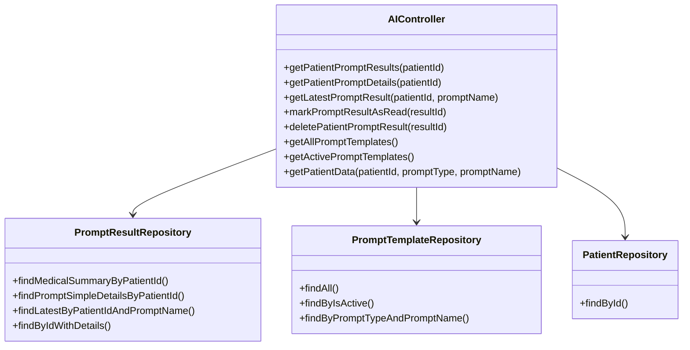
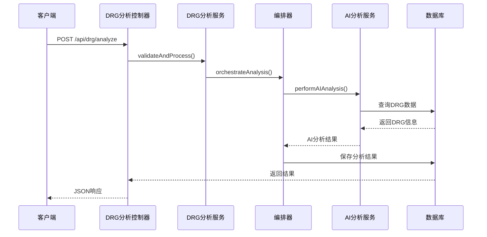
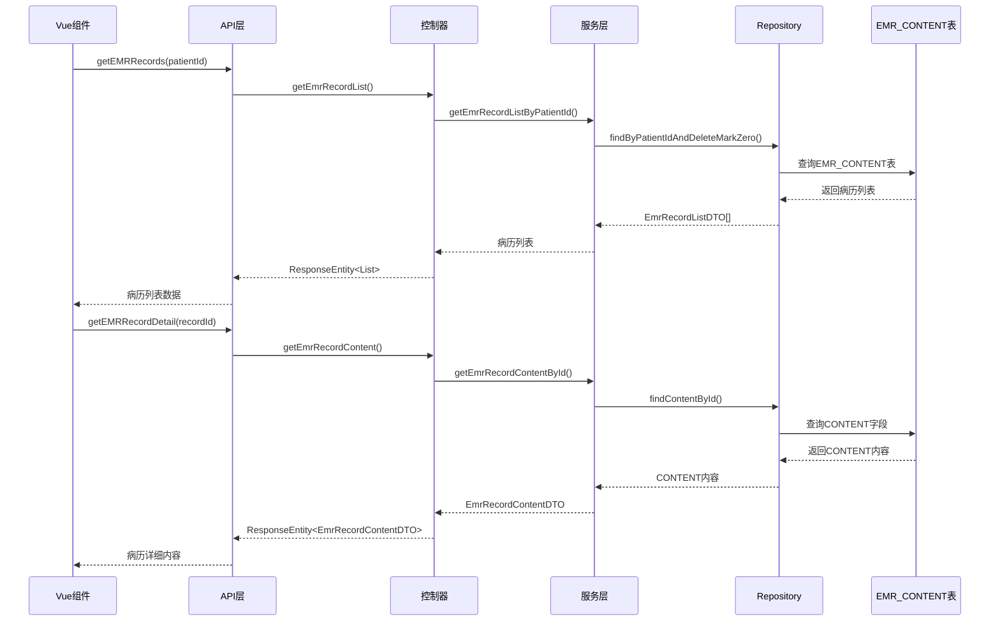
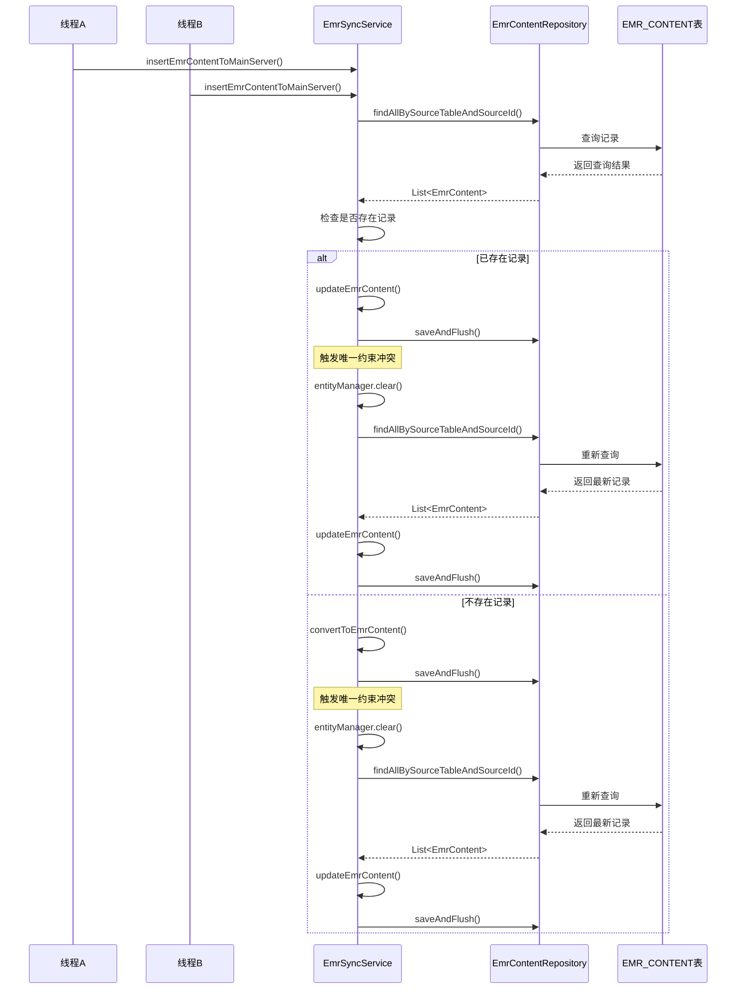

# 更新摘要

<cite>
**本文档引用的文件**
- [EmrSyncService.java](file://med_ai_assistant_1.0_bs_backend/src/main/java/com/example/medaiassistant/hospital/service/EmrSyncService.java)
- [EmrSyncController.java](file://med_ai_assistant_1.0_bs_backend/src/main/java/com/example/medaiassistant/controller/EmrSyncController.java)
- [EmrSyncConfig.java](file://med_ai_assistant_1.0_bs_backend/src/main/java/com/example/medaiassistant/hospital/config/EmrSyncConfig.java)
- [EMR病历内容同步API接口文档.md](file://med_ai_assistant_1.0_bs_backend/doc/接口/数据同步/EMR病历内容同步API接口文档.md)
- [2026-04-09.md](file://med_ai_assistant_1.0_bs_backend/doc/更新日志/2026-04-09.md)
- [EMR病历内容同步实现方案.md](file://med_ai_assistant_1.0_bs_backend/doc/迭代/医院数据同步/EMR病历内容同步实现方案.md)
</cite>

## 更新摘要
**所做更改**
- 新增EMR病历内容同步机制章节，详细介绍并发安全设计和重试机制
- 更新EMR同步API接口文档，补充并发冲突处理和重试机制说明
- 新增JPA批处理优化章节，说明saveAndFlush替代save的改进
- 新增唯一约束冲突修复章节，详细说明ORA-00001问题的解决方案
- 新增EMR_CONTENT表脏数据清理章节，记录4条NULL数据的诊断与处理

## 目录
1. [项目概述](#项目概述)
2. [核心架构](#核心架构)
3. [数据库配置](#数据库配置)
4. [AI服务功能](#ai服务功能)
5. [DRG分析系统](#drg分析系统)
6. [EMR病历内容显示](#emr病历内容显示)
7. [患者画像功能增强](#患者画像功能增强)
8. [页面布局重构](#页面布局重构)
9. [配置管理](#配置管理)
10. [性能优化](#性能优化)
11. [监控与告警](#监控与告警)
12. [部署配置](#部署配置)
13. [EMR病历内容同步机制](#emr病历内容同步机制)
14. [JPA批处理优化](#jpa批处理优化)
15. [唯一约束冲突修复](#唯一约束冲突修复)
16. [EMR_CONTENT表脏数据清理](#emr_content表脏数据清理)
17. [总结](#总结)

## 项目概述

MedAiAssistant是一个基于Spring Boot的医疗AI辅助系统，采用前后端分离架构，包含主服务器和执行服务器两个核心组件。该项目专注于为医疗机构提供智能化的AI辅助诊断和数据分析服务。

### 技术栈概览

系统采用现代化的技术栈构建：

- **后端框架**: Spring Boot 3.5.8 + Spring WebFlux + Spring Data JPA
- **数据库**: Oracle 11g/19c + H2 (测试)
- **AI集成**: DashScope SDK (阿里云百炼)
- **实时通信**: WebSocket + Reactor
- **监控**: Micrometer + Prometheus + Actuator
- **构建工具**: Maven 3.9 + JDK 21

**章节来源**
- [pom.xml:1-309](file://med_ai_assistant_1.0_bs_backend/pom.xml#L1-L309)
- [MedAiAssistantBackendApplication.java:1-50](file://med_ai_assistant_1.0_bs_backend/src/main/java/com/example/medaiassistant/MedAiAssistantBackendApplication.java#L1-L50)

## 核心架构

### 整体架构设计

```mermaid
graph TB
subgraph "前端层"
Vue[Vue.js 前端应用]
ENDPOINT[API端点]
EMR[EMR病历组件]
ORDERS[医嘱用药组件]
LAB[实验室检验组件]
END
subgraph "主服务器"
API[REST API 控制器]
AI[AI 服务层]
DRG[DRG 分析服务]
HOSP[医院配置服务]
SYNC[数据同步服务]
EMR_SYNC[EMR同步服务]
END
subgraph "执行服务器"
EXEC[执行引擎]
LLM[LLM 调用]
POLL[轮询服务]
END
subgraph "数据层"
ORACLE[Oracle 数据库]
H2[H2 数据库]
CACHE[缓存层]
EMR_TABLE[EMR_CONTENT表]
END
Vue --> API
API --> AI
API --> DRG
API --> HOSP
API --> SYNC
API --> EMR_SYNC
AI --> EXEC
EXEC --> LLM
EXEC --> POLL
API --> ORACLE
EMR --> ENDPOINT
ORDERS --> ENDPOINT
LAB --> ENDPOINT
EMR_SYNC --> EMR_TABLE
HOSP --> ORACLE
SYNC --> ORACLE
```

**图表来源**
- [MedAiAssistantBackendApplication.java:26-37](file://med_ai_assistant_1.0_bs_backend/src/main/java/com/example/medaiassistant/MedAiAssistantBackendApplication.java#L26-L37)
- [AIController.java:80-96](file://med_ai_assistant_1.0_bs_backend/src/main/java/com/example/medaiassistant/controller/AIController.java#L80-L96)

### 服务层次结构

系统采用清晰的分层架构：

1. **表现层**: RESTful API 控制器
2. **业务层**: 服务类和业务逻辑
3. **数据访问层**: Repository 和 JPA 实体
4. **配置层**: YAML 配置文件和属性配置

**章节来源**
- [AIController.java:128-166](file://med_ai_assistant_1.0_bs_backend/src/main/java/com/example/medaiassistant/controller/AIController.java#L128-L166)

## 数据库配置

### Oracle 数据库配置

系统采用动态Oracle数据库配置，支持多环境部署：

```mermaid
flowchart TD
START[应用启动] --> LOAD[加载配置文件]
LOAD --> SELECT{选择服务器}
SELECT --> |local| LOCAL[本地服务器配置]
SELECT --> |internal| INTERNAL[内网服务器配置]
LOCAL --> LOCAL_URL[jdbc:oracle:thin:@127.0.0.1:1521/FREE]
INTERNAL --> INT_URL[jdbc:oracle:thin:@10.120.11.18:1521/orcl]
LOCAL_URL --> HIKARI[连接池配置]
INT_URL --> HIKARI
HIKARI --> VALIDATE[连接验证]
VALIDATE --> READY[数据库就绪]
```

**图表来源**
- [application.properties:14-58](file://med_ai_assistant_1.0_bs_backend/src/main/resources/application.properties#L14-L58)

### 连接池优化配置

系统针对Oracle数据库进行了专门的连接池优化：

- **最大连接数**: 15
- **最小空闲连接**: 3  
- **连接超时**: 10秒
- **空闲超时**: 240秒
- **连接生命周期**: 1800秒
- **泄漏检测阈值**: 30秒

**章节来源**
- [application.properties:40-58](file://med_ai_assistant_1.0_bs_backend/src/main/resources/application.properties#L40-L58)

## AI服务功能

### AI控制器架构

AI控制器提供了完整的AI服务接口：



**图表来源**
- [AIController.java:128-166](file://med_ai_assistant_1.0_bs_backend/src/main/java/com/example/medaiassistant/controller/AIController.java#L128-L166)

### 患者数据获取优化

2026年2月14日进行了重大架构优化，消除了HTTP自调用，改为直接数据库查询：

- **优化前**: WebFlux与RestTemplate混用导致线程池死锁
- **优化后**: 直接Repository查询，响应时间从5-30秒降至0.5-2秒
- **问题解决**: 生产环境间歇性超时问题

**章节来源**
- [AIController.java:571-660](file://med_ai_assistant_1.0_bs_backend/src/main/java/com/example/medaiassistant/controller/AIController.java#L571-L660)

## DRG分析系统

### 系统架构



**图表来源**
- [DRG分析API接口.md:391-455](file://med_ai_assistant_1.0_bs_backend/doc/系统结构/DRG分析/DRG分析API接口.md#L391-L455)

### 核心组件

系统包含以下核心组件：

1. **DRG分析编排器 (DrgAnalysisOrchestrator)**: 完整的DRG分析流程编排
2. **DRG AI分析服务 (DrgAiAnalysisService)**: AI驱动的MCC影响分析
3. **DRG分析服务 (DrgAnalysisService)**: 基础DRG匹配算法
4. **DRG盈亏计算服务 (DrgProfitLossService)**: 保险支付与实际费用对比

**章节来源**
- [阶段2-DRG分析功能完成验证.md:8-41](file://med_ai_assistant_1.0_bs_backend/doc/其他/阶段2-DRG分析功能完成验证.md#L8-L41)

## EMR病历内容显示

### 病历内容查询机制

系统实现了完整的EMR病历内容查询和显示功能：



**图表来源**
- [EMR病历内容查询接口.md:19-48](file://med_ai_assistant_1.0_bs_backend/doc/接口/病历记录/EMR病历内容查询接口.md#L19-L48)

### 病历内容显示特性

系统提供了丰富的病历内容显示功能：

- **列表展示**: 显示病历的基本信息（记录ID、文档类型名称、文档标题时间）
- **详细内容**: 支持点击查看病历完整内容
- **软删除过滤**: 自动过滤已删除的病历记录
- **字段名对齐**: 修复JSON字段名大小写问题，确保前后端数据兼容

**章节来源**
- [EMR病历内容查询接口.md:103-119](file://med_ai_assistant_1.0_bs_backend/doc/接口/病历记录/EMR病历内容查询接口.md#L103-L119)

## 患者画像功能增强

### 医嘱用药模块

患者画像功能新增了完整的医嘱用药模块，支持长期医嘱和临时医嘱的分类管理：

```mermaid
graph TB
subgraph "医嘱用药模块"
TAB[主Tabs容器]
SUB_HEADER[子分类切换栏]
LONG_TERM[长期医嘱面板]
TEMPORARY[临时医嘱面板]
TABLE[表格展示]
STATUS[状态管理]
BADGE[数量徽章]
END
TAB --> SUB_HEADER
SUB_HEADER --> LONG_TERM
SUB_HEADER --> TEMPORARY
LONG_TERM --> TABLE
TEMPORARY --> TABLE
TABLE --> STATUS
SUB_HEADER --> BADGE
```

**图表来源**
- [PatientProfileView.vue:138-237](file://med_ai_assistant_1.0_bs_vue/src/views/PatientProfileView.vue#L138-L237)

#### 功能特性

- **分类切换**: 使用radio-group实现长期/临时医嘱的快速切换
- **状态显示**: 执行中和已停止状态的可视化区分
- **数据加载**: 支持并行加载长期和临时医嘱数据
- **数量统计**: 实时显示各类医嘱的数量信息

**章节来源**
- [PatientProfileView.vue:337-363](file://med_ai_assistant_1.0_bs_vue/src/views/PatientProfileView.vue#L337-L363)

### 实验室检验结果Tab

新增了专门的实验室检验结果Tab，提供完整的检验数据管理和分析功能：

```mermaid
graph TB
subgraph "检验结果Tab"
FILTER[检验类型过滤器]
TABLE[检验结果表格]
ABNORMAL[异常值高亮]
STATUS[状态标签]
TIME[报告时间]
TYPE[检验类型]
END
FILTER --> TABLE
TABLE --> ABNORMAL
TABLE --> STATUS
TABLE --> TIME
TABLE --> TYPE
```

**图表来源**
- [PatientProfileView.vue:239-311](file://med_ai_assistant_1.0_bs_vue/src/views/PatientProfileView.vue#L239-L311)

#### 核心功能

- **类型过滤**: 支持按检验类型进行数据筛选
- **异常标识**: 高亮显示异常检验结果（偏高/偏低/正常）
- **排序规则**: 按异常程度和报告时间进行智能排序
- **完整数据**: 提供全量检验结果的详细展示

**章节来源**
- [PatientProfileView.vue:597-624](file://med_ai_assistant_1.0_bs_vue/src/views/PatientProfileView.vue#L597-L624)

### 诊疗时间线

保留了原有的诊疗时间线功能，整合了多种医疗事件的统一展示：

- **事件类型**: 入院、出院、诊断、手术、检查、化验、病历
- **时间排序**: 按时间倒序排列，最新事件优先显示
- **状态标识**: 不同类型的事件使用不同的颜色和标签
- **数据来源**: 诊断、手术来自存储，检查、化验、病历来自API

**章节来源**
- [PatientProfileView.vue:445-555](file://med_ai_assistant_1.0_bs_vue/src/views/PatientProfileView.vue#L445-L555)

## 页面布局重构

### 患者视图架构

系统采用了新的页面布局架构，优化了用户体验和数据加载效率：

```mermaid
graph TB
subgraph "PatientView布局"
LIST[左侧病人列表]
TABS[右侧标签页]
COMPONENT[组件化设计]
PERFORMANCE[性能优化]
SMALL_SCREEN[移动端适配]
END
LIST --> COMPONENT
TABS --> COMPONENT
COMPONENT --> PERFORMANCE
COMPONENT --> SMALL_SCREEN
```

**图表来源**
- [PatientView.vue:1-64](file://med_ai_assistant_1.0_bs_vue/src/views/PatientView.vue#L1-L64)

#### 架构改进

- **组件分离**: 左右布局分离，提升页面加载速度
- **异步加载**: 病人选择后异步加载相关数据
- **状态管理**: 使用Vuex集中管理病人状态
- **移动端优化**: 支持小屏幕设备的自适应布局

**章节来源**
- [PatientView.vue:19-53](file://med_ai_assistant_1.0_bs_vue/src/views/PatientView.vue#L19-L53)

### 数据加载优化

重构后的数据加载机制显著提升了系统性能：

- **并行加载**: 多个数据源同时加载，减少等待时间
- **缓存策略**: 合理利用浏览器缓存和组件缓存
- **错误处理**: 完善的异常处理和降级策略
- **性能监控**: 集成性能计时和日志记录

**章节来源**
- [PatientProfileView.vue:658-691](file://med_ai_assistant_1.0_bs_vue/src/views/PatientProfileView.vue#L658-L691)

## 配置管理

### 医院配置系统

系统采用YAML配置文件管理多医院配置：

```mermaid
flowchart LR
subgraph "配置文件"
HOSPITAL_LOCAL[hospital-Local.yaml]
HOSPITAL_CDWYY[cdwyy.yaml]
HOSPITAL_TESTSERVER[testserver.yaml]
END
subgraph "配置服务"
HCS[HospitalConfigService]
CACHE[配置缓存]
WATCH[文件监听]
END
subgraph "运行时"
ACTIVE[活动配置]
VALID[配置验证]
END
HOSPITAL_LOCAL --> HCS
HOSPITAL_CDWYY --> HCS
HOSPITAL_TESTSERVER --> HCS
HCS --> CACHE
HCS --> WATCH
CACHE --> ACTIVE
ACTIVE --> VALID
```

**图表来源**
- [HospitalConfigService.java:25-59](file://med_ai_assistant_1.0_bs_backend/src/main/java/com/example/medaiassistant/hospital/service/HospitalConfigService.java#L25-L59)

### 配置文件结构

每个医院配置文件包含以下关键信息：

- **基础信息**: 医院ID、名称、集成类型
- **HIS/LIS连接**: 数据库URL、用户名、密码、表前缀
- **同步配置**: Cron表达式、启用状态、重试次数
- **字段映射**: 患者ID、姓名、性别等字段映射关系
- **SQL模板**: 基础路径和覆盖模板列表

**章节来源**
- [hospital-Local.yaml:1-38](file://med_ai_assistant_1.0_bs_backend/config/hospitals/hospital-Local.yaml#L1-L38)

## 性能优化

### 连接池优化

系统针对Oracle数据库连接进行了全面优化：

```mermaid
graph TB
subgraph "连接池配置"
MAX[最大连接数: 15]
MIN[最小空闲: 3]
TIMEOUT[连接超时: 10s]
IDLE[空闲超时: 240s]
LIFE[连接生命周期: 1800s]
END
subgraph "网络优化"
READ[读超时: 60s]
CONNECT[连接超时: 30s]
THREAD[线程本地缓冲]
EARLY[早期通知]
END
subgraph "监控配置"
LEAK[泄漏检测: 30s]
TEST[测试查询: SELECT 1 FROM DUAL]
INIT[初始化SQL: NLS_DATE_FORMAT]
END
```

**图表来源**
- [application.properties:40-58](file://med_ai_assistant_1.0_bs_backend/src/main/resources/application.properties#L40-L58)

### 线程池配置

系统配置了多个专用线程池：

- **Prompt生成线程池**: 核心5，最大8，队列100
- **手术分析线程池**: 核心5，最大8，队列100  
- **通用执行器**: 核心10，最大20，队列200

**章节来源**
- [application.properties:153-169](file://med_ai_assistant_1.0_bs_backend/src/main/resources/application.properties#L153-L169)

## 监控与告警

### 监控系统架构

```mermaid
graph TB
subgraph "监控组件"
METRICS[Micrometer 指标]
PROM[Prometheus 导出器]
ACT[Actuator 端点]
LOG[日志监控]
END
subgraph "告警规则"
SYS[系统监控]
BUS[业务指标]
THRESH[阈值配置]
EMAIL[邮件告警]
END
subgraph "可视化"
GRAFANA[Grafana 仪表板]
ALERT[Alertmanager]
END
METRICS --> PROM
PROM --> GRAFANA
ACT --> GRAFANA
LOG --> GRAFANA
SYS --> THRESH
BUS --> THRESH
THRESH --> EMAIL
EMAIL --> ALERT
```

**图表来源**
- [application.properties:232-257](file://med_ai_assistant_1.0_bs_backend/src/main/resources/application.properties#L232-L257)

### 告警配置

系统支持多维度监控告警：

- **系统健康**: 磁盘使用率90%+，线程数500+，响应时间5000ms+
- **业务指标**: 吞吐量、成功率、可用性阈值
- **告警抑制**: 5-10分钟内重复告警抑制
- **邮件通知**: 可配置的告警接收者

**章节来源**
- [application.properties:232-250](file://med_ai_assistant_1.0_bs_backend/src/main/resources/application.properties#L232-L250)

## 部署配置

### 多环境部署

系统支持多种部署模式：

```mermaid
graph LR
subgraph "开发环境"
DEV[Windows 开发]
LOCAL[本地Oracle]
DEBUG[调试模式]
END
subgraph "测试环境"
TEST[测试服务器]
TEST_DB[TestServer Oracle]
MONITOR[监控配置]
END
subgraph "生产环境"
PROD[Linux 生产]
MAIN[主服务器]
EXEC[执行服务器]
BACKUP[备份配置]
END
```

### 部署脚本

系统提供完整的自动化部署脚本：

- **主服务器部署**: `auto-deploy-backend.sh`
- **前端部署**: `auto-deploy-frontend.sh`  
- **执行服务器**: `deploy-execution-server.bat`
- **诊断脚本**: `diagnose-main-server.sh`

**章节来源**
- [application.properties:127-134](file://med_ai_assistant_1.0_bs_backend/src/main/resources/application.properties#L127-L134)

## EMR病历内容同步机制

### 并发安全设计

系统实现了完善的并发安全设计，解决了高并发场景下的TOCTOU竞态条件问题：



**图表来源**
- [EmrSyncService.java:271-364](file://med_ai_assistant_1.0_bs_backend/src/main/java/com/example/medaiassistant/hospital/service/EmrSyncService.java#L271-L364)

### 重试机制设计

系统实现了双路径重试机制，确保在高并发场景下的数据一致性：

#### UPDATE路径重试机制

当已存在记录执行`saveAndFlush()`触发唯一约束冲突时：
1. 调用`entityManager.clear()`清除Hibernate Session脏状态
2. 重新执行`findAllBySourceTableAndSourceId()`获取最新数据库状态
3. 在新对象上更新字段并重新执行`saveAndFlush()`
4. 若重试仍失败则跳过当前记录并记录warn日志

#### INSERT路径重试机制

当查询结果为空执行INSERT触发唯一约束冲突时（典型并发竞争场景）：
1. 调用`entityManager.clear()`清除Hibernate Session脏状态
2. 重新查询获取由并发线程已INSERT的记录
3. 降级为UPDATE操作执行`saveAndFlush()`
4. 若重试仍失败则跳过当前记录并记录warn日志

**章节来源**
- [EmrSyncService.java:239-266](file://med_ai_assistant_1.0_bs_backend/src/main/java/com/example/medaiassistant/hospital/service/EmrSyncService.java#L239-L266)
- [EmrSyncService.java:295-352](file://med_ai_assistant_1.0_bs_backend/src/main/java/com/example/medaiassistant/hospital/service/EmrSyncService.java#L295-L352)

## JPA批处理优化

### saveAndFlush替代save

系统将所有`save()`方法替换为`saveAndFlush()`，解决了JPA批处理延迟执行导致的问题：

#### 问题分析

原始使用`save()`会导致：
- JPA将SQL延迟到批量flush阶段执行
- 多条UPDATE语句并发提交时相互冲突
- 异常堆栈指向错误位置，难以定位问题

#### 解决方案

将所有`save()`替换为`saveAndFlush()`：
- 每条记录立即提交SQL
- 异常精准对应当前记录，便于调试和重试
- 避免批处理延迟执行导致的并发冲突

**章节来源**
- [EmrSyncService.java:247-251](file://med_ai_assistant_1.0_bs_backend/src/main/java/com/example/medaiassistant/hospital/service/EmrSyncService.java#L247-L251)
- [2026-04-09.md:60-63](file://med_ai_assistant_1.0_bs_backend/doc/更新日志/2026-04-09.md#L60-L63)

## 唯一约束冲突修复

### ORA-00001问题根因分析

系统在UPDATE操作时触发IDX_EMR_CONTENT_SOURCE唯一约束冲突，根因为：

1. **JPA批处理延迟执行**: 多条UPDATE语句并发提交时相互冲突
2. **TOCTOU竞态条件**: 查询到记录不存在后，另一线程可能先完成INSERT
3. **异常定位困难**: 批处理延迟导致异常堆栈指向错误位置

### 修复方案

#### 1. JPA批处理冲突修复

- 将所有`save()`替换为`saveAndFlush()`
- 使每条记录立即提交SQL，异常精准对应当前记录

#### 2. 并发安全设计

- 使用返回List的查询方法`findAllBySourceTableAndSourceId()`
- 在`DataIntegrityViolationException`触发时捕获并执行重试
- 确保并发场景下数据一致性

#### 3. Hibernate Session管理

- 在重试前调用`entityManager.clear()`清除脏状态
- 避免游离态对象污染，确保查询获取最新状态

**章节来源**
- [EmrSyncService.java:239-251](file://med_ai_assistant_1.0_bs_backend/src/main/java/com/example/medaiassistant/hospital/service/EmrSyncService.java#L239-L251)
- [2026-04-09.md:58-65](file://med_ai_assistant_1.0_bs_backend/doc/更新日志/2026-04-09.md#L58-L65)

## EMR_CONTENT表脏数据清理

### 脏数据诊断

系统诊断发现EMR_CONTENT表存在4条SOURCE_TABLE和SOURCE_ID均为NULL的脏数据：

```sql
-- 诊断SQL
SELECT COUNT(*) FROM EMR_CONTENT 
WHERE SOURCE_TABLE IS NULL AND SOURCE_ID IS NULL;

-- 脏数据详情查询
SELECT ID, SOURCE_TABLE, SOURCE_ID, PATIENT_ID, CONTENT_LENGTH 
FROM EMR_CONTENT 
WHERE SOURCE_TABLE IS NULL AND SOURCE_ID IS NULL;
```

### 清理方案

针对这4条脏数据，系统提供了诊断SQL和清理SQL脚本：

```sql
-- 清理SQL（示例）
DELETE FROM EMR_CONTENT 
WHERE SOURCE_TABLE IS NULL AND SOURCE_ID IS NULL 
AND ID IN (/* 具体ID列表 */);

-- 验证清理结果
SELECT COUNT(*) FROM EMR_CONTENT 
WHERE SOURCE_TABLE IS NULL AND SOURCE_ID IS NULL;
```

### 预防措施

为防止类似问题再次发生，系统增加了：
- 数据有效性验证（SOURCE_ID必须非空）
- 删除标记过滤（DELETEMARK != 0的记录被过滤）
- 事务回滚机制确保数据一致性

**章节来源**
- [2026-04-09.md:67-70](file://med_ai_assistant_1.0_bs_backend/doc/更新日志/2026-04-09.md#L67-L70)
- [EmrSyncService.java:441-462](file://med_ai_assistant_1.0_bs_backend/src/main/java/com/example/medaiassistant/hospital/service/EmrSyncService.java#L441-L462)

## 总结

MedAiAssistant项目展现了现代医疗AI系统的完整架构和实现方案。通过采用Spring Boot、Oracle数据库、AI集成等技术栈，系统实现了：

### 核心优势

1. **高性能架构**: 通过连接池优化和线程池配置，显著提升了系统性能
2. **灵活配置**: 支持多医院、多环境的动态配置管理
3. **智能分析**: 集成了DRG分析和AI辅助诊断功能
4. **完善监控**: 全面的监控和告警机制确保系统稳定运行
5. **自动化部署**: 提供完整的CI/CD和自动化部署方案
6. **丰富功能**: 新增EMR病历内容显示、患者画像功能增强和页面布局重构
7. **并发安全**: 实现了完善的并发控制和重试机制，确保数据一致性

### 技术亮点

- **架构优化**: 2026年2月的重大架构优化消除了HTTP自调用问题
- **数据库优化**: 针对Oracle数据库的专门优化配置
- **AI集成**: 与阿里云百炼AI服务的深度集成
- **监控体系**: 基于Micrometer和Prometheus的完整监控方案
- **EMR集成**: 完整的EMR病历内容查询和显示功能
- **用户界面**: 优化的患者画像界面和响应式布局设计
- **并发控制**: 基于TOCTOU竞态条件修复的并发安全设计
- **异常处理**: 完善的重试机制和错误恢复策略

### 功能创新

- **EMR病历系统**: 实现了从Oracle HIS系统的EMR病历内容同步和显示
- **患者画像增强**: 新增医嘱用药模块和实验室检验结果Tab
- **页面重构**: 优化了患者视图和病历视图的布局和交互体验
- **数据加载优化**: 提升了多数据源并行加载的性能表现
- **并发安全**: 实现了基于saveAndFlush的JPA批处理优化
- **数据一致性**: 通过重试机制确保高并发场景下的数据一致性

### 质量保证

- **唯一约束冲突修复**: 通过并发安全设计和重试机制解决ORA-00001问题
- **脏数据清理**: 诊断并清理了4条EMR_CONTENT表的NULL脏数据
- **异常处理**: 完善的异常捕获和重试逻辑，确保系统稳定性
- **性能监控**: 实时监控同步性能和数据一致性

该项目为医疗机构提供了智能化的AI辅助诊断解决方案，具有良好的扩展性和维护性，适合在各种医疗环境中部署和使用。