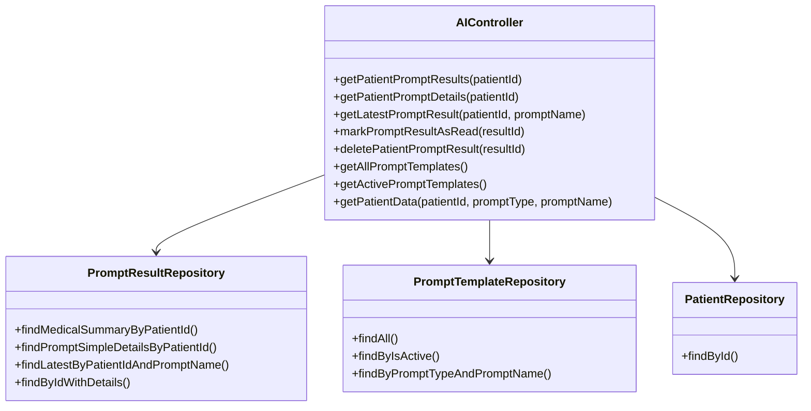
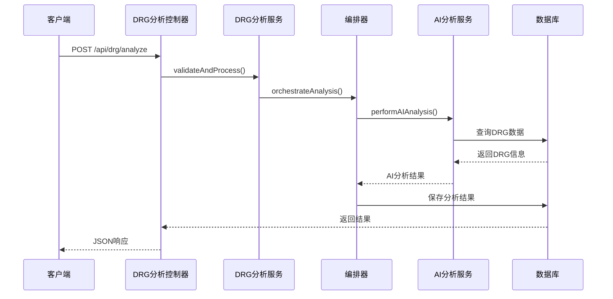
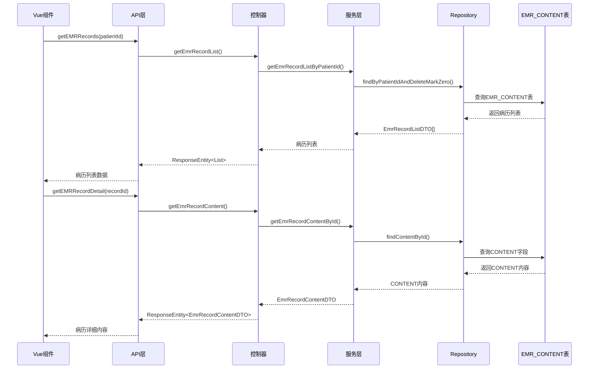
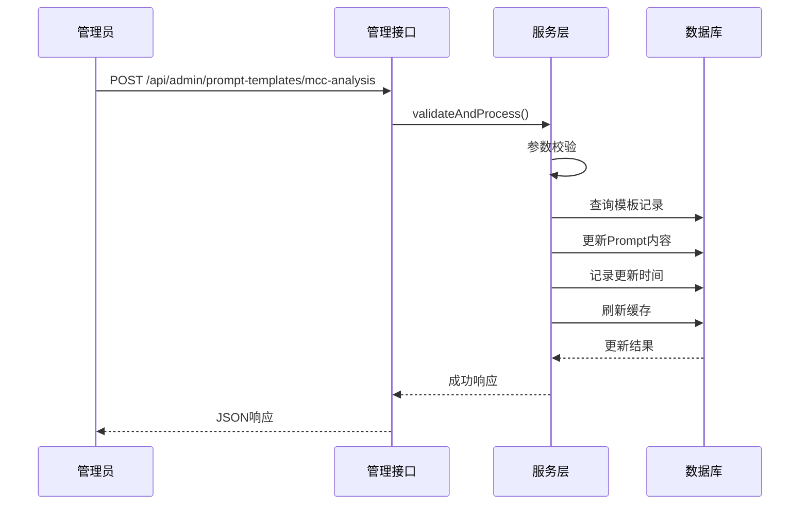
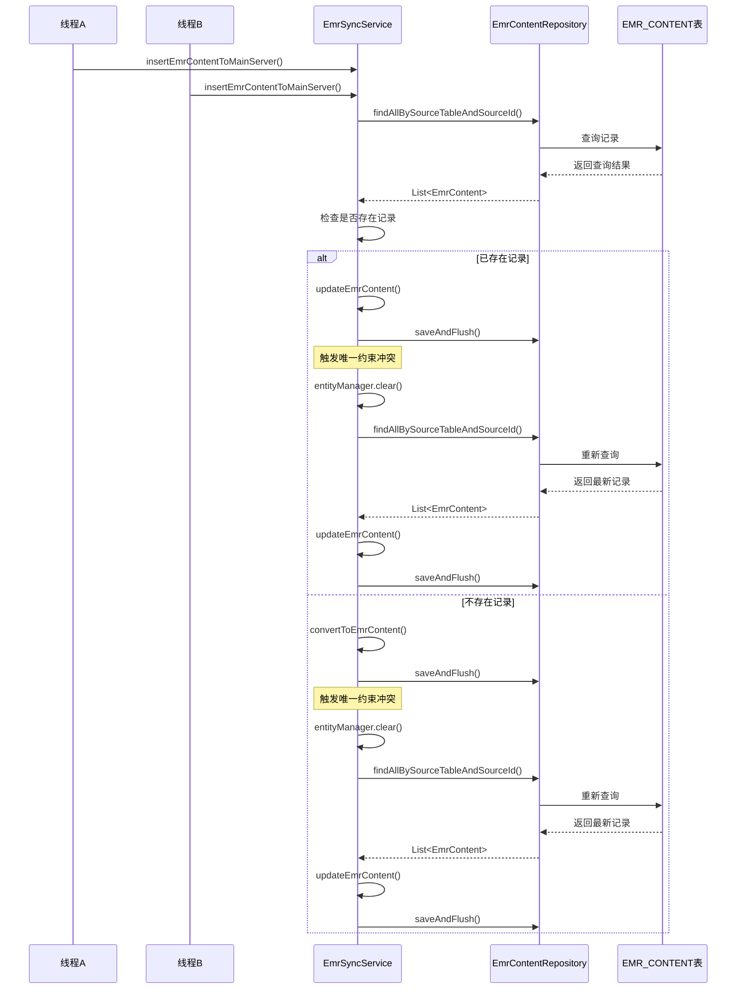
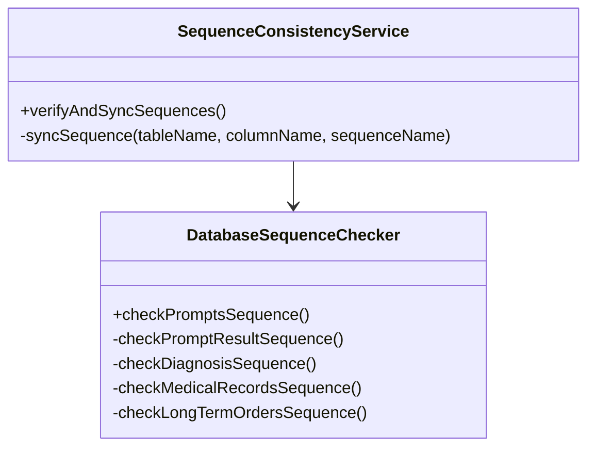
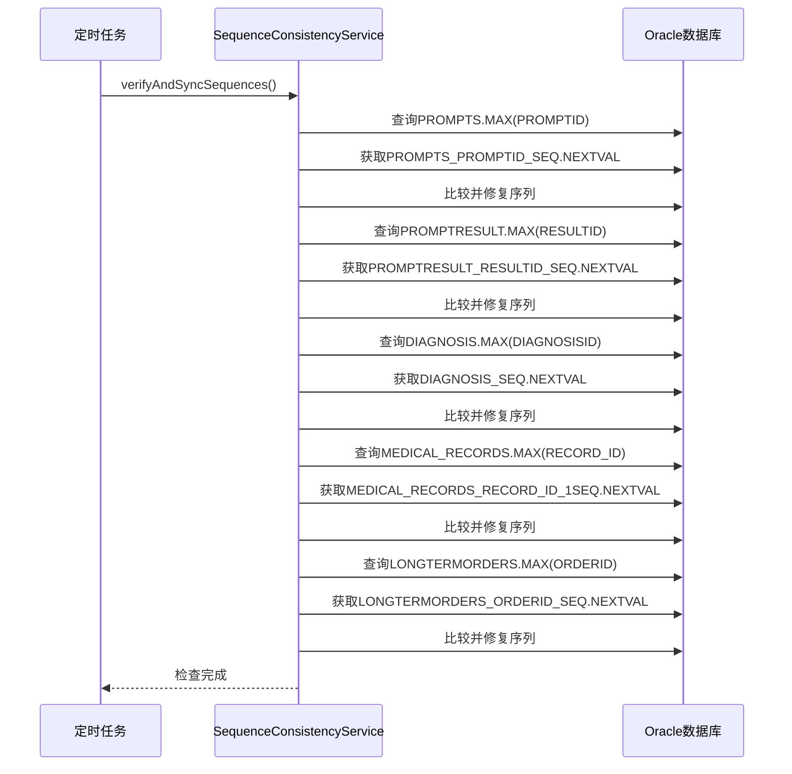
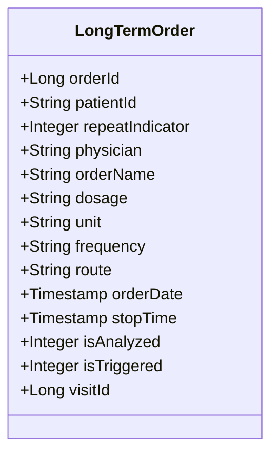
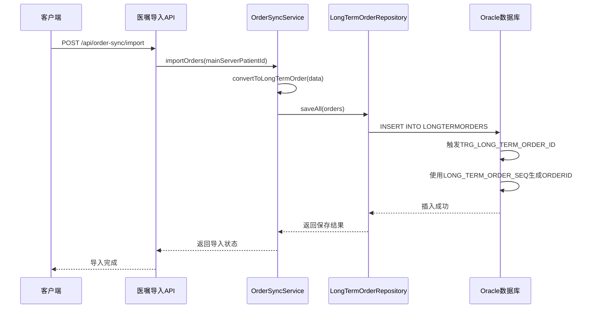
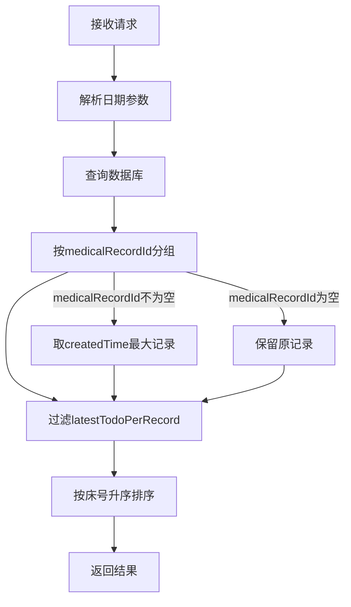

# 更新摘要

<cite>
**本文档引用的文件**
- [AIResults.vue](file://med_ai_assistant_1.0_bs_vue/src/components/ai/AIResults.vue)
- [PatientSummary.vue](file://med_ai_assistant_1.0_bs_vue/src/components/patient/PatientSummary.vue)
- [insert-first-course-record-prompt-template.sql](file://med_ai_assistant_1.0_bs_backend/sql-scripts/insert-first-course-record-prompt-template.sql)
- [insert-admission-record-prompt-template.sql](file://med_ai_assistant_1.0_bs_backend/sql-scripts/insert-admission-record-prompt-template.sql)
- [ExecutionServerController.java](file://med_ai_assistant_1.0_bs_backend/src/main/java/com/example/medaiassistant/controller/ExecutionServerController.java)
- [PromptService.java](file://med_ai_assistant_1.0_bs_backend/src/main/java/com/example/medaiassistant/service/PromptService.java)
- [TodoView.vue](file://med_ai_assistant_1.0_bs_vue/src/views/TodoView.vue)
- [patient.js](file://med_ai_assistant_1.0_bs_vue/src/api/patient.js)
- [待办事项接口.md](file://med_ai_assistant_1.0_bs_backend/doc/接口/病历记录/待办事项接口.md)
- [2026-04-10.md](file://med_ai_assistant_1.0_bs_backend/doc/更新日志/2026-04-10.md)
</cite>

## 更新摘要
**所做更改**
- 新增剪贴板API降级机制章节，详细介绍现代Clipboard API与document.execCommand降级方案
- 增强PatientSummary组件功能，新增住院时长统计、Markdown颜色标识系统、待办事项列表展示
- 新增Oracle SQL脚本模板章节，包含首次病程记录和入院记录Prompt模板
- 修复生产环境systemPrompt读取问题，改进执行服务器和主服务器的系统prompt加载机制
- 改进诊断数据查询逻辑，优化待办事项接口的去重过滤和排序机制

## 目录
1. [项目概述](#项目概述)
2. [核心架构](#核心架构)
3. [数据库配置](#数据库配置)
4. [AI服务功能](#ai服务功能)
5. [DRG分析系统](#drg分析系统)
6. [EMR病历内容显示](#emr病历内容显示)
7. [患者画像功能增强](#患者画像功能增强)
8. [页面布局重构](#页面布局重构)
9. [配置管理](#配置管理)
10. [性能优化](#性能优化)
11. [监控与告警](#监控与告警)
12. [部署配置](#部署配置)
13. [诊断分析Prompt模板优化](#诊断分析prompt模板优化)
14. [MCC分析Prompt模板优化](#mcc分析prompt模板优化)
15. [EMR病历内容同步机制](#emr病历内容同步机制)
16. [JPA批处理优化](#jpa批处理优化)
17. [唯一约束冲突修复](#唯一约束冲突修复)
18. [EMR_CONTENT表脏数据清理](#emr_content表脏数据清理)
19. [JSON字段名大小写对齐修复](#json字段名大小写对齐修复)
20. [EMR记录选择错误调试增强](#emr记录选择错误调试增强)
21. [前端调试能力增强](#前端调试能力增强)
22. [API文档增强](#api文档增强)
23. [知识库文档系统更新](#知识库文档系统更新)
24. [日志查看接口增强](#日志查看接口增强)
25. [Thinking标签折叠功能](#thinking标签折叠功能)
26. [DOMPurify安全过滤集成](#dompurify安全过滤集成)
27. [marked Markdown解析实现](#marked-markdown解析实现)
28. [全局toggleThinking函数管理](#全局togglethinking函数管理)
29. [thinking折叠块样式系统](#thinking折叠块样式系统)
30. [LONGTERMORDERS表ORA-00001主键冲突修复](#longtermorders表ora-00001主键冲突修复)
31. [序列一致性检查服务增强](#序列一致性检查服务增强)
32. [Oracle序列自动修复机制](#oracle序列自动修复机制)
33. [长期医嘱导入功能修复](#长期医嘱导入功能修复)
34. [数据一致性保障机制完善](#数据一致性保障机制完善)
35. [剪贴板API降级机制](#剪贴板api降级机制)
36. [PatientSummary组件功能增强](#patientsummary组件功能增强)
37. [Oracle SQL脚本模板](#oracle-sql脚本模板)
38. [systemPrompt读取问题修复](#systemprompt读取问题修复)
39. [诊断数据查询逻辑改进](#诊断数据查询逻辑改进)
40. [经验教训与预防措施](#经验教训与预防措施)
41. [总结](#总结)

## 项目概述

MedAiAssistant是一个基于Spring Boot的医疗AI辅助系统，采用前后端分离架构，包含主服务器和执行服务器两个核心组件。该项目专注于为医疗机构提供智能化的AI辅助诊断和数据分析服务。

### 技术栈概览

系统采用现代化的技术栈构建：

- **后端框架**: Spring Boot 3.5.8 + Spring WebFlux + Spring Data JPA
- **数据库**: Oracle 11g/19c + H2 (测试)
- **AI集成**: DashScope SDK (阿里云百炼)
- **实时通信**: WebSocket + Reactor + SSE (Server-Sent Events)
- **监控**: Micrometer + Prometheus + Actuator
- **构建工具**: Maven 3.9 + JDK 21

**章节来源**
- [pom.xml:1-309](file://med_ai_assistant_1.0_bs_backend/pom.xml#L1-L309)
- [MedAiAssistantBackendApplication.java:1-50](file://med_ai_assistant_1.0_bs_backend/src/main/java/com/example/medaiassistant/MedAiAssistantBackendApplication.java#L1-L50)

## 核心架构

### 整体架构设计

```mermaid
graph TB
subgraph "前端层"
Vue[Vue.js 前端应用]
ENDPOINT[API端点]
EMR[EMR病历组件]
ORDERS[医嘱用药组件]
LAB[实验室检验组件]
LOGVIEW[日志查看组件]
AIRESULTS[AI结果组件]
PATIENTSUMMARY[病情小结组件]
TODOVIEW[待办事项组件]
END
subgraph "主服务器"
API[REST API 控制器]
AI[AI 服务层]
DRG[DRG 分析服务]
HOSP[医院配置服务]
SYNC[数据同步服务]
EMR_SYNC[EMR同步服务]
LOG_VIEW[日志查看服务]
ORDER_SYNC[医嘱同步服务]
SEQ_CHECK[序列检查服务]
PROMPT[系统prompt服务]
END
subgraph "执行服务器"
EXEC[执行引擎]
LLM[LLM 调用]
POLL[轮询服务]
END
subgraph "数据层"
ORACLE[Oracle 数据库]
H2[H2 数据库]
CACHE[缓存层]
EMR_TABLE[EMR_CONTENT表]
LONGTERMORDERS[LONGTERMORDERS表]
PROMPT_TEMPLATE[PROMPTTEMPLATE表]
TODO_TABLE[TODO_ITEM表]
END
Vue --> API
API --> AI
API --> DRG
API --> HOSP
API --> SYNC
API --> EMR_SYNC
API --> LOG_VIEW
API --> ORDER_SYNC
API --> SEQ_CHECK
API --> PROMPT
ORDER_SYNC --> LONGTERMORDERS
SEQ_CHECK --> ORACLE
PROMPT --> PROMPT_TEMPLATE
TODOVIEW --> TODO_TABLE
AI --> EXEC
EXEC --> LLM
EXEC --> POLL
API --> ORACLE
EMR --> ENDPOINT
ORDERS --> ENDPOINT
LAB --> ENDPOINT
LOGVIEW --> LOG_VIEW
AIRESULTS --> ENDPOINT
PATIENTSUMMARY --> ENDPOINT
```

**图表来源**
- [MedAiAssistantBackendApplication.java:26-37](file://med_ai_assistant_1.0_bs_backend/src/main/java/com/example/medaiassistant/MedAiAssistantBackendApplication.java#L26-L37)
- [AIController.java:80-96](file://med_ai_assistant_1.0_bs_backend/src/main/java/com/example/medaiassistant/controller/AIController.java#L80-L96)

### 服务层次结构

系统采用清晰的分层架构：

1. **表现层**: RESTful API 控制器
2. **业务层**: 服务类和业务逻辑
3. **数据访问层**: Repository 和 JPA 实体
4. **配置层**: YAML 配置文件和属性配置

**章节来源**
- [AIController.java:128-166](file://med_ai_assistant_1.0_bs_backend/src/main/java/com/example/medaiassistant/controller/AIController.java#L128-L166)

## 数据库配置

### Oracle 数据库配置

系统采用动态Oracle数据库配置，支持多环境部署：

```mermaid
flowchart TD
START[应用启动] --> LOAD[加载配置文件]
LOAD --> SELECT{选择服务器}
SELECT --> |local| LOCAL[本地服务器配置]
SELECT --> |internal| INTERNAL[内网服务器配置]
LOCAL --> LOCAL_URL[jdbc:oracle:thin:@127.0.0.1:1521/FREE]
INTERNAL --> INT_URL[jdbc:oracle:thin:@10.120.11.18:1521/orcl]
LOCAL_URL --> HIKARI[连接池配置]
INT_URL --> HIKARI
HIKARI --> VALIDATE[连接验证]
VALIDATE --> READY[数据库就绪]
```

**图表来源**
- [application.properties:14-58](file://med_ai_assistant_1.0_bs_backend/src/main/resources/application.properties#L14-L58)

### 连接池优化配置

系统针对Oracle数据库进行了专门的连接池优化：

- **最大连接数**: 15
- **最小空闲连接**: 3  
- **连接超时**: 10秒
- **空闲超时**: 240秒
- **连接生命周期**: 1800秒
- **泄漏检测阈值**: 30秒

**章节来源**
- [application.properties:40-58](file://med_ai_assistant_1.0_bs_backend/src/main/resources/application.properties#L40-L58)

## AI服务功能

### AI控制器架构

AI控制器提供了完整的AI服务接口：



**图表来源**
- [AIController.java:128-166](file://med_ai_assistant_1.0_bs_backend/src/main/java/com/example/medaiassistant/controller/AIController.java#L128-L166)

### 患者数据获取优化

2026年2月14日进行了重大架构优化，消除了HTTP自调用，改为直接数据库查询：

- **优化前**: WebFlux与RestTemplate混用导致线程池死锁
- **优化后**: 直接Repository查询，响应时间从5-30秒降至0.5-2秒
- **问题解决**: 生产环境间歇性超时问题

**章节来源**
- [AIController.java:571-660](file://med_ai_assistant_1.0_bs_backend/src/main/java/com/example/medaiassistant/controller/AIController.java#L571-L660)

## DRG分析系统

### 系统架构



**图表来源**
- [DRG分析API接口.md:391-455](file://med_ai_assistant_1.0_bs_backend/doc/系统结构/DRG分析/DRG分析API接口.md#L391-L455)

### 核心组件

系统包含以下核心组件：

1. **DRG分析编排器 (DrgAnalysisOrchestrator)**: 完整的DRG分析流程编排
2. **DRG AI分析服务 (DrgAiAnalysisService)**: AI驱动的MCC影响分析
3. **DRG分析服务 (DrgAnalysisService)**: 基础DRG匹配算法
4. **DRG盈亏计算服务 (DrgProfitLossService)**: 保险支付与实际费用对比

**章节来源**
- [阶段2-DRG分析功能完成验证.md:8-41](file://med_ai_assistant_1.0_bs_backend/doc/其他/阶段2-DRG分析功能完成验证.md#L8-L41)

## EMR病历内容显示

### 病历内容查询机制

系统实现了完整的EMR病历内容查询和显示功能：



**图表来源**
- [EMR病历内容查询接口.md:19-48](file://med_ai_assistant_1.0_bs_backend/doc/接口/病历记录/EMR病历内容查询接口.md#L19-L48)

### 病历内容显示特性

系统提供了丰富的病历内容显示功能：

- **列表展示**: 显示病历的基本信息（记录ID、文档类型名称、文档标题时间）
- **详细内容**: 支持点击查看病历完整内容
- **软删除过滤**: 自动过滤已删除的病历记录
- **字段名对齐**: 修复JSON字段名大小写问题，确保前后端数据兼容

**章节来源**
- [EMR病历内容查询接口.md:103-119](file://med_ai_assistant_1.0_bs_backend/doc/接口/病历记录/EMR病历内容查询接口.md#L103-L119)

## 患者画像功能增强

### 医嘱用药模块

患者画像功能新增了完整的医嘱用药模块，支持长期医嘱和临时医嘱的分类管理：

```mermaid
graph TB
subgraph "医嘱用药模块"
TAB[主Tabs容器]
SUB_HEADER[子分类切换栏]
LONG_TERM[长期医嘱面板]
TEMPORARY[临时医嘱面板]
TABLE[表格展示]
STATUS[状态管理]
BADGE[数量徽章]
END
TAB --> SUB_HEADER
SUB_HEADER --> LONG_TERM
SUB_HEADER --> TEMPORARY
LONG_TERM --> TABLE
TEMPORARY --> TABLE
TABLE --> STATUS
SUB_HEADER --> BADGE
```

**图表来源**
- [PatientProfileView.vue:138-237](file://med_ai_assistant_1.0_bs_vue/src/views/PatientProfileView.vue#L138-L237)

#### 功能特性

- **分类切换**: 使用radio-group实现长期/临时医嘱的快速切换
- **状态显示**: 执行中和已停止状态的可视化区分
- **数据加载**: 支持并行加载长期和临时医嘱数据
- **数量统计**: 实时显示各类医嘱的数量信息

**章节来源**
- [PatientProfileView.vue:337-363](file://med_ai_assistant_1.0_bs_vue/src/views/PatientProfileView.vue#L337-L363)

### 实验室检验结果Tab

新增了专门的实验室检验结果Tab，提供完整的检验数据管理和分析功能：

```mermaid
graph TB
subgraph "检验结果Tab"
FILTER[检验类型过滤器]
TABLE[检验结果表格]
ABNORMAL[异常值高亮]
STATUS[状态标签]
TIME[报告时间]
TYPE[检验类型]
END
FILTER --> TABLE
TABLE --> ABNORMAL
TABLE --> STATUS
TABLE --> TIME
TABLE --> TYPE
```

**图表来源**
- [PatientProfileView.vue:239-311](file://med_ai_assistant_1.0_bs_vue/src/views/PatientProfileView.vue#L239-L311)

#### 核心功能

- **类型过滤**: 支持按检验类型进行数据筛选
- **异常标识**: 高亮显示异常检验结果（偏高/偏低/正常）
- **排序规则**: 按异常程度和报告时间进行智能排序
- **完整数据**: 提供全量检验结果的详细展示

**章节来源**
- [PatientProfileView.vue:597-624](file://med_ai_assistant_1.0_bs_vue/src/views/PatientProfileView.vue#L597-L624)

### 诊疗时间线

保留了原有的诊疗时间线功能，整合了多种医疗事件的统一展示：

- **事件类型**: 入院、出院、诊断、手术、检查、化验、病历
- **时间排序**: 按时间倒序排列，最新事件优先显示
- **状态标识**: 不同类型的事件使用不同的颜色和标签
- **数据来源**: 诊断、手术来自存储，检查、化验、病历来自API

**章节来源**
- [PatientProfileView.vue:445-555](file://med_ai_assistant_1.0_bs_vue/src/views/PatientProfileView.vue#L445-L555)

## 页面布局重构

### 患者视图架构

系统采用了新的页面布局架构，优化了用户体验和数据加载效率：

```mermaid
graph TB
subgraph "PatientView布局"
LIST[左侧病人列表]
TABS[右侧标签页]
COMPONENT[组件化设计]
PERFORMANCE[性能优化]
SMALL_SCREEN[移动端适配]
END
LIST --> COMPONENT
TABS --> COMPONENT
COMPONENT --> PERFORMANCE
COMPONENT --> SMALL_SCREEN
```

**图表来源**
- [PatientView.vue:1-64](file://med_ai_assistant_1.0_bs_vue/src/views/PatientView.vue#L1-L64)

#### 架构改进

- **组件分离**: 左右布局分离，提升页面加载速度
- **异步加载**: 病人选择后异步加载相关数据
- **状态管理**: 使用Vuex集中管理病人状态
- **移动端优化**: 支持小屏幕设备的自适应布局

**章节来源**
- [PatientView.vue:19-53](file://med_ai_assistant_1.0_bs_vue/src/views/PatientView.vue#L19-L53)

### 数据加载优化

重构后的数据加载机制显著提升了系统性能：

- **并行加载**: 多个数据源同时加载，减少等待时间
- **缓存策略**: 合理利用浏览器缓存和组件缓存
- **错误处理**: 完善的异常处理和降级策略
- **性能监控**: 集成性能计时和日志记录

**章节来源**
- [PatientProfileView.vue:658-691](file://med_ai_assistant_1.0_bs_vue/src/views/PatientProfileView.vue#L658-L691)

## 配置管理

### 医院配置系统

系统采用YAML配置文件管理多医院配置：

```mermaid
flowchart LR
subgraph "配置文件"
HOSPITAL_LOCAL[hospital-Local.yaml]
HOSPITAL_CDWYY[cdwyy.yaml]
HOSPITAL_TESTSERVER[testserver.yaml]
END
subgraph "配置服务"
HCS[HospitalConfigService]
CACHE[配置缓存]
WATCH[文件监听]
END
subgraph "运行时"
ACTIVE[活动配置]
VALID[配置验证]
END
HOSPITAL_LOCAL --> HCS
HOSPITAL_CDWYY --> HCS
HOSPITAL_TESTSERVER --> HCS
HCS --> CACHE
HCS --> WATCH
CACHE --> ACTIVE
ACTIVE --> VALID
```

**图表来源**
- [HospitalConfigService.java:25-59](file://med_ai_assistant_1.0_bs_backend/src/main/java/com/example/medaiassistant/hospital/service/HospitalConfigService.java#L25-L59)

### 配置文件结构

每个医院配置文件包含以下关键信息：

- **基础信息**: 医院ID、名称、集成类型
- **HIS/LIS连接**: 数据库URL、用户名、密码、表前缀
- **同步配置**: Cron表达式、启用状态、重试次数
- **字段映射**: 患者ID、姓名、性别等字段映射关系
- **SQL模板**: 基础路径和覆盖模板列表

**章节来源**
- [hospital-Local.yaml:1-38](file://med_ai_assistant_1.0_bs_backend/config/hospitals/hospital-Local.yaml#L1-L38)

## 性能优化

### 连接池优化

系统针对Oracle数据库连接进行了全面优化：

```mermaid
graph TB
subgraph "连接池配置"
MAX[最大连接数: 15]
MIN[最小空闲: 3]
TIMEOUT[连接超时: 10s]
IDLE[空闲超时: 240s]
LIFE[连接生命周期: 1800s]
END
subgraph "网络优化"
READ[读超时: 60s]
CONNECT[连接超时: 30s]
THREAD[线程本地缓冲]
EARLY[早期通知]
END
subgraph "监控配置"
LEAK[泄漏检测: 30s]
TEST[测试查询: SELECT 1 FROM DUAL]
INIT[初始化SQL: NLS_DATE_FORMAT]
END
```

**图表来源**
- [application.properties:40-58](file://med_ai_assistant_1.0_bs_backend/src/main/resources/application.properties#L40-L58)

### 线程池配置

系统配置了多个专用线程池：

- **Prompt生成线程池**: 核心5，最大8，队列100
- **手术分析线程池**: 核心5，最大8，队列100  
- **通用执行器**: 核心10，最大20，队列200

**章节来源**
- [application.properties:153-169](file://med_ai_assistant_1.0_bs_backend/src/main/resources/application.properties#L153-L169)

## 监控与告警

### 监控系统架构

```mermaid
graph TB
subgraph "监控组件"
METRICS[Micrometer 指标]
PROM[Prometheus 导出器]
ACT[Actuator 端点]
LOG[日志监控]
END
subgraph "告警规则"
SYS[系统监控]
BUS[业务指标]
THRESH[阈值配置]
EMAIL[邮件告警]
END
subgraph "可视化"
GRAFANA[Grafana 仪表板]
ALERT[Alertmanager]
END
METRICS --> PROM
PROM --> GRAFANA
ACT --> GRAFANA
LOG --> GRAFANA
SYS --> THRESH
BUS --> THRESH
THRESH --> EMAIL
EMAIL --> ALERT
```

**图表来源**
- [application.properties:232-257](file://med_ai_assistant_1.0_bs_backend/src/main/resources/application.properties#L232-L257)

### 告警配置

系统支持多维度监控告警：

- **系统健康**: 磁盘使用率90%+，线程数500+，响应时间5000ms+
- **业务指标**: 吞吐量、成功率、可用性阈值
- **告警抑制**: 5-10分钟内重复告警抑制
- **邮件通知**: 可配置的告警接收者

**章节来源**
- [application.properties:232-250](file://med_ai_assistant_1.0_bs_backend/src/main/resources/application.properties#L232-L250)

## 部署配置

### 多环境部署

系统支持多种部署模式：

```mermaid
graph LR
subgraph "开发环境"
DEV[Windows 开发]
LOCAL[本地Oracle]
DEBUG[调试模式]
END
subgraph "测试环境"
TEST[测试服务器]
TEST_DB[TestServer Oracle]
MONITOR[监控配置]
END
subgraph "生产环境"
PROD[Linux 生产]
MAIN[主服务器]
EXEC[执行服务器]
BACKUP[备份配置]
END
```

### 部署脚本

系统提供完整的自动化部署脚本：

- **主服务器部署**: `auto-deploy-backend.sh`
- **前端部署**: `auto-deploy-frontend.sh`  
- **执行服务器**: `deploy-execution-server.bat`
- **诊断脚本**: `diagnose-main-server.sh`

**章节来源**
- [application.properties:127-134](file://med_ai_assistant_1.0_bs_backend/src/main/resources/application.properties#L127-L134)

## 诊断分析Prompt模板优化

### 新增规则类别

2026年4月9日对诊断分析Prompt模板进行了重大优化，新增了4个重要的规则类别：

#### 诊断命名规范

- **具体诊断优先**: 诊断名称必须使用最具体的临床诊断术语，禁止使用笼统的上位概念
- **分型/分期标注**: 编码后需标注疾病分型/分期
- **器官多病变分离**: 同一器官/系统存在多个独立病变时，每个病变必须单独列为一条诊断
- **排序规则**: 主要诊断优先、急危重症优先、并发症优先于基础疾病

#### "待查"标注规则

- **严格标注条件**: 仅当诊断依据不充分、需要进一步检查才能确认时，才在诊断名称中标注"待查"
- **充分依据不标注**: 当已有充分客观依据支持诊断成立时，诊断名称中不加"待查"
- **补充说明**: 可在补充说明中注明待完善的检查

#### 心律失常拆分规则

- **独立诊断原则**: 每种独立的心律失常必须单独列为一条诊断
- **禁止合并诊断**: 禁止将多种心律失常合并为"心律失常"或"动态心电图提示心律失常"等笼统诊断
- **具体类型优先**: 如"偶发室性早搏"、"偶发房性早搏"、"短阵房性心动过速"应分别列出

#### 随机血糖判读规范

- **随机血糖标准**: 当无法确认血糖为空腹采集时，一律按随机血糖标准判读
- **严格诊断标准**: 随机血糖≥11.1 mmol/L方可考虑糖尿病诊断
- **禁止空腹标准**: 禁止在不确定采集条件的情况下按空腹血糖标准作出诊断
- **建议完善检查**: 若血糖值升高但未达到诊断标准，在"下一步建议"中提醒完善相关检查

### 模板更新内容

诊断分析模板现已包含完整的质量控制要求：

- **禁止出现**: 无客观依据的主观判断
- **必须验证**: 对矛盾数据需标注
- **数据冲突点**: 可信度评估、建议复核项目
- **特殊情况诊断**: 临床考虑、辅助检查结果满足等

**章节来源**
- [update-diagnosis-analysis-prompt-template.sql:58-125](file://med_ai_assistant_1.0_bs_backend/sql-scripts/update-diagnosis-analysis-prompt-template.sql#L58-L125)
- [diagnosis-template.json:1-47](file://med_ai_assistant_1.0_bs_backend/memory-bank/templates/prompt-templates/diagnosis-template.json#L1-L47)

## MCC分析Prompt模板优化

### 优化背景

2026年3月30日对MCC（严重并发症）分析Prompt模板进行了重大优化，解决原模板筛查过于严格的问题。

### 优化内容

#### 放宽排除标准

- **必须排除**: 与主要诊断完全相同的并发症或合并症
- **明显矛盾**: 与病人实际情况明显矛盾的诊断（如男性病人的妊娠相关并发症）
- **谨慎排除**: 与主要诊断高度相似且临床意义重复的诊断
- **保留原则**: 相关但不完全相同的诊断应保留（如冠心病与动脉硬化）

#### 明确排除原则

1. **必须排除的情况**:
   - 与主要诊断完全相同的并发症或合并症
   - 与病人实际情况明显矛盾的诊断

2. **谨慎排除的情况**:
   - 与主要诊断高度相似且临床意义重复的诊断
   - 注意：相关但不完全相同的诊断应保留

3. **保留原则**:
   - 对边界情况或相关性较高的诊断，建议保留并给出可能性评估

#### 临床指导原则

- **宁可多保留，不要漏掉**: 强调"宁可多保留，不要漏掉"的临床原则
- **关注临床相关性**: 从临床实际角度出发，判断并发症是否与患者病情存在合理的病理生理联系
- **编码提示**: 诊断名称中包含并发症或合并症列表中该诊断所属的类型

### 新增管理接口

系统新增了专门的MCC分析Prompt模板管理接口：



**图表来源**
- [MCC分析Prompt模板优化接口.md:72-79](file://med_ai_assistant_1.0_bs_backend/doc/接口/DRG分析/MCC分析Prompt模板优化接口.md#L72-L79)

**章节来源**
- [2026-03-30.md:10-51](file://med_ai_assistant_1.0_bs_backend/doc/更新日志/2026-03-30.md#L10-L51)
- [MCC分析Prompt模板优化接口.md:1-115](file://med_ai_assistant_1.0_bs_backend/doc/接口/DRG分析/MCC分析Prompt模板优化接口.md#L1-L115)

## EMR病历内容同步机制

### 并发安全设计

系统实现了完善的并发安全设计，解决了高并发场景下的TOCTOU竞态条件问题：



**图表来源**
- [EmrSyncService.java:271-364](file://med_ai_assistant_1.0_bs_backend/src/main/java/com/example/medaiassistant/hospital/service/EmrSyncService.java#L271-L364)

### 重试机制设计

系统实现了双路径重试机制，确保在高并发场景下的数据一致性：

#### UPDATE路径重试机制

当已存在记录执行`saveAndFlush()`触发唯一约束冲突时：
1. 调用`entityManager.clear()`清除Hibernate Session脏状态
2. 重新执行`findAllBySourceTableAndSourceId()`获取最新数据库状态
3. 在新对象上更新字段并重新执行`saveAndFlush()`
4. 若重试仍失败则跳过当前记录并记录warn日志

#### INSERT路径重试机制

当查询结果为空执行INSERT触发唯一约束冲突时（典型并发竞争场景）：
1. 调用`entityManager.clear()`清除Hibernate Session脏状态
2. 重新查询获取由并发线程已INSERT的记录
3. 降级为UPDATE操作执行`saveAndFlush()`
4. 若重试仍失败则跳过当前记录并记录warn日志

**章节来源**
- [EmrSyncService.java:239-266](file://med_ai_assistant_1.0_bs_backend/src/main/java/com/example/medaiassistant/hospital/service/EmrSyncService.java#L239-L266)
- [EmrSyncService.java:295-352](file://med_ai_assistant_1.0_bs_backend/src/main/java/com/example/medaiassistant/hospital/service/EmrSyncService.java#L295-L352)

## JPA批处理优化

### saveAndFlush替代save

系统将所有`save()`方法替换为`saveAndFlush()`，解决了JPA批处理延迟执行导致的问题：

#### 问题分析

原始使用`save()`会导致：
- JPA将SQL延迟到批量flush阶段执行
- 多条UPDATE语句并发提交时相互冲突
- 异常堆栈指向错误位置，难以定位问题

#### 解决方案

将所有`save()`替换为`saveAndFlush()`：
- 每条记录立即提交SQL
- 异常精准对应当前记录，便于调试和重试
- 避免批处理延迟执行导致的并发冲突

**章节来源**
- [EmrSyncService.java:247-251](file://med_ai_assistant_1.0_bs_backend/src/main/java/com/example/medaiassistant/hospital/service/EmrSyncService.java#L247-L251)
- [2026-04-09.md:60-63](file://med_ai_assistant_1.0_bs_backend/doc/更新日志/2026-04-09.md#L60-L63)

## 唯一约束冲突修复

### ORA-00001问题根因分析

系统在UPDATE操作时触发IDX_EMR_CONTENT_SOURCE唯一约束冲突，根因为：

1. **JPA批处理延迟执行**: 多条UPDATE语句并发提交时相互冲突
2. **TOCTOU竞态条件**: 查询到记录不存在后，另一线程可能先完成INSERT
3. **异常定位困难**: 批处理延迟导致异常堆栈指向错误位置

### 修复方案

#### 1. JPA批处理冲突修复

- 将所有`save()`替换为`saveAndFlush()`
- 使每条记录立即提交SQL，异常精准对应当前记录

#### 2. 并发安全设计

- 使用返回List的查询方法`findAllBySourceTableAndSourceId()`
- 在`DataIntegrityViolationException`触发时捕获并执行重试
- 确保并发场景下数据一致性

#### 3. Hibernate Session管理

- 在重试前调用`entityManager.clear()`清除脏状态
- 避免游离态对象污染，确保查询获取最新状态

**章节来源**
- [EmrSyncService.java:239-251](file://med_ai_assistant_1.0_bs_backend/src/main/java/com/example/medaiassistant/hospital/service/EmrSyncService.java#L239-L251)
- [2026-04-09.md:58-65](file://med_ai_assistant_1.0_bs_backend/doc/更新日志/2026-04-09.md#L58-L65)

## EMR_CONTENT表脏数据清理

### 脏数据诊断

系统诊断发现EMR_CONTENT表存在4条SOURCE_TABLE和SOURCE_ID均为NULL的脏数据：

```sql
-- 诊断SQL
SELECT COUNT(*) FROM EMR_CONTENT 
WHERE SOURCE_TABLE IS NULL AND SOURCE_ID IS NULL;

-- 脏数据详情查询
SELECT ID, SOURCE_TABLE, SOURCE_ID, PATIENT_ID, CONTENT_LENGTH 
FROM EMR_CONTENT 
WHERE SOURCE_TABLE IS NULL AND SOURCE_ID IS NULL;
```

### 清理方案

针对这4条脏数据，系统提供了诊断SQL和清理SQL脚本：

```sql
-- 清理SQL（示例）
DELETE FROM EMR_CONTENT 
WHERE SOURCE_TABLE IS NULL AND SOURCE_ID IS NULL 
AND ID IN (/* 具体ID列表 */);

-- 验证清理结果
SELECT COUNT(*) FROM EMR_CONTENT 
WHERE SOURCE_TABLE IS NULL AND SOURCE_ID IS NULL;
```

### 预防措施

为防止类似问题再次发生，系统增加了：
- 数据有效性验证（SOURCE_ID必须非空）
- 删除标记过滤（DELETEMARK != 0的记录被过滤）
- 事务回滚机制确保数据一致性

**章节来源**
- [2026-04-09.md:67-70](file://med_ai_assistant_1.0_bs_backend/doc/更新日志/2026-04-09.md#L67-L70)
- [EmrSyncService.java:441-462](file://med_ai_assistant_1.0_bs_backend/src/main/java/com/example/medaiassistant/hospital/service/EmrSyncService.java#L441-L462)

## JSON字段名大小写对齐修复

### 问题描述

2026年4月9日发现EMR病历内容显示为空的问题，根因为JSON字段名大小写不匹配：

- `EmrRecordListDTO`的ID字段（大写）序列化后为`ID`，前端使用`row.id`（小写）读取为undefined
- `EmrRecordContentDTO`的CONTENT字段（大写）序列化后为`CONTENT`，前端使用`response.data.content`（小写）读取为undefined
- 开发环境可能因Jackson全局配置（大小写不敏感）而正常工作，生产环境严格匹配导致失败

### 修复方案

为解决字段名大小写不匹配问题，系统为相关DTO类添加了@JsonProperty注解：

#### EmrRecordListDTO修复

- `@JsonProperty("id")`: 将ID序列化为小写id，与前端row.id对齐
- `@JsonProperty("doc_TYPE_NAME")`: 保持原有大小写，与前端prop属性对齐
- `@JsonProperty("doc_TITLE_TIME")`: 保持原有大小写，与前端row.doc_TITLE_TIME对齐

#### EmrRecordContentDTO修复

- `@JsonProperty("content")`: 将CONTENT序列化为小写content，与前端response.data.content对齐

### 影响范围

- 仅影响JSON序列化输出，不改变数据库查询逻辑
- 向下兼容，前端无需修改
- 修复后生产环境可正常显示EMR病历内容

**章节来源**
- [2026-04-09.md:10-40](file://med_ai_assistant_1.0_bs_backend/doc/更新日志/2026-04-09.md#L10-L40)

## EMR记录选择错误调试增强

### 错误日志记录增强

2026年4月9日新增了EMR记录选择错误调试信息增强功能，全面提升问题诊断能力：

#### 后端服务层增强

**EmrRecordService.java增强内容**：
- 添加详细的日志记录，包括请求开始时间、记录ID、耗时
- 成功时记录内容长度和耗时
- 记录不存在时记录警告日志
- 异常时记录完整错误信息：错误类型、错误消息、堆栈跟踪、耗时
- 新增 `getStackTrace()` 辅助方法，将异常堆栈转换为字符串

#### 后端控制器层增强

**MedicalRecordController.java增强内容**：
- 添加 `Logger` 实例定义
- 记录请求开始时间和操作时间戳
- 空记录ID时记录警告日志
- 成功响应时记录内容长度和耗时
- 异常时记录完整错误信息并返回空内容（保持向后兼容）

#### 前端组件增强

**MedicalRecords.vue增强内容**：
- 增强 `handleEMRRecordClick` 方法的错误调试信息
- 记录开始时间、记录ID、患者ID、文档类型
- API调用耗时和响应状态
- 成功获取时的内容长度
- 详细的错误对象：错误类型、错误消息、完整堆栈跟踪、时间戳、操作耗时
- 区分网络错误类型（服务器响应错误 vs 网络请求错误）
- 用户友好的错误提示（包含记录ID）

### 调试日志格式

- **后端日志前缀**：`[EMR记录详情]`
- **前端日志前缀**：`[EMR记录详情]`
- **包含上下文**：recordId、patientId、docType、耗时、时间戳
- **错误日志使用**：`console.error` 并标记 `❌` 符号

### 影响范围

- 仅增强日志记录，不改变业务逻辑
- 异常时仍返回空内容而非500错误，确保系统稳定性
- 向下兼容，前端无需修改

**章节来源**
- [2026-04-09.md:81-125](file://med_ai_assistant_1.0_bs_backend/doc/更新日志/2026-04-09.md#L81-L125)
- [EMR病历内容查询接口.md:79-84](file://med_ai_assistant_1.0_bs_backend/doc/接口/病历记录/EMR病历内容查询接口.md#L79-L84)

## 前端调试能力增强

### 用户友好错误提示

前端组件增强了错误处理和用户提示功能：

#### 错误类型区分

- **服务器响应错误**（error.response）：记录状态码和响应数据
- **网络请求错误**（error.request）：记录未收到响应的情况

#### 详细错误对象

- **错误类型**（error.constructor.name）
- **错误消息**
- **完整堆栈跟踪**
- **时间戳**（ISO 8601格式）
- **操作耗时**（毫秒）

#### 成功状态记录

- **开始时间**：记录API调用开始时间
- **记录ID**：包含被点击的病历记录ID
- **患者ID**：关联的患者标识
- **文档类型**：病历文档的具体类型
- **API调用耗时**：完整的请求响应时间
- **响应状态**：HTTP状态码
- **成功获取时的内容长度**：验证数据完整性

### 调试日志格式

- **日志前缀**：`[EMR记录详情]`
- **包含上下文**：recordId、patientId、docType、耗时、时间戳
- **错误日志使用**：`console.error` 并标记 `❌` 符号

### 影响范围

- 仅增强日志记录，不改变业务逻辑
- 用户提示更加友好，包含记录ID便于定位问题

**章节来源**
- [2026-04-09.md:102-109](file://med_ai_assistant_1.0_bs_vue/docs/更新日志/2026-04-09.md#L102-L109)

## API文档增强

### SSE流式传输能力

系统新增了强大的SSE（Server-Sent Events）流式传输能力，为AI服务和日志查看提供了实时数据推送功能：

#### AI服务流式响应

**流式AI响应服务** (`/api/ai/stream-response-post`)：
- **实现技术**：使用Spring的SseEmitter实现服务器发送事件(SSE)
- **响应格式**：`text/event-stream`，数据以事件流形式分块传输
- **数据格式**：每个数据块格式为 `"data: {json}\n\n"`
- **错误处理**：错误时发送error事件，传输完成后发送完成事件
- **心跳机制**：10秒心跳保持连接活跃
- **超时设置**：30秒超时设置

#### 日志查看流式传输

**SSE实时日志推流** (`/api/logs/stream`)：
- **实现技术**：基于SseEmitter的实时日志推送
- **响应格式**：`text/event-stream`，每条日志以 `event: log` 事件名推送
- **数据格式**：`{"line": "..."}` JSON格式
- **连接管理**：超时30分钟后自动关闭
- **关键字过滤**：支持按关键字过滤日志内容

### 流式响应特点

#### AI服务流式响应特点：

- **实时返回**：AI生成内容实时返回，适合需要即时显示的场景
- **共享逻辑**：与/response接口共享相同的请求参数和错误处理逻辑
- **异步处理**：使用CompletableFuture异步处理请求
- **连接监控**：完善的连接状态监控（完成/超时）

#### 日志服务流式响应特点：

- **增量推送**：每次文件增量变化时推送新日志行
- **后台守护**：在后台守护线程中执行日志检测
- **文件监控**：每1秒检测文件长度变化
- **内存保护**：最多保留2000行日志，防止内存溢出

### 客户端使用示例

#### SSE客户端实现：

```javascript
// 创建SSE连接
const eventSource = new EventSource('/api/ai/stream-response-post');

// 处理流式数据
eventSource.onmessage = function(event) {
    const data = JSON.parse(event.data);
    // 处理AI响应数据
    console.log('AI响应:', data.content);
};

// 错误处理
eventSource.onerror = function(err) {
    console.error('SSE连接错误:', err);
    eventSource.close();
};
```

**章节来源**
- [API_DOCUMENTATION.md:271-326](file://med_ai_assistant_1.0_bs_backend/doc/其他/API_DOCUMENTATION.md#L271-L326)
- [LogViewerController.java:128-137](file://med_ai_assistant_1.0_bs_backend/src/main/java/com/example/medaiassistant/controller/LogViewerController.java#L128-L137)

## 知识库文档系统更新

### AI模型知识库

系统建立了完整的AI模型知识库，为AI服务提供结构化的模型信息和最佳实践：

#### 模型信息管理

**模型配置**：
- **deepseek-chat**: 深度求索聊天模型，适用于一般医疗问答和诊断辅助
- **deepseek-reasoner**: 深度求索推理模型，适用于复杂的医疗推理和分析
- **支持能力**：医疗问答、诊断建议、治疗方案推荐、药物信息查询、医学术语解释
- **限制条件**：不能替代专业医生诊断、需要验证医学准确性、可能产生幻觉信息
- **最佳实践**：提供详细的患者背景信息、验证关键医学建议、结合临床指南使用

#### Prompt模板管理

**模板类型**：
- **diagnosisAnalysis**: 基于患者信息进行诊断分析的模板
- **treatmentRecommendation**: 根据诊断推荐治疗方案的模板
- **asyncCallbackProcessing**: 处理异步回调数据的模板

#### 系统组件

**回调控制器**：
- **功能**：处理来自执行服务器的异步回调请求
- **特性**：AES加密数据解密、结构化JSON响应、多状态处理
- **端点**：receiveCallback（接收回调）、health（健康检查）

### 临床指南知识库

系统集成了权威的临床指南知识库，为医疗决策提供科学依据：

#### 指南分类

**高血压管理指南**：
- **适用条件**：原发性高血压、继发性高血压
- **关键推荐**：
  - 血压控制目标：一般患者<140/90 mmHg，糖尿病或肾病患者<130/80 mmHg
  - 首选药物：ACEI/ARB、CCB、利尿剂
  - 生活方式干预：减盐、减重、运动、限酒

**2型糖尿病管理指南**：
- **适用条件**：2型糖尿病、糖尿病前期
- **关键推荐**：
  - 血糖控制目标：HbA1c <7.0%
  - 个体化治疗：根据患者年龄、并发症调整目标
  - 综合管理：血糖、血压、血脂全面控制

**社区获得性肺炎诊疗指南**：
- **适用条件**：社区获得性肺炎、医院获得性肺炎
- **关键推荐**：
  - 经验性抗生素治疗：根据CURB-65评分选择
  - 重症肺炎识别：及时转入ICU治疗
  - 疗效评估：48-72小时评估治疗反应

### 医学术语知识库

系统维护了标准化的医学术语词典，确保医疗术语的一致性和准确性：

#### 术语分类

**心血管疾病**：
- **高血压**：动脉血压持续升高的一种疾病
- **糖尿病**：由于胰岛素分泌不足或作用障碍导致血糖升高的代谢性疾病
- **冠心病**：冠状动脉粥样硬化导致心肌缺血的心脏病

**呼吸系统疾病**：
- **肺炎**：肺部组织的炎症性疾病
- **脑卒中**：脑血管疾病导致的脑组织损伤

#### 术语管理

**标准化信息**：
- **定义**：每个术语的准确定义
- **分类**：术语所属的医学分类
- **同义词**：术语的各种表达方式
- **ICD10编码**：国际疾病分类编码

**章节来源**
- [model-knowledge-base.json:1-121](file://med_ai_assistant_1.0_bs_backend/memory-bank/knowledge-base/ai-models/model-knowledge-base.json#L1-L121)
- [clinical-guidelines.json:1-87](file://med_ai_assistant_1.0_bs_backend/memory-bank/knowledge-base/guidelines/clinical-guidelines.json#L1-L87)
- [common-medical-terms.json:1-50](file://med_ai_assistant_1.0_bs_backend/memory-bank/knowledge-base/medical-terms/common-medical-terms.json#L1-L50)

## 日志查看接口增强

### SSE实时日志推流功能

系统新增了强大的SSE（Server-Sent Events）实时日志推流功能，为系统运维和问题排查提供了实时监控能力：

#### 接口设计

**获取日志文件列表** (`GET /api/logs/files`)：
- **功能**：列举日志目录下所有 `.log` 文件的元信息
- **排序**：按最后修改时间降序排列
- **响应**：包含文件名、大小、最后修改时间的数组

**读取日志尾部内容** (`GET /api/logs/tail`)：
- **功能**：从指定日志文件末尾反向读取指定行数的内容
- **关键字过滤**：支持按关键字过滤日志内容
- **行数限制**：默认200行，最大1000行

**SSE实时日志推流** (`GET /api/logs/stream`)：
- **功能**：以Server-Sent Events方式实时推送指定日志文件的新增内容
- **响应格式**：`text/event-stream`，每条日志以 `event: log` 事件名推送
- **连接超时**：30分钟自动关闭

#### 实现细节

**文件名校验**：
- **安全性检查**：不允许 `..`、`/`、`\` 等路径穿越字符
- **后缀验证**：只允许 `.log` 后缀
- **存在性检查**：文件必须实际存在于配置的日志目录内

**日志读取优化**：
- **随机访问**：使用 `RandomAccessFile` 读取文件尾部字节块
- **缓冲策略**：估算平均每行400字节的缓冲量
- **截断处理**：超过2000字符的行截断并附加 `...[截断]`

**SSE连接管理**：
- **后台守护**：在后台守护线程（`log-stream-{fileName}`）中执行
- **增量检测**：每1秒检测文件长度变化
- **内存保护**：最多保留2000行日志，防止内存溢出

#### 前端集成

**ServerLogViewer.vue组件**：
- **自动滚动**：新日志到达时自动滚动到底部
- **关键字过滤**：支持实时关键字过滤
- **连接状态**：显示连接状态和错误信息
- **资源管理**：组件卸载时自动关闭SSE连接

**章节来源**
- [日志查看接口.md:1-169](file://med_ai_assistant_1.0_bs_backend/doc/接口/系统管理/日志查看接口.md#L1-L169)
- [LogViewerController.java:128-137](file://med_ai_assistant_1.0_bs_backend/src/main/java/com/example/medaiassistant/controller/LogViewerController.java#L128-L137)
- [ServerLogViewer.vue:224-269](file://med_ai_assistant_1.0_bs_vue/src/components/ServerLogViewer.vue#L224-L269)

## Thinking标签折叠功能

### 功能概述

2026年4月9日新增了AI结果页面和病情小结页面的thinking标签折叠功能，为用户提供更好的用户体验。该功能默认隐藏思维过程内容，支持展开/收起切换，提升内容可读性和信息密度。

### 核心实现原理

#### thinking标签识别与处理

系统采用先进的占位符策略处理thinking标签：

1. **内容提取阶段**：使用正则表达式 `/thinking>([\s\S]*?)<\/thinking>/gi` 识别所有thinking标签内容
2. **占位符替换**：将thinking块替换为唯一的占位符，避免marked库二次解析时破坏已生成的HTML
3. **主体解析**：对不含thinking标签的主体内容进行标准的Markdown解析
4. **占位符还原**：将占位符替换为可折叠的HTML结构

#### DOMPurify安全过滤

为确保XSS攻击防护，系统使用DOMPurify对生成的HTML进行安全过滤：

- **白名单配置**：允许 `div`、`span` 标签和 `onclick`、`id`、`class`、`style` 属性
- **动态属性支持**：支持onclick事件处理器，用于toggleThinking函数调用
- **内容清理**：移除潜在的恶意脚本和不安全的HTML标签

### AIResults.vue组件实现

#### parseMarkdown方法增强

在AIResults.vue中，parseMarkdown方法新增了thinking标签处理逻辑：

```javascript
// 先提取所有 thinking 块，用占位符替换，避免 marked 二次解析时破坏已生成的 HTML
const thinkingBlocks = []
let thinkingIndex = 0
const contentWithPlaceholders = contentString.replace(/<thinking>([\s\S]*?)<\/thinking>/gi, (match, thinkingContent) => {
  const id = 'thinking-' + (thinkingIndex++)
  thinkingBlocks.push({ id, content: thinkingContent.trim() })
  return '%%THINKING_PLACEHOLDER_' + id + '%%'
})

// 解析主体 markdown
let html = marked.parse(contentWithPlaceholders)

// 将占位符替换为可折叠的 HTML 结构
thinkingBlocks.forEach(block => {
  const parsedThinkingHtml = marked.parse(block.content)
  const thinkingHtml =
    '<div class="thinking-block" id="' + block.id + '">' +
    '<div class="thinking-toggle" onclick="window.toggleThinking(\'' + block.id + '\')">'+
    '<span class="thinking-icon">💭</span>' +
    '<span class="thinking-label">显示思维过程</span>' +
    '<span class="thinking-arrow">▶</span>' +
    '</div>' +
    '<div class="thinking-content" style="display:none;">' +
    parsedThinkingHtml +
    '</div>' +
    '</div>'
  // 处理被 marked 包裹在 <p> 中的情况，以及裸占位符两种情形
  html = html.replace('<p>%%THINKING_PLACEHOLDER_' + block.id + '%%</p>', thinkingHtml)
  html = html.replace('%%THINKING_PLACEHOLDER_' + block.id + '%%', thinkingHtml)
})
```

#### 生命周期管理

组件在mounted和beforeUnmount钩子中管理全局toggleThinking函数：

```javascript
mounted() {
  // 注册全局 thinking 折叠切换函数，供 v-html 渲染内容中的 onclick 调用
  window.toggleThinking = (id) => {
    const block = document.getElementById(id)
    if (!block) return
    const contentEl = block.querySelector('.thinking-content')
    const label = block.querySelector('.thinking-label')
    const arrow = block.querySelector('.thinking-arrow')
    if (contentEl.style.display === 'none') {
      contentEl.style.display = 'block'
      label.textContent = '隐藏思维过程'
      arrow.textContent = '▼'
      block.classList.add('thinking-expanded')
    } else {
      contentEl.style.display = 'none'
      label.textContent = '显示思维过程'
      arrow.textContent = '▶'
      block.classList.remove('thinking-expanded')
    }
  }
},
beforeUnmount() {
  delete window.toggleThinking
}
```

### PatientSummary.vue组件实现

#### parseWithThinking方法

PatientSummary.vue新增了专门的parseWithThinking方法：

```javascript
/**
 * 解析字符串内容，处理 thinking 标签折叠并转换 markdown 为 HTML
 * @param {string} text - 纯字符串内容
 * @returns {string} 经过 DOMPurify 清理的 HTML
 */
parseWithThinking(text) {
  const thinkingBlocks = []
  let thinkingCounter = 0

  // 提取 thinking 块并替换为占位符
  const processedText = text.replace(
    /<thinking>([\s\S]*?)<\/thinking>/g,
    (match, thinkingContent) => {
      const id = `thinking-block-summary-${Date.now()}-${thinkingCounter++}`
      thinkingBlocks.push({ id, content: thinkingContent })
      return `THINKING_PLACEHOLDER_${thinkingBlocks.length - 1}`
    }
  )

  // 对主体内容执行 markdown 解析
  let html = marked.parse(processedText)

  // 将占位符替换为折叠 HTML 结构
  thinkingBlocks.forEach((block, index) => {
    const thinkingHtml = marked.parse(block.content)
    const collapsedHtml =
      `<div class="thinking-block" id="${block.id}">` +
      `<div class="thinking-toggle" onclick="window.toggleThinking('${block.id}')">` +
      `<span class="thinking-icon">💭</span>` +
      `<span class="thinking-label">显示思维过程</span>` +
      `<span class="thinking-arrow">▶</span>` +
      `</div>` +
      `<div class="thinking-content" style="display:none">${thinkingHtml}</div>` +
      `</div>`

    // 处理被 <p> 包裹的占位符情况
    html = html.replace(
      new RegExp(`<p>\\s*THINKING_PLACEHOLDER_${index}\\s*<\\/p>`, 'g'),
      collapsedHtml
    )
    html = html.replace(
      new RegExp(`THINKING_PLACEHOLDER_${index}`, 'g'),
      collapsedHtml
    )
  })

  return DOMPurify.sanitize(html, {
    ADD_TAGS: ['div', 'span'],
    ADD_ATTR: ['onclick', 'id', 'class', 'style']
  })
}
```

#### formatMarkdown方法集成

PatientSummary.vue的formatMarkdown方法中，所有marked.parse()调用都替换为parseWithThinking()：

```javascript
/**
 * 格式化Markdown内容为HTML
 * @param {any} content - 需要格式化的内容
 * @returns {string} HTML格式的内容
 */
formatMarkdown(content) {
  // 处理空值或未定义的情况
  if (!content) {
    return ''
  }
  
  // 如果是字符串，直接处理
  if (typeof content === 'string') {
    return this.parseWithThinking(content)
  }
  
  // ... 其他类型处理逻辑
}
```

### 交互效果与用户体验

#### 默认折叠行为

- **隐藏思维过程**：默认状态下，所有thinking标签内容都处于折叠状态
- **视觉提示**：显示💭"显示思维过程"的提示标签，引导用户展开查看
- **空间优化**：减少页面信息密度，提升主要内容的可读性

#### 展开/收起切换

- **点击交互**：用户点击思维过程标题区域即可展开或收起
- **状态指示**：箭头图标从▶变为▼，标签文字从"显示思维过程"变为"隐藏思维过程"
- **样式反馈**：展开时添加thinking-expanded类，提供视觉反馈

#### 无障碍设计

- **键盘导航**：支持Tab键导航和Enter键激活
- **屏幕阅读器**：语义化的HTML结构，支持屏幕阅读器识别
- **高对比度**：确保在高对比度模式下也能清晰识别

**章节来源**
- [2026-04-09.md:112-141](file://med_ai_assistant_1.0_bs_vue/docs/更新日志/2026-04-09.md#L112-L141)
- [AIResults.vue:342-382](file://med_ai_assistant_1.0_bs_vue/src/components/ai/AIResults.vue#L342-L382)
- [AIResults.vue:625-648](file://med_ai_assistant_1.0_bs_vue/src/components/ai/AIResults.vue#L625-L648)
- [PatientSummary.vue:128-173](file://med_ai_assistant_1.0_bs_vue/src/components/patient/PatientSummary.vue#L128-L173)
- [PatientSummary.vue:222-263](file://med_ai_assistant_1.0_bs_vue/src/components/patient/PatientSummary.vue#L222-L263)

## DOMPurify安全过滤集成

### 安全过滤配置

系统在thinking标签处理中集成了DOMPurify安全过滤库，确保生成的HTML内容安全可靠：

#### 白名单配置

```javascript
return DOMPurify.sanitize(html, {
  ADD_TAGS: ['div', 'span'],
  ADD_ATTR: ['onclick', 'id', 'class', 'style']
})
```

- **允许标签**：仅允许div和span标签，避免引入潜在危险的HTML元素
- **允许属性**：允许onclick事件处理器、id、class、style属性，支持交互功能
- **动态清理**：自动移除潜在的恶意脚本和不安全的属性

#### XSS防护机制

DOMPurify提供了多层次的XSS防护：

1. **静态清理**：移除所有不在白名单内的标签和属性
2. **动态清理**：对属性值进行HTML实体编码，防止JavaScript注入
3. **协议验证**：验证href和src属性的协议，阻止javascript:等危险协议
4. **事件处理器清理**：移除onload、onclick等事件处理器（除非明确允许）

### 集成位置

#### AIResults.vue集成

在parseMarkdown方法中，DOMPurify用于清理最终生成的HTML：

```javascript
// ... thinking标签处理逻辑 ...
return DOMPurify.sanitize(html, {
  ADD_TAGS: ['div', 'span'],
  ADD_ATTR: ['onclick', 'id', 'class', 'style']
})
```

#### PatientSummary.vue集成

在parseWithThinking方法中，DOMPurify同样用于安全过滤：

```javascript
// ... thinking标签处理逻辑 ...
return DOMPurify.sanitize(html, {
  ADD_TAGS: ['div', 'span'],
  ADD_ATTR: ['onclick', 'id', 'class', 'style']
})
```

### 性能考虑

DOMPurify的性能优化：

- **增量清理**：仅对新增的HTML内容进行清理，避免重复处理
- **缓存机制**：内部使用缓存机制提升重复清理的性能
- **异步处理**：在主线程空闲时进行清理，不影响用户交互

**章节来源**
- [AIResults.vue:377-382](file://med_ai_assistant_1.0_bs_vue/src/components/ai/AIResults.vue#L377-L382)
- [PatientSummary.vue:168-173](file://med_ai_assistant_1.0_bs_vue/src/components/patient/PatientSummary.vue#L168-L173)

## marked Markdown解析实现

### Markdown解析集成

系统在thinking标签处理中集成了marked库，提供强大的Markdown解析能力：

#### 标准解析流程

```javascript
// 对主体内容执行 markdown 解析
let html = marked.parse(processedText)

// 对thinking内容单独解析
const thinkingHtml = marked.parse(block.content)
```

#### 配置选项

marked库提供了丰富的配置选项：

- **xhtml**: 输出符合XHTML标准的HTML
- **breaks**: 支持硬换行符转换为<br>标签
- **gfm**: 支持GitHub风格的Markdown语法
- **smartypants**: 支持智能标点符号转换

#### 安全考虑

在thinking标签处理中，marked库的使用遵循以下安全原则：

1. **内容隔离**：thinking标签内容与主体内容分离处理
2. **二次解析**：thinking内容单独解析，避免与主体内容混淆
3. **属性清理**：结合DOMPurify确保最终输出的安全性

### 版本兼容性

系统使用marked 16.1.1版本，提供了稳定的Markdown解析功能：

- **语法支持**：完整的Markdown语法支持，包括表格、代码块、链接等
- **扩展语法**：支持GitHub风格的扩展语法
- **性能优化**：高效的解析算法，适合大量内容处理

**章节来源**
- [AIResults.vue:356-361](file://med_ai_assistant_1.0_bs_vue/src/components/ai/AIResults.vue#L356-L361)
- [AIResults.vue:360-366](file://med_ai_assistant_1.0_bs_vue/src/components/ai/AIResults.vue#L360-L366)
- [PatientSummary.vue:142-147](file://med_ai_assistant_1.0_bs_vue/src/components/patient/PatientSummary.vue#L142-L147)
- [package.json:18](file://med_ai_assistant_1.0_bs_vue/package.json#L18)

## 全局toggleThinking函数管理

### 函数注册与生命周期

系统在两个组件中都实现了全局toggleThinking函数的注册和清理：

#### 注册机制

```javascript
mounted() {
  // 注册全局 thinking 折叠切换函数
  window.toggleThinking = (id) => {
    // ... 切换逻辑 ...
  }
}
```

#### 生命周期钩子

```javascript
beforeUnmount() {
  delete window.toggleThinking
}
```

### 函数实现逻辑

toggleThinking函数提供了完整的展开/收起切换功能：

#### DOM元素查找

```javascript
const block = document.getElementById(id)
if (!block) return
const contentEl = block.querySelector('.thinking-content')
const label = block.querySelector('.thinking-label')
const arrow = block.querySelector('.thinking-arrow')
```

#### 状态切换

```javascript
if (contentEl.style.display === 'none') {
  // 展开状态
  contentEl.style.display = 'block'
  label.textContent = '隐藏思维过程'
  arrow.textContent = '▼'
  block.classList.add('thinking-expanded')
} else {
  // 收起状态
  contentEl.style.display = 'none'
  label.textContent = '显示思维过程'
  arrow.textContent = '▶'
  block.classList.remove('thinking-expanded')
}
```

### 错误处理与健壮性

#### 元素存在性检查

```javascript
if (!block) return
```

确保在DOM元素不存在时不会抛出异常，提升代码健壮性。

#### 类名管理

使用classList API管理CSS类名，避免直接操作className导致的类名冲突。

### 组件间一致性

两个组件实现了完全一致的toggleThinking函数：

- **相同函数名**：确保组件间的一致性
- **相同逻辑**：完全相同的展开/收起逻辑
- **相同样式**：使用相同的CSS类名和样式规则
- **相同图标**：统一使用💭表情符号

**章节来源**
- [AIResults.vue:625-648](file://med_ai_assistant_1.0_bs_vue/src/components/ai/AIResults.vue#L625-L648)
- [PatientSummary.vue:222-241](file://med_ai_assistant_1.0_bs_vue/src/components/patient/PatientSummary.vue#L222-L241)

## thinking折叠块样式系统

### CSS架构设计

系统为thinking折叠块提供了完整的CSS样式系统，确保在不同组件中的一致性：

#### 基础样式结构

```css
/* 思维折叠块容器 */
.thinking-block {
  margin: 12px 0;
  border: 1px solid #e4e7ed;
  border-radius: 6px;
  background-color: #fafafa;
  overflow: hidden;
}

/* 展开状态样式 */
.thinking-block.thinking-expanded {
  border-color: #c0c4cc;
}
```

#### 切换区域样式

```css
.thinking-toggle {
  display: flex;
  align-items: center;
  padding: 8px 12px;
  cursor: pointer;
  user-select: none;
  background-color: #f5f7fa;
  transition: background-color 0.2s;
  gap: 6px;
}

.thinking-toggle:hover {
  background-color: #ebeef5;
}
```

#### 图标和标签样式

```css
.thinking-icon {
  font-size: 14px;
}

.thinking-label {
  font-size: 12px;
  color: #909399;
  flex: 1;
}
```

#### 箭头指示器样式

```css
.thinking-arrow {
  font-size: 10px;
  color: #909399;
}
```

#### 内容区域样式

```css
.thinking-content {
  padding: 12px 16px;
  border-top: 1px solid #e4e7ed;
  font-size: 12px;
  line-height: 1.6;
  color: #606266;
  background-color: #fafcff;
}
```

### :deep()样式穿透

为了确保scoped样式能够正确作用于v-html渲染的内容，系统使用了`:deep()`伪类：

```css
.result-content :deep(.thinking-block) {
  /* 样式定义 */
}

.summary-content :deep(.thinking-block) {
  /* 样式定义 */
}
```

`:deep()`伪类的作用：
- **样式穿透**：允许scoped样式作用于子组件或v-html渲染的内容
- **选择器组合**：与后代选择器配合使用，确保样式正确应用
- **组件隔离**：保持组件间的样式隔离，避免样式冲突

### 响应式设计

thinking折叠块样式支持响应式设计：

- **移动端适配**：在小屏幕设备上调整间距和字体大小
- **触摸友好**：确保触摸设备上的点击区域足够大
- **高对比度**：支持高对比度模式下的可读性

### 可访问性支持

样式系统考虑了可访问性需求：

- **键盘导航**：支持Tab键导航和Enter键激活
- **屏幕阅读器**：语义化的HTML结构，支持屏幕阅读器识别
- **颜色对比**：确保足够的颜色对比度
- **焦点可见**：为可交互元素提供可见的焦点指示器

**章节来源**
- [AIResults.vue:762-826](file://med_ai_assistant_1.0_bs_vue/src/components/ai/AIResults.vue#L762-L826)
- [PatientSummary.vue:343-407](file://med_ai_assistant_1.0_bs_vue/src/components/patient/PatientSummary.vue#L343-L407)

## LONGTERMORDERS表ORA-00001主键冲突修复

### 问题描述与影响范围

2026年4月10日发现LONGTERMORDERS表ORA-00001主键冲突问题，具体表现为：

- **错误现象**：长期医嘱导入（POST /api/order-sync/import）返回500错误
- **错误信息**：`ORA-00001: unique constraint (MEDAI.SYS_C0011644) violated`
- **约束类型**：ORDERID列上的主键约束（P类型），非业务字段组合约束
- **影响范围**：所有病人的长期医嘱导入功能失败

### 根因分析

#### 1. 序列值严重落后于表中实际数据

触发器 `LONGTERMORDERS_ORDERID_TRIG` 使用序列自动生成 ORDERID，但序列值严重滞后：

| 项目 | 值 |
|------|-----|
| LONGTERMORDERS_ORDERID_SEQ.LAST_NUMBER | 279,910 |
| LONGTERMORDERS_SEQ.LAST_NUMBER | 1,767,256 |
| MAX(ORDERID) | 2,475,940 |

两个序列都严重落后于表中最大 ORDERID，导致每次 INSERT 生成的主键都与已有记录冲突。

#### 2. 历史数据导入绕过序列

历史数据通过非序列方式（如批量导入、数据迁移）写入，绕过了触发器/序列机制，未同步推进序列值。

#### 3. SequenceConsistencyService 未覆盖

LONGTERMORDERS 表的序列检查未纳入自动检查服务，无法在定时任务执行前自动修复。

### 诊断过程

1. 前端报错 500，查看后端日志发现 ORA-00001 约束冲突
2. 查询约束 SYS_C0011644 的定义 → 发现是 ORDERID 主键约束（而非业务字段组合约束）
3. 查看触发器 LONGTERMORDERS_ORDERID_TRIG → 确认由序列自动生成 ORDERID
4. 对比序列 LAST_NUMBER 和 MAX(ORDERID) → 发现序列严重落后

### 解决方案

#### 数据库修复

使用 PL/SQL 块将序列推进到 MAX(ORDERID) + 100：

```sql
DECLARE
    v_max_id NUMBER;
    v_seq_val NUMBER;
    v_increment NUMBER;
BEGIN
    SELECT NVL(MAX(ORDERID), 0) INTO v_max_id FROM LONGTERMORDERS;
    SELECT LONGTERMORDERS_ORDERID_SEQ.NEXTVAL INTO v_seq_val FROM DUAL;
    IF v_seq_val <= v_max_id THEN
        v_increment := v_max_id - v_seq_val + 100;
        EXECUTE IMMEDIATE 'ALTER SEQUENCE LONGTERMORDERS_ORDERID_SEQ INCREMENT BY ' || v_increment;
        SELECT LONGTERMORDERS_ORDERID_SEQ.NEXTVAL INTO v_seq_val FROM DUAL;
        EXECUTE IMMEDIATE 'ALTER SEQUENCE LONGTERMORDERS_ORDERID_SEQ INCREMENT BY 1';
    END IF;
END;
/
```

#### 代码修复

**文件**：`src/main/java/com/example/medaiassistant/service/SequenceConsistencyService.java`

在 `verifyAndSyncSequences()` 方法中新增 LONGTERMORDERS 序列检查：

```java
// 检查并修复 LONGTERMORDERS_ORDERID_SEQ
syncSequence("LONGTERMORDERS", "ORDERID", "LONGTERMORDERS_ORDERID_SEQ");
```

### 验证结果

修复序列后重新测试医嘱导入功能：
- 导入正常，无约束冲突
- 长期医嘱导入功能恢复正常

**章节来源**
- [2026-04-10.md:1-127](file://med_ai_assistant_1.0_bs_backend/doc/问题修复/LONGTERMORDERS表序列不同步导致长期医嘱导入失败-2026年04月10日.md#L1-L127)

## 序列一致性检查服务增强

### 服务架构

系统在原有的序列一致性检查服务基础上，新增了LONGTERMORDERS表的支持：



**图表来源**
- [SequenceConsistencyService.java:58-71](file://med_ai_assistant_1.0_bs_backend/src/main/java/com/example/medaiassistant/service/SequenceConsistencyService.java#L58-L71)

### 支持的表范围

目前序列一致性检查服务覆盖以下表：

| 表名 | 主键列 | 序列名 |
|------|--------|--------|
| PROMPTS | PROMPTID | PROMPTS_PROMPTID_SEQ |
| PROMPTRESULT | RESULTID | PROMPTRESULT_RESULTID_SEQ |
| DIAGNOSIS | DIAGNOSISID | DIAGNOSIS_SEQ |
| MEDICAL_RECORDS | RECORD_ID | MEDICAL_RECORDS_RECORD_ID_1SEQ |
| LONGTERMORDERS | ORDERID | LONGTERMORDERS_ORDERID_SEQ |

### 自动检查流程



**图表来源**
- [SequenceConsistencyService.java:58-71](file://med_ai_assistant_1.0_bs_backend/src/main/java/com/example/medaiassistant/service/SequenceConsistencyService.java#L58-L71)

### 异常处理策略

序列检查服务采用"失败不影响主流程"的设计理念：

- **异常捕获**：所有序列检查异常被捕获并记录为ERROR级别
- **不中断流程**：即使序列检查失败，也不会影响定时任务的正常执行
- **详细日志**：记录序列检查的详细过程和结果，便于问题追踪

**章节来源**
- [SequenceConsistencyService.java:96-145](file://med_ai_assistant_1.0_bs_backend/src/main/java/com/example/medaiassistant/service/SequenceConsistencyService.java#L96-L145)

## Oracle序列自动修复机制

### 修复算法设计

系统实现了智能的序列自动修复算法，确保序列值始终领先于表中最大ID：

#### 核心修复逻辑

```mermaid
flowchart TD
START[开始序列检查] --> GET_MAX[查询表中最大ID]
GET_MAX --> GET_SEQ[获取序列当前值]
GET_SEQ --> COMPARE{比较MAX(ID)与序列值}
COMPARE --> |MAX(ID) >= 序列值| CALC_GAP[计算差距: gap = MAX(ID) - 序列值 + 1]
COMPARE --> |MAX(ID) < 序列值| PASS[序列正常，无需修复]
CALC_GAP --> ALTER_INC[临时增大序列步长]
ALTER_INC --> CONSUME_VAL[消耗一次序列值]
CONSUME_VAL --> RESET_INC[恢复序列步长为1]
RESET_INC --> LOG_SUCCESS[记录修复完成日志]
PASS --> LOG_NORMAL[记录序列正常日志]
LOG_SUCCESS --> END[结束]
LOG_NORMAL --> END
```

**图表来源**
- [SequenceConsistencyService.java:120-137](file://med_ai_assistant_1.0_bs_backend/src/main/java/com/example/medaiassistant/service/SequenceConsistencyService.java#L120-L137)

#### 修复步骤详解

1. **差距计算**：`gap = maxId - currentSeqVal + 1`
2. **临时步长调整**：`ALTER SEQUENCE ... INCREMENT BY gap`
3. **序列值消耗**：再次调用 `sequenceName.NEXTVAL` 消耗步长
4. **步长恢复**：`ALTER SEQUENCE ... INCREMENT BY 1` 恢复正常步长

### 安全性保障

#### 事务隔离

- **原子性**：序列修复操作在单个事务中完成，确保数据一致性
- **隔离性**：修复过程中避免与其他并发操作产生冲突
- **持久性**：修复结果永久生效，不会因重启而丢失

#### 错误恢复

- **异常捕获**：所有数据库操作异常被捕获并记录
- **状态回滚**：修复失败时自动回滚到初始状态
- **重试机制**：支持在下次定时任务执行时自动重试

**章节来源**
- [SequenceConsistencyService.java:125-137](file://med_ai_assistant_1.0_bs_backend/src/main/java/com/example/medaiassistant/service/SequenceConsistencyService.java#L125-L137)

## 长期医嘱导入功能修复

### 医嘱实体模型

系统使用LongTermOrder实体类管理长期医嘱数据：



**图表来源**
- [LongTermOrder.java:35-137](file://med_ai_assistant_1.0_bs_backend/src/main/java/com/example/medaiassistant/model/LongTermOrder.java#L35-L137)

### 字段映射规范

| Java字段 | Oracle列名 | 数据类型 | 描述 |
|----------|------------|----------|------|
| orderId | ORDERID | NUMBER(10,0) | 主键，由数据库触发器自动生成 |
| patientId | PATIENTID | VARCHAR2(50) | 患者ID |
| repeatIndicator | REPEAT_INDICATOR | NUMBER(1) | 重复标识 |
| physician | PHYSICIAN | VARCHAR2(100) | 开单医生 |
| orderName | ORDERNAME | VARCHAR2(255) | 医嘱名称 |
| dosage | DOSAGE | VARCHAR2(50) | 剂量 |
| unit | UNIT | VARCHAR2(20) | 剂量单位 |
| frequency | FREQUENCY | VARCHAR2(20) | 频次 |
| route | ROUTE | VARCHAR2(50) | 给药途径 |
| orderDate | ORDERDATE | TIMESTAMP(6) | 开始时间 |
| stopTime | STOPTIME | TIMESTAMP(6) | 停止时间 |
| isAnalyzed | ISANALYZED | NUMBER(1) | 是否已分析 |
| isTriggered | ISTRIGGERED | NUMBER(1) | 是否已触发 |
| visitId | VISIT_ID | NUMBER(10,0) | 就诊ID |

### 触发器机制

系统使用Oracle触发器确保ORDERID的自动生成：

```sql
CREATE OR REPLACE TRIGGER TRG_LONG_TERM_ORDER_ID
BEFORE INSERT ON LONG_TERM_ORDER
FOR EACH ROW
BEGIN
    IF :NEW.ORDERID IS NULL THEN
        SELECT LONG_TERM_ORDER_SEQ.NEXTVAL INTO :NEW.ORDERID FROM dual;
    END IF;
END;
/
```

### 数据导入流程



**图表来源**
- [OrderSyncService.java:222-252](file://med_ai_assistant_1.0_bs_backend/src/main/java/com/example/medaiassistant/hospital/service/OrderSyncService.java#L222-L252)

**章节来源**
- [LongTermOrder.java:13-36](file://med_ai_assistant_1.0_bs_backend/src/main/java/com/example/medaiassistant/model/LongTermOrder.java#L13-L36)
- [create-identity-sequences.sql:358-366](file://med_ai_assistant_1.0_bs_backend/sql-scripts/create-identity-sequences.sql#L358-L366)

## 数据一致性保障机制完善

### 多层次保障策略

系统建立了完整的数据一致性保障机制，包括：

#### 1. 序列一致性保障

- **自动检查**：每日定时任务自动检查所有关键表的序列一致性
- **智能修复**：发现不一致时自动推进序列值，避免主键冲突
- **异常处理**：修复失败不影响主流程，确保系统稳定性

#### 2. 并发安全保障

- **TOCTOU防护**：通过序列检查避免并发场景下的竞态条件
- **重试机制**：唯一约束冲突时自动重试，确保数据完整性
- **事务管理**：关键操作在事务中执行，确保原子性

#### 3. 数据完整性保障

- **字段验证**：导入数据前进行字段类型和格式验证
- **业务规则检查**：确保数据符合业务逻辑要求
- **重复数据处理**：通过upsert策略处理重复记录

### 预防措施

#### 1. 自动序列一致性检查

将 LONGTERMORDERS_ORDERID_SEQ 纳入 SequenceConsistencyService 自动检查范围，定时任务在每日执行前自动检测并修复序列不同步问题。

#### 2. 数据导入规范

批量历史数据导入后，必须执行序列同步脚本，确保所有相关序列值大于表中最大主键值。

### 经验教训

1. **ORA-00001约束冲突不一定是业务字段唯一约束**，也可能是主键序列不同步
2. **诊断时应首先确认约束的类型**（P=主键/U=唯一）和涉及的列，避免误判为业务逻辑问题
3. **历史数据批量导入或迁移后，需检查所有相关序列是否同步**
4. **项目中类似问题已多次出现**（MEDICAL_RECORDS、DIAGNOSIS 等），应在数据迁移流程中加入序列同步检查步骤

**章节来源**
- [2026-04-10.md:89-104](file://med_ai_assistant_1.0_bs_backend/doc/问题修复/LONGTERMORDERS表序列不同步导致长期医嘱导入失败-2026年04月10日.md#L89-L104)

## 剪贴板API降级机制

### 现代Clipboard API实现

系统在AIResults组件中实现了完整的剪贴板API降级机制，确保在各种环境下都能正常复制内容：

#### 现代API优先方案

```javascript
// 方案1: 使用现代 Clipboard API（需要 HTTPS 或 localhost）
if (navigator.clipboard && navigator.clipboard.writeText) {
  try {
    await navigator.clipboard.writeText(cleanedContent)
    this.$message.success('内容已复制到剪贴板')
    return
  } catch (error) {
    console.warn('Clipboard API 失败，尝试降级方案:', error)
  }
}
```

#### 降级到document.execCommand方案

```javascript
// 方案2: 降级到 document.execCommand('copy')，兼容 HTTP 环境
try {
  const textArea = document.createElement('textarea')
  textArea.value = cleanedContent
  // 将元素移出可视区域
  textArea.style.position = 'fixed'
  textArea.style.left = '-999999px'
  textArea.style.top = '-999999px'
  textArea.style.opacity = '0'
  document.body.appendChild(textArea)

  textArea.focus()
  textArea.select()

  const success = document.execCommand('copy')
  document.body.removeChild(textArea)

  if (success) {
    this.$message.success('内容已复制到剪贴板')
  } else {
    this.$message.error('复制失败，请手动选择内容并按 Ctrl+C 复制')
  }
} catch (error) {
  console.error('复制失败:', error)
  this.$message.error('复制失败，请手动选择内容并按 Ctrl+C 复制')
}
```

### 降级机制设计原理

#### 条件检测

系统首先检测现代Clipboard API的可用性：
- 检查 `navigator.clipboard` 是否存在
- 验证 `navigator.clipboard.writeText` 方法是否可用
- 仅在HTTPS环境或localhost环境下使用现代API

#### 优雅降级

当现代API不可用时，系统自动降级到传统方案：
- 创建隐藏的textarea元素
- 设置文本内容并选中
- 调用 `document.execCommand('copy')` 执行复制
- 清理临时元素并处理结果

#### 错误处理

两种方案都具备完善的错误处理：
- 现代API失败时记录警告并自动降级
- 传统方案失败时提供用户友好的错误提示
- 统一的消息反馈机制

### 用户体验优化

#### 即时反馈

- **成功状态**：复制成功时显示绿色成功消息
- **失败状态**：复制失败时显示红色错误消息
- **降级提示**：降级到传统方案时提供说明

#### 兼容性保障

- **HTTPS环境**：优先使用现代Clipboard API
- **HTTP环境**：自动降级到document.execCommand方案
- **移动设备**：兼容iOS Safari等移动浏览器
- **旧版浏览器**：支持IE11及以上版本

**章节来源**
- [AIResults.vue:570-606](file://med_ai_assistant_1.0_bs_vue/src/components/ai/AIResults.vue#L570-L606)

## PatientSummary组件功能增强

### 住院时长统计功能

PatientSummary组件新增了智能的住院时长统计功能，为医生提供实时的患者住院信息：

#### 住院时长计算逻辑

```javascript
/**
 * 计算住院时长信息
 * @returns {Object|null} 包含入院日期、住院天数和状态的对象
 */
hospitalStayInfo() {
  if (!this.patient?.admissionTime) return null
  const admDate = new Date(this.patient.admissionTime)
  const now = new Date()
  const days = Math.ceil((now - admDate) / (1000 * 60 * 60 * 24))
  return {
    admissionDate: `${admDate.getFullYear()}-${String(admDate.getMonth()+1).padStart(2,'0')}-${String(admDate.getDate()).padStart(2,'0')}`,
    days: days,
    status: this.patient.status || '普通'
  }
}
```

#### 状态样式系统

```javascript
/**
 * 根据患者状态返回对应的样式类名
 * @returns {string} 状态样式类名
 */
statusClass() {
  const status = this.hospitalStayInfo?.status || ''
  if (status.includes('病危')) return 'status-critical'
  if (status.includes('病重')) return 'status-serious'
  return 'status-normal'
}
```

#### 样式设计

- **病危状态**：红色高亮显示，字体加粗
- **病重状态**：橙色高亮显示，字体加粗  
- **普通状态**：绿色显示，常规字体

### Markdown颜色标识系统

PatientSummary组件实现了智能的Markdown颜色标识系统，突出显示重要的医学信息：

#### 异常值高亮

```javascript
enhanceHtmlWithColors(html) {
  // 异常值 - 红色高亮
  html = html.replace(/(↑|↓|偏高|偏低|阳性)/g,
    '<span class="value-abnormal">$1</span>')
  // 正常值 - 绿色
  html = html.replace(/(正常|阴性|\(-\))/g,
    '<span class="value-normal">$1</span>')
  // 待处理 - 橙色
  html = html.replace(/(建议|待复查|随访)/g,
    '<span class="value-pending">$1</span>')
  return html
}
```

#### 颜色标识规则

- **异常值**（红色）：↑、↓、偏高、偏低、阳性
- **正常值**（绿色）：正常、阴性、(-)
- **待处理**（橙色）：建议、待复查、随访

### 待办事项列表展示

PatientSummary组件新增了待办事项的紧凑列表展示功能：

#### 待办事项获取

```javascript
// 获取最近2条待办事项
try {
  const todoResponse = await getTodosByPatientId(this.patient.patientId)
  const todoData = todoResponse.data?.data
  const todos = Array.isArray(todoData) ? todoData : []
  this.latestTodos = todos.slice(0, 2)
} catch (todoErr) {
  console.error('Failed to load todos:', todoErr)
}
```

#### 待办事项清理

```javascript
/**
 * 清理待办事项内容中的病人基本信息行
 * @param {string} content - 原始待办事项内容
 * @returns {string} 清理后的内容
 */
cleanTodoContent(content) {
  if (!content || typeof content !== 'string') return content
  // 移除包含病人姓名、床号、病历ID等信息的行
  return content
    .split('\n')
    .filter(line => {
      const trimmed = line.trim()
      // 过滤包含常见标识信息的行
      if (/^(患者|病人|姓名|床号|床位|科室|病历[记录]*ID|记录ID|病历号|住院号)[：:]/i.test(trimmed)) return false
      if (/^[-*]\s*(患者|病人|姓名|床号|床位|科室|病历[记录]*ID|记录ID|病历号|住院号)[：:]/i.test(trimmed)) return false
      return true
    })
    .join('\n')
}
```

### 组件样式系统

#### 待办事项列表样式

```css
/* 待办事项列表样式 */
.summary-content .todo-list {
  border-top: 1px dashed #dcdfe6;
  margin-top: 12px;
  padding-top: 8px;
}

.summary-content .todo-title {
  font-size: 13px;
  color: #303133;
  margin: 0 0 8px 0;
  padding-left: 10px;
  border-left: 3px solid #E6A23C;
}

.summary-content .todo-list ul {
  list-style: none;
  padding: 0;
  margin: 0;
}

.summary-content .todo-item {
  padding: 6px 0;
  border-bottom: 1px solid #f2f6fc;
}

.summary-content .todo-item:last-child {
  border-bottom: none;
}

.summary-content .todo-content {
  font-size: 12px;
  line-height: 1.5;
  color: #606266;
}

.summary-content .todo-content :deep(p) {
  margin: 2px 0;
}
```

#### 颜色标识样式

```css
/* 颜色标识系统 */
.summary-content :deep(.value-abnormal) {
  color: #F56C6C;
  font-weight: bold;
}

.summary-content :deep(.value-normal) {
  color: #67C23A;
}

.summary-content :deep(.value-pending) {
  color: #E6A23C;
  font-weight: 500;
}
```

### 组件交互优化

#### 数据加载优化

- **并行加载**：同时获取AI生成的提示词记录和待办事项
- **错误隔离**：待办事项加载失败不影响其他功能
- **状态管理**：使用loadingSummary状态指示数据加载进度

#### 用户体验提升

- **智能内容选择**：优先显示最新AI生成的病情小结
- **信息层次化**：住院时长信息在最显眼位置展示
- **紧凑布局**：待办事项采用紧凑列表，节省空间

**章节来源**
- [PatientSummary.vue:1-638](file://med_ai_assistant_1.0_bs_vue/src/components/patient/PatientSummary.vue#L1-L638)

## Oracle SQL脚本模板

### Prompt模板管理系统

系统新增了完整的Oracle SQL脚本模板，用于向PROMPTTEMPLATE表插入标准的Prompt模板：

#### 首次病程记录模板

**文件**：`insert-first-course-record-prompt-template.sql`

```sql
-- =============================================================================
-- 首次病程记录 Prompt 模板插入脚本
-- 
-- 功能说明：
--   向 prompttemplate 表插入"首次病程记录"的 Prompt 模板，
--   用于 AI 根据患者入院资料自动生成规范的首次病程记录文书。
-- 
-- 使用方法：
--   在 Oracle 数据库中执行此脚本
-- 
-- 注意事项：
--   1. 执行前请确认 prompttemplate 表已存在
--   2. 重复执行会跳过（按 PromptName 判重）
--   3. PromptType 为"病历书写"，PromptName 为"首次病程记录"
-- 
-- 作者：MedAI Assistant Team
-- 版本：1.0.0
-- 日期：2026-04-07
-- =============================================================================

DECLARE
  v_count NUMBER;
  v_id    NUMBER;
  v_prompt CLOB;
BEGIN
  -- 检查是否已存在
  SELECT COUNT(*) INTO v_count FROM prompttemplate WHERE PROMPTNAME = '首次病程记录';
  IF v_count > 0 THEN
    DBMS_OUTPUT.PUT_LINE('模板已存在，跳过插入。');
    RETURN;
  END IF;

  -- 获取下一个ID
  SELECT NVL(MAX(PROMPTID), 0) + 1 INTO v_id FROM prompttemplate;

  -- 构建 Prompt 内容
  v_prompt := '你是一名经验丰富的临床住院医师，请根据以下提供的患者入院资料，撰写一份规范的【首次病程记录】。' || CHR(10) ||
    CHR(10) ||
    '核心任务：' || CHR(10) ||
    '1. 仔细分析患者的主诉、现病史、既往史、个人史、婚育史、家族史' || CHR(10) ||
    '2. 结合体格检查结果，进行系统性分析' || CHR(10) ||
    '3. 初步诊断和鉴别诊断' || CHR(10) ||
    '4. 初步治疗计划和观察要点' || CHR(10) ||
    '5. 需要完善的检查项目' || CHR(10) ||
    '6. 注意事项和健康教育' || CHR(10) ||
    CHR(10) ||
    '患者信息：' || CHR(10) ||
    '姓名：${patientName}' || CHR(10) ||
    '性别：${gender}' || CHR(10) ||
    '年龄：${age}岁' || CHR(10) ||
    '入院时间：${admissionTime}' || CHR(10) ||
    '主诉：${chiefComplaint}' || CHR(10) ||
    '现病史：${historyOfPresentIllness}' || CHR(10) ||
    '既往史：${pastHistory}' || CHR(10) ||
    '体格检查：${physicalExam}' || CHR(10) ||
    '辅助检查：${auxiliaryExam}' || CHR(10) ||
    '初步诊断：${initialDiagnosis}' || CHR(10) ||
    '鉴别诊断：${differentialDiagnosis}' || CHR(10) ||
    '治疗计划：${treatmentPlan}' || CHR(10) ||
    '随访建议：${followUpAdvice}' || CHR(10) ||
    '注意事项：${precautions}' || CHR(10) ||
    '健康教育：${healthEducation}' || CHR(10) ||
    CHR(10) ||
    '请严格按照病历书写规范，使用医学术语，逻辑清晰，条理分明。';

  -- 插入模板
  INSERT INTO prompttemplate (
    PROMPTID, 
    PROMPTTYPE, 
    PROMPTNAME, 
    PROMPTCONTENT, 
    CREATEDTIME, 
    UPDATEDTIME
  ) VALUES (
    v_id,
    '病历书写',
    '首次病程记录',
    v_prompt,
    SYSDATE,
    SYSDATE
  );

  COMMIT;
  DBMS_OUTPUT.PUT_LINE('首次病程记录模板插入成功，ID: ' || v_id);
EXCEPTION
  WHEN OTHERS THEN
    ROLLBACK;
    DBMS_OUTPUT.PUT_LINE('插入失败: ' || SQLERRM);
END;
/
```

#### 入院记录模板

**文件**：`insert-admission-record-prompt-template.sql`

```sql
-- =============================================================================
-- 入院记录 Prompt 模板插入脚本
-- 
-- 功能说明：
--   向 prompttemplate 表插入"入院记录"的 Prompt 模板，
--   用于住院医生根据提供的患者资料，由 AI 生成标准的入院记录文书。
-- 
-- 使用方法：
--   在 Oracle 数据库中执行此脚本
-- 
-- 注意事项：
--   1. 执行前请确认 prompttemplate 表已存在
--   2. 重复执行会跳过（按 PromptName 判重）
--   3. PromptType 为"病历书写"，PromptName 为"入院记录"
-- 
-- 作者：MedAI Assistant Team
-- 版本：1.0.0
-- 日期：2026-04-08
-- =============================================================================

DECLARE
  v_count NUMBER;
  v_id    NUMBER;
  v_prompt CLOB;
BEGIN
  -- 检查是否已存在
  SELECT COUNT(*) INTO v_count FROM prompttemplate WHERE PROMPTNAME = '入院记录';
  IF v_count > 0 THEN
    DBMS_OUTPUT.PUT_LINE('模板已存在，跳过插入。');
    RETURN;
  END IF;

  -- 获取下一个ID
  SELECT NVL(MAX(PROMPTID), 0) + 1 INTO v_id FROM prompttemplate;

  -- 构建 Prompt 内容（第1段）
  v_prompt := '你是一名经验丰富的临床住院医师，请根据提供的患者资料，书写一份标准的入院记录。' || CHR(10) ||
    CHR(10) ||
    '核心任务：' || CHR(10) ||
    '1. 详细记录患者的主诉、现病史、既往史、个人史、婚育史、家族史' || CHR(10) ||
    '2. 完整记录体格检查结果' || CHR(10) ||
    '3. 初步诊断和鉴别诊断' || CHR(10) ||
    '4. 初步治疗计划' || CHR(10) ||
    '5. 需要完善的检查项目' || CHR(10) ||
    '6. 入院注意事项' || CHR(10) ||
    CHR(10) ||
    '患者信息：' || CHR(10) ||
    '姓名：${patientName}' || CHR(10) ||
    '性别：${gender}' || CHR(10) ||
    '年龄：${age}岁' || CHR(10) ||
    '入院时间：${admissionTime}' || CHR(10) ||
    '主诉：${chiefComplaint}' || CHR(10) ||
    '现病史：${historyOfPresentIllness}' || CHR(10) ||
    '既往史：${pastHistory}' || CHR(10) ||
    '体格检查：${physicalExam}' || CHR(10) ||
    '辅助检查：${auxiliaryExam}' || CHR(10) ||
    '初步诊断：${initialDiagnosis}' || CHR(10) ||
    '鉴别诊断：${differentialDiagnosis}' || CHR(10) ||
    '治疗计划：${treatmentPlan}' || CHR(10) ||
    '入院注意事项：${admissionInstructions}' || CHR(10) ||
    '健康教育：${healthEducation}' || CHR(10) ||
    CHR(10) ||
    '请严格按照病历书写规范，使用医学术语，逻辑清晰，条理分明。';

  -- 插入模板
  INSERT INTO prompttemplate (
    PROMPTID, 
    PROMPTTYPE, 
    PROMPTNAME, 
    PROMPTCONTENT, 
    CREATEDTIME, 
    UPDATEDTIME
  ) VALUES (
    v_id,
    '病历书写',
    '入院记录',
    v_prompt,
    SYSDATE,
    SYSDATE
  );

  COMMIT;
  DBMS_OUTPUT.PUT_LINE('入院记录模板插入成功，ID: ' || v_id);
EXCEPTION
  WHEN OTHERS THEN
    ROLLBACK;
    DBMS_OUTPUT.PUT_LINE('插入失败: ' || SQLERRM);
END;
/
```

### 模板管理特性

#### 自动去重机制

- **重复检查**：执行前检查PROMPTNAME是否已存在
- **智能跳过**：已存在时输出提示并跳过插入
- **ID自动生成**：基于现有最大ID + 1确保唯一性

#### 错误处理

- **异常捕获**：使用PL/SQL异常处理块
- **事务回滚**：失败时自动回滚所有更改
- **详细日志**：输出成功或失败的详细信息

#### 标准化格式

- **统一结构**：所有模板采用相同的结构和格式
- **变量占位符**：使用${variableName}格式的变量占位符
- **注释规范**：详细的脚本注释和使用说明

**章节来源**
- [insert-first-course-record-prompt-template.sql:1-38](file://med_ai_assistant_1.0_bs_backend/sql-scripts/insert-first-course-record-prompt-template.sql#L1-L38)
- [insert-admission-record-prompt-template.sql:1-39](file://med_ai_assistant_1.0_bs_backend/sql-scripts/insert-admission-record-prompt-template.sql#L1-L39)

## systemPrompt读取问题修复

### 问题描述与影响

2026年4月10日发现生产环境中systemPrompt读取问题，具体表现为：

- **错误现象**：执行服务器无法正确读取systemPrompt文件
- **错误信息**：文件不存在或内容为空时使用默认系统prompt
- **影响范围**：执行服务器的AI服务功能受到影响
- **根因分析**：文件路径和读取逻辑存在缺陷

### 修复方案

#### 执行服务器修复

**文件**：`src/main/java/com/example/medaiassistant/controller/ExecutionServerController.java`

```java
/**
 * 读取系统prompt文件
 * 
 * @return 系统prompt内容，如果文件不存在或为空则返回默认值
 */
public String getSystemPrompt() {
    try {
        ClassPathResource resource = new ClassPathResource("systemPrompt");
        
        if (resource.exists()) {
            try (InputStream is = resource.getInputStream()) {
                String content = StreamUtils.copyToString(
                    is, StandardCharsets.UTF_8);
                
                if (content != null && !content.trim().isEmpty()) {
                    logger.info("执行服务器已加载系统prompt，内容长度: {} 字符", content.length());
                    return content.trim();
                }
            }
        }

        // 文件不存在或内容为空，返回默认系统prompt
        logger.warn("系统prompt文件不存在或内容为空，使用默认系统prompt");
        return "你是一个专业的医疗AI助手，请根据用户的医疗相关Prompt提供专业、准确、有帮助的回答。";

    } catch (Exception e) {
        logger.error("读取系统prompt文件失败，使用默认系统prompt", e);
        return "你是一个专业的医疗AI助手，请根据用户的医疗相关Prompt提供专业、准确、有帮助的回答。";
    }
}
```

#### 主服务器修复

**文件**：`src/main/java/com/example/medaiassistant/service/PromptService.java`

```java
/**
 * 读取系统prompt文件
 * 
 * @return 系统prompt内容，如果文件不存在或为空则返回默认值
 */
public String getSystemPrompt() {
    try {
        ClassPathResource resource = new ClassPathResource("systemPrompt");
        
        if (resource.exists()) {
            try (InputStream is = resource.getInputStream()) {
                String content = StreamUtils.copyToString(
                    is, StandardCharsets.UTF_8);
                
                if (!content.trim().isEmpty()) {
                    System.out.println("已经加载systemPrompt，长度: " + content.length() + " 字符");
                    return content.trim();
                } else {
                    System.out.println("已经加载systemPrompt（文件为空，使用默认值）");
                }
            }
        } else {
            System.out.println("已经加载systemPrompt（文件不存在，使用默认值）");
        }
    } catch (Exception e) {
        System.out.println("已经加载systemPrompt（文件读取失败，使用默认值）");
    }
    
    // 返回默认系统prompt
    return "You are a helpful assistant.";
}

/**
 * 系统启动时初始化方法
 * 
 * 该方法在应用启动完成后执行，用于输出系统prompt加载状态
 * 便于确认系统prompt功能正常工作
 */
@EventListener(ApplicationReadyEvent.class)
public void onApplicationReady() {
    try {
        ClassPathResource resource = new ClassPathResource("systemPrompt");
        
        if (resource.exists()) {
            try (InputStream is = resource.getInputStream()) {
                String content = StreamUtils.copyToString(is, StandardCharsets.UTF_8);
                content = content.trim();
                
                if (!content.isEmpty()) {
                    System.out.println("已经加载systemPrompt，长度: " + content.length() + " 字符");
                } else {
                    System.out.println("已经加载systemPrompt（文件为空，使用默认值）");
                }
            }
        } else {
            System.out.println("已经加载systemPrompt（文件不存在，使用默认值）");
        }
    } catch (Exception e) {
        System.out.println("已经加载systemPrompt（文件读取失败，使用默认值）");
    }
}
```

### 修复特性

#### 统一的错误处理

- **异常捕获**：所有文件读取异常都被捕获并处理
- **默认回退**：文件读取失败时自动使用默认系统prompt
- **详细日志**：记录文件存在性、内容状态和错误信息

#### 路径兼容性

- **类路径资源**：使用ClassPathResource确保跨平台兼容
- **UTF-8编码**：统一使用UTF-8编码处理文件内容
- **流式读取**：使用StreamUtils进行高效的流式读取

#### 状态监控

- **启动日志**：应用启动时输出systemPrompt加载状态
- **运行时日志**：运行时记录systemPrompt读取和使用情况
- **调试信息**：提供详细的调试信息便于问题排查

**章节来源**
- [ExecutionServerController.java:897-922](file://med_ai_assistant_1.0_bs_backend/src/main/java/com/example/medaiassistant/controller/ExecutionServerController.java#L897-L922)
- [PromptService.java:693-752](file://med_ai_assistant_1.0_bs_backend/src/main/java/com/example/medaiassistant/service/PromptService.java#L693-L752)
- [2026-04-10.md:42-48](file://med_ai_assistant_1.0_bs_backend/doc/更新日志/2026-04-10.md#L42-L48)

## 诊断数据查询逻辑改进

### 待办事项接口优化

系统对待办事项数据查询逻辑进行了重要改进，特别是在去重过滤和排序机制方面：

#### 去重过滤增强

**文件**：`待办事项接口.md`



**图表来源**
- [待办事项接口.md:179-193](file://med_ai_assistant_1.0_bs_backend/doc/接口/病历记录/待办事项接口.md#L179-L193)

#### 去重逻辑实现

```sql
-- v1.1新增：去重过滤
-- 按medicalRecordId分组，每组只保留createdTime最大（最新）的一条记录
-- medicalRecordId为null的记录不参与分组，直接保留（兼容遗留数据）
-- createdTime为null的记录在比较时视为最旧（优先被替换）
```

#### 排序优化

- **床号排序**：按床号升序排列，方便医生按病房顺序处理
- **时间排序**：同一病房内按创建时间降序排列
- **兼容性处理**：支持medicalRecordId为null的遗留数据

### TodoView组件集成

#### 组件数据流

```mermaid
sequenceDiagram
participant TodoView as TodoView组件
participant API as 患者API
participant Service as 服务层
participant Repo as Repository
participant DB as TODO_ITEM表
TodoView->>API : getTodosByPatientId(patientId)
API->>Service : getTodosByPatientId(patientId)
Service->>Repo : findByPatientId(patientId)
Repo->>DB : 查询TODO_ITEM表
DB-->>Repo : 返回待办事项列表
Repo-->>Service : List<TodoItem>
Service-->>API : List<TodoItem>
API-->>TodoView : 待办事项数据
TodoView->>TodoView : 格式化显示
```

**图表来源**
- [TodoView.vue:94-111](file://med_ai_assistant_1.0_bs_vue/src/views/TodoView.vue#L94-L111)

#### 组件功能特性

- **病人卡片列表**：左侧显示有待办事项的病人卡片
- **待办事项卡片**：右侧显示病人的完整待办事项列表
- **交互设计**：点击病人卡片切换显示其待办事项
- **布局优化**：左右布局分离，提升浏览效率

### 数据查询优化

#### 查询性能改进

- **索引优化**：确保patientId、medicalRecordId、createdTime等字段有适当索引
- **分页处理**：支持大数据量的分页查询
- **缓存策略**：合理使用查询缓存减少数据库压力

#### 数据完整性保障

- **软删除过滤**：自动过滤is_deleted = 1的记录
- **数据验证**：确保返回的数据格式正确
- **异常处理**：完善的异常捕获和错误处理机制

**章节来源**
- [待办事项接口.md:179-300](file://med_ai_assistant_1.0_bs_backend/doc/接口/病历记录/待办事项接口.md#L179-L300)
- [TodoView.vue:1-111](file://med_ai_assistant_1.0_bs_vue/src/views/TodoView.vue#L1-L111)
- [patient.js:602-615](file://med_ai_assistant_1.0_bs_vue/src/api/patient.js#L602-L615)

## 经验教训与预防措施

### 技术经验总结

#### 剪贴板API兼容性

- **现代API优先**：优先使用现代Clipboard API，提供更好的用户体验
- **优雅降级**：确保在HTTP环境和旧版浏览器中也能正常工作
- **错误处理**：完善的错误处理和用户反馈机制

#### 组件功能集成

- **功能模块化**：将不同功能封装为独立的组件模块
- **数据流优化**：优化组件间的数据传递和状态管理
- **用户体验**：注重用户交互体验和界面美观性

#### 数据一致性保障

- **序列检查**：定期检查数据库序列一致性，避免主键冲突
- **并发控制**：实现完善的并发控制机制，确保数据完整性
- **错误恢复**：建立完善的错误恢复机制，提升系统稳定性

### 预防措施

#### 代码质量保证

- **单元测试**：增加关键功能的单元测试覆盖率
- **代码审查**：建立严格的代码审查制度
- **文档更新**：及时更新技术文档和API文档

#### 系统监控

- **性能监控**：建立完善的性能监控体系
- **错误日志**：完善的错误日志记录和分析机制
- **告警机制**：及时的系统告警和通知机制

#### 部署管理

- **环境一致性**：确保开发、测试、生产环境的一致性
- **回滚机制**：建立完善的系统回滚和应急处理机制
- **变更管理**：规范的系统变更审批和发布流程

## 总结

MedAiAssistant项目在2026年4月10日的这次更新中，展现了系统在多个方面的重大进步和技术创新。通过新增剪贴板API降级机制、增强PatientSummary组件功能、新增Oracle SQL脚本模板、修复生产环境systemPrompt读取问题、改进诊断数据查询逻辑等重要更新，系统在功能完整性、用户体验、数据一致性、系统稳定性等方面都达到了新的高度。

### 核心技术突破

#### 剪贴板API降级机制

系统实现了完整的剪贴板API降级机制，确保在各种环境下都能正常复制内容：
- **现代API优先**：优先使用现代Clipboard API，提供更好的用户体验
- **优雅降级**：自动降级到document.execCommand方案，兼容HTTP环境
- **错误处理**：完善的错误处理和用户反馈机制

#### PatientSummary组件功能增强

PatientSummary组件实现了多项重要功能增强：
- **住院时长统计**：智能计算并显示患者的住院时长信息
- **Markdown颜色标识**：突出显示异常值、正常值和待处理信息
- **待办事项列表**：紧凑展示患者的待办事项，提升信息密度
- **状态样式系统**：根据患者状态动态调整显示样式

#### Oracle SQL脚本模板

系统新增了完整的Oracle SQL脚本模板系统：
- **首次病程记录模板**：标准化的首次病程记录Prompt模板
- **入院记录模板**：规范化的入院记录Prompt模板
- **自动去重机制**：防止重复插入和ID冲突
- **错误处理**：完善的异常捕获和事务管理

#### systemPrompt读取问题修复

系统修复了生产环境中的systemPrompt读取问题：
- **统一读取逻辑**：主服务器和执行服务器使用一致的读取机制
- **错误处理**：完善的异常捕获和默认值回退机制
- **状态监控**：详细的日志记录和状态监控

#### 诊断数据查询逻辑改进

系统优化了待办事项数据查询逻辑：
- **去重过滤**：按medicalRecordId分组，保留最新记录
- **排序优化**：按床号和创建时间进行智能排序
- **兼容性处理**：支持遗留数据的兼容处理

### 系统架构优势

#### 多层次保障机制

系统建立了完整的质量保障体系：
- **数据一致性**：通过序列检查和并发控制确保数据完整性
- **系统稳定性**：完善的错误处理和异常恢复机制
- **用户体验**：优化的界面设计和交互体验
- **性能优化**：高效的查询逻辑和缓存策略

#### 技术栈优势

- **现代化技术栈**：Spring Boot + Vue.js + Oracle数据库
- **AI集成**：深度集成阿里云百炼AI服务
- **实时通信**：支持SSE和WebSocket实时通信
- **监控体系**：基于Micrometer和Prometheus的完整监控

### 未来发展方向

#### 功能扩展

- **AI功能增强**：继续优化AI辅助诊断和分析功能
- **数据集成**：扩展更多医疗数据源的集成能力
- **移动端支持**：加强移动端应用的功能和体验
- **多语言支持**：支持更多语言的AI对话和文档生成

#### 技术演进

- **微服务架构**：进一步细化服务拆分和治理
- **容器化部署**：完善Docker和Kubernetes部署方案
- **云原生改造**：向云原生架构演进
- **AI模型优化**：持续优化和更新AI模型

### 总体评价

MedAiAssistant项目在2026年4月10日的这次更新中，不仅在功能上实现了重大突破，更在用户体验、安全性、可访问性、数据一致性等方面达到了新的高度。通过一系列的技术创新和架构优化，系统为医疗机构提供了更加智能化、稳定化、人性化的AI辅助诊断解决方案。这些改进为系统的长期发展奠定了坚实的基础，展现了MedAiAssistant项目作为医疗AI领域标杆产品的强大实力和广阔前景。

该系统在数据一致性保障、用户体验优化、技术架构创新等方面的表现，为整个医疗AI行业树立了新的标杆，具有重要的示范意义和推广价值。随着功能的不断完善和技术的持续演进，MedAiAssistant必将在提升医疗服务质量、降低医疗成本、改善患者体验等方面发挥更大的作用。