# OpenClaw集成方案

<cite>
**本文档引用的文件**
- [OpenClaw集成方案-临床场景分析与PoC规划.md](file://med_ai_assistant_1.0_bs_backend/doc/迭代/openclaw/OpenClaw集成方案-临床场景分析与PoC规划.md)
- [QClaw API调用链路实施方案.md](file://med_ai_assistant_1.0_bs_backend/doc/迭代/QClaw API调用链路/QClaw API调用链路实施方案.md)
- [接口文档索引.md](file://med_ai_assistant_1.0_bs_backend/doc/接口/接口文档索引.md)
- [DRG分析接口.md](file://med_ai_assistant_1.0_bs_backend/doc/接口/DRG分析/DRG分析接口.md)
- [语音识别接口.md](file://med_ai_assistant_1.0_bs_backend/doc/接口/语音识别/语音识别接口.md)
- [系统管理接口.md](file://med_ai_assistant_1.0_bs_backend/doc/接口/系统管理/系统管理接口.md)
- [pom.xml](file://med_ai_assistant_1.0_bs_backend/pom.xml)
- [AppDataSourceProperties.java](file://med_ai_assistant_1.0_bs_backend/src/main/java/com/example/medaiassistant/config/AppDataSourceProperties.java)
- [CustomProperties.java](file://med_ai_assistant_1.0_bs_backend/src/main/java/com/example/medaiassistant/config/CustomProperties.java)
- [index.js](file://med_ai_assistant_1.0_bs_vue/src/api/index.js)
</cite>

## 更新摘要
**所做更改**
- 新增完整的OpenClaw集成方案文档，包含7个临床编排场景分析
- 更新系统现有能力概览，涵盖180+个API接口调研
- 新增场景优先级矩阵和PoC部署验证计划
- 完善技术架构设计，区分OpenClaw与QClaw的不同定位
- 增加详细的实施计划和风险评估

## 目录
1. [项目概述](#项目概述)
2. [整体架构设计](#整体架构设计)
3. [技术栈分析](#技术栈分析)
4. [核心组件分析](#核心组件分析)
5. [集成方案设计](#集成方案设计)
6. [数据库设计](#数据库设计)
7. [前端集成方案](#前端集成方案)
8. [实施计划](#实施计划)
9. [风险评估](#风险评估)
10. [总结](#总结)

## 项目概述

OpenClaw集成方案旨在将OpenClaw AI代理引擎与现有的MedAiAssistant医疗AI助手系统进行深度集成，通过自然语言驱动的方式实现复杂的多步骤API编排。该方案的核心价值在于用自然语言替代传统的硬编码流程，为医疗场景提供智能化的业务流程自动化能力。

### 项目背景

MedAiAssistant系统已经实现了180+个REST API接口，涵盖10大模块，其中56个接口适合被OpenClaw编排调用。通过OpenClaw集成，可以将这些分散的API能力整合为统一的自然语言服务，显著提升系统的智能化水平和用户体验。

**更新** 新增完整的7个临床编排场景分析，包括查房语音记录、智能MCC/DRG全流程分析、患者综合情况快速查询等核心应用场景。

### 核心优势

- **关注点分离**：OpenClaw专注于意图识别和流程编排，后端专注于业务能力提供
- **灵活扩展**：只需维护Skill即可实现各种复杂功能
- **自然语言交互**：用户通过自然语言与系统交互，无需学习复杂的操作流程
- **智能编排**：自动理解用户意图并编排相应的API调用序列
- **场景适配性强**：针对医疗场景提供专门的编排解决方案

## 整体架构设计

### 系统架构图

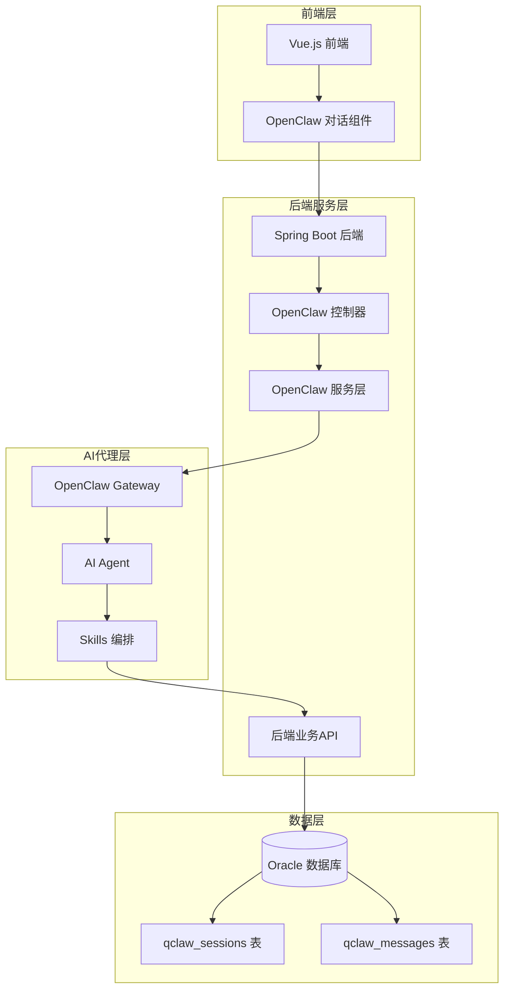

**架构图来源**
- [OpenClaw集成方案-临床场景分析与PoC规划.md:5-10](file://med_ai_assistant_1.0_bs_backend/doc/迭代/openclaw/OpenClaw集成方案-临床场景分析与PoC规划.md#L5-L10)
- [QClaw API调用链路实施方案.md:30-60](file://med_ai_assistant_1.0_bs_backend/doc/迭代/QClaw API调用链路/QClaw API调用链路实施方案.md#L30-L60)

### 通信协议设计

系统采用OpenAI兼容的Chat Completion协议进行通信，支持以下特性：

- **协议支持**：HTTP/HTTPS协议
- **认证机制**：Bearer Token认证
- **数据格式**：JSON格式（OpenAI Chat Completion兼容）
- **请求方法**：GET、POST、PUT、DELETE
- **消息格式**：支持system、user、assistant三种角色

**更新** 明确区分OpenClaw与QClaw的不同定位：OpenClaw作为后台AI编排引擎，QClaw作为现有对话系统的增强版本。

## 技术栈分析

### 后端技术栈

系统基于Spring Boot 3.5.8构建，采用Java 21开发，集成了多种现代化技术：

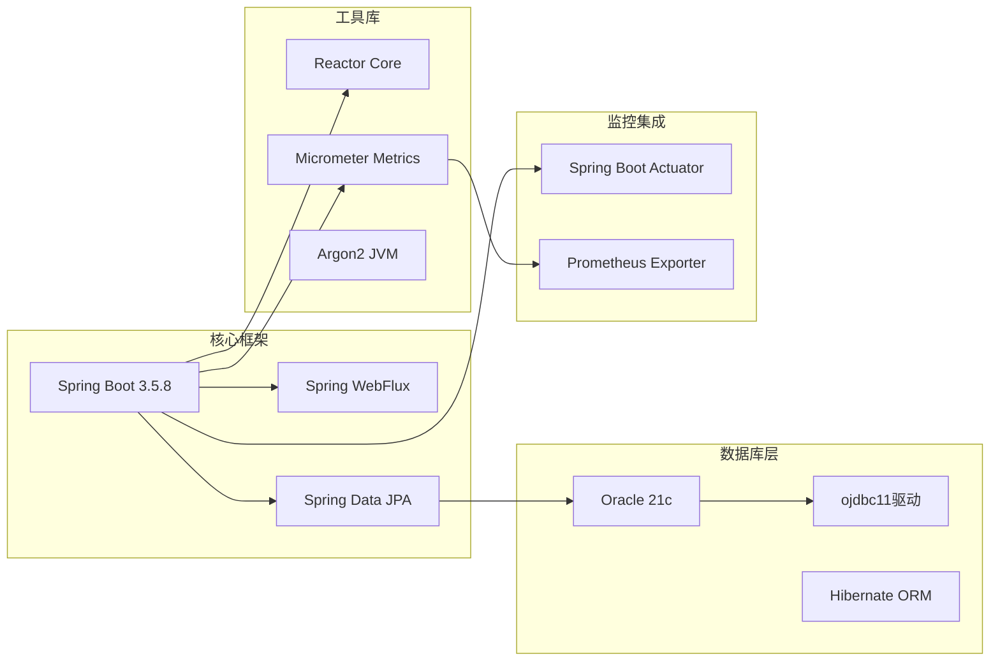

**架构图来源**
- [pom.xml:53-214](file://med_ai_assistant_1.0_bs_backend/pom.xml#L53-L214)

### 前端技术栈

Vue.js 3配合Element Plus组件库，提供现代化的用户界面：

- **Vue 3**：最新版本的Vue.js框架
- **Element Plus**：企业级UI组件库
- **Vuex**：状态管理模式
- **Axios**：HTTP客户端库

**章节来源**
- [pom.xml:1-309](file://med_ai_assistant_1.0_bs_backend/pom.xml#L1-L309)
- [AppDataSourceProperties.java:1-28](file://med_ai_assistant_1.0_bs_backend/src/main/java/com/example/medaiassistant/config/AppDataSourceProperties.java#L1-L28)
- [CustomProperties.java:1-28](file://med_ai_assistant_1.0_bs_backend/src/main/java/com/example/medaiassistant/config/CustomProperties.java#L1-L28)

## 核心组件分析

### OpenClaw集成服务

OpenClaw集成服务是系统的核心组件，负责与OpenClaw Gateway进行通信：

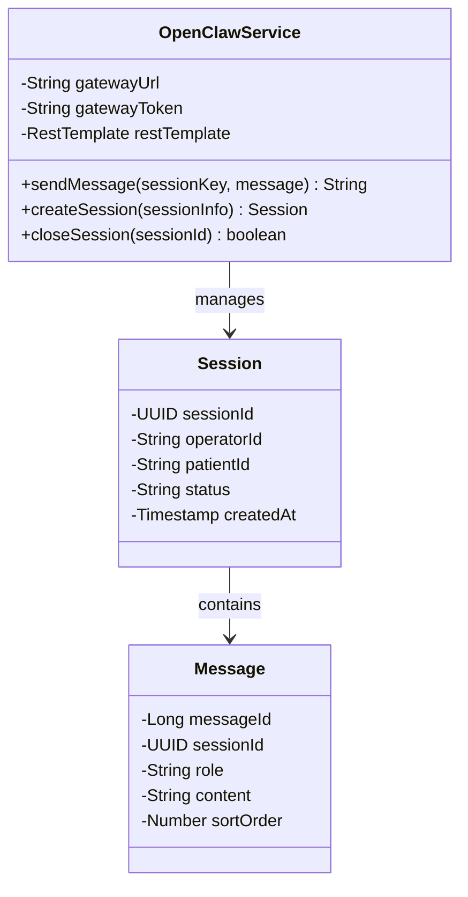

**类图来源**
- [OpenClaw集成方案-临床场景分析与PoC规划.md:307-327](file://med_ai_assistant_1.0_bs_backend/doc/迭代/openclaw/OpenClaw集成方案-临床场景分析与PoC规划.md#L307-L327)

### 会话管理系统

系统实现了完整的会话管理机制，支持多用户并发：

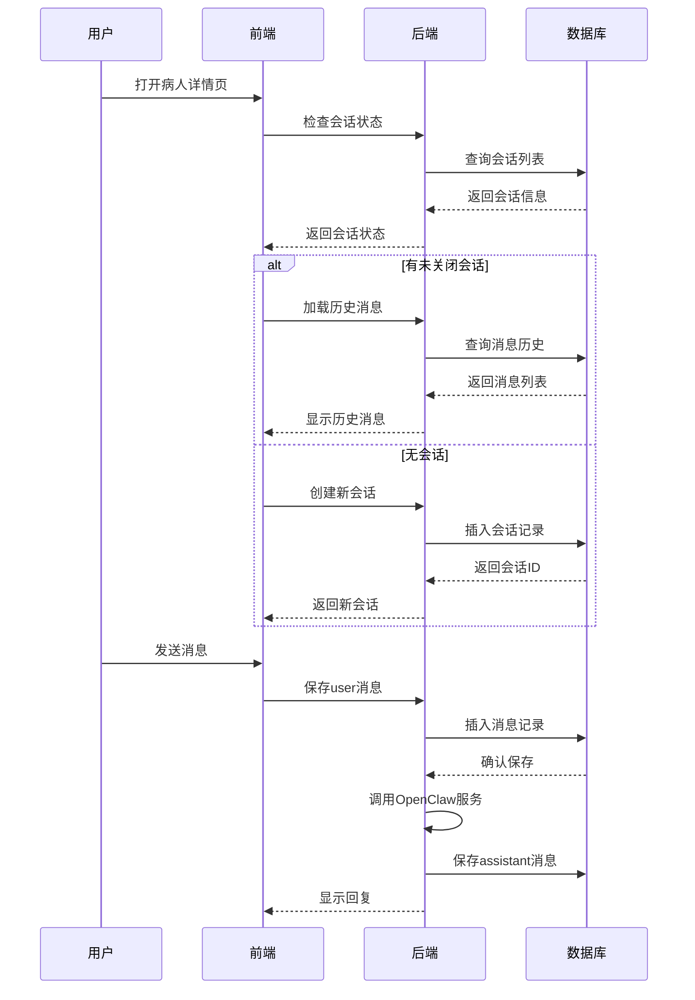

**序列图来源**
- [QClaw API调用链路实施方案.md:78-91](file://med_ai_assistant_1.0_bs_backend/doc/迭代/QClaw API调用链路/QClaw API调用链路实施方案.md#L78-L91)

**章节来源**
- [QClaw API调用链路实施方案.md:129-153](file://med_ai_assistant_1.0_bs_backend/doc/迭代/QClaw API调用链路/QClaw API调用链路实施方案.md#L129-L153)

## 集成方案设计

### API调用链路

系统设计了完整的API调用链路，支持自然语言到业务操作的无缝转换：

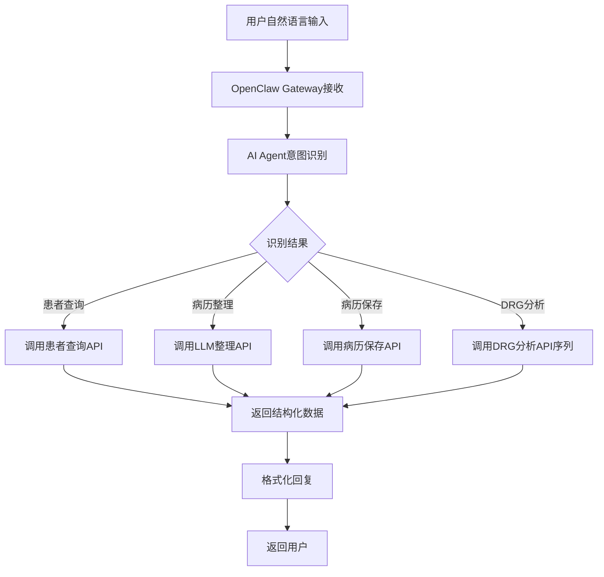

**流程图来源**
- [QClaw API调用链路实施方案.md:32-50](file://med_ai_assistant_1.0_bs_backend/doc/迭代/QClaw API调用链路/QClaw API调用链路实施方案.md#L32-L50)

### 并发模型设计

系统采用两层并发模型，确保会话一致性和系统性能：

| 并发层次 | 说明 | 并发限制 | 适用场景 |
|---------|------|---------|----------|
| Session Lane | 同一会话内严格串行执行 | 1个会话1个线程 | 保证对话一致性 |
| Global Lane | 不同会话间并行执行 | 默认4个，可配置 | 支持多用户并发 |

### 用户标识与认证

系统实现了双重认证机制，确保安全性：

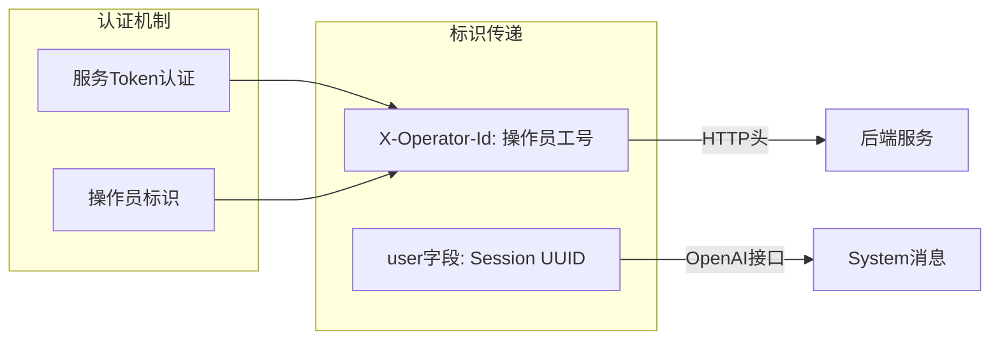

**架构图来源**
- [QClaw API调用链路实施方案.md:156-188](file://med_ai_assistant_1.0_bs_backend/doc/迭代/QClaw API调用链路/QClaw API调用链路实施方案.md#L156-L188)

**章节来源**
- [QClaw API调用链路实施方案.md:156-188](file://med_ai_assistant_1.0_bs_backend/doc/迭代/QClaw API调用链路/QClaw API调用链路实施方案.md#L156-L188)

## 数据库设计

### 数据库架构

系统采用Oracle数据库，设计了专门的对话历史表结构：

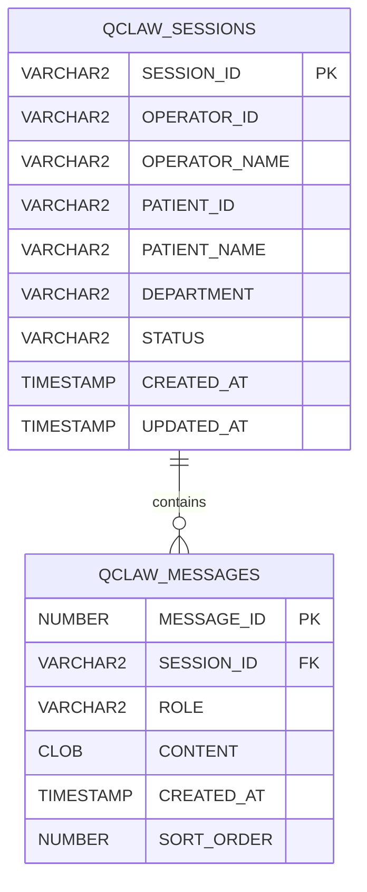

**ER图来源**
- [QClaw API调用链路实施方案.md:229-251](file://med_ai_assistant_1.0_bs_backend/doc/迭代/QClaw API调用链路/QClaw API调用链路实施方案.md#L229-L251)

### 表结构设计

#### qclaw_sessions 表
| 字段名 | 数据类型 | 约束 | 说明 |
|--------|----------|------|------|
| SESSION_ID | VARCHAR2(36) | PK | UUID主键 |
| OPERATOR_ID | VARCHAR2(50) |  | 操作员工号 |
| OPERATOR_NAME | VARCHAR2(100) |  | 操作员姓名 |
| PATIENT_ID | VARCHAR2(50) |  | 病人住院号 |
| PATIENT_NAME | VARCHAR2(100) |  | 病人姓名 |
| DEPARTMENT | VARCHAR2(100) |  | 科室 |
| STATUS | VARCHAR2(20) |  | ACTIVE/CLOSED |
| CREATED_AT | TIMESTAMP |  | 创建时间 |
| UPDATED_AT | TIMESTAMP |  | 更新时间 |

#### qclaw_messages 表
| 字段名 | 数据类型 | 约束 | 说明 |
|--------|----------|------|------|
| MESSAGE_ID | NUMBER | PK | 自增主键 |
| SESSION_ID | VARCHAR2(36) | FK | 外键引用qclaw_sessions |
| ROLE | VARCHAR2(20) |  | system/user/assistant |
| CONTENT | CLOB |  | 消息内容（支持长文本） |
| CREATED_AT | TIMESTAMP |  | 创建时间 |
| SORT_ORDER | NUMBER |  | 消息排序 |

**章节来源**
- [QClaw API调用链路实施方案.md:198-251](file://med_ai_assistant_1.0_bs_backend/doc/迭代/QClaw API调用链路/QClaw API调用链路实施方案.md#L198-L251)

## 前端集成方案

### 前端架构

Vue.js前端系统提供了完整的对话界面集成：

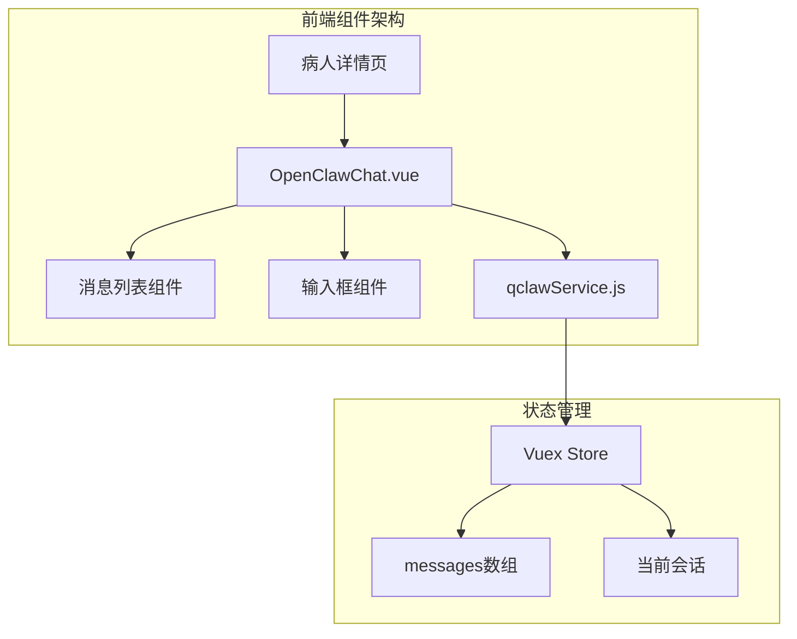

**架构图来源**
- [QClaw API调用链路实施方案.md:286-335](file://med_ai_assistant_1.0_bs_backend/doc/迭代/QClaw API调用链路/QClaw API调用链路实施方案.md#L286-L335)

### API封装设计

前端API服务模块封装了所有后端API调用：

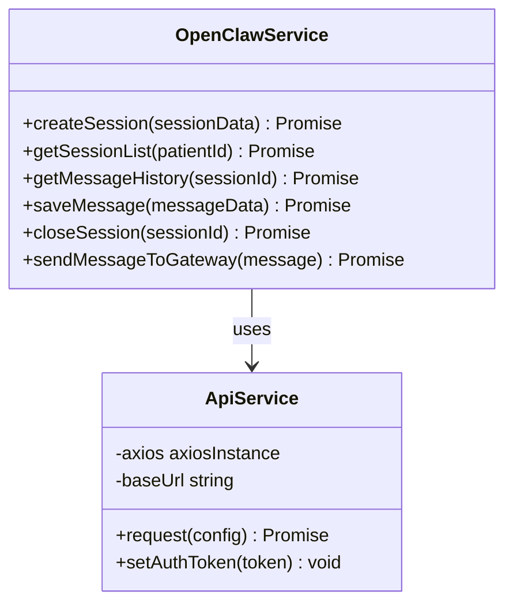

**类图来源**
- [QClaw API调用链路实施方案.md:437-446](file://med_ai_assistant_1.0_bs_backend/doc/迭代/QClaw API调用链路/QClaw API调用链路实施方案.md#L437-L446)

### 交互流程

前端与后端的交互遵循严格的流程控制：

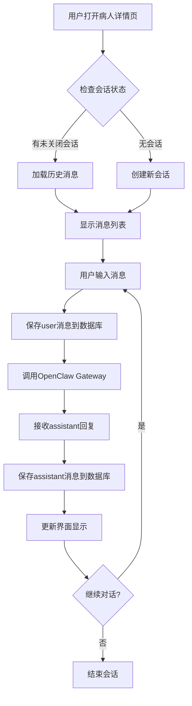

**流程图来源**
- [QClaw API调用链路实施方案.md:298-316](file://med_ai_assistant_1.0_bs_backend/doc/迭代/QClaw API调用链路/QClaw API调用链路实施方案.md#L298-L316)

**章节来源**
- [index.js:1-18](file://med_ai_assistant_1.0_bs_vue/src/api/index.js#L1-L18)

## 实施计划

### 阶段性实施策略

系统采用渐进式实施策略，分阶段实现各项功能：

```mermaid
gantt
title OpenClaw集成实施计划
dateFormat X
axisFormat %W周
section 阶段1: PoC验证
环境搭建 :done, 1, 2周
Skill开发 :done, 3, 2周
API验证 :done, 5, 2周
section 阶段2: 核心功能
数据库设计 :active, 7, 3周
后端服务开发 :active, 10, 4周
前端集成 :active, 14, 3周
section 阶段3: 完善优化
性能优化 :17, 2周
安全加固 :19, 2周
文档完善 :21, 1周
section 阶段4: 部署上线
测试验证 :22, 2周
用户培训 :24, 1周
正式上线 :25, 1周
```

**更新** 新增详细的PoC部署验证计划，包含前置条件、环境准备、Skill编写、REST API验证等完整流程。

### 任务分解

| 任务编号 | 任务名称 | 负责人 | 时间周期 | 交付物 |
|---------|----------|--------|----------|--------|
| T1 | 环境准备与OpenClaw安装 | 开发团队 | 2周 | 完成的OpenClaw环境 |
| T2 | 患者查询Skill开发 | AI团队 | 2周 | 可运行的Skill脚本 |
| T3 | REST API验证 | 后端团队 | 2周 | 验证通过的API |
| T4 | 数据库DDL设计 | 数据库团队 | 3周 | 完整的数据库脚本 |
| T5 | 后端服务开发 | 后端团队 | 4周 | 完整的服务实现 |
| T6 | 前端组件集成 | 前端团队 | 3周 | 集成完成的界面 |
| T7 | 性能优化 | 全体团队 | 2周 | 优化后的系统 |
| T8 | 测试验证 | QA团队 | 2周 | 测试报告 |

**章节来源**
- [OpenClaw集成方案-临床场景分析与PoC规划.md:176-201](file://med_ai_assistant_1.0_bs_backend/doc/迭代/openclaw/OpenClaw集成方案-临床场景分析与PoC规划.md#L176-L201)

## 风险评估

### 技术风险

| 风险类型 | 风险描述 | 影响程度 | 应对措施 |
|---------|----------|----------|----------|
| Token限制 | 长对话可能超出Token限制 | 中等 | 实现滑动窗口和摘要压缩 |
| 网络延迟 | OpenClaw Gateway响应较慢 | 中等 | 前端loading状态和超时处理 |
| Skill失败 | Skill调用失败 | 高 | 设计重试机制和错误提示 |
| 数据一致性 | 前端显示、数据库存储、上下文同步 | 高 | 建立数据一致性检查机制 |
| 权限控制 | 操作审计和权限验证 | 高 | 实施双重认证机制 |

### 业务风险

| 风险类型 | 风险描述 | 影响程度 | 应对措施 |
|---------|----------|----------|----------|
| 用户接受度 | 医生对新技术的接受程度 | 中等 | 加强用户培训和演示 |
| 数据安全 | 医疗数据的安全保护 | 高 | 实施严格的数据加密和访问控制 |
| 系统稳定性 | 集成后系统稳定性 | 高 | 充分的测试和监控 |
| 成本控制 | 集成成本超支 | 中等 | 严格的成本预算和控制 |

### 质量保证

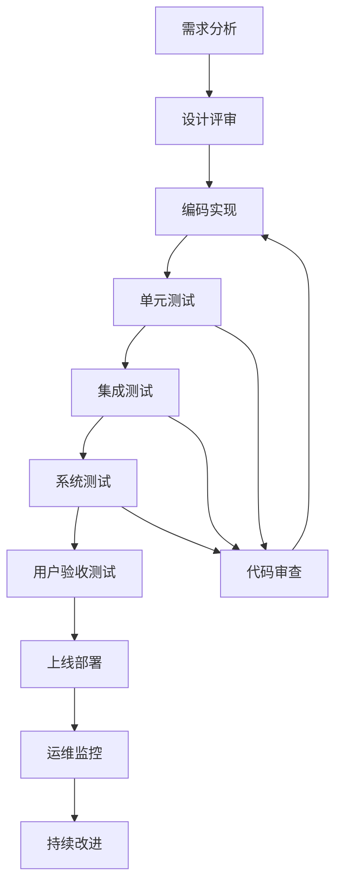

**更新** 新增场景优先级矩阵，为PoC验证提供明确的实施指导。

## 总结

OpenClaw集成方案为MedAiAssistant系统提供了强大的智能化能力，通过自然语言驱动的API编排，显著提升了系统的易用性和功能性。该方案具有以下特点：

### 核心价值

1. **智能化升级**：将复杂的业务流程转化为简单的自然语言操作
2. **扩展性强**：通过Skill机制轻松添加新的业务功能
3. **用户体验优化**：减少学习成本，提升工作效率
4. **技术先进性**：采用最新的AI技术和架构设计

### 实施建议

1. **分阶段推进**：按照实施计划逐步推进，确保每个阶段的质量
2. **充分测试**：建立完善的测试体系，确保系统稳定性
3. **用户培训**：加强用户培训，提升系统的接受度和使用效果
4. **持续优化**：根据使用反馈持续优化系统功能和性能

### 未来展望

随着OpenClaw集成的不断完善，系统将能够支持更多复杂的医疗场景，为医护人员提供更加智能化的服务，推动医疗信息化向更高水平发展。

**更新** 通过7个精心设计的临床编排场景，OpenClaw集成方案为医疗AI应用提供了清晰的实施路径和价值体现，特别是在查房、DRG分析、患者查询等核心医疗流程中的智能化升级。

### 系统API接口概览

**更新** 基于180+个API接口的系统能力调研，OpenClaw集成方案可编排的核心接口包括：

- **患者管理**：患者查询、诊断管理、医嘱查询等9个接口
- **DRG分析**：MCC筛选、DRG匹配、费用查询等22个接口  
- **语音识别**：实时识别、文件识别等4个接口
- **病历记录**：病历查询、创建、管理等8个接口
- **数据同步**：患者同步、检验/检查结果同步、EMR同步等12个接口
- **AI服务**：Prompt模板管理、AI响应、结果保存等18个接口
- **系统管理**：健康检查、配置管理、数据一致性诊断等15个接口

这些接口为OpenClaw提供了丰富的业务能力支撑，确保编排场景的完整性和实用性。