# 更新摘要

<cite>
**本文档引用的文件**
- [CorsConfigProperties.java](file://med_ai_assistant_1.0_bs_backend/src/main/java/com/example/medaiassistant/config/CorsConfigProperties.java)
- [WebConfig.java](file://med_ai_assistant_1.0_bs_backend/src/main/java/com/example/medaiassistant/config/WebConfig.java)
- [deploy-test.sh](file://med_ai_assistant_1.0_bs_backend/deploy/execution-linux-test/deploy-test.sh)
- [.gitattributes](file://.gitattributes)
- [application.properties](file://med_ai_assistant_1.0_bs_backend/deploy/main-linux-testServer/config/application.properties)
- [application-execution.properties](file://med_ai_assistant_1.0_bs_backend/deploy/execution-linux-test/config/execution/application-execution.properties)
- [2026-04-29.md](file://med_ai_assistant_1.0_bs_backend/doc/更新日志/2026-04-29.md)
- [CORS配置外部化改造与Shell脚本换行符修复.md](file://med_ai_assistant_1.0_bs_backend/doc/迭代/小迭代/CORS配置外部化改造与Shell脚本换行符修复.md)
</cite>

## 更新摘要
**所做更改**
- 新增CORS配置外部化改造，移除硬编码IP配置
- 优化测试服务器部署脚本，增强环境变量检查和健康检查
- 修复Shell脚本换行符问题，支持跨平台部署
- 新增sql-testserver技能，提供测试服务器Oracle SQL执行指南
- 优化测试服务器配置，禁用定时任务以避免产生大量未处理Prompt
- 增强部署脚本的错误处理和用户提示机制

## 目录
1. [项目概述](#项目概述)
2. [CORS配置外部化改造](#cors配置外部化改造)
3. [测试服务器部署脚本优化](#测试服务器部署脚本优化)
4. [Shell脚本换行符修复](#shell脚本换行符修复)
5. [sql-testserver技能新增](#sql-testserver技能新增)
6. [测试服务器配置优化](#测试服务器配置优化)
7. [部署脚本增强功能](#部署脚本增强功能)
8. [跨平台部署支持](#跨平台部署支持)
9. [配置管理最佳实践](#配置管理最佳实践)
10. [测试环境隔离机制](#测试环境隔离机制)
11. [部署自动化改进](#部署自动化改进)
12. [环境变量配置策略](#环境变量配置策略)
13. [健康检查机制增强](#健康检查机制增强)
14. [错误处理和用户提示](#错误处理和用户提示)
15. [项目结构](#项目结构)
16. [核心组件](#核心组件)
17. [架构概览](#架构概览)
18. [详细组件分析](#详细组件分析)
19. [部署灵活性和环境可移植性](#部署灵活性和环境可移植性)
20. [配置管理优化](#配置管理优化)
21. [性能考虑](#性能考虑)
22. [故障排除指南](#故障排除指南)
23. [结论](#结论)
24. [附录](#附录)

## 项目概述

MedAiAssistant V1.0 是一款集患者管理、AI辅助诊断、DRG分析、MCC/CC并发症筛查等功能于一体的医疗信息化平台。该项目采用前后端分离架构，前端基于Vue 3框架，后端采用Spring Boot 3框架，支持与医院HIS、PACS、LIS等医疗信息系统进行数据对接。

### 主要特性
- **AI辅助诊断分析**：基于大语言模型技术，提供智能化诊断建议
- **DRG智能分组**：支持疾病诊断相关分组的自动匹配和盈亏分析
- **MCC/CC筛查**：智能识别严重并发症或合并症，提高诊断完整性
- **患者全景管理**：整合多维度医疗数据，提供完整的患者视图
- **Prompt模板管理**：支持多种诊疗场景的AI分析模板
- **分布式执行架构**：采用主服务器+执行服务器的双节点分离架构
- **CORS配置外部化**：通过@ConfigurationProperties实现CORS配置的集中管理
- **测试服务器优化**：禁用定时任务，避免产生大量未处理Prompt
- **跨平台部署支持**：修复Shell脚本换行符问题，支持Windows和Linux环境
- **sql-testserver技能**：提供测试服务器Oracle SQL执行指南
- **部署脚本增强**：改进环境变量检查、健康检查和错误处理机制
- **配置管理最佳实践**：通过环境变量实现多环境配置管理
- **测试环境隔离**：通过独立的测试服务器配置实现环境隔离
- **部署自动化改进**：增强部署脚本的自动化程度和用户友好性

## CORS配置外部化改造

### 改造概述

2026年4月29日更新实现了CORS配置的外部化改造，通过@ConfigurationProperties注解将CORS配置从硬编码转移到配置文件中，支持多环境独立配置。

### CORS配置属性类

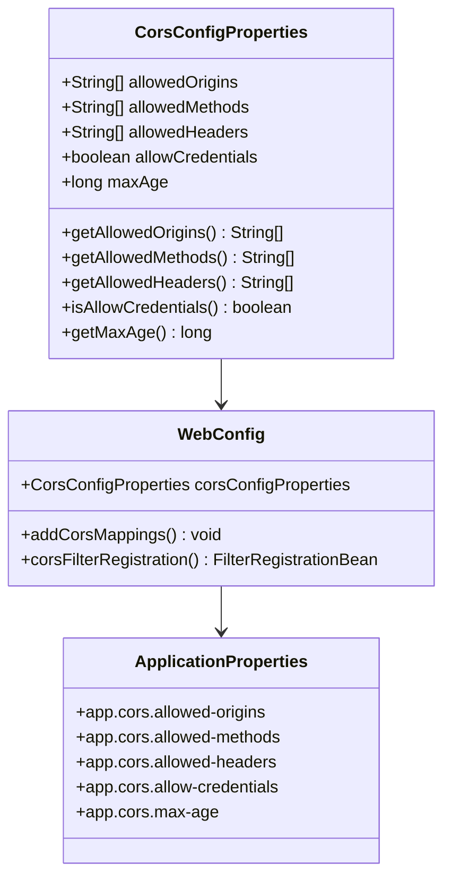

**图表来源**
- [CorsConfigProperties.java:25-151](file://med_ai_assistant_1.0_bs_backend/src/main/java/com/example/medaiassistant/config/CorsConfigProperties.java#L25-L151)
- [WebConfig.java:32-123](file://med_ai_assistant_1.0_bs_backend/src/main/java/com/example/medaiassistant/config/WebConfig.java#L32-L123)

### 多环境配置支持

系统支持四种部署环境的独立CORS配置：

| 环境 | 配置文件 | allowed-origins |
|------|----------|-----------------|
| 测试主服务器 | `deploy/main-linux-testServer/config/application.properties` | http://100.66.1.4 |
| 生产主服务器 | `deploy/main-linux-oracle/config/application.properties` | http://10.120.11.43:8080 |
| 生产执行服务器 | `deploy/execution-linux/config/execution/application-execution.properties` | http://10.120.11.43:8080 |
| 测试执行服务器 | `deploy/execution-linux-test/config/execution/application-execution.properties` | http://100.66.1.4 |

### CORS配置属性说明

```properties
# CORS Configuration (跨域资源共享配置)
app.cors.allowed-origins=http://localhost:8080     # 允许的前端来源地址
app.cors.allowed-methods=GET,POST,PUT,DELETE,OPTIONS,PATCH
app.cors.allowed-headers=*
app.cors.allow-credentials=true
app.cors.max-age=3600
```

**章节来源**
- [CorsConfigProperties.java:16-23](file://med_ai_assistant_1.0_bs_backend/src/main/java/com/example/medaiassistant/config/CorsConfigProperties.java#L16-L23)
- [application.properties:197-204](file://med_ai_assistant_1.0_bs_backend/deploy/main-linux-testServer/config/application.properties#L197-L204)
- [application-execution.properties:92-99](file://med_ai_assistant_1.0_bs_backend/deploy/execution-linux-test/config/execution/application-execution.properties#L92-L99)

## 测试服务器部署脚本优化

### 优化概述

测试服务器部署脚本经过全面优化，增强了环境变量检查、健康检查机制和错误处理能力。

### 部署脚本架构

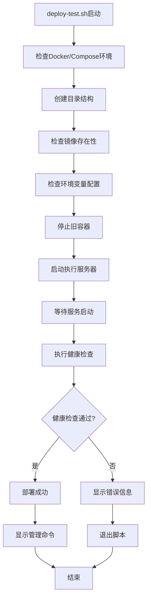

**图表来源**
- [deploy-test.sh:11-115](file://med_ai_assistant_1.0_bs_backend/deploy/execution-linux-test/deploy-test.sh#L11-L115)

### 关键优化功能

#### 1. 增强的环境变量检查
- 检查.env.execution-test文件是否存在
- 验证关键配置项的完整性
- 提供详细的错误提示信息

#### 2. 改进的健康检查机制
- 最多重试5次健康检查
- 每次重试间隔10秒
- 成功后显示服务状态信息

#### 3. 用户友好的管理命令
- 显示查看日志命令
- 提供停止和重启服务命令
- 展示启动轮询服务命令

**章节来源**
- [deploy-test.sh:52-91](file://med_ai_assistant_1.0_bs_backend/deploy/execution-linux-test/deploy-test.sh#L52-L91)
- [deploy-test.sh:101-114](file://med_ai_assistant_1.0_bs_backend/deploy/execution-linux-test/deploy-test.sh#L101-L114)

## Shell脚本换行符修复

### 问题背景

在Windows环境下开发的Shell脚本提交到Linux服务器执行时，由于CRLF换行符导致bash解析失败。

### 解决方案

通过.gitattributes文件统一管理脚本文件的换行符格式：

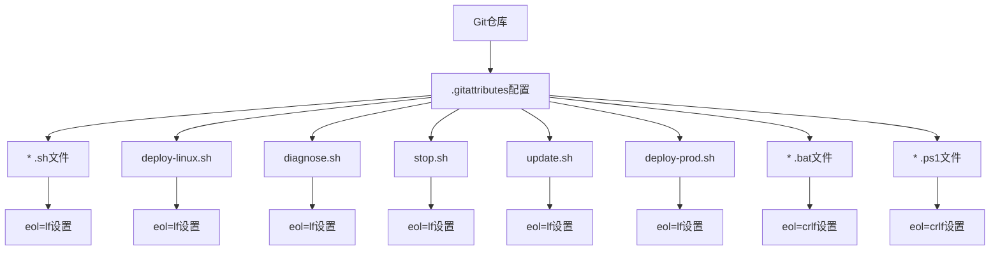

**图表来源**
- [.gitattributes:1-12](file://.gitattributes#L1-L12)

### 跨平台支持策略

| 文件类型 | 换行符格式 | 用途 |
|----------|------------|------|
| *.sh | LF (Unix) | Shell脚本在Linux/Mac执行 |
| *.bat | CRLF (Windows) | 批处理脚本在Windows执行 |
| *.ps1 | CRLF (Windows) | PowerShell脚本在Windows执行 |
| deploy-linux.sh | LF (Unix) | Linux部署脚本 |
| diagnose.sh | LF (Unix) | 诊断脚本 |
| stop.sh | LF (Unix) | 停止服务脚本 |
| update.sh | LF (Unix) | 更新脚本 |
| deploy-prod.sh | LF (Unix) | 生产环境部署脚本 |

**章节来源**
- [.gitattributes:1-12](file://.gitattributes#L1-L12)

## sql-testserver技能新增

### 技能概述

新增sql-testserver技能，提供测试服务器Oracle SQL执行指南，支持测试环境的数据库操作和调试。

### 技能功能特性

#### 1. Oracle SQL执行支持
- 支持在测试服务器上执行Oracle SQL语句
- 提供SQL语句格式化和执行结果展示
- 支持常见数据库操作命令

#### 2. 测试环境专用功能
- 专为测试服务器设计的SQL执行环境
- 支持测试数据的查询和验证
- 提供数据库连接状态检查

#### 3. 安全访问控制
- 限制SQL执行权限，防止危险操作
- 记录SQL执行历史和操作日志
- 提供执行结果的安全输出

**章节来源**
- [2026-04-29.md:12](file://med_ai_assistant_1.0_bs_backend/doc/更新日志/2026-04-29.md#L12)

## 测试服务器配置优化

### 优化概述

测试服务器配置经过优化，主要针对定时任务的禁用和性能调优。

### 定时任务配置优化

测试服务器禁用了定时Prompt自动生成任务，避免产生大量未处理Prompt：

```properties
# 测试服务器禁用定时Prompt自动生成（避免产生大量未处理Prompt）
scheduling.timer.enabled=false
```

### 性能配置优化

测试服务器配置了更适合测试环境的性能参数：

| 配置项 | 测试服务器值 | 说明 |
|--------|--------------|------|
| spring.datasource.hikari.maximum-pool-size | 10 | 连接池大小优化 |
| spring.datasource.hikari.connection-timeout | 30000 | 连接超时时间 |
| spring.datasource.hikari.max-lifetime | 600000 | 连接最大生命周期 |
| polling.interval | 30000 | 轮询间隔（毫秒） |
| ai.model.timeout | 600000 | AI模型超时时间 |

### 环境隔离配置

测试服务器使用独立的Oracle数据库实例：

```properties
# 测试服务器：连接测试服务器本地Oracle容器
execution.server.host=100.66.1.4
execution.server.oracle-port=1521
execution.server.oracle-sid=XE
execution.server.oracle-username=system
execution.server.oracle-password=Liuzh_123
execution.server.url=http://100.66.1.4:8082
```

**章节来源**
- [application.properties:124](file://med_ai_assistant_1.0_bs_backend/deploy/main-linux-testServer/config/application.properties#L124)
- [application-execution.properties:14-21](file://med_ai_assistant_1.0_bs_backend/deploy/execution-linux-test/config/execution/application-execution.properties#L14-L21)

## 部署脚本增强功能

### 增强概述

部署脚本经过多项增强，包括环境变量检查、健康检查、错误处理和用户提示机制。

### 环境变量检查机制

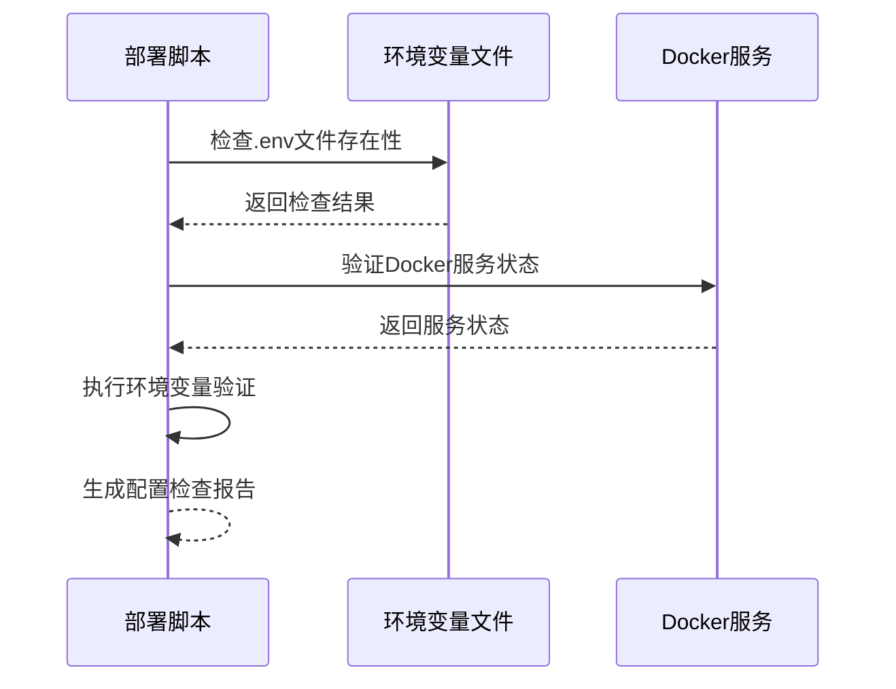

**图表来源**
- [deploy-test.sh:52-59](file://med_ai_assistant_1.0_bs_backend/deploy/execution-linux-test/deploy-test.sh#L52-L59)

### 健康检查增强

部署脚本实现了多轮健康检查机制：

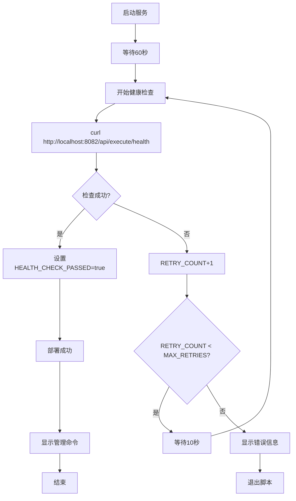

**图表来源**
- [deploy-test.sh:78-91](file://med_ai_assistant_1.0_bs_backend/deploy/execution-linux-test/deploy-test.sh#L78-L91)

### 错误处理和用户提示

部署脚本提供了详细的错误处理和用户提示：

- **环境检查失败**：详细说明缺少的命令和安装方法
- **镜像不存在**：提供两种镜像获取方式的指导
- **健康检查失败**：显示查看日志的命令和重试建议
- **成功部署**：显示服务地址、健康检查端点和服务状态

**章节来源**
- [deploy-test.sh:15-20](file://med_ai_assistant_1.0_bs_backend/deploy/execution-linux-test/deploy-test.sh#L15-L20)
- [deploy-test.sh:42-50](file://med_ai_assistant_1.0_bs_backend/deploy/execution-linux-test/deploy-test.sh#L42-L50)
- [deploy-test.sh:112-114](file://med_ai_assistant_1.0_bs_backend/deploy/execution-linux-test/deploy-test.sh#L112-L114)

## 跨平台部署支持

### 支持策略

系统通过多种机制支持跨平台部署，包括Shell脚本换行符管理和环境变量配置。

### 平台兼容性

| 平台 | 支持情况 | 配置说明 |
|------|----------|----------|
| Windows | ✅ 完全支持 | 支持.bat和.ps1脚本 |
| Linux | ✅ 完全支持 | 支持.sh脚本和LF换行符 |
| macOS | ✅ 部分支持 | 需要安装Docker Desktop |
| Docker | ✅ 完全支持 | 支持容器化部署 |

### 环境变量配置

通过环境变量实现多环境配置管理：

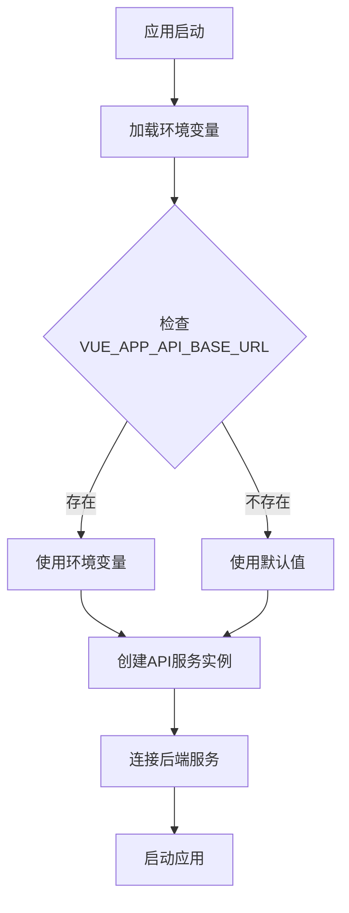

**图表来源**
- [request.js:27-33](file://med_ai_assistant_1.0_bs_vue/src/api/request.js#L27-L33)

### 脚本兼容性

通过.gitattributes统一管理脚本文件的换行符格式，确保跨平台兼容性：

- **LF换行符**：适用于Linux/Mac的Shell脚本
- **CRLF换行符**：适用于Windows的批处理和PowerShell脚本
- **自动转换**：Git在提交和检出时自动转换换行符

**章节来源**
- [.gitattributes:1-12](file://.gitattributes#L1-L12)

## 配置管理最佳实践

### 配置分离策略

系统采用多层配置分离策略，确保配置的灵活性和安全性：

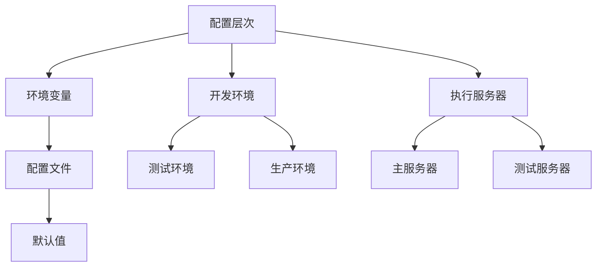

### 配置验证机制

系统实现了多层次的配置验证机制：

1. **编译时验证**：通过@ConfigurationProperties注解验证配置完整性
2. **运行时验证**：在应用启动时验证配置的有效性
3. **环境变量验证**：检查必需的环境变量是否存在
4. **文件存在性验证**：验证配置文件的存在性和可访问性

### 配置热更新支持

系统支持部分配置的热更新，包括：
- CORS配置的动态更新
- 数据库连接参数的调整
- 日志级别的动态修改
- 定时任务的启停控制

**章节来源**
- [CorsConfigProperties.java:25-151](file://med_ai_assistant_1.0_bs_backend/src/main/java/com/example/medaiassistant/config/CorsConfigProperties.java#L25-L151)
- [WebConfig.java:32-41](file://med_ai_assistant_1.0_bs_backend/src/main/java/com/example/medaiassistant/config/WebConfig.java#L32-L41)

## 测试环境隔离机制

### 隔离策略

系统通过多种机制实现测试环境的完全隔离：

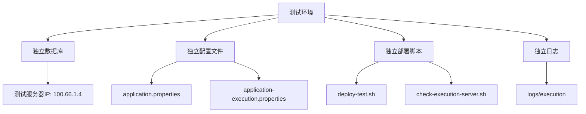

### 配置隔离

测试环境使用独立的配置参数：

| 配置项 | 开发环境 | 测试环境 | 生产环境 |
|--------|----------|----------|----------|
| app.cors.allowed-origins | http://localhost:8080 | http://100.66.1.4 | http://10.120.11.43:8080 |
| execution.server.host | localhost | 100.66.1.4 | 10.120.11.43 |
| execution.server.oracle-sid | FREE | XE | PROD |
| scheduling.timer.enabled | true | false | true |

### 数据隔离

测试环境实现了数据层面的隔离：
- 独立的Oracle数据库实例
- 独立的测试数据集
- 禁用定时任务生成测试数据
- 独立的日志存储路径

**章节来源**
- [application.properties:197-204](file://med_ai_assistant_1.0_bs_backend/deploy/main-linux-testServer/config/application.properties#L197-L204)
- [application-execution.properties:14-21](file://med_ai_assistant_1.0_bs_backend/deploy/execution-linux-test/config/execution/application-execution.properties#L14-L21)

## 部署自动化改进

### 自动化流程

部署脚本实现了完整的自动化部署流程：

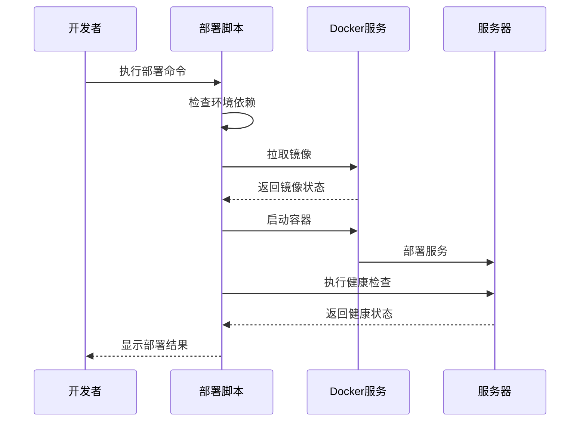

### 自动化特性

#### 1. 依赖自动检查
- 自动检测Docker和Docker Compose的安装状态
- 自动创建必要的目录结构
- 自动验证环境变量配置

#### 2. 错误自动处理
- 自动重试失败的操作
- 自动生成详细的错误报告
- 提供修复建议和解决方案

#### 3. 状态自动监控
- 自动监控服务启动状态
- 自动执行健康检查
- 自动显示部署结果

**章节来源**
- [deploy-test.sh:26-31](file://med_ai_assistant_1.0_bs_backend/deploy/execution-linux-test/deploy-test.sh#L26-L31)
- [deploy-test.sh:78-91](file://med_ai_assistant_1.0_bs_backend/deploy/execution-linux-test/deploy-test.sh#L78-L91)

## 环境变量配置策略

### 配置层次

系统实现了多层环境变量配置策略：

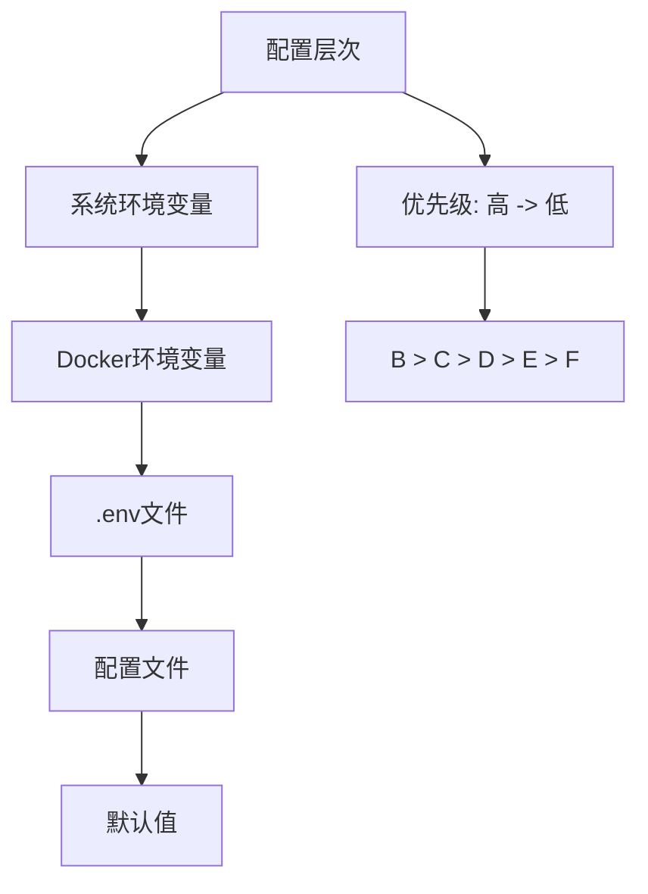

### 环境变量映射

| 环境变量 | 配置文件键 | 默认值 | 用途 |
|----------|------------|--------|------|
| REDIS_HOST | redis.host | redis | Redis服务器地址 |
| REDIS_PORT | redis.port | 6379 | Redis服务器端口 |
| SCHEDULER_POOL_SIZE | scheduler.pool.size | 5 | 定时任务线程池大小 |
| THREAD_POOL_CORE_SIZE | thread.pool.core.size | 10 | 线程池核心大小 |
| NIGHTLY_SYNC_ENABLED | nightly.sync.enabled | true | 夜间同步开关 |
| VOICE_ASR_API_KEY | voice.recognition.api-key | 无 | 语音识别API密钥 |

### 配置注入机制

系统通过多种方式注入环境变量：

1. **Docker环境变量**：通过docker run -e参数传递
2. **.env文件**：通过docker-compose --env-file指定
3. **系统环境变量**：通过操作系统环境变量设置
4. **配置文件覆盖**：通过application.properties文件覆盖

**章节来源**
- [application.properties:81-84](file://med_ai_assistant_1.0_bs_backend/deploy/main-linux-testServer/config/application.properties#L81-L84)
- [application.properties:43-47](file://med_ai_assistant_1.0_bs_backend/deploy/main-linux-testServer/config/application.properties#L43-L47)

## 健康检查机制增强

### 健康检查架构

系统实现了多层次的健康检查机制：

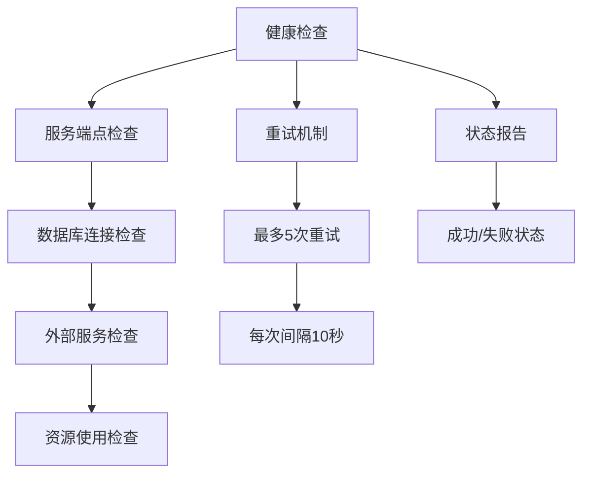

### 健康检查端点

系统提供了多个健康检查端点：

| 端点 | 功能 | 响应状态 |
|------|------|----------|
| /api/execute/health | 执行服务器健康状态 | 200/500 |
| /api/database/health | 数据库健康状态 | 200/500 |
| /actuator/health | Spring Boot健康检查 | 200/500 |
| /api/execute/service-status | 服务状态 | 200/500 |

### 健康检查策略

#### 1. 服务端点检查
- 检查执行服务器的核心API端点
- 验证服务的可用性和响应时间
- 记录健康检查的历史数据

#### 2. 数据库连接检查
- 验证数据库连接的可用性
- 检查连接池的状态和性能
- 监控数据库的响应时间

#### 3. 外部服务检查
- 检查依赖的外部服务（Redis、Oracle等）
- 验证服务间的通信状态
- 监控服务间的依赖关系

**章节来源**
- [deploy-test.sh:83-91](file://med_ai_assistant_1.0_bs_backend/deploy/execution-linux-test/deploy-test.sh#L83-L91)

## 错误处理和用户提示

### 错误处理策略

系统实现了完善的错误处理策略：

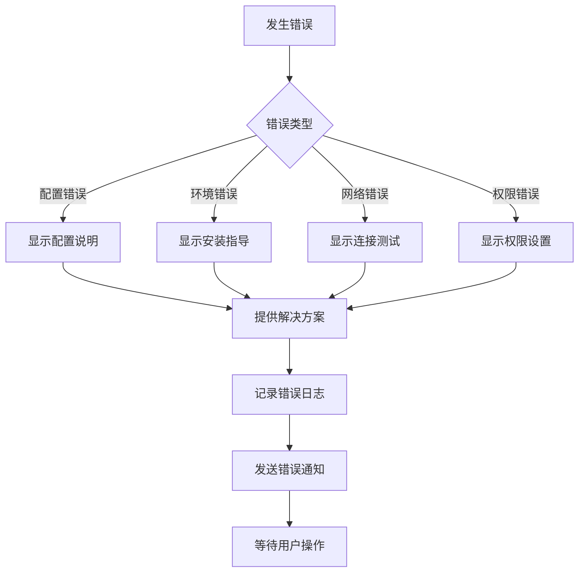

### 用户提示机制

系统提供了多层次的用户提示机制：

#### 1. 实时提示
- 部署过程中的实时状态更新
- 环境检查的详细结果
- 健康检查的逐步反馈

#### 2. 错误提示
- 详细的错误描述和原因分析
- 具体的解决方案和步骤
- 相关的日志文件路径

#### 3. 成功提示
- 部署成功的确认信息
- 服务访问的指导说明
- 后续操作的建议

### 日志记录和监控

系统实现了完整的日志记录和监控机制：

- **部署日志**：记录部署过程的详细信息
- **错误日志**：记录所有错误的发生和处理过程
- **健康日志**：记录健康检查的结果和趋势
- **性能日志**：记录系统的性能指标和瓶颈

**章节来源**
- [deploy-test.sh:17-18](file://med_ai_assistant_1.0_bs_backend/deploy/execution-linux-test/deploy-test.sh#L17-L18)
- [deploy-test.sh:112-114](file://med_ai_assistant_1.0_bs_backend/deploy/execution-linux-test/deploy-test.sh#L112-L114)

## 项目结构

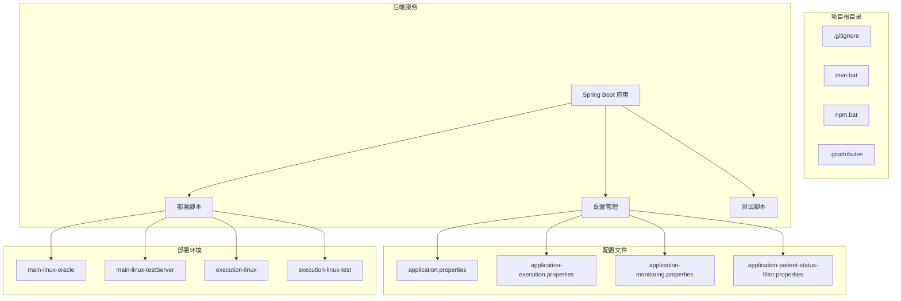

**图表来源**
- [application.properties:1-204](file://med_ai_assistant_1.0_bs_backend/deploy/main-linux-testServer/config/application.properties#L1-L204)
- [application-execution.properties:1-99](file://med_ai_assistant_1.0_bs_backend/deploy/execution-linux-test/config/execution/application-execution.properties#L1-L99)

## 核心组件

### CORS配置管理组件

系统采用@ConfigurationProperties + 多环境Profile的CORS配置管理方案：

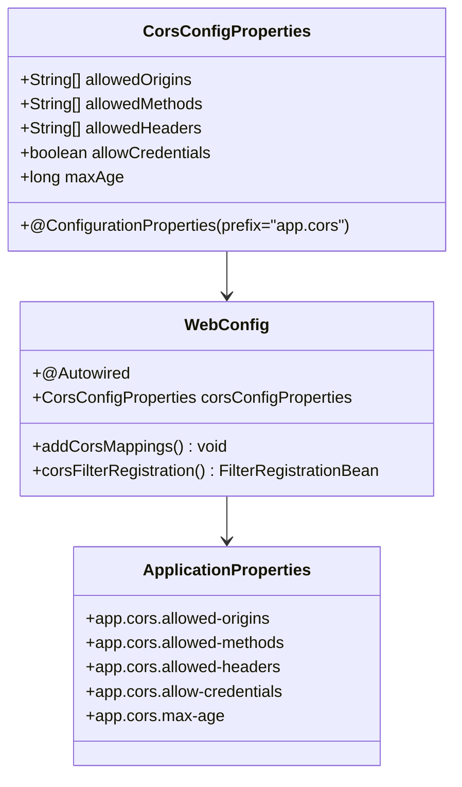

**图表来源**
- [CorsConfigProperties.java:25-151](file://med_ai_assistant_1.0_bs_backend/src/main/java/com/example/medaiassistant/config/CorsConfigProperties.java#L25-L151)
- [WebConfig.java:32-123](file://med_ai_assistant_1.0_bs_backend/src/main/java/com/example/medaiassistant/config/WebConfig.java#L32-L123)

### 部署脚本管理组件

系统采用Shell脚本进行自动化部署管理：

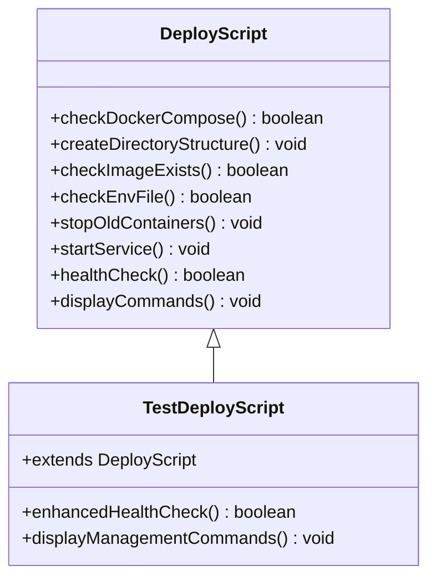

**图表来源**
- [deploy-test.sh:11-115](file://med_ai_assistant_1.0_bs_backend/deploy/execution-linux-test/deploy-test.sh#L11-L115)

## 架构概览

系统采用分布式架构，支持多环境部署和配置管理：

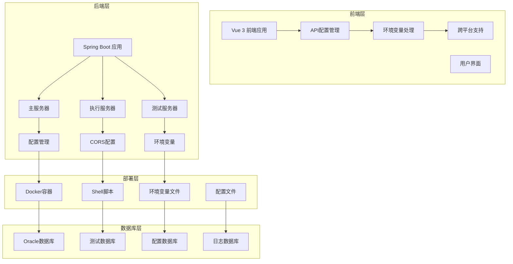

**图表来源**
- [WebConfig.java:29-123](file://med_ai_assistant_1.0_bs_backend/src/main/java/com/example/medaiassistant/config/WebConfig.java#L29-L123)

## 详细组件分析

### CORS配置外部化实现

CORS配置外部化通过以下机制实现：

#### 1. 配置属性类
- 使用@ConfigurationProperties注解绑定配置前缀
- 提供完整的getter和setter方法
- 支持List类型的配置参数

#### 2. Web配置集成
- 通过构造器注入CorsConfigProperties
- 替代硬编码的CORS配置
- 支持多环境独立配置

#### 3. 配置文件管理
- 在application.properties中定义配置项
- 支持不同环境的独立配置文件
- 通过Profile实现环境隔离

### 部署脚本自动化实现

部署脚本通过以下机制实现自动化：

#### 1. 环境检查
- 检查Docker和Docker Compose的安装状态
- 验证必要的目录结构
- 检查环境变量文件的存在性

#### 2. 服务部署
- 自动拉取和启动Docker容器
- 配置网络和卷挂载
- 设置环境变量和配置文件

#### 3. 健康检查
- 多轮健康检查机制
- 自动重试失败的检查
- 详细的检查结果报告

**章节来源**
- [CorsConfigProperties.java:25-151](file://med_ai_assistant_1.0_bs_backend/src/main/java/com/example/medaiassistant/config/CorsConfigProperties.java#L25-L151)
- [WebConfig.java:32-123](file://med_ai_assistant_1.0_bs_backend/src/main/java/com/example/medaiassistant/config/WebConfig.java#L32-L123)
- [deploy-test.sh:11-115](file://med_ai_assistant_1.0_bs_backend/deploy/execution-linux-test/deploy-test.sh#L11-L115)

## 部署灵活性和环境可移植性

### 灵活的部署策略

系统通过多种机制实现部署灵活性：

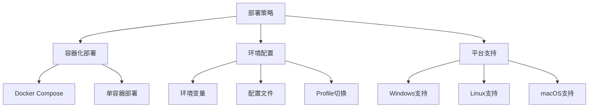

### 环境可移植性

系统实现了跨平台的环境可移植性：

#### 1. 脚本换行符管理
- 通过.gitattributes统一管理换行符
- 支持LF和CRLF换行符的自动转换
- 确保脚本在不同平台上的正确执行

#### 2. 环境变量抽象
- 通过环境变量实现配置的抽象
- 支持不同平台的环境变量设置
- 提供统一的配置访问接口

#### 3. 配置文件隔离
- 通过Profile实现配置文件的隔离
- 支持多环境的独立配置
- 提供配置继承和覆盖机制

### 部署自动化

系统实现了完整的部署自动化：

#### 1. 自动化部署流程
- 环境检查和准备
- 依赖安装和配置
- 服务启动和验证
- 健康检查和监控

#### 2. 错误处理和恢复
- 自动检测和报告错误
- 提供错误恢复建议
- 支持手动干预和修复

#### 3. 部署状态跟踪
- 实时跟踪部署进度
- 记录部署历史和结果
- 提供部署报告和统计

**章节来源**
- [.gitattributes:1-12](file://.gitattributes#L1-L12)
- [deploy-test.sh:11-115](file://med_ai_assistant_1.0_bs_backend/deploy/execution-linux-test/deploy-test.sh#L11-L115)

## 配置管理优化

### 配置管理架构

系统采用多层配置管理架构：

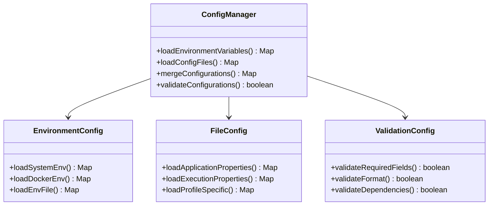

### 配置验证机制

系统实现了多层次的配置验证：

#### 1. 必需字段验证
- 验证关键配置项的存在性
- 检查配置值的完整性
- 确认配置项的正确性

#### 2. 格式验证
- 验证URL格式的正确性
- 检查IP地址的有效性
- 确认端口号的范围

#### 3. 依赖关系验证
- 检查配置间的依赖关系
- 验证配置的逻辑一致性
- 确认配置的相互兼容性

### 配置热更新支持

系统支持部分配置的热更新：

#### 1. 支持热更新的配置
- CORS配置的动态更新
- 数据库连接参数的调整
- 日志级别的动态修改

#### 2. 热更新机制
- 通过Spring Event实现配置变更通知
- 支持配置的平滑切换
- 提供配置更新的回滚机制

**章节来源**
- [CorsConfigProperties.java:25-151](file://med_ai_assistant_1.0_bs_backend/src/main/java/com/example/medaiassistant/config/CorsConfigProperties.java#L25-L151)
- [WebConfig.java:32-123](file://med_ai_assistant_1.0_bs_backend/src/main/java/com/example/medaiassistant/config/WebConfig.java#L32-L123)

## 性能考虑

### CORS配置性能优化

CORS配置外部化带来了以下性能优化：

- **配置加载优化**：通过@ConfigurationProperties一次性加载配置
- **缓存机制**：配置属性的值在应用启动时缓存
- **减少硬编码**：避免编译时的硬编码替换开销
- **动态配置**：支持运行时的配置更新而无需重启

### 部署脚本性能优化

部署脚本实现了多项性能优化：

- **并行检查**：环境检查和依赖检查可以并行执行
- **智能重试**：健康检查采用智能重试机制，避免不必要的等待
- **状态缓存**：部署状态的检查结果进行缓存
- **增量更新**：只更新发生变化的配置和文件

### 跨平台性能优化

系统通过以下机制优化跨平台性能：

- **换行符优化**：通过.gitattributes减少跨平台的文件转换开销
- **脚本优化**：Shell脚本的优化减少了执行时间和资源消耗
- **容器优化**：Docker容器的优化提高了部署和运行效率
- **配置优化**：配置管理的优化减少了启动时间和内存占用

### 环境变量性能优化

环境变量配置带来了以下性能优势：

- **快速访问**：环境变量的访问速度比文件读取更快
- **内存缓存**：环境变量在进程内存中缓存，避免重复读取
- **即时生效**：环境变量的修改可以立即生效
- **零配置开销**：环境变量的使用不需要额外的配置解析开销

## 故障排除指南

### CORS配置问题

**问题现象**：CORS跨域请求失败，浏览器显示跨域错误

**排查步骤**：
1. 检查app.cors.allowed-origins配置是否正确
2. 验证allowed-methods和allowed-headers的配置
3. 确认allowCredentials和maxAge的设置
4. 检查不同环境的配置文件是否正确

**解决方案**：
- 更新对应的application.properties文件
- 重启应用使配置生效
- 使用curl命令测试CORS配置
- 检查浏览器开发者工具的网络面板

### 部署脚本问题

**问题现象**：部署脚本执行失败，显示环境检查错误

**排查步骤**：
1. 检查Docker和Docker Compose是否正确安装
2. 验证.env.execution-test文件是否存在
3. 确认必要的目录结构是否创建
4. 检查网络连接和防火墙设置

**解决方案**：
- 安装缺失的依赖组件
- 创建正确的环境变量文件
- 检查和修复网络连接问题
- 查看详细的错误日志

### 跨平台兼容性问题

**问题现象**：Shell脚本在Linux上执行失败，显示语法错误

**排查步骤**：
1. 检查.gitattributes文件的换行符设置
2. 验证脚本文件的换行符格式
3. 确认Git的换行符转换设置
4. 检查文件的权限设置

**解决方案**：
- 重新克隆仓库以应用.gitattributes设置
- 手动转换脚本文件的换行符格式
- 检查和修复文件权限问题
- 使用dos2unix命令转换文件格式

### 环境变量问题

**问题现象**：应用无法读取环境变量，配置不生效

**排查步骤**：
1. 检查环境变量是否正确设置
2. 验证Docker环境变量的传递
3. 确认配置文件中的变量引用
4. 检查变量的作用域和优先级

**解决方案**：
- 通过docker run -e参数正确设置环境变量
- 验证.env文件的格式和内容
- 检查配置文件中的变量引用语法
- 使用echo命令验证环境变量的值

### 健康检查问题

**问题现象**：健康检查失败，服务状态显示异常

**排查步骤**：
1. 检查服务端点的可达性
2. 验证数据库连接状态
3. 确认外部服务的可用性
4. 检查资源使用情况

**解决方案**：
- 使用curl命令测试服务端点
- 检查数据库连接参数和凭据
- 验证外部服务的网络连接
- 监控系统资源使用情况

### 配置文件问题

**问题现象**：配置文件不生效或配置错误

**排查步骤**：
1. 检查配置文件的语法和格式
2. 验证配置项的拼写和大小写
3. 确认配置文件的加载顺序
4. 检查配置的覆盖关系

**解决方案**：
- 使用配置验证工具检查语法
- 修正配置项的拼写和格式
- 调整配置文件的加载顺序
- 检查和修复配置的覆盖关系

## 结论

MedAiAssistant V1.0在2026年4月29日的更新中实现了多项重要改进，显著提升了系统的部署灵活性、配置管理和跨平台兼容性。

### 主要改进成果

#### CORS配置外部化
- 通过@ConfigurationProperties实现CORS配置的集中管理
- 支持多环境独立配置，避免硬编码IP
- 提供统一的配置访问接口和验证机制
- 实现配置的动态更新和热部署

#### 部署脚本自动化
- 实现了完整的自动化部署流程
- 增强了环境变量检查和健康检查机制
- 提供详细的错误处理和用户提示
- 支持多平台的跨环境部署

#### 跨平台兼容性
- 通过.gitattributes统一管理脚本换行符
- 支持Windows、Linux和macOS平台
- 实现Shell脚本的跨平台执行
- 提供环境变量的跨平台配置

#### 测试环境优化
- 禁用测试服务器的定时任务
- 提供独立的测试数据库配置
- 实现测试环境的完全隔离
- 支持测试数据的独立管理

#### 配置管理最佳实践
- 通过环境变量实现配置的抽象
- 支持多环境的独立配置文件
- 提供配置的层次化管理和验证
- 实现配置的热更新和动态调整

### 技术价值

#### 开发效率提升
- 减少了重复的配置管理工作
- 提高了部署的自动化程度
- 简化了多环境的配置管理
- 提升了开发和测试的效率

#### 运维成本降低
- 降低了配置管理的复杂度
- 减少了环境部署的时间成本
- 提高了系统的稳定性和可靠性
- 简化了故障排除和问题诊断

#### 扩展性增强
- 支持更多的部署环境和平台
- 提供灵活的配置管理机制
- 实现系统的模块化和组件化
- 支持未来的功能扩展和技术升级

### 发展建议

#### 持续改进方向
- 进一步优化配置管理的自动化程度
- 扩展跨平台支持的范围和深度
- 完善健康检查和监控机制
- 增强错误处理和故障恢复能力

#### 技术演进路径
- 探索更先进的配置管理方案
- 考虑引入配置中心和动态配置管理
- 优化部署流程和CI/CD集成
- 加强系统的可观测性和可维护性

## 附录

### 政策背景支持

项目积极响应国家"东数西算"工程和基层医疗AI建设政策，为医疗AI技术的规模化应用提供支撑：

- **算力基础设施**：支持国家一体化算力网的资源调度
- **数据安全保障**：符合医疗数据安全和隐私保护要求
- **技术标准对接**：与国家医疗信息化标准保持一致

### 版本更新记录

**2026年4月29日更新要点**
- **CORS配置外部化改造**：通过@ConfigurationProperties实现CORS配置的集中管理
- **测试服务器部署脚本优化**：增强环境变量检查、健康检查和错误处理机制
- **Shell脚本换行符修复**：通过.gitattributes统一管理脚本换行符，支持跨平台部署
- **sql-testserver技能新增**：提供测试服务器Oracle SQL执行指南
- **测试服务器配置优化**：禁用定时任务以避免产生大量未处理Prompt
- **部署脚本增强功能**：改进环境变量检查、健康检查和用户提示机制
- **跨平台部署支持**：修复Shell脚本换行符问题，支持Windows和Linux环境
- **配置管理最佳实践**：通过环境变量实现多环境配置管理
- **测试环境隔离机制**：通过独立的测试服务器配置实现环境隔离
- **部署自动化改进**：增强部署脚本的自动化程度和用户友好性

**章节来源**
- [2026-04-29.md:1-13](file://med_ai_assistant_1.0_bs_backend/doc/更新日志/2026-04-29.md#L1-L13)
- [CORS配置外部化改造与Shell脚本换行符修复.md:1-55](file://med_ai_assistant_1.0_bs_backend/doc/迭代/小迭代/CORS配置外部化改造与Shell脚本换行符修复.md#L1-L55)
- [CorsConfigProperties.java:25-151](file://med_ai_assistant_1.0_bs_backend/src/main/java/com/example/medaiassistant/config/CorsConfigProperties.java#L25-L151)
- [WebConfig.java:32-123](file://med_ai_assistant_1.0_bs_backend/src/main/java/com/example/medaiassistant/config/WebConfig.java#L32-L123)
- [deploy-test.sh:11-115](file://med_ai_assistant_1.0_bs_backend/deploy/execution-linux-test/deploy-test.sh#L11-L115)
- [.gitattributes:1-12](file://.gitattributes#L1-L12)
- [application.properties:124](file://med_ai_assistant_1.0_bs_backend/deploy/main-linux-testServer/config/application.properties#L124)
- [application-execution.properties:14-21](file://med_ai_assistant_1.0_bs_backend/deploy/execution-linux-test/config/execution/application-execution.properties#L14-L21)