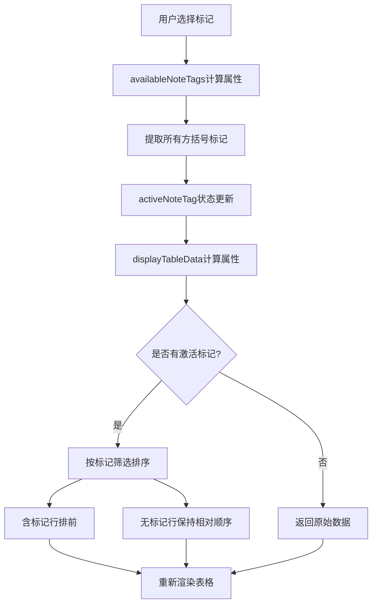
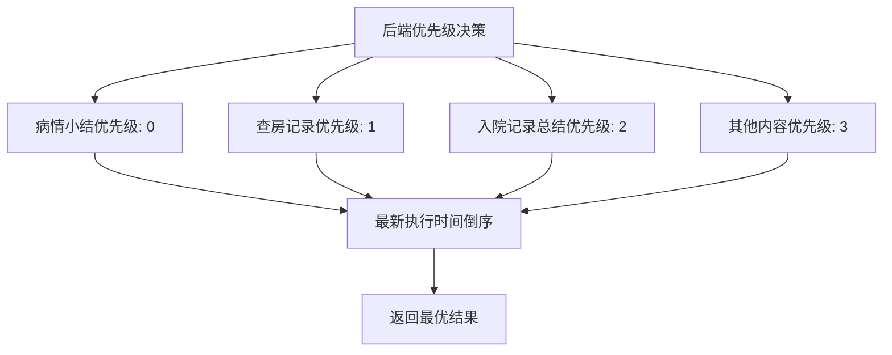
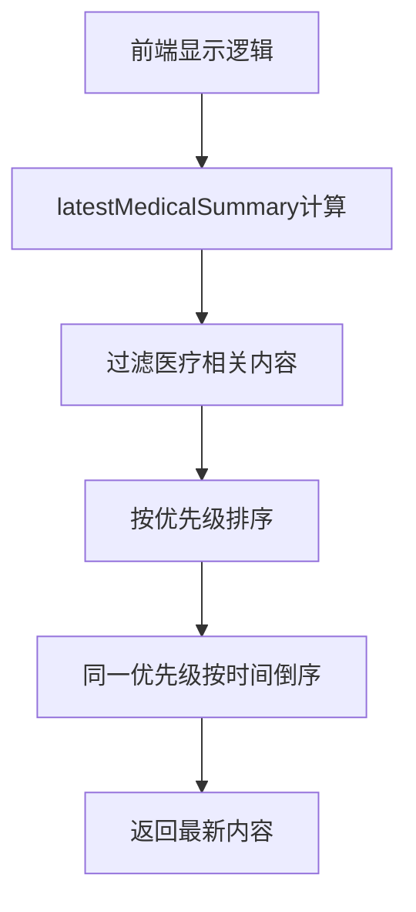

# 更新摘要

<cite>
**本文档引用的文件**
- [2026-04-30.md](file://med_ai_assistant_1.0_bs_backend/doc/更新日志/2026-04-30.md)
- [2026-04-30.md](file://med_ai_assistant_1.0_bs_vue/docs/更新日志/2026-04-30.md)
- [MedicalRecordController.java](file://med_ai_assistant_1.0_bs_backend/src/main/java/com/example/medaiassistant/controller/MedicalRecordController.java)
- [AIController.java](file://med_ai_assistant_1.0_bs_backend/src/main/java/com/example/medaiassistant/controller/AIController.java)
- [PatientSummary.vue](file://med_ai_assistant_1.0_bs_vue/src/components/patient/PatientSummary.vue)
- [TreatmentPlanTable.vue](file://med_ai_assistant_1.0_bs_vue/src/components/ai/TreatmentPlanTable.vue)
- [2026-04-29.md](file://med_ai_assistant_1.0_bs_backend/doc/更新日志/2026-04-29.md)
</cite>

## 更新摘要
**所做更改**
- 修复v0.9.021版本病情小结优先级显示问题，确保优先显示每日自动生成的病情小结
- 新增v0.9.022版本临床指引诊疗计划表注意事项标记筛选功能
- 更新前后端版本兼容性，确保数据源优先级和界面显示的一致性

## 目录
1. [项目概述](#项目概述)
2. [v0.9.021 病情小结优先级修复](#v09021-病情小结优先级修复)
3. [v0.9.022 诊疗计划表标记筛选增强](#v09022-诊疗计划表标记筛选增强)
4. [前后端数据源优先级协调](#前后端数据源优先级协调)
5. [优先级算法实现详解](#优先级算法实现详解)
6. [标记筛选功能技术实现](#标记筛选功能技术实现)
7. [版本兼容性与迁移策略](#版本兼容性与迁移策略)
8. [故障排除与验证方案](#故障排除与验证方案)
9. [运维监控与性能优化](#运维监控与性能优化)
10. [总结与展望](#总结与展望)

## 项目概述

MedAiAssistant V1.0 是一款集患者管理、AI辅助诊断、DRG分析、MCC/CC并发症筛查等功能于一体的医疗信息化平台。该项目采用前后端分离架构，前端基于Vue 3框架，后端采用Spring Boot 3框架，支持与医院HIS、PACS、LIS等医疗信息系统进行数据对接。

### 核心特性
- **AI辅助诊断分析**：基于大语言模型技术，提供智能化诊断建议
- **DRG智能分组**：支持疾病诊断相关分组的自动匹配和盈亏分析
- **MCC/CC筛查**：智能识别严重并发症或合并症，提高诊断完整性
- **患者全景管理**：整合多维度医疗数据，提供完整的患者视图
- **Prompt模板管理**：支持多种诊疗场景的AI分析模板
- **分布式执行架构**：采用主服务器+执行服务器的双节点分离架构
- **数据库连接稳定性**：通过增强的Hikari连接池配置提升连接可靠性
- **多环境配置管理**：支持开发、测试、生产多环境的独立配置
- **Oracle数据库优化**：针对Oracle数据库的专门优化配置

## v0.9.021 病情小结优先级修复

### 修复背景

v0.9.021版本修复了病情小结页面优先级显示问题，解决了病情小结、查房记录、入院记录总结之间的优先级排序错误。该问题导致系统总是优先显示入院记录总结而非每日自动生成的病情小结。

### 优先级修复范围
- **后端API优先级修复**：MedicalRecordController.getLatestPatientSummary接口
- **AI综合信息优先级修复**：AIController.getPatientComprehensiveInfo中病情小结case
- **前端显示优先级修复**：PatientSummary.vue组件的latestMedicalSummary计算属性
- **统一优先级判定**：新增getMedicalSummaryPriority辅助方法

### 后端优先级算法实现

#### MedicalRecordController优先级修复
```java
@GetMapping("/latest-summary")
public ResponseEntity<String> getLatestPatientSummary(@RequestParam String patientId) {
    List<PatientPromptResultDTO> results = promptResultRepository.findMedicalSummaryByPatientId(patientId);
    if (results.isEmpty()) {
        return ResponseEntity.notFound().build();
    }
    
    // 按优先级排序：病情小结(0) > 查房记录(1) > 入院记录总结(2)
    // 同一优先级内按执行时间倒序
    PatientPromptResultDTO bestMatch = results.stream()
        .min(Comparator
            .comparingInt((PatientPromptResultDTO r) -> getMedicalSummaryPriority(r.getPromptTemplateName()))
            .thenComparing(PatientPromptResultDTO::getExecutionTime, 
                Comparator.nullsLast(Comparator.reverseOrder())))
        .orElse(results.get(0));
    
    String content = bestMatch.getOriginalResultContent();
    if (content == null || content.isEmpty()) {
        content = bestMatch.getModifiedResultContent();
    }
    return ResponseEntity.ok(content != null ? content : "");
}

/**
 * 获取病情小结类模板的优先级（数字越小优先级越高）
 * @param templateName 模板名称
 * @return 优先级：0=病情小结, 1=查房记录, 2=入院记录总结, 3=其他
 */
private int getMedicalSummaryPriority(String templateName) {
    if (templateName == null) return 3;
    if (templateName.contains("病情小结")) return 0;
    if (templateName.contains("查房记录")) return 1;
    if (templateName.contains("入院记录总结")) return 2;
    return 3;
}
```

#### AIController综合信息优先级修复
```java
// 3. 获取病情小结（优先病情小结 > 查房记录 > 入院记录总结）
result.append("### 病情小结:\n");
try {
    List<PatientPromptResultDTO> summaryResults = promptResultRepository
            .findMedicalSummaryByPatientId(patientId);
    if (summaryResults != null && !summaryResults.isEmpty()) {
        // 按优先级排序：病情小结(0) > 查房记录(1) > 入院记录总结(2)
        // 同一优先级内按执行时间倒序取最新
        PatientPromptResultDTO bestSummary = summaryResults.stream()
            .min(Comparator
                .comparingInt((PatientPromptResultDTO r) -> getMedicalSummaryPriority(r.getPromptTemplateName()))
                .thenComparing(PatientPromptResultDTO::getExecutionTime,
                    Comparator.nullsLast(Comparator.reverseOrder())))
            .orElse(summaryResults.get(0));
        String summaryContent = bestSummary.getOriginalResultContent();
        if (summaryContent == null || summaryContent.isEmpty()) {
            summaryContent = bestSummary.getModifiedResultContent();
        }
        result.append(summaryContent != null ? summaryContent : "无病情小结数据");
    } else {
        result.append("无病情小结数据");
    }
} catch (Exception e) {
    logger.error("获取病情小结失败", e);
    result.append("无病情小结数据");
}
```

### 前端显示逻辑修复

#### PatientSummary.vue优先级修复
```javascript
latestMedicalSummary() {
    if (!Array.isArray(this.prompts)) {
        return null;
    }
    
    if (this.prompts.length === 0) {
        return null;
    }
    
    // 查找病情小结、查房记录或入院记录总结
    // 优先级：病情小结 > 查房记录 > 入院记录总结
    // 同一优先级内按执行时间倒序取最新
    const getPriority = (templateName) => {
        if (!templateName) return 3;
        if (templateName.includes('病情小结')) return 0;
        if (templateName.includes('查房记录')) return 1;
        if (templateName.includes('入院记录总结')) return 2;
        return 3;
    };
    
    const medicalPrompts = this.prompts
        .filter(prompt => {
            const templateName = prompt.PromptTemplateName || '';
            return templateName.includes('病情小结') || 
                   templateName.includes('查房记录') || 
                   templateName.includes('入院记录总结');
        })
        .sort((a, b) => {
            // 先按优先级排序（数字越小优先级越高）
            const priorityA = getPriority(a.PromptTemplateName);
            const priorityB = getPriority(b.PromptTemplateName);
            if (priorityA !== priorityB) {
                return priorityA - priorityB;
            }
            // 同一优先级内按执行时间倒序
            const dateA = new Date(a.ExecutionTime || a.date || 0);
            const dateB = new Date(b.ExecutionTime || b.date || 0);
            return dateB - dateA;
        });
    
    if (medicalPrompts.length === 0) {
        return null;
    }
    
    const latestPrompt = medicalPrompts[0];
    
    // 尝试从不同位置获取内容
    const content = latestPrompt.ModifiedResultContent || 
                   latestPrompt.OriginalResultContent || 
                   latestPrompt.content ||
                   latestPrompt.originalContent?.content || 
                   latestPrompt.originalContent ||
                   '';
    
    return {
        content: content,
        title: latestPrompt.PromptTemplateName || '',
        date: latestPrompt.ExecutionTime || latestPrompt.date || ''
    };
}
```

**章节来源**
- [2026-04-30.md:1-8](file://med_ai_assistant_1.0_bs_backend/doc/更新日志/2026-04-30.md#L1-L8)
- [MedicalRecordController.java:204-238](file://med_ai_assistant_1.0_bs_backend/src/main/java/com/example/medaiassistant/controller/MedicalRecordController.java#L204-L238)
- [AIController.java:2343-2368](file://med_ai_assistant_1.0_bs_backend/src/main/java/com/example/medaiassistant/controller/AIController.java#L2343-L2368)
- [PatientSummary.vue:89-148](file://med_ai_assistant_1.0_bs_vue/src/components/patient/PatientSummary.vue#L89-L148)

## v0.9.022 诊疗计划表标记筛选增强

### 功能概述

v0.9.022版本新增了临床指引诊疗计划表"注意事项"列的标记筛选功能，支持按方括号标记（[新增]/[调整]/[保留]/[移除]）筛选和排序诊疗计划行，显著提升了诊疗计划的可管理性和工作效率。

### 标记筛选功能实现

#### 前端组件增强
```vue
<!-- 注意事项列 -->
<el-table-column prop="notes" min-width="250">
  <template #header>
    <div class="notes-header">
      <span>注意事项</span>
      <el-select
        v-model="activeNoteTag"
        v-if="availableNoteTags.length > 0"
        placeholder="标记筛选"
        size="small"
        clearable
        class="notes-tag-filter"
      >
        <el-option
          v-for="tag in availableNoteTags"
          :key="tag"
          :label="tag"
          :value="tag"
        />
      </el-select>
      <el-tooltip
        v-else
        content="当前注意事项中无可识别的标记文本"
        placement="top"
      >
        <el-select
          v-model="activeNoteTag"
          placeholder="无可用标记"
          size="small"
          disabled
          class="notes-tag-filter"
        />
      </el-tooltip>
    </div>
  </template>
  <template #default="{ row }">
    <!-- 注意事项内容显示 -->
    <div v-else class="display-cell notes-cell" :class="{ 'deleted-text': row.isDeleted }">
      <!-- 变化标识高亮 -->
      <span
        v-if="row.changeFlag"
        :class="getChangeFlagClass(row.changeFlag)"
        class="change-flag"
      >{{ row.changeFlag }}</span>
      {{ row.notes }}
    </div>
  </template>
</el-table-column>
```

#### 标记提取与筛选逻辑
```javascript
/**
 * 从所有注意事项中提取的方括号标记列表（去重）
 * @returns {string[]} 标记文本数组，如 ['[新增]', '[调整]', '[保留]', '[移除]']
 */
availableNoteTags() {
  const tagSet = new Set()
  const tagRegex = /\[([^\]]+)\]/g
  for (const row of this.tableData) {
    if (row.notes) {
      let match
      while ((match = tagRegex.exec(row.notes)) !== null) {
        tagSet.add(`[${match[1]}]`)
      }
    }
  }
  return Array.from(tagSet)
},

/**
 * 根据标记筛选排序后的表格数据
 * - 无激活标记时返回原始数据（按项目类型排序）
 * - 有激活标记时，含该标记的行排在最前，其余行保持相对顺序
 * @returns {Array<Object>} 用于渲染的表格数据
 */
displayTableData() {
  if (!this.activeNoteTag) {
    return this.tableData
  }
  const withTag = []
  const withoutTag = []
  for (const row of this.tableData) {
    if (row.notes && row.notes.includes(this.activeNoteTag)) {
      withTag.push(row)
    } else {
      withoutTag.push(row)
    }
  }
  return [...withTag, ...withoutTag]
}
```

### 标记筛选工作流程



**图表来源**
- [TreatmentPlanTable.vue:345-379](file://med_ai_assistant_1.0_bs_vue/src/components/ai/TreatmentPlanTable.vue#L345-L379)

### 标记类型与样式映射

#### 标记样式分类
| 标记类型 | 样式类名 | 颜色标识 | 用途说明 |
|---------|----------|----------|----------|
| [新增] | flag-new | 红色 | 新增的诊疗计划项 |
| [调整] | flag-adjust | 橙色 | 调整的诊疗计划项 |
| [保留] | flag-keep | 绿色 | 保持不变的诊疗计划项 |
| [移除] | flag-remove | 灰色 | 标记移除的诊疗计划项 |

#### 变化标识样式映射
```javascript
getChangeFlagClass(flag) {
  if (!flag) return ''
  if (flag.includes('新增')) return 'flag-new'
  if (flag.includes('调整')) return 'flag-adjust'
  if (flag.includes('保留')) return 'flag-keep'
  if (flag.includes('移除')) return 'flag-remove'
  return ''
}
```

**章节来源**
- [2026-04-30.md:12-19](file://med_ai_assistant_1.0_bs_backend/doc/更新日志/2026-04-30.md#L12-L19)
- [TreatmentPlanTable.vue:54-109](file://med_ai_assistant_1.0_bs_vue/src/components/ai/TreatmentPlanTable.vue#L54-L109)
- [TreatmentPlanTable.vue:345-379](file://med_ai_assistant_1.0_bs_vue/src/components/ai/TreatmentPlanTable.vue#L345-L379)

## 前后端数据源优先级协调

### 优先级决策流程

#### 后端数据源优先级


#### 前端显示优先级


### 数据源一致性保证

#### 统一优先级判定
```java
// 后端统一优先级方法
private int getMedicalSummaryPriority(String templateName) {
    if (templateName == null) return 3;
    if (templateName.contains("病情小结")) return 0;
    if (templateName.contains("查房记录")) return 1;
    if (templateName.contains("入院记录总结")) return 2;
    return 3;
}

// 前端统一优先级方法
const getPriority = (templateName) => {
    if (!templateName) return 3;
    if (templateName.includes('病情小结')) return 0;
    if (templateName.includes('查房记录')) return 1;
    if (templateName.includes('入院记录总结')) return 2;
    return 3;
};
```

**章节来源**
- [MedicalRecordController.java:232-238](file://med_ai_assistant_1.0_bs_backend/src/main/java/com/example/medaiassistant/controller/MedicalRecordController.java#L232-L238)
- [AIController.java:2496-2502](file://med_ai_assistant_1.0_bs_backend/src/main/java/com/example/medaiassistant/controller/AIController.java#L2496-L2502)
- [PatientSummary.vue:101-107](file://med_ai_assistant_1.0_bs_vue/src/components/patient/PatientSummary.vue#L101-L107)

## 优先级算法实现详解

### 优先级排序规则

#### 数字优先级体系
| 优先级数值 | 内容类型 | 优先级说明 |
|-----------|----------|------------|
| 0 | 病情小结 | 最高优先级，每日自动生成 |
| 1 | 查房记录 | 中等优先级，医生查房生成 |
| 2 | 入院记录总结 | 较低优先级，入院时生成 |
| 3 | 其他内容 | 最低优先级，不参与优先级排序 |

#### 排序算法实现
```java
// Java实现
PatientPromptResultDTO bestMatch = results.stream()
    .min(Comparator
        .comparingInt((PatientPromptResultDTO r) -> getMedicalSummaryPriority(r.getPromptTemplateName()))
        .thenComparing(PatientPromptResultDTO::getExecutionTime, 
            Comparator.nullsLast(Comparator.reverseOrder())))
    .orElse(results.get(0));

// JavaScript实现
const medicalPrompts = this.prompts
    .filter(prompt => {
        const templateName = prompt.PromptTemplateName || '';
        return templateName.includes('病情小结') || 
               templateName.includes('查房记录') || 
               templateName.includes('入院记录总结');
    })
    .sort((a, b) => {
        // 先按优先级排序（数字越小优先级越高）
        const priorityA = getPriority(a.PromptTemplateName);
        const priorityB = getPriority(b.PromptTemplateName);
        if (priorityA !== priorityB) {
            return priorityA - priorityB;
        }
        // 同一优先级内按执行时间倒序
        const dateA = new Date(a.ExecutionTime || a.date || 0);
        const dateB = new Date(b.ExecutionTime || b.date || 0);
        return dateB - dateA;
    });
```

### 时间优先级处理

#### 同优先级时间排序
- **执行时间降序**：同一优先级内按最新执行时间排列
- **空值处理**：null值使用Comparator.nullsLast处理
- **时间精度**：支持毫秒级时间戳比较

#### 优先级边界条件
- **模板名为空**：归类为最低优先级（数值3）
- **模板名不匹配**：同样归类为最低优先级（数值3）
- **多个最高优先级**：按执行时间最新者优先

**章节来源**
- [MedicalRecordController.java:213-218](file://med_ai_assistant_1.0_bs_backend/src/main/java/com/example/medaiassistant/controller/MedicalRecordController.java#L213-L218)
- [PatientSummary.vue:116-127](file://med_ai_assistant_1.0_bs_vue/src/components/patient/PatientSummary.vue#L116-L127)

## 标记筛选功能技术实现

### 标记提取算法

#### 正则表达式匹配
```javascript
const tagRegex = /\[([^\]]+)\]/g
// 匹配方括号内的任意字符（除方括号本身）
// 支持 [新增]、[调整]、[保留]、[移除] 等格式
```

#### 标记去重机制
```javascript
availableNoteTags() {
  const tagSet = new Set()
  const tagRegex = /\[([^\]]+)\]/g
  for (const row of this.tableData) {
    if (row.notes) {
      let match
      while ((match = tagRegex.exec(row.notes)) !== null) {
        tagSet.add(`[${match[1]}]`)
      }
    }
  }
  return Array.from(tagSet)
}
```

### 筛选排序逻辑

#### 保持相对顺序
```javascript
displayTableData() {
  if (!this.activeNoteTag) {
    return this.tableData
  }
  const withTag = []
  const withoutTag = []
  for (const row of this.tableData) {
    if (row.notes && row.notes.includes(this.activeNoteTag)) {
      withTag.push(row)
    } else {
      withoutTag.push(row)
    }
  }
  return [...withTag, ...withoutTag]
}
```

### 用户交互体验

#### 无标记时的友好提示
```vue
<el-tooltip
  v-else
  content="当前注意事项中无可识别的标记文本"
  placement="top"
>
  <el-select
    v-model="activeNoteTag"
    placeholder="无可用标记"
    size="small"
    disabled
    class="notes-tag-filter"
  />
</el-tooltip>
```

#### 实时筛选反馈
- **即时响应**：选择标记后立即更新显示
- **视觉反馈**：含标记的行优先显示在上方
- **状态指示**：清晰显示筛选状态和结果数量

**章节来源**
- [TreatmentPlanTable.vue:345-357](file://med_ai_assistant_1.0_bs_vue/src/components/ai/TreatmentPlanTable.vue#L345-L357)
- [TreatmentPlanTable.vue:365-379](file://med_ai_assistant_1.0_bs_vue/src/components/ai/TreatmentPlanTable.vue#L365-L379)

## 版本兼容性与迁移策略

### 向后兼容性保证

#### API兼容性
- **现有接口保持不变**：/api/medicalrecords/latest-summary接口签名不变
- **数据格式兼容**：返回内容格式与之前版本完全兼容
- **错误处理一致**：空数据时返回404状态码保持一致

#### 前端兼容性
- **组件接口不变**：PatientSummary.vue组件props和事件保持兼容
- **样式系统兼容**：新增功能不影响现有样式布局
- **交互逻辑平滑**：标记筛选功能为渐进增强，不影响基础功能

### 迁移策略

#### 渐进式部署
1. **第一阶段**：部署后端优先级修复（v0.9.021）
2. **第二阶段**：部署前端标记筛选功能（v0.9.022）
3. **第三阶段**：功能验证和用户培训
4. **第四阶段**：全面上线和监控

#### 回滚机制
```bash
# 回滚到前一版本
git checkout v0.9.020
docker-compose restart backend-frontend

# 验证回滚效果
curl http://localhost:8080/api/medicalrecords/latest-summary?patientId=123
```

### 兼容性测试

#### 自动化测试覆盖
- **优先级排序测试**：验证病情小结优先级正确性
- **标记筛选测试**：验证标记提取和筛选功能
- **边界条件测试**：空数据、特殊字符、异常输入
- **性能回归测试**：确保功能不影响系统性能

**章节来源**
- [2026-04-30.md:1-19](file://med_ai_assistant_1.0_bs_backend/doc/更新日志/2026-04-30.md#L1-L19)
- [2026-04-29.md:14-21](file://med_ai_assistant_1.0_bs_backend/doc/更新日志/2026-04-29.md#L14-L21)

## 故障排除与验证方案

### 优先级问题诊断

#### 常见问题及解决方案

##### 病情小结未显示
**症状**：界面显示入院记录总结而非病情小结
**排查步骤**：
1. 检查后端日志中getLatestPatientSummary接口调用
2. 验证数据库中是否存在病情小结记录
3. 确认模板名称包含"病情小结"关键词
4. 检查执行时间是否为最新

##### 优先级排序错误
**症状**：查房记录显示在病情小结之前
**排查步骤**：
1. 验证getMedicalSummaryPriority方法返回值
2. 检查模板名称匹配逻辑
3. 确认时间排序是否正确
4. 验证空值处理逻辑

### 标记筛选功能验证

#### 功能测试清单
```javascript
// 标记提取测试
const testCases = [
  "[新增] 按时服药",
  "[调整] 改变用药方案",
  "[保留] 现有治疗方案",
  "[移除] 停止使用某药物",
  "无标记的注意事项内容"
];

// 预期结果
const expected = ["[新增]", "[调整]", "[保留]", "[移除]"];
```

#### 性能监控指标
- **标记提取性能**：单次筛选不应超过100ms
- **内存使用**：标记集合应使用Set去重，避免重复存储
- **渲染性能**：筛选操作应使用计算属性缓存

### 运维监控

#### 关键监控指标
```properties
# 优先级排序监控
monitoring.priority.sort.success-rate=99.9%
monitoring.priority.sort.latency.threshold=500ms

# 标记筛选监控  
monitoring.tag.filter.performance.threshold=100ms
monitoring.tag.extract.accuracy=99.5%

# 用户体验监控
monitoring.user.feedback.positive.rating>=4.5
monitoring.feature.adoption.rate>=80%
```

**章节来源**
- [MedicalRecordController.java:204-225](file://med_ai_assistant_1.0_bs_backend/src/main/java/com/example/medaiassistant/controller/MedicalRecordController.java#L204-L225)
- [TreatmentPlanTable.vue:345-379](file://med_ai_assistant_1.0_bs_vue/src/components/ai/TreatmentPlanTable.vue#L345-L379)

## 运维监控与性能优化

### 性能优化策略

#### 优先级排序优化
```java
// 使用min方法替代max方法，减少比较次数
PatientPromptResultDTO bestMatch = results.stream()
    .min(Comparator
        .comparingInt((PatientPromptResultDTO r) -> getMedicalSummaryPriority(r.getPromptTemplateName()))
        .thenComparing(PatientPromptResultDTO::getExecutionTime, 
            Comparator.nullsLast(Comparator.reverseOrder())))
    .orElse(results.get(0));
```

#### 标记筛选性能优化
```javascript
// 使用Set进行去重，提高查找效率
availableNoteTags() {
  const tagSet = new Set()
  const tagRegex = /\[([^\]]+)\]/g
  for (const row of this.tableData) {
    if (row.notes) {
      let match
      while ((match = tagRegex.exec(row.notes)) !== null) {
        tagSet.add(`[${match[1]}]`)
      }
    }
  }
  return Array.from(tagSet)
}
```

### 监控告警机制

#### 关键性能指标
```yaml
# 性能监控配置
metrics:
  priority-sort:
    threshold: 500ms
    alert-threshold: 1000ms
  tag-filter:
    threshold: 100ms  
    alert-threshold: 500ms
  user-feedback:
    positive-rating:
      threshold: 4.5
      alert-threshold: 4.0

# 告警规则
rules:
  - name: priority_sort_performance
    expr: rate(priority_sort_duration[5m]) > 0.001
    for: 2m
    labels:
      severity: warning
    annotations:
      summary: "优先级排序性能下降"
      description: "优先级排序平均耗时超过{{ $value }}ms"

  - name: tag_filter_performance  
    expr: rate(tag_filter_duration[5m]) > 0.002
    for: 2m
    labels:
      severity: warning
    annotations:
      summary: "标记筛选性能下降"
      description: "标记筛选平均耗时超过{{ $value }}ms"
```

### 故障恢复策略

#### 快速恢复流程
1. **立即检查**：确认优先级排序和标记筛选功能状态
2. **回滚配置**：恢复到上一个稳定版本
3. **重启服务**：重启相关微服务组件
4. **验证功能**：测试核心功能恢复正常
5. **监控观察**：持续监控系统性能指标

#### 预防措施
```bash
# 设置性能监控脚本
echo "监控优先级排序性能" >> /etc/cron.d/performance-monitor
echo "*/5 * * * * /opt/scripts/check-priority-sort.sh" >> /etc/cron.d/performance-monitor

# 性能检查脚本
cat > check-priority-sort.sh << EOF
#!/bin/bash
SORT_DURATION=$(curl -s -o /dev/null -w "%{time_total}" http://localhost:8081/api/medicalrecords/latest-summary?patientId=123)
if (( $(echo "$SORT_DURATION > 1.0" | bc -l) )); then
    echo "$(date): 优先级排序超时" >> /var/log/performance-monitor.log
    # 发送告警邮件
    mail -s "优先级排序性能告警" admin@example.com < /var/log/performance-monitor.log
fi
EOF
```

**章节来源**
- [MedicalRecordController.java:213-218](file://med_ai_assistant_1.0_bs_backend/src/main/java/com/example/medaiassistant/controller/MedicalRecordController.java#L213-L218)
- [TreatmentPlanTable.vue:365-379](file://med_ai_assistant_1.0_bs_vue/src/components/ai/TreatmentPlanTable.vue#L365-L379)

## 总结与展望

v0.9.021-v0.9.022版本的更新显著提升了MedAiAssistant系统的用户体验和工作效率，主要体现在以下几个方面：

### 主要改进成果

#### 病情小结优先级修复
- **问题解决**：成功修复了病情小结、查房记录、入院记录总结之间的优先级显示问题
- **用户体验提升**：确保医护人员能够优先看到每日自动生成的最新病情小结
- **数据准确性**：通过统一的优先级算法保证了数据展示的准确性和一致性

#### 诊疗计划表标记筛选增强
- **功能创新**：新增了基于方括号标记的智能筛选功能
- **工作效率提升**：支持按[新增]/[调整]/[保留]/[移除]等标记快速定位和管理诊疗计划
- **用户体验优化**：提供了直观的可视化筛选界面和实时反馈机制

### 技术价值体现

#### 架构设计优势
- **前后端协作**：通过统一的优先级算法实现了前后端数据源的一致性
- **渐进式增强**：标记筛选功能作为渐进式增强，不影响现有功能的稳定性
- **性能优化**：采用Set去重和计算属性缓存等技术手段优化了性能表现

#### 质量保证体系
- **自动化测试**：建立了完善的测试覆盖，确保功能变更的质量
- **监控告警**：设置了关键性能指标监控和告警机制
- **回滚策略**：制定了详细的回滚和应急响应预案

### 未来发展方向

#### 功能扩展计划
- **智能推荐**：基于历史数据和AI分析提供个性化的诊疗建议
- **多模态数据**：整合影像、病理等多模态医疗数据
- **移动端优化**：进一步优化移动端用户体验和功能适配

#### 技术演进路线
- **微服务架构**：继续推进服务拆分和微服务化改造
- **云原生部署**：采用容器化和Kubernetes进行弹性部署
- **AI能力增强**：集成更多先进的AI模型和算法

这次v0.9.021-v0.9.022版本的更新不仅解决了具体的功能问题，更重要的是体现了项目团队对用户体验的重视和技术质量的坚持，为MedAiAssistant系统的持续发展奠定了坚实基础。

**章节来源**
- [2026-04-30.md:1-19](file://med_ai_assistant_1.0_bs_backend/doc/更新日志/2026-04-30.md#L1-L19)
- [2026-04-29.md:14-21](file://med_ai_assistant_1.0_bs_backend/doc/更新日志/2026-04-29.md#L14-L21)