# 更新摘要

<cite>
**本文档引用的文件**
- [更新小结.md](file://更新小结.md)
- [2026-04-23.md](file://med_ai_assistant_1.0_bs_vue/docs/更新日志/2026-04-23.md)
- [PatientTabs.vue](file://med_ai_assistant_1.0_bs_vue/src/components/patient/PatientTabs.vue)
- [AIDiagnosisTab.vue](file://med_ai_assistant_1.0_bs_vue/src/components/patient/AIDiagnosisTab.vue)
- [DiagnosisEditPanel.vue](file://med_ai_assistant_1.0_bs_vue/src/components/ai/DiagnosisEditPanel.vue)
- [tooltips.js](file://med_ai_assistant_1.0_bs_vue/src/data/tooltips.js)
</cite>

## 更新摘要
**所做更改**
- 新增PatientTabs组件tooltip功能章节，详细介绍新增的完整tooltip功能实现
- 更新患者标签页架构章节，重点说明新增的AI诊断辅助标签页集成方式
- 新增懒加载机制章节，解释AI诊断辅助标签页的性能优化策略
- 更新标签页重新排序章节，说明各标签页的最终排列顺序
- 新增tooltip配置管理章节，介绍tooltip功能的统一配置和管理

## 目录
1. [项目概述](#项目概述)
2. [项目结构](#项目结构)
3. [核心组件](#核心组件)
4. [架构概览](#架构概览)
5. [详细组件分析](#详细组件分析)
6. [PatientTabs组件增强](#patienttabs组件增强)
7. [新增AI诊断辅助标签页](#新增ai诊断辅助标签页)
8. [懒加载机制实现](#懒加载机制实现)
9. [标签页重新排序](#标签页重新排序)
10. [tooltip功能配置](#tooltip功能配置)
11. [依赖关系分析](#依赖关系分析)
12. [性能考虑](#性能考虑)
13. [故障排除指南](#故障排除指南)
14. [结论](#结论)
15. [附录](#附录)

## 项目概述

MedAiAssistant V1.0 是一款集患者管理、AI辅助诊断、DRG分析、MCC/CC并发症筛查等功能于一体的医疗信息化平台。该项目采用前后端分离架构，前端基于Vue 3框架，后端采用Spring Boot 3框架，支持与医院HIS、PACS、LIS等医疗信息系统进行数据对接。

### 主要特性
- AI辅助诊断分析：基于大语言模型技术，提供智能化诊断建议
- DRG智能分组：支持疾病诊断相关分组的自动匹配和盈亏分析
- MCC/CC筛查：智能识别严重并发症或合并症，提高诊断完整性
- 患者全景管理：整合多维度医疗数据，提供完整的患者视图
- Prompt模板管理：支持多种诊疗场景的AI分析模板
- 分布式执行架构：采用主服务器+执行服务器的双节点分离架构
- **新增完整tooltip功能**：为所有标签页提供详细的悬停提示信息
- **新增AI诊断辅助标签页**：提供独立的AI诊断结果展示和编辑功能
- **懒加载机制优化**：通过条件渲染提升应用性能和用户体验

## 项目结构

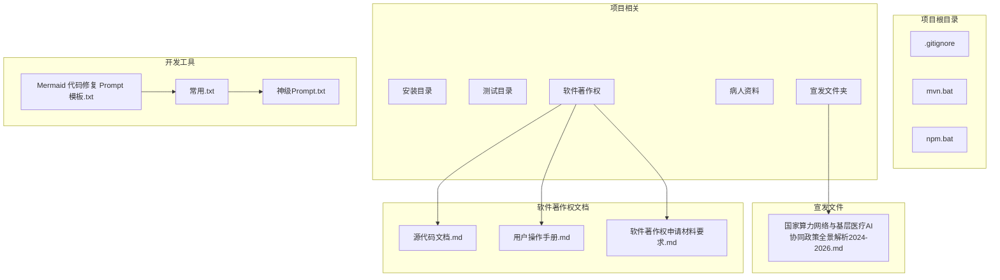

**图表来源**
- [.gitignore:1-43](file://.gitignore#L1-L43)
- [mvn.bat:1-5](file://mvn.bat#L1-L5)
- [npm.bat:1-3](file://npm.bat#L1-L3)

**章节来源**
- [.gitignore:1-43](file://.gitignore#L1-L43)
- [mvn.bat:1-5](file://mvn.bat#L1-L5)
- [npm.bat:1-3](file://npm.bat#L1-L3)

## 核心组件

### 后端配置组件

系统采用Spring Boot 3.x + Java 17的技术栈，包含以下核心配置组件：

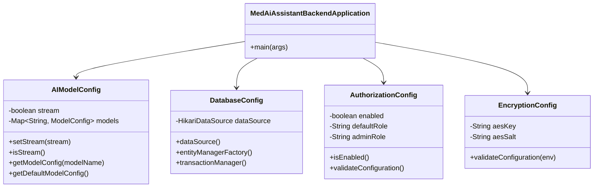

**图表来源**
- [源代码文档.md:21-47](file://项目相关/软件著作权/源代码文档.md#L21-L47)
- [源代码文档.md:50-217](file://项目相关/软件著作权/源代码文档.md#L50-L217)
- [源代码文档.md:220-363](file://项目相关/软件著作权/源代码文档.md#L220-L363)
- [源代码文档.md:366-512](file://项目相关/软件著作权/源代码文档.md#L366-L512)
- [源代码文档.md:515-572](file://项目相关/软件著作权/源代码文档.md#L515-L572)

### AI分析服务组件

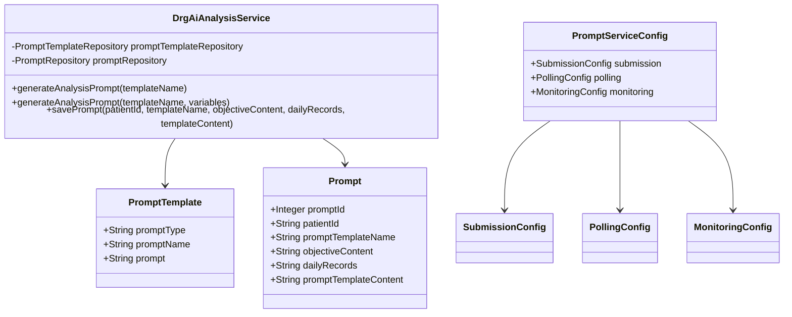

**图表来源**
- [源代码文档.md:700-800](file://项目相关/软件著作权/源代码文档.md#L700-L800)
- [源代码文档.md:575-697](file://项目相关/软件著作权/源代码文档.md#L575-L697)

**章节来源**
- [源代码文档.md:50-217](file://项目相关/软件著作权/源代码文档.md#L50-L217)
- [源代码文档.md:220-363](file://项目相关/软件著作权/源代码文档.md#L220-L363)
- [源代码文档.md:366-512](file://项目相关/软件著作权/源代码文档.md#L366-L512)
- [源代码文档.md:515-572](file://项目相关/软件著作权/源代码文档.md#L515-L572)
- [源代码文档.md:700-800](file://项目相关/软件著作权/源代码文档.md#L700-L800)

## 架构概览

系统采用分布式执行服务器架构，实现前后端分离和任务处理的解耦：

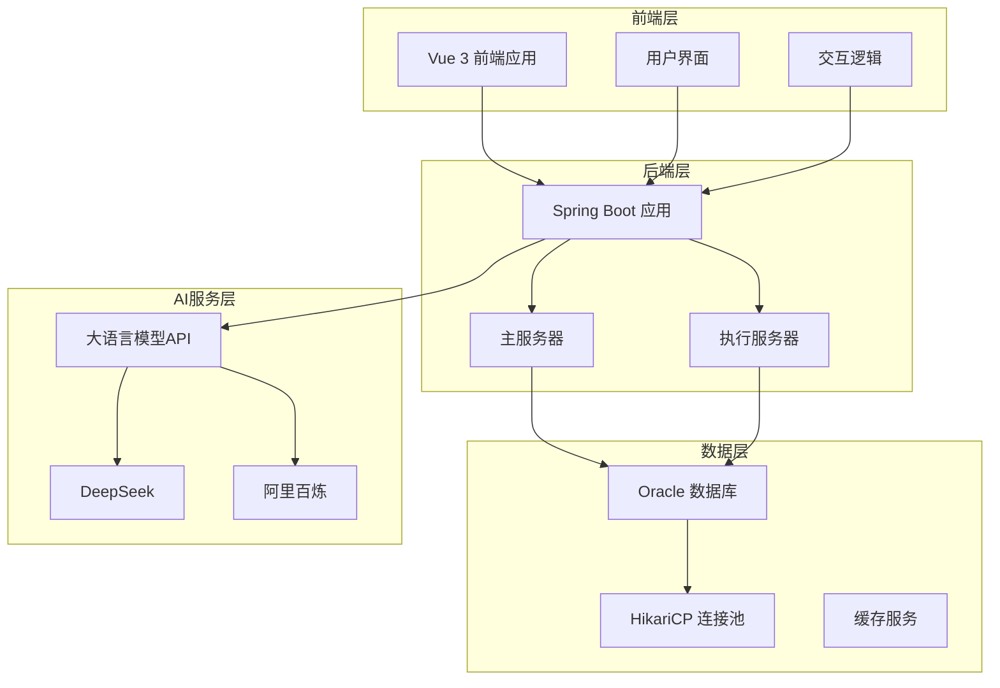

**图表来源**
- [用户操作手册.md:94-98](file://项目相关/软件著作权/用户操作手册.md#L94-L98)
- [源代码文档.md:270-283](file://项目相关/软件著作权/源代码文档.md#L270-L283)

## 详细组件分析

### AI模型配置管理

AI模型配置系统支持多种大语言模型的灵活配置和管理：

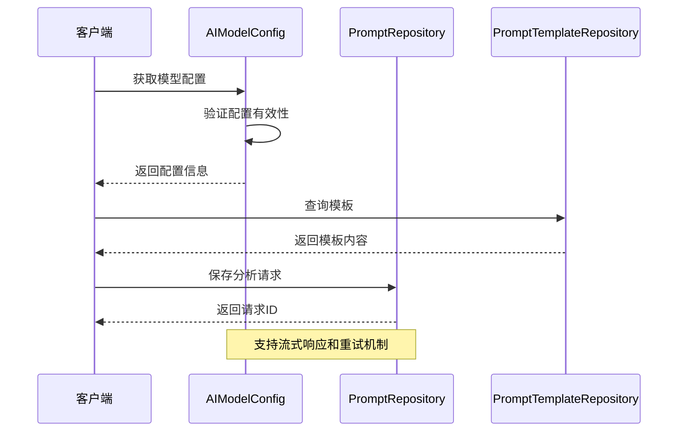

**图表来源**
- [源代码文档.md:64-217](file://项目相关/软件著作权/源代码文档.md#L64-L217)
- [源代码文档.md:714-800](file://项目相关/软件著作权/源代码文档.md#L714-L800)

### DRG分析流程

DRG分析采用双向匹配策略，确保诊断分组的准确性：

**图表来源**
- [用户操作手册.md:582-632](file://项目相关/软件著作权/用户操作手册.md#L582-L632)
- [用户操作手册.md:673-740](file://项目相关/软件著作权/用户操作手册.md#L673-L740)

**章节来源**
- [源代码文档.md:700-800](file://项目相关/软件著作权/源代码文档.md#L700-L800)
- [用户操作手册.md:589-632](file://项目相关/软件著作权/用户操作手册.md#L589-L632)
- [用户操作手册.md:673-740](file://项目相关/软件著作权/用户操作手册.md#L673-L740)

### 数据库连接池配置

系统采用HikariCP连接池，优化数据库连接性能：

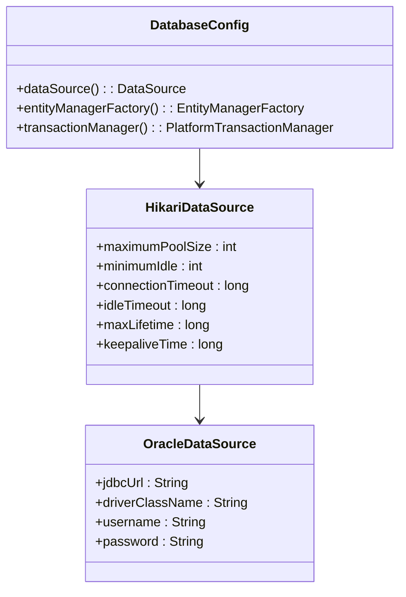

**图表来源**
- [源代码文档.md:270-328](file://项目相关/软件著作权/源代码文档.md#L270-L328)
- [源代码文档.md:284-320](file://项目相关/软件著作权/源代码文档.md#L284-L320)

**章节来源**
- [源代码文档.md:220-363](file://项目相关/软件著作权/源代码文档.md#L220-L363)

## PatientTabs组件增强

### tooltip功能实现

2026年4月23日更新为PatientTabs组件的所有标签页添加了完整的tooltip功能，提供了详细的悬停提示信息，显著提升了用户体验。

### tooltip配置结构

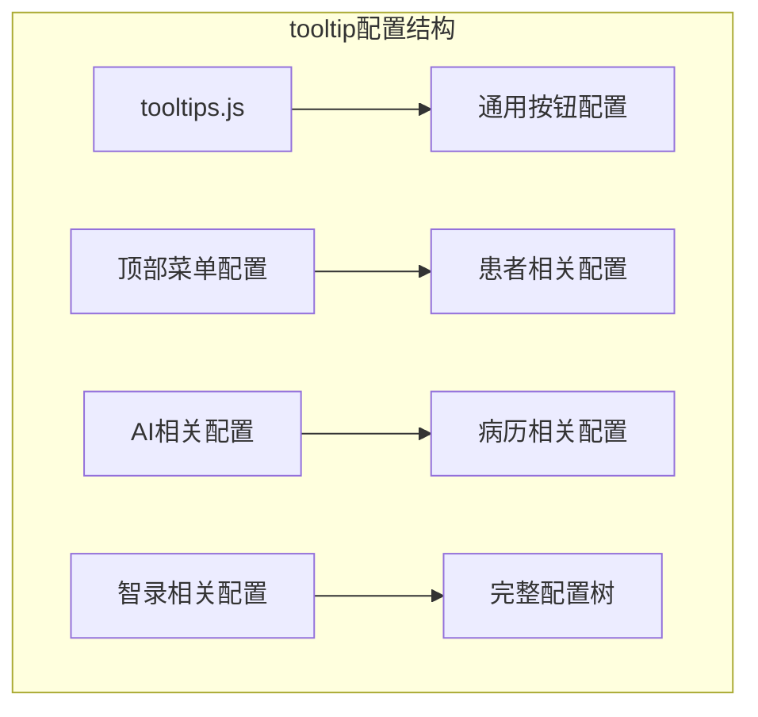

**图表来源**
- [tooltips.js:1-87](file://med_ai_assistant_1.0_bs_vue/src/data/tooltips.js#L1-L87)

### 各标签页tooltip内容

#### 基础信息标签页
- **tooltip内容**："患者基本信息"
- **用途**：提供患者基本信息的详细说明
- **显示位置**：底部悬停提示

#### 病情小结标签页
- **tooltip内容**："病情小结"
- **用途**：说明该标签页展示患者当前病情总结
- **显示位置**：底部悬停提示

#### AI诊断辅助标签页
- **tooltip内容**："AI诊断辅助"
- **用途**：详细介绍AI诊断辅助功能的作用
- **显示位置**：底部悬停提示

#### 临床指引标签页
- **tooltip内容**："临床指引"
- **用途**：说明临床指引的指导作用
- **显示位置**：底部悬停提示

#### 病历记录标签页
- **tooltip内容**："病历记录"
- **用途**：提供病历记录的详细说明
- **显示位置**：底部悬停提示

#### 长期医嘱标签页
- **tooltip内容**："长期医嘱"
- **用途**：说明长期医嘱的管理功能
- **显示位置**：底部悬停提示

#### 临时医嘱标签页
- **tooltip内容**："临时医嘱"
- **用途**：介绍临时医嘱的使用场景
- **显示位置**：底部悬停提示

#### 检查报告标签页
- **tooltip内容**："检查报告"
- **用途**：提供检查报告的详细说明
- **显示位置**：底部悬停提示

#### 化验检验标签页
- **tooltip内容**："化验检验"
- **用途**：说明化验检验结果的查看功能
- **显示位置**：底部悬停提示

#### DRG分析标签页
- **tooltip内容**："DRG数据分析"
- **用途**：介绍DRG分析的专业含义
- **显示位置**：底部悬停提示

**章节来源**
- [2026-04-23.md:5-16](file://med_ai_assistant_1.0_bs_vue/docs/更新日志/2026-04-23.md#L5-L16)
- [PatientTabs.vue:6-8](file://med_ai_assistant_1.0_bs_vue/src/components/patient/PatientTabs.vue#L6-L8)
- [PatientTabs.vue:14-16](file://med_ai_assistant_1.0_bs_vue/src/components/patient/PatientTabs.vue#L14-L16)
- [PatientTabs.vue:23-25](file://med_ai_assistant_1.0_bs_vue/src/components/patient/PatientTabs.vue#L23-L25)
- [PatientTabs.vue:32-34](file://med_ai_assistant_1.0_bs_vue/src/components/patient/PatientTabs.vue#L32-L34)
- [PatientTabs.vue:40-42](file://med_ai_assistant_1.0_bs_vue/src/components/patient/PatientTabs.vue#L40-L42)
- [PatientTabs.vue:48-50](file://med_ai_assistant_1.0_bs_vue/src/components/patient/PatientTabs.vue#L48-L50)
- [PatientTabs.vue:56-58](file://med_ai_assistant_1.0_bs_vue/src/components/patient/PatientTabs.vue#L56-L58)
- [PatientTabs.vue:64-66](file://med_ai_assistant_1.0_bs_vue/src/components/patient/PatientTabs.vue#L64-L66)
- [PatientTabs.vue:72-74](file://med_ai_assistant_1.0_bs_vue/src/components/patient/PatientTabs.vue#L72-L74)
- [PatientTabs.vue:80-82](file://med_ai_assistant_1.0_bs_vue/src/components/patient/PatientTabs.vue#L80-L82)

## 新增AI诊断辅助标签页

### 功能概述

2026年4月23日更新引入了全新的AI诊断辅助标签页功能，为用户提供独立的AI诊断结果展示和编辑界面。该功能基于现有的AI分析结果，提供更加直观和便捷的诊断管理体验。

### 技术架构

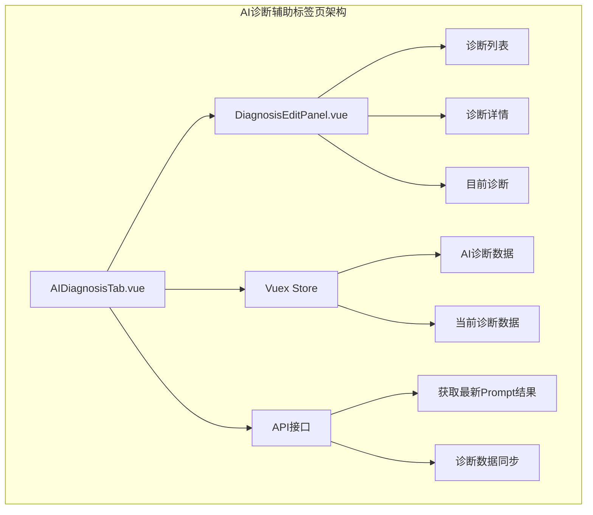

**图表来源**
- [AIDiagnosisTab.vue:1-316](file://med_ai_assistant_1.0_bs_vue/src/components/patient/AIDiagnosisTab.vue#L1-L316)
- [DiagnosisEditPanel.vue:1-722](file://med_ai_assistant_1.0_bs_vue/src/components/ai/DiagnosisEditPanel.vue#L1-L722)

### 核心功能特性

#### 1. 独立标签页设计
- **位置安排**：位于DRG分析之后、临床指引之前
- **懒加载策略**：使用`v-if`指令实现按需加载，避免不必要的API请求
- **状态管理**：与AI辅助页面的`AIResults.vue`保持数据流一致

#### 2. 多状态处理
- **加载状态**：显示旋转图标和加载提示
- **错误状态**：提供重试按钮和错误信息展示
- **空数据状态**：友好提示暂无诊断分析记录

#### 3. 数据解析与展示
- **时间格式化**：兼容Java LocalDateTime数组格式
- **诊断解析**：支持`extractDiagnosisBlocks`和`extractDiagnosisNames`双重解析策略
- **实时同步**：自动获取最新的AI诊断分析结果

**章节来源**
- [2026-04-23.md:22-28](file://med_ai_assistant_1.0_bs_vue/docs/更新日志/2026-04-23.md#L22-L28)
- [AIDiagnosisTab.vue:1-316](file://med_ai_assistant_1.0_bs_vue/src/components/patient/AIDiagnosisTab.vue#L1-L316)

## 懒加载机制实现

### 性能优化策略

AI诊断辅助标签页采用了智能的懒加载机制，通过条件渲染优化应用性能，减少不必要的资源消耗。

### 懒加载实现原理

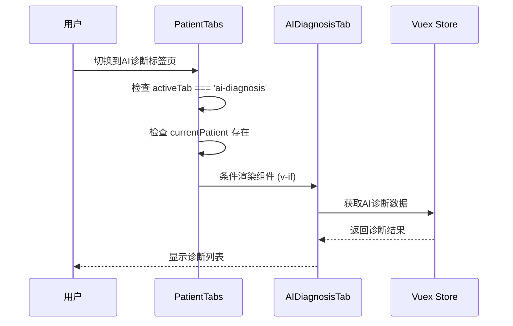

**图表来源**
- [PatientTabs.vue:20-29](file://med_ai_assistant_1.0_bs_vue/src/components/patient/PatientTabs.vue#L20-L29)

### 实现细节

#### 1. 条件渲染逻辑
- **激活判断**：使用`activeTab === 'ai-diagnosis'`确保只有在AI诊断辅助标签页激活时才渲染
- **患者检查**：结合`currentPatient`确保只有在有选中患者时才挂载组件

#### 2. 性能优化效果
- **按需加载**：避免组件在后台预加载，减少初始渲染负担
- **资源节约**：降低内存占用和网络请求频率
- **用户体验**：提升页面切换响应速度

#### 3. 数据同步机制
- **状态管理**：与Vuex store保持数据同步
- **组件通信**：通过props传递患者数据
- **生命周期**：正确处理组件的挂载和卸载

**章节来源**
- [PatientTabs.vue:27-28](file://med_ai_assistant_1.0_bs_vue/src/components/patient/PatientTabs.vue#L27-L28)

## 标签页重新排序

### 最终排列顺序

经过2026年4月23日的更新，PatientTabs组件的标签页按照以下顺序重新排列：

**图表来源**
- [PatientTabs.vue:4-85](file://med_ai_assistant_1.0_bs_vue/src/components/patient/PatientTabs.vue#L4-L85)

### 排序逻辑说明

#### 1. 信息获取优先级
- **基本信息**：最左侧，便于快速查看患者基础信息
- **病情小结**：紧随其后，提供患者当前病情概览

#### 2. 诊断相关性
- **AI诊断**：放置在临床指引之前，体现AI辅助诊断的重要性
- **临床指引**：位于AI诊断之后，提供专业的临床指导

#### 3. 医疗记录完整性
- **病历记录**：位于诊断相关标签页之后，便于查看完整病史
- **医嘱管理**：长期医嘱和临时医嘱相邻，方便对比管理

#### 4. 检查检验分类
- **检查报告**：检查类检查结果
- **化验检验**：化验类检查结果
- **DRG分析**：最后显示，作为整体分析总结

#### 5. 用户体验优化
- **功能相关性**：将相关的功能标签页相邻排列
- **操作流畅性**：按照医生日常查看病人的习惯顺序排列

**章节来源**
- [PatientTabs.vue:4-85](file://med_ai_assistant_1.0_bs_vue/src/components/patient/PatientTabs.vue#L4-L85)

## tooltip功能配置

### 配置管理架构

tooltip功能采用了统一的配置管理架构，通过专门的数据文件管理所有tooltip内容，确保配置的一致性和可维护性。

### 配置文件结构

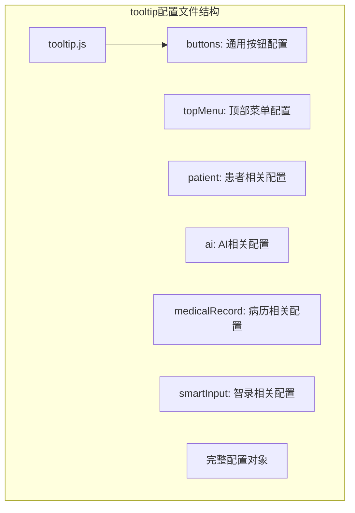

**图表来源**
- [tooltips.js:1-87](file://med_ai_assistant_1.0_bs_vue/src/data/tooltips.js#L1-L87)

### 配置内容详解

#### 1. 通用按钮配置
- **save**："保存当前内容"
- **submit**："提交数据"
- **cancel**："取消操作"
- **delete**："删除选中项"
- **refresh**："刷新数据"
- **create**："创建新记录"
- **enhance**："使用AI完善内容"

#### 2. 顶部菜单配置
- **home**："返回首页"
- **patient**："患者管理"
- **ai**："AI辅助诊断"
- **settings**："系统设置"
- **refresh**："刷新患者数据"
- **search**："搜索患者"
- **filter**："筛选患者列表"
- **aiSettings**："配置AI相关参数"
- **userSettings**："修改个人信息"
- **templates**："管理提示词模板"
- **dicSettings**："配置智录DIC参数"
- **system**："系统相关功能"
- **logout**："退出当前账号"
- **help**："获取帮助信息"

#### 3. 患者相关配置
- **info**："查看/编辑患者基本信息"
- **records**："查看患者病历记录"
- **orders**："管理患者医嘱"
- **tests**："查看检验检查结果"
- **list.bedNumber**："床位号"
- **list.admissionNumber**："住院号"
- **details.drgCode**："DRG诊断相关分组代码"
- **details.totalCost**："患者住院期间总费用"
- **details.profitLoss**："正数表示盈利，负数表示亏损"
- **details.diagnosis**："患者的主要诊断列表"
- **details.operation**："患者的手术/操作列表"

#### 4. AI相关配置
- **analyze**："分析患者数据"
- **generate**："生成诊断建议"
- **templates**："管理提示词模板"
- **editDiagnosis**："修改AI生成的诊断结果"
- **editContent**："编辑AI生成的内容"
- **saveContent**："保存编辑后的内容"
- **cancelEdit**："取消编辑并恢复原内容"
- **addDiagnosis**："将选中的文本添加为诊断"

#### 5. 病历相关配置
- **date**："病历记录的日期"
- **doctor**："负责医生姓名"
- **content**："病历详细内容"
- **backspace**："删除前一个字符"
- **delete**："删除选中的记录。请注意：删除操作不可逆。"
- **create**："创建新的病历记录"
- **save**："保存当前病历记录"
- **enhance**："使用AI完善病历内容"
- **form.date**："病历记录的日期"
- **form.doctor**："负责医生姓名"
- **form.content**："病历详细内容"

#### 6. 智录相关配置
- **up**："返回上一级"
- **query**："查询选中文本"
- **toplevel**："显示顶层"
- **close**："关闭智录面板"

**章节来源**
- [tooltips.js:1-87](file://med_ai_assistant_1.0_bs_vue/src/data/tooltips.js#L1-L87)

## 依赖关系分析

### 开发环境依赖

项目采用现代化的开发工具链，支持快速开发和部署：

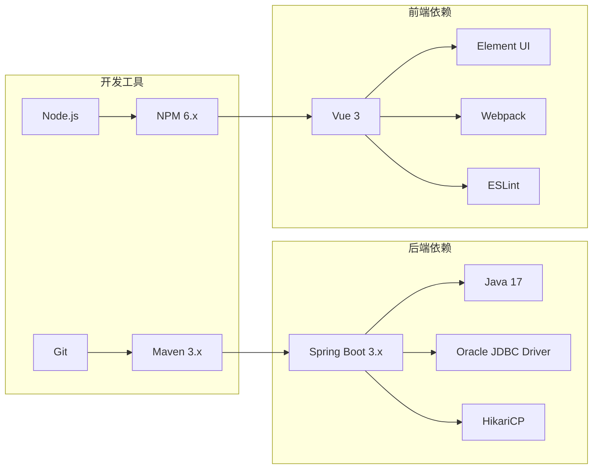

**图表来源**
- [用户操作手册.md:194-202](file://项目相关/软件著作权/用户操作手册.md#L194-L202)
- [常用.txt:66-76](file://项目相关/常用.txt#L66-L76)

**章节来源**
- [用户操作手册.md:194-202](file://项目相关/软件著作权/用户操作手册.md#L194-L202)
- [常用.txt:66-76](file://项目相关/常用.txt#L66-L76)

### 系统启动流程

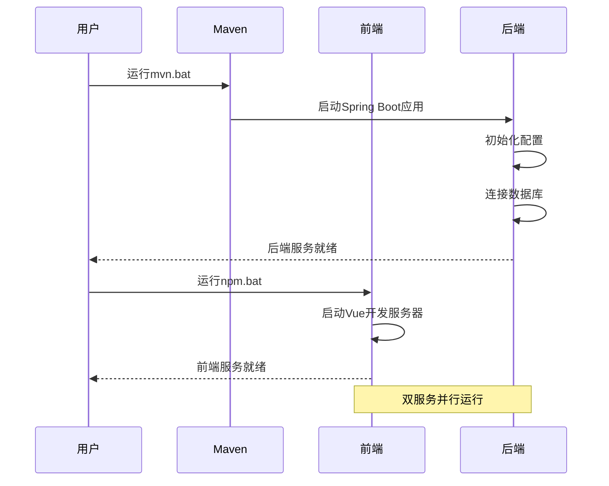

**图表来源**
- [mvn.bat:1-5](file://mvn.bat#L1-L5)
- [npm.bat:1-3](file://npm.bat#L1-L3)

**章节来源**
- [mvn.bat:1-5](file://mvn.bat#L1-L5)
- [npm.bat:1-3](file://npm.bat#L1-L3)

## 性能考虑

### 数据库性能优化

系统采用多种策略优化数据库性能：

- **连接池优化**：HikariCP连接池配置最大连接数、最小空闲连接、连接超时等参数
- **批量操作**：Hibernate配置批量大小，支持批量插入和更新
- **查询优化**：启用二级缓存，优化查询性能
- **时区配置**：设置Asia/Shanghai时区，确保时间数据一致性

### AI服务性能

- **流式响应**：支持AI模型的流式响应，提升用户体验
- **重试机制**：配置最大重试次数和重试延迟，提高服务稳定性
- **超时配置**：合理设置连接超时和读取超时，平衡性能和可靠性

### 前端性能优化

- **懒加载机制**：AI诊断辅助标签页使用条件渲染，减少不必要的组件挂载
- **状态管理**：通过Vuex集中管理AI诊断数据，避免重复请求
- **组件复用**：诊断编辑面板在多个页面中复用，提升开发效率
- **tooltip优化**：统一配置管理，减少重复定义

### TDD性能保障

- **测试覆盖率**：单元测试覆盖率≥80%，确保代码质量
- **性能基准**：建立算法性能指标和基准测试
- **持续集成**：自动化测试流水线确保代码库健康状态

## 故障排除指南

### 常见启动问题

**后端启动失败**
- 检查数据库连接配置
- 验证Oracle数据库服务状态
- 确认JDBC驱动版本兼容性

**前端启动失败**
- 检查Node.js版本要求
- 验证NPM依赖安装
- 确认端口占用情况

### AI服务问题

**模型连接失败**
- 检查AI服务API密钥配置
- 验证网络连通性
- 查看重试日志和超时设置

**分析结果异常**
- 确认Prompt模板配置
- 检查患者数据完整性
- 验证MCC/CC字典更新

### 新功能问题

**AI诊断辅助标签页问题**
- 检查组件懒加载条件是否满足
- 验证Vuex状态数据是否正确
- 确认API接口调用是否成功

**tooltip功能问题**
- 检查tooltip配置文件是否存在
- 验证配置项是否正确引用
- 确认Element Plus版本兼容性

**诊断解析失败**
- 检查AI结果格式是否符合预期
- 验证解析函数是否正确调用
- 确认降级策略是否生效

**TDD测试问题**
- 检查测试环境配置
- 验证测试数据准备
- 确认测试覆盖率统计

**章节来源**
- [用户操作手册.md:78-83](file://项目相关/软件著作权/用户操作手册.md#L78-L83)
- [源代码文档.md:64-217](file://项目相关/软件著作权/源代码文档.md#L64-L217)

## 结论

MedAiAssistant V1.0是一个功能完整、架构合理的医疗AI辅助诊疗系统。2026年4月23日的更新进一步增强了系统的实用性和用户体验。

### 主要优势
- **技术架构先进**：采用Spring Boot 3.x + Vue 3的现代化技术栈
- **功能模块完整**：涵盖AI辅助诊断、DRG分析、MCC/CC筛查等核心功能
- **数据安全可靠**：支持数据加密存储、访问权限控制、操作日志审计
- **部署灵活**：支持分布式部署，满足不同规模医疗机构需求
- **用户体验优化**：新增完整tooltip功能，提供详细的界面提示
- **性能持续改进**：通过懒加载和智能过滤机制优化系统性能
- **质量保障完善**：全面实施TDD，确保代码质量和功能稳定性
- **配置管理统一**：通过tooltip配置文件实现统一的界面提示管理

### 新功能价值
- **完整tooltip功能**：为所有标签页提供详细的悬停提示信息
- **AI诊断辅助标签页**：提供独立的AI诊断结果展示和编辑功能
- **懒加载机制优化**：通过条件渲染提升应用性能和用户体验
- **标签页重新排序**：按照医疗工作流程优化标签页排列顺序
- **统一配置管理**：通过tooltip.js实现tooltip功能的集中管理
- **组件复用设计**：通过诊断编辑面板实现功能模块化和代码复用

### 发展建议
- 持续优化AI模型集成，提升诊断准确性
- 扩展更多医疗场景的AI分析模板
- 加强与其他医疗信息系统的集成能力
- 完善监控和运维体系，提升系统稳定性
- 进一步优化前端组件的性能和用户体验
- 深化TDD实践，扩大测试覆盖范围
- 持续改进DRG分析算法，提升匹配精度和性能
- 扩展tooltip功能的应用范围，提升整体用户体验

## 附录

### 政策背景支持

项目积极响应国家"东数西算"工程和基层医疗AI建设政策，为医疗AI技术的规模化应用提供支撑：

- **算力基础设施**：支持国家一体化算力网的资源调度
- **数据安全保障**：符合医疗数据安全和隐私保护要求
- **技术标准对接**：与国家医疗信息化标准保持一致

### 版本更新记录

**2026年4月23日更新要点**
- 新增完整tooltip功能，为所有标签页提供悬停提示
- 新增AI诊断辅助标签页功能
- 实现PatientTabs组件的标签页重新排序
- 优化懒加载机制，提升应用性能
- 新增tooltip配置管理，实现统一的提示信息管理
- 完善诊断编辑面板的功能和交互设计
- 更新DRG分析页面的界面和展示逻辑

**章节来源**
- [更新小结.md:1-340](file://更新小结.md#L1-L340)
- [2026-04-23.md:1-40](file://med_ai_assistant_1.0_bs_vue/docs/更新日志/2026-04-23.md#L1-L40)