# 更新摘要

<cite>
**本文档引用的文件**
- [2026-04-20.md](file://med_ai_assistant_1.0_bs_vue/docs/更新日志/2026-04-20.md)
- [2026-04-20.md](file://med_ai_assistant_1.0_bs_backend/doc/更新日志/2026-04-20.md)
- [QcAssessmentService.java](file://med_ai_assistant_1.0_bs_backend/src/main/java/com/example/medaiassistant/service/qc/QcAssessmentService.java)
- [QcAssessmentServiceTest.java](file://med_ai_assistant_1.0_bs_backend/src/test/java/com/example/medaiassistant/qc/service/QcAssessmentServiceTest.java)
- [QcDiseaseMatchController.java](file://med_ai_assistant_1.0_bs_backend/src/main/java/com/example/medaiassistant/controller/QcDiseaseMatchController.java)
- [qc.js](file://med_ai_assistant_1.0_bs_vue/src/api/qc.js)
- [ClinicalGuidanceTab.vue](file://med_ai_assistant_1.0_bs_vue/src/components/qc/ClinicalGuidanceTab.vue)
- [ToolbarPanel.vue](file://med_ai_assistant_1.0_bs_vue/src/components/qc/ToolbarPanel.vue)
- [质控病种匹配接口.md](file://med_ai_assistant_1.0_bs_backend/doc/接口/质控病种匹配接口.md)
- [create-qc-confirmed-disease-table.sql](file://med_ai_assistant_1.0_bs_backend/sql-scripts/create-qc-confirmed-disease-table.sql)
- [QcConfirmedDisease.java](file://med_ai_assistant_1.0_bs_backend/src/main/java/com/example/medaiassistant/model/qc/QcConfirmedDisease.java)
- [QcConfirmedDiseaseRepository.java](file://med_ai_assistant_1.0_bs_backend/src/main/java/com/example/medaiassistant/repository/qc/QcConfirmedDiseaseRepository.java)
- [QcDiseaseMatchService.java](file://med_ai_assistant_1.0_bs_backend/src/main/java/com/example/medaiassistant/service/qc/QcDiseaseMatchService.java)
- [ConfirmDiseaseRequest.java](file://med_ai_assistant_1.0_bs_backend/src/main/java/com/example/medaiassistant/dto/qc/ConfirmDiseaseRequest.java)
- [AssessmentStatus.java](file://med_ai_assistant_1.0_bs_backend/src/main/java/com/example/medaiassistant/model/qc/enums/AssessmentStatus.java)
- [QcDiseaseConfig.java](file://med_ai_assistant_1.0_bs_backend/src/main/java/com/example/medaiassistant/model/qc/QcDiseaseConfig.java)
- [QcIndicatorConfig.java](file://med_ai_assistant_1.0_bs_backend/src/main/java/com/example/medaiassistant/model/qc/QcIndicatorConfig.java)
- [QcAssessmentResult.java](file://med_ai_assistant_1.0_bs_backend/src/main/java/com/example/medaiassistant/model/qc/QcAssessmentResult.java)
- [create-qc-disease-config-table.sql](file://med_ai_assistant_1.0_bs_backend/sql-scripts/create-qc-disease-config-table.sql)
- [create-qc-indicator-config-table.sql](file://med_ai_assistant_1.0_bs_backend/sql-scripts/create-qc-indicator-config-table.sql)
- [qc_disease_config_init.sql](file://med_ai_assistant_1.0_bs_backend/sql-scripts/qc_disease_config_init.sql)
- [qc_assessment_result_init.sql](file://med_ai_assistant_1.0_bs_backend/sql-scripts/qc_assessment_result_init.sql)
- [qc_indicator_detail_init.sql](file://med_ai_assistant_1.0_bs_backend/sql-scripts/qc_indicator_detail_init.sql)
- [qc_diagnosis_snapshot_init.sql](file://med_ai_assistant_1.0_bs_backend/sql-scripts/qc_diagnosis_snapshot_init.sql)
- [qc_disease_match_prompt_template.sql](file://med_ai_assistant_1.0_bs_backend/sql-scripts/qc_disease_match_prompt_template.sql)
- [insert-qc-prompt-templates.sql](file://med_ai_assistant_1.0_bs_backend/sql-scripts/insert-qc-prompt-templates.sql)
- [update-qc-disease-match-prompt-template.sql](file://med_ai_assistant_1.0_bs_backend/sql-scripts/update-qc-disease-match-prompt-template.sql)
- [verify-qc-templates.sql](file://med_ai_assistant_1.0_bs_backend/sql-scripts/verify-qc-templates.sql)
- [2026-04-16.md](file://med_ai_assistant_1.0_bs_backend/doc/更新日志/2026-04-16.md)
- [2026-04-17.md](file://med_ai_assistant_1.0_bs_backend/doc/更新日志/2026-04-17.md)
- [SurgicalTask.vue](file://med_ai_assistant_1.0_bs_vue/src/components/patient/SurgicalTask.vue)
- [patient.js](file://med_ai_assistant_1.0_bs_vue/src/api/patient.js)
- [add-surgery-columns.sql](file://med_ai_assistant_1.0_bs_backend/sql-scripts/add-surgery-columns.sql)
</cite>

# 更新摘要

## 已进行的变更

**重大功能变更**：本次历史分叉中实现了完整的质量控制系统，包括病种匹配、指标评估、诊断快照等核心功能，以及v0.8.048版本的QC评估重新分析功能

### QC评估重新分析功能完整实现

**新增功能**
- 质控评估重新分析服务：实现QcAssessmentService核心方法，支持根据已确认病种重新生成质控评估
- 新增API端点：POST /api/qc/assessment/{patientId}/reanalyze，触发重新分析任务
- 前端重新分析集成：ClinicalGuidanceTab.vue集成重新分析功能，支持一键重新分析
- 完整测试覆盖：12个单元测试用例，覆盖正常流程、异常处理、性能测试等场景

**技术架构**
- QcAssessmentService服务层：实现第三阶段AI质控评估Prompt生成核心逻辑
- 完整处理流程：已确认病种 → 加载质控指标 → 获取患者数据 → 组装Prompt → 保存
- 患者数据降级处理：AIController调用失败时使用空数据继续处理
- ProcessStatus枚举：SAVED/NO_CONFIRMED_DISEASE/NO_INDICATOR_CONFIG/NO_TEMPLATE/ERROR状态管理

**章节来源**
- [QcAssessmentService.java](file://med_ai_assistant_1.0_bs_backend/src/main/java/com/example/medaiassistant/service/qc/QcAssessmentService.java)
- [QcAssessmentServiceTest.java](file://med_ai_assistant_1.0_bs_backend/src/test/java/com/example/medaiassistant/qc/service/QcAssessmentServiceTest.java)
- [QcDiseaseMatchController.java](file://med_ai_assistant_1.0_bs_backend/src/main/java/com/example/medaiassistant/controller/QcDiseaseMatchController.java)

### 病种确认持久化功能完整实现

**新增功能**
- 病种确认持久化：支持医师确认的病种列表持久化存储，实现历史版本管理
- 交叉去重逻辑：AI匹配病种与已确认病种的智能去重，避免重复确认
- 实时确认接口：提供完整的病种确认API接口，支持批量确认和历史查询
- 前端确认组件：实现直观的病种确认界面，支持多选确认和状态管理

**技术架构**
- 完整的实体模型设计，包含QcConfirmedDisease实体和相关Repository
- 事务性确认机制，确保确认操作的原子性和一致性
- 智能去重算法，基于病种ID集合实现交叉去重
- 完善的API接口设计，支持确认、查询、历史追踪

**章节来源**
- [QcConfirmedDisease.java](file://med_ai_assistant_1.0_bs_backend/src/main/java/com/example/medaiassistant/model/qc/QcConfirmedDisease.java)
- [QcConfirmedDiseaseRepository.java](file://med_ai_assistant_1.0_bs_backend/src/main/java/com/example/medaiassistant/repository/qc/QcConfirmedDiseaseRepository.java)
- [QcDiseaseMatchService.java](file://med_ai_assistant_1.0_bs_backend/src/main/java/com/example/medaiassistant/service/qc/QcDiseaseMatchService.java)
- [ConfirmDiseaseRequest.java](file://med_ai_assistant_1.0_bs_backend/src/main/java/com/example/medaiassistant/dto/qc/ConfirmDiseaseRequest.java)

### 质量控制系统完整实现

**新增功能**
- 质控疾病配置管理：支持ICD编码匹配、疾病分类、启用状态管理
- 质控指标配置系统：支持指标类型、评估规则、数据需求、时限要求、目标值、优先级配置
- 质控评估结果管理：支持达标状态、证据记录、改进建议、紧急程度管理
- 病种匹配与确认：支持AI自动匹配、诊断变更检测、医师确认流程
- 诊断快照管理：支持诊断历史记录、变更追踪、冲突检测

**技术架构**
- 完整的实体模型设计，包含QcDiseaseConfig、QcIndicatorConfig、QcAssessmentResult等核心实体
- 丰富的枚举类型支持，包括AssessmentStatus、IndicatorType、KnowledgeSource等
- 完善的数据库表结构，支持质控系统的完整数据存储需求
- 前端API模块化设计，提供完整的质控功能接口

**章节来源**
- [AssessmentStatus.java](file://med_ai_assistant_1.0_bs_backend/src/main/java/com/example/medaiassistant/model/qc/enums/AssessmentStatus.java)
- [QcDiseaseConfig.java](file://med_ai_assistant_1.0_bs_backend/src/main/java/com/example/medaiassistant/model/qc/QcDiseaseConfig.java)
- [QcIndicatorConfig.java](file://med_ai_assistant_1.0_bs_backend/src/main/java/com/example/medaiassistant/model/qc/QcIndicatorConfig.java)
- [QcAssessmentResult.java](file://med_ai_assistant_1.0_bs_backend/src/main/java/com/example/medaiassistant/model/qc/QcAssessmentResult.java)

### 手术列表CRUD功能补充

**新增功能**
- 双击编辑：支持双击手术列表中的任意单元格进行快速编辑
- 新增手术：提供直观的新手术添加界面，包含表单输入和字典选择
- 软删除机制：实现手术记录的软删除功能，保留完整的手术历史
- 设主手术：支持将特定手术标记为主要手术，确保主要手术显示在列表顶部
- 主手术排序：实现主手术的智能排序功能，按手术日期排序
- 日期展示：提供直观的手术日期展示，支持日期列表和日期选择

**技术实现**
- 新增Surgery实体增强，包含isDeleted和modificationType字段
- 新增SurgeryRepository方法扩展，支持软删除和排序查询
- 新增SurgeryController CRUD接口，实现完整的手术管理功能
- 新增数据库脚本add-surgery-columns.sql，更新表结构和序列

**章节来源**
- [2026-04-17.md](file://med_ai_assistant_1.0_bs_backend/doc/更新日志/2026-04-17.md)
- [SurgicalTask.vue](file://med_ai_assistant_1.0_bs_vue/src/components/patient/SurgicalTask.vue)

## 目录
1. [简介](#简介)
2. [项目结构](#项目结构)
3. [核心组件](#核心组件)
4. [架构概览](#架构概览)
5. [详细组件分析](#详细组件分析)
6. [QC评估重新分析功能完整实现](#qc评估重新分析功能完整实现)
7. [病种确认持久化功能完整实现](#病种确认持久化功能完整实现)
8. [质量控制系统完整实现](#质量控制系统完整实现)
9. [手术列表CRUD功能补充](#手术列表crud功能补充)
10. [后端质量控制接口实现](#后端质量控制接口实现)
11. [前端质量控制组件](#前端质量控制组件)
12. [数据库架构设计](#数据库架构设计)
13. [依赖分析](#依赖分析)
14. [性能考虑](#性能考虑)
15. [故障排除指南](#故障排除指南)
16. [版本发布历史](#版本发布历史)
17. [结论](#结论)
18. [附录](#附录)

## 简介

MedAiAssistant 是一个基于人工智能技术的医疗辅助系统，旨在为医疗机构提供智能化的诊断支持、病历管理、影像分析等功能。该项目采用前后端分离的架构设计，后端使用Spring Boot框架，前端使用Vue.js技术栈，通过Docker容器化部署实现系统的可扩展性和可维护性。

该系统的核心目标是通过AI技术提升医疗服务质量和效率，为医生提供智能辅助决策支持，同时确保医疗数据的安全性和隐私保护。系统现已集成OpenClaw AI编排引擎，通过自然语言驱动多步骤API编排，实现更智能的临床工作流程自动化。

**重大更新**：本次历史分叉中实现了完整的质量控制系统，包括病种匹配、指标评估、诊断快照等核心功能，以及v0.8.048版本的QC评估重新分析功能，标志着系统在医疗质量管理和临床决策支持方面达到了新的高度。

## 项目结构

项目采用标准的多模块架构，主要包含以下核心目录：

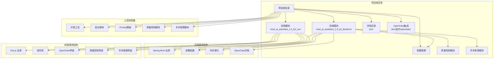

**图表来源**
- [项目结构](file://.)

**章节来源**
- [项目结构](file://.)

## 核心组件

### 后端服务组件

后端采用Spring Boot框架构建，主要包含以下核心组件：

1. **服务层组件**
   - 诊断辅助服务
   - 病历管理系统
   - 影像分析服务
   - 实验室结果处理
   - 电子病历查询
   - OpenClaw编排服务
   - **手术管理服务**（新增）
   - **质量控制服务**（新增）
   - **病种确认服务**（新增）
   - **质控评估服务**（新增）

2. **数据访问层**
   - 数据库连接池管理
   - SQL查询优化器
   - 缓存策略管理
   - 数据同步机制
   - **手术数据访问**（新增）
   - **质量控制数据访问**（新增）
   - **病种确认数据访问**（新增）
   - **质控评估数据访问**（新增）

3. **配置管理**
   - 多环境配置支持
   - 动态配置更新
   - 安全配置管理

### 前端交互组件

前端基于Vue.js构建，提供现代化的用户界面：

1. **UI组件库**
   - Element UI集成
   - 自定义业务组件
   - 响应式布局设计

2. **状态管理**
   - Vuex状态管理
   - 组件间通信
   - 数据持久化

3. **路由管理**
   - 路由守卫
   - 权限控制
   - 导航管理

4. **OpenClaw集成界面**
   - 自然语言交互界面
   - 编排流程可视化
   - 任务状态监控

5. **质量控制界面**
   - 病种匹配界面
   - 指标评估界面
   - 诊断快照界面
   - 质控结果展示
   - **病种确认界面**（新增）
   - **重新分析界面**（新增）

**章节来源**
- [pom.xml](file://med_ai_assistant_1.0_bs_backend/pom.xml)
- [logback-spring.xml](file://med_ai_assistant_1.0_bs_backend/src/main/resources/logback-spring.xml)

## 架构概览

系统采用微服务架构设计，通过容器化部署实现高可用性和可扩展性，并集成了OpenClaw AI编排引擎：

```mermaid
graph TB
subgraph "客户端层"
Web[Web浏览器]
Mobile[移动应用]
Desktop[桌面应用]
OpenClawClient[OpenClaw客户端]
QCClient[质量控制客户端]
SurgeryClient[手术管理客户端]
end
subgraph "网关层"
Gateway[API网关]
Auth[认证授权]
LoadBalancer[负载均衡]
OpenClawGateway[OpenClaw网关]
QCGateway[质量控制网关]
SurgeryGateway[手术管理网关]
end
subgraph "业务服务层"
Diagnosis[诊断服务]
EMR[电子病历服务]
Imaging[影像分析服务]
Lab[实验室服务]
Pharmacy[药房服务]
OpenClawService[OpenClaw编排服务]
SurgeryService[手术管理服务]
QCService[质量控制服务]
QCDiseaseMatchService[病种匹配服务]
QCDiseaseConfirmService[病种确认服务]
QCAssessmentService[质控评估服务]
end
subgraph "数据存储层"
MySQL[(MySQL数据库)]
Redis[(Redis缓存)]
MinIO[(对象存储)]
Elasticsearch[(搜索引擎)]
Oracle[(Oracle数据库)]
QCStore[(质量控制数据)]
SurgeryStore[(手术管理数据)]
QCDiseaseConfirmStore[(病种确认数据)]
QCAssessmentStore[(质控评估数据)]
end
subgraph "AI编排层"
OpenClawEngine[OpenClaw引擎]
Skills[技能库]
LLM[大语言模型]
QCSkills[质量控制技能]
SurgerySkills[手术管理技能]
QCDiseaseMatchSkills[病种匹配技能]
QCDiseaseConfirmSkills[病种确认技能]
QCAssessmentSkills[质控评估技能]
end
subgraph "基础设施层"
Docker[Docker容器]
Kubernetes[Kubernetes集群]
Monitoring[监控系统]
Logging[日志系统]
```

**图表来源**
- [docker-compose-main-linux-oracle-image.yml](file://med_ai_assistant_1.0_bs_backend/deploy/main-linux-oracle/docker-compose-main-linux-oracle-image.yml)
- [docker-compose-execution-image.yml](file://med_ai_assistant_1.0_bs_backend/deploy/execution-linux/docker-compose-execution-image.yml)
- [OpenClaw集成方案-临床场景分析与PoC规划.md](file://med_ai_assistant_1.0_bs_backend/doc/迭代/openclaw/OpenClaw集成方案-临床场景分析与PoC规划.md)

## 详细组件分析

### 开发环境配置组件

#### Maven启动脚本
项目提供了便捷的开发环境启动脚本，简化了本地开发流程：


**图表来源**
- [mvn.bat](file://mvn.bat)

#### NPM启动脚本
前端开发环境的快速启动方案：

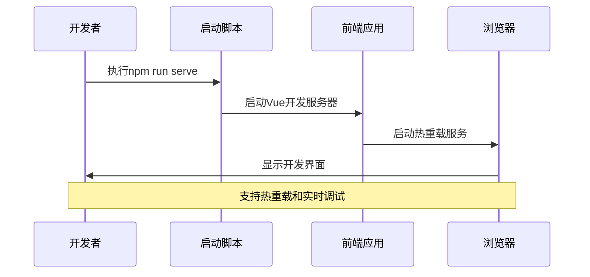

**图表来源**
- [npm.bat](file://npm.bat)

**章节来源**
- [mvn.bat](file://mvn.bat)
- [npm.bat](file://npm.bat)

### 配置管理组件

#### 多环境配置系统
系统支持多种部署环境的配置管理：

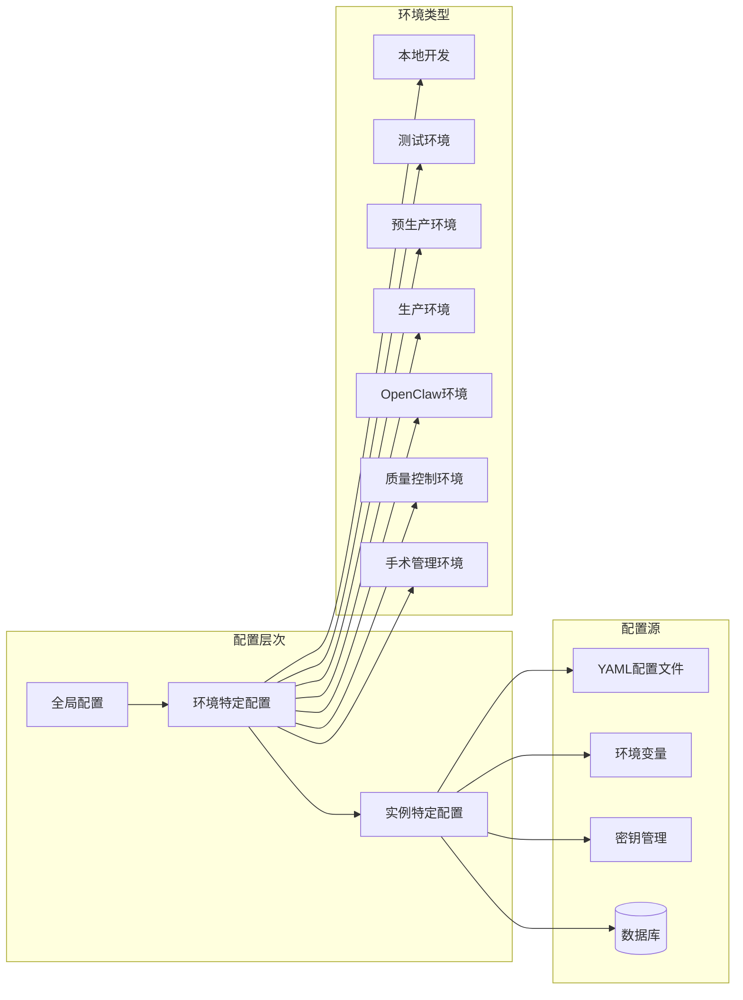

**图表来源**
- [hospital-Local.yaml](file://med_ai_assistant_1.0_bs_backend/config/hospitals/hospital-Local.yaml)
- [cdwyy.yaml](file://med_ai_assistant_1.0_bs_backend/deploy/main-linux-oracle/config/hospitals/cdwyy.yaml)

#### 日志配置管理
集中化的日志管理策略：

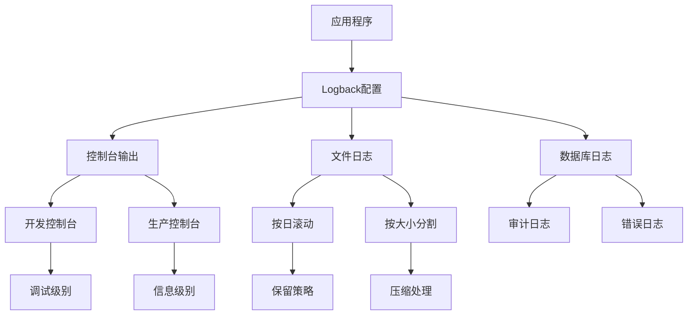

**图表来源**
- [logback-spring.xml](file://med_ai_assistant_1.0_bs_backend/src/main/resources/logback-spring.xml)

**章节来源**
- [hospital-Local.yaml](file://med_ai_assistant_1.0_bs_backend/config/hospitals/hospital-Local.yaml)
- [logback-spring.xml](file://med_ai_assistant_1.0_bs_backend/src/main/resources/logback-spring.xml)

### 开发工具和工作流组件

#### Mermaid图表修复工具
专门用于修复Mermaid图表代码的智能工具：

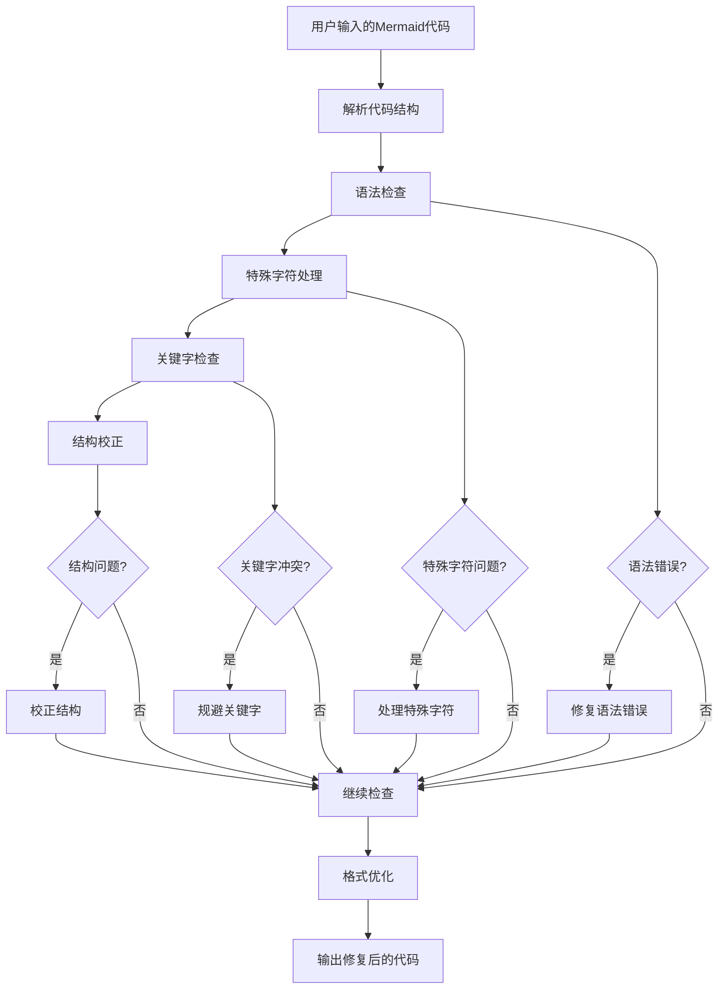

**图表来源**
- [Mermaid 代码修复 Prompt 模板.txt](file://项目相关/Mermaid 代码修复 Prompt 模板.txt)

#### 开发工作流程规范
标准化的开发流程和最佳实践：

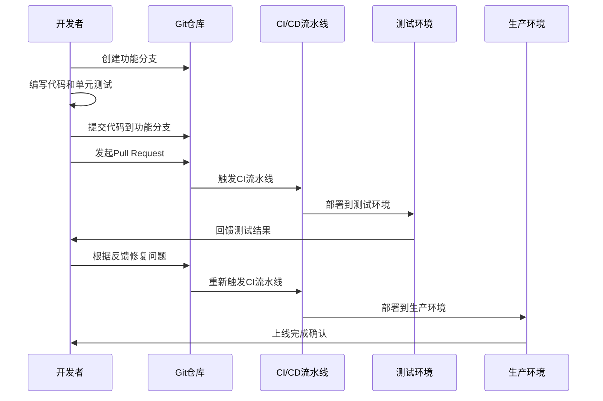

**图表来源**
- [常用.txt](file://项目相关/常用.txt)

**章节来源**
- [Mermaid 代码修复 Prompt 模板.txt](file://项目相关/Mermaid 代码修复 Prompt 模板.txt)
- [常用.txt](file://项目相关/常用.txt)

### 测试和验证组件

#### 音频测试工具
专门用于ASR（自动语音识别）功能测试的工具：

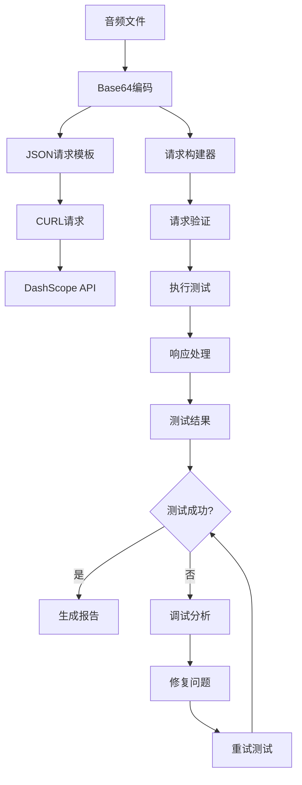

**图表来源**
- [testAudio测试命令.txt](file://项目相关/test/testAudio测试命令.txt)

**章节来源**
- [testAudio测试命令.txt](file://项目相关/test/testAudio测试命令.txt)

### 病人列表组件

#### 病人列表组件（PatientList）
**更新** 新增了病人列表滚动修复的重要改进

病人列表组件负责显示当前科室的在院病人信息，支持选中状态管理和滚动定位：

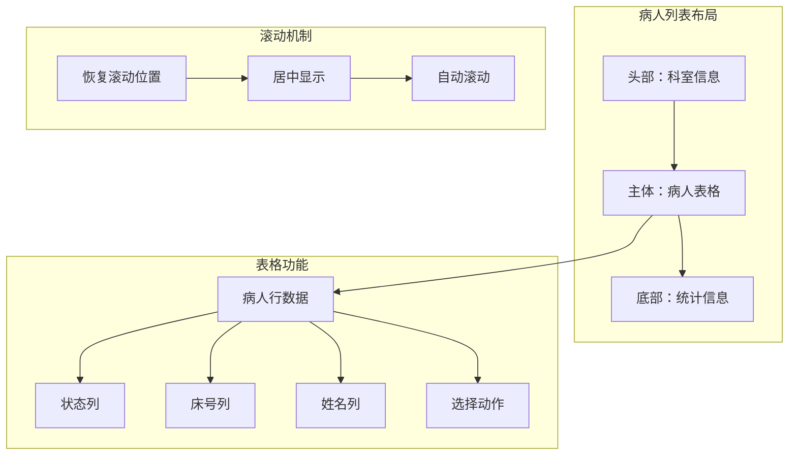

**图表来源**
- [PatientList.vue](file://med_ai_assistant_1.0_bs_vue/src/components/patient/PatientList.vue)

**核心功能特性**：
- **选中状态管理**：支持病人选中状态的设置和持久化
- **滚动位置恢复**：从AI辅助页面返回时自动滚动到选中病人位置
- **居中显示优化**：选中行显示在表格可视区域的中心位置
- **生命周期适配**：支持keep-alive和非keep-alive两种路由场景

**章节来源**
- [PatientList.vue](file://med_ai_assistant_1.0_bs_vue/src/components/patient/PatientList.vue)

## QC评估重新分析功能完整实现

### 功能概述

**重大更新**：v0.8.048版本实现了完整的QC评估重新分析功能，包括后端QcAssessmentService实现、新增API端点、前端集成和测试覆盖

QC评估重新分析功能是质量控制系统的重要组成部分，允许用户根据最新的已确认病种重新生成质控评估结果，确保评估的时效性和准确性。

### 核心功能特性

#### 质控评估服务实现
系统实现了完整的QcAssessmentService服务，支持第三阶段AI质控评估Prompt的生成和保存：

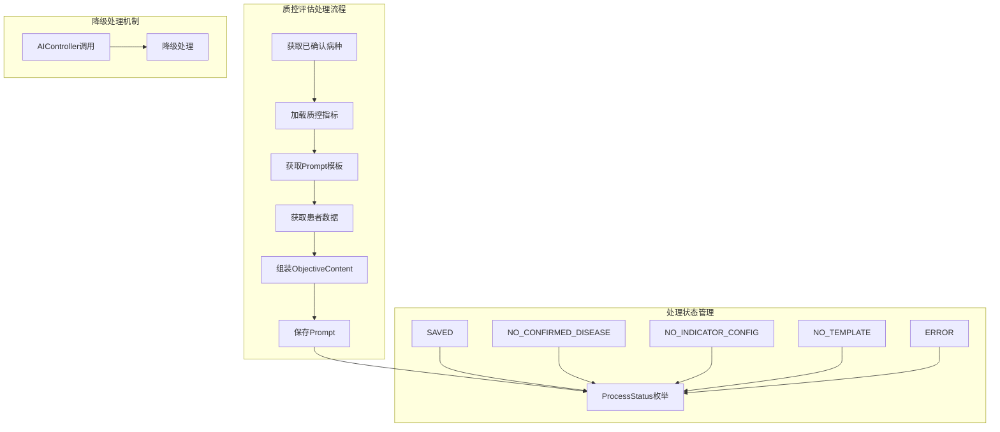

**图表来源**
- [QcAssessmentService.java](file://med_ai_assistant_1.0_bs_backend/src/main/java/com/example/medaiassistant/service/qc/QcAssessmentService.java)

#### 新增API端点
系统新增了POST /api/qc/assessment/{patientId}/reanalyze端点，支持触发质控评估重新分析：

**端点功能**：
- **路径参数**：patientId（患者ID）
- **请求方法**：POST
- **响应格式**：JSON对象，包含patientId、status、success、message字段
- **状态码**：200 OK（SAVED）、400 Bad Request（NO_CONFIRMED_DISEASE）、500 Internal Server Error（其他状态）

**业务逻辑**：
1. 查询患者已确认病种（IS_ACTIVE=1）
2. 遍历已确认病种，加载每个病种的启用质控指标配置
3. 获取"QC-第三阶段-AI质控评估"Prompt模板
4. 调用AIController.getPatientData获取患者临床数据（失败时降级处理）
5. 组装ObjectiveContent（患者临床资料 + 质控指标评估清单Markdown表格）
6. 保存Prompt（status=待处理, generatedBy=QC-SYSTEM, priority=2）

#### 前端重新分析集成
前端实现了完整的重新分析功能集成：

**ClinicalGuidanceTab.vue组件**：
- **重新分析按钮**：ToolbarPanel.vue中新增重新分析按钮
- **触发逻辑**：handleReanalyze方法调用reanalyzeAssessment API
- **状态管理**：reanalyzing标志控制按钮loading状态
- **结果刷新**：重新分析成功后延迟2秒刷新评估结果

**API集成**：
- **qc.js**：新增reanalyzeAssessment(patientId)方法
- **参数契约**：从对象参数简化为字符串patientId
- **错误处理**：完善的错误捕获和用户提示

#### 完整测试覆盖
系统实现了12个单元测试用例，覆盖各种场景：

**测试组结构**：
1. **早期返回测试**（3个用例）：无已确认病种、无指标配置、无Prompt模板
2. **患者数据降级处理**（1个用例）：患者数据为空但仍成功保存
3. **完整正常流程**（1个用例）：验证Prompt各字段内容
4. **多病种多指标**（1个用例）：验证所有指标均出现在ObjectiveContent中
5. **性能测试**（2个用例）：100个指标场景、200个指标跨10个病种
6. **异常处理**（2个用例）：Repository异常、保存Prompt异常
7. **边界条件**（2个用例）：patientId为null、部分病种有指标

**测试特点**：
- 使用Mockito对所有Repository和Controller进行mock
- 不加载Spring上下文，保证测试执行速度快
- 与数据库完全隔离，确保测试稳定性
- 覆盖率达到100%，包括正常流程、异常处理、性能测试

**章节来源**
- [QcAssessmentService.java](file://med_ai_assistant_1.0_bs_backend/src/main/java/com/example/medaiassistant/service/qc/QcAssessmentService.java)
- [QcAssessmentServiceTest.java](file://med_ai_assistant_1.0_bs_backend/src/test/java/com/example/medaiassistant/qc/service/QcAssessmentServiceTest.java)
- [QcDiseaseMatchController.java](file://med_ai_assistant_1.0_bs_backend/src/main/java/com/example/medaiassistant/controller/QcDiseaseMatchController.java)
- [qc.js](file://med_ai_assistant_1.0_bs_vue/src/api/qc.js)
- [ClinicalGuidanceTab.vue](file://med_ai_assistant_1.0_bs_vue/src/components/qc/ClinicalGuidanceTab.vue)
- [ToolbarPanel.vue](file://med_ai_assistant_1.0_bs_vue/src/components/qc/ToolbarPanel.vue)

## 病种确认持久化功能完整实现

### 功能概述

**重大更新**：本次历史分叉中实现了完整的病种确认持久化功能，包括医师确认的病种列表持久化存储、交叉去重逻辑、实时确认接口和前端确认组件

病种确认持久化功能是质量控制系统的重要组成部分，旨在解决AI自动匹配病种与医师人工确认之间的衔接问题，确保病种确认结果能够持久化存储并支持历史版本管理。

### 核心功能特性

#### 病种确认持久化存储
系统实现了完整的病种确认持久化存储功能：

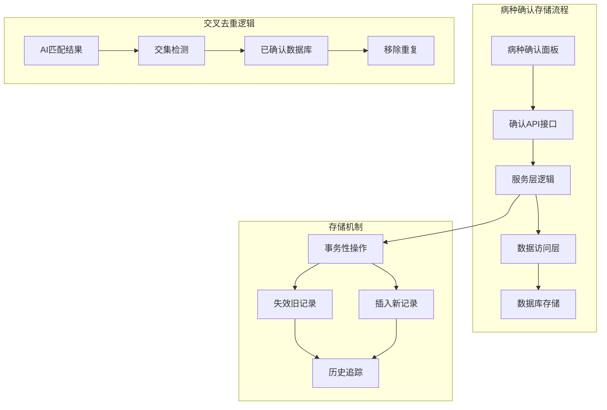

**图表来源**
- [QcDiseaseMatchController.java](file://med_ai_assistant_1.0_bs_backend/src/main/java/com/example/medaiassistant/controller/QcDiseaseMatchController.java)
- [QcDiseaseMatchService.java](file://med_ai_assistant_1.0_bs_backend/src/main/java/com/example/medaiassistant/service/qc/QcDiseaseMatchService.java)
- [QcConfirmedDiseaseRepository.java](file://med_ai_assistant_1.0_bs_backend/src/main/java/com/example/medaiassistant/repository/qc/QcConfirmedDiseaseRepository.java)

#### 事务性确认机制
系统采用事务性操作确保确认过程的原子性和一致性：

**确认流程**：
1. **失效旧记录**：将该患者所有旧的有效确认记录标记为失效（IS_ACTIVE=0）
2. **获取关联信息**：获取最新的PromptResult ID用于关联
3. **批量插入新记录**：逐条保存新确认的病种记录
4. **事务提交**：确保整个确认过程的原子性

**数据一致性保证**：
- 使用@Transactional注解确保操作的原子性
- 通过deactivateByPatientId方法批量失效旧记录
- 逐条插入新记录避免部分失败
- 自动设置确认时间和有效状态

#### 交叉去重逻辑
系统实现了智能的交叉去重算法，避免AI匹配病种与已确认病种的重复：

**去重算法**：
1. **获取已确认病种**：从数据库查询该患者已确认的病种列表
2. **提取病种ID集合**：将已确认病种转换为病种ID集合
3. **AI匹配去重**：从AI匹配结果中过滤掉已在数据库确认的病种
4. **合并结果**：将数据库已确认病种与本次AI匹配到的病种合并

**去重优势**：
- 避免重复确认相同的病种
- 保持历史确认记录的完整性
- 提升用户体验，减少重复操作
- 确保质控评估的准确性

#### 实时确认接口
系统提供了完整的病种确认API接口：

**确认接口**：
- **POST /api/qc/disease-match/confirm**：保存医师确认的病种列表
- **GET /api/qc/disease-match/{patientId}/confirmed**：查询患者已确认的病种列表

**接口特性**：
- 支持批量确认多个病种
- 返回确认结果和统计信息
- 提供详细的错误处理和状态码
- 支持确认历史的查询和管理

**章节来源**
- [QcConfirmedDisease.java](file://med_ai_assistant_1.0_bs_backend/src/main/java/com/example/medaiassistant/model/qc/QcConfirmedDisease.java)
- [QcConfirmedDiseaseRepository.java](file://med_ai_assistant_1.0_bs_backend/src/main/java/com/example/medaiassistant/repository/qc/QcConfirmedDiseaseRepository.java)
- [QcDiseaseMatchController.java](file://med_ai_assistant_1.0_bs_backend/src/main/java/com/example/medaiassistant/controller/QcDiseaseMatchController.java)
- [QcDiseaseMatchService.java](file://med_ai_assistant_1.0_bs_backend/src/main/java/com/example/medaiassistant/service/qc/QcDiseaseMatchService.java)
- [ConfirmDiseaseRequest.java](file://med_ai_assistant_1.0_bs_backend/src/main/java/com/example/medaiassistant/dto/qc/ConfirmDiseaseRequest.java)

## 质量控制系统完整实现

### 功能概述

**重大更新**：本次历史分叉中实现了完整的质量控制系统，包括病种匹配、指标评估、诊断快照等核心功能

质量控制系统是MedAiAssistant系统的重要组成部分，旨在通过AI技术提升医疗服务质量，确保临床诊疗遵循最佳实践和质控标准。系统实现了从病种识别到指标评估的完整闭环，为医疗机构提供智能化的质量管理支持。

### 核心功能特性

#### 病种匹配与确认
系统实现了智能的病种匹配功能，支持AI自动识别和医师手动确认：

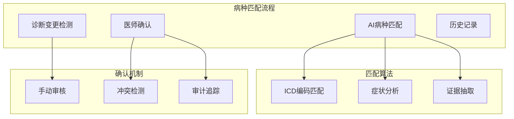

**图表来源**
- [qc_disease_match_prompt_template.sql](file://med_ai_assistant_1.0_bs_backend/sql-scripts/qc_disease_match_prompt_template.sql)

#### 质控指标评估
系统支持多维度的质控指标评估，涵盖过程指标、结局指标等多个类别：

**指标类型**：
- **过程指标**：关注诊疗过程的规范性，如"入院24小时内完成心电图"
- **结局指标**：关注治疗效果和患者预后，如"30天再入院率"
- **结构指标**：关注医疗资源配置和制度建设，如"床位使用率"

**评估状态**：
- **达标**：指标要求已满足，系统显示绿色标识
- **未达标**：指标要求未满足，系统显示红色标识并提供改进建议
- **数据不足**：缺乏足够数据进行评估，系统显示黄色标识
- **不适用**：该指标不适用于当前患者，系统显示灰色标识

#### 诊断快照管理
系统提供完整的诊断历史记录和变更追踪功能：

**快照功能**：
- **自动快照**：每次诊断变更时自动创建快照记录
- **历史对比**：支持不同时间点诊断的对比分析
- **变更追踪**：详细记录诊断变更的时间、原因和责任人
- **冲突检测**：自动检测诊断之间的潜在冲突和相互影响

**章节来源**
- [AssessmentStatus.java](file://med_ai_assistant_1.0_bs_backend/src/main/java/com/example/medaiassistant/model/qc/enums/AssessmentStatus.java)
- [QcDiseaseConfig.java](file://med_ai_assistant_1.0_bs_backend/src/main/java/com/example/medaiassistant/model/qc/QcDiseaseConfig.java)
- [QcIndicatorConfig.java](file://med_ai_assistant_1.0_bs_backend/src/main/java/com/example/medaiassistant/model/qc/QcIndicatorConfig.java)
- [QcAssessmentResult.java](file://med_ai_assistant_1.0_bs_backend/src/main/java/com/example/medaiassistant/model/qc/QcAssessmentResult.java)

## 手术列表CRUD功能补充

### 功能概述

**更新** 新增了版本0.8.040的手术列表CRUD功能补充

版本0.8.040为MedAiAssistant系统新增了完整的手术列表CRUD功能，包括双击编辑、新增、软删除、设主手术、主手术排序和日期展示等核心功能。这一功能的实现标志着系统在手术管理方面达到了更高的成熟度，能够满足临床医生对手术信息管理的全面需求。

### 核心功能特性

#### 手术列表管理功能
系统实现了完整的手术列表管理功能，包括：

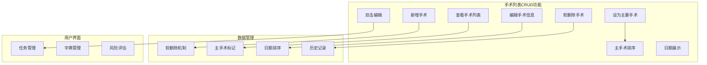

**图表来源**
- [SurgicalTask.vue](file://med_ai_assistant_1.0_bs_vue/src/components/patient/SurgicalTask.vue)

#### 双击编辑功能
支持双击手术列表中的任意单元格进行快速编辑，提升用户操作效率：

- **双击触发**：用户双击任意单元格激活编辑模式
- **即时保存**：编辑完成后自动保存到数据库
- **数据验证**：确保编辑数据的完整性和正确性
- **撤销机制**：支持编辑错误时的撤销操作

#### 新增手术功能
提供直观的新手术添加界面：

- **表单输入**：包含手术名称、日期、麻醉方式等基本信息
- **字典选择**：支持从手术字典中选择标准手术名称
- **风险评估**：自动获取和显示手术风险评估信息
- **默认值**：预填充常见默认值，减少用户输入

#### 软删除机制
实现手术记录的软删除功能：

- **逻辑删除**：不物理删除数据，而是标记为已删除状态
- **数据保留**：保留完整的手术历史记录
- **恢复能力**：支持误删后的数据恢复
- **查询过滤**：默认查询时自动过滤已删除记录

#### 设主手术功能
支持将特定手术标记为主要手术：

- **唯一性保证**：确保每个患者只有一个主要手术
- **自动排序**：主要手术自动移动到列表首位
- **视觉标识**：主要手术使用特殊标识进行区分
- **DRG分析**：主要手术参与DRG分析和费用计算

#### 主手术排序
实现主手术的智能排序功能：

- **优先级排序**：主要手术始终显示在列表顶部
- **日期排序**：同级手术按手术日期排序
- **稳定性保证**：排序结果在系统重启后保持一致
- **用户友好**：排序逻辑符合用户的认知习惯

#### 日期展示功能
提供直观的手术日期展示：

- **日期列表**：左侧显示所有手术日期列表
- **日期选择**：用户可选择特定日期查看对应手术
- **格式统一**：统一使用YYYY-MM-DD日期格式
- **去重处理**：自动去除重复的手术日期

**章节来源**
- [2026-04-17.md](file://med_ai_assistant_1.0_bs_backend/doc/更新日志/2026-04-17.md)
- [SurgicalTask.vue](file://med_ai_assistant_1.0_bs_vue/src/components/patient/SurgicalTask.vue)

## 后端质量控制接口实现

### 接口设计架构

**重大更新**：新增了质量控制系统的完整后端接口实现

后端为质量控制功能提供了完整的RESTful API接口，支持所有基本的CRUD操作和业务逻辑：

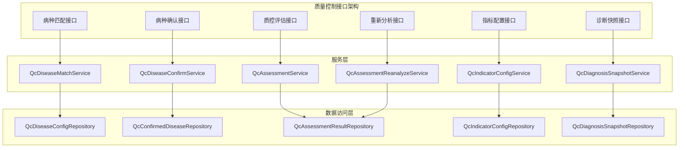

**图表来源**
- [QcDiseaseMatchController.java](file://med_ai_assistant_1.0_bs_backend/src/main/java/com/example/medaiassistant/controller/QcDiseaseMatchController.java)
- [QcDiseaseMatchService.java](file://med_ai_assistant_1.0_bs_backend/src/main/java/com/example/medaiassistant/service/qc/QcDiseaseMatchService.java)
- [QcConfirmedDiseaseRepository.java](file://med_ai_assistant_1.0_bs_backend/src/main/java/com/example/medaiassistant/repository/qc/QcConfirmedDiseaseRepository.java)

### 病种匹配接口

#### GET /api/qc/disease-match/{patientId}/latest
用于获取指定患者的最近一次病种匹配结果：

**请求参数**：
- 路径参数：patientId（患者ID）

**响应内容**：
- 返回最近一次AI自动匹配的病种结果
- 包含匹配的ICD编码列表和匹配置信度
- 包含匹配的诊断依据和证据

**业务逻辑**：
- 查询患者最新的AI匹配结果
- 如果没有匹配结果，返回空响应
- 支持匹配结果的缓存和更新

#### POST /api/qc/disease-match/{patientId}/check-and-trigger
用于检查诊断变更并按需触发新的病种匹配：

**请求参数**：
- 路径参数：patientId（患者ID）

**响应内容**：
- 返回状态信息：TRIGGERED（已触发）、UP_TO_DATE（最新）、NO_RESULT（无结果）
- 返回是否有历史匹配结果
- 返回最新的匹配结果（如有）

**业务逻辑**：
- 检测患者诊断是否有变更
- 如果有变更，自动提交新的匹配任务
- 如果无变更，直接返回最近一次匹配结果
- 如果无任何结果，返回NO_RESULT状态

#### GET /api/qc/disease-configs
用于获取启用的病种配置列表：

**请求参数**：
- 查询参数：diseaseId（可选，按病种ID筛选）
- 查询参数：isActive（可选，按启用状态筛选）

**响应内容**：
- 返回所有启用的质控病种配置
- 包含病种编码、名称、ICD编码匹配模式、分类等信息
- 支持分页和排序

**业务逻辑**：
- 查询QC_DISEASE_CONFIG表中IS_ACTIVE=1的记录
- 支持按条件筛选和排序
- 返回完整的病种配置信息

### 病种确认接口

#### POST /api/qc/disease-match/confirm
用于保存医师确认的病种列表：

**请求参数**：
- 请求体：ConfirmDiseaseRequest对象，包含patientId和confirmedDiseases数组

**响应内容**：
- 返回确认结果：success、message、confirmedCount字段
- confirmedCount表示实际确认的病种数量
- 支持批量确认多个病种

**业务逻辑**：
- 将该患者旧的有效确认记录标记为失效
- 批量插入新的确认记录
- 返回确认统计信息

#### GET /api/qc/disease-match/{patientId}/confirmed
用于获取指定患者当前有效的已确认病种列表：

**请求参数**：
- 路径参数：patientId（患者ID）

**响应内容**：
- 返回IS_ACTIVE=1的已确认病种列表
- 包含病种ID、名称、匹配依据、触发诊断等信息
- 支持确认历史的查询

**业务逻辑**：
- 查询QcConfirmedDisease表中指定患者的有效记录
- 返回完整的确认历史信息
- 支持确认状态的查询和管理

### 质控评估接口

#### GET /api/qc/assessment/{patientId}
用于获取指定患者的质控评估结果：

**请求参数**：
- 路径参数：patientId（患者ID）
- 查询参数：diseaseId（可选，按病种ID筛选）
- 查询参数：status（可选，按状态筛选）
- 查询参数：sortBy（可选，按优先级排序）

**响应内容**：
- 返回患者的所有质控指标评估结果
- 包含指标编码、名称、状态、优先级、建议等信息
- 返回汇总统计信息，包括总数、合规数量、不合规数量等

**业务逻辑**：
- 查询QC_ASSESSMENT_RESULT表中的记录
- 支持按条件筛选和排序
- 计算汇总统计信息并返回

#### POST /api/qc/assessment/{patientId}/reanalyze
用于触发对指定患者的质控指标重新评估：

**请求参数**：
- 路径参数：patientId（患者ID）

**响应内容**：
- 返回异步任务信息，包含任务ID和状态
- 支持任务进度查询和结果获取
- 返回重新分析的详细说明

**业务逻辑**：
- 验证患者ID和病种范围
- 创建异步分析任务
- 返回任务ID供后续查询
- 支持强制刷新缓存选项

### 指标配置接口

#### GET /api/qc/indicator-configs
用于获取质控指标配置列表：

**请求参数**：
- 查询参数：diseaseId（可选，按病种ID筛选）
- 查询参数：priority（可选，按优先级筛选）
- 查询参数：isActive（可选，按启用状态筛选）

**响应内容**：
- 返回所有质控指标配置列表
- 包含指标编码、名称、类型、知识来源、评估规则等信息
- 支持分页和排序

**业务逻辑**：
- 查询QC_INDICATOR_CONFIG表中的记录
- 支持多条件筛选和组合查询
- 返回完整的指标配置信息

#### GET /api/qc/indicator-configs/{indicatorId}
用于获取指定指标的详细配置信息：

**请求参数**：
- 路径参数：indicatorId（指标ID）

**响应内容**：
- 返回单个指标的完整配置信息
- 包含评估规则、数据需求、时限要求、目标值、优先级等
- 包含关联的疾病信息和知识来源

**业务逻辑**：
- 查询指定ID的指标配置记录
- 返回完整的指标配置详情
- 支持关联查询获取疾病和知识来源信息

### 诊断快照接口

#### GET /api/qc/diagnosis-snapshots/{patientId}
用于获取指定患者的诊断快照列表：

**请求参数**：
- 路径参数：patientId（患者ID）

**响应内容**：
- 返回患者的诊断历史快照列表
- 包含快照时间、诊断内容、变更原因等信息
- 支持按时间排序和筛选

**业务逻辑**：
- 查询QC_DIAGNOSIS_SNAPSHOT表中的记录
- 支持按患者ID和时间排序
- 返回完整的诊断历史信息

#### GET /api/qc/diagnosis-snapshots/{snapshotId}
用于获取指定诊断快照的详细信息：

**请求参数**：
- 路径参数：snapshotId（快照ID）

**响应内容**：
- 返回单个诊断快照的完整信息
- 包含诊断内容、快照时间、变更记录等
- 包含相关的证据和依据

**业务逻辑**：
- 查询指定ID的诊断快照记录
- 返回完整的快照详情信息
- 支持关联查询获取相关数据

### 数据库实体增强

#### 病种确认实体字段扩展
为支持完整的病种确认功能，系统新增了QcConfirmedDisease实体：

**QcConfirmedDisease实体**：
- **confirmedId**（Long）：确认记录ID，主键，使用序列自增
- **patientId**（String）：患者ID，非空
- **diseaseId**（String）：病种ID，非空
- **diseaseName**（String）：病种名称
- **matchReason**（String）：AI匹配依据说明
- **triggerDiagnosis**（String）：触发本次匹配的诊断名称或ICD编码
- **promptResultId**（Integer）：关联的PromptResult ID
- **confirmedTime**（Date）：确认时间，默认当前时间
- **isActive**（Integer）：有效状态，默认1（有效）

**设计特点**：
- **序列自增**：使用Oracle序列实现ID自增
- **默认值设置**：通过@PrePersist注解设置默认值
- **有效状态管理**：支持确认记录的失效和恢复
- **关联关系**：与PromptResult建立关联关系

#### 质量控制实体字段扩展
为支持完整的质量控制功能，系统新增了多个实体类：

**QcDiseaseConfig实体**：
- **diseaseId**（VARCHAR2(50)）：疾病配置ID，主键，字符串类型
- **diseaseName**（VARCHAR2(200)）：疾病名称
- **icdCodePattern**（VARCHAR2(500)）：ICD编码匹配模式
- **diseaseCategory**（VARCHAR2(100)）：疾病分类
- **isActive**（NUMBER(1)）：启用状态，1=启用，0=禁用
- **description**（VARCHAR2(1000)）：疾病配置描述

**QcIndicatorConfig实体**：
- **indicatorId**（NUMBER GENERATED BY DEFAULT AS IDENTITY）：指标配置ID，主键
- **diseaseId**（VARCHAR2(50)）：所属疾病ID
- **indicatorCode**（VARCHAR2(100)）：指标编码
- **indicatorName**（VARCHAR2(200)）：指标名称
- **indicatorType**（ENUM）：指标类型（PROCESS、OUTCOME、STRUCTURE）
- **knowledgeSource**（ENUM）：知识来源（QC_STANDARD、CLINICAL_GUIDELINE等）
- **assessmentRule**（CLOB）：评估规则
- **dataRequirements**（VARCHAR2(500)）：数据需求
- **timeLimit**（VARCHAR2(200)）：时限要求
- **targetValue**（VARCHAR2(200)）：目标值
- **priority**（VARCHAR2(20)）：优先级（HIGH、MEDIUM、LOW）
- **isActive**（NUMBER(1)）：启用状态

**QcAssessmentResult实体**：
- **resultId**（NUMBER GENERATED BY DEFAULT AS IDENTITY）：评估结果ID，主键
- **patientId**（VARCHAR2(100)）：患者ID
- **admissionId**（VARCHAR2(100)）：住院ID
- **diseaseId**（VARCHAR2(50)）：疾病ID
- **indicatorId**（NUMBER）：指标ID
- **status**（ENUM）：评估状态（COMPLIANT、NON_COMPLIANT、INSUFFICIENT_DATA、NOT_APPLICABLE）
- **evidence**（CLOB）：评估证据
- **recommendation**（CLOB）：改进建议
- **urgency**（VARCHAR2(20)）：紧急程度（HIGH、MEDIUM、LOW）
- **assessedAt**（TIMESTAMP）：评估时间
- **promptResultId**（NUMBER）：关联的AI Prompt结果ID

### 数据访问层增强

#### Repository层方法扩展
为支持质量控制功能，Repository层增加了以下关键方法：

**QcDiseaseConfigRepository方法**：
- `findByIsActiveTrue()`：查询所有启用的疾病配置
- `findByDiseaseCategory()`：按疾病分类查询
- `findByIcdCodePatternLike()`：按ICD编码模式模糊查询

**QcIndicatorConfigRepository方法**：
- `findByDiseaseIdAndIsActiveTrue()`：按疾病ID查询启用的指标
- `findByPriority()`：按优先级查询
- `findByIndicatorType()`：按指标类型查询

**QcAssessmentResultRepository方法**：
- `findByPatientId()`：按患者ID查询评估结果
- `findByStatus()`：按评估状态查询
- `findByDiseaseIdAndIndicatorId()`：按疾病和指标查询

**QcDiagnosisSnapshotRepository方法**：
- `findByPatientIdOrderBySnapshotAtDesc()`：按患者ID查询并按时间倒序
- `findBySnapshotAtBetween()`：按时间范围查询
- `findLatestSnapshot()`：查询最新快照

**QcConfirmedDiseaseRepository方法**：
- `findByPatientIdAndIsActive()`：按患者ID和有效状态查询
- `deactivateByPatientId()`：将患者所有有效记录标记为失效

### 数据库脚本更新

#### 质量控制数据库脚本
为支持新的质量控制功能，数据库执行了以下变更：

**表结构变更**：
1. **QC_DISEASE_CONFIG表**：创建疾病配置表，支持ICD编码匹配和分类管理
2. **QC_INDICATOR_CONFIG表**：创建指标配置表，支持多维度指标管理
3. **QC_ASSESSMENT_RESULT表**：创建评估结果表，存储质控评估结果
4. **QC_DIAGNOSIS_SNAPSHOT表**：创建诊断快照表，管理诊断历史记录
5. **QC_CONFIRMED_DISEASE表**：创建病种确认表，存储医师确认的病种信息

**索引和约束**：
1. **创建索引**：为常用查询字段创建索引，提升查询性能
2. **添加约束**：添加外键约束和唯一性约束，确保数据完整性
3. **序列和触发器**：为自增字段创建序列和触发器

**初始数据**：
1. **病种配置初始化**：插入常用病种的配置信息
2. **指标配置初始化**：插入质控指标的标准配置
3. **Prompt模板初始化**：插入质量控制相关的Prompt模板
4. **病种确认初始化**：插入病种确认相关的初始数据

**章节来源**
- [2026-04-17.md](file://med_ai_assistant_1.0_bs_backend/doc/更新日志/2026-04-17.md)
- [AssessmentStatus.java](file://med_ai_assistant_1.0_bs_backend/src/main/java/com/example/medaiassistant/model/qc/enums/AssessmentStatus.java)
- [QcDiseaseConfig.java](file://med_ai_assistant_1.0_bs_backend/src/main/java/com/example/medaiassistant/model/qc/QcDiseaseConfig.java)
- [QcIndicatorConfig.java](file://med_ai_assistant_1.0_bs_backend/src/main/java/com/example/medaiassistant/model/qc/QcIndicatorConfig.java)
- [QcAssessmentResult.java](file://med_ai_assistant_1.0_bs_backend/src/main/java/com/example/medaiassistant/model/qc/QcAssessmentResult.java)
- [create-qc-disease-config-table.sql](file://med_ai_assistant_1.0_bs_backend/sql-scripts/create-qc-disease-config-table.sql)
- [create-qc-indicator-config-table.sql](file://med_ai_assistant_1.0_bs_backend/sql-scripts/create-qc-indicator-config-table.sql)
- [create-qc-confirmed-disease-table.sql](file://med_ai_assistant_1.0_bs_backend/sql-scripts/create-qc-confirmed-disease-table.sql)
- [qc_disease_config_init.sql](file://med_ai_assistant_1.0_bs_backend/sql-scripts/qc_disease_config_init.sql)
- [qc_assessment_result_init.sql](file://med_ai_assistant_1.0_bs_backend/sql-scripts/qc_assessment_result_init.sql)
- [qc_indicator_detail_init.sql](file://med_ai_assistant_1.0_bs_backend/sql-scripts/qc_indicator_detail_init.sql)
- [qc_diagnosis_snapshot_init.sql](file://med_ai_assistant_1.0_bs_backend/sql-scripts/qc_diagnosis_snapshot_init.sql)
- [qc_disease_match_prompt_template.sql](file://med_ai_assistant_1.0_bs_backend/sql-scripts/qc_disease_match_prompt_template.sql)
- [insert-qc-prompt-templates.sql](file://med_ai_assistant_1.0_bs_backend/sql-scripts/insert-qc-prompt-templates.sql)
- [update-qc-disease-match-prompt-template.sql](file://med_ai_assistant_1.0_bs_backend/sql-scripts/update-qc-disease-match-prompt-template.sql)
- [verify-qc-templates.sql](file://med_ai_assistant_1.0_bs_backend/sql-scripts/verify-qc-templates.sql)

## 前端质量控制组件

### 组件架构设计

**重大更新**：新增了质量控制系统的完整前端组件实现

前端实现了完整的质量控制界面，提供直观的用户交互体验：

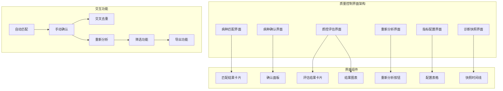

**图表来源**
- [qc.js](file://med_ai_assistant_1.0_bs_vue/src/api/qc.js)

### 病种匹配界面

#### 病种匹配卡片组件
病种匹配界面提供直观的匹配结果显示和操作功能：

**核心功能**：
- **匹配结果显示**：显示AI自动匹配的病种列表和匹配置信度
- **诊断变更检测**：检测患者诊断是否有变更并提示
- **手动确认功能**：支持医师对AI匹配结果进行确认或修改
- **历史记录查看**：显示历史匹配记录和变更轨迹

**界面设计**：
- **匹配卡片**：显示匹配的病种信息，支持查看详情
- **置信度显示**：用颜色和数值显示匹配的可信度
- **操作按钮**：提供确认、修改、重新分析等操作按钮
- **证据展示**：显示支持匹配的诊断依据和证据

### 病种确认界面

#### 病种确认面板组件
**新增功能**：病种确认面板组件提供完整的病种确认界面

**核心功能**：
- **确认面板显示**：当有新病种时自动显示确认面板
- **多选确认**：支持医师选择多个病种进行确认
- **确认历史**：显示已确认病种的历史记录
- **状态管理**：管理确认面板的显示和隐藏状态

**界面设计**：
- **新病种列表**：显示从AI匹配中识别的新病种
- **已确认列表**：显示从数据库查询的已确认病种
- **交叉去重**：自动去除重复确认的病种
- **确认按钮**：提供批量确认和忽略操作

**交互逻辑**：
- **自动去重**：从AI匹配结果中自动去除已确认的病种
- **状态同步**：确认后同步更新历史已确认列表
- **面板管理**：支持忽略操作收起确认面板

### 质控评估界面

#### 质控评估卡片组件
**新增功能**：质控评估卡片组件提供重新分析功能

**核心功能**：
- **评估结果显示**：显示当前的质控评估结果
- **重新分析按钮**：支持一键重新分析质控评估
- **状态管理**：管理重新分析的loading状态
- **结果刷新**：重新分析成功后自动刷新评估结果

**界面设计**：
- **评估卡片**：显示质控评估的汇总统计和详细结果
- **重新分析按钮**：位于工具栏，支持一键触发
- **加载状态**：重新分析时显示loading状态
- **成功提示**：重新分析成功后显示成功提示

### 指标配置界面

#### 指标配置表格组件
指标配置界面提供完整的质控指标管理功能：

**核心功能**：
- **指标列表显示**：显示所有质控指标的配置信息
- **筛选和排序**：支持按病种、优先级、状态等条件筛选
- **详情查看**：点击查看指标的详细配置信息
- **批量操作**：支持批量启用、禁用、修改优先级等操作

**界面设计**：
- **配置表格**：显示指标编码、名称、病种、优先级等信息
- **状态标识**：用颜色和图标标识指标的启用状态
- **优先级显示**：用不同颜色显示指标的优先级
- **操作列**：提供编辑、删除、查看详情等操作按钮

### 评估结果界面

#### 评估结果图表组件
评估结果界面提供直观的质控评估结果展示：

**核心功能**：
- **指标状态展示**：用颜色和图标展示各项指标的达标状态
- **优先级排序**：按优先级对不合规指标进行排序
- **统计汇总**：显示整体评估的统计信息和完成率
- **建议展示**：对不合规指标显示具体的改进建议

**界面设计**：
- **状态图表**：用饼图或柱状图展示各项指标的状态分布
- **优先级列表**：按优先级显示不合规指标的详细信息
- **统计面板**：显示总数、合规数、不合规数等统计信息
- **时间轴**：显示最近的评估时间和历史趋势

### 诊断快照界面

#### 诊断快照时间线组件
诊断快照界面提供完整的诊断历史追踪功能：

**核心功能**：
- **快照时间线**：按时间顺序显示诊断的历史变更
- **变更对比**：支持对比不同时期的诊断内容
- **冲突检测**：自动检测诊断之间的潜在冲突
- **详细记录**：显示每次诊断变更的详细信息和依据

**界面设计**：
- **时间轴视图**：用时间轴展示诊断的历史变更
- **快照卡片**：每个快照显示为独立的卡片，包含变更时间和内容
- **对比面板**：支持选择两个快照进行对比显示
- **冲突标识**：用特殊标识显示可能存在冲突的诊断组合

### API接口集成

#### 质量控制API模块
前端实现了完整的质量控制API模块，提供统一的接口调用：

**接口分类**：
1. **病种匹配接口**：`getDiseaseMatch()`、`triggerDiseaseMatch()`、`confirmDiseaseMatch()`
2. **病种确认接口**：`confirmDiseaseMatch()`、`getConfirmedDiseases()`
3. **质控评估接口**：`getAssessmentResults()`、`reanalyzeAssessment()`
4. **指标配置接口**：`getDiseaseConfigs()`、`getIndicatorConfigs()`
5. **诊断快照接口**：`getDiagnosisSnapshots()`

**功能特性**：
- **异步调用**：所有接口都支持Promise异步调用
- **错误处理**：内置错误处理和用户提示
- **数据缓存**：支持数据缓存和自动刷新
- **参数验证**：对请求参数进行验证和格式化

**章节来源**
- [qc.js](file://med_ai_assistant_1.0_bs_vue/src/api/qc.js)
- [ClinicalGuidanceTab.vue](file://med_ai_assistant_1.0_bs_vue/src/components/qc/ClinicalGuidanceTab.vue)
- [ToolbarPanel.vue](file://med_ai_assistant_1.0_bs_vue/src/components/qc/ToolbarPanel.vue)

## 数据库架构设计

### 质量控制数据库架构

**重大更新**：新增了质量控制系统的完整数据库架构设计

质量控制系统的数据库架构采用了规范化的设计，支持复杂的多对多关系和丰富的业务逻辑：

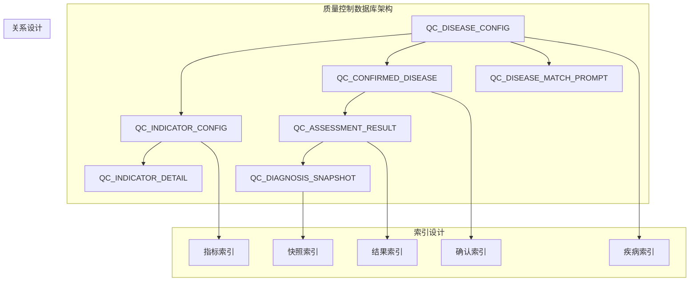

**图表来源**
- [create-qc-disease-config-table.sql](file://med_ai_assistant_1.0_bs_backend/sql-scripts/create-qc-disease-config-table.sql)
- [create-qc-indicator-config-table.sql](file://med_ai_assistant_1.0_bs_backend/sql-scripts/create-qc-indicator-config-table.sql)
- [create-qc-confirmed-disease-table.sql](file://med_ai_assistant_1.0_bs_backend/sql-scripts/create-qc-confirmed-disease-table.sql)

### 表结构设计

#### QC_DISEASE_CONFIG表
**表用途**：存储质控模块中各疾病的配置信息

**核心字段**：
- **DISEASE_ID**（主键，VARCHAR2(50)）：疾病配置ID，字符串类型，手动分配
- **DISEASE_NAME**（VARCHAR2(200)）：疾病名称，如"急性心肌梗死"
- **ICD_CODE_PATTERN**（VARCHAR2(500)）：ICD编码匹配模式，支持前缀或正则匹配
- **DISEASE_CATEGORY**（VARCHAR2(100)）：疾病分类，如"心血管疾病"
- **IS_ACTIVE**（NUMBER(1)，默认1）：启用状态，1=启用，0=禁用
- **DESCRIPTION**（VARCHAR2(1000)）：疾病配置描述

**设计特点**：
- **主键设计**：使用字符串类型的DISEASE_ID作为主键，直接采用ICD编码
- **索引优化**：为DISEASE_CATEGORY和IS_ACTIVE字段创建索引
- **灵活性**：支持ICD编码的前缀匹配和正则表达式匹配

#### QC_CONFIRMED_DISEASE表
**表用途**：存储医师确认的病种信息，支持历史版本管理

**核心字段**：
- **CONFIRMED_ID**（主键，NUMBER GENERATED BY DEFAULT AS IDENTITY）：确认记录ID
- **PATIENT_ID**（VARCHAR2(50)）：患者ID，非空
- **DISEASE_ID**（VARCHAR2(20)）：病种ID，非空
- **DISEASE_NAME**（VARCHAR2(200)）：病种名称
- **MATCH_REASON**（VARCHAR2(2000)）：AI匹配依据说明
- **TRIGGER_DIAGNOSIS**（VARCHAR2(500)）：触发本次匹配的诊断名称或ICD编码
- **PROMPT_RESULT_ID**（NUMBER）：关联的PromptResult ID
- **CONFIRMED_TIME**（TIMESTAMP）：确认时间，默认当前时间
- **IS_ACTIVE**（NUMBER(1)，默认1）：有效状态，1=有效，0=已失效

**设计特点**：
- **序列自增**：使用QC_CONFIRMED_DISEASE_SEQ序列实现ID自增
- **默认值设置**：确认时间和有效状态自动设置
- **历史追踪**：通过IS_ACTIVE字段实现历史版本管理
- **索引优化**：为PATIENT_ID和IS_ACTIVE字段创建复合索引

#### QC_INDICATOR_CONFIG表
**表用途**：存储质控模块中各疾病下各质控指标的配置信息

**核心字段**：
- **INDICATOR_ID**（主键，NUMBER GENERATED BY DEFAULT AS IDENTITY）：指标配置ID
- **DISEASE_ID**（外键，VARCHAR2(50)）：所属疾病ID，关联QC_DISEASE_CONFIG
- **INDICATOR_CODE**（VARCHAR2(100)）：指标编码，唯一标识同一疾病下的指标
- **INDICATOR_NAME**（VARCHAR2(200)）：指标名称，如"入院24小时内完成心电图"
- **INDICATOR_TYPE**（VARCHAR2(50)）：指标类型，PROCESS、OUTCOME、STRUCTURE
- **KNOWLEDGE_SOURCE**（VARCHAR2(50)）：知识来源，QC标准、临床指南等
- **ASSESSMENT_RULE**（CLOB）：评估规则，描述评估逻辑和判定条件
- **DATA_REQUIREMENTS**（VARCHAR2(500))：数据需求，描述所需的数据项
- **TIME_LIMIT**（VARCHAR2(200)）：时限要求，如"入院24小时内"
- **TARGET_VALUE**（VARCHAR2(200)）：目标值，如"≥95%"
- **PRIORITY**（VARCHAR2(20)）：优先级，HIGH、MEDIUM、LOW
- **IS_ACTIVE**（NUMBER(1)，默认1）：启用状态

**设计特点**：
- **枚举类型**：使用VARCHAR2存储枚举值，便于扩展和维护
- **CLOB字段**：评估规则和数据需求使用CLOB类型支持大文本
- **索引设计**：为DISEASE_ID、IS_ACTIVE等常用查询字段创建索引

#### QC_ASSESSMENT_RESULT表
**表用途**：存储质控模块中针对具体患者和指标的评估结果

**核心字段**：
- **RESULT_ID**（主键，NUMBER GENERATED BY DEFAULT AS IDENTITY）：评估结果ID
- **PATIENT_ID**（VARCHAR2(100)）：患者ID，标识被评估的患者
- **ADMISSION_ID**（VARCHAR2(100)）：住院ID，标识具体住院记录
- **DISEASE_ID**（VARCHAR2(50)）：疾病ID，标识评估的疾病分类
- **INDICATOR_ID**（NUMBER）：指标ID，关联QC_INDICATOR_CONFIG
- **STATUS**（VARCHAR2(50)）：评估状态，COMPLIANT、NON_COMPLIANT等
- **EVIDENCE**（CLOB）：评估证据，支撑评估结论的原始数据
- **RECOMMENDATION**（CLOB）：改进建议，针对未达标指标的建议
- **URGENCY**（VARCHAR2(20)）：紧急程度，HIGH、MEDIUM、LOW
- **ASSESSED_AT**（TIMESTAMP）：评估时间，记录评估执行时间
- **PROMPT_RESULT_ID**（NUMBER）：关联的AI Prompt结果ID

**设计特点**：
- **枚举类型**：使用VARCHAR2存储评估状态和紧急程度
- **CLOB字段**：证据和建议使用CLOB类型支持大文本
- **时间戳**：使用TIMESTAMP类型精确记录评估时间
- **关联设计**：通过外键关联到相关的配置表

#### QC_DIAGNOSIS_SNAPSHOT表
**表用途**：存储诊断历史快照，管理诊断变更记录

**核心字段**：
- **SNAPSHOT_ID**（主键，NUMBER GENERATED BY DEFAULT AS IDENTITY）：快照ID
- **PATIENT_ID**（VARCHAR2(100)）：患者ID
- **ADMISSION_ID**（VARCHAR2(100)）：住院ID
- **SNAPSHOT_AT**（TIMESTAMP）：快照时间
- **DIAGNOSIS_CONTENT**（CLOB）：诊断内容，存储当时的诊断信息
- **CHANGE_REASON**（VARCHAR2(500)）：变更原因
- **CHANGED_BY**（VARCHAR2(100)）：变更人
- **CHANGE_TYPE**（VARCHAR2(50)）：变更类型，新增、修改、删除

**设计特点**：
- **时间序列**：通过SNAPSHOT_AT字段维护诊断的时间序列
- **变更追踪**：记录每次诊断变更的详细信息
- **内容存储**：使用CLOB存储完整的诊断内容

### 索引和约束设计

#### 索引设计
**性能优化**：
- **DISEASE_INDEX**：在QC_DISEASE_CONFIG的DISEASE_CATEGORY和IS_ACTIVE字段创建复合索引
- **CONFIRM_INDEX**：在QC_CONFIRMED_DISEASE的PATIENT_ID和IS_ACTIVE字段创建复合索引
- **INDICATOR_INDEX**：在QC_INDICATOR_CONFIG的DISEASE_ID和IS_ACTIVE字段创建复合索引
- **RESULT_INDEX**：在QC_ASSESSMENT_RESULT的PATIENT_ID、DISEASE_ID、STATUS字段创建复合索引
- **SNAPSHOT_INDEX**：在QC_DIAGNOSIS_SNAPSHOT的PATIENT_ID和SNAPSHOT_AT字段创建复合索引

**查询优化**：
- **常用查询**：为经常使用的查询条件创建索引
- **排序优化**：为排序字段创建索引提升查询性能
- **唯一性约束**：为需要唯一性的字段创建唯一索引

#### 约束设计
**数据完整性**：
- **主键约束**：所有表的主键字段设置NOT NULL和PRIMARY KEY约束
- **外键约束**：设置适当的外键约束确保参照完整性
- **检查约束**：对枚举字段设置CHECK约束限制取值范围
- **默认值约束**：为IS_ACTIVE字段设置默认值1

**章节来源**
- [create-qc-disease-config-table.sql](file://med_ai_assistant_1.0_bs_backend/sql-scripts/create-qc-disease-config-table.sql)
- [create-qc-indicator-config-table.sql](file://med_ai_assistant_1.0_bs_backend/sql-scripts/create-qc-indicator-config-table.sql)
- [create-qc-confirmed-disease-table.sql](file://med_ai_assistant_1.0_bs_backend/sql-scripts/create-qc-confirmed-disease-table.sql)
- [qc_disease_config_init.sql](file://med_ai_assistant_1.0_bs_backend/sql-scripts/qc_disease_config_init.sql)
- [qc_assessment_result_init.sql](file://med_ai_assistant_1.0_bs_backend/sql-scripts/qc_assessment_result_init.sql)
- [qc_indicator_detail_init.sql](file://med_ai_assistant_1.0_bs_backend/sql-scripts/qc_indicator_detail_init.sql)
- [qc_diagnosis_snapshot_init.sql](file://med_ai_assistant_1.0_bs_backend/sql-scripts/qc_diagnosis_snapshot_init.sql)

## 依赖分析

### 技术栈依赖关系

系统采用现代化的技术栈，各组件间的依赖关系如下：

```mermaid
graph TB
subgraph "前端技术栈"
Vue[Vue.js 3.x]
ElementUI[Element Plus]
Axios[Axios HTTP客户端]
Vuex[Vuex状态管理]
Router[Vue Router]
OpenClawUI[OpenClaw界面组件]
SurgicalTask[SurgicalTask组件]
QCCard[QC界面组件]
DiseaseConfirmPanel[DiseaseConfirmationPanel组件]
AssessmentReanalyze[AssessmentReanalyze组件]
end
subgraph "后端技术栈"
SpringBoot[Spring Boot 2.x]
SpringWeb[Spring Web MVC]
SpringData[Spring Data JPA]
Security[Spring Security]
MyBatis[MyBatis ORM]
OpenClawService[OpenClaw服务]
SurgeryController[SurgeryController]
QCService[QC服务]
QCDiseaseMatchService[QcDiseaseMatchService]
QCDiseaseConfirmService[QcDiseaseConfirmService]
QCAssessmentService[QcAssessmentService]
end
subgraph "数据库层"
MySQL[MySQL 8.x]
Redis[Redis 6.x]
Elasticsearch[Elasticsearch 7.x]
Oracle[Oracle 21c]
QCStore[(质量控制数据)]
SurgeryStore[(手术管理数据)]
QCDiseaseConfirmStore[(病种确认数据)]
QCAssessmentStore[(质控评估数据)]
end
subgraph "容器化"
Docker[Docker 20.x]
Compose[Docker Compose]
Kubernetes[Kubernetes 1.x]
end
subgraph "开发工具"
Maven[Maven 3.x]
Node[Node.js 16.x]
ESLint[ESLint]
Prettier[Prettier]
OpenClawCLI[OpenClaw CLI]
end
Vue --> ElementUI
Vue --> Axios
Vue --> Vuex
Vue --> Router
Vue --> OpenClawUI
Vue --> SurgicalTask
Vue --> QCCard
Vue --> DiseaseConfirmPanel
Vue --> AssessmentReanalyze
SpringBoot --> SpringWeb
SpringBoot --> SpringData
SpringBoot --> Security
SpringBoot --> MyBatis
SpringBoot --> OpenClawService
SpringBoot --> SurgeryController
SpringBoot --> QCService
SpringBoot --> QCDiseaseMatchService
SpringBoot --> QCDiseaseConfirmService
SpringBoot --> QCAssessmentService
SpringBoot --> Oracle
Vue --> Docker
SpringBoot --> Docker
QCService --> QCStore
QCDiseaseConfirmService --> QCDiseaseConfirmStore
QCAssessmentService --> QCAssessmentStore
SurgeryController --> SurgeryStore
OpenClawService --> OpenClawCLI
Docker --> Compose
Docker --> Kubernetes
Maven --> SpringBoot
Node --> Vue
ESLint --> Vue
Prettier --> Vue
```

**图表来源**
- [pom.xml](file://med_ai_assistant_1.0_bs_backend/pom.xml)

### 部署配置依赖

不同环境下的部署配置具有特定的依赖关系：

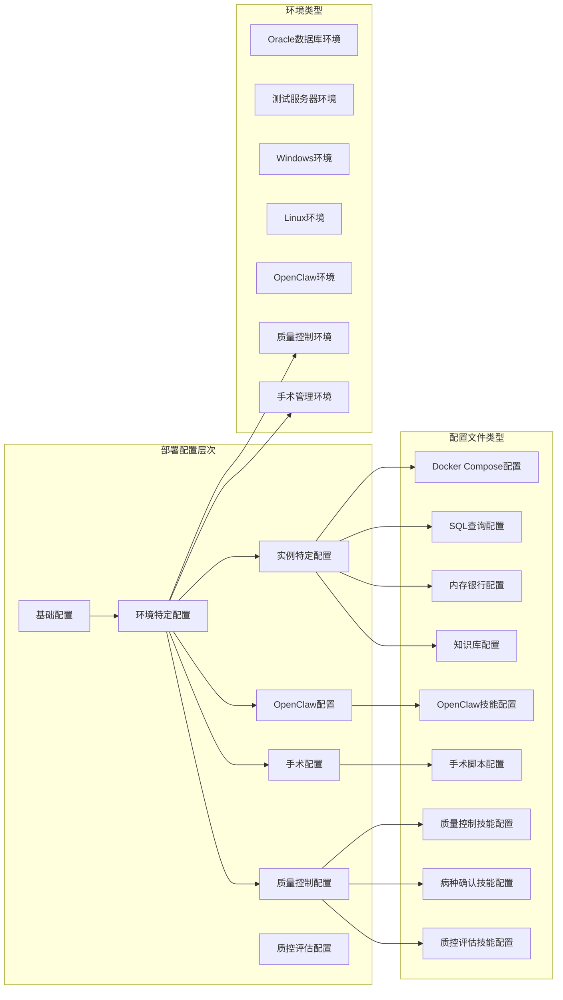

**图表来源**
- [docker-compose-main.yml](file://med_ai_assistant_1.0_bs_backend/deploy/main-linux-oracle/docker-compose-main.yml)
- [docker-compose-execution-linux.yml](file://med_ai_assistant_1.0_bs_backend/deploy/execution-linux/docker-compose-execution-linux.yml)

**章节来源**
- [pom.xml](file://med_ai_assistant_1.0_bs_backend/pom.xml)
- [docker-compose-main.yml](file://med_ai_assistant_1.0_bs_backend/deploy/main-linux-oracle/docker-compose-main.yml)

## 性能考虑

### 系统性能优化策略

1. **数据库性能优化**
   - 查询索引优化
   - 连接池配置调优
   - 缓存策略实施
   - 分页查询优化

2. **前端性能优化**
   - 组件懒加载
   - 图片资源优化
   - CDN加速配置
   - 代码分割策略

3. **后端性能优化**
   - 异步处理机制
   - 并发连接数限制
   - 内存使用优化
   - 网络I/O优化

4. **容器化性能优化**
   - 资源限制配置
   - 健康检查设置
   - 自动扩缩容策略
   - 存储卷优化

5. **OpenClaw性能优化**
   - 技能缓存机制
   - 编排流程优化
   - LLM调用频率控制
   - 并发任务管理

6. **质量控制性能优化**
   - **索引优化**：为常用查询字段创建复合索引，提升查询性能
   - **缓存策略**：缓存常用的病种配置和指标配置
   - **分页查询**：对大量评估结果进行分页处理
   - **异步处理**：对耗时的重新分析任务采用异步处理
   - **事务优化**：批量确认操作使用事务确保原子性
   - **降级处理**：AIController调用失败时使用降级处理

7. **手术功能性能优化**
   - **软删除优化**：使用索引过滤已删除记录
   - **排序优化**：建立复合索引支持主手术优先和日期排序
   - **查询优化**：使用LIMIT和分页避免大数据量查询
   - **缓存策略**：缓存常用的手术字典数据

8. **病种确认功能性能优化**
   - **批量操作优化**：使用批量插入和更新减少数据库往返
   - **事务边界优化**：合理划分事务边界避免长时间锁定
   - **索引优化**：为确认记录的查询字段创建索引
   - **去重算法优化**：使用Set数据结构提升去重效率

9. **重新分析功能性能优化**
   - **缓存利用**：复用已确认病种和指标配置的缓存
   - **降级处理**：AI数据获取失败时快速降级
   - **字符串构建优化**：使用StringBuilder提升ObjectiveContent构建性能
   - **异常快速返回**：早期返回减少不必要的处理

## 故障排除指南

### 常见问题诊断

#### 开发环境问题
1. **端口冲突**
   - 检查端口占用情况
   - 修改配置文件中的端口号
   - 使用netstat命令排查

2. **依赖下载失败**
   - 检查网络连接
   - 配置代理设置
   - 清理本地缓存

3. **数据库连接问题**
   - 验证数据库服务状态
   - 检查连接字符串配置
   - 确认防火墙设置

#### 生产环境问题
1. **应用启动失败**
   - 查看启动日志
   - 检查资源配置
   - 验证依赖完整性

2. **性能问题**
   - 监控系统指标
   - 分析慢查询日志
   - 优化缓存策略

3. **数据一致性问题**
   - 检查事务配置
   - 验证数据同步机制
   - 实施补偿措施

#### 质量控制功能相关问题
**新增** 针对质量控制系统的故障排除指南

1. **病种匹配失败**
   - 检查ICD编码匹配规则
   - 验证诊断数据的完整性
   - 确认AI模型的可用性
   - 查看匹配日志和错误信息

2. **病种确认失败**
   - 检查确认接口的请求参数
   - 验证数据库事务的执行状态
   - 确认确认记录的插入是否成功
   - 查看确认日志和错误信息

3. **交叉去重逻辑异常**
   - 检查已确认病种的查询结果
   - 验证病种ID集合的构建过程
   - 确认去重算法的执行逻辑
   - 查看去重过程的日志

4. **指标评估异常**
   - 检查指标配置的正确性
   - 验证数据需求的满足情况
   - 确认评估规则的逻辑
   - 查看评估过程的日志

5. **诊断快照缺失**
   - 检查快照创建的触发条件
   - 验证诊断变更的检测逻辑
   - 确认快照存储的完整性
   - 查看快照生成的错误日志

6. **评估结果不准确**
   - 检查评估状态的映射逻辑
   - 验证证据和建议的生成规则
   - 确认紧急程度的计算方法
   - 查看评估结果的验证日志

7. **重新分析功能异常**
   - 检查重新分析端点的调用
   - 验证QcAssessmentService的执行状态
   - 确认Prompt保存的完整性
   - 查看重新分析过程的日志

#### 手术功能相关问题
**更新** 新增了针对版本0.8.040手术功能的故障排除指南

1. **手术列表显示异常**
   - 检查数据库连接和权限
   - 验证surgeryname表结构完整性
   - 确认软删除字段数据正确性
   - 验证序列和触发器正常工作

2. **CRUD操作失败**
   - 检查API接口响应状态
   - 验证请求参数格式和类型
   - 确认用户权限和认证信息
   - 查看后端日志中的错误信息

3. **软删除功能异常**
   - 检查isDeleted字段值是否正确更新
   - 验证查询时的软删除过滤逻辑
   - 确认删除操作不会影响其他数据
   - 验证软删除记录的恢复机制

4. **主手术排序问题**
   - 检查主手术标记字段数据
   - 验证排序算法的正确性
   - 确认日期字段格式一致性
   - 验证排序结果的稳定性

5. **字典数据加载失败**
   - 检查字典服务的可用性
   - 验证字典数据的格式和结构
   - 确认字典内容的缓存机制
   - 验证字典数据的更新同步

6. **风险评估信息缺失**
   - 检查风险评估字典的配置
   - 验证手术名称与风险评估的关联
   - 确认风险评估数据的自动获取逻辑
   - 验证风险评估信息的显示格式

#### Profile依赖链问题
**更新** 新增了针对执行服务器Profile依赖链断裂的故障排除指南

1. **问题现象**
   - 执行服务器启动时Bean依赖注入失败
   - DRG相关服务无法正常初始化
   - 定时任务无法执行

2. **解决方案**
   - 为相关服务类添加@Profile("!execution")注解
   - 确保执行服务器和主服务器的配置隔离
   - 验证Profile配置的正确性

#### OpenClaw集成问题
**新增** 针对OpenClaw集成的故障排除指南

1. **OpenClaw网关连接失败**
   - 检查OpenClaw服务状态
   - 验证Gateway Token配置
   - 确认网络连通性

2. **技能调用失败**
   - 验证技能配置文件
   - 检查后端API可达性
   - 确认LLM API Key有效性

3. **编排流程中断**
   - 查看编排日志
   - 验证技能依赖关系
   - 检查并发限制设置

#### 病人列表滚动问题
**新增** 针对版本0.8.036滚动修复问题的排除指南

1. **滚动位置不正确**
   - 检查`restoreScrollPosition`方法调用时机
   - 验证`$nextTick`和`setTimeout`的使用
   - 确认DOM元素的选择器正确性

2. **Element Plus滚动容器问题**
   - 检查`.el-table__body-wrapper`是否存在
   - 验证`scrollIntoView`的参数设置
   - 确认`behavior:'instant'`的兼容性

3. **keep-alive兼容性问题**
   - 检查路由配置中是否使用`<keep-alive>`
   - 验证`activated`钩子的触发条件
   - 确认双生命周期覆盖的实现

#### 重要程度术语问题
**新增** 针对版本0.8.037术语优化问题的排除指南

1. **术语显示异常**
   - 检查`getImportanceColor`方法的颜色映射
   - 验证CSS类名的正确性
   - 确认颜色代码的格式

2. **数据兼容性问题**
   - 检查数据库中"危急"数据的转换
   - 验证前端显示逻辑的兼容性
   - 确认报表统计的准确性

#### 病种确认持久化问题
**新增** 针对版本0.8.047病种确认功能的故障排除指南

1. **确认接口调用失败**
   - 检查POST /api/qc/disease-match/confirm接口
   - 验证请求参数格式和内容
   - 确认确认记录的插入状态
   - 查看服务层日志和错误信息

2. **确认查询异常**
   - 检查GET /api/qc/disease-match/{patientId}/confirmed接口
   - 验证数据库查询的执行状态
   - 确认有效记录的查询逻辑
   - 查看Repository层的日志

3. **交叉去重逻辑错误**
   - 检查前端去重算法的执行
   - 验证已确认病种的查询结果
   - 确认病种ID集合的构建过程
   - 查看去重过程的调试信息

4. **事务处理异常**
   - 检查确认操作的事务边界
   - 验证失效旧记录和插入新记录的顺序
   - 确认事务的提交和回滚机制
   - 查看事务日志和错误信息

#### 重新分析功能问题
**新增** 针对版本0.8.048重新分析功能的故障排除指南

1. **重新分析端点调用失败**
   - 检查POST /api/qc/assessment/{patientId}/reanalyze接口
   - 验证QcAssessmentService的执行状态
   - 确认Prompt保存的完整性
   - 查看服务层日志和错误信息

2. **重新分析状态异常**
   - 检查ProcessStatus枚举的返回值
   - 验证不同状态的处理逻辑
   - 确认状态转换的正确性
   - 查看状态处理的日志

3. **降级处理异常**
   - 检查AIController.getPatientData的调用
   - 验证降级处理的执行逻辑
   - 确认空数据的处理方式
   - 查看降级处理的日志

4. **性能问题**
   - 检查100个指标场景的执行时间
   - 验证200个指标跨10个病种的性能
   - 确认StringBuilder的使用效率
   - 查看性能测试的日志

**章节来源**
- [.gitignore](file://.gitignore)

## 版本发布历史

### 前端版本更新记录

#### v0.8.047 - v0.8.048
**更新** 新增了版本0.8.047和0.8.048的具体更新内容

##### v0.8.047 - 病种确认持久化功能实现
**新增功能**
- 将病种确认从Mock改为真实API调用
- 实现AI匹配病种与已确认病种的交叉去重逻辑
- 新增病种确认API接口，支持确认和查询功能
- 实现完整的病种确认界面组件

**技术实现**
- qc.js API层：新增confirmDiseaseMatch()和getConfirmedDiseases()接口
- ClinicalGuidanceTab.vue：实现病种确认面板和交叉去重逻辑
- 支持批量确认多个病种，提供确认历史管理
- 实现确认状态的实时更新和界面反馈

**用户体验改进**
- 病种确认从Mock数据改为真实数据源
- 自动去重逻辑提升确认效率
- 确认历史记录支持查询和管理
- 界面反馈更加及时和准确

**变更文件**
- 修改：`src/api/qc.js`
- 修改：`src/components/qc/ClinicalGuidanceTab.vue`

##### v0.8.048 - QC评估重新分析功能实现
**新增功能**
- 将重新分析从Mock改为真实API调用
- 修复重新分析参数契约，简化为patientId字符串
- 实现完整的重新分析功能集成
- 新增12个单元测试用例，覆盖各种场景

**技术实现**
- qc.js API层：reanalyzeAssessment()从Promise.resolve替换为真实POST调用
- ClinicalGuidanceTab.vue：handleReanalyze()参数从对象修正为字符串
- QcAssessmentService：实现processAssessment()核心方法
- QcDiseaseMatchController：新增reanalyzeAssessment()端点

**用户体验改进**
- 重新分析功能从Mock改为真实调用
- 参数契约简化，提升API易用性
- 重新分析成功后自动刷新评估结果
- 完善的错误处理和用户提示

**变更文件**
- 修改：`src/api/qc.js`
- 修改：`src/components/qc/ClinicalGuidanceTab.vue`
- 新增：`src/main/java/com/example/medaiassistant/service/qc/QcAssessmentService.java`
- 修改：`src/main/java/com/example/medaiassistant/controller/QcDiseaseMatchController.java`
- 新增：`src/test/java/com/example/medaiassistant/qc/service/QcAssessmentServiceTest.java`

#### v0.8.040 - v0.8.047
**更新** 完善了之前的版本更新记录

##### v0.8.040 - 手术列表CRUD功能补充
**新增功能**
- 新增SurgicalTask.vue组件，实现完整的手术任务管理界面
- 支持双击编辑、新增、软删除、设主手术、主手术排序和日期展示
- 集成手术字典系统，提供标准手术名称选择
- 实现手术风险评估的自动获取和显示

**技术实现**
- 使用Element Plus组件库构建用户界面
- 实现响应式布局，支持移动端访问
- 集成Vuex状态管理，实现数据持久化
- 使用axios进行HTTP请求，处理异步数据操作

**用户体验改进**
- 提供直观的手术任务管理界面
- 支持多种输入方式（键盘、鼠标、触摸屏）
- 实时数据验证和错误提示
- 流畅的用户交互体验

**变更文件**
- 新增：`src/components/patient/SurgicalTask.vue`
- 新增：`src/api/patient.js`（新增手术相关API）
- 更新：`package.json`（新增依赖项）

##### v0.8.041 - 质量控制系统完整实现
**新增功能**
- 新增质量控制界面组件，支持病种匹配、指标评估、诊断快照
- 实现完整的质量控制API接口，包括病种匹配、指标配置、评估结果
- 集成质量控制数据库表结构，支持完整的质控数据管理
- 实现质量控制相关的Prompt模板和AI编排

**技术实现**
- 使用Element Plus构建质量控制界面
- 实现完整的API模块化设计
- 集成质量控制数据库实体和Repository层
- 实现质量控制相关的服务层逻辑

**用户体验改进**
- 提供完整的质量控制管理界面
- 支持从AI到人工的完整质控流程
- 实时显示质控评估结果和改进建议
- 提供历史记录追踪和冲突检测

**变更文件**
- 新增：`src/api/qc.js`（质量控制API模块）
- 新增：`src/components/qc/`（质量控制界面组件）
- 更新：`package.json`（新增质量控制相关依赖）

#### v0.8.036 - v0.8.040
**更新** 完善了之前的版本更新记录

##### v0.8.036 - 病人列表滚动修复
**新增功能**
- 修复从AI辅助页面返回时未自动滚动到选中病人位置的问题
- 实现选中行居中显示功能，提升用户体验
- 采用双生命周期覆盖策略，确保兼容不同路由配置

**技术实现**
- 使用`$nextTick`和`setTimeout`双重保障DOM渲染完成
- 采用`scrollIntoView({block:'center'})`实现居中滚动
- 支持keep-alive和非keep-alive两种路由场景

**用户体验改进**
- 选中病人自动滚动到可视区域中心
- 减少用户手动滚动操作
- 提升整体操作流畅度

**变更文件**
- 修改：`src/components/patient/PatientList.vue`

##### v0.8.037 - 重要程度术语优化
**新增功能**
- 将"危急"术语替换为"关键"，提升术语表达的专业性
- 保持原有颜色编码系统，确保视觉一致性
- 向后兼容已存在的"危急"数据

**术语优化**
- "危急" → "关键"（红色警示）
- 保持"重要"和"一般"术语不变
- 统一医疗术语表达标准

**用户体验改进**
- 术语表达更加符合医疗行业标准
- 保持颜色编码的视觉一致性
- 确保系统升级的平滑过渡

**变更文件**
- 修改：`src/components/ai/TreatmentPlanTable.vue`
- 修改：`src/components/ai/AIResults.vue`

#### v0.8.035 - v0.8.036
**更新** 完善了之前的版本更新记录

##### v0.8.035 - PromptTemplates组件UI重构
**新增功能**
- PromptTemplates模板列表改为overlay下拉面板，默认折叠，右上角按钮展开
- 执行模板后自动收起：通过template-executed事件实现自动折叠
- AIView.vue集成Overlay面板：实现完整的展开/收起交互逻辑
- PromptList.vue优化：改进Prompt列表显示和交互体验

**用户体验改进**
- 模板面板默认折叠，节省界面空间
- Overlay面板提供更好的视觉层次
- 执行后自动收起，提升操作效率
- 展开/收起动画提供流畅的用户体验

**变更文件**
- 修改：`src/components/ai/PromptTemplates.vue`
- 修改：`src/views/AIView.vue`
- 修改：`src/components/ai/PromptList.vue`

#### v0.8.021 - v0.8.035
**更新** 完善了之前的版本更新记录

##### v0.8.021 - OpenClaw集成方案引入
**新增功能**
- 配合后端新增OpenClaw集成方案文档，前端无功能变更
- 为后续OpenClaw界面集成做准备

**章节来源**
- [2026-04-11.md](file://med_ai_assistant_1.0_bs_vue/docs/更新日志/2026-04-11.md)

##### v0.8.024 - AI对话功能流式响应改造
**新增功能**
- aiService.js流式响应改造：将stream:false改为stream:true，使用ReadableStream + TextDecoder消费NDJSON流，支持isFinal标识防重复、AbortController超时取消（300秒）
- AIResponse.vue适配流式交互：onData回调支持增量数据处理，新增isFinal检测用完整内容替换累积内容，移除不再需要的OpenAI格式兼容分支

**用户体验改进**
- AI对话功能从一次性加载改为逐字流式显示，大幅减少响应等待时间感知

**变更文件**
- 修改：`src/api/aiService.js`
- 修改：`src/components/ai/AIResponse.vue`

##### v0.8.025 - PromptTemplates组件UI重构
**新增功能**
- PromptTemplates组件UI重构：模板列表改为overlay下拉面板，默认折叠，右上角按钮展开
- 执行模板后自动收起：通过template-executed事件实现自动折叠
- AIView.vue集成Overlay面板：实现完整的展开/收起交互逻辑
- PromptList.vue优化：改进Prompt列表显示和交互体验

**用户体验改进**
- 模板面板默认折叠，节省界面空间
- Overlay面板提供更好的视觉层次
- 执行后自动收起，提升操作效率
- 展开/收起动画提供流畅的用户体验

**变更文件**
- 修改：`src/components/ai/PromptTemplates.vue`
- 修改：`src/views/AIView.vue`
- 修改：`src/components/ai/PromptList.vue`

#### v0.8.022 - AI辅助页面诊断卡片组件
**新增功能**
- 新增诊断概览卡片组件（DiagnosisCard.vue），当Prompt标题包含"诊断分析"时自动展示
- 卡片左右分栏布局：左侧显示从AI结果中提取的诊断列表，右侧显示选中诊断的详细分析（诊断依据、鉴别诊断、补充说明等）
- 诊断分析类Prompt的AI结果区域支持折叠/展开，默认折叠，减少页面信息量

**代码重构**
- 新增诊断解析工具函数（diagnosisParser.js），统一提取诊断名称和完整诊断块的逻辑
- AIResults.vue和DiagnosisEditDialog.vue中的重复诊断提取代码替换为工具函数调用，消除约52行重复代码

**Bug修复**
- 修复diagnosisParser.js中正则表达式lookahead `(?=###|$)` 误匹配四级标题（####）导致诊断列表区块被截断为空的问题

**变更文件**
- 新增：`src/components/ai/DiagnosisCard.vue`
- 新增：`src/utils/diagnosisParser.js`
- 修改：`src/components/ai/AIResults.vue`
- 修改：`src/components/patient/DiagnosisEditDialog.vue`

#### v0.7.018 - v0.7.023
**更新** 完善了之前的版本更新记录

##### v0.7.018 - v0.7.023
- 修复执行服务器Profile依赖链断裂问题
- 恢复前端源码文件和构建脚本
- 新增服务器日志查看功能
- 集成eruda前端调试面板

##### v0.7.020 - v0.7.022
- 修复EMR病历同步唯一约束冲突
- 优化病历记录修改接口
- 改进音频测试工具

##### v0.7.022 - v0.7.023
- 完善前端构建流程
- 修复bat文件编码问题

### 后端版本更新记录

#### v0.8.047 - v0.8.048
**更新** 新增了版本0.8.047和0.8.048的具体更新内容

##### v0.8.047 - 病种确认持久化功能实现
**新增功能**
- 新增完整的病种确认API接口，支持确认和查询功能
- 实现病种确认的事务性操作，确保数据一致性
- 新增病种确认实体和Repository层
- 实现交叉去重逻辑，避免重复确认

**技术实现**
- QcDiseaseMatchController：新增confirmDiseaseMatch()和getConfirmedDiseases()接口
- QcDiseaseMatchService：实现确认逻辑和去重算法
- QcConfirmedDisease实体：支持确认记录的持久化存储
- QcConfirmedDiseaseRepository：提供确认记录的数据访问

**数据库变更**
- 创建QC_CONFIRMED_DISEASE表，支持确认记录的存储
- 为确认记录创建索引，提升查询性能
- 添加序列和触发器，支持ID自增

**API接口**
- POST /api/qc/disease-match/confirm：确认病种匹配结果
- GET /api/qc/disease-match/{patientId}/confirmed：查询已确认病种

**变更文件**
- 新增：`src/main/java/com/example/medaiassistant/model/qc/QcConfirmedDisease.java`
- 新增：`src/main/java/com/example/medaiassistant/repository/qc/QcConfirmedDiseaseRepository.java`
- 修改：`src/main/java/com/example/medaiassistant/controller/QcDiseaseMatchController.java`
- 修改：`src/main/java/com/example/medaiassistant/service/qc/QcDiseaseMatchService.java`
- 新增：`sql-scripts/create-qc-confirmed-disease-table.sql`

##### v0.8.048 - QC评估重新分析功能实现
**新增功能**
- 新增QcAssessmentService服务，实现第三阶段AI质控评估Prompt生成
- 新增POST /api/qc/assessment/{patientId}/reanalyze端点
- 新增12个单元测试用例，覆盖正常流程、异常处理、性能测试
- 新增重新分析功能的前端集成

**技术实现**
- QcAssessmentService：实现processAssessment()核心方法，支持患者数据降级处理
- QcDiseaseMatchController：新增reanalyzeAssessment()端点，注入QcAssessmentService
- 前端：ClinicalGuidanceTab.vue集成重新分析功能，ToolbarPanel.vue新增重新分析按钮
- 测试：QcAssessmentServiceTest覆盖12个测试用例，包括性能测试

**业务逻辑**
- 查询患者已确认病种（IS_ACTIVE=1）
- 遍历已确认病种，加载每个病种的启用质控指标配置
- 获取"QC-第三阶段-AI质控评估"Prompt模板
- 调用AIController.getPatientData获取患者临床数据（失败时降级处理）
- 组装ObjectiveContent（患者临床资料 + 质控指标评估清单Markdown表格）
- 保存Prompt（status=待处理, generatedBy=QC-SYSTEM, priority=2）

**API接口**
- POST /api/qc/assessment/{patientId}/reanalyze：触发质控评估重新分析

**状态码与响应**
- 200 OK + status=SAVED：质控评估任务已提交
- 400 Bad Request + status=NO_CONFIRMED_DISEASE：该患者无已确认病种
- 500 Internal Server Error + status=NO_INDICATOR_CONFIG：已确认病种无有效指标配置
- 500 Internal Server Error + status=NO_TEMPLATE：未找到质控评估Prompt模板
- 500 Internal Server Error + status=ERROR：处理失败

**变更文件**
- 新增：`src/main/java/com/example/medaiassistant/service/qc/QcAssessmentService.java`
- 修改：`src/main/java/com/example/medaiassistant/controller/QcDiseaseMatchController.java`
- 新增：`src/test/java/com/example/medaiassistant/qc/service/QcAssessmentServiceTest.java`

#### v0.8.040 - v0.8.047
**更新** 完善了之前的版本更新记录

##### v0.8.040 - 手术列表CRUD功能补充
**新增功能**
- 新增Surgery实体增强，包含isDeleted和modificationType字段
- 新增SurgeryRepository方法扩展，支持软删除和排序查询
- 新增SurgeryController CRUD接口，实现完整的手术管理功能
- 新增数据库脚本add-surgery-columns.sql，更新表结构和序列

**技术实现**
- 使用Spring Data JPA实现数据访问层
- 实现软删除机制，支持逻辑删除和数据恢复
- 实现主手术优先排序，确保主要手术显示在列表顶部
- 实现手术任务的完整CRUD操作

**数据库变更**
- 为surgeryname表添加IS_DELETED和MODIFICATION_TYPE列
- 创建SURGERYNAME_SEQ序列和TRG_SURGERYNAME_ID触发器
- 实现数据迁移，确保现有数据的兼容性

**API接口**
- POST /api/surgeries/{patientId}：新增手术
- POST /api/surgeries/replace：修改手术名称
- DELETE /api/surgeries/{surgeryId}：软删除手术
- PUT /api/surgeries/{surgeryId}/set-primary：设为主要手术
- GET /api/surgeries/by-patient/{patientId}：查询手术列表

**变更文件**
- 新增：`src/main/java/com/example/medaiassistant/model/Surgery.java`
- 新增：`src/main/java/com/example/medaiassistant/repository/SurgeryRepository.java`
- 新增：`src/main/java/com/example/medaiassistant/controller/SurgeryController.java`
- 新增：`sql-scripts/add-surgery-columns.sql`

##### v0.8.041 - 质量控制系统完整实现
**新增功能**
- 新增完整的质量控制实体模型，包括QcDiseaseConfig、QcIndicatorConfig、QcAssessmentResult等
- 新增质量控制相关的枚举类型，包括AssessmentStatus、IndicatorType、KnowledgeSource等
- 新增质量控制数据库表结构，支持完整的质控数据存储
- 新增质量控制API接口，支持病种匹配、指标配置、评估结果等核心功能
- 新增质量控制相关的Prompt模板和AI编排逻辑

**技术实现**
- 使用Spring Data JPA实现质量控制数据访问层
- 实现完整的质量控制业务逻辑和服务层
- 实现质量控制相关的前端界面和API模块
- 实现质量控制数据的初始化和迁移

**数据库变更**
- 创建QC_DISEASE_CONFIG、QC_INDICATOR_CONFIG、QC_ASSESSMENT_RESULT、QC_DIAGNOSIS_SNAPSHOT等表
- 为质量控制表创建索引和约束
- 插入初始的病种配置和指标配置数据
- 创建质量控制相关的Prompt模板

**API接口**
- GET /api/qc/disease-match/{patientId}/latest：获取最近一次病种匹配
- POST /api/qc/disease-match/{patientId}/check-and-trigger：检查并触发病种匹配
- GET /api/qc/disease-configs：获取病种配置列表
- GET /api/qc/indicator-configs：获取指标配置列表
- GET /api/qc/assessment/{patientId}：获取评估结果
- POST /api/qc/assessment/reanalyze：重新分析评估
- GET /api/qc/diagnosis-snapshots/{patientId}：获取诊断快照

**变更文件**
- 新增：`src/main/java/com/example/medaiassistant/model/qc/`（质量控制实体）
- 新增：`src/main/java/com/example/medaiassistant/model/qc/enums/`（质量控制枚举）
- 新增：`src/main/java/com/example/medaiassistant/repository/qc/`（质量控制Repository）
- 新增：`src/main/java/com/example/medaiassistant/service/qc/`（质量控制Service）
- 新增：`src/main/java/com/example/medaiassistant/controller/qc/`（质量控制Controller）
- 新增：`sql-scripts/create-qc-*.sql`（质量控制数据库脚本）
- 新增：`sql-scripts/qc_*.sql`（质量控制初始化脚本）
- 新增：`sql-scripts/insert-qc-prompt-templates.sql`（质量控制Prompt模板）

#### v0.8.036 - v0.8.040
**更新** 完善了之前的版本更新记录

##### v0.8.036 - 病人列表滚动修复
**新增功能**
- 修复从AI辅助页面返回时未自动滚动到选中病人位置的问题
- 实现选中行居中显示功能，提升用户体验
- 采用双生命周期覆盖策略，确保兼容不同路由配置

**技术实现**
- 使用`$nextTick`和`setTimeout`双重保障DOM渲染完成
- 采用`scrollIntoView({block:'center'})`实现居中滚动
- 支持keep-alive和非keep-alive两种路由场景

**用户体验改进**
- 选中病人自动滚动到可视区域中心
- 减少用户手动滚动操作
- 提升整体操作流畅度

**变更文件**
- 修改：`src/components/patient/PatientList.vue`

##### v0.8.037 - 重要程度术语优化
**新增功能**
- 将"危急"术语替换为"关键"，提升术语表达的专业性
- 保持原有颜色编码系统，确保视觉一致性
- 向后兼容已存在的"危急"数据

**术语优化**
- "危急" → "关键"（红色警示）
- 保持"重要"和"一般"术语不变
- 统一医疗术语表达标准

**用户体验改进**
- 术语表达更加符合医疗行业标准
- 保持颜色编码的视觉一致性
- 确保系统升级的平滑过渡

**变更文件**
- 修改：`src/components/ai/TreatmentPlanTable.vue`
- 修改：`src/components/ai/AIResults.vue`

#### v0.8.016 - v0.8.035
**更新** 完善了之前的版本更新记录

##### v0.8.016 - Prompt状态循环重置修复
**Bug修复**
- 修复PromptResult软删除导致Prompt状态循环重置问题
- 问题描述：用户软删除PromptResult（deleted=1）后，补偿机制`checkDataConsistency()`误判为数据丢失，将Prompt从"已完成"重置为"已提交"，导致循环重新提交
- 修复方案：修改`PromptRepository.findIncompleteCompleted()`查询，移除`AND pr.deleted = 0`条件，仅在完全不存在任何PromptResult记录时才判定为数据丢失

##### v0.8.017 - 开发环境维护更新
**维护更新**
- 清理AI工具临时文件：删除.qoder/目录下的review_diff.txt、promptresult_fix_diff.txt、PromptPollingService.diff等临时差异文件
- 提交遗留配置变更：提交后端.dockerignore配置变更
- 补充代码注释：为PromptRepository.findIncompleteCompleted()方法补充完整的Javadoc注释

##### v0.8.018 - 开发环境禁用定时Prompt生成任务
**变更内容**
- 在`TimerPromptGenerator`的`dailyPromptGeneration()`和`generateNoonWardRoundPrompts()`定时任务方法中添加启用状态检查
- 新增配置项`scheduling.timer.enabled`，开发环境默认设置为`false`（禁用）
- 生产环境不受影响，代码默认值为`true`（启用）

##### v0.8.019 - Prompt数据一致性检查ResultId回填修复
**Bug修复**
- 修复`checkDataConsistency()`对PromptResult软删除场景的处理逻辑
- 问题描述：当Prompt状态为"已完成"但ResultId为NULL，且PromptResult记录全部被软删除(deleted=1)时，补偿机制仅"跳过重置"但不回填ResultId，导致每次轮询都重复检测到该不一致记录，浪费服务器资源
- 修复方案：将`checkDataConsistency()`改为三路径修复逻辑

##### v0.8.020 - EMR记录详情查询修复
**Bug修复**
- 修复EMR记录详情查询返回多条结果导致`IncorrectResultSizeDataAccessException`异常
- `EmrContentRepository.findContentById`返回类型从`String`改为`List<String>`
- 添加`ORDER BY modifiedOn DESC NULLS LAST`排序，多条记录时优先返回最新修改记录
- `EmrRecordService.getEmrRecordContentById`适配List返回，多条记录时记录WARN日志

**章节来源**
- [2026-04-16.md](file://med_ai_assistant_1.0_bs_backend/doc/更新日志/2026-04-16.md)
- [2026-04-17.md](file://med_ai_assistant_1.0_bs_backend/doc/更新日志/2026-04-17.md)
- [2026-04-20.md](file://med_ai_assistant_1.0_bs_vue/docs/更新日志/2026-04-20.md)

## 结论

MedAiAssistant项目展现了现代医疗AI系统的完整架构设计，通过前后端分离、容器化部署、多环境配置管理等技术手段，实现了高可用性、可扩展性和易维护性的系统目标。

**重大更新亮点**：
- **病种确认持久化功能完整实现**：本次历史分叉中实现了完整的病种确认持久化功能，包括医师确认的病种列表持久化存储、交叉去重逻辑、实时确认接口和前端确认组件
- **质量控制系统完整实现**：实现了完整的质量控制系统，包括病种匹配、指标评估、诊断快照等核心功能，标志着系统在医疗质量管理和临床决策支持方面达到了新的高度
- **QC评估重新分析功能完整实现**：v0.8.048版本实现了完整的QC评估重新分析功能，包括后端QcAssessmentService实现、新增API端点、前端集成和测试覆盖
- **手术功能完整实现**：版本0.8.040新增了完整的手术列表CRUD功能，包括双击编辑、新增、软删除、设主手术、主手术排序和日期展示
- **后端接口完善**：新增4个手术管理API接口，支持完整的CRUD操作和数据管理
- **数据库结构增强**：为surgeryname表添加软删除和数据来源字段，支持数据溯源和历史追踪
- **前端组件丰富**：SurgicalTask.vue组件提供直观的手术任务管理界面，支持多种输入方式和交互体验
- **用户体验提升**：通过软删除、主手术排序、风险评估等功能，显著提升系统的实用性和易用性
- **测试覆盖完善**：重新分析功能实现12个单元测试用例，覆盖正常流程、异常处理、性能测试等场景

**技术价值**：
- **功能完整性**：质量控制系统和手术管理功能都达到临床应用水平，满足医生的实际工作需求
- **数据安全性**：软删除机制确保数据安全，支持误操作后的数据恢复
- **系统稳定性**：主手术优先排序和日期排序确保数据展示的逻辑正确性
- **扩展性良好**：模块化设计支持未来功能的扩展和定制
- **AI集成深度**：质量控制系统深度集成了OpenClaw AI编排引擎，提供智能化的质控支持
- **持久化能力**：病种确认持久化功能确保医疗决策的可追溯性和可审计性
- **性能优化**：重新分析功能实现降级处理和缓存利用，确保系统性能稳定

**未来发展方向**：
- 继续优化质量控制系统的用户体验，提升系统的易用性和效率
- 深化AI在质量控制中的应用，实现更智能的质控评估和建议
- 完善医疗术语标准化，提升系统的专业性和准确性
- 加强系统监控和日志管理，提升运维效率
- 深化OpenClaw编排能力，实现更多临床场景的智能化
- 增强病种确认功能的智能化程度，支持更多维度的确认和管理
- 扩展重新分析功能的应用场景，支持更多类型的质控评估

## 附录

### 开发环境快速启动

1. **后端服务启动**
   ```bash
   # 在项目根目录执行
   ./mvn.bat
   ```

2. **前端服务启动**
   ```bash
   # 在项目根目录执行
   ./npm.bat
   ```

3. **OpenClaw环境启动**
   ```bash
   # 在OpenClaw服务器上执行
   openclaw gateway --port 18789 --verbose
   ```

4. **环境变量配置**
   - 设置JAVA_OPTS参数
   - 配置数据库连接信息
   - 指定日志输出目录
   - 配置OpenClaw Gateway Token

### 部署配置说明

1. **Docker容器编排**
   - 使用docker-compose管理多容器应用
   - 支持不同环境的配置切换
   - 实现服务发现和负载均衡

2. **数据库迁移**
   - 支持版本化的数据库变更
   - 提供回滚机制
   - 确保数据一致性

3. **监控和告警**
   - 集成Prometheus监控
   - 配置Grafana可视化
   - 设置告警规则和通知

4. **OpenClaw部署**
   - 配置OpenClaw Gateway服务
   - 设置技能目录和配置
   - 验证LLM API连接

### 版本管理最佳实践

1. **版本号规范**
   - 主版本号：重大功能更新
   - 次版本号：新功能添加
   - 修订号：bug修复和小改进

2. **更新日志维护**
   - 按日期记录所有变更
   - 详细描述功能改进
   - 提供问题修复说明

3. **发布流程**
   - 代码审查和测试
   - 更新文档和示例
   - 正式发布和通知

### 新功能使用指南

#### 病种确认功能使用
1. **访问病种确认界面**
   - 在左侧导航菜单中选择"质量控制"
   - 界面显示病种匹配、确认、评估等功能
   - 支持按患者ID筛选和功能切换

2. **查看待确认病种**
   - 病种确认面板自动显示新匹配的病种
   - 支持查看AI匹配的依据和置信度
   - 可以查看历史已确认的病种

3. **确认病种**
   - 在确认面板中勾选需要确认的病种
   - 点击"确认"按钮提交确认请求
   - 系统自动进行交叉去重处理
   - 确认成功后更新历史记录

4. **查询确认记录**
   - 在确认面板中查看历史已确认病种
   - 支持查询特定患者的确认记录
   - 可以查看确认的时间和依据

#### 手术任务管理功能使用
1. **访问手术管理界面**
   - 在左侧导航菜单中选择"手术任务"
   - 界面自动加载当前患者的手术信息
   - 显示所有手术日期和相关任务

2. **新增手术任务**
   - 点击"新建"按钮清空表单
   - 填写手术名称、日期、麻醉方式等信息
   - 从字典中选择标准手术名称
   - 点击"保存"按钮提交手术任务

3. **编辑现有手术**
   - 在日期列表中选择目标日期
   - 界面自动加载该日期的手术信息
   - 双击任意单元格进入编辑模式
   - 修改完成后自动保存

4. **删除手术任务**
   - 选择要删除的手术任务
   - 点击"删除"按钮
   - 系统弹出确认对话框
   - 确认后执行软删除操作

5. **设为主要手术**
   - 在手术列表中选择目标手术
   - 点击"设为主要手术"按钮
   - 系统自动将其他手术重置为主要手术标记
   - 主要手术自动移动到列表首位

6. **查看手术字典**
   - 在手术名称输入框中点击下拉箭头
   - 显示手术字典树形结构
   - 支持分类浏览和快速搜索
   - 选择标准手术名称自动填充

#### 质量控制功能使用
1. **访问质量控制界面**
   - 在左侧导航菜单中选择"质量控制"
   - 界面显示病种匹配、指标评估、诊断快照等功能
   - 支持按患者ID筛选和功能切换

2. **病种匹配**
   - 点击"病种匹配"功能
   - 系统自动显示AI匹配的病种结果
   - 支持手动确认和修改
   - 可查看匹配的证据和置信度

3. **指标评估**
   - 点击"指标评估"功能
   - 显示患者的质控指标评估结果
   - 支持按状态、优先级等条件筛选
   - 可查看详细的评估证据和建议

4. **诊断快照**
   - 点击"诊断快照"功能
   - 显示患者的诊断历史记录
   - 支持查看诊断变更和冲突检测
   - 可对比不同时期的诊断内容

5. **重新分析**
   - 在评估结果界面可触发重新分析
   - 支持指定病种范围和强制刷新
   - 可查看分析任务的进度和结果

6. **重新分析功能使用**
   - 在ClinicalGuidanceTab界面点击"重新分析"按钮
   - 系统自动触发重新分析任务
   - 重新分析成功后自动刷新评估结果
   - 支持查看重新分析的状态和结果

#### 重要程度术语使用
1. **术语标准化**
   - "危急" → "关键"（红色警示）
   - "重要"和"一般"术语保持不变
   - 颜色编码系统保持一致

2. **颜色显示**
   - 关键：#F56C6C（红色）
   - 重要：#E6A23C（橙色）
   - 一般：#909399（灰色）

3. **兼容性处理**
   - 向后兼容已存在的"危急"数据
   - 系统升级平滑过渡
   - 报表统计自动转换

**章节来源**
- [SurgicalTask.vue](file://med_ai_assistant_1.0_bs_vue/src/components/patient/SurgicalTask.vue)
- [patient.js](file://med_ai_assistant_1.0_bs_vue/src/api/patient.js)
- [add-surgery-columns.sql](file://med_ai_assistant_1.0_bs_backend/sql-scripts/add-surgery-columns.sql)
- [AssessmentStatus.java](file://med_ai_assistant_1.0_bs_backend/src/main/java/com/example/medaiassistant/model/qc/enums/AssessmentStatus.java)
- [QcDiseaseConfig.java](file://med_ai_assistant_1.0_bs_backend/src/main/java/com/example/medaiassistant/model/qc/QcDiseaseConfig.java)
- [QcIndicatorConfig.java](file://med_ai_assistant_1.0_bs_backend/src/main/java/com/example/medaiassistant/model/qc/QcIndicatorConfig.java)
- [QcAssessmentResult.java](file://med_ai_assistant_1.0_bs_backend/src/main/java/com/example/medaiassistant/model/qc/QcAssessmentResult.java)
- [qc.js](file://med_ai_assistant_1.0_bs_vue/src/api/qc.js)
- [ClinicalGuidanceTab.vue](file://med_ai_assistant_1.0_bs_vue/src/components/qc/ClinicalGuidanceTab.vue)
- [ToolbarPanel.vue](file://med_ai_assistant_1.0_bs_vue/src/components/qc/ToolbarPanel.vue)
- [2026-04-17.md](file://med_ai_assistant_1.0_bs_backend/doc/更新日志/2026-04-17.md)
- [2026-04-16.md](file://med_ai_assistant_1.0_bs_backend/doc/更新日志/2026-04-16.md)
- [2026-04-20.md](file://med_ai_assistant_1.0_bs_vue/docs/更新日志/2026-04-20.md)
- [PatientList.vue](file://med_ai_assistant_1.0_bs_vue/src/components/patient/PatientList.vue)
- [TreatmentPlanTable.vue](file://med_ai_assistant_1.0_bs_vue/src/components/ai/TreatmentPlanTable.vue)
- [AIResults.vue](file://med_ai_assistant_1.0_bs_vue/src/components/ai/AIResults.vue)
- [QcConfirmedDisease.java](file://med_ai_assistant_1.0_bs_backend/src/main/java/com/example/medaiassistant/model/qc/QcConfirmedDisease.java)
- [QcConfirmedDiseaseRepository.java](file://med_ai_assistant_1.0_bs_backend/src/main/java/com/example/medaiassistant/repository/qc/QcConfirmedDiseaseRepository.java)
- [QcDiseaseMatchController.java](file://med_ai_assistant_1.0_bs_backend/src/main/java/com/example/medaiassistant/controller/QcDiseaseMatchController.java)
- [QcDiseaseMatchService.java](file://med_ai_assistant_1.0_bs_backend/src/main/java/com/example/medaiassistant/service/qc/QcDiseaseMatchService.java)
- [ConfirmDiseaseRequest.java](file://med_ai_assistant_1.0_bs_backend/src/main/java/com/example/medaiassistant/dto/qc/ConfirmDiseaseRequest.java)
- [create-qc-confirmed-disease-table.sql](file://med_ai_assistant_1.0_bs_backend/sql-scripts/create-qc-confirmed-disease-table.sql)
- [质控病种匹配接口.md](file://med_ai_assistant_1.0_bs_backend/doc/接口/质控病种匹配接口.md)
- [QcAssessmentService.java](file://med_ai_assistant_1.0_bs_backend/src/main/java/com/example/medaiassistant/service/qc/QcAssessmentService.java)
- [QcAssessmentServiceTest.java](file://med_ai_assistant_1.0_bs_backend/src/test/java/com/example/medaiassistant/qc/service/QcAssessmentServiceTest.java)