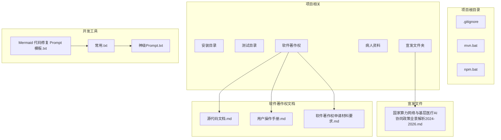
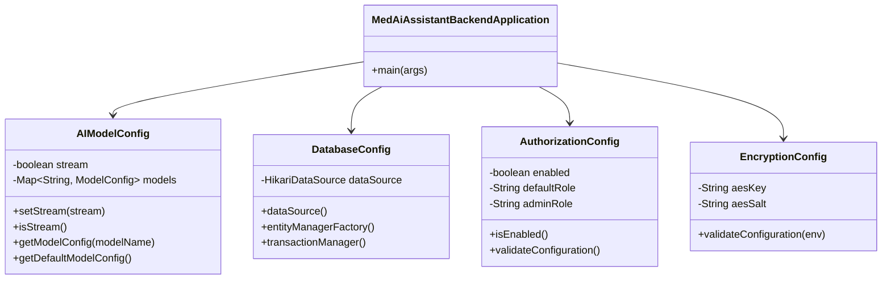
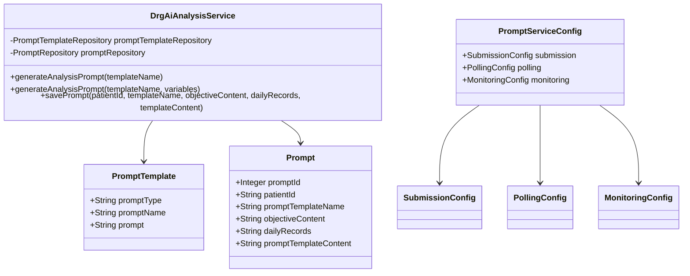
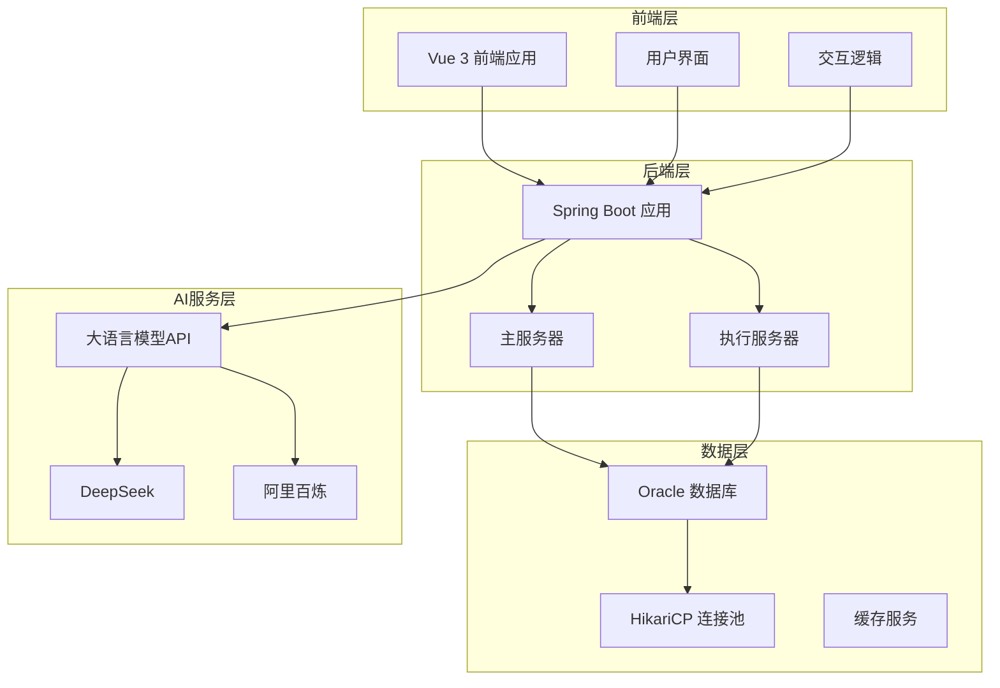
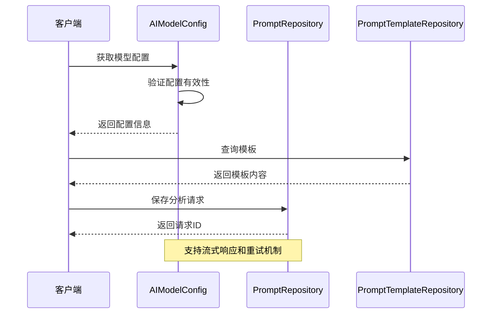
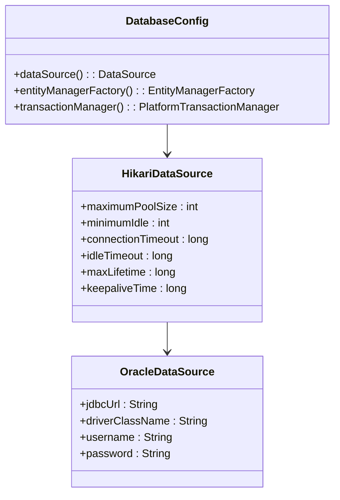
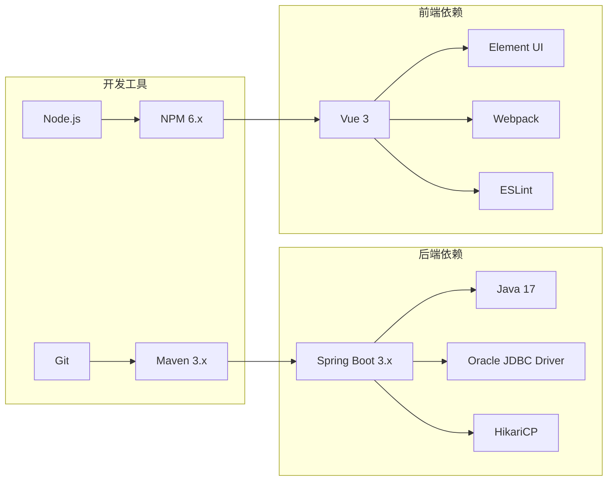
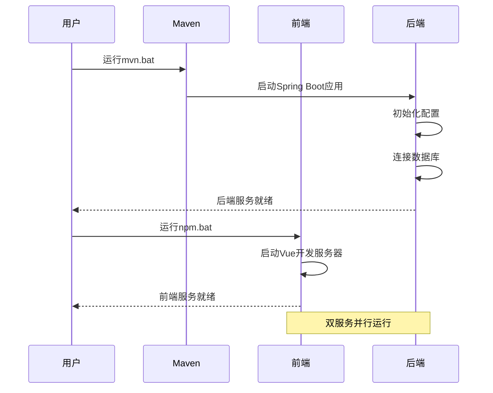

# 更新摘要

<cite>
**本文档引用的文件**
- [.gitignore](file://.gitignore)
- [mvn.bat](file://mvn.bat)
- [npm.bat](file://npm.bat)
- [国家算力网络与基层医疗AI协同政策全景解析（2024-2026）.md](file://项目相关/宣发/国家算力网络与基层医疗AI协同政策全景解析（2024-2026）.md)
- [Mermaid 代码修复 Prompt 模板.txt](file://项目相关/Mermaid 代码修复 Prompt 模板.txt)
- [常用.txt](file://项目相关/常用.txt)
- [神级Prompt.txt](file://项目相关/神级Prompt.txt)
- [源代码文档.md](file://项目相关/软件著作权/源代码文档.md)
- [用户操作手册.md](file://项目相关/软件著作权/用户操作手册.md)
- [软件著作权申请材料要求.md](file://项目相关/软件著作权/软件著作权申请材料要求.md)
</cite>

## 目录
1. [项目概述](#项目概述)
2. [项目结构](#项目结构)
3. [核心组件](#核心组件)
4. [架构概览](#架构概览)
5. [详细组件分析](#详细组件分析)
6. [依赖关系分析](#依赖关系分析)
7. [性能考虑](#性能考虑)
8. [故障排除指南](#故障排除指南)
9. [结论](#结论)
10. [附录](#附录)

## 项目概述

MedAiAssistant V1.0 是一款集患者管理、AI辅助诊断、DRG分析、MCC/CC并发症筛查等功能于一体的医疗信息化平台。该项目采用前后端分离架构，前端基于Vue 3框架，后端采用Spring Boot 3框架，支持与医院HIS、PACS、LIS等医疗信息系统进行数据对接。

### 主要特性
- AI辅助诊断分析：基于大语言模型技术，提供智能化诊断建议
- DRG智能分组：支持疾病诊断相关分组的自动匹配和盈亏分析
- MCC/CC筛查：智能识别严重并发症或合并症，提高诊断完整性
- 患者全景管理：整合多维度医疗数据，提供完整的患者视图
- Prompt模板管理：支持多种诊疗场景的AI分析模板
- 分布式执行架构：采用主服务器+执行服务器的双节点分离架构

## 项目结构

**图表来源**
- [.gitignore:1-43](file://.gitignore#L1-L43)
- [mvn.bat:1-5](file://mvn.bat#L1-L5)
- [npm.bat:1-3](file://npm.bat#L1-L3)

**章节来源**
- [.gitignore:1-43](file://.gitignore#L1-L43)
- [mvn.bat:1-5](file://mvn.bat#L1-L5)
- [npm.bat:1-3](file://npm.bat#L1-L3)

## 核心组件

### 后端配置组件

系统采用Spring Boot 3.x + Java 17的技术栈，包含以下核心配置组件：

**图表来源**
- [源代码文档.md:21-47](file://项目相关/软件著作权/源代码文档.md#L21-L47)
- [源代码文档.md:50-217](file://项目相关/软件著作权/源代码文档.md#L50-L217)
- [源代码文档.md:220-363](file://项目相关/软件著作权/源代码文档.md#L220-L363)
- [源代码文档.md:366-512](file://项目相关/软件著作权/源代码文档.md#L366-L512)
- [源代码文档.md:515-572](file://项目相关/软件著作权/源代码文档.md#L515-L572)

### AI分析服务组件

**图表来源**
- [源代码文档.md:700-800](file://项目相关/软件著作权/源代码文档.md#L700-L800)
- [源代码文档.md:575-697](file://项目相关/软件著作权/源代码文档.md#L575-L697)

**章节来源**
- [源代码文档.md:50-217](file://项目相关/软件著作权/源代码文档.md#L50-L217)
- [源代码文档.md:220-363](file://项目相关/软件著作权/源代码文档.md#L220-L363)
- [源代码文档.md:366-512](file://项目相关/软件著作权/源代码文档.md#L366-L512)
- [源代码文档.md:515-572](file://项目相关/软件著作权/源代码文档.md#L515-L572)
- [源代码文档.md:700-800](file://项目相关/软件著作权/源代码文档.md#L700-L800)

## 架构概览

系统采用分布式执行服务器架构，实现前后端分离和任务处理的解耦：

**图表来源**
- [用户操作手册.md:94-98](file://项目相关/软件著作权/用户操作手册.md#L94-L98)
- [源代码文档.md:270-283](file://项目相关/软件著作权/源代码文档.md#L270-L283)

## 详细组件分析

### AI模型配置管理

AI模型配置系统支持多种大语言模型的灵活配置和管理：

**图表来源**
- [源代码文档.md:64-217](file://项目相关/软件著作权/源代码文档.md#L64-L217)
- [源代码文档.md:714-800](file://项目相关/软件著作权/源代码文档.md#L714-L800)

### DRG分析流程

DRG分析采用双向匹配策略，确保诊断分组的准确性：

**图表来源**
- [用户操作手册.md:582-632](file://项目相关/软件著作权/用户操作手册.md#L582-L632)
- [用户操作手册.md:673-740](file://项目相关/软件著作权/用户操作手册.md#L673-L740)

**章节来源**
- [源代码文档.md:700-800](file://项目相关/软件著作权/源代码文档.md#L700-L800)
- [用户操作手册.md:589-632](file://项目相关/软件著作权/用户操作手册.md#L589-L632)
- [用户操作手册.md:673-740](file://项目相关/软件著作权/用户操作手册.md#L673-L740)

### 数据库连接池配置

系统采用HikariCP连接池，优化数据库连接性能：

**图表来源**
- [源代码文档.md:270-328](file://项目相关/软件著作权/源代码文档.md#L270-L328)
- [源代码文档.md:284-320](file://项目相关/软件著作权/源代码文档.md#L284-L320)

**章节来源**
- [源代码文档.md:220-363](file://项目相关/软件著作权/源代码文档.md#L220-L363)

## 依赖关系分析

### 开发环境依赖

项目采用现代化的开发工具链，支持快速开发和部署：

**图表来源**
- [用户操作手册.md:194-202](file://项目相关/软件著作权/用户操作手册.md#L194-L202)
- [常用.txt:66-76](file://项目相关/常用.txt#L66-L76)

**章节来源**
- [用户操作手册.md:194-202](file://项目相关/软件著作权/用户操作手册.md#L194-L202)
- [常用.txt:66-76](file://项目相关/常用.txt#L66-L76)

### 系统启动流程

**图表来源**
- [mvn.bat:1-5](file://mvn.bat#L1-L5)
- [npm.bat:1-3](file://npm.bat#L1-L3)

**章节来源**
- [mvn.bat:1-5](file://mvn.bat#L1-L5)
- [npm.bat:1-3](file://npm.bat#L1-L3)

## 性能考虑

### 数据库性能优化

系统采用多种策略优化数据库性能：

- **连接池优化**：HikariCP连接池配置最大连接数、最小空闲连接、连接超时等参数
- **批量操作**：Hibernate配置批量大小，支持批量插入和更新
- **查询优化**：启用二级缓存，优化查询性能
- **时区配置**：设置Asia/Shanghai时区，确保时间数据一致性

### AI服务性能

- **流式响应**：支持AI模型的流式响应，提升用户体验
- **重试机制**：配置最大重试次数和重试延迟，提高服务稳定性
- **超时配置**：合理设置连接超时和读取超时，平衡性能和可靠性

## 故障排除指南

### 常见启动问题

**后端启动失败**
- 检查数据库连接配置
- 验证Oracle数据库服务状态
- 确认JDBC驱动版本兼容性

**前端启动失败**
- 检查Node.js版本要求
- 验证NPM依赖安装
- 确认端口占用情况

### AI服务问题

**模型连接失败**
- 检查AI服务API密钥配置
- 验证网络连通性
- 查看重试日志和超时设置

**分析结果异常**
- 确认Prompt模板配置
- 检查患者数据完整性
- 验证MCC/CC字典更新

**章节来源**
- [用户操作手册.md:78-83](file://项目相关/软件著作权/用户操作手册.md#L78-L83)
- [源代码文档.md:64-217](file://项目相关/软件著作权/源代码文档.md#L64-L217)

## 结论

MedAiAssistant V1.0是一个功能完整、架构合理的医疗AI辅助诊疗系统。项目采用现代化的技术栈和最佳实践，具备良好的扩展性和维护性。

### 主要优势
- **技术架构先进**：采用Spring Boot 3.x + Vue 3的现代化技术栈
- **功能模块完整**：涵盖AI辅助诊断、DRG分析、MCC/CC筛查等核心功能
- **数据安全可靠**：支持数据加密存储、访问权限控制、操作日志审计
- **部署灵活**：支持分布式部署，满足不同规模医疗机构需求

### 发展建议
- 持续优化AI模型集成，提升诊断准确性
- 扩展更多医疗场景的AI分析模板
- 加强与其他医疗信息系统的集成能力
- 完善监控和运维体系，提升系统稳定性

## 附录

### 政策背景支持

项目积极响应国家"东数西算"工程和基层医疗AI建设政策，为医疗AI技术的规模化应用提供支撑：

- **算力基础设施**：支持国家一体化算力网的资源调度
- **数据安全保障**：符合医疗数据安全和隐私保护要求
- **技术标准对接**：与国家医疗信息化标准保持一致

**章节来源**
- [国家算力网络与基层医疗AI协同政策全景解析（2024-2026）.md:1-107](file://项目相关/宣发/国家算力网络与基层医疗AI协同政策全景解析（2024-2026）.md#L1-L107)