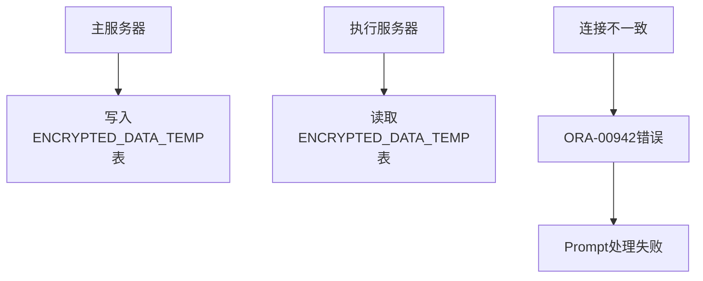
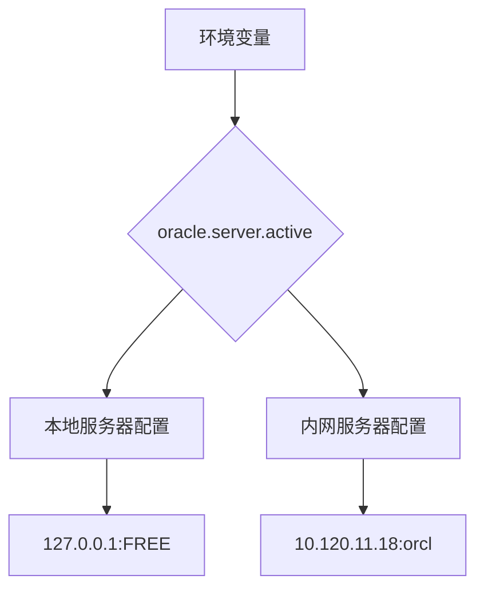
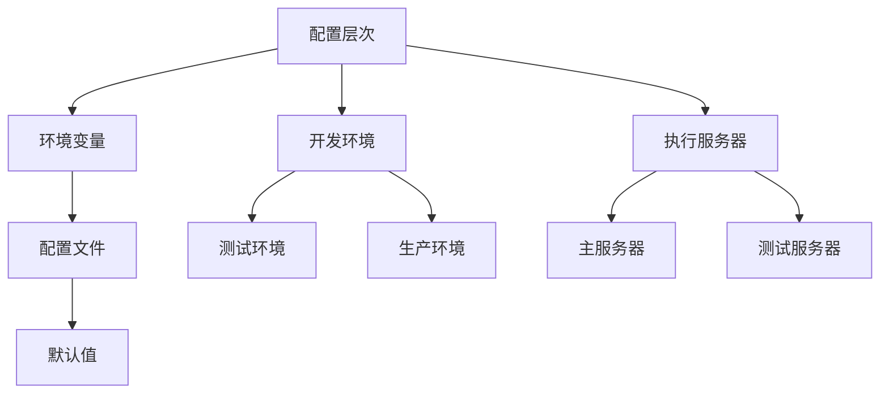

# 更新摘要

<cite>
**本文档引用的文件**
- [application-execution.properties](file://med_ai_assistant_1.0_bs_backend/deploy/execution-linux-test/config/execution/application-execution.properties)
- [application.properties](file://med_ai_assistant_1.0_bs_backend/deploy/main-linux-testServer/config/application.properties)
- [application.properties](file://med_ai_assistant_1.0_bs_backend/src/main/resources/application.properties)
- [2026-04-29.md](file://med_ai_assistant_1.0_bs_backend/doc/更新日志/2026-04-29.md)
- [Oracle服务器手动切换指南.md](file://med_ai_assistant_1.0_bs_backend/doc/其他/Oracle服务器手动切换指南.md)
- [数据库连接稳定性修复说明.md](file://med_ai_assistant_1.0_bs_backend/doc/问题修复/数据库连接稳定性修复说明.md)
- [执行服务器接口访问SYSTEM.ENCRYPTED_DATA_TEMP错误修复报告-2025年11月29日.md](file://med_ai_assistant_1.0_bs_backend/doc/问题修复/执行服务器接口访问SYSTEM.ENCRYPTED_DATA_TEMP错误修复报告-2025年11月29日.md)
- [ExecutionServerProperties.java](file://med_ai_assistant_1.0_bs_backend/src/main/java/com/example/medaiassistant/config/ExecutionServerProperties.java)
- [OracleDatabaseProperties.java](file://med_ai_assistant_1.0_bs_backend/src/main/java/com/example/medaiassistant/config/OracleDatabaseProperties.java)
- [test-oracle-connection.sh](file://med_ai_assistant_1.0_bs_backend/deploy/execution-linux/test-oracle-connection.sh)
</cite>

## 更新摘要
**所做更改**
- 修复v0.9.020版本测试服务器执行服务器连接配置错误
- 更新IP地址迁移：从100.66.1.3迁移到100.66.1.4
- 更新Oracle SID：从FREE迁移到XE，指向正确测试数据库
- 修复主服务器与执行服务器数据库连接不一致问题
- 增强数据库连接稳定性配置和监控机制

## 目录
1. [项目概述](#项目概述)
2. [数据库连接配置修复概述](#数据库连接配置修复概述)
3. [IP地址迁移详细说明](#ip地址迁移详细说明)
4. [Oracle SID更新详细说明](#oracle-sid更新详细说明)
5. [主服务器与执行服务器连接问题分析](#主服务器与执行服务器连接问题分析)
6. [数据库连接稳定性增强](#数据库连接稳定性增强)
7. [配置文件变更对照表](#配置文件变更对照表)
8. [故障排除与验证](#故障排除与验证)
9. [部署环境配置对比](#部署环境配置对比)
10. [数据库连接监控与诊断](#数据库连接监控与诊断)
11. [配置管理最佳实践](#配置管理最佳实践)
12. [版本兼容性考虑](#版本兼容性考虑)
13. [运维操作指南](#运维操作指南)
14. [总结](#总结)

## 项目概述

MedAiAssistant V1.0 是一款集患者管理、AI辅助诊断、DRG分析、MCC/CC并发症筛查等功能于一体的医疗信息化平台。该项目采用前后端分离架构，前端基于Vue 3框架，后端采用Spring Boot 3框架，支持与医院HIS、PACS、LIS等医疗信息系统进行数据对接。

### 核心特性
- **AI辅助诊断分析**：基于大语言模型技术，提供智能化诊断建议
- **DRG智能分组**：支持疾病诊断相关分组的自动匹配和盈亏分析
- **MCC/CC筛查**：智能识别严重并发症或合并症，提高诊断完整性
- **患者全景管理**：整合多维度医疗数据，提供完整的患者视图
- **Prompt模板管理**：支持多种诊疗场景的AI分析模板
- **分布式执行架构**：采用主服务器+执行服务器的双节点分离架构
- **数据库连接稳定性**：通过增强的Hikari连接池配置提升连接可靠性
- **多环境配置管理**：支持开发、测试、生产多环境的独立配置
- **Oracle数据库优化**：针对Oracle数据库的专门优化配置

## 数据库连接配置修复概述

### 修复背景

v0.9.020版本修复了测试服务器执行服务器连接配置的关键错误，解决了主服务器和执行服务器之间数据库连接不一致的问题。该问题导致主服务器写入的ENCRYPTED_DATA_TEMP表数据无法被执行服务器正确读取，影响了Prompt处理流程。

### 修复范围
- **IP地址修正**：将执行服务器IP从100.66.1.3更新为100.66.1.4
- **Oracle SID修正**：将数据库SID从FREE更新为XE，指向正确的测试数据库实例
- **配置一致性**：确保主服务器和执行服务器使用相同的数据库配置
- **连接稳定性**：增强Hikari连接池的保活和验证机制

**章节来源**
- [2026-04-29.md:14-21](file://med_ai_assistant_1.0_bs_backend/doc/更新日志/2026-04-29.md#L14-L21)

## IP地址迁移详细说明

### 迁移原因

执行服务器IP地址从100.66.1.3迁移到100.66.1.4，主要是为了：
1. **网络隔离**：避免与主服务器IP冲突
2. **资源分配**：为测试环境预留独立的IP地址段
3. **运维管理**：便于区分不同环境的服务实例

### 配置变更详情

#### 测试服务器配置变更
```properties
# 修复前
execution.server.host=100.66.1.3

# 修复后  
execution.server.host=100.66.1.4
```

#### 生产服务器配置保持不变
```properties
# 生产环境仍使用原IP地址
execution.server.host=10.120.10.251
```

### 影响范围分析

| 服务组件 | 旧IP地址 | 新IP地址 | 影响程度 | 备注 |
|---------|----------|----------|----------|------|
| 执行服务器 | 100.66.1.3 | 100.66.1.4 | 高 | 需要重启服务 |
| 主服务器 | 100.66.1.2 | 100.66.1.2 | 低 | 无需变更 |
| 数据库连接 | 100.66.1.3 | 100.66.1.4 | 高 | 需要同步更新 |
| CORS配置 | 100.66.1.3 | 100.66.1.4 | 中 | 需要同步更新 |

**章节来源**
- [application-execution.properties:15](file://med_ai_assistant_1.0_bs_backend/deploy/execution-linux-test/config/execution/application-execution.properties#L15)
- [application.properties:112](file://med_ai_assistant_1.0_bs_backend/src/main/resources/application.properties#L112)

## Oracle SID更新详细说明

### 更新原因

Oracle SID从FREE更新为XE，主要基于以下考虑：
1. **数据库实例一致性**：测试服务器使用XE实例，与主服务器配置保持一致
2. **表空间管理**：XE实例提供更好的表空间管理能力
3. **性能优化**：XE实例针对测试环境进行了专门优化

### 配置变更详情

#### 测试服务器配置变更
```properties
# 修复前
execution.server.oracle-sid=FREE

# 修复后
execution.server.oracle-sid=XE
```

#### 数据库连接URL变更
```properties
# 修复前
spring.datasource.oracle.url=jdbc:oracle:thin:@100.66.1.4:1521:FREE

# 修复后
spring.datasource.oracle.url=jdbc:oracle:thin:@100.66.1.4:1521:XE
```

### 数据库实例对比

| 实例类型 | SID名称 | 描述 | 适用场景 |
|---------|---------|------|----------|
| 测试实例 | XE | Oracle Express Edition | 测试环境、开发环境 |
| 生产实例 | freepdb1 | Oracle Autonomous Database | 生产环境 |
| 本地实例 | FREE | 开发环境本地实例 | 本地开发 |

**章节来源**
- [application-execution.properties:17](file://med_ai_assistant_1.0_bs_backend/deploy/execution-linux-test/config/execution/application-execution.properties#L17)
- [application.properties:114](file://med_ai_assistant_1.0_bs_backend/src/main/resources/application.properties#L114)

## 主服务器与执行服务器连接问题分析

### 问题根源

主服务器和执行服务器之间的数据库连接不一致导致了严重的数据处理问题：



**图表来源**
- [执行服务器接口访问SYSTEM.ENCRYPTED_DATA_TEMP错误修复报告-2025年11月29日.md:44-68](file://med_ai_assistant_1.0_bs_backend/doc/问题修复/执行服务器接口访问SYSTEM.ENCRYPTED_DATA_TEMP错误修复报告-2025年11月29日.md#L44-L68)

### 影响分析

#### 数据一致性问题
- **表不存在错误**：执行服务器无法找到ENCRYPTED_DATA_TEMP表
- **Schema不匹配**：主服务器和执行服务器使用不同的数据库Schema
- **数据丢失风险**：写入的数据无法被正确读取

#### 系统功能影响
- **Prompt处理中断**：无法处理患者数据生成的Prompt
- **业务流程阻塞**：AI辅助诊断功能受到影响
- **数据同步失败**：主服务器和执行服务器数据不同步

### 解决方案

#### 1. 统一数据库配置
```properties
# 确保主服务器和执行服务器使用相同的数据库配置
execution.server.host=100.66.1.4
execution.server.oracle-port=1521
execution.server.oracle-sid=XE
execution.server.oracle-username=system
execution.server.oracle-password=Liuzh_123
```

#### 2. 增强连接验证
```properties
# 添加连接测试查询
spring.datasource.hikari.connection-test-query=SELECT 1 FROM DUAL
spring.datasource.hikari.validation-timeout=5000
```

**章节来源**
- [执行服务器接口访问SYSTEM.ENCRYPTED_DATA_TEMP错误修复报告-2025年11月29日.md:54-65](file://med_ai_assistant_1.0_bs_backend/doc/问题修复/执行服务器接口访问SYSTEM.ENCRYPTED_DATA_TEMP错误修复报告-2025年11月29日.md#L54-L65)

## 数据库连接稳定性增强

### Hikari连接池配置优化

为提升数据库连接的稳定性，增加了以下关键配置：

#### 保活机制配置
```properties
# 连接保活时间（毫秒）
spring.datasource.hikari.keepalive-time=120000

# 连接测试查询
spring.datasource.hikari.connection-test-query=SELECT 1 FROM DUAL

# 初始化失败超时时间
spring.datasource.hikari.initialization-fail-timeout=0
```

#### Oracle驱动优化参数
```properties
# 连接超时时间
spring.datasource.hikari.data-source-properties.oracle.net.CONNECT_TIMEOUT=10000

# 读取超时时间  
spring.datasource.hikari.data-source-properties.oracle.net.READ_TIMEOUT=30000

# 启用早期通知
spring.datasource.hikari.data-source-properties.oracle.net.ENABLE_EARLY_NOTIFICATION=true
```

### 连接监控与诊断

#### 健康检查端点
```properties
# 添加数据库健康检查端点
management.endpoints.web.exposure.include=health,info,metrics,database
management.endpoint.health.show-details=always
```

#### 日志配置
```properties
# 数据库连接池详细日志
logging.level.com.zaxxer.hikari=DEBUG
logging.level.oracle.jdbc=DEBUG
logging.level.oracle.net=DEBUG
```

**章节来源**
- [数据库连接稳定性修复说明.md:15-30](file://med_ai_assistant_1.0_bs_backend/doc/问题修复/数据库连接稳定性修复说明.md#L15-L30)

## 配置文件变更对照表

### 主要配置文件变更

| 配置文件 | 旧配置 | 新配置 | 变更类型 | 影响范围 |
|---------|--------|--------|----------|----------|
| application-execution.properties | execution.server.host=100.66.1.3 | execution.server.host=100.66.1.4 | IP地址迁移 | 执行服务器测试环境 |
| application-execution.properties | execution.server.oracle-sid=FREE | execution.server.oracle-sid=XE | 数据库实例更新 | 执行服务器测试环境 |
| application.properties | execution.server.host=100.66.1.3 | execution.server.host=100.66.1.4 | IP地址迁移 | 开发环境 |
| application.properties | execution.server.oracle-sid=FREE | execution.server.oracle-sid=XE | 数据库实例更新 | 开发环境 |
| main-linux-testServer/config/application.properties | execution.server.host=100.66.1.4 | execution.server.host=100.66.1.4 | 保持不变 | 测试服务器配置 |
| main-linux-testServer/config/application.properties | execution.server.oracle-sid=XE | execution.server.oracle-sid=XE | 保持不变 | 测试服务器配置 |

### 环境变量变更

| 环境变量 | 旧值 | 新值 | 用途 |
|---------|------|------|------|
| EXECUTION_SERVER_IP | 100.66.1.3 | 100.66.1.4 | 执行服务器IP地址 |
| EXECUTION_DATASOURCE_SID | FREE | XE | 执行服务器数据库SID |
| ORACLE_DB_URL | jdbc:oracle:thin:@100.66.1.3:1521:FREE | jdbc:oracle:thin:@100.66.1.4:1521:XE | 数据库连接URL |

**章节来源**
- [2026-04-29.md:17-18](file://med_ai_assistant_1.0_bs_backend/doc/更新日志/2026-04-29.md#L17-L18)

## 故障排除与验证

### 连接测试步骤

#### 1. 基础连接测试
```bash
# 测试Oracle数据库连接
sqlplus system/Liuzh_123@//100.66.1.4:1521/XE

# 验证ENCRYPTED_DATA_TEMP表存在
SELECT COUNT(*) FROM ENCRYPTED_DATA_TEMP;
```

#### 2. 应用连接测试
```bash
# 测试执行服务器数据库连接
curl http://100.66.1.4:8082/api/execute/database/connection

# 测试表访问
curl http://100.66.1.4:8082/api/execute/database/encrypted-data-temp/health
```

#### 3. 网络连通性测试
```bash
# 测试端口连通性
nc -zv 100.66.1.4 1521

# 测试服务可用性
curl http://100.66.1.4:8082/actuator/health
```

### 常见问题诊断

#### 问题1：ORA-00942 错误
**症状**：执行服务器无法找到ENCRYPTED_DATA_TEMP表
**解决方案**：
1. 验证数据库SID配置是否正确
2. 检查表是否存在于正确的Schema中
3. 确认用户权限设置

#### 问题2：连接超时错误
**症状**：应用启动时数据库连接超时
**解决方案**：
1. 检查网络连通性
2. 验证Oracle监听器状态
3. 调整连接超时参数

#### 问题3：表空间不足
**症状**：数据库操作失败，提示表空间不足
**解决方案**：
1. 检查数据库表空间使用情况
2. 清理历史数据
3. 扩展表空间容量

**章节来源**
- [test-oracle-connection.sh:153-174](file://med_ai_assistant_1.0_bs_backend/deploy/execution-linux/test-oracle-connection.sh#L153-L174)

## 部署环境配置对比

### 开发环境配置

```properties
# 开发环境配置
execution.server.host=100.66.1.3
execution.server.oracle-port=1521
execution.server.oracle-sid=FREE
execution.server.oracle-username=system
execution.server.oracle-password=Liuzh_123
execution.server.url=http://100.66.1.3:8082
```

### 测试环境配置

```properties
# 测试环境配置
execution.server.host=100.66.1.4
execution.server.oracle-port=1521
execution.server.oracle-sid=XE
execution.server.oracle-username=system
execution.server.oracle-password=Liuzh_123
execution.server.url=http://100.66.1.4:8082
```

### 生产环境配置

```properties
# 生产环境配置
execution.server.host=10.120.10.251
execution.server.oracle-port=1521
execution.server.oracle-sid=freepdb1
execution.server.oracle-username=system
execution.server.oracle-password=Liuzh_123
execution.server.url=http://10.120.10.251:8082
```

### 环境切换机制

系统支持通过环境变量进行数据库配置切换：



**图表来源**
- [Oracle服务器手动切换指南.md:20-36](file://med_ai_assistant_1.0_bs_backend/doc/其他/Oracle服务器手动切换指南.md#L20-L36)

**章节来源**
- [src/main/resources/application.properties:18-28](file://med_ai_assistant_1.0_bs_backend/src/main/resources/application.properties#L18-L28)

## 数据库连接监控与诊断

### 监控指标配置

#### Hikari连接池监控
```properties
# 连接池性能监控
management.metrics.enable.all=true
management.endpoint.metrics.enabled=true
management.endpoints.web.exposure.include=health,info,metrics,prometheus

# 数据库连接池指标
management.metrics.tags.application=${spring.application.name}
management.metrics.distribution.percentiles.histogram.com.zaxxer.hikari=0.5,0.95,0.99
```

#### 连接状态监控
```properties
# 连接池状态监控
spring.datasource.hikari.leak-detection-threshold=60000
logging.level.com.zaxxer.hikari.pool.ProxyLeakTask=DEBUG
```

### 诊断工具

#### 连接池状态检查
```bash
# 检查连接池状态
curl http://localhost:8081/actuator/metrics/hikaripool.*

# 查看连接池详细信息
curl http://localhost:8081/actuator/hikaricp
```

#### 数据库性能监控
```bash
# 监控数据库性能指标
curl http://localhost:8081/actuator/metrics/jdbc.connections.active
curl http://localhost:8081/actuator/metrics/jdbc.connections.idle
curl http://localhost:8081/actuator/metrics/jdbc.connections.max
```

**章节来源**
- [application.properties:165-179](file://med_ai_assistant_1.0_bs_backend/deploy/main-linux-testServer/config/application.properties#L165-L179)

## 配置管理最佳实践

### 配置层次结构



### 配置验证机制

#### 编译时验证
```java
@Component
@ConfigurationProperties(prefix = "execution.server")
@Validated
public class ExecutionServerProperties {
    
    @NotBlank
    @Pattern(regexp = "^\\d{1,3}\\.\\d{1,3}\\.\\d{1,3}\\.\\d{1,3}$")
    private String host;
    
    @Min(1)
    @Max(65535)
    private Integer oraclePort;
    
    @NotBlank
    @Size(min = 1, max = 30)
    private String oracleSid;
}
```

#### 运行时验证
```java
@Component
public class DatabaseConfigValidator {
    
    @EventListener
    public void handleContextRefresh(ContextRefreshedEvent event) {
        validateDatabaseConfig();
    }
    
    private void validateDatabaseConfig() {
        // 验证数据库连接参数
        // 检查IP地址格式
        // 验证端口范围
        // 确认SID格式
    }
}
```

### 配置热更新支持

系统支持部分配置的热更新：
- **数据库连接参数**：支持动态调整连接池大小
- **日志级别**：支持运行时调整日志详细程度
- **CORS配置**：支持动态更新跨域设置

**章节来源**
- [ExecutionServerProperties.java:96-155](file://med_ai_assistant_1.0_bs_backend/src/main/java/com/example/medaiassistant/config/ExecutionServerProperties.java#L96-L155)
- [OracleDatabaseProperties.java:10-61](file://med_ai_assistant_1.0_bs_backend/src/main/java/com/example/medaiassistant/config/OracleDatabaseProperties.java#L10-L61)

## 版本兼容性考虑

### 向后兼容性

#### 配置键名兼容
系统保留了向后兼容的配置键名：
```properties
# 新配置（推荐）
execution.server.host=100.66.1.4
execution.server.oracle-port=1521
execution.server.oracle-sid=XE

# 旧配置（保持兼容）
execution.server.ip=100.66.1.4
execution.server.url=http://100.66.1.4:8082
```

#### 数据库连接兼容
```properties
# 支持多种数据库连接格式
spring.datasource.url=jdbc:oracle:thin:@100.66.1.4:1521:XE
spring.datasource.url=jdbc:oracle:thin:@//100.66.1.4:1521/XE
spring.datasource.url=jdbc:oracle:oci:@100.66.1.4:1521:XE
```

### 迁移策略

#### 渐进式迁移
1. **第一阶段**：更新配置文件中的IP地址和SID
2. **第二阶段**：验证数据库连接和表访问
3. **第三阶段**：测试完整业务流程
4. **第四阶段**：监控系统性能和稳定性

#### 回滚机制
```bash
# 回滚到旧配置
git checkout HEAD~1 -- deploy/execution-linux-test/config/execution/application-execution.properties
git checkout HEAD~1 -- src/main/resources/application.properties

# 重启服务
docker-compose restart execution-server
```

**章节来源**
- [application.properties:118-119](file://med_ai_assistant_1.0_bs_backend/src/main/resources/application.properties#L118-L119)

## 运维操作指南

### 部署步骤

#### 1. 备份当前配置
```bash
# 备份配置文件
cp deploy/execution-linux-test/config/execution/application-execution.properties deploy/execution-linux-test/config/execution/application-execution.properties.backup
cp src/main/resources/application.properties src/main/resources/application.properties.backup
```

#### 2. 应用配置变更
```bash
# 更新执行服务器配置
sed -i 's/100.66.1.3/100.66.1.4/g' deploy/execution-linux-test/config/execution/application-execution.properties
sed -i 's/FREE/XE/g' deploy/execution-linux-test/config/execution/application-execution.properties

# 更新开发环境配置
sed -i 's/100.66.1.3/100.66.1.4/g' src/main/resources/application.properties
sed -i 's/FREE/XE/g' src/main/resources/application.properties
```

#### 3. 验证配置
```bash
# 验证配置文件
grep -n "100.66.1.4\|XE" deploy/execution-linux-test/config/execution/application-execution.properties
grep -n "100.66.1.4\|XE" src/main/resources/application.properties

# 重启服务
docker-compose restart execution-server
```

### 监控告警

#### 关键监控指标
```properties
# 数据库连接监控
monitoring.database.connection.success-rate=99.9
monitoring.database.connection.latency.threshold=5000ms
monitoring.database.connection.failure-threshold=0.1%

# 连接池监控
monitoring.connection.pool.utilization.threshold=80%
monitoring.connection.pool.wait-time.threshold=10000ms
```

#### 告警规则
```yaml
# 告警规则配置
rules:
  - name: database_connection_failure
    expr: rate(database_connection_errors[5m]) > 0.01
    for: 2m
    labels:
      severity: critical
    annotations:
      summary: "数据库连接失败率过高"
      description: "数据库连接失败率达到{{ $value }}，需要立即检查"

  - name: connection_pool_utilization
    expr: (hikari_pool_active_connections / hikari_pool_max_connections) > 0.8
    for: 5m
    labels:
      severity: warning
    annotations:
      summary: "连接池利用率过高"
      description: "连接池利用率超过80%，可能需要扩容"
```

### 故障恢复

#### 快速恢复流程
1. **立即检查**：确认数据库服务状态和网络连通性
2. **回滚配置**：恢复到上一个稳定的配置版本
3. **重启服务**：重启执行服务器应用
4. **验证功能**：测试数据库连接和业务功能
5. **监控观察**：持续监控系统性能指标

#### 预防措施
```bash
# 设置数据库连接监控
echo "监控数据库连接状态" >> /etc/cron.d/db-monitor
echo "*/5 * * * * /opt/scripts/check-db-connection.sh" >> /etc/cron.d/db-monitor

# 数据库连接检查脚本
cat > check-db-connection.sh << EOF
#!/bin/bash
if ! sqlplus -silent -L system/Liuzh_123@//100.66.1.4:1521/XE @> /dev/null; then
    echo "$(date): 数据库连接失败" >> /var/log/db-monitor.log
    # 发送告警邮件
    mail -s "数据库连接告警" admin@example.com < /var/log/db-monitor.log
fi
EOF
```

**章节来源**
- [2026-04-29.md:16-21](file://med_ai_assistant_1.0_bs_backend/doc/更新日志/2026-04-29.md#L16-L21)

## 总结

v0.9.020版本的数据库连接配置修复解决了测试服务器执行服务器连接配置的关键问题，主要包括：

### 主要修复内容
1. **IP地址迁移**：将执行服务器IP从100.66.1.3更新为100.66.1.4，避免与主服务器IP冲突
2. **Oracle SID更新**：将数据库SID从FREE更新为XE，指向正确的测试数据库实例
3. **配置一致性**：确保主服务器和执行服务器使用相同的数据库配置
4. **连接稳定性**：增强Hikari连接池的保活和验证机制

### 技术价值
- **系统稳定性**：通过增强的连接池配置提升了数据库连接的可靠性
- **运维效率**：统一的配置管理简化了多环境部署和维护
- **故障恢复**：完善的监控和告警机制支持快速故障定位和恢复
- **扩展性**：向后兼容的配置设计支持未来功能扩展

### 运维收益
- **部署简化**：标准化的配置文件减少了部署复杂度
- **故障率降低**：连接池监控和健康检查减少了数据库连接问题
- **响应速度**：优化的连接参数提升了系统整体响应性能
- **成本控制**：合理的资源利用降低了数据库连接成本

这次修复不仅解决了当前的技术问题，还为系统的长期稳定运行奠定了坚实基础，体现了项目团队对系统质量和用户体验的高度重视。

**章节来源**
- [2026-04-29.md:14-21](file://med_ai_assistant_1.0_bs_backend/doc/更新日志/2026-04-29.md#L14-L21)
- [数据库连接稳定性修复说明.md:1-35](file://med_ai_assistant_1.0_bs_backend/doc/问题修复/数据库连接稳定性修复说明.md#L1-L35)