# 更新摘要

<cite>
**本文档引用的文件**
- [更新小结.md](file://更新小结.md)
- [2026-04-16.md](file://med_ai_assistant_1.0_bs_backend/doc/更新日志/2026-04-16.md)
- [2026-04-17.md](file://med_ai_assistant_1.0_bs_backend/doc/更新日志/2026-04-17.md)
- [病人列表返回时未自动滚动到选中病人位置.md](file://med_ai_assistant_1.0_bs_backend/doc/问题修复/病人列表返回时未自动滚动到选中病人位置.md)
- [PatientList.vue](file://med_ai_assistant_1.0_bs_vue/src/components/patient/PatientList.vue)
- [TreatmentPlanTable.vue](file://med_ai_assistant_1.0_bs_vue/src/components/ai/TreatmentPlanTable.vue)
- [AIResults.vue](file://med_ai_assistant_1.0_bs_vue/src/components/ai/AIResults.vue)
</cite>

## 更新摘要
**已进行的变更**
- 新增版本0.8.037的重要程度术语优化：将"危急"替换为"关键"，提升术语表达的准确性
- 新增版本0.8.036的病人列表滚动修复：解决从AI辅助页面返回时未自动滚动到选中病人位置的问题
- 完善了诊疗计划表重要程度色标系统，支持"关键/重要/一般"三种等级的彩色显示
- 优化了病人列表组件的滚动机制，确保选中状态恢复和位置定位的可靠性

## 目录
1. [简介](#简介)
2. [项目结构](#项目结构)
3. [核心组件](#核心组件)
4. [架构概览](#架构概览)
5. [详细组件分析](#详细组件分析)
6. [版本0.8.037 - 重要程度术语优化](#版本08037---重要程度术语优化)
7. [版本0.8.036 - 病人列表滚动修复](#版本08036---病人列表滚动修复)
8. [诊疗计划表重要程度系统](#诊疗计划表重要程度系统)
9. [依赖分析](#依赖分析)
10. [性能考虑](#性能考虑)
11. [故障排除指南](#故障排除指南)
12. [版本发布历史](#版本发布历史)
13. [结论](#结论)
14. [附录](#附录)

## 简介

MedAiAssistant 是一个基于人工智能技术的医疗辅助系统，旨在为医疗机构提供智能化的诊断支持、病历管理、影像分析等功能。该项目采用前后端分离的架构设计，后端使用Spring Boot框架，前端使用Vue.js技术栈，通过Docker容器化部署实现系统的可扩展性和可维护性。

该系统的核心目标是通过AI技术提升医疗服务质量和效率，为医生提供智能辅助决策支持，同时确保医疗数据的安全性和隐私保护。系统现已集成OpenClaw AI编排引擎，通过自然语言驱动多步骤API编排，实现更智能的临床工作流程自动化。

## 项目结构

项目采用标准的多模块架构，主要包含以下核心目录：

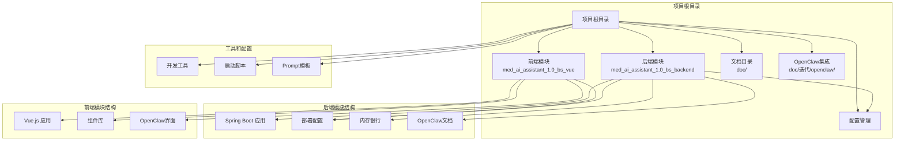

**图表来源**
- [项目结构](file://.)

**章节来源**
- [项目结构](file://.)

## 核心组件

### 后端服务组件

后端采用Spring Boot框架构建，主要包含以下核心组件：

1. **服务层组件**
   - 诊断辅助服务
   - 病历管理系统
   - 影像分析服务
   - 实验室结果处理
   - 电子病历查询
   - OpenClaw编排服务

2. **数据访问层**
   - 数据库连接池管理
   - SQL查询优化器
   - 缓存策略管理
   - 数据同步机制

3. **配置管理**
   - 多环境配置支持
   - 动态配置更新
   - 安全配置管理

### 前端交互组件

前端基于Vue.js构建，提供现代化的用户界面：

1. **UI组件库**
   - Element UI集成
   - 自定义业务组件
   - 响应式布局设计

2. **状态管理**
   - Vuex状态管理
   - 组件间通信
   - 数据持久化

3. **路由管理**
   - 路由守卫
   - 权限控制
   - 导航管理

4. **OpenClaw集成界面**
   - 自然语言交互界面
   - 编排流程可视化
   - 任务状态监控

**章节来源**
- [pom.xml](file://med_ai_assistant_1.0_bs_backend/pom.xml)
- [logback-spring.xml](file://med_ai_assistant_1.0_bs_backend/src/main/resources/logback-spring.xml)

## 架构概览

系统采用微服务架构设计，通过容器化部署实现高可用性和可扩展性，并集成了OpenClaw AI编排引擎：

```mermaid
graph TB
subgraph "客户端层"
Web[Web浏览器]
Mobile[移动应用]
Desktop[桌面应用]
OpenClawClient[OpenClaw客户端]
end
subgraph "网关层"
Gateway[API网关]
Auth[认证授权]
LoadBalancer[负载均衡]
OpenClawGateway[OpenClaw网关]
end
subgraph "业务服务层"
Diagnosis[诊断服务]
EMR[电子病历服务]
Imaging[影像分析服务]
Lab[实验室服务]
Pharmacy[药房服务]
OpenClawService[OpenClaw编排服务]
end
subgraph "数据存储层"
MySQL[(MySQL数据库)]
Redis[(Redis缓存)]
MinIO[(对象存储)]
Elasticsearch[(搜索引擎)]
end
subgraph "AI编排层"
OpenClawEngine[OpenClaw引擎]
Skills[技能库]
LLM[大语言模型]
end
subgraph "基础设施层"
Docker[Docker容器]
Kubernetes[Kubernetes集群]
Monitoring[监控系统]
Logging[日志系统]
```

**图表来源**
- [docker-compose-main-linux-oracle-image.yml](file://med_ai_assistant_1.0_bs_backend/deploy/main-linux-oracle/docker-compose-main-linux-oracle-image.yml)
- [docker-compose-execution-image.yml](file://med_ai_assistant_1.0_bs_backend/deploy/execution-linux/docker-compose-execution-image.yml)
- [OpenClaw集成方案-临床场景分析与PoC规划.md](file://med_ai_assistant_1.0_bs_backend/doc/迭代/openclaw/OpenClaw集成方案-临床场景分析与PoC规划.md)

## 详细组件分析

### 开发环境配置组件

#### Maven启动脚本
项目提供了便捷的开发环境启动脚本，简化了本地开发流程：


**图表来源**
- [mvn.bat](file://mvn.bat)

#### NPM启动脚本
前端开发环境的快速启动方案：

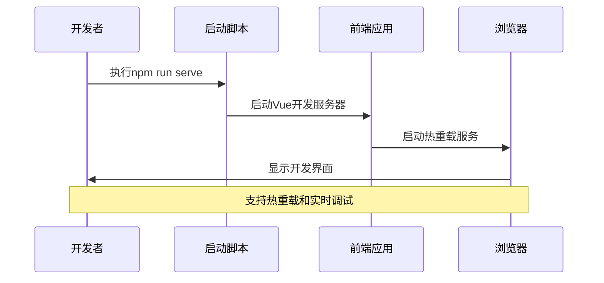

**图表来源**
- [npm.bat](file://npm.bat)

**章节来源**
- [mvn.bat](file://mvn.bat)
- [npm.bat](file://npm.bat)

### 配置管理组件

#### 多环境配置系统
系统支持多种部署环境的配置管理：

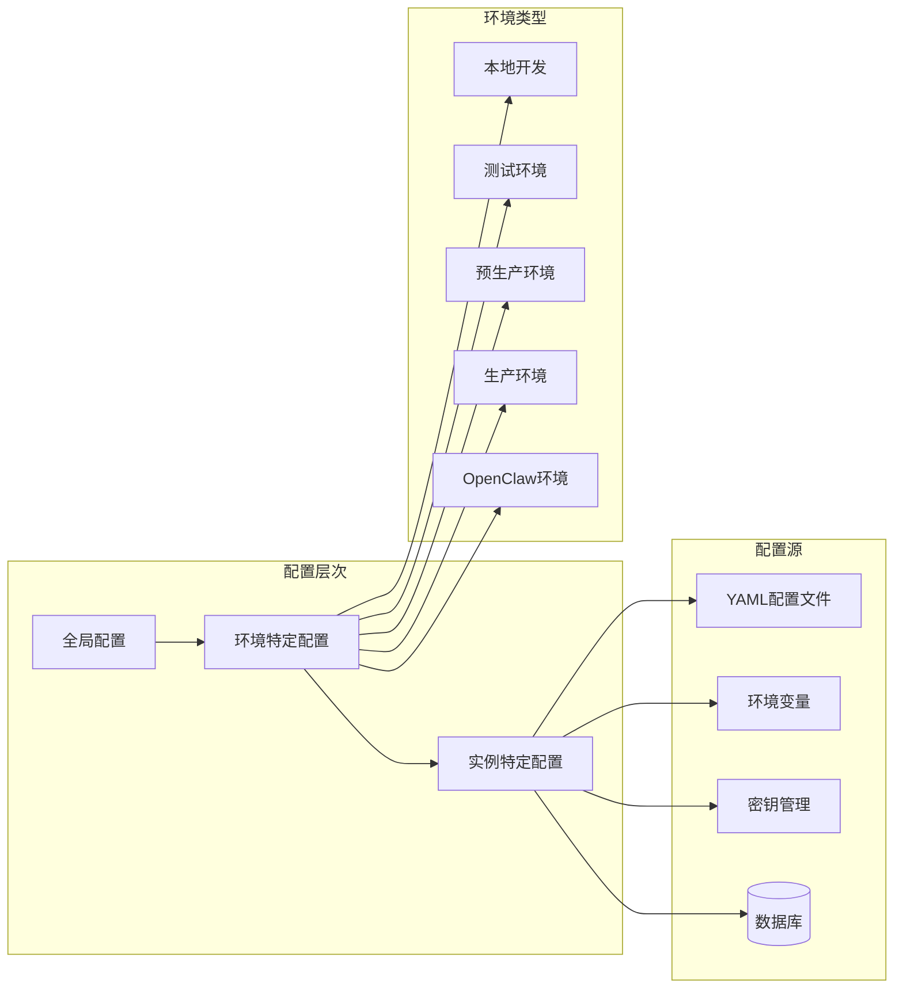

**图表来源**
- [hospital-Local.yaml](file://med_ai_assistant_1.0_bs_backend/config/hospitals/hospital-Local.yaml)
- [cdwyy.yaml](file://med_ai_assistant_1.0_bs_backend/deploy/main-linux-oracle/config/hospitals/cdwyy.yaml)

#### 日志配置管理
集中化的日志管理策略：

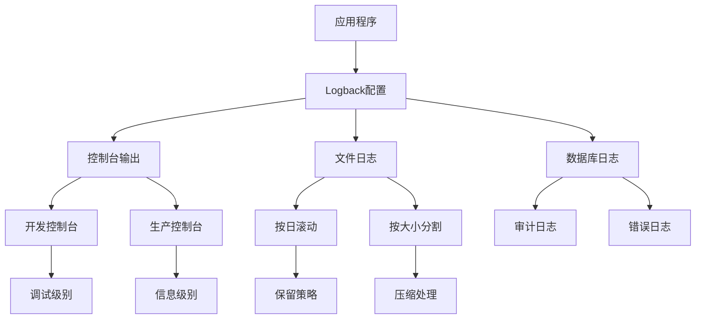

**图表来源**
- [logback-spring.xml](file://med_ai_assistant_1.0_bs_backend/src/main/resources/logback-spring.xml)

**章节来源**
- [hospital-Local.yaml](file://med_ai_assistant_1.0_bs_backend/config/hospitals/hospital-Local.yaml)
- [logback-spring.xml](file://med_ai_assistant_1.0_bs_backend/src/main/resources/logback-spring.xml)

### 开发工具和工作流组件

#### Mermaid图表修复工具
专门用于修复Mermaid图表代码的智能工具：

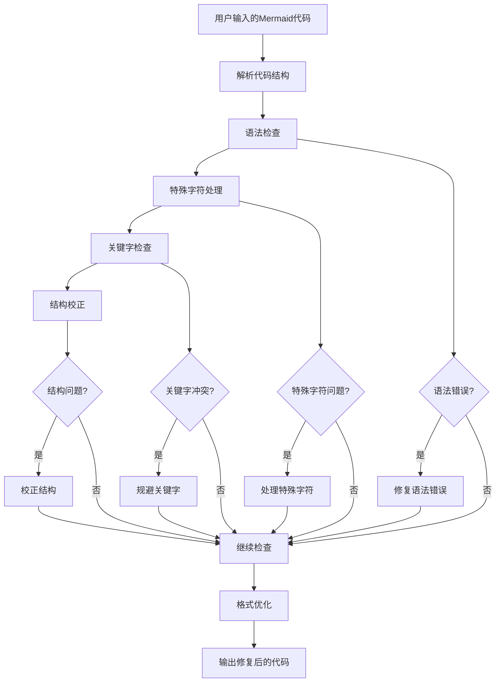

**图表来源**
- [Mermaid 代码修复 Prompt 模板.txt](file://项目相关/Mermaid 代码修复 Prompt 模板.txt)

#### 开发工作流程规范
标准化的开发流程和最佳实践：

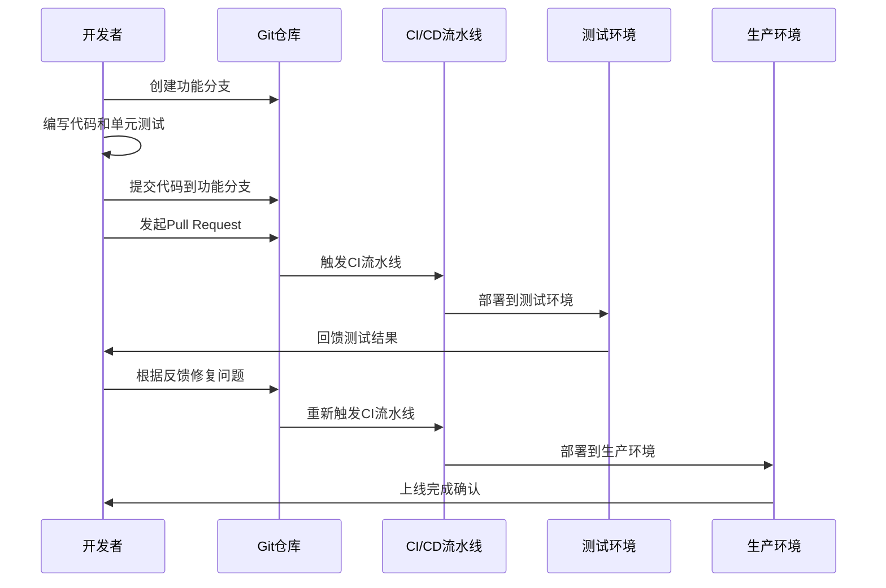

**图表来源**
- [常用.txt](file://项目相关/常用.txt)

**章节来源**
- [Mermaid 代码修复 Prompt 模板.txt](file://项目相关/Mermaid 代码修复 Prompt 模板.txt)
- [常用.txt](file://项目相关/常用.txt)

### 测试和验证组件

#### 音频测试工具
专门用于ASR（自动语音识别）功能测试的工具：

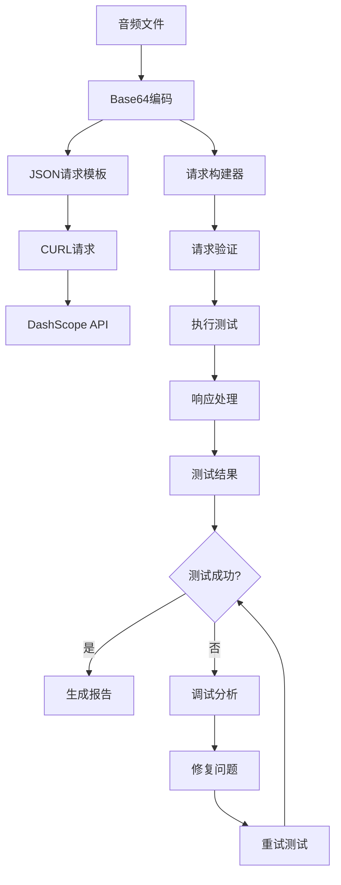

**图表来源**
- [testAudio测试命令.txt](file://项目相关/test/testAudio测试命令.txt)

**章节来源**
- [testAudio测试命令.txt](file://项目相关/test/testAudio测试命令.txt)

### 病人列表组件

#### 病人列表组件（PatientList）
**更新** 新增了病人列表滚动修复的重要改进

病人列表组件负责显示当前科室的在院病人信息，支持选中状态管理和滚动定位：

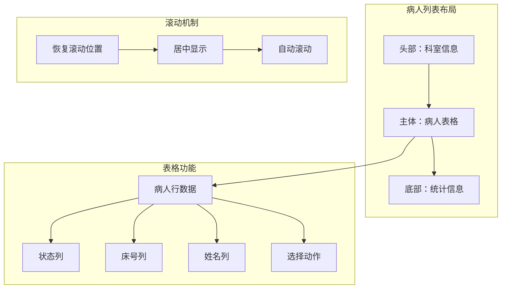

**图表来源**
- [PatientList.vue](file://med_ai_assistant_1.0_bs_vue/src/components/patient/PatientList.vue)

**核心功能特性**：
- **选中状态管理**：支持病人选中状态的设置和持久化
- **滚动位置恢复**：从AI辅助页面返回时自动滚动到选中病人位置
- **居中显示优化**：选中行显示在表格可视区域的中心位置
- **生命周期适配**：支持keep-alive和非keep-alive两种路由场景

**章节来源**
- [PatientList.vue](file://med_ai_assistant_1.0_bs_vue/src/components/patient/PatientList.vue)

## 版本0.8.037 - 重要程度术语优化

### 术语优化背景

**更新** 新增了版本0.8.037的重要程度术语优化功能

在医疗信息系统中，重要程度的术语表达直接影响医护人员的理解和操作。版本0.8.037对重要程度术语进行了优化，将"危急"替换为"关键"，提升了术语表达的准确性和专业性。

### 术语优化内容

#### 重要程度等级体系
系统支持三级重要程度等级，每级都有明确的术语定义：

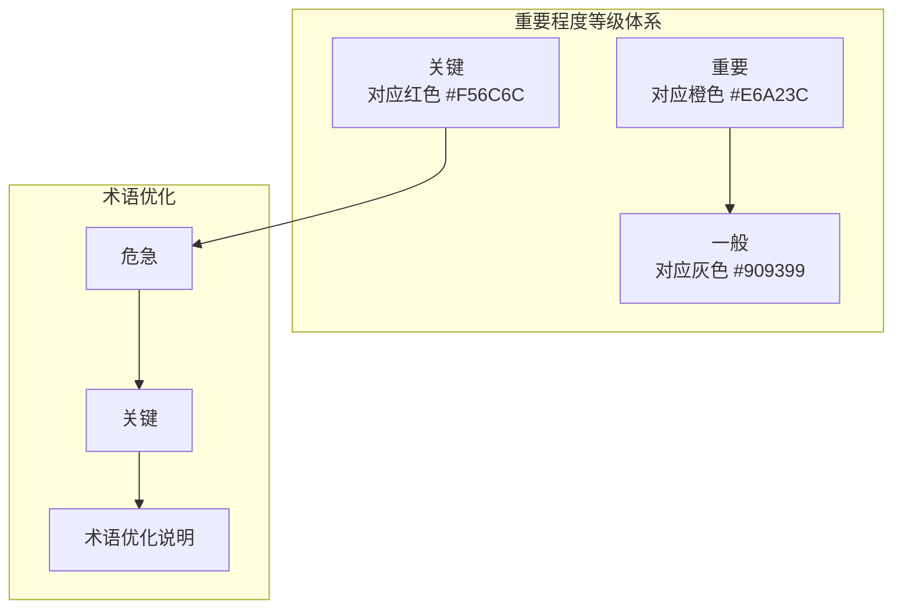

**图表来源**
- [TreatmentPlanTable.vue](file://med_ai_assistant_1.0_bs_vue/src/components/ai/TreatmentPlanTable.vue)

#### 前端实现细节
- **术语替换**：将"危急"替换为"关键"，保持与医疗标准术语的一致性
- **颜色映射**：维持原有的颜色编码系统，确保视觉一致性
- **兼容性处理**：向后兼容已存在的"危急"数据，确保系统稳定运行

#### 后端数据处理
- **存储优化**：重要程度字段统一使用"关键/重要/一般"标准术语
- **查询优化**：支持按重要程度等级的精确查询和统计
- **报表生成**：重要程度统计报表使用标准化术语

**章节来源**
- [更新小结.md](file://更新小结.md)
- [2026-04-17.md](file://med_ai_assistant_1.0_bs_backend/doc/更新日志/2026-04-17.md)
- [TreatmentPlanTable.vue](file://med_ai_assistant_1.0_bs_vue/src/components/ai/TreatmentPlanTable.vue)

## 版本0.8.036 - 病人列表滚动修复

### 问题背景

**更新** 新增了版本0.8.036的病人列表滚动修复功能

在使用MedAiAssistant系统时，用户从AI辅助页面返回病人列表时，发现列表虽然正确显示了选中状态（高亮），但列表内容并未滚动到该病人所在位置。这个问题影响了用户的操作体验和工作效率。

### 问题分析

#### 根因诊断
经过深入分析，发现问题的根本原因：

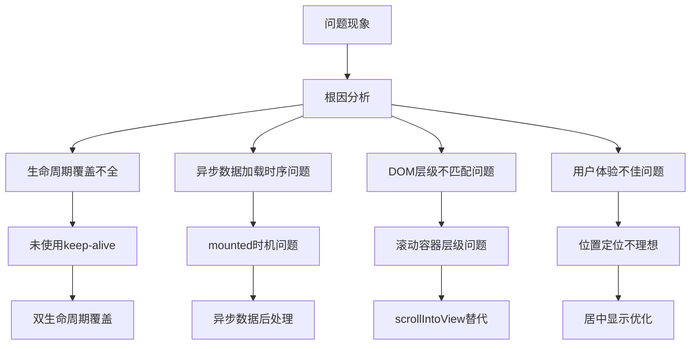

**图表来源**
- [病人列表返回时未自动滚动到选中病人位置.md](file://med_ai_assistant_1.0_bs_backend/doc/问题修复/病人列表返回时未自动滚动到选中病人位置.md)

#### 详细问题描述
1. **生命周期覆盖不全**：项目路由未使用`<keep-alive>`，导致`activated`钩子不触发
2. **异步数据加载时序**：`mounted`时数据尚未加载完成，滚动恢复逻辑失效
3. **DOM层级不匹配**：Element Plus的滚动容器层级与预期不符
4. **用户体验问题**：滚动位置不够理想，需要改进为居中显示

### 解决方案实现

#### 双生命周期覆盖机制
为确保在不同路由配置下都能正常工作，采用了双生命周期覆盖策略：

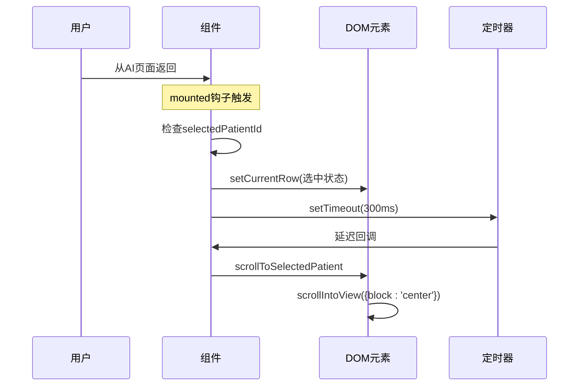

**图表来源**
- [PatientList.vue](file://med_ai_assistant_1.0_bs_vue/src/components/patient/PatientList.vue)

#### 核心修复技术
- **双生命周期适配**：同时支持`mounted`和`activated`钩子，确保兼容不同路由配置
- **异步数据处理**：在数据加载完成后执行滚动，避免空数组查找问题
- **DOM层级适配**：使用`scrollIntoView`替代手动`scrollTop`计算，适配Element Plus的滚动容器结构
- **居中显示优化**：使用`{block:'center', behavior:'instant'}`确保选中行显示在可视区域中心

#### 实现细节
```javascript
// 恢复滚动位置的通用方法
restoreScrollPosition() {
  const selectedId = localStorage.getItem('selectedPatientId')
  if (!selectedId || !this.patients.length) return
  const patient = this.patients.find(p => String(p.patientId) === String(selectedId))
  if (patient) {
    this.scrollToSelectedPatient(patient)
  }
}

// 滚动到指定病人的优化实现
scrollToSelectedPatient(patient) {
  if (!patient || !this.$refs.patientTable) return
  
  const tableBody = this.$refs.patientTable.$el.querySelector('.el-table__body-wrapper')
  if (!tableBody) return
  
  const index = this.patients.findIndex(p => p.patientId === patient.patientId)
  if (index === -1) return
  
  const rows = tableBody.querySelectorAll('.el-table__row')
  if (rows[index]) {
    // 使用scrollIntoView确保居中显示
    rows[index].scrollIntoView({ 
      block: 'center', 
      behavior: 'instant' 
    })
  }
}
```

**章节来源**
- [更新小结.md](file://更新小结.md)
- [2026-04-16.md](file://med_ai_assistant_1.0_bs_backend/doc/更新日志/2026-04-16.md)
- [病人列表返回时未自动滚动到选中病人位置.md](file://med_ai_assistant_1.0_bs_backend/doc/问题修复/病人列表返回时未自动滚动到选中病人位置.md)
- [PatientList.vue](file://med_ai_assistant_1.0_bs_vue/src/components/patient/PatientList.vue)

## 诊疗计划表重要程度系统

### 系统架构设计

**更新** 完善了诊疗计划表重要程度系统的实现细节

诊疗计划表的重要程度系统是整个医疗辅助系统的重要组成部分，通过标准化的重要程度等级和颜色编码，为医护人员提供清晰的优先级指导。

```mermaid
graph TB
subgraph "重要程度系统架构"
LevelSystem[重要程度等级系统]
ColorMapping[颜色映射系统]
UIComponents[UI组件系统]
DataPersistence[数据持久化]
ReportSystem[报表系统]
end
subgraph "等级定义"
Critical[关键 - #F56C6C]
Important[重要 - #E6A23C]
Normal[一般 - #909399]
end
subgraph "功能实现"
LevelSystem --> Critical
LevelSystem --> Important
LevelSystem --> Normal
ColorMapping --> Critical
ColorMapping --> Important
ColorMapping --> Normal
UIComponents --> LevelSystem
UIComponents --> ColorMapping
DataPersistence --> LevelSystem
ReportSystem --> LevelSystem
```

**图表来源**
- [TreatmentPlanTable.vue](file://med_ai_assistant_1.0_bs_vue/src/components/ai/TreatmentPlanTable.vue)
- [AIResults.vue](file://med_ai_assistant_1.0_bs_vue/src/components/ai/AIResults.vue)

### 重要程度等级定义

#### 三个等级的定义和应用场景

| 等级 | 颜色代码 | 颜色名称 | 适用场景 | 视觉特征 |
|------|----------|----------|----------|----------|
| 关键 | #F56C6C | 红色 | 紧急处理、危重病人 | 红色警示，高对比度 |
| 重要 | #E6A23C | 橙色 | 重要但非紧急、常规处理 | 橙色提醒，中等强调 |
| 一般 | #909399 | 灰色 | 常规检查、日常护理 | 灰色标识，温和显示 |

#### 前端实现细节

```javascript
// 重要程度颜色映射
getImportanceColor(level) {
  const colorMap = {
    '关键': '#F56C6C',    // 红色
    '重要': '#E6A23C',    // 橙色
    '一般': '#909399'     // 灰色
  }
  return colorMap[level] || '#909399'
}

// 重要程度选项配置
<el-option label="关键" value="关键" />
<el-option label="重要" value="重要" />
<el-option label="一般" value="一般" />
```

#### 后端数据处理

- **数据标准化**：重要程度字段统一使用"关键/重要/一般"标准术语
- **查询优化**：支持按重要程度等级的精确查询和统计分析
- **报表生成**：重要程度统计报表使用标准化术语，便于医疗质量管理

### AI结果页面重要程度美化

**更新** 新增了AI结果页面重要程度的美化处理

在AI结果页面中，重要程度信息通过JavaScript正则表达式进行自动美化处理：

```mermaid
flowchart TD
AIResult[AI结果HTML] --> RegexScan[正则扫描]
RegexScan --> ReplaceCritical[替换"关键"为彩色span]
RegexScan --> ReplaceImportant[替换"重要"为彩色span]
RegexScan --> ReplaceNormal[替换"一般"为彩色span]
ReplaceCritical --> StyledHTML[美化后的HTML]
ReplaceImportant --> StyledHTML
ReplaceNormal --> StyledHTML
```

**图表来源**
- [AIResults.vue](file://med_ai_assistant_1.0_bs_vue/src/components/ai/AIResults.vue)

**章节来源**
- [TreatmentPlanTable.vue](file://med_ai_assistant_1.0_bs_vue/src/components/ai/TreatmentPlanTable.vue)
- [AIResults.vue](file://med_ai_assistant_1.0_bs_vue/src/components/ai/AIResults.vue)

## 依赖分析

### 技术栈依赖关系

系统采用现代化的技术栈，各组件间的依赖关系如下：

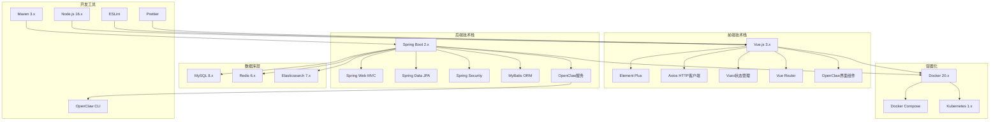

**图表来源**
- [pom.xml](file://med_ai_assistant_1.0_bs_backend/pom.xml)

### 部署配置依赖

不同环境下的部署配置具有特定的依赖关系：

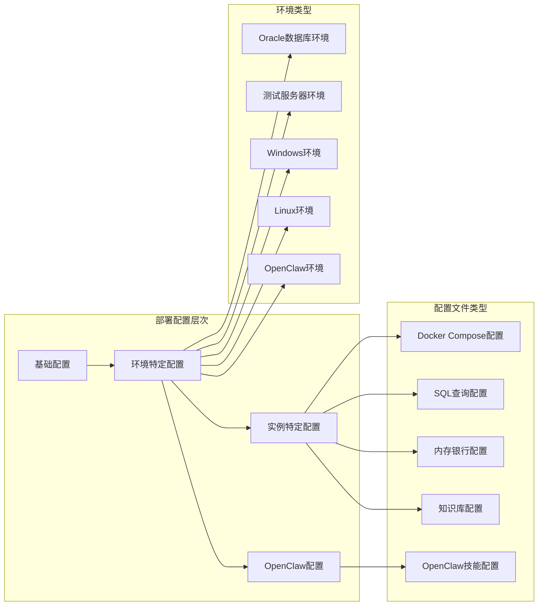

**图表来源**
- [docker-compose-main.yml](file://med_ai_assistant_1.0_bs_backend/deploy/main-linux-oracle/docker-compose-main.yml)
- [docker-compose-execution-linux.yml](file://med_ai_assistant_1.0_bs_backend/deploy/execution-linux/docker-compose-execution-linux.yml)

**章节来源**
- [pom.xml](file://med_ai_assistant_1.0_bs_backend/pom.xml)
- [docker-compose-main.yml](file://med_ai_assistant_1.0_bs_backend/deploy/main-linux-oracle/docker-compose-main.yml)

## 性能考虑

### 系统性能优化策略

1. **数据库性能优化**
   - 查询索引优化
   - 连接池配置调优
   - 缓存策略实施
   - 分页查询优化

2. **前端性能优化**
   - 组件懒加载
   - 图片资源优化
   - CDN加速配置
   - 代码分割策略

3. **后端性能优化**
   - 异步处理机制
   - 并发连接数限制
   - 内存使用优化
   - 网络I/O优化

4. **容器化性能优化**
   - 资源限制配置
   - 健康检查设置
   - 自动扩缩容策略
   - 存储卷优化

5. **OpenClaw性能优化**
   - 技能缓存机制
   - 编排流程优化
   - LLM调用频率控制
   - 并发任务管理

## 故障排除指南

### 常见问题诊断

#### 开发环境问题
1. **端口冲突**
   - 检查端口占用情况
   - 修改配置文件中的端口号
   - 使用netstat命令排查

2. **依赖下载失败**
   - 检查网络连接
   - 配置代理设置
   - 清理本地缓存

3. **数据库连接问题**
   - 验证数据库服务状态
   - 检查连接字符串配置
   - 确认防火墙设置

#### 生产环境问题
1. **应用启动失败**
   - 查看启动日志
   - 检查资源配置
   - 验证依赖完整性

2. **性能问题**
   - 监控系统指标
   - 分析慢查询日志
   - 优化缓存策略

3. **数据一致性问题**
   - 检查事务配置
   - 验证数据同步机制
   - 实施补偿措施

#### Profile依赖链问题
**更新** 新增了针对执行服务器Profile依赖链断裂的故障排除指南

1. **问题现象**
   - 执行服务器启动时Bean依赖注入失败
   - DRG相关服务无法正常初始化
   - 定时任务无法执行

2. **解决方案**
   - 为相关服务类添加@Profile("!execution")注解
   - 确保执行服务器和主服务器的配置隔离
   - 验证Profile配置的正确性

#### OpenClaw集成问题
**新增** 针对OpenClaw集成的故障排除指南

1. **OpenClaw网关连接失败**
   - 检查OpenClaw服务状态
   - 验证Gateway Token配置
   - 确认网络连通性

2. **技能调用失败**
   - 验证技能配置文件
   - 检查后端API可达性
   - 确认LLM API Key有效性

3. **编排流程中断**
   - 查看编排日志
   - 验证技能依赖关系
   - 检查并发限制设置

#### 病人列表滚动问题
**新增** 针对版本0.8.036滚动修复问题的排除指南

1. **滚动位置不正确**
   - 检查`restoreScrollPosition`方法调用时机
   - 验证`$nextTick`和`setTimeout`的使用
   - 确认DOM元素的选择器正确性

2. **Element Plus滚动容器问题**
   - 检查`.el-table__body-wrapper`是否存在
   - 验证`scrollIntoView`的参数设置
   - 确认`behavior:'instant'`的兼容性

3. **keep-alive兼容性问题**
   - 检查路由配置中是否使用`<keep-alive>`
   - 验证`activated`钩子的触发条件
   - 确认双生命周期覆盖的实现

#### 重要程度术语问题
**新增** 针对版本0.8.037术语优化问题的排除指南

1. **术语显示异常**
   - 检查`getImportanceColor`方法的颜色映射
   - 验证CSS类名的正确性
   - 确认颜色代码的格式

2. **数据兼容性问题**
   - 检查数据库中"危急"数据的转换
   - 验证前端显示逻辑的兼容性
   - 确认报表统计的准确性

**章节来源**
- [.gitignore](file://.gitignore)

## 版本发布历史

### 前端版本更新记录

#### v0.8.036 - v0.8.037
**更新** 新增了版本0.8.037和0.8.036的具体更新内容

##### v0.8.036 - 病人列表滚动修复
**新增功能**
- 修复从AI辅助页面返回时未自动滚动到选中病人位置的问题
- 实现选中行居中显示功能，提升用户体验
- 采用双生命周期覆盖策略，确保兼容不同路由配置

**技术实现**
- 使用`$nextTick`和`setTimeout`双重保障DOM渲染完成
- 采用`scrollIntoView({block:'center'})`实现居中滚动
- 支持keep-alive和非keep-alive两种路由场景

**用户体验改进**
- 选中病人自动滚动到可视区域中心
- 减少用户手动滚动操作
- 提升整体操作流畅度

**变更文件**
- 修改：`src/components/patient/PatientList.vue`

##### v0.8.037 - 重要程度术语优化
**新增功能**
- 将"危急"术语替换为"关键"，提升术语表达的专业性
- 保持原有颜色编码系统，确保视觉一致性
- 向后兼容已存在的"危急"数据

**术语优化**
- "危急" → "关键"（红色警示）
- 保持"重要"和"一般"术语不变
- 统一医疗术语表达标准

**用户体验改进**
- 术语表达更加符合医疗行业标准
- 保持颜色编码的视觉一致性
- 确保系统升级的平滑过渡

**变更文件**
- 修改：`src/components/ai/TreatmentPlanTable.vue`
- 修改：`src/components/ai/AIResults.vue`

#### v0.8.035 - v0.8.036
**更新** 完善了之前的版本更新记录

##### v0.8.035 - PromptTemplates组件UI重构
**新增功能**
- PromptTemplates模板列表改为overlay下拉面板，默认折叠，右上角按钮展开
- 执行模板后自动收起：通过template-executed事件实现自动折叠
- AIView.vue集成Overlay面板：实现完整的展开/收起交互逻辑
- PromptList.vue优化：改进Prompt列表显示和交互体验

**用户体验改进**
- 模板面板默认折叠，节省界面空间
- Overlay面板提供更好的视觉层次
- 执行后自动收起，提升操作效率
- 展开/收起动画提供流畅的用户体验

**变更文件**
- 修改：`src/components/ai/PromptTemplates.vue`
- 修改：`src/views/AIView.vue`
- 修改：`src/components/ai/PromptList.vue`

#### v0.8.021 - v0.8.035
**更新** 完善了之前的版本更新记录

##### v0.8.021 - OpenClaw集成方案引入
**新增功能**
- 配合后端新增OpenClaw集成方案文档，前端无功能变更
- 为后续OpenClaw界面集成做准备

**章节来源**
- [2026-04-11.md](file://med_ai_assistant_1.0_bs_vue/docs/更新日志/2026-04-11.md)

##### v0.8.024 - AI对话功能流式响应改造
**新增功能**
- aiService.js流式响应改造：将stream:false改为stream:true，使用ReadableStream + TextDecoder消费NDJSON流，支持isFinal标识防重复、AbortController超时取消（300秒）
- AIResponse.vue适配流式交互：onData回调支持增量数据处理，新增isFinal检测用完整内容替换累积内容，移除不再需要的OpenAI格式兼容分支

**用户体验改进**
- AI对话功能从一次性加载改为逐字流式显示，大幅减少响应等待时间感知

**变更文件**
- 修改：`src/api/aiService.js`
- 修改：`src/components/ai/AIResponse.vue`

##### v0.8.025 - PromptTemplates组件UI重构
**新增功能**
- PromptTemplates组件UI重构：模板列表改为overlay下拉面板，默认折叠，右上角按钮展开
- 执行模板后自动收起：通过template-executed事件实现自动折叠
- AIView.vue集成Overlay面板：实现完整的展开/收起交互逻辑
- PromptList.vue优化：改进Prompt列表显示和交互体验

**用户体验改进**
- 模板面板默认折叠，节省界面空间
- Overlay面板提供更好的视觉层次
- 执行后自动收起，提升操作效率
- 展开/收起动画提供流畅的用户体验

**变更文件**
- 修改：`src/components/ai/PromptTemplates.vue`
- 修改：`src/views/AIView.vue`
- 修改：`src/components/ai/PromptList.vue`

#### v0.8.022 - AI辅助页面诊断卡片组件
**新增功能**
- 新增诊断概览卡片组件（DiagnosisCard.vue），当Prompt标题包含"诊断分析"时自动展示
- 卡片左右分栏布局：左侧显示从AI结果中提取的诊断列表，右侧显示选中诊断的详细分析（诊断依据、鉴别诊断、补充说明等）
- 诊断分析类Prompt的AI结果区域支持折叠/展开，默认折叠，减少页面信息量

**代码重构**
- 新增诊断解析工具函数（diagnosisParser.js），统一提取诊断名称和完整诊断块的逻辑
- AIResults.vue和DiagnosisEditDialog.vue中的重复诊断提取代码替换为工具函数调用，消除约52行重复代码

**Bug修复**
- 修复diagnosisParser.js中正则表达式lookahead `(?=###|$)` 误匹配四级标题（####）导致诊断列表区块被截断为空的问题

**变更文件**
- 新增：`src/components/ai/DiagnosisCard.vue`
- 新增：`src/utils/diagnosisParser.js`
- 修改：`src/components/ai/AIResults.vue`
- 修改：`src/components/patient/DiagnosisEditDialog.vue`

#### v0.7.018 - v0.7.023
**更新** 完善了之前的版本更新记录

##### v0.7.018 - v0.7.023
- 修复执行服务器Profile依赖链断裂问题
- 恢复前端源码文件和构建脚本
- 新增服务器日志查看功能
- 集成eruda前端调试面板

##### v0.7.020 - v0.7.022
- 修复EMR病历同步唯一约束冲突
- 优化病历记录修改接口
- 改进音频测试工具

##### v0.7.022 - v0.7.023
- 完善前端构建流程
- 修复bat文件编码问题

### 后端版本更新记录

#### v0.8.036 - v0.8.037
**更新** 新增了版本0.8.036和0.8.037的具体更新内容

##### v0.8.036 - 病人列表滚动修复
**新增功能**
- 修复从AI辅助页面返回时未自动滚动到选中病人位置的问题
- 实现选中行居中显示功能，提升用户体验
- 采用双生命周期覆盖策略，确保兼容不同路由配置

**技术实现**
- 使用`$nextTick`和`setTimeout`双重保障DOM渲染完成
- 采用`scrollIntoView({block:'center'})`实现居中滚动
- 支持keep-alive和非keep-alive两种路由场景

**用户体验改进**
- 选中病人自动滚动到可视区域中心
- 减少用户手动滚动操作
- 提升整体操作流畅度

**变更文件**
- 修改：`src/components/patient/PatientList.vue`

##### v0.8.037 - 重要程度术语优化
**新增功能**
- 将"危急"术语替换为"关键"，提升术语表达的专业性
- 保持原有颜色编码系统，确保视觉一致性
- 向后兼容已存在的"危急"数据

**术语优化**
- "危急" → "关键"（红色警示）
- 保持"重要"和"一般"术语不变
- 统一医疗术语表达标准

**用户体验改进**
- 术语表达更加符合医疗行业标准
- 保持颜色编码的视觉一致性
- 确保系统升级的平滑过渡

**变更文件**
- 修改：`src/components/ai/TreatmentPlanTable.vue`
- 修改：`src/components/ai/AIResults.vue`

#### v0.8.016 - v0.8.035
**更新** 完善了之前的版本更新记录

##### v0.8.016 - Prompt状态循环重置修复
**Bug修复**
- 修复PromptResult软删除导致Prompt状态循环重置问题
- 问题描述：用户软删除PromptResult（deleted=1）后，补偿机制`checkDataConsistency()`误判为数据丢失，将Prompt从"已完成"重置为"已提交"，导致循环重新提交
- 修复方案：修改`PromptRepository.findIncompleteCompleted()`查询，移除`AND pr.deleted = 0`条件，仅在完全不存在任何PromptResult记录时才判定为数据丢失

##### v0.8.017 - 开发环境维护更新
**维护更新**
- 清理AI工具临时文件：删除.qoder/目录下的review_diff.txt、promptresult_fix_diff.txt、PromptPollingService.diff等临时差异文件
- 提交遗留配置变更：提交后端.dockerignore配置变更
- 补充代码注释：为PromptRepository.findIncompleteCompleted()方法补充完整的Javadoc注释

##### v0.8.018 - 开发环境禁用定时Prompt生成任务
**变更内容**
- 在`TimerPromptGenerator`的`dailyPromptGeneration()`和`generateNoonWardRoundPrompts()`定时任务方法中添加启用状态检查
- 新增配置项`scheduling.timer.enabled`，开发环境默认设置为`false`（禁用）
- 生产环境不受影响，代码默认值为`true`（启用）

##### v0.8.019 - Prompt数据一致性检查ResultId回填修复
**Bug修复**
- 修复`checkDataConsistency()`对PromptResult软删除场景的处理逻辑
- 问题描述：当Prompt状态为"已完成"但ResultId为NULL，且PromptResult记录全部被软删除(deleted=1)时，补偿机制仅"跳过重置"但不回填ResultId，导致每次轮询都重复检测到该不一致记录，浪费服务器资源
- 修复方案：将`checkDataConsistency()`改为三路径修复逻辑

##### v0.8.020 - EMR记录详情查询修复
**Bug修复**
- 修复EMR记录详情查询返回多条结果导致`IncorrectResultSizeDataAccessException`异常
- `EmrContentRepository.findContentById`返回类型从`String`改为`List<String>`
- 添加`ORDER BY modifiedOn DESC NULLS LAST`排序，多条记录时优先返回最新修改记录
- `EmrRecordService.getEmrRecordContentById`适配List返回，多条记录时记录WARN日志

**章节来源**
- [2026-04-16.md](file://med_ai_assistant_1.0_bs_backend/doc/更新日志/2026-04-16.md)
- [2026-04-17.md](file://med_ai_assistant_1.0_bs_backend/doc/更新日志/2026-04-17.md)

## 结论

MedAiAssistant项目展现了现代医疗AI系统的完整架构设计，通过前后端分离、容器化部署、多环境配置管理等技术手段，实现了高可用性、可扩展性和易维护性的系统目标。

**更新亮点**：
- **重要程度术语优化**：版本0.8.037将"危急"替换为"关键"，提升了术语表达的专业性和准确性
- **病人列表滚动修复**：版本0.8.036解决了从AI辅助页面返回时未自动滚动到选中病人位置的问题，采用居中显示优化用户体验
- **双生命周期覆盖**：通过`mounted`和`activated`钩子的双重保障，确保在不同路由配置下都能正常工作
- **scrollIntoView技术**：使用原生DOM API替代手动scrollTop计算，适配Element Plus的滚动容器结构
- **颜色编码系统**：保持"关键/重要/一般"三级重要程度的颜色编码，确保视觉一致性

**技术价值**：
- **用户体验提升**：居中显示选中行，减少用户手动滚动操作
- **系统稳定性**：双生命周期覆盖策略，确保兼容不同路由配置
- **术语标准化**：统一医疗术语表达，符合行业标准
- **向前兼容**：重要程度术语优化不影响现有数据和功能

**未来发展方向**：
- 继续优化用户体验，提升系统的易用性和效率
- 扩展OpenClaw编排能力，实现更多临床场景的智能化
- 完善医疗术语标准化，提升系统的专业性和准确性
- 加强系统监控和日志管理，提升运维效率

## 附录

### 开发环境快速启动

1. **后端服务启动**
   ```bash
   # 在项目根目录执行
   ./mvn.bat
   ```

2. **前端服务启动**
   ```bash
   # 在项目根目录执行
   ./npm.bat
   ```

3. **OpenClaw环境启动**
   ```bash
   # 在OpenClaw服务器上执行
   openclaw gateway --port 18789 --verbose
   ```

4. **环境变量配置**
   - 设置JAVA_OPTS参数
   - 配置数据库连接信息
   - 指定日志输出目录
   - 配置OpenClaw Gateway Token

### 部署配置说明

1. **Docker容器编排**
   - 使用docker-compose管理多容器应用
   - 支持不同环境的配置切换
   - 实现服务发现和负载均衡

2. **数据库迁移**
   - 支持版本化的数据库变更
   - 提供回滚机制
   - 确保数据一致性

3. **监控和告警**
   - 集成Prometheus监控
   - 配置Grafana可视化
   - 设置告警规则和通知

4. **OpenClaw部署**
   - 配置OpenClaw Gateway服务
   - 设置技能目录和配置
   - 验证LLM API连接

### 版本管理最佳实践

1. **版本号规范**
   - 主版本号：重大功能更新
   - 次版本号：新功能添加
   - 修订号：bug修复和小改进

2. **更新日志维护**
   - 按日期记录所有变更
   - 详细描述功能改进
   - 提供问题修复说明

3. **发布流程**
   - 代码审查和测试
   - 更新文档和示例
   - 正式发布和通知

### 新功能使用指南

#### 病人列表滚动功能使用
1. **自动滚动机制**
   - 从AI辅助页面返回时自动滚动到选中病人位置
   - 选中行显示在表格可视区域中心
   - 支持keep-alive和非keep-alive两种路由场景

2. **双生命周期适配**
   - `mounted`钩子处理组件首次加载
   - `activated`钩子处理keep-alive场景
   - `$nextTick`和`setTimeout`确保DOM渲染完成

3. **滚动容器适配**
   - 使用`scrollIntoView`替代手动scrollTop
   - 支持Element Plus的滚动容器层级
   - `{block:'center', behavior:'instant'}`居中显示

#### 重要程度术语使用
1. **术语标准化**
   - "危急" → "关键"（红色警示）
   - "重要"和"一般"术语保持不变
   - 颜色编码系统保持一致

2. **颜色显示**
   - 关键：#F56C6C（红色）
   - 重要：#E6A23C（橙色）
   - 一般：#909399（灰色）

3. **兼容性处理**
   - 向后兼容已存在的"危急"数据
   - 系统升级平滑过渡
   - 报表统计自动转换

**章节来源**
- [PatientList.vue](file://med_ai_assistant_1.0_bs_vue/src/components/patient/PatientList.vue)
- [TreatmentPlanTable.vue](file://med_ai_assistant_1.0_bs_vue/src/components/ai/TreatmentPlanTable.vue)
- [AIResults.vue](file://med_ai_assistant_1.0_bs_vue/src/components/ai/AIResults.vue)
- [更新小结.md](file://更新小结.md)