# 更新摘要

<cite>
**本文档引用的文件**
- [2026-04-23.md](file://med_ai_assistant_1.0_bs_vue/docs/更新日志/2026-04-23.md)
- [diagnosisParser.js](file://med_ai_assistant_1.0_bs_vue/src/utils/diagnosisParser.js)
- [qcDiseaseMatchParser.js](file://med_ai_assistant_1.0_bs_vue/src/utils/qcDiseaseMatchParser.js)
- [AIDiagnosisTab.vue](file://med_ai_assistant_1.0_bs_vue/src/components/patient/AIDiagnosisTab.vue)
- [DiagnosisEditPanel.vue](file://med_ai_assistant_1.0_bs_vue/src/components/ai/DiagnosisEditPanel.vue)
- [tooltips.js](file://med_ai_assistant_1.0_bs_vue/src/data/tooltips.js)
- [PatientTabs.vue](file://med_ai_assistant_1.0_bs_vue/src/components/patient/PatientTabs.vue)
</cite>

## 更新摘要
**所做更改**
- 新增诊断解析器Markdown标题级别鲁棒性增强章节，详细说明正则表达式从硬编码####改为#{3,4}的改进
- 更新前端诊断解析章节，说明extractSingleLineField函数的引入和跨行误捕获修复
- 新增AI诊断辅助标签页功能章节，介绍独立诊断结果展示和编辑功能
- 新增tooltip功能配置章节，说明所有标签页的悬停提示信息实现
- 更新PatientTabs组件章节，说明标签页重新排序和懒加载机制
- 新增DiagnosisEditPanel组件章节，介绍诊断编辑面板的完整功能

## 目录
1. [项目概述](#项目概述)
2. [项目结构](#项目结构)
3. [核心组件](#核心组件)
4. [架构概览](#架构概览)
5. [详细组件分析](#详细组件分析)
6. [诊断解析器Markdown标题级别鲁棒性增强](#诊断解析器markdown标题级别鲁棒性增强)
7. [前端诊断解析优化](#前端诊断解析优化)
8. [AI诊断辅助标签页功能](#ai诊断辅助标签页功能)
9. [tooltip功能配置](#tooltip功能配置)
10. [PatientTabs组件增强](#patienttabs组件增强)
11. [DiagnosisEditPanel组件](#diagnosiseditpanel组件)
12. [依赖关系分析](#依赖关系分析)
13. [性能考虑](#性能考虑)
14. [故障排除指南](#故障排除指南)
15. [结论](#结论)
16. [附录](#附录)

## 项目概述

MedAiAssistant V1.0 是一款集患者管理、AI辅助诊断、DRG分析、MCC/CC并发症筛查等功能于一体的医疗信息化平台。该项目采用前后端分离架构，前端基于Vue 3框架，后端采用Spring Boot 3框架，支持与医院HIS、PACS、LIS等医疗信息系统进行数据对接。

### 主要特性
- AI辅助诊断分析：基于大语言模型技术，提供智能化诊断建议
- DRG智能分组：支持疾病诊断相关分组的自动匹配和盈亏分析
- MCC/CC筛查：智能识别严重并发症或合并症，提高诊断完整性
- 患者全景管理：整合多维度医疗数据，提供完整的患者视图
- Prompt模板管理：支持多种诊疗场景的AI分析模板
- 分布式执行架构：采用主服务器+执行服务器的双节点分离架构
- **诊断解析器鲁棒性增强**：通过extractSingleLineField函数防止跨行误捕获
- **新增完整tooltip功能**：为所有标签页提供详细的悬停提示信息
- **新增AI诊断辅助标签页**：提供独立的AI诊断结果展示和编辑功能
- **懒加载机制优化**：通过条件渲染提升应用性能和用户体验

## 项目结构

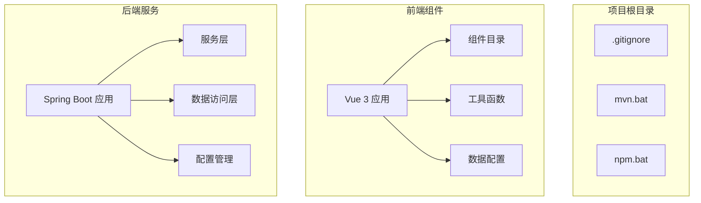

**图表来源**
- [PatientTabs.vue:1-187](file://med_ai_assistant_1.0_bs_vue/src/components/patient/PatientTabs.vue#L1-L187)
- [AIDiagnosisTab.vue:1-316](file://med_ai_assistant_1.0_bs_vue/src/components/patient/AIDiagnosisTab.vue#L1-L316)

## 核心组件

### 后端配置组件

系统采用Spring Boot 3.x + Java 17的技术栈，包含以下核心配置组件：

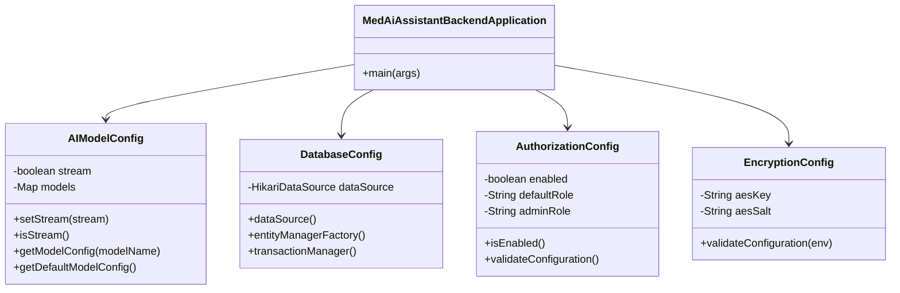

**图表来源**
- [源代码文档.md:21-47](file://项目相关/软件著作权/源代码文档.md#L21-L47)
- [源代码文档.md:50-217](file://项目相关/软件著作权/源代码文档.md#L50-L217)

### AI分析服务组件

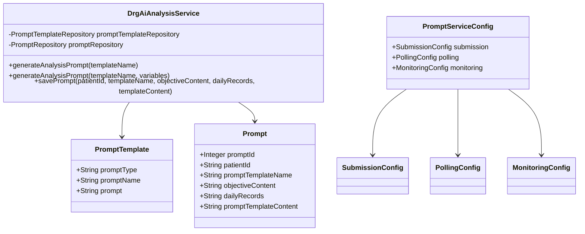

**图表来源**
- [源代码文档.md:700-800](file://项目相关/软件著作权/源代码文档.md#L700-L800)

## 架构概览

系统采用分布式执行服务器架构，实现前后端分离和任务处理的解耦：

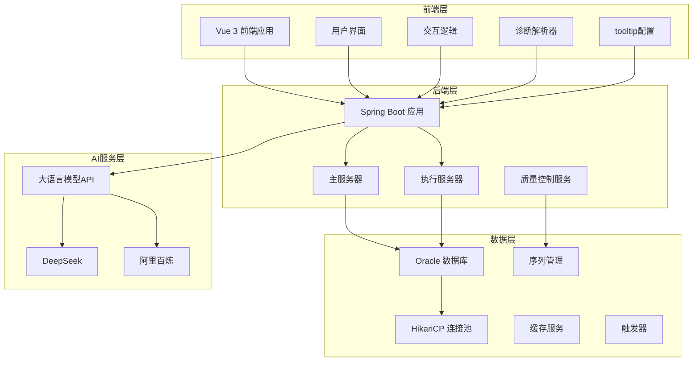

**图表来源**
- [用户操作手册.md:94-98](file://项目相关/软件著作权/用户操作手册.md#L94-L98)
- [源代码文档.md:270-283](file://项目相关/软件著作权/源代码文档.md#L270-L283)

## 详细组件分析

### AI模型配置管理

AI模型配置系统支持多种大语言模型的灵活配置和管理：

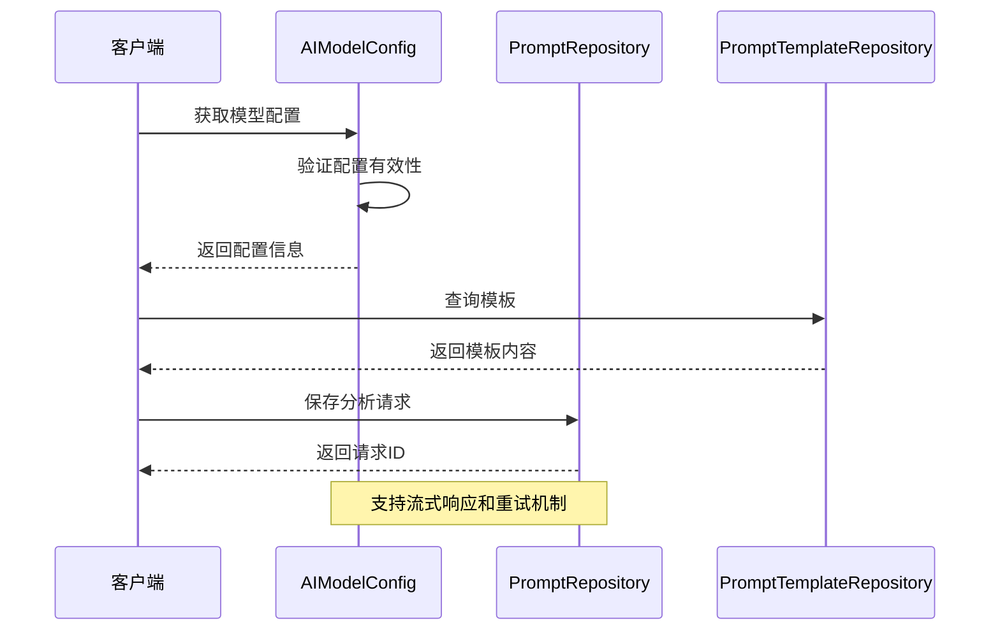

**图表来源**
- [源代码文档.md:64-217](file://项目相关/软件著作权/源代码文档.md#L64-L217)

### DRG分析流程

DRG分析采用双向匹配策略，确保诊断分组的准确性：

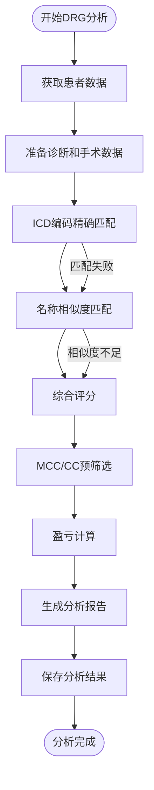

**图表来源**
- [用户操作手册.md:582-632](file://项目相关/软件著作权/用户操作手册.md#L582-L632)

### 数据库连接池配置

系统采用HikariCP连接池，优化数据库连接性能：

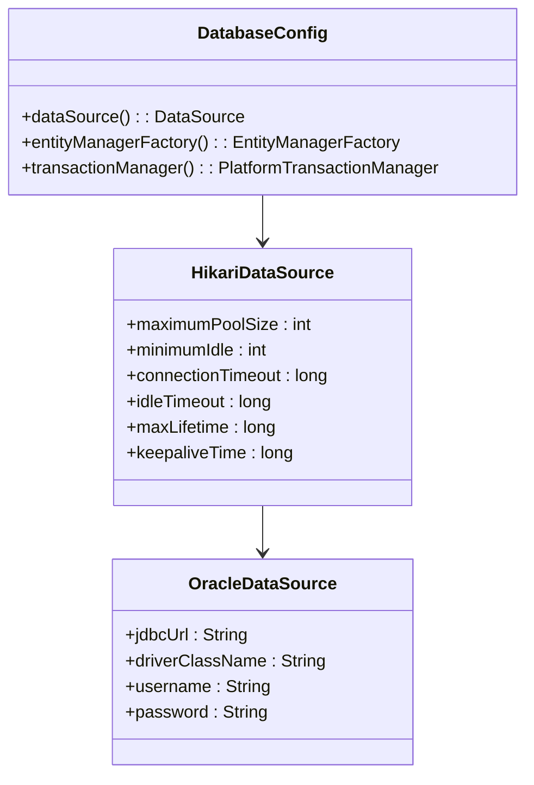

**图表来源**
- [源代码文档.md:270-328](file://项目相关/软件著作权/源代码文档.md#L270-L328)

## 诊断解析器Markdown标题级别鲁棒性增强

### 正则表达式跨行误捕获问题分析

2026年4月23日更新修复了诊断解析器中的正则表达式跨行误捕获问题，该问题导致triggerDiagnosis字段值膨胀，影响了诊断解析的准确性。

#### 1. 问题根本原因
- **正则表达式缺陷**：原有的正则表达式在匹配triggerDiagnosis字段时会跨行捕获
- **影响范围**：所有使用正则表达式解析诊断结果的组件
- **后果**：将后续疗程块的内容也包含在triggerDiagnosis字段中，导致字段值异常膨胀

#### 2. 解决方案实施

##### extractSingleLineField函数引入
新增`extractSingleLineField`局部函数，专门处理单行字段提取：


**图表来源**
- [2026-04-23.md:43-47](file://med_ai_assistant_1.0_bs_vue/docs/更新日志/2026-04-23.md#L43-L47)

##### 正则表达式优化
```javascript
// 新的单行字段提取正则表达式
const regex = new RegExp(`(?:#{3,4}\\s*)?${fieldName}[:：]\\s*([^\\n]+)`, 'i');

// 传统多行字段提取正则表达式
const regex = new RegExp(`(?:#{3,4}\\s*)?${fieldName}[:：]\\s*([\\s\\S]*?)(?=(?:#{3,4}|$))`, 'i');
```

#### 3. QC病种匹配解析器增强

在`qcDiseaseMatchParser.js`中同样应用了相同的单行提取策略：

```mermaid
classDiagram
class QcDiseaseMatchParser {
+parseDiseaseMatchBlock(blockContent)
+extractSingleLineField(fieldName, text)
+extractField(fieldName, text)
}
class ExtractSingleLineField {
+regex : /(? : #{3,4}\\s*)?字段名[ : ：]\\s*([^\\n]+)/i
+功能 : 提取单行字段值
+特点 : 不跨行，只匹配第一行内容
}
QcDiseaseMatchParser --> ExtractSingleLineField
```

**图表来源**
- [qcDiseaseMatchParser.js:65-72](file://med_ai_assistant_1.0_bs_vue/src/utils/qcDiseaseMatchParser.js#L65-L72)

#### 4. 兼容性处理策略

系统实现了双重解析策略，确保向前兼容：

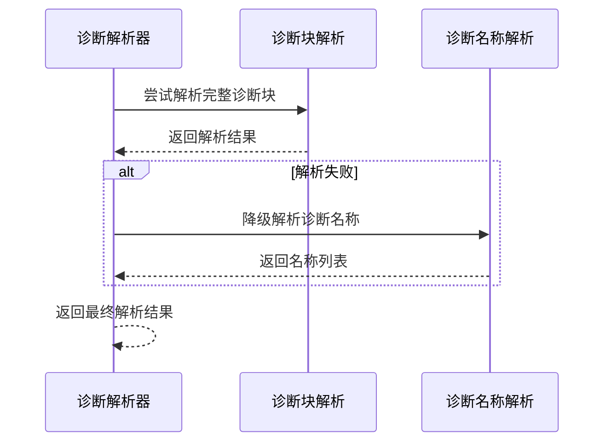

**图表来源**
- [AIDiagnosisTab.vue:167-177](file://med_ai_assistant_1.0_bs_vue/src/components/patient/AIDiagnosisTab.vue#L167-L177)

**章节来源**
- [2026-04-23.md:43-47](file://med_ai_assistant_1.0_bs_vue/docs/更新日志/2026-04-23.md#L43-L47)
- [diagnosisParser.js:157-219](file://med_ai_assistant_1.0_bs_vue/src/utils/diagnosisParser.js#L157-L219)
- [qcDiseaseMatchParser.js:65-72](file://med_ai_assistant_1.0_bs_vue/src/utils/qcDiseaseMatchParser.js#L65-L72)
- [AIDiagnosisTab.vue:167-177](file://med_ai_assistant_1.0_bs_vue/src/components/patient/AIDiagnosisTab.vue#L167-L177)

## 前端诊断解析优化

### triggerDiagnosis字段正则表达式修复

2026年4月23日更新修复了前端诊断解析中的正则表达式问题，防止triggerDiagnosis字段出现跨行误捕获导致的字段值膨胀。

#### 1. 问题分析
- **根本原因**：原有的正则表达式在匹配triggerDiagnosis字段时会跨行捕获，导致将后续疗程块的内容也包含进来
- **影响范围**：所有使用正则表达式解析诊断结果的组件
- **修复目标**：确保triggerDiagnosis字段只提取单行内容

#### 2. 修复方案
新增`extractSingleLineField`局部函数，专门处理单行字段提取：

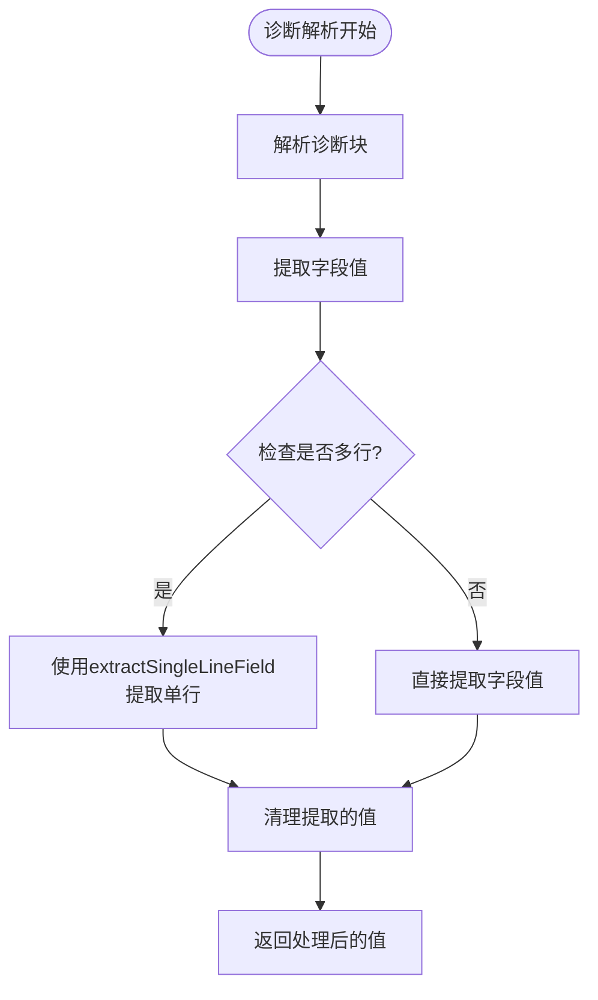

**图表来源**
- [2026-04-23.md:43-47](file://med_ai_assistant_1.0_bs_vue/docs/更新日志/2026-04-23.md#L43-L47)

#### 3. 诊断解析函数优化

```mermaid
classDiagram
class DiagnosisParser {
+extractDiagnosisBlocks(content)
+extractDiagnosisNames(content)
+extractSingleLineField(fieldName, text)
-parseDiagnosisBlock(blockContent)
-stripThinkingTags(content)
}
class ExtractSingleLineField {
+regex : /(? : #{3,4}\\s*)?字段名[ : ：]\\s*([^\n]*?)(?=(? : #{3,4}|$))/i
+功能 : 提取单行字段值
+特点 : 不跨行，只匹配第一行内容
}
DiagnosisParser --> ExtractSingleLineField
```

**图表来源**
- [diagnosisParser.js:157-219](file://med_ai_assistant_1.0_bs_vue/src/utils/diagnosisParser.js#L157-L219)

#### 4. 兼容性处理
系统实现了双重解析策略，确保向前兼容：


**图表来源**
- [AIDiagnosisTab.vue:167-177](file://med_ai_assistant_1.0_bs_vue/src/components/patient/AIDiagnosisTab.vue#L167-L177)

**章节来源**
- [2026-04-23.md:43-47](file://med_ai_assistant_1.0_bs_vue/docs/更新日志/2026-04-23.md#L43-L47)
- [diagnosisParser.js:157-219](file://med_ai_assistant_1.0_bs_vue/src/utils/diagnosisParser.js#L157-L219)
- [AIDiagnosisTab.vue:167-177](file://med_ai_assistant_1.0_bs_vue/src/components/patient/AIDiagnosisTab.vue#L167-L177)

## AI诊断辅助标签页功能

### 功能概述

2026年4月23日更新引入了全新的AI诊断辅助标签页功能，为用户提供独立的AI诊断结果展示和编辑界面。该功能基于现有的AI分析结果，提供更加直观和便捷的诊断管理体验。

### 技术架构

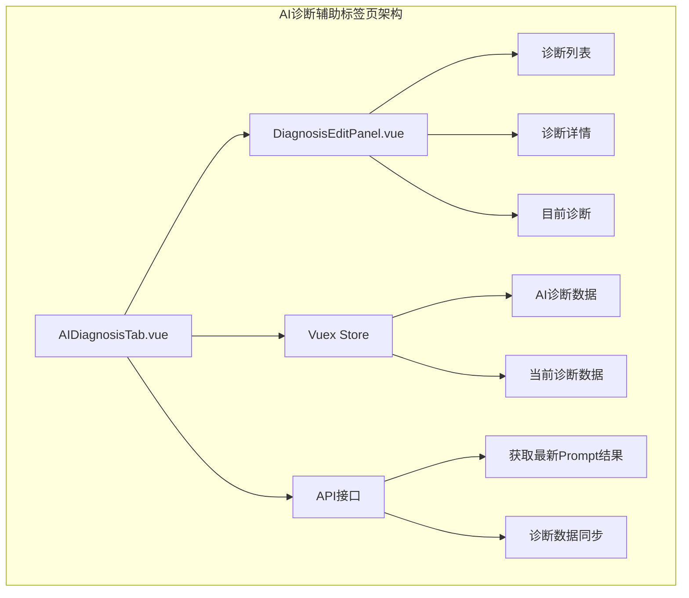

**图表来源**
- [AIDiagnosisTab.vue:1-316](file://med_ai_assistant_1.0_bs_vue/src/components/patient/AIDiagnosisTab.vue#L1-L316)
- [DiagnosisEditPanel.vue:1-722](file://med_ai_assistant_1.0_bs_vue/src/components/ai/DiagnosisEditPanel.vue#L1-L722)

### 核心功能特性

#### 1. 独立标签页设计
- **位置安排**：位于DRG分析之后、临床指引之前
- **懒加载策略**：使用`v-if`指令实现按需加载，避免不必要的API请求
- **状态管理**：与AI辅助页面的`AIResults.vue`保持数据流一致

#### 2. 多状态处理
- **加载状态**：显示旋转图标和加载提示
- **错误状态**：提供重试按钮和错误信息展示
- **空数据状态**：友好提示暂无诊断分析记录

#### 3. 数据解析与展示
- **时间格式化**：兼容Java LocalDateTime数组格式
- **诊断解析**：支持`extractDiagnosisBlocks`和`extractDiagnosisNames`双重解析策略
- **实时同步**：自动获取最新的AI诊断分析结果

**章节来源**
- [2026-04-23.md:22-28](file://med_ai_assistant_1.0_bs_vue/docs/更新日志/2026-04-23.md#L22-L28)
- [AIDiagnosisTab.vue:1-316](file://med_ai_assistant_1.0_bs_vue/src/components/patient/AIDiagnosisTab.vue#L1-L316)

## tooltip功能配置

### 配置管理架构

tooltip功能采用了统一的配置管理架构，通过专门的数据文件管理所有tooltip内容，确保配置的一致性和可维护性。

### 配置文件结构

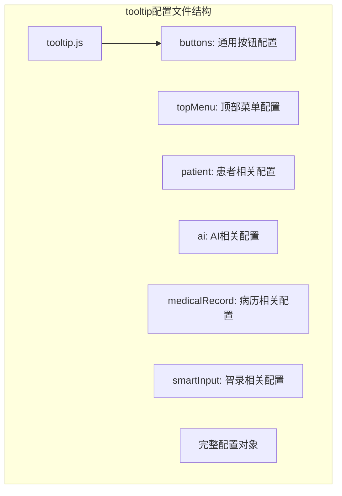

**图表来源**
- [tooltips.js:1-87](file://med_ai_assistant_1.0_bs_vue/src/data/tooltips.js#L1-L87)

### 配置内容详解

#### 1. 通用按钮配置
- **save**："保存当前内容"
- **submit**："提交数据"
- **cancel**："取消操作"
- **delete**："删除选中项"
- **refresh**："刷新数据"
- **create**："创建新记录"
- **enhance**："使用AI完善内容"

#### 2. 顶部菜单配置
- **home**："返回首页"
- **patient**："患者管理"
- **ai**："AI辅助诊断"
- **settings**："系统设置"
- **refresh**："刷新患者数据"
- **search**："搜索患者"
- **filter**："筛选患者列表"
- **aiSettings**："配置AI相关参数"
- **userSettings**："修改个人信息"
- **templates**："管理提示词模板"
- **dicSettings**："配置智录DIC参数"
- **system**："系统相关功能"
- **logout**："退出当前账号"
- **help**："获取帮助信息"

#### 3. 患者相关配置
- **info**："查看/编辑患者基本信息"
- **records**："查看患者病历记录"
- **orders**："管理患者医嘱"
- **tests**："查看检验检查结果"
- **list.bedNumber**："床位号"
- **list.admissionNumber**："住院号"
- **details.drgCode**："DRG诊断相关分组代码"
- **details.totalCost**："患者住院期间总费用"
- **details.profitLoss**："正数表示盈利，负数表示亏损"
- **details.diagnosis**："患者的主要诊断列表"
- **details.operation**："患者的手术/操作列表"

#### 4. AI相关配置
- **analyze**："分析患者数据"
- **generate**："生成诊断建议"
- **templates**："管理提示词模板"
- **editDiagnosis**："修改AI生成的诊断结果"
- **editContent**："编辑AI生成的内容"
- **saveContent**："保存编辑后的内容"
- **cancelEdit**："取消编辑并恢复原内容"
- **addDiagnosis**："将选中的文本添加为诊断"

#### 5. 病历相关配置
- **date**："病历记录的日期"
- **doctor**："负责医生姓名"
- **content**："病历详细内容"
- **backspace**："删除前一个字符"
- **delete**："删除选中的记录。请注意：删除操作不可逆。"
- **create**："创建新的病历记录"
- **save**："保存当前病历记录"
- **enhance**："使用AI完善病历内容"
- **form.date**："病历记录的日期"
- **form.doctor**："负责医生姓名"
- **form.content**："病历详细内容"

#### 6. 智录相关配置
- **up**："返回上一级"
- **query**："查询选中文本"
- **toplevel**："显示顶层"
- **close**："关闭智录面板"

**章节来源**
- [tooltips.js:1-87](file://med_ai_assistant_1.0_bs_vue/src/data/tooltips.js#L1-L87)

## PatientTabs组件增强

### tooltip功能实现

2026年4月23日更新为PatientTabs组件的所有标签页添加了完整的tooltip功能，提供了详细的悬停提示信息，显著提升了用户体验。

### tooltip配置结构

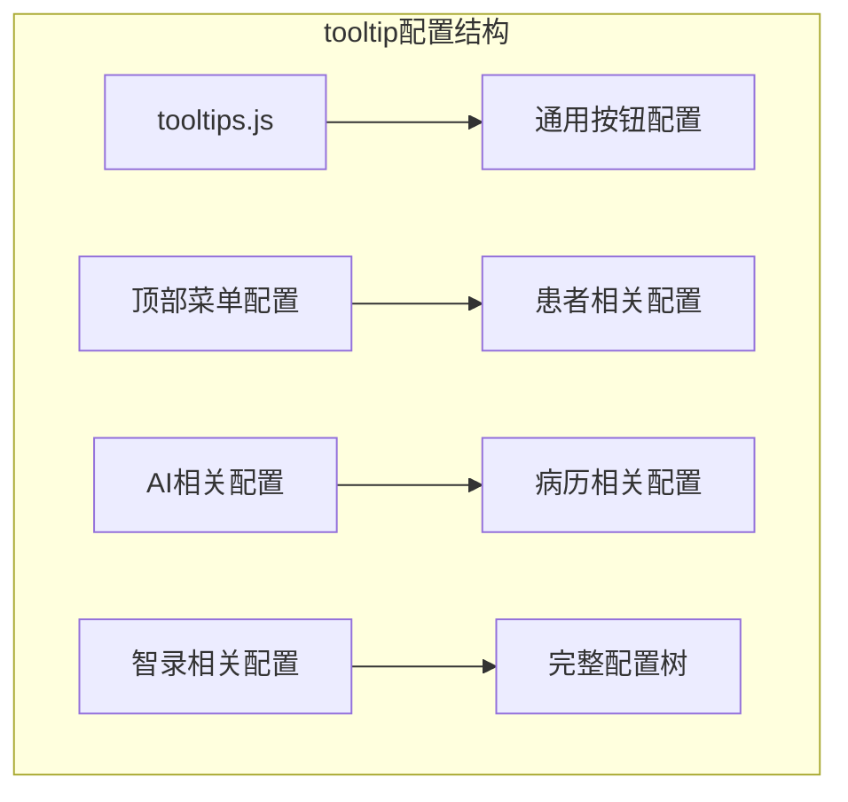

**图表来源**
- [tooltips.js:1-87](file://med_ai_assistant_1.0_bs_vue/src/data/tooltips.js#L1-L87)

### 各标签页tooltip内容

#### 基础信息标签页
- **tooltip内容**："患者基本信息"
- **用途**：提供患者基本信息的详细说明
- **显示位置**：底部悬停提示

#### 病情小结标签页
- **tooltip内容**："病情小结"
- **用途**：说明该标签页展示患者当前病情总结
- **显示位置**：底部悬停提示

#### AI诊断辅助标签页
- **tooltip内容**："AI诊断辅助"
- **用途**：详细介绍AI诊断辅助功能的作用
- **显示位置**：底部悬停提示

#### 临床指引标签页
- **tooltip内容**："临床指引"
- **用途**：说明临床指引的指导作用
- **显示位置**：底部悬停提示

#### 病历记录标签页
- **tooltip内容**："病历记录"
- **用途**：提供病历记录的详细说明
- **显示位置**：底部悬停提示

#### 长期医嘱标签页
- **tooltip内容**："长期医嘱"
- **用途**：说明长期医嘱的管理功能
- **显示位置**：底部悬停提示

#### 临时医嘱标签页
- **tooltip内容**："临时医嘱"
- **用途**：介绍临时医嘱的使用场景
- **显示位置**：底部悬停提示

#### 检查报告标签页
- **tooltip内容**："检查报告"
- **用途**：提供检查报告的详细说明
- **显示位置**：底部悬停提示

#### 化验检验标签页
- **tooltip内容**："化验检验"
- **用途**：说明化验检验结果的查看功能
- **显示位置**：底部悬停提示

#### DRG分析标签页
- **tooltip内容**："DRG数据分析"
- **用途**：介绍DRG分析的专业含义
- **显示位置**：底部悬停提示

**章节来源**
- [2026-04-23.md:5-16](file://med_ai_assistant_1.0_bs_vue/docs/更新日志/2026-04-23.md#L5-L16)
- [PatientTabs.vue:6-8](file://med_ai_assistant_1.0_bs_vue/src/components/patient/PatientTabs.vue#L6-L8)
- [PatientTabs.vue:14-16](file://med_ai_assistant_1.0_bs_vue/src/components/patient/PatientTabs.vue#L14-L16)
- [PatientTabs.vue:23-25](file://med_ai_assistant_1.0_bs_vue/src/components/patient/PatientTabs.vue#L23-L25)
- [PatientTabs.vue:32-34](file://med_ai_assistant_1.0_bs_vue/src/components/patient/PatientTabs.vue#L32-L34)
- [PatientTabs.vue:40-42](file://med_ai_assistant_1.0_bs_vue/src/components/patient/PatientTabs.vue#L40-L42)
- [PatientTabs.vue:48-50](file://med_ai_assistant_1.0_bs_vue/src/components/patient/PatientTabs.vue#L48-L50)
- [PatientTabs.vue:56-58](file://med_ai_assistant_1.0_bs_vue/src/components/patient/PatientTabs.vue#L56-L58)
- [PatientTabs.vue:64-66](file://med_ai_assistant_1.0_bs_vue/src/components/patient/PatientTabs.vue#L64-L66)
- [PatientTabs.vue:72-74](file://med_ai_assistant_1.0_bs_vue/src/components/patient/PatientTabs.vue#L72-L74)
- [PatientTabs.vue:80-82](file://med_ai_assistant_1.0_bs_vue/src/components/patient/PatientTabs.vue#L80-L82)

## DiagnosisEditPanel组件

### 组件架构

DiagnosisEditPanel组件提供了完整的诊断编辑功能，采用左右两栏布局设计：

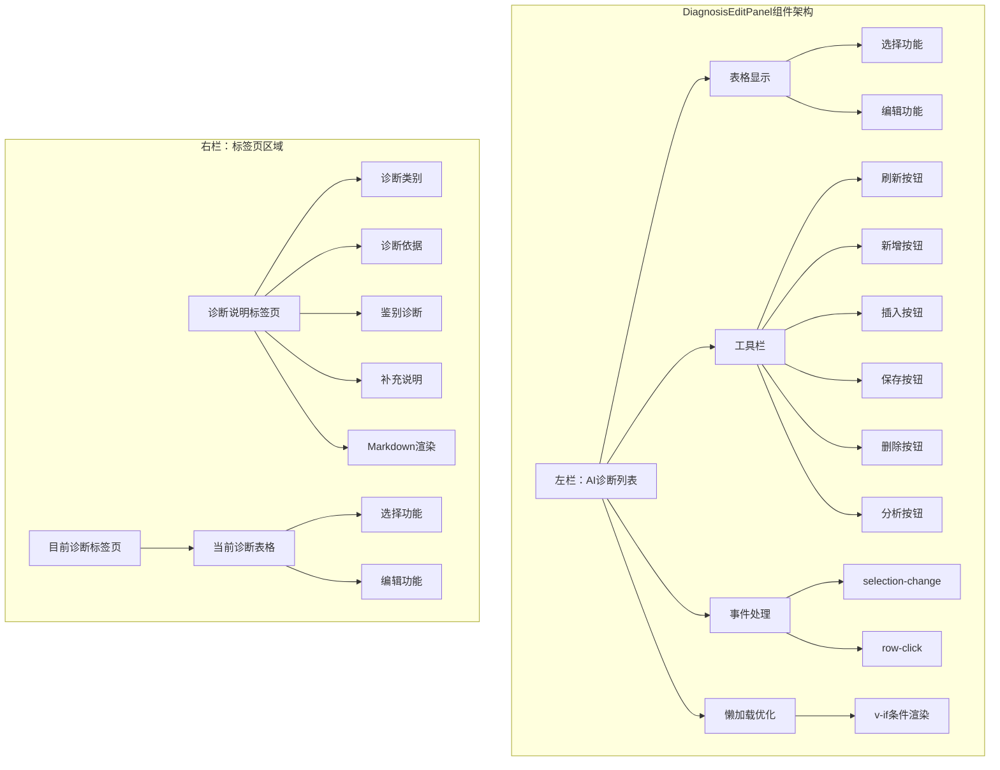

**图表来源**
- [DiagnosisEditPanel.vue:1-200](file://med_ai_assistant_1.0_bs_vue/src/components/ai/DiagnosisEditPanel.vue#L1-L200)

### 核心功能特性

#### 1. 左侧AI诊断列表
- **表格展示**：使用Element Plus表格组件展示AI诊断列表
- **选择功能**：支持多选和单选操作
- **编辑功能**：双击诊断名称进入编辑模式
- **状态指示**：高亮显示与当前诊断不同的诊断项

#### 2. 右侧标签页区域
- **诊断说明标签页**：显示诊断的详细信息，包括诊断类别、诊断依据、鉴别诊断、补充说明
- **目前诊断标签页**：管理患者的当前诊断列表
- **Markdown渲染**：使用marked库和DOMPurify进行安全的Markdown渲染

#### 3. 工具栏功能
- **刷新**：刷新AI诊断列表
- **新增**：新增空白诊断
- **插入**：将选中的AI诊断插入到目前诊断中
- **保存**：保存当前修改的目前诊断
- **删除**：删除目前诊断中选中的诊断
- **分析**：触发诊断分析

#### 4. 事件处理机制
- **selection-change**：监听表格选择变化
- **row-click**：处理表格行点击事件
- **blur**：处理输入框失焦事件
- **keyup.enter**：处理回车键事件

**章节来源**
- [DiagnosisEditPanel.vue:1-200](file://med_ai_assistant_1.0_bs_vue/src/components/ai/DiagnosisEditPanel.vue#L1-L200)

## 依赖关系分析

### 开发环境依赖

项目采用现代化的开发工具链，支持快速开发和部署：

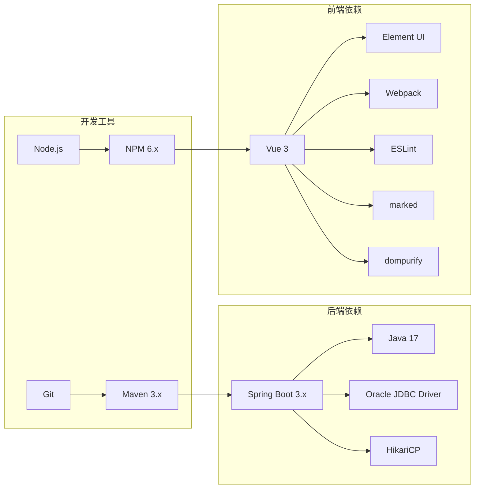

**图表来源**
- [用户操作手册.md:194-202](file://项目相关/软件著作权/用户操作手册.md#L194-L202)

### 系统启动流程

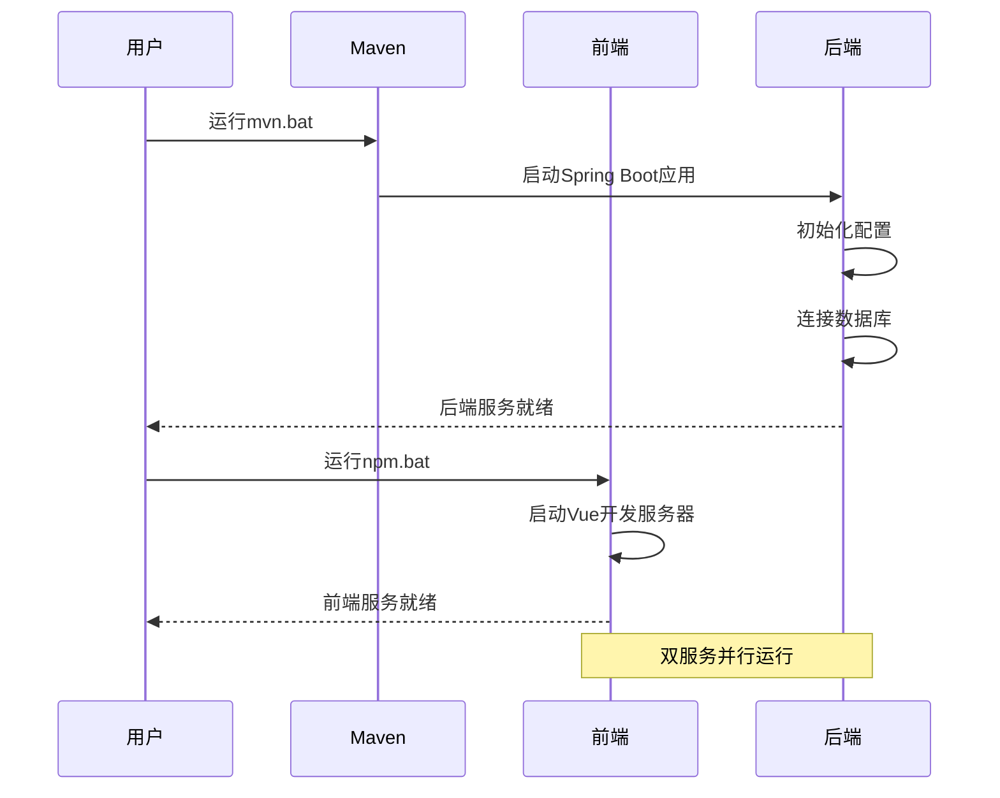

**图表来源**
- [mvn.bat:1-5](file://mvn.bat#L1-L5)
- [npm.bat:1-3](file://npm.bat#L1-L3)

## 性能考虑

### 数据库性能优化

系统采用多种策略优化数据库性能：

- **连接池优化**：HikariCP连接池配置最大连接数、最小空闲连接、连接超时等参数
- **批量操作**：Hibernate配置批量大小，支持批量插入和更新
- **查询优化**：启用二级缓存，优化查询性能
- **时区配置**：设置Asia/Shanghai时区，确保时间数据一致性

### AI服务性能

- **流式响应**：支持AI模型的流式响应，提升用户体验
- **重试机制**：配置最大重试次数和重试延迟，提高服务稳定性
- **超时配置**：合理设置连接超时和读取超时，平衡性能和可靠性

### 前端性能优化

- **懒加载机制**：AI诊断辅助标签页使用条件渲染，减少不必要的组件挂载
- **状态管理**：通过Vuex集中管理AI诊断数据，避免重复请求
- **组件复用**：诊断编辑面板在多个页面中复用，提升开发效率
- **tooltip优化**：统一配置管理，减少重复定义

### 数据库约束防护

- **长度截断**：通过truncateIfNeeded方法防止ORA-12899错误
- **序列同步**：定期检查和调整数据库序列，避免主键冲突
- **预防性编程**：在数据入库前进行长度验证和截断处理
- **自动检查服务**：通过SequenceConsistencyService自动检测和修复序列不同步问题

### TDD性能保障

- **测试覆盖率**：单元测试覆盖率≥80%，确保代码质量
- **性能基准**：建立算法性能指标和基准测试
- **持续集成**：自动化测试流水线确保代码库健康状态

## 故障排除指南

### 常见启动问题

**后端启动失败**
- 检查数据库连接配置
- 验证Oracle数据库服务状态
- 确认JDBC驱动版本兼容性

**前端启动失败**
- 检查Node.js版本要求
- 验证NPM依赖安装
- 确认端口占用情况

### AI服务问题

**模型连接失败**
- 检查AI服务API密钥配置
- 验证网络连通性
- 查看重试日志和超时设置

**分析结果异常**
- 确认Prompt模板配置
- 检查患者数据完整性
- 验证MCC/CC字典更新

### 数据库问题

**ORA-12899错误**
- 检查triggerDiagnosis字段长度
- 验证truncateIfNeeded方法调用
- 确认数据库VARCHAR2(500)限制

**ORA-00001唯一约束冲突**
- 检查相关表的序列同步状态
- 验证SequenceConsistencyService的检查结果
- 确认自动修复脚本的执行情况

**序列不同步问题**
- 运行create-identity-sequences.sql脚本
- 检查序列起始值调整
- 验证触发器创建状态

**新功能问题**

**AI诊断辅助标签页问题**
- 检查组件懒加载条件是否满足
- 验证Vuex状态数据是否正确
- 确认API接口调用是否成功

**tooltip功能问题**
- 检查tooltip配置文件是否存在
- 验证配置项是否正确引用
- 确认Element Plus版本兼容性

**诊断解析失败**
- 检查AI结果格式是否符合预期
- 验证解析函数是否正确调用
- 确认降级策略是否生效

**正则表达式问题**
- 检查extractSingleLineField函数的正则表达式
- 验证triggerDiagnosis字段的跨行捕获问题
- 确认诊断块解析的兼容性

**TDD测试问题**
- 检查测试环境配置
- 验证测试数据准备
- 确认测试覆盖率统计

## 结论

MedAiAssistant V1.0是一个功能完整、架构合理的医疗AI辅助诊疗系统。2026年4月23日的更新进一步增强了系统的实用性和用户体验。

### 主要优势
- **技术架构先进**：采用Spring Boot 3.x + Vue 3的现代化技术栈
- **功能模块完整**：涵盖AI辅助诊断、DRG分析、MCC/CC筛查等核心功能
- **数据安全可靠**：支持数据加密存储、访问权限控制、操作日志审计
- **部署灵活**：支持分布式部署，满足不同规模医疗机构需求
- **用户体验优化**：新增完整tooltip功能，提供详细的界面提示
- **诊断解析鲁棒性增强**：通过extractSingleLineField函数防止跨行误捕获
- **新增完整tooltip功能**：为所有标签页提供详细的悬停提示信息
- **新增AI诊断辅助标签页**：提供独立的AI诊断结果展示和编辑功能
- **懒加载机制优化**：通过条件渲染提升应用性能和用户体验
- **标签页重新排序**：按照医疗工作流程优化标签页排列顺序
- **统一配置管理**：通过tooltip.js实现tooltip功能的集中管理
- **组件复用设计**：通过诊断编辑面板实现功能模块化和代码复用
- **前端解析优化**：通过正则表达式修复解决triggerDiagnosis字段的跨行误捕获问题

### 新功能价值
- **完整tooltip功能**：为所有标签页提供详细的悬停提示信息
- **AI诊断辅助标签页**：提供独立的AI诊断结果展示和编辑功能
- **懒加载机制优化**：通过条件渲染提升应用性能和用户体验
- **标签页重新排序**：按照医疗工作流程优化标签页排列顺序
- **统一配置管理**：通过tooltip.js实现tooltip功能的集中管理
- **组件复用设计**：通过诊断编辑面板实现功能模块化和代码复用
- **前端解析优化**：通过extractSingleLineField函数解决正则表达式跨行问题

### 发展建议
- 持续优化AI模型集成，提升诊断准确性
- 扩展更多医疗场景的AI分析模板
- 加强与其他医疗信息系统的集成能力
- 完善监控和运维体系，提升系统稳定性
- 进一步优化前端组件的性能和用户体验
- 深化TDD实践，扩大测试覆盖范围
- 持续改进DRG分析算法，提升匹配精度和性能
- 扩展tooltip功能的应用范围，提升整体用户体验
- 建立更完善的数据库约束监控机制
- 定期审查和更新序列同步脚本
- 持续优化前端诊断解析算法，提升解析准确性和性能

## 附录

### 政策背景支持

项目积极响应国家"东数西算"工程和基层医疗AI建设政策，为医疗AI技术的规模化应用提供支撑：

- **算力基础设施**：支持国家一体化算力网的资源调度
- **数据安全保障**：符合医疗数据安全和隐私保护要求
- **技术标准对接**：与国家医疗信息化标准保持一致

### 版本更新记录

**2026年4月23日更新要点**
- 新增完整tooltip功能，为所有标签页提供悬停提示
- 新增AI诊断辅助标签页功能
- 实现PatientTabs组件的标签页重新排序
- 优化懒加载机制，提升应用性能
- 新增tooltip配置管理，实现统一的提示信息管理
- 完善诊断编辑面板的功能和交互设计
- 更新DRG分析页面的界面和展示逻辑
- **修复正则表达式跨行误捕获**：通过extractSingleLineField函数解决triggerDiagnosis字段解析问题
- **优化诊断解析算法**：通过双重解析策略提升解析准确性和兼容性

**章节来源**
- [2026-04-23.md:1-47](file://med_ai_assistant_1.0_bs_vue/docs/更新日志/2026-04-23.md#L1-L47)
- [diagnosisParser.js:157-219](file://med_ai_assistant_1.0_bs_vue/src/utils/diagnosisParser.js#L157-L219)
- [qcDiseaseMatchParser.js:65-72](file://med_ai_assistant_1.0_bs_vue/src/utils/qcDiseaseMatchParser.js#L65-L72)
- [AIDiagnosisTab.vue:167-177](file://med_ai_assistant_1.0_bs_vue/src/components/patient/AIDiagnosisTab.vue#L167-L177)