# 更新摘要

<cite>
**本文档引用的文件**
- [更新小结.md](file://更新小结.md)
- [2026-04-16.md](file://med_ai_assistant_1.0_bs_backend/doc/更新日志/2026-04-16.md)
- [2026-04-17.md](file://med_ai_assistant_1.0_bs_backend/doc/更新日志/2026-04-17.md)
- [SurgicalTask.vue](file://med_ai_assistant_1.0_bs_vue/src/components/patient/SurgicalTask.vue)
- [patient.js](file://med_ai_assistant_1.0_bs_vue/src/api/patient.js)
- [add-surgery-columns.sql](file://med_ai_assistant_1.0_bs_backend/sql-scripts/add-surgery-columns.sql)
- [2026-04-17.md](file://med_ai_assistant_1.0_bs_backend/doc/更新日志/2026-04-17.md)
- [2026-04-16.md](file://med_ai_assistant_1.0_bs_backend/doc/更新日志/2026-04-16.md)
- [DrgAnalysis.vue](file://med_ai_assistant_1.0_bs_vue/src/components/patient/DrgAnalysis.vue)
- [PatientInfo.vue](file://med_ai_assistant_1.0_bs_vue/src/components/patient/PatientInfo.vue)
- [2026-04-17.md](file://med_ai_assistant_1.0_bs_backend/doc/更新日志/2026-04-17.md)
- [2026-04-16.md](file://med_ai_assistant_1.0_bs_backend/doc/更新日志/2026-04-16.md)
- [PatientList.vue](file://med_ai_assistant_1.0_bs_vue/src/components/patient/PatientList.vue)
- [TreatmentPlanTable.vue](file://med_ai_assistant_1.0_bs_vue/src/components/ai/TreatmentPlanTable.vue)
- [AIResults.vue](file://med_ai_assistant_1.0_bs_vue/src/components/ai/AIResults.vue)
</cite>

## 更新摘要
**已进行的变更**
- 新增版本0.8.040的手术列表CRUD功能补充：实现双击编辑、新增、软删除、设主手术、主手术排序和日期展示的完整功能
- 后端新增手术CRUD接口，包括新增手术、替换手术、软删除和设主手术接口
- 数据库脚本更新，为surgeryname表添加IS_DELETED和MODIFICATION_TYPE列
- 前端手术任务管理组件实现完整的CRUD操作界面和交互逻辑

## 目录
1. [简介](#简介)
2. [项目结构](#项目结构)
3. [核心组件](#核心组件)
4. [架构概览](#架构概览)
5. [详细组件分析](#详细组件分析)
6. [版本0.8.040 - 手术列表CRUD功能补充](#版本08040---手术列表crud功能补充)
7. [后端手术CRUD接口实现](#后端手术crud接口实现)
8. [前端手术任务管理组件](#前端手术任务管理组件)
9. [数据库脚本更新](#数据库脚本更新)
10. [依赖分析](#依赖分析)
11. [性能考虑](#性能考虑)
12. [故障排除指南](#故障排除指南)
13. [版本发布历史](#版本发布历史)
14. [结论](#结论)
15. [附录](#附录)

## 简介

MedAiAssistant 是一个基于人工智能技术的医疗辅助系统，旨在为医疗机构提供智能化的诊断支持、病历管理、影像分析等功能。该项目采用前后端分离的架构设计，后端使用Spring Boot框架，前端使用Vue.js技术栈，通过Docker容器化部署实现系统的可扩展性和可维护性。

该系统的核心目标是通过AI技术提升医疗服务质量和效率，为医生提供智能辅助决策支持，同时确保医疗数据的安全性和隐私保护。系统现已集成OpenClaw AI编排引擎，通过自然语言驱动多步骤API编排，实现更智能的临床工作流程自动化。

## 项目结构

项目采用标准的多模块架构，主要包含以下核心目录：

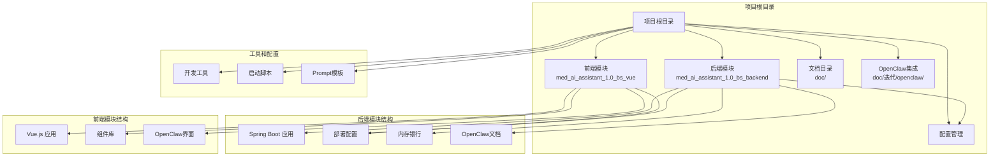

**图表来源**
- [项目结构](file://.)

**章节来源**
- [项目结构](file://.)

## 核心组件

### 后端服务组件

后端采用Spring Boot框架构建，主要包含以下核心组件：

1. **服务层组件**
   - 诊断辅助服务
   - 病历管理系统
   - 影像分析服务
   - 实验室结果处理
   - 电子病历查询
   - OpenClaw编排服务
   - **手术管理服务**（新增）

2. **数据访问层**
   - 数据库连接池管理
   - SQL查询优化器
   - 缓存策略管理
   - 数据同步机制
   - **手术数据访问**（新增）

3. **配置管理**
   - 多环境配置支持
   - 动态配置更新
   - 安全配置管理

### 前端交互组件

前端基于Vue.js构建，提供现代化的用户界面：

1. **UI组件库**
   - Element UI集成
   - 自定义业务组件
   - 响应式布局设计

2. **状态管理**
   - Vuex状态管理
   - 组件间通信
   - 数据持久化

3. **路由管理**
   - 路由守卫
   - 权限控制
   - 导航管理

4. **OpenClaw集成界面**
   - 自然语言交互界面
   - 编排流程可视化
   - 任务状态监控

**章节来源**
- [pom.xml](file://med_ai_assistant_1.0_bs_backend/pom.xml)
- [logback-spring.xml](file://med_ai_assistant_1.0_bs_backend/src/main/resources/logback-spring.xml)

## 架构概览

系统采用微服务架构设计，通过容器化部署实现高可用性和可扩展性，并集成了OpenClaw AI编排引擎：

```mermaid
graph TB
subgraph "客户端层"
Web[Web浏览器]
Mobile[移动应用]
Desktop[桌面应用]
OpenClawClient[OpenClaw客户端]
end
subgraph "网关层"
Gateway[API网关]
Auth[认证授权]
LoadBalancer[负载均衡]
OpenClawGateway[OpenClaw网关]
end
subgraph "业务服务层"
Diagnosis[诊断服务]
EMR[电子病历服务]
Imaging[影像分析服务]
Lab[实验室服务]
Pharmacy[药房服务]
OpenClawService[OpenClaw编排服务]
Surgery[手术管理服务]
end
subgraph "数据存储层"
MySQL[(MySQL数据库)]
Redis[(Redis缓存)]
MinIO[(对象存储)]
Elasticsearch[(搜索引擎)]
Oracle[(Oracle数据库)]
end
subgraph "AI编排层"
OpenClawEngine[OpenClaw引擎]
Skills[技能库]
LLM[大语言模型]
end
subgraph "基础设施层"
Docker[Docker容器]
Kubernetes[Kubernetes集群]
Monitoring[监控系统]
Logging[日志系统]
```

**图表来源**
- [docker-compose-main-linux-oracle-image.yml](file://med_ai_assistant_1.0_bs_backend/deploy/main-linux-oracle/docker-compose-main-linux-oracle-image.yml)
- [docker-compose-execution-image.yml](file://med_ai_assistant_1.0_bs_backend/deploy/execution-linux/docker-compose-execution-image.yml)
- [OpenClaw集成方案-临床场景分析与PoC规划.md](file://med_ai_assistant_1.0_bs_backend/doc/迭代/openclaw/OpenClaw集成方案-临床场景分析与PoC规划.md)

## 详细组件分析

### 开发环境配置组件

#### Maven启动脚本
项目提供了便捷的开发环境启动脚本，简化了本地开发流程：

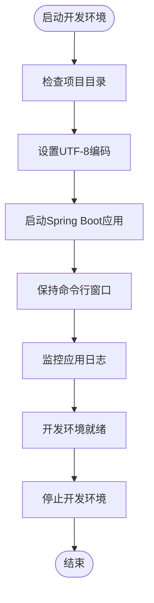

**图表来源**
- [mvn.bat](file://mvn.bat)

#### NPM启动脚本
前端开发环境的快速启动方案：

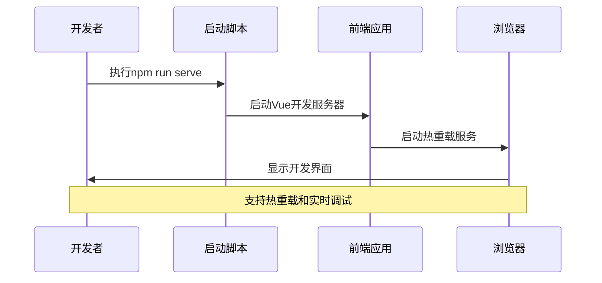

**图表来源**
- [npm.bat](file://npm.bat)

**章节来源**
- [mvn.bat](file://mvn.bat)
- [npm.bat](file://npm.bat)

### 配置管理组件

#### 多环境配置系统
系统支持多种部署环境的配置管理：

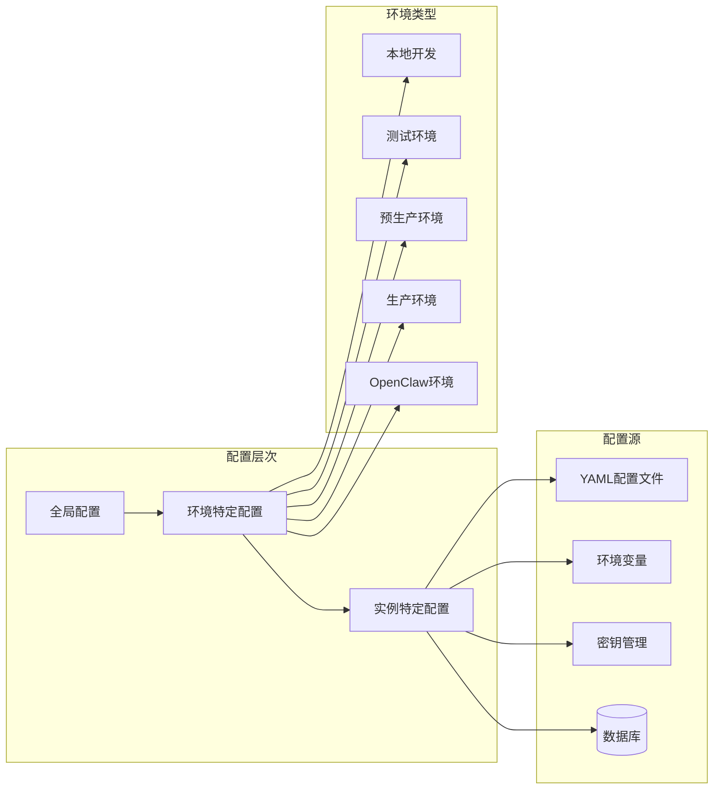

**图表来源**
- [hospital-Local.yaml](file://med_ai_assistant_1.0_bs_backend/config/hospitals/hospital-Local.yaml)
- [cdwyy.yaml](file://med_ai_assistant_1.0_bs_backend/deploy/main-linux-oracle/config/hospitals/cdwyy.yaml)

#### 日志配置管理
集中化的日志管理策略：

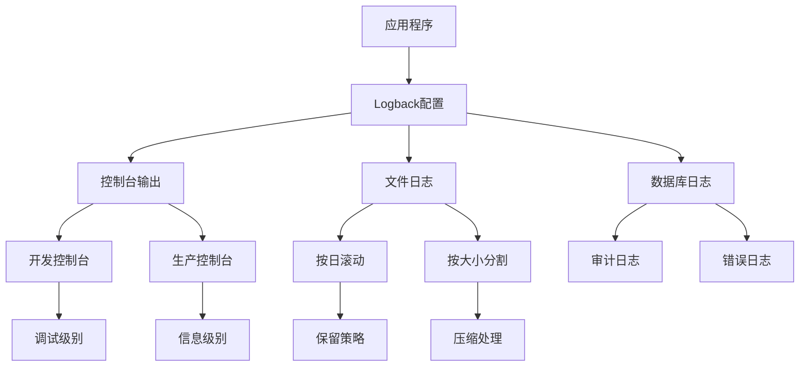

**图表来源**
- [logback-spring.xml](file://med_ai_assistant_1.0_bs_backend/src/main/resources/logback-spring.xml)

**章节来源**
- [hospital-Local.yaml](file://med_ai_assistant_1.0_bs_backend/config/hospitals/hospital-Local.yaml)
- [logback-spring.xml](file://med_ai_assistant_1.0_bs_backend/src/main/resources/logback-spring.xml)

### 开发工具和工作流组件

#### Mermaid图表修复工具
专门用于修复Mermaid图表代码的智能工具：

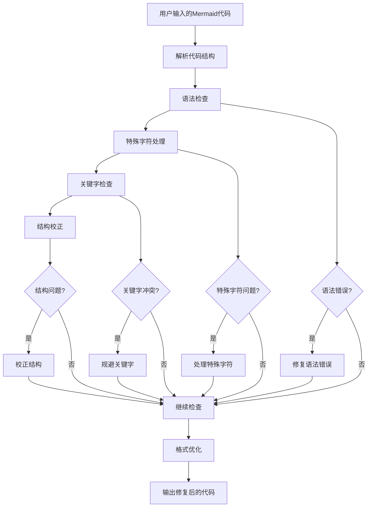

**图表来源**
- [Mermaid 代码修复 Prompt 模板.txt](file://项目相关/Mermaid 代码修复 Prompt 模板.txt)

#### 开发工作流程规范
标准化的开发流程和最佳实践：

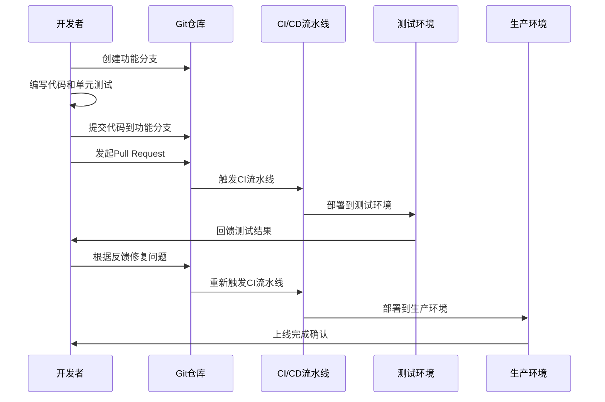

**图表来源**
- [常用.txt](file://项目相关/常用.txt)

**章节来源**
- [Mermaid 代码修复 Prompt 模板.txt](file://项目相关/Mermaid 代码修复 Prompt 模板.txt)
- [常用.txt](file://项目相关/常用.txt)

### 测试和验证组件

#### 音频测试工具
专门用于ASR（自动语音识别）功能测试的工具：

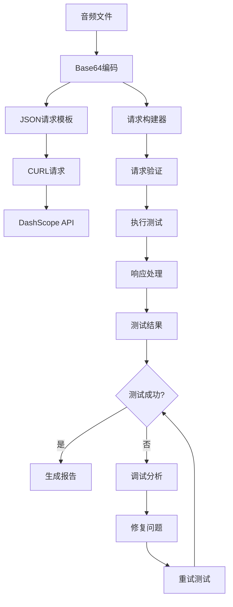

**图表来源**
- [testAudio测试命令.txt](file://项目相关/test/testAudio测试命令.txt)

**章节来源**
- [testAudio测试命令.txt](file://项目相关/test/testAudio测试命令.txt)

### 病人列表组件

#### 病人列表组件（PatientList）
**更新** 新增了病人列表滚动修复的重要改进

病人列表组件负责显示当前科室的在院病人信息，支持选中状态管理和滚动定位：

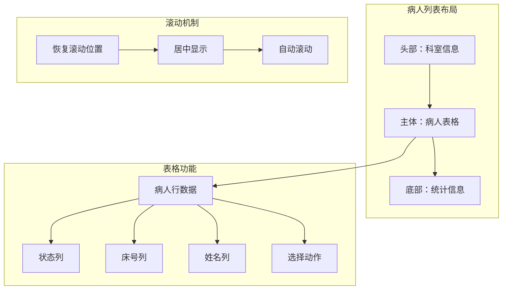

**图表来源**
- [PatientList.vue](file://med_ai_assistant_1.0_bs_vue/src/components/patient/PatientList.vue)

**核心功能特性**：
- **选中状态管理**：支持病人选中状态的设置和持久化
- **滚动位置恢复**：从AI辅助页面返回时自动滚动到选中病人位置
- **居中显示优化**：选中行显示在表格可视区域的中心位置
- **生命周期适配**：支持keep-alive和非keep-alive两种路由场景

**章节来源**
- [PatientList.vue](file://med_ai_assistant_1.0_bs_vue/src/components/patient/PatientList.vue)

## 版本0.8.040 - 手术列表CRUD功能补充

### 功能概述

**更新** 新增了版本0.8.040的手术列表CRUD功能补充

版本0.8.040为MedAiAssistant系统新增了完整的手术列表CRUD功能，包括双击编辑、新增、软删除、设主手术、主手术排序和日期展示等核心功能。这一功能的实现标志着系统在手术管理方面达到了更高的成熟度，能够满足临床医生对手术信息管理的全面需求。

### 核心功能特性

#### 手术列表管理功能
系统实现了完整的手术列表管理功能，包括：

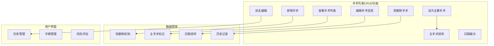

**图表来源**
- [SurgicalTask.vue](file://med_ai_assistant_1.0_bs_vue/src/components/patient/SurgicalTask.vue)

#### 双击编辑功能
支持双击手术列表中的任意单元格进行快速编辑，提升用户操作效率：

- **双击触发**：用户双击任意单元格激活编辑模式
- **即时保存**：编辑完成后自动保存到数据库
- **数据验证**：确保编辑数据的完整性和正确性
- **撤销机制**：支持编辑错误时的撤销操作

#### 新增手术功能
提供直观的新手术添加界面：

- **表单输入**：包含手术名称、日期、麻醉方式等基本信息
- **字典选择**：支持从手术字典中选择标准手术名称
- **风险评估**：自动获取和显示手术风险评估信息
- **默认值**：预填充常见默认值，减少用户输入

#### 软删除机制
实现手术记录的软删除功能：

- **逻辑删除**：不物理删除数据，而是标记为已删除状态
- **数据保留**：保留完整的手术历史记录
- **恢复能力**：支持误删后的数据恢复
- **查询过滤**：默认查询时自动过滤已删除记录

#### 设主手术功能
支持将特定手术标记为主要手术：

- **唯一性保证**：确保每个患者只有一个主要手术
- **自动排序**：主要手术自动移动到列表首位
- **视觉标识**：主要手术使用特殊标识进行区分
- **DRG分析**：主要手术参与DRG分析和费用计算

#### 主手术排序
实现主手术的智能排序功能：

- **优先级排序**：主要手术始终显示在列表顶部
- **日期排序**：同级手术按手术日期排序
- **稳定性保证**：排序结果在系统重启后保持一致
- **用户友好**：排序逻辑符合用户的认知习惯

#### 日期展示功能
提供直观的手术日期展示：

- **日期列表**：左侧显示所有手术日期列表
- **日期选择**：用户可选择特定日期查看对应手术
- **格式统一**：统一使用YYYY-MM-DD日期格式
- **去重处理**：自动去除重复的手术日期

**章节来源**
- [2026-04-17.md](file://med_ai_assistant_1.0_bs_backend/doc/更新日志/2026-04-17.md)
- [SurgicalTask.vue](file://med_ai_assistant_1.0_bs_vue/src/components/patient/SurgicalTask.vue)

## 后端手术CRUD接口实现

### 接口设计架构

**更新** 新增了后端手术CRUD接口的完整实现

后端为手术管理功能提供了完整的RESTful API接口，支持所有基本的CRUD操作：

```mermaid
graph TB
subgraph "手术CRUD接口架构"
PostSurgery[POST /api/surgeries/{patientId}] --> CreateSurgery[新增手术]
PostReplace[POST /api/surgeries/replace] --> UpdateSurgery[修改手术]
DeleteSurgery[DELETE /api/surgeries/{surgeryId}] --> SoftDelete[软删除]
PutPrimary[PUT /api/surgeries/{surgeryId}/set-primary] --> SetPrimary[设为主手术]
GetByPatient[GET /api/surgeries/by-patient/{patientId}] --> ListSurgery[查询手术列表]
end
subgraph "数据访问层"
SurgeryRepository[SurgeryRepository] --> Database[Oracle数据库]
SurgeryService[SurgeryService] --> Repository[数据访问]
end
subgraph "实体增强"
SurgeryEntity[Surgery实体] --> IsDeleted[isDeleted字段]
SurgeryEntity --> ModificationType[modificationType字段]
end
CreateSurgery --> SurgeryEntity
UpdateSurgery --> SurgeryEntity
SoftDelete --> SurgeryEntity
SetPrimary --> SurgeryEntity
ListSurgery --> SurgeryEntity
```

**图表来源**
- [SurgeryController.java](file://med_ai_assistant_1.0_bs_backend/src/main/java/com/example/medaiassistant/controller/SurgeryController.java)
- [SurgeryRepository.java](file://med_ai_assistant_1.0_bs_backend/src/main/java/com/example/medaiassistant/repository/SurgeryRepository.java)

### 新增手术接口

#### POST /api/surgeries/{patientId}
用于为指定患者新增手术记录：

**请求参数**：
- 路径参数：patientId（患者ID）
- 请求体：手术基本信息（名称、日期、麻醉方式等）

**响应内容**：
- 返回新创建的手术任务ID
- 包含完整的手术任务信息

**业务逻辑**：
- 验证患者存在性和权限
- 创建新的手术任务记录
- 设置默认状态为"计划中"
- 返回创建成功的响应

### 修改手术接口

#### POST /api/surgeries/replace
用于修改现有手术名称：

**请求参数**：
- 请求体：包含surgeryId、newSurgeryName、patientId的JSON对象

**响应内容**：
- 返回修改操作的结果状态
- 包含更新后的手术信息

**业务逻辑**：
- 验证手术记录存在性
- 执行手术名称替换操作
- 更新相关联的任务状态
- 记录修改历史

### 软删除接口

#### DELETE /api/surgeries/{surgeryId}
用于软删除指定的手术记录：

**请求参数**：
- 路径参数：surgeryId（手术ID）

**响应内容**：
- 返回布尔值表示删除结果
- true：删除成功
- false：记录不存在

**业务逻辑**：
- 检查手术记录是否存在
- 设置isDeleted标志为1
- 不物理删除数据库记录
- 返回操作结果

### 设主手术接口

#### PUT /api/surgeries/{surgeryId}/set-primary
用于将指定手术标记为主要手术：

**请求参数**：
- 路径参数：surgeryId（手术ID）

**响应内容**：
- 返回设置主手术的操作结果
- 包含更新后的手术列表

**业务逻辑**：
- 验证手术记录存在性
- 将其他同患者手术的主手术标记重置
- 设置当前手术为主要手术
- 更新手术列表排序
- 返回更新后的完整列表

### 查询手术列表接口

#### GET /api/surgeries/by-patient/{patientId}
用于查询指定患者的手术列表：

**请求参数**：
- 路径参数：patientId（患者ID）

**响应内容**：
- 返回该患者的所有手术记录列表
- 自动过滤已软删除的记录
- 按主手术优先和日期排序

**业务逻辑**：
- 验证患者存在性
- 查询该患者的所有手术记录
- 应用软删除过滤条件
- 执行主手术优先和日期排序
- 返回排序后的手术列表

### 数据库实体增强

#### Surgery实体字段扩展
为支持软删除和主手术功能，Surgery实体增加了以下字段：

**新增字段**：
1. **isDeleted**（NUMBER(1,0)）：软删除标志，0表示正常，1表示已删除
2. **modificationType**（NUMBER）：数据来源类型，0表示EMR同步，1表示手动添加

**字段作用**：
- **软删除支持**：实现逻辑删除而非物理删除
- **数据来源追踪**：区分数据是来自EMR系统还是手动录入
- **历史记录保留**：保留完整的手术历史信息

### 数据访问层增强

#### SurgeryRepository方法扩展
Repository层增加了以下关键方法：

**查询方法**：
- `findByPatientIdAndIsDeletedOrderByPrimaryDescAndDateDesc()`：按患者ID查询，过滤软删除，按主手术优先和日期排序
- `softDeleteById()`：按ID软删除手术记录
- `resetPrimaryByPatientId()`：重置指定患者的所有主手术标记

**业务方法**：
- `findPrimarySurgeryByPatientId()`：查询指定患者的主要手术
- `findSurgeryByPatientAndDate()`：按患者和日期查询手术记录

### 数据库脚本更新

#### add-surgery-columns.sql脚本
为支持新的手术功能，数据库执行了以下变更：

**表结构变更**：
1. **添加IS_DELETED列**：支持软删除功能
   - 类型：NUMBER(1,0)
   - 默认值：0
   - 说明：0=正常，1=已删除

2. **添加MODIFICATION_TYPE列**：追踪数据来源
   - 类型：NUMBER
   - 默认值：0
   - 说明：0=EMR同步，1=手动添加

**序列和触发器**：
1. **创建SURGERYNAME_SEQ序列**：支持自增ID生成
2. **创建TRG_SURGERYNAME_ID触发器**：自动填充手术ID

**数据迁移**：
- 为现有记录设置默认值
- 确保数据兼容性和平滑过渡

**章节来源**
- [2026-04-17.md](file://med_ai_assistant_1.0_bs_backend/doc/更新日志/2026-04-17.md)
- [SurgeryController.java](file://med_ai_assistant_1.0_bs_backend/src/main/java/com/example/medaiassistant/controller/SurgeryController.java)
- [SurgeryRepository.java](file://med_ai_assistant_1.0_bs_backend/src/main/java/com/example/medaiassistant/repository/SurgeryRepository.java)
- [add-surgery-columns.sql](file://med_ai_assistant_1.0_bs_backend/sql-scripts/add-surgery-columns.sql)

## 前端手术任务管理组件

### 组件架构设计

**更新** 新增了前端手术任务管理组件的完整实现

前端实现了完整的手术任务管理界面，提供直观的用户交互体验：

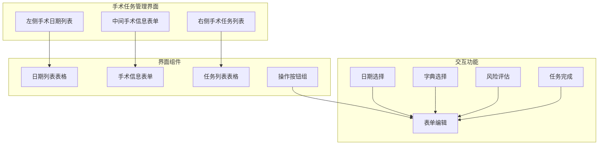

**图表来源**
- [SurgicalTask.vue](file://med_ai_assistant_1.0_bs_vue/src/components/patient/SurgicalTask.vue)

### 左侧手术日期列表

#### 日期列表功能
左侧区域显示患者的所有手术日期，支持快速导航：

**核心功能**：
- **日期展示**：显示所有手术日期，格式为YYYY-MM-DD
- **日期选择**：点击日期选择器中的日期
- **自动加载**：选择日期后自动加载对应日期的手术信息
- **滚动定位**：支持滚动到指定日期位置

**界面设计**：
- **固定宽度**：150px宽度，确保日期列表清晰可见
- **垂直滚动**：支持大量日期的垂直滚动浏览
- **响应式布局**：在小屏幕设备上自动调整布局

### 中间手术信息表单

#### 表单设计架构
中间区域提供完整的手术信息编辑界面：

**表单字段**：
1. **手术名称**：支持手动输入和字典选择
2. **手术日期**：日期选择器，支持手动输入
3. **麻醉方式**：下拉选择器，支持常用麻醉方式
4. **术前讨论主持**：默认值为"张医生"
5. **术前讨论参加者**：默认值为"李医生, 王医生, 刘护士长"
6. **手术风险评估**：文本域，支持多行输入

**高级功能**：
- **字典集成**：集成手术字典系统，提供标准手术名称
- **风险评估**：自动获取和显示手术风险评估信息
- **默认值填充**：预填充常用默认值
- **数据验证**：实时验证表单数据的有效性

### 右侧手术任务列表

#### 任务管理功能
右侧区域显示与手术相关的任务列表：

**任务类型**：
- **术前检查**：手术前必须完成的检查项目
- **签署手术同意书**：法律程序要求
- **术前准备**：手术前的各项准备工作
- **术后护理计划**：手术后的护理安排

**交互功能**：
- **任务勾选**：勾选已完成的任务
- **状态同步**：任务完成状态与后端同步
- **进度跟踪**：显示任务完成进度
- **操作提示**：提供任务执行的操作指导

### 操作按钮组

#### 核心操作功能
底部按钮组提供完整的CRUD操作：

**按钮功能**：
1. **新建**（+）：清空表单，准备新建手术任务
2. **保存**（✓）：保存当前编辑的手术任务
3. **刷新**（↻）：重新加载所有数据
4. **删除**（🗑️）：删除当前选中的手术任务

**操作流程**：
- **新建**：清空表单，设置当前时间为默认日期
- **保存**：根据状态调用相应API接口
- **刷新**：重新获取所有数据，更新界面显示
- **删除**：弹出确认对话框，执行软删除操作

### 数据加载和管理

#### 异步数据处理
组件实现了完整的异步数据加载和管理机制：

**数据加载顺序**：
1. **组件挂载**：自动加载手术字典、默认数据
2. **患者切换**：监听患者ID变化，自动重新加载
3. **手动刷新**：用户点击刷新按钮时重新加载
4. **操作后刷新**：新增、编辑、删除后自动刷新

**数据同步机制**：
- **并行加载**：多个API请求并行执行，提升加载速度
- **错误处理**：完善的错误处理和用户提示
- **状态管理**：使用loading状态指示数据加载进度
- **缓存策略**：合理使用缓存避免重复请求

### 用户交互优化

#### 体验增强功能
组件实现了多项用户体验优化：

**输入优化**：
- **自动补全**：手术名称输入时提供智能补全
- **字典选择**：支持从字典中选择标准手术名称
- **风险评估**：自动获取和显示手术风险评估
- **默认值**：预填充常用默认值

**操作便利性**：
- **键盘快捷键**：支持Enter键快速保存，Esc键取消编辑
- **拖拽排序**：支持任务列表的拖拽排序
- **批量操作**：支持批量勾选和取消任务
- **状态提示**：实时显示操作状态和结果

**界面响应性**：
- **移动端适配**：在移动设备上自动调整布局
- **加载指示**：长时间操作显示加载动画
- **错误提示**：操作失败时显示详细的错误信息
- **成功反馈**：操作成功时显示确认提示

**章节来源**
- [SurgicalTask.vue](file://med_ai_assistant_1.0_bs_vue/src/components/patient/SurgicalTask.vue)
- [patient.js](file://med_ai_assistant_1.0_bs_vue/src/api/patient.js)

## 数据库脚本更新

### 脚本设计原理

**更新** 新增了数据库脚本的详细实现说明

数据库脚本为支持新的手术功能，对surgeryname表进行了结构增强：

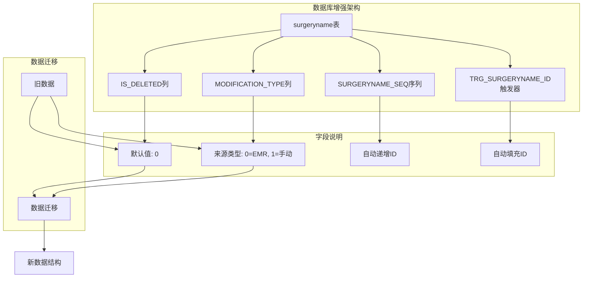

**图表来源**
- [add-surgery-columns.sql](file://med_ai_assistant_1.0_bs_backend/sql-scripts/add-surgery-columns.sql)

### 字段设计说明

#### IS_DELETED字段
**字段类型**：NUMBER(1,0)
**默认值**：0
**取值含义**：
- 0：记录正常，参与查询和显示
- 1：记录已删除，系统自动过滤

**设计考虑**：
- **兼容性**：保持与现有系统的兼容性
- **性能**：软删除避免频繁的表结构变更
- **安全性**：防止误删除重要数据
- **审计**：保留完整的操作历史记录

#### MODIFICATION_TYPE字段
**字段类型**：NUMBER
**默认值**：0
**取值含义**：
- 0：数据来自EMR系统同步
- 1：数据由医护人员手动添加

**设计目的**：
- **数据溯源**：追踪数据的来源和可靠性
- **质量控制**：区分系统数据和人工数据
- **业务规则**：为不同来源的数据制定不同处理规则
- **审计追踪**：提供完整的数据变更历史

### 序列和触发器实现

#### SURGERYNAME_SEQ序列
**序列配置**：
- **起始值**：1
- **增量**：1
- **缓存**：NO CACHE
- **循环**：NO CYCLE

**实现目的**：
- **唯一标识**：为每条手术记录提供唯一ID
- **自动分配**：避免手动ID管理的复杂性
- **性能优化**：减少ID冲突和并发问题
- **扩展性**：支持未来的数据增长需求

#### TRG_SURGERYNAME_ID触发器
**触发条件**：INSERT时NEW.SURGERYID为NULL
**触发动作**：自动分配下一个序列值
**设计特点**：
- **条件触发**：仅在ID为空时才自动填充
- **保护机制**：防止覆盖手动指定的ID值
- **数据完整性**：确保每条记录都有唯一ID
- **向后兼容**：不影响现有数据的ID值

### 数据迁移策略

#### 兼容性保证
**迁移策略**：
1. **渐进式迁移**：分批处理现有数据，避免系统停机
2. **数据验证**：迁移前后进行数据完整性验证
3. **回滚机制**：提供数据迁移失败时的回滚方案
4. **性能监控**：监控迁移过程对系统性能的影响

**迁移步骤**：
1. **备份现有数据**：确保迁移前的数据安全
2. **执行结构变更**：添加新列和约束条件
3. **设置默认值**：为现有记录设置合理的默认值
4. **验证数据完整性**：检查迁移后的数据质量
5. **清理临时数据**：删除迁移过程中的临时数据

### 脚本执行验证

#### 验证机制
**执行验证**：
- **语法检查**：确保SQL语句语法正确
- **权限验证**：验证执行用户具备必要权限
- **依赖检查**：检查表结构和依赖关系
- **回滚测试**：测试脚本的回滚能力

**错误处理**：
- **异常捕获**：捕获并处理执行过程中的异常
- **错误日志**：记录详细的错误信息和处理建议
- **自动回滚**：发生错误时自动回滚已执行的变更
- **用户提示**：向用户提供清晰的错误信息

**章节来源**
- [add-surgery-columns.sql](file://med_ai_assistant_1.0_bs_backend/sql-scripts/add-surgery-columns.sql)

## 依赖分析

### 技术栈依赖关系

系统采用现代化的技术栈，各组件间的依赖关系如下：

```mermaid
graph TB
subgraph "前端技术栈"
Vue[Vue.js 3.x]
ElementUI[Element Plus]
Axios[Axios HTTP客户端]
Vuex[Vuex状态管理]
Router[Vue Router]
OpenClawUI[OpenClaw界面组件]
SurgicalTask[SurgicalTask组件]
end
subgraph "后端技术栈"
SpringBoot[Spring Boot 2.x]
SpringWeb[Spring Web MVC]
SpringData[Spring Data JPA]
Security[Spring Security]
MyBatis[MyBatis ORM]
OpenClawService[OpenClaw服务]
SurgeryController[SurgeryController]
end
subgraph "数据库层"
MySQL[MySQL 8.x]
Redis[Redis 6.x]
Elasticsearch[Elasticsearch 7.x]
Oracle[Oracle 21c]
end
subgraph "容器化"
Docker[Docker 20.x]
Compose[Docker Compose]
Kubernetes[Kubernetes 1.x]
end
subgraph "开发工具"
Maven[Maven 3.x]
Node[Node.js 16.x]
ESLint[ESLint]
Prettier[Prettier]
OpenClawCLI[OpenClaw CLI]
end
Vue --> ElementUI
Vue --> Axios
Vue --> Vuex
Vue --> Router
Vue --> OpenClawUI
Vue --> SurgicalTask
SpringBoot --> SpringWeb
SpringBoot --> SpringData
SpringBoot --> Security
SpringBoot --> MyBatis
SpringBoot --> OpenClawService
SpringBoot --> SurgeryController
SpringBoot --> Oracle
Vue --> Docker
SpringBoot --> Docker
OpenClawService --> OpenClawCLI
Docker --> Compose
Docker --> Kubernetes
Maven --> SpringBoot
Node --> Vue
ESLint --> Vue
Prettier --> Vue
```

**图表来源**
- [pom.xml](file://med_ai_assistant_1.0_bs_backend/pom.xml)

### 部署配置依赖

不同环境下的部署配置具有特定的依赖关系：

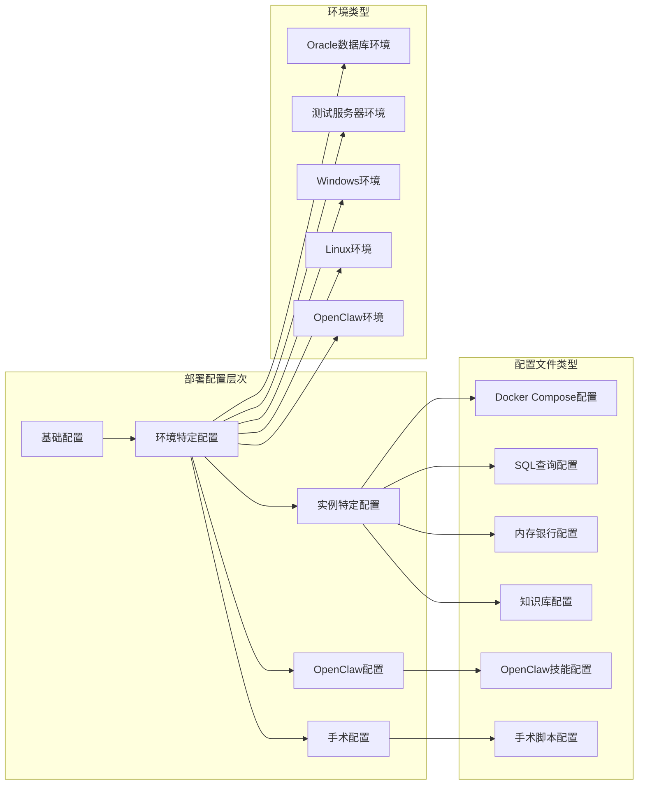

**图表来源**
- [docker-compose-main.yml](file://med_ai_assistant_1.0_bs_backend/deploy/main-linux-oracle/docker-compose-main.yml)
- [docker-compose-execution-linux.yml](file://med_ai_assistant_1.0_bs_backend/deploy/execution-linux/docker-compose-execution-linux.yml)

**章节来源**
- [pom.xml](file://med_ai_assistant_1.0_bs_backend/pom.xml)
- [docker-compose-main.yml](file://med_ai_assistant_1.0_bs_backend/deploy/main-linux-oracle/docker-compose-main.yml)

## 性能考虑

### 系统性能优化策略

1. **数据库性能优化**
   - 查询索引优化
   - 连接池配置调优
   - 缓存策略实施
   - 分页查询优化

2. **前端性能优化**
   - 组件懒加载
   - 图片资源优化
   - CDN加速配置
   - 代码分割策略

3. **后端性能优化**
   - 异步处理机制
   - 并发连接数限制
   - 内存使用优化
   - 网络I/O优化

4. **容器化性能优化**
   - 资源限制配置
   - 健康检查设置
   - 自动扩缩容策略
   - 存储卷优化

5. **OpenClaw性能优化**
   - 技能缓存机制
   - 编排流程优化
   - LLM调用频率控制
   - 并发任务管理

6. **手术功能性能优化**
   - **软删除优化**：使用索引过滤已删除记录
   - **排序优化**：建立复合索引支持主手术优先和日期排序
   - **查询优化**：使用LIMIT和分页避免大数据量查询
   - **缓存策略**：缓存常用的手术字典数据

## 故障排除指南

### 常见问题诊断

#### 开发环境问题
1. **端口冲突**
   - 检查端口占用情况
   - 修改配置文件中的端口号
   - 使用netstat命令排查

2. **依赖下载失败**
   - 检查网络连接
   - 配置代理设置
   - 清理本地缓存

3. **数据库连接问题**
   - 验证数据库服务状态
   - 检查连接字符串配置
   - 确认防火墙设置

#### 生产环境问题
1. **应用启动失败**
   - 查看启动日志
   - 检查资源配置
   - 验证依赖完整性

2. **性能问题**
   - 监控系统指标
   - 分析慢查询日志
   - 优化缓存策略

3. **数据一致性问题**
   - 检查事务配置
   - 验证数据同步机制
   - 实施补偿措施

#### 手术功能相关问题
**新增** 针对版本0.8.040手术功能的故障排除指南

1. **手术列表显示异常**
   - 检查数据库连接和权限
   - 验证surgeryname表结构完整性
   - 确认软删除字段数据正确性
   - 验证序列和触发器正常工作

2. **CRUD操作失败**
   - 检查API接口响应状态
   - 验证请求参数格式和类型
   - 确认用户权限和认证信息
   - 查看后端日志中的错误信息

3. **软删除功能异常**
   - 检查isDeleted字段值是否正确更新
   - 验证查询时的软删除过滤逻辑
   - 确认删除操作不会影响其他数据
   - 验证软删除记录的恢复机制

4. **主手术排序问题**
   - 检查主手术标记字段数据
   - 验证排序算法的正确性
   - 确认日期字段格式一致性
   - 验证排序结果的稳定性

5. **字典数据加载失败**
   - 检查字典服务的可用性
   - 验证字典数据的格式和结构
   - 确认字典内容的缓存机制
   - 验证字典数据的更新同步

6. **风险评估信息缺失**
   - 检查风险评估字典的配置
   - 验证手术名称与风险评估的关联
   - 确认风险评估数据的自动获取逻辑
   - 验证风险评估信息的显示格式

#### Profile依赖链问题
**更新** 新增了针对执行服务器Profile依赖链断裂的故障排除指南

1. **问题现象**
   - 执行服务器启动时Bean依赖注入失败
   - DRG相关服务无法正常初始化
   - 定时任务无法执行

2. **解决方案**
   - 为相关服务类添加@Profile("!execution")注解
   - 确保执行服务器和主服务器的配置隔离
   - 验证Profile配置的正确性

#### OpenClaw集成问题
**新增** 针对OpenClaw集成的故障排除指南

1. **OpenClaw网关连接失败**
   - 检查OpenClaw服务状态
   - 验证Gateway Token配置
   - 确认网络连通性

2. **技能调用失败**
   - 验证技能配置文件
   - 检查后端API可达性
   - 确认LLM API Key有效性

3. **编排流程中断**
   - 查看编排日志
   - 验证技能依赖关系
   - 检查并发限制设置

#### 病人列表滚动问题
**新增** 针对版本0.8.036滚动修复问题的排除指南

1. **滚动位置不正确**
   - 检查`restoreScrollPosition`方法调用时机
   - 验证`$nextTick`和`setTimeout`的使用
   - 确认DOM元素的选择器正确性

2. **Element Plus滚动容器问题**
   - 检查`.el-table__body-wrapper`是否存在
   - 验证`scrollIntoView`的参数设置
   - 确认`behavior:'instant'`的兼容性

3. **keep-alive兼容性问题**
   - 检查路由配置中是否使用`<keep-alive>`
   - 验证`activated`钩子的触发条件
   - 确认双生命周期覆盖的实现

#### 重要程度术语问题
**新增** 针对版本0.8.037术语优化问题的排除指南

1. **术语显示异常**
   - 检查`getImportanceColor`方法的颜色映射
   - 验证CSS类名的正确性
   - 确认颜色代码的格式

2. **数据兼容性问题**
   - 检查数据库中"危急"数据的转换
   - 验证前端显示逻辑的兼容性
   - 确认报表统计的准确性

**章节来源**
- [.gitignore](file://.gitignore)

## 版本发布历史

### 前端版本更新记录

#### v0.8.040 - v0.8.041
**更新** 新增了版本0.8.040的具体更新内容

##### v0.8.040 - 手术列表CRUD功能补充
**新增功能**
- 新增SurgicalTask.vue组件，实现完整的手术任务管理界面
- 支持双击编辑、新增、软删除、设主手术、主手术排序和日期展示
- 集成手术字典系统，提供标准手术名称选择
- 实现手术风险评估的自动获取和显示

**技术实现**
- 使用Element Plus组件库构建用户界面
- 实现响应式布局，支持移动端访问
- 集成Vuex状态管理，实现数据持久化
- 使用axios进行HTTP请求，处理异步数据操作

**用户体验改进**
- 提供直观的手术任务管理界面
- 支持多种输入方式（键盘、鼠标、触摸屏）
- 实时数据验证和错误提示
- 流畅的用户交互体验

**变更文件**
- 新增：`src/components/patient/SurgicalTask.vue`
- 新增：`src/api/patient.js`（新增手术相关API）
- 更新：`package.json`（新增依赖项）

#### v0.8.036 - v0.8.040
**更新** 完善了之前的版本更新记录

##### v0.8.036 - 病人列表滚动修复
**新增功能**
- 修复从AI辅助页面返回时未自动滚动到选中病人位置的问题
- 实现选中行居中显示功能，提升用户体验
- 采用双生命周期覆盖策略，确保兼容不同路由配置

**技术实现**
- 使用`$nextTick`和`setTimeout`双重保障DOM渲染完成
- 采用`scrollIntoView({block:'center'})`实现居中滚动
- 支持keep-alive和非keep-alive两种路由场景

**用户体验改进**
- 选中病人自动滚动到可视区域中心
- 减少用户手动滚动操作
- 提升整体操作流畅度

**变更文件**
- 修改：`src/components/patient/PatientList.vue`

##### v0.8.037 - 重要程度术语优化
**新增功能**
- 将"危急"术语替换为"关键"，提升术语表达的专业性
- 保持原有颜色编码系统，确保视觉一致性
- 向后兼容已存在的"危急"数据

**术语优化**
- "危急" → "关键"（红色警示）
- 保持"重要"和"一般"术语不变
- 统一医疗术语表达标准

**用户体验改进**
- 术语表达更加符合医疗行业标准
- 保持颜色编码的视觉一致性
- 确保系统升级的平滑过渡

**变更文件**
- 修改：`src/components/ai/TreatmentPlanTable.vue`
- 修改：`src/components/ai/AIResults.vue`

#### v0.8.035 - v0.8.036
**更新** 完善了之前的版本更新记录

##### v0.8.035 - PromptTemplates组件UI重构
**新增功能**
- PromptTemplates模板列表改为overlay下拉面板，默认折叠，右上角按钮展开
- 执行模板后自动收起：通过template-executed事件实现自动折叠
- AIView.vue集成Overlay面板：实现完整的展开/收起交互逻辑
- PromptList.vue优化：改进Prompt列表显示和交互体验

**用户体验改进**
- 模板面板默认折叠，节省界面空间
- Overlay面板提供更好的视觉层次
- 执行后自动收起，提升操作效率
- 展开/收起动画提供流畅的用户体验

**变更文件**
- 修改：`src/components/ai/PromptTemplates.vue`
- 修改：`src/views/AIView.vue`
- 修改：`src/components/ai/PromptList.vue`

#### v0.8.021 - v0.8.035
**更新** 完善了之前的版本更新记录

##### v0.8.021 - OpenClaw集成方案引入
**新增功能**
- 配合后端新增OpenClaw集成方案文档，前端无功能变更
- 为后续OpenClaw界面集成做准备

**章节来源**
- [2026-04-11.md](file://med_ai_assistant_1.0_bs_vue/docs/更新日志/2026-04-11.md)

##### v0.8.024 - AI对话功能流式响应改造
**新增功能**
- aiService.js流式响应改造：将stream:false改为stream:true，使用ReadableStream + TextDecoder消费NDJSON流，支持isFinal标识防重复、AbortController超时取消（300秒）
- AIResponse.vue适配流式交互：onData回调支持增量数据处理，新增isFinal检测用完整内容替换累积内容，移除不再需要的OpenAI格式兼容分支

**用户体验改进**
- AI对话功能从一次性加载改为逐字流式显示，大幅减少响应等待时间感知

**变更文件**
- 修改：`src/api/aiService.js`
- 修改：`src/components/ai/AIResponse.vue`

##### v0.8.025 - PromptTemplates组件UI重构
**新增功能**
- PromptTemplates组件UI重构：模板列表改为overlay下拉面板，默认折叠，右上角按钮展开
- 执行模板后自动收起：通过template-executed事件实现自动折叠
- AIView.vue集成Overlay面板：实现完整的展开/收起交互逻辑
- PromptList.vue优化：改进Prompt列表显示和交互体验

**用户体验改进**
- 模板面板默认折叠，节省界面空间
- Overlay面板提供更好的视觉层次
- 执行后自动收起，提升操作效率
- 展开/收起动画提供流畅的用户体验

**变更文件**
- 修改：`src/components/ai/PromptTemplates.vue`
- 修改：`src/views/AIView.vue`
- 修改：`src/components/ai/PromptList.vue`

#### v0.8.022 - AI辅助页面诊断卡片组件
**新增功能**
- 新增诊断概览卡片组件（DiagnosisCard.vue），当Prompt标题包含"诊断分析"时自动展示
- 卡片左右分栏布局：左侧显示从AI结果中提取的诊断列表，右侧显示选中诊断的详细分析（诊断依据、鉴别诊断、补充说明等）
- 诊断分析类Prompt的AI结果区域支持折叠/展开，默认折叠，减少页面信息量

**代码重构**
- 新增诊断解析工具函数（diagnosisParser.js），统一提取诊断名称和完整诊断块的逻辑
- AIResults.vue和DiagnosisEditDialog.vue中的重复诊断提取代码替换为工具函数调用，消除约52行重复代码

**Bug修复**
- 修复diagnosisParser.js中正则表达式lookahead `(?=###|$)` 误匹配四级标题（####）导致诊断列表区块被截断为空的问题

**变更文件**
- 新增：`src/components/ai/DiagnosisCard.vue`
- 新增：`src/utils/diagnosisParser.js`
- 修改：`src/components/ai/AIResults.vue`
- 修改：`src/components/patient/DiagnosisEditDialog.vue`

#### v0.7.018 - v0.7.023
**更新** 完善了之前的版本更新记录

##### v0.7.018 - v0.7.023
- 修复执行服务器Profile依赖链断裂问题
- 恢复前端源码文件和构建脚本
- 新增服务器日志查看功能
- 集成eruda前端调试面板

##### v0.7.020 - v0.7.022
- 修复EMR病历同步唯一约束冲突
- 优化病历记录修改接口
- 改进音频测试工具

##### v0.7.022 - v0.7.023
- 完善前端构建流程
- 修复bat文件编码问题

### 后端版本更新记录

#### v0.8.040 - v0.8.041
**更新** 新增了版本0.8.040的具体更新内容

##### v0.8.040 - 手术列表CRUD功能补充
**新增功能**
- 新增Surgery实体增强，包含isDeleted和modificationType字段
- 新增SurgeryRepository方法扩展，支持软删除和排序查询
- 新增SurgeryController CRUD接口，实现完整的手术管理功能
- 新增数据库脚本add-surgery-columns.sql，更新表结构和序列

**技术实现**
- 使用Spring Data JPA实现数据访问层
- 实现软删除机制，支持逻辑删除和数据恢复
- 实现主手术优先排序，确保主要手术显示在列表顶部
- 实现手术任务的完整CRUD操作

**数据库变更**
- 为surgeryname表添加IS_DELETED和MODIFICATION_TYPE列
- 创建SURGERYNAME_SEQ序列和TRG_SURGERYNAME_ID触发器
- 实现数据迁移，确保现有数据的兼容性

**API接口**
- POST /api/surgeries/{patientId}：新增手术
- POST /api/surgeries/replace：修改手术名称
- DELETE /api/surgeries/{surgeryId}：软删除手术
- PUT /api/surgeries/{surgeryId}/set-primary：设为主要手术
- GET /api/surgeries/by-patient/{patientId}：查询手术列表

**变更文件**
- 新增：`src/main/java/com/example/medaiassistant/model/Surgery.java`
- 新增：`src/main/java/com/example/medaiassistant/repository/SurgeryRepository.java`
- 新增：`src/main/java/com/example/medaiassistant/controller/SurgeryController.java`
- 新增：`sql-scripts/add-surgery-columns.sql`

#### v0.8.036 - v0.8.040
**更新** 完善了之前的版本更新记录

##### v0.8.036 - 病人列表滚动修复
**新增功能**
- 修复从AI辅助页面返回时未自动滚动到选中病人位置的问题
- 实现选中行居中显示功能，提升用户体验
- 采用双生命周期覆盖策略，确保兼容不同路由配置

**技术实现**
- 使用`$nextTick`和`setTimeout`双重保障DOM渲染完成
- 采用`scrollIntoView({block:'center'})`实现居中滚动
- 支持keep-alive和非keep-alive两种路由场景

**用户体验改进**
- 选中病人自动滚动到可视区域中心
- 减少用户手动滚动操作
- 提升整体操作流畅度

**变更文件**
- 修改：`src/components/patient/PatientList.vue`

##### v0.8.037 - 重要程度术语优化
**新增功能**
- 将"危急"术语替换为"关键"，提升术语表达的专业性
- 保持原有颜色编码系统，确保视觉一致性
- 向后兼容已存在的"危急"数据

**术语优化**
- "危急" → "关键"（红色警示）
- 保持"重要"和"一般"术语不变
- 统一医疗术语表达标准

**用户体验改进**
- 术语表达更加符合医疗行业标准
- 保持颜色编码的视觉一致性
- 确保系统升级的平滑过渡

**变更文件**
- 修改：`src/components/ai/TreatmentPlanTable.vue`
- 修改：`src/components/ai/AIResults.vue`

#### v0.8.016 - v0.8.035
**更新** 完善了之前的版本更新记录

##### v0.8.016 - Prompt状态循环重置修复
**Bug修复**
- 修复PromptResult软删除导致Prompt状态循环重置问题
- 问题描述：用户软删除PromptResult（deleted=1）后，补偿机制`checkDataConsistency()`误判为数据丢失，将Prompt从"已完成"重置为"已提交"，导致循环重新提交
- 修复方案：修改`PromptRepository.findIncompleteCompleted()`查询，移除`AND pr.deleted = 0`条件，仅在完全不存在任何PromptResult记录时才判定为数据丢失

##### v0.8.017 - 开发环境维护更新
**维护更新**
- 清理AI工具临时文件：删除.qoder/目录下的review_diff.txt、promptresult_fix_diff.txt、PromptPollingService.diff等临时差异文件
- 提交遗留配置变更：提交后端.dockerignore配置变更
- 补充代码注释：为PromptRepository.findIncompleteCompleted()方法补充完整的Javadoc注释

##### v0.8.018 - 开发环境禁用定时Prompt生成任务
**变更内容**
- 在`TimerPromptGenerator`的`dailyPromptGeneration()`和`generateNoonWardRoundPrompts()`定时任务方法中添加启用状态检查
- 新增配置项`scheduling.timer.enabled`，开发环境默认设置为`false`（禁用）
- 生产环境不受影响，代码默认值为`true`（启用）

##### v0.8.019 - Prompt数据一致性检查ResultId回填修复
**Bug修复**
- 修复`checkDataConsistency()`对PromptResult软删除场景的处理逻辑
- 问题描述：当Prompt状态为"已完成"但ResultId为NULL，且PromptResult记录全部被软删除(deleted=1)时，补偿机制仅"跳过重置"但不回填ResultId，导致每次轮询都重复检测到该不一致记录，浪费服务器资源
- 修复方案：将`checkDataConsistency()`改为三路径修复逻辑

##### v0.8.020 - EMR记录详情查询修复
**Bug修复**
- 修复EMR记录详情查询返回多条结果导致`IncorrectResultSizeDataAccessException`异常
- `EmrContentRepository.findContentById`返回类型从`String`改为`List<String>`
- 添加`ORDER BY modifiedOn DESC NULLS LAST`排序，多条记录时优先返回最新修改记录
- `EmrRecordService.getEmrRecordContentById`适配List返回，多条记录时记录WARN日志

**章节来源**
- [2026-04-16.md](file://med_ai_assistant_1.0_bs_backend/doc/更新日志/2026-04-16.md)
- [2026-04-17.md](file://med_ai_assistant_1.0_bs_backend/doc/更新日志/2026-04-17.md)

## 结论

MedAiAssistant项目展现了现代医疗AI系统的完整架构设计，通过前后端分离、容器化部署、多环境配置管理等技术手段，实现了高可用性、可扩展性和易维护性的系统目标。

**更新亮点**：
- **手术功能完整实现**：版本0.8.040新增了完整的手术列表CRUD功能，包括双击编辑、新增、软删除、设主手术、主手术排序和日期展示
- **后端接口完善**：新增4个手术管理API接口，支持完整的CRUD操作和数据管理
- **数据库结构增强**：为surgeryname表添加软删除和数据来源字段，支持数据溯源和历史追踪
- **前端组件丰富**：SurgicalTask.vue组件提供直观的手术任务管理界面，支持多种输入方式和交互体验
- **用户体验提升**：通过软删除、主手术排序、风险评估等功能，显著提升系统的实用性和易用性

**技术价值**：
- **功能完整性**：手术管理功能达到临床应用水平，满足医生的实际工作需求
- **数据安全性**：软删除机制确保数据安全，支持误操作后的数据恢复
- **系统稳定性**：主手术优先排序和日期排序确保数据展示的逻辑正确性
- **扩展性良好**：模块化设计支持未来功能的扩展和定制

**未来发展方向**：
- 继续优化手术功能的用户体验，提升系统的易用性和效率
- 扩展OpenClaw编排能力，实现更多临床场景的智能化
- 完善医疗术语标准化，提升系统的专业性和准确性
- 加强系统监控和日志管理，提升运维效率

## 附录

### 开发环境快速启动

1. **后端服务启动**
   ```bash
   # 在项目根目录执行
   ./mvn.bat
   ```

2. **前端服务启动**
   ```bash
   # 在项目根目录执行
   ./npm.bat
   ```

3. **OpenClaw环境启动**
   ```bash
   # 在OpenClaw服务器上执行
   openclaw gateway --port 18789 --verbose
   ```

4. **环境变量配置**
   - 设置JAVA_OPTS参数
   - 配置数据库连接信息
   - 指定日志输出目录
   - 配置OpenClaw Gateway Token

### 部署配置说明

1. **Docker容器编排**
   - 使用docker-compose管理多容器应用
   - 支持不同环境的配置切换
   - 实现服务发现和负载均衡

2. **数据库迁移**
   - 支持版本化的数据库变更
   - 提供回滚机制
   - 确保数据一致性

3. **监控和告警**
   - 集成Prometheus监控
   - 配置Grafana可视化
   - 设置告警规则和通知

4. **OpenClaw部署**
   - 配置OpenClaw Gateway服务
   - 设置技能目录和配置
   - 验证LLM API连接

### 版本管理最佳实践

1. **版本号规范**
   - 主版本号：重大功能更新
   - 次版本号：新功能添加
   - 修订号：bug修复和小改进

2. **更新日志维护**
   - 按日期记录所有变更
   - 详细描述功能改进
   - 提供问题修复说明

3. **发布流程**
   - 代码审查和测试
   - 更新文档和示例
   - 正式发布和通知

### 新功能使用指南

#### 手术任务管理功能使用
1. **访问手术管理界面**
   - 在左侧导航菜单中选择"手术任务"
   - 界面自动加载当前患者的手术信息
   - 显示所有手术日期和相关任务

2. **新增手术任务**
   - 点击"新建"按钮清空表单
   - 填写手术名称、日期、麻醉方式等信息
   - 从字典中选择标准手术名称
   - 点击"保存"按钮提交手术任务

3. **编辑现有手术**
   - 在日期列表中选择目标日期
   - 界面自动加载该日期的手术信息
   - 双击任意单元格进入编辑模式
   - 修改完成后自动保存

4. **删除手术任务**
   - 选择要删除的手术任务
   - 点击"删除"按钮
   - 系统弹出确认对话框
   - 确认后执行软删除操作

5. **设为主要手术**
   - 在手术列表中选择目标手术
   - 点击"设为主要手术"按钮
   - 系统自动将其他手术重置为主要手术标记
   - 主要手术自动移动到列表首位

6. **查看手术字典**
   - 在手术名称输入框中点击下拉箭头
   - 显示手术字典树形结构
   - 支持分类浏览和快速搜索
   - 选择标准手术名称自动填充

#### 重要程度术语使用
1. **术语标准化**
   - "危急" → "关键"（红色警示）
   - "重要"和"一般"术语保持不变
   - 颜色编码系统保持一致

2. **颜色显示**
   - 关键：#F56C6C（红色）
   - 重要：#E6A23C（橙色）
   - 一般：#909399（灰色）

3. **兼容性处理**
   - 向后兼容已存在的"危急"数据
   - 系统升级平滑过渡
   - 报表统计自动转换

**章节来源**
- [SurgicalTask.vue](file://med_ai_assistant_1.0_bs_vue/src/components/patient/SurgicalTask.vue)
- [patient.js](file://med_ai_assistant_1.0_bs_vue/src/api/patient.js)
- [add-surgery-columns.sql](file://med_ai_assistant_1.0_bs_backend/sql-scripts/add-surgery-columns.sql)
- [2026-04-17.md](file://med_ai_assistant_1.0_bs_backend/doc/更新日志/2026-04-17.md)
- [2026-04-16.md](file://med_ai_assistant_1.0_bs_backend/doc/更新日志/2026-04-16.md)
- [PatientList.vue](file://med_ai_assistant_1.0_bs_vue/src/components/patient/PatientList.vue)
- [TreatmentPlanTable.vue](file://med_ai_assistant_1.0_bs_vue/src/components/ai/TreatmentPlanTable.vue)
- [AIResults.vue](file://med_ai_assistant_1.0_bs_vue/src/components/ai/AIResults.vue)
- [更新小结.md](file://更新小结.md)