# Vue 组件文档

<cite>
**本文档引用的文件**
- [ServerLogViewer.vue](file://med_ai_assistant_1.0_bs_vue/src/components/ServerLogViewer.vue)
- [TopMenu.vue](file://med_ai_assistant_1.0_bs_vue/src/components/TopMenu.vue)
- [UserLookup.vue](file://med_ai_assistant_1.0_bs_vue/src/components/UserLookup.vue)
- [AIResults.vue](file://med_ai_assistant_1.0_bs_vue/src/components/ai/AIResults.vue)
- [DiagnosisEditPanel.vue](file://med_ai_assistant_1.0_bs_vue/src/components/ai/DiagnosisEditPanel.vue)
- [DiagnosisCard.vue](file://med_ai_assistant_1.0_bs_vue/src/components/ai/DiagnosisCard.vue)
- [PromptExecutor.vue](file://med_ai_assistant_1.0_bs_vue/src/components/server/PromptExecutor.vue)
- [PatientSummary.vue](file://med_ai_assistant_1.0_bs_vue/src/components/patient/PatientSummary.vue)
- [PatientTabs.vue](file://med_ai_assistant_1.0_bs_vue/src/components/patient/PatientTabs.vue)
- [PatientView.vue](file://med_ai_assistant_1.0_bs_vue/src/views/PatientView.vue)
- [PromptTemplates.vue](file://med_ai_assistant_1.0_bs_vue/src/components/ai/PromptTemplates.vue)
- [AIView.vue](file://med_ai_assistant_1.0_bs_vue/src/views/AIView.vue)
- [DrgAnalysis.vue](file://med_ai_assistant_1.0_bs_vue/src/components/patient/DrgAnalysis.vue)
- [TreatmentPlanTable.vue](file://med_ai_assistant_1.0_bs_vue/src/components/ai/TreatmentPlanTable.vue)
- [qc.js](file://med_ai_assistant_1.0_bs_vue/src/api/qc.js)
- [drg.js](file://med_ai_assistant_1.0_bs_vue/src/api/drg.js)
- [promptUtils.js](file://med_ai_assistant_1.0_bs_vue/src/utils/promptUtils.js)
- [diagnosisParser.js](file://med_ai_assistant_1.0_bs_vue/src/utils/diagnosisParser.js)
- [voiceTextProcessor.js](file://med_ai_assistant_1.0_bs_vue/src/utils/voiceTextProcessor.js)
- [treatmentPlanParser.js](file://med_ai_assistant_1.0_bs_vue/src/utils/treatmentPlanParser.js)
- [aiService.js](file://med_ai_assistant_1.0_bs_vue/src/api/aiService.js)
- [ai.js](file://med_ai_assistant_1.0_bs_vue/src/api/ai.js)
- [main.js](file://med_ai_assistant_1.0_bs_vue/src/main.js)
- [App.vue](file://med_ai_assistant_1.0_bs_vue/src/App.vue)
- [router/index.js](file://med_ai_assistant_1.0_bs_vue/src/router/index.js)
- [store/modules/ai.js](file://med_ai_assistant_1.0_bs_vue/src/store/modules/ai.js)
- [store/modules/user.js](file://med_ai_assistant_1.0_bs_vue/src/store/modules/user.js)
- [package.json](file://med_ai_assistant_1.0_bs_vue/package.json)
</cite>

## 更新摘要
**所做更改**
- 新增治疗计划表格组件的重大UI优化：操作列从3个按钮精简为「待办」+「更多」下拉菜单
- 新增选中文字处理机制：AIResults组件支持智能文本选择和去换行符复制功能
- 新增QC质量控制API集成：完整的病种匹配、确认、评估结果查询等QC功能接口
- 更新项目版本至0.9.007，反映最新的组件优化和功能增强
- 新增治疗计划Markdown解析工具函数，支持标准4列表格解析和去标记处理
- 新增QC评估结果API，支持按病种和状态筛选的质控指标评估查询

## 目录
1. [简介](#简介)
2. [项目结构](#项目结构)
3. [核心组件](#核心组件)
4. [架构概览](#架构概览)
5. [详细组件分析](#详细组件分析)
6. [治疗计划表格UI优化](#治疗计划表格ui优化)
7. [选中文字处理机制](#选中文字处理机制)
8. [QC质量控制集成](#qc质量控制集成)
9. [诊断编辑与卡片组件优化](#诊断编辑与卡片组件优化)
10. [DRG分析结果显示逻辑优化](#drg分析结果显示逻辑优化)
11. [PromptTemplates组件重大UI重构](#prompttemplates组件重大ui重构)
12. [依赖分析](#依赖分析)
13. [性能考虑](#性能考虑)
14. [故障排除指南](#故障排除指南)
15. [结论](#结论)

## 简介

这是一个基于 Vue 3 的医疗AI助手前端应用，提供了完整的组件化架构和丰富的功能特性。该应用采用现代化的前端技术栈，包括 Vue 3、Element Plus、Vuex 状态管理和 Vue Router 路由系统。最新版本（0.9.007）增强了AI结果处理能力、轮询服务稳定性，并新增了治疗计划表格UI优化、选中文字处理机制、QC质量控制集成等前端功能增强，显著提升了用户体验和医疗信息管理能力。

**更新** 项目版本已升级至0.9.007，反映了版本0.9.007的增强功能，包括治疗计划表格操作列的精简优化、AI结果的智能文本选择和复制功能、完整的QC质量控制API集成，以及新增的treatmentPlanParser.js结构化治疗计划信息提取工具。

## 项目结构

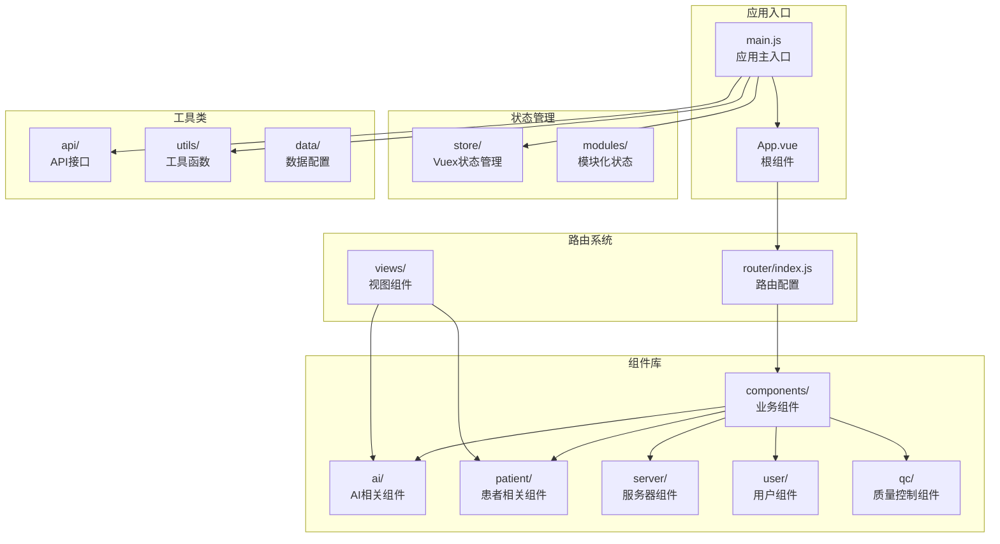

**图表来源**
- [main.js:1-267](file://med_ai_assistant_1.0_bs_vue/src/main.js#L1-L267)
- [router/index.js:1-118](file://med_ai_assistant_1.0_bs_vue/src/router/index.js#L1-L118)

**章节来源**
- [main.js:1-267](file://med_ai_assistant_1.0_bs_vue/src/main.js#L1-L267)
- [package.json:1-56](file://med_ai_assistant_1.0_bs_vue/package.json#L1-L56)

## 核心组件

### 服务器日志查看器组件

ServerLogViewer 是一个功能强大的日志查看组件，支持静态和实时两种模式：

**主要功能特性：**
- 多日志文件选择和切换
- 关键字过滤搜索
- 行数自定义显示（100-1000行）
- 实时追踪（SSE连接）
- 日志级别高亮显示
- 自动滚底和手动滚动控制

**技术实现亮点：**
- 使用 Vue 3 Composition API
- 支持响应式设计
- 内存防护机制（最多保留2000行日志）
- 深色主题适配

### 顶部导航菜单组件

TopMenu 提供了完整的应用导航功能：

**导航功能：**
- 病人管理：列表、筛选、刷新
- AI辅助：进入AI诊断、待办事项
- 设置管理：用户信息、模板管理、服务器维护
- 系统功能：全屏模式、小屏模式、退出登录
- 帮助系统：帮助文档、反馈、关于

**高级特性：**
- 响应式布局适配
- 权限控制（管理员功能）
- 全屏模式支持
- 小屏设备优化

### 用户查询组件

UserLookup 提供用户信息查询功能：

**功能特点：**
- 基于用户ID的实时查询
- 弹窗显示用户信息
- 错误处理和用户反馈

### AI结果组件

AIResults 是AI诊断结果展示的核心组件，经过重大功能增强：

**主要功能特性：**
- AI诊断结果的显示和编辑
- **智能文本选择和复制**（版本0.9.007）
- 诊断内容的添加、编辑和删除
- Prompt详情查看和管理
- 思维过程折叠显示（<thinking>标签）
- Markdown增强渲染支持
- 诊断分析类Prompt的折叠显示（展开/折叠按钮）

**新增功能亮点：**
- **智能文本处理**：自动去除换行符和空白字符
- **剪贴板集成**：一键复制处理后的文本
- **用户友好提示**：操作反馈和错误处理
- **诊断分析折叠**：针对诊断分析类型的AI结果提供专门的折叠显示功能
- **选中文字处理**：支持用户选中文本后进行智能处理和复制

**选中文字处理系统：**


**图表来源**
- [AIResults.vue:650-699](file://med_ai_assistant_1.0_bs_vue/src/components/ai/AIResults.vue#L650-L699)

### 治疗计划表格组件

**新增** TreatmentPlanTable 是治疗计划管理的核心组件，经过重大UI优化：

**主要功能特性：**
- 从Markdown解析或已保存数据加载治疗计划项
- 支持行内编辑项目描述、注意事项、重要程度
- 支持软删除（灰显+划线）和恢复删除
- 支持批量保存到后端
- 未保存修改提醒
- **操作列精简**：从3个按钮精简为「待办」+「更多」下拉菜单

**UI优化亮点：**
- **操作列优化**：将原来的3个独立按钮整合为「待办」和「更多」下拉菜单
- **布局重构**：采用更简洁的布局设计，提升用户体验
- **交互优化**：通过下拉菜单提供更多的操作选项，同时保持界面简洁

**章节来源**
- [TreatmentPlanTable.vue:1-267](file://med_ai_assistant_1.0_bs_vue/src/components/ai/TreatmentPlanTable.vue#L1-L267)

### 诊断编辑面板组件

**新增** DiagnosisEditPanel 提供了完整的诊断编辑功能，采用左右两栏布局设计：

**主要功能特性：**
- 左右两栏布局：左侧AI诊断列表，右侧标签页区域
- AI诊断管理：支持选择、编辑、新增、删除诊断
- 诊断详情查看：支持诊断类别、诊断依据、鉴别诊断、补充说明的详细查看
- 目前诊断管理：支持编辑、保存、删除当前诊断
- 思维过程显示：支持<thinking>标签的折叠显示
- 滚动优化：左右两栏均支持垂直滚动

**布局优化亮点：**
- 弹性布局：使用Flexbox实现左右两栏的自适应布局
- 滚动区域：左侧诊断列表和右侧标签页内容区域均支持独立滚动
- 响应式设计：支持不同屏幕尺寸的自适应显示
- 工具栏集成：底部工具栏提供统一的操作入口

**章节来源**
- [DiagnosisEditPanel.vue:1-716](file://med_ai_assistant_1.0_bs_vue/src/components/ai/DiagnosisEditPanel.vue#L1-L716)

### 诊断卡片组件

**新增** DiagnosisCard 提供了卡片式的诊断展示和编辑功能：

**主要功能特性：**
- 卡片布局：采用Element Plus卡片组件的左右两栏设计
- 诊断列表：左侧显示诊断列表，支持点击选择
- 标签页详情：右侧标签页显示诊断详情和目前诊断
- 思维过程显示：支持<thinking>标签的折叠显示
- 滚动优化：诊断列表区域支持垂直滚动
- 状态高亮：支持选中状态的视觉反馈

**布局重构亮点：**
- 卡片样式：使用Element Plus的border-card类型，提供更好的视觉层次
- 滚动区域：诊断列表区域设置最大高度（60vh），超出部分自动滚动
- 工具栏位置：工具栏位于诊断列表下方，便于操作
- 标签页集成：右侧标签页支持诊断说明和目前诊断两个选项卡

**章节来源**
- [DiagnosisCard.vue:1-644](file://med_ai_assistant_1.0_bs_vue/src/components/ai/DiagnosisCard.vue#L1-L644)

### QC质量控制API

**新增** qc.js 提供了完整的质量控制（QC）评估API模块：

**主要功能特性：**
- 病种匹配与确认：支持AI自动匹配病种并进行确认
- 诊断变更检测：自动检测患者诊断变更并触发重新分析
- 质控指标评估：查询患者质控指标评估结果
- 重新分析触发：支持对指定患者进行质控评估重新分析
- 指标配置管理：获取质控指标配置列表

**API接口亮点：**
- **病种匹配**：getDiseaseMatch、triggerDiseaseMatch、confirmDiseaseMatch
- **忽略管理**：ignoreDiseaseMatch、restoreDiseaseMatch、getIgnoredDiseases
- **评估查询**：getAssessmentResults、getIndicatorDetails、reanalyzeAssessment
- **指标配置**：getIndicatorConfigs、getDiseaseConfigs

**章节来源**
- [qc.js:1-424](file://med_ai_assistant_1.0_bs_vue/src/api/qc.js#L1-L424)

### 轮询服务组件

PromptExecutor 提供了完整的Prompt轮询服务管理功能：

**服务管理特性：**
- 轮询服务的启用和禁用
- 服务状态实时监控
- 自动恢复机制
- 错误处理和重试逻辑

**技术实现亮点：**
- 增强的错误处理（版本0.7.031）
- 自动恢复机制
- 详细的状态跟踪
- 用户友好的操作反馈

### 患者病情小结组件

**更新** PatientSummary 是患者信息管理的核心组件，经过重大功能增强：

**主要功能特性：**
- 住院时长自动计算（入院日期到当前日期）
- 颜色编码状态显示（病危、病重、普通）
- 待办事项集成显示（最近2条）
- 增强的Markdown渲染支持
- 思维过程折叠显示
- 多层次内容来源优先级

**新增功能亮点：**
- 住院时长计算：自动计算患者住院天数，显示入院日期和住院时长
- 颜色编码状态：根据患者状态自动应用颜色编码（红色：病危，橙色：病重，绿色：普通）
- 待办事项集成：从后端API获取患者待办事项，支持智能内容清理
- Markdown增强渲染：支持<thinking>标签的折叠显示，提供思维过程透明度
- 颜色标识系统：自动高亮异常值（红色）、正常值（绿色）、待处理项（橙色）

**内容来源优先级：**
1. 新API获取的最新病情小结内容
2. AI生成的病情小结、查房记录或入院记录总结
3. 患者基本信息中的病情摘要

### 流式文本处理组件

**新增** voiceTextProcessor 提供了完整的语音识别文本流式处理功能：

**主要功能特性：**
- 语音识别文本的LLM整理
- 流式处理支持（实时返回生成内容）
- 结构化内容解析（修改后记录、修改原因）
- 统一的处理接口，支持不同语音识别入口

**技术实现亮点：**
- 流式处理：processRecognizedTextStream支持onChunk回调，实时返回生成内容
- 模板组合：自动组合语音识别内容与Prompt模板
- 结构化解析：解析"### 修改后记录"和"### 修改原因"标记
- 错误处理：完善的异常捕获和用户提示

## 架构概览

```mermaid
graph TD
subgraph "前端架构"
A[Vue 3 应用] --> B[Element Plus UI框架]
A --> C[Vuex 状态管理]
A --> D[Vue Router 路由]
end
subgraph "核心组件层"
E[ServerLogViewer<br/>日志查看器]
F[TopMenu<br/>导航菜单]
G[UserLookup<br/>用户查询]
H[AIResults<br/>AI结果处理]
I[DiagnosisEditPanel<br/>诊断编辑面板]
J[DiagnosisCard<br/>诊断卡片组件]
K[PromptExecutor<br/>轮询服务管理]
L[PatientSummary<br/>患者病情小结]
M[VoiceTextProcessor<br/>流式文本处理]
N[App<br/>根组件]
O[PromptTemplates<br/>Prompt模板管理]
P[AIView<br/>AI视图容器]
Q[DrgAnalysis<br/>DRG分析组件]
R[TreatmentPlanTable<br/>治疗计划表格]
S[QC API模块<br/>质量控制接口]
T[QC评估结果<br/>质控指标查询]
end
subgraph "业务功能层"
U[AI诊断系统]
V[患者管理系统]
W[服务器维护]
X[用户设置]
Y[轮询服务监控]
Z[待办事项管理]
AA[病历记录管理]
BB[语音识别处理]
CC[诊断编辑管理]
DD[思维过程显示]
EE[模板管理]
FF[小屏模式适配]
GG[DRG分析系统]
HH[DRG费用计算]
II[MCC预筛选]
JJ[AI分析集成]
KK[治疗计划管理]
LL[质量控制评估]
MM[病种匹配确认]
NN[质控指标查询]
OO[重新分析触发]
PP[指标配置管理]
QQ[忽略病种管理]
RR[恢复病种管理]
end
subgraph "基础设施层"
SS[API接口层]
TT[工具函数库]
UU[数据配置]
VV[Markdown渲染引擎]
WW[DOM净化器]
XX[颜色编码系统]
YY[流式处理服务]
ZZ[AI服务类]
AAA[诊断解析工具]
BBB[治疗计划解析]
CCC[QC评估工具]
DDD[DRG分析API]
EEE[FeeAPI]
FFF[PromptAPI]
GGG[QC API]
HHH[QC评估API]
III[QC配置API]
JJJ[QC忽略API]
```

**图表来源**
- [main.js:208-267](file://med_ai_assistant_1.0_bs_vue/src/main.js#L208-L267)
- [App.vue:16-47](file://med_ai_assistant_1.0_bs_vue/src/App.vue#L16-L47)

## 详细组件分析

### ServerLogViewer 组件深度分析

#### 组件架构图

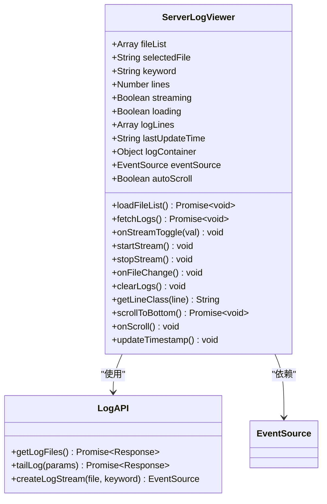

**图表来源**
- [ServerLogViewer.vue:107-369](file://med_ai_assistant_1.0_bs_vue/src/components/ServerLogViewer.vue#L107-L369)

#### 实时日志流处理流程

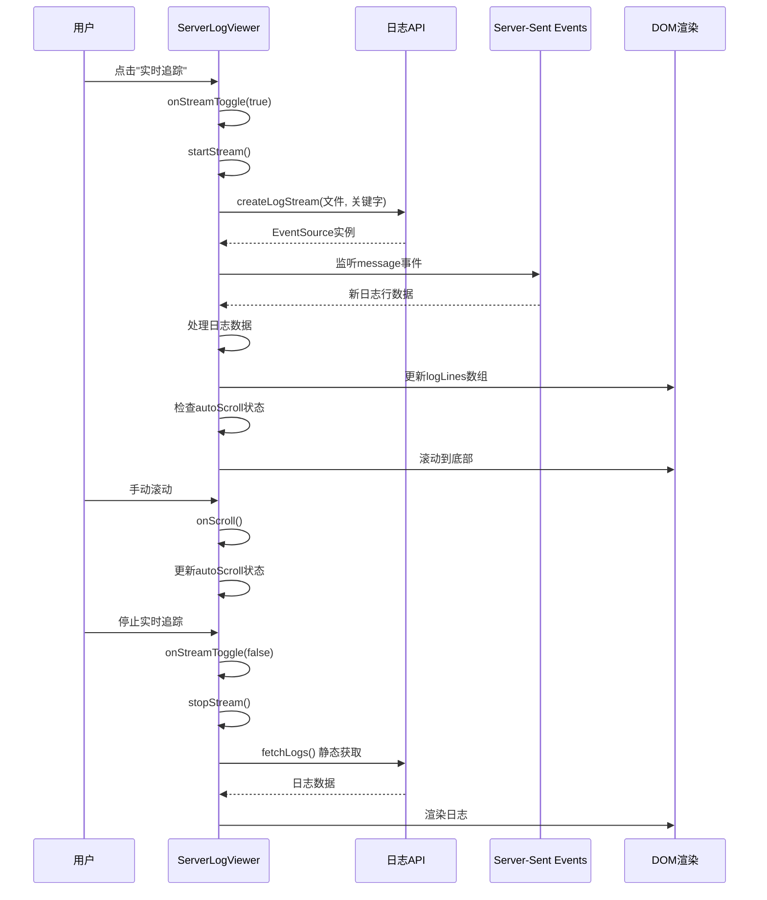

**图表来源**
- [ServerLogViewer.vue:211-266](file://med_ai_assistant_1.0_bs_vue/src/components/ServerLogViewer.vue#L211-L266)
- [ServerLogViewer.vue:178-203](file://med_ai_assistant_1.0_bs_vue/src/components/ServerLogViewer.vue#L178-L203)

#### 日志级别分类算法


**图表来源**
- [ServerLogViewer.vue:296-302](file://med_ai_assistant_1.0_bs_vue/src/components/ServerLogViewer.vue#L296-L302)

**章节来源**
- [ServerLogViewer.vue:106-369](file://med_ai_assistant_1.0_bs_vue/src/components/ServerLogViewer.vue#L106-L369)

### TopMenu 组件深度分析

#### 导航菜单架构

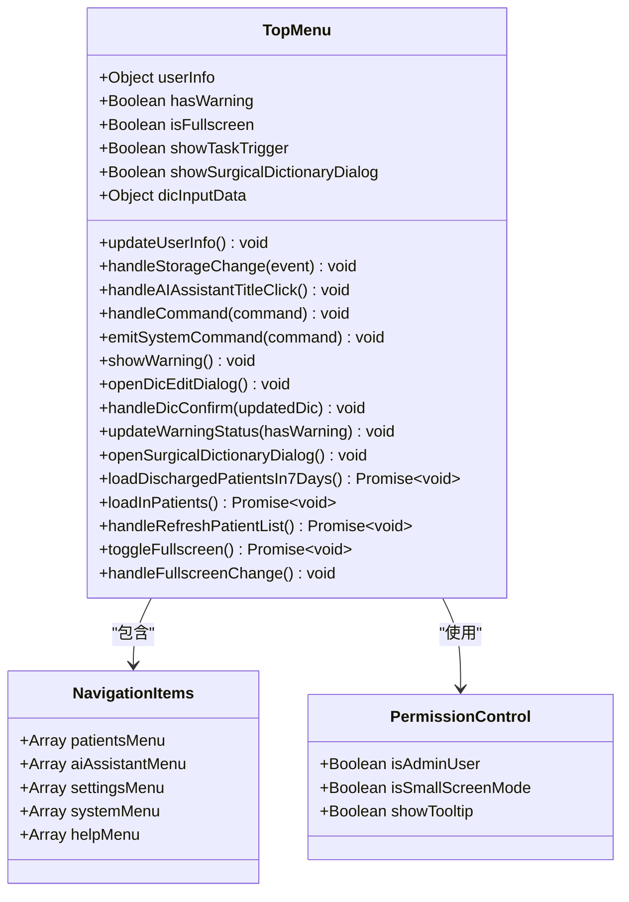

**图表来源**
- [TopMenu.vue:168-656](file://med_ai_assistant_1.0_bs_vue/src/components/TopMenu.vue#L168-L656)

#### 权限控制机制

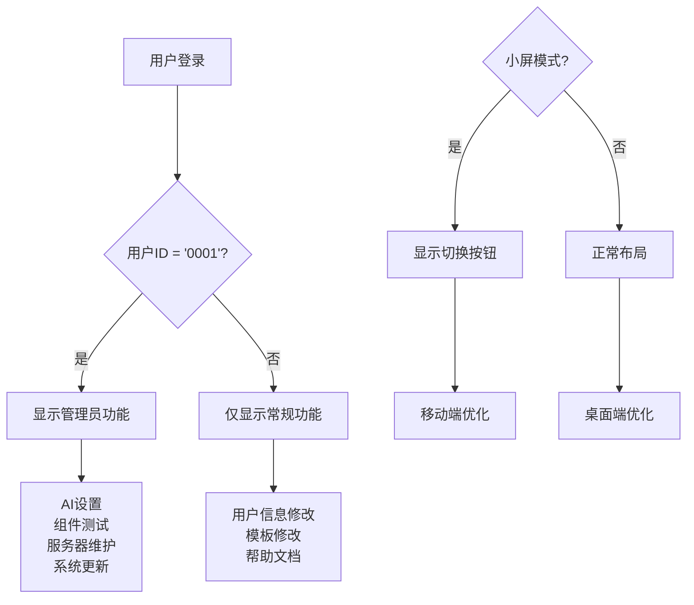

**图表来源**
- [TopMenu.vue:208-210](file://med_ai_assistant_1.0_bs_vue/src/components/TopMenu.vue#L208-L210)
- [TopMenu.vue:384-395](file://med_ai_assistant_1.0_bs_vue/src/components/TopMenu.vue#L384-L395)

**章节来源**
- [TopMenu.vue:168-656](file://med_ai_assistant_1.0_bs_vue/src/components/TopMenu.vue#L168-L656)

### UserLookup 组件分析

#### 组件交互流程

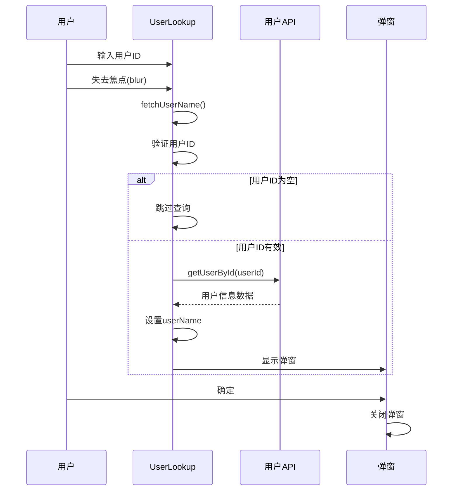

**图表来源**
- [UserLookup.vue:36-53](file://med_ai_assistant_1.0_bs_vue/src/components/UserLookup.vue#L36-L53)

**章节来源**
- [UserLookup.vue:24-54](file://med_ai_assistant_1.0_bs_vue/src/components/UserLookup.vue#L24-L54)

### AIResults 组件深度分析

#### 去换行符复制功能

**新增功能亮点：**
- 智能文本处理：自动识别和去除所有换行符（\n, \r）
- 剪贴板集成：使用现代 Clipboard API 进行复制
- 用户反馈：操作成功和失败的即时提示
- 错误处理：完善的异常捕获和用户提示

#### 选中文字处理机制

**新增功能亮点：**
- **智能文本选择**：支持用户选中文本后进行处理
- **选中状态检测**：自动检测用户是否选择了文本
- **条件处理**：仅在有选中文本时显示处理选项
- **用户提示**：为空选中文本时显示警告提示

**选中文字处理流程：**


**图表来源**
- [AIResults.vue:650-699](file://med_ai_assistant_1.0_bs_vue/src/components/ai/AIResults.vue#L650-L699)

#### 思维过程折叠系统

**新增功能亮点：**
- 折叠按钮：针对诊断分析类型的Prompt提供专门的展开/折叠按钮
- 状态管理：使用resultCollapsed布尔值控制折叠状态
- 条件渲染：仅在诊断分析类型时显示折叠按钮
- 用户体验：减少长篇AI结果的视觉干扰

**技术实现流程：**

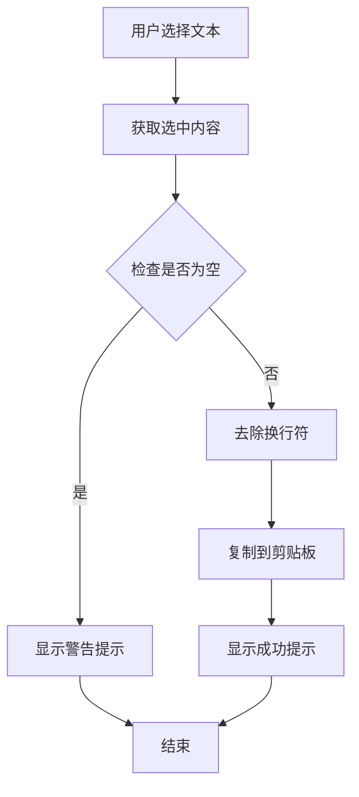

**图表来源**
- [AIResults.vue:650-699](file://med_ai_assistant_1.0_bs_vue/src/components/ai/AIResults.vue#L650-L699)

**章节来源**
- [AIResults.vue:650-699](file://med_ai_assistant_1.0_bs_vue/src/components/ai/AIResults.vue#L650-L699)

### TreatmentPlanTable 组件深度分析

**新增** TreatmentPlanTable 组件经过重大UI优化，将操作列从3个按钮精简为「待办」+「更多」下拉菜单：

#### 组件架构图

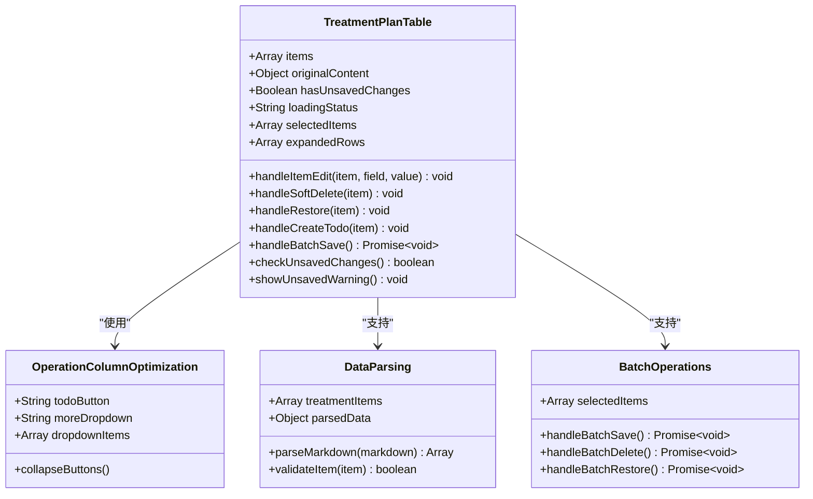

**图表来源**
- [TreatmentPlanTable.vue:270-520](file://med_ai_assistant_1.0_bs_vue/src/components/ai/TreatmentPlanTable.vue#L270-L520)

#### UI优化系统

**新增功能亮点：**
- **操作列精简**：将原来的3个独立按钮整合为「待办」和「更多」下拉菜单
- **布局重构**：采用更简洁的布局设计，提升用户体验
- **交互优化**：通过下拉菜单提供更多的操作选项，同时保持界面简洁
- **未保存提醒**：支持批量保存前的未保存修改提醒

**UI优化实现流程：**

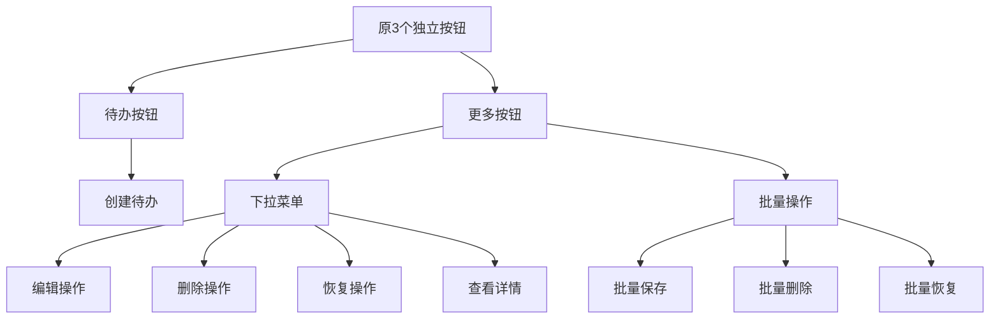

**图表来源**
- [TreatmentPlanTable.vue:270-520](file://med_ai_assistant_1.0_bs_vue/src/components/ai/TreatmentPlanTable.vue#L270-L520)

#### 数据解析系统

**新增功能亮点：**
- **Markdown解析**：支持标准4列Markdown表格解析
- **去标记处理**：自动去除Markdown标记（加粗、链接等）
- **多行表格**：保持表格顺序的多行解析
- **异常处理**：异常格式的降级处理
- **空内容处理**：空内容返回空数组

**数据解析流程：**

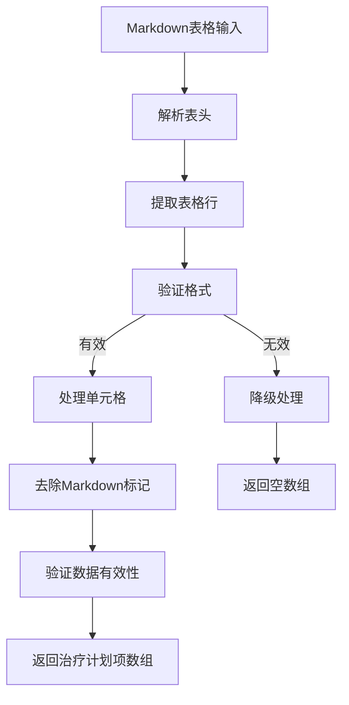

**图表来源**
- [treatmentPlanParser.js:1-200](file://med_ai_assistant_1.0_bs_vue/src/utils/treatmentPlanParser.js#L1-L200)

**章节来源**
- [TreatmentPlanTable.vue:1-267](file://med_ai_assistant_1.0_bs_vue/src/components/ai/TreatmentPlanTable.vue#L1-L267)

### DiagnosisEditPanel 组件深度分析

**新增** DiagnosisEditPanel 组件采用了全新的左右两栏布局设计，提供了完整的诊断编辑功能：

#### 组件架构图

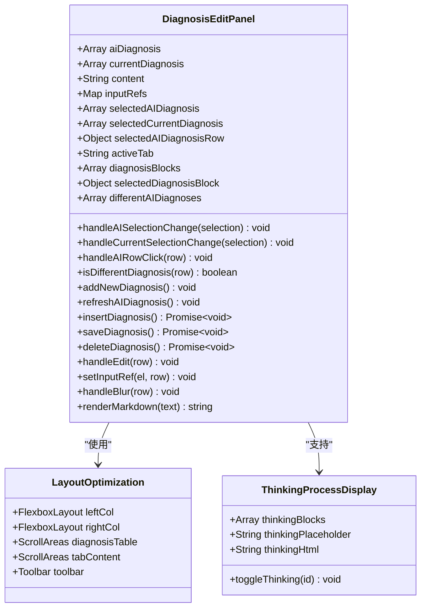

**图表来源**
- [DiagnosisEditPanel.vue:140-569](file://med_ai_assistant_1.0_bs_vue/src/components/ai/DiagnosisEditPanel.vue#L140-L569)

#### 布局优化系统

**新增功能亮点：**
- 弹性布局：使用Flexbox实现左右两栏的自适应布局
- 独立滚动：左侧诊断列表和右侧标签页内容区域均支持独立滚动
- 响应式设计：支持不同屏幕尺寸的自适应显示
- 工具栏集成：底部工具栏提供统一的操作入口

**布局实现流程：**

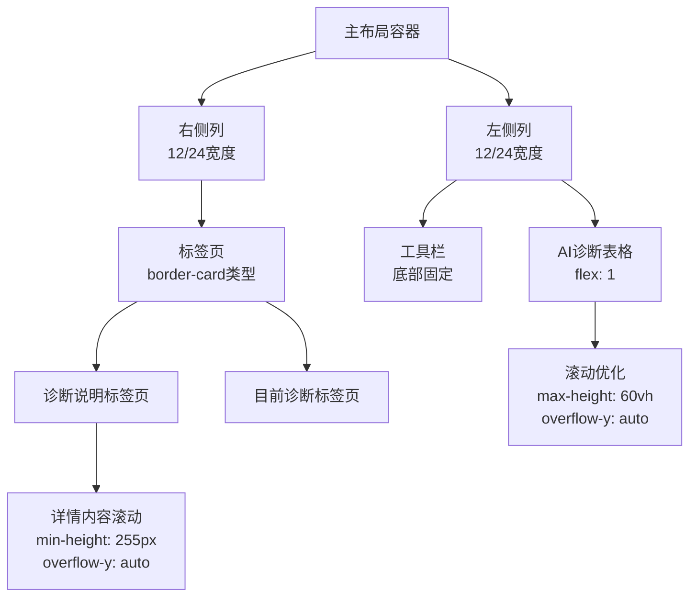

**图表来源**
- [DiagnosisEditPanel.vue:572-716](file://med_ai_assistant_1.0_bs_vue/src/components/ai/DiagnosisEditPanel.vue#L572-L716)

#### 思维过程显示系统

**新增功能亮点：**
- <thinking>标签支持：自动检测和处理<thinking>标签
- 折叠显示：支持思维过程的展开/折叠显示
- 占位符机制：使用占位符避免marked二次解析问题
- 全局切换函数：注册window.toggleThinking全局函数

**技术实现流程：**

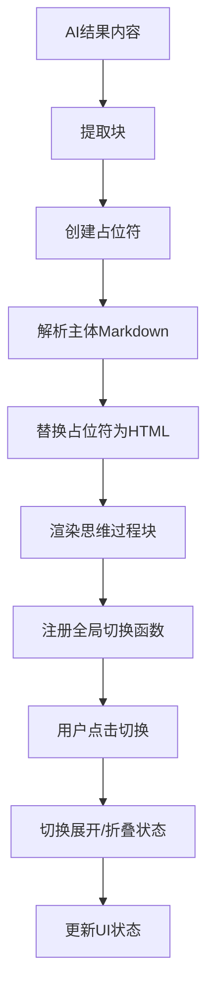

**图表来源**
- [DiagnosisEditPanel.vue:563-567](file://med_ai_assistant_1.0_bs_vue/src/components/ai/DiagnosisEditPanel.vue#L563-L567)

**章节来源**
- [DiagnosisEditPanel.vue:1-716](file://med_ai_assistant_1.0_bs_vue/src/components/ai/DiagnosisEditPanel.vue#L1-L716)

### DiagnosisCard 组件深度分析

**新增** DiagnosisCard 组件提供了卡片式的诊断展示功能，采用了Element Plus的border-card样式：

#### 组件架构图

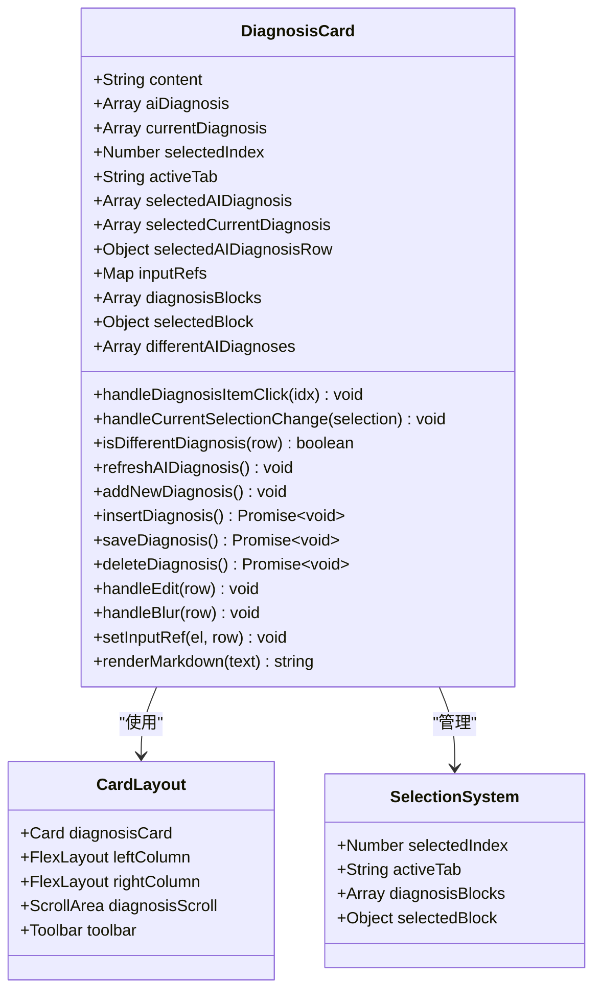

**图表来源**
- [DiagnosisCard.vue:124-467](file://med_ai_assistant_1.0_bs_vue/src/components/ai/DiagnosisCard.vue#L124-L467)

#### 卡片布局优化

**新增功能亮点：**
- 卡片样式：使用Element Plus的border-card类型，提供更好的视觉层次
- 滚动区域：诊断列表区域设置最大高度（60vh），超出部分自动滚动
- 工具栏位置：工具栏位于诊断列表下方，便于操作
- 标签页集成：右侧标签页支持诊断说明和目前诊断两个选项卡

**布局实现流程：**

```mermaid
flowchart TD
CardWrapper[卡片包装器] --> MainRow[主行布局<br/>:gutter="12"]
MainRow --> LeftColumn[左侧列<br/>12/24宽度<br/>flex-direction: column]
LeftColumn --> DiagnosisScroll[诊断滚动区域<br/>min-height: 280px<br/>max-height: 60vh<br/>overflow-y: auto]
DiagnosisScroll --> DiagnosisItems[诊断项目列表<br/>hover效果<br/>active状态]
LeftColumn --> Toolbar[工具栏<br/>底部边框]
MainRow --> RightColumn[右侧列<br/>12/24宽度<br/>flex-direction: column]
RightColumn --> CardContainer[卡片容器<br/>height: 100%]
CardContainer --> Tabs[标签页<br/>border-card类型]
Tabs --> DetailPane[诊断说明<br/>min-height: 255px<br/>overflow-y: auto]
Tabs --> CurrentPane[目前诊断<br/>表格形式]
```

**图表来源**
- [DiagnosisCard.vue:470-644](file://med_ai_assistant_1.0_bs_vue/src/components/ai/DiagnosisCard.vue#L470-L644)

#### 诊断解析系统

**新增功能亮点：**
- 结构化解析：使用diagnosisParser工具提取完整的诊断信息块
- 字段提取：支持诊断编号、名称、类别、依据、鉴别诊断、补充说明的提取
- 思维过程处理：自动移除<thinking>标签，避免误解析
- 降级机制：当结构化解析失败时使用简单名称提取作为后备

**技术实现流程：**

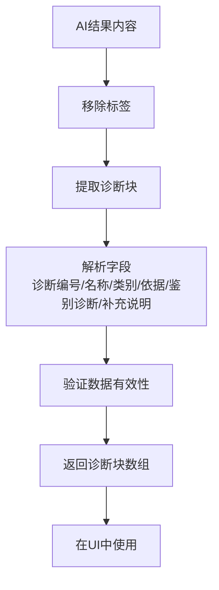

**图表来源**
- [DiagnosisCard.vue:203-231](file://med_ai_assistant_1.0_bs_vue/src/components/ai/DiagnosisCard.vue#L203-L231)

**章节来源**
- [DiagnosisCard.vue:1-644](file://med_ai_assistant_1.0_bs_vue/src/components/ai/DiagnosisCard.vue#L1-L644)

### PromptExecutor 组件深度分析

#### 轮询服务状态管理

**增强的功能特性：**
- 详细的错误处理和用户反馈
- 自动恢复机制的实现
- 服务状态变化检测
- 响应时间监控

**服务状态管理流程：**

```mermaid
sequenceDiagram
participant User as 用户
participant Component as PromptExecutor
participant API as 后端API
participant Recovery as 自动恢复机制
User->>Component : 启用轮询服务
Component->>Component : startAutoRecovery('polling')
Component->>API : enablePolling()
API-->>Component : 服务启用成功
Component->>Component : detectServiceStateChange()
Component->>Recovery : 检测状态变化
Component->>Component : refreshServiceStatus()
Component->>Component : 更新服务状态
User->>Component : 禁用轮询服务
Component->>Component : stopAutoRecovery('polling')
Component->>API : disablePolling()
API-->>Component : 服务禁用成功
Component->>Component : refreshServiceStatus()
```

**图表来源**
- [PromptExecutor.vue:800-825](file://med_ai_assistant_1.0_bs_vue/src/components/server/PromptExecutor.vue#L800-L825)
- [PromptExecutor.vue:942-967](file://med_ai_assistant_1.0_bs_vue/src/components/server/PromptExecutor.vue#L942-L967)

**章节来源**
- [PromptExecutor.vue:800-825](file://med_ai_assistant_1.0_bs_vue/src/components/server/PromptExecutor.vue#L800-L825)
- [PromptExecutor.vue:942-967](file://med_ai_assistant_1.0_bs_vue/src/components/server/PromptExecutor.vue#L942-L967)

### PatientSummary 组件深度分析

**更新** PatientSummary 组件经过重大功能增强，成为患者信息管理的核心组件：

#### 组件架构图

```mermaid
classDiagram
class PatientSummary {
+Object patient
+Boolean loadingSummary
+String latestSummaryContent
+Array latestTodos
+prompts() Array
+latestMedicalSummary() Object
+hospitalStayInfo() Object
+statusClass() String
+enhanceHtmlWithColors(html) String
+parseWithThinking(text) String
+formatMarkdown(content) String
+formatTime(time) String
+cleanTodoContent(content) String
+mounted() void
+beforeUnmount() void
+watch.patient.patientId(newVal, oldVal) void
}
class HospitalStayInfo {
+String admissionDate
+Number days
+String status
+statusClass() String
}
class TodoItem {
+Number id
+String todoItem
+String createdAt
}
class MarkdownEnhancement {
+String thinkingBlock
+String colorHighlight
+String contentClean
}
PatientSummary --> HospitalStayInfo : "计算"
PatientSummary --> TodoItem : "获取"
PatientSummary --> MarkdownEnhancement : "增强"
```

**图表来源**
- [PatientSummary.vue:72-157](file://med_ai_assistant_1.0_bs_vue/src/components/patient/PatientSummary.vue#L72-L157)

#### 住院时长计算算法

```mermaid
flowchart TD
AdmissionDate[入院时间] --> ParseDate[解析入院日期]
ParseDate --> GetCurrentDate[获取当前时间]
GetCurrentDate --> CalculateDays[计算天数差]
CalculateDays --> FormatDays[格式化天数]
FormatDays --> ReturnInfo[返回住院信息]
ReturnInfo --> Display[显示在界面]
```

**图表来源**
- [PatientSummary.vue:135-145](file://med_ai_assistant_1.0_bs_vue/src/components/patient/PatientSummary.vue#L135-L145)

#### 颜色编码状态系统

```mermaid
flowchart TD
PatientStatus[患者状态] --> CheckCritical{"包含'病危'?"}
CheckCritical --> |是| CriticalClass["返回'status-critical'"]
CheckCritical --> |否| CheckSerious{"包含'病重'?"}
CheckSerious --> |是| SeriousClass["返回'status-serious'"]
CheckSerious --> |否| NormalClass["返回'status-normal'"]
CriticalClass --> Render[渲染红色字体]
SeriousClass --> Render[渲染橙色字体]
NormalClass --> Render[渲染绿色字体]
```

**图表来源**
- [PatientSummary.vue:151-156](file://med_ai_assistant_1.0_bs_vue/src/components/patient/PatientSummary.vue#L151-L156)

#### 待办事项集成流程

```mermaid
sequenceDiagram
participant Component as PatientSummary
participant API as 患者API
participant Store as Vuex Store
Component->>Store : fetchPrompts(患者ID)
Store-->>Component : AI提示词列表
Component->>API : getLatestMedicalSummary(患者ID)
API-->>Component : 最新病情小结内容
Component->>API : getTodosByPatientId(患者ID)
API-->>Component : 待办事项列表
Component->>Component : 清理待办内容
Component->>Component : 显示最近2条待办
```

**图表来源**
- [PatientSummary.vue:341-408](file://med_ai_assistant_1.0_bs_vue/src/components/patient/PatientSummary.vue#L341-L408)

#### Markdown增强渲染系统

**新增功能亮点：**
- 思维过程折叠：支持<thinking>标签的折叠显示，提供透明的AI思维过程
- 颜色标识系统：自动高亮异常值（红色）、正常值（绿色）、待处理项（橙色）
- 智能内容清理：自动移除待办事项中的病人基本信息行
- 多层内容来源：优先显示最新API内容，其次显示AI生成内容，最后显示基本信息

**技术实现流程：**

```mermaid
flowchart TD
InputContent[原始内容] --> CheckType{检查内容类型}
CheckType --> |字符串| ProcessString[处理字符串内容]
CheckType --> |对象| ExtractContent[提取对象内容]
CheckType --> |空值| ReturnEmpty[返回空内容]
ProcessString --> ParseThinking[解析<thinking>标签]
ParseThinking --> CleanContent[清理待办内容]
CleanContent --> ColorHighlight[应用颜色高亮]
ColorHighlight --> SanitizeHTML[DOMPurify净化]
SanitizeHTML --> OutputHTML[输出安全HTML]
ExtractContent --> ParseThinking
ReturnEmpty --> OutputHTML
```

**图表来源**
- [PatientSummary.vue:168-284](file://med_ai_assistant_1.0_bs_vue/src/components/patient/PatientSummary.vue#L168-L284)

**章节来源**
- [PatientSummary.vue:1-638](file://med_ai_assistant_1.0_bs_vue/src/components/patient/PatientSummary.vue#L1-L638)

### VoiceTextProcessor 组件深度分析

**新增** voiceTextProcessor 提供了完整的语音识别文本流式处理功能：

#### 组件架构图

```mermaid
classDiagram
class VoiceTextProcessor {
+processRecognizedText(rawText, options) Promise~ProcessedContent~
+processRecognizedTextStream(rawText, options) Promise~ProcessedContent~
+parseProcessedContent(content) ParsedContent
}
class AIService {
+getAIResponseStream(modelName, temperature, promptText, onData) Promise~void~
}
class APIService {
+getPrompt(params) Promise~Response~
+analyzeLLM(params) Promise~string~
}
VoiceTextProcessor --> AIService : "使用"
VoiceTextProcessor --> APIService : "使用"
```

**图表来源**
- [voiceTextProcessor.js:34-134](file://med_ai_assistant_1.0_bs_vue/src/utils/voiceTextProcessor.js#L34-L134)

#### 流式处理工作流程

```mermaid
sequenceDiagram
participant Component as 调用组件
participant Processor as VoiceTextProcessor
participant API as AI API
participant Service as AIService
Component->>Processor : processRecognizedTextStream(rawText, options)
Processor->>API : getPrompt({promptType, promptName})
API-->>Processor : Prompt模板内容
Processor->>Processor : 组合原始文本和模板
Processor->>Service : analyzeLLMStream(组合内容)
Service->>Component : onChunk(实时数据块)
Component->>Component : 更新UI显示
Service->>Component : onComplete(完整内容)
Processor->>Processor : parseProcessedContent(解析结构化内容)
Component->>Component : 显示修改后记录和修改原因
```

**图表来源**
- [voiceTextProcessor.js:115-134](file://med_ai_assistant_1.0_bs_vue/src/utils/voiceTextProcessor.js#L115-L134)

#### 结构化内容解析算法

```mermaid
flowchart TD
RawContent[原始LLM响应] --> FindMarkers[查找标记位置]
FindMarkers --> CheckBothMarkers{同时找到两个标记?}
CheckBothMarkers --> |是| ExtractBoth[提取修改后记录和修改原因]
CheckBothMarkers --> |否| ExtractSingle[提取完整内容作为修改后记录]
ExtractBoth --> ReturnParsed[返回解析结果]
ExtractSingle --> ReturnParsed
ReturnParsed --> Output[输出结构化对象]
```

**图表来源**
- [voiceTextProcessor.js:141-167](file://med_ai_assistant_1.0_bs_vue/src/utils/voiceTextProcessor.js#L141-L167)

**章节来源**
- [voiceTextProcessor.js:1-168](file://med_ai_assistant_1.0_bs_vue/src/utils/voiceTextProcessor.js#L1-L168)

### QC API模块深度分析

**新增** qc.js 提供了完整的质量控制（QC）评估API模块：

#### 组件架构图

```mermaid
classDiagram
class QCModule {
+getDiseaseMatch(patientId) Promise~Object~
+triggerDiseaseMatch(patientId) Promise~Object~
+getDiseaseConfigs() Promise~Object~
+confirmDiseaseMatch(params) Promise~Object~
+getConfirmedDiseases(patientId) Promise~Object~
+ignoreDiseaseMatch(data) Promise~Object~
+restoreDiseaseMatch(patientId, diseaseId) Promise~Object~
+getIgnoredDiseases(patientId) Promise~Object~
+getAssessmentResults(patientId, params) Promise~Object~
+getIndicatorDetails(patientId) Promise~Object~
+reanalyzeAssessment(patientId) Promise~Object~
+getIndicatorConfigs(params) Promise~Object~
}
class DiseaseMatchAPI {
+getDiseaseMatch(patientId) Promise~Object~
+triggerDiseaseMatch(patientId) Promise~Object~
+confirmDiseaseMatch(params) Promise~Object~
}
class AssessmentAPI {
+getAssessmentResults(patientId, params) Promise~Object~
+getIndicatorDetails(patientId) Promise~Object~
+reanalyzeAssessment(patientId) Promise~Object~
}
class ConfigAPI {
+getDiseaseConfigs() Promise~Object~
+getIndicatorConfigs(params) Promise~Object~
}
QCModule --> DiseaseMatchAPI : "使用"
QCModule --> AssessmentAPI : "使用"
QCModule --> ConfigAPI : "使用"
```

**图表来源**
- [qc.js:19-424](file://med_ai_assistant_1.0_bs_vue/src/api/qc.js#L19-L424)

#### 病种匹配流程

**新增功能亮点：**
- **自动匹配**：getDiseaseMatch获取最近一次AI自动匹配的病种结果
- **变更检测**：triggerDiseaseMatch检测诊断变更并按需触发新匹配
- **确认管理**：confirmDiseaseMatch医师确认AI匹配结果
- **忽略管理**：ignoreDiseaseMatch忽略AI匹配结果，restoreDiseaseMatch恢复忽略的病种

**病种匹配实现流程：**

```mermaid
flowchart TD
OpenTab[打开临床指引Tab] --> CheckDiagnosis[检查诊断变更]
CheckDiagnosis --> HasChanged{诊断是否变更?}
HasChanged --> |是| TriggerMatch[触发新匹配]
HasChanged --> |否| CheckHistory[检查历史匹配]
TriggerMatch --> SaveResult[保存新匹配结果]
CheckHistory --> HasResult{有历史匹配?}
HasResult --> |是| ReturnResult[返回历史匹配结果]
HasResult --> |否| NoResult[返回无结果状态]
ReturnResult --> ShowMatch[显示匹配结果]
NoResult --> ShowMatch
SaveResult --> ShowMatch
```

**图表来源**
- [qc.js:64-66](file://med_ai_assistant_1.0_bs_vue/src/api/qc.js#L64-L66)

#### 质控评估系统

**新增功能亮点：**
- **评估查询**：getAssessmentResults按病种和状态筛选查询质控指标评估结果
- **详情获取**：getIndicatorDetails获取指标详情列表，包含参考来源
- **重新分析**：reanalyzeAssessment触发对指定患者的质控指标重新评估
- **配置管理**：getDiseaseConfigs和getIndicatorConfigs获取配置列表

**评估查询实现流程：**

```mermaid
flowchart TD
QueryAssessment[查询质控评估] --> FilterParams[应用筛选参数]
FilterParams --> DiseaseFilter{按病种筛选?}
DiseaseFilter --> |是| FilterByDisease[按病种过滤]
DiseaseFilter --> |否| StatusFilter{按状态筛选?}
FilterByDisease --> StatusFilter
StatusFilter --> |是| FilterByStatus[按状态过滤]
StatusFilter --> |否| SortResults[按优先级排序]
FilterByStatus --> SortResults
SortResults --> ReturnResults[返回评估结果]
```

**图表来源**
- [qc.js:242-244](file://med_ai_assistant_1.0_bs_vue/src/api/qc.js#L242-L244)

**章节来源**
- [qc.js:1-424](file://med_ai_assistant_1.0_bs_vue/src/api/qc.js#L1-L424)

## 治疗计划表格UI优化

### 操作列精简优化

**新增** TreatmentPlanTable组件的重大UI优化，将操作列从3个按钮精简为「待办」+「更多」下拉菜单：

#### UI优化架构

```mermaid
classDiagram
class TreatmentPlanTable {
+Array items
+String operationColumn
+String todoButton
+String moreDropdown
+Array dropdownItems
+collapseButtons() void
+expandButtons() void
}
class OperationColumnOptimization {
+String optimizedLayout
+Array dropdownActions
+Boolean isCollapsed
+collapseButtons() void
+expandButtons() void
}
class UserInteraction {
+String userAction
+String buttonType
+String dropdownAction
+handleUserAction(action) void
}
TreatmentPlanTable --> OperationColumnOptimization : "使用"
TreatmentPlanTable --> UserInteraction : "响应"
OperationColumnOptimization --> UserInteraction : "触发"
```

**图表来源**
- [TreatmentPlanTable.vue:270-520](file://med_ai_assistant_1.0_bs_vue/src/components/ai/TreatmentPlanTable.vue#L270-L520)

#### 精简优化实现

**新增功能亮点：**
- **操作列整合**：将原来的3个独立按钮（编辑、删除、查看详情）整合为「待办」和「更多」下拉菜单
- **布局简化**：减少表格列宽，提升整体可读性
- **交互优化**：通过下拉菜单提供更多的操作选项，同时保持界面简洁
- **响应式设计**：在小屏设备上更好地适配精简后的布局

**精简优化流程：**

```mermaid
flowchart TD
OriginalButtons[原3个独立按钮] --> TodoButton[待办按钮]
OriginalButtons --> MoreButton[更多按钮]
MoreButton --> DropdownMenu[下拉菜单]
DropdownMenu --> EditAction[编辑操作]
DropdownMenu --> DeleteAction[删除操作]
DropdownMenu --> RestoreAction[恢复操作]
DropdownMenu --> ViewAction[查看详情]
TodoButton --> CreateTodo[创建待办]
MoreButton --> BatchOperations[批量操作]
BatchOperations --> BatchSave[批量保存]
BatchOperations --> BatchDelete[批量删除]
BatchOperations --> BatchRestore[批量恢复]
```

**图表来源**
- [TreatmentPlanTable.vue:270-520](file://med_ai_assistant_1.0_bs_vue/src/components/ai/TreatmentPlanTable.vue#L270-L520)

#### 交互优化机制

**新增功能亮点：**
- **智能展开**：用户悬停或点击更多按钮时自动展开下拉菜单
- **快捷操作**：待办按钮提供最常用的操作入口
- **批量处理**：支持多选后的批量操作，提升效率
- **状态反馈**：操作完成后提供即时的状态反馈

**交互实现流程：**

```mermaid
flowchart TD
UserHover[用户悬停按钮] --> CheckButton{检查按钮类型}
CheckButton --> |更多按钮| ExpandDropdown[展开下拉菜单]
CheckButton --> |待办按钮| ShowTodo[显示待办操作]
ExpandDropdown --> UserSelect[用户选择操作]
ShowTodo --> UserSelect
UserSelect --> ExecuteAction[执行选择的操作]
ExecuteAction --> UpdateUI[更新界面状态]
UpdateUI --> ShowFeedback[显示操作反馈]
```

**图表来源**
- [TreatmentPlanTable.vue:270-520](file://med_ai_assistant_1.0_bs_vue/src/components/ai/TreatmentPlanTable.vue#L270-L520)

**章节来源**
- [TreatmentPlanTable.vue:1-267](file://med_ai_assistant_1.0_bs_vue/src/components/ai/TreatmentPlanTable.vue#L1-L267)

## 选中文字处理机制

### 智能文本选择功能

**新增** AIResults组件的选中文字处理机制，支持用户选中文本后的智能处理：

#### 文本选择架构

```mermaid
classDiagram
class AIResults {
+String content
+String selectedText
+Boolean hasSelection
+String copyStatus
+handleTextSelection() void
+removeNewlines(text) String
+copyToClipboard(text) void
+showWarning() void
}
class TextSelectionManager {
+String selectedText
+Boolean hasSelection
+Array selectionEvents
+handleSelectionChange() void
+validateSelection() boolean
}
class ClipboardIntegration {
+String clipboardText
+String processedText
+copyToClipboard(text) Promise~void~
+showSuccess() void
+showError() void
}
AIResults --> TextSelectionManager : "使用"
AIResults --> ClipboardIntegration : "集成"
```

**图表来源**
- [AIResults.vue:650-699](file://med_ai_assistant_1.0_bs_vue/src/components/ai/AIResults.vue#L650-L699)

#### 选中文字处理流程

**新增功能亮点：**
- **智能选择检测**：自动检测用户是否选择了文本
- **条件处理**：仅在有选中文本时显示处理选项
- **去换行符处理**：自动去除选中文本中的换行符和空白字符
- **剪贴板集成**：一键复制处理后的文本到系统剪贴板
- **用户反馈**：操作成功和失败的即时提示

**选中文字处理实现流程：**

```mermaid
flowchart TD
UserSelect[用户选择文本] --> DetectSelection[检测选中文本]
DetectSelection --> CheckSelection{检查选中状态}
CheckSelection --> |无选中| ShowWarning[显示警告提示]
CheckSelection --> |有选中| RemoveNewlines[去除换行符]
RemoveNewlines --> CopyToClipboard[复制到剪贴板]
CopyToClipboard --> ShowSuccess[显示成功提示]
ShowWarning --> End[结束]
ShowSuccess --> End
```

**图表来源**
- [AIResults.vue:650-699](file://med_ai_assistant_1.0_bs_vue/src/components/ai/AIResults.vue#L650-L699)

#### 用户交互优化

**新增功能亮点：**
- **实时检测**：实时监控文本选择状态的变化
- **智能提示**：为空选中文本时显示友好的警告提示
- **批量处理**：支持一次性处理多个选中文本片段
- **撤销机制**：提供撤销操作，允许用户取消错误的处理

**交互优化实现流程：**

```mermaid
flowchart TD
SelectionChange[选中状态变化] --> CheckEmpty{检查是否为空}
CheckEmpty --> |空| ShowWarning[显示警告]
CheckEmpty --> |非空| ShowOptions[显示处理选项]
ShowWarning --> WaitUser[等待用户操作]
ShowOptions --> UserAction{用户选择操作}
UserAction --> |复制| ProcessAndCopy[处理并复制]
UserAction --> |取消| CancelAction[取消操作]
ProcessAndCopy --> UpdateStatus[更新状态]
CancelAction --> ResetState[重置状态]
UpdateStatus --> ShowSuccess[显示成功]
ResetState --> ShowOptions
```

**图表来源**
- [AIResults.vue:650-699](file://med_ai_assistant_1.0_bs_vue/src/components/ai/AIResults.vue#L650-L699)

**章节来源**
- [AIResults.vue:650-699](file://med_ai_assistant_1.0_bs_vue/src/components/ai/AIResults.vue#L650-L699)

## QC质量控制集成

### 完整的QC API集成

**新增** qc.js提供的完整质量控制（QC）评估API集成，支持病种匹配、确认、评估结果查询等核心功能：

#### QC系统架构

```mermaid
classDiagram
class QCSystem {
+DiseaseMatchAPI diseaseMatchAPI
+AssessmentAPI assessmentAPI
+ConfigAPI configAPI
+IgnoreAPI ignoreAPI
+getDiseaseMatch(patientId) Promise~Object~
+triggerDiseaseMatch(patientId) Promise~Object~
+getAssessmentResults(patientId, params) Promise~Object~
+getIndicatorDetails(patientId) Promise~Object~
}
class DiseaseMatchAPI {
+getDiseaseMatch(patientId) Promise~Object~
+triggerDiseaseMatch(patientId) Promise~Object~
+confirmDiseaseMatch(params) Promise~Object~
+ignoreDiseaseMatch(data) Promise~Object~
+restoreDiseaseMatch(patientId, diseaseId) Promise~Object~
}
class AssessmentAPI {
+getAssessmentResults(patientId, params) Promise~Object~
+getIndicatorDetails(patientId) Promise~Object~
+reanalyzeAssessment(patientId) Promise~Object~
}
class ConfigAPI {
+getDiseaseConfigs() Promise~Object~
+getIndicatorConfigs(params) Promise~Object~
}
QCSystem --> DiseaseMatchAPI : "包含"
QCSystem --> AssessmentAPI : "包含"
QCSystem --> ConfigAPI : "包含"
```

**图表来源**
- [qc.js:19-424](file://med_ai_assistant_1.0_bs_vue/src/api/qc.js#L19-L424)

#### 病种匹配确认流程

**新增功能亮点：**
- **自动匹配**：getDiseaseMatch获取AI自动匹配的病种结果
- **变更检测**：triggerDiseaseMatch检测诊断变更并触发重新分析
- **医师确认**：confirmDiseaseMatch支持医师对AI匹配结果进行确认
- **忽略管理**：ignoreDiseaseMatch和restoreDiseaseMatch管理忽略的病种

**病种匹配确认实现流程：**

```mermaid
flowchart TD
OpenClinicalTab[打开临床指引Tab] --> CheckDiagnosis[检查诊断变更]
CheckDiagnosis --> HasChanged{诊断是否变更?}
HasChanged --> |是| TriggerMatch[触发新匹配]
HasChanged --> |否| CheckHistory[检查历史匹配]
TriggerMatch --> SaveResult[保存新匹配结果]
CheckHistory --> HasResult{有历史匹配?}
HasResult --> |是| ReturnResult[返回历史匹配结果]
HasResult --> |否| NoResult[返回无结果状态]
ReturnResult --> ShowMatch[显示匹配结果]
NoResult --> ShowMatch
SaveResult --> ShowMatch
ShowMatch --> PhysicianReview[医师审查]
PhysicianReview --> ConfirmMatch[确认匹配]
ConfirmMatch --> SaveConfirmation[保存确认]
SaveConfirmation --> StartAssessment[开始质控评估]
```

**图表来源**
- [qc.js:64-66](file://med_ai_assistant_1.0_bs_vue/src/api/qc.js#L64-L66)

#### 质控评估查询系统

**新增功能亮点：**
- **多维度筛选**：支持按病种ID、达标状态、优先级等多维度筛选
- **优先级排序**：支持按优先级、状态、病种ID等排序方式
- **汇总统计**：提供完整的质控指标汇总统计信息
- **详细详情**：支持获取指标详情列表，包含参考来源

**评估查询实现流程：**

```mermaid
flowchart TD
QueryRequest[质控评估查询请求] --> ApplyFilters[应用筛选条件]
ApplyFilters --> FilterByDisease{按病种筛选?}
FilterByDisease --> |是| FilterDisease[按病种过滤]
FilterByDisease --> |否| FilterByStatus{按状态筛选?}
FilterByStatus --> |是| FilterStatus[按状态过滤]
FilterByStatus --> |否| FilterByPriority{按优先级筛选?}
FilterStatus --> FilterByPriority
FilterByPriority --> |是| FilterPriority[按优先级过滤]
FilterByPriority --> |否| SortResults[排序结果]
FilterPriority --> SortResults
SortResults --> ReturnResults[返回评估结果]
```

**图表来源**
- [qc.js:242-244](file://med_ai_assistant_1.0_bs_vue/src/api/qc.js#L242-L244)

#### 指标配置管理系统

**新增功能亮点：**
- **配置查询**：getDiseaseConfigs和getIndicatorConfigs获取配置列表
- **条件筛选**：支持按病种、优先级等条件筛选配置
- **详细描述**：提供指标的详细说明和知识来源
- **动态更新**：支持配置的动态更新和版本管理

**配置管理实现流程：**

```mermaid
flowchart TD
GetConfigs[获取配置列表] --> FilterConfigs[应用筛选条件]
FilterConfigs --> DiseaseFilter{按病种筛选?}
DiseaseFilter --> |是| FilterByDisease[按病种过滤]
DiseaseFilter --> |否| PriorityFilter{按优先级筛选?}
FilterByDisease --> PriorityFilter
PriorityFilter --> |是| FilterByPriority[按优先级过滤]
PriorityFilter --> |否| ReturnAll[返回全部配置]
FilterByPriority --> ReturnFiltered[返回筛选配置]
ReturnAll --> DisplayConfigs[显示配置列表]
ReturnFiltered --> DisplayConfigs
```

**图表来源**
- [qc.js:336-424](file://med_ai_assistant_1.0_bs_vue/src/api/qc.js#L336-L424)

**章节来源**
- [qc.js:1-424](file://med_ai_assistant_1.0_bs_vue/src/api/qc.js#L1-L424)

## 诊断编辑与卡片组件优化

### 诊断解析工具函数

**新增** diagnosisParser.js 提供了完整的诊断信息提取功能：

#### 组件架构图

```mermaid
classDiagram
class DiagnosisParser {
+stripThinkingTags(content) string
+extractDiagnosisNames(content) Object[]
+extractDiagnosisBlocks(content) DiagnosisBlock[]
+parseDiagnosisBlock(blockContent) DiagnosisBlock|null
}
class DiagnosisBlock {
+number|string index
+string name
+string category
+string basis
+string differentialDiagnosis
+string supplement
+string rawContent
}
class ThinkingProcessRemoval {
+RegExp thinkingRegex
+stripThinkingTags(content) string
}
class NameExtraction {
+RegExp nameRegex
+extractDiagnosisNames(content) Object[]
}
class BlockExtraction {
+RegExp listRegex
+RegExp blockStartRegex
+extractDiagnosisBlocks(content) DiagnosisBlock[]
}
DiagnosisParser --> DiagnosisBlock : "创建"
DiagnosisParser --> ThinkingProcessRemoval : "使用"
DiagnosisParser --> NameExtraction : "使用"
DiagnosisParser --> BlockExtraction : "使用"
```

**图表来源**
- [diagnosisParser.js:1-220](file://med_ai_assistant_1.0_bs_vue/src/utils/diagnosisParser.js#L1-L220)

#### 结构化诊断信息提取

**新增功能亮点：**
- 思维过程移除：自动移除<thinking>标签，避免误解析
- 字段提取：支持诊断编号、名称、类别、依据、鉴别诊断、补充说明的提取
- 降级机制：当结构化解析失败时使用简单名称提取作为后备
- 数据验证：确保提取的数据有效性和完整性

**解析算法流程：**

```mermaid
flowchart TD
ContentInput[AI结果内容] --> StripThinking[stripThinkingTags<br/>移除<thinking>标签]
StripThinking --> ExtractList[extractDiagnosisBlocks<br/>提取诊断列表区块]
ExtractList --> SplitBlocks[按诊断编号/名称分割<br/>诊断块]
SplitBlocks --> ParseFields[parseDiagnosisBlock<br/>解析各字段]
ParseFields --> ValidateBlock[验证诊断块<br/>name字段必须存在]
ValidateBlock --> ReturnBlocks[返回诊断块数组]
ReturnBlocks --> UseInComponents[在诊断组件中使用]
```

**图表来源**
- [diagnosisParser.js:93-149](file://med_ai_assistant_1.0_bs_vue/src/utils/diagnosisParser.js#L93-L149)

#### 诊断名称提取算法

**新增功能亮点：**
- 灵活匹配：支持多种格式的诊断名称标记
- 降级处理：当严格格式不匹配时使用宽松匹配
- 去重处理：自动去除重复的诊断名称
- 格式化输出：返回标准化的对象数组

**提取流程：**

```mermaid
flowchart TD
ContentInput[AI结果内容] --> StripThinking[stripThinkingTags<br/>移除<thinking>标签]
StripThinking --> StrictMatch[严格匹配<br/>#### 诊断名称: / ## 诊断名称:]
StrictMatch --> FoundMatches{找到匹配?}
FoundMatches --> |是| CollectMatches[收集匹配的诊断名称]
FoundMatches --> |否| FallbackMatch[宽松匹配<br/>诊断: / 诊断：]
FallbackMatch --> CollectMatches
CollectMatches --> RemoveDuplicates[去重处理]
RemoveDuplicates --> FormatOutput[格式化输出<br/>[{name: string, code: string}]]
FormatOutput --> ReturnNames[返回诊断名称数组]
```

**图表来源**
- [diagnosisParser.js:39-75](file://med_ai_assistant_1.0_bs_vue/src/utils/diagnosisParser.js#L39-L75)

**章节来源**
- [diagnosisParser.js:1-220](file://med_ai_assistant_1.0_bs_vue/src/utils/diagnosisParser.js#L1-L220)

### 治疗计划解析工具函数

**新增** treatmentPlanParser.js 提供了完整的治疗计划信息提取功能：

#### 组件架构图

```mermaid
classDiagram
class TreatmentPlanParser {
+parseTreatmentPlanMarkdown(markdown) Array
+extractTreatmentItems(markdown) TreatmentItem[]
+validateTreatmentItem(item) boolean
+removeMarkdownFormatting(text) string
+processMultiLineTables(markdown) Array
}
class TreatmentItem {
+string description
+string notes
+string importance
+string status
+number lineNumber
}
class MarkdownParsing {
+RegExp tableRegex
+RegExp headerRegex
+RegExp cellRegex
+parseTreatmentPlanMarkdown(markdown) Array
}
class DataValidation {
+TreatmentItem item
+validateTreatmentItem(item) boolean
+checkRequiredFields(item) boolean
+checkImportanceLevel(item) boolean
}
TreatmentPlanParser --> TreatmentItem : "创建"
TreatmentPlanParser --> MarkdownParsing : "使用"
TreatmentPlanParser --> DataValidation : "使用"
```

**图表来源**
- [treatmentPlanParser.js:1-200](file://med_ai_assistant_1.0_bs_vue/src/utils/treatmentPlanParser.js#L1-L200)

#### 标准4列表格解析

**新增功能亮点：**
- **表格解析**：支持标准4列Markdown表格解析（项目描述、注意事项、重要程度、状态）
- **去标记处理**：自动去除Markdown标记（加粗、链接等），保留纯文本内容
- **多行表格**：保持表格顺序的多行解析，支持复杂的治疗计划内容
- **异常处理**：异常格式的降级处理，确保解析的健壮性
- **空内容处理**：空内容返回空数组，避免解析错误

**解析算法流程：**

```mermaid
flowchart TD
MarkdownInput[Markdown表格输入] --> ParseHeaders[解析表头<br/>项目描述 | 注意事项 | 重要程度 | 状态]
ParseHeaders --> ExtractRows[提取表格行]
ExtractRows --> ValidateFormat{验证格式}
ValidateFormat --> |有效| ProcessCells[处理单元格内容]
ValidateFormat --> |无效| FallbackMode[降级处理]
ProcessCells --> RemoveFormatting[去除Markdown标记]
RemoveFormatting --> ValidateData[验证数据有效性]
ValidateData --> CheckRequired{检查必需字段}
CheckRequired --> |有效| CreateItem[创建治疗计划项]
CheckRequired --> |无效| SkipItem[跳过无效项]
CreateItem --> AddToArray[添加到数组]
SkipItem --> ContinueLoop[继续处理]
ContinueLoop --> ValidateFormat
AddToArray --> ReturnItems[返回治疗计划项数组]
FallbackMode --> ReturnEmpty[返回空数组]
```

**图表来源**
- [treatmentPlanParser.js:1-200](file://med_ai_assistant_1.0_bs_vue/src/utils/treatmentPlanParser.js#L1-L200)

**章节来源**
- [treatmentPlanParser.js:1-200](file://med_ai_assistant_1.0_bs_vue/src/utils/treatmentPlanParser.js#L1-L200)

### 诊断组件集成分析

#### 组件间协作关系

**新增功能亮点：**
- AIResults集成：AIResults组件支持诊断编辑面板和卡片组件的显示
- 数据共享：通过Vuex store共享AI诊断数据和当前诊断数据
- 事件通信：通过refresh-diagnosis事件实现组件间的数据同步
- 思维过程支持：所有诊断组件均支持<thinking>标签的折叠显示

**集成架构图：**

```mermaid
flowchart TD
AIResults[AIResults组件] --> DiagnosisEditPanel[诊断编辑面板]
AIResults --> DiagnosisCard[诊断卡片组件]
DiagnosisEditPanel --> DiagnosisParser[诊断解析工具]
DiagnosisCard --> DiagnosisParser
DiagnosisParser --> VuexStore[Vuex Store]
VuexStore --> PatientModule[患者模块]
PatientModule --> DiagnosisManagement[诊断管理]
DiagnosisManagement --> APIInterface[API接口]
APIInterface --> BackendServer[后端服务器]
```

**图表来源**
- [AIResults.vue:77-84](file://med_ai_assistant_1.0_bs_vue/src/components/ai/AIResults.vue#L77-L84)
- [DiagnosisEditPanel.vue:171-202](file://med_ai_assistant_1.0_bs_vue/src/components/ai/DiagnosisEditPanel.vue#L171-L202)
- [DiagnosisCard.vue:154-182](file://med_ai_assistant_1.0_bs_vue/src/components/ai/DiagnosisCard.vue#L154-L182)

#### 滚动优化实现

**新增功能亮点：**
- 独立滚动区域：左右两栏均支持独立的滚动控制
- 最大高度限制：使用max-height: 60vh限制滚动区域高度
- 溢出处理：使用overflow-y: auto实现超出部分的滚动
- 响应式调整：根据屏幕尺寸自动调整滚动行为

**滚动实现流程：**

```mermaid
flowchart TD
LayoutInit[布局初始化] --> SetMaxHeight[设置max-height: 60vh]
SetMaxHeight --> EnableOverflow[启用overflow-y: auto]
EnableOverflow --> MonitorScroll[监控滚动事件]
MonitorScroll --> UpdateScroll[更新滚动状态]
UpdateScroll --> ApplyStyles[应用样式变化]
ApplyStyles --> UserInteraction[用户交互]
UserInteraction --> TriggerResize[触发resize事件]
TriggerResize --> RecalculateHeight[重新计算高度]
RecalculateHeight --> MaintainScroll[保持滚动位置]
```

**图表来源**
- [DiagnosisEditPanel.vue:593-611](file://med_ai_assistant_1.0_bs_vue/src/components/ai/DiagnosisEditPanel.vue#L593-L611)
- [DiagnosisCard.vue:495-501](file://med_ai_assistant_1.0_bs_vue/src/components/ai/DiagnosisCard.vue#L495-L501)

**章节来源**
- [AIResults.vue:1-800](file://med_ai_assistant_1.0_bs_vue/src/components/ai/AIResults.vue#L1-L800)
- [DiagnosisEditPanel.vue:1-716](file://med_ai_assistant_1.0_bs_vue/src/components/ai/DiagnosisEditPanel.vue#L1-L716)
- [DiagnosisCard.vue:1-644](file://med_ai_assistant_1.0_bs_vue/src/components/ai/DiagnosisCard.vue#L1-L644)

## DRG分析结果显示逻辑优化

### DrgAnalysis组件重大UI优化

**新增** DrgAnalysis组件经历了重大UI优化，其中最重要的改进是DRG分析结果显示逻辑的优化，通过临时隐藏某些分析结果来优化显示效果：

#### 临时隐藏的分析结果组件

在DrgAnalysis组件中，可以看到多个分析结果卡片被临时隐藏（v-if="false"）：

```mermaid
flowchart TD
DrgAnalysis[DRG分析组件] --> AnalysisCard[DRG主要诊断及操作分析结果<br/>v-if="false"<br/>临时隐藏]
DrgAnalysis --> MedicalInfoCard[诊断与手术信息卡片<br/>v-if="false"<br/>临时隐藏]
DrgAnalysis --> DiagnosisSection[诊断列表<br/>v-if="false"<br/>临时隐藏]
DrgAnalysis --> SurgerySection[手术列表<br/>v-if="false"<br/>临时隐藏]
```

**图表来源**
- [DrgAnalysis.vue:194-208](file://med_ai_assistant_1.0_bs_vue/src/components/patient/DrgAnalysis.vue#L194-L208)
- [DrgAnalysis.vue:271-343](file://med_ai_assistant_1.0_bs_vue/src/components/patient/DrgAnalysis.vue#L271-L343)

#### 优化的显示逻辑

**新增功能亮点：**
- 临时隐藏机制：通过v-if="false"临时隐藏DRG主要诊断及操作分析结果卡片
- 用户体验改进：减少界面复杂度，提升主要DRG分析功能的可见性
- 渐进式功能展示：未来可以逐步启用这些隐藏的功能模块
- 性能优化：避免不必要的DOM节点渲染，提升页面加载性能

**隐藏功能的潜在用途：**
- DRG主要诊断及操作分析结果：可能用于展示AI生成的详细分析报告
- 诊断与手术信息卡片：可能用于展示更详细的诊断和手术列表
- 诊断列表和手术列表：可能用于提供更丰富的交互功能

#### DRG分析结果显示优化

**新增功能亮点：**
- 严格标准推荐列表：作为主要的DRG分析结果展示
- 合并症或并发症分析历史结果：展示MCC/CC分析的历史记录
- DRG费用卡片：展示DRG匹配的费用信息和盈亏计算
- 优化的布局结构：通过隐藏非关键功能来优化主要功能的显示效果

**章节来源**
- [DrgAnalysis.vue:1-2293](file://med_ai_assistant_1.0_bs_vue/src/components/patient/DrgAnalysis.vue#L1-L2293)

### DRG API接口集成

**新增** DrgAnalysis组件集成了完整的DRG分析API接口：

#### DRG分析API架构

```mermaid
classDiagram
class DrgAnalysis {
+Array diagnosisList
+Array surgeryList
+Array drgMatchResults
+Object patientFeeData
+Array strictRecommendations
+Object savedDrgResult
+loadMedicalData() Promise~void~
+startAnalysis() Promise~void~
+performMccAnalysis() Promise~void~
+generateDrgAnalysisPrompt() Promise~void~
+calculateProfitLossForDrg() Promise~void~
+saveSelectedDrg() Promise~void~
}
class DRGAPI {
+batchMatchDrgRecords(diagnosisNames, procedureNames) Promise~Response~
+screenMccCandidates(diagnoses) Promise~Response~
+generateMccPrompt(patientId, mccResults) Promise~Response~
+calculatePatientProfitLoss(patiId, visitId, drgCode) Promise~Response~
+saveDrgSelection(params) Promise~Response~
+getLatestDrgAnalysisResult(patientId) Promise~Response~
}
class FeeAPI {
+getPatientFee(patiId, visitId) Promise~Response~
}
class PromptAPI {
+getLatestPromptResult(patientId, promptType) Promise~Response~
}
DrgAnalysis --> DRGAPI : "使用"
DrgAnalysis --> FeeAPI : "使用"
DrgAnalysis --> PromptAPI : "使用"
```

**图表来源**
- [DrgAnalysis.vue:366-374](file://med_ai_assistant_1.0_bs_vue/src/components/patient/DrgAnalysis.vue#L366-L374)
- [drg.js:495-643](file://med_ai_assistant_1.0_bs_vue/src/api/drg.js#L495-L643)

#### DRG分析流程

**新增功能亮点：**
- 批量DRG匹配：支持多个诊断和手术的组合匹配
- MCC预筛选：自动识别可能的并发症和合并症
- AI分析集成：支持AI生成的DRG分析结果
- 费用计算：集成HIS系统费用查询和DRG盈亏计算
- 结果保存：支持用户选择的DRG结果保存

**分析流程：**

```mermaid
sequenceDiagram
participant User as 用户
participant Component as DrgAnalysis
participant DRGAPI as DRG API
participant FeeAPI as 费用API
participant PromptAPI as Prompt API
User->>Component : 开始DRG分析
Component->>Component : loadMedicalData()
Component->>DRGAPI : batchMatchDrgRecords()
DRGAPI-->>Component : DRG匹配结果
Component->>Component : calculateAllRowsProfitLoss()
User->>Component : 选择DRG方案
Component->>DRGAPI : saveDrgSelection()
DRGAPI-->>Component : 保存结果
User->>Component : 加载费用数据
Component->>FeeAPI : getPatientFee()
FeeAPI-->>Component : 费用数据
Component->>Component : calculateSelectedDrgProfitLoss()
```

**图表来源**
- [DrgAnalysis.vue:639-746](file://med_ai_assistant_1.0_bs_vue/src/components/patient/DrgAnalysis.vue#L639-L746)
- [DrgAnalysis.vue:1769-1816](file://med_ai_assistant_1.0_bs_vue/src/components/patient/DrgAnalysis.vue#L1769-L1816)

**章节来源**
- [DrgAnalysis.vue:1-2293](file://med_ai_assistant_1.0_bs_vue/src/components/patient/DrgAnalysis.vue#L1-L2293)
- [drg.js:1-644](file://med_ai_assistant_1.0_bs_vue/src/api/drg.js#L1-L644)

## PromptTemplates组件重大UI重构

### Overlay下拉面板系统

**新增** PromptTemplates组件经历了重大UI重构，从传统的下拉菜单系统转变为现代化的Overlay下拉面板系统：

#### Overlay面板架构

```mermaid
classDiagram
class PromptTemplates {
+Array templates
+Object defaultProps
+handleNodeClick(data, node) void
+displayTemplates() Array
}
class OverlayPanel {
+Boolean isTemplatesCollapsed
+String templatesOverlayPanel
+Transition panelSlide
+AbsolutePositioning positioning
+CSSAnimations animations
+AutoCollapseBehavior autoCollapse
}
class TreeStructure {
+ElTree templateTree
+ExpandOnClickNode expandOnClickNode
+NodeClickHandler nodeClickHandler
+Level1Expansion level1Expansion
+Level2Execution level2Execution
}
class SmallScreenMode {
+Boolean isSmallScreenMode
+Boolean showPromptTemplatesInSmallScreen
+HIDE_PROMPT_TEMPLATES_IN_SMALL_SCREEN hideAction
+TOGGLE_PROMPT_TEMPLATES_IN_SMALL_SCREEN toggleAction
}
PromptTemplates --> OverlayPanel : "使用"
PromptTemplates --> TreeStructure : "包含"
PromptTemplates --> SmallScreenMode : "响应"
OverlayPanel --> AbsolutePositioning : "实现"
OverlayPanel --> CSSAnimations : "支持"
OverlayPanel --> AutoCollapseBehavior : "具备"
```

**图表来源**
- [PromptTemplates.vue:1-204](file://med_ai_assistant_1.0_bs_vue/src/components/ai/PromptTemplates.vue#L1-L204)
- [AIView.vue:28-42](file://med_ai_assistant_1.0_bs_vue/src/views/AIView.vue#L28-L42)

#### 绝对定位面板系统

**新增功能亮点：**
- 绝对定位：使用position: absolute将面板定位在工具栏按钮正下方
- z-index管理：设置z-index: 200确保面板在所有元素之上显示
- 响应式宽度：固定width: 190px，适配不同屏幕尺寸
- 最大高度限制：max-height: 70vh避免面板超出可视区域
- 溢出滚动：overflow-y: auto支持长列表的垂直滚动

**定位实现流程：**

```mermaid
flowchart TD
ButtonPosition[工具栏按钮位置] --> CalcTop[calc(100% + 4px)]
CalcTop --> AbsolutePosition[absolute定位]
AbsolutePosition --> RightAlign[right: 0]
RightAlign --> PanelDisplay[面板显示]
PanelDisplay --> ZIndex[z-index: 200]
ZIndex --> Shadow[box-shadow: 0 4px 16px rgba(0,0,0,0.15)]
Shadow --> PanelReady[面板就绪]
```

**图表来源**
- [AIView.vue:324-336](file://med_ai_assistant_1.0_bs_vue/src/views/AIView.vue#L324-L336)

#### CSS过渡动画系统

**新增功能亮点：**
- panel-slide过渡：使用Vue transition组件实现展开/收起动画
- transform-origin：设置transform-origin: top right实现右上角缩放效果
- opacity动画：fade效果配合transform实现平滑过渡
- 动画时长：0.25s ease确保动画流畅自然
- 位移效果：translateY(-8px)配合scaleY(0.85)实现缩放+位移

**动画实现流程：**

```mermaid
flowchart TD
EnterState[panel-slide-enter] --> FadeOut[opacity: 0]
FadeOut --> ScaleDown[transform: scaleY(0.85)]
ScaleDown --> TranslateUp[translateY(-8px)]
TranslateUp --> AnimationComplete[动画完成]
LeaveState[panel-slide-leave-to] --> FadeIn[opacity: 0]
FadeIn --> ScaleUp[transform: scaleY(0.85)]
ScaleUp --> TranslateDown[translateY(-8px)]
ScaleDown --> AnimationComplete
```

**图表来源**
- [AIView.vue:342-351](file://med_ai_assistant_1.0_bs_vue/src/views/AIView.vue#L342-L351)

#### 自动折叠行为

**新增功能亮点：**
- 模板执行后自动折叠：通过@template-executed事件监听器实现
- 小屏模式自动隐藏：isSmallScreenMode条件下自动隐藏模板列表
- 点击外部区域关闭：closeTemplatesPanel方法处理面板外部点击
- 状态管理：isTemplatesCollapsed布尔值控制面板显示状态

**自动折叠实现流程：**

```mermaid
flowchart TD
TemplateExecution[模板执行成功] --> EmitEvent[emit template-executed]
EmitEvent --> CollapsePanel[isTemplatesCollapsed = true]
CollapsePanel --> HidePanel[面板隐藏]
SmallScreenMode[小屏模式] --> CheckMode[检查isSmallScreenMode]
CheckMode --> HideAction[HIDE_PROMPT_TEMPLATES_IN_SMALL_SCREEN]
HideAction --> AutoHide[自动隐藏]
ExternalClick[点击外部区域] --> ClosePanel[closeTemplatesPanel]
ClosePanel --> CheckCollapsed[检查isTemplatesCollapsed]
CheckCollapsed --> |false| CollapsePanel
```

**图表来源**
- [PromptTemplates.vue:176-187](file://med_ai_assistant_1.0_bs_vue/src/components/ai/PromptTemplates.vue#L176-L187)
- [AIView.vue:117-129](file://med_ai_assistant_1.0_bs_vue/src/views/AIView.vue#L117-L129)

#### 树形结构与节点交互

**新增功能亮点：**
- ElTree组件：使用Element Plus的树形组件展示模板层级
- node-key配置：使用id属性作为节点唯一标识
- props配置：children: 'children', label: 'name'简化数据绑定
- expand-on-click-node：设置为false避免意外展开
- node-click事件：自定义点击处理逻辑区分层级

**节点交互流程：**

```mermaid
flowchart TD
NodeClick[node-click事件] --> CheckLevel{node.level === 1?}
CheckLevel --> |是| ToggleExpand[切换expanded状态]
CheckLevel --> |否| ShowConfirm[显示确认对话框]
ShowConfirm --> ExecuteTemplate[执行模板]
ExecuteTemplate --> CheckAdditionalInfo{需要补充信息?}
CheckAdditionalInfo --> |是| ShowPrompt[显示补充信息输入框]
CheckAdditionalInfo --> |否| SkipPrompt[跳过输入框]
ShowPrompt --> GetInfo[获取补充信息]
GetInfo --> AddToOptions[添加到options]
SkipPrompt --> AddToOptions
AddToOptions --> HandleExecution[handlePromptExecution]
HandleExecution --> Success[执行成功]
Success --> ShowSuccess[显示成功提示]
ShowSuccess --> EmitEvent[emit template-executed]
EmitEvent --> CollapsePanel[isTemplatesCollapsed = true]
```

**图表来源**
- [PromptTemplates.vue:97-187](file://med_ai_assistant_1.0_bs_vue/src/components/ai/PromptTemplates.vue#L97-L187)

#### 小屏模式适配

**新增功能亮点：**
- 条件渲染：v-if="!isSmallScreenMode || showPromptTemplatesInSmallScreen"
- 状态控制：showPromptTemplatesInSmallScreen getter提供显示控制
- 自动隐藏：模板执行后自动隐藏小屏模式下的模板列表
- 用户控制：通过TOGGLE_PROMPT_TEMPLATES_IN_SMALL_SCREEN切换显示

**小屏适配实现流程：**

```mermaid
flowchart TD
SmallScreenCheck[检查isSmallScreenMode] --> IsSmallScreen{isSmallScreenMode?}
IsSmallScreen --> |是| CheckDisplay{showPromptTemplatesInSmallScreen?}
IsSmallScreen --> |否| NormalDisplay[正常显示]
CheckDisplay --> |是| ShowPanel[显示面板]
CheckDisplay --> |否| HidePanel[隐藏面板]
ShowPanel --> TemplateExecution[模板执行]
TemplateExecution --> HideAction[HIDE_PROMPT_TEMPLATES_IN_SMALL_SCREEN]
HideAction --> AutoHide[自动隐藏]
NormalDisplay --> TemplateExecution
```

**图表来源**
- [AIView.vue:14](file://med_ai_assistant_1.0_bs_vue/src/views/AIView.vue#L14)
- [store/modules/user.js:64-84](file://med_ai_assistant_1.0_bs_vue/src/store/modules/user.js#L64-L84)

**章节来源**
- [PromptTemplates.vue:1-204](file://med_ai_assistant_1.0_bs_vue/src/components/ai/PromptTemplates.vue#L1-L204)
- [AIView.vue:1-353](file://med_ai_assistant_1.0_bs_vue/src/views/AIView.vue#L1-L353)
- [store/modules/user.js:1-129](file://med_ai_assistant_1.0_bs_vue/src/store/modules/user.js#L1-L129)

## 依赖分析

### 技术栈依赖关系

```mermaid
graph TB
subgraph "核心框架"
Vue[Vue 3.2.13]
Router[Vue Router 4.5.1]
Vuex[Vuex 4.0.2]
end
subgraph "UI框架"
ElementPlus[Element Plus 2.10.2]
Icons[Element Plus Icons 2.3.1]
end
subgraph "工具库"
Axios[Axios 1.10.0]
CryptoJS[Crypto JS 4.2.0]
Eruda[Eruda 3.4.3]
Marked[Marked 16.1.1]
Editor[MD Editor V3 5.7.1]
DOMPurify[DOMPurify 3.2.6]
end
subgraph "开发工具"
Babel[Babel Core 7.12.16]
ESLint[ESLint 7.32.0]
CLI[@vue/cli-service 5.0.0]
end
Vue --> Router
Vue --> Vuex
Vue --> ElementPlus
ElementPlus --> Icons
Vue --> Axios
Vue --> CryptoJS
Vue --> Eruda
Vue --> Marked
Vue --> Editor
Vue --> DOMPurify
Vue --> Babel
Vue --> ESLint
Vue --> CLI
```

**图表来源**
- [package.json:10-34](file://med_ai_assistant_1.0_bs_vue/package.json#L10-L34)

### 组件间依赖关系

```mermaid
graph TD
subgraph "应用层"
App[App.vue]
MainLayout[MainLayout.vue]
PatientView[PatientView.vue]
AIView[AIView.vue]
DrgAnalysis[DrgAnalysis.vue]
TreatmentPlanTable[TreatmentPlanTable.vue]
QCModule[qc.js]
end
subgraph "导航组件"
TopMenu[TopMenu.vue]
UserLookup[UserLookup.vue]
end
subgraph "业务组件"
ServerLogViewer[ServerLogViewer.vue]
AIResults[AIResults.vue]
DiagnosisEditPanel[DiagnosisEditPanel.vue]
DiagnosisCard[DiagnosisCard.vue]
PromptExecutor[PromptExecutor.vue]
PatientSummary[PatientSummary.vue]
PatientTabs[PatientTabs.vue]
VoiceTextProcessor[VoiceTextProcessor.vue]
PromptTemplates[PromptTemplates.vue]
end
subgraph "基础设施"
API[API接口层]
Store[Vuex状态]
Router[路由系统]
DiagnosisParser[诊断解析工具]
TreatmentPlanParser[治疗计划解析工具]
DRGAPI[DRG API接口]
QCModule[QC API模块]
End
App --> MainLayout
MainLayout --> TopMenu
MainLayout --> UserLookup
MainLayout --> ServerLogViewer
MainLayout --> AIResults
MainLayout --> PromptExecutor
MainLayout --> PatientSummary
MainLayout --> PatientTabs
MainLayout --> VoiceTextProcessor
MainLayout --> AIView
AIView --> PromptTemplates
AIView --> DrgAnalysis
AIView --> TreatmentPlanTable
MainLayout --> QCModule
TopMenu --> API
UserLookup --> API
ServerLogViewer --> API
AIResults --> API
DiagnosisEditPanel --> API
DiagnosisCard --> API
PromptExecutor --> API
PatientSummary --> API
PatientTabs --> API
VoiceTextProcessor --> API
DrgAnalysis --> DRGAPI
DrgAnalysis --> DiagnosisParser
TreatmentPlanTable --> TreatmentPlanParser
QCModule --> DiagnosisParser
QCModule --> TreatmentPlanParser
```

**图表来源**
- [App.vue:16-47](file://med_ai_assistant_1.0_bs_vue/src/App.vue#L16-L47)
- [router/index.js:1-118](file://med_ai_assistant_1.0_bs_vue/src/router/index.js#L1-L118)
- [PatientView.vue:1-64](file://med_ai_assistant_1.0_bs_vue/src/views/PatientView.vue#L1-L64)

**章节来源**
- [package.json:1-56](file://med_ai_assistant_1.0_bs_vue/package.json#L1-L56)

### API接口依赖关系

**更新** 新增的VoiceTextProcessor组件依赖以下API接口：

```mermaid
graph TD
VoiceTextProcessor[VoiceTextProcessor.vue] --> GetPrompt[getPrompt]
VoiceTextProcessor --> AnalyzeLLM[analyzeLLM]
VoiceTextProcessor --> AnalyzeLLMStream[analyzeLLMStream]
GetPrompt --> APIService[AI API服务]
AnalyzeLLM --> APIService
AnalyzeLLMStream --> APIService
APIService --> AIService[AIService类]
APIService --> BackendAPI[后端服务]
BackendAPI --> Database[数据库]
BackendAPI --> AIEngine[AI引擎]
```

**图表来源**
- [voiceTextProcessor.js:9-9](file://med_ai_assistant_1.0_bs_vue/src/utils/voiceTextProcessor.js#L9-L9)
- [ai.js:187-201](file://med_ai_assistant_1.0_bs_vue/src/api/ai.js#L187-L201)

**章节来源**
- [ai.js:1-988](file://med_ai_assistant_1.0_bs_vue/src/api/ai.js#L1-L988)

### AI服务架构依赖关系

**更新** AIService类提供了统一的AI服务访问接口：

```mermaid
graph TD
AIService[AIService类] --> RequestWithToken[#requestWithToken]
AIService --> GetAIResponseStream[getAIResponseStream]
GetAIResponseStream --> FetchAPI[fetch('/api/ai/response')]
FetchAPI --> ResponseHandler[响应处理]
ResponseHandler --> OnDataCallback[onData回调]
OnDataCallback --> Component[组件更新]
AIService --> TokenAuth[Bearer Token认证]
TokenAuth --> Store[Vuex Store]
Store --> UserState[用户状态]
```

**图表来源**
- [aiService.js:30-171](file://med_ai_assistant_1.0_bs_vue/src/api/aiService.js#L30-L171)

**章节来源**
- [aiService.js:1-280](file://med_ai_assistant_1.0_bs_vue/src/api/aiService.js#L1-L280)

### 诊断组件依赖关系

**新增** 诊断编辑面板和诊断卡片组件的依赖关系：

```mermaid
graph TD
DiagnosisEditPanel[DiagnosisEditPanel.vue] --> DiagnosisParser[diagnosisParser.js]
DiagnosisEditPanel --> VuexStore[Vuex Store]
DiagnosisEditPanel --> PatientAPI[patient.js]
DiagnosisEditPanel --> AIResults[AIResults.vue]
DiagnosisCard[DiagnosisCard.vue] --> DiagnosisParser
DiagnosisCard --> VuexStore
DiagnosisCard --> PatientAPI
DiagnosisCard --> AIResults
DiagnosisParser --> Marked[marked库]
DiagnosisParser --> DOMPurify[DOMPurify库]
AIResults --> DiagnosisEditPanel
AIResults --> DiagnosisCard
```

**图表来源**
- [DiagnosisEditPanel.vue:141-143](file://med_ai_assistant_1.0_bs_vue/src/components/ai/DiagnosisEditPanel.vue#L141-L143)
- [DiagnosisCard.vue:125-127](file://med_ai_assistant_1.0_bs_vue/src/components/ai/DiagnosisCard.vue#L125-L127)

**章节来源**
- [DiagnosisEditPanel.vue:1-716](file://med_ai_assistant_1.0_bs_vue/src/components/ai/DiagnosisEditPanel.vue#L1-L716)
- [DiagnosisCard.vue:1-644](file://med_ai_assistant_1.0_bs_vue/src/components/ai/DiagnosisCard.vue#L1-L644)
- [diagnosisParser.js:1-220](file://med_ai_assistant_1.0_bs_vue/src/utils/diagnosisParser.js#L1-L220)

### PromptTemplates组件依赖关系

**新增** PromptTemplates组件的完整依赖关系：

```mermaid
graph TD
PromptTemplates[PromptTemplates.vue] --> ElTree[Element Plus Tree]
PromptTemplates --> ElMessageBox[Element Plus MessageBox]
PromptTemplates --> ElMessage[Element Plus Message]
PromptTemplates --> VuexStore[Vuex Store]
PromptTemplates --> PromptUtils[promptUtils.js]
PromptTemplates --> AIView[AIView.vue]
AIView --> TemplatesOverlayPanel[templates-overlay-panel CSS]
AIView --> PanelSlideTransition[panel-slide transition]
AIView --> AbsolutePositioning[absolute positioning]
AIView --> CSSAnimations[CSS animations]
AIView --> AutoCollapseBehavior[auto collapse behavior]
ElTree --> TreeData[tree data structure]
ElMessageBox --> ConfirmationDialog[confirmation dialog]
ElMessage --> SuccessNotification[success notification]
PromptUtils --> HandlePromptExecution[handlePromptExecution]
HandlePromptExecution --> APIService[AI API service]
APIService --> BackendServer[backend server]
```

**图表来源**
- [PromptTemplates.vue:22-24](file://med_ai_assistant_1.0_bs_vue/src/components/ai/PromptTemplates.vue#L22-L24)
- [AIView.vue:28-42](file://med_ai_assistant_1.0_bs_vue/src/views/AIView.vue#L28-L42)

**章节来源**
- [PromptTemplates.vue:1-204](file://med_ai_assistant_1.0_bs_vue/src/components/ai/PromptTemplates.vue#L1-L204)
- [AIView.vue:1-353](file://med_ai_assistant_1.0_bs_vue/src/views/AIView.vue#L1-L353)

### DrgAnalysis组件依赖关系

**新增** DrgAnalysis组件的完整依赖关系：

```mermaid
graph TD
DrgAnalysis[DrgAnalysis.vue] --> ElMessageBox[Element Plus MessageBox]
DrgAnalysis --> ElTable[Element Plus Table]
DrgAnalysis --> ElCard[Element Plus Card]
DrgAnalysis --> ElButton[Element Plus Button]
DrgAnalysis --> ElTag[Element Plus Tag]
DrgAnalysis --> ElIcon[Element Plus Icon]
DrgAnalysis --> ElEmpty[Element Plus Empty]
DrgAnalysis --> VuexStore[Vuex Store]
DrgAnalysis --> DRGAPI[drg.js]
DrgAnalysis --> PromptUtils[promptUtils.js]
DrgAnalysis --> marked[marked库]
DrgAnalysis --> DOMPurify[DOMPurify库]
DRGAPI --> BatchMatchDrgRecords[batchMatchDrgRecords]
DRGAPI --> ScreenMccCandidates[screenMccCandidates]
DRGAPI --> GenerateMccPrompt[generateMccPrompt]
DRGAPI --> CalculatePatientProfitLoss[calculatePatientProfitLoss]
DRGAPI --> SaveDrgSelection[saveDrgSelection]
DRGAPI --> GetLatestDrgAnalysisResult[getLatestDrgAnalysisResult]
```

**图表来源**
- [DrgAnalysis.vue:366-374](file://med_ai_assistant_1.0_bs_vue/src/components/patient/DrgAnalysis.vue#L366-L374)
- [drg.js:495-643](file://med_ai_assistant_1.0_bs_vue/src/api/drg.js#L495-L643)

**章节来源**
- [DrgAnalysis.vue:1-2293](file://med_ai_assistant_1.0_bs_vue/src/components/patient/DrgAnalysis.vue#L1-L2293)
- [drg.js:1-644](file://med_ai_assistant_1.0_bs_vue/src/api/drg.js#L1-L644)

### QC API模块依赖关系

**新增** QC API模块的完整依赖关系：

```mermaid
graph TD
QCModule[qc.js] --> Service[service.js]
QCModule --> GetLatestPromptResult[getLatestPromptResult]
QCModule --> DiseaseMatchAPI[diseaseMatchAPI]
QCModule --> AssessmentAPI[assessmentAPI]
QCModule --> ConfigAPI[configAPI]
DiseaseMatchAPI --> GetDiseaseMatch[getDiseaseMatch]
DiseaseMatchAPI --> TriggerDiseaseMatch[triggerDiseaseMatch]
DiseaseMatchAPI --> ConfirmDiseaseMatch[confirmDiseaseMatch]
DiseaseMatchAPI --> IgnoreDiseaseMatch[ignoreDiseaseMatch]
DiseaseMatchAPI --> RestoreDiseaseMatch[restoreDiseaseMatch]
AssessmentAPI --> GetAssessmentResults[getAssessmentResults]
AssessmentAPI --> GetIndicatorDetails[getIndicatorDetails]
AssessmentAPI --> ReanalyzeAssessment[reanalyzeAssessment]
ConfigAPI --> GetDiseaseConfigs[getDiseaseConfigs]
ConfigAPI --> GetIndicatorConfigs[getIndicatorConfigs]
Service --> Axios[axios]
GetLatestPromptResult --> Axios
```

**图表来源**
- [qc.js:1-424](file://med_ai_assistant_1.0_bs_vue/src/api/qc.js#L1-L424)

**章节来源**
- [qc.js:1-424](file://med_ai_assistant_1.0_bs_vue/src/api/qc.js#L1-L424)

### 治疗计划解析工具依赖关系

**新增** treatmentPlanParser.js的依赖关系：

```mermaid
graph TD
TreatmentPlanParser[treatmentPlanParser.js] --> RegExp[正则表达式]
RegExp --> TableRegex[表格解析正则]
RegExp --> HeaderRegex[表头解析正则]
RegExp --> CellRegex[单元格解析正则]
TreatmentPlanParser --> Validation[数据验证]
Validation --> RequiredFields[必需字段验证]
Validation --> ImportanceValidation[重要程度验证]
TreatmentPlanParser --> Formatting[格式化处理]
Formatting --> RemoveMarkdown[去除Markdown标记]
Formatting --> CleanText[清理文本内容]
```

**图表来源**
- [treatmentPlanParser.js:1-200](file://med_ai_assistant_1.0_bs_vue/src/utils/treatmentPlanParser.js#L1-L200)

**章节来源**
- [treatmentPlanParser.js:1-200](file://med_ai_assistant_1.0_bs_vue/src/utils/treatmentPlanParser.js#L1-L200)

## 性能考虑

### 内存管理优化

1. 日志行数限制：ServerLogViewer 实现了最多2000行日志的内存防护，防止长时间运行导致内存溢出
2. 懒加载机制：路由组件采用动态导入，减少初始包体积
3. 事件监听清理：组件卸载时自动清理所有事件监听器
4. AI结果处理优化：去换行符复制功能使用高效的正则表达式处理
5. 患者数据缓存：PatientSummary 组件实现智能的数据缓存和清理机制
6. 流式处理优化：VoiceTextProcessor的流式处理支持实时更新，避免内存累积
7. 诊断组件优化：DiagnosisEditPanel和DiagnosisCard的滚动区域限制高度，避免内存溢出
8. 思维过程处理：AIResults的<thinking>标签处理使用占位符机制，避免DOM节点过多
9. Overlay面板优化：PromptTemplates的Overlay面板使用绝对定位，避免影响其他元素布局
10. CSS动画优化：panel-slide过渡动画使用transform而非改变布局属性，提升渲染性能
11. DRG分析优化：通过临时隐藏非关键功能模块，减少DOM节点数量，提升页面加载性能
12. **治疗计划表格优化**：操作列精简减少DOM节点数量，提升表格渲染性能
13. **选中文字处理优化**：智能文本选择检测避免不必要的DOM操作
14. **QC API优化**：批量API调用减少网络请求次数，提升响应速度

### 渲染性能优化

1. 虚拟滚动：对于大量数据的场景，建议使用虚拟滚动技术
2. 防抖处理：输入框的搜索功能使用防抖，避免频繁请求
3. 条件渲染：根据用户权限动态渲染菜单项
4. 组件复用：AIResults组件的复制功能支持多次复用
5. Markdown渲染优化：PatientSummary组件的增强渲染系统支持内容缓存
6. 思维过程折叠：AIResults的<thinking>标签支持折叠显示，减少DOM节点数量
7. 滚动区域优化：诊断组件的max-height和overflow-y优化滚动性能
8. 标签页懒加载：PatientTabs组件支持标签页的懒加载，减少初始渲染压力
9. Overlay面板延迟渲染：PromptTemplates面板仅在展开时渲染，减少初始DOM节点数量
10. CSS过渡优化：使用transform-origin: top right确保动画性能最佳
11. DRG分析模块化：通过v-if="false"临时隐藏功能模块，避免不必要的渲染
12. **治疗计划表格优化**：操作列精简减少渲染复杂度，提升表格性能
13. **QC评估结果优化**：按需渲染质控指标，减少不必要的DOM节点
14. **文本选择优化**：智能选择检测避免频繁的DOM查询操作

### 网络请求优化

1. SSE连接管理：实时日志使用Server-Sent Events，相比轮询更节省带宽
2. 缓存策略：合理使用浏览器缓存和HTTP缓存头
3. 错误重试：网络异常时提供自动重试机制
4. 轮询服务优化：PromptExecutor实现了智能的轮询服务管理
5. API请求合并：PatientSummary组件支持多个API请求的并发处理
6. 流式请求优化：VoiceTextProcessor的流式处理支持实时数据传输
7. 诊断数据缓存：DiagnosisParser的解析结果缓存机制
8. 组件状态管理：诊断组件的状态变化通过Vuex集中管理，避免重复请求
9. 模板数据缓存：PromptTemplates的模板数据通过Vuex缓存，避免重复请求
10. 小屏模式优化：PromptTemplates在小屏模式下支持条件渲染，减少不必要的DOM节点
11. DRG分析按需加载：通过条件渲染优化DRG分析相关组件的加载时机
12. **QC API优化**：批量API调用减少网络请求次数，提升响应速度
13. **治疗计划解析优化**：本地解析减少网络依赖，提升处理速度
14. **选中文字处理优化**：本地处理避免网络请求，提升响应速度

### 患者数据管理优化

**更新** PatientSummary组件的性能优化措施：
- 智能数据加载：只在患者ID变化时重新加载数据
- 内容缓存：缓存最新的病情小结和待办事项
- 防抖处理：对频繁的患者切换操作进行防抖处理
- 内存清理：组件卸载时自动清理全局函数和事件监听器

**更新** VoiceTextProcessor组件的性能优化：
- 流式处理：processRecognizedTextStream支持实时数据块处理
- 模板缓存：Prompt模板内容的缓存机制
- 错误处理优化：完善的异常捕获和用户提示
- 内存管理：及时清理临时数据和回调函数

**更新** 诊断组件的性能优化：
- 滚动区域限制：使用max-height限制滚动区域，避免DOM节点过多
- 独立滚动：左右两栏独立滚动，避免相互影响
- 状态缓存：通过Vuex缓存诊断数据，避免重复解析
- 思维过程处理：使用占位符机制处理<thinking>标签，减少DOM操作

**更新** PromptTemplates组件的性能优化：
- 条件渲染：仅在展开时渲染模板面板，减少初始DOM节点数量
- 绝对定位：使用position: absolute避免影响其他元素布局
- CSS动画：使用transform实现动画，避免触发布局重排
- 事件委托：通过@template-executed事件实现自动折叠，减少DOM操作
- 小屏适配：在小屏模式下支持条件渲染，减少不必要的DOM节点

**更新** DrgAnalysis组件的性能优化：
- 模块化显示：通过v-if="false"临时隐藏非关键功能，减少DOM节点数量
- 按需渲染：主要DRG分析功能优先显示，其他功能延后加载
- 缓存机制：DRG匹配结果和费用数据的缓存
- 异步处理：费用计算和盈亏分析采用异步处理，避免阻塞UI
- 条件加载：只有在用户需要时才加载详细的诊断和手术信息

**更新** TreatmentPlanTable组件的性能优化：
- 操作列精简：减少DOM节点数量，提升表格渲染性能
- 智能展开：仅在需要时展开下拉菜单，减少DOM操作
- 批量处理：支持多选后的批量操作，提升用户效率
- 未保存提醒：避免不必要的数据提交，减少网络请求

**更新** QC API模块的性能优化：
- 批量API调用：减少网络请求次数，提升响应速度
- 智能筛选：支持多维度筛选，减少数据传输量
- 缓存机制：质控配置和评估结果的缓存
- 异步处理：重新分析触发采用异步处理，避免阻塞UI

## 故障排除指南

### 常见问题及解决方案

#### 日志查看器问题

**问题**：实时日志无法连接
- 检查后端SSE服务是否正常运行
- 验证网络连接和防火墙设置
- 查看浏览器控制台的SSE连接错误

**问题**：日志显示不完整
- 检查日志文件权限
- 验证日志文件是否存在且可读
- 确认关键字过滤条件

#### 导航菜单问题

**问题**：菜单项显示异常
- 检查用户权限配置
- 验证Vuex状态同步
- 确认响应式布局计算

**问题**：全屏模式失效
- 检查浏览器兼容性
- 验证全屏API权限
- 确认CSS样式覆盖

#### 用户查询问题

**问题**：用户信息查询失败
- 验证用户ID格式
- 检查API接口连通性
- 查看错误响应信息

#### AI结果处理问题

**问题**：去换行符复制功能失效
- 检查浏览器剪贴板权限
- 验证文本选择功能
- 确认正则表达式处理逻辑

**问题**：AI结果编辑异常
- 检查文本编辑器配置
- 验证数据绑定状态
- 确认API接口可用性

**问题**：思维过程折叠功能失效
- 检查全局函数注册
- 验证事件监听器
- 确认DOM元素存在

**问题**：选中文字处理功能异常
- 检查文本选择检测逻辑
- 验证选中状态管理
- 确认剪贴板权限

#### 治疗计划表格问题

**更新** **问题**：操作列显示异常
- 检查操作列精简逻辑
- 验证下拉菜单展开状态
- 确认CSS样式覆盖

**问题**：表格渲染性能问题
- 检查大数据量处理
- 验证虚拟滚动配置
- 确认DOM节点数量

**问题**：批量操作失效
- 检查多选状态管理
- 验证批量操作逻辑
- 确认API接口调用

**问题**：未保存提醒异常
- 检查状态变化检测
- 验证提示框显示逻辑
- 确认用户确认流程

#### 诊断编辑面板问题

**更新** **问题**：诊断列表滚动异常
- 检查max-height设置是否正确
- 验证overflow-y属性配置
- 确认Flexbox布局计算

**问题**：诊断详情显示不完整
- 检查诊断块解析是否成功
- 验证Markdown渲染配置
- 确认DOMPurify过滤规则

**问题**：工具栏操作失效
- 检查事件绑定是否正确
- 验证方法调用逻辑
- 确认Vuex store状态

**问题**：思维过程显示异常
- 检查<thinking>标签解析
- 验证占位符替换逻辑
- 确认全局切换函数注册

#### 诊断卡片组件问题

**更新** **问题**：卡片布局错乱
- 检查Element Plus版本兼容性
- 验证CSS样式覆盖情况
- 确认响应式断点设置

**问题**：诊断列表点击无效
- 检查事件处理器绑定
- 验证选中状态管理
- 确认标签页切换逻辑

**问题**：目前诊断表格异常
- 检查表格数据绑定
- 验证编辑模式切换
- 确认API接口调用

#### 轮询服务问题

**问题**：轮询服务状态异常
- 检查后端服务状态
- 验证网络连接稳定性
- 确认自动恢复机制

**问题**：服务启用/禁用失败
- 检查权限配置
- 验证API接口响应
- 查看错误日志信息

#### 患者病情小结问题

**更新** **问题**：住院时长计算不准确
- 检查入院时间格式
- 验证日期解析逻辑
- 确认时区设置

**问题**：颜色编码状态显示异常
- 检查患者状态数据
- 验证状态匹配逻辑
- 确认CSS样式加载

**问题**：待办事项显示不完整
- 检查API接口连通性
- 验证待办事项数据格式
- 确认内容清理逻辑

**问题**：Markdown渲染错误
- 检查内容格式
- 验证DOMPurify配置
- 确认标记语言语法

#### 流式文本处理问题

**更新** **问题**：流式处理不响应
- 检查网络连接和超时设置
- 验证onChunk回调函数
- 确认流式API接口可用性

**问题**：结构化内容解析失败
- 检查标记格式是否正确
- 验证内容完整性
- 确认解析算法逻辑

**问题**：语音识别内容为空
- 检查音频文件格式
- 验证识别服务状态
- 确认模板获取成功

#### PromptTemplates组件问题

**更新** **问题**：Overlay面板不显示
- 检查templates-overlay-panel CSS类
- 验证position: absolute定位
- 确认z-index设置

**问题**：CSS过渡动画不生效
- 检查panel-slide transition配置
- 验证transform-origin设置
- 确认CSS动画属性

**问题**：模板执行后面板不自动折叠
- 检查@template-executed事件监听
- 验证isTemplatesCollapsed状态
- 确认事件冒泡阻止

**问题**：小屏模式下模板列表不显示
- 检查showPromptTemplatesInSmallScreen状态
- 验证条件渲染逻辑
- 确认用户切换操作

**问题**：节点点击事件异常
- 检查node-click事件处理
- 验证node.level判断逻辑
- 确认ElTree配置

#### DrgAnalysis组件问题

**更新** **问题**：DRG分析结果显示异常
- 检查v-if="false"条件渲染
- 验证组件状态管理
- 确认API接口调用

**问题**：DRG匹配结果不显示
- 检查batchMatchDrgRecords调用
- 验证数据格式和结构
- 确认组件渲染逻辑

**问题**：费用计算功能异常
- 检查getPatientFee接口
- 验证费用数据格式
- 确认计算逻辑

**问题**：MCC分析功能失效
- 检查screenMccCandidates调用
- 验证MCC候选数据
- 确认Prompt生成逻辑

**问题**：DRG保存功能异常
- 检查saveDrgSelection调用
- 验证保存参数格式
- 确认后端接口响应

#### QC API模块问题

**更新** **问题**：病种匹配功能异常
- 检查getDiseaseMatch调用
- 验证匹配结果格式
- 确认AI服务状态

**问题**：诊断变更检测失效
- 检查triggerDiseaseMatch调用
- 验证变更检测逻辑
- 确认API接口响应

**问题**：质控评估查询异常
- 检查getAssessmentResults调用
- 验证筛选参数格式
- 确认评估结果结构

**问题**：指标配置获取失败
- 检查getIndicatorConfigs调用
- 验证配置数据格式
- 确认筛选条件

**问题**：重新分析触发异常
- 检查reanalyzeAssessment调用
- 验证分析状态
- 确认后端处理

#### 治疗计划解析问题

**更新** **问题**：Markdown表格解析失败
- 检查表格格式是否符合标准
- 验证解析算法逻辑
- 确认正则表达式匹配

**问题**：治疗计划项验证失败
- 检查必需字段验证
- 验证重要程度格式
- 确认数据完整性

**问题**：多行表格处理异常
- 检查多行解析逻辑
- 验证表格顺序保持
- 确认异常格式处理

**问题**：文本格式化失败
- 检查Markdown标记去除
- 验证文本清理逻辑
- 确认格式化结果

**章节来源**
- [ServerLogViewer.vue:248-253](file://med_ai_assistant_1.0_bs_vue/src/components/ServerLogViewer.vue#L248-L253)
- [TopMenu.vue:592-631](file://med_ai_assistant_1.0_bs_vue/src/components/TopMenu.vue#L592-L631)
- [UserLookup.vue:49-51](file://med_ai_assistant_1.0_bs_vue/src/components/UserLookup.vue#L49-L51)
- [AIResults.vue:650-699](file://med_ai_assistant_1.0_bs_vue/src/components/ai/AIResults.vue#L650-L699)
- [TreatmentPlanTable.vue:270-520](file://med_ai_assistant_1.0_bs_vue/src/components/ai/TreatmentPlanTable.vue#L270-L520)
- [DiagnosisEditPanel.vue:593-611](file://med_ai_assistant_1.0_bs_vue/src/components/ai/DiagnosisEditPanel.vue#L593-L611)
- [DiagnosisCard.vue:495-501](file://med_ai_assistant_1.0_bs_vue/src/components/ai/DiagnosisCard.vue#L495-L501)
- [PromptExecutor.vue:800-825](file://med_ai_assistant_1.0_bs_vue/src/components/server/PromptExecutor.vue#L800-L825)
- [PatientSummary.vue:135-145](file://med_ai_assistant_1.0_bs_vue/src/components/patient/PatientSummary.vue#L135-L145)
- [PatientSummary.vue:151-156](file://med_ai_assistant_1.0_bs_vue/src/components/patient/PatientSummary.vue#L151-L156)
- [PatientSummary.vue:341-408](file://med_ai_assistant_1.0_bs_vue/src/components/patient/PatientSummary.vue#L341-L408)
- [voiceTextProcessor.js:85-134](file://med_ai_assistant_1.0_bs_vue/src/utils/voiceTextProcessor.js#L85-L134)
- [PromptTemplates.vue:1-204](file://med_ai_assistant_1.0_bs_vue/src/components/ai/PromptTemplates.vue#L1-L204)
- [AIView.vue:1-353](file://med_ai_assistant_1.0_bs_vue/src/views/AIView.vue#L1-L353)
- [DrgAnalysis.vue:1-2293](file://med_ai_assistant_1.0_bs_vue/src/components/patient/DrgAnalysis.vue#L1-L2293)
- [qc.js:1-424](file://med_ai_assistant_1.0_bs_vue/src/api/qc.js#L1-L424)
- [treatmentPlanParser.js:1-200](file://med_ai_assistant_1.0_bs_vue/src/utils/treatmentPlanParser.js#L1-L200)

## 结论

这个Vue前端应用展现了现代前端开发的最佳实践，具有以下特点：

1. **模块化架构**：清晰的组件分层和职责分离
2. **响应式设计**：适配多种设备和屏幕尺寸
3. **状态管理**：完善的Vuex状态管理模式
4. **用户体验**：丰富的交互功能和友好的界面设计
5. **性能优化**：多项性能优化措施确保流畅体验
6. **功能增强**：最新版本显著提升了AI结果处理、轮询服务稳定性和患者信息管理能力

**更新** 通过新增的DiagnosisEditPanel和DiagnosisCard组件、治疗计划表格组件的重大UI优化、选中文字处理机制、QC质量控制API集成，以及重大UI重构的PromptTemplates组件，整个应用形成了更加完善的医疗信息管理生态系统。这些组件不仅提供了直观的诊断编辑界面、优化的治疗计划管理、智能的文本处理功能，还集成了完整的质量控制评估系统，显著提升了用户的操作效率和系统稳定性。

**更新** 新增的diagnosisParser.js和treatmentPlanParser.js工具函数为诊断信息和治疗计划的结构化提取提供了强大支持，确保了医疗数据的准确性和完整性。这些工具函数的思维过程移除、字段提取、降级机制、表格解析等功能，为整个医疗信息管理系统的可靠性奠定了坚实基础。

**更新** 项目版本已升级至0.9.007，反映了版本0.9.007的增强功能，包括：
- **治疗计划表格操作列的精简优化**：从3个按钮精简为「待办」+「更多」下拉菜单
- **AI结果的智能文本选择和复制功能**：支持用户选中文本后的智能处理
- **完整的QC质量控制API集成**：包括病种匹配、确认、评估结果查询等核心功能
- **治疗计划Markdown解析工具**：支持标准4列表格解析和去标记处理
- **诊断编辑面板的左右两栏布局优化**
- **诊断卡片组件的滚动区域重构**
- **思维过程折叠显示的增强功能**
- **PromptTemplates组件的重大UI重构**：从传统下拉菜单改为Overlay下拉面板系统
- **Overlay面板的绝对定位、CSS过渡动画和自动折叠行为**
- **小屏模式下的Prompt模板列表显示控制机制**
- **DrgAnalysis组件的DRG分析结果显示逻辑优化**：通过v-if="false"临时隐藏非关键功能模块
- **DRG分析功能的模块化显示和性能优化**

**更新** 治疗计划表格组件的UI优化包括：
- **操作列精简**：将原来的3个独立按钮整合为「待办」和「更多」下拉菜单
- **布局简化**：减少表格列宽，提升整体可读性
- **交互优化**：通过下拉菜单提供更多的操作选项，同时保持界面简洁
- **响应式设计**：在小屏设备上更好地适配精简后的布局

**更新** 选中文字处理机制包括：
- **智能文本选择检测**：自动检测用户是否选择了文本
- **条件处理**：仅在有选中文本时显示处理选项
- **去换行符处理**：自动去除选中文本中的换行符和空白字符
- **剪贴板集成**：一键复制处理后的文本到系统剪贴板
- **用户反馈**：操作成功和失败的即时提示

**更新** QC质量控制API模块包括：
- **病种匹配**：getDiseaseMatch、triggerDiseaseMatch、confirmDiseaseMatch
- **忽略管理**：ignoreDiseaseMatch、restoreDiseaseMatch、getIgnoredDiseases
- **评估查询**：getAssessmentResults、getIndicatorDetails、reanalyzeAssessment
- **指标配置**：getDiseaseConfigs、getIndicatorConfigs

**更新** 诊断组件的滚动优化和布局重构包括：
- **独立滚动区域**：左右两栏均支持独立滚动，提升用户体验
- **最大高度限制**：使用max-height: 60vh限制滚动区域，避免内存溢出
- **响应式设计**：支持不同屏幕尺寸的自适应显示
- **工具栏集成**：底部工具栏提供统一的操作入口
- **标签页优化**：右侧标签页支持诊断说明和目前诊断的切换

**更新** DRG分析系统的完整功能包括：
- **批量DRG匹配**：支持多个诊断和手术的组合匹配
- **MCC预筛选**：自动识别可能的并发症和合并症
- **AI分析集成**：支持AI生成的DRG分析结果
- **费用计算**：集成HIS系统费用查询和DRG盈亏计算
- **结果保存**：支持用户选择的DRG结果保存
- **严格标准推荐列表**：提供DRG方案的详细信息和比较
- **合并症分析历史**：展示MCC/CC分析的历史记录

**更新** PromptTemplates组件的Overlay面板系统包括：
- **绝对定位面板**：使用position: absolute实现从工具栏按钮正下方展开
- **CSS过渡动画**：使用panel-slide transition实现平滑的展开/收起效果
- **自动折叠行为**：模板执行后自动折叠面板，提升用户体验
- **小屏模式适配**：支持小屏设备上的条件渲染和自动隐藏
- **树形结构展示**：使用Element Plus Tree组件展示模板层级结构
- **节点交互优化**：区分一级节点展开和二级节点执行的不同交互逻辑

**更新** 治疗计划解析系统的完整功能包括：
- **标准4列表格解析**：支持项目描述、注意事项、重要程度、状态的解析
- **去标记处理**：自动去除Markdown标记（加粗、链接等）
- **多行表格处理**：保持表格顺序的多行解析
- **异常格式降级**：异常格式的降级处理
- **空内容处理**：空内容返回空数组

建议在后续开发中继续关注性能优化、安全加固和用户体验提升，特别是在AI结果处理、轮询服务监控、患者信息管理、诊断组件优化、治疗计划管理、QC质量控制等方面持续改进。新增的治疗计划表格组件、选中文字处理机制、QC质量控制API集成，以及PromptTemplates组件的Overlay面板系统和DrgAnalysis组件的DRG分析结果显示逻辑优化，为医疗AI助手的应用场景提供了更加专业和实用的解决方案，值得进一步推广和应用。