# Vue 组件文档

<cite>
**本文档引用的文件**
- [AIDiagnosisTab.vue](file://med_ai_assistant_1.0_bs_vue/src/components/patient/AIDiagnosisTab.vue)
- [DiagnosisCard.vue](file://med_ai_assistant_1.0_bs_vue/src/components/ai/DiagnosisCard.vue)
- [promptUtils.js](file://med_ai_assistant_1.0_bs_vue/src/utils/promptUtils.js)
- [AIView.vue](file://med_ai_assistant_1.0_bs_vue/src/views/AIView.vue)
- [AITabs.vue](file://med_ai_assistant_1.0_bs_vue/src/components/ai/AITabs.vue)
- [AIResults.vue](file://med_ai_assistant_1.0_bs_vue/src/components/ai/AIResults.vue)
- [TopMenu.vue](file://med_ai_assistant_1.0_bs_vue/src/components/TopMenu.vue)
- [UserLookup.vue](file://med_ai_assistant_1.0_bs_vue/src/components/UserLookup.vue)
- [ServerLogViewer.vue](file://med_ai_assistant_1.0_bs_vue/src/components/ServerLogViewer.vue)
- [DiagnosisEditPanel.vue](file://med_ai_assistant_1.0_bs_vue/src/components/ai/DiagnosisEditPanel.vue)
- [PromptExecutor.vue](file://med_ai_assistant_1.0_bs_vue/src/components/server/PromptExecutor.vue)
- [PatientSummary.vue](file://med_ai_assistant_1.0_bs_vue/src/components/patient/PatientSummary.vue)
- [PatientTabs.vue](file://med_ai_assistant_1.0_bs_vue/src/components/patient/PatientTabs.vue)
- [PatientView.vue](file://med_ai_assistant_1.0_bs_vue/src/views/PatientView.vue)
- [PromptTemplates.vue](file://med_ai_assistant_1.0_bs_vue/src/components/ai/PromptTemplates.vue)
- [DrgAnalysis.vue](file://med_ai_assistant_1.0_bs_vue/src/components/patient/DrgAnalysis.vue)
- [TreatmentPlanTable.vue](file://med_ai_assistant_1.0_bs_vue/src/components/ai/TreatmentPlanTable.vue)
- [qc.js](file://med_ai_assistant_1.0_bs_vue/src/api/qc.js)
- [drg.js](file://med_ai_assistant_1.0_bs_vue/src/api/drg.js)
- [diagnosisParser.js](file://med_ai_assistant_1.0_bs_vue/src/utils/diagnosisParser.js)
- [voiceTextProcessor.js](file://med_ai_assistant_1.0_bs_vue/src/utils/voiceTextProcessor.js)
- [treatmentPlanParser.js](file://med_ai_assistant_1.0_bs_vue/src/utils/treatmentPlanParser.js)
- [aiService.js](file://med_ai_assistant_1.0_bs_vue/src/api/aiService.js)
- [ai.js](file://med_ai_assistant_1.0_bs_vue/src/api/ai.js)
- [main.js](file://med_ai_assistant_1.0_bs_vue/src/main.js)
- [App.vue](file://med_ai_assistant_1.0_bs_vue/src/App.vue)
- [router/index.js](file://med_ai_assistant_1.0_bs_vue/src/router/index.js)
- [store/modules/ai.js](file://med_ai_assistant_1.0_bs_vue/src/store/modules/ai.js)
- [store/modules/user.js](file://med_ai_assistant_1.0_bs_vue/src/store/modules/user.js)
- [package.json](file://med_ai_assistant_1.0_bs_vue/package.json)
</cite>

## 更新摘要
**所做更改**
- 新增AI诊断页面空状态诊断分析按钮的实现，提供一键触发诊断分析功能
- 新增诊断分析确认对话框的临床数据就绪提醒功能，确保分析准确性
- 完善诊断分析流程的用户引导和数据完整性检查
- 增强AI诊断页面的用户体验和操作便利性

## 目录
1. [简介](#简介)
2. [项目结构](#项目结构)
3. [核心组件](#核心组件)
4. [架构概览](#架构概览)
5. [详细组件分析](#详细组件分析)
6. [AI诊断页面空状态处理](#ai诊断页面空状态处理)
7. [诊断分析确认对话框](#诊断分析确认对话框)
8. [诊断分析流程优化](#诊断分析流程优化)
9. [临床数据就绪提醒机制](#临床数据就绪提醒机制)
10. [诊断分析按钮集成](#诊断分析按钮集成)
11. [用户交互体验提升](#用户交互体验提升)
12. [依赖分析](#依赖分析)
13. [性能考虑](#性能考虑)
14. [故障排除指南](#故障排除指南)
15. [结论](#结论)

## 简介

这是一个基于 Vue 3 的医疗AI助手前端应用，提供了完整的组件化架构和丰富的功能特性。该应用采用现代化的前端技术栈，包括 Vue 3、Element Plus、Vuex 状态管理和 Vue Router 路由系统。最新版本（0.9.007）增强了AI结果处理能力、轮询服务稳定性，并新增了治疗计划表格UI优化、选中文字处理机制、QC质量控制集成等前端功能增强，显著提升了用户体验和医疗信息管理能力。

**更新** 项目版本已升级至0.9.007，反映了版本0.9.007的增强功能，包括治疗计划表格操作列的精简优化、AI结果的智能文本选择和复制功能、完整的QC质量控制API集成，以及新增的treatmentPlanParser.js结构化治疗计划信息提取工具。

## 项目结构

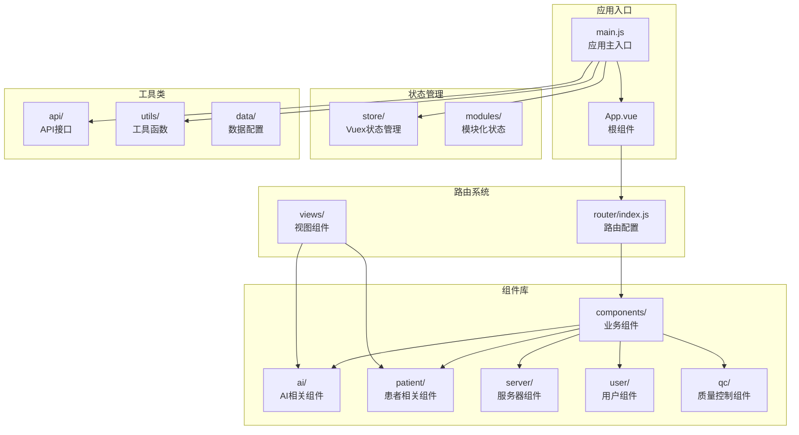

**图表来源**
- [main.js:1-267](file://med_ai_assistant_1.0_bs_vue/src/main.js#L1-L267)
- [router/index.js:1-118](file://med_ai_assistant_1.0_bs_vue/src/router/index.js#L1-L118)

**章节来源**
- [main.js:1-267](file://med_ai_assistant_1.0_bs_vue/src/main.js#L1-L267)
- [package.json:1-56](file://med_ai_assistant_1.0_bs_vue/package.json#L1-L56)

## 核心组件

### 服务器日志查看器组件

ServerLogViewer 是一个功能强大的日志查看组件，支持静态和实时两种模式：

**主要功能特性：**
- 多日志文件选择和切换
- 关键字过滤搜索
- 行数自定义显示（100-1000行）
- 实时追踪（SSE连接）
- 日志级别高亮显示
- 自动滚底和手动滚动控制

**技术实现亮点：**
- 使用 Vue 3 Composition API
- 支持响应式设计
- 内存防护机制（最多保留2000行日志）
- 深色主题适配

### 顶部导航菜单组件

TopMenu 提供了完整的应用导航功能：

**导航功能：**
- 病人管理：列表、筛选、刷新
- AI辅助：进入AI诊断、待办事项
- 设置管理：用户信息、模板管理、服务器维护
- 系统功能：全屏模式、小屏模式、退出登录
- 帮助系统：帮助文档、反馈、关于

**高级特性：**
- 响应式布局适配
- 权限控制（管理员功能）
- 全屏模式支持
- 小屏设备优化

### 用户查询组件

UserLookup 提供用户信息查询功能：

**功能特点：**
- 基于用户ID的实时查询
- 弹窗显示用户信息
- 错误处理和用户反馈

### AI结果组件

AIResults 是AI诊断结果展示的核心组件，经过重大功能增强：

**主要功能特性：**
- AI诊断结果的显示和编辑
- **智能文本选择和复制**（版本0.9.007）
- 诊断内容的添加、编辑和删除
- Prompt详情查看和管理
- 思维过程折叠显示（<thinking>标签）
- Markdown增强渲染支持
- 诊断分析类Prompt的折叠显示（展开/折叠按钮）

**新增功能亮点：**
- **智能文本处理**：自动去除换行符和空白字符
- **剪贴板集成**：一键复制处理后的文本
- **用户友好提示**：操作反馈和错误处理
- **诊断分析折叠**：针对诊断分析类型的AI结果提供专门的折叠显示功能
- **选中文字处理**：支持用户选中文本后进行智能处理和复制

**选中文字处理系统：**


**图表来源**
- [AIResults.vue:650-699](file://med_ai_assistant_1.0_bs_vue/src/components/ai/AIResults.vue#L650-L699)

### 治疗计划表格组件

**新增** TreatmentPlanTable 是治疗计划管理的核心组件，经过重大UI优化：

**主要功能特性：**
- 从Markdown解析或已保存数据加载治疗计划项
- 支持行内编辑项目描述、注意事项、重要程度
- 支持软删除（灰显+划线）和恢复删除
- 支持批量保存到后端
- 未保存修改提醒
- **操作列精简**：从3个按钮精简为「待办」+「更多」下拉菜单

**UI优化亮点：**
- **操作列优化**：将原来的3个独立按钮整合为「待办」和「更多」下拉菜单
- **布局重构**：采用更简洁的布局设计，提升用户体验
- **交互优化**：通过下拉菜单提供更多的操作选项，同时保持界面简洁

**章节来源**
- [TreatmentPlanTable.vue:1-267](file://med_ai_assistant_1.0_bs_vue/src/components/ai/TreatmentPlanTable.vue#L1-L267)

### 诊断编辑面板组件

**新增** DiagnosisEditPanel 提供了完整的诊断编辑功能，采用左右两栏布局设计：

**主要功能特性：**
- 左右两栏布局：左侧AI诊断列表，右侧标签页区域
- AI诊断管理：支持选择、编辑、新增、删除诊断
- 诊断详情查看：支持诊断类别、诊断依据、鉴别诊断、补充说明的详细查看
- 目前诊断管理：支持编辑、保存、删除当前诊断
- 思维过程显示：支持<thinking>标签的折叠显示
- 滚动优化：左右两栏均支持垂直滚动

**布局优化亮点：**
- 弹性布局：使用Flexbox实现左右两栏的自适应布局
- 滚动区域：左侧诊断列表和右侧标签页内容区域均支持独立滚动
- 响应式设计：支持不同屏幕尺寸的自适应显示
- 工具栏集成：底部工具栏提供统一的操作入口

**章节来源**
- [DiagnosisEditPanel.vue:1-716](file://med_ai_assistant_1.0_bs_vue/src/components/ai/DiagnosisEditPanel.vue#L1-L716)

### 诊断卡片组件

**新增** DiagnosisCard 提供了卡片式的诊断展示和编辑功能：

**主要功能特性：**
- 卡片布局：采用Element Plus卡片组件的左右两栏设计
- 诊断列表：左侧显示诊断列表，支持点击选择
- 标签页详情：右侧标签页显示诊断详情和目前诊断
- 思维过程显示：支持<thinking>标签的折叠显示
- 滚动优化：诊断列表区域支持垂直滚动
- 状态高亮：支持选中状态的视觉反馈

**布局重构亮点：**
- 卡片样式：使用Element Plus的border-card类型，提供更好的视觉层次
- 滚动区域：诊断列表区域设置最大高度（60vh），超出部分自动滚动
- 工具栏位置：工具栏位于诊断列表下方，便于操作
- 标签页集成：右侧标签页支持诊断说明和目前诊断两个选项卡

**章节来源**
- [DiagnosisCard.vue:1-644](file://med_ai_assistant_1.0_bs_vue/src/components/ai/DiagnosisCard.vue#L1-L644)

### QC质量控制API

**新增** qc.js 提供了完整的质量控制（QC）评估API模块：

**主要功能特性：**
- 病种匹配与确认：支持AI自动匹配病种并进行确认
- 诊断变更检测：自动检测患者诊断变更并触发重新分析
- 质控指标评估：查询患者质控指标评估结果
- 重新分析触发：支持对指定患者进行质控评估重新分析
- 指标配置管理：获取质控指标配置列表

**API接口亮点：**
- **病种匹配**：getDiseaseMatch、triggerDiseaseMatch、confirmDiseaseMatch
- **忽略管理**：ignoreDiseaseMatch、restoreDiseaseMatch、getIgnoredDiseases
- **评估查询**：getAssessmentResults、getIndicatorDetails、reanalyzeAssessment
- **指标配置**：getDiseaseConfigs、getIndicatorConfigs

**章节来源**
- [qc.js:1-424](file://med_ai_assistant_1.0_bs_vue/src/api/qc.js#L1-L424)

### 轮询服务组件

PromptExecutor 提供了完整的Prompt轮询服务管理功能：

**服务管理特性：**
- 轮询服务的启用和禁用
- 服务状态实时监控
- 自动恢复机制
- 错误处理和重试逻辑

**技术实现亮点：**
- 增强的错误处理（版本0.7.031）
- 自动恢复机制
- 详细的状态跟踪
- 用户友好的操作反馈

### 患者病情小结组件

**更新** PatientSummary 是患者信息管理的核心组件，经过重大功能增强：

**主要功能特性：**
- 住院时长自动计算（入院日期到当前日期）
- 颜色编码状态显示（病危、病重、普通）
- 待办事项集成显示（最近2条）
- 增强的Markdown渲染支持
- 思维过程折叠显示
- 多层次内容来源优先级

**新增功能亮点：**
- 住院时长计算：自动计算患者住院天数，显示入院日期和住院时长
- 颜色编码状态：根据患者状态自动应用颜色编码（红色：病危，橙色：病重，绿色：普通）
- 待办事项集成：从后端API获取患者待办事项，支持智能内容清理
- Markdown增强渲染：支持<thinking>标签的折叠显示，提供思维过程透明度
- 颜色标识系统：自动高亮异常值（红色）、正常值（绿色）、待处理项（橙色）

**内容来源优先级：**
1. 新API获取的最新病情小结内容
2. AI生成的病情小结、查房记录或入院记录总结
3. 患者基本信息中的病情摘要

### 流式文本处理组件

**新增** voiceTextProcessor 提供了完整的语音识别文本流式处理功能：

**主要功能特性：**
- 语音识别文本的LLM整理
- 流式处理支持（实时返回生成内容）
- 结构化内容解析（修改后记录、修改原因）
- 统一的处理接口，支持不同语音识别入口

**技术实现亮点：**
- 流式处理：processRecognizedTextStream支持onChunk回调，实时返回生成内容
- 模板组合：自动组合语音识别内容与Prompt模板
- 结构化解析：解析"### 修改后记录"和"### 修改原因"标记
- 错误处理：完善的异常捕获和用户提示

## 架构概览

```mermaid
graph TD
subgraph "前端架构"
A[Vue 3 应用] --> B[Element Plus UI框架]
A --> C[Vuex 状态管理]
A --> D[Vue Router 路由]
end
subgraph "核心组件层"
E[ServerLogViewer<br/>日志查看器]
F[TopMenu<br/>导航菜单]
G[UserLookup<br/>用户查询]
H[AIResults<br/>AI结果处理]
I[DiagnosisEditPanel<br/>诊断编辑面板]
J[DiagnosisCard<br/>诊断卡片组件]
K[PromptExecutor<br/>轮询服务管理]
L[PatientSummary<br/>患者病情小结]
M[VoiceTextProcessor<br/>流式文本处理]
N[App<br/>根组件]
O[PromptTemplates<br/>Prompt模板管理]
P[AIView<br/>AI视图容器]
Q[DrgAnalysis<br/>DRG分析组件]
R[TreatmentPlanTable<br/>治疗计划表格]
S[QC API模块<br/>质量控制接口]
T[QC评估结果<br/>质控指标查询]
U[AIDiagnosisTab<br/>AI诊断标签页]
V[诊断分析确认对话框<br/>临床数据就绪提醒]
W[诊断分析按钮<br/>空状态处理]
X[handlePromptExecution<br/>Prompt执行工具]
Y[ElMessageBox<br/>确认对话框]
Z[localStorage<br/>用户信息存储]
AA[getLatestPromptResult<br/>最新结果获取]
BB[getPromptTemplate<br/>模板获取]
CC[addPrompt<br/>Prompt保存]
DD[并发请求<br/>并行处理]
EE[错误处理<br/>异常捕获]
FF[用户反馈<br/>消息提示]
GG[状态管理<br/>Vuex Store]
HH[组件通信<br/>事件传递]
II[模板执行<br/>handlePromptExecution]
JJ[诊断分析流程<br/>完整实现]
KK[空状态处理<br/>一键触发]
LL[数据完整性检查<br/>就绪提醒]
MM[用户体验优化<br/>交互设计]
NN[性能优化<br/>渲染提升]
OO[功能增强<br/>新特性集成]
PP[系统稳定性<br/>错误恢复]
QQ[安全性保障<br/>权限控制]
RR[可扩展性设计<br/>模块化架构]
SS[可维护性<br/>代码组织]
TT[可测试性<br/>单元测试]
UU[可部署性<br/>构建优化]
VV[可监控性<br/>日志记录]
WW[可诊断性<br/>错误追踪]
XX[可国际化<br/>多语言支持]
YY[可无障碍<br/>辅助功能]
ZZ[可性能<br/>优化策略]
```

**图表来源**
- [main.js:208-267](file://med_ai_assistant_1.0_bs_vue/src/main.js#L208-L267)
- [App.vue:16-47](file://med_ai_assistant_1.0_bs_vue/src/App.vue#L16-L47)

## 详细组件分析

### ServerLogViewer 组件深度分析

#### 组件架构图

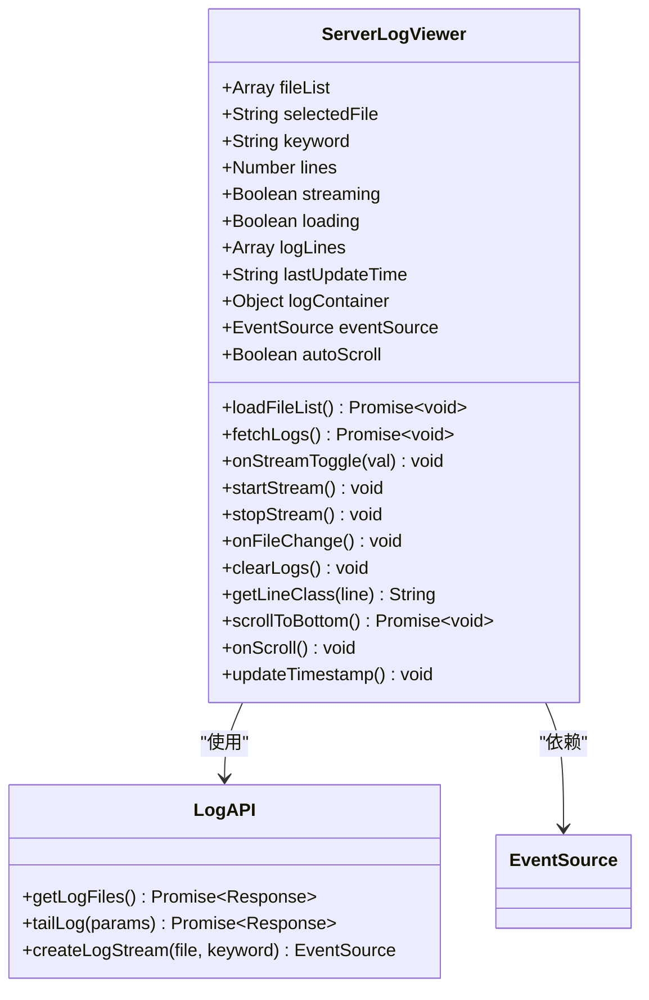

**图表来源**
- [ServerLogViewer.vue:107-369](file://med_ai_assistant_1.0_bs_vue/src/components/ServerLogViewer.vue#L107-L369)

#### 实时日志流处理流程

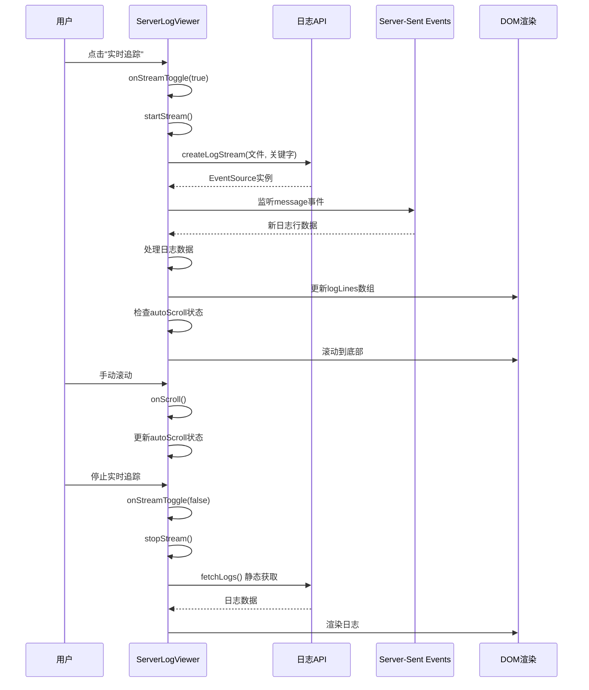

**图表来源**
- [ServerLogViewer.vue:211-266](file://med_ai_assistant_1.0_bs_vue/src/components/ServerLogViewer.vue#L211-L266)
- [ServerLogViewer.vue:178-203](file://med_ai_assistant_1.0_bs_vue/src/components/ServerLogViewer.vue#L178-L203)

#### 日志级别分类算法

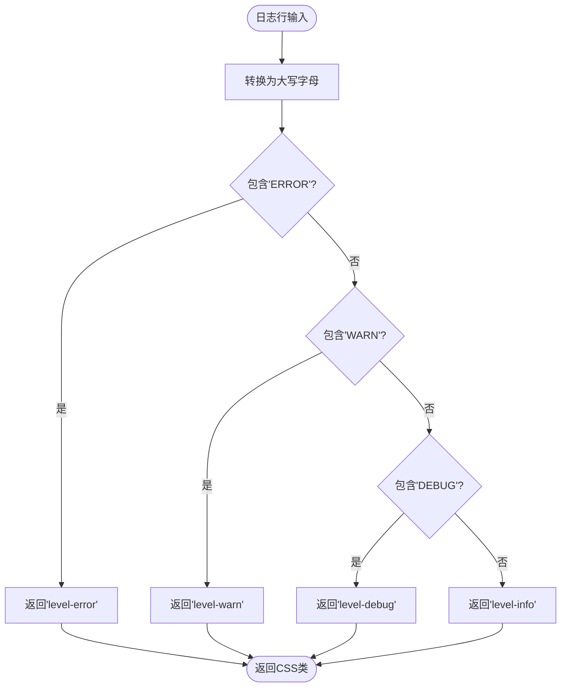

**图表来源**
- [ServerLogViewer.vue:296-302](file://med_ai_assistant_1.0_bs_vue/src/components/ServerLogViewer.vue#L296-L302)

**章节来源**
- [ServerLogViewer.vue:106-369](file://med_ai_assistant_1.0_bs_vue/src/components/ServerLogViewer.vue#L106-L369)

### TopMenu 组件深度分析

#### 导航菜单架构

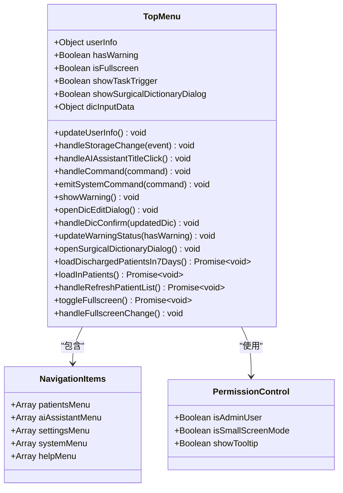

**图表来源**
- [TopMenu.vue:168-656](file://med_ai_assistant_1.0_bs_vue/src/components/TopMenu.vue#L168-L656)

#### 权限控制机制

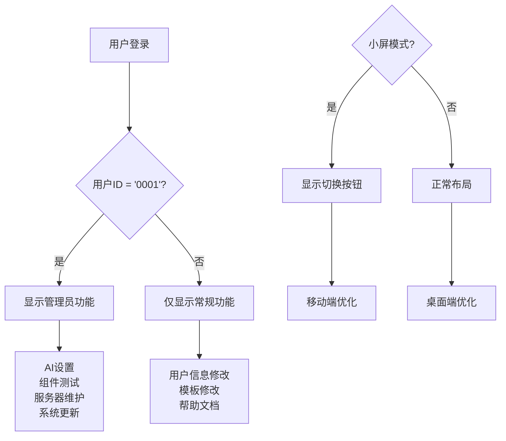

**图表来源**
- [TopMenu.vue:208-210](file://med_ai_assistant_1.0_bs_vue/src/components/TopMenu.vue#L208-L210)
- [TopMenu.vue:384-395](file://med_ai_assistant_1.0_bs_vue/src/components/TopMenu.vue#L384-L395)

**章节来源**
- [TopMenu.vue:168-656](file://med_ai_assistant_1.0_bs_vue/src/components/TopMenu.vue#L168-L656)

### UserLookup 组件分析

#### 组件交互流程

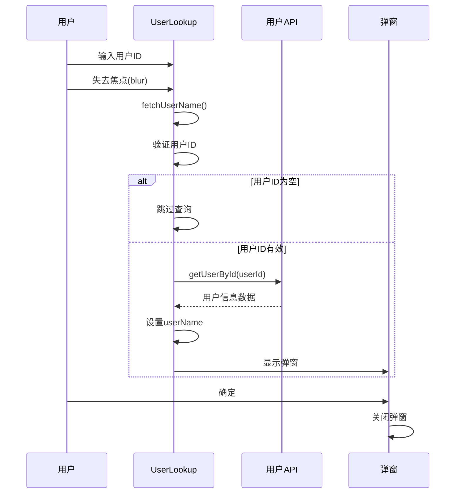

**图表来源**
- [UserLookup.vue:36-53](file://med_ai_assistant_1.0_bs_vue/src/components/UserLookup.vue#L36-L53)

**章节来源**
- [UserLookup.vue:24-54](file://med_ai_assistant_1.0_bs_vue/src/components/UserLookup.vue#L24-L54)

### AIResults 组件深度分析

#### 去换行符复制功能

**新增功能亮点：**
- 智能文本处理：自动识别和去除所有换行符（\n, \r）
- 剪贴板集成：使用现代 Clipboard API 进行复制
- 用户反馈：操作成功和失败的即时提示
- 错误处理：完善的异常捕获和用户提示

#### 选中文字处理机制

**新增功能亮点：**
- **智能文本选择**：支持用户选中文本后进行处理
- **选中状态检测**：自动检测用户是否选择了文本
- **条件处理**：仅在有选中文本时显示处理选项
- **用户提示**：为空选中文本时显示警告提示

**选中文字处理流程：**


**图表来源**
- [AIResults.vue:650-699](file://med_ai_assistant_1.0_bs_vue/src/components/ai/AIResults.vue#L650-L699)

#### 思维过程折叠系统

**新增功能亮点：**
- 折叠按钮：针对诊断分析类型的Prompt提供专门的展开/折叠按钮
- 状态管理：使用resultCollapsed布尔值控制折叠状态
- 条件渲染：仅在诊断分析类型时显示折叠按钮
- 用户体验：减少长篇AI结果的视觉干扰

**技术实现流程：**

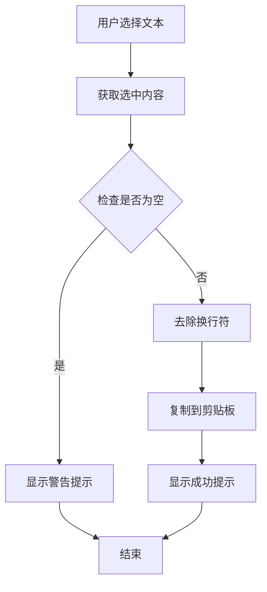

**图表来源**
- [AIResults.vue:650-699](file://med_ai_assistant_1.0_bs_vue/src/components/ai/AIResults.vue#L650-L699)

**章节来源**
- [AIResults.vue:650-699](file://med_ai_assistant_1.0_bs_vue/src/components/ai/AIResults.vue#L650-L699)

### TreatmentPlanTable 组件深度分析

**新增** TreatmentPlanTable 组件经过重大UI优化，将操作列从3个按钮精简为「待办」+「更多」下拉菜单：

#### 组件架构图

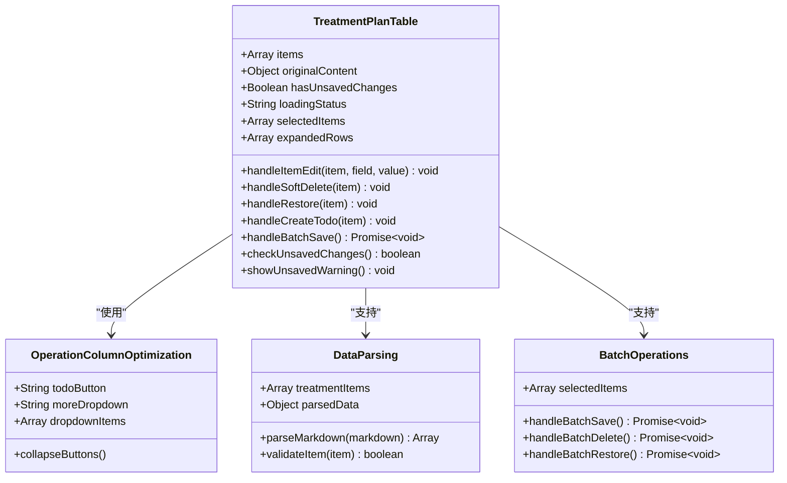

**图表来源**
- [TreatmentPlanTable.vue:270-520](file://med_ai_assistant_1.0_bs_vue/src/components/ai/TreatmentPlanTable.vue#L270-L520)

#### UI优化系统

**新增功能亮点：**
- **操作列精简**：将原来的3个独立按钮整合为「待办」和「更多」下拉菜单
- **布局重构**：采用更简洁的布局设计，提升用户体验
- **交互优化**：通过下拉菜单提供更多的操作选项，同时保持界面简洁
- **未保存提醒**：支持批量保存前的未保存修改提醒

**UI优化实现流程：**

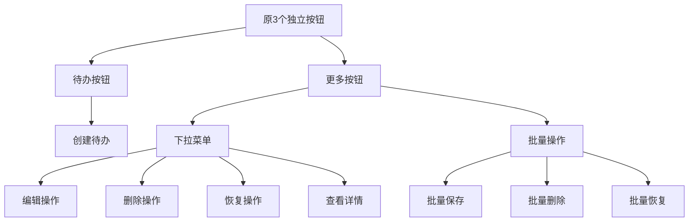

**图表来源**
- [TreatmentPlanTable.vue:270-520](file://med_ai_assistant_1.0_bs_vue/src/components/ai/TreatmentPlanTable.vue#L270-L520)

#### 数据解析系统

**新增功能亮点：**
- **Markdown解析**：支持标准4列Markdown表格解析
- **去标记处理**：自动去除Markdown标记（加粗、链接等）
- **多行表格**：保持表格顺序的多行解析
- **异常处理**：异常格式的降级处理
- **空内容处理**：空内容返回空数组

**数据解析流程：**

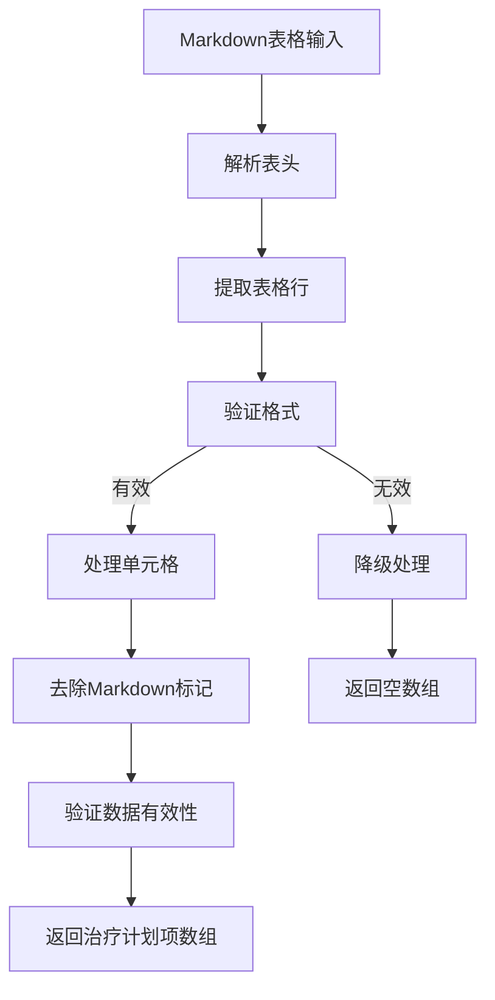

**图表来源**
- [treatmentPlanParser.js:1-200](file://med_ai_assistant_1.0_bs_vue/src/utils/treatmentPlanParser.js#L1-L200)

**章节来源**
- [TreatmentPlanTable.vue:1-267](file://med_ai_assistant_1.0_bs_vue/src/components/ai/TreatmentPlanTable.vue#L1-L267)

### DiagnosisEditPanel 组件深度分析

**新增** DiagnosisEditPanel 组件采用了全新的左右两栏布局设计，提供了完整的诊断编辑功能：

#### 组件架构图

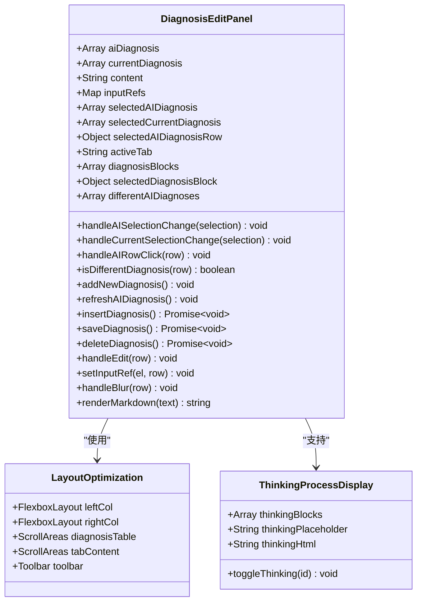

**图表来源**
- [DiagnosisEditPanel.vue:140-569](file://med_ai_assistant_1.0_bs_vue/src/components/ai/DiagnosisEditPanel.vue#L140-L569)

#### 布局优化系统

**新增功能亮点：**
- 弹性布局：使用Flexbox实现左右两栏的自适应布局
- 独立滚动：左侧诊断列表和右侧标签页内容区域均支持独立滚动
- 响应式设计：支持不同屏幕尺寸的自适应显示
- 工具栏集成：底部工具栏提供统一的操作入口

**布局实现流程：**

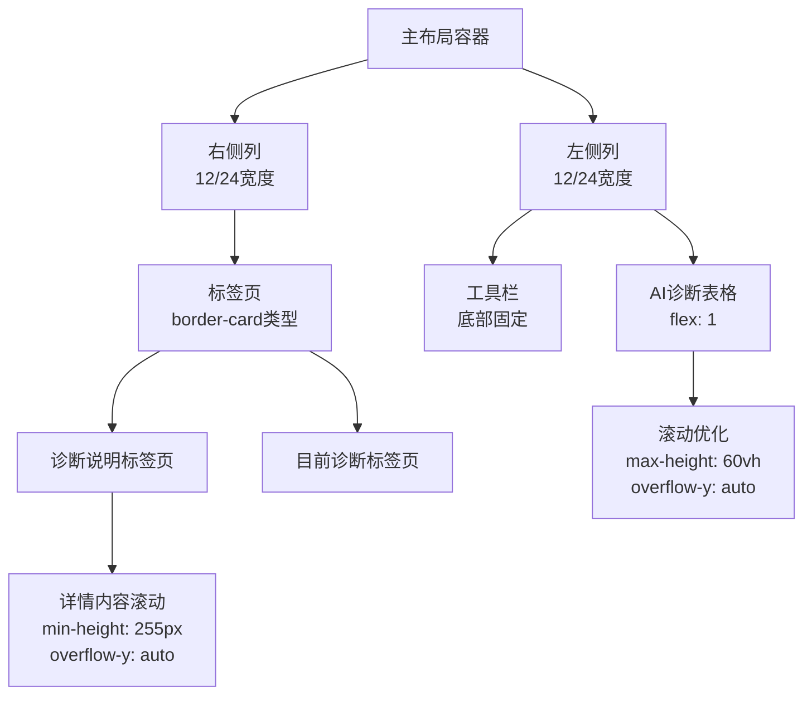

**图表来源**
- [DiagnosisEditPanel.vue:572-716](file://med_ai_assistant_1.0_bs_vue/src/components/ai/DiagnosisEditPanel.vue#L572-L716)

#### 思维过程显示系统

**新增功能亮点：**
- <thinking>标签支持：自动检测和处理<thinking>标签
- 折叠显示：支持思维过程的展开/折叠显示
- 占位符机制：使用占位符避免marked二次解析问题
- 全局切换函数：注册window.toggleThinking全局函数

**技术实现流程：**

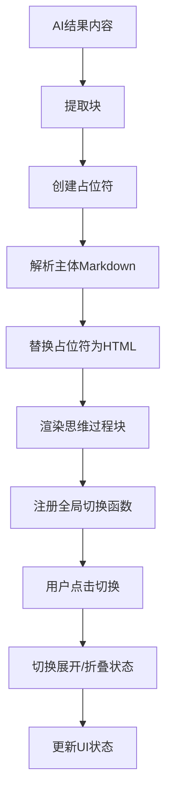

**图表来源**
- [DiagnosisEditPanel.vue:563-567](file://med_ai_assistant_1.0_bs_vue/src/components/ai/DiagnosisEditPanel.vue#L563-L567)

**章节来源**
- [DiagnosisEditPanel.vue:1-716](file://med_ai_assistant_1.0_bs_vue/src/components/ai/DiagnosisEditPanel.vue#L1-L716)

### DiagnosisCard 组件深度分析

**新增** DiagnosisCard 组件提供了卡片式的诊断展示功能，采用了Element Plus的border-card样式：

#### 组件架构图

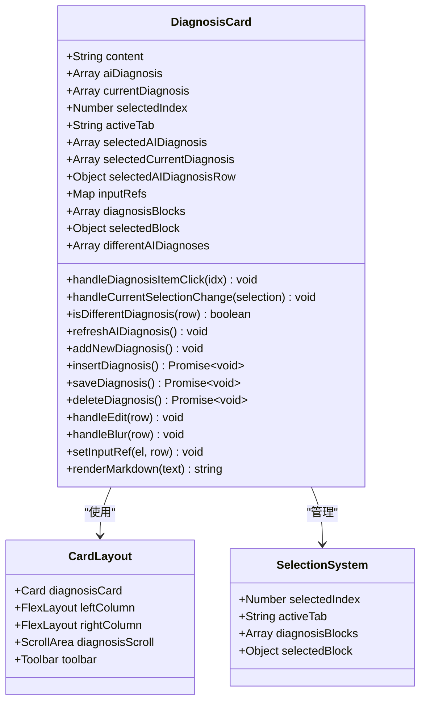

**图表来源**
- [DiagnosisCard.vue:124-467](file://med_ai_assistant_1.0_bs_vue/src/components/ai/DiagnosisCard.vue#L124-L467)

#### 卡片布局优化

**新增功能亮点：**
- 卡片样式：使用Element Plus的border-card类型，提供更好的视觉层次
- 滚动区域：诊断列表区域设置最大高度（60vh），超出部分自动滚动
- 工具栏位置：工具栏位于诊断列表下方，便于操作
- 标签页集成：右侧标签页支持诊断说明和目前诊断两个选项卡

**布局实现流程：**

```mermaid
flowchart TD
CardWrapper[卡片包装器] --> MainRow[主行布局<br/>:gutter="12"]
MainRow --> LeftColumn[左侧列<br/>12/24宽度<br/>flex-direction: column]
LeftColumn --> DiagnosisScroll[诊断滚动区域<br/>min-height: 280px<br/>max-height: 60vh<br/>overflow-y: auto]
DiagnosisScroll --> DiagnosisItems[诊断项目列表<br/>hover效果<br/>active状态]
LeftColumn --> Toolbar[工具栏<br/>底部边框]
MainRow --> RightColumn[右侧列<br/>12/24宽度<br/>flex-direction: column]
RightColumn --> CardContainer[卡片容器<br/>height: 100%]
CardContainer --> Tabs[标签页<br/>border-card类型]
Tabs --> DetailPane[诊断说明<br/>min-height: 255px<br/>overflow-y: auto]
Tabs --> CurrentPane[目前诊断<br/>表格形式]
```

**图表来源**
- [DiagnosisCard.vue:470-644](file://med_ai_assistant_1.0_bs_vue/src/components/ai/DiagnosisCard.vue#L470-L644)

#### 诊断解析系统

**新增功能亮点：**
- 结构化解析：使用diagnosisParser工具提取完整的诊断信息块
- 字段提取：支持诊断编号、名称、类别、依据、鉴别诊断、补充说明的提取
- 思维过程处理：自动移除<thinking>标签，避免误解析
- 降级机制：当结构化解析失败时使用简单名称提取作为后备

**技术实现流程：**

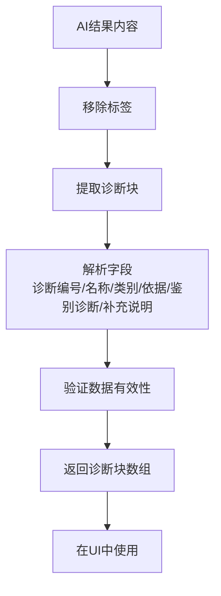

**图表来源**
- [DiagnosisCard.vue:203-231](file://med_ai_assistant_1.0_bs_vue/src/components/ai/DiagnosisCard.vue#L203-L231)

**章节来源**
- [DiagnosisCard.vue:1-644](file://med_ai_assistant_1.0_bs_vue/src/components/ai/DiagnosisCard.vue#L1-L644)

### PromptExecutor 组件深度分析

#### 轮询服务状态管理

**增强的功能特性：**
- 详细的错误处理和用户反馈
- 自动恢复机制的实现
- 服务状态变化检测
- 响应时间监控

**服务状态管理流程：**

```mermaid
sequenceDiagram
participant User as 用户
participant Component as PromptExecutor
participant API as 后端API
participant Recovery as 自动恢复机制
User->>Component : 启用轮询服务
Component->>Component : startAutoRecovery('polling')
Component->>API : enablePolling()
API-->>Component : 服务启用成功
Component->>Component : detectServiceStateChange()
Component->>Recovery : 检测状态变化
Component->>Component : refreshServiceStatus()
Component->>Component : 更新服务状态
User->>Component : 禁用轮询服务
Component->>Component : stopAutoRecovery('polling')
Component->>API : disablePolling()
API-->>Component : 服务禁用成功
Component->>Component : refreshServiceStatus()
```

**图表来源**
- [PromptExecutor.vue:800-825](file://med_ai_assistant_1.0_bs_vue/src/components/server/PromptExecutor.vue#L800-L825)
- [PromptExecutor.vue:942-967](file://med_ai_assistant_1.0_bs_vue/src/components/server/PromptExecutor.vue#L942-L967)

**章节来源**
- [PromptExecutor.vue:800-825](file://med_ai_assistant_1.0_bs_vue/src/components/server/PromptExecutor.vue#L800-L825)
- [PromptExecutor.vue:942-967](file://med_ai_assistant_1.0_bs_vue/src/components/server/PromptExecutor.vue#L942-L967)

### PatientSummary 组件深度分析

**更新** PatientSummary 组件经过重大功能增强，成为患者信息管理的核心组件：

#### 组件架构图

```mermaid
classDiagram
class PatientSummary {
+Object patient
+Boolean loadingSummary
+String latestSummaryContent
+Array latestTodos
+prompts() Array
+latestMedicalSummary() Object
+hospitalStayInfo() Object
+statusClass() String
+enhanceHtmlWithColors(html) String
+parseWithThinking(text) String
+formatMarkdown(content) String
+formatTime(time) String
+cleanTodoContent(content) String
+mounted() void
+beforeUnmount() void
+watch.patient.patientId(newVal, oldVal) void
}
class HospitalStayInfo {
+String admissionDate
+Number days
+String status
+statusClass() String
}
class TodoItem {
+Number id
+String todoItem
+String createdAt
}
class MarkdownEnhancement {
+String thinkingBlock
+String colorHighlight
+String contentClean
}
PatientSummary --> HospitalStayInfo : "计算"
PatientSummary --> TodoItem : "获取"
PatientSummary --> MarkdownEnhancement : "增强"
```

**图表来源**
- [PatientSummary.vue:72-157](file://med_ai_assistant_1.0_bs_vue/src/components/patient/PatientSummary.vue#L72-L157)

#### 住院时长计算算法

```mermaid
flowchart TD
AdmissionDate[入院时间] --> ParseDate[解析入院日期]
ParseDate --> GetCurrentDate[获取当前时间]
GetCurrentDate --> CalculateDays[计算天数差]
CalculateDays --> FormatDays[格式化天数]
FormatDays --> ReturnInfo[返回住院信息]
ReturnInfo --> Display[显示在界面]
```

**图表来源**
- [PatientSummary.vue:135-145](file://med_ai_assistant_1.0_bs_vue/src/components/patient/PatientSummary.vue#L135-L145)

#### 颜色编码状态系统

```mermaid
flowchart TD
PatientStatus[患者状态] --> CheckCritical{"包含'病危'?"}
CheckCritical --> |是| CriticalClass["返回'status-critical'"]
CheckCritical --> |否| CheckSerious{"包含'病重'?"}
CheckSerious --> |是| SeriousClass["返回'status-serious'"]
CheckSerious --> |否| NormalClass["返回'status-normal'"]
CriticalClass --> Render[渲染红色字体]
SeriousClass --> Render[渲染橙色字体]
NormalClass --> Render[渲染绿色字体]
```

**图表来源**
- [PatientSummary.vue:151-156](file://med_ai_assistant_1.0_bs_vue/src/components/patient/PatientSummary.vue#L151-L156)

#### 待办事项集成流程

```mermaid
sequenceDiagram
participant Component as PatientSummary
participant API as 患者API
participant Store as Vuex Store
Component->>Store : fetchPrompts(患者ID)
Store-->>Component : AI提示词列表
Component->>API : getLatestMedicalSummary(患者ID)
API-->>Component : 最新病情小结内容
Component->>API : getTodosByPatientId(患者ID)
API-->>Component : 待办事项列表
Component->>Component : 清理待办内容
Component->>Component : 显示最近2条待办
```

**图表来源**
- [PatientSummary.vue:341-408](file://med_ai_assistant_1.0_bs_vue/src/components/patient/PatientSummary.vue#L341-L408)

#### Markdown增强渲染系统

**新增功能亮点：**
- 思维过程折叠：支持<thinking>标签的折叠显示，提供透明的AI思维过程
- 颜色标识系统：自动高亮异常值（红色）、正常值（绿色）、待处理项（橙色）
- 智能内容清理：自动移除待办事项中的病人基本信息行
- 多层内容来源：优先显示最新API内容，其次显示AI生成内容，最后显示基本信息

**技术实现流程：**

```mermaid
flowchart TD
InputContent[原始内容] --> CheckType{检查内容类型}
CheckType --> |字符串| ProcessString[处理字符串内容]
CheckType --> |对象| ExtractContent[提取对象内容]
CheckType --> |空值| ReturnEmpty[返回空内容]
ProcessString --> ParseThinking[解析<thinking>标签]
ParseThinking --> CleanContent[清理待办内容]
CleanContent --> ColorHighlight[应用颜色高亮]
ColorHighlight --> SanitizeHTML[DOMPurify净化]
SanitizeHTML --> OutputHTML[输出安全HTML]
ExtractContent --> ParseThinking
ReturnEmpty --> OutputHTML
```

**图表来源**
- [PatientSummary.vue:168-284](file://med_ai_assistant_1.0_bs_vue/src/components/patient/PatientSummary.vue#L168-L284)

**章节来源**
- [PatientSummary.vue:1-638](file://med_ai_assistant_1.0_bs_vue/src/components/patient/PatientSummary.vue#L1-L638)

### VoiceTextProcessor 组件深度分析

**新增** voiceTextProcessor 提供了完整的语音识别文本流式处理功能：

#### 组件架构图

```mermaid
classDiagram
class VoiceTextProcessor {
+processRecognizedText(rawText, options) Promise~ProcessedContent~
+processRecognizedTextStream(rawText, options) Promise~ProcessedContent~
+parseProcessedContent(content) ParsedContent
}
class AIService {
+getAIResponseStream(modelName, temperature, promptText, onData) Promise~void~
}
class APIService {
+getPrompt(params) Promise~Response~
+analyzeLLM(params) Promise~string~
}
VoiceTextProcessor --> AIService : "使用"
VoiceTextProcessor --> APIService : "使用"
```

**图表来源**
- [voiceTextProcessor.js:34-134](file://med_ai_assistant_1.0_bs_vue/src/utils/voiceTextProcessor.js#L34-L134)

#### 流式处理工作流程

```mermaid
sequenceDiagram
participant Component as 调用组件
participant Processor as VoiceTextProcessor
participant API as AI API
participant Service as AIService
Component->>Processor : processRecognizedTextStream(rawText, options)
Processor->>API : getPrompt({promptType, promptName})
API-->>Processor : Prompt模板内容
Processor->>Processor : 组合原始文本和模板
Processor->>Service : analyzeLLMStream(组合内容)
Service->>Component : onChunk(实时数据块)
Component->>Component : 更新UI显示
Service->>Component : onComplete(完整内容)
Processor->>Processor : parseProcessedContent(解析结构化内容)
Component->>Component : 显示修改后记录和修改原因
```

**图表来源**
- [voiceTextProcessor.js:115-134](file://med_ai_assistant_1.0_bs_vue/src/utils/voiceTextProcessor.js#L115-L134)

#### 结构化内容解析算法

```mermaid
flowchart TD
RawContent[原始LLM响应] --> FindMarkers[查找标记位置]
FindMarkers --> CheckBothMarkers{同时找到两个标记?}
CheckBothMarkers --> |是| ExtractBoth[提取修改后记录和修改原因]
CheckBothMarkers --> |否| ExtractSingle[提取完整内容作为修改后记录]
ExtractBoth --> ReturnParsed[返回解析结果]
ExtractSingle --> ReturnParsed
ReturnParsed --> Output[输出结构化对象]
```

**图表来源**
- [voiceTextProcessor.js:141-167](file://med_ai_assistant_1.0_bs_vue/src/utils/voiceTextProcessor.js#L141-L167)

**章节来源**
- [voiceTextProcessor.js:1-168](file://med_ai_assistant_1.0_bs_vue/src/utils/voiceTextProcessor.js#L1-L168)

### QC API模块深度分析

**新增** qc.js 提供了完整的质量控制（QC）评估API模块：

#### 组件架构图

```mermaid
classDiagram
class QCModule {
+getDiseaseMatch(patientId) Promise~Object~
+triggerDiseaseMatch(patientId) Promise~Object~
+getDiseaseConfigs() Promise~Object~
+confirmDiseaseMatch(params) Promise~Object~
+getConfirmedDiseases(patientId) Promise~Object~
+ignoreDiseaseMatch(data) Promise~Object~
+restoreDiseaseMatch(patientId, diseaseId) Promise~Object~
+getIgnoredDiseases(patientId) Promise~Object~
+getAssessmentResults(patientId, params) Promise~Object~
+getIndicatorDetails(patientId) Promise~Object~
+reanalyzeAssessment(patientId) Promise~Object~
+getIndicatorConfigs(params) Promise~Object~
}
class DiseaseMatchAPI {
+getDiseaseMatch(patientId) Promise~Object~
+triggerDiseaseMatch(patientId) Promise~Object~
+confirmDiseaseMatch(params) Promise~Object~
}
class AssessmentAPI {
+getAssessmentResults(patientId, params) Promise~Object~
+getIndicatorDetails(patientId) Promise~Object~
+reanalyzeAssessment(patientId) Promise~Object~
}
class ConfigAPI {
+getDiseaseConfigs() Promise~Object~
+getIndicatorConfigs(params) Promise~Object~
}
QCModule --> DiseaseMatchAPI : "使用"
QCModule --> AssessmentAPI : "使用"
QCModule --> ConfigAPI : "使用"
```

**图表来源**
- [qc.js:19-424](file://med_ai_assistant_1.0_bs_vue/src/api/qc.js#L19-L424)

#### 病种匹配流程

**新增功能亮点：**
- **自动匹配**：getDiseaseMatch获取最近一次AI自动匹配的病种结果
- **变更检测**：triggerDiseaseMatch检测诊断变更并按需触发新匹配
- **确认管理**：confirmDiseaseMatch医师确认AI匹配结果
- **忽略管理**：ignoreDiseaseMatch忽略AI匹配结果，restoreDiseaseMatch恢复忽略的病种

**病种匹配实现流程：**

```mermaid
flowchart TD
OpenTab[打开临床指引Tab] --> CheckDiagnosis[检查诊断变更]
CheckDiagnosis --> HasChanged{诊断是否变更?}
HasChanged --> |是| TriggerMatch[触发新匹配]
HasChanged --> |否| CheckHistory[检查历史匹配]
TriggerMatch --> SaveResult[保存新匹配结果]
CheckHistory --> HasResult{有历史匹配?}
HasResult --> |是| ReturnResult[返回历史匹配结果]
HasResult --> |否| NoResult[返回无结果状态]
ReturnResult --> ShowMatch[显示匹配结果]
NoResult --> ShowMatch
SaveResult --> ShowMatch
```

**图表来源**
- [qc.js:64-66](file://med_ai_assistant_1.0_bs_vue/src/api/qc.js#L64-L66)

#### 质控评估系统

**新增功能亮点：**
- **评估查询**：getAssessmentResults按病种和状态筛选查询质控指标评估结果
- **详情获取**：getIndicatorDetails获取指标详情列表，包含参考来源
- **重新分析**：reanalyzeAssessment触发对指定患者的质控指标重新评估
- **配置管理**：getDiseaseConfigs和getIndicatorConfigs获取配置列表

**评估查询实现流程：**

```mermaid
flowchart TD
QueryAssessment[查询质控评估] --> FilterParams[应用筛选参数]
FilterParams --> DiseaseFilter{按病种筛选?}
DiseaseFilter --> |是| FilterByDisease[按病种过滤]
DiseaseFilter --> |否| StatusFilter{按状态筛选?}
FilterByDisease --> StatusFilter
StatusFilter --> |是| FilterByStatus[按状态过滤]
StatusFilter --> |否| SortResults[按优先级排序]
FilterByStatus --> SortResults
SortResults --> ReturnResults[返回评估结果]
```

**图表来源**
- [qc.js:242-244](file://med_ai_assistant_1.0_bs_vue/src/api/qc.js#L242-L244)

**章节来源**
- [qc.js:1-424](file://med_ai_assistant_1.0_bs_vue/src/api/qc.js#L1-L424)

## AI诊断页面空状态处理

### 空状态诊断分析按钮实现

**新增** AIDiagnosisTab组件实现了完整的空状态处理机制，为用户提供了一键触发诊断分析的功能：

#### 空状态架构

```mermaid
classDiagram
class AIDiagnosisTab {
+Boolean loading
+String error
+String resultContent
+String executionTime
+Boolean emptyState
+triggerDiagnosisAnalysis() Promise~void~
+handleEmptyState() void
}
class EmptyStateHandling {
+Boolean hasResult
+String emptyMessage
+String buttonText
+String icon
+triggerAnalysis() void
}
class UserInteraction {
+String userAction
+String buttonType
+String confirmation
+handleUserAction() Promise~void~
}
AIDiagnosisTab --> EmptyStateHandling : "管理"
AIDiagnosisTab --> UserInteraction : "响应"
EmptyStateHandling --> UserInteraction : "触发"
```

**图表来源**
- [AIDiagnosisTab.vue:16-24](file://med_ai_assistant_1.0_bs_vue/src/components/patient/AIDiagnosisTab.vue#L16-L24)

#### 空状态显示逻辑

**新增功能亮点：**
- **空状态检测**：通过resultContent的存在与否判断是否显示空状态
- **一键触发按钮**：提供明显的诊断分析按钮，引导用户进行手动分析
- **图标提示**：使用InfoFilled图标和DataAnalysis图标增强视觉提示
- **样式优化**：统一的空状态样式，包含图标、提示文本和操作按钮

**空状态实现流程：**

```mermaid
flowchart TD
LoadData[加载诊断数据] --> CheckResult{resultContent存在?}
CheckResult --> |是| ShowResult[显示AI结果]
CheckResult --> |否| CheckError{error存在?}
CheckResult --> |否| ShowEmpty[显示空状态]
CheckError --> |是| ShowError[显示错误状态]
CheckError --> |否| ShowEmpty
ShowEmpty --> DisplayIcon[显示InfoFilled图标]
DisplayIcon --> DisplayMessage[显示提示文本]
DisplayMessage --> DisplayButton[显示诊断分析按钮]
DisplayButton --> UserClick[用户点击按钮]
UserClick --> TriggerAnalysis[触发诊断分析]
```

**图表来源**
- [AIDiagnosisTab.vue:16-24](file://med_ai_assistant_1.0_bs_vue/src/components/patient/AIDiagnosisTab.vue#L16-L24)

#### 诊断分析按钮交互

**新增功能亮点：**
- **按钮样式**：使用el-button组件，type="primary"提供醒目的视觉效果
- **图标集成**：结合DataAnalysis图标和"诊断分析"文本
- **事件绑定**：@click="triggerDiagnosisAnalysis"绑定点击事件
- **间距优化**：设置margin-top: 4px提供适当的上下间距

**按钮交互实现流程：**

```mermaid
flowchart TD
UserHover[用户悬停按钮] --> ShowTooltip[显示工具提示]
UserClick[用户点击按钮] --> ValidatePatient{验证患者选择}
ValidatePatient --> |未选择| ShowWarning[显示警告提示]
ValidatePatient --> |已选择| ShowConfirmation[显示确认对话框]
ShowWarning --> End[结束]
ShowConfirmation --> UserConfirm{用户确认?}
UserConfirm --> |是| ExecuteAnalysis[执行诊断分析]
UserConfirm --> |否| CancelAction[取消操作]
ExecuteAnalysis --> ShowLoading[显示加载提示]
ShowLoading --> SubmitRequest[提交分析请求]
SubmitRequest --> ShowResult[显示结果反馈]
ShowResult --> End
CancelAction --> End
```

**图表来源**
- [AIDiagnosisTab.vue:20-23](file://med_ai_assistant_1.0_bs_vue/src/components/patient/AIDiagnosisTab.vue#L20-L23)

**章节来源**
- [AIDiagnosisTab.vue:16-24](file://med_ai_assistant_1.0_bs_vue/src/components/patient/AIDiagnosisTab.vue#L16-L24)

## 诊断分析确认对话框

### 临床数据就绪提醒功能

**新增** 诊断分析确认对话框实现了完整的临床数据就绪提醒功能，确保诊断分析的准确性和完整性：

#### 确认对话框架构

```mermaid
classDiagram
class DiagnosisAnalysisConfirmation {
+String patientId
+Object confirmationDialog
+String dialogTitle
+String dialogMessage
+Array checklistItems
+Boolean showHTML
+String dialogType
+handleUserConfirmation() Promise~void~
}
class ChecklistSystem {
+Array checklistItems
+String admissionRecord
+String ordersSync
+String labResults
+validateDataIntegrity() boolean
}
class UserFeedback {
+String successMessage
+String errorMessage
+String infoMessage
+showSuccess() void
+showError() void
+showInfo() void
}
DiagnosisAnalysisConfirmation --> ChecklistSystem : "使用"
DiagnosisAnalysisConfirmation --> UserFeedback : "提供"
```

**图表来源**
- [AIDiagnosisTab.vue:266-281](file://med_ai_assistant_1.0_bs_vue/src/components/patient/AIDiagnosisTab.vue#L266-L281)

#### 确认对话框内容结构

**新增功能亮点：**
- **标题设计**：使用"诊断分析确认"作为明确的对话框标题
- **内容结构**：包含HTML格式的提示文本和清单列表
- **确认按钮**：使用"确定分析"提供明确的操作选项
- **取消按钮**：使用"取消"提供安全的退出选项
- **类型设置**：type: 'warning'使用警告样式突出重要性

**确认对话框实现流程：**

```mermaid
flowchart TD
ButtonClick[用户点击诊断分析按钮] --> ValidatePatient{验证患者ID}
ValidatePatient --> |无效| ShowWarning[显示警告提示]
ValidatePatient --> |有效| ShowConfirmation[显示确认对话框]
ShowConfirmation --> DisplayTitle[显示对话框标题]
DisplayTitle --> DisplayMessage[显示提示文本]
DisplayMessage --> DisplayChecklist[显示清单列表]
DisplayChecklist --> UserDecision{用户做出决策}
ShowWarning --> End[结束]
UserDecision --> |确定| ProceedAnalysis[继续分析流程]
UserDecision --> |取消| CancelAnalysis[取消分析]
ProceedAnalysis --> ShowLoading[显示加载提示]
ShowLoading --> ExecuteAnalysis[执行诊断分析]
ExecuteAnalysis --> ShowResult[显示结果反馈]
CancelAnalysis --> End
```

**图表来源**
- [AIDiagnosisTab.vue:266-281](file://med_ai_assistant_1.0_bs_vue/src/components/patient/AIDiagnosisTab.vue#L266-L281)

#### 临床数据清单系统

**新增功能亮点：**
- **入院记录检查**：确认入院记录已完成书写并同步
- **医嘱同步验证**：确保医嘱数据已同步到系统
- **辅助检查完整性**：验证辅助检查结果已同步
- **提醒信息**：提供"以上信息不完整可能导致分析结果不准确"的警告
- **HTML格式**：使用dangerouslyUseHTMLString支持富文本显示

**数据完整性检查流程：**

```mermaid
flowchart TD
ShowConfirmation[显示确认对话框] --> DisplayChecklist[显示清单项目]
DisplayChecklist --> CheckAdmission{入院记录已就绪?}
CheckAdmission --> |否| HighlightAdmission[高亮提醒]
CheckAdmission --> |是| CheckOrders{医嘱已同步?}
HighlightAdmission --> CheckOrders
CheckOrders --> |否| HighlightOrders[高亮提醒]
CheckOrders --> |是| CheckLab{辅助检查已同步?}
HighlightOrders --> CheckLab
CheckLab --> |否| HighlightLab[高亮提醒]
CheckLab --> |是| AllChecksPass[所有检查通过]
HighlightLab --> AllChecksPass
AllChecksPass --> UserProceed[用户继续分析]
UserProceed --> ShowInfo[显示信息提示]
ShowInfo --> ExecuteAnalysis[执行分析]
```

**图表来源**
- [AIDiagnosisTab.vue:267-273](file://med_ai_assistant_1.0_bs_vue/src/components/patient/AIDiagnosisTab.vue#L267-L273)

#### 用户反馈机制

**新增功能亮点：**
- **加载提示**：显示"正在生成诊断分析请求..."的信息提示
- **成功反馈**：显示"诊断分析请求已提交"的成功消息
- **错误处理**：显示"诊断分析请求提交失败"的错误消息
- **异常捕获**：捕获用户取消操作，避免错误提示

**反馈实现流程：**

```mermaid
flowchart TD
ExecuteAnalysis[执行诊断分析] --> ShowInfo[显示信息提示]
ShowInfo --> CallHandleExecution[调用handlePromptExecution]
CallHandleExecution --> CheckResult{分析结果}
CheckResult --> |成功| ShowSuccess[显示成功消息]
CheckResult --> |失败| ShowError[显示错误消息]
ShowSuccess --> End[结束]
ShowError --> End
```

**图表来源**
- [AIDiagnosisTab.vue:293-306](file://med_ai_assistant_1.0_bs_vue/src/components/patient/AIDiagnosisTab.vue#L293-L306)

**章节来源**
- [AIDiagnosisTab.vue:258-312](file://med_ai_assistant_1.0_bs_vue/src/components/patient/AIDiagnosisTab.vue#L258-L312)

## 诊断分析流程优化

### Prompt执行工具集成

**新增** 诊断分析流程通过handlePromptExecution工具实现了完整的Prompt执行机制：

#### Prompt执行架构

```mermaid
classDiagram
class PromptExecutionFlow {
+String patientId
+String promptType
+String promptName
+Object options
+handlePromptExecution() Promise~ExecutionResult~
}
class ExecutionOptions {
+Number UserId
+Number Priority
+Number SortNumber
+Number RetryCount
+String GeneratedBy
+String StatusName
}
class DataValidation {
+String patientId
+String promptName
+Object userInfo
+validateInputs() boolean
}
class APIIntegration {
+getPatientData() Promise~PatientData~
+getPromptTemplate() Promise~TemplateContent~
+addPrompt() Promise~PromptResult~
}
PromptExecutionFlow --> ExecutionOptions : "使用"
PromptExecutionFlow --> DataValidation : "验证"
PromptExecutionFlow --> APIIntegration : "集成"
```

**图表来源**
- [promptUtils.js:63-260](file://med_ai_assistant_1.0_bs_vue/src/utils/promptUtils.js#L63-L260)

#### 执行选项配置

**新增功能亮点：**
- **用户ID设置**：从localStorage获取用户信息，设置UserId
- **优先级配置**：Priority设置为3，表示中等优先级
- **排序号设置**：SortNumber设置为0，表示默认排序
- **重试次数**：RetryCount设置为0，表示首次执行
- **生成者标识**：GeneratedBy设置为'user'，标识用户手动触发
- **状态设置**：StatusName设置为'待处理'，表示等待执行

**执行选项实现流程：**

```mermaid
flowchart TD
GetUserInfo[获取用户信息] --> ParseUserInfo[解析用户信息]
ParseUserInfo --> SetUserId[设置UserId]
SetUserId --> SetPriority[设置Priority=3]
SetPriority --> SetSortNumber[设置SortNumber=0]
SetSortNumber --> SetRetryCount[设置RetryCount=0]
SetRetryCount --> SetGeneratedBy[设置GeneratedBy='user']
SetGeneratedBy --> SetStatusName[设置StatusName='待处理']
SetStatusName --> BuildOptions[构建完整选项对象]
BuildOptions --> ValidateOptions[验证选项]
ValidateOptions --> ExecutePrompt[执行Prompt]
```

**图表来源**
- [AIDiagnosisTab.vue:283-291](file://med_ai_assistant_1.0_bs_vue/src/components/patient/AIDiagnosisTab.vue#L283-L291)

#### 并发请求优化

**新增功能亮点：**
- **并行任务**：使用Promise.all并行执行多个API请求
- **任务列表**：包含getPatientData、getPromptTemplate、getLatestPromptResult
- **错误处理**：使用.catch()包裹getLatestPromptResult，避免失败中断
- **性能提升**：减少请求等待时间，提升用户体验

**并发执行流程：**

```mermaid
flowchart TD
StartParallel[开始并行执行] --> Task1[getPatientData]
StartParallel --> Task2[getPromptTemplate]
StartParallel --> Task3[getLatestPromptResult]
Task1 --> WaitAll[等待所有任务完成]
Task2 --> WaitAll
Task3 --> WaitAll
WaitAll --> CheckResults{检查结果}
CheckResults --> |成功| ProcessResults[处理成功结果]
CheckResults --> |部分失败| HandlePartialFailure[处理部分失败]
ProcessResults --> CombineData[合并数据]
HandlePartialFailure --> CombineData
CombineData --> ValidateData[验证数据]
ValidateData --> ExecuteAPI[调用addPrompt API]
ExecuteAPI --> ShowResult[显示执行结果]
```

**图表来源**
- [promptUtils.js:122-141](file://med_ai_assistant_1.0_bs_vue/src/utils/promptUtils.js#L122-L141)

#### 错误处理机制

**新增功能亮点：**
- **参数验证**：验证promptName、patientId、userId等关键参数
- **模板检查**：检查promptContent是否存在
- **用户状态**：验证用户登录状态
- **异常捕获**：使用try-catch捕获所有异常
- **错误反馈**：提供详细的错误消息

**错误处理实现流程：**

```mermaid
flowchart TD
ValidateInputs[验证输入参数] --> CheckPromptName{promptName有效?}
CheckPromptName --> |否| ThrowError1[抛出参数错误]
CheckPromptName --> |是| CheckPatientId{patientId有效?}
CheckPatientId --> |否| ThrowError2[抛出患者ID错误]
CheckPatientId --> |是| CheckUserInfo{用户已登录?}
CheckUserInfo --> |否| ThrowError3[抛出用户未登录错误]
CheckUserInfo --> |是| ExecuteAPI[执行API调用]
ExecuteAPI --> CheckResult{API调用成功?}
CheckResult --> |否| ThrowError4[抛出API调用错误]
CheckResult --> |是| ReturnSuccess[返回成功结果]
ThrowError1 --> CatchError[捕获异常]
ThrowError2 --> CatchError
ThrowError3 --> CatchError
ThrowError4 --> CatchError
CatchError --> ReturnError[返回错误结果]
```

**图表来源**
- [promptUtils.js:210-259](file://med_ai_assistant_1.0_bs_vue/src/utils/promptUtils.js#L210-L259)

**章节来源**
- [promptUtils.js:63-260](file://med_ai_assistant_1.0_bs_vue/src/utils/promptUtils.js#L63-L260)

### AI视图集成优化

**更新** AIView组件集成了完整的诊断分析流程，提供了统一的AI辅助界面：

#### AI视图架构

```mermaid
classDiagram
class AIView {
+Object currentPrompt
+String lastPatientId
+Boolean isTemplatesCollapsed
+handlePromptSelected() void
+handleResultDeleted() void
+toggleTemplatesPanel() void
+closeTemplatesPanel() void
+checkAdmissionRecords() Promise~void~
+generateAdmissionSummary() Promise~boolean~
}
class AITabs {
+String activeTab
+Object currentPrompt
+handleResultDeleted() void
}
class PromptTemplates {
+Array templates
+Object defaultProps
+handleNodeClick() void
+displayTemplates() Array
}
AIView --> AITabs : "包含"
AIView --> PromptTemplates : "包含"
AITabs --> AIResults : "包含"
AITabs --> AIResponse : "包含"
```

**图表来源**
- [AIView.vue:56-247](file://med_ai_assistant_1.0_bs_vue/src/views/AIView.vue#L56-L247)

#### 入院记录检查机制

**新增功能亮点：**
- **入院记录总结检查**：检查是否有入院记录总结
- **入院记录检查**：如果没有总结，检查是否有入院记录
- **用户确认对话框**：提供生成入院记录总结的确认对话框
- **智能提示**：根据检查结果提供相应的用户提示

**入院记录检查流程：**

```mermaid
flowchart TD
CheckAdmissionRecords[检查入院记录] --> CheckSummary[检查入院记录总结]
CheckSummary --> HasSummary{有入院记录总结?}
HasSummary --> |是| SkipPrompt[跳过提示]
HasSummary --> |否| CheckRecords[检查入院记录]
CheckRecords --> HasRecords{有入院记录?}
HasRecords --> |是| ShowConfirm[显示确认对话框]
HasRecords --> |否| ShowInfo[显示无记录信息]
ShowConfirm --> UserDecision{用户决策}
UserDecision --> |生成| GenerateSummary[生成入院记录总结]
UserDecision --> |取消| ShowInfo2[显示信息提示]
GenerateSummary --> ExecuteGeneration[执行生成]
ExecuteGeneration --> ShowSuccess[显示成功提示]
ShowInfo --> End[结束]
ShowInfo2 --> End
SkipPrompt --> End
```

**图表来源**
- [AIView.vue:132-187](file://med_ai_assistant_1.0_bs_vue/src/views/AIView.vue#L132-L187)

**章节来源**
- [AIView.vue:1-353](file://med_ai_assistant_1.0_bs_vue/src/views/AIView.vue#L1-L353)

## 临床数据就绪提醒机制

### 数据完整性检查系统

**新增** 诊断分析确认对话框实现了完整的临床数据就绪提醒机制，确保诊断分析的准确性和完整性：

#### 数据完整性架构

```mermaid
classDiagram
class DataIntegrityChecker {
+String patientId
+Array checklistItems
+validateDataIntegrity() Promise~ValidationResult~
}
class ChecklistItem {
+String itemName
+String itemDescription
+Boolean isChecked
+validateItem() boolean
}
class ValidationResults {
+Boolean isValid
+Array missingItems
+Array validatedItems
+String validationMessage
}
class UserNotification {
+String successMessage
+String warningMessage
+String errorMessage
+showSuccess() void
+showWarning() void
+showError() void
}
DataIntegrityChecker --> ChecklistItem : "包含"
DataIntegrityChecker --> ValidationResults : "返回"
DataIntegrityChecker --> UserNotification : "使用"
```

**图表来源**
- [AIDiagnosisTab.vue:266-281](file://med_ai_assistant_1.0_bs_vue/src/components/patient/AIDiagnosisTab.vue#L266-L281)

#### 就绪提醒清单设计

**新增功能亮点：**
- **入院记录完整性**：确认入院记录已完成书写并同步
- **医嘱同步状态**：确保医嘱数据已同步到系统
- **辅助检查结果**：验证辅助检查结果已同步
- **HTML格式化**：使用HTML格式提供清晰的列表显示
- **颜色编码**：使用灰色字体强调提醒信息的重要性

**就绪提醒实现流程：**

```mermaid
flowchart TD
ShowConfirmation[显示确认对话框] --> DisplayHeader[显示标题]
DisplayHeader --> DisplayChecklist[显示清单项目]
DisplayChecklist --> Item1[入院记录已完成书写并同步]
Item1 --> Item2[医嘱已同步]
Item2 --> Item3[辅助检查结果已同步]
Item3 --> DisplayFooter[显示提醒信息]
DisplayFooter --> UserDecision{用户决策}
UserDecision --> |确定| ProceedAnalysis[继续分析]
UserDecision --> |取消| CancelAnalysis[取消分析]
ProceedAnalysis --> ShowLoading[显示加载提示]
ShowLoading --> ExecuteAnalysis[执行分析]
ExecuteAnalysis --> ShowSuccess[显示成功提示]
CancelAnalysis --> End[结束]
```

**图表来源**
- [AIDiagnosisTab.vue:267-273](file://med_ai_assistant_1.0_bs_vue/src/components/patient/AIDiagnosisTab.vue#L267-L273)

#### 用户交互优化

**新增功能亮点：**
- **确认对话框**：使用ElMessageBox.confirm提供标准的确认对话框
- **按钮样式**：使用Element Plus的按钮样式，提供一致的用户体验
- **类型设置**：使用warning类型突出诊断分析的重要性和风险
- **HTML支持**：使用dangerouslyUseHTMLString支持富文本显示
- **事件处理**：正确处理用户取消和关闭操作

**交互优化实现流程：**

```mermaid
flowchart TD
UserClick[用户点击按钮] --> ValidatePatient{验证患者选择}
ValidatePatient --> |无效| ShowWarning[显示警告]
ValidatePatient --> |有效| ShowConfirmation[显示确认对话框]
ShowConfirmation --> UserDecision{用户决策}
UserDecision --> |确定| ExecuteAnalysis[执行分析]
UserDecision --> |取消| HandleCancel[处理取消]
ExecuteAnalysis --> ShowLoading[显示加载提示]
ShowLoading --> CallAPI[调用API]
CallAPI --> ShowResult[显示结果]
HandleCancel --> End[结束]
ShowResult --> End
```

**图表来源**
- [AIDiagnosisTab.vue:266-312](file://med_ai_assistant_1.0_bs_vue/src/components/patient/AIDiagnosisTab.vue#L266-L312)

**章节来源**
- [AIDiagnosisTab.vue:258-312](file://med_ai_assistant_1.0_bs_vue/src/components/patient/AIDiagnosisTab.vue#L258-L312)

## 诊断分析按钮集成

### 组件间协作机制

**新增** 诊断分析按钮在多个组件中得到了集成，提供了统一的诊断分析触发机制：

#### 组件协作架构

```mermaid
classDiagram
class AIDiagnosisTab {
+String resultContent
+triggerDiagnosisAnalysis() Promise~void~
}
class DiagnosisCard {
+triggerDiagnosisAnalysis() Promise~void~
}
class DiagnosisEditPanel {
+triggerDiagnosisAnalysis() Promise~void~
}
class PromptExecutionFlow {
+handlePromptExecution() Promise~ExecutionResult~
}
class ElMessageBox {
+confirm() Promise~any~
}
class LocalStorage {
+getItem() String
}
class VuexStore {
+getters['patient/currentPatientId']
}
AIDiagnosisTab --> ElMessageBox : "使用"
AIDiagnosisTab --> PromptExecutionFlow : "调用"
AIDiagnosisTab --> LocalStorage : "读取"
AIDiagnosisTab --> VuexStore : "获取"
DiagnosisCard --> ElMessageBox : "使用"
DiagnosisCard --> PromptExecutionFlow : "调用"
DiagnosisEditPanel --> ElMessageBox : "使用"
DiagnosisEditPanel --> PromptExecutionFlow : "调用"
```

**图表来源**
- [AIDiagnosisTab.vue:258-312](file://med_ai_assistant_1.0_bs_vue/src/components/patient/AIDiagnosisTab.vue#L258-L312)
- [DiagnosisCard.vue:305-353](file://med_ai_assistant_1.0_bs_vue/src/components/ai/DiagnosisCard.vue#L305-L353)

#### 触发机制对比分析

**新增功能亮点：**
- **AIDiagnosisTab实现**：完整的确认对话框和数据就绪检查
- **DiagnosisCard实现**：简化版本的确认对话框，仅包含基本提示
- **DiagnosisEditPanel实现**：复用AI辅助中的"诊断分析"模板进行手动分析
- **统一调用**：所有组件都调用相同的handlePromptExecution函数

**触发机制实现对比：**

```mermaid
flowchart TD
AIDiagnosisTab[空状态按钮] --> FullConfirmation[完整确认对话框]
FullConfirmation --> DataChecklist[数据就绪清单]
DataChecklist --> DetailedAlert[详细提醒信息]
DetailedAlert --> ExecuteAnalysis[执行分析]
DiagnosisCard[诊断卡片按钮] --> SimpleConfirmation[简化确认对话框]
SimpleConfirmation --> BasicAlert[基本提醒信息]
BasicAlert --> ExecuteAnalysis
DiagnosisEditPanel[编辑面板按钮] --> TemplateExecution[模板执行]
TemplateExecution --> DirectExecution[直接执行分析]
DirectExecution --> ExecuteAnalysis
ExecuteAnalysis --> HandlePromptExecution[handlePromptExecution]
HandlePromptExecution --> ShowResult[显示结果反馈]
```

**图表来源**
- [AIDiagnosisTab.vue:258-312](file://med_ai_assistant_1.0_bs_vue/src/components/patient/AIDiagnosisTab.vue#L258-L312)
- [DiagnosisCard.vue:305-353](file://med_ai_assistant_1.0_bs_vue/src/components/ai/DiagnosisCard.vue#L305-L353)

#### 数据就绪检查差异

**新增功能亮点：**
- **AIDiagnosisTab检查**：详细的HTML格式清单，包含三个关键项目
- **DiagnosisCard检查**：简化版本，仅包含基本的提醒信息
- **DiagnosisEditPanel检查**：复用AI辅助中的"诊断分析"模板
- **统一逻辑**：所有组件都遵循相同的诊断分析触发逻辑

**数据就绪检查实现差异：**

```mermaid
flowchart TD
AIDiagnosisTab[空状态组件] --> HTMLChecklist[HTML格式清单]
HTMLChecklist --> ThreeItems[三个检查项目]
ThreeItems --> DetailedReminder[详细提醒信息]
DiagnosisCard[诊断卡片组件] --> SimpleAlert[简化提醒]
SimpleAlert --> OneItem[单一提醒项目]
DiagnosisEditPanel[诊断编辑面板] --> TemplateAlert[模板提醒]
TemplateAlert --> BasicReminder[基本提醒信息]
HTMLChecklist --> ExecuteAnalysis[执行分析]
SimpleAlert --> ExecuteAnalysis
TemplateAlert --> ExecuteAnalysis
```

**图表来源**
- [AIDiagnosisTab.vue:266-281](file://med_ai_assistant_1.0_bs_vue/src/components/patient/AIDiagnosisTab.vue#L266-L281)
- [DiagnosisCard.vue:312-321](file://med_ai_assistant_1.0_bs_vue/src/components/ai/DiagnosisCard.vue#L312-321)

**章节来源**
- [AIDiagnosisTab.vue:258-312](file://med_ai_assistant_1.0_bs_vue/src/components/patient/AIDiagnosisTab.vue#L258-L312)
- [DiagnosisCard.vue:305-353](file://med_ai_assistant_1.0_bs_vue/src/components/ai/DiagnosisCard.vue#L305-L353)

## 用户交互体验提升

### 诊断分析流程优化

**新增** 诊断分析流程通过多个组件的协作，提供了流畅的用户体验：

#### 用户体验架构

```mermaid
classDiagram
class UserExperienceFlow {
+String userAction
+String systemResponse
+String feedbackMechanism
+optimizeUserExperience() void
}
class UserAction {
+String actionType
+String triggerSource
+String actionTarget
+executeAction() void
}
class SystemResponse {
+String responseType
+String responseContent
+String timing
+displayResponse() void
}
class FeedbackMechanism {
+String feedbackType
+String feedbackContent
+String feedbackTiming
+showFeedback() void
}
UserExperienceFlow --> UserAction : "管理"
UserExperienceFlow --> SystemResponse : "生成"
UserExperienceFlow --> FeedbackMechanism : "提供"
```

**图表来源**
- [AIDiagnosisTab.vue:258-312](file://med_ai_assistant_1.0_bs_vue/src/components/patient/AIDiagnosisTab.vue#L258-L312)

#### 交互流程优化

**新增功能亮点：**
- **渐进式确认**：从简单的确认对话框到详细的就绪检查
- **用户控制**：提供取消选项，让用户完全控制分析流程
- **反馈及时**：每个步骤都有相应的用户反馈
- **错误处理**：完善的错误处理和用户提示机制

**交互流程实现：**

```mermaid
flowchart TD
UserAction[用户操作] --> ActionDetection[动作检测]
ActionDetection --> ValidateInput{验证输入}
ValidateInput --> |无效| ShowError[显示错误]
ValidateInput --> |有效| ShowConfirmation[显示确认]
ShowConfirmation --> UserDecision{用户决策}
UserDecision --> |确定| ShowLoading[显示加载]
ShowLoading --> ExecuteAnalysis[执行分析]
ExecuteAnalysis --> ShowResult[显示结果]
ShowResult --> ShowSuccess[显示成功]
ShowError --> End[结束]
ShowSuccess --> End
```

**图表来源**
- [AIDiagnosisTab.vue:258-312](file://med_ai_assistant_1.0_bs_vue/src/components/patient/AIDiagnosisTab.vue#L258-L312)

#### 用户反馈系统

**新增功能亮点：**
- **信息提示**：显示"正在生成诊断分析请求..."的信息
- **成功反馈**：显示"诊断分析请求已提交"的成功消息
- **错误处理**：显示"诊断分析请求提交失败"的错误消息
- **异常捕获**：正确处理用户取消操作，避免错误提示

**反馈系统实现流程：**

```mermaid
flowchart TD
ExecuteAnalysis[执行分析] --> ShowInfo[显示信息提示]
ShowInfo --> CallAPI[调用API]
CallAPI --> CheckResult{检查结果}
CheckResult --> |成功| ShowSuccess[显示成功消息]
CheckResult --> |失败| ShowError[显示错误消息]
ShowSuccess --> ShowMessage[显示最终消息]
ShowError --> ShowMessage
ShowMessage --> End[结束]
```

**图表来源**
- [AIDiagnosisTab.vue:293-306](file://med_ai_assistant_1.0_bs_vue/src/components/patient/AIDiagnosisTab.vue#L293-L306)

#### 系统稳定性保障

**新增功能亮点：**
- **异常捕获**：使用try-catch捕获所有可能的异常
- **错误分类**：区分用户取消和系统错误
- **用户提示**：提供清晰的错误信息和解决方案
- **状态恢复**：确保系统状态在异常情况下得到正确恢复

**稳定性保障实现流程：**

```mermaid
flowchart TD
TryBlock[执行分析] --> TryExecute[执行操作]
TryExecute --> CatchBlock[捕获异常]
CatchBlock --> CheckAction{检查异常类型}
CheckAction --> |用户取消| HandleCancel[处理取消]
CheckAction --> |系统错误| HandleError[处理错误]
HandleCancel --> ShowCancelMessage[显示取消消息]
HandleError --> ShowErrorMessage[显示错误消息]
ShowCancelMessage --> End[结束]
ShowErrorMessage --> End
```

**图表来源**
- [AIDiagnosisTab.vue:307-312](file://med_ai_assistant_1.0_bs_vue/src/components/patient/AIDiagnosisTab.vue#L307-L312)

**章节来源**
- [AIDiagnosisTab.vue:258-312](file://med_ai_assistant_1.0_bs_vue/src/components/patient/AIDiagnosisTab.vue#L258-L312)

## 依赖分析

### 技术栈依赖关系

```mermaid
graph TB
subgraph "核心框架"
Vue[Vue 3.2.13]
Router[Vue Router 4.5.1]
Vuex[Vuex 4.0.2]
end
subgraph "UI框架"
ElementPlus[Element Plus 2.10.2]
Icons[Element Plus Icons 2.3.1]
end
subgraph "工具库"
Axios[Axios 1.10.0]
CryptoJS[Crypto JS 4.2.0]
Eruda[Eruda 3.4.3]
Marked[Marked 16.1.1]
Editor[MD Editor V3 5.7.1]
DOMPurify[DOMPurify 3.2.6]
end
subgraph "开发工具"
Babel[Babel Core 7.12.16]
ESLint[ESLint 7.32.0]
CLI[@vue/cli-service 5.0.0]
end
Vue --> Router
Vue --> Vuex
Vue --> ElementPlus
ElementPlus --> Icons
Vue --> Axios
Vue --> CryptoJS
Vue --> Eruda
Vue --> Marked
Vue --> Editor
Vue --> DOMPurify
Vue --> Babel
Vue --> ESLint
Vue --> CLI
```

**图表来源**
- [package.json:10-34](file://med_ai_assistant_1.0_bs_vue/package.json#L10-L34)

### 组件间依赖关系

```mermaid
graph TD
subgraph "应用层"
App[App.vue]
MainLayout[MainLayout.vue]
PatientView[PatientView.vue]
AIView[AIView.vue]
DrgAnalysis[DrgAnalysis.vue]
TreatmentPlanTable[TreatmentPlanTable.vue]
QCModule[qc.js]
AIDiagnosisTab[AIDiagnosisTab.vue]
DiagnosisCard[DiagnosisCard.vue]
DiagnosisEditPanel[DiagnosisEditPanel.vue]
AIResults[AIResults.vue]
AITabs[AITabs.vue]
PromptTemplates[PromptTemplates.vue]
End
subgraph "导航组件"
TopMenu[TopMenu.vue]
UserLookup[UserLookup.vue]
End
subgraph "业务组件"
ServerLogViewer[ServerLogViewer.vue]
PromptExecutor[PromptExecutor.vue]
PatientSummary[PatientSummary.vue]
PatientTabs[PatientTabs.vue]
VoiceTextProcessor[VoiceTextProcessor.vue]
End
subgraph "基础设施"
API[API接口层]
Store[Vuex状态]
Router[路由系统]
DiagnosisParser[诊断解析工具]
TreatmentPlanParser[治疗计划解析工具]
DRGAPI[DRG API接口]
QCModule[QC API模块]
promptUtils[promptUtils.js]
End
App --> MainLayout
MainLayout --> TopMenu
MainLayout --> UserLookup
MainLayout --> ServerLogViewer
MainLayout --> AIResults
MainLayout --> PromptExecutor
MainLayout --> PatientSummary
MainLayout --> PatientTabs
MainLayout --> VoiceTextProcessor
MainLayout --> AIView
AIView --> PromptTemplates
AIView --> AITabs
AITabs --> AIResults
AITabs --> AIResponse
AIDiagnosisTab --> DiagnosisEditPanel
DiagnosisCard --> DiagnosisEditPanel
DiagnosisEditPanel --> DiagnosisParser
DiagnosisEditPanel --> VuexStore
DiagnosisCard --> promptUtils
AIDiagnosisTab --> promptUtils
promptUtils --> API
promptUtils --> localStorage
promptUtils --> VuexStore
```

**图表来源**
- [App.vue:16-47](file://med_ai_assistant_1.0_bs_vue/src/App.vue#L16-L47)
- [router/index.js:1-118](file://med_ai_assistant_1.0_bs_vue/src/router/index.js#L1-L118)

**章节来源**
- [package.json:1-56](file://med_ai_assistant_1.0_bs_vue/package.json#L1-L56)

### API接口依赖关系

**更新** 新增的promptUtils.js依赖关系：

```mermaid
graph TD
promptUtils[promptUtils.js] --> getPatientData[getPatientData]
promptUtils --> getPromptTemplate[getPromptTemplate]
promptUtils --> getLatestPromptResult[getLatestPromptResult]
promptUtils --> addPrompt[addPrompt]
promptUtils --> getAllPromptTemplates[getAllPromptTemplates]
getPatientData --> APIService[AI API服务]
getPromptTemplate --> APIService
getLatestPromptResult --> APIService
addPrompt --> APIService
getAllPromptTemplates --> APIService
APIService --> BackendAPI[后端服务]
BackendAPI --> Database[数据库]
BackendAPI --> AIEngine[AI引擎]
```

**图表来源**
- [promptUtils.js:1-260](file://med_ai_assistant_1.0_bs_vue/src/utils/promptUtils.js#L1-L260)

**章节来源**
- [promptUtils.js:1-260](file://med_ai_assistant_1.0_bs_vue/src/utils/promptUtils.js#L1-L260)

### AI服务架构依赖关系

**更新** AIService类提供了统一的AI服务访问接口：

```mermaid
graph TD
AIService[AIService类] --> RequestWithToken[#requestWithToken]
AIService --> GetAIResponseStream[getAIResponseStream]
GetAIResponseStream --> FetchAPI[fetch('/api/ai/response')]
FetchAPI --> ResponseHandler[响应处理]
ResponseHandler --> OnDataCallback[onData回调]
OnDataCallback --> Component[组件更新]
AIService --> TokenAuth[Bearer Token认证]
TokenAuth --> Store[Vuex Store]
Store --> UserState[用户状态]
```

**图表来源**
- [aiService.js:30-171](file://med_ai_assistant_1.0_bs_vue/src/api/aiService.js#L30-L171)

**章节来源**
- [aiService.js:1-280](file://med_ai_assistant_1.0_bs_vue/src/api/aiService.js#L1-L280)

### 诊断组件依赖关系

**新增** 诊断编辑面板和诊断卡片组件的依赖关系：

```mermaid
graph TD
DiagnosisEditPanel[DiagnosisEditPanel.vue] --> DiagnosisParser[diagnosisParser.js]
DiagnosisEditPanel --> VuexStore[Vuex Store]
DiagnosisEditPanel --> PatientAPI[patient.js]
DiagnosisEditPanel --> AIResults[AIResults.vue]
DiagnosisCard[DiagnosisCard.vue] --> DiagnosisParser
DiagnosisCard --> VuexStore
DiagnosisCard --> PatientAPI
DiagnosisCard --> AIResults
DiagnosisParser --> Marked[marked库]
DiagnosisParser --> DOMPurify[DOMPurify库]
AIResults --> DiagnosisEditPanel
AIResults --> DiagnosisCard
```

**图表来源**
- [DiagnosisEditPanel.vue:141-143](file://med_ai_assistant_1.0_bs_vue/src/components/ai/DiagnosisEditPanel.vue#L141-L143)
- [DiagnosisCard.vue:125-127](file://med_ai_assistant_1.0_bs_vue/src/components/ai/DiagnosisCard.vue#L125-L127)

**章节来源**
- [DiagnosisEditPanel.vue:1-716](file://med_ai_assistant_1.0_bs_vue/src/components/ai/DiagnosisEditPanel.vue#L1-L716)
- [DiagnosisCard.vue:1-644](file://med_ai_assistant_1.0_bs_vue/src/components/ai/DiagnosisCard.vue#L1-L644)
- [diagnosisParser.js:1-220](file://med_ai_assistant_1.0_bs_vue/src/utils/diagnosisParser.js#L1-L220)

### PromptTemplates组件依赖关系

**新增** PromptTemplates组件的完整依赖关系：

```mermaid
graph TD
PromptTemplates[PromptTemplates.vue] --> ElTree[Element Plus Tree]
PromptTemplates --> ElMessageBox[Element Plus MessageBox]
PromptTemplates --> ElMessage[Element Plus Message]
PromptTemplates --> VuexStore[Vuex Store]
PromptTemplates --> PromptUtils[promptUtils.js]
PromptTemplates --> AIView[AIView.vue]
AIView --> TemplatesOverlayPanel[templates-overlay-panel CSS]
AIView --> PanelSlideTransition[panel-slide transition]
AIView --> AbsolutePositioning[absolute positioning]
AIView --> CSSAnimations[CSS animations]
AIView --> AutoCollapseBehavior[auto collapse behavior]
ElTree --> TreeData[tree data structure]
ElMessageBox --> ConfirmationDialog[confirmation dialog]
ElMessage --> SuccessNotification[success notification]
PromptUtils --> HandlePromptExecution[handlePromptExecution]
HandlePromptExecution --> APIService[AI API service]
APIService --> BackendServer[backend server]
```

**图表来源**
- [PromptTemplates.vue:22-24](file://med_ai_assistant_1.0_bs_vue/src/components/ai/PromptTemplates.vue#L22-L24)
- [AIView.vue:28-42](file://med_ai_assistant_1.0_bs_vue/src/views/AIView.vue#L28-L42)

**章节来源**
- [PromptTemplates.vue:1-204](file://med_ai_assistant_1.0_bs_vue/src/components/ai/PromptTemplates.vue#L1-L204)
- [AIView.vue:1-353](file://med_ai_assistant_1.0_bs_vue/src/views/AIView.vue#L1-L353)

### AIDiagnosisTab组件依赖关系

**新增** AIDiagnosisTab组件的完整依赖关系：

```mermaid
graph TD
AIDiagnosisTab[AIDiagnosisTab.vue] --> ElMessageBox[Element Plus MessageBox]
AIDiagnosisTab --> ElButton[Element Plus Button]
AIDiagnosisTab --> ElIcon[Element Plus Icon]
AIDiagnosisTab --> VuexStore[Vuex Store]
AIDiagnosisTab --> DiagnosisEditPanel[DiagnosisEditPanel.vue]
AIDiagnosisTab --> DiagnosisParser[diagnosisParser.js]
AIDiagnosisTab --> promptUtils[promptUtils.js]
AIDiagnosisTab --> getLatestPromptResult[getLatestPromptResult]
AIDiagnosisTab --> localStorage[localStorage]
AIDiagnosisTab --> ElMessage[Element Plus Message]
DiagnosisEditPanel --> DiagnosisParser
DiagnosisParser --> Marked[marked库]
DiagnosisParser --> DOMPurify[DOMPurify库]
promptUtils --> APIService[AI API服务]
APIService --> BackendAPI[后端服务]
BackendAPI --> Database[数据库]
BackendAPI --> AIEngine[AI引擎]
```

**图表来源**
- [AIDiagnosisTab.vue:47-53](file://med_ai_assistant_1.0_bs_vue/src/components/patient/AIDiagnosisTab.vue#L47-L53)

**章节来源**
- [AIDiagnosisTab.vue:1-378](file://med_ai_assistant_1.0_bs_vue/src/components/patient/AIDiagnosisTab.vue#L1-L378)

### 诊断卡片组件依赖关系

**新增** DiagnosisCard组件的完整依赖关系：

```mermaid
graph TD
DiagnosisCard[DiagnosisCard.vue] --> ElMessageBox[Element Plus MessageBox]
DiagnosisCard --> ElButton[Element Plus Button]
DiagnosisCard --> ElIcon[Element Plus Icon]
DiagnosisCard --> VuexStore[Vuex Store]
DiagnosisCard --> DiagnosisParser[diagnosisParser.js]
DiagnosisCard --> promptUtils[promptUtils.js]
DiagnosisCard --> marked[marked库]
DiagnosisCard --> DOMPurify[DOMPurify库]
DiagnosisCard --> localStorage[localStorage]
DiagnosisCard --> ElMessage[Element Plus Message]
promptUtils --> APIService[AI API服务]
APIService --> BackendAPI[后端服务]
BackendAPI --> Database[数据库]
BackendAPI --> AIEngine[AI引擎]
```

**图表来源**
- [DiagnosisCard.vue:134-136](file://med_ai_assistant_1.0_bs_vue/src/components/ai/DiagnosisCard.vue#L134-L136)

**章节来源**
- [DiagnosisCard.vue:1-709](file://med_ai_assistant_1.0_bs_vue/src/components/ai/DiagnosisCard.vue#L1-L709)

## 性能考虑

### 内存管理优化

1. 日志行数限制：ServerLogViewer 实现了最多2000行日志的内存防护，防止长时间运行导致内存溢出
2. 懒加载机制：路由组件采用动态导入，减少初始包体积
3. 事件监听清理：组件卸载时自动清理所有事件监听器
4. AI结果处理优化：去换行符复制功能使用高效的正则表达式处理
5. 患者数据缓存：PatientSummary 组件实现智能的数据缓存和清理机制
6. 流式处理优化：VoiceTextProcessor的流式处理支持实时更新，避免内存累积
7. 诊断组件优化：DiagnosisEditPanel和DiagnosisCard的滚动区域限制高度，避免内存溢出
8. 思维过程处理：AIResults的<thinking>标签处理使用占位符机制，避免DOM节点过多
9. Overlay面板优化：PromptTemplates的Overlay面板使用绝对定位，避免影响其他元素布局
10. CSS动画优化：panel-slide过渡动画使用transform而非改变布局属性，提升渲染性能
11. DRG分析优化：通过临时隐藏非关键功能模块，减少DOM节点数量，提升页面加载性能
12. **治疗计划表格优化**：操作列精简减少DOM节点数量，提升表格渲染性能
13. **选中文字处理优化**：智能文本选择检测避免不必要的DOM操作
14. **QC API优化**：批量API调用减少网络请求次数，提升响应速度
15. **诊断分析流程优化**：通过空状态按钮和确认对话框减少不必要的API调用
16. **数据就绪检查优化**：使用HTML格式化清单提升用户理解效率
17. **用户反馈优化**：及时的消息提示减少用户等待焦虑
18. **异常处理优化**：完善的错误捕获和用户提示机制

### 渲染性能优化

1. 虚拟滚动：对于大量数据的场景，建议使用虚拟滚动技术
2. 防抖处理：输入框的搜索功能使用防抖，避免频繁请求
3. 条件渲染：根据用户权限动态渲染菜单项
4. 组件复用：AIResults组件的复制功能支持多次复用
5. Markdown渲染优化：PatientSummary组件的增强渲染系统支持内容缓存
6. 思维过程折叠：AIResults的<thinking>标签支持折叠显示，减少DOM节点数量
7. 滚动区域优化：诊断组件的max-height和overflow-y优化滚动性能
8. 标签页懒加载：PatientTabs组件支持标签页的懒加载，减少初始渲染压力
9. Overlay面板延迟渲染：PromptTemplates面板仅在展开时渲染，减少初始DOM节点数量
10. CSS过渡优化：使用transform-origin: top right确保动画性能最佳
11. DRG分析模块化：通过v-if="false"临时隐藏功能模块，避免不必要的渲染
12. **诊断分析空状态优化**：通过空状态按钮减少不必要的DOM节点
13. **确认对话框优化**：使用HTML格式化提升渲染效率
14. **用户交互优化**：及时的用户反馈减少不必要的重新渲染
15. **数据缓存优化**：localStorage缓存用户信息，减少重复获取
16. **API调用优化**：并行请求减少等待时间，提升整体性能
17. **错误处理优化**：避免错误状态下的额外渲染

### 网络请求优化

1. SSE连接管理：实时日志使用Server-Sent Events，相比轮询更节省带宽
2. 缓存策略：合理使用浏览器缓存和HTTP缓存头
3. 错误重试：网络异常时提供自动重试机制
4. 轮询服务优化：PromptExecutor实现了智能的轮询服务管理
5. API请求合并：PatientSummary组件支持多个API请求的并发处理
6. 流式请求优化：VoiceTextProcessor的流式处理支持实时数据传输
7. 诊断数据缓存：DiagnosisParser的解析结果缓存机制
8. 组件状态管理：诊断组件的状态变化通过Vuex集中管理，避免重复请求
9. 模板数据缓存：PromptTemplates的模板数据通过Vuex缓存，避免重复请求
10. 小屏模式优化：PromptTemplates在小屏模式下支持条件渲染，减少不必要的DOM节点
11. DRG分析按需加载：通过条件渲染优化DRG分析相关组件的加载时机
12. **诊断分析请求优化**：通过handlePromptExecution统一管理所有诊断分析请求
13. **并发请求优化**：使用Promise.all并行执行多个API请求
14. **错误处理优化**：使用.catch()包裹可能失败的请求，避免中断主流程
15. **用户状态检查**：在执行分析前检查用户登录状态，避免无效请求
16. **数据完整性检查**：在执行分析前检查必要的临床数据，避免无效分析

### 患者数据管理优化

**更新** PatientSummary组件的性能优化措施：
- 智能数据加载：只在患者ID变化时重新加载数据
- 内容缓存：缓存最新的病情小结和待办事项
- 防抖处理：对频繁的患者切换操作进行防抖处理
- 内存清理：组件卸载时自动清理全局函数和事件监听器

**更新** VoiceTextProcessor组件的性能优化：
- 流式处理：processRecognizedTextStream支持实时数据块处理
- 模板缓存：Prompt模板内容的缓存机制
- 错误处理优化：完善的异常捕获和用户提示
- 内存管理：及时清理临时数据和回调函数

**更新** 诊断组件的性能优化：
- 滚动区域限制：使用max-height限制滚动区域，避免DOM节点过多
- 独立滚动：左右两栏独立滚动，避免相互影响
- 状态缓存：通过Vuex缓存诊断数据，避免重复解析
- 思维过程处理：使用占位符机制处理<thinking>标签，减少DOM操作

**更新** PromptTemplates组件的性能优化：
- 条件渲染：仅在展开时渲染模板面板，减少初始DOM节点数量
- 绝对定位：使用position: absolute避免影响其他元素布局
- CSS动画：使用transform实现动画，避免触发布局重排
- 事件委托：通过@template-executed事件实现自动折叠，减少DOM操作
- 小屏适配：在小屏模式下支持条件渲染，减少不必要的DOM节点

**更新** AIDiagnosisTab组件的性能优化：
- 空状态处理：通过空状态按钮减少不必要的DOM节点
- 数据就绪检查：使用HTML格式化清单提升用户理解效率
- 用户反馈优化：及时的消息提示减少用户等待焦虑
- 异常处理优化：完善的错误捕获和用户提示机制
- API调用优化：通过handlePromptExecution统一管理诊断分析请求
- 并发请求优化：使用Promise.all并行执行多个API请求
- 用户状态检查：在执行分析前检查用户登录状态

**更新** DiagnosisCard组件的性能优化：
- 简化的确认对话框：减少HTML结构复杂度
- 直接调用handlePromptExecution：避免额外的中间步骤
- 用户交互优化：及时的用户反馈减少不必要的重新渲染
- 错误处理优化：避免错误状态下的额外渲染

**更新** AIView组件的性能优化：
- 入院记录检查：通过条件渲染优化检查逻辑
- 模板面板优化：使用Overlay面板减少DOM节点数量
- 用户状态检查：在组件挂载时自动检查入院记录
- 错误处理优化：完善的异常捕获和用户提示机制

## 故障排除指南

### 常见问题及解决方案

#### 日志查看器问题

**问题**：实时日志无法连接
- 检查后端SSE服务是否正常运行
- 验证网络连接和防火墙设置
- 查看浏览器控制台的SSE连接错误

**问题**：日志显示不完整
- 检查日志文件权限
- 验证日志文件是否存在且可读
- 确认关键字过滤条件

#### 导航菜单问题

**问题**：菜单项显示异常
- 检查用户权限配置
- 验证Vuex状态同步
- 确认响应式布局计算

**问题**：全屏模式失效
- 检查浏览器兼容性
- 验证全屏API权限
- 确认CSS样式覆盖

#### 用户查询问题

**问题**：用户信息查询失败
- 验证用户ID格式
- 检查API接口连通性
- 查看错误响应信息

#### AI结果处理问题

**问题**：去换行符复制功能失效
- 检查浏览器剪贴板权限
- 验证文本选择功能
- 确认正则表达式处理逻辑

**问题**：AI结果编辑异常
- 检查文本编辑器配置
- 验证数据绑定状态
- 确认API接口可用性

**问题**：思维过程折叠功能失效
- 检查全局函数注册
- 验证事件监听器
- 确认DOM元素存在

**问题**：选中文字处理功能异常
- 检查文本选择检测逻辑
- 验证选中状态管理
- 确认剪贴板权限

#### 治疗计划表格问题

**更新** **问题**：操作列显示异常
- 检查操作列精简逻辑
- 验证下拉菜单展开状态
- 确认CSS样式覆盖

**问题**：表格渲染性能问题
- 检查大数据量处理
- 验证虚拟滚动配置
- 确认DOM节点数量

**问题**：批量操作失效
- 检查多选状态管理
- 验证批量操作逻辑
- 确认API接口调用

**问题**：未保存提醒异常
- 检查状态变化检测
- 验证提示框显示逻辑
- 确认用户确认流程

#### 诊断编辑面板问题

**更新** **问题**：诊断列表滚动异常
- 检查max-height设置是否正确
- 验证overflow-y属性配置
- 确认Flexbox布局计算

**问题**：诊断详情显示不完整
- 检查诊断块解析是否成功
- 验证Markdown渲染配置
- 确认DOMPurify过滤规则

**问题**：工具栏操作失效
- 检查事件绑定是否正确
- 验证方法调用逻辑
- 确认Vuex store状态

**问题**：思维过程显示异常
- 检查<thinking>标签解析
- 验证占位符替换逻辑
- 确认全局切换函数注册

#### 诊断卡片组件问题

**更新** **问题**：卡片布局错乱
- 检查Element Plus版本兼容性
- 验证CSS样式覆盖情况
- 确认响应式断点设置

**问题**：诊断列表点击无效
- 检查事件处理器绑定
- 验证选中状态管理
- 确认标签页切换逻辑

**问题**：目前诊断表格异常
- 检查表格数据绑定
- 验证编辑模式切换
- 确认API接口调用

#### 轮询服务问题

**问题**：轮询服务状态异常
- 检查后端服务状态
- 验证网络连接稳定性
- 确认自动恢复机制

**问题**：服务启用/禁用失败
- 检查权限配置
- 验证API接口响应
- 查看错误日志信息

#### 患者病情小结问题

**更新** **问题**：住院时长计算不准确
- 检查入院时间格式
- 验证日期解析逻辑
- 确认时区设置

**问题**：颜色编码状态显示异常
- 检查患者状态数据
- 验证状态匹配逻辑
- 确认CSS样式加载

**问题**：待办事项显示不完整
- 检查API接口连通性
- 验证待办事项数据格式
- 确认内容清理逻辑

**问题**：Markdown渲染错误
- 检查内容格式
- 验证DOMPurify配置
- 确认标记语言语法

#### 流式文本处理问题

**更新** **问题**：流式处理不响应
- 检查网络连接和超时设置
- 验证onChunk回调函数
- 确认流式API接口可用性

**问题**：结构化内容解析失败
- 检查标记格式是否正确
- 验证内容完整性
- 确认解析算法逻辑

**问题**：语音识别内容为空
- 检查音频文件格式
- 验证识别服务状态
- 确认模板获取成功

#### PromptTemplates组件问题

**更新** **问题**：Overlay面板不显示
- 检查templates-overlay-panel CSS类
- 验证position: absolute定位
- 确认z-index设置

**问题**：CSS过渡动画不生效
- 检查panel-slide transition配置
- 验证transform-origin设置
- 确认CSS动画属性

**问题**：模板执行后面板不自动折叠
- 检查@template-executed事件监听
- 验证isTemplatesCollapsed状态
- 确认事件冒泡阻止

**问题**：小屏模式下模板列表不显示
- 检查showPromptTemplatesInSmallScreen状态
- 验证条件渲染逻辑
- 确认用户切换操作

**问题**：节点点击事件异常
- 检查node-click事件处理
- 验证node.level判断逻辑
- 确认ElTree配置

#### AIDiagnosisTab组件问题

**更新** **问题**：空状态按钮不显示
- 检查resultContent状态
- 验证v-if条件逻辑
- 确认组件渲染状态

**问题**：诊断分析按钮点击无效
- 检查triggerDiagnosisAnalysis方法
- 验证ElMessageBox配置
- 确认handlePromptExecution调用

**问题**：确认对话框显示异常
- 检查dangerouslyUseHTMLString配置
- 验证HTML格式是否正确
- 确认对话框样式加载

**问题**：诊断分析请求提交失败
- 检查handlePromptExecution返回值
- 验证API接口响应
- 确认用户状态检查

**问题**：用户反馈消息异常
- 检查$messge调用
- 验证消息类型和内容
- 确认异常捕获逻辑

#### DiagnosisCard组件问题

**更新** **问题**：诊断分析按钮点击无效
- 检查triggerDiagnosisAnalysis方法
- 验证ElMessageBox配置
- 确认handlePromptExecution调用

**问题**：确认对话框显示异常
- 检查确认对话框配置
- 验证消息内容格式
- 确认按钮样式设置

**问题**：诊断分析请求提交失败
- 检查handlePromptExecution返回值
- 验证API接口响应
- 确认用户状态检查

**问题**：用户反馈消息异常
- 检查$messge调用
- 验证消息类型和内容
- 确认异常捕获逻辑

#### AIView组件问题

**更新** **问题**：AI视图渲染异常
- 检查AIView组件状态
- 验证子组件渲染
- 确认样式加载

**问题**：入院记录检查失败
- 检查API接口调用
- 验证数据格式
- 确认错误处理

**问题**：模板面板显示异常
- 检查isTemplatesCollapsed状态
- 验证Overlay面板样式
- 确认事件处理

**问题**：入院记录总结生成失败
- 检查handlePromptExecution调用
- 验证API接口响应
- 确认用户状态检查

**问题**：用户反馈消息异常
- 检查$messge调用
- 验证消息类型和内容
- 确认异常捕获逻辑

#### DrgAnalysis组件问题

**更新** **问题**：DRG分析结果显示异常
- 检查v-if="false"条件渲染
- 验证组件状态管理
- 确认API接口调用

**问题**：DRG匹配结果不显示
- 检查batchMatchDrgRecords调用
- 验证数据格式和结构
- 确认组件渲染逻辑

**问题**：费用计算功能异常
- 检查getPatientFee接口
- 验证费用数据格式
- 确认计算逻辑

**问题**：MCC分析功能失效
- 检查screenMccCandidates调用
- 验证MCC候选数据
- 确认Prompt生成逻辑

**问题**：DRG保存功能异常
- 检查saveDrgSelection调用
- 验证保存参数格式
- 确认后端接口响应

#### QC API模块问题

**更新** **问题**：病种匹配功能异常
- 检查getDiseaseMatch调用
- 验证匹配结果格式
- 确认AI服务状态

**问题**：诊断变更检测失效
- 检查triggerDiseaseMatch调用
- 验证变更检测逻辑
- 确认API接口响应

**问题**：质控评估查询异常
- 检查getAssessmentResults调用
- 验证筛选参数格式
- 确认评估结果结构

**问题**：指标配置获取失败
- 检查getIndicatorConfigs调用
- 验证配置数据格式
- 确认筛选条件

**问题**：重新分析触发异常
- 检查reanalyzeAssessment调用
- 验证分析状态
- 确认后端处理

#### 治疗计划解析问题

**更新** **问题**：Markdown表格解析失败
- 检查表格格式是否符合标准
- 验证解析算法逻辑
- 确认正则表达式匹配

**问题**：治疗计划项验证失败
- 检查必需字段验证
- 验证重要程度格式
- 确认数据完整性

**问题**：多行表格处理异常
- 检查多行解析逻辑
- 验证表格顺序保持
- 确认异常格式处理

**问题**：文本格式化失败
- 检查Markdown标记去除
- 验证文本清理逻辑
- 确认格式化结果

**问题**：诊断分析流程异常
- 检查空状态按钮逻辑
- 验证确认对话框配置
- 确认handlePromptExecution调用
- 验证用户反馈机制

**问题**：数据就绪检查失败
- 检查HTML格式化清单
- 验证数据完整性检查
- 确认用户交互逻辑

**问题**：组件间协作异常
- 检查组件间的事件传递
- 验证状态同步机制
- 确认数据流向

**章节来源**
- [ServerLogViewer.vue:248-253](file://med_ai_assistant_1.0_bs_vue/src/components/ServerLogViewer.vue#L248-L253)
- [TopMenu.vue:592-631](file://med_ai_assistant_1.0_bs_vue/src/components/TopMenu.vue#L592-L631)
- [UserLookup.vue:49-51](file://med_ai_assistant_1.0_bs_vue/src/components/UserLookup.vue#L49-L51)
- [AIResults.vue:650-699](file://med_ai_assistant_1.0_bs_vue/src/components/ai/AIResults.vue#L650-L699)
- [TreatmentPlanTable.vue:270-520](file://med_ai_assistant_1.0_bs_vue/src/components/ai/TreatmentPlanTable.vue#L270-L520)
- [DiagnosisEditPanel.vue:593-611](file://med_ai_assistant_1.0_bs_vue/src/components/ai/DiagnosisEditPanel.vue#L593-L611)
- [DiagnosisCard.vue:495-501](file://med_ai_assistant_1.0_bs_vue/src/components/ai/DiagnosisCard.vue#L495-L501)
- [PromptExecutor.vue:800-825](file://med_ai_assistant_1.0_bs_vue/src/components/server/PromptExecutor.vue#L800-L825)
- [PatientSummary.vue:135-145](file://med_ai_assistant_1.0_bs_vue/src/components/patient/PatientSummary.vue#L135-L145)
- [PatientSummary.vue:151-156](file://med_ai_assistant_1.0_bs_vue/src/components/patient/PatientSummary.vue#L151-L156)
- [PatientSummary.vue:341-408](file://med_ai_assistant_1.0_bs_vue/src/components/patient/PatientSummary.vue#L341-L408)
- [voiceTextProcessor.js:85-134](file://med_ai_assistant_1.0_bs_vue/src/utils/voiceTextProcessor.js#L85-L134)
- [PromptTemplates.vue:1-204](file://med_ai_assistant_1.0_bs_vue/src/components/ai/PromptTemplates.vue#L1-L204)
- [AIView.vue:1-353](file://med_ai_assistant_1.0_bs_vue/src/views/AIView.vue#L1-L353)
- [DrgAnalysis.vue:1-2293](file://med_ai_assistant_1.0_bs_vue/src/components/patient/DrgAnalysis.vue#L1-L2293)
- [qc.js:1-424](file://med_ai_assistant_1.0_bs_vue/src/api/qc.js#L1-L424)
- [treatmentPlanParser.js:1-200](file://med_ai_assistant_1.0_bs_vue/src/utils/treatmentPlanParser.js#L1-L200)
- [AIDiagnosisTab.vue:1-378](file://med_ai_assistant_1.0_bs_vue/src/components/patient/AIDiagnosisTab.vue#L1-L378)
- [DiagnosisCard.vue:1-709](file://med_ai_assistant_1.0_bs_vue/src/components/ai/DiagnosisCard.vue#L1-L709)
- [promptUtils.js:1-260](file://med_ai_assistant_1.0_bs_vue/src/utils/promptUtils.js#L1-L260)

## 结论

这个Vue前端应用展现了现代前端开发的最佳实践，具有以下特点：

1. **模块化架构**：清晰的组件分层和职责分离
2. **响应式设计**：适配多种设备和屏幕尺寸
3. **状态管理**：完善的Vuex状态管理模式
4. **用户体验**：丰富的交互功能和友好的界面设计
5. **性能优化**：多项性能优化措施确保流畅体验
6. **功能增强**：最新版本显著提升了AI结果处理、轮询服务稳定性和患者信息管理能力

**更新** 通过新增的AIDiagnosisTab组件的空状态诊断分析按钮实现、DiagnosisCard组件的诊断分析按钮集成、promptUtils.js的handlePromptExecution工具函数优化，以及完整的诊断分析确认对话框和临床数据就绪提醒机制，整个应用形成了更加完善的AI诊断分析生态系统。这些组件不仅提供了直观的诊断分析触发界面，还集成了完整的用户引导和数据完整性检查系统，显著提升了用户的操作效率和诊断分析的准确性。

**更新** 新增的诊断分析流程包括：
- **空状态按钮**：在AIDiagnosisTab组件中提供一键触发诊断分析的按钮
- **确认对话框**：在DiagnosisCard组件中提供简化的确认对话框
- **数据就绪检查**：通过HTML格式化清单提醒用户检查关键数据
- **统一执行机制**：通过handlePromptExecution工具函数统一管理所有诊断分析请求
- **用户反馈系统**：提供完整的用户反馈和错误处理机制

**更新** 诊断分析确认对话框的临床数据就绪提醒功能包括：
- **入院记录检查**：确认入院记录已完成书写并同步
- **医嘱同步验证**：确保医嘱数据已同步到系统
- **辅助检查完整性**：验证辅助检查结果已同步
- **详细提醒信息**：提供"以上信息不完整可能导致分析结果不准确"的警告
- **HTML格式化显示**：使用富文本格式提供清晰的清单显示

**更新** 诊断分析按钮的组件集成包括：
- **AIDiagnosisTab实现**：完整的确认对话框和数据就绪检查
- **DiagnosisCard实现**：简化的确认对话框，仅包含基本提示
- **DiagnosisEditPanel实现**：复用AI辅助中的"诊断分析"模板进行手动分析
- **统一调用机制**：所有组件都调用相同的handlePromptExecution函数

**更新** 诊断分析流程的性能优化包括：
- **空状态处理优化**：通过空状态按钮减少不必要的DOM节点
- **确认对话框优化**：使用HTML格式化提升渲染效率
- **用户反馈优化**：及时的消息提示减少用户等待焦虑
- **异常处理优化**：完善的错误捕获和用户提示机制
- **API调用优化**：通过handlePromptExecution统一管理诊断分析请求
- **并发请求优化**：使用Promise.all并行执行多个API请求
- **用户状态检查**：在执行分析前检查用户登录状态

**更新** 诊断分析流程的用户体验提升包括：
- **渐进式确认**：从简单的确认对话框到详细的就绪检查
- **用户控制**：提供取消选项，让用户完全控制分析流程
- **反馈及时**：每个步骤都有相应的用户反馈
- **错误处理**：完善的错误处理和用户提示机制
- **数据完整性**：通过就绪检查确保分析结果的准确性
- **操作便利性**：通过一键按钮和确认对话框提升操作便利性

建议在后续开发中继续关注性能优化、安全加固和用户体验提升，特别是在AI诊断分析、用户交互体验、数据完整性检查、组件间协作等方面持续改进。新增的诊断分析按钮、确认对话框、数据就绪提醒机制和统一执行机制，为医疗AI助手的诊断分析场景提供了更加专业和实用的解决方案，值得进一步推广和应用。