# Vue 组件文档

<cite>
**本文档引用的文件**
- [ServerLogViewer.vue](file://med_ai_assistant_1.0_bs_vue/src/components/ServerLogViewer.vue)
- [TopMenu.vue](file://med_ai_assistant_1.0_bs_vue/src/components/TopMenu.vue)
- [UserLookup.vue](file://med_ai_assistant_1.0_bs_vue/src/components/UserLookup.vue)
- [AIResults.vue](file://med_ai_assistant_1.0_bs_vue/src/components/ai/AIResults.vue)
- [PromptExecutor.vue](file://med_ai_assistant_1.0_bs_vue/src/components/server/PromptExecutor.vue)
- [PatientSummary.vue](file://med_ai_assistant_1.0_bs_vue/src/components/patient/PatientSummary.vue)
- [PatientTabs.vue](file://med_ai_assistant_1.0_bs_vue/src/components/patient/PatientTabs.vue)
- [patient.js](file://med_ai_assistant_1.0_bs_vue/src/api/patient.js)
- [main.js](file://med_ai_assistant_1.0_bs_vue/src/main.js)
- [App.vue](file://med_ai_assistant_1.0_bs_vue/src/App.vue)
- [router/index.js](file://med_ai_assistant_1.0_bs_vue/src/router/index.js)
- [package.json](file://med_ai_assistant_1.0_bs_vue/package.json)
</cite>

## 更新摘要
**所做更改**
- 新增PatientSummary组件的详细功能分析，包括住院时长计算、颜色编码状态显示、待办事项集成、Markdown渲染增强等功能
- 更新核心组件章节，增加PatientSummary组件的完整功能说明
- 增强架构概览，反映新增的患者管理功能模块
- 完善依赖分析，包含新增的API接口和工具函数

## 目录
1. [简介](#简介)
2. [项目结构](#项目结构)
3. [核心组件](#核心组件)
4. [架构概览](#架构概览)
5. [详细组件分析](#详细组件分析)
6. [依赖分析](#依赖分析)
7. [性能考虑](#性能考虑)
8. [故障排除指南](#故障排除指南)
9. [结论](#结论)

## 简介

这是一个基于 Vue 3 的医疗AI助手前端应用，提供了完整的组件化架构和丰富的功能特性。该应用采用现代化的前端技术栈，包括 Vue 3、Element Plus、Vuex 状态管理和 Vue Router 路由系统。最新版本（0.8.015）增强了AI结果处理能力、轮询服务稳定性，并新增了PatientSummary组件的多项功能增强，显著提升了用户体验和医疗信息管理能力。

## 项目结构

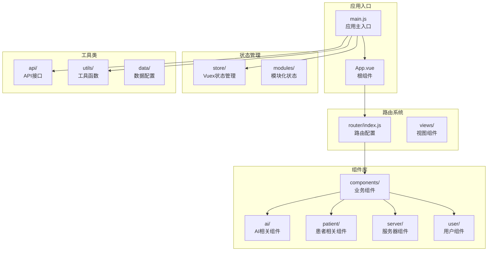
```mermaid
graph TB
subgraph "应用入口"
main_js[main.js<br/>应用主入口]
app_vue[App.vue<br/>根组件]
end
subgraph "路由系统"
router_index[router/index.js<br/>路由配置]
views[views/<br/>视图组件]
end
subgraph "组件库"
components[components/<br/>业务组件]
ai_components[ai/<br/>AI相关组件]
patient_components[patient/<br/>患者相关组件]
server_components[server/<br/>服务器组件]
user_components[user/<br/>用户组件]
end
subgraph "状态管理"
store[store/<br/>Vuex状态管理]
modules[modules/<br/>模块化状态]
end
subgraph "工具类"
api[api/<br/>API接口]
utils[utils/<br/>工具函数]
data[data/<br/>数据配置]
end
main_js --> app_vue
app_vue --> router_index
router_index --> components
components --> ai_components
components --> patient_components
components --> server_components
components --> user_components
main_js --> store
main_js --> api
main_js --> utils
```

**图表来源**
- [main.js:1-267](file://med_ai_assistant_1.0_bs_vue/src/main.js#L1-L267)
- [router/index.js:1-118](file://med_ai_assistant_1.0_bs_vue/src/router/index.js#L1-L118)

**章节来源**
- [main.js:1-267](file://med_ai_assistant_1.0_bs_vue/src/main.js#L1-L267)
- [package.json:1-56](file://med_ai_assistant_1.0_bs_vue/package.json#L1-L56)

## 核心组件

### 服务器日志查看器组件

ServerLogViewer 是一个功能强大的日志查看组件，支持静态和实时两种模式：

**主要功能特性：**
- 多日志文件选择和切换
- 关键字过滤搜索
- 行数自定义显示（100-1000行）
- 实时追踪（SSE连接）
- 日志级别高亮显示
- 自动滚底和手动滚动控制

**技术实现亮点：**
- 使用 Vue 3 Composition API
- 支持响应式设计
- 内存防护机制（最多保留2000行日志）
- 深色主题适配

### 顶部导航菜单组件

TopMenu 提供了完整的应用导航功能：

**导航功能：**
- 病人管理：列表、筛选、刷新
- AI辅助：进入AI诊断、待办事项
- 设置管理：用户信息、模板管理、服务器维护
- 系统功能：全屏模式、小屏模式、退出登录
- 帮助系统：帮助文档、反馈、关于

**高级特性：**
- 响应式布局适配
- 权限控制（管理员功能）
- 全屏模式支持
- 小屏设备优化

### 用户查询组件

UserLookup 提供用户信息查询功能：

**功能特点：**
- 基于用户ID的实时查询
- 弹窗显示用户信息
- 错误处理和用户反馈

### AI结果组件

AIResults 是AI诊断结果展示的核心组件，新增了重要的去换行符复制功能：

**主要功能特性：**
- AI诊断结果的显示和编辑
- 去换行符智能复制（版本0.7.030）
- 诊断内容的添加、编辑和删除
- Prompt详情查看和管理

**新增功能亮点：**
- 智能文本处理：自动去除换行符和空白字符
- 剪贴板集成：一键复制处理后的文本
- 用户友好提示：操作反馈和错误处理

### 轮询服务组件

PromptExecutor 提供了完整的Prompt轮询服务管理功能：

**服务管理特性：**
- 轮询服务的启用和禁用
- 服务状态实时监控
- 自动恢复机制
- 错误处理和重试逻辑

**技术实现亮点：**
- 增强的错误处理（版本0.7.031）
- 自动恢复机制
- 详细的状态跟踪
- 用户友好的操作反馈

### 患者病情小结组件

**更新** PatientSummary 是患者信息管理的核心组件，经过重大功能增强：

**主要功能特性：**
- 住院时长自动计算（入院日期到当前日期）
- 颜色编码状态显示（病危、病重、普通）
- 待办事项集成显示（最近2条）
- 增强的Markdown渲染支持
- 思维过程折叠显示
- 多层次内容来源优先级

**新增功能亮点：**
- **住院时长计算**：自动计算患者住院天数，显示入院日期和住院时长
- **颜色编码状态**：根据患者状态自动应用颜色编码（红色：病危，橙色：病重，绿色：普通）
- **待办事项集成**：从后端API获取患者待办事项，支持智能内容清理
- **Markdown增强渲染**：支持`<thinking>`标签的折叠显示，提供思维过程透明度
- **颜色标识系统**：自动高亮异常值（红色）、正常值（绿色）、待处理项（橙色）

**内容来源优先级：**
1. 新API获取的最新病情小结内容
2. AI生成的病情小结、查房记录或入院记录总结
3. 患者基本信息中的病情摘要

**章节来源**
- [PatientSummary.vue:1-638](file://med_ai_assistant_1.0_bs_vue/src/components/patient/PatientSummary.vue#L1-L638)

## 架构概览

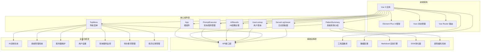
```mermaid
graph TD
subgraph "前端架构"
A[Vue 3 应用] --> B[Element Plus UI框架]
A --> C[Vuex 状态管理]
A --> D[Vue Router 路由]
end
subgraph "核心组件层"
E[ServerLogViewer<br/>日志查看器]
F[TopMenu<br/>导航菜单]
G[UserLookup<br/>用户查询]
H[AIResults<br/>AI结果处理]
I[PromptExecutor<br/>轮询服务管理]
J[PatientSummary<br/>患者病情小结]
K[App<br/>根组件]
end
subgraph "业务功能层"
L[AI诊断系统]
M[患者管理系统]
N[服务器维护]
O[用户设置]
P[轮询服务监控]
Q[待办事项管理]
R[病历记录管理]
end
subgraph "基础设施层"
S[API接口层]
T[工具函数库]
U[数据配置]
V[Markdown渲染引擎]
W[DOM净化器]
X[颜色编码系统]
end
A --> E
A --> F
A --> G
A --> H
A --> I
A --> J
A --> K
F --> L
F --> M
F --> N
F --> O
F --> P
F --> Q
F --> R
E --> S
F --> S
G --> S
H --> S
I --> S
J --> S
J --> V
J --> W
J --> X
K --> S
A --> T
A --> U
```

**图表来源**
- [main.js:208-267](file://med_ai_assistant_1.0_bs_vue/src/main.js#L208-L267)
- [App.vue:16-47](file://med_ai_assistant_1.0_bs_vue/src/App.vue#L16-L47)

## 详细组件分析

### ServerLogViewer 组件深度分析

#### 组件架构图

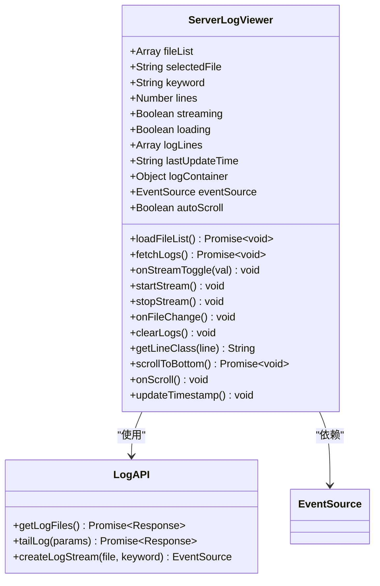
```mermaid
classDiagram
class ServerLogViewer {
+Array fileList
+String selectedFile
+String keyword
+Number lines
+Boolean streaming
+Boolean loading
+Array logLines
+String lastUpdateTime
+Object logContainer
+EventSource eventSource
+Boolean autoScroll
+loadFileList() Promise~void~
+fetchLogs() Promise~void~
+onStreamToggle(val) void
+startStream() void
+stopStream() void
+onFileChange() void
+clearLogs() void
+getLineClass(line) String
+scrollToBottom() Promise~void~
+onScroll() void
+updateTimestamp() void
}
class LogAPI {
+getLogFiles() Promise~Response~
+tailLog(params) Promise~Response~
+createLogStream(file, keyword) EventSource
}
ServerLogViewer --> LogAPI : "使用"
ServerLogViewer --> EventSource : "依赖"
```

**图表来源**
- [ServerLogViewer.vue:107-369](file://med_ai_assistant_1.0_bs_vue/src/components/ServerLogViewer.vue#L107-L369)

#### 实时日志流处理流程

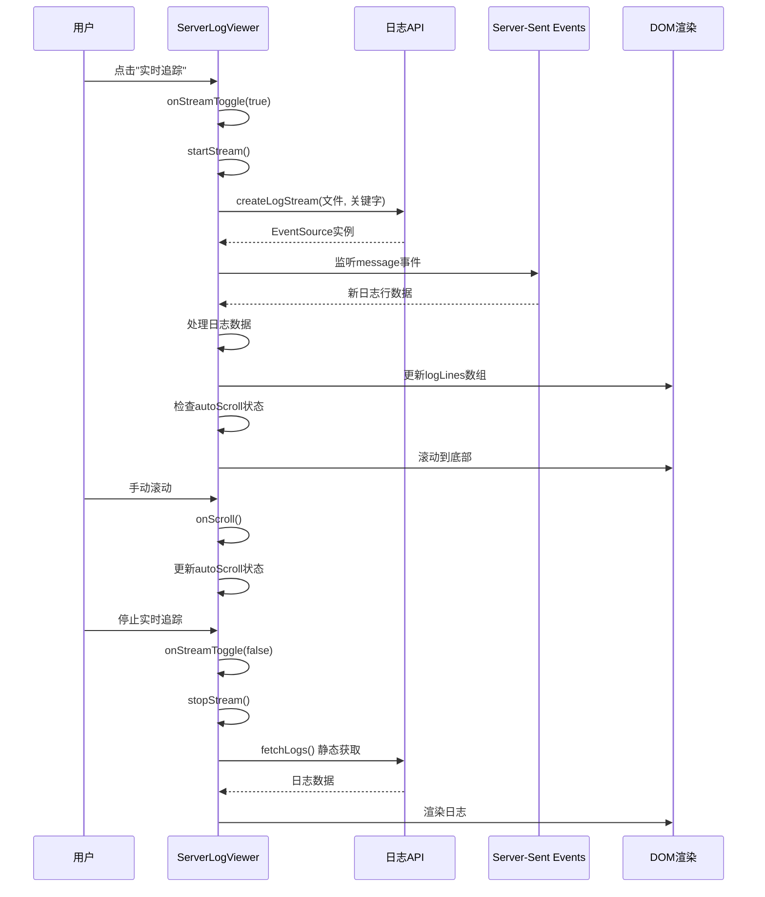
```mermaid
sequenceDiagram
participant User as 用户
participant Component as ServerLogViewer
participant API as 日志API
participant SSE as Server-Sent Events
participant DOM as DOM渲染
User->>Component : 点击"实时追踪"
Component->>Component : onStreamToggle(true)
Component->>Component : startStream()
Component->>API : createLogStream(文件, 关键字)
API-->>Component : EventSource实例
Component->>SSE : 监听message事件
SSE-->>Component : 新日志行数据
Component->>Component : 处理日志数据
Component->>DOM : 更新logLines数组
Component->>Component : 检查autoScroll状态
Component->>DOM : 滚动到底部
User->>Component : 手动滚动
Component->>Component : onScroll()
Component->>Component : 更新autoScroll状态
User->>Component : 停止实时追踪
Component->>Component : onStreamToggle(false)
Component->>Component : stopStream()
Component->>API : fetchLogs() 静态获取
API-->>Component : 日志数据
Component->>DOM : 渲染日志
```

**图表来源**
- [ServerLogViewer.vue:211-266](file://med_ai_assistant_1.0_bs_vue/src/components/ServerLogViewer.vue#L211-L266)
- [ServerLogViewer.vue:178-203](file://med_ai_assistant_1.0_bs_vue/src/components/ServerLogViewer.vue#L178-L203)

#### 日志级别分类算法

```mermaid
flowchart TD
Start([日志行输入]) --> ToUpper["转换为大写字母"]
ToUpper --> CheckError{"包含'ERROR'?"}
CheckError --> |是| ErrorClass["返回'level-error'"]
CheckError --> |否| CheckWarn{"包含'WARN'?"}
CheckWarn --> |是| WarnClass["返回'level-warn'"]
CheckWarn --> |否| CheckDebug{"包含'DEBUG'?"}
CheckDebug --> |是| DebugClass["返回'level-debug'"]
CheckDebug --> |否| InfoClass["返回'level-info'"]
ErrorClass --> End([返回CSS类])
WarnClass --> End
DebugClass --> End
InfoClass --> End
```

**图表来源**
- [ServerLogViewer.vue:296-302](file://med_ai_assistant_1.0_bs_vue/src/components/ServerLogViewer.vue#L296-L302)

**章节来源**
- [ServerLogViewer.vue:106-369](file://med_ai_assistant_1.0_bs_vue/src/components/ServerLogViewer.vue#L106-L369)

### TopMenu 组件深度分析

#### 导航菜单架构

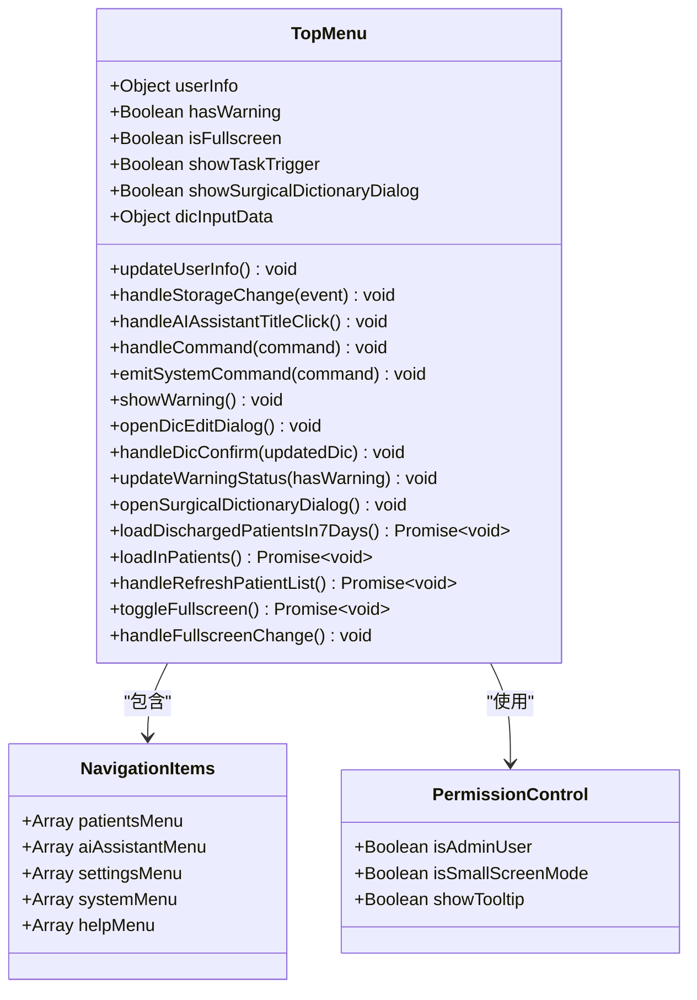
```mermaid
classDiagram
class TopMenu {
+Object userInfo
+Boolean hasWarning
+Boolean isFullscreen
+Boolean showTaskTrigger
+Boolean showSurgicalDictionaryDialog
+Object dicInputData
+updateUserInfo() void
+handleStorageChange(event) void
+handleAIAssistantTitleClick() void
+handleCommand(command) void
+emitSystemCommand(command) void
+showWarning() void
+openDicEditDialog() void
+handleDicConfirm(updatedDic) void
+updateWarningStatus(hasWarning) void
+openSurgicalDictionaryDialog() void
+loadDischargedPatientsIn7Days() Promise~void~
+loadInPatients() Promise~void~
+handleRefreshPatientList() Promise~void~
+toggleFullscreen() Promise~void~
+handleFullscreenChange() void
}
class NavigationItems {
+Array patientsMenu
+Array aiAssistantMenu
+Array settingsMenu
+Array systemMenu
+Array helpMenu
}
class PermissionControl {
+Boolean isAdminUser
+Boolean isSmallScreenMode
+Boolean showTooltip
}
TopMenu --> NavigationItems : "包含"
TopMenu --> PermissionControl : "使用"
```

**图表来源**
- [TopMenu.vue:168-656](file://med_ai_assistant_1.0_bs_vue/src/components/TopMenu.vue#L168-L656)

#### 权限控制机制

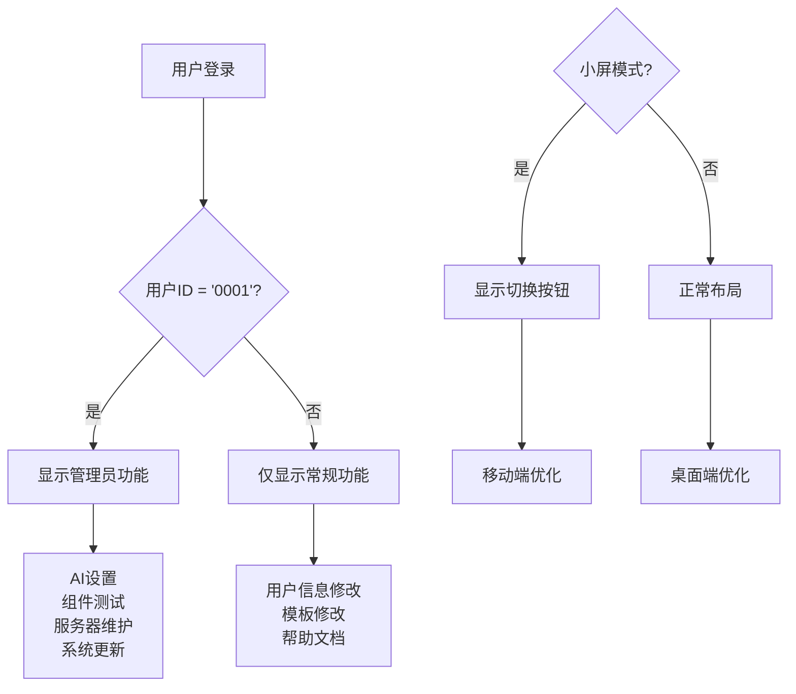
```mermaid
flowchart TD
UserLogin[用户登录] --> CheckAdmin{"用户ID = '0001'?"}
CheckAdmin --> |是| AdminFeatures[显示管理员功能]
CheckAdmin --> |否| RegularFeatures[仅显示常规功能]
AdminFeatures --> AdminMenu[AI设置<br/>组件测试<br/>服务器维护<br/>系统更新]
RegularFeatures --> UserMenu[用户信息修改<br/>模板修改<br/>帮助文档]
SmallScreenMode{"小屏模式?"} --> |是| ToggleButtons[显示切换按钮]
SmallScreenMode --> |否| NormalLayout[正常布局]
ToggleButtons --> MobileOptimization[移动端优化]
NormalLayout --> DesktopOptimization[桌面端优化]
```

**图表来源**
- [TopMenu.vue:208-210](file://med_ai_assistant_1.0_bs_vue/src/components/TopMenu.vue#L208-L210)
- [TopMenu.vue:384-395](file://med_ai_assistant_1.0_bs_vue/src/components/TopMenu.vue#L384-L395)

**章节来源**
- [TopMenu.vue:168-656](file://med_ai_assistant_1.0_bs_vue/src/components/TopMenu.vue#L168-L656)

### UserLookup 组件分析

#### 组件交互流程

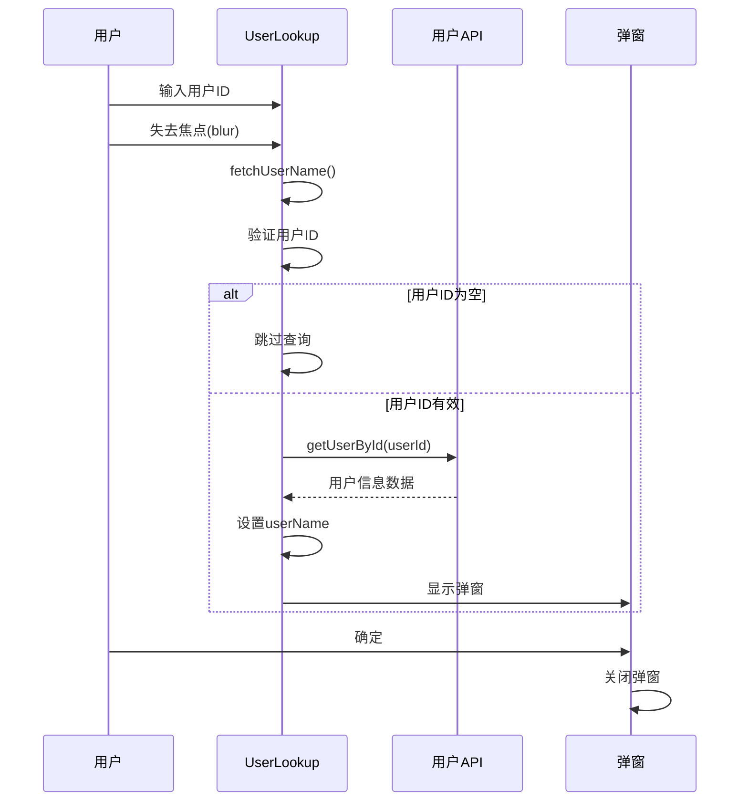
```mermaid
sequenceDiagram
participant User as 用户
participant Component as UserLookup
participant API as 用户API
participant Dialog as 弹窗
User->>Component : 输入用户ID
User->>Component : 失去焦点(blur)
Component->>Component : fetchUserName()
Component->>Component : 验证用户ID
alt 用户ID为空
Component->>Component : 跳过查询
else 用户ID有效
Component->>API : getUserById(userId)
API-->>Component : 用户信息数据
Component->>Component : 设置userName
Component->>Dialog : 显示弹窗
end
User->>Dialog : 确定
Dialog->>Dialog : 关闭弹窗
```

**图表来源**
- [UserLookup.vue:36-53](file://med_ai_assistant_1.0_bs_vue/src/components/UserLookup.vue#L36-L53)

**章节来源**
- [UserLookup.vue:24-54](file://med_ai_assistant_1.0_bs_vue/src/components/UserLookup.vue#L24-L54)

### AIResults 组件深度分析

#### 去换行符复制功能

**新增功能亮点：**
- 智能文本处理：自动识别和去除所有换行符（\n, \r）
- 剪贴板集成：使用现代 Clipboard API 进行复制
- 用户反馈：操作成功和失败的即时提示
- 错误处理：完善的异常捕获和用户提示

**技术实现流程：**

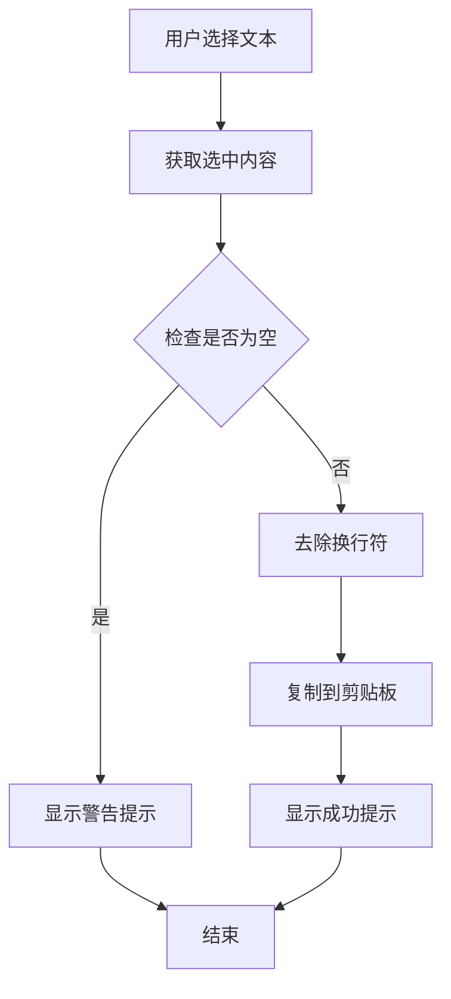
```mermaid
flowchart TD
UserSelection[用户选择文本] --> GetSelection[获取选中内容]
GetSelection --> CheckEmpty{检查是否为空}
CheckEmpty --> |是| ShowWarning[显示警告提示]
CheckEmpty --> |否| RemoveNewlines[去除换行符]
RemoveNewlines --> CopyToClipboard[复制到剪贴板]
CopyToClipboard --> Success[显示成功提示]
ShowWarning --> End[结束]
Success --> End
```

**图表来源**
- [AIResults.vue:525-543](file://med_ai_assistant_1.0_bs_vue/src/components/ai/AIResults.vue#L525-L543)

**章节来源**
- [AIResults.vue:525-543](file://med_ai_assistant_1.0_bs_vue/src/components/ai/AIResults.vue#L525-L543)

### PromptExecutor 组件深度分析

#### 轮询服务状态管理

**增强的功能特性：**
- 详细的错误处理和用户反馈
- 自动恢复机制的实现
- 服务状态变化检测
- 响应时间监控

**服务状态管理流程：**

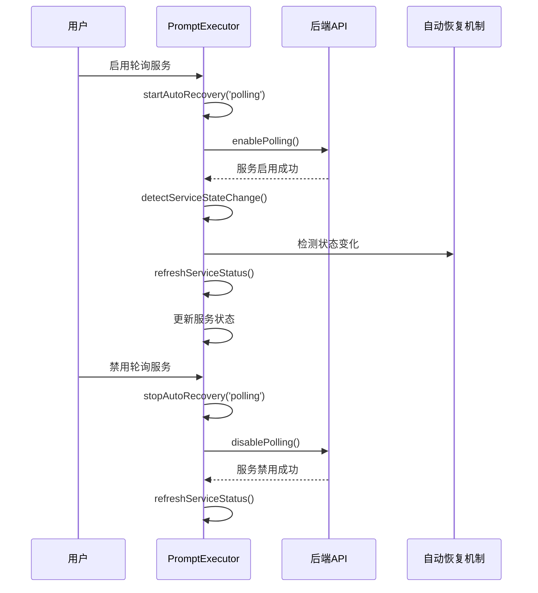
```mermaid
sequenceDiagram
participant User as 用户
participant Component as PromptExecutor
participant API as 后端API
participant Recovery as 自动恢复机制
User->>Component : 启用轮询服务
Component->>Component : startAutoRecovery('polling')
Component->>API : enablePolling()
API-->>Component : 服务启用成功
Component->>Component : detectServiceStateChange()
Component->>Recovery : 检测状态变化
Component->>Component : refreshServiceStatus()
Component->>Component : 更新服务状态
User->>Component : 禁用轮询服务
Component->>Component : stopAutoRecovery('polling')
Component->>API : disablePolling()
API-->>Component : 服务禁用成功
Component->>Component : refreshServiceStatus()
```

**图表来源**
- [PromptExecutor.vue:800-825](file://med_ai_assistant_1.0_bs_vue/src/components/server/PromptExecutor.vue#L800-L825)
- [PromptExecutor.vue:942-967](file://med_ai_assistant_1.0_bs_vue/src/components/server/PromptExecutor.vue#L942-L967)

**章节来源**
- [PromptExecutor.vue:800-825](file://med_ai_assistant_1.0_bs_vue/src/components/server/PromptExecutor.vue#L800-L825)
- [PromptExecutor.vue:942-967](file://med_ai_assistant_1.0_bs_vue/src/components/server/PromptExecutor.vue#L942-L967)

### PatientSummary 组件深度分析

**更新** PatientSummary 组件经过重大功能增强，成为患者信息管理的核心组件：

#### 组件架构图

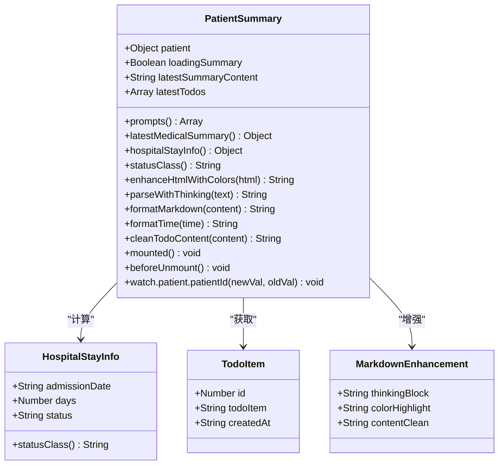
```mermaid
classDiagram
class PatientSummary {
+Object patient
+Boolean loadingSummary
+String latestSummaryContent
+Array latestTodos
+prompts() Array
+latestMedicalSummary() Object
+hospitalStayInfo() Object
+statusClass() String
+enhanceHtmlWithColors(html) String
+parseWithThinking(text) String
+formatMarkdown(content) String
+formatTime(time) String
+cleanTodoContent(content) String
+mounted() void
+beforeUnmount() void
+watch.patient.patientId(newVal, oldVal) void
}
class HospitalStayInfo {
+String admissionDate
+Number days
+String status
+statusClass() String
}
class TodoItem {
+Number id
+String todoItem
+String createdAt
}
class MarkdownEnhancement {
+String thinkingBlock
+String colorHighlight
+String contentClean
}
PatientSummary --> HospitalStayInfo : "计算"
PatientSummary --> TodoItem : "获取"
PatientSummary --> MarkdownEnhancement : "增强"
```

**图表来源**
- [PatientSummary.vue:72-157](file://med_ai_assistant_1.0_bs_vue/src/components/patient/PatientSummary.vue#L72-L157)

#### 住院时长计算算法

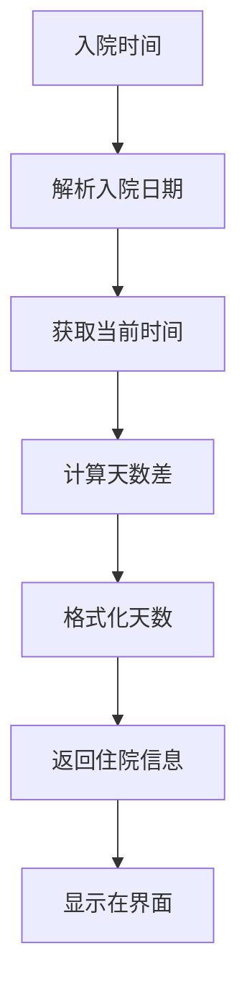
```mermaid
flowchart TD
AdmissionDate[入院时间] --> ParseDate[解析入院日期]
ParseDate --> GetCurrentDate[获取当前时间]
GetCurrentDate --> CalculateDays[计算天数差]
CalculateDays --> FormatDays[格式化天数]
FormatDays --> ReturnInfo[返回住院信息]
ReturnInfo --> Display[显示在界面]
```

**图表来源**
- [PatientSummary.vue:135-145](file://med_ai_assistant_1.0_bs_vue/src/components/patient/PatientSummary.vue#L135-L145)

#### 颜色编码状态系统

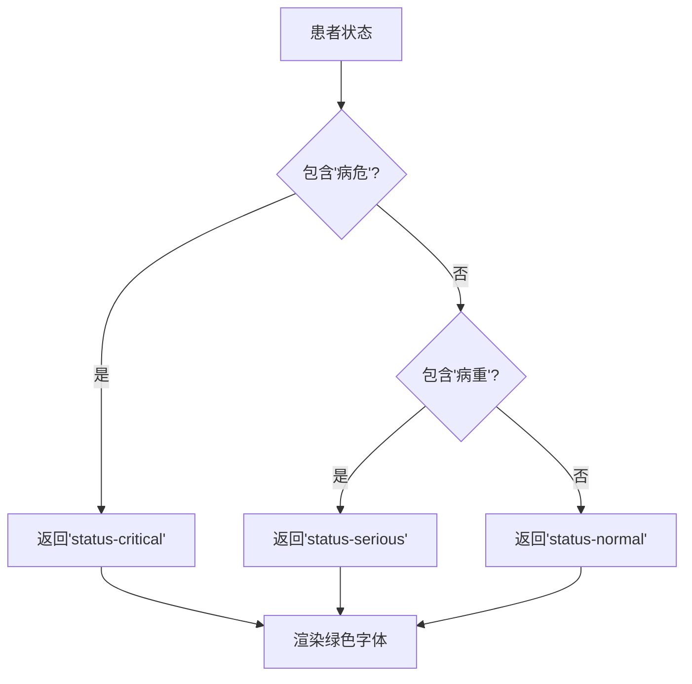
```mermaid
flowchart TD
PatientStatus[患者状态] --> CheckCritical{"包含'病危'?"}
CheckCritical --> |是| CriticalClass["返回'status-critical'"]
CheckCritical --> |否| CheckSerious{"包含'病重'?"}
CheckSerious --> |是| SeriousClass["返回'status-serious'"]
CheckSerious --> |否| NormalClass["返回'status-normal'"]
CriticalClass --> Render[渲染红色字体]
SeriousClass --> Render[渲染橙色字体]
NormalClass --> Render[渲染绿色字体]
```

**图表来源**
- [PatientSummary.vue:151-156](file://med_ai_assistant_1.0_bs_vue/src/components/patient/PatientSummary.vue#L151-L156)

#### 待办事项集成流程

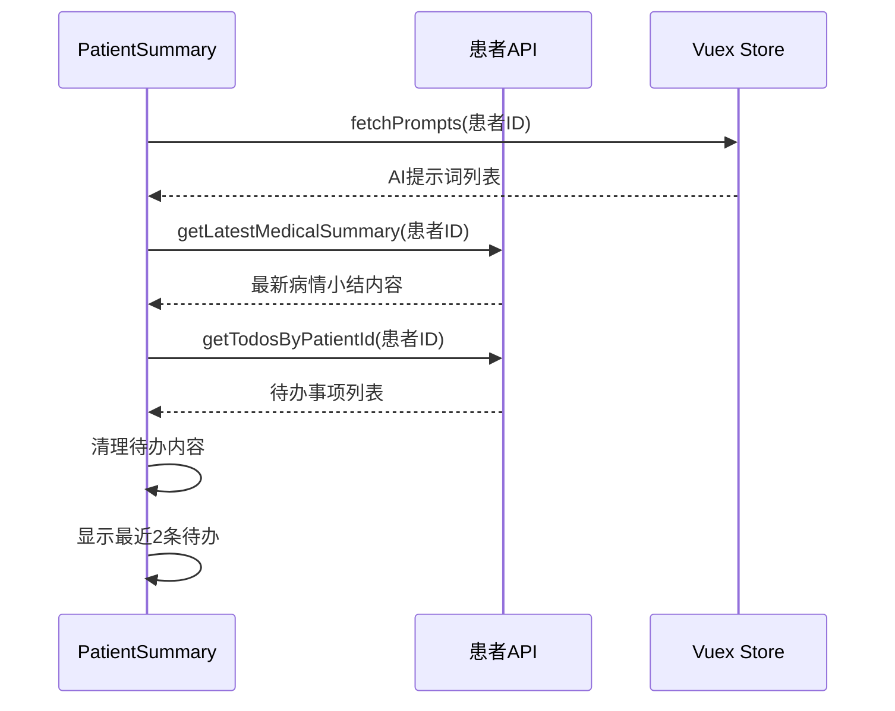
```mermaid
sequenceDiagram
participant Component as PatientSummary
participant API as 患者API
participant Store as Vuex Store
Component->>Store : fetchPrompts(患者ID)
Store-->>Component : AI提示词列表
Component->>API : getLatestMedicalSummary(患者ID)
API-->>Component : 最新病情小结内容
Component->>API : getTodosByPatientId(患者ID)
API-->>Component : 待办事项列表
Component->>Component : 清理待办内容
Component->>Component : 显示最近2条待办
```

**图表来源**
- [PatientSummary.vue:341-408](file://med_ai_assistant_1.0_bs_vue/src/components/patient/PatientSummary.vue#L341-L408)

#### Markdown增强渲染系统

**新增功能亮点：**
- **思维过程折叠**：支持`<thinking>`标签的折叠显示，提供透明的AI思维过程
- **颜色标识系统**：自动高亮异常值（红色）、正常值（绿色）、待处理项（橙色）
- **智能内容清理**：自动移除待办事项中的病人基本信息行
- **多层内容来源**：优先显示最新API内容，其次显示AI生成内容，最后显示基本信息

**技术实现流程：**

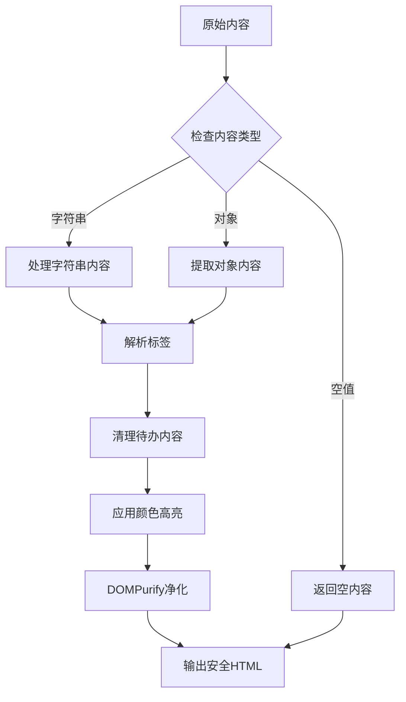
```mermaid
flowchart TD
InputContent[原始内容] --> CheckType{检查内容类型}
CheckType --> |字符串| ProcessString[处理字符串内容]
CheckType --> |对象| ExtractContent[提取对象内容]
CheckType --> |空值| ReturnEmpty[返回空内容]
ProcessString --> ParseThinking[解析<thinking>标签]
ParseThinking --> CleanContent[清理待办内容]
CleanContent --> ColorHighlight[应用颜色高亮]
ColorHighlight --> SanitizeHTML[DOMPurify净化]
SanitizeHTML --> OutputHTML[输出安全HTML]
ExtractContent --> ParseThinking
ReturnEmpty --> OutputHTML
```

**图表来源**
- [PatientSummary.vue:168-284](file://med_ai_assistant_1.0_bs_vue/src/components/patient/PatientSummary.vue#L168-L284)

**章节来源**
- [PatientSummary.vue:1-638](file://med_ai_assistant_1.0_bs_vue/src/components/patient/PatientSummary.vue#L1-L638)

## 依赖分析

### 技术栈依赖关系

```mermaid
graph TB
subgraph "核心框架"
Vue[Vue 3.2.13]
Router[Vue Router 4.5.1]
Vuex[Vuex 4.0.2]
end
subgraph "UI框架"
ElementPlus[Element Plus 2.10.2]
Icons[Element Plus Icons 2.3.1]
end
subgraph "工具库"
Axios[Axios 1.10.0]
CryptoJS[Crypto JS 4.2.0]
Eruda[Eruda 3.4.3]
Marked[Marked 16.1.1]
Editor[MD Editor V3 5.7.1]
DOMPurify[DOMPurify 3.2.6]
end
subgraph "开发工具"
Babel[Babel Core 7.12.16]
ESLint[ESLint 7.32.0]
CLI[@vue/cli-service 5.0.0]
end
Vue --> Router
Vue --> Vuex
Vue --> ElementPlus
ElementPlus --> Icons
Vue --> Axios
Vue --> CryptoJS
Vue --> Eruda
Vue --> Marked
Vue --> Editor
Vue --> DOMPurify
Vue --> Babel
Vue --> ESLint
Vue --> CLI
```

**图表来源**
- [package.json:10-34](file://med_ai_assistant_1.0_bs_vue/package.json#L10-L34)

### 组件间依赖关系

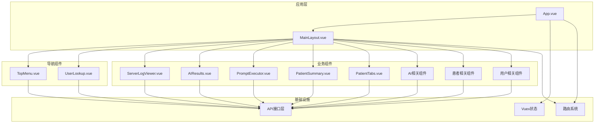
```mermaid
graph TD
subgraph "应用层"
App[App.vue]
MainLayout[MainLayout.vue]
end
subgraph "导航组件"
TopMenu[TopMenu.vue]
UserLookup[UserLookup.vue]
end
subgraph "业务组件"
ServerLogViewer[ServerLogViewer.vue]
AIResults[AIResults.vue]
PromptExecutor[PromptExecutor.vue]
PatientSummary[PatientSummary.vue]
PatientTabs[PatientTabs.vue]
AIComponents[AI相关组件]
PatientComponents[患者相关组件]
UserComponents[用户相关组件]
end
subgraph "基础设施"
API[API接口层]
Store[Vuex状态]
Router[路由系统]
end
App --> MainLayout
MainLayout --> TopMenu
MainLayout --> UserLookup
MainLayout --> ServerLogViewer
MainLayout --> AIResults
MainLayout --> PromptExecutor
MainLayout --> PatientSummary
MainLayout --> PatientTabs
MainLayout --> AIComponents
MainLayout --> PatientComponents
MainLayout --> UserComponents
TopMenu --> API
UserLookup --> API
ServerLogViewer --> API
AIResults --> API
PromptExecutor --> API
PatientSummary --> API
PatientTabs --> API
AIComponents --> API
PatientComponents --> API
UserComponents --> API
App --> Store
App --> Router
MainLayout --> Router
```

**图表来源**
- [App.vue:16-47](file://med_ai_assistant_1.0_bs_vue/src/App.vue#L16-L47)
- [router/index.js:1-118](file://med_ai_assistant_1.0_bs_vue/src/router/index.js#L1-L118)

**章节来源**
- [package.json:1-56](file://med_ai_assistant_1.0_bs_vue/package.json#L1-L56)

### API接口依赖关系

**更新** 新增的PatientSummary组件依赖以下API接口：

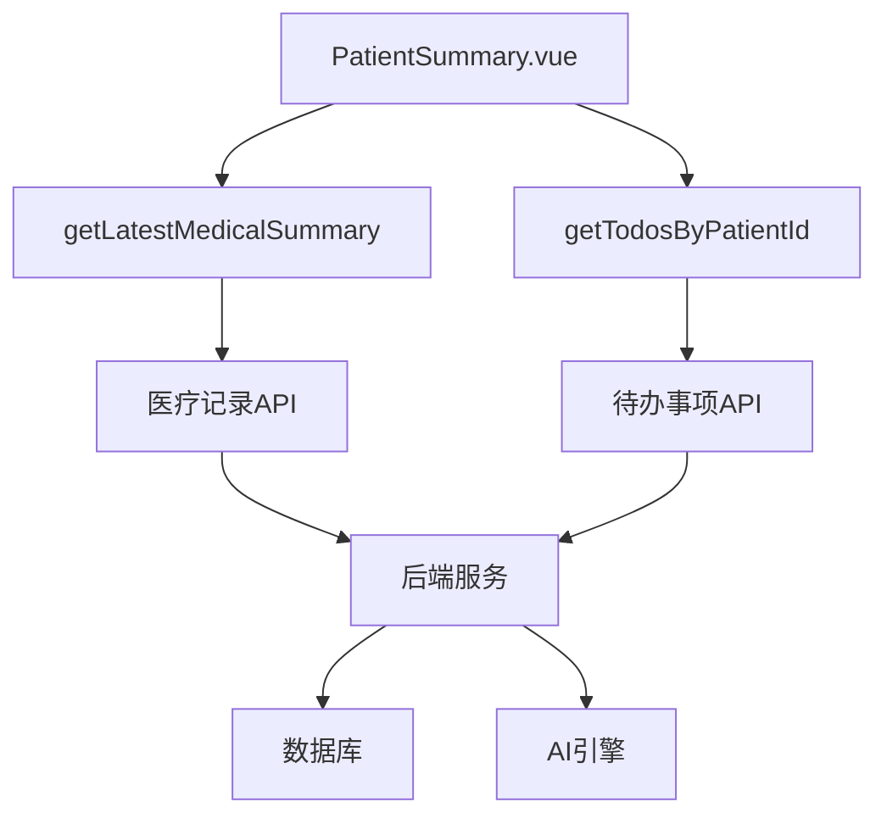
```mermaid
graph TD
PatientSummary[PatientSummary.vue] --> GetLatestMedicalSummary[getLatestMedicalSummary]
PatientSummary --> GetTodosByPatientId[getTodosByPatientId]
GetLatestMedicalSummary --> MedicalRecordsAPI[医疗记录API]
GetTodosByPatientId --> TodoAPI[待办事项API]
MedicalRecordsAPI --> BackendAPI[后端服务]
TodoAPI --> BackendAPI
BackendAPI --> Database[数据库]
BackendAPI --> AIEngine[AI引擎]
```

**图表来源**
- [patient.js:472-476](file://med_ai_assistant_1.0_bs_vue/src/api/patient.js#L472-L476)
- [patient.js:591-593](file://med_ai_assistant_1.0_bs_vue/src/api/patient.js#L591-L593)

**章节来源**
- [patient.js:1-616](file://med_ai_assistant_1.0_bs_vue/src/api/patient.js#L1-L616)

## 性能考虑

### 内存管理优化

1. **日志行数限制**：ServerLogViewer 实现了最多2000行日志的内存防护，防止长时间运行导致内存溢出
2. **懒加载机制**：路由组件采用动态导入，减少初始包体积
3. **事件监听清理**：组件卸载时自动清理所有事件监听器
4. **AI结果处理优化**：去换行符复制功能使用高效的正则表达式处理
5. **患者数据缓存**：PatientSummary 组件实现智能的数据缓存和清理机制

### 渲染性能优化

1. **虚拟滚动**：对于大量数据的场景，建议使用虚拟滚动技术
2. **防抖处理**：输入框的搜索功能使用防抖，避免频繁请求
3. **条件渲染**：根据用户权限动态渲染菜单项
4. **组件复用**：AIResults组件的复制功能支持多次复用
5. **Markdown渲染优化**：PatientSummary组件的增强渲染系统支持内容缓存

### 网络请求优化

1. **SSE连接管理**：实时日志使用Server-Sent Events，相比轮询更节省带宽
2. **缓存策略**：合理使用浏览器缓存和HTTP缓存头
3. **错误重试**：网络异常时提供自动重试机制
4. **轮询服务优化**：PromptExecutor实现了智能的轮询服务管理
5. **API请求合并**：PatientSummary组件支持多个API请求的并发处理

### 患者数据管理优化

**更新** PatientSummary组件的性能优化措施：
- **智能数据加载**：只在患者ID变化时重新加载数据
- **内容缓存**：缓存最新的病情小结和待办事项
- **防抖处理**：对频繁的患者切换操作进行防抖处理
- **内存清理**：组件卸载时自动清理全局函数和事件监听器

## 故障排除指南

### 常见问题及解决方案

#### 日志查看器问题

**问题**：实时日志无法连接
- 检查后端SSE服务是否正常运行
- 验证网络连接和防火墙设置
- 查看浏览器控制台的SSE连接错误

**问题**：日志显示不完整
- 检查日志文件权限
- 验证日志文件是否存在且可读
- 确认关键字过滤条件

#### 导航菜单问题

**问题**：菜单项显示异常
- 检查用户权限配置
- 验证Vuex状态同步
- 确认响应式布局计算

**问题**：全屏模式失效
- 检查浏览器兼容性
- 验证全屏API权限
- 确认CSS样式覆盖

#### 用户查询问题

**问题**：用户信息查询失败
- 验证用户ID格式
- 检查API接口连通性
- 查看错误响应信息

#### AI结果处理问题

**问题**：去换行符复制功能失效
- 检查浏览器剪贴板权限
- 验证文本选择功能
- 确认正则表达式处理逻辑

**问题**：AI结果编辑异常
- 检查文本编辑器配置
- 验证数据绑定状态
- 确认API接口可用性

#### 轮询服务问题

**问题**：轮询服务状态异常
- 检查后端服务状态
- 验证网络连接稳定性
- 确认自动恢复机制

**问题**：服务启用/禁用失败
- 检查权限配置
- 验证API接口响应
- 查看错误日志信息

#### 患者病情小结问题

**更新** **问题**：住院时长计算不准确
- 检查入院时间格式
- 验证日期解析逻辑
- 确认时区设置

**问题**：颜色编码状态显示异常
- 检查患者状态数据
- 验证状态匹配逻辑
- 确认CSS样式加载

**问题**：待办事项显示不完整
- 检查API接口连通性
- 验证待办事项数据格式
- 确认内容清理逻辑

**问题**：Markdown渲染错误
- 检查内容格式
- 验证DOMPurify配置
- 确认标记语言语法

**问题**：思维过程折叠功能失效
- 检查全局函数注册
- 验证事件监听器
- 确认DOM元素存在

**章节来源**
- [ServerLogViewer.vue:248-253](file://med_ai_assistant_1.0_bs_vue/src/components/ServerLogViewer.vue#L248-L253)
- [TopMenu.vue:592-631](file://med_ai_assistant_1.0_bs_vue/src/components/TopMenu.vue#L592-L631)
- [UserLookup.vue:49-51](file://med_ai_assistant_1.0_bs_vue/src/components/UserLookup.vue#L49-L51)
- [AIResults.vue:525-543](file://med_ai_assistant_1.0_bs_vue/src/components/ai/AIResults.vue#L525-L543)
- [PromptExecutor.vue:800-825](file://med_ai_assistant_1.0_bs_vue/src/components/server/PromptExecutor.vue#L800-L825)
- [PatientSummary.vue:135-145](file://med_ai_assistant_1.0_bs_vue/src/components/patient/PatientSummary.vue#L135-L145)
- [PatientSummary.vue:151-156](file://med_ai_assistant_1.0_bs_vue/src/components/patient/PatientSummary.vue#L151-L156)
- [PatientSummary.vue:341-408](file://med_ai_assistant_1.0_bs_vue/src/components/patient/PatientSummary.vue#L341-L408)

## 结论

这个Vue前端应用展现了现代前端开发的最佳实践，具有以下特点：

1. **模块化架构**：清晰的组件分层和职责分离
2. **响应式设计**：适配多种设备和屏幕尺寸
3. **状态管理**：完善的Vuex状态管理模式
4. **用户体验**：丰富的交互功能和友好的界面设计
5. **性能优化**：多项性能优化措施确保流畅体验
6. **功能增强**：最新版本显著提升了AI结果处理、轮询服务稳定性和患者信息管理能力

通过ServerLogViewer、TopMenu、UserLookup、AIResults、PromptExecutor和**新增的PatientSummary**等核心组件的协同工作，整个应用形成了一个功能完整、易于维护的医疗AI助手平台。特别是PatientSummary组件的住院时长计算、颜色编码状态显示、待办事项集成和Markdown渲染增强等功能，都显著提升了用户的操作效率和系统稳定性。

**更新** PatientSummary组件作为患者信息管理的核心，其增强功能包括：
- **智能化的住院时长计算**：自动计算患者住院天数，提供准确的医疗统计信息
- **直观的颜色编码状态显示**：通过视觉化的方式快速识别患者病情严重程度
- **集成的待办事项管理**：统一管理患者的医疗任务和提醒事项
- **增强的Markdown渲染系统**：支持思维过程透明度和智能内容高亮
- **多层次的内容来源优先级**：确保显示最准确、最新的患者信息

建议在后续开发中继续关注性能优化、安全加固和用户体验提升，特别是在AI结果处理、轮询服务监控和患者信息管理方面持续改进。