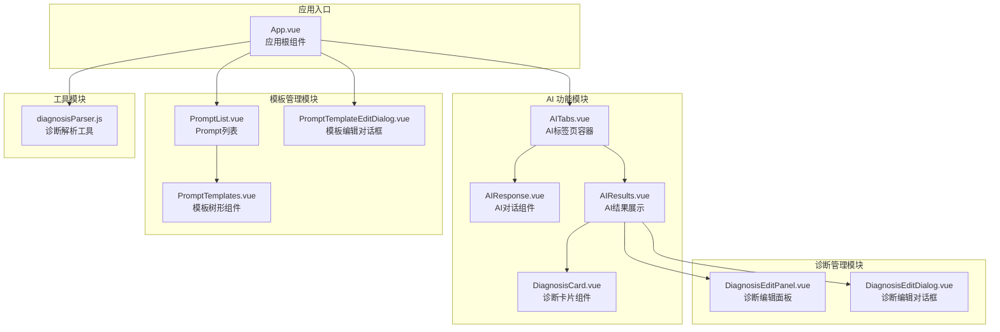
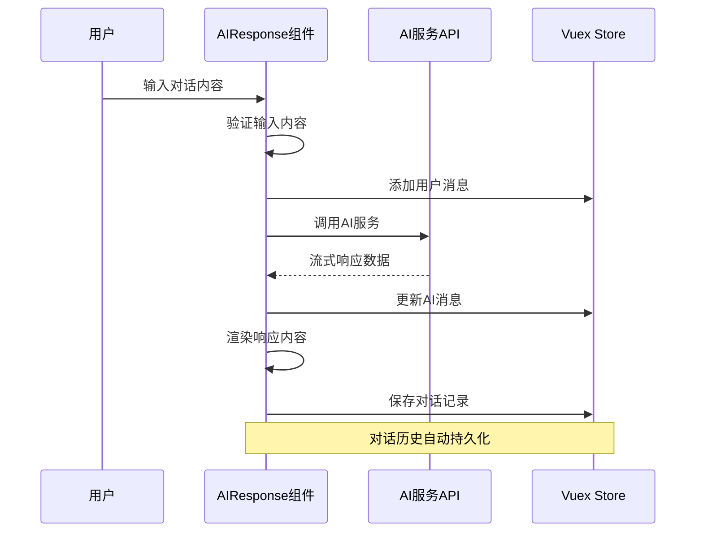
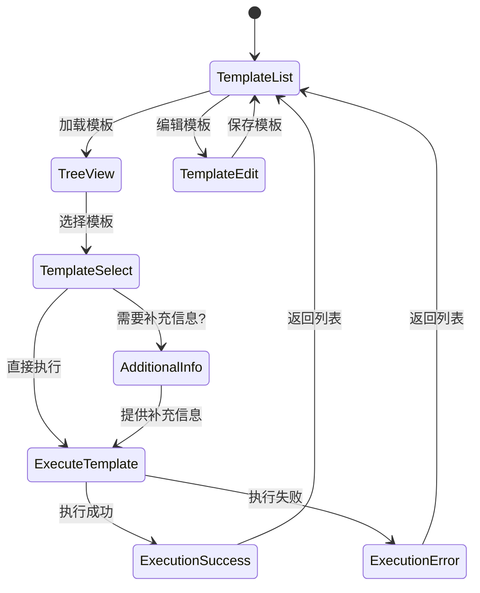
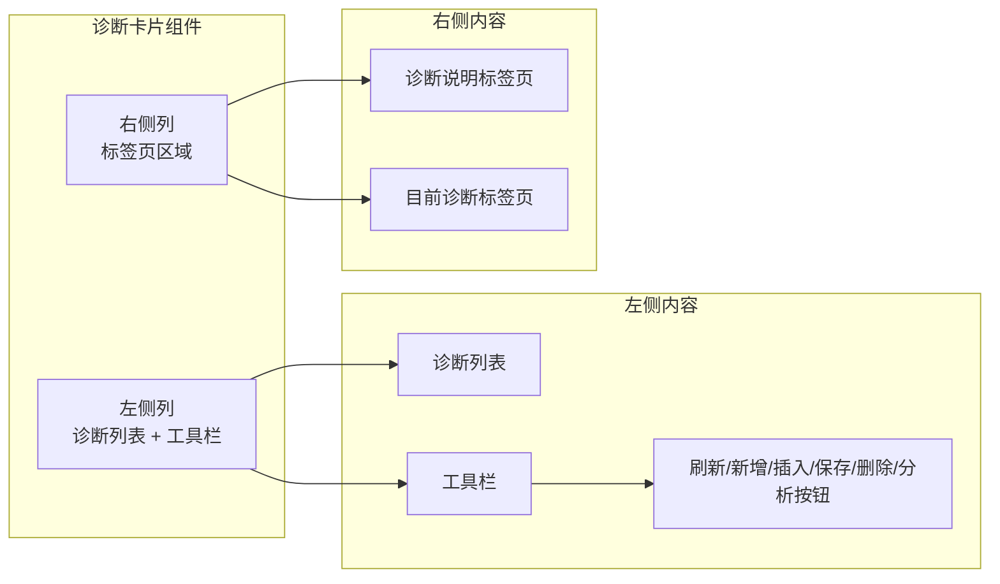
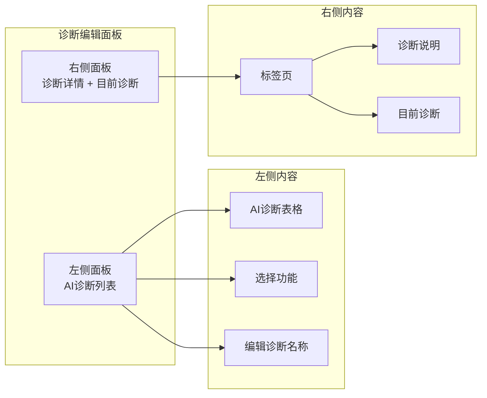
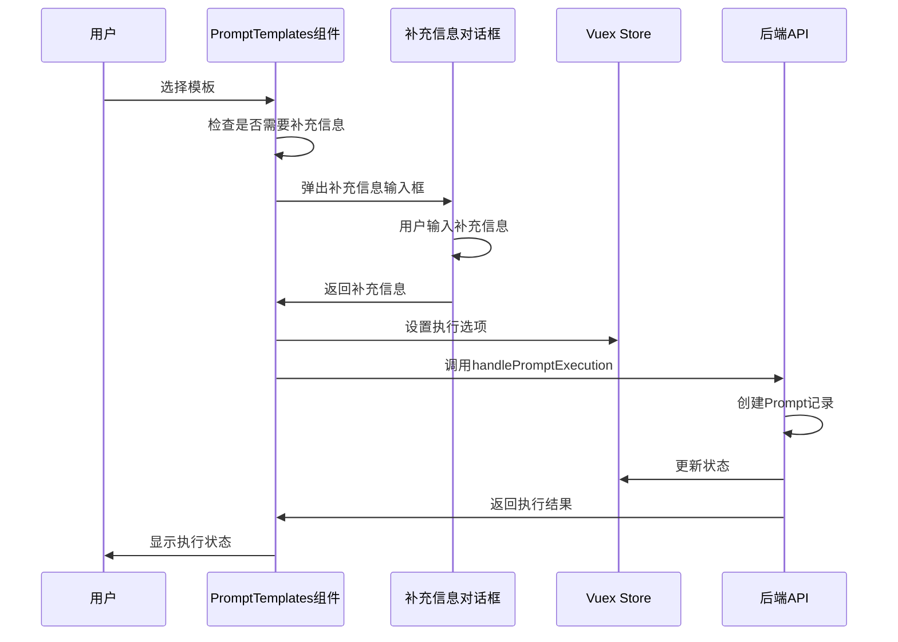
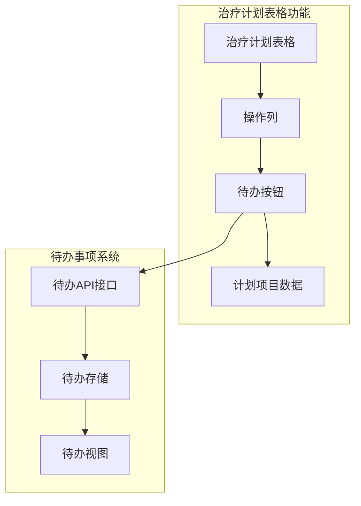
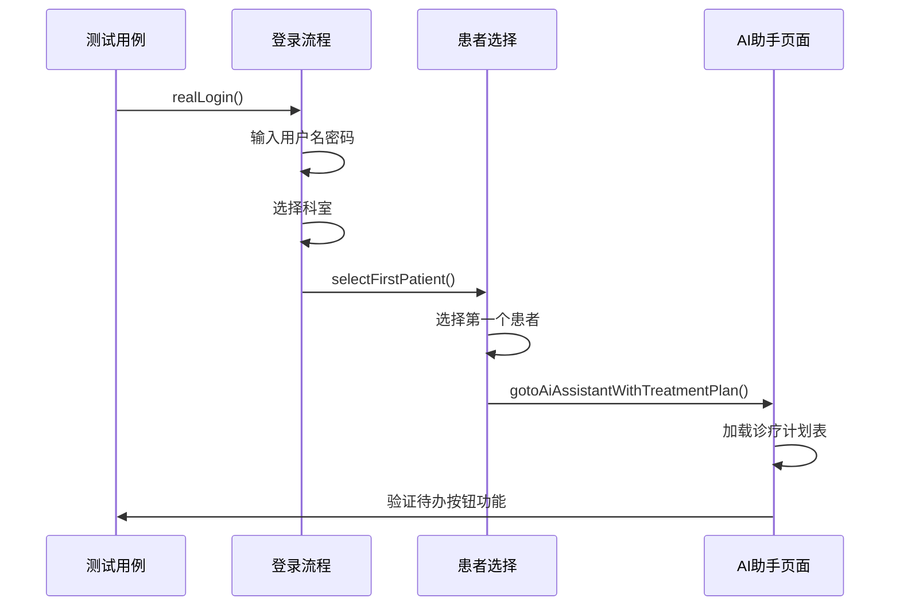

# Vue 组件文档

<cite>
**本文档引用的文件**
- [App.vue](file://med_ai_assistant_1.0_bs_vue/src/App.vue)
- [AIResponse.vue](file://med_ai_assistant_1.0_bs_vue/src/components/ai/AIResponse.vue)
- [AIResults.vue](file://med_ai_assistant_1.0_bs_vue/src/components/ai/AIResults.vue)
- [AITabs.vue](file://med_ai_assistant_1.0_bs_vue/src/components/ai/AITabs.vue)
- [DiagnosisCard.vue](file://med_ai_assistant_1.0_bs_vue/src/components/ai/DiagnosisCard.vue)
- [DiagnosisEditPanel.vue](file://med_ai_assistant_1.0_bs_vue/src/components/ai/DiagnosisEditPanel.vue)
- [PromptList.vue](file://med_ai_assistant_1.0_bs_vue/src/components/ai/PromptList.vue)
- [PromptTemplates.vue](file://med_ai_assistant_1.0_bs_vue/src/components/ai/PromptTemplates.vue)
- [PromptTemplateEditDialog.vue](file://med_ai_assistant_1.0_bs_vue/src/components/ai/PromptTemplateEditDialog.vue)
- [diagnosisParser.js](file://med_ai_assistant_1.0_bs_vue/src/utils/diagnosisParser.js)
- [treatment-plan-todo.cy.js](file://med_ai_assistant_1.0_bs_vue/cypress/e2e/treatment-plan-todo.cy.js)
</cite>

## 更新摘要
**所做更改**
- 新增诊断卡片组件章节，详细介绍两栏布局设计和诊断解析工具
- 更新诊断编辑面板功能，包含完整的CRUD操作支持
- 新增诊断解析工具函数章节，展示统一的诊断提取逻辑
- 更新Prompt模板管理界面，增强模板执行和状态管理
- 更新AI结果组件分析，包含诊断卡片集成
- 增加端到端测试用例分析，展示真实场景测试流程
- 更新项目结构图，反映新增的诊断卡片组件

## 目录
1. [简介](#简介)
2. [项目结构](#项目结构)
3. [核心组件](#核心组件)
4. [架构概览](#架构概览)
5. [详细组件分析](#详细组件分析)
6. [诊断卡片组件](#诊断卡片组件)
7. [诊断解析工具](#诊断解析工具)
8. [诊断编辑面板](#诊断编辑面板)
9. [Prompt模板管理增强](#prompt模板管理增强)
10. [治疗计划表格功能增强](#治疗计划表格功能增强)
11. [端到端测试分析](#端到端测试分析)
12. [依赖关系分析](#依赖关系分析)
13. [性能考虑](#性能考虑)
14. [故障排除指南](#故障排除指南)
15. [结论](#结论)

## 简介

MedAiAssistant 是一个基于 Vue.js 的智能医疗助手系统，专注于提供 AI 辅助诊断和治疗决策支持。该系统集成了先进的自然语言处理技术，为医生提供智能化的医疗数据分析和决策支持。

系统采用模块化设计，包含多个专门的 Vue 组件，涵盖了从 AI 对话交互到诊断管理的完整医疗工作流程。项目使用 Element Plus 作为 UI 组件库，结合 Vuex 进行状态管理，实现了高效的前后端分离架构。

**更新** 新增诊断卡片组件，提供两栏布局设计和完整的诊断解析功能；增强诊断编辑面板的CRUD操作支持；改进诊断解析工具函数；优化Prompt模板管理界面。

## 项目结构

项目采用清晰的模块化组织结构，主要分为以下几个核心模块：



**图表来源**
- [App.vue:1-83](file://med_ai_assistant_1.0_bs_vue/src/App.vue#L1-L83)
- [AITabs.vue:1-76](file://med_ai_assistant_1.0_bs_vue/src/components/ai/AITabs.vue#L1-L76)
- [AIResults.vue:214-231](file://med_ai_assistant_1.0_bs_vue/src/components/ai/AIResults.vue#L214-L231)
- [DiagnosisCard.vue:1-709](file://med_ai_assistant_1.0_bs_vue/src/components/ai/DiagnosisCard.vue#L1-L709)
- [diagnosisParser.js:1-220](file://med_ai_assistant_1.0_bs_vue/src/utils/diagnosisParser.js#L1-L220)

**章节来源**
- [App.vue:1-83](file://med_ai_assistant_1.0_bs_vue/src/App.vue#L1-L83)
- [AITabs.vue:1-76](file://med_ai_assistant_1.0_bs_vue/src/components/ai/AITabs.vue#L1-L76)

## 核心组件

### 应用根组件 (App.vue)

应用根组件作为整个系统的入口点，负责：

- **路由视图容器**：提供 `<router-view>` 用于显示当前路由匹配的组件
- **全局对话框管理**：统一管理模板编辑对话框的状态
- **状态同步**：监听 Vuex store 中的模板编辑状态，自动控制对话框显示

### AI 对话组件 (AIResponse.vue)

AI 对话组件提供了完整的对话式 AI 交互功能：

- **实时对话**：支持与大语言模型的实时对话交互
- **流式响应**：实现 AI 响应的流式渲染，提升用户体验
- **历史记录**：自动加载和管理患者的对话历史
- **数据导入**：集成数据导入功能，支持将外部数据导入到对话中
- **Markdown 渲染**：安全地渲染 AI 生成的 Markdown 内容

### AI 结果组件 (AIResults.vue)

AI 结果组件专注于展示和管理 AI 分析结果：

- **结果展示**：以美观的卡片形式展示 AI 分析结果
- **编辑功能**：支持对 AI 结果进行编辑和保存
- **诊断集成**：与诊断管理系统深度集成
- **模板详情**：提供 Prompt 详情查看功能
- **内容管理**：支持复制、删除等操作
- **诊断卡片**：集成诊断卡片组件，支持诊断分析类Prompt的两栏布局展示

**章节来源**
- [AIResponse.vue:100-430](file://med_ai_assistant_1.0_bs_vue/src/components/ai/AIResponse.vue#L100-L430)
- [AIResults.vue:199-763](file://med_ai_assistant_1.0_bs_vue/src/components/ai/AIResults.vue#L199-L763)

## 架构概览

系统采用分层架构设计，实现了清晰的关注点分离：

```mermaid
graph TB
subgraph "表现层"
UI[用户界面组件]
Tabs[标签页组件]
Dialog[对话框组件]
Card[诊断卡片组件]
TreatmentPlanTable[治疗计划表格组件]
End
subgraph "业务逻辑层"
Services[业务服务]
Utils[工具函数]
Validators[验证器]
diagnosisParser[诊断解析工具]
end
subgraph "数据访问层"
API[API 接口]
Store[Vuex Store]
Storage[本地存储]
End
subgraph "外部服务"
LLM[大语言模型]
Database[数据库]
FileStorage[文件存储]
End
UI --> Services
Tabs --> Services
Dialog --> Services
Card --> Services
TreatmentPlanTable --> Services
Services --> API
Services --> Utils
Services --> Validators
diagnosisParser --> Utils
API --> LLM
API --> Database
API --> FileStorage
Services --> Store
Store --> Storage
```

**图表来源**
- [AIResponse.vue:100-430](file://med_ai_assistant_1.0_bs_vue/src/components/ai/AIResponse.vue#L100-L430)
- [AIResults.vue:199-763](file://med_ai_assistant_1.0_bs_vue/src/components/ai/AIResults.vue#L199-L763)
- [diagnosisParser.js:1-220](file://med_ai_assistant_1.0_bs_vue/src/utils/diagnosisParser.js#L1-L220)

## 详细组件分析

### AI 对话流程

AI 对话组件实现了完整的对话处理流程：



**图表来源**
- [AIResponse.vue:150-254](file://med_ai_assistant_1.0_bs_vue/src/components/ai/AIResponse.vue#L150-L254)
- [AIResponse.vue:291-360](file://med_ai_assistant_1.0_bs_vue/src/components/ai/AIResponse.vue#L291-L360)

### AI 结果保存机制

AI 结果保存采用了可靠的顺序保存策略：


**图表来源**
- [AIResponse.vue:291-360](file://med_ai_assistant_1.0_bs_vue/src/components/ai/AIResponse.vue#L291-L360)

### Prompt 模板管理系统

Prompt 模板管理系统提供了灵活的模板管理和执行功能：



**图表来源**
- [PromptTemplates.vue:97-187](file://med_ai_assistant_1.0_bs_vue/src/components/ai/PromptTemplates.vue#L97-L187)
- [PromptTemplateEditDialog.vue:181-221](file://med_ai_assistant_1.0_bs_vue/src/components/ai/PromptTemplateEditDialog.vue#L181-L221)

**章节来源**
- [PromptTemplates.vue:97-187](file://med_ai_assistant_1.0_bs_vue/src/components/ai/PromptTemplates.vue#L97-L187)
- [PromptTemplateEditDialog.vue:181-221](file://med_ai_assistant_1.0_bs_vue/src/components/ai/PromptTemplateEditDialog.vue#L181-L221)

## 诊断卡片组件

### 组件概述

诊断卡片组件是本次更新的核心功能，提供了完整的诊断分析和管理界面。该组件采用两栏布局设计，左侧显示诊断列表，右侧显示诊断详情，支持完整的诊断生命周期管理。

### 两栏布局设计



**图表来源**
- [DiagnosisCard.vue:1-709](file://med_ai_assistant_1.0_bs_vue/src/components/ai/DiagnosisCard.vue#L1-L709)

### 核心功能特性

#### 诊断列表展示
- **自动解析**：从AI结果Markdown内容中自动提取诊断列表
- **编号显示**：支持诊断编号显示，便于识别和引用
- **交互选择**：点击诊断项高亮显示，支持查看详情

#### 诊断详情展示
- **结构化信息**：展示诊断类别、诊断依据、鉴别诊断、补充说明
- **Markdown渲染**：安全渲染Markdown格式的诊断说明内容
- **标签页切换**：支持诊断说明和目前诊断两个标签页

#### 工具栏功能
- **刷新诊断**：重新解析AI结果，更新诊断列表
- **新增诊断**：添加空白诊断记录，支持手动编辑
- **插入诊断**：将AI诊断插入到患者当前诊断列表
- **保存诊断**：保存修改的当前诊断内容
- **删除诊断**：删除不需要的当前诊断
- **诊断分析**：触发手动诊断分析流程

### 诊断解析机制

组件使用统一的诊断解析工具函数，支持两种解析模式：

```mermaid
flowchart TD
Content[AI结果内容] --> CheckPrompt{检查Prompt标题}
CheckPrompt --> |包含"诊断分析"| ParseBlocks[extractDiagnosisBlocks]
CheckPrompt --> |不包含"诊断分析"| ParseNames[extractDiagnosisNames]
ParseBlocks --> Blocks[诊断块数组]
ParseNames --> Names[诊断名称数组]
Blocks --> SetState[设置AI诊断状态]
Names --> SetState
SetState --> Render[渲染诊断卡片]
```

**图表来源**
- [AIResults.vue:382-391](file://med_ai_assistant_1.0_bs_vue/src/components/ai/AIResults.vue#L382-L391)
- [DiagnosisCard.vue:216-229](file://med_ai_assistant_1.0_bs_vue/src/components/ai/DiagnosisCard.vue#L216-L229)

**章节来源**
- [DiagnosisCard.vue:1-709](file://med_ai_assistant_1.0_bs_vue/src/components/ai/DiagnosisCard.vue#L1-L709)

## 诊断解析工具

### 工具函数概述

诊断解析工具提供了统一的诊断信息提取功能，消除了重复代码，提高了代码复用性。

### 核心解析函数

#### extractDiagnosisNames
从AI结果中提取诊断名称列表，支持多种格式的诊断名称标记：

```javascript
// 支持的格式示例
// ### 诊断名称：2型糖尿病
// ### 诊断名称: 高血压病
// 诊断：糖尿病
// 诊断名称：冠心病
```

#### extractDiagnosisBlocks
从AI结果中提取完整的诊断块信息，包括诊断编号、名称、类别、依据、鉴别诊断、补充说明等字段。

### 正则表达式优化

修复了正则表达式lookahead `(?=###|$)` 误匹配四级标题的问题，确保诊断列表区块的正确解析。

### 代码重构效果

- **消除重复代码**：AIResults.vue和DiagnosisEditDialog.vue中的重复诊断提取代码替换为工具函数调用
- **统一解析逻辑**：提供一致的诊断信息提取标准
- **减少约52行重复代码**：提高代码维护性

**章节来源**
- [diagnosisParser.js:1-220](file://med_ai_assistant_1.0_bs_vue/src/utils/diagnosisParser.js#L1-L220)

## 诊断编辑面板

### 组件架构

诊断编辑面板组件提供了完整的诊断管理界面，采用左右两栏布局设计：



**图表来源**
- [DiagnosisEditPanel.vue:156-178](file://med_ai_assistant_1.0_bs_vue/src/components/ai/DiagnosisEditPanel.vue#L156-L178)

### CRUD操作支持

#### 创建操作
- **新增诊断**：支持在AI诊断列表中添加空白诊断记录
- **编辑诊断**：双击诊断名称进入编辑模式，支持实时修改

#### 读取操作
- **诊断解析**：从AI结果中提取完整的诊断信息块
- **状态同步**：与当前诊断列表保持同步，高亮显示新增诊断

#### 更新操作
- **批量保存**：支持保存多个修改的诊断记录
- **状态标记**：自动标记已编辑的诊断项

#### 删除操作
- **选择删除**：支持多选删除当前诊断
- **ID兼容**：兼容不同的诊断ID属性名

### 诊断详情展示

组件支持详细的诊断信息展示，包括：
- **诊断类别**：原诊断、修正诊断、补充诊断等
- **诊断依据**：支持Markdown格式的详细说明
- **鉴别诊断**：支持Markdown格式的鉴别分析
- **补充说明**：支持Markdown格式的补充信息

**章节来源**
- [DiagnosisEditPanel.vue:156-645](file://med_ai_assistant_1.0_bs_vue/src/components/ai/DiagnosisEditPanel.vue#L156-L645)

## Prompt模板管理增强

### 模板执行流程

Prompt模板管理界面提供了增强的模板执行和状态管理功能：



**图表来源**
- [PromptTemplates.vue:97-187](file://med_ai_assistant_1.0_bs_vue/src/components/ai/PromptTemplates.vue#L97-L187)

### 模板状态管理

系统提供了完整的模板状态管理：
- **激活状态**：通过isActive字段控制模板的激活状态
- **分类管理**：通过promptType进行模板分类
- **权限控制**：通过scope和departmentId控制访问范围
- **版本控制**：通过版本号管理模板的版本更新

### 补充信息处理

对于需要补充信息的模板，系统提供了智能的处理机制：
- **自动检测**：识别需要补充信息的模板
- **用户输入**：弹出对话框收集必要的补充信息
- **信息传递**：将补充信息传递给后端执行流程

**章节来源**
- [PromptTemplates.vue:97-187](file://med_ai_assistant_1.0_bs_vue/src/components/ai/PromptTemplates.vue#L97-L187)

## 治疗计划表格功能增强

### 功能概述

治疗计划表格是本次更新的重要功能增强，为用户提供了一个直观的界面来管理诊疗计划项目，并支持一键添加到待办事项系统。

### 核心功能特性



**图表来源**
- [treatment-plan-todo.cy.js:155-174](file://med_ai_assistant_1.0_bs_vue/cypress/e2e/treatment-plan-todo.cy.js#L155-L174)
- [treatment-plan-todo.cy.js:179-200](file://med_ai_assistant_1.0_bs_vue/cypress/e2e/treatment-plan-todo.cy.js#L179-L200)

### 待办按钮功能实现

治疗计划表格中的待办按钮具有以下特点：

- **可见性控制**：仅在正常行（非软删除）的操作列中显示 warning 类型按钮
- **交互行为**：点击后调用真实后端 API，支持成功添加和重复添加两种场景
- **状态反馈**：根据操作结果显示相应的消息提示
- **数据关联**：自动关联当前选中患者的治疗计划项目

### 功能测试场景

系统通过端到端测试验证了治疗计划表格的完整功能：

1. **场景1：待办按钮可见性** - 验证正常行应显示 warning 按钮
2. **场景2：成功添加待办** - 点击按钮后出现成功或重复提示
3. **场景3：重复添加检测** - 连续点击同一按钮时显示警告提示
4. **场景4：待办在 TodoView 中可见** - 添加待办后在待办页面验证显示

**章节来源**
- [treatment-plan-todo.cy.js:155-174](file://med_ai_assistant_1.0_bs_vue/cypress/e2e/treatment-plan-todo.cy.js#L155-L174)
- [treatment-plan-todo.cy.js:179-200](file://med_ai_assistant_1.0_bs_vue/cypress/e2e/treatment-plan-todo.cy.js#L179-L200)
- [treatment-plan-todo.cy.js:205-236](file://med_ai_assistant_1.0_bs_vue/cypress/e2e/treatment-plan-todo.cy.js#L205-L236)
- [treatment-plan-todo.cy.js:241-273](file://med_ai_assistant_1.0_bs_vue/cypress/e2e/treatment-plan-todo.cy.js#L241-L273)

## 端到端测试分析

### 测试框架配置

系统使用 Cypress 进行端到端测试，配置了专门的测试环境：

- **真实场景测试**：所有请求均打到真实后端，不使用 mock
- **环境变量**：通过 `Cypress.env()` 获取测试用户名和密码
- **超时配置**：默认命令超时时间设置为 25000ms

### 测试流程设计



**图表来源**
- [treatment-plan-todo.cy.js:24-71](file://med_ai_assistant_1.0_bs_vue/cypress/e2e/treatment-plan-todo.cy.js#L24-L71)
- [treatment-plan-todo.cy.js:77-89](file://med_ai_assistant_1.0_bs_vue/cypress/e2e/treatment-plan-todo.cy.js#L77-L89)
- [treatment-plan-todo.cy.js:97-123](file://med_ai_assistant_1.0_bs_vue/cypress/e2e/treatment-plan-todo.cy.js#L97-L123)

### 测试辅助函数

系统提供了多个专用的测试辅助函数：

- **realLogin()**：执行真实 UI 登录，支持心血管一病区科室选择
- **selectFirstPatient()**：在患者列表中选中第一个患者
- **gotoAiAssistantWithTreatmentPlan()**：导航到 AI 助手页面并等待治疗计划表加载
- **getFirstTodoButton()**：获取操作列中第一个可见的待办按钮

**章节来源**
- [treatment-plan-todo.cy.js:24-71](file://med_ai_assistant_1.0_bs_vue/cypress/e2e/treatment-plan-todo.cy.js#L24-L71)
- [treatment-plan-todo.cy.js:77-89](file://med_ai_assistant_1.0_bs_vue/cypress/e2e/treatment-plan-todo.cy.js#L77-L89)
- [treatment-plan-todo.cy.js:97-123](file://med_ai_assistant_1.0_bs_vue/cypress/e2e/treatment-plan-todo.cy.js#L97-L123)
- [treatment-plan-todo.cy.js:131-137](file://med_ai_assistant_1.0_bs_vue/cypress/e2e/treatment-plan-todo.cy.js#L131-L137)

## 依赖关系分析

系统组件之间的依赖关系体现了清晰的层次结构：

```mermaid
graph TD
subgraph "应用层"
App[App.vue]
AITabs[AITabs.vue]
AIResults[AIResults.vue]
DiagnosisCard[DiagnosisCard.vue]
End
subgraph "AI层"
AIResponse[AIResponse.vue]
AISettings[AISettings.vue]
End
subgraph "诊断层"
DiagnosisEditPanel[DiagnosisEditPanel.vue]
DiagnosisEditDialog[DiagnosisEditDialog.vue]
End
subgraph "模板层"
PromptList[PromptList.vue]
PromptTemplates[PromptTemplates.vue]
PromptTemplateEditDialog[PromptTemplateEditDialog.vue]
End
subgraph "工具层"
diagnosisParser[diagnosisParser.js]
Utils[工具函数]
API[API接口]
Store[Vuex Store]
Test[Cypress测试]
End
App --> AITabs
AITabs --> AIResponse
AITabs --> AIResults
AIResults --> DiagnosisCard
AIResults --> DiagnosisEditPanel
AIResults --> DiagnosisEditDialog
App --> PromptList
PromptList --> PromptTemplates
App --> PromptTemplateEditDialog
App --> diagnosisParser
AIResponse --> API
AIResults --> API
PromptTemplates --> API
PromptTemplateEditDialog --> API
DiagnosisCard --> diagnosisParser
DiagnosisEditPanel --> diagnosisParser
DiagnosisCard --> Store
DiagnosisEditPanel --> Store
DiagnosisEditDialog --> Store
Test --> API
```

**图表来源**
- [App.vue:16-47](file://med_ai_assistant_1.0_bs_vue/src/App.vue#L16-L47)
- [AITabs.vue:14-64](file://med_ai_assistant_1.0_bs_vue/src/components/ai/AITabs.vue#L14-L64)
- [AIResults.vue:214-231](file://med_ai_assistant_1.0_bs_vue/src/components/ai/AIResults.vue#L214-L231)
- [diagnosisParser.js:133-134](file://med_ai_assistant_1.0_bs_vue/src/utils/diagnosisParser.js#L133-L134)

**章节来源**
- [App.vue:16-47](file://med_ai_assistant_1.0_bs_vue/src/App.vue#L16-L47)
- [AITabs.vue:14-64](file://med_ai_assistant_1.0_bs_vue/src/components/ai/AITabs.vue#L14-L64)

## 性能考虑

系统在设计时充分考虑了性能优化：

### 前端性能优化
- **虚拟滚动**：大量数据展示时使用虚拟滚动技术
- **懒加载**：组件按需加载，减少初始包体积
- **缓存策略**：合理使用浏览器缓存和 Vuex 状态缓存
- **防抖节流**：输入框和搜索功能使用防抖优化

### AI 交互优化
- **流式响应**：AI 响应采用流式传输，提升用户体验
- **增量渲染**：支持增量内容渲染，避免全量重绘
- **连接池管理**：合理管理 AI 服务连接，避免资源浪费

### 数据处理优化
- **去重算法**：对话保存时自动去重，避免重复数据
- **批量操作**：支持批量保存和更新操作
- **错误恢复**：部分失败时支持重试和恢复

### 诊断解析优化
- **正则表达式优化**：修复正则表达式问题，提高解析准确性
- **缓存机制**：诊断解析结果缓存，避免重复解析
- **异步处理**：诊断解析采用异步方式，不影响界面响应

### 治疗计划表格优化
- **条件渲染**：仅在正常行显示待办按钮，避免不必要的 DOM 元素
- **异步加载**：治疗计划数据异步加载，不影响其他组件性能
- **状态管理**：待办按钮状态通过 Vuex 管理，避免重复计算

## 故障排除指南

### 常见问题及解决方案

#### AI 服务连接问题
- **症状**：AI 响应超时或连接失败
- **原因**：网络不稳定或 AI 服务不可用
- **解决方案**：检查网络连接，查看服务状态，重试请求

#### 对话历史加载失败
- **症状**：患者对话历史无法加载
- **原因**：患者 ID 为空或 API 调用失败
- **解决方案**：确认患者选择状态，检查 API 响应，查看控制台错误

#### 诊断保存失败
- **症状**：诊断修改无法保存
- **原因**：网络问题或权限不足
- **解决方案**：检查网络状态，确认用户权限，重试保存操作

#### 模板编辑异常
- **症状**：Prompt 模板编辑功能异常
- **原因**：模板数据格式错误或权限问题
- **解决方案**：检查模板数据格式，确认编辑权限，重新加载模板

#### 治疗计划表格功能异常
- **症状**：待办按钮不显示或点击无效
- **原因**：患者未正确选择或 API 调用失败
- **解决方案**：确认患者选择状态，检查网络连接，查看控制台错误

#### 诊断卡片组件异常
- **症状**：诊断卡片无法显示或功能异常
- **原因**：AI结果内容格式不正确或解析工具函数错误
- **解决方案**：检查AI结果内容格式，验证诊断解析函数，查看控制台错误

#### 端到端测试失败
- **症状**：Cypress 测试用例执行失败
- **原因**：环境变量配置错误或后端服务不可用
- **解决方案**：检查测试环境配置，确认后端服务状态，查看测试日志

**章节来源**
- [AIResponse.vue:247-253](file://med_ai_assistant_1.0_bs_vue/src/components/ai/AIResponse.vue#L247-L253)
- [AIResults.vue:562-588](file://med_ai_assistant_1.0_bs_vue/src/components/ai/AIResults.vue#L562-L588)
- [treatment-plan-todo.cy.js:147-150](file://med_ai_assistant_1.0_bs_vue/cypress/e2e/treatment-plan-todo.cy.js#L147-L150)

## 结论

MedAiAssistant Vue 组件系统展现了现代化前端开发的最佳实践，通过模块化设计、清晰的架构分离和完善的错误处理机制，为医疗 AI 应用提供了稳定可靠的技术基础。

**更新** 本次更新显著增强了系统的实用性和功能性，特别是诊断卡片组件的引入，提供了两栏布局设计和完整的诊断解析功能；诊断编辑面板的CRUD操作支持，使诊断管理更加便捷；诊断解析工具的统一化，提高了代码质量和可维护性；Prompt模板管理界面的增强，优化了模板执行流程。

系统的主要优势包括：

1. **模块化设计**：各个组件职责明确，易于维护和扩展
2. **用户体验**：流畅的交互体验和及时的反馈机制
3. **安全性**：完善的输入验证和内容安全过滤
4. **可扩展性**：灵活的架构设计支持功能扩展
5. **可靠性**：健壮的错误处理和恢复机制
6. **测试保障**：完整的端到端测试覆盖关键功能
7. **诊断管理**：完整的诊断生命周期管理支持
8. **模板系统**：增强的Prompt模板管理功能

未来可以在以下方面进一步优化：
- 增加更多的 AI 模型支持
- 优化移动端适配
- 增强离线功能
- 扩展多语言支持
- 优化诊断卡片的编辑功能
- 增强治疗计划表格的分类和筛选能力
- 改进诊断解析的准确性和性能
- 扩展Prompt模板的自定义能力